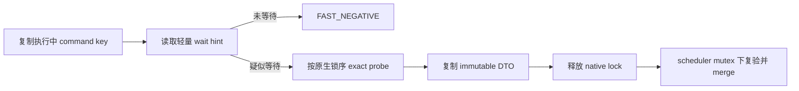
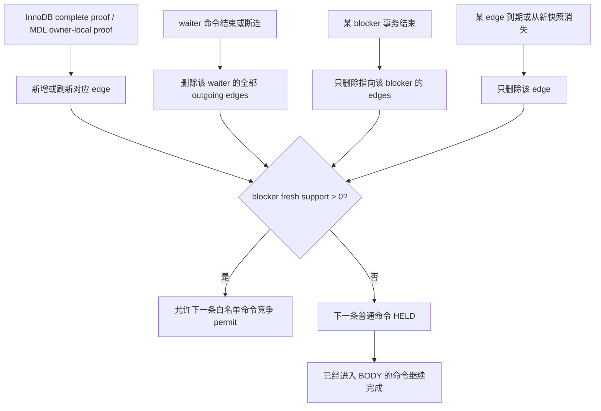
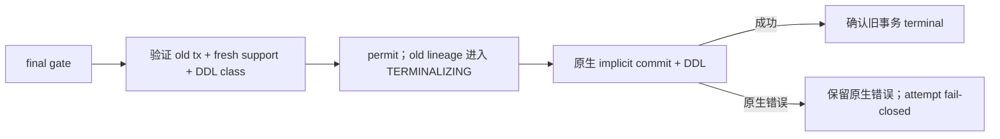

# Preserve/Resume Phase2 锁依赖命令调度设计

> 状态：本功能唯一权威设计稿。当前实现仍在验证中，尚未签署；此前未签署的 WIP 已隔离备份，不是本文的实现基线。代码只有逐条满足本文并通过新鲜回归后才能视为符合设计。
>
> 范围：只改变 standby-transfer source 在既有 Phase1 readiness 到 `WARMCOPY_CLOSING` 接缝中的命令准入，并输出由 owner/deadline/proof/identity/invariant 决定的 scheduler terminal result。scheduler 作为现有 drain owner wait loop 内的一种 readiness policy 运行，不成为新的顶层流程。除 2.5.1 的 pre-HARD 可丢弃 Phase1 候选刷新，以及 3.1 为保持同一旧事务身份而对 dependency batch target predicate 做的窄对齐外，成功路径唯一允许产生的行为变化是 `HELD / PERMIT / 4020 / HARD`。2.5.2 是另行批准、与 scheduler mode 无关的 source orchestration 优化：它不属于调度算法，也不改变 transfer/receiver 协议、参数、authority 或 ACK 语义。
>
> 前置基线：`9c6e6b1f193dcf44ad1dad8f285baabe90aab088`。该基线的 `sql/preserve_trx_transfer.cc` SHA256 为 `f1766d499c0dee109fc63bf3c675b76779b5a5d647d233598d6d1b53bc1f171f`，`unittest/gunit/preserve_trx-t.cc` SHA256 为 `2572412329284d0920d788dac509a1d6c8ed3d2a05e17e578580f0927e0997bd`；本功能必须保持二者不变，也不新增或修改 Unit/GUnit。
>
> 文档关系：此前同主题的旧设计或实施计划均不得作为施工依据；当前分支只保留本文这一份设计。本文对应的从属施工清单为 `Docs/superpowers/plans/2026-08-30-preserve-trx-phase2-command-scheduler-implementation-plan.md`；计划只能展开本文，若二者冲突一律以本文为准，不能引用旧状态机、旧行号或旧测试门禁。

---

## 1. 要解决的问题

进入 Phase2 后，如果简单冻结所有连接，可能出现确定性的自等待：

```text
waiter 的旧命令正在等锁
  -> blocker 的旧事务持有这把锁
  -> blocker 的下一条命令也被 Phase2 冻结
  -> blocker 无法继续执行到 COMMIT/ROLLBACK
  -> waiter 永远不能结束
```

新模式只做一件事：周期性识别仍在执行且正在等锁的命令，找出其全部已验证 blocker transaction，并允许这些 blocker 继续执行有限白名单命令，尽快到达事务边界。


调度器不替客户端提交事务，不猜测客户端下一条命令，也不构造通用全局锁图。

---

## 2. 启用范围、模式与非干扰契约

本节是全文最高优先级的实现边界。其它章节若与本节冲突，以本节为准。

### 2.1 启用范围与模式

启动期只读参数：

```text
rds_preserve_trx_standby_phase2_scheduler_mode =
    LEGACY_READINESS_THEN_CLOSING
  | DEPENDENCY_CONVERGENCE_V1
```

- 产品默认：`DEPENDENCY_CONVERGENCE_V1`；
- 运行中不可修改，DRAIN 开始时冻结；
- 只在 `preserve_trx_enable=ON` 且 artifact mode 为 `STANDBY_TRANSFER_SAVE` 的 source 创建调度器；
- Preserve MTR suite 默认显式钉在 `LEGACY_READINESS_THEN_CLOSING`，只有新增调度器用例逐例 opt-in；
- OFF、legacy、local carrier、receiver 和 promotion 保持原行为。

### 2.2 唯一允许的行为变化

dependency scheduler 只拥有 command admission：

```text
观察 T0 / command scope / lock wait
  -> 维护 support 与 permit
  -> 对尚未进入 BODY 的命令裁决 HELD、PERMIT 或 4020
  -> 在命令收敛后发布 HARD
  -> proof/identity/invariant 不确定时只发布自身 SAFETY_ABORT
```

它不拥有事务保存、锁对象镜像、token、传输或接收端生命周期，也不能把下游 progress failure 重分类为 scheduler abort。调度器造成的成功路径下游差异，只能来自“哪些客户端命令获准进入 BODY”这一项输入差异；命令一旦到达相同事务边界，后续行为必须回到既有流程。

### 2.3 事务边界轨迹等价

这里的“ZERO_DIFF”不只表示最终结果相同，还包括下游算法不被改写。判断方法是：如果两次运行在既有 `WARMCOPY_CLOSING` 入口具有相同的 authoritative input facts，那么从该入口开始必须满足同一 **normalized pipeline contract**：源码中的代码路径、ordered anchors、参数元组、错误出口及其 def-use 与前置基线一致，运行时 authoritative outcome 和既有数值门禁通过。既有并发 worker 的合法交错、完成顺序和时间戳不要求逐事件相同。本文不新增 runtime pipeline-trace/signature 发射器；否则为了证明不干扰又会向下游引入一套观察流程。dependency 在入口以前改变了哪些命令获准执行，因此可能改变到达入口的时刻或事务事实；这种上游差异必须计入严格 SLO，但不能成为下游按 mode 改参数、改调用点或换算法的理由。

必须保持不变的内容包括：

- target/survivor 选择、token identity、source authority、detach 和 source restore；
- warmcopy current-record-store、最终 seal、fallback 和 prewarm 的执行者与节奏；只允许 2.5.1 的 owner-local Phase1 候选刷新，以及 2.5.2 明确列出的 mode-independent source ordering；
- early staging 的启动时机、worker 并行度和 command-boundary enqueue；
- active/pending progress 的参数、minimum delta、idle/final-HWM 分类；
- batching threshold、batch 聚合、flush、ACK、publication 和 retry；
- final metadata、receiver bind/READY、promotion 及 cleanup 生命周期。

因此，“协议格式没有变化”不足以证明兼容；把原来的大批异步发送改成细碎同步发送，增加 mode-specific seal/rebuild，或改变既有 staging/worker 的调用 anchor、并行度和策略，同样违反本设计。既有 worker 的自然完成顺序差异不属于违反。

### 2.4 禁止的跨域所有权

scheduler 不得直接或间接：

- 调用 preserve、warmcopy、transfer 或 receiver progress；
- 向这些模块传递 held session、support、permit、scheduler mode 或 scheduler callback；
- 根据 scheduler 状态改变 `finalize_idle`、`allow_stale_rebuild`、`defer_ack` 等既有参数；
- 发起 flush、等待 ACK、publish/abort token，或改变 final-HWM 路径；
- 改变 worker 数量、batch cadence、seal/fallback/prewarm 或 receiver lifecycle；
- 让下游模块反向查询 scheduler ledger 或以 scheduler mode 选择不同算法。

这里的“scheduler 不得调用”约束仍然成立：2.5.1 只允许 scheduler core 发布不含 lock/token/transfer 状态的稳定边界提示；真正的候选刷新仍由现有 drain owner 调用现有 Phase1 API。任何把 HELD、support、permit 或 lock graph 直接变成 transfer target/progress 参数的实现仍属越权。

`LEGACY_READINESS_THEN_CLOSING` 和 OFF 路径必须保持前置基线的 caller 参数和调用顺序。共享 caller 不能因为新增 dependency 分支而改变 legacy 行为。

### 2.5 嵌入既有 readiness→CLOSING 接缝

dependency scheduler 是既有 drain owner 的命令准入/readiness 子策略，不是 preserve/transfer pipeline 的新 owner。集成点就是当前 `preserve_trx_wait_for_phase1_readiness()` 的调用位置：进入点以前和返回以后均保持原代码顺序，dependency 只替换 wait loop 内的 readiness 判定。

```text
Phase1 既有 prepare / manifest / flush
  -> 同一个既有 drain owner 进入 pre-CLOSING wait loop
       * LEGACY：执行原 long-command readiness sample
       * DEPENDENCY：每 5ms 调用一次有界 scheduler tick
       * 两种模式：原 active-binlog progress 仍由 owner
         在原调用点、以原参数和原 50ms cadence 推进
       * DEPENDENCY：owner 在 tick 前消费已退出 BODY 的稳定边界提示，
         以既有 Phase1 API 合并刷新可丢弃 record candidate
  -> readiness/scheduler 返回 terminal result
  -> 原 reset/owner/progress-failure 分支
  -> 原样发布 WARMCOPY_CLOSING
  -> 原样形成 authoritative target set
  -> 原样执行 pending observer、early workers、preserve、transfer、receiver
```

这里没有 scheduler 自己的阻塞式 owner loop，也没有 scheduler callback 去驱动 progress。现有 drain owner 每个 iteration 独立检查 progress 与 readiness/scan budget；每轮最多先执行一次原 active progress，再执行至多一个 scheduler tick 或 legacy sample，最后进行有界 poll wait。即使一次 progress callback 自身超过 50ms，也不能在同一 iteration 里循环调用 progress 而饿死 scheduler；下一次 progress 仍由后续 owner iteration处理。scheduler 只返回自己的状态，progress failure 仍由 owner 沿原分支处理。

本文所谓“原 50ms cadence 不变”是指原 caller、50ms minimum interval、时间戳更新点、参数和错误出口均不变，不承诺同步 callback 在过载时仍能形成精确 50ms 墙钟周期。scheduler 允许的唯一附加调度延迟是一次 owner iteration 中至多一个 `2000us` tick；它必须进入严格 2 秒区间和 deadline-cross telemetry，不能通过 mode-specific progress 参数把这段开销转移到下游。

到达接缝后先按 attempt 已冻结的 mode 分支。`LEGACY_READINESS_THEN_CLOSING` 立即以原参数调用原 helper；调用点不增加外层 reset/killed/deadline precheck，不发布 route/T0，也不改变原 helper 内 `DEBUG_SYNC` 的相对顺序。只在 `DEPENDENCY_CONVERGENCE_V1` 分支执行下面的 first-winner 协议：进入 wait loop 前先检查 existing reset、owner killed 和 absolute deadline，再发布 handle/T0；pre-T0 已过期时沿原 deadline 结果返回，不创建 scheduler attempt。被动的 final-record 时间采样可以紧邻分支，但不能参与 legacy 决策。

dependency 的 T0 没有 executing/pre-gate/admission 时直接正常 HARD，不额外调用 progress。等待期间每轮依次检查 reset/owner killed/absolute deadline、到期的原 progress、到期的 scheduler tick，再决定 terminal 或 bounded wait。这样 dependency 不改变既有控制错误的优先级，也不会让空集合多推进一次 transfer progress。

Phase1 participants 在整个 dependency 收敛期间继续保持原生命周期，mutation hook、current-record-store 和既有 active-binlog progress 持续工作；scheduler core 不 seal、rebuild、flush 或发布任何对象。现有 owner 只可执行 2.5.1 的可丢弃候选刷新。scheduler terminal 后，代码直接回到原有 CLOSING 续点，不允许为了 dependency mode 提前 CLOSING、提前 authoritative collection、提前 preserve，或把下游权威步骤搬进 wait loop。2.5.2 发生在既有 CLOSING worker scope 内，对 legacy 与 dependency 使用完全相同的条件和顺序。

若严格 2 秒或 mixed 双 500ms 未通过，scheduler 本身仍只能优化采样、证明、ledger、owner-wait 开销及 2.5.1 的候选刷新聚合。压力证据已证明主要长尾来自 Final-HWM sender 与 external staging 争用同一 source epoch session，因此另行批准 2.5.2 的 mode-independent source orchestration 优化；关闭 scheduler mode 时它同样生效，并须单独证明兼容性。除 2.5.2 外，不得再改变 CLOSING 后 preserve/transfer/receiver cadence 来补偿。

command capture 与 active scheduler handle 是两层不同的事实。启动期固定的 `source_capture_enabled` 只由 Preserve ON、dependency mode、standby-transfer artifact 以及启动期只读的 outbound source-role 配置决定；不依赖当前 attempt、瞬时 credential readiness 或 receiver runtime state。它必须在 source 接收业务命令时就以独立紧凑 POD 记录 aggregate command sequence/stage，否则 T0 无法区分 Phase2 前已进入 BODY 的命令。OFF、legacy、local carrier 和 receiver 在启动期缓存布尔的第一分支直接返回；不取 scheduler mutex，也不改写现有 legacy depth/sequence 的含义。

active scheduler handle 只在 dependency owner 到达本次 readiness 接缝时发布，只供 BODY 前 command gate、command-exit/teardown 薄钩子、4020 response hook 和 drain owner tick 使用。无 active handle 时，source capture 可以复用已有 `LOCK_thd_data` 临界区更新 POD，但不取 route/scheduler mutex。HARD 先让 gate 确定 CUTOFF，命令随后退休 scheduler record 和 inflight marker。对 active dependency route 下的 4020，公共 `done:` 暂不调用 `send_statement_status()`，但必须继续完成原生 audit、Performance Schema、query/memroot 和 command cleanup 并从本次 `dispatch_command()` 返回；连接线程进入下一次 `do_command()`、尚未清空上一条 diagnostics 或读取新 packet 的真实 idle 边界时，薄 hook 才发布 `m_server_idle` 与 pending-quiesce boundary、等待 attempt latch，并在 latch 打开后发送上一条 4020。这样 target worker 只会接管已经完全退出旧 command 栈的 THD，而客户端在 prune 前仍看不到 4020。严禁在旧 `dispatch_command()` 尚未返回时提前写 `m_server_idle=true`；那会让 preserve worker 与旧 command cleanup 并发并破坏既有 warmcopy/transfer 状态。owner 仍按原顺序发布 `WARMCOPY_CLOSING`，在原 `g_closing_target_classification_mutex` 临界区完成 authoritative target counter 和 exact transaction-target pin；counter/pin 只建立响应安全资格。owner 继续原有 pipeline，并在既有 `abort_phase1_transfer_targets_not_quiesced()` 成功返回后向 scheduler 发布不含 target/token 数据的 response-release 事实并退休 route。accepted-before-CLOSING packet 的初始分类仍等待原 classification mutex；`COM_QUIT`/`COM_STMT_CLOSE` 等无响应 cleanup 和静默 LONG_DATA cutoff 不进入 response wait。这不是新 collector：dependency 成功路径只是把原 early pipeline 的同一次 lifetime-pin collection 前移，其结果原样 move 给后续已有 worker scope；非 early 路径则作为 owner-local lifetime guard 保持到本次 drain 退出。此后仍由原 command cutoff 和原 target pipeline 接管；下游 owner 不查询 scheduler ledger，也不接收 scheduler mode、held/support/permit 集合或回调。

从 `WARMCOPY_CLOSING` 开始，preserve、warmcopy、transfer、receiver 的执行逻辑中不得出现以 dependency mode 或 scheduler state 选择流程/参数的分支。唯一允许跨过该边界的是上述 command-response release handoff、为其前置的 owner-local exact target lifetime-pin guard、attempt 自身的 callback lifetime 引用，以及 HARD terminal publication 时冻结的 owner-local、diagnostics-only snapshot。pin guard 只保证 counter 已选中 THD 在 4020 可见后不会先于既有 pipeline teardown，不改变 target 集合、target state 或任何 downstream 参数；response-release 本身不携带或读取 target 集合，只表达“既有 non-survivor prune 已成功返回，可以暴露早已确定的 4020”。snapshot 只能含 `attempt_id`、frozen attempt `mode`、`generation`、scheduler terminal/timing、eligible BODY count/digest/last key/last timestamp/coverage state 和守恒计数，不含 ledger、support、permit、target 或任何 callback，跨过 CLOSING 后也不再更新。`mode` 只用于 final-record 验收证明本次实际运行的策略，不能被下游读取或用于分支。整个 snapshot 只供 summary/final-record logger 读取，preserve、warmcopy、transfer、receiver 及其错误处理均不得读取或据此决策。

### 2.5.1 pre-HARD 可丢弃 Phase1 候选刷新

压力证据表明，初始 Phase1 已建立的 record candidate 会被 T0 后尚在 BODY 的命令继续修改；最终 fence 因而正确拒绝旧候选，survivor 又集中在 HARD 后现场物化。正确优化不是放松 fence，也不是提前 transfer authority，而是在 T0 已处于原生命令边界，或命令退出 BODY 后旧事务仍 active 时尽早刷新候选，使大部分工作与其它命令的收敛重叠。

```text
T0 观察到 idle-active 旧事务，或 command BODY 原生退出且旧事务仍 active
  -> scheduler ledger 按 connection incarnation 合并一条稳定边界提示
  -> 同一 drain owner 在下一次 tick 前取走一批提示
  -> 重新 pin 并复核 incarnation、Phase1 declared token 和存活状态
  -> 调用既有 prepare_phase1_record_scan_target()
  -> 通过窄 candidate API 记录同一时点的 live fence
  -> 通过既有 Phase1 batch sender 合并发送，并在本批结束时 flush
  -> 继续原 scheduler tick；满足条件才发布 HARD
```

这条窄路径必须同时满足：

- 提示只含 `connection_incarnation + command_sequence + thread_id projection`，不含 HELD/support/permit、blocker、token 状态或 receiver 状态；T0 idle-active 提示的 command sequence 为 0，只表示采样时已经位于原生命令边界；同一连接只保留最新提示；新 BODY 开始会使旧提示失效，下一次 BODY exit 再生成新提示；
- 不增加线程、第二 owner、专用 transfer queue 或新协议；本地候选构建及发送均复用本 attempt 已打开的 Phase1 participant/source session/batch sender，保持原 batch options；
- warmcopy 实现只允许新增一个 candidate-local setter：把刚采样的 record live fence 写回同一 Phase1 prebuilt candidate，并复用既有 `attach_record_store_contract()`；owner 同时通过现有只读 API 传入该 token 已 presealed 的 publication generation，setter 沿用既有 replacement 规则，必要时推进到 `old+1`，绝不以相同 generation 发送不同 descriptor。该 setter 不 seal、不读取 scheduler、不改变旧调用者；legacy/OFF 不调用它。除这个明确命名的加法接口外，warmcopy 原有方法、分支、参数和调用次序仍受 ZERO_DIFF 约束；
- 每批对同一 token 最多产生一个 replacement，并在允许下一批重建同名 warm blob 前完成该批 flush，避免 queued descriptor 与被替换文件错配；
- candidate 仍是可丢弃优化。任何 pin、采样或 freshness 复核未命中都只落回既有 HARD 后 final-fence/live fallback；不得降低最终 fence，也不得改变 authoritative survivor。未消费的 stable-boundary hint 也不得延迟 `HARD_QUIESCENT`：owner 每轮尽力消费，HARD 发布时直接丢弃剩余 hint；
- transport/enqueue/flush 的真实失败继续走现有 `PROGRESS_FAILED`/source restore 分类，不得伪装成 scheduler `SAFETY_ABORT`；
- 不执行 detach、snapshot、token terminal/abort、final metadata、FINAL ACK、receiver bind/READY；不改变原 active progress 的 `(false,false,false)` 参数、50ms cadence及 CLOSING 后任何调用点；
- owner iteration 保持 `原 active progress -> boundary refresh -> scheduler tick`。T0 collector 在同一 attempt mutex 内完成 idle-active 事务登记后发布初始 hint；command exit 在同一 mutex 内先发布后续 hint、再把 command stage 置为 `IDLE`。任何命令进入 BODY 都先删除该连接的旧 hint；owner 取提示时还要排除 `ADMISSION_INFLIGHT/T0_CLAIMED_PRE_GATE/PERMIT_RESERVED/EXECUTING` 等非稳定 stage。normal tick 若看到 `EXECUTING=0` 但仍有未消费 hint，必须返回 `RUNNING`，让同一 owner 再完成一次 boundary refresh 后才可发布 HARD。absolute deadline 仍具有最高优先级，不等待候选刷新；刷新耗时计入同一个 deadline 和严格 SLO。HARD 发布后不再接受或消费提示，后续完全回到原流水。

因此这不是把 transfer pipeline 搬进 scheduler，而是让现有 Phase1 的 speculative candidate 在最后一批业务 BODY 退出后仍有机会保持新鲜。正确性只依赖原 final fence；性能收益才依赖候选命中率。

### 2.5.2 mode-independent Final-HWM 与 external staging 去争用

full-pressure RED 已把严格尾部分成 `BODY→HARD=127ms` 与 `HARD→FINAL_ACK=2.109s`；CLOSING worker 中 external staging 的聚合等待占主导。根因是 worker 已把 final-HWM 放入既有 batch sender 后，立即执行逐对象同步 staging；sender 与 staging 在同一个 source epoch session 上相互排队。这里不新增算法；worker 仍逐 token 尽早产出 candidate，现有 coordinator 把当前已完成的一批 candidate 作为一个 wave，依次执行两道 barrier：

```text
某批既有 worker：preserve/capture candidate，并 enqueue final-HWM
  -> existing coordinator 对当前 completed-candidate wave 做第一次 flush
  -> 逐 candidate 验证 exact descriptor，并发布已 ACK 的 HWM fact
  -> 对该 wave 执行既有 external-object staging
  -> existing sender 对该 wave 做第二次 flush，并发布已 ACK 的 prewarm LSN fact
  -> 该 wave 标记 staged；其余 BODY 未结束时继续形成下一 wave
  -> 全部 target 完成后，沿用原 final fence、candidate finalize、epoch commit、FINAL ACK
```

这项优化必须同时满足：

- 不读取 scheduler mode、attempt、HELD/support/permit 或 lock graph；legacy 与 dependency 在相同 authoritative input 下进入完全相同的两道 barrier；
- 只调整 `sql/preserve_trx.cc` 既有 early-pipeline worker/coordinator 的 source ordering；`sql/preserve_trx_transfer.cc/.h`、receiver、wire protocol、batch options、inflight 上限、chunk size、ACK 分类及 authority 状态机保持逐字不变；
- 第一批 flush 失败、descriptor 不匹配或 publication 失败时，绝不开始 external staging；external staging 或第二批 flush 失败时继续走原 fail-closed epoch cleanup；
- 不得等待全部 worker join 才处理第一批 candidate；一个 token 完成两道 barrier 后，原 `early object sealed before another BODY boundary` 能力和 DEBUG_SYNC 含义必须保持；
- candidate 在第二批 flush 以及 `token_prewarm_lsn_fact()` 成功前不得成为 `external_objects_staged`，finalize 仍拒绝任何未完整 staging 的 candidate；
- pending final-HWM descriptor 在第一次 flush 与 exact preseal 验证后继续存活，必须传给该 candidate 的 external staging，且只能在 staging 成功后清除；
- RESET 或任一 barrier 失败必须先 cancel/abort sender，再释放 sender；不得让析构路径 flush 未确认的 seed；
- 不提前 detach、authoritative target collection、final metadata、epoch commit 或 FINAL ACK；不改变原 final fence、dirty replacement 和 token-local failure 规则；
- source-shape 门禁把这一个 ordering span 作为独立批准例外规范化；不得用更新整文件哈希掩盖 span 以外的漂移；
- 先用已有 mixed full-pressure 保留 RED→GREEN，再在同一 release binary 上分别验证 legacy/dependency，最后执行五轮 300 秒 dependency sysbench。短烟测只用于快速否定，不得签署 500ms 门禁。

它解决的是既有 source pipeline 的锁队列争用，不是让 scheduler 接管 transfer。即使 dependency 模式关闭，优化仍保持相同，因此 scheduler facts 不会经由别名、参数或时序分支流入下游。

### 2.6 “能力不丢失”是约束，不是第二套实现

下表只声明 dependency 模式必须保持的既有能力，用于代码审计和回归验收；它不授权在 scheduler 模块中重新实现这些过程：

| 既有 owner | 必须保持的能力 | scheduler 允许做什么 |
|---|---|---|
| drain participants | `open_phase1`、continuous capture、late prepare、`close_phase1`、ready/preflight、finalize/abort/failed-shutdown cleanup | 只发布稳定边界提示；2.5.1 的刷新仍由既有 owner 执行 |
| per-target preserve | validation、binlog/lock/temp-table preflight、UNDO prepare、detach、snapshot、record register、失败 reattach/rollback/taint | 只提供该连接的命令准入结果 |
| transfer source | epoch/target/object declare、record/binlog stream、batch/flush/publication、preseal/final-HWM、final metadata、`COMMIT_EPOCH`、FINAL ACK | 无 |
| source ownership | `RUNNING/HANDOFF_PENDING/COMMIT_UNKNOWN/COMMITTED_HANDOFF`、`NOT_COMMITTED_CLEAN` restore、quarantine/HA resolution | 无 |
| receiver | auth/nonce、sequence/digest/idempotency、parallel apply/seal、final-spool ACK、epoch fact/CAS、bind/prewarm/READY、tombstone/cleanup debt | 无 |
| promotion/resume | accepted epoch、session-only/token classification、promotion lease/adopt、后续 RESUME | 无 |

实现上的直接推论是：scheduler 新文件只能保存 command/transaction ledger、support、permit、scan microstate 和 terminal result；不得包含 preserve/transfer/receiver 的 adapter、镜像状态机、专用 worker、专用队列、重试、补偿或 cleanup。需要保持某项下游能力时，只能继续调用现有 owner 的原实现，不能在 scheduler mode 下派生一套“优化版”实现。

这张表也不重定义既有协议里程碑：`final metadata accepted <= terminal commit admitted <= final-spool ACK <= bind/prewarm READY` 的顺序不变。final-spool ACK 仍只是 receiver admission/spool 里程碑，当前进程接受也不等价于 crash durability 或 physical promotion-ready；source authority 仍由原 terminal ownership 状态机裁决。send 前失败、`NOT_COMMITTED_CLEAN`、`HANDOFF_PENDING`、`COMMIT_UNKNOWN`、quarantine 和 cleanup debt 的含义与处理顺序都保持原样；scheduler 既不推进，也不折叠这些状态。

### 2.7 前次 WIP 的失败复盘：问题是越权，不是锁图慢

这段复盘是本设计必须长期保留的工程约束。历史 WIP commit `220dc32747b8e29d731a911b9f618dede6838102` 只作为源码取证身份，不是实现基线。该源码原本要解决命令自等待，却让 scheduler-derived facts 进入了成熟的 transfer pipeline：held connection 被转换成 fine-progress target，dependency mode 改写 active/pending progress 参数，scheduler progress callback 直接 `abort_token()` 并修改 token/session-only 集合，token selection 也按 scheduler mode 换算法。阻塞式 `run_owner_loop()` 又同时持有 readiness、progress callback 和 terminal arbitration，使“命令何时收敛”与“传输怎样推进”不再彼此独立。这个越权数据流由 Git 对象本身证明，不依赖临时性能日志。

历史 r28 是一次被 SIGINT 中断、没有最终 report/oracle 的 full-pressure forensic observation，不能算本文 11.3/11.4 的正式 RED，也不得替代代码冻结后的新鲜验收。它的 source 原始诊断仍能缩小原因范围：173 次扫描只看到 224 个 fast-negative candidate，exact probe 和 support edge 都是 0，scan 总耗时只有 `142us`、单次最大 `11us`；但 pre-CLOSING policy 持续 `37.641548s`，其中 169 次 owner progress callback 共耗时 `28.087395s`，占 `74.62%`。同一 observation 还记录了 609 次 network send/batch、batch bytes p50 为 37,568、record batch 平均 6 个 token，以及旧口径 transfer tail `742.574ms`。这些数字足以排除“lock scan 是该长尾的主要耗时”，并与上述 progress/batching 越权机制一致；单次 observation 本身不独立证明每个发送动作的因果，也不证明 receiver READY 曾经退化。

```text
scheduler mode / HELD 集合
  -> 被送入 progress target、参数或 token 逻辑       （越权点）
  -> batching、final-HWM、flush/ACK、early staging 可被改变
  -> 已观测 source progress/transfer tail 退化；receiver-ready 也进入风险域

正确边界：
scheduler mode / HELD / support / permit
  -> 只到 command gate 与只读诊断
command-exit 稳定边界提示（不含上述策略事实）
  -> 既有 owner 刷新可丢弃 Phase1 candidate
  -> 原 final fence 决定采用或 fallback
  -> 完全既有的 CLOSING 与下游流水
```

因此，后续 review 必须执行“传递污染检查”：从 scheduler mode、handle、HELD、support、permit 和 terminal result 出发，枚举其全部直接和间接消费者。除 command gate、command lifecycle 薄钩子、owner readiness tick 和 diagnostics-only 字段外，只要它们影响 target/cohort、progress 参数或 cadence、worker/queue、token、seal/rebuild、batch/flush/ACK、receiver/READY 或 cleanup，设计立即判定越界，不接受“只是复用 callback”“只改共享 caller”或“协议格式未变”的解释。

防复发门禁不是单看 dependency 跑通，而是同时满足三项：前置基线与新 binary 的 legacy protected-source fingerprint 不变；同一新 binary 的 source guard 证明 dependency mode 没有向下游 sink 注入新分支或新 def-use；三层 profile 的既有 authoritative outcome 和明确数值门禁全部通过。任何 preserve/transfer/receiver 优化都必须另立独立变更，在 scheduler OFF/legacy 下同样成立，并单独取得正确性与性能证据，不能作为 scheduler 达标手段夹带实施。历史 observation 只解释为什么设立这些边界，所有交付结论只认 11 章的新鲜门禁。

---

## 3. T0 与“正在执行的命令”

### 3.1 actor 过滤与 T0 登记

进入 scheduler gate 前的固定顺序是：

```text
Preserve OFF / 非 standby dependency mode
  -> system/internal THD
  -> 既有 HA-control connection（含 RESUME/SHUTDOWN）
  -> 当前 drain owner 与原生 no-response cleanup
  -> ordinary business command scheduler gate
```

前四类保持各自既有原生/控制面行为，不进入 T0 cohort、support 或 permit。`COM_QUIT` 和 `COM_STMT_CLOSE` 属于原生 cleanup；dependency RESET 是唯一已批准的控制面例外：允许到达控制处理器，但在调用 ownership `request_reset()` 前返回 unsupported，见 7.3。非 cohort 的 **ordinary business command** 才适用“直接 4020”，不能把这条规则泛化到 owner、system/internal、HA control 或 cleanup。

protocol bypass 必须是 exact enum，而不是“status/control”泛化：ordinary classic connection 只额外放行不进入 BODY 的 `COM_PING`，并保留 `COM_QUIT`、`COM_STMT_CLOSE`、`COM_STMT_SEND_LONG_DATA` 的专门规则。`COM_REFRESH`、`COM_FIELD_LIST`、`COM_STATISTICS`、`COM_PROCESS_INFO`、`COM_CHANGE_USER`、`COM_RESET_CONNECTION` 及其它未列名 ordinary protocol command 都走 generic admission/default-deny；它们若在 T0 前已经进入 BODY，仍作为 `T0_EXECUTING` 原生完成，新到命令则 HELD 后由 HARD 返回 4020。system/internal 或既有 HA-control actor 的 bypass 由 actor identity 证明，不能仅凭 command enum 扩大。

`execute_init_command()` 不能按函数名一概归为 internal：replication `init_slave` 所在 system THD 继续 bypass，但普通 classic business THD 上的 `init_connect` 可以执行任意 SQL、创建事务或持锁。后者必须在进入 direct `dispatch_command(COM_QUERY)` 前建立一个 synthetic aggregate command sequence，并复用同一 text-SQL final gate/exit 协议；若 active attempt 下该连接不属于 T0 cohort，则在 BODY 前 fail-closed。这样 T0 也能识别在 Phase2 前已经进入 BODY 的 `init_connect`，不会留下 direct-dispatch 盲区。

调度器启动时的瞬间称为 T0。T0 会：

1. 冻结 generation、owner 和现有 readiness absolute deadline；
2. 确认当前 attempt 的 scheduler handle 已发布；
3. pin 并登记当时仍活跃的旧事务；
4. 按 exact `connection_incarnation + command_sequence` 登记尚未结束的 aggregate business command；`thread_id` 只作可读诊断字段；
5. 区分该命令是否已经越过 Preserve protocol/final execution gate。

T0 不暂停业务线程。所谓“冻结命令”只是把身份和阶段复制到 attempt ledger，原命令仍按 MySQL 原生路径运行。

publication 与枚举必须闭环：先发布 handle，再枚举 THD；发布后到达 gate 的命令按 exact sequence 自登记；枚举期间先到达的 command-exit/teardown 事实按 sequence 暂存；`finish_t0_registration` 在同一 scheduler mutex 下合并这些事实后才允许正常 HARD。不存在“handle 已可见但命令既未自登记、也未被 T0 枚举”的窗口。

T0 对每个当时已经 active 的旧事务——无论连接正在执行命令还是 idle at command boundary——先预留唯一 old ordinal，并记录 `PENDING_T0_ACTIVE_IDENTITY + candidate raw engine cookie`。这是 T0 transaction-presence fact，不是 exact engine identity；SQL 层不读取 version，已经分配但仍处于 `TRX_STATE_NOT_STARTED` 的可复用 `trx_t` 指针也不能被解释为 active engine identity。后续 lock_sys exact probe 或该连接自己的下一条 command gate/exit owner-thread snapshot可以用相同 raw cookie 原子封印这个 **已在 T0 创建** 的 ordinal。

当 SQL old transaction 仍 active 而 owner-thread engine snapshot 为 `NONE` 时，ordinal 必须继续保持 pending：TX_END 仍可按原生语义关闭它；有 MDL support 的白名单命令也可进入 BODY，并在首次观察到 `EXACT_ACTIVE` 时封印。只有 SQL old transaction 已真实终结才关闭 ordinal。第一次 `NONE -> EXACT_ACTIVE` 是合法的 InnoDB lazy-start 生命周期；一旦 exact identity 已封印，再观察到 `NONE`、不同 cookie/version 或不稳定 lifecycle 才 retry/UNKNOWN/fail-closed。pending ordinal 未封印前不能参与 InnoDB blocker identity proof，但可以作为 owner-local MDL transaction blocker。这样既覆盖“DML 已完成、连接 idle、旧事务仍持锁”，也不会把正常的 `BEGIN -> first DML` 误报为 4013。

这里的 T0 transaction-presence 只读 SQL/handlerton-owned facts：在 `LOCK_thd_data` 下复制 active multi-statement 状态、`OPTION_BEGIN`/`OPTION_NOT_AUTOCOMMIT` 与已有 session-scope InnoDB participant/raw cookie。不能只复用当前较窄的 `preserve_trx_has_explicit_active_transaction()`，否则 `SET autocommit=0; UPDATE ...` 后 idle 的持锁 blocker 会漏出 scheduler cohort；也不能在这里读取 `trx_t::state/version`。

同一事实必须在 dependency 模式的 authoritative batch boundary 保持一致：只要 `in_active_multi_stmt_transaction()` 为真且 option 为 `OPTION_BEGIN` 或 `OPTION_NOT_AUTOCOMMIT`，该连接都仍是 transaction target，pending command 退出时发布 `QUIESCED`，不能发布 `DRAINED_NO_TRANSACTION`。否则 scheduler 已登记的真实 `autocommit=0` 旧事务会在 HARD 后被 batch 层误当成 session-only，而现存 handlerton participant 又会使 session-only 校验失败并返回 4013。实现只能在新 scheduler 文件提供这个 mode-gated predicate，并由既有 target counter、pending-boundary publisher、QUIESCED/ATTACHING validation 薄调用；Legacy/OFF 仍使用原 `preserve_trx_has_explicit_active_transaction()`。它不改变 target 之外的 session-only 规则，不忽略 participant，不修改 token、warmcopy、transfer 或 receiver 算法。

旧事务 lineage 另有且只有一个真正的 late-adoption 例外：某 exact `T0_EXECUTING` sequence 在 T0 枚举时尚无 active engine transaction（例如 `autocommit=0` DML 已过 BODY gate但尚未在 InnoDB start trx），其 slot 记为 `PENDING_T0_BODY_FIRST_TX`。只有该同一 sequence 的 exact engine sample 或 command-exit callback 可以原子创建它在本 BODY 内产生的第一份 old ordinal；任何 T0 后新 command 都不能据此创建 ordinal。sequence 退出仍无事务就把 slot 关闭为 no-transaction；观察到第二个不同 engine identity则 fail-closed。必须区分“封印 T0 已预留 ordinal”和“为 T0 BODY 首事务 late-adopt 新 ordinal”。

T0 是 existing pre-CLOSING owner wait loop 的一次初始化，不是新的 phase。登记完成后，同一 owner 立即做首轮 scheduler tick，并在后续 wait iteration 中按 5ms deadline 再调用 tick；只有 scheduler 返回 terminal result 后，原代码才继续发布 `WARMCOPY_CLOSING`。

### 3.2 BODY 的精确定义

本文的 BODY 是一个 aggregate business command（network packet 或 ordinary `init_connect` synthetic command）已经进入 native/SQL 执行路径后的范围：

- text SQL：final SQL gate 放行之后；
- prepared statement：`mysql_stmt_precheck()` 成功之后、进入 `mysqld_stmt_execute()` 之前；
- 其它有响应的普通 protocol command：existing protocol gate 完成 BODY commit 之后；
- SQL/PS 结束点：同一 command sequence 的现有 aggregate inflight depth 归零；
- 其它普通 protocol command 结束点：该 command 的 switch BODY 已返回、进入 common `done:` 后且尚未发送 statement status；
- 成功创建并真实委托给 post-response BODY 的 `COM_CLONE`：`execute_server()` 真实返回之后；未成功委托的 `COM_CLONE` 仍按 common `done:` 结束。

T0 只分两类：

```text
T0_PRE_GATE
  命令已经收包，但尚未越过执行 gate。
  不参与锁等待扫描；到 gate 后按新命令规则裁决。

T0_EXECUTING
  命令已经越过执行 gate，正在原生执行。
  参与锁等待扫描，并且整个命令必须保留原生结果。
```

已进入 BODY 的命令永远不能被改写成 4020。support 过期、waiter 断连或 HARD 到来，都只能影响下一条尚未进入 BODY 的命令。

### 3.3 唯一准入线性化协议

每个 aggregate command sequence 只使用下面一套 admission microstate：

```text
IDLE
  -> ADMISSION_INFLIGHT
       -> T0_CLAIMED_PRE_GATE
       -> HELD -> PERMIT_RESERVED -> EXECUTING
       -> CUTOFF
       -> NATIVE_PRE_BODY_EXIT
       -> WAIT_NATIVE_RESTORE
  T0_CLAIMED_PRE_GATE -> HELD | PERMIT_RESERVED | CUTOFF |
                         NATIVE_PRE_BODY_EXIT | WAIT_NATIVE_RESTORE
  PERMIT_RESERVED -> HELD（support-dependent permit 失去 support）
  ADMISSION_INFLIGHT / T0_CLAIMED_PRE_GATE / HELD / PERMIT_RESERVED
       -> CUTOFF（normal/deadline HARD）
  ADMISSION_INFLIGHT / T0_CLAIMED_PRE_GATE / HELD / PERMIT_RESERVED
       -> WAIT_NATIVE_RESTORE（owner/safety abort）
  EXECUTING / CUTOFF / NATIVE_PRE_BODY_EXIT -> IDLE（exact retirement）
  WAIT_NATIVE_RESTORE -> IDLE（restore publication 后重走 native admission）
```

- dependency source 在收到每个有响应的 ordinary aggregate network command 后，必须先在独立 POD 中发布 `ADMISSION_INFLIGHT(connection_incarnation, sequence)`，再第一次读取 active routing handle；普通 business `init_connect` 在 direct dispatch 前以相同方式发布 synthetic sequence。这个 sequence/stage 不复用或改写现有 legacy readiness marker 的语义；
- T0 必须先发布 handle，再枚举 THD；T0 对 `ADMISSION_INFLIGHT` 的 claim 是 CAS 到 `T0_CLAIMED_PRE_GATE`，而 `T0_PRE_GATE/T0_EXECUTING` 只是 attempt ledger classification，不是另一套 per-THD stage。T0 claim、HARD cutoff 与 command 的 BODY commit 使用同一个原子 stage/CAS 协议，并在 scheduler 慢路径中由同一 mutex 复验 generation；
- BODY commit point 按 command class 唯一确定：text SQL 在 final SQL gate；`COM_STMT_EXECUTE` 的 generic protocol gate 只保持 admission，先运行只做 statement-id/parameter-count 校验的 `mysql_stmt_precheck()`，成功后用 `stmt->lex` 分类，并在进入 `mysqld_stmt_execute()`/reprepare 之前完成 permit 与 BODY CAS；其它有响应的 ordinary protocol command 在 existing protocol gate 完成 BODY CAS。三类都通过同一 stage/CAS 把本 sequence 转为 `EXECUTING`；prepared statement 后续 final SQL gate只复验并消费同一 sequence，不能再次取 permit或改判 4020；
- command 在自己的 BODY commit point 前必须再次 acquire-load handle。handle/generation 变化、CAS 失败或 stage 已被 T0 claim 时，必须回到 scheduler 慢路径，不能沿用第一次得到的 ALLOW；
- 若 command 的 `EXECUTING` 转换先赢，T0 必须把它登记为 executing；若 T0 claim 先赢，旧 ALLOW 的转换必然失败，只能得到 HELD、permit 或 cutoff；
- 在上述 class-specific BODY commit 以前，原生校验/解析先返回错误时，command-exit 回调以 `NATIVE_PRE_BODY_EXIT` 退休 sequence 并保留原生错误；只有已经先线性化为 `CUTOFF` 的 response-producing command 才返回 4020。PS precheck 位于 BODY commit 之前，precheck 失败保留 unknown-statement/wrong-arguments 等原生错误；parameter binding、execute loop、reprepare/native MDL 位于 BODY commit 之后，其原生结果不再改写为 4020。
- SQL/PS 可以在现有 aggregate depth 归零的 helper 中幂等退休；generic protocol command 在 common `done:` 中、`send_statement_status()` 之前幂等退休。只有 `clone_cmd != nullptr` 且已经真实进入 post-response deferred BODY 的 `COM_CLONE` 才跳过这次 common retirement，并在 `execute_server()` 返回后单独退休；clone allocation/load 失败、进入 switch 前的 native error 或 scheduler cutoff 仍在 common `done:` 退休，不能按 command enum 一律跳过；

因此 HARD 可以留下尚未退出的 admission 记录，但它们必须已经原子冻结为 `CUTOFF` 或异常路径的 `WAIT_NATIVE_RESTORE`，不存在仍可转入 BODY 的裸 `ADMISSION_INFLIGHT`。该协议只扩展现有 per-THD command POD 和 active-handle 慢路径；OFF/legacy 无 active handle 时不取得 scheduler mutex。

---

## 4. 5ms 扫描与锁依赖证明

T0 登记完成后立即把首个 scheduler tick 标为 due；但它仍服从同一 owner iteration 的 progress-first 规则。当前置基线的初始 progress 时间戳为 0 时，owner 先执行一次原 initial progress，再在同一 iteration 运行首个 tick，首个 exact probe 因而发生在该 callback 返回后，而不是抢在它前面。只要仍存在 `T0_EXECUTING/EXECUTING` 命令，后续以 5ms 为周期继续扫描；没有执行中候选时不扫描，T0 空集合仍直接 HARD 且不额外调用 progress。

tick 必须是有界单步：不 sleep、不等待下游、不做阻塞式 native lock 获取。existing owner 仍独占原 active-progress 时间戳和调用决定；owner 只用下一次 progress 最早允许时间收窄本轮 `tick_stop_us`，并告知 scheduler 该 stop 是否由 progress due 截断。scheduler 不读取、更新或重新计算 progress 状态。不能靠推迟 progress 或放大 timeout 掩盖 scan overrun。

固定预算如下：scan period 为 `5000us`，单次 tick 的 wall budget 为 `2000us`，单个 native wait queue 最多复制 256 个 predecessor。未启用 active progress 时 due time 视为无穷大；否则，若下一次 active progress 的最早允许时间落在本 tick 内，`tick_stop_us = min(tick_started_us + 2000us, next_active_progress_due_us)`。每个 exact probe 前都要复验预算，剩余不足 `500us` 时返回 partial round；已经取得 native latch 的 queue snapshot 不在中途切开，实际越过 `tick_stop_us` 记为 overrun。这里的 50ms 是原 callback 的 minimum interval，不是硬实时 deadline；owner 返回后仍按原 callback 条件决定是否执行。tick 先优先重新 probe 已有 fresh support 对应的 live waiter，再从 candidate cursor 继续本轮；“优先”不延长租约：InnoDB edge 只能由新的 COMPLETE exact snapshot 续期，MDL demand refresh 也不能自动续 MDL edge，后者必须由 blocker gate 再做 owner-local proof。预算耗尽就保存 cursor并返回 owner，不增加线程。单个 exact snapshot 超过 predecessor 上限或无法在一次 native snapshot 中完整复制时返回 `UNKNOWN_INCOMPLETE`，不得返回部分正向证明。

每轮带 `round_id`、candidate cursor 和 `complete`。round 开始时在 scheduler mutex 下把当时的 `T0_EXECUTING/EXECUTING` exact `Command_key` 按稳定顺序复制到可复用 snapshot；cursor 只遍历这份不再变化的成员集，新进入 BODY 的 command 留到下一轮，已经退出的 key 在 merge 时 stale-discard。只有整份 snapshot 走完才是 complete，不能在 mutable container 上用 index 推断完整轮。只有 InnoDB waiter 的完整 exact snapshot 才能原子替换其 InnoDB outgoing edge set；MDL 使用 4.2 的 demand-generation 规则。只有整轮 `complete` 后，才能用“本轮未出现”删除旧的 domain fact。partial round、try-lock 失败或 stale-discard 都不能撤销尚未访问 waiter 的 support。`scan_overrun` 与历史命名的 `tick_crossed_unserviced_progress_deadline` 都是 diagnostics-only：后者只记录 tick 返回时已经越过 progress 最早允许时间的次数，不包含越界时长，不能单独作为成功/失败条件。真实 progress failure、scheduler safety fatal 与正式端到端 SLO 仍是门禁。

每轮只允许一个 snapshot in flight：



T0 registration 复用现有顺序：先取 `THD::LOCK_thd_data`，在其下取得一个 opaque external THD lifetime pin/tombstone check并复制 POD；ledger 在 attempt 内持有该 pin。后续 tick 不再逐轮进入 global pin registry。它在 scheduler mutex 下复验 entry 尚未 `RETIRING`/terminal，递增该连接的 `probe_inflight`，再复制 candidate/raw THD 并释放 mutex；这个 borrow 不是第二份 global external pin，而是保证 ledger 的唯一 pin 在 probe 返回前不能被 move/release。tick 随后取 `THD::LOCK_thd_data`，只复制当前 command POD 和 non-allocating ha-data/raw engine cookie，不在 SQL 层锁下解引用 `trx_t::version`；释放 THD lock 后才获取 InnoDB try-X 或 MDL try-read并复制 DTO。释放所有 native lock后，tick 回到 scheduler mutex 复验/merge并递减 `probe_inflight`；若 teardown/terminal 已标记 `pin_release_pending` 且计数降为 0，则由这个最后退出者 exactly-once move pin，退出 mutex 后释放。

teardown/terminal 必须先在 scheduler mutex 下标记 `RETIRING`/terminal、禁止新 borrow；`probe_inflight == 0` 时立即 move pin，否则只置 `pin_release_pending`，绝不等待 native probe。scheduler mutex 不与 THD、external-pin-global 或 native lock 同持，native lock 也不与 THD lock 同持。这样 tick 复制 raw THD 后，teardown 不可能先释放唯一 pin并销毁 THD。

有效期从采样开始计算：

```text
valid_until_us = min(sampled_at_us + 10000us, attempt_absolute_deadline_us)
merge_now_us < valid_until_us
```

10ms 是两个 5ms 扫描窗：正常情况下下一轮会在旧 support 到期前刷新，避免“先 expire、后 scan”的停走空窗；waiter 结束或断连仍通过 callback 立即撤票，不等待租约。snapshot 从采样到 merge 已满 10ms 时 stale-discard，不能从 merge 时刻重新获得完整租约。

未取得 THD try-lock、command sequence 已变化或 snapshot 到 merge 已过期属于 `RETRYABLE_STALE`：本轮不授权，下一轮重试，但不冒充 native proof `UNKNOWN`。只有在身份稳定且已经进入 exact native probe 后仍无法完整证明 holder/release class，才是触发 safety abort 的 `UNKNOWN`；summary 必须分开统计二者。

probe status 到 ledger 的动作固定为：`COMPLETE` 正向结果全量替换该 domain 的已证明事实；`NOT_WAITING/UNSUPPORTED_*` 是完整负向结果，替换为空；`RETRYABLE_BUSY/RETRYABLE_STALE` 与 stale-discard 不合并也不立即撤边，只让旧事实自然到期；`UNKNOWN_*` 不合并任何子集并触发 SAFETY_ABORT。普通 waiter 已结束、换 request 或不再 waiting 是 `NOT_WAITING/RETRYABLE_STALE`，不能误报 `UNKNOWN_IDENTITY`。

### 4.1 InnoDB

`wait_lock` 和 `blocking_trx` 只作廉价 hint。exact probe 在 lock 模块内完成，并在同一锁队列快照中：

1. 重验 waiter 仍处于同一 wait request；
2. 枚举该 request 之前当前全部不兼容的 queue-order predecessors；
3. 将每个 holder 映射为本 attempt 的 exact blocker transaction；
4. 只为已证明在事务结束时释放的锁返回正向 support；
5. 释放 InnoDB 锁以后才交给 scheduler merge。

engine identity 必须绑定 pinned T0 `connection_incarnation`、raw trx cookie/`trx_immutable_id()` 与现有 `trx_t::version`；这里的 version 是每次 transaction start 递增的 `trx_t::version`，绝不能误用随锁增删变化的 `trx->lock.trx_locks_version`。但 `THD::LOCK_thd_data` 只保护 THD/ha-data 取值，不保护 plain `trx_t::version`：T0/scanner 的 SQL 层外部采样只能复制 raw cookie，不能据此宣称 exact identity。

exact version 只允许由两类 native-safe producer 产生：一是在 InnoDB lock_sys exact probe 内，对仍处于同一 wait request/lock queue、在该 native snapshot 生命周期内不可能被复用的 waiter/holder复制 identity；二是该连接自己的 command thread在稳定 BODY gate/exit 上，通过 non-allocating InnoDB helper采样本线程 transaction，helper若观察到 async rollback或 lifecycle transition则返回 retry/unknown而不是半份 identity。外部 T0 对所有已经 active 的事务——包括 idle-active 和 `T0_EXECUTING`——都只登记 raw cookie 与 `PENDING_T0_ACTIVE_IDENTITY`；后续 exact producer封印已预留 ordinal。只有 T0 时尚无事务的 exact BODY 才使用 3.1 的 `PENDING_T0_BODY_FIRST_TX` late-adoption。raw cookie 离开保护区后只作不透明比较，不解引用，也不单独作为 transaction identity。

一个 waiter 请求 X 锁时，可能同时被多个持有 S 锁的事务阻塞。必须在同一轮为全部已验证 holder 建 edge，让它们并行向事务边界推进；不能等第一个提交后再找第二个。

InnoDB 原生 wait 判定会检查 waiter 之前的请求，其中可能包含仍在 waiting 的 predecessor。v1 不递归构造全局锁图：只要同一 request 发现任一不兼容的 waiting predecessor，本 request 整体返回 `UNSUPPORTED_PENDING_PREDECESSOR`，不能只为其余 granted holders 发布一个冒充“全部 blocker”的子集。该 predecessor 自己若也是 executing waiter，会由普通 candidate scan 独立扫描；后续完整轮确认其已获准或已离队后，再重新证明当前 request。

以下结果不授权：

- holder 不属于 T0 cohort；
- `LOCK_AUTO_INC`；
- RC/RU statement-release record lock；
- identity 或 release class 无法证明；
- 队列遍历超预算或结果被截断。

其中明确不支持的事实为 `UNSUPPORTED`；快照不完整或身份不确定为 `UNKNOWN`，后者使本 attempt 停止新 permit 并走 fail-closed。

release-class 使用 exact v1 allowlist：RR/SERIALIZABLE 的 ordinary record `S/X`，以及与 isolation 无关、非 AUTO_INC 的 table `IS/IX/S/X`，可以继续做 holder/identity 证明；RC/RU ordinary record `S/X`、`LOCK_AUTO_INC`、未知 mode/flag 和未单独证明的 `PREDICATE/PRDT_PAGE` 一律返回 `UNSUPPORTED_RELEASE_CLASS`。`row_unlock_for_mysql()` 可能释放 RC/RU 两种 record mode，而现有 lock object 没有保存该具体 lock 是 statement-duration 还是 transaction-duration 的 provenance；v1 不为此在 acquire/release 热路径新增字段。`UNSUPPORTED` 只表示本次不授权：waiter BODY 保持原生执行并在后续轮重试，直到事实变化或 absolute deadline；它不等同于 `UNKNOWN`，也不立即 safety-abort。

InnoDB 映射是 request 级 all-or-none：只要任一不兼容 predecessor 是 waiting、任一 granted holder 不属于可精确映射的 T0 old transaction、任一 identity/release class 不支持，或遍历不完整，本 request 都不得发布其余 holder 子集。256 上限统计 8.0.22 原生 queue-prefix 遍历中的每一个 predecessor，包括 compatible predecessor，而不是只统计输出 blocker：record queue 从 `lock_rec_get_first_on_page_addr()` 走到 `wait_lock`，table queue 从 `UT_LIST_GET_FIRST(table->locks)` 走到 `wait_lock`；不引入其它版本才有的 iterator API。

### 4.2 MDL

MDL 使用两段证明：

1. 扫描线程按原生顺序复制 waiter 的 immutable `MDL_TRANSACTION` demand；
2. 潜在 blocker 到 final gate 时，在它自己的 command thread 上先遍历 transaction-duration MDL tickets 做正向匹配；只有存在正向匹配时，再以同一总预算遍历 explicit-duration tickets，排除 `COMMIT` 后仍不会释放的同 key 冲突锁。

scanner 的完整结果只发布一个带 fingerprint、`demand_generation`、`valid_until_us` 的 immutable demand，不宣称已经枚举 granted owner，也不按 InnoDB 的 complete-set 规则替换通用 outgoing edge。blocker command 在自己的 final gate 以 bounded owner-local ticket scan 对当前 demand 自证明；key 相同、类型冲突、waiter 仍 live、demand generation 未变、blocker ordinal 仍 current 时，才建立绑定该 generation 的 MDL support。多个 holder 各自完成证明、各自获得 edge，不是第一名独占。

新的或发生变化的 positive demand 会递增 decision revision 并唤醒 HELD commands；相同 fingerprint 的普通 refresh 不反复广播。已经 HELD 的 blocker 被唤醒后在自己的线程完成 bounded match，新到 gate 的 blocker直接检查当前 demand，因此不会形成“必须先有 support 才能进入 owner match”的循环。demand 改变、完整 `NOT_WAITING/UNSUPPORTED` 或到期时退休绑定旧 generation 的 MDL edges；retryable/stale 只保留到自然到期，`UNKNOWN` fail-closed。

MDL 的真实 wait-for 同时包含 granted 与 waiting queue，而且 waiting 侧不是简单 FIFO predecessor 语义：原生优先级规则可能让 waiter 后方的高优先级不兼容请求也参与阻塞。immutable demand snapshot 因而扫描完整 waiting queue；发现除自身以外的任一原生 priority-conflicting pending request，就把该 request 整体标成 `UNSUPPORTED_PENDING_PRIORITY_BLOCKER`，不依赖尚未进入 owner ticket store 的 pending ticket，也不发布 granted-holder子集；下一轮再证明。这样不需要第二套递归 MDL 图。

release build 中 pending `MDL_ticket` 不保存 duration，且 ticket 只有在获准后才进入按 duration 分类的 owner ticket store。为了识别 T0 前已经进入 MDL wait 的 `MDL_TRANSACTION` demand，`MDL_context::m_waiting_for` 旁必须增加一个紧凑 duration marker，并在已有 `m_LOCK_waiting_for` write critical section 中与 waiting ticket 同时发布、同时清除。该 marker 只在原生已经确定需要等待的慢路径写入，以启动期 `source_capture_enabled` 门控，不依赖 active scheduler handle。

8.0.22 的 `mysql_prlock_t` 没有 try-read API，直接使用阻塞式 `mysql_prlock_rdlock()` 不符合 2ms tick 硬预算。实现只允许在 `mdl.cc` 内新增一个局部、带 `PSI_RWLOCK_TRYREADLOCK` instrumentation 的 PR try-read guard：busy 立即返回 retryable/stale，成功则复用原 PR reader 计数与 unlock 语义。不得为本功能修改 `mysys` 或 component service 的公共锁 API。exact reader 锁序固定为 `try-read m_LOCK_waiting_for -> try-read MDL_lock::m_rwlock -> 复验 ticket/duration/wait status -> 逆序释放`。

`MDL_STATEMENT` 和 `MDL_EXPLICIT` 都不建立 support。`MDL_EXPLICIT` 还必须作为 transaction 正向匹配后的负向排除项：同一 owner、同一 key 存在不兼容 explicit ticket 时，该 demand 是已知的 `UNSUPPORTED_RELEASE_CLASS`，只撤销这条候选 support，不触发 `SAFETY_ABORT`。

owner-local proof 在 `command_thd == current_thd` 的 pre-BODY gate 内执行，禁止 scanner 或 drain owner 代替 blocker 遍历其 context-private ticket store。transaction 与 explicit 两段合计最多遍历 256 个 tickets、检查 256 个同 key demand candidates，并最多输出 256 个正向匹配；它通过预先维护的 `(MDL_key, waiter Command_key)` current-demand index 做 bounded lookup，禁止在 gate 中复制/排序全部 demands，也禁止 O(waiters×tickets) 全积扫描。超过任一上限返回 `UNKNOWN_INCOMPLETE`，不能冒充“无匹配”；发布前必须复验 command、ordinal、demand fingerprint/generation 与有效期。

---

## 5. Support：谁给谁一票

support 的身份是：

```text
Support_key = {
  waiter connection + waiter command sequence,
  blocker connection + blocker old-transaction ordinal,
  lock domain
}
```

MDL edge 还必须携带其自证明时匹配的 demand fingerprint/generation；generation 变化即不再 fresh。

它不是连接级权限，也不是一次性消费票。只要某个 blocker 至少还有一份未过期 support，它的下一条白名单命令就能走 O(1) permit 快路径。



这也覆盖两个关键场景：

- 两个 waiter 支持同一个 blocker：一个 waiter 断连只减少自己的票，另一份 support 仍可继续授权 blocker；
- 一个 waiter 被多个 blocker 阻塞：同一轮为每个 blocker 建独立 edge，所有 blocker 并行运行。

---

## 6. 命令怎么调度

命令首先必须仍属于本 attempt 的 T0 旧事务。旧事务已经终结、ordinal 已关闭或连接不属于 cohort 时，新业务命令即使尚未进入 HARD，也直接返回 4020（`ER_PRESERVE_TRX_SESSION_DRAINED`）。

### 6.1 白名单

| 类别 | v1 命令 | 是否需要 fresh support | SOFT 阶段 | HARD 阶段 |
|---|---|---:|---|---|
| `TX_PROGRESS` | 精确 DML/query/savepoint 白名单 | 是 | permit 后执行 | 4020 |
| `TX_END` | effective `tx_chain=false` 的 COMMIT/ROLLBACK | 否 | 直接竞争一次终结权 | 4020 |
| `TX_END_BY_DDL` | 精确 implicit-commit DDL | 是 | terminalizing permit 后执行 | 4020 |
| default deny | 其它业务命令 | 不适用 | HELD | 4020 |

`TX_PROGRESS` 首发白名单：

- `SELECT`；
- `INSERT` / `INSERT SELECT`；
- `UPDATE` / multi-table UPDATE；
- `DELETE` / multi-table DELETE；
- `REPLACE` / `REPLACE SELECT`；
- `SAVEPOINT` / `RELEASE SAVEPOINT`。

不使用 `CF_CHANGES_DATA` 泛化。需要支持更多命令时，逐项增加并补齐 MTR。

`TX_END` 不要求 support，但必须按 native effective semantics 分类，不能只看 SQL 文本：

```text
effective_tx_chain =
    lex.tx_chain == YES
    || (@@completion_type == 1 && lex.tx_chain != NO)

effective_tx_release =
    lex.tx_release == YES
    || (@@completion_type == 2 && lex.tx_release != NO)
```

只有 `effective_tx_chain=false` 才进入 `TX_END`；`effective_tx_release` 保留原生断连语义。active XA、sub-statement 或其它无法保证执行终结语义的状态不进入 v1 terminal permit，并以 lineage/precondition safety cause 结束 scheduler attempt。

获得终结权只把旧 ordinal 标成 `TERMINALIZING`，不提前关闭它。COMMIT/ROLLBACK 继续走原生路径，command exit 必须以 exact old transaction identity 复验：确认旧事务真实终结后才关闭 ordinal；若原生命令失败且旧事务仍 active，则保留原生错误并触发 SAFETY_ABORT。这样不会把失败的 COMMIT/ROLLBACK 或 `@@completion_type=1` 产生的新事务误判成旧事务已经 terminal。HARD 已发布后，TX_END 也不能放行。

### 6.2 DDL

只允许以下 top-level、single-statement、真实 implicit-commit DDL：

- `ALTER TABLE`；
- `CREATE INDEX`；
- `DROP INDEX`；
- `RENAME TABLE`；
- `TRUNCATE`。

DDL 在 permit 前需要 fresh support。permit 赢得后只把 old lineage 标成 `TERMINALIZING`，不能提前关闭 ordinal；随后进入原生 implicit pre-commit 和 DDL BODY：



DDL 只在 `PERMIT_RESERVED -> EXECUTING` 的 BODY CAS 赢得后才不可撤销；此前 support 到期、waiter 断连或 HARD 可以撤销 reserved permit，命令回到 HELD 或 CUTOFF。进入 EXECUTING 后，support 到期或 HARD 都不能把该 DDL 改成 4020。command exit 必须复验 exact old transaction identity：若 implicit pre-commit 已成功，即使 DDL BODY 随后报错，旧事务仍按真实事实关闭；若 pre-commit 失败且旧事务仍 active，则保留原生错误并触发 SAFETY_ABORT。DDL 成功后，连接的下一条业务命令直接 4020。任何情况下都不能用“DDL 命令已经获 permit”代替事务终结事实。

### 6.3 Prepared statement 与无响应命令

- `COM_STMT_EXECUTE` 在 `mysql_stmt_precheck()` 成功后、任何 parameter binding/reprepare/native MDL 之前按 prepared `LEX` 分类，protocol gate 与 final SQL gate 对同一 sequence 只计一次 permit；
- `COM_STMT_FETCH`、`COM_STMT_PREPARE` 等非白名单命令在 SOFT 中 HELD，HARD 后 4020；
- `COM_QUIT` 直接走原生连接退出；
- `COM_STMT_CLOSE` 是不需要 support 的原生 cleanup；SOFT、HARD→CLOSING 交接、既有 CLOSING 和 scheduler abort 窗口都真实执行 `mysqld_stmt_close()`，不得 HELD、延迟或静默丢弃；
- `COM_STMT_SEND_LONG_DATA` 不进入事务 BODY，也不需要 support：SOFT、private HARD→CLOSING 交接、SAFETY_ABORT 和 OWNER_CANCEL 中都沿原生路径追加 prepared-statement parameter buffer；只有既有 CLOSING 已发布或 session 已永久 drained 时，才沿既有规则静默 drop。能够完成 classic-protocol 解码的后续 EXECUTE 在 BODY 前返回 4020；若客户端只携带对已 drop long-data buffer 的引用而没有可解码的 inline value，8.0.22 原生 `Protocol_classic::parse_packet()` 会在 command capture/dispatch 以前先返回 `ER_MALFORMED_PACKET`（1835）。这类 pre-dispatch 原生错误不执行 DML，也不授权 scheduler 侵入或重排协议解码热路径；
- multi-statement、`CALL`、CHAIN、XA 和无法精确分类的命令不在 v1 白名单。

因此不能出现“LONG_DATA 已静默丢弃，scheduler 随后 abort 并恢复原生 admission，EXECUTE 又使用残缺参数执行”的路径。`COM_STMT_CLOSE` 与 `COM_STMT_SEND_LONG_DATA` 这两类 no-response packet 不消费 permit，也不创建伪 BODY sequence；其 gate action 只与 HARD/CLOSING/restore publication 排序，不伪造错误包。

### 6.4 Permit 边界

```text
ADMISSION_INFLIGHT -> HELD | CUTOFF | PERMIT_RESERVED
PERMIT_RESERVED    -> EXECUTING(ORDINARY | TERMINALIZING)
```

同一 scheduler mutex/CAS 协议下完成 support expiry-first、old ordinal、HARD/ABORT 与 permit 的排序。support 归零只影响尚未进入 BODY 的 support-dependent permit；`EXECUTING` 永远自然完成。TX_END/DDL 一旦进入 `EXECUTING(TERMINALIZING)`，最终 ordinal 由 command-exit 的真实 transaction identity 决定，不由 support 生命周期决定。

撤销按“permit 是否依赖 support”判断：waiter 断连、demand 改变或 support 到期会撤销尚未进入 BODY 的 `TX_PROGRESS` 和 `TX_END_BY_DDL` reserved permit，不撤销无需 support 的 `TX_END`；HARD/OWNER_CANCEL/SAFETY_ABORT 则撤销三类全部 reserved permit。任一撤销与 BODY CAS 竞争，若 BODY CAS 已赢就只能等待原生退出。

### 6.5 HELD 的可中断等待

`gate_command()` 只允许阻塞当前业务 command thread，绝不阻塞 drain owner 或 scanner。HELD wait 使用 scheduler mutex 下的 `decision_revision + command stage + terminal state` predicate：先记录 revision，再由 condition wait 原子释放 mutex；support 从 0 变正、positive MDL demand 新建/变化、HARD、abort、restore 和 teardown 都在同一 mutex 下更新事实/revision 后 broadcast，因此不存在 producer/consumer lost wake，也不需要为 `notify_all()` 额外取得一次 mutex。

等待最多每 5ms 返回 facade 检查一次 `THD::killed`；每个 HELD command 必须释放 scheduler mutex 后做一次有界 sleep，再重新取得 active attempt 并复验 revision/stage/terminal，不能让约千个连接各自反复注册 timed condition wait。后者在长时间 full pressure 下会把一次逻辑轮询放大成百万级平台 timed-wait，并可能以平台错误终止业务线程；owner 的单线程 change wait 与最终 response latch 不受影响。观察到 native interrupt 时，facade 调用 core 以 CAS 把本 command 从 `HELD/T0_CLAIMED_PRE_GATE` 退休为 `NATIVE_PRE_BODY_EXIT`，不注入 4020，随后走原生 kill/connection-error 出口。尚未被网络层反映为 killed 的 TCP half-close，scheduler 不声称能凭空同步识别；support/HARD/abort 最迟在下一次 5ms 复验可见，随后原生响应 I/O 识别断连，absolute owner terminal 保证 HELD 不永久等待。MTR 必须覆盖 HELD 中 `KILL CONNECTION`、support wake、HARD wake 和 abort→native restore。

---

## 7. HARD_CLOSING 与异常出口

### 7.1 正常 HARD

正常 HARD 的 terminal critical section 以前要求：

```text
T0_EXECUTING       == 0
EXECUTING          == 0
lock proof inflight == 0
fresh support       == 0
T0 registration 已完成且 pending exit facts == 0
没有 owner/safety abort cause
```

`T0_CLAIMED_PRE_GATE`、`ADMISSION_INFLIGHT`、`HELD` 和 `PERMIT_RESERVED` 可以非零。terminal critical section 必须以同一 stage/CAS 协议把前三者冻结为 `CUTOFF` 并撤销全部 reserved permit；若任一 CAS 已被 BODY transition 抢先变成 `EXECUTING`，本轮不得发布 HARD，回到 RUNNING。只有 post-cutoff 的 body-capable admission、reserved 与 executing 全部为零，才能原子发布 HARD；不存在还能提交 BODY 的 admission。HARD 的同一裁决会：

1. 撤销未进入 BODY 的 permit；
2. 把 pre-gate/admission/held 命令标记为 cutoff；
3. 冻结 4020 结果，但暂不把响应暴露给客户端；
4. 把 scheduler terminal result 交给正在运行的 existing drain owner，使 pre-CLOSING wait loop 返回。

这里延迟的是错误响应，不是 CUTOFF 决策：命令已经不可进入 BODY。若 HARD 当场广播，约千条 HELD 命令可在原 authoritative target counter 之前同时收到 4020、断连并回滚，使 scheduler 间接改写 survivor 输入；这既破坏既有 accepted-packet 线性化，也会把大量 Phase1 非 survivor cleanup 和 transfer-token abort 推入 CLOSING 尾部。

HARD 是 private command-admission terminal，不负责启动任何下游流程。owner 收到正常 HARD 后只回到既有续点，依次执行原 reset check、发布 `WARMCOPY_CLOSING`、authoritative target collection 和后续 pipeline。如果 T0 没有任何正在执行的命令，可以在完成 T0 登记和不变量检查后直接正常 HARD。

private HARD 到既有 CLOSING command gate 的交接必须是 **publish-before-retire**，不能出现两个 gate 都不负责的窗口：

1. HARD 裁决后，active scheduler routing handle 继续拒绝所有尚未进入 BODY 的普通命令；
2. existing drain owner 按原顺序把 manager 发布为 `WARMCOPY_CLOSING`，再以 release store 发布现有 `closing_command_gate_published` 事实；
3. owner 持有原 `g_closing_target_classification_mutex`，原样运行一次 `Preserve_batch_target_counter`；scheduler 不读取 counter，也不改变其输入或结果；此后仍保持该 mutex；
4. owner 在同一 classification barrier 内对 authoritative transaction-target 集合运行原 existing target-pin collector；只有 exact target 全部取得 external lifetime pin 才释放 mutex 并继续，任一缺失都按原 owner failure 收敛，不得先释放 4020；
5. counter 与 exact target pin 只建立“以后可以安全返回 4020”的资格；owner 释放 classification mutex 后继续运行原有 CLOSING pipeline，scheduler response latch 与 active route 仍保持，不向客户端暴露 4020；
6. owner 原样调用既有 `abort_phase1_transfer_targets_not_quiesced()`，只有该调用成功返回后，才调用一次 response-release/route-retire handoff：先在 attempt mutex 下广播已冻结的 4020，释放 attempt mutex 后再在 route mutex 下清空 active routing handle，两把 mutex 永不嵌套。无 quiesced target 的既有分支遵守同一顺序；prune 失败则走原 owner failure/cleanup 出口，由 native-admission-restore 打开 latch，不伪装成正常 handoff。attempt 仍单独持有不含 THD pin 的只读 callback/lifetime handle，不把它传给下游；owner-local pins 则原样 move 给既有 worker scope 或保持到 drain 退出。

gate 交接按两类命令各自线性化：已进入 scheduler gate 的命令由 HARD 裁决为 CUTOFF；CLOSING 发布后才进入 native gate 的有响应 ordinary command 也得到 native 4020 裁决。两类命令都先完成非 BODY 的 command exit、清除 inflight marker，并让本次 `dispatch_command()` 完整返回；只有在下一次 command-read 入口的真实 idle boundary 才发布 idle/quiesce、等待同一个 response latch 并发送延迟的 4020。这里既不能在 gate 内等待，也不能在旧 dispatch 栈中伪造 idle：前者会让既有 target wait 与 command exit 互等，后者会允许 preserve worker 提前接管仍由旧命令使用的 THD。accepted-before-CLOSING packet 的初始分类仍原样使用 classification mutex，不改变既有语义。response-release 先发生，route retirement 后发生；二者之间新命令仍看到旧 route，但 latch 已开，因此可立即返回 4020。读到 retirement 后空 route 的命令必然由 existing CLOSING gate 拦截，并通过 release/acquire 观察到此前的 CLOSING publication、已完成的初始 target classification、target lifetime ownership和已完成的 non-survivor prune。两个 gate 短暂重叠是允许的，准入空窗和 response 时序空窗都不允许，已经被 HARD 裁决的命令也不能因交接而重新进入 BODY。这个交接只控制 command response visibility，不增加下游 target collection 或 token operation 次数，不向 scheduler 传递 target/token 数据，也不改变 preserve、transfer 或 receiver 的任何决策。

任一 HARD terminal 一旦发布，scheduler 禁止启动新的 native probe。normal HARD 的 `proof_inflight == 0` 不变量保证其可在同一 terminal critical section把尚存 T0 lifetime pins exactly-once move 到局部 release list；deadline terminal 若仍有 borrow，则标记 `pin_release_pending`，由最后一个 `probe_inflight` 退出者 move。所有 pin 都在 scheduler mutex 外释放。teardown-begin 与 terminal 若并发，只能由同一 mutex 下的一个赢家 move 同一 pin。late BODY/teardown callback 只使用独立 identity/callback handle，不依赖 THD pin；existing CLOSING publication以前所有 pending borrow必须归零并完成 pin release。

### 7.2 Deadline 与 abort

| first winner | scheduler 动作 | existing caller 继续做什么 |
|---|---|---|
| absolute deadline | 原子撤销 reserved permit、cutoff/wake 未进 BODY 命令，发布 private `HARD_CLOSING(DEADLINE)` | 按正常 gate 交接进入原 CLOSING；活跃目标仍由原 per-target wait/timeout exclusion 裁决 |
| owner killed | owner 先发布 `OWNER_CANCEL(EXTERNAL_FAILURE)` | 保留原 `OWNER_KILLED` 结果，执行原 `abort_batch_transfer_epoch`、`abort_drain_participants` 与原 return |
| active-progress failure | owner 先发布 `OWNER_CANCEL(EXTERNAL_FAILURE)` | 保留原 `PROGRESS_FAILED` 结果，执行原 `abort_batch_transfer_epoch`、`abort_drain_participants` 与原 unsupported return |
| native proof `UNKNOWN`、identity/invariant 或 terminal command 后旧事务仍 active | scheduler 原子发布 `SAFETY_ABORT(cause)` | owner 复用同一 pre-CLOSING batch/participant abort 类出口；不得改走 RESET 或 post-detach cleanup |

`OWNER_CANCEL(EXTERNAL_FAILURE)` 和 `SAFETY_ABORT` 使用同一个 fail-closed 原子动作。first winner 在 scheduler mutex 下依次：发布 terminal cause、禁止新 permit/probe borrow、撤销全部尚未进入 BODY 的 `PERMIT_RESERVED`、把 admission/HELD 固定为 `WAIT_NATIVE_RESTORE`、退休全部 support，并对每个 pin在 `probe_inflight == 0` 时 move、否则标记 `pin_release_pending`，最后 broadcast；退出 mutex 释放已经 move 的 pins，尚在使用的 pin由最后一个 probe exit 在 mutex 外释放。已经进入 BODY 的命令保持原生执行；任何 reserved permit 都不能在 terminal publication 后再转成 EXECUTING。pre-CLOSING 尚未 detach 或转移 source authority，因此这里的“恢复准入”不调用 RESET 专用的 `begin_source_restore()`，也不调用 post-detach 的 `complete_source_restore()`。

existing owner 完成上表的原 cleanup 后，才以 release 语义发布 `native_admission_restored`，随后以 release 语义退休 active routing handle。读到旧 handle 的 `WAIT_NATIVE_RESTORE` 命令观察 restore publication 后从头重走 native admission；读到空 handle 的命令则回到 existing manager/native gate。该顺序同时适用于 `OWNER_CANCEL(EXTERNAL_FAILURE)` 与 `SAFETY_ABORT`。SAFETY_ABORT 不返回 4020，也不能恢复旧的 permit/ALLOW 结果。scheduler 不能自行 abort participant、restore authority 或提前宣告恢复。active-progress failure 不进入 scheduler callback，后续 warmcopy、transfer 和 receiver failure 也仍由各自原 owner 处理；scheduler 不重分类这些错误，也不因其成败改变 permit 或 HARD。异常出口不发布 `WARMCOPY_CLOSING`，不存在 HARD→CLOSING gate 交接。

无论 HARD 原因是 `QUIESCENT` 还是 `DEADLINE`，它都只是进入既有 CLOSING 续点的前置结果；target eligibility 始终只来自后续 authoritative target state 和 transaction-boundary 证明。scheduler terminal 与 target/worker barrier 是前后相邻的不同职责，不是一个合并状态机。

### 7.3 RESET DRAIN 的明确边界

dependency 模式不实现 RESET 与 scheduler 的竞态协调。

exact `RESET DRAIN` 可以穿过普通业务命令 gate 到达现有控制处理器，但只要 dependency scheduler attempt 仍 active，就在调用 ownership `request_reset()` 之前立即返回：

```text
ER_PRESERVE_TRX_UNSUPPORTED
```

因此 RESET：

- 不获取 support 或 permit；
- 不参与 HARD/DDL/ABORT first-winner；
- 不撤销票、不等待 BODY、不新增热路径竞态逻辑；
- 不改变 legacy 模式原有 RESET 行为。

本文严格区分两件事：pre-CLOSING cleanup 只恢复 native command admission；既有 post-detach/transfer failure 才可能恢复 source authority。两者都不代表 dependency RESET 功能。

---

## 8. 连接断开与迟到回调

waiter 断连时必须删除它的全部 outgoing support；多个 waiter 支持同一 blocker 时只减少对应票数。

连接 teardown 不因 scheduler 改变原生顺序，也不等待 handoff/source restore。`THD::release_resources()` 保持现有唯一调用顺序，不新增 scheduler hook；scheduler teardown 组合进既有 `preserved_trx_begin_external_thd_teardown()`/`preserved_trx_end_external_thd_teardown()` wrapper。begin 的顺序固定为：

1. 持有 existing global external-pin mutex，先插入 THD teardown tombstone，从此拒绝新 external pin；
2. 释放 global external-pin mutex；
3. 在 scheduler mutex 下把连接标记为 `RETIRING`、停止新 permit/probe borrow、退休未执行命令和 waiter outgoing support；`probe_inflight == 0` 才把 scheduler 持有的 external THD lifetime pin移到局部对象，否则只标记 `pin_release_pending`；
4. 退出 scheduler mutex 后释放已经移出的 pin；已有 probe 在 merge/exit 时递减 `probe_inflight`，最后退出者在 scheduler mutex 下 exactly-once move pending pin并在 mutex 外释放；
5. 重新取 global external-pin mutex，按现有 predicate 等待 pin count 归零；这个 existing barrier自然等待 pending pin，不新增 scheduler wait或锁嵌套。

两把 mutex 从不嵌套，tombstone-first 消除了 scheduler `RETIRING` 与 existing pin wait 之间的新 pin acquisition 窗口。释放后任何 scan/callback 都只能使用 immutable identity/tombstone，不能再解引用该 THD。逻辑 transaction record 和 blocker ordinal 此时仍保留，不能抢在原生回滚前关闭。

原生 `stmt_map`、事务回滚、MDL/row lock 释放和 handler cleanup 照常完成后，existing end wrapper 才通知 transaction-cleanup exact fact、关闭 blocker ordinal、删除指向它的 support，然后删除 existing tombstone。`preserved_trx_wait_for_external_thd_use()` 只是 pin-only barrier，不得再通过 begin/end wrapper 触发 scheduler `RETIRING` 或 transaction cleanup。scheduler 不新增 deferred statement cleanup、专用等待或补偿线程。

attempt handle 保留到：

- 所有 exact command/teardown callback 已退休；并且
- 成功 handoff 已完成，或失败路径已由原 owner 发布相应的 `native_admission_restored` / source-authority restored 终态。

这只是保证迟到 callback 不访问悬空对象；任何连接清理线程都不等待 attempt handle 退休。

迟到 snapshot、旧 sequence、thread-id 复用都只能命中 tombstone/stale-discard，不能复活 support 或授权下一事务。

---

## 9. 时间口径与 2 秒 SLO

调度器复用现有 `phase1_readiness_deadline_us` 作为 absolute deadline。这个 deadline 从更早的 Phase1 readiness 预算派生；若 Phase1 准备本身耗时较长，过小配置可能导致调度器启动时预算已经过期。因此正式 1000 并发验收把 Phase1 readiness timeout 配为 60 秒，用来避免把 Phase1 准备时间误当成 scheduler 超时；这不放宽下面的 2 秒门禁。

三个指标必须分清：

```text
phase2_total_us
  仍从 existing WARMCOPY_CLOSING 发布点开始计时。
  dependency scheduler 位于既有 pre-CLOSING readiness 接缝，因此
  该指标明确不包含 T0、扫描和命令收敛时间，不能单独用于 2 秒验收。

严格验收区间
  phase2_end_monotonic_us - pre_closing_policy_started_us
  = scheduler/readiness + closing/preserve/transfer 的完整串接区间

last_command_end_to_final_ack_us
  = source FINAL_ACK monotonic timestamp
    - 本 attempt 最后一个真正进入 BODY 的命令之 exact exit timestamp
  不允许用 CLOSING start 或其它时间回退。
```

正式目标：严格验收区间 `<= 2,000,000us`，DRAIN 必须真正成功，receiver epoch 必须前进，不能只看 `phase2_total_us`。

最后命令时间只做被动观测。dependency attempt 的 eligible BODY 集合只包括 scheduler ledger 中的 `T0_EXECUTING`，以及成功完成 `PERMIT_RESERVED -> EXECUTING` 的 ordinary business command；明确排除 drain owner、system/internal、HA control、RESET、COM_QUIT、COM_STMT_CLOSE、COM_STMT_SEND_LONG_DATA、4020/default-deny 和 pre-BODY native error。command-exit 薄钩子按 `generation + connection_incarnation + command_sequence` 捕获这些 sequence 的 exact native BODY exit，`last_body_exit_us` 是完整 eligible 集合 exit timestamp 的最大值，并同时保存 exact last-exit key；`thread_id` 只作客户端可读投影。同 timestamp 用 exact key 字典序确定唯一 provenance。所有字段只更新 `active_drain_attempt` 上 diagnostics-only 的单调时间/覆盖状态。

eligible key 的摘要只有一个版本：`eligible_body_key_digest_v1 = SHA-256(canonical_bytes)`。为让 MTR 能从客户端 `CONNECTION_ID()` 独立计算 oracle，公开 canonical projection 使用每个 exact internal key 在登记时 capture-once 的 `(thread_id, command_sequence)`：`canonical_bytes` 依次为 ASCII domain `PRESERVE_PHASE2_ELIGIBLE_BODY_V1\0`、`generation` 的 unsigned 64-bit little-endian、eligible count 的 unsigned 64-bit little-endian，再接按 projection 升序排列的全部 key；每个 key 固定编码为两个 unsigned 64-bit little-endian。projection 从不参与 callback lookup、support、permit 或 lineage；同一 generation 若出现重复 projection 或与 exact key 不是一一映射，立即 invariant fail-closed 且 validator 判 RED。空集合也按 count=0 计算唯一摘要，但正式压力门禁仍要求 count>0。

snapshot 与 HARD 在同一 scheduler terminal critical section 中冻结，不延迟 terminal publication。`QUIESCENT HARD` 已满足全部 eligible sequence 退休，因而冻结为 `EXACT` 或 `NO_ELIGIBLE_BODY`。`DEADLINE HARD` 不等待仍在 BODY 的 eligible sequence：先 cutoff 未进入 BODY 的命令，再冻结完整已知 key set/count/digest；只要其中仍有未退休 key，状态就是 `COVERAGE_INCOMPLETE`，last-exit 字段只能表示截至 HARD 的诊断事实，不能冒充 exact。它在 CLOSING 后保持不变，迟到 command-exit 仍按原流程完成但不回写 snapshot；该 attempt 的正式 last-command tail 门禁必然失败，且不能阻止原 target wait/timeout exclusion 继续裁决。

既有 CLOSING boundary timestamp 可能是 observer 发现 idle 的时刻，只能诊断，不能参与这个 exact 指标。现有 source owner 在收到 FINAL ACK 后读取已 capture-once 的字段并计算指标，不查询 scheduler ledger，也不把结果传给 transfer/receiver。必须同时输出 `eligible_body_count`、`last_body_exit_state`、`exact_body_exit_coverage_complete`、`last_command_end_missing` 和 `tail_fallback_used`。`last_body_exit_state` 只有 `EXACT / NO_ELIGIBLE_BODY / NOT_TRACKED / COVERAGE_INCOMPLETE`：dependency 普通诊断允许空集合并记录 `NO_ELIGIBLE_BODY`，legacy 记录 `NOT_TRACKED`；正式 sysbench/mixed workload contract 要求 dependency eligible 集合非空且状态为 `EXACT`。exact exit 缺失、覆盖不完整、晚于 FINAL ACK 或使用 fallback 都使正式门禁失败。这些字段不得参与 target、batch、flush 或 ACK 决策，也不改变既有 `phase2_transfer_tail_us` 的定义。

每个 source attempt 输出一条 `PRESERVE_PHASE2_SCHED_V1` summary，包含：

- attempt_id、mode、generation、exit/hard/abort cause；
- T0/pre-gate/held/reserved/executing current/max；
- scan count/candidate、positive/negative/unsupported/unknown/stale/overrun，以及 progress-due crossing 诊断；
- support 注册/刷新/退休原因；
- permit 分类、4020、teardown、exact last-command-end provenance；
- `execution_returned_4020_conflict` 和 `invariant_violation_count`。

此外，每次创建 source drain attempt 时立即分配一个 process-lifetime 唯一、只用于诊断的 `attempt_id`。existing source owner 必须用 diagnostics-only scope guard 为每个 attempt 输出一条 `PRESERVE_PHASE2_FINAL_V1`；不得为了日志合并、移动或改写 `Preserve_trx_drain_service::execute()` 的既有 return/cleanup。primary join key 固定为必有的 `attempt_id`，`generation` 是必有的一致性字段；`transfer_epoch_id` 只在原流程成功创建 epoch 后作为 optional correlation，不能承担早期失败记录的身份。attempt_id 缺失/重复、generation 不一致或跨 attempt 拼接都使验收失败。该 final record 至少包含：

```text
attempt_id + mode + generation + optional transfer_epoch_id
pre_closing_policy_started_us
hard_published_us
closing_published_us
last_body_exit_us
final_ack_us
phase2_end_monotonic_us
attempt_terminal_us
strict_interval_us
last_command_end_to_final_ack_us
exact_body_exit_coverage_complete
eligible_body_count + eligible_body_key_digest_v1 + last_body_exit_state
last_body_exit_connection_incarnation + last_body_exit_command_sequence
last_body_exit_thread_id  # diagnostics-only client projection
last_command_end_missing
tail_fallback_used
source_terminal_status + first_failure_stage
```

所有里程碑都在既有 owner 观察点保存：FINAL ACK 复用现有 control-only 与 normal 两条 commit/ACK acceptance 成功分支中的 `final_ack_us`；每次既有 `publish_phase2_metrics()` 完成后，用 `phase2_total_started_us + phase2_metrics.total_us` 覆盖 diagnostics-only `phase2_end_monotonic_us`，最终一次自然成为正式终点，不能改用后续日志处的新鲜时钟。attempt/final-record context 只在 source attempt 已成功发布后创建；final emission 合入或紧邻现有 phase2-metrics cleanup guard，在其补齐最后一次 metrics 后发射，并依靠既有逆序析构保证早于 active-attempt cleanup。`attempt_terminal_us` 可以在 scope exit 单独采样。成功 attempt 的两个 duration 必须由同一条记录中的原始时间戳计算；失败 attempt 仍输出记录，但缺少的成功里程碑写为 0 并由 status 解释，不能用其它 attempt 的值回填。`first_failure_stage` 使用有限 owner milestone 并通过共享错误/cleanup lambda set-once，不为诊断重写大量 return。该记录只读现有 owner 已经观察到的事实，不改变 progress、flush、ACK、target 或 receiver 的任何决策。

关键终态要求：

```text
execution_returned_4020_conflict == 0
invariant_violation_count        == 0
```

summary 只是诊断和守恒证据；业务结果、token、receiver epoch 和严格时间区间仍需独立核对。

---

## 10. 源码边界

### 10.1 新主模块

```text
sql/preserve_trx_standby_phase2_scheduler.h
sql/preserve_trx_standby_phase2_scheduler.cc
```

它集中持有 command/transaction ledger、support graph、permit、单次 5ms tick、HARD/ABORT、response latch、invariant 和 terminal summary。它不创建线程，不运行阻塞式 owner loop，也不执行或读取 CLOSING 之后的 pipeline；tick 由 existing pre-CLOSING drain owner 驱动，normal HARD 后仅由同一 owner 在既有 non-survivor prune 成功返回时打开 response latch。

### 10.2 必要薄集成

| 文件 | 责任 |
|---|---|
| `sql/preserve_trx.cc/.h` | 在现有 `preserve_trx_wait_for_phase1_readiness()` 调用接缝嵌入 mode/T0/tick/terminal return，转发 command lifecycle 薄钩子，并向 scheduler 暴露由现有 registry 支撑的 opaque move-only external-THD pin；dependency target counter/pending-boundary/target-validation 复用 scheduler 的 mode-gated active-transaction predicate，Legacy/OFF 仍走原显式事务判定；原 owner 继续驱动原 active progress，返回后直接续接原 CLOSING 代码；counter 完成后前移并复用原 exact target-pin collection，建立 lifetime ownership；既有 non-survivor prune 成功返回后只向 scheduler 发出无参数的 response-release 信号 |
| `sql/sql_class.h` | 每 THD 的独立紧凑 command sequence/stage POD；`sql_class.cc` 保持 ZERO_DIFF |
| `sql/sql_parse.cc` | packet/synthetic init-connect admission、generic protocol BODY gate、PS precheck 后 BODY gate和按 command class 放置的幂等 exit；dependency 4020 在公共 `done:` 标记为 deferred，完整退出 dispatch 后于下一次 command-read 入口等待并发送；no-response 继续原生行为 |
| `sql/sys_vars.cc` | 启动期 ENUM |
| `sql/mdl.h/.cc` | wait-slow-path duration marker、局部 PR try-read、immutable MDL waiter demand 与 owner-local ticket proof |
| `storage/innobase/include/{trx0preserve.h,lock0preserve_plan.h}` | 窄 DTO/API |
| `storage/innobase/trx/trx0preserve.cc` | transaction identity 与 wait hint |
| `storage/innobase/lock/lock0preserve.cc` | bounded exact queue-order blocker snapshot |
| `sql/CMakeLists.txt` | 只登记新 `.cc` |

所有共享路径都由 Preserve enable、standby dependency mode 或 active scheduler handle 门控；无 active scheduler 时，命令热路径先读 process-global atomic fast-path，不取得 attempt mutex。

允许跨模块传递的 scheduler 信息只包括 command facts、transaction identity、immutable lock-proof DTO 和最终 HARD/ABORT 结果。scheduler 模块不得依赖 transfer/receiver API；preserve、warmcopy、transfer 和 receiver 也不得依赖 scheduler header、held target 集合或 mode-specific callback。

T0 ledger、support 和 HELD 集合不得作为 authoritative cohort 的输入，也不得并入 session-only/token set、改变 token collision worker/算法或提前 `abort_token()`。authoritative target counter、target declaration、token selection 和 timeout exclusion 继续只读取原有 manager/THD/transaction facts；唯一 mode-gated 差异是把 SQL 已经认定 active 的 `OPTION_NOT_AUTOCOMMIT` 旧事务与 T0 定义一致地归入 transaction target，绝不从 scheduler ledger反推 target。

现有 pre-CLOSING drain owner 可以在同一 wait iteration 中依次调用 scheduler tick 与原 active progress，但二者的状态、参数与错误处理不得合并。scheduler terminal 后不得再向 pending-target loop 注入 scheduler progress 或 fine target；禁止为了“接入 scheduler”新增第二套 target collector、preserve worker pool、transfer sender、receiver worker、final-ACK waiter 或 cleanup coordinator。response barrier 只能把已有 lifetime-pin collector 前移到 authoritative counter 后，并让同一 owner 在既有 non-survivor prune 返回后打开 latch；不得保留原位置再扫一次，不得把 pins、target/token 集合、prune 结果或 transfer status 交给 scheduler，也不得让 scheduler 发起、跳过、合并或重排任何 abort。

前置基线的两个 progress caller 是窄源码契约：pre-CLOSING active progress 的末三个参数保持 `(false, false, false)`；CLOSING pending progress 保持 `(false, true, final_hwm_async_capable)`，二者的相对调用点、50ms cadence 和错误出口不变。针对这两个 caller span 的 source-shape allowlist 只允许在相邻 readiness 接缝增加 scheduler 调用和 diagnostics-only 时间字段，不允许改写 caller 本身；其它必要的 command gate 薄钩子仍以 10.2 表格为边界。无需为 ZERO_DIFF 新增运行时状态机。

源码门禁拆成两个显式 manifest：

- `allowed-integration-functions`：只允许新 scheduler 模块，以及两个现有 Preserve gate、现有 command lifecycle helpers、`dispatch_command()`、`mysql_execute_command()`、existing external-THD teardown begin/end wrapper 和 10.2 所列 MDL/InnoDB proof API 出现窄差异；`THD::release_resources()` 与 `sql_prepare.*` 不在放行列表。对于体量很大的 drain execute，不允许整函数放行，只允许由 begin/end anchor 固定的 readiness 接缝与 diagnostics-only capture 点；
- `protected-pipeline-spans`：保护两个 progress caller 的 exact argument tuple、参数变量定义/赋值的 transitive def-use、相对顺序，以及 CLOSING publication→target collection→existing worker/preserve/transfer/final-ACK 的 ordered anchors和所有 ZERO_DIFF 文件哈希。scheduler/mode/held/support/permit 既不能直接出现在 protected sink，也不能经 alias、既有局部变量、集合或 callback 间接改写 sink 输入。

实现冻结后执行：

```text
python3 scripts/preserve_trx_lint_runner.py \
  --repo-root . --output-dir <evidence>/source-lint
```

runner 新增 `phase2_scheduler_allowed_integration_surface_lint` 与 `phase2_scheduler_protected_pipeline_trace_lint` 两条规则，并把 exact allowed ranges、manifest、baseline ref、normalized anchors、protected def-use 和结果写入 `lint-summary.json`。为避免 no-op checker 假绿，runner 每次还必须在内存副本上执行固定 negative self-check：改 progress tuple、重排 CLOSING ordered anchors、直接向 protected span 注入 scheduler fact、用 scheduler/mode 间接改写 `final_hwm_async_capable` 或 pending target input而保持 caller 文本不变、改 ZERO_DIFF 文件内容、在非允许 range 制造 scheduler diff；六类 mutation 都必须被对应规则拒绝。任何漏报使本次 lint 失败。self-check 不修改工作树，也不是新增 Python unit-test 文件。source-shape 门禁不替代 runtime MTR/E2E。

硬边界：

- `sql/preserve_trx_transfer.cc/.h`：本功能及 2.5.2 均 ZERO_DIFF；
- `sql/preserve_trx_lock_warmcopy.cc/.h` 及既有 preserve/warmcopy pipeline：本功能 ZERO_DIFF；
- `storage/innobase/include/lock0warmcopy.h`、`storage/innobase/lock/lock0warmcopy.cc`：本功能 ZERO_DIFF；
- receiver、promotion、wire protocol：ZERO_DIFF；
- `preserve_trx_drain.*`、temp-table、transaction coordinator：ZERO_DIFF；
- `sql/sql_class.cc` 和 `sql/sql_prepare.cc/.h`：ZERO_DIFF；
- active/pending progress 的 caller 参数、batch options、flush/ACK 语义、final-HWM 内容和 token lifecycle：ZERO_DIFF；仅 2.5.2 明确的 source worker/coordinator ordering span允许改变；
- InnoDB `lock0lock.cc`、`lock0wait.cc` 等 acquire/release 热路径：ZERO_DIFF；
- Unit/GUnit 与 Python unit tests：ZERO_DIFF。

这里的 ZERO_DIFF 同时约束 dependency 和 legacy/OFF。不能以“只修改了共享 caller”或“wire 未变化”为理由接受未列明的行为漂移。2.5.2 是唯一批准的独立 CLOSING source-ordering 例外，必须脱离 scheduler mode 并单独验证；3.1 的 predicate 对齐仍是唯一 target-membership 例外。除这两项外，以 authoritative target set 已确定为边界，后续 preserve/warmcopy/transfer/receiver 仍必须满足 ZERO_DIFF。

### 10.3 实施规模约束

当前基线没有 scheduler `.cc/.h`、七组 scheduler MTR 或 scheduler Python E2E，因此不存在可称为“当前实现代码量”的数字。此前 WIP 的 3,790 行 scheduler、`preserve_trx.cc +3,001/-198` 以及配套大体量测试只是已拒绝的过度设计证据，不能作为目标或被重新搬回。

基于前置 HEAD 的逐接缝源码审计，生产源码的中心估算为约 `3,020` 行，承诺区间为 `2,820–3,220`（±200）：新 scheduler `.h/.cc` 约 2,080 行，`preserve_trx.cc/.h` owner/facade/teardown 约 400 行，`sql_class.h`/`sql_parse.cc`/sysvar/CMake 约 90 行，MDL/InnoDB proof 约 450 行。主体新文件约占 69%。低于约 2,500 行时必须复核 support 双向索引、partial-round generation、T0 pending facts 和 callback lifetime 是否遗漏；高于 3,220 行时必须检查是否重新引入 owner loop、stmt-close 等待、重型 telemetry 或 downstream adapter。

正式实施计划必须按 10.1/10.2 逐文件列出新增/修改行数，并把主体逻辑收敛在新 scheduler 文件；共享 command/THD/InnoDB/MDL 路径只允许薄 hook/DTO。验收看职责和调用轨迹，不为提高“新文件占比”复制状态，也不为复用 caller 把 transfer 行为塞进 scheduler mode。

---

## 11. 测试与正式验收

### 11.1 MTR

本功能只新增以下七组 runtime MTR；“只新增”不等于最终只运行这些用例：

```text
standby_transfer_phase2_scheduler_innodb
standby_transfer_phase2_scheduler_mdl
standby_transfer_phase2_scheduler_protocol
standby_transfer_phase2_scheduler_ddl
standby_transfer_phase2_scheduler_lineage
standby_transfer_phase2_scheduler_mode
standby_transfer_phase2_scheduler_support_ledger
```

不新增 RESET DRAIN 调度竞态 MTR；7.3 的静态 unsupported 边界不扩展为调度状态或竞态矩阵。

必须覆盖：

- handle=null 旧读、T0 publication、admission claim 与 BODY commit 的每一种竞态顺序，证明 stale ALLOW 不能越过 HARD；
- ordinary `init_connect` direct dispatch 的 synthetic admission/T0-before-BODY、active-attempt non-cohort fail-closed，以及 replication `init_slave` system bypass；
- T0 时命令 idle、事务 active且持锁的 `PENDING_T0_ACTIVE_IDENTITY`：分别由 lock_sys holder proof和下一条 owner-thread COMMIT/ROLLBACK gate封印同一个 T0 ordinal；外部 T0 不读取 version；
- `autocommit=0; UPDATE` 的真实活跃事务在普通命令 HELD 后跨过 HARD：旧码必须稳定 RED 为 4013，修正后 pending boundary 发布 `QUIESCED`、该事务进入 survivor set；同一 MTR 同时证明 Legacy/OFF 目标判定不变；
- `autocommit=0` UPDATE 已越过 BODY、T0 先于 engine trx start 的 deterministic `PENDING_T0_BODY_FIRST_TX` late-adoption，以及同一 BODY 出现第二份 identity 时 fail-closed；
- T0 前已经进入 InnoDB/MDL wait；MDL DDL 用例先让 DRAIN 通过既有 backup-lock 入口前置条件并暂停在原 Phase1 接缝，再启动 DDL 进入 wait，不能为构造用例放宽 Preserve 的既有安全校验；
- 无 waiting predecessor 时，一个 waiter 的全部 exact granted blockers 同轮获得 edge；
- InnoDB waiting predecessor、MDL 完整 waiting queue 中的 priority-conflicting pending request均不产生 granted-holder子集，后续轮可重新证明；
- RC/RU ordinary record-S/record-X conservative deny 与 table/transaction-duration lock positive proof；
- 多 waiter 共享 blocker，单 waiter 断连只撤销自己的 support；
- support 刷新、到期、partial/complete round、cursor、stale snapshot 和 UNKNOWN fail-closed；
- MDL positive demand 唤醒已 HELD blocker、同一 waiter 的多个 transaction holder 并行获票、explicit-duration 同 key 冲突不获票、demand generation 更换撤边，以及 demand refresh 不替代 owner-local edge refresh；
- initial progress timestamp=0 时，T0 只把首 tick 标为 due，原 initial progress 先执行，随后同一 owner iteration 才发生首个 exact probe；
- TX_PROGRESS、TX_END、DDL、PS、no-response、default-deny；
- exact `COM_PING` bypass，及 `COM_REFRESH/FIELD_LIST/STATISTICS/PROCESS_INFO/CHANGE_USER/RESET_CONNECTION` ordinary default-deny；
- `@@completion_type` 的 effective CHAIN/RELEASE、COMMIT/ROLLBACK 原生失败及 DDL pre-commit success/failure 后的 exact old-transaction 复验；
- LONG_DATA 在 SOFT→safety abort→native restore→EXECUTE 的完整参数数据断言；`COM_STMT_CLOSE` 在 SOFT、HARD→CLOSING 和 abort 窗口均真实移除 statement；
- `COM_FIELD_LIST`/`COM_REFRESH` 等 generic response-producing command 的 protocol BODY CAS；成功委托的 `COM_CLONE` 必须在 `execute_server()` 真实退出后才记录 BODY exit，clone load失败、pre-gate error和cutoff则在common `done:`退休；
- BODY 后绝不返回 4020；
- HELD 中 support/HARD/abort 唤醒与 `KILL CONNECTION` 原生中断；
- normal/deadline HARD 与 owner/safety abort；
- deadline 在 eligible BODY 尚未退出时先赢：HARD 不等待，snapshot 固定为 `COVERAGE_INCOMPLETE` 且 CLOSING 后不再变化，原 per-target wait/timeout exclusion 结果不受影响；
- HARD 已发布但 `WARMCOPY_CLOSING` 尚未发布的窗口，以及 CLOSING 发布之后，新命令都只能在 BODY 前 4020；
- HARD→CLOSING 按 publish-before-retire 交接：两个 gate 可以重叠，但不存在准入空窗或命令重新进入 BODY；
- owner killed/active-progress failure 先撤销新 permit 和 reserved permit，再沿原错误分类完成 pre-CLOSING cleanup；已有 BODY 原生结束，HELD 只在 `native_admission_restored` 后恢复；
- waiter/blocker disconnect 在 begin 禁止新 probe borrow；无 inflight 时立即释放 external THD pin，有 inflight 时由最后 probe exit exactly-once 释放；transaction-cleanup 后才关闭 ordinal，沿原生 teardown/rollback 且不发生 deferred statement cleanup；
- DBUG 确定性覆盖 tick-vs-teardown 与 abort-vs-probe：在 `probe_inflight++` 并复制 raw THD 后暂停，证明 terminal/teardown 不能提前释放 pin，probe 各类 early return 均归还 borrow，existing pin barrier 最终无自锁；
- 外部 T0/tick 对全部 T0-active transaction 只得到 raw cookie/`PENDING_T0_ACTIVE_IDENTITY`，不在 `LOCK_thd_data` 下裸读 version；分别由 lock_sys exact probe 与该连接 owner-thread gate/exit封印既存 ordinal，并覆盖 lifecycle transition 的 retry/unknown；
- dependency RESET 直接 unsupported；legacy/OFF/local/receiver 隔离；
- dependency SOFT/HARD/abort 下 drain owner、system/internal THD、既有 HA control、RESUME 与 SHUTDOWN 零影响；
- exact last-BODY producer oracle：测试从客户端 `CONNECTION_ID()`、独立 command-sequence test marker 和 DBUG barrier 构造预期 T0/permit ordinary command key set并固定退出顺序；MTR 侧按上述 canonical V1 格式独立计算 SHA-256，禁止读取 final record 或复用生产 digest helper 生成 expected。断言 eligible count/digest、last-exit key，以及 `last_body_exit_us` 落在该 aggregate BODY exit 的 before/after monotonic bracket 内；再逐类证明 owner/system/HA/no-response/pre-BODY actor 不改变这些字段；
- legacy/OFF 不改变既有 active/pending progress 的参数、顺序和结果；
- 代码冻结前补齐 active-progress cadence 的定向 MTR：最早允许时间落入 tick budget 时证明 cursor 可保留且 callback 在后续 owner iteration 继续推进；另用 DBUG 让 progress callback 自身超过 50ms，证明每个 owner iteration 仍只有一次 progress、scheduler 不饥饿；两种情况都核对 progress-due crossing 诊断字段存在，并保持原 caller 参数/时间戳更新点不变；
- dependency scheduler 不驱动 transfer/warmcopy progress，不持有 token 或 ACK 生命周期；
- 源端 DML、最终数据、token 和 receiver 结果，而不只是计数器。

代码冻结后的回归使用三层明确 profile，不能让“全量通过”实际只覆盖 legacy：

| profile | binary / mode | 必须执行的范围 |
|---|---|---|
| baseline-legacy | 前置基线 / legacy | no-bin `preserve_trx`、log-bin `preserve_trx`、完整 `preserve_trx_transfer_stby` 与既有 E2E |
| new-legacy | 新 binary / legacy | 与 baseline-legacy 完全相同；同时核对 progress caller/source-shape 契约 |
| new-dependency | 新 binary / dependency | 七组 scheduler MTR、全部适用的 no-bin/log-bin/transfer_stby MTR、既有 Preserve/Transfer/Receiver E2E；仅排除已批准的 dependency RESET-success 语义 |

不新增 Unit/GUnit；已有 Unit/GUnit 只作为既有能力回归。dependency 兼容性优先通过启动参数给已有 MTR/Python E2E 注入 mode 来复用原场景，不复制 transfer/receiver harness，也不为 scheduler 建第二套下游测试实现。三层均记录 exact test manifest、pass/fail/skip、binary SHA、mode 和证据目录；未列明的 skip 视为失败。

### 11.2 Python E2E

`scripts/preserve_trx_phase2_scheduler_e2e.py` 只做三个 scheduler-specific 场景：

- `mode-smoke`：不传 mode 参数，验证产品默认是 `DEPENDENCY_CONVERGENCE_V1`；
- `lock-ddl-source-restore`：双机真实锁等待、blocker DML、terminalizing DDL；同一 mysqld 生命周期先注入 transfer 前失败，再做一次成功 DRAIN，验证 source restore、双方存活、两个 generation 的 final record 不串联；
- `sysbench-write-only-drain`：只负责启动/停止固定 sysbench workload、用独立控制连接触发 DRAIN，并输出同 attempt 的业务/receiver/final-record 事实；不实现 preserve、transfer 或 receiver 协议。

三个场景合计还要断言 drain owner 不进入 eligible BODY、transfer epoch 创建前的失败仍有唯一 final record，以及无 eligible BODY 时只记录 `NO_ELIGIBLE_BODY`、不伪造 last-command tail。

它不测试 RESET，也不修改已有 Python unit-test 文件。E2E validator 每次用内存构造的 final-record 变体做 metamorphic self-check：缺记录、重复 attempt_id、跨 generation/attempt 拼接、无 epoch 的早期失败被误拒、eligible count/V1 digest/last-key provenance 不自洽、coverage/fallback 非法、用旧 tail 替代 exact tail，都必须得到预期裁决并写入 `oracle_self_check`；这不是另一套业务协议或独立 unit-test 文件。

Preserve/Transfer/Receiver 的能力保持由已有 `resumable_trx_business_e2e.py` 场景在 dependency mode 下复跑，至少覆盖成功 handoff、transfer send 前 source restore、`NOT_COMMITTED_CLEAN`、ACK 不确定后的 `COMMIT_UNKNOWN`/quarantine，以及 receiver duplicate/conflict、NOT_READY/CORRUPT 和 cleanup。这里复用原故障注入、原状态判断和原清理，不在 scheduler E2E 中重新实现协议状态机。

既有 MTR/Python E2E 在 dependency mode 下还必须复跑 preserve 侧的 authoritative cohort、pending timeout/exclusion、command-boundary enqueue、pin/detach、final fence 与 stale/fallback、token-local exclusion、all-or-nothing reattach/source restore。它们验证的是原 owner 仍具备原能力，不要求 scheduler 测试脚本复制这些过程。

### 11.3 sysbench 正式门禁

固定条件：

```text
artifact mode : STANDBY_TRANSFER_SAVE
scheduler mode: DEPENDENCY_CONVERGENCE_V1
workload      : sysbench oltp_write_only
threads       : 1000
tables        : 128
table_size    : 20000
steady run    : 所有连接建立后完整 300 秒
Phase1 readiness timeout: 60000ms
```

每一轮必须同时满足：

1. 30 个 10 秒 sysbench report 都证明 1000 线程已经进入稳态；
2. workload 期间无 reconnect；
3. `DRAIN TRANSACTIONS PRESERVE` 成功；
4. receiver epoch 增加；
5. strict interval `<= 2,000,000us`；
6. `eligible_body_count>0`、`last_body_exit_state=EXACT`，且 scheduler summary 无 invariant/lineage/proof fatal；progress-due crossing 只记录诊断，不单独判失败；
7. 保留 binary SHA、启动参数、原始日志与 `report.json`。

正式入口统一为现有 `scripts/preserve_trx_full_pressure_runner.py` 的 `dependency-sysbench` evidence/profile。runner 仍只拥有隔离环境、五轮 orchestration、证据目录和清理；每轮委托上述 `sysbench-write-only-drain` adapter 执行 workload/DRAIN，不把 sysbench 或业务协议塞进现有 2600+ 行 wrapper。runner 输出一份顶层 index 和五份独立 `report.json`；任一轮缺 final record、attempt_id/generation 不一致、同 attempt_id 重复、eligible BODY/coverage/fallback 非法或 duration 由不同 attempt 拼接，都直接判 RED。不得用人工日志相减替代这个 profile。

HARD 后 sysbench 新命令收到 4020 并被 sysbench 视为 fatal，是设计中的命令 cutoff，不等于锁等待卡死。正式门禁判断的是 DRAIN 成功、receiver handoff 和严格 Phase2 时间；如果产品另行要求“sysbench 零错误”，那是不同的客户端兼容目标，不能偷换成本设计已经满足。

历史结果不替代目标代码的正式验收。代码冻结后必须重新连续运行五轮，并保留报告与原始日志；五轮必须全部通过，不能用平均值掩盖单轮超过 2 秒。

### 11.4 既有 pipeline 兼容性与 mixed full-pressure 门禁

命令调度的 2 秒门禁不能代替原有 mixed standby-transfer 双 500ms 门禁。代码冻结后必须使用同一 release binary、同一 workload contract 和独立控制连接运行 `scripts/preserve_trx_full_pressure_runner.py` 的 `dependency-mixed-transfer` full profile；该 profile 委托既有 mixed-transfer E2E workload，只增加 mode 与新 final-record oracle，不复制 launcher、业务负载或下游协议。既有 legacy `mixed-transfer` profile 及其 unit-test oracle保持不变。dependency profile 必须同时满足：

1. `DRAIN TRANSACTIONS PRESERVE` 成功，source 为成功 handoff；
2. source 的 `eligible_body_count>0`、`last_body_exit_state=EXACT`、`exact_body_exit_coverage_complete=1`、`last_command_end_missing=0`、`tail_fallback_used=0`，且新只读指标 `last_command_end_to_final_ack_us < 500000`；既有 `source_phase2_post_command_tail_us` 只作兼容诊断，不替代该门禁；
3. `receiver_ready_after_final_spool_ack_us < 500000`；
4. receiver 全部 survivor 为 READY，NOT_READY 为零；
5. source terminal ownership 为原有成功 handoff，receiver exact epoch 已 bind/READY，双方 mysqld 在线且无 quarantine/cleanup debt；
6. receiver read-load 保持 8 threads、零错误、QPS drop `<=5%`、P99 increase `<=10%`，并且 queued bytes、worker active 和 phase2-end backlog 均为零；
7. runner 已有的 memory、residency、batch reduction、prewarm 和在线服务门禁全部继续生效，双 500ms 不替代它们；
8. 不以较小的 `phase2_total_us` 掩盖 scheduler 时间或最后命令后的串行尾部。

还必须在相同 transaction-boundary 轨迹下做 legacy 与 dependency 的 pipeline 对照，核查：

- network send/batch count、batch bytes 分布和 record tokens per batch；
- final-HWM async/sync token 数、flush wait 和 publication；
- early-staged、prebuilt/materialized target 数和 worker overlap；
- Final ACK 与 receiver READY 尾部。

这些计数与耗时不要求逐值相等，因为既有并发 worker 允许合法交错；它们使用 runner 已有的明确数值门禁，不引入“明显/大幅”之类人工阈值。代码路径、ordered anchors、progress 参数元组、错误出口及其 def-use 由 baseline protected-source fingerprint 和 source guard 做 exact 比较；运行时 authoritative outcome、batch/memory/prewarm/在线服务与双 500ms 等结果各自通过既有门禁。任何 mode-specific fine progress、额外 seal/rebuild 或 worker/staging 调用点漂移，即使最终数据正确，也不能签署本设计。

对照分两层：前置基线对新 binary 的 legacy protected-source fingerprint 与既有 E2E/性能结果用于发现共享 caller 漂移；同一新 binary 的 legacy/dependency 配对由 def-use source guard 加既有 E2E/性能结果发现 mode-specific 污染。真实存在 lock-dependency admission 差异的场景只比较职责不变量和正式 SLO，不强求计数或耗时相等。只做后一层会漏掉“两种模式共同退化”。每组对照必须固定 workload、authoritative cohort、transaction-boundary event trace、启动参数和资源档位，并保留 source snapshot/diff fingerprint、binary SHA、原始日志与报告。不得用并发交错解释 mode branch、参数、ordered anchor、错误出口、def-use 或 authoritative outcome 的漂移。

### 11.5 持续大事务 full-pressure：方案 A

这个场景专门回答一个问题：1000 个持续大事务连接叠加 100 个存在单向 lock wait 的持续短事务连接，在全部业务都不知道维护时刻的情况下，dependency scheduler 能否完成命令收敛，并保持既有 standby transfer 与 receiver READY 能力。它是既有 Python E2E 的一种新 workload/profile，不是新的 DRAIN 流程，也不授权修改内核、preserve、warmcopy、transfer 或 receiver。

full profile 固定为：

```text
artifact mode                    : STANDBY_TRANSFER_SAVE
scheduler mode                   : DEPENDENCY_CONVERGENCE_V1
large-transaction sessions       : 1000
large-transaction tables         : 100
logical rows per session         : 100000
rows per range UPDATE            : 10000
range UPDATE commands per tx     : 10
short-transaction sessions       : 100
short-transaction lock pairs     : 50
short-transaction tables         : 50（与大事务表完全不同）
short-transaction rows per table : 20000
business_run_before_drain_s       : 300（可由入口参数覆盖，但必须大于 0）
eligible BODY minimum             : 900
preserved record-lock minimum     : 5000000
```

每个连接只操作分配给自己的表分片和主键范围。一个事务连续执行十条 10000 行 range UPDATE，累计覆盖 100000 行后立即 `COMMIT`，然后在同一连接上开始下一事务。range UPDATE 继续使用既有 minimal table、no-op range lock 与每批首行真实更新语义：压力来自并发命令、事务内累计锁和持续事务循环，不通过人为制造热点锁等待放大结果。

在这 1000 个大事务连接之外，场景再启动 100 个短事务连接。短事务使用另一组 50 张表，表名、数据和主键空间均不与大事务表重叠，因此两组 workload 之间不会形成锁依赖。100 个连接组成 50 个相互独立的 peer pair；每一对只共享本对表内的一行 gate row，不与其它 pair 共享锁。pair 内两个连接每轮都先更新 gate row，先取得它的连接自然成为本轮 blocker，另一连接自然成为 waiter；下一轮角色可以互换。两个连接在竞争 gate row 之前都不持有其它行锁，取得 gate row 后只访问各自的私有行，所以所有事务都遵守“共享 gate row 在前、私有行在后”的同一锁顺序，wait-for graph 没有反向边和环，不会构造死锁。

每个短事务沿用 sysbench `oltp_write_only` 的量级和基本形态：`BEGIN`、先按主键 UPDATE gate row、再更新本连接私有行的非索引列、DELETE、INSERT、`COMMIT`。pair 内没有 coordinator、角色通知或 DRAIN generation；不查询 `performance_schema.data_lock_waits` 来决定何时提交，不加入人工 sleep，也不把事务停住等待 DRAIN。拿到 gate row 的连接立即执行余下短 DML 并提交，等待者获锁后立即完成同一量级的短事务；两者随后直接进入下一轮。因此 lock wait 来自 100 个持续短事务的自然竞争，等待时间由另一个 sysbench 量级短事务的剩余执行时间决定，而不是由测试注入的长暂停决定。

业务计时必须遵守下面的严格顺序：

```text
完成 source/receiver 启动、schema、credential 和 receiver baseline
  -> 启动 1000 个大事务连接和 100 个短事务连接
  -> 等待每个大事务连接至少完成第一条 10000 行 range UPDATE
  -> 等待每个短事务连接至少完成一个短事务
  -> 记录业务窗口起点 T_business
  -> 连续运行业务 business_run_before_drain_s
  -> 独立控制连接直接执行一次 DRAIN TRANSACTIONS PRESERVE
```

`business_run_before_drain_s` 是“大事务连接全部完成至少一条 10000 行 range UPDATE，并且短事务连接全部完成至少一个短事务之后”的完整运行时间，不包含建库、seed、连接建立、receiver baseline 或线程爬坡。full 默认 300 秒；smoke 可以使用较短参数，但不能作为正式性能证据。计时窗口内 harness 只能被动检查线程存活和错误，不能调用 `request_drain_checkpoint()`、`pause_for_drain_if_requested()`、transaction-start hold、预 DRAIN、RESET DRAIN，不能要求任何业务连接到达预设 checkpoint，也不能在业务连接上发送控制 SQL。预先建立的 receiver read-load 可以继续运行，因为它不接触 source 业务连接或 coordinator；它的 baseline 建立必须在 `T_business` 以前完成，且计时窗口内不能再启动新的 source tiered probe 或其它主动压力编排。

时间到达后，现有独立 HA control connection 必须立即主动调用一次 DRAIN。控制模块不读取 `performance_schema.data_lock_waits`，不查询当前 blocker/waiter 数量，不等待某个锁图形状，不延迟到“更合适”的业务时刻，也不因第一次没有命中 lock wait 而重试 DRAIN。大事务和短事务线程都不接收通知、不停止发 SQL，也不根据计时器改变事务节奏。DRAIN 已经开始后，尚未被内核截断的业务连接继续执行。某个连接收到 `ER_PRESERVE_TRX_SESSION_DRAINED`（4020）时，只停止在该连接上继续发送 SQL，并在原连接对象仍存活的情况下等待 transfer 完成；它不能重连、不能退出并让其它连接代替。没有收到 4020 的连接继续施压。最终 cleanup 只能在 DRAIN/receiver 验证结束、harness 发布 stop 后关闭这些连接。

这个场景允许 DRAIN 瞬间少量连接正好位于事务边界，因此不以“1100 个连接必须全部成为 survivor”制造脆弱门禁，也不沿用旧 pre-paused full profile 的“1000 token/一亿锁”断言。正式证据改用以下事实共同证明压力真实存在：全部 1000 个大事务连接在 `T_business` 前至少完成一条 range UPDATE，全部 100 个短事务连接至少完成一个短事务；到 DRAIN 调用前 1100 个 worker 全部仍存活，两类 workload 的 completed transaction/statement 计数都继续增长；dependency final record 的 `eligible_body_count>=900`；最终 preserved record-lock 总数不小于 5000000；survivor 数大于零，receiver READY 数等于 survivor 数，NOT_READY 为零。新 profile 必须开启 partial-token 接受，只放宽“恰好 1100 survivor”这一项，不放宽 receiver 完整性或错误门禁。

正式运行还必须同时满足：

1. 报告记录 requested/actual business window，且 actual 不小于 `business_run_before_drain_s`；
2. `drain_trigger_mode=independent_control_connection`、`harness_checkpoint_before_drain=false`、`checkpoint_generation_before_drain=0`；从 `T_business` 到 control DRAIN 调用之间不存在其它 source control action；
3. control DRAIN 调用时间由 configured deadline 单独决定；报告必须证明调用前没有 lock-wait sensing、lock-count gate、额外 readiness wait 或第二次 DRAIN；
4. `DRAIN TRANSACTIONS PRESERVE` 成功，source/receiver 均在线，terminal ownership 与 epoch bind/READY 沿用原成功路径；
5. DRAIN 后报告必须记录 scheduler 的 exact InnoDB proof/ledger 事实，包括是否观察到 lock wait、waiter/blocker 数和 support-edge 数。若观察到 edge，则每条 edge 都必须通过现有 exact identity/proof/invariant 校验；若该随机时刻没有命中 lock wait，则记录 `lock_wait_coverage=NOT_OBSERVED` 和零 edge，这不是功能 RED、不是性能 RED，也不触发第二次 DRAIN。只有报告声称观察到 edge 但 exact proof/identity 不成立、计数不守恒或 scheduler 出现 fatal 时才判 RED；
6. 至少一个业务连接真实收到 4020；报告生成时，每个收到 4020 的 worker 都仍处于“持有原连接等待 transfer 完成”状态；
7. dependency strict interval 不大于 2000000us，exact last-command-end 到 FINAL ACK 小于 500000us，FINAL ACK 到 receiver READY 小于 500000us；
8. 既有 memory、batch reduction、prewarm、zero NOT_READY 和 cleanup 门禁继续生效；receiver read-load 仍要求 8 个线程、零查询错误且 QPS drop `<=5%`，但本场景中的 P99 increase 只作为报告指标，不参与 PASS/RED。报告必须同时输出 baseline/transfer 的 duration、query count、QPS、P99、变化率、参考阈值及各门禁是否启用，不能因为某项不判 RED 就省略实际数据。不能为了让本场景通过而调整 transfer/receiver 参数；
9. 不新增 RESET DRAIN 场景，不新增 Unit/GUnit，不修改既有 MTR 的业务语义。

实施边界必须保持很窄：新增一个专用 Python E2E 入口；在既有 full-pressure runner 中增加 profile、300 秒默认值及可覆盖参数；在既有 business E2E 中只增加“持续业务直至控制连接 DRAIN”的测试编排开关、独立的 100-session short-transaction pair workload、两类业务的启动/进度/时间事实、中性的 standby-transfer survivor 字段和报告字段。短事务 worker 不能读取 DRAIN generation、deadline、scheduler state 或 lock-wait instrumentation。这个开关不得改变其它 profile；不能复用只在 mixed 模式赋值的 survivor 变量来判断本场景。`sql/`、`storage/innobase/`、`preserve_trx_transfer.*`、receiver 及其参数均不在本场景的修改范围内。

---

## 12. 不变量与结论

实现可以交付的必要条件：

- 除 7.3 已批准的 dependency RESET control-plane exception 外，scheduler 只拥有 `HELD / PERMIT / 4020 / HARD` 和自身 owner/deadline/proof/identity/invariant terminal result；
- scheduler 作为 existing pre-CLOSING readiness owner loop 内的 5ms policy tick 运行，不创建线程、阻塞式 scheduler owner loop 或第二套下游 pipeline；
- owner、system/internal THD、既有 HA control、RESUME/SHUTDOWN、COM_QUIT 与 COM_STMT_CLOSE 不进入 ordinary scheduler gate；
- old ordinal 来自 T0 transaction-presence slot；idle-active/T0-executing 的 `PENDING_T0_ACTIVE_IDENTITY` 只能由 native-safe producer封印既有 ordinal，唯一允许真正 T0 后创建 ordinal 的例外是 exact T0_EXECUTING BODY 的 `PENDING_T0_BODY_FIRST_TX` late-adoption；新 command 永不创建 old ordinal；
- 扫描只观察真实执行 scope；
- exact positive proof 才建立 support；
- 一个 supported wait request 的全部已验证 blockers 同轮并行授权；存在 waiting predecessor 时不发布 granted-holder 子集；
- tick 有固定 wall/queue budget、cursor 和 round completeness；partial round 不以“未出现”撤销未访问 waiter 的 support；
- support 归零只阻止下一条命令；
- COMMIT/ROLLBACK 在 SOFT 中不要求 support，但必须 effective no-chain，且仅在 command exit 证明旧事务终结后关闭 ordinal；HARD 后不放行；
- DDL permit 后保留原生结果，并在 command exit 按真实 implicit-commit 结果关闭或保留旧 ordinal；
- LONG_DATA 只在既有 CLOSING/session-drained 已使后续 EXECUTE 不可逆 cutoff 后静默 drop；COM_STMT_CLOSE 在 scheduler 控制的 SOFT、private HARD→CLOSING 和 abort 窗口执行原生 cleanup，scheduler 退休后仍服从既有 session-drained 语义；
- 已进入 BODY 的命令绝不返回 4020；
- T0 claim、BODY commit 与 cutoff 使用同一线性化协议；normal HARD 前 body-capable admission、executing、reserved、proof 和 support 全部归零；
- normal/deadline HARD 只让 existing pre-CLOSING wait loop 返回；随后才按原顺序发布 `WARMCOPY_CLOSING` 和形成 authoritative target set；
- HARD 立即冻结 CUTOFF；authoritative counter 与 exact transaction-target pin 只建立响应安全资格，客户端必须在既有 non-survivor prune 成功返回后才能看到 4020；
- HARD gate 必须保持到 existing CLOSING gate release/acquire 可见；CUTOFF command 必须先退休 command/inflight 状态并完整退出本次 native dispatch，下一次 command-read 入口才可发布真实 idle/quiesce、等待 latch 并发送上一条 4020；不得在 gate 内等待，也不得在旧 dispatch 栈内提前写 idle；post-CLOSING native 4020 使用同一 hook，而 accepted-before-CLOSING packet 的初始分类仍只等待原 target-classification mutex；response-release 与 route retirement 不嵌套两把 mutex，交接无准入或响应空窗；
- owner/progress 外部失败和 SAFETY_ABORT 都先原子停止 permit、撤销 reserved、冻结未进 BODY 命令并退休 support，再由原 owner以原错误分类执行 pre-CLOSING cleanup；只有 `native_admission_restored` 后才重走原生准入；
- HARD 不替代后续 per-target `QUIESCED` 或 timeout exclusion；
- dependency RESET 在 `request_reset()` 前返回 unsupported；
- 相同 CLOSING authoritative input facts 满足相同 preserve/warmcopy/transfer/receiver normalized pipeline contract；源码 fingerprint/def-use 与运行时既有 outcome/数值门禁共同证明，既有并发 worker 交错不作逐事件等同；
- pre-CLOSING active progress 与 CLOSING pending progress 各自在原调用点按原参数、原 50ms cadence 和原错误分类推进；
- scheduler tick 服从 2ms budget 与 500us probe-start reserve，同时不能被超长 progress callback 饿死；`tick_crossed_unserviced_progress_deadline` 保留为诊断，正式成败由 progress error、scheduler safety fatal 与端到端 SLO 决定；
- scheduler ledger 不进入 authoritative target/session-only/token/collision/exclusion 输入；
- scheduler-derived facts 的全部传递闭包只允许落在 command admission、readiness tick、command lifecycle 薄钩子和只读诊断；任何 downstream pipeline 消费者都使实现不合格；
- HARD terminal publication 时冻结的 owner-local diagnostics snapshot 是唯一可跨 CLOSING 的 scheduler value carrier，只供 logger 读取且此后不变；deadline 尚有 eligible BODY 时必须标为 coverage incomplete，eligible key digest 使用文档定义的 canonical V1；
- 既有 command-boundary enqueue、worker pool 和 per-target preserve 仍在原 CLOSING 代码位置启动，不被搬入 scheduler；
- scheduler 不拥有 progress、batch、flush/ACK、final-HWM、token abort 或 receiver lifecycle；
- response quarantine 不减少、并行化、延迟确认或改变任何既有 token ABORT；它只防止 4020 引发的连接 teardown 与既有同步 non-survivor prune 重叠，prune 成功后立即释放响应；
- scheduler 不派生 preserve/transfer/receiver adapter、worker、queue、retry、compensation 或 cleanup；
- legacy/OFF 的共享 caller 参数和调用顺序与前置基线一致；
- scheduler teardown-begin 组合在 existing external-THD begin wrapper 中：先发布 existing tombstone，再在不持有 global pin mutex 时进入 scheduler，释放 scheduler pin 后才继续 existing pin wait；两把 mutex 永不嵌套；
- tick 使用 raw THD 前必须在 scheduler mutex 下取得 `probe_inflight` borrow；teardown/terminal 禁止新 borrow，并把 busy pin 延迟到最后 probe exit 后在 mutex 外 exactly-once 释放；
- external T0/tick 在仅持 `THD::LOCK_thd_data` 时不读取 plain `trx_t::version`；exact engine identity 只来自 lock_sys native snapshot 或同一 command owner-thread 的稳定 native helper；
- 每个 diagnostics-only `attempt_id` 只有一条可自洽的 final timing record，generation 必须一致，transfer epoch 只是 optional correlation；eligible BODY actor 域必须排除控制面与 no-response cleanup；
- dependency profile 不得退化成只跑 legacy，source-lint 与 final-record validator 的内存 negative self-check 必须全部命中；
- preserve/transfer/receiver 的语义、高性能流水线和前置脏文件内容不变；
- 1000 并发、128×20000、只写 5 分钟后 DRAIN 成功且严格 Phase2 不超过 2 秒；
- mixed full-pressure 的 exact last-command-end→FINAL ACK 与 receiver READY tail 均小于 500ms。

一句话概括：

```text
在既有 pre-CLOSING readiness owner loop 中嵌入 5ms scheduler tick
  -> 只扫描还在执行的命令并精确证明 blocker
  -> 让对应 blocker 继续运行到事务边界
同时：原 Phase1 participants 与 50ms active progress 持续原样运行
  -> scheduler terminal 后回到原 CLOSING 续点
然后：原 target observer / early workers / preserve / transfer / receiver
  -> 按原调用顺序运行，不产生第二套流程
```
