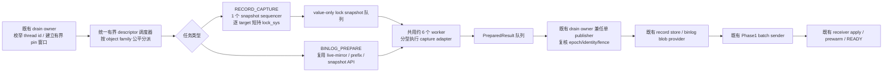
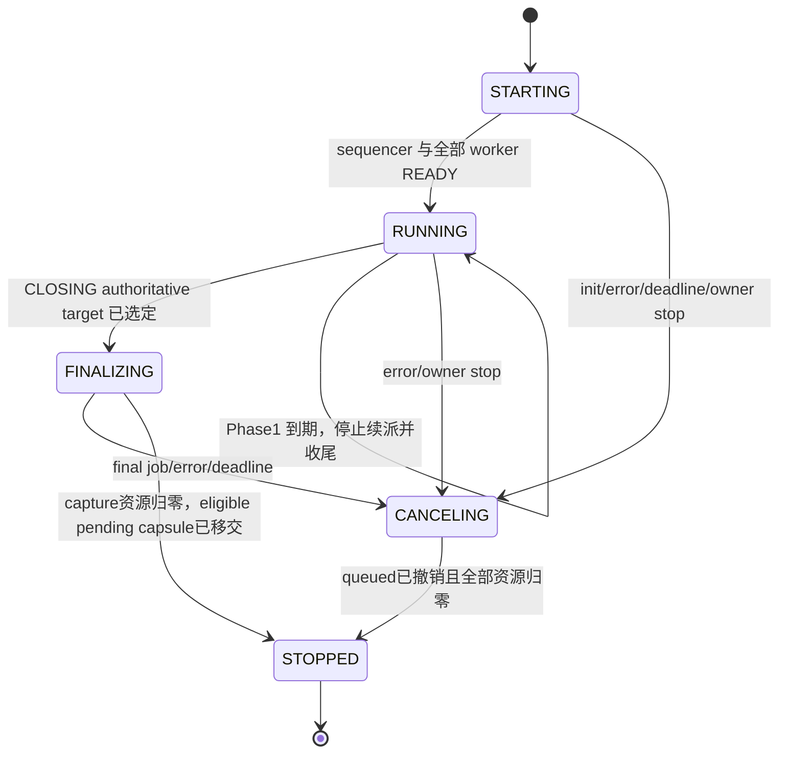
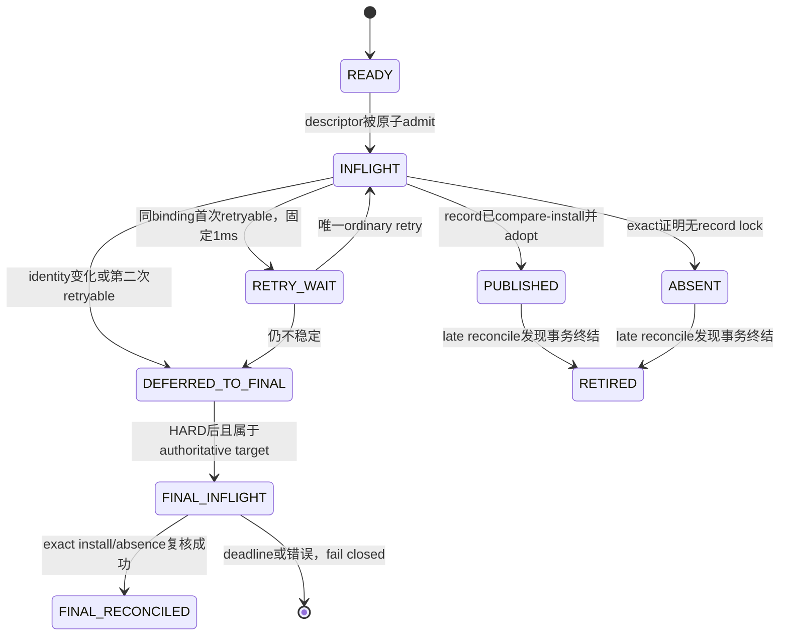
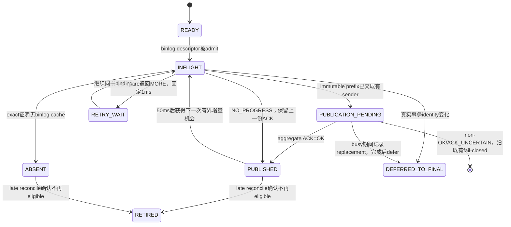

# Preserve/Resume Phase1 多对象分层捕获与有界流水线设计

> 状态（2026-09-07 提交前检查点）：方案 A 已获批准，Stage 1 的有界
> capture/prepare 主干已落地，但普通 record 尚未逐对象覆盖既有 sender/ACK。
> 当前 500 个常规 MTR 与 18 个 big-test 已有适用模式通过记录；big-test
> 使用既有 LOCAL_CARRIER/LEGACY，不能代替 dependency 性能验收。
> 正式规模已有试跑，但连续五轮及全部 Release 性能 SLO 尚未通过；独立
> scheduler source lint 的冻结边界差异仍未闭环，不能宣称正式验收完成。
>
> 范围：优化 standby-transfer source 的 Phase1 record-lock 与 binlog-cache 捕获、对象构建和既有 Phase1 sender 之前的生产过程。两类对象复用同一套有界调度装置，但各自保留已提交的捕获、一致性和 token/object 语义；后续多 sender lane 与 receiver apply pool 只有在 Stage 1 证明确有必要后才实施。命令调度仍由 `2026-08-26-preserve-trx-phase2-command-scheduler-design.md` 单独定义。
>
> 基线：原始设计对照为 `bb870f402075741a4e37c65e41d44d177b592e9c`；提交前审核基线为已包含 Stage 1 主干的 `ae016ff650bc07269fb1ae401485ddbb2acde6bc`。本文不把任何历史压力结果当作当前实现已经通过的证据。

---

## 1. 目标与边界

### 1.1 正式压力模型

```text
standby-transfer source
  1000 个持续大事务业务会话
  100 个持续短事务业务会话
    - 使用与大事务完全不同的表
    - 50 对连接自然竞争各自的 gate row
    - 形成非死锁 lock wait，不使用人工暂停

business_run_before_drain_s = 300（默认）
  -> 300 秒内控制模块不查询锁等待、不做 checkpoint、不发控制 SQL
  -> 到点由独立控制连接只调用一次 DRAIN TRANSACTIONS PRESERVE
```

业务线程不知道 DRAIN 时刻。它们持续执行事务；收到 4020 的连接停止发送新 SQL，但必须保留原连接并等待 transfer 完成。没有收到 4020 的连接继续施压，直到 harness 在验证结束后统一停止。

### 1.2 正式 SLO

所有时间都必须按 attempt/generation 关联，不能拼接不同 attempt 的时间点。

| 指标 | 唯一口径 | 门禁 |
|---|---|---:|
| Phase1 | source 本地 `phase1_started_us` 到 T0 policy publication | `<= 60s` |
| Phase2 | source 本地 T0/policy start 到 source Phase2 end | `<= 2s` |
| Receiver 收尾 | receiver 本地 Final ACK 到同一 epoch READY | `<= 500ms` |
| Phase1 大事务影响 | source 大事务 completed-statement rate 相对 DRAIN 前固定基线窗口的下降 | `<= 20%` |
| Phase1 短事务影响 | source 短事务 committed TPS 相对 DRAIN 前固定基线窗口的下降 | `<= 20%` |

Phase1 timeout 是可配置值，正式 profile 固定为 `60000ms`。配置值和实际 elapsed 必须分别报告；设置了 60 秒不等于证明实际阶段受 60 秒约束。

`phase1_started_us` 的唯一 commit point 是：DRAIN 已完成通用参数/权限校验和 attempt mode freeze，既有 owner 即将执行第一个 Phase1 source 动作、尚未打开 source epoch 且尚未枚举 target 的位置。成功和失败 attempt 都必须输出该时间；没有到达 T0 时，另外输出 `t0_reached=false` 和 `phase1_exit_us-phase1_started_us`，不能丢失超时/失败轮。

正式轮次中还必须满足：

- DRAIN 成功，source 与 receiver 保持在线；
- 业务 1205、连接退出、重连及非 4020 SQL/COMMIT/ROLLBACK 错误均为零；
- 4020 只被视为预期的命令调度结果，且不能导致业务连接主动关闭或重连；
- receiver READY 数等于 survivor 数，NOT_READY 为零；
- DRAIN 时没有观察到 lock wait 只记录 `NOT_OBSERVED`，不判 RED，也不触发第二次 DRAIN。

业务错误观察窗口从 `T_business` 开始，一直延伸到 receiver READY/完整性验证结束、全部业务 worker join、最终 error queue drain 和连接 census 完成。报告中的零必须来自事件计数，禁止写常量零。

### 1.3 绝对边界

方案 A 是嵌入既有 Phase1 的多对象生产者/消费者流水线，不创建第二套 preserve、transfer 或 receiver 流程。复用的是 attempt 生命周期、队列、worker、credit、deadline、cancel/barrier 和 owner cooperative pump；record lock 与 binlog cache 仍由不同的 capture adapter 处理，不能用一个泛化导出函数抹平二者的内核所有权差异。

正式压力模型只负责验收，不能反向成为生产调度条件。内核不得识别或
针对 `RANGE_10000`、`RANGE_1000`、`RANGE_100000`、sysbench、SQL 文本、
range 宽度、表名、会话数量或事务深度选择快路径。所有优化只能由对象
ownership、attempt mode、generation/fence、队列状态、credit 和 deadline
这些与业务模型无关的不变量驱动；不能根据单轮 telemetry 在运行时自适应
改变正确性路径。

一个候选即使在单一 smoke 中显著改善，也只能视为诊断证据。进入生产前
必须保持 OFF/LEGACY zero-diff 和失败关闭；不得为了制造 Phase1 性能结果，
把本可在 ordinary 阶段完成的整批 cohort/full work 后移到 HARD。唯一例外是
§4.2 明确定义的单 target 不稳定性：record 的第二次 retryable 或 identity 变化、
以及 binlog identity/truncate churn 可以登记为 `DEFERRED_TO_FINAL`，但必须按
target 计数，并受 final tail credit 与绝对 deadline 约束。候选还必须在三种
大事务 shape、mixed-transfer 和 sysbench 上方向一致地通过功能及性能回归。

不得改变：

- preserve target/survivor、token identity、source authority 和 detach 语义；
- record warmcopy final fence、binlog live-mirror/truncate-generation、fallback、对象 generation 单调性；
- transfer wire format、final-HWM、flush/ACK正确性与错误语义、commit epoch、ACK_UNCERTAIN 和 exact retry；
- receiver admission、sequence/digest/idempotency、bind、prewarm、READY 与 cleanup debt；
- promotion、RESUME 和 token lifecycle；
- MySQL/InnoDB 原生命令、锁获取、锁释放和事务提交语义；
- RESET DRAIN 竞态矩阵。

命令 scheduler 仍只拥有 T0、HELD/PERMIT/4020、waiter→blocker proof、support ledger、QUIESCENT/HARD。scheduler 不发布 Phase1 工作，不选择 transfer target，不改变 batching/cadence，不调用 flush/ACK，也不驱动 receiver 生命周期。

### 1.4 独立启用模式

Phase1 pipeline 不能借用 scheduler mode 作为隐藏开关。新增独立的启动期只读模式：

```text
rds_preserve_trx_phase1_capture_mode =
    LEGACY_SERIAL
  | BOUNDED_PIPELINE_V1
```

- 产品默认采用 `BOUNDED_PIPELINE_V1`；`LEGACY_SERIAL` 只作为显式兼容/回退模式，不由 Phase2 scheduler 隐式选择；
- 正式 dependency sysbench、mixed 和 continuous profile 必须显式设置 `BOUNDED_PIPELINE_V1`，使验收身份不依赖将来可能变化的产品默认值；
- Preserve MTR suite 为保护既有基线可在 suite 配置中显式固定 `LEGACY_SERIAL`，目标模式用例必须逐例显式启用 `BOUNDED_PIPELINE_V1`；
- mode 在 DRAIN attempt 开始时冻结，运行中不能改变当前 attempt；
- pipeline 代码不读取 `rds_preserve_trx_standby_phase2_scheduler_mode`；
- 验收矩阵至少包含 `scheduler LEGACY + capture LEGACY_SERIAL` 的基线等价、`scheduler DEPENDENCY + capture LEGACY_SERIAL` 的调度器隔离、`scheduler LEGACY + capture BOUNDED_PIPELINE_V1` 的模式独立性，以及 `scheduler DEPENDENCY + capture BOUNDED_PIPELINE_V1` 的正式性能模式；
- capture worker 是 record/binlog 共用的同一 attempt-frozen 有界池，初始总数为 6；record snapshot sequencer 始终只有 1 个，不为 binlog 再创建第二套 worker 生命周期。

### 1.5 当前工作树的实施检查点

`Stable_boundary_hint` 与 `dependency_phase2_boundary_prestage` 数据流已经从
scheduler/owner 中删除，source lint 继续禁止它们回流。bounded mode 下，
binlog participant 的 `open_phase1()` 只创建既有 provider，不再串行遍历全部
target；source epoch、既有 Phase1 sender 与 publication tracking 建立后，record
与 binlog owner 才向共用 pipeline 提交工作。scheduler 仍不参与 capture、send、
flush 或 ACK。

当前 Stage 1 capture/prepare 主干包含：一个 record snapshot sequencer、六个共用 worker、
record/binlog 专用 adapter、owner-only publication、初始及 T0 前的 late
reconcile、record final-generation barrier，以及既有 binlog final-HWM handoff。
普通 record result 当前只 install/adopt，仍在全部 baseline 完成后批量进入既有
sender；所以 capture 与传输尚未做到方案 A 要求的逐对象重叠，credit 也尚未
覆盖 record sender/ACK 生命周期。这是 §4.2 所述普通 record 逐对象发送/ACK 的未完成项，不属于可删除的
冗余代码。当前实现没有新增 sender lane、receiver apply pool、后台 record reclaim、record
dirty-token 轮询或第二份 binlog tail-credit 域。

这里的“已落地”不等于性能验收完成。当前 518 个不同 Preserve MTR 用例已有
适用模式通过记录；三种大事务 shape、mixed-transfer、sysbench 和 1000+100
正式五轮仍须分别满足各自门禁，不能由 MTR 结果替代。Stage 2 不因此获准启动。

---

## 2. 当前源码为什么慢

### 2.1 Record-lock 路径

当前 Phase1 对 record target 存在三类重复工作：

```text
第一次 active/idle 全量 target scan
  -> 第二次 active/idle 全量 target scan
  -> record store 再逐 target full export / seed / external blob
```

入口位于 `sql/preserve_trx.cc` 的 Phase1 prepare 段；逐 target 完整导出位于 `sql/preserve_trx_lock_warmcopy.cc`。这不是单纯“线程数不够”，而是同一 target 的完整捕获、物化与 store 构建被重复执行。

InnoDB record export 又具有两段性质：

```text
lock_sys 全局锁内
  只复制稳定的 value-only lock descriptor

lock_sys 锁外
  table/index/page identity
  page open/latch
  descriptor validation
  serialization/digest
```

现有锁外实现仍按单个 lock entry 打开 page，并可能为每个 entry 重扫事务 lock list。随着单事务 lock 数增长，这部分可能接近 `entries × trx_locks`，因此只把现有完整 export 并发调用六次会放大全局锁争用和重复工作，不能可信地把数百秒压到 60 秒。

### 2.2 Binlog-cache 路径

当前 binlog live mirror 能在 Phase1 期间持续接收业务 THD 的追加写，这是必须保留的成熟能力；问题在 mirror 初始化、transfer snapshot 和发送没有与其它大批量工作形成完整流水：

```text
drain owner 串行遍历全部 target
  -> 每 target 安装 live mirror，并同步复制已有 cache prefix
  -> 全部 participant open 完成后才创建 source epoch
  -> record scan / store / stream 完成后
  -> owner 再逐 target 生成 immutable binlog snapshot 并 enqueue
  -> T0 后每轮 active progress 再全量枚举 target并同步 flush/ACK
```

正常 prefix 并未重复调用三次 full-export API，但同一批字节至少经历三轮完整处理：native cache 到 live mirror；live mirror 到 immutable transfer snapshot；sender 再读取并校验 snapshot 后发送。stale/truncate target 还可能在 quiescence 后重新 full build。`dependency continuous` 已观察到上千个 deferred binlog target 和约 6–8 秒的串行 rebuild 切片，因此 binlog 不是可忽略的附属对象；现有分项 telemetry 仍不足以证明它是全部 Phase1 长尾的第一瓶颈。

### 2.3 方案 A 的共同原则

方案 A 的核心不是“多开线程”，而是：

1. 每份原生状态只在必要的锁内复制一次；
2. 脱离原生指针后按 page/index 分组并行处理；
3. binlog 使用已有 per-token mirror/prefix/snapshot API并在 token 之间有界并行；
4. 任一 target 的任一对象一完成，就由 owner 立即送入既有发送路径；
5. mutation 只使对应 `(target, object family)` 进入下一 generation，不再为一个变化重扫整个 cohort；
6. scheduler、sender、ACK、receiver 和 token lifecycle 不因 source preparation 并行而改变。

---

## 3. 总体架构



图中的“共用”只发生在控制骨架和 worker 资源层。`RECORD_CAPTURE` 先经过唯一 lock sequencer；`BINLOG_PREPARE` 不进入 `lock_sys`，而是调用当前已提交的 per-token warmcopy/provider 接口。两类 adapter 都只能产生 value-only 结果，不能自行发布 token 或发送网络数据。

队列有容量和 byte credit，不能无界积累 1100 个大对象；sequencer/worker 可以在纯 pipeline 资源上有界等待，兼任结果消费者的 drain owner 只能 `try_enqueue` 并 cooperative pump，绝不能阻塞生产形成自环。

“充分并行”服从以下语义边界：不同 target、不同对象族的重 CPU/IO 工作尽量重叠；`lock_sys` 稳定快照仍由一个 sequencer 串行；同一 token/family 仍 single-flight；token declare、sender enqueue/flush、source epoch sequence与ACKed publication仍由既有owner/协议串行点负责。不能为了线程数好看而并行本来承担全局顺序的步骤。

| 对象/阶段 | Stage 1 允许改变 | 必须与当前提交代码一致 |
|---|---|---|
| record lock | 捕获拆层、按target并行锁外解析、去除重复full work | lock identity、fence、store fingerprint、final authoritative验证 |
| binlog cache | per-token prepare/snapshot并行、与record及sender重叠、bounded cursor | live mirror、truncate generation、prefix/delta digest、stale/rebuild与final-HWM |
| token/transfer | owner按结果到达及时enqueue；仅增加completion事实回传 | token identity、object descriptor、sequence、flush/ACK、ACK_UNCERTAIN、commit epoch |
| receiver/prewarm | 只增加观测 | admission、apply、prewarm、Final ACK、READY及cleanup debt |

### 3.1 Drain owner

owner 只负责：

- 建立 attempt/generation；
- 初始枚举业务 thread id；
- 以有界窗口获取 external THD pin；
- 创建不可变 work descriptor；
- 驱动 pipeline start/stop/barrier，并轻量消费 `PreparedResult`；
- 在 T0 前做一次轻量 membership reconciliation，补入新出现或换了 transaction identity 的 target；
- 保持 record 与 binlog 两类 ready queue 的有界公平，不允许任一类长期饿死；
- 按既有错误出口完成 source restore/cleanup。

owner 不做 page IO、binlog prefix copy/snapshot、序列化或 digest，也不能一次 pin 住全部 1100 个 THD 长达 Phase1。它作为唯一 publisher 只做短时身份/fence 复核、record store compare-install、按当前 ACK/locally-queued 语义更新 `Phase1_transfer_binlog_blob_provider`、participant map 更新和既有 sender enqueue；live mirror 的准备属于下述 binlog adapter，不是 transfer publication。新 pipeline 不改变 sender 的同步/异步配置。正式 profile 继续使用既有 batching sender，使网络发送由其原 worker 完成。

初始枚举与入队必须分开。`do_for_all_thd_copy()` 在执行某一分区的 callback 时仍持有该分区的 `LOCK_thd_remove`，因此 callback 只能复制 thread id、owner cookie 等小型 membership POD，不能等待 queue/credit、取得任何 external pin、打开表、写 participant 或调用 sender。枚举返回后，owner 才按 cursor 逐个重新定位 target，在短 external-pin 窗口内复核并构造 value-only descriptor；pin 和所有 THD/registry 锁都必须在尝试入队或等待以前释放。

owner 不能阻塞式地向 descriptor 队列生产，因为它同时是 `PreparedResult` 的唯一消费者。每轮固定执行小预算的 `result pump -> record/binlog descriptor try_enqueue -> completion/retry check`；队列或 credit 满时保留未提交的 target 游标、先消费结果，只有三项都没有即时进展时才在不持任何 THD pin、原生锁、participant、store 或 pipeline 锁的前提下等待 pipeline 自己的 `result-ready / descriptor-credit / error / cancel / deadline` 任一事件。该 wait/condition 不得复用、唤醒或修改 scheduler condition。这样 result queue 满、worker 回压、sequencer 回压和 descriptor queue 满之间不会形成 owner 自环死锁，也不会让枚举 callback 或单次 pump 饿死 scheduler。

### 3.2 Snapshot sequencer

全局只有一个逻辑 sequencer。Stage 1 采用 target-granular capture：

```text
获取该 target 的有界 THD pin
  -> 复核 owner 已登记的 thread id / THD owner cookie / incarnation
  -> 获取 lock_sys
  -> 在 trx mutex 下复核 session->m_trx、trx->mysql_thd、ACTIVE
  -> 复制完整 immutable trx identity、value-only lock entries 和 live fence
  -> 释放 lock_sys 及所有原生锁/引用
  -> 发布 immutable LockSnapshot
```

sequencer 绝不在一次 `lock_sys` exclusive 临界区遍历全部 target；也不持有 `trx_reference` 跨 page/IO worker。否则业务 COMMIT 会等待引用清零，直接破坏 TPS 目标。

Stage 1 不声称已有 restartable lock-list cursor，也不把一个 target 的 snapshot 拼成多个时间片。每个 target 的 entry 数、`lock_sys` wait/hold 和最大 hold 必须记录；若后续证据证明单 target hold 本身成为瓶颈，再单独设计带 start-version、mutation 重启和确定性拼接的 chunked capture。

### 3.3 共用的分型 worker pool

初始总 worker 数为 6，可通过 Phase1-only 静态/attempt-frozen 参数调整。worker 从 `RECORD_CAPTURE` 和 `BINLOG_PREPARE` 两个有界 ready queue 取任务；两类任务共用线程、event、deadline 和总 credit，但分别调用专用 adapter，不能互相解释对方的 generation/fence。

正式初始调度采用“连续领取 2 个 record job 后给 1 个 binlog job 一次领取机会”的加权轮转；它约束 dequeue 顺序，不是 binlog active-job 的并发硬上限。两类 job 共同受总 worker 数和 `ordinary_active_limit` 约束，任一队列为空时另一类可以使用全部可用 worker。若未来确需限制长 binlog job 的同时运行数，必须增加独立 admission counter 与 MTR，不能从 2:1 轮转比例推导。生产调度器不读取 workload identity，也不按 SQL、表、range 或事务深度动态调整；参数调整必须来自跨三种 shape、mixed-transfer 与 sysbench 的一致证据。

为了在 CPU 已饱和的主机上用较长 Phase1 换取较小业务抖动，coordinator 另有一个 attempt-frozen 的 `ordinary_active_limit`。它只限制 `RUNNING` 阶段 record 锁外 prepare 与 binlog prepare 的同时执行数；总 worker 仍为 6，未取得 ordinary 额度的 worker 等待或处理不消耗该额度的生命周期工作。产品静态默认值取允许上限 64，并在 attempt 内钳制到 worker 数，因而默认 effective 值等于 worker 数、保持未调优行为；当前 `dependency continuous` 正式 profile 请求值为 6，effective 仍为 6。`1 <= ordinary_active_limit_requested <= 64` 且 `ordinary_active_limit_effective=min(requested, worker_count)`，两者必须同时记录。更小值只能作为单变量 A/B，不能作为当前已验收默认值。

并发额度必须在 coordinator mutex 内与 queue pop、`QUEUED -> ADMITTED`、`executor_active` 和 active 计数一次线性化；额度不足时 descriptor 原样留在队列中，不占 operation permit，也不持 THD pin、MDL、page latch、provider lease 或其他原生资源。禁止先 dequeue 再 sleep，也禁止在 adapter 或原生临界区内 sleep。普通 job 完成后在同一 mutex 下归还额度并唤醒等待者。sequencer 的唯一 `lock_sys` 捕获段不受此额度限制，但继续受已有短临界区和 operation cutoff 约束。

`FINALIZING` 的 final-generation job、deadline/cancel queue sweep、result/publication cleanup 和 join 全部绕过 ordinary limit。Phase1 到期先停止续派并排空当前小轮，T0 发布再原子确认 ordinary 资源归零、关闭普通准入并推进 cancel revision；因此该限流不得延长严格 Phase2，也不得改变 sender batching/flush/ACK、final-HWM、receiver prewarm/READY 或 RESET DRAIN 语义。若实验只有 Phase1 变长而 TPS 没有可重复改善，或者破坏任一尾部 SLO，这批限流代码必须回退，不得以“可调参数”名义长期保留无效机制。

attempt 级 coordinator 只有以下五个状态；它是所有 queue、permit 和 adapter job 的唯一开关：



worker 领取任务不是“先 pop、稍后再检查状态”。在同一个 coordinator mutex 临界区内必须原子完成：检查 lifecycle、从对应 queue 移除 descriptor、把 `(target,family)` 标记为 admitted/inflight，并登记该 job 的 admission token；需要 wait-capable permit 的 job 同时取得 permit。只有持有 admission token 的 job 才能在锁外 exact-repin target、申请 provider entry lease 或进入 DD/MDL。这样 `RUNNING -> FINALIZING/CANCELING` 一旦发布，旧 queue 中的任务就不可能再开始原生操作。

正常进入 T0 前，owner 持续消费普通结果和 publication completion，直到 ordinary inflight、permit 和 provider lease 归零；不能先 join 再清一个可能已满的 result queue。进入 `FINALIZING` 时普通准入已关闭，只有 owner 能依据既有 authoritative target set 打开一条 final queue；worker 在 `FINALIZING` 中只领取这条队列的 final-generation job。owner 关闭 final admission、排空结果并完成既有 handoff 后才 join 并进入 `STOPPED`。真正错误或取消仍按下一段的独立清理规则处理。

进入 `CANCELING` 时不再允许任何普通或 final job、permit、provider lease开始；queued descriptor全部取消，已admitted job只执行RAII退出。capture coordinator进入`STOPPED`的必要条件固定为：所有capture队列为空、admitted/inflight=0、wait-capable permit=0、provider active-operation lease=0、result ownership已回收，且pipeline publication completion已结算；不能以“线程已经收到stop flag”替代。既有final-HWM、flush context与ACK生命周期从未移入capture coordinator，因此不构成其STOPPED条件，也不能由pipeline取消或等待。

worker 只接收 value-only descriptor/snapshot，不得从队列接收或跨 job 持有 borrowed native pointer，包括：

- `THD*`；
- `trx_t*`；
- `lock_t*`；
- `dict_index_t*`；
- scheduler ledger 或 transfer session。

每个 worker thread 在启动时创建并复用自己的 background THD。任务执行时若需要访问 target THD，只能按 descriptor 中的 registry binding 重新定位并取得有界 external pin；target THD、pin 和其内部对象绝不能进入另一条队列或结果。所有工作完成、失败或取消后，结果只保留纯值字段。

#### 3.3.1 Record adapter

worker 可以在自己执行 job 时通过原生接口取得 worker-local RAII table/index/page lease，但必须在生成 `PreparedResult` 前全部释放，不能把 native pointer 写入结果。worker 按下列 key 分组：

```text
(table_id, index_id, space_id, page_no)
```

同组只做一次 table/index identity 解析，并以 no-wait 方式尝试取得 page/latch，再批量处理该页全部 lock descriptor。worker 保留 snapshot ordinal，最终以确定顺序合并并生成 payload、digest 和 externalizable object。

这里的“锁外”只表示不持 `lock_sys`、业务 `trx mutex`、目标 THD pin、participant/store mutex；它不表示绕过 DD/MDL、dict cache 或 page latch。每个 worker thread 在启动时执行 `my_thread_init()`，创建并在该线程复用一个 `create_thd(false, true, true, ...)` 的 `SYSTEM_THREAD_BACKGROUND` THD，退出时按 `destroy_thd()`、`my_thread_end()` 清理。该 THD 不登记到 `Global_THD_manager`，不会成为 DRAIN target；worker 运行期间 `current_thd` 必须始终指向自己的 worker THD，且 pipeline stop 必须显式 join worker，不能依赖 server 的前台 THD 等待。pipeline 有独立启动屏障：owner 收齐 sequencer 和全部 attempt-frozen worker 的 `READY` 后才允许投递第一个 descriptor；任一 init 失败都停止 intake、发布错误、唤醒并 join 已启动线程，不能静默缩池或让 owner 等待一个已经消失的 consumer。

每个 table/page group 都必须断言 `current_thd == worker_thd`，用显式 `worker_thd` 和非空 `MDL_ticket **` 短持 `MDL_SHARED/MDL_EXPLICIT`。新 worker 不能直接调用当前可能因 rename/ID 漂移在内部无界重试的 `dd_table_open_on_id()`；Stage 1 提供一个 Phase1-only bounded open 窄接口，复用相同 DD/MDL 语义，但一次调用最多完成一次 name/ID 验证，并在入口、MDL 返回和验证失败处检查 cancel/当前 stage deadline。它必须区分 `OPENED / MDL_RETRYABLE / IDENTITY_RETRYABLE / NOT_FOUND / CANCELLED / DEADLINE / FATAL`，不能再用一个 `nullptr` 混合所有原因。worker-local `lock_wait_timeout` 固定为原生最小值 1 秒；MDL/page retryable 由 owner 在 1ms 后只重试一次普通 capture，仍失败则 defer final；identity retryable 直接 defer final，不能在 DD helper 或同一 job 内循环。

attempt 创建时冻结 Phase1 readiness deadline 和 Phase2 budget。Phase1 时间到期的含义是停止给未开始的目标和重试派发新任务，不是取消整个 DRAIN。允许当前小轮及已经发出的 publication 收尾，所以实际 Phase1 可以略超过配置时间；这段时间如实计入 Phase1，不能隐藏，也不能据此继续启动下一轮全量准备。

普通操作只有在 Phase1 deadline 前才能取得 permit；取得后立即释放 coordinator mutex，不跨原生 API 持有它。record 仍保留现有 MDL/page 的有界等待和截止检查。已取得 permit 的普通 binlog 准备可以完成本次固定 prefix：逐 chunk 检查真正取消，保留身份、truncate generation、digest、I/O 校验和同一有界内存 credit。超过 1 秒只增加 ordinary_binlog_slow_operations，不据此全局取消；计数 invariant、时钟回退及其它操作类别的失败规则不变。MORE 只代表本次分块完成，不允许在到期后继续派发下一 step。

到期后的收尾仍由现有 owner pump 完成：未派发的 READY/RETRY_WAIT 标为 DEFERRED_TO_FINAL；INFLIGHT 等匹配结果归还，成功候选继续采用；已开始 publication 的对象继续 flush/completion/ACK 原有结算，只有 OK 才保存 ACK prefix，错误和 ACK_UNCERTAIN 仍沿原失败路径。不能用全局 cancel、abort_after_sender_join 或强制释放 pin/文件替代正常收尾。

所有普通任务和 publication 归还后，退休仍停在 MORE/preparing 的 bounded binlog entry，避免最终补齐等待一个已无人推进的准备者；已 READY 的 mirror 和已 ACK 的 immutable prefix 保留。缺失部分由现有 quiesced final 路径补齐，不增加第二套传输或 receiver 流程。

T0 publication 在现有 coordinator mutex 内检查以下值全部为零，随后关闭普通准入并发布新的阶段 deadline；允许此时已超过原 Phase1 deadline：

```text
ordinary outstanding slots、active jobs、
native operation permits、no-wait operation permits
```

dependency scheduler 必须真正发布 T0，不能因为 Phase1 已到期而跳过它；其 deadline 从实际 T0 和 attempt-frozen Phase2 timeout 计算。final generation 继续使用已有严格预算，permit 准入仍要求：

```text
now_us + final_operation.worst_case_us + cleanup_reserve_us <= phase2_deadline_us
```

cleanup_reserve_us 保留 Phase2 准入余量，但普通同步文件 I/O 无法由 permit 抢占，不能承诺取消后一定在 1 秒内完成系统调用、资源归还和 join。真正取消时停止新工作并等已启动调用退出，不得提前销毁仍被使用的资源。Phase1 收尾过长或最终补齐过多应据实报告性能未达标，而不是仅因 readiness 到期改变功能语义。

为避免复制第二套 DD open，允许在 `dict0dd` 内只抽取“一次 name/ID 验证”的窄 primitive；该 one-shot 边界同时覆盖 cache-hit 的 reopen 路径与 cache-miss 的 DD lookup 路径，任何 rename/discard/ID 不匹配都直接返回 `IDENTITY_RETRYABLE`，内部不得再 `continue` 或 `goto reopen`。现有 `dd_table_open_on_id()` 仍按原循环和原返回语义调用它；只有 `BOUNDED_PIPELINE_V1` 的 lock-preserve helper 调用 one-shot 入口并保留上述分类。OFF、LEGACY 与其它 InnoDB caller 不得看到 retry cap、cancel 或新的错误优先级。

page acquisition 不得调用会触发同步读取或等待 latch 的普通 `buf_page_get(... Page_fetch::NORMAL)`，也不得从 join-critical worker 调用 `buf_read_page_background()`：后者的提交动作本身可能因获取 free block而循环等待/flush，不能证明有界。Stage 1 实际 page/latch 获取只使用现有 no-I/O、no-wait 的 `buf_page_try_get()`：命中返回 `PAGE_READY`；page 不驻留或 latch busy统一返回 `PAGE_RETRYABLE`，owner按上述固定一次普通重试后defer final。到 operation cutoff仍不成功时沿既有 fallback/fail-closed处理。若正式证据证明 nonresident page 阻止 SLO，再单独设计真正的 buffer-pool try-submit API并重新审核 native边界；本阶段不预设该修改。

每个 job 还要在 open 返回后、每次 page try-get 前、相邻 page group、binlog copy/snapshot chunk和长序列化循环之间检查 cancel；record 同时检查当前 operation deadline，已准入的普通 binlog 按上述固定 prefix 收尾规则执行。真正取消时只允许退出当前最小 RAII 临界区，释放全部 lease 后立即丢弃剩余工作，不能继续跑完整 target。page/table/MDL 与 diagnostics cleanup 必须由覆盖所有成功、失败和取消出口的 scope guard 完成。

清理worker diagnostics前必须把原始错误复制为有界、value-only的`Phase1ErrorPayload`：至少包含attempt、target/thread id、incarnation、family、family version/HWM、stage、error domain、MySQL errno、`dberr_t`/carrier status、稳定reason code、`causal/derived`标志、cause id、单调observed sequence和最多`MYSQL_ERRMSG_SIZE`的消息副本。复制完成后才执行`reset_diagnostics_area()`与`reset_condition_info(worker_thd)`。owner只依据该payload保持原错误类别、子类和优先级；不得在worker DA已清空后用一个泛化`FATAL`重新猜测。

当前源码没有统一的source错误priority classifier，`abort_epoch()`也是first-error语义；V1不能虚构一个。coordinator只采用“首个terminal causal错误”规则：在同一mutex内为事件分配`observed_sequence`，primary为空时由最小sequence的causal错误一次写入，此后不替换；由它触发的cancel/deadline结果带cause id并标为derived，永远不参与primary。RESET请求与owner killed仍由既有owner检查在pipeline primary之前处理，不纳入本方案的新仲裁。`ACK_UNCERTAIN`另有独立、单调的authority flag：无论它是不是primary，一旦出现都不能被本地较早错误或随后`abort_epoch()`结果清除、降级或解释成确定abort。

有限映射固定如下；原始payload继续写attempt telemetry/诊断日志，但不能把worker DA中的任意errno变成新的客户端语义：

| payload domain/status | coordinator/owner动作 | 既有客户端出口 |
|---|---|---|
| `ABSENT/RETRYABLE/NO_PROGRESS/IDENTITY_STALE` | 非terminal；按对应规则ready或有界重试 | 不返回错误 |
| 普通 Phase1 `DEADLINE` | 停止续派、结算 inflight，缺失对象 defer final | 不因 readiness 到期返回错误 |
| final-generation `DEADLINE` | cancel pipeline、abort participant/source epoch | 既有 timeout/fail-closed 出口 |
| record/DD/page/binlog/provider fatal、credit/queue可恢复invariant | fail closed，执行既有abort与source restore | `ER_PRESERVE_TRX_UNSUPPORTED` |
| transfer `INVALID_ARGUMENT/CORRUPT/IO_ERROR/UNSUPPORTED/RESOURCE_EXHAUSTED/LOCK_PLAN_STALE` | 保留具体transfer status作cause，执行既有abort/source restore | `ER_PRESERVE_TRX_UNSUPPORTED` |
| transfer `ACK_UNCERTAIN` | latch authority-uncertain，禁止推进ACK frontier；沿既有exact-retry/cleanup-debt与abort路径 | `ER_PRESERVE_TRX_UNSUPPORTED`，但authority状态保持uncertain |
| owner killed | 停止pipeline并保留owner THD当前diagnostics | 当前killed/query-interrupted出口，不覆盖为Preserve错误 |
| 既有RESET请求 | 仅走当前reset owner路径；本文不扩展其竞态 | `ER_PRESERVE_TRX_DRAIN_RESET` |
| source restore/cleanup自身失败 | 保留primary作cause，但按当前cleanup优先级结束 | `ER_PRESERVE_TRX_BATCH_CLEANUP_FAILED` |
| residual MDL等不可恢复内部invariant | 不复用/销毁仍持锁THD，执行既有fatal策略 | 无SQL返回；进程终止 |

Phase1不应出现`COMMITTED_*`或`NOT_COMMITTED*` transfer status；若出现按内部协议invariant fail closed并映射`ER_PRESERVE_TRX_UNSUPPORTED`。上述映射同时是MTR oracle，实施者不得再按消费顺序、family或线程自行发明优先级。

worker 只能通过 job-local MDL lease wrapper 取得 ticket；该 wrapper 必须登记每一张仍存活的 `MDL_EXPLICIT` ticket，并在所有正常、失败、取消出口逐张调用原生 release、同步从 ledger 注销。清理后必须在 release build 运行时验证 `worker_thd->mdl_context.has_locks()==false`，满足后才允许复用或 `destroy_thd()`。若完整释放 ledger 后仍有 MDL，说明存在未受跟踪的所有权破坏：本 attempt fail closed，且不得复用、销毁或遗弃这个仍持锁的 THD；按不可恢复内部 invariant 的既有 fatal 策略终止进程。不能把 `MDL_context::destroy()` 的 debug assert 当成 release，也不能让泄漏的显式锁永久阻塞业务 DDL。当前以 `nullptr/nullptr` 打开 table 的 metadata handle 没有 DDL 生命周期证明，不能复用；worker THD 也不得进入任何 queue/descriptor/result，更不能从 sequencer 向 worker 跨线程传递 target THD 或 live `dict_table_t`/`dict_index_t`/MDL lease。

同一 record target 不拆给多个并发 worker；慢 target 只占一个 worker，其余 worker继续领取其它 target，从而同时获得负载均衡和 target 内确定顺序。

#### 3.3.2 Binlog adapter

binlog job 复用当前已经提交的 `Warmcopy_batch_blob_provider`、`Mysql_binlog_warmcopy_session`、`PrebuiltBinlogCacheBlob` 和 carrier snapshot 语义。为避免把当前私有 provider 暴露给通用 pipeline，`preserve_trx.cc` 提供一个仅在 `BOUNDED_PIPELINE_V1` 使用的 `Phase1BinlogCaptureAdapter`；worker 只能调用它的窄 `prepare_job(descriptor, admission_token)`，`LEGACY_SERIAL` 继续执行当前 `prepare_thd()` 原控制流和原锁序：

```text
按 descriptor exact repin target
  -> adapter 调用 live Warmcopy_batch_blob_provider 的 bounded prepare-job API
  -> provider 内创建/拥有 session，并安装或复用 live mirror
  -> 每个source range chunk都exact repin、复核truncate generation、复制value bytes后释放pin
  -> 在entry lease下按现有顺序写mirror/digest并形成prefix descriptor
  -> 在锁外按现有 carrier 规则生成 immutable transfer snapshot
  -> 返回 PrebuiltBinlogCacheBlob + generation/HWM/digest/ownership facts
```

`Warmcopy_batch_blob_provider` 是live provider；其bounded entry key至少包含`(attempt,target incarnation,owner_thd_cookie,token/cache identity)`，不能继续只用可复用的thread id识别新job。provider内部创建并拥有`Mysql_binlog_warmcopy_session`，session、target `THD *`和mirror raw pointer绝不能进入descriptor、queue、result或completion ledger。participant只拥有provider生命周期，并不长期pin目标THD；bounded模式也不得新增跨Phase1的THD pin。

因此，每一次会解引用target或source cache的provider操作都必须先exact repin并复核incarnation，只在本次cache install/length/range-copy的最小临界段持pin。当前`begin()`把全部prefix循环绑在一个raw `THD *`上，bounded-only prepare-job必须把它拆成可重入chunk步骤：每个source range chunk重新取得pin并复核，复制出value bytes后立即释放pin，再在entry operation lease下做mirror file write/digest/carrier工作。pin释放后任何代码都不得解引用session保存的`m_thd`，只能使用entry/session拥有的source-local value/file状态。

既有source-cache close/reset callback在teardown前把bounded entry原子标记`DETACHED`、停止新operation并推进cancel revision；已admitted operation在当前最小cache临界段退出，并在下一chunk/recheck返回`IDENTITY_STALE`。owner等待active lease与旧result归零后，以不解引用THD的路径清理session/mirror/artifact。业务THD对已安装live mirror的append/truncate/reset仍走当前binlog hot path，绝不改成向pipeline发通知或提交job。不同token的`Binlog_cache_storage`已有独立install/mutation/mirror mutex，可以并行准备；同一`(attempt,target incarnation,BINLOG_CACHE)`必须由coordinator保证single-flight，不能依赖现有`preparing/rebuilding/finalizing` flag猜测并发安全。

bounded prepare-job为每个entry增加active-operation lease：provider全局mutex只允许选择entry、登记状态和取得lease，不能跨prefix snapshot、外部文件range read、digest或carrier copy。长字节处理在entry-local lease下执行，结束后重新取得provider mutex复核session/incarnation/generation。identity replacement必须由owner发起provider CAS，按`stop-new -> cancel active operation -> wait active lease及旧family inflight/result=0 -> 沿现有规则清理旧session/mirror/artifact/entry -> CAS安装新incarnation entry`完成；worker只返回`IDENTITY_STALE`，不得原地重绑。abort/finalize执行同一stop/wait/cleanup顺序。这样token间能够并行，又不会让旧session晚到新事务，也不会把原owner串行改成provider-mutex串行。

现有 prefix copy 和 carrier snapshot 循环使用仅供 `BOUNDED_PIPELINE_V1` 的 optional cancel/deadline probe，并在既有 chunk 边界检查。已准入的普通 binlog job 不传 Phase1 时间截止，但保留真正取消检查；legacy caller 的原控制流不变。取消时只放弃未发布的临时 artifact、保留或按现有规则解除 live mirror，字节、digest、truncate-generation 和错误语义不变。Phase1 当前 prefix 收尾必须在真实 T0 前完成，不得把仍运行的复制带入严格 Phase2。

当前 bounded 模式下的 binlog participant open 必须拆成“轻量 provider 初始化”和“target job 调度”两个动作。source epoch/target declaration 完成后即可消费第一个 binlog result并送入既有 sender，不再等待全部 binlog target和全部 record target完成。`LEGACY_SERIAL` 仍执行当前 `open_phase1()` 顺序。

两类 capture worker 的唯一产物都是 value-only `PreparedResult`。record worker 只能调用 record adapter；binlog worker唯一的有状态例外是通过上述窄 adapter 持 live `Warmcopy_batch_blob_provider` 的 admitted operation/entry lease，执行当前 live-mirror prepare与snapshot语义。worker不得直接访问 drain participant、record store、transfer `Phase1_transfer_binlog_blob_provider` publication map、declared-token set、source epoch session、batch sender、flush context、transport或receiver，也不得调用 record seed/install、`remember_phase1_blob()`/`remember_locally_queued_blob()`、participant close/finalize、declare/enqueue/flush/source abort。不得通过给这些成熟对象增加大锁来放宽边界。

### 3.4 既有 drain owner 兼任单 publisher

现有 participant/target map、sender context 和错误出口都以 drain owner 为生命周期 owner。Stage 1 不创建独立 publisher thread，也不把 participant map 所有权移给 worker；既有 drain owner 在等待 pipeline/readiness 的同一循环中有界地消费 `PreparedResult`。它对每个结果执行：

1. attempt/epoch 仍相同；
2. transaction cookie/version 仍匹配；
3. result family、`family_version`、`capture_generation` 与 owner 当前 binding 相符；
4. record 的 start/end fence，或 binlog 的 truncate-generation/HWM，与当前状态相容；
5. publication generation 严格单调；
6. 同一 generation/HWM 不得发布不同 digest。

record 结果通过后只 seed 一次 record store、安装 participant candidate；binlog 结果通过后只构造当前已提交的 `PrebuiltBinlogCacheBlob` publication request。两者都立即 enqueue 到既有 Phase1 batch sender。失败的 stale result 被丢弃，只重新调度对应 `(target, family)`，不能触发 cohort-wide full rescan。

只有既有 drain owner 可以复核 identity/fence、执行 record store compare-install、按当前ACK或locally-queued pending规则更新participant与`Phase1_transfer_binlog_blob_provider`、声明token，并调用既有sender的enqueue/flush/abort。live `Warmcopy_batch_blob_provider`仍由participant生命周期拥有，只把bounded prepare-job借给binlog adapter；两类provider不得混名或互换职责。participant、declared-token set、source session、sender与flush context都保持原owner/lifetime；多worker并行只发生在它们上游。正式batching-enabled路径由现有sender worker与capture worker并行；batching-disabled时继续保留owner同线程同步callback的原生语义。

binlog publication 必须原样保持当前事务顺序：owner enqueue；existing batch callback 完成 stream；只有 aggregate status 为 `OK` 才执行现有 `remember_phase1_blob()`/ACKed-HWM 推进；失败或 `ACK_UNCERTAIN` 不推进 frontier，并由 owner按现有 carrier ownership清理尚未发布的 immutable snapshot。worker 完成 snapshot 绝不等价于 receiver 已接纳。

owner publisher pump 在 T0 前运行：初始 descriptor 生产遇到 backpressure 时由 owner 有界消费结果；late reconcile 也按同一独立预算 pump，不需要 scheduler handle。进入 dependency T0 前，owner 先发布 pipeline operation cutoff；此后 command scheduler 与 pipeline 不互相驱动：

```text
publish/register T0
  -> 立即执行 initial scheduler tick
       * HARD/ABORT：不调用 progress 或 pipeline pump，立即返回 owner
       * RUNNING：进入后续 iteration

后续 iteration：检查 reset / owner kill / absolute deadline
  -> 调用现有 scheduler tick 推进 HELD/PERMIT/support
  -> 既有 active-binlog progress 仍按原 owner/readiness cadence 运行
  -> pipeline 不再启动 ordinary job，也不接管 progress、flush 或 ACK
  -> 等待到 scheduler 5ms 上限、既有 progress due time与attempt deadline中最近值
```

T0 registration 后的 initial tick 保持现有顺序：它发生在任何 pipeline pump 以前。因此 empty T0 可以直接 HARD，不能因新 pipeline 多执行一次网络 progress，也不能把成功改成 `PROGRESS_FAILED`。pipeline pump 不接收 `Attempt_handle`、command sequence、HELD/support/permit 或 blocker facts，也不能唤醒/修改 scheduler condition。pending pipeline work 不能让 scheduler tick 继续返回 `RUNNING`；一次 owner pump 只处理有界结果，不能执行 cohort scan或同步等待网络 ACK。

`stream_active_transfer_binlog_cache_progress()` 属于已经成型的 warmcopy/transfer 路径。当前 V1 不替换它、不向它传 scheduler target、不改变其 `(false,false,false)` 调用参数、50ms cadence、batching、flush 或 ACK 语义。2026-09-06 批准的持续增量优化扩展的是 T0 前的 binlog adapter：基线 ACK 后，复用现有 worker、publication registry 和 sender 持续处理有效前缀，不再只准备一次基线。T0 后 append/final HWM 仍走原路径；本轮不改 scheduler，也不以新的 Phase1 收尾阶段替代持续推进。

legacy 与 dependency 调用的是同一个 pump，区别只在各自既有 readiness 判断。这样可在命令仍执行时重叠捕获，又不会重现 stable-boundary callback 对 transfer cadence 的接管。若既有配置关闭 batching，enqueue 仍保留 owner 同线程同步 callback 的原生语义，不能靠新增 publisher thread 改写。

这里不能复用当前“无条件 seed 后清 journal”的行为。Stage 1 必须提供 Phase1-only 的 `compare-fence-and-install` 语义：

```text
publisher 传入 snapshot 前后的 expected store-state token
  -> 在该 target partition mutex 内比较当前 token
  -> 相等：原子 swap clean baseline、绑定 capture generation 并返回 installed token
  -> 不相等：返回 STALE，不覆盖 store、不清 journal、不发布 candidate
```

现有 store fence 不覆盖 `target_invalid_reason`、journal sequence/expected sequence 和 journal bytes，因此不足以作为 CAS token。Stage 1 新增独立的 Phase1-only `record_store_compare_token`，在同一个 target partition mutex 临界区一次采样：

- warmcopy epoch/target identity；
- existing shard store fence/generation/fingerprint；
- invalid marker presence 与 reason digest；
- journal sequence、expected sequence 和 journal bytes。

捕获顺序固定为 `S0 token -> 释放 partition -> native snapshot -> S1 token -> 释放 partition`；`S0 != S1` 立即返回 STALE。publisher 在已经释放所有 native lock 后，只能以 `expected=S1` 重新取得 partition mutex 做 compare-and-install。安装本身会改变 store fingerprint/generation，因此 API 必须在同一临界区采样并返回安装后的 `installed_token`；publisher 用它更新 `last_published_token`、participant prebuilt fence 和下一轮 poll 基准，绝不能继续把 S1 当成发布后状态。这样无需修改 hot hook、无需 notifier，也不会把未观察到的 invalid/journal state 清成 clean baseline。debug hook counter 不能代替 compare token。

`record_store_compare_token` 会遍历该 target 的全部 shard 并计算 canonical fingerprint，因而只用于一次 capture 的 S0/S1、publisher CAS 与最终 authoritative 复核，不能成为高频 tick 输入。当前 V1 不维护第二份 `record_store_dirty_token`，也不在业务 lock acquire/release hot path 增加 notifier。初始 reconcile 建立 baseline；T0 前的 late reconcile 重新核对 membership、事务 binding 与 store 状态；HARD 后仍由既有 authoritative record final fence 决定是否需要 final-generation capture。任何一次 S0/S1/CAS 不一致都只丢弃候选，不得覆盖较新的 store。

现有 record bitmap acquire/release mutation 继续推进原有 journal/fence 元数据，compare-install 自身推进 publication generation。它们服务于精确校验，而不是构成可回放的增量日志。若未来压力证据证明“初始 + late + final”仍因重复全量捕获成为主瓶颈，dirty-shard 增量必须另立设计并证明 journal 连续性；不能把聚合 dirty 标志直接当作完整变更流，也不能为此修改 native hook call site。

snapshot 前后取 token 以及 native lock descriptor capture 不能新增 `lock_sys` 与 store partition mutex 的嵌套锁序。`capture_generation` 是 pipeline 的单调工作代；现有 sticky `dirty_generation` 只是 store mutation 元数据，二者不能混用。

每个 capture generation 的 source-local external blob 必须使用不可变的 generation-qualified identity。现有 sender 到 flush callback 才打开 blob，因此已 enqueue 的文件在 callback 返回 ACK/失败以前不得被下一 generation 覆盖、删除或复用；新 generation 可以沿用相同 wire object id，但必须引用不同的 source-local blob。callback/abort 归还 byte credit 时只释放 sender 对该 generation 的 pin/ownership；participant/final fence 仍可能引用 blob，文件删除和最终复用继续只归既有 owner 的 abort/finalize 生命周期，callback 不能提前接管。

### 3.5 MDL、table lock 与其它对象

Stage 1 只并行 record-lock capture 和 binlog-cache source preparation。MDL ticket 遍历没有可直接跨线程使用的内部同步保证，因此事务 MDL、table lock、read view、undo、temp table 等对象继续由既有 owner/既有 participant 按原语义处理；不能因为共用 worker pool 就把任意 preserve 对象自动迁入后台线程。

当前 `prepare_phase1_record_scan_target()` 同时处理 record、table lock 和 MDL，不能在新 pipeline 旁继续调用它，否则会再次完整导出 record；也不能把 non-record 全部推迟到 quiesced live export，否则会丢失既有 Phase1 candidate/prewarm 能力。Stage 1 必须拆出一个 owner-only 的 non-record Phase1 薄接口，保持原校验、candidate generation、调用时机和 final fence，只把 record family 交给 record adapter。binlog adapter则只替换当前串行的 per-target prepare/snapshot 生产段，不接管 participant close/finalize 或 preserve snapshot adoption。不得为了“一次覆盖全部对象”扩大 Stage 1 的竞态面。

---

## 4. Descriptor、binding 与有界收敛

### 4.1 不可变 descriptor

最小 descriptor 由值组成：

```text
Phase1WorkDescriptor
  attempt_id
  drain_generation
  warmcopy_epoch
  thread_id
  phase1_target_incarnation
  object_family = RECORD_LOCK | BINLOG_CACHE
  trx_immutable_id
  trx_version
  raw_trx_cookie
  owner_thd_cookie
  family_version
  family_baseline_fence
```

当前 V1 的 `family_version` 是 descriptor/result schema tag，record 与 binlog 都固定为 `1`；它不承载 mutation generation、desired HWM 或 ACK frontier。`capture_generation` 在同一 binding 的 capture 重试或下一轮前缀捕获时单调增加，`target_incarnation` 只在 owner 安装新 transaction binding 时增加。record 的 S0/S1/store/live fence 位于 record capture/prepared payload；binlog 增量 descriptor 另外携带上一份真实 ACK 的 size/digest/truncate generation，worker 输出独立拥有的字节和新前缀描述符。两类 fence 不能互相解释或塞入一个通用整数。

`phase1_target_incarnation` 由 Phase1 owner 在首次成功 pin/登记 target 时独立分配，不读取或复用 scheduler 的 connection-incarnation POD。attempt-local registry 在 owner 持有初始 pin 时绑定 `(thread_id, owner_thd_cookie, phase1_target_incarnation)`；它不是只写在 descriptor 里的自证数字。sequencer 和 publisher 各自重新枚举并取得有界 pin，只能复核该 binding，以及 `immutable_id/version/raw_cookie/owner_thd_cookie` 的完整 engine identity，不能在失配后原地重绑旧 descriptor；target 已 teardown、换事务或无法 exact 验证时，旧 result 只能丢弃，新事务必须由 owner 分配新 incarnation/generation。

### 4.2 每 target 的当前 V1 生命周期

record 与 binlog 共用 pipeline admission，但 owner 状态不同，不能画成一套
虚假的 `DIRTY/desired/acked` 状态机。





pipeline slot 的 single-flight 从 admission 覆盖到 owner settle；binlog 另外用
publication registry 覆盖到 aggregate completion。旧 incarnation 的晚到结果只
能丢弃，busy 期间观察到 replacement 只登记事实，待当前 result/publication
结算后 defer 或退休，worker 不能原地重绑。

增量只读取现有有效 mirror，不重做完整 export。读取前固定上限并预留字节
credit，分块读取后及 owner 发布前分别复核事务和 mirror identity、epoch、
truncate generation 与前缀水位。暂时无法取得前缀走 retry，不能误判为换事务；
同一事务的 truncate 按原 replacement 规则处理。基线与增量各有扫描 cursor，
交替获得机会；active 和 idle 事务采用相同的非最终前缀规则。所有初始基线
完成或 Phase1 deadline 到达时，在原等待循环中停止新任务，结算已经接纳的
结果和 ACK，并在最后一次 enqueue 后建立 flush 栅栏再关闭 tracking。
下一次 due 本身不延长 Phase1。基线文件保留原 cleanup ownership；inline
增量只更新 ACK 水位，不能取得或删除 live mirror 的 ownership。

必须区分当前实现检查点与方案 A 的最终目标：当前普通 record result 只完成
store compare-install 和 participant adopt，随即归还 pipeline credit；主流程在
全部 baseline 完成后才调用 `prepare_installed_phase1_record_store_targets()` 批量
enqueue/flush。因此 record capture 尚未与 sender/ACK 做到逐对象重叠，record
credit 也尚未覆盖 `OWNER_PENDING_SEND -> EXISTING_SENDER_OWNED -> ACK`。本节所述补齐工作
必须用现有 sender 完成这条流水，不能通过修改 batching、flush、ACK 或 receiver
语义规避；在它完成并验证前，不得把 Stage 1 称为端到端闭环。

### 4.3 V1 的两次 reconcile 与最终权威栅栏

当前 V1 不运行周期性 dirty cursor。owner 在 source epoch、既有 sender 和
publication tracking 建立后执行一次 initial reconcile，在发布 T0 前对最新
declared target 再执行一次 late reconcile：

```text
initial reconcile
  -> 按 (target, incarnation, family) single-flight 提交 baseline/absence
  -> owner 消费结果并通过既有 sender 发布
late reconcile
  -> 补入新增 target 或事务 binding 变化
  -> 等待当前 baseline/absence 与 publication 完成
T0 / HARD
  -> 关闭 ordinary admission
  -> record 走既有 authoritative final fence 和有界 final job
  -> binlog 交回既有 live-mirror/final-HWM 路径
```

record 普通结果若 retryable，只允许同一 binding 在 1ms 后重试一次；仍不稳定
就登记 `DEFERRED_TO_FINAL`。final-generation 仍使用固定 1ms 重试并受绝对
deadline 约束。binlog 相同 generation 的 append 由既有 live mirror/HWM
吸收；identity/truncate churn 不在普通阶段循环重绑，而是保留 replacement 事实并
defer 到既有 final 路径。这样 V1 不需要高频遍历所有 record shard，也不把
持续变化误判成已 clean。

initial/late reconcile 都只是 Phase1 候选覆盖，不能替代最终权威判断。
compare-and-install 防止 capture/publish 覆盖并发 mutation；record final fence、
binlog final-HWM、source epoch sequence 与 ACK 状态仍分别由既有流程负责。

### 4.4 Phase1 readiness 与 T0

T0 前必须满足：

- 初始及late membership中每个仍eligible、可捕获target的record/binlog family，要么已有一个已完成的baseline/publication，要么已有同一current fence/version下的`ABSENT_OBSERVED`，要么已显式标记`DEFERRED_TO_FINAL`；后者包括普通阶段不稳定、identity变化，以及到期后不再续派的record/binlog MORE，缺失部分交回既有final路径，不能伪装成已完成；
- 没有 cohort-wide full scan 等待执行，也没有 record full baseline、binlog initial prefix copy或binlog full rebuild仍在 worker 中执行；
- record 与 binlog owner 已完成 initial/late reconcile，既有 Phase1 sender 已完成对应 publication；
- 两类 ordinary baseline queue、result ownership 与 publication tracking 均已收敛；
- 普通 active jobs、wait-capable permit 和纯值/no-wait permit 全部为零，不携带仍执行的普通操作进入 T0。

T0 publication 前必须按既有规则显式 flush 并消费 Phase1 publication completion。随后发布 pipeline operation cutoff，普通 record/binlog job不再准入。HARD 后仅 record final-generation job可从第5.1节的一次性 `tail_record_credit` 扣减；额度不足时不得启动该 job，而是记录 `TAIL_BUDGET_EXCEEDED` 并沿既有 fail-closed。binlog 不进入 pipeline tail，继续由既有 active progress/final-HWM 路径收敛。

不能要求 1100 个持续业务事务在同一瞬间全部 clean：waiting target 只有 T0 后 scheduler 开始证明依赖并推动命令结束，持续短事务的 identity 也可能在 Phase1 内换代。Phase1 候选覆盖不是 2 秒保证；HARD 后 authoritative record final work 与既有 binlog final-HWM 仍必须分别满足严格 SLO，不能在单轮失败后临时放大 timeout 或 credit。

60 秒配置只决定何时停止普通续派；允许当前小轮收尾后略超该值，再满足上述条件进入 T0。实际 Phase1 和额外收尾耗时必须如实报告；收尾过长是需要分析的性能问题，不是因 readiness 参数到期立即取消 DRAIN。不能带着 cohort-wide full work进入 T0，再靠放宽 Phase2 timeout掩盖。

owner 完成两类 baseline/publication 后才进入 T0。这些值表示 Phase1 候选已准备，不表示全 cohort 同刻 clean。其后任何 record 变化仍由既有 live fence 与 HARD 后 authoritative final reconciliation识别；任何 binlog append/truncate仍反映到既有 mirror HWM/generation。最终不能仅凭 Phase1 ready 跳过既有 record final fence或binlog final-HWM。

到达 T0 后，scheduler 与 Phase1 pipeline 相互独立：scheduler 控制命令准入，pipeline 的 ordinary admission 已关闭；HARD 形成 authoritative target set 后，owner才打开有界 record final queue。scheduler 不向 pipeline 发送“稳定边界提示”，pipeline也不读取 HELD/support/permit。

T0 以后进入严格 Phase2 区间的 capture 工作只允许：

- final membership/fence；
- HARD 后按 authoritative target set 建立、受一次性 tail credit 和绝对 deadline 约束的 record final-generation 工作。

capture finalization barrier 的唯一位置是：manager 已原样发布 `WARMCOPY_CLOSING`，既有 `Preserve_batch_target_counter` 与 exact target-pin collector 已完成并释放 classification mutex 之后，既有 `prepare_quiesced_targets()`/`close_phase1_participants()` 之前。`LEGACY_SERIAL` 在该接缝只执行原有/no-op handoff；`BOUNDED_PIPELINE_V1` 才停止 regular producer 并完成 final record 收敛。barrier 由 capture mode/lifecycle 驱动，不读取 scheduler terminal 内容，也不反向延迟 HARD publication、CLOSING publication 或 authoritative target selection。dependency 路径在 barrier 全程保持 HARD route 和 4020 response latch，不提前暴露响应或退休 route。

normal HARD 已证明业务 BODY quiescent 后，barrier 以既有 counter/pin 给出的 authoritative target set 为唯一 membership，不能自己新增、删除或重分类 survivor。它把 coordinator 原子切到 `FINALIZING`，只为 exact target 做 record store token/live-fence reconciliation；确需补做的record进入`FINALIZING`专用队列并受final permit、`tail_record_credit`和绝对deadline约束，无法完成即沿既有fail-closed。binlog不进入该queue，也不复制final-HWM ledger；当前active progress、final-HWM/catchup、local preserve、wave flush与ACK顺序保持原样。

handoff前，owner必须消费或丢弃全部pipeline result，关闭final admission，等待pipeline admission/operation/result ownership归零并join worker。pipeline没有跨local preserve存活的binlog completion capsule，也不拥有既有flush context、final-HWM pending或ACK生命周期；这些继续完全属于现有drain owner与transfer对象。

完成 handoff 前，owner 不能调用既有 `prepare_quiesced_targets()`/`close_phase1_participants()` 读写同一 participant map；dependency 下 final discovery 与 barrier 耗时属于严格 2 秒区间。2 秒 deadline 内仍不能稳定发布的 candidate 不能被宣布有效，本轮性能判 RED 并沿既有 fail-closed/fallback 处理。deadline HARD 可能仍有 BODY，不能假装 quiescent：owner 仍先原样发布 CLOSING、完成 authoritative counter/exact-pin，到同一固定 barrier 接缝后只 cancel/join bounded pipeline，不执行上述 normal-HARD final discovery；随后沿既有 per-target wait、coverage-incomplete/fallback 处理，不把未完成 result 发布为有效 candidate。owner/safety abort 在 CLOSING 前按第 7 章取消，不进入正常 barrier。

Stage 1 不新增 page/shard delta wire protocol，也不伪造尚不存在的 dirty-page 计数。因此正式报告使用当前可直接观测的字段：

```text
record submitted/results/published/absent/stale/retries/deferred_to_final
record final_targets/final_capture_targets/final_deferred_targets
binlog submitted/results/prepared/absent/stale/identity_churn_deferred
pipeline queued/admitted/inflight/permit/tail_record_credit
既有 final-HWM bytes/service/ACK 指标
```

若这些值在正式 workload 下仍使 T0→Phase2 end超过2秒，应先以stage service time与queue/backpressure定位瓶颈，再另行评审page-level delta；不得让scheduler改变command policy来补偿，也不得在报告里把缺失字段写成零。

### 4.5 唯一锁序

Stage 1 固定以下顺序，不能为减少函数调用而交换：

1. Global THD initial enumeration callback 只复制小型 membership POD，不取得任何 external pin；callback 返回并释放分区 `LOCK_thd_remove` 后才进入 descriptor cursor；
2. owner 按 thread id 重新定位 target，在 `LOCK_thd_data` 下复核并取得短 external pin，绑定 registry、构造纯值 descriptor 后释放 THD lock、registry mutex 和 pin；随后才执行原子的 `try_enqueue + inflight transition`；
3. sequencer dequeue 后按 `(thread id, incarnation/registry binding)` exact repin；只在不持 queue mutex 时取得 external pin，复核已有 binding 后释放 registry mutex；
4. 只持 target partition mutex 采样 store compare token `S0`，然后释放；
5. native capture 只按 `lock_sys global X -> trx mutex` 取锁；在同一临界区复核 `session->m_trx`、`trx->mysql_thd`、ACTIVE 和完整 engine identity，复制 entries/live fence 后逆序释放，并在等待/发布 immutable snapshot 前释放 external pin；
6. 只持 target partition mutex 采样 `S1`，然后释放；
7. worker-local DD/Shared-MDL/dict/page RAII 阶段不持目标 THD pin、registry、pipeline、store 或 participant mutex；先释放 page mtr/latch，再关闭 table 并释放 MDL；
8. binlog worker在不持queue/provider-global mutex时按chunk exact repin target，只按现有每cache的install/mutation/mirror锁序复制value bytes，随即释放target pin；mirror write/digest、prefix descriptor与carrier snapshot只在entry-local operation lease下执行且不得解引用target THD；
9. owner publisher 重新枚举/pin；record释放THD lock后通过窄native helper复核engine identity/live fence并释放native mutex，再单独取得partition mutex执行CAS install；binlog复核target incarnation与truncate-generation/HWM。释放全部pin/partition/provider锁后才更新participant/publication map、移交immutable blob并调用sender enqueue。

任何 queue/credit mutex 都不能跨 THD pin、Global THD enumeration callback、native/store/provider/participant/enqueue 或 worker MDL/page/binlog session lease。任何等待前必须释放这些资源。尤其禁止 `partition mutex -> lock_sys/trx mutex`，也禁止 `provider-global mutex -> target binlog-cache mutex -> carrier IO`；前者会与record mutation hook形成ABBA，后者会把所有token重新串行化并阻塞abort/finalize。

---

## 5. 有界内存与 backpressure

source 与 receiver 是不同进程，“全流水线共享 1GiB”不能解释为跨进程共享同一个 allocator。

正式定义为：

### 5.1 Source credit domain

本节是 §4.2 普通 record 逐对象发送/ACK 补齐后的 credit 契约；当前 record 只计到 install/adopt，尚未覆盖后续批量 sender/ACK，不能以当前计数宣称端到端 1GiB 有界。完成态的 source Phase1 attempt 为新增多对象 capture pipeline 使用一个 transient logical-payload credit domain；正式配置为 1GiB，但 effective cap 不得大于本 attempt 已冻结的既有 sender `max_inflight_bytes`。它覆盖：

- record/binlog work descriptor与value-only snapshot；
- page-group 临时 buffer；
- record serialized object、binlog immutable transfer snapshot及其临时 copy buffer；
- 本 pipeline 的 record/binlog request 进入 source sender 后的 queued/in-flight bytes。

该 1GiB 只限制 capture、result、等待发送及 sender queued/in-flight 的 transient workset，不覆盖两类长期对象：live binlog mirror继续使用既有warmcopy per-entry/total budget；已经ACK但仍被participant/final fence引用的record/binlog immutable artifact继续由既有carrier/owner lifetime与既有限额管理。ACK后把artifact从transient credit移出不等于内存/文件已经释放，报告必须单列 `acked_retained_record_bytes`、`acked_retained_binlog_bytes` 和 `live_mirror_retained_bytes`；不能声称1GiB是全部source artifact的hard cap。

总credit `C` 与两类最低保留额在attempt开始时一起冻结，约束为 `R_record + R_binlog <= C`；差额 `C - R_record - R_binlog` 是两类均可使用的 shared pool。当前默认值为 `C=1GiB`、`R_record=512MiB`、`R_binlog=256MiB`，因此 shared 为 `256MiB`。family先使用自己的保留额与shared；只有另一family的ready+inflight demand均为零时才可再借其保留额。对方重新有work后不强抢已在用credit，但后续归还先偿还借用债务，借用方在债务清零前不得继续扩张。单对象大于本family可用额度但不大于C时，也只有在另一family无需求并可借额时才能启动。由此binlog大对象不能长期吃光record的最低进度保证。

Phase1普通阶段允许credit在owner消费结果/publication completion后循环归还。T0后 pipeline 只可能提交 record final-generation job，因此只保留一次性的 `tail_record_credit`；它不得大于本 attempt 的 effective pipeline credit，并在 final barrier 完成前不因中间结果循环扩张。binlog 后续工作直接交给既有 final-HWM/live-mirror 流程，pipeline 不再建立 `tail_binlog_cap` 或第二套 sender credit。这样新增账本只约束 pipeline 自己拥有的 record final work，不复制也不改变既有 sender `max_inflight_bytes`、enqueue、batching、flush 或 ACK 语义。

credit 随对象在 stage 间 move，不在相邻 stage 重复计费：

```text
WORKER_TEMP（job-local RAII）
  -> result try-publish成功：RESULT_QUEUE_OWNED
  -> owner pop：OWNER_PENDING_SEND
  -> enqueue接受：EXISTING_SENDER_OWNED
  -> aggregate ACK完成：ACKED_RETAINED 或 RELEASED，归还transient credit
```

result queue 的push必须是cancel-aware：成功前artifact仍由worker RAII拥有；成功后由slot的type-specific deleter和credit token拥有。queue满时worker只能等待`space或cancel`，进入FINALIZING/CANCELING会唤醒；取消返回时仍由worker删除。owner在cancel期间必须持续pop/drop并对每个slot幂等delete+return credit，再与worker join并行推进，不能先join再清满queue。owner pop后所有权转为`OWNER_PENDING_SEND`；sender接受后按现有carrier规则转移，ACK后即使变成`ACKED_RETAINED`，transient credit也因pipeline工作结束而归还，retained bytes改由上一段单列。

任何pipeline/ledger/result/completion mutex都不能跨越`enqueue()`、`flush()`、sink cancel或sender `abort/reset/join`：batching-disabled enqueue可能在owner同一线程同步回调，flush/reset又可能等待sender callback。owner先登记ledger并解锁，再调用既有API，返回后重新加锁做幂等结算。现有sender内部queued/in-flight bytes是同一payload的第二道限流计数，不代表又占一份logical credit。

descriptor/result queue 和 byte credit 都提供非阻塞 `try_*` 给 owner；owner 遇到 `WOULD_BLOCK` 必须回到 cooperative pump，不能持 cursor 对应的 THD pin 等待。普通 pipeline event 使用单调 revision：Q1 pop、Q3 push、credit return、error/cancel 和 stage exit 都在释放各自 queue/credit mutex 后，使用与 wait predicate 相同的 event mutex 推进 revision，再于解锁后 notify。sender completion 使用上一段独立的 lock-free completion revision；owner 每次 pump 和每次 timed wait predicate 都同时检查它。owner 无进展时等待上限取 scheduler next tick、pipeline retry/cursor next-due、completion poll quantum 与 attempt deadline 的最近值；一次 completion notify 即使与入睡交错，最多只延迟一个冻结的 poll quantum，不影响正确性，也不能让 pipeline 改写 scheduler 或 attempt deadline。

completion不是callback向一个可能已满的queue做push。attempt预分配固定open-addressed slot table；owner在每个request enqueue以前保留一项，写入 `(attempt,target incarnation,object family,publication version/HWM)`、对应ledger引用，以及由当前request既有字段组成的exact local key（token、object/warmcopy id、epoch、size、digest、prefix facts）。没有空slot就不得enqueue，只能先pump completion。slot预留发生在调用sender以前，因此batching-disabled的inline callback同样安全；不需要预知sender随后如何把request组成batch，也不在request/wire struct中增加pipeline cookie。

slot状态只按`FREE -> RESERVED -> COMPLETE -> FREE`前进。owner先在`FREE`状态写完整key/ledger，再以release store发布`RESERVED`；callback以acquire load读取，exact key在它release写`COMPLETE`以前不可变；owner以acquire读取`COMPLETE`并消费，之后才release写回`FREE`。enqueue在未接纳request时若callback从未进入，owner以CAS撤销`RESERVED`并归还ownership；inline callback可能在enqueue返回前已经把它推进到`COMPLETE`，此时owner只能按completion消费，不能再按enqueue返回二次释放。batching路径接纳后即使稍后abort无callback，也保持`RESERVED`直到sender join后的residual sweep。

既有flush callback完成stream后，对batch中每个current request只做固定表的无分配hash/probe与exact-key复核，在各自预登记slot原地写同一个aggregate status，以release语义设置`COMPLETE`并推进原子revision后立即返回。slot数至少等于pipeline允许进入sender的最大outstanding request数；插入时保证负载因子上限，hash查找总是扫描attempt-frozen的完整probe window，遇到`FREE`也不得提前停止，因此owner并发消费/复用碰撞链不会制造假missing；Stage 1单sender也保证callback彼此不并发。表另预留一个永不复用的atomic invariant cell；任一request找不到唯一slot时callback只设置该cell并仍按原stream status返回，owner下一次pump即fail closed，不能丢失后继续宣布readiness。callback不得分配内存、等待mutex/queue/owner或调用participant/provider/ledger动作。notify只作提示，owner有界pump/定时predicate保证不依赖一次notify获得正确性。owner以acquire语义扫描完成slot，只有aggregate status为`OK`才推进对应family的acked version/HWM，然后释放slot；`ACK_UNCERTAIN`或任意非`OK`都不得推进readiness，并原样进入既有transfer fail-closed。callback设置`COMPLETE`是它对slot的最后一次访问，slot才可在owner消费后复用。

failure/abort可能无逐项callback地清空queued request。此时owner先停止pipeline intake并持续排空result；再沿既有顺序cancel active sink、`abort + reset/join` sender，确认所有callback退出；最后扫描并幂等结算未完成completion slot、residual transient credit和未转移artifact，之后才能销毁slot table、flush context与pipeline。这样不会让owner在flush/join中等待一个正在等待owner腾空mailbox的callback。

既有 sender 的 max-inflight 仍是 record、binlog prefix/delta 等全部对象的唯一传输总门禁；新 completion ledger 只关联同一 request 的 source preparation ownership和ACKed frontier，不复制 sender queue、sequence 或 retry状态。报告分别输出 pipeline-credit peak、live-mirror retained bytes和既有 sender聚合指标，不能相加后声称是严格的跨对象RSS上限。

1GiB 限制的是逻辑 payload/有界工作集，不等于 RSS 的精确上限；request copy、batch encoding 与 worker scratch 仍可能产生短时内存放大。因此 resident buffer 另有随 worker/batch 数有界的 lease，并分别报告 logical peak、resident peak 和 encoding peak。大对象主体必须 externalize/stream，不能因为总 artifact 大于 1GiB 就常驻内存。

单个 logical object 若超过本 attempt 的 effective pipeline credit cap，或超过既有 sender 的单对象上限，立即沿既有 `RESOURCE_EXHAUSTED`/fallback/fail-closed 语义返回，不能等待永远不可能满足的 credit。这里的 externalize 只表示复用既有 Phase1 external blob；Stage 1 不新增 transfer streaming 协议。

### 5.2 Receiver budget

receiver 使用独立的 epoch-retained reservation 与 admission/apply budget，并单独报告 peak。它不是 source 1GiB transient pipeline credit：receiver 可能在整个 epoch 保留已经 sealed 的多个对象，总 artifact 超过 receiver cap时，改变record/binlog公平次序也不能使其成功。Stage 1 不修改或暗中收紧这个既有 cap；只补充 `epoch_reserved_bytes/new_object_bytes/limit/allocation_failure` 分类，避免把 receiver `RESOURCE_EXHAUSTED` 误判为 source backpressure。只有未来证据证明必须做跨网络 credit 协议时，才另行设计。

当前 dependency continuous profile 继承的 1GiB transfer max-inflight 对 receiver epoch-retained对象是待验证值，不能因为source pipeline也采用1GiB就视为合理。Stage 0 必须从同一binary固定workload得到 `sum(declared object bytes)+protocol/accounting margin`，再一次性冻结正式receiver cap；已有4GiB运行只能作为候选配置证据，必须用同一binary单变量A/B确认。正式五轮禁止临时放大参数，也禁止用公平调度掩盖总容量不足。

---

## 6. Transfer 与 receiver 的分阶段处理

### 6.1 Stage 1 保持 transfer/receiver 不变

Stage 1 的 owner 收到并复核任一 record/binlog 对象后，继续调用现有单 `Preserve_trx_transfer_phase1_batch_sender`。worker 不能直接 enqueue：batching-enabled enqueue 可能等待 inflight credit，batching-disabled 更会在调用线程同步执行 transport callback，都会把 worker-local pin/lease 与网络等待错误地绑定。保持：

- 当前 data-session/sender 参数；
- batch options、sender基于 `max_batch_bytes/linger_ms` 的自动成批，以及readiness/final barrier的显式flush；
- source epoch 全局 sequence；
- ACK_UNCERTAIN 和 exact retry；
- receiver apply、prewarm、Final ACK 与 READY。

现有 flush callback 仍调用同一个 `preserve_trx_transfer_stream_prebuilt_blobs_batch()`，不能改变batch编码、sequence分配、send、ACK或error classification。当前 binlog publication registry 已由 owner 预登记并在 aggregate completion 后推进 `remember_phase1_blob()`；普通 record 尚未进入这条逐对象 publication/credit 生命周期，这是第4.2节列出的普通 record 逐对象发送/ACK 缺口。补齐时只能在 owner 侧复用既有 sender request/completion事实，不能给 callback 增加等待、分配或新的wire状态，也不能虚构一份“record ACKed generation”冒充现有语义。

先测量 sender queue wait、bytes/s 和 capture backlog。如果 60 秒目标已满足，Stage 2 不实施。

### 6.2 Stage 2：四条 token-affine sender lane

只有 Stage 1 telemetry 证明 sender 成为主瓶颈，才同时实施 source range scheduler 与 receiver 固定 apply pool。不能只把参数从 3 改成 4。

source 必须增加 epoch-local range ledger：

```text
lane 先构造稳定 frame
  -> sequencer 临界区分配 contiguous sequence range、encode 并安装 ledger
  -> 原子发布到目标 lane
  -> batch 只能包含属于同一 lane 的 token
  -> token 固定 lane，lane 内 FIFO
  -> 每 lane 最多一个同步未决 payload
  -> ledger 记录 RESERVED / SENT / ACKED / ACK_UNCERTAIN
  -> uncertain 关联并 pin sink 持有的同一 immutable encoded payload
  -> 所有较早 range 已确定后才允许 COMMIT_EPOCH
```

lane publish 以前，只有尚未发布的连续尾部可以回退；publish 以后任何 range 都不能复用。encode/ledger 安装失败必须发生在 publish 前，不能留下 sequence hole。

四条 lane 表示总共四条 TCP，session 0 同时是 lane 0 和 control connection。OPEN/COMMIT/QUERY/ABANDON/PROMOTION_GATE_EPOCH 等 control frame 仍走 session 0；token ABORT 走该 token 的固定 lane，并等待所有更早 range 确定，不能越过 sequence hole。

`ACKED` 只表示收到经过认证的 receiver sequence-admission ACK，不表示 semantic apply 已完成；COMMIT 仍依赖 receiver applied-through barrier。任一 lane 首次进入 `ACK_UNCERTAIN` 后，epoch 必须全局停止分配和发送新 range。既有 encoded-frame sink 仍是唯一 exact-retry owner；range ledger 只 pin/关联同一 payload、镜像 sink 结果并控制 barrier，不能另建第二套重试器、重新编码或自行重发。

四条 lane 只承载 Phase1 bulk object。全部 range 已按原协议确定后，sequencer 把连续的 `next_sequence` 所有权交还现有 final-metadata/COMMIT 路径；Stage 2 不改写成熟的 Phase2 final metadata、control frame 或 Final ACK 并行逻辑。

### 6.3 Receiver 固定 apply pool

当前每批 payload 可以临时创建一组 apply thread。四条 sender lane 若直接接入，可能形成 `4 × 8` 临时 apply workers，再叠加 prewarm worker，超过当前约 10 个逻辑 CPU 的合理并发。

Stage 2 将其替换为一套进程级固定 6–8 worker apply pool：

- 继续使用现有 `begin_payload_sequence()` 的 epoch 全局顺序准入，以及 `reserve_payload_apply()` 的按 token apply reservation；receiver 不新增第二套 range ledger；
- 按 token affinity 分派，保持 token 内顺序；
- job move-own decoded frames、root-dir value 和 memory lease，并持有寿命安全的 store/registry handle；不能借用 connection THD 的栈、诊断区、ACK context，也不复制整个 store；
- receiver 按 `first_sequence` 顺序取得 apply-queue credit：在该 epoch 的 active payload-sequence turn 内完成 pre-admission、token apply reservation、credit 和不可运行 job 构建，随后在不持 registry mutex 的情况下结束 sequence turn；高 sequence 不能先吃满 credit 并等待低 sequence；
- 普通 payload 只有原 `after_admission` ACK callback 成功后才能把 job 发布为 runnable；ACK 失败就销毁 job、归还 credit，并保留既有 pre-admission/apply reservation 供 exact retry，不能让后台 worker 照常 apply；
- ACK callback、connection THD、诊断区和栈上 context 都不能进入 worker，worker 完成状态只回写 epoch/token 自有对象；
- worker 只领取已经位于 token apply-front 的 runnable job，不能占着 worker thread 等待较早 token job；
- COMMIT 保留在 control connection 的现有同步路径，不进入 apply pool，并等待所有先前 sequence apply 完成；
- pool 生命周期不按 TCP 连接倍增。

source range ledger 与 receiver 固定 apply pool 必须作为同一个 Stage 2 正确性切片验证，避免开启多 lane 后先制造 receiver 线程风暴。

Stage 2 的 source lane 和 receiver apply pool 各有独立的本地启动期只读开关，默认关闭并在 epoch/attempt 创建时冻结。receiver 不能从 scheduler/capture mode 或现有 wire 隐式推断是否启用；正式 profile 由部署配置同时开启两端，不能通过修改全局 runtime profile 默认值让 LEGACY/OFF 一起漂移。

worker 的每一个成功/失败出口都必须写回 `applied/apply_failed`、完成原 apply reservation 并唤醒 COMMIT waiter。普通 admission ACK 已发送后，后台 apply 失败沿现有 epoch fail-closed/cleanup debt 语义处理，不能在同一协议请求上发送第二个状态包。

### 6.4 Prewarm 保持现状

`PROMOTION_PREPARE` 当前已有全局有界 prewarm pool，并配置为 8 workers。每个对象 seal 后已经可以立即入队，COMMIT 也优先复用已完成 prewarm。Stage 1/2 不重写这部分；只补 queue/backlog telemetry，只有证据证明它成为 Final ACK→READY 主瓶颈时才另行优化。

---

## 7. 失败、取消与关闭

方案 A 不新增 RESET DRAIN 场景。既有 owner stop/source restore 仍是唯一顶层取消者。

pipeline 遵循：

- 在coordinator mutex下原子进入`CANCELING`，停止普通/final descriptor dequeue、wait-capable permit和live-provider新operation lease；
- 唤醒所有因 queue/credit 阻塞的线程；
- sequencer 完成或放弃当前短临界区，不遗留原生引用；
- worker 只退出当前最小 page/table/MDL RAII临界区，或当前binlog copy/snapshot chunk，随即丢弃剩余工作；不能在cancel后继续完成整个target；
- 尚未发布到result queue的record/binlog临时artifact由job-local RAII删除；已经入队的artifact由result slot deleter拥有；已经安装的live mirror继续按`Warmcopy_batch_blob_provider`的stop-new/cancel/wait-zero/cleanup所有权处理，pipeline不能直接悬空mirror raw pointer；
- owner publisher不再安装已取消attempt的结果，但必须在join进行期间持续pop/drop result，逐项删除artifact并归还credit，不能把“清空mailbox”实现成无析构的容器clear；
- sender先按既有sink cancel与abort/reset/join退出callback，owner再sweep预登记completion slot和sender residual ledger；
- sequencer/worker已join、provider active lease归零、sender callback退出、result ownership与completion slot全部结算后，才能销毁queues、credits、provider adapter和slot table；
- 已进入既有 sender 的对象继续按原 sender cancel/abort 语义处理。

若 sender callback 正阻塞在网络，owner 沿既有错误出口先 request/cancel active sink，再执行 sender `abort/reset/join`，最后幂等清理 credit/blob ledger。pipeline 自身不调用 transport cancel；这样既避免 join 永久等待，也避免 callback 在 context 已销毁后返回造成 UAF。

bounded open 的结果与 owner 动作必须一一对应；只有 owner 可以结算当前 admission，并安排 retry、defer 或 retire：

| bounded-open 结果 | 唯一 owner 动作 |
|---|---|
| `OPENED` | 继续当前 job；结果发布前释放 table/MDL lease |
| `MDL_RETRYABLE` | 记录 MDL timeout/temporary conflict，结算 inflight；ordinary同binding固定1ms重试一次，仍失败则defer final |
| `IDENTITY_RETRYABLE` | 记录 rename/discard/ID drift，结算 inflight并直接defer final，不能合并到MDL指标或原地重绑 |
| `NOT_FOUND` | 重新复核 target identity；已终结/被原规则排除则 retire，否则沿既有 table/index unavailable fallback/reject，不盲目循环 |
| `CANCELLED` | 释放全部 job lease、清 inflight，不重调度 |
| `DEADLINE` | 清 inflight、不重调度；ordinary defer final，final-generation 沿既有 fallback/fail-closed 出口 |
| `FATAL` | 保留原诊断，停止 intake 并 fail closed |

page acquire 只有三种结果：

| page 结果 | 唯一 owner 动作 |
|---|---|
| `PAGE_READY` | 继续处理该 group |
| `PAGE_RETRYABLE` | page 尚未驻留或 latch busy；结算inflight，ordinary同binding固定1ms重试一次，仍失败则defer final；绝不退化为blocking fetch |
| `PAGE_FATAL` | 保留原 page/object unsupported 或 corruption 分类，沿既有 fallback/reject/fail-closed |

binlog adapter 的结果保持当前 provider 语义，但必须显式分类：

| binlog 结果 | 唯一 owner 动作 |
|---|---|
| `BINLOG_READY` | 复核 generation/HWM，构造现有 request并enqueue；ACK OK后才remember/publish |
| `BINLOG_NO_CACHE` | 复核exact fence/version后登记`ABSENT_OBSERVED`，不创建空blob |
| `BINLOG_NO_PROGRESS/RETRYABLE` | 分步prepare尚未完成；结算当前inflight，截止前固定1ms后继续同一binding，停止续派后 defer final |
| `BINLOG_STALE` | 结算本family inflight，丢弃旧payload并直接defer到既有final路径，不在ordinary阶段循环rebind |
| `BINLOG_CANCELLED` | 清 inflight，不发布临时 artifact；沿原 cancel 出口 |
| `BINLOG_DEADLINE` | 普通 job 未取得 permit，结算后 defer final；不因此取消 DRAIN |
| `BINLOG_FATAL` | 携带原 provider/carrier/errno payload，保持原错误优先级并fail closed |

record空结果采用完全对称的`RECORD_NO_LOCKS -> ABSENT_OBSERVED`动作；两类absence都必须携带可复核的version/fence，不能把“没有生成payload”误写成已发送size=0对象或缺失coverage。

其余错误遵循：

| 类型 | 处理 |
|---|---|
| target identity/fence drift | 丢弃本 result，只重调度该 target |
| target 已终结或原规则排除 | 按既有 target 规则退出，不升级为全局错误 |
| MDL deadlock、OOM、DD/corruption 或内部 invariant | 保留原错误分类并 fail closed，不能伪装成 stale/retryable |
| queue/credit 生命周期破坏 | fail closed，交给既有 source restore |
| source epoch/transport 失败 | 保留原 transfer 错误和 authority 分类 |
| scheduler abort/deadline | scheduler 只返回自身结果；pipeline 由 owner 按原出口停止 |

任何 pipeline 错误都不能伪装成 scheduler `SAFETY_ABORT`，scheduler 错误也不能改写 transport/receiver 错误类别。

正常 terminal handoff 当前已避免同步清理 process-local record store，本设计不把它改回同步清理。abort/finalize/RESET cleanup 也不在 Stage 1 扩展范围内。

---

## 8. 业务热路径

Phase1 期间现有 warmcopy discard hook 位于 record-lock release 路径，并可能取得 target partition mutex、修改 map 或销毁 image。它是 TPS 风险点，但不与 Stage 1 capture pipeline 捆绑修改。

binlog live mirror 安装后，业务 THD 的正常 cache append 会继续执行当前已提交的 mirror `write_at()`、incremental digest和watermark flush。bounded pipeline会更早、并行地为各token安装mirror，因此该既有成本覆盖的Phase1时间可能变长；这是 `TPS drop <=20%` 必须直接测量的另一项，而不是可以忽略的后台成本。Stage 1 不修改 `binlog.cc/binlog_ostream` 热路径、不增加per-event通知，也不把append转交给worker，因为那会改变命令提交和cache顺序语义。

处理原则：

1. Stage 0/1 telemetry 和系统采样分别证明 record discard 与 binlog mirror append 的 CPU/等待占比；
2. 当前 V1 的 record discard 在既有 target partition 临界区同步清空 bitmap/image/count，保留 COMPACT 标志，写入 DIRTY/TOMBSTONE，并单调推进 mutation、journal 与 fingerprint；不创建后台 reclaim queue、reclaim worker 或 reclaim credit；
3. 保持现有 native call site、journal/fence/tombstone 语义和 OFF/LEGACY 路径；
4. 不顺带修改 abort/RESET cleanup。

同步 discard 的成本必须作为热路径观测项，但不能在没有瓶颈证据时预先引入另一套异步所有权协议。只有跨 workload 的样本证明它是主瓶颈，才单独设计 retire/reclaim 生命周期、内存上界和 T0 drain 规则；该候选不属于当前 V1，也不能复用 ordinary worker 的名义悄悄进入实现。

若 binlog mirror append成为已证主因，也必须另行设计且保持event/cache顺序；不能在本阶段通过异步丢写、延迟digest或改变watermark语义换TPS。不能因为热路径“可能慢”就在Stage 1预先重写，也不能忽略已经出现的样本证据。

---

## 9. Telemetry

只记录 attempt-local 聚合计数、直方图和高水位，不写 per-lock/per-page 日志。

### 9.1 Source capture

- owner enumerate/pin target 数、service time、max outstanding pins；
- initial enumeration callback max time、record/binlog descriptor `WOULD_BLOCK`、公平调度次数、result-pump/wait-any 次数与单轮预算耗尽；
- coordinator各状态时间点、queued-cancel/admitted/inflight/permit/provider-lease高水位，以及FINALIZING/CANCELING后new-start violation；
- ordinary active limit 的 requested/effective 值、当前值、高水位、因额度不足保留在队列的次数，以及 FINALIZING/cancel bypass 次数；
- sequencer queue wait、`lock_sys` wait/hold、单 target max hold、entries/pages；
- worker queue wait、background-THD init、Shared-MDL wait/timeout、MDL ticket acquire/release/residual、serialize/digest service、active/max-active；
- stage deadline 切换、wait-capable permit、T0 permit-drain、operation cutoff、cleanup reserve、`DEADLINE` 结果和 cancel-to-join；
- page group 数、locks/group、try-get hit/nonresident/latch-busy、retry/fatal，以及 blocking/background-read violation；
- baseline/absent target、stale discard、固定1ms retry、deferred-to-final、重复full capture与single-flight violation；
- initial/late reconcile target 数、binding replacement、single-flight、full compare-token calls/service/max、ordinary retry/defer 与 final discovery targets/time；
- binlog target/非空 cache 数，initial mirror install、native-prefix copy、carrier snapshot、digest各自 bytes/service/max-active；
- binlog initial/late reconcile、append HWM、truncate-generation/identity churn、deferred target、unique/full/repeated bytes；
- binlog provider-global mutex wait/hold、entry-local lease wait、sender enqueue wait、batch completion/ACK wait，以及 quiesced final-HWM bytes/service；
- ready/result queue bytes、两family reserve/shared/borrow/credit wait、transient peak、live-mirror retained bytes，以及既有sender的record/binlog queued/inflight/ACK bytes；
- completion slot used/peak/exhausted、callback probe max、invariant-cell、completion pump delay；
- record deferred/final target与tail-credit、binlog identity-churn-deferred，以及T0时既有final-HWM unacked/tail bytes。

### 9.2 Transfer/receiver

- sender queue depth/bytes、blocked time、每 lane bytes/frames/range 状态；
- record 与 binlog object count、unique wire bytes、batch 数分别报告；
- receiver admitted bytes/ranges、apply queue wait/service/max-active；
- receiver epoch reserved bytes/limit、DECLARE_OBJECT reservation reject 与 allocation failure分别报告；
- prewarm queue、完成数及 Final ACK 时 backlog；
- receiver peak bytes；
- epoch-keyed Final ACK/READY 原始时间点及差值。

source 与 receiver 的 monotonic timestamp 绝不互减。Final ACK→READY 只使用 receiver 本地同 epoch 记录；T0→source end 只使用 source 本地同 attempt 记录。Stage 0 允许在 receiver epoch state 中增加只读 milestone 字段，以替换当前 process-global latest atomics 的验收用途，但不能改变 ACK、READY 或控制流。

Stage 1 尚未启用 lane 时，per-lane 指标明确输出 `N/A`。不修改现有 sender 内部的前提下，无法取得的 exact queue depth 也输出 `N/A`，使用 pipeline enqueue blocked wall time 和已存在的 sender 聚合指标定位；不得伪造为零。

### 9.3 业务与正式时间

- `phase1_started_us`、T0、HARD、last BODY exit、Final ACK、READY、source Phase2 end；
- DRAIN 前最后 30 秒 committed TPS；
- Phase1 committed TPS；
- 大事务、短事务和 aggregate TPS/drop；
- pre-drain 与 drain-period 的 1205、断连、重连、4020、其它 SQL/COMMIT/ROLLBACK 错误。

TPS 使用同一进程的 worker-local monotonic counter，不执行采样 SQL：

```text
baseline_tps =
  (Phase1 start 时 committed_tx - start 前 30 秒 committed_tx)
  / baseline_actual_s

phase1_tps =
  (T0 或 Phase1 失败退出时 committed_tx - Phase1 start 时 committed_tx)
  / phase1_actual_s

drop_pct = max(0, (baseline_tps - phase1_tps) / baseline_tps * 100)
```

大事务、短事务和 aggregate 三组值都输出，但三者不是同一种吞吐单位。
正式门禁分别使用大事务 completed-statement rate 和短事务 committed TPS，
两者相对各自 baseline 的下降都必须 `<=20%`。aggregate committed TPS 只作
汇总报告，不能用短事务的高 commit 频率掩盖大事务停顿。任一窗口时长
非正、对应 baseline count 为零、counter 倒退或 sampler 缺口都会使证据
`INVALID`，不能按零降幅假绿。

128+16 scale-smoke 另输出非正式工程里程碑：上述两项降幅都 `<=40%`。
该里程碑只用于筛除无效优化方向，不能替代 1000+100 的 `<=20%` 正式门禁；
aggregate 在两种口径中都只报告、不判定。

sampler 只读取同一 Python 进程内的 worker counter；一个被动 milestone observer 用 source 同主机的 attempt-local Phase1/T0 事件选择对应 counter sample，不查询数据库、不感知锁等待，也不影响 DRAIN 触发时间。采样量化误差和事件观察延迟必须进入报告。

Final ACK 与 READY 必须携带同一 receiver epoch/attempt identity，且两个原始 receiver-local milestone 都真实存在。正式差值为 `max(0, ready_us-ack_us)`；READY 已在 ACK 前完成时差值为 0，这是合法最佳结果。门禁使用 `<=500000us`，不能误写成严格小于。

锁等待 coverage 在成功和失败轮都输出 `OBSERVED / NOT_OBSERVED / UNAVAILABLE`。`probe_positive_count`、distinct waiter 数和 support edge 数分别记录，不能把 probe 次数命名成 waiter 数；coverage 永远不参与 PASS/RED。

只有同时满足 1000+100 会话、实际业务窗口至少 300 秒、一次时间驱动 DRAIN、实际 sysvar/profile 完全匹配、同一稳定 binary、无参数覆盖且全部正式 metric 完整时，才能写 `formal_evidence=true`。任何 smoke、缩短时间、降并发、timeout 覆盖或缺失指标都必须写 `formal_evidence=false`。

现有从 CLOSING 才开始的 `source_phase2_total_us`、last-BODY→Final-ACK 及 receiver read-load P99 保留为诊断字段；除非另行批准为独立 SLO，它们不能暗中成为本方案 60s/2s/500ms 正式门禁。

---

## 10. 源码承载边界

### 10.1 Stage -1：恢复 scheduler 所有权边界

在实现 Phase1 pipeline 前先删除当前 HEAD 的整个 stable-boundary 数据流：

- `sql/preserve_trx_standby_phase2_scheduler.h/.cc`：删除 hint 类型、map、emit/consume API、相关 terminal/telemetry；
- `sql/preserve_trx.cc`：删除 hint producer、`dependency_phase2_boundary_prestage`、scan/enqueue/flush callback 和 HARD 前 hint drain；
- scheduler MTR/source guard：证明 T0/BODY exit 只维护 command ledger，scheduler 不再产生 Phase1 consumer 可见事实。

这里不添加替代 callback，也不优化 Phase1；它只是让当前实现重新符合 scheduler 权威设计。完成后，Stage 1 对 scheduler 文件保持 ZERO_DIFF。

### 10.2 Stage 0：仅验收与 telemetry

主要修改：

- `scripts/preserve_trx_full_pressure_runner.py`
- `scripts/resumable_trx_business_e2e.py`
- attempt/final-record 的窄 telemetry 定义位置
- receiver epoch state及实际reservation/allocation分支所在文件（包括需要时的`sql/preserve_trx_transfer.h/.cc`）：只允许加入attempt/epoch-keyed Final ACK/READY timestamp与`epoch_reserved_bytes/new_object_bytes/limit/allocation_failure`纯观测字段；不得增加锁、改变分支/status/callback或发送顺序。若不能在该窄边界取得某字段，Stage 0 报告`N/A`，不能伪造为零

不得借 Stage 0 改变生产调度或 transfer 行为。

### 10.3 Stage 1：多对象 capture pipeline

主体新增：

- `sql/preserve_trx_phase1_pipeline.h`
- `sql/preserve_trx_phase1_pipeline.cc`

新文件承载 coordinator、两类 ready queue、公平调度、worker lifecycle、credit/completion ledger、record/binlog adapter dispatch、deadline/cancel和value-only result；不能把这些主体重新堆回 `preserve_trx.cc`。

必要薄接缝：

- `sql/CMakeLists.txt`：登记新 `.cc`；
- `sql/preserve_trx.cc`：既有Phase1 owner start/pump/barrier/stop接缝；bounded mode下把binlog participant open拆为轻量provider init与target job调度，并以私有窄`Phase1BinlogCaptureAdapter`暴露bounded-only prepare-job/entry lease。当前`Warmcopy_batch_blob_provider::prepare_thd()`及legacy等待/锁序保持原样；
- `sql/preserve_trx.h`、`sql/sys_vars.cc`：独立 capture mode、worker 数及 attempt-freeze 的窄声明/定义；
- `sql/preserve_trx_lock_warmcopy.h/.cc`：detached result 的单 publisher 接口，消除 store re-export/reseed；
- `sql/binlog_warmcopy.h/.cc`：增加bounded-only的prefix chunk step、optional cancel/deadline probe、source-cache `DETACHED`通知与不解引用THD的session cleanup窄接口；每个chunk仍调用当前range-copy/mirror/digest语义，legacy `begin()`、空probe与原调用控制流完全保持原行为；
- `sql/preserve_trx_carrier.h`、`sql/preserve_trx_carrier_file.h/.cc`：只为 immutable prefix snapshot的现有chunk loop增加相同的bounded probe和未发布临时artifact清理；对象格式和seal descriptor不变；
- `storage/innobase/lock/lock0preserve.cc` 及窄 capture header：拆出锁内 value snapshot 与锁外 page-group resolve；
- `storage/innobase/include/dict0dd.h`、`storage/innobase/dict/dict0dd.cc`：只抽取可分类的单次 name/ID 验证 primitive，旧 `dd_table_open_on_id()` 循环与返回语义保持不变；
- `storage/innobase/include/lock0warmcopy.h`、`storage/innobase/lock/lock0warmcopy.cc`：增加 Phase1-only full compare token 与 compare-and-install baseline API；现有 native call site、hook 控制流和 mutation 写路径不变；
- `storage/innobase/trx/trx0preserve.*`：owner/sequencer 使用的 exact identity wrapper。

Stage 1 不修改：

- `sql/preserve_trx_transfer.*`；
- `sql/preserve_trx_standby_phase2_scheduler.*`；
- `sql/sql_thd_internal_api.*` 与 `sql/dd/*`；worker 只复用已有 background-THD 和显式 MDL/DD API；
- `sql/binlog.cc`、`sql/binlog_ostream.*` 及业务 binlog write/truncate/reset hot path；
- receiver/prewarm/promotion；
- `storage/innobase/lock/lock0lock.cc` 等 native acquire/release call site；
- `storage/innobase/buf/buf0buf.cc`、`storage/innobase/buf/buf0rea.cc` 等 buffer-pool 核心；Stage 1 只复用已有 no-I/O/no-wait try-get，不提交 background read；
- Unit/GUnit；
- RESET DRAIN。

共享 MySQL/InnoDB 文件只允许 Phase1-only、显式 gated 的 value-export thin interface。`preserve_trx_enable=OFF` 或 capture mode 为 `LEGACY_SERIAL` 时不创建 pipeline、不启动 worker、不取得额外 mutex，也不改变原返回值或错误优先级；scheduler mode 本身不能决定这些行为。

### 10.4 Stage 2

只有 Stage 1 正式数据证明需要时，才修改 `sql/preserve_trx_transfer.*` 实现 source range ledger/lanes 和 receiver global apply pool。Stage 2 必须单独设计检查 wire/sequence/ACK_UNCERTAIN/commit barrier，不能作为 Stage 1 的“顺手优化”。

---

## 11. 测试与交付顺序

不新增 Unit/GUnit。新增行为由 MTR 和 Python E2E 覆盖。

### Stage -1

1. 删除 stable-boundary hint 全数据流；
2. scheduler 七组专项 MTR、扩展 dependency MTR 与 source guard 通过；
3. dependency smoke 证明 DRAIN 仍可进入 T0/HARD，且没有 Phase1 scan/enqueue/flush scheduler callback。

### Stage 0

1. 固定 workload identity 和所有实际 sysvar；
2. 修复 60 秒 Phase1、TPS 和业务错误 oracle；
3. 补齐receiver epoch reservation分类，并用同一binary单变量确定正式transfer max-inflight，和source 1GiB pipeline credit分开记录；
4. 运行短诊断 RED，只用于定位；
5. 运行一次 300 秒正式 RED，保留 stage telemetry。

### Stage 1

1. MTR验证worker init failure barrier、`RUNNING->FINALIZING/CANCELING`与dequeue/permit原子gate、descriptor stale、initial/late binding replacement、同family single-flight、`RECORD_NO_LOCKS/BINLOG_NO_CACHE` absence换代、record/binlog reserve/shared/borrow、owner result saturation边drain边join无死锁、Shared-MDL与并发DDL、固定一次record retry/defer、MDL ticket全出口释放，以及残留MDL的fail-fast invariant；
2. MTR验证Phase1到期停止续派、当前小轮和ACK正常归还后必经T0、未排空时阶段切换无副作用地拒绝、普通binlog超过1秒不全局取消、MORE/preparing退出后仍可最终补齐；保留final permit预算、原生MDL timeout、真正取消后的资源归还、page try-get无同步/background page read，以及final barrier位于CLOSING authoritative counter/exact-pin之后；
3. MTR验证binlog mirror install/append HWM、identity/truncate churn defer、`NO_PROGRESS/RETRYABLE`、source-cache close后DETACHED且无THD解引用cleanup、每token single-flight保持到aggregate ACK、初始prefix与record capture重叠；另以ZERO_DIFF/source-shape证明既有“final-HWM enqueue→local preserve→wave flush/ACK”顺序及legacy字节/锁序/错误语义不变；
4. MTR验证completion slot耗尽时owner不enqueue、同batch hash collision与owner并发consume/reuse、batching-off inline callback不分配/不等待、batching-on callback先于sender清inflight、aggregate `OK/non-OK/ACK_UNCERTAIN`、flush与abort清空queued request无逐项callback，以及两类transient credit、retained artifact、acked frontier和blob ownership均正确；
5. no-bin/log-bin Preserve MTR 与 transfer_stby 回归；
6. `LEGACY + LEGACY_SERIAL`、`DEPENDENCY + LEGACY_SERIAL`、`LEGACY + BOUNDED_PIPELINE_V1` 和 `DEPENDENCY + BOUNDED_PIPELINE_V1` 的 source-shape 与行为回归；OFF 路径保持 zero-diff；
7. empty T0 证明 initial tick 前没有 progress/pump；deadline HARD 证明不执行 normal-HARD final discovery；
8. 三种 shape 分别执行同 binary、交替顺序的短诊断，并回归 mixed-transfer
   与 sysbench；任何只对单一 shape 有效的候选必须淘汰；
9. 每种 shape 连续五轮正式 300 秒 dependency continuous，逐轮验证 60s、
   大事务 statement-rate、短事务 TPS、2s、500ms 和零业务错误；不能用
   aggregate 或平均值掩盖任一 workload class/单轮失败。

只有 Stage 1 sender queue/throughput 成为被证实的主瓶颈，才进入 Stage 2。若 Stage 1 已达标，停止修改 transfer/receiver。

### Stage 2

1. MTR 覆盖跨 lane sequence hole、乱序 range、duplicate digest、ACK_UNCERTAIN exact retry、ABORT/COMMIT barrier；
2. receiver fixed-pool 生命周期、connection teardown 和 epoch cleanup；
3. legacy/dependency mixed transfer full pressure；
4. 连续五轮 300 秒 dependency continuous。

任何功能 RED 优先于性能结果。不得通过扩大 timeout、降低 workload、修改 receiver READY 定义或放宽错误门禁取得 GREEN。

---

## 12. 实施停止条件

方案 A 按证据逐层停止：

```text
Stage -1 恢复 scheduler 边界
  -> Stage 0 证明 oracle 可信
    -> Stage 1 并行 record 与 binlog source preparation
       -> 已满足全部 SLO：停止
       -> sender 被证明是主瓶颈：进入 Stage 2
            -> 已满足全部 SLO：停止
            -> T0 仍有大量 full replacement：按证据另行评审
                 record page-level delta 或 binlog artifact-copy优化
```

最终正确性依赖既有 fence、generation、sequence、ACK 和 authority 协议；性能依赖流水线是否让这些既有步骤充分重叠。两者不能互相替代。
