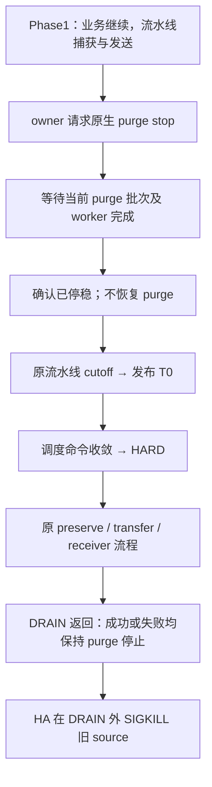

# Standby DRAIN：T0 前停止 purge 与锁候选校验

> 状态（2026-09-15）：旧计数下降补偿、大集合比较器及临时取证层已回撤；单向 purge 停止、保留的 II/EMPTY 校验和 Phase1 一致性重试已实现。本文整理当前生效边界，不再作为重新回撤或重复施工的计划。未提交；定向验证不等于完整功能、性能或物理 HA 验收。
>
> 核查基线：`9bf1d52f9ee1d5b3de7331de6aa2eeef25a76257` 加当前工作区。
>
> 文档分工：[调度主设计](2026-08-26-preserve-trx-phase2-command-scheduler-design.md) 管命令准入；[CALL 补充设计](2026-09-10-phase2-running-call-transaction-boundary-design.md) 管已执行 CALL；本文管 T0 前停止 purge 及保留的锁候选安全边界；[100ms 重试记录](../plans/2026-09-15-phase1-record-consistency-retry.md) 管 Phase1 普通捕获冲突。本文已收录仍有效的 II/EMPTY 约束，不再依赖旧 II 大比较器设计或旧回撤计划继续施工。

## 1. 核心决定：先等 purge 真正停稳，再进入 T0

仅在以下组合下启用，不增加新外部参数：

```text
preserve_trx_enable=ON
+ STANDBY_TRANSFER_SAVE
+ DEPENDENCY_CONVERGENCE_V1
+ BOUNDED_PIPELINE_V1
```

Phase1 业务仍正常执行时，drain owner 调用原生同步停止接口。只有 purge 当前批次和后台 worker 已收敛，才继续发布流水线 cutoff 和调度 T0。不能先进入 T0，再等待 purge；scheduler 也不负责控制 purge。

这是一次**保持到旧进程退出的单向停止**。用户明确现网在 DRAIN 后由 HA 使用 SIGKILL／kill -9 终止旧 source。因此成功、普通失败、owner 取消、RESET 或函数退出均不恢复 purge；本方案不增加暂停份额的归还、自动重启或 RESET 竞态矩阵。

这不是通用在线维护契约。DRAIN 失败后业务准入可按原流程恢复，但 purge 仍停止；运维必须继续终止旧进程，不能把它当成已恢复日常运行的实例。

## 2. 为什么需要它，又不能由它代替全部校验

原生 record 捕获分为两段：先在 lock_sys 与 trx mutex 保护下复制锁描述，释放保护后再取得页面身份、验证描述。purge 可以在两段之间删除记录或继承 GAP 锁。THD 已 QUIESCED、已有生命周期 pin，甚至命令已 HARD，都不等于后台锁维护已停止。

源码入口：[lock0preserve.cc](../../../storage/innobase/lock/lock0preserve.cc) 的 `lock_preserve_export_record_locks_low()`、[lock0lock.cc](../../../storage/innobase/lock/lock0lock.cc) 的删除／GAP 继承路径。

| 历史证据 | 能说明什么 | 不能推出什么 |
| --- | --- | --- |
| 真实 GAP 对照出现 bitmap 坐标改变，锁数量／链表数量不变 | purge 可以改变捕获坐标；仅比较数量不足 | 不能将所有 TPC-C 4013 都归因于 purge |
| TPC-C target 893 出现 seal fence／继承状态变化 | 候选与最终原生状态不一致 | 当轮未完整证明具体执行 actor |
| 重复 INSERT 等待留下已获授 II | DRAIN 前就可存在静态重复 | 停 purge 不会自动合并这些原生锁 |
| 真实锁等待超时后近似计数与实际位集合不同 | `n_rec_locks` 不能独立证明空／非空 | 不允许因此跳过完整 fence 和资源校验 |

这些是历史定位事实，不是本次整理重新运行的结果。停止 purge 减少一种变化来源，但普通业务、回滚、页面变化及允许的隐式锁转换仍须按既有规则处理。

## 3. 当前执行顺序



接入点在 [preserve_trx.cc](../../../sql/preserve_trx.cc) 调用 `publish_phase1_pipeline_cutoff()` **之前**。该调用已发布流水线 Phase2 内部截止时间，不能只挪到 `publish_and_register_t0()` 前，却让等待 purge 先消耗这段预算。

停止接口的结果只有三类：

| 结果 | owner 行为 |
| --- | --- |
| STOPPED | 本次原生 stop 已完成，可以继续 T0 |
| DISABLED | 原生 purge 本来就被禁用，不虚构“刚暂停成功”，沿既有禁用状态继续 |
| UNAVAILABLE | 不发布 T0，走既有失败清理 |

等待计入 DRAIN 总耗时及 T0 前准备，单列请求到停稳时间。已有 epoch、transport 和资源 deadline 不重置，不能借移动 T0 隐藏这些成本。普通 COMMIT 无需等待 purge 消费 undo 才释放行锁；普通 ROLLBACK 自行执行 undo，但暂停后的实际延迟仍须测量。

## 4. 原生停止及退出边界

桥接接口 `trx_preserve_stop_purge_for_standby()` 位于 [trx0preserve.cc](../../../storage/innobase/trx/trx0preserve.cc)，复用 [trx0purge.cc](../../../storage/innobase/trx/trx0purge.cc) 的 `trx_purge_stop()`：

- RUN／STOP 状态调用同步 stop；原生 `n_stop` 登记本次停止，等待 coordinator 停稳及当前 worker 批次结束，不是只写一个 STOP 标志。
- 其他调用者正确配对的 stop/run 不会归还 DRAIN 留下的份额；DRAIN 自身没有对应的 `trx_purge_run()`。
- 不重写原生 purge 状态机、GTID、刷盘或线程启动机制。INIT／EXIT 等不可用状态按 UNAVAILABLE 处理。
- 调用时不得持有 lock_sys、trx_sys、字典、页面 latch 或会妨碍 purge 退出的锁；不把 SQL 调度锁带入同步等待。
- 原生同步 stop 没有本方案新加的限时取消。owner killed 在调用前后检查；等待中被取消仍先等原生 stop 返回，不能提前发布 T0 或假装已经撤销停止。

| DRAIN 出口 | 原有事务／transfer 处理 | purge |
| --- | --- | --- |
| stop 前取消或失败 | 原生 cleanup；尚未登记本次停止 | 无本次暂停份额 |
| stop 后、T0 前取消 | 不进入 T0，走原清理 | 保持停止 |
| scheduler／worker／保存失败 | 原错误分类及安全恢复；不能修改 ACK_UNCERTAIN 归属 | 保持停止 |
| transfer 成功 | 原 Final ACK、epoch、READY 和交接规则 | 保持停止 |
| RESET DRAIN | 不新增恢复支持，也不为 RESET 重启 purge | 保持停止 |
| HA 终止旧主 | 在 DRAIN 外使用 SIGKILL | 随进程退出消失 |

原生正常 shutdown 会检查 `n_stop == 0`，因此这里**不能改用 SIGTERM／SQL SHUTDOWN**。本实现不放宽该原生检查，也不在 DRAIN 内主动 kill 进程。SIGKILL 后重启 datadir 走原生 crash recovery；这不是“恢复一个存活进程的暂停份额”。

源端 stop 不改变 receiver purge。真实物理备机的 redo apply/freeze、旧主 fencing、版本解释、promotion 前置条件仍独立成立；本机双实例 READY 或重启成功不替代完整物理 HA 验证。

## 5. 当前保留的锁候选规则

### 5.1 旧候选不会因 purge 停稳自动变新

Phase1 生成候选以后、暂停确认以前，业务或 purge 仍可能改变它。完整 identity、generation、publication、coordinate、fence 和资源检查继续保留：

- 旧候选仍有效：复用。
- 安全 store 可提供当前结果：沿原 dirty-store refresh。
- store 不安全或不匹配：沿既有 native recapture。
- 最终新捕获或最终校验仍不一致：失败，不缩小计数、不覆盖 fence、不伪装成功。

同阶段要求完整 fence 一致；阶段切换中的正常 conversion freeze 仍使用既有跨阶段校验，不能把所有位置机械替换成同一个等号。源码承接点为 [phase1 owner](../../../sql/preserve_trx_phase1_owner.cc) 的最终准备与 [lock warmcopy](../../../sql/preserve_trx_lock_warmcopy.cc) 的候选协调。

### 5.2 只在导出副本过滤合法 granted II

II 指 INSERT INTENTION。过滤必须先验证每项锁描述，再移除合法的已获授 II；不修改原生锁、原生计数或锁热路径。允许的 II 为 REC、X 和合法 GAP/II 组合，不允许 WAIT、REC_NOT_GAP、predicate、prdtpage 或未知位；无 GAP 时仅允许单个 supremum 位。普通锁 overlap 和非法 II 仍拒绝。

raw 锁数量、字节及上限在过滤前校验；原生状态计数与导出条目数分开保存。过滤不代表 vector 已释放容量，既有峰值 credit 不能提前归还。其他原有路径需要的 exact-II dedup 仍保留；仅 exact dedup 不覆盖 `{A,B}` 与 `{A}` 的部分重叠，不能据此删除合法 II 过滤。

有损 store 只记录一个位置是否持锁，不记录多个原生对象的贡献次数。一份对象 DELETE 清位后，另一份可能仍持有该位。因此：

- 过滤／去重导致有损表示的 baseline 保持 `store_refresh_safe=false`。
- 后来才新增 II 的情况，由当前 plan 的 `insert_intention_present` 等既有检查转 native fallback；不能只检查首份 baseline。
- 普通安全 store 保留 refresh，不把所有 stale 都改成完整捕获。
- 不增加 `raw_count == store_count` 条件：II 过滤本来允许二者不同。

### 5.3 EMPTY 只证明实际最终候选确实没有待导出的 record 锁

大集合比较器已删除。只在 `omit-II` 且本次选中的 deferred bundle 没有 record blob 的分支，使用小型 EMPTY 证明：

1. SQL 检查 **本次实际 bundle**：record/predicate payload 为空；TLV 不得含 `0x30/0x32`，空值和重复 tag 也拒绝；external blob 与 descriptor 均不得声明 record 对象。缺失已声明文件不是 EMPTY。其他对象继续由原校验处理。
2. InnoDB 在既有 lock_sys 与 trx mutex 下确认：同一个已 PRESERVED、已脱离 THD、未 abort／killed 的事务；同阶段完整 fence 严格一致，conversion 异常标志未置位。
3. 遍历原生 record 对象，先拒绝 waiting／非法类型，再数实际 set bits。合法零位对象跳过；每个实际持位对象必须满足上述 granted-II 规则。有位的普通 record／predicate 或非法 II 均拒绝。
4. 累计实际 set bits，不超过 `max_lock_count`；重复 II 的位分别计数。`n_rec_locks` 是近似值，不要求它等于实际位数，但仍作为 native→native 完整 fence 的一部分。
5. 锁内不分配向量，不读文件／页面，不排序或合并位图。函数只返回证明结果，不修改 expected fence；后续 final fence 继续检查变化。这仍是链表／位图扫描，不声称常数成本。

对应 SQL `preserve_trx_early_record_locks_empty()` 与 InnoDB `lock_preserve_has_only_granted_insert_intentions()`。非空候选仍走原 sealed blob、digest、descriptor 校验，不进入 EMPTY 扫描。

原生完整捕获以 entries／实际位数判断空与非空自洽；空 store 不能自行证明原生为空，必须沿既有 STORE_FALLBACK。已验证的近似计数修正、异常解锁、严格 fence 均保留。

### 5.4 普通捕获冲突：只重试受影响 target

Phase1 业务仍活动，有限时间内的捕获不一致不必立即取消全部 DRAIN。当前 [100ms 重试方案](../plans/2026-09-15-phase1-record-consistency-retry.md) 复用原 owner 的 RETRY_WAIT：

- 仅明确的一致性冲突延后 100ms；结果和 credit 先结清，其他 target 继续推进。
- Phase1 deadline 及普通任务停止准入仍有效；T0→HARD 不额外重开普通捕获。
- 事务换代、旧 store、资源或原生暂忙各走原分类；不把所有错误改成重试。
- 最终新捕获冲突立即按原 reason 失败。停止 purge 和重试均不豁免最终完整性。

## 6. 回撤结果及代码量

已删除的是旧 count-drop 例外、两个 `preserve_trx_prove_early_*` SQL 包装、底层非空大集合比较器及临时 forensic 注入／日志层。它们不是当前待实施项，不按旧 inventory 再回撤一次。

保留的是合法 II 过滤与所需 dedup、安全 store/fallback、EMPTY 直接证明、完整 fence、资源检查、异常解锁及被正式 MTR 使用的 Debug 接缝。CALL、PS LEX、命令退出交接、probe 预算、ReadView、replacement→finalize 顺序和专用响应条件变量有各自独立作用，不因删除 purge 补偿而回退。

| 已实现切片 | 文件 | 核算 |
| --- | --- | --- |
| pre-T0 单向 stop | `sql/preserve_trx.cc`；`storage/innobase/trx/trx0preserve.cc`；`storage/innobase/include/trx0preserve.h`；`storage/innobase/trx/trx0purge.cc`；`storage/innobase/srv/srv0srv.cc` | +58/−0，含 10 行 Debug 接缝；无新源码文件 |
| Phase1 一致性重试 | pipeline header、record adapter、record owner | +74/−15，含 16 行 Debug 接缝及说明；另清理 31 行临时 presence 日志 |

以上是各自实施时与切片前像比较的数量，**不是五个文件的当前总 diff，更不是全部未提交内核代码量**。旧文档中回撤前的 +1406/−123 等数值不再作为当前开发量。正式 Debug 接缝服务测试，不应与已撤临时观测代码混为一谈。

## 7. 回归合同与已知验收状态

当前 checkout 的 standby 用例位于 `mysql-test/suite/preserve_trx`，没有独立 `preserve_trx_transfer_stby` suite。standby-transfer 阶段使用新模式组合；OFF／LOCAL／LEGACY 专门对照保留各自用途。验证使用 MTR 与必要 Python E2E，不新增 Unit/GUnit，不扩生产 RESET 支持。

| 验证组 | 必须保留的断言 |
| --- | --- |
| 停止顺序 | 等待真实在途 purge 批次；期间业务可推进；停稳确认早于 T0 |
| 真实锁变化 | GAP 迁移、II 清理、II-only／EMPTY；不是只有手动关 purge 的对照 |
| 候选更新 | 暂停前旧候选失效；后续新增／删除 II；健康 dirty-store 仍复用，不丢普通锁 |
| 完整性负例 | 非法 II、错误摘要、缺文件、普通位图变化、资源失败仍拒绝；最终变化不被重试掩盖 |
| 退出与隔离 | stop 后各出口不恢复；其他 stop/run 不解除本次停止；非适用模式不受影响 |
| 重启和压力 | 每轮 source SIGKILL、receiver 按原方式退出，双端重启；按测试约定复用数据，独立记录本轮 epoch／READY，不伪称重新一致的初始数据 |

MTR 已按单向停止契约适配源端退出：保持 purge 停止的 source 用 kill/restart，不等待正常 shutdown。旧“RESET 取消在途 DRAIN”夹具按批准契约改为验证 RESET 被拒绝且不破坏 DRAIN；不借改测试新增内核 RESET 支持。夹具须清理同步信号、连接及会话设置，失败恢复仍核对原事务。

实现时核心及补充定向曾有 no-bin 50 个、log-bin 56 个不同业务用例通过记录；这是历史批次，不是当前全量统计。其后的适配与全量结果按对应运行记录核对，不能继续把当时尚待迁移的两例写成当前未修失败。

同一当前 Release 的 TPC-C 十轮复用结果详见 [重试记录](../plans/2026-09-15-phase1-record-consistency-retry.md)：十轮 DRAIN 均成功、2,140/2,140 个应接纳事务 READY，原 record 捕获失败未复现；九轮仍因 DRAIN 窗口 1205 保留原始 FAIL，十轮 T0→Phase2 结束均超过 2 秒。该结果不能说明全部竞态消失，也不能证明性能无退化。

## 8. 指标不得因移动阶段而丢失

每个 attempt 绑定 purge 请求、停稳、T0、HARD、最后命令结束、Final ACK、Phase2 结束；HA 控制器另记终止旧主的时点：

- purge 请求→停稳、停稳后的保持时间和未恢复事实，计入 DRAIN 总耗时，不输出虚构的“释放 purge 耗时”。
- T0→HARD、T0→Phase2 结束、最后命令→Final ACK；不得漏掉调度、worker join、事务清理或必要 ACK 检查。
- Final ACK→全部应接纳事务 READY 使用 **receiver 本地时钟**，不跨主机相减 monotonic timestamp。
- Phase1 业务 TPS、单命令 P99/max、错误和锁等待；整段 DRAIN 的 TPS 混有收敛／HOLD，不能冒充精确 Phase1 影响。
- capture／store refresh／reuse／fallback 次数、耗时及最终增量字节，检查是否用更多最终重捕获换取表面简化。
- 停止后的 undo／历史版本积压和空间、已有 purge-lag 节流。原 `srv_dml_needed_delay` 可能延续非零值，不为压测清零，也不能由准入未改推导延迟不变。

停止 purge 减少冲突来源，但不能保证长命令消失，也不能自动达成 Phase2 约 2 秒和 500ms 尾部。继续运行压力时沿用已批准的空间清理范围并保留失败证据；诊断构建不替代正式 Release 的性能对照。本次只整理文档，没有新增测试结果。
