# Preserve / Resume 事务架构

> 当前实现基线：2026-07-13 工作树  
> 读者：首次接手该特性的研发、测试与值班同事  
> 范围：SQL 层、Preserve 内核、InnoDB、Binlog、临时表、Transfer、Promotion  
> 事实来源：当前源码、MTR/GUnit、现行设计文档；旧仓库文档仅用于补充设计动机

这个特性把一个尚未提交的事务从原连接中拆出，保留为可验证、可转移、可重新接管的事务对象。
生产形态不是简单的“重启后恢复”，而是源端批量收口、事务语义在线传输、备端提前预热，
等物理副本达到一致性栅栏后再完成晋升与快速接管；其中物理复制、角色切换和严格晋升入口由仓库外的 HA 编排补齐。

- **先看生产链路：**第 3 至 11 节按真实运行时序展开。
- **再看对象原理：**第 13 至 14 节解释事务为什么能继续执行。
- **最后落到代码：**第 15 至 16 节给出入口、观测面与阅读顺序。
- **需要逐文件追源码：**配套阅读 [《Preserve / Resume 8.0.22 完整代码解读》](preserve-resume-8.0.22-code-walkthrough.md)，其中展开了调用链、六组状态机、内核对象生命周期、transfer/receiver/promotion 对照和当前实现边界。

## 1. 文档定位

Preserve / Resume 解决的是“事务连续性”，不是 SQL 重放。系统保留下来的不是一串待重放语句，
而是一个已经在 InnoDB prepare 边界上稳定下来的事务，加上一份足以恢复 SQL 层语义的快照。
恢复完成后，客户端面对的仍是原事务：它可以继续读写，最终选择 `COMMIT` 或 `ROLLBACK`。

> **一句话架构**  
> InnoDB prepared transaction 是持久化锚点；authenticated bundle 是恢复契约；transfer epoch 是跨机发布单元；
> prewarm registry 与 physical fence 把大部分恢复工作移到晋升前；protected THD attach 是事务重新回到客户端连接的最后一步。

本文按当前工作树描述实现。设计目录中若有“跨机传输尚未实现”“promotion 仍是后续工作”等旧结论，
不能再作为现状判断；这些材料仍可用于理解早期约束，但状态机、调用入口和工件格式要回到源码核对。

## 2. 核心概念

先把几类经常混在一起的对象分开。后面的流程看似很长，本质上一直在回答三件事：
事务本体由谁持有，恢复语义保存在哪里，什么时候允许它重新变成 ACTIVE。

### Prepared transaction

InnoDB 事务完成 prepare 后脱离原 THD，以 Preserve 专用 XID 留在引擎中。
它保留 undo、修改和锁语义，是后续恢复的持久化锚点。

### Snapshot bundle

保存 owner、session、read view、锁、MDL、savepoint、binlog cache、临时表 manifest 等语义。
它不是展示元数据，而是 resume 的输入合同。

### Token

关联 XID、snapshot、外部 blob、接收端状态和最终 resume 请求。本地单事务使用随机十六进制 token；
standby batch 路径使用目标 thread id 的十进制文本作稳定关联键。

### Transfer epoch

一批 token 的在线传输事务。对象可以提前到达，但只有 epoch fact 与 `COMMIT_EPOCH` 完成后，
接收端才把这批对象视为同一一致性事实。

### Prewarm

接收端提前做解码、语义校验、record-lock plan 构建、原生 binlog cache handle 准备和资源预留，
避免晋升门内发生大文件读写。

### Physical fence

外部 HA/redo apply 组件提供的租约式证明：目标物理副本已达到指定 LSN、apply 已冻结，
且页布局、字典代际和锁代际摘要与 epoch 事实一致。

图 1：各类对象的所有权关系

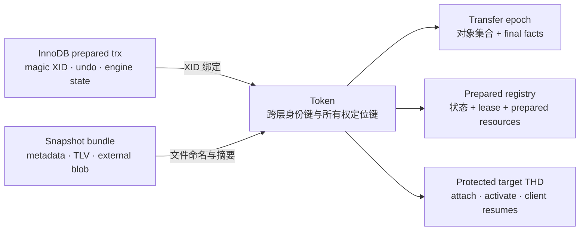

## 3. 生产部署拓扑

生产链路有两条并行的数据通道，不能把它们当成一条。物理复制通道负责让持久表页、redo 和 prepared transaction
到达备端；Preserve Transfer 通道负责传递 SQL 层与非普通物理复制对象的恢复语义。
晋升时，physical fence 把两条通道重新对齐。

图 2：真实上线形态，物理数据面与事务语义面并行

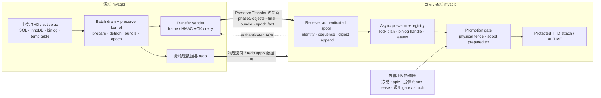

> **HA 集成边界**  
> 当前仓库提供 transfer receiver、prepared registry、physical fence provider 接口、promotion gate 和 protected THD attach core。
> 物理复制拓扑、apply 冻结时机、fence provider 的生产注册，以及何时调用 strict gate/attach，由外部 HA 编排组件负责；
> 仓库内没有注册 production fence provider 或调用 strict physical gate 的生产入口。
> 仓库内的 `plugin/test_preserve_trx_promotion` 展示 attach 调用方式，但它是测试插件，不是生产 HA 控制器。

## 4. 全链路总览

生产路径要把“长时间准备”和“晋升时必须串行完成的动作”分开。源端业务仍在运行时尽量复制大对象；
备端在线时尽量完成解码和资源准备；真正的 promotion gate 只做事实核对、prepared trx 认领和对象挂接。

图 3：从业务事务到目标连接继续执行

```mermaid
flowchart LR
  p1["1. Phase 1<br/>业务继续运行<br/>warmcopy / declare"] -->
  close["2. Close admission<br/>关闭新事务/锁入口<br/>quiesce targets"] -->
  preserve["3. Preserve<br/>prepare + detach<br/>bundle / final objects"] -->
  commit["4. Commit epoch<br/>发布最终事实<br/>source fence LSN"] -->
  recv["5. Receiver<br/>认证并追加 spool<br/>verify / idempotency"] -->
  warm["6. Prewarm<br/>准备锁与 binlog<br/>reserve resources"] -->
  fence["7. Physical fence<br/>物理副本冻结<br/>HA proof lease"] -->
  adopt["8. Gate adopt<br/>认领 prepared trx<br/>ADOPTED_LOCKED"] -->
  active["9. THD attach<br/>恢复会话语义<br/>ATTACHING → ACTIVE"]
```

### 冷路径做什么

大文件传输、摘要计算、snapshot 解码、record-lock plan 构建、binlog cache 文件打开与容量预留，
尽量在源端 phase 1 或接收端 prewarm 阶段完成。

### 晋升门里只留下什么

验证 physical fence 与 final facts，取得独占 lease，按 token 认领物理 prepared trx，
挂接已经准备好的锁/缓存对象，持久记录所有权变化。

## 5. 源端批量 Drain

`DRAIN TRANSACTIONS PRESERVE` 是生产路径的总控入口。它不只是遍历连接逐个执行 preserve，
而是一个带 admission gate、参与者协议、目标集合复核和失败清理的两阶段编排器。

### 5.1 管理器状态与阻塞边界

图 4：Batch drain 的主状态迁移

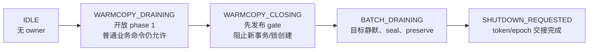

`WARMCOPY_DRAINING` 期间，warmcopy 参与者可以追踪仍在变化的 binlog cache、record locks 和临时表，
普通业务命令继续执行。Table/predicate/AUTO_INC lock 主要在 phase 2 导出并做 canonical/ownership 核对，
不应理解为都具备同样的原生 delta hook。

进入 `WARMCOPY_CLOSING` 时先对 SQL 与协议命令发布阻塞边界，再等待已经放行的语句结束；
这样不会出现“扫描完目标后又冒出新事务”的窗口。每个目标 THD 还有自己的 batch 状态，
最终变成 `PRESERVED_DRAINED` 后不再接受业务命令。

### 5.2 两阶段参与者协议

1. **建立 generation 与目标候选集。**记录这一轮 drain 的 owner、代际和目标 thread id；standby transfer 同时打开 source epoch 并声明 token。
2. **打开 phase 1 参与者。**Binlog warmcopy、record-lock warmcopy、temporary-table phase1 在业务继续运行时复制基线并记录增量。
3. **关闭 admission。**先将全局状态推进到 `WARMCOPY_CLOSING`，然后停止新的 mirror/admission，等待在途危险语句退出。
4. **固定目标集合。**重新枚举并 pin 目标 THD，检查连接、事务形态、容量和 participant 状态，防止 phase 1 声明集与 phase 2 实际集漂移。
5. **Seal 与 preflight。**各参与者冻结最终代际，核对 canonical digest、尾部大小、MDL/锁/临时表约束；此时尚未进入每个事务的 engine prepare。
6. **并行 preserve。**worker 在受控 THD 上调用同一个 preserve kernel；standby 模式使用预选 token，把 final bundle 和对象写入 source epoch sink。
7. **提交 epoch 并交接 shutdown。**所有 token 成功后发布 epoch fact 与 `COMMIT_EPOCH`。在此之前失败会走 participant abort、事务 reattach/rollback 和工件清理。

### 5.3 为什么要 warmcopy

单阶段方案会在全局阻塞窗口内读取完整 binlog cache、扫描大量 record lock、复制临时表空间。
事务越大，停顿越长。warmcopy 把绝大多数字节和索引构建搬到 phase 1，
只在 close 后处理最后一小段增量并做不可变性核对。

它不是降低校验标准：phase 2 仍要用 freeze generation、canonical digest 和最终 fence
证明 phase 1 产物与被 preserve 的事务完全对应。

**主要源码：**`sql/preserve_trx.cc` 的 `Preserve_trx_drain_service::execute()`、manager/admission gate、batch target pin；
`sql/preserve_trx_drain.*`；`sql/preserve_trx_warmcopy.*`；`sql/preserve_trx_lock_warmcopy.*`；`sql/preserve_trx_temp_table.*`。

## 6. Preserve 内核

单事务命令和 batch drain 最终都进入 `preserve_trx_kernel_preserve_attached_transaction()`。
统一内核的意义是：两种入口必须保存同一套事务语义，也必须遵循同一条 durable ownership 边界。

图 5：共享 preserve kernel 的阶段与 durable boundary


> **Snapshot 发布与 token 可用不是一个提交点**  
> 单事务路径在 kernel 完成后进入 `TOKEN_DELIVERY`；只有 SQL OK 确实送达客户端，
> `preserved_trx_finalize_statement_response()` 才把 record 标记为 resumable 并请求 shutdown。
> 响应交付失败时，pending token 不能直接当作可恢复凭据。Batch 路径则由 manager 统一持有并交付 token/epoch 结果。

### 6.1 durable boundary 前后，失败含义不同

**Prepare 之前：拒绝即可。**事务仍由原 THD 持有。任何不支持的语义、容量超限、warmcopy 不一致都应尽量在这里发现，
命令报错后业务事务仍可继续处理。

**Prepare / detach 之后：必须显式处置所有权。**事务已经跨过引擎持久边界，不能只返回错误。
实现需要 reattach、rollback，或留下可观察且可恢复的 token；snapshot/sidecar 的清理结果也要进入状态判断。

### 6.2 实际保存的事务语义

内核先把活动 InnoDB 事务映射为 Preserve 专用 XID 并 prepare，再从原 THD detach；
此时引擎状态仍是 `PREPARED`。`claim` 发生在本地恢复或 promotion adopt 阶段，
才把事务推进为进程内独占的 `PRESERVED`；它和 SQL 层 snapshot 是否已发布是两件事。

之后构造 bundle：事务隔离级别与读视图、表和记录锁、predicate lock、AUTO_INCREMENT 锁、MDL、修改表权限掩码、
SQL/InnoDB savepoint 拓扑、binlog 四态与 cache、GTID、session 状态、可选 user variables，以及临时表 manifest。
只有这些对象形成一致整体，恢复后的事务才与原连接语义相同。

当前实现要求 `ROW` binlog format。原因不是“方便序列化”，而是事务恢复后仍可能继续产生 binlog，
系统必须能把原 cache 的字节和写入语义安全地交给新 THD；statement/mixed 模式会把更多隐含会话执行上下文带入合同。

### 6.3 Local record lifecycle

SQL 层每个本地 record 还有一套与 manager、InnoDB state、strict registry 都不同的生命周期：
`DRAINING` / `SNAPSHOTTING` 表示发布中，`PRESERVED` 是普通稳定态，
`ADOPTED_FOR_PROMOTION` 只能交给受保护的 promotion attach，`RESUMING` / `ROLLING_BACK`
表示 record 已被删除式领取；过期与失败状态留给 reaper 和可观察清理。

`resumable` 是独立 claim gate，不应仅根据 lifecycle 名称推断 token 已可被 SQL RESUME 使用。

**主要源码：**`sql/preserve_trx.cc` 的 `preserve_trx_kernel_preserve_attached_transaction()` 与
`Preserve_trx_preserve_stage`；`storage/innobase/trx/trx0preserve.cc`。

## 7. Bundle 与工件

Bundle 是逻辑恢复契约，carrier 是文件放置与原子发布机制。二者分开后，单机本地保存、warmcopy 预建对象和跨机 transfer
可以复用同一套语义编码，而不必共享同一种落盘路径。

图 6：本地 snapshot envelope 与外部对象

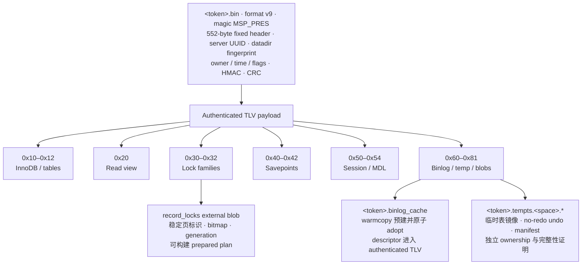

### 7.1 本地 snapshot 不是跨机格式

本地 v9 snapshot 使用 HMAC 与 CRC，并绑定创建它的 server UUID 和 datadir fingerprint。
这个绑定防止把另一实例的本地文件误当作可恢复对象。因此跨机路径没有直接复制本地 `.bin` 文件，
而是通过 portable transfer manifest 描述对象、端点身份、LSN 和摘要，在接收端做语义验证与目标侧发布。

### 7.2 prebuilt 的含义

Bundle builder 同时支持 live payload 和 prebuilt blob，但同一对象族不能混用两种表示。
`prebuilt=true` 表示 warmcopy 已把对象主体持久化，carrier 只需要验证 descriptor 后通过 rename/adopt 发布；
它不代表跳过最终语义校验。record lock 和 binlog cache 可以各自独立选择 prebuilt 路径。

**主要源码：**`sql/preserve_trx_bundle.*`；`sql/preserve_trx_carrier.*`；
`sql/preserve_trx_carrier_file.cc`；`sql/preserve_trx_temp_table_carrier.*`。

## 8. 在线传输协议

Transfer 不是通用文件复制协议。它把一个 drain generation 里的 token、对象和最终物理事实
组织为可重试、可验证、可原子提交的 epoch。网络 ACK 在接收端完成身份/序列校验并追加 receiver spool 后返回；
epoch 的 crash-durable 提交点则由同步落盘的 fact 与 commit marker 提供。

图 7：Frame、认证 ACK 与异步语义应用

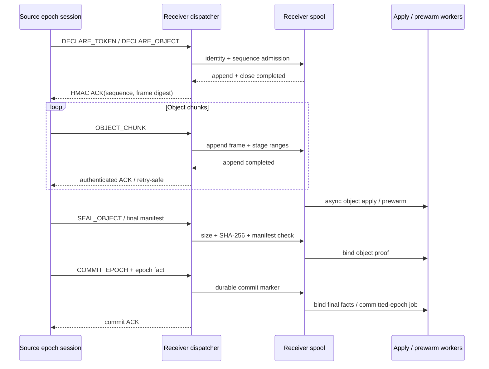

### 8.1 协议对象

Standby 远端交付只由 batch manager 选择：`CLIENT_TOKEN_DELIVERY` 的单连接
`PREPARE SHUTDOWN PRESERVE TRANSACTION` 不能进入 `STANDBY_TRANSFER_SAVE`。
源 mysqld 通过 libmysql 连接接收端；一个 epoch 使用一条严格有序连接，因为 sequence 是 epoch 级单调序列。

| 对象 | 关键字段 | 作用 |
| --- | --- | --- |
| `Transfer manifest` | epoch、source/target UUID、token、sequence、prepare/commit LSN、object descriptors | 描述单个 token 的可移植对象集合，不重新解释 bundle 内部语义。 |
| `Object descriptor` | object id、kind、flags、total size、SHA-256 | 对象身份与完整性合同；kind 枚举包括 snapshot bundle、external blob、temp-table sidecar。当前 portable sender 对非空 temp-table manifest 返回 `UNSUPPORTED`。 |
| `Epoch fact` | source fence LSN、每 token 最终 manifest/object/LSN 事实、fact digest | 把提前到达的 phase1 对象与最终 preserve 结果绑定为一个提交单元。 |
| `Frame ACK` | source incarnation、epoch、sequence、frame digest、status、HMAC | 确认对应 frame 已通过认证并追加到 receiver spool；相同 sequence 的重试可判定为 pending 或 already applied。它本身不是 crash-durability 证明。 |

### 8.2 ACK、spool 与 epoch 提交点

当前路径先校验 source/target 身份、协议版本、序列与摘要，把 frame 追加到
`<preserve_dir>/.transfer/<epoch>/receiver.frames` 并关闭文件，再返回带 HMAC 的 ACK。
这里的 append 没有执行文件或目录同步，因此 ACK 表示已认证、已写入接收 spool，不能解释为断电后必然可重放。
后续语义应用和 prewarm 可以异步进行；它们失败不会伪造网络接收成功，但会阻止 token 进入 `READY_FOR_GATE`。

`epoch.fact` 与 `epoch.commit` 使用临时文件、文件同步、rename 和目录同步，才构成 epoch 的持久提交事实。
普通启动路径目前不会自动调用 `preserve_trx_transfer_replay_receiver_spool()` 重建 strict registry；
receiver spool、commit fact 和进程内 prepared resources 是三个不同层次的状态。

接收端的 transfer registry 与本地 `g_preserved_trx_records` 分离。`SAVED_ONLINE` 是 receiver-private 的终态之一，
不表示当前 mysqld 可以用普通 `RESUME PRESERVED TRANSACTION` 接管该 token。

**主要源码：**`sql/preserve_trx_transfer.*` 的 frame/manifest/epoch fact、
`Preserve_trx_transfer_source_epoch_session`、receiver registry、classic command dispatcher 与 prewarm worker。

## 9. 接收端预热

接收端预热不是“把文件读进 page cache”这么简单。它把 token 从已接收的字节集合推进为可被 promotion gate
原子认领的 prepared resource set，同时保留足够的 final facts，让 gate 不需要重新扫描冷工件。

图 8：对象到达、预热和最终事实绑定

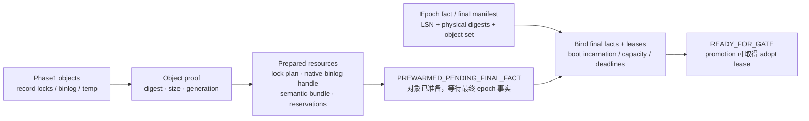

### 9.1 prepared resource set

- **Semantic bundle：**完成认证解码和语义校验，但不长期保留不需要的超大 payload 副本。
- **Record-lock metadata plan：**把外部锁对象解析成按页组织、可直接 import 的计划，并保留页布局与锁代际摘要。
- **Native binlog cache handle：**从 staging payload 准备可被目标 THD 直接接管的文件/handle，避免 resume 时重新水化和重写完整 cache。
- **Resource reservations：**按 epoch/token 预留 lock plan、binlog、内存和文件资源；没有资源 lease 的“ready”不会进入 gate。

### 9.2 严格 registry 状态机

图 9：正常主线与终止状态

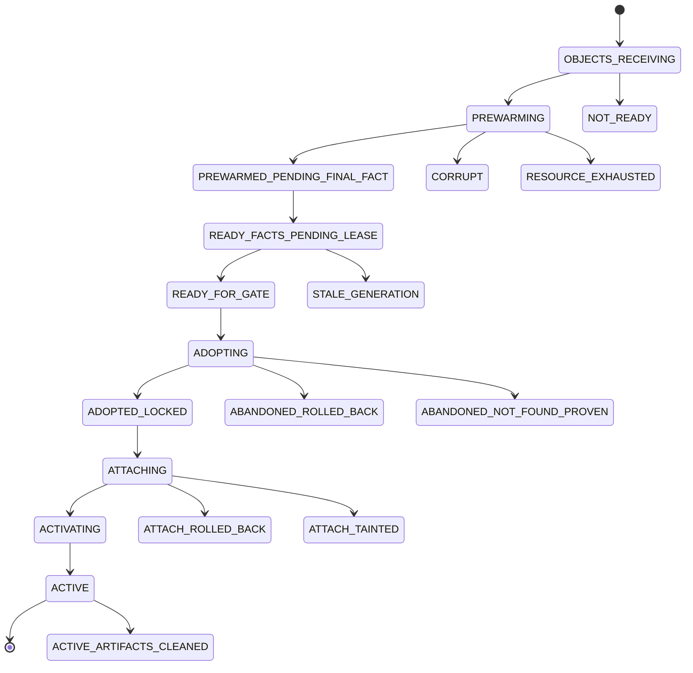

其他清理状态包括 `CLEANUP_PENDING`、`CLEANUP_ROLLED_BACK` 和 `CLEANUP_TAINTED`。

Registry key 不只包含 token，还包含 `preserve_dir`、source UUID、epoch id、target boot incarnation 和 generation。
这样可以拒绝旧进程、旧 epoch 或同名 token 的资源复用。prepare lease、gate adopt lease、attach lease 和 cleanup lease
让同一时刻只有一个所有者推进状态。

**主要源码：**`sql/preserve_trx_promotion_prepared.*` 的 strict registry、final facts、resource leases；
`sql/preserve_trx_transfer.cc` 的 receiver object/staged-token/committed-epoch prewarm jobs。

## 10. 物理晋升门

Promotion gate 的目标不是“在备端重新恢复一次所有工件”，而是在一个有物理一致性证明的短窗口内，
把已经预热好的 token 从 standby-pending 所有权转成 promotion-owned detached transaction。

> **先区分两套 promotion 入口**  
> 协议帧 `PROMOTION_PREWARM_TOKEN` / `PROMOTION_GATE_EPOCH` 调用的是 legacy ready-cache + apply-barrier 路径，
> 最终进入 `preserved_trx_adopt_standby_pending_all_for_promotion()`。
> 本节流程图描述的是严格物理路径：`preserved_trx_adopt_prepared_epoch_for_physical_promotion()`
> 使用 strict registry 与 production physical-fence lease。两者共享部分工件与预热结果，但不是同一个 gate；
> 当前仓库内没有 strict 路径的生产调用者。

图 10：Physical fence、gate lease 与 prepared trx adopt

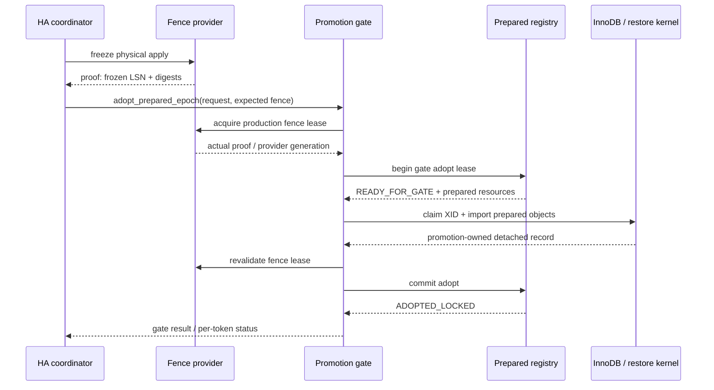

### 10.1 physical fence 证明什么

证明至少绑定 source lineage、target server/boot incarnation、provider generation、source fence LSN、target frozen LSN、
epoch fact digest，以及 final lock generation、page layout 和 dictionary generation 摘要。
provider 通过 `acquire / revalidate / release` 租约维持证明有效期；gate 在关键边界重新验证，
避免 apply 在导入锁或认领事务时继续推进。

### 10.2 adopt 做什么

Gate 为整个 epoch 写 strict promotion intent，逐 token 取得 adopt lease，再调用共享 recover/adopt kernel：
按 Preserve XID claim prepared transaction，恢复 isolation/read view、table/record locks 和 detached MDL，
注册 promotion-owned record，最后把 registry 推进到 `ADOPTED_LOCKED`。此时事务还没有进入客户端 THD，也没有 ACTIVE。

**主要源码：**`sql/preserve_trx_promotion.*` 的
`preserved_trx_adopt_prepared_epoch_for_physical_promotion()`；
`sql/preserve_trx_promotion_prepared.*` 的 production physical fence provider；
`sql/preserve_trx.cc` 的 shared recover/adopt kernel。

## 11. 目标会话接管

Gate 完成后，事务仍是 promotion-owned detached 状态。真正的 resume 发生在一个受保护、状态干净的目标 THD 上：
先恢复 SQL 层语义和资源句柄，再跨过 InnoDB activation boundary。这个顺序决定了失败能否回滚到安全状态。

图 11：Protected THD attach 的提交顺序

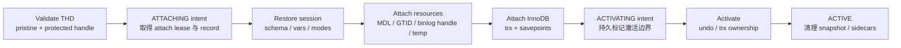

### 11.1 为什么要 protected handle

attach 过程会替换目标 THD 的事务、MDL、GTID、binlog cache、session vars 和临时表命名空间。
API 接受 `Preserved_trx_peer_thd_handle` 而不是裸 `THD*`，要求调用方先建立受保护的生命周期与线程上下文，
防止连接在接管中途被普通协议路径并发使用或销毁。

### 11.2 activation boundary

在 `ACTIVATING` 之前，失败可以把已经挂到目标 THD 的对象逐项拆回 promotion-owned record，
并保持 prepared transaction 不激活。一旦 binlog ownership、undo 和 InnoDB trx 激活完成，
系统就必须按 ACTIVE 所有权处理，不能再把它伪装成“从未 attach”。

strict attach intent 记录 `ATTACHING → ACTIVATING → ACTIVE`，让进程异常后仍能判断所有权停在哪一侧。

### 11.3 最终可见语义

成功后，新连接继承原事务需要的 schema、隔离级别、SQL mode、时区、autocommit 相关状态、GTID/binlog cache、
MDL、read view、锁、savepoints 和临时表。如果 preserve 时显式选择 `WITH USER VARS`，
目标 THD 的 user variables 也按快照恢复；否则不恢复。

未选择 INCLUDE 时 bundle 不写 user-vars payload，resume 也不会顺手清空目标 THD 已有的 user variables。
客户端随后可以继续执行 DML、`COMMIT` 或 `ROLLBACK`。

**主要源码：**`sql/preserve_trx.cc` 的 `preserved_trx_resume_adopted_for_promotion_on_thd()`；
`sql/preserve_trx_promotion_prepared.*` 的 attach intent/lease；
`plugin/test_preserve_trx_promotion` 的测试调用示例。

## 12. 本地启动恢复

本地 shutdown/restart 是另一条使用同一 bundle 和恢复内核的路径。它与 standby promotion 最大的区别不是“是否重启”，
而是工件身份和物理一致性证明：本地 snapshot 已绑定本实例 datadir；
standby-pending 必须等外部 physical fence 后由 promotion gate adopt。

图 12：Local recovery 与 standby promotion 的分叉

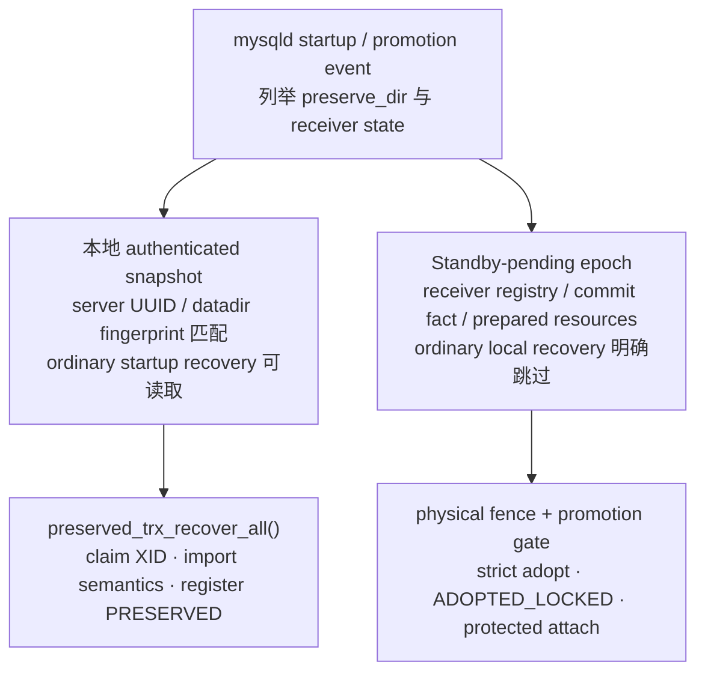

`preserved_trx_recover_all()` 扫描 carrier 工件，验证 snapshot，按 token/XID claim prepared trx，
恢复 read view、锁、MDL 等语义并注册为 `PRESERVED`。启动恢复可并行处理 token，也可预取 record-lock 涉及的页。
没有对应 snapshot 的 Preserve prepared XID 会按 orphan 规则处理，超时 token 由 reaper 取得 manager 所有权后回滚。

这条路径会过滤 standby-pending 工件，防止目标 mysqld 在没有 physical fence 的情况下把跨机 token 当作本地事务恢复。
两条路径在 bundle 语义和 recover/adopt kernel 上复用，在工件准入和所有权状态机上严格分离。

**主要源码：**`sql/preserve_trx.cc` 的 `preserved_trx_recover_all()`、shared recover/adopt kernel、record reaper；
`sql/preserve_trx_carrier_file.cc` 的 artifact listing 与 token state。

## 13. 对象恢复原理

“事务能继续执行”依赖多个对象族同时恢复。下面按对象说明保存内容、恢复动作和最关键的不变量。

| 对象族 | Preserve / prewarm | Adopt / attach | 关键不变量 |
| --- | --- | --- | --- |
| InnoDB trx / undo | prepare、分配 Preserve XID、保护 rollback segment、detach 原 THD | 按 XID claim，挂接新 THD，最后 activate undo/trx | 同一 prepared trx 只能有一个 owner；prepare 后失败必须显式 reattach/rollback/留存。 |
| Read view | 导出 creator/low/up limits 与 active trx ids | 在物理数据一致后导入到 claimed trx | 恢复后的可见性边界与原事务一致，不能用“新建一个 read view”代替。 |
| Record / gap / next-key locks | 物化隐式锁，导出页身份、heap bitmap、mode/type、generation；phase1 可 warmcopy | prewarm 构建 metadata plan，gate 在 fence 下恢复锁对象 | 页布局、字典代际、锁代际与 physical proof 一致；锁 accounting 不能重复或遗漏。 |
| Table / predicate / AUTO_INC locks | 独立 payload 与拥有标记，和 record locks 一起做 canonical 核对 | 在事务激活前恢复对应 InnoDB lock family | 表锁 payload 与派生的 autoinc ownership 必须一致。 |
| MDL | 导出 namespace/db/name/type/duration，原 THD 释放后由 detached context 持有 | 先恢复到 detached owner，再转给目标 THD | 对象名、权限与字典身份重新校验；不能在事务激活后才补锁。 |
| Savepoints | 同时保存 SQL savepoint 顺序、InnoDB savepoint、binlog participant suffix | 按 participant topology 重建并挂回 THD/trx | 不能只恢复 savepoint 名称；rollback-to-savepoint 的引擎和 binlog 边界都要一致。 |
| Binlog / GTID | 保存全局/会话 logging 状态、四态语义、cache bytes/descriptor、GTID ownership | attach 预建 native handle，恢复 GTID 与 cache ownership | “未记录”“记录但空 cache”“记录且有 cache”语义不同；只看文件大小会丢信息。 |
| Session / user vars | 保存 schema、isolation、sql mode、timezone、checks、autoinc 参数等；user vars 仅显式 INCLUDE | 先备份目标 THD，再原子替换；失败时恢复原状态 | resume 不能污染调用连接；user vars 的默认行为是排除。 |
| Temporary tables | phase1 复制物理基线、buffer-pool overlay、dirty pages 与 no-redo undo；生成 manifest | 采用 sidecars、重建 fil/dict 对象与 ownership，连接 no-redo undo 后恢复 DML | SQL journal 只证明变更历史和不支持边界，不承担行级重放。 |

### 13.1 InnoDB 事务、undo 与 read view

Preserve 用专用 magic XID 把普通事务转成可在 crash recovery 后识别的 prepared transaction。
prepare 期间保护对应 undo/rseg，防止 purge 或启动清理把它当作普通残留事务处理。
detach 只改变会话所有权，不提交也不回滚事务。Resume 时 claim 同一个 XID，再导入原 read view，
保证快照读仍处在原可见性边界。

| 时点 | InnoDB state | `mysql_thd` | `preserve_trx_claimed` | 所有权解释 |
| --- | --- | --- | --- | --- |
| 原生 prepare 完成 | `PREPARED` | 原 THD | `false` | 事务仍在原会话的 preserve 流程中。 |
| 源端 detach 完成 | `PREPARED` | `nullptr` | `false` | 事务已脱离会话，靠 magic XID 与 SQL 层工件定位。 |
| 本地 recovery / strict adopt claim | `PRESERVED` | `nullptr` | `true` | 当前 mysqld 独占认领，可导入对象但尚未 ACTIVE。 |
| Attach 与 activate 完成 | `ACTIVE` | 目标 THD | `false` | 普通事务路径重新成为唯一 owner。 |
| 激活前 attach 失败并 detach | `PRESERVED` | `nullptr` | `true` | 所有权退回 preserved record，可重试或清理。 |

### 13.2 锁与 MDL

记录锁导出不是简单枚举 `lock_t` 指针。它需要把隐式记录锁物化为可持久表示，
保存 space/page/index 身份、heap bitmap、锁模式和 gap/next-key 语义。
lock warmcopy 在 phase1 跟踪 mutation，seal 时冻结 generation 并做 canonical 对比；
接收端预热将 blob 转成按页的 import plan。MDL 属于 SQL 层，原 THD 退出后由 detached MDL context 暂持，
直到新 THD 接管。

### 13.3 Binlog cache 与 GTID

Bundle 明确区分四种 binlog 状态：全局关闭且无 cache、会话关闭且无 cache、开启但未写 cache、已写且必须恢复 cache。
warmcopy 可以提前持久化大 cache；接收端将 staging payload 准备成 native handle。
attach 时把 handle 与 GTID ownership 交给目标 THD，避免在快速恢复路径重新读取、写出整份 cache。

### 13.4 用户临时表

InnoDB 用户临时表既不进入普通 redo，也不靠重启恢复，因此是 Preserve 的独立物理对象。
phase1 participant 复制表空间基线，合并 buffer pool 中较新的页，持续输出 dirty-page stream，
并保存 no-redo undo sidecar、DD/dict 绑定和 page ownership 证明。

seal 后生成 manifest；resume 采用这些物理 sidecar，重建 adopted fil space 与内存 dict 对象
（不写入持久 DD，也不加入普通 temp pool），并把 no-redo undo slot/FSEG 重新接回事务。

SQL journal 记录 DDL/DML 边界、顺序和不支持操作，用于判断 baseline + dirty pages 是否仍可信；它不是行重放日志。
这点直接决定了实现能保留索引、页内状态、未提交修改和后续 DML 所需的 undo 关系。
no-redo sidecar 也不是整套替换共享 rollback segment：rseg header/allocator 页主要作为一致性证明，
事务专属 undo header/log 页按保留 slot 与 FSEG 接管。

> **本地临时表恢复与跨机 portable transfer 要分开理解**  
> 当前本地 carrier/resume 已实现临时表 image、no-redo undo 与 native ownership 接管；transfer 协议也保留了
> `TEMP_TABLE_SIDECAR` 对象类型。但当前 portable sender 在 bundle 含非空 `temp_table_manifest_payload` 时直接返回
> `UNSUPPORTED`，因此不能把本地临时表能力等同为当前跨机 sidecar 交付能力。

**InnoDB 主要源码：**`storage/innobase/trx/trx0preserve.*`、`trx0temp_preserve.*`；
`storage/innobase/lock/lock0preserve.*`、`lock0warmcopy.*`。

**SQL 主要源码：**`sql/preserve_trx_temp_table.*`、`preserve_trx_lock_warmcopy.*`、
`sql/binlog.cc` 的薄接入点。

## 14. 一致性与所有权

代码里大量 marker、lease、generation 和 digest 并非重复防御。它们分别约束“事实是否匹配”和“当前由谁处置”，
两类问题缺一不可。

### Generation / incarnation

Drain generation、warmcopy generation、source incarnation、target boot incarnation、provider generation
防止新进程误用旧内存状态或旧文件。

### Digest commitments

Frame/object/fact digest 证明网络对象；canonical/lock/page-layout/dictionary digest 证明语义对象与物理副本；
HMAC 证明端点信任。

### Intent journals

Promotion intent 与 attach intent 在不可逆边界前写入，进程崩溃后可以判断事务停在 ADOPTING、
ADOPTED_LOCKED、ATTACHING、ACTIVATING 还是 ACTIVE。

### Leases

Physical fence lease 约束物理世界不再变化；prepare/adopt/attach/cleanup lease
约束同一个 token 只有一个软件所有者。

### XID provenance

`.xid_provenance` 在引擎 prepare 前记录 `PREPARED_INTENT`，snapshot 发布后推进到 `SNAPSHOT_BOUND`，
用于区分“存在 magic XID”与“已有可绑定恢复工件”。

所有权沿以下对象传递：

| 所有者 | 含义 |
| --- | --- |
| 源端原 THD | 在 detach 之前拥有 active transaction；detach 后不能继续执行该事务。 |
| 本地 preserved record | 持有 prepared transaction 与 bundle 的本地恢复所有权，可被 owner 或特权账号 resume。 |
| Receiver registry | 持有 standby-pending 工件，不等价于本地可恢复事务。 |
| Prepared registry lease | 持有预热资源，并在 gate/attach/cleanup 之间传递独占权。 |
| Promotion-owned record | Gate 已认领 InnoDB prepared trx，但尚未挂入客户端 THD。 |
| 目标 THD | 跨过 activation boundary 后成为唯一 active owner，普通事务提交/回滚路径重新接管。 |

### 14.1 Fail closed 的含义

对 Preserve / Resume 来说，“尽量恢复”会制造比报错更严重的语义分叉。
任何身份、代际、摘要、资源或物理 fence 不匹配都不能降级为猜测性接管。

失败处理的目标是明确落到某个所有权状态：原 THD 继续持有、prepared trx 被回滚、token 保持可观察，
或工件进入 cleanup/tainted 状态；不能出现事务已被 detach 但系统说不清由谁负责的中间地带。

### 14.2 对原生 MySQL 路径的隔离

Parser、协议分发、THD、binlog、InnoDB lock/trx/undo/temp/FSP 等共享路径只放薄 hook，
并由 `preserve_trx_enable`、子特性 sysvar、active policy/epoch 或内部 admission 状态保护。
特性关闭时，普通 MySQL 8.0.22 行为应保持不变；真正的状态机和大对象逻辑集中在专用模块中。

## 15. 命令、配置与观测

### 15.1 SQL 表面

| 命令 | 用途 | 关键语义 |
| --- | --- | --- |
| `PREPARE SHUTDOWN PRESERVE TRANSACTION ...` | 保存当前连接上的单个事务，并进入 shutdown 交接。 | 使用共享 preserve kernel；token 由客户端接收。 |
| `DRAIN TRANSACTIONS PRESERVE ...` | 批量收口所有目标业务事务；生产 standby transfer 的总控入口。 | 两阶段 warmcopy、admission close、并行 preserve、epoch commit。 |
| `RESUME PRESERVED TRANSACTION '<token>'` | 普通本地 preserved token 的会话接管。 | 校验 owner/特权与对象权限；standby-pending 不走这条入口。 |
| `SHOW PRESERVED TRANSACTIONS` | 查看当前账号可见的本地 preserved transactions。 | 底层使用同一份可见性过滤与 PFS 行数据。 |

#### `WITH USER VARS` 到底表示什么

`DRAIN TRANSACTIONS PRESERVE WITH USER VARS` 表示：对本批次中每一个被 preserve 的目标会话，
序列化该会话的 user variables，以后 resume 到新 THD 时用快照恢复。
它不是保存 drain 管理连接自己的变量，也不是允许命令里引用 user variable。
代码只有在 `user_vars_mode == INCLUDE` 时调用 user-vars export；默认省略和显式排除都不会保存。

| 写法 | 解析结果 | 恢复行为 |
| --- | --- | --- |
| `DRAIN TRANSACTIONS PRESERVE WITH USER VARS` | `INCLUDE` | 保存并恢复每个目标会话的 user variables。 |
| `DRAIN TRANSACTIONS PRESERVE WITH NO USER VARS` | `EXCLUDE` | 不保存 user variables；resume 不清空目标 THD 原有变量。 |
| `DRAIN TRANSACTIONS PRESERVE NO USER VARS` | `EXCLUDE` | Batch drain 额外接受的无 `WITH` 等价写法；恢复行为相同。 |
| `DRAIN TRANSACTIONS PRESERVE` | `DEFAULT` | 当前实现不导出 user variables，也不在 resume 时清空目标 THD 变量。 |

```sql
DRAIN TRANSACTIONS PRESERVE
  WITH TIMEOUT 300
  WITH USER VARS;
```

### 15.2 配置分组

| 分组 | 代表性 sysvar | 控制内容 |
| --- | --- | --- |
| 总开关与目录 | `preserve_trx_enable`、`preserve_trx_dir`、`preserve_trx_off_artifact_policy` | 特性启停、工件根目录、关闭时工件处置策略。 |
| Token 与容量 | `preserve_trx_max_total`、`max_pending_per_user`、`max_snapshot_bytes`、`memory_budget_bytes` | 全局/账号配额、snapshot/blob/内存上限与 spill 粒度。 |
| Drain 与并行 | `preserve_trx_drain_mode`、`drain_grace_ms`、`batch_max_transactions`、`parallel_preserve_threads` | 软/硬 drain、目标数、关闭窗口与 worker 数。 |
| Warmcopy | `preserve_trx_warmcopy_enable`、`lock_warmcopy_enable`、`lock_warmcopy_max_memory_bytes`、`lock_warmcopy_seal_threads` | binlog/record-lock phase1、尾部预算、journal 与 seal 并发。 |
| 临时表 | `preserve_trx_temp_table_enable`、`max_temp_sidecar_bytes` | 用户临时表物理 preserve 与 sidecar 容量。 |
| Transfer endpoint | `preserve_trx_transfer_receiver_enable`、`allowed_source_uuid`、`target_server_uuid`、`target_host/port/socket/user` | 接收端启用、端点身份、发送目标与连接方式。 |
| Transfer 安全/流控 | `credential_name`、`credential_secret_file`、`chunk_bytes`、`max_inflight_bytes`、`commit_timeout_ms` | 凭据、frame 大小、在途字节与 ACK/commit 超时。 |
| Receiver / promotion | `transfer_receiver_workers`、`promotion_gate_batch_tokens`、`promotion_gate_workers`、`promotion_gate_timeout_ms` | 异步 apply/prewarm 并发与晋升门批量执行预算。 |

`preserve_trx_transfer_receiver_enable` 和 transfer artifact mode 属于 startup-only 选项。
接管新环境时应从实际部署配置读取默认值和容量，不要只凭 sysvar 名称推断生产策略。

### 15.3 权限与可见性

- Batch drain 属于 shutdown 级管理动作，走 `SHUTDOWN` 权限检查。
- Transfer classic command 只有在总开关和 receiver startup option 都开启时才可用，并要求动态权限 `PRESERVE_TRX_TRANSFER_ADMIN`。
- 普通 resume 默认要求 token owner；动态权限 `RESUME_ANY_PRESERVED_TRANSACTION` 可跨账号接管，但仍会重新检查涉及 schema/table/routine/trigger/MDL 对象的权限。
- PFS/SHOW 默认只显示本账号 token；`PROCESS` 或 resume-any 权限可查看更多行。没有 `PROCESS` 时 token 在结果中会被脱敏。
- Transfer credential 优先使用命名 credential，后备 secret file；文件读取使用 no-follow，要求普通文件、owner 为当前 euid，且 group/other 无权限。
- TCP 连接强制 `SSL_MODE_VERIFY_IDENTITY` 并确认实际 cipher；Unix socket 不启用 TLS。端点 UUID 与 ACK HMAC 共同参与信任边界。

### 15.4 观测面

`performance_schema.preserved_transactions` 是本地 preserved record 的主表，包含 token/owner/state、创建与过期时间、
恢复次数、schema/isolation、修改表/锁/read view/savepoint、binlog/GTID、AUTO_INC 和临时表 sidecar 状态。
它不等价于 receiver strict registry 的完整视图。

`SHOW PRESERVED TRANSACTIONS` 与该表都读取当前进程内 registry，不会临时扫描 carrier 目录寻找所有文件。

| 观测阶段 | 指标重点 |
| --- | --- |
| 源端 phase 2 | total、target wait、participant prepare/close/preflight、lock seal、prepare/detach/snapshot/register、SLO miss。 |
| Transfer / receiver | phase1 batch bytes/linger、frame/ACK、spool/apply、object prewarm、resource admission、epoch readiness。 |
| Promotion / resume | gate elapsed/token results、fence wait/revalidate、record-lock page get、lock apply、resume core p50/p95/p99/max、binlog attach I/O。 |

排障时先按 epoch/token 对齐四类事实：源端 drain 日志、receiver frame/commit 状态、prepared registry 状态、promotion/attach intent。
单看“文件存在”或“PFS 有行”不足以判断事务当前可接管。

## 16. 代码地图

推荐按运行路径读代码，不要先从 InnoDB hook 逐个反推。先掌握 orchestration 和所有权状态，再进入对象 codec 与共享路径接入点。

图 13：模块依赖与阅读方向

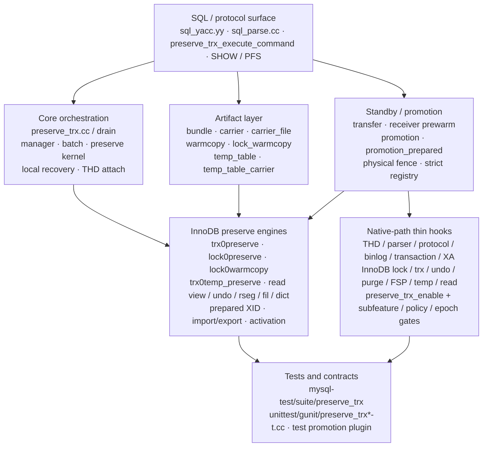

### 16.1 推荐阅读顺序

1. **先读公开状态与入口。**从 `sql/preserve_trx.h` 的 manager state、preserve stage、promotion attach API 开始，再看 grammar 和 command dispatch。
2. **顺着生产总控走一遍。**在 `sql/preserve_trx.cc` 找 batch drain、warmcopy participant、`preserve_trx_kernel_preserve_attached_transaction()`，建立源端时序。
3. **理解 bundle/carrier。**阅读 `preserve_trx_bundle.*` 的 metadata/TLV/codec，再读 carrier 的原子写、adopt 和清理规则。
4. **进入 transfer/receiver。**从 `preserve_trx_transfer.h` 的 manifest/frame/receiver state 入手，再追 source epoch session、dispatcher、spool 与 prewarm queue。
5. **读 strict promotion。**先读 `preserve_trx_promotion_prepared.h` 的 state/key/final facts/lease，再看 promotion gate 与 physical fence 的实现。
6. **回到 attach 与共享恢复内核。**对照 local startup recovery 和 standby adopt，确认哪些对象复用同一 kernel、哪些准入条件必须分开。
7. **最后下沉 InnoDB。**依次看 trx、record/table locks、warmcopy、temp preserve，再用 shared-path hooks 验证调用如何被 gated。
8. **用测试锁定语义。**MTR 看 SQL 行为和 crash/restart；GUnit 看 codec、状态机、lease、gate；lint test 只作为源码形状合同，不能代替运行时证据。

### 16.2 模块索引

| 模块 | 职责 | 接手时重点找的符号 |
| --- | --- | --- |
| `sql/preserve_trx.cc/.h` | manager、single/batch preserve、shared recover/adopt、local resume、promotion attach | `Preserve_trx_drain_service::execute`、`preserve_trx_kernel_preserve_attached_transaction`、`preserved_trx_recover_all` |
| `sql/preserve_trx_bundle.*` | 语义模型、TLV、v9 codec、external blob descriptors | `Preserve_snapshot_metadata`、`build_preserved_trx_bundle`、encode/decode |
| `sql/preserve_trx_carrier*.cc` | 本地文件布局、原子发布、预建 blob adopt、token state、清理 | `Preserve_trx_artifact_sink`、file carrier store/read/delete/list |
| `sql/preserve_trx_transfer.*` | portable manifest、frame/ACK、source epoch、receiver、spool、prewarm workers | `Preserve_trx_transfer_source_epoch_session`、`preserve_trx_transfer_dispatch_command` |
| `sql/preserve_trx_promotion.*` | epoch gate、apply/fence 检查、prepared token adopt、结果与指标 | `preserved_trx_adopt_prepared_epoch_for_physical_promotion` |
| `sql/preserve_trx_promotion_prepared.*` | physical fence provider、strict registry、final facts、intent、resource leases | `Preserve_trx_prepared_token_state`、`Preserve_trx_final_token_facts` |
| `sql/preserve_trx_warmcopy.*` | Binlog cache phase1 copy 与 tail seal | warmcopy provider/artifact、prefix/digest/durable metrics |
| `sql/preserve_trx_lock_warmcopy.*` | Record-lock warmcopy participant，以及 table/predicate/AUTO_INC 的最终 freeze/seal/canonical 验证 | `Preserve_trx_lock_warmcopy_drain_participant` |
| `sql/preserve_trx_temp_table*.cc` | 临时表 phase1、manifest、sidecar carrier、resume materialization | `Temp_table_warmcopy_participant`、ownership reservation/adopt |
| `storage/innobase/trx/trx0preserve.*` | prepared XID、detach/claim/attach/activate、read view、savepoint | `trx_preserve_*` API |
| `storage/innobase/lock/lock0preserve.*` | 锁导出/导入、隐式锁物化、metadata plan、页/generation 证明 | `trx_preserve_*locks*`、record-lock plan |
| `storage/innobase/lock/lock0warmcopy.*` | record-lock phase1 store、mutation、freeze 与 seal | warmcopy epoch/store/final artifact |
| `storage/innobase/trx/trx0temp_preserve.*` | 临时表空间、no-redo undo、dict/fil/page ownership adopt | `trx_preserve_temp_*` API |
| `storage/perfschema/table_preserved_transactions.*` | 本地 preserved transaction 观测表 | table definition、row visibility、snapshot population |
