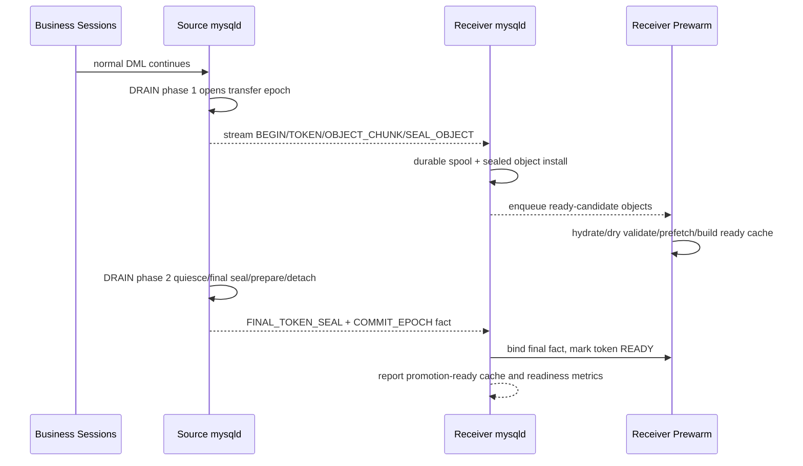
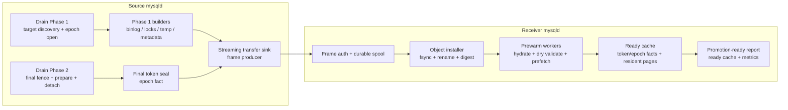

# Preserve/Resume Standby Streaming Transfer And Realtime Prewarm Design

## 1. 背景与目标

本设计面向物理备机升主前的 Preserve/Resume 准备链路。当前项目没有真实物理备机、
redo apply coordinator 和升主控制面，因此本设计不实现也不验收真正的 promotion 操作。
本设计要落地的是 promotion 之前的准备工作：source 端从 drain phase 1 开始持续
transfer，receiver 端边收边 durable spool、install、prewarm，并在 source drain phase 2
完成后以毫秒级尾延迟进入 promotion-ready 状态。

业务可感知阻塞在本设计中的口径是：

```text
本设计直接影响的卡顿 ~= source drain phase 2
receiver readiness lag ~= receiver_ready_us - source_phase2_end_us
```

为了达成这个目标，transfer 和 prewarm 必须前移：

- source drain phase 1 一开始就打开 standby transfer epoch。
- receiver 收到 frame 后先 durable spool，再并行 seal/install/prewarm。
- phase 2 只发送 tail/final descriptor、epoch fact、commit marker 等小对象。
- phase 2 完成时，receiver 应已经具备 promotion-ready cache；最多只剩 final fact
  绑定、状态翻转和指标发布等毫秒级尾工作。

如果 receiver 落后、ready cache 缺失或 apply provider 不可用，本设计只报告
`RECEIVER_PREWARM_LAG`、`READY_CACHE_NOT_READY` 或 `APPLY_PROVIDER_NOT_INSTALLED`。
真正升主时如何处理这些状态由后续物理备机/HA 项目决定；本项目不能退回 cold startup
import 路径来掩盖准备链路未完成。

## 2. 当前代码事实

当前代码已经具备若干基础件，但还不是完整的实时链路。

### 2.1 已存在的 transfer frame 类型

`sql/preserve_trx_transfer.h` 已定义：

- `BEGIN`
- `OBJECT_CHUNK`
- `SEAL_OBJECT`
- `COMMIT_EPOCH`
- `ABORT`
- `PROMOTION_PREWARM_TOKEN`
- `PROMOTION_GATE_EPOCH`

`sql/preserve_trx_transfer.cc` 中的 `preserve_trx_transfer_build_frame_sequence()`
可以把一个已构建完成的 manifest 和 objects 编成 `BEGIN -> OBJECT_CHUNK ->
SEAL_OBJECT -> COMMIT_EPOCH` frame 序列。当前关键限制是：该函数消费的是已经
materialized 的 objects，语义更接近“artifact build 完成后发送”，不是 phase 1
期间持续 streaming。

### 2.2 已存在的 receiver frame 入口

`preserve_trx_transfer_apply_receiver_frame()` 已能处理 receiver side frame。

- `PROMOTION_PREWARM_TOKEN` 会调用
  `preserved_trx_promotion_prewarm_standby_pending_tokens()`。
- `PROMOTION_GATE_EPOCH` 会构造 promotion request，并调用
  `preserved_trx_adopt_standby_pending_all_for_promotion()`。

当前缺口是 receiver durable spool、worker 编排和自动 prewarm 生命周期不完整。
也就是说，prewarm 已有函数入口，但还不是“收到可 sealed 对象后自动开始”的生产链路。

### 2.3 已存在的 promotion ready cache

`sql/preserve_trx_promotion.cc` 中已有 ready cache：

- prewarm 会读取 standby-pending token。
- hydrate bundle semantic blobs。
- dry validate。
- 对 record lock page plan 做 prefetch/residency check。
- gate 要求 ready cache hit、epoch fact digest match、record pages resident。

这说明 “gate 内不做 cold record-lock import” 的方向已经落在代码结构上。但当前
release 环境中 apply provider 仍应由未来物理备机/HA 模块安装；本项目只能提供接口、
simulator、fail-closed 语义和 receiver/prewarm 准备能力。

### 2.4 当前不能宣称 production-complete 的原因

当前链路还缺少以下生产能力：

- source phase 1 streaming artifact sink。
- receiver durable frame spool 和 ACK-after-durable 语义。
- receiver worker pool 对 token/object 的有序并发处理。
- receiver 端收到 sealed object 后自动 prewarm。
- phase 2 final token seal / epoch fact 与 receiver ready cache 的强绑定。
- production apply-state provider 接入；当前真实物理备机升主控制面还不存在。
- source drain -> receiver durable write -> realtime prewarm -> phase2 final fact ->
  receiver promotion-ready 的 release 证据。
- 真正 promotion gate 和 ordinary resume 由后续物理备机/HA 项目接入，不属于本设计的
  production-complete 判定。

### 2.5 当前代码与目标契约的落差

后续章节描述的是目标架构。当前代码已有单线程骨架、ready cache、epoch fact、
transfer frame、shared recover/adopt kernel 等基础件，但以下目标契约尚未完全落地：

| 目标契约 | 当前状态 | 设计要求 |
|---|---|---|
| post-claim import/register 失败后 rollback 或进入可精确审计状态 | `taint_adopted_tokens_after_marker_failure()` 会把 adopted token 标成 `CLEANUP_TAINTED`，但不回滚已 claim/adopt 的 prepared trx | Phase 5 必须补 rollback，或引入 `ADOPTED_BUT_MARKER_NOT_DURABLE` 一类更精确状态，不能把 live adopted trx 与 durable tainted marker 混成同一种事实 |
| LSN 绑定 | source build 已通过 LSN provider / current redo LSN 填充非零 `source_prepare_lsn`、`source_epoch_commit_lsn`，拿不到非零 LSN 会 fail closed；但 gate/fact 解码侧还必须显式拒绝零 LSN | epoch fact decode、ready cache 和 gate 入口都要校验 per-token LSN 非零，并使用 `source_epoch_commit_lsn` 作为 apply barrier 下限 |
| target identity 绑定本机 | receiver manifest 校验当前依赖 `preserve_trx_transfer_target_server_uuid` 配置值，不等价于本机 `server_uuid` 强绑定 | receiver 启动或 gate 前必须校验 `fact.target_server_uuid == 本机 server_uuid`；sysvar 只能表达期望目标，不可替代本机身份事实 |
| durable frame spool | 当前有 object staging 文件和 in-memory receiver registry，但没有可 replay 的 durable frame spool | receiver crash 后必须能从 durable frame log 重建 receiving/sealed/prewarm 状态，否则不能声明 crash-safe streaming transfer |
| frame sequencing | frame 结构已有 `sequence` 字段，但本文档原始幂等 key 未把 `sequence` 写入，并且未定义乱序/gap 处理 | streaming 协议必须定义 epoch/token 内 sequence 重组、gap detection 和 retransmit/fail-closed 语义 |
| record-lock residency | ready cache 记录 page resident 状态，但还没有定义从 prewarm 到 gate 的 page retention/pin 策略 | 如果要求 `cold_gets=0`，必须有 pin/保留池/短窗口重验策略；否则 gate 只能把 residency miss 当 not-ready |

## 3. 目标状态

目标状态是把跨节点 Preserve/Resume 分成三条并行或顺序很短的流水线：



关键语义：

- phase 1 transfer/prewarm 是后台准备工作，必须和业务 DML、drain phase 1 重叠。
- phase 2 完成时 receiver 只允许做 final fact 绑定和极小 tail work；这个尾工作必须以
  `receiver_ready_after_source_phase2_end_us` 度量。
- 未来 promotion gate 只能消费 receiver 已准备好的 ready cache；它不属于本设计的
  production 验收动作。
- ready cache miss 是准备链路失败或滞后信号，不是未来升主现场补救信号。

## 4. 性能口径

### 4.1 本设计验收目标

本设计的验收目标是 receiver 在 source drain phase 2 结束后立即进入
promotion-ready 状态，而不是验收真正的物理备机升主动作：

```text
receiver_ready_after_source_phase2_end_us =
  receiver_promotion_ready_us - source_phase2_end_us
```

前提：

- source phase 1 已经开始 transfer。
- receiver 已经 durable 接收 artifacts。
- receiver 已经在 phase 1 / phase 2 期间完成 prewarm。
- phase 2 final descriptor / epoch fact / commit marker 已被 receiver 接收并校验。
- ready cache 对 standby-pending token 全命中。
- record-lock pages 已 resident 或已被 receiver 明确标记为 not-ready；不能在后续 gate
  现场 cold read。

推荐 release profile 把该尾延迟控制在毫秒级。具体阈值由测试 profile 指定，例如：

```text
receiver_ready_after_source_phase2_end_us <= 100000  # 100ms 级默认目标
```

如果某个 workload 需要更大的尾延迟阈值，应在 E2E/NFR profile 中显式写出，并报告
P50/P95/P99/max；不能把真正升主耗时或 SQL resume 耗时混进这个指标。

### 4.2 下游背景指标

下面这些指标对后续物理备机/HA 项目有价值，但不是本设计的 production-complete
判定条件：

- `promotion_gate_elapsed_us`
- `promotion_gate_ready_miss`
- `promotion_gate_cold_gets`
- `promotion_gate_abandoned_count`
- `promotion_gate_apply_lsn`
- `promotion_gate_required_lsn`

本项目可以保留 simulator 或 debug/test hook 来验证“未来 gate 不应走 cold path”，但没有
真实物理备机时，不能把 simulator 结果写成真实升主结果。

### 4.3 不作为硬目标的路径

以下路径不承诺毫秒级 readiness：

- `mysqld` cold startup 恢复大量 lock-heavy snapshot。
- receiver 未完成 prewarm 时的 downstream promotion gate。
- corrupt/orphan/tainted artifact cleanup。
- 大量 stale tmp/orphan blob 清理。
- temp sidecar 不完整导致的 fail-closed cleanup。

这些路径必须功能正确、fail closed、可观测，但不能作为 promotion-ready 成功路径。

### 4.4 3 秒业务卡顿的关系

“跨节点 preserve/resume 对业务的卡顿约 3 秒”是后续完整系统的目标推导，不是本文档
百分之百落地的承诺。该推导成立需要额外前提：

```text
source drain phase2       ~= 2s 左右，按当前优化目标持续收敛
receiver readiness lag    ~= 毫秒级，由本设计负责证明
physical promote gate     由后续 HA/物理备机项目实现并证明
```

因此本文档只承诺把 phase1 transfer/prewarm 与 drain 重叠，并证明 phase2 结束后
receiver 的 prewarm/ready 尾延迟是毫秒级。真正升主命令、apply freeze、peer THD
绑定、claim/import/register、SQL resume 下发均不在本文档生产验收范围内。

## 5. 总体架构



## 6. 关键状态模型

### 6.1 Epoch 状态

| 状态 | 含义 | 是否可发布 receiver READY |
|---|---|---|
| `OPEN` | source phase 1 创建 epoch，receiver 可接收 frame | 否 |
| `STREAMING` | token/object chunks 正在传输 | 否 |
| `PHASE2_FINALIZING` | source phase 2 正在产生 final seal/fact | 否 |
| `COMMITTED` | receiver 已验证 epoch fact 和 commit marker；只表示 epoch 事实已闭合 | 否，readiness 仍取决于 per-token `READY` |
| `READY` | epoch 下所有 standby token ready cache 完整 | 是 |
| `ABORTED` | source abort 或 receiver 发现不可恢复错误 | 否 |
| `CORRUPT` | durable fact/digest 不一致 | 否 |

### 6.2 Token 状态

| 状态 | 含义 |
|---|---|
| `TOKEN_DECLARED` | receiver 已看到 token manifest skeleton |
| `OBJECTS_RECEIVING` | token 的 objects 正在接收 |
| `OBJECTS_SEALED` | token 的当前对象版本已经 digest/seal |
| `PREWARMING` | receiver 正在 hydrate/dry validate/prefetch |
| `PREWARMED_PENDING_FINAL_FACT` | 大对象已预热，但 phase 2 final fact 未到 |
| `FINAL_SEALED` | final descriptor、bundle digest、epoch fact 已验证 |
| `READY` | receiver readiness 所需全部 facts 和 resident page 已满足 |
| `UNSUPPORTED` | token 使用了当前不支持跨机 portable 的对象 |
| `CORRUPT` | digest/object/fact 不一致 |
| `ABANDONED` | service-first promotion 放弃该 token 并进入 cleanup |

### 6.3 Object 状态

| 状态 | 含义 |
|---|---|
| `DECLARED` | manifest 声明 object id、family、expected digest/size |
| `RECEIVING` | chunks 按 offset durable spool |
| `SEALED` | object payload 完整，digest 校验通过 |
| `INSTALLED` | object 已以 fsync + atomic rename 方式安装 |
| `VALIDATED` | semantic validation 通过 |
| `PREFETCHED` | record-lock pages 或其它 gate facts 已预热 |
| `FINAL_BOUND` | 与 final token descriptor/epoch fact 绑定 |

## 7. Transfer 协议设计

### 7.1 复用现有 frame 类型

第一版优先复用现有 frame 类型，不新增第二套协议。

- `BEGIN`：扩展为 token/epoch begin，可携带 `epoch_id`、`token`、source/target uuid、
  protocol version、object manifest skeleton。
- `OBJECT_CHUNK`：支持 streaming chunk；同一 object 通过 `{epoch, token,
  object_id, offset}` 幂等写入。
- `SEAL_OBJECT`：表示一个 object 版本完整，可触发 receiver install/prewarm。
- `COMMIT_EPOCH`：phase 2 之后的 epoch fact projection；只有它成功后 token 才能从
  `PREWARMED_PENDING_FINAL_FACT` 转为 `READY`。
- `ABORT`：source abort epoch 或 token，receiver 清理未 final 的 spool/install 状态。
- `PROMOTION_PREWARM_TOKEN`：保留测试/手动触发入口；生产应由 receiver worker 自动
  prewarm，不依赖 gate 前人工发送该 frame。
- `PROMOTION_GATE_EPOCH`：保留外部触发 gate 的接口；真实 HA 模块后续应通过专用
  promotion API 传入 apply provider facts。

### 7.2 Idempotency Key

每个 frame 必须由以下字段唯一标识。`sequence` 是 epoch 内单调递增序号，
receiver 用它检测乱序、缺口和重复 frame：

```text
source_uuid
target_uuid
epoch_id
token
object_id
frame_type
sequence
chunk_offset
chunk_length
payload_digest
```

不同 frame type 的有效字段不同：

- `BEGIN`：`epoch_id`、`token`、`sequence`、manifest digest。
- `OBJECT_CHUNK`：`epoch_id`、`token`、`object_id`、`sequence`、`chunk_offset`、
  `chunk_length`、payload digest。
- `SEAL_OBJECT`：`epoch_id`、`token`、`object_id`、`sequence`、object digest。
- `COMMIT_EPOCH`：`epoch_id`、`sequence`、epoch fact digest。
- `ABORT`：`epoch_id`、`token`、`sequence`、reason digest。

receiver 遇到重复 frame：

- digest 相同：幂等成功。
- digest 不同：token/epoch 标为 `CORRUPT`。

manifest 需要演进时必须 bump generation，并通过新的 `BEGIN`/descriptor 版本形成新
sequence；不能用同一 sequence 覆盖旧语义。

### 7.3 ACK 语义

receiver 只有在 frame durable append 后才能 ACK。

```text
parse/auth -> durable spool append + fsync policy -> update in-memory registry -> ACK
```

ACK 不代表 object 已 prewarm，只代表 receiver crash 后可以从 spool 恢复该 frame。

### 7.4 Frame 顺序和 torn-frame 检测

生产 streaming 支持多 data session 时，网络层不保证不同连接的到达顺序。因此 receiver
必须按 `{epoch_id, token}` 维护 sequence reorder buffer：

- `BEGIN` 到达前的非 `BEGIN` frame 可以 durable spool，但不能 apply。
- sequence gap 未补齐前，worker 不得推进该 token/object 的语义状态。
- gap 超过 deadline 或收到冲突 digest 时，token/epoch 标为 `CORRUPT`。
- `COMMIT_EPOCH` 是 batch barrier；它只能在 epoch 中所有 required token 的 sequence
  gap 关闭、object seal 完成后 apply。

durable frame 格式必须包含长度、header digest、payload digest 或 CRC。receiver crash
replay 时：

- 完整 frame：按 sequence replay。
- torn tail frame：视为未到达，可等待重传。
- torn middle frame 或 digest mismatch：epoch/token `CORRUPT`，不能 promotion-ready。

## 8. Source 端设计

### 8.1 Drain Phase 1 打开 Transfer Epoch

`DRAIN TRANSACTIONS PRESERVE` 进入 phase 1 后，drain owner 应为目标集合创建
transfer epoch：

```text
epoch_id = source_uuid + drain_id + monotonic sequence
```

phase 1 target discovery 只能收缩目标集合，不能在 late phase2 隐式新增未声明的
standby token。新增目标必须 fail closed 或落入本地 preserve fallback，不得混入同一
promotion-ready epoch。

standby transfer token 当前目标是源业务连接的 `thread_id`。该值只在一个 epoch 内有
稳定身份，源端重启后可能复用。因此 receiver 持久身份必须是 `{epoch_id, token}`，
不能只以 token 扁平命名。若兼容旧 flat token 文件名，receiver 在发现同 token 已有
`.bin`、`.standby_pending`、promotion intent/adopted/abandoned marker 时必须 fail
closed，不能覆盖旧 token。

### 8.2 Phase 1 Streaming Artifact Sink

新增 source-side streaming sink，区别于现有“构建完成后 build frame sequence”的路径。

接口形态：

```text
open_epoch(epoch, target_set)
declare_token(token, target_thread_id, local_xid, capabilities)
declare_object(token, object_id, family, expected_role)
write_object_chunk(token, object_id, offset, bytes, digest)
seal_object(token, object_id, size, digest, generation)
finalize_token(token, final_descriptor, final_bundle_digest)
commit_epoch(epoch_fact)
abort_epoch(reason)
```

该 sink 不拥有 preserve 正确性判断；它只把已经由各 participant 产生的 artifact 事实
实时传给 receiver。

### 8.3 Binlog Warmcopy Streaming

binlog cache 大对象可以在 phase 1 增长过程中分块传输：

- phase 1 发送当前稳定 chunk。
- phase 2 发送 tail chunk 和 final cache digest。
- receiver 可以提前安装稳定 chunk，但只有 final digest 到达后才能 READY。

### 8.4 Lock Warmcopy Streaming

record lock warmcopy 的目标是让 receiver 在 phase 1 就拿到 page-level / segment-level
artifact，并提前完成 page prefetch。

要求：

- phase 1 mirror/builder 输出稳定 page/bitmap segment。
- receiver 对已 sealed segment 做 dry validation 和 page prefetch。
- phase 2 只发送 tail delta、final fence digest、final descriptor。
- gate 内不允许 fallback 到 record image slow resolver 或 cold bitmap import。

### 8.5 Table / MDL / Savepoint

非 record lock family 有两种状态：

- 已具备 generation/fingerprint/portable descriptor：可参与 phase 1 prewarm。
- 仍依赖 final live compare：该 token 可功能正确 preserve，但不应计入
  `promotion_ready_guaranteed`。

在所有 required family 都达到 READY 前，epoch 不能声明 promotion-ready。

### 8.6 Temp Table Sidecar

用户临时表跨机支持必须满足 portable sidecar：

- temp image object。
- temp no-redo undo object。
- ownership exact coverage。
- rseg/page/slot reservation proof。
- native adoption capability。

缺任一事实时，该 token 只能 fail closed 或 abandoned cleanup；不能让 promotion gate
现场 materialize/scan temp sidecar。

## 9. Receiver 端设计

### 9.1 Durable Frame Spool

receiver 首先写 durable frame spool。spool 是 crash-safe truth，内存 registry 只是调度
缓存。当前代码还没有这个 spool；只有 staging object 文件和进程内 registry，因此
receiver crash 后无法完整重建 receiving/sealed 状态。Phase 2 必须先落地 durable spool，
否则不能声明 streaming transfer crash-safe。

目录结构示例：

```text
preserve_transfer/
  epochs/
    <epoch_id>/
      frames/
        <token>.<seq>.frame
      objects/
        <token>/
          <object_id>.tmp
          <object_id>.sealed
      facts/
        epoch.fact.tmp
        epoch.fact
```

写入要求：

- frame append 不覆盖已有不同 digest frame。
- object 临时文件使用 unique temp name。
- seal 使用 fsync + atomic rename + directory fsync。
- epoch fact 是最终 readiness truth，commit marker 只是 projection。
- 每个 frame 文件携带长度、sequence、header digest、payload digest；replay 发现
  torn tail 时等待重传，发现中间缺口或 digest 冲突时标记 `CORRUPT`。

### 9.2 Receiver Worker Pool

worker 调度规则：

- 同一 `{epoch, token, object_id}` 内严格按 offset/order 串行。
- 同一 `{epoch, token}` 内严格按 sequence apply；不同 data session 到达的 frame
  先进入 durable reorder buffer，缺 sequence 时不推进语义状态。
- 同一 token 的 final seal 在该 token 所有 object seal 后执行。
- 不同 token 可并行。
- `COMMIT_EPOCH` 必须等待该 epoch 所有 token final seal 完成。

`preserve_trx_transfer_receiver_workers` 从 reserved 参数转为实际 worker 数：

- `1`：串行 worker。
- `>1`：并行 token/object worker。
- `0=auto`：仅在预算、backpressure、QoS 完成后启用。

### 9.3 自动 Prewarm

receiver 不应等 promotion 命令才 prewarm。触发点：

- `SEAL_OBJECT` 完成后，enqueue token/object 到 prewarm queue。
- token 的 minimal bundle metadata 可读后，执行 dry validation。
- record-lock page plan 可读后，执行 page prefetch/residency check。
- epoch fact 到达后，绑定 final digest 和 required LSN。

ready cache entry 必须包含：

```text
epoch_id
token
source_uuid
target_uuid
bundle_digest
manifest_digest
epoch_fact_digest
required_apply_lsn
record_lock_pages_total
record_lock_pages_resident
cold_gets
ready_generation
validated_families
unsupported_reason
```

如果 `record_lock_pages_total > 0`，prewarm 完成到 receiver 发布 READY 之间必须满足
以下任一策略；如果后续 HA 项目要求 READY 后继续保持 residency，则还需要把 pin/保留
生命周期延长到下游 promotion gate 完成：

- **pin 策略**：prewarm worker 获取 record-lock page pin，receiver 发布 READY 后按
  retention policy 或下游消费完成释放。
- **保留池策略**：把 pages 放入受预算控制的 promotion-prewarm pool，禁止普通 LRU 在
  receiver 发布 READY 前回收。
- **短窗口重验策略**：不 pin，但 READY 发布前重验 residency；一旦 `resident_pages <
  page_count` 或 `cold_gets > 0`，该 token 直接 `READY_CACHE_NOT_READY`，不能现场
  cold read。

默认 release 口径应优先采用 pin 或保留池。短窗口重验只能证明 fail-closed，不能证明
持续 `cold_gets=0`。

### 9.4 未来 Promotion Gate 的消费约束

真正 promotion gate 不在本设计中实现，但它是本设计准备链路的下游消费者。为了保证
后续接入时不退回冷路径，本设计输出的 ready cache 必须满足：未来 gate 只能读 ready
cache 和小 marker/fact。

禁止：

- 现场读取大 snapshot。
- 现场 hydrate external blobs。
- 现场解析 full record lock payload。
- 现场补 prewarm。
- ready miss 后切到 local startup recovery path。

未来 gate 遇到 ready miss：

- service-first promotion：返回 token abandoned/not-ready，继续升主。
- strict promotion：拒绝本次 adopt，但不执行 cold import。

未来 gate 遇到 `UNSUPPORTED`：

- service-first promotion：该 token abandoned，cleanup state 进入 `CLEANUP_PENDING`
  或 `CLEANUP_TAINTED`，升主继续。
- strict promotion：整个 epoch adopt 失败，不能 claim 任何 token。

## 10. Apply Provider 接入边界

`preserved_trx_set_promotion_apply_state_provider()` 只能由真实物理备机升主控制面安装。
当前项目没有物理备机产品，也没有 redo apply coordinator，因此 release 运行中没有 provider
时必须 fail closed。本设计不要求也不验证真实 provider；只要求 receiver 准备出的
epoch fact、ready cache 和 metrics 能被未来 provider 消费。

provider 返回：

```text
apply_frozen
applied_lsn
source_uuid
target_uuid
provider_generation
```

后续 HA/物理备机项目在 claim/adopt 前必须重采样 provider，并验证：

- `apply_frozen == true`
- `applied_lsn >= epoch_fact.source_epoch_commit_lsn`
- source/target uuid 与 epoch fact 一致
- provider generation 未在 gate 中漂移

`apply_frozen` 的覆盖时间属于后续真实升主控制面契约。推荐生产契约为：

```text
freeze apply
  -> sample provider generation and applied_lsn
  -> claim/import/register all selected tokens
  -> write durable adopted/abandoned/intent markers
  -> unfreeze apply
```

如果 HA 控制面只能按 token 冻结，则每个 token claim 前后都必须重采样 provider，并证明
该 token 的 `apply_frozen` 连续覆盖 claim/import/marker 区间；否则 token fail closed。

本设计仍要求 receiver 把 `target_server_uuid` 绑定到本机 `server_uuid`。`preserve_trx_transfer_target_server_uuid`
只能作为配置期望值；启动或 receiver enable 时必须校验它与本机 `server_uuid` 一致，
ready 状态发布前也必须校验 `epoch_fact.target_server_uuid == 本机 server_uuid`。

## 11. Phase 2 与 Receiver Ready 的关系

phase 2 结束时必须产生以下 final facts：

- per-token final descriptor digest。
- final bundle digest。
- source prepare LSN，必须非零。
- source epoch commit LSN，必须非零。
- final record/table/MDL/savepoint fence digest。
- epoch token set digest。

receiver 收到 final facts 后，只做小对象绑定：

```text
PREWARMED_PENDING_FINAL_FACT
  -> verify final descriptor/fact digest
  -> verify object digests and token set
  -> mark READY
```

如果 phase 2 完成时 receiver 未 ready：

- source drain 仍可功能正确完成。
- receiver readiness report 必须显示 `READY_CACHE_NOT_READY` 或 `RECEIVER_PREWARM_LAG`。
- 后续真实 promotion 不能在 gate 内补 cold prewarm。

当前 source build 已有 LSN provider / current redo LSN 的非零填充基础；后续实现还必须在
epoch fact decode、ready cache 构建和 gate 入口全部拒绝零 LSN，避免旧 artifact 或坏
fact 使 apply barrier 空转。

## 12. 目标正确性不变量

1. Standby-pending token 不可被 ordinary startup recovery 当作 local token。
2. Standby-pending token 不可被普通 `RESUME PRESERVED TRANSACTION` 消费。
3. 未 final-sealed token 不可 promotion adopt。
4. 未 apply-barrier token 不可 promotion adopt。
5. Ready cache entry 必须绑定 epoch fact digest；旧 generation 不可复用。
6. receiver prewarm 是性能层；durable spool/object/fact 才是 crash-safe truth。
7. transfer/retry 必须幂等；重复 frame 不得产生重复 object 或重复 marker。
8. corrupt token 不能影响同 epoch 其它 token 的 service-first promotion。
9. receiver ready report 不得把 unsupported/corrupt/not-ready token 标成 ready。
10. phase 2 SLO miss 不等于运行时失败；promotion-ready miss 是 receiver readiness 诊断结果。

这些是不变量目标，不代表当前代码全部满足。当前已知落差包括：

- marker/intention 写失败后的 adopted token 还需要后续 promotion 实现 rollback 或更细粒度 durable 状态；这不是本设计的准备链路交付项。
- durable frame spool 还未实现，receiver crash-safe replay 尚未成立。
- target UUID 还需要绑定本机 `server_uuid`。
- zero-LSN fact 需要在 fact decode / ready cache / gate 三处强制拒绝。
- record-lock page residency 需要 pin/保留池或 gate 前重验，否则 `cold_gets=0` 不是强保证。

## 13. 失败处理矩阵

| 场景 | Source 行为 | Receiver 行为 | 下游消费语义 |
|---|---|---|---|
| phase 1 transfer 网络中断 | 重试或标记 token transfer incomplete | 保留 durable spool，等待重传 | not-ready，不 cold import |
| receiver object digest mismatch | 继续 source drain，记录 transfer failure | token `CORRUPT` | abandoned/corrupt |
| phase 2 final fact 未到 | source 未 commit epoch | token 停在 pending final fact | 不可 gate |
| receiver prewarm 落后 | source 可完成 drain | ready miss + lag metrics | 后续升主不能现场补 cold import |
| apply provider absent | 不影响 source drain | ready cache 可存在，但不声明真实 promotion 可执行 | 后续升主 fail closed |
| apply LSN 不足 | 不影响 source drain | token 保持 apply pending | not-ready / abandoned |
| downstream claim/import 失败 | 不涉及 source | 本设计不执行 claim/import；只要求 ready facts 可供后续处理 | 后续 promotion 必须 rollback claimed trx 或 taint |
| receiver crash | 不影响 source 已发送事实 | 从 durable spool 重建 registry/prewarm | 取决于恢复后 ready 状态 |
| COMMIT_EPOCH 部分发布失败 | source 已完成 drain；receiver 必须返回明确 transfer failure | 对所有已发布 token 执行 `remove_with_status`、清理 staging、标记 epoch `CORRUPT`，并记录每个 remove/cleanup 错误 | epoch 不可 gate；service-first 只能 abandoned |
| frame sequence gap 或 torn middle frame | source 等待重传请求或收到 receiver corrupt | durable spool replay 标记 token/epoch `CORRUPT` | 不可 gate |
| ready cache eviction | 不影响 source drain | token 从 READY 降级为 `READY_CACHE_NOT_READY`，记录 cold/residency miss | 不 cold import，后续 service-first abandoned 或 strict fail |
| target_uuid 与本机 server_uuid 不一致 | source transfer 可失败或 receiver 拒绝 | receiver 拒绝 manifest/fact，token unsupported/corrupt | 不可 claim |

## 14. 观测指标

### 14.1 Source 指标

- `standby_transfer_epoch_open_us`
- `standby_transfer_first_frame_us`
- `standby_transfer_first_object_seal_us`
- `standby_transfer_phase1_bytes`
- `standby_transfer_phase2_tail_bytes`
- `standby_transfer_phase2_final_frames_us`
- `standby_transfer_epoch_commit_us`
- `phase2_total_us`
- `phase2_final_transfer_us`

### 14.2 Receiver 指标

- `receiver_frames_durable_count`
- `receiver_frames_durable_bytes`
- `receiver_frame_out_of_order_count`
- `receiver_frame_gap_count`
- `receiver_durable_spool_torn_frames`
- `receiver_spool_fsync_us`
- `receiver_objects_sealed_count`
- `receiver_objects_corrupt_count`
- `receiver_prewarm_started_us`
- `receiver_prewarm_finished_us`
- `receiver_ready_tokens`
- `receiver_ready_miss`
- `receiver_record_pages_total`
- `receiver_record_pages_resident`
- `receiver_record_cold_gets`
- `receiver_record_pages_evicted_before_gate`
- `receiver_cleanup_not_found_residue`
- `receiver_prewarm_lag_after_source_phase2_us`
- `receiver_ready_after_source_phase2_end_us`
- `receiver_not_ready_tokens`
- `receiver_ready_epoch_fact_bound_count`

### 14.3 下游 Promotion 参考指标

以下指标不属于本设计的 production-complete 验收条件；它们用于后续 HA/物理备机项目
接入时确认没有退回 cold path：

- `promotion_gate_elapsed_us`
- `promotion_gate_token_count`
- `promotion_gate_ready_miss`
- `promotion_gate_cold_gets`
- `promotion_gate_abandoned_count`
- `promotion_gate_cleanup_tainted_count`
- `promotion_gate_apply_lsn`
- `promotion_gate_required_lsn`
- `promotion_marker_rewrite_failures`
- `promotion_target_uuid_mismatch_count`
- `promotion_zero_lsn_fact_reject_count`

## 15. 验证目标

### 15.1 Release 级 source/receiver 准备链路验证

在没有真实 HA 产品前，用 source mysqld + receiver mysqld + external controller 验证
promotion 前准备链路：

1. source 启动业务 workload。
2. source phase 1 开始后立刻打开 transfer epoch。
3. receiver durable 接收并自动 prewarm。
4. source phase 2 完成后发送 final fact。
5. controller 查询 receiver readiness。

验收字段：

```text
source_phase2_total_us
source_phase2_end_us
standby_tokens
receiver_ready_tokens
receiver_not_ready_tokens
receiver_record_pages_total
receiver_record_pages_resident
receiver_record_cold_gets
receiver_ready_after_source_phase2_end_us
receiver_prewarm_lag_after_source_phase2_us
receiver_epoch_fact_bound
```

要求：

- `receiver_ready_tokens == standby_tokens`
- `receiver_not_ready_tokens == 0`
- `receiver_record_cold_gets == 0`
- `receiver_epoch_fact_bound == true`
- `receiver_ready_after_source_phase2_end_us` 为 profile 指定的毫秒级阈值以内。

可选地，测试环境可以触发 promotion simulator，证明 simulator 不执行 cold hydrate/cold import。
这个 simulator 结果只能证明下游消费方式正确，不能等同真实物理备机升主。

### 15.2 Lock-heavy 模型

必须覆盖之前暴露 60 秒 cold import 瓶颈的 lock-heavy 数据模型。该模型用于证明：

- cold startup 仍可能很慢，这是 fallback/diagnostic 事实。
- receiver prewarm 完成后，同一模型下 ready cache 已绑定 final fact。
- 同一模型下 receiver record pages 已 resident，`cold_gets=0`。

### 15.3 Phase 2 与 Receiver Ready 距离

需要报告：

```text
receiver_prewarm_finished_us - source_phase2_end_us
```

若值小于等于 0，说明 phase 2 完成前 receiver 已 ready。
若值大于 0，说明 phase 2 后还存在 receiver lag；该 lag 不应隐藏在 promotion gate 里。

### 15.4 对抗式故障注入

除 happy-path E2E 外，必须在以下状态转换点注入故障：

| 注入点 | 预期 |
|---|---|
| `OBJECT_CHUNK` durable append 后 crash | receiver replay 已完整 frame；缺失后续 frame 时等待重传 |
| frame append torn write | tail torn frame 可丢弃等待重传；middle torn frame 标记 corrupt |
| `SEAL_OBJECT -> INSTALLED` 期间 digest mismatch | token `CORRUPT`，不能 READY |
| `PREWARMING -> PREWARMED` 后 page 被 evict | gate 报 `READY_CACHE_NOT_READY`，不 cold import |
| `PREWARMED_PENDING_FINAL_FACT -> READY` 时 fact digest mismatch | epoch/token corrupt，不能 gate |
| `COMMIT_EPOCH` 发布第 k 个 token 失败 | 已发布 token rollback/remove，所有 cleanup 结果可观测 |
| downstream gate claim 成功后 adopted marker 写失败 | 后续 promotion 实现必须 rollback claimed trx 或写更精确 durable 状态，不允许 split-brain |
| target_uuid 与本机 server_uuid 不一致 | receiver readiness 拒绝，不发布 ready |
| source_epoch_commit_lsn 为 0 | fact/ready/gate 全部拒绝 |

## 16. 实现阶段

### Phase 0: 指标和口径固定

- 增加 source/receiver readiness 结构化指标。
- E2E JSON 显式区分：
  - source phase 2
  - receiver prewarm lag
  - receiver ready after source phase2 end
  - optional promotion simulator elapsed
  - cold startup recovery elapsed
- 禁止用 cold startup 结果或 promotion simulator 结果替代 receiver readiness 结果。

### Phase 1: Source Phase 1 Streaming Sink

- drain phase 1 打开 transfer epoch。
- token/object 在 phase 1 可被 declare。
- stable object chunk 可立即发送。
- phase 2 仅发送 final tail/fact。
- transfer token 持久身份使用 `{epoch_id, token}`；legacy flat token collision 必须 fail
  closed。

### Phase 2: Receiver Durable Spool

- frame append 先 durable 再 ACK。
- frame 格式包含 sequence、length、header digest、payload digest。
- 同 token/object 有序，不同 token 并行；同 token 的 sequence gap 关闭前不推进语义。
- crash 后从 spool 重建 registry。

### Phase 3: Receiver 自动 Prewarm

- `SEAL_OBJECT` 后自动 enqueue。
- prewarm 使用现有 dry validate、record page prefetch、ready cache。
- ready cache entry 等待 final epoch fact 绑定。
- record-lock pages 使用 pin/保留池，或在 gate 前重验并 fail closed；不能把无 pin 的
  resident sample 当成稳定事实。

### Phase 4: Final Fact Two-Phase Publish

- source phase 2 产生 final token seal。
- receiver 验证 token set、object digest、epoch fact。
- commit marker 只是 projection；epoch fact 是 readiness truth。
- fact 中 `source_prepare_lsn` 和 `source_epoch_commit_lsn` 必须非零。
- receiver 校验 `target_server_uuid == 本机 server_uuid`。
- COMMIT_EPOCH 部分发布失败必须回滚/清理所有已发布 token，并记录 cleanup 失败。

### Phase 5: Downstream Gate Consumption Guardrails

- 保留 promotion simulator/source-shape guard，证明下游 gate 只能读 ready cache、小
  marker/fact 和 apply provider。
- ready miss 不现场 hydrate。
- `N_gate > promotion_gate_batch_tokens` 默认 fail closed 或显式多批，并由后续 HA 项目
  计入升主总耗时。
- `apply_frozen` 覆盖整个 claim/import/marker 区间，或按 token 证明连续 frozen；这是
  下游真实升主控制面的接入契约。
- post-claim marker failure 必须 rollback claimed trx，或写入比 `CLEANUP_TAINTED` 更精确的
  durable adopted-but-not-durable 状态；这是下游 promotion adopt 实现的正确性要求。

### Phase 6: Release Evidence

- 同 lock-heavy 模型跑 source/receiver/prewarm/readiness。
- 产出 release JSON 和 mysqld log。
- 证明 receiver prewarm 在 phase 2 结束前完成，或在 phase 2 后 profile 指定的毫秒级尾
  延迟内完成。
- 可选 simulator 只用于证明“若未来 gate 消费 ready cache，则不会走 cold path”，不能
  当作真实物理备机升主证据。

## 17. 非目标

- 不在本项目内实现真实物理复制 apply coordinator。
- 不在本项目内实现生产 HA failover hook。
- 不在本项目内验收真实物理备机升主。
- 不承诺 cold startup lock-heavy recovery 小于 1 秒。
- 不扩展用户临时表 DDL preserve。
- 不允许 promotion gate 现场 cold import 作为 fallback。
- 不把 source phase 1 transfer/prewarm 的后台耗时计入 receiver-ready 尾延迟，但必须报告
  receiver lag。

## 18. 需要后续接入方提供的能力

物理备机/HA 项目需要提供：

- 在 promote 前冻结 redo apply 的能力。
- 当前 applied redo LSN。
- source/target UUID lineage。
- promotion gate 调用点。
- `preserved_trx_set_promotion_apply_state_provider()` 的生产 provider。
- promotion gate 失败策略：strict failover 或 service-first abandoned。

本项目提供：

- transfer artifact 协议与 receiver durable spool。
- receiver prewarm/ready cache。
- shared recover/adopt/resume kernel。
- promotion gate API 和 simulator guard，但不提供真实物理备机升主。
- fail-closed 和 cleanup 状态。
- source/receiver readiness 指标和 E2E simulator。

## 19. 最终判断

要让后续跨节点 Preserve/Resume 在计划内场景下具备低卡顿基础，必须把大工作从
phase 2 和未来 promotion gate 前移到 phase 1 和 receiver 后台：

```text
source phase 1: build + stream + receiver prewarm
source phase 2: final seal + prepare/detach + final fact
receiver ready: final fact bind + ready cache publish + metrics
future promotion gate: consume ready cache + apply barrier + shared adopt/resume
```

当前代码已有 frame、receiver apply、prewarm、ready cache、shared adopt kernel 等基础件，
但还缺少 phase 1 streaming sink、receiver durable spool/worker、自动 prewarm、final
fact 绑定和 release 级 source/receiver readiness E2E。只有这些补齐后，才能声明：

```text
drain phase2 完成后，receiver 已 promotion-ready；
若存在尾工作，也只剩 profile 指定的毫秒级 readiness lag。
```

真正物理备机升主、apply freeze、promotion gate claim/import/register、以及 SQL resume
下发不属于本文档的生产验收范围。
