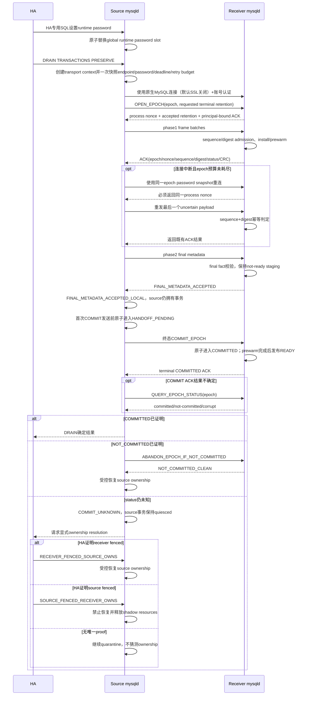

# Preserve/Resume 8.0.22 Standby Transfer 运行时凭据、在线协议与本地 Carrier 收敛设计

## 1. 文档状态

本文描述 Preserve/Resume standby transfer 及其共享 local carrier envelope 的
目标收敛设计，当前尚未实现。
代码、测试和协议版本完成修改前，不得把本文描述当作当前产品能力。

全文事实标签按以下规则理解：

- “当前代码事实”：本仓库 HEAD 已存在的行为；
- “目标要求/必须”：本设计实施后应达到、尚需代码和测试证明的行为；
- “外部 HA 前置/HA_BLOCKED”：依赖未来物理备机项目，不能由本仓库模拟为已
  完成；
- “部署前置”：由 HA、账号体系、网络或 datadir 权限保证，不冒充内核校验。

本文只处理六件事：

1. receiver 账号密码继续由 MySQL 原生账号体系管理，HA 通过进程内接口只向
   source 注入连接 receiver 所需的临时登录密码；
2. 在线单目的节点 transfer 不再依赖 source/target UUID；
3. 在线 transfer 和本地 snapshot/carrier 都不再使用 Preserve 专用 HMAC，也
   不新增 Preserve 专用加密或防篡改能力；在线连接只使用 MySQL 原生 client
   连接与账号认证能力，SSL、RSA、authentication plugin 和网络安全策略均由
   外部 MySQL/HA 配置，默认关闭 SSL，Preserve 不实现、不强制、也不判断这些
   能力；两条路径只保留顺序、一致性、身份和意外损坏检测；
4. 同一 receiver 进程内允许有限次数断线重连，并从最后一个已确认
   frame/batch 检查点继续传输；超过 epoch 级重连预算或一次冻结的 absolute
   monotonic deadline 后整个 epoch 失败；
5. 所有尚未产品化的 Preserve 格式都在各自独立格式域重新从 v1 起版且只保留
   唯一 v1，包括 online wire、snapshot、external object envelope、
   resurrection index、provenance、snapshot identity、lock-plan contract 及
   独立 promotion/fence format；promotion/fence 的 physical lineage 字段保持
   原语义。当前开发原型均不兼容、不迁移，也不保留多版本测试；
6. `COMMIT_EPOCH` 发送后的未知结果进入 ownership quarantine，禁止 source
   恢复执行与 receiver 暴露 READY，直到 principal 绑定的状态查询或显式 HA
   ownership-resolution proof 得到唯一终态；quarantine 是临时安全状态，不是
   可接受的永久可用性出口。

本设计不实现真实物理备机升主、redo apply coordinator 或 HA role
transition，也不实现 source/receiver 进程重启后的 epoch 恢复。

## 2. 产品场景与硬边界

目标场景固定为：

```text
HA 选择唯一 receiver
  -> 向 source mysqld 注入临时登录密码
  -> source 执行 DRAIN TRANSACTIONS PRESERVE
  -> phase1 在线 transfer
  -> receiver 实时 install/prewarm
  -> phase2 发送 final metadata 并取得 FINAL_METADATA_ACCEPTED
  -> source 进入 FINAL_METADATA_ACCEPTED_LOCAL，仍持有本地 ownership
  -> 首次发送 COMMIT_EPOCH 前原子进入 HANDOFF_PENDING
  -> receiver 返回 COMMITTED ACK，并在 prewarm 完成后进入 promotion-ready
  -> 后续物理备机项目决定是否升主
```

必须同时满足以下边界：

- 单 source、单 receiver，不支持 fan-out；
- endpoint 必须直连唯一 receiver，不允许 DNS 轮询、负载均衡或透明切换到另一个
  mysqld 进程；
- source 和 receiver mysqld 进程在整个 epoch 内保持在线；
- 单条 MySQL 连接断开不立即废弃 epoch；source 可使用该 epoch 冻结的 endpoint
  和 password snapshot 重连同一 receiver 进程；
- 重连只重发最后一个 ACK 结果不确定的 frame/batch，不重发已经确认的数据；
- 默认允许整个 epoch 合计最多 3 次内部重连；超过次数或一次冻结的 absolute
  monotonic deadline 后整个 epoch fail closed；
- 支持同一进程、同一 epoch 的跨连接续传，不支持 source/receiver 重启后的
  跨进程续传；
- HA 对目的 host/port/socket 及账号选择负责；
- receiver 只允许一个专用 transfer principal 持有
  `PRESERVE_TRX_TRANSFER_ADMIN`；同一 epoch 的 open、frame、status、
  commit 和 abort 必须绑定该 authenticated principal；
- Preserve/Resume 只调用 MySQL 原生 client 连接与账号认证接口，不强制 TCP
  SSL；产品默认使用 MySQL 的无 SSL 配置；
- Preserve 不注册 SSL/RSA/authentication-plugin/网络信任相关参数，不实现
  Preserve 专用安全策略、加密、防篡改或网络准入检查；
- 如果外部 MySQL/HA 配置显式启用原生 SSL、RSA 或其它账号认证能力，transfer
  直接使用原生连接结果，不增加 Preserve 专用参数或二次校验；
- transfer 账号所选 authentication plugin 是否能在当前原生 MySQL 连接配置下
  完成认证，由 MySQL client/server 自身决定；原生认证失败即本次连接失败；
- 默认关闭 SSL 且没有 Preserve HMAC 时，Preserve 不提供链路保密性、endpoint
  身份验证或主动防篡改保证；CRC、SHA-256 和 digest 只用于协议一致性与意外
  损坏检测。是否接受这一网络风险由外部 MySQL/HA 部署决定，不由 Preserve
  模块阻断或认证；
- receiver 错误只改变本地 epoch 状态，不在 ACK 后重新联系 source；
- 后续 HA 可以清理 Preserve 状态继续保持 standby，或放弃 Preserve
  快速续作并按普通流程升主。

## 3. 当前代码事实

本轮实现后的代码事实如下，最终 release 回归尚未完成：

- source endpoint admission 只要求唯一 TCP/socket endpoint、target user 和
  source credential ready；online `target_server_uuid` /
  `allowed_source_uuid` 路由参数及 wire 字段已经删除；
- receiver 使用 MySQL 已认证 principal、receiver process nonce、epoch id 和
  token 绑定当前在线进程内状态；physical-fence lineage UUID 不在删除范围；
- 已提供参数仅为密码的 source-only runtime password setter/clear API。调用
  权限由未来物理备机 HA SQL 和 MySQL 原生授权负责；每次 DRAIN 创建 transfer
  epoch 时冻结 immutable password snapshot，后续 setter 只影响下一次 DRAIN；
- 当前仓库仍没有外部 HA SQL/caller 可以在 release E2E 中调用 runtime setter。
  因此 source 侧暂时保留 `credential_name` /
  `credential_secret_file` fallback；该路径是明确的
  `TRANSITIONAL_SECRET_FILE`，不是最终“不落盘密码”证据；
- receiver 只通过 MySQL 原生授权表保存并验证账号密码，不再读取 Preserve
  secret，也不再构造密码派生的 codec/HMAC context；
- online transfer 只有 product protocol v1：控制字段使用 CRC32，payload /
  object set 使用 SHA-256；不存在 Preserve 专用 HMAC、routing UUID、
  source incarnation 或 v3/v4 decoder；
- epoch-global sequence、最多 3 次共享重连预算、冻结的 operation deadline
  和 requested/accepted terminal retention 均归属 epoch transport context；
  重连不会重置密码、deadline 或重试预算；
- source ownership 已在第一次 COMMIT send 前进入 `HANDOFF_PENDING`；
  ACK 无法证明时进入 `COMMIT_UNKNOWN` quarantine，现有 drain cleanup 不再把
  transaction ownership 自动恢复给 source；
- `COMMIT_UNKNOWN` 的 HA 决议核心只在 quarantine item、source warmcopy
  cleanup ownership 和 source transport teardown 全部收敛后发布
  `handoff_resolution_ready`；resolver 必须 acquire-load 该标志后才能接受
  proof，不能观察到半发布的 quarantine；
- source-owned proof 使用
  `COMMIT_UNKNOWN -> SOURCE_RESTORE_PENDING -> SOURCE_RESTORED` 两阶段状态。
  `SOURCE_RESTORE_PENDING` 期间普通 `RESET DRAIN` 不能抢占；恢复失败保持
  source-owned fail-closed，不得回退成 ownership unknown 或重新选择 receiver；
- HA capability 冻结非零 `ha_role_generation`，proof 必须与 capability 的
  generation 精确相等。当前 production caller 保持为 0，测试 capability
  factory 只链接进 GUnit binary；
- receiver terminal 状态通过幂等 CAS 和有界 tombstone 收敛；receiver 进程
  重启不 replay 当前 epoch，也不推导旧 epoch 未提交；
- raw frame spool 已删除。receiver ACK 表示当前在线进程已完成 sequence /
  digest admission，不表示介质 fsync 或跨进程恢复；
- local snapshot、resurrection index、XID provenance 和 snapshot identity
  均使用各自唯一 product-layout v1；本地 `.key` 和 keyed HMAC 已删除，保留
  CRC32、canonical SHA-256、local identity 及语义校验；
- carrier 启动支持检查继续拒绝 symlink、非目录和不可读写执行的 Preserve
  目录；普通文件的 inode、大小和路径检查保持不变；
- Preserve 不再强制 CA、`SSL_MODE_VERIFY_IDENTITY` 或 cipher 非空。连接完全
  使用 MySQL client/server 原生认证与部署配置，默认不启用 SSL；Preserve
  不承诺额外链路保密、endpoint 身份校验或主动防篡改。

### 3.1 当前密码设置和消费链路

当前实现存在两份用途不同、但取值必须一致的密码状态：

1. receiver 的 MySQL 账号密码保存在 MySQL 原生授权表中，由
   `CREATE USER`/`ALTER USER ... IDENTIFIED BY ...` 设置，并授予
   `PRESERVE_TRX_TRANSFER_ADMIN`；
2. source transfer client 必须取得同一密码，才能在
   `default_transfer_client_connect()` 中调用 `mysql_real_connect()` 连接
   receiver。

receiver 账号的当前配置语义等价于：

```sql
CREATE USER 'preserve_transfer'@'%'
  IDENTIFIED BY 'password';
ALTER USER 'preserve_transfer'@'%'
  IDENTIFIED BY 'password';
GRANT PRESERVE_TRX_TRANSFER_ADMIN ON *.*
  TO 'preserve_transfer'@'%';
```

当前密码链路的主要源码入口为：

| 入口 | 文件 | 当前作用 |
|---|---|---|
| `preserved_trx_transfer_set_runtime_password()` | `sql/preserve_trx_transfer.cc` | 校验 source role 和密码参数后更新下一 epoch 的 runtime slot |
| `snapshot_transfer_epoch_credential()` | `sql/preserve_trx_transfer.cc` | 创建 sink 时冻结本次 epoch 的用户名、plugin 和 password snapshot |
| `read_transfer_credential_secret_file()` | `sql/preserve_trx_transfer.cc` | 外部 HA caller 接入前，校验并读取 source 过渡密码文件 |
| `resolve_transfer_credential()` | `sql/preserve_trx_transfer.cc` | source 过渡路径先查 `Rpl_channel_credentials`，再回退 secret file |
| `default_transfer_client_connect()` | `sql/preserve_trx_transfer.cc` | 只消费已冻结的 epoch credential 并调用 `mysql_real_connect()` |
| transfer credential sysvar 注册 | `sql/sys_vars.cc` | 仅保留 source 过渡启动参数 |
| `prepare_standby_transfer_credential_secret_files()` | `scripts/resumable_trx_business_e2e.py` | 当前 E2E 只为 source 生成 `0600` 过渡 secret file |
| `configure_standby_transfer_credentials()` | `scripts/resumable_trx_business_e2e.py` | 当前 E2E 创建 receiver MySQL 账号并授予 transfer 权限 |

当前 source 过渡测试配置形态为：

```text
--preserve-trx-transfer-target-user=preserve_transfer
--preserve-trx-transfer-credential-name=fullpressure
--preserve-trx-transfer-credential-secret-file=/secure/path/transfer.secret
```

secret file 的内容就是密码。当前 reader 要求该文件：

- 是当前 mysqld effective uid 所有的普通文件；
- group/other 权限均为零，通常使用 `0600`；
- 以 `O_NOFOLLOW` 打开，不能通过符号链接读取；
- 大小为 `1..4096` 字节；
- 允许末尾 `CR/LF`，读取后会删除末尾换行。

当前 E2E 的 `--standby-transfer-password` 仍不是内核 runtime setter。Python
harness 会把该值写入 source datadir 下的过渡 secret file，并只把
secret-file 启动参数追加到 source mysqld。receiver 使用同一密码创建 MySQL
transfer 账号，但不保存或读取 Preserve secret。

如果既没有同名 `Rpl_channel_credentials` entry，也没有合格的 secret file，
且 HA 没有在 DRAIN 前调用 runtime setter，source credential snapshot 失败，
standby transfer 返回 `UNSUPPORTED`。因此，在外部 HA caller 和“不经
argv/env/file”release E2E 尚未落地前，不能直接删除 source
secret-file/credential-name fallback。

## 4. 收敛后的总体架构

### 4.1 控制面

HA 负责：

- 选择唯一 receiver endpoint；
- 通过 MySQL 原生账号管理或等价产品管控能力设置 receiver transfer 账号及
  密码，并保证该账号是唯一 transfer principal、角色和授权正确；
- 负责 MySQL 原生 SSL、RSA、authentication plugin 和网络安全配置；这些能力
  中 SSL/RSA 等加密默认关闭，authentication plugin 沿用账号配置，Preserve
  不解释或校验其安全策略；
- 在 DRAIN 前向 source 注入当前登录密码；
- 后续再次注入密码只更新下一次 DRAIN 使用的 runtime slot，不改变已经开始的
  DRAIN；
- 在 receiver 失败后决定清理、保持 standby 或执行无 Preserve 的普通升主。

本仓库只提供内部 C++ 接口，不新增面向普通用户的 SQL 语法。未来物理备机
项目中的 HA 专用 SQL 负责鉴权、参数解析并调用该接口。该外部入口必须满足：

- 只允许专用 `preserve_trx_ha_admin` 身份、`SHUTDOWN` 权限和内部 HA
  capability 同时成立；
- 只允许 source role 调用 setter/clear，receiver role 调用必须拒绝；
- 在原始 SQL 写入 general log、audit、Performance Schema statement text 或
  processlist 前完成 password literal redaction；
- parse 成功后只保留重写为 `<redacted>` 的可观测 SQL 文本；parse 失败、权限
  失败和长度校验失败同样不得回显原始密码；
- 首版禁止通过 prepared statement 执行该命令，除非外部项目能够证明参数在
  prepare/execute、audit 和 P_S 全链路均不泄漏；
- setter 返回后清零 parser/LEX/THD query 中由该入口拥有的密码副本。

上述 SQL 不在本仓库内，因此本仓库只能用 GUnit 直接调用内部 capability API
证明 setter/snapshot 合同。运行时“密码不落盘”的跨进程 E2E 在外部 HA SQL 接入
前必须标记为 `HA_BLOCKED`；当前仍使用 secret file 的 E2E 只能标记为
`TRANSITIONAL_SECRET_FILE`，不得作为最终验收证据。

### 4.2 数据面

source 为每个 epoch 建立唯一的 immutable transport context，由 batch
source-session/frame sink 共同持有，而不是由每次 `connect()` 重新解析全局
配置。context 一次冻结：

```text
endpoint + target_user + epoch_password_snapshot
absolute_monotonic_deadline + reconnect_budget
requested_terminal_status_retention_us
receiver_process_nonce（OPEN_EPOCH 成功后绑定）
accepted_terminal_status_retention_us（OPEN_EPOCH ACK 后绑定）
```

batch DRAIN 和 standalone/internal transfer 构造路径都必须先建立该 context；
首次连接、data connection、内部重连和 status query 只能使用 context，禁止
回读全局 credential 或 endpoint。

receiver 使用 MySQL 原生账号认证 source；source 的运行时密码只是该账号的登录
凭据，不是一个由两端 Preserve 模块共同配置的第二套 secret。receiver 在
`OPEN_EPOCH` 时把该连接的 authenticated principal 写入 epoch registry，后续
换连接续传仍必须是同一 principal。去除 online HMAC 后，receiver 不再保存或
读取 Preserve 专用密码副本。

Preserve 不定义 `connection_security_policy`，也不增加 SSL、RSA、证书、
public-key、authentication-plugin 或网络信任相关 public/internal 参数。
`mysql_real_connect()` 使用外部 MySQL/HA 已配置的原生连接选项，产品默认关闭
SSL。外部配置若启用原生 SSL/RSA，Preserve 只接受并透传原生连接成功或失败
结果，不自行检查 CA、cipher、网络形态或 endpoint 安全性。

同一 epoch 的 endpoint、target user 和 password snapshot 必须冻结；外部
MySQL/HA 还必须保证 epoch 期间原生连接配置不发生漂移。Preserve 只通过
authenticated principal 和 receiver process nonce 约束协议状态归属，不把
MySQL 账号认证、CRC 或 SHA-256 表述为默认无 SSL 链路上的 endpoint 认证或主动
防篡改能力。

数据面继续使用现有 phase1 batch、object chunk/seal、final metadata 和 ACK
模型。record-lock、binlog-cache、temp sidecar 及 receiver prewarm 算法不因
本设计而改变；READY 发布额外要求终态 `COMMIT_EPOCH` 已被 receiver 接受，
以闭合事务 ownership 交接。

### 4.3 有界断线重连

断线恢复是同一在线 epoch 的短暂传输故障恢复，不是 receiver crash recovery：

1. sender 为每条 data session 最多保留一个 ACK 结果不确定的 encoded
   payload；
2. 连接断开或 ACK 不确定时，消耗一次 epoch 共享重连预算；
3. 使用冻结的 endpoint、target user 和 password snapshot 建立新连接；
4. 新连接必须返回与 context 相同的 `receiver_process_nonce`，否则当前 epoch
   立即 fail closed；
5. 重发完全相同的
   `{epoch_id, receiver_process_nonce, sequence, payload_digest}`；
6. receiver 从当前进程内 registry 判断为新 frame、同内容重试或 digest
   冲突；
7. 同 sequence、同 digest 的重试幂等返回既有结果；同 sequence、不同 digest
   直接把 epoch 标记为 corrupt；
8. `COMMIT_EPOCH` 结果不确定时先发送 `QUERY_EPOCH_STATUS`，不得盲目创建第二
   个 epoch 或重复提交。

online v1 的 payload sequence namespace 固定为 **epoch-global**，不是
per-connection 或 per-data-session：

- 一个 epoch 的 control sender 和全部 data session 共享同一单调 allocator；
- sender 可以为一个 batch 原子预留连续、不重叠的 sequence range，但不能让
  不同连接各自从 1 开始；
- receiver 只维护一个 `next_sequence_by_epoch`，允许同 sequence/same digest
  重试，不允许缺口、回退或 different digest；
- `COMMIT_EPOCH` 必须携带该 epoch 的 final admitted sequence 和 final fact
  digest；receiver 只有在全部 sequence 连续 admitted 后才能进入终态 CAS；
- `OPEN_EPOCH`、`QUERY_EPOCH_STATUS` 和
  `ABANDON_EPOCH_IF_NOT_COMMITTED` 使用独立的幂等 operation identity，不消费
  payload sequence，也不能改变已 admitted sequence。

重连预算由一个 epoch 内的所有 control/data session 共享，不能按连接、对象
或 chunk 分别重新计数。epoch context 保存一次性计算的绝对单调 deadline；
每次 connect/read/write/status query 的 timeout 都是“配置上限与 deadline
剩余时间的较小值”，重连不得重新获得完整 timeout。达到预算、deadline、
认证失败或 receiver 明确返回不可重试错误时，停止所有 sender。仅在尚未发送
`COMMIT_EPOCH` 时允许 best-effort `ABORT_EPOCH`；COMMIT 结果不确定时必须进入
下节的 ownership quarantine，禁止把普通 abort 当成已清理证明。

receiver ACK 的前提是 payload 已复制并进入 receiver 自有 registry、内存队列
或 semantic object staging，后续不再依赖 source 保留该 payload。ACK 不等待
prewarm，也不要求 per-frame `fsync`。本设计删除不提供 restart replay 能力的
raw frame spool；大 object 的 semantic staging/file、sequence/digest registry
和 prewarm 输入仍然保留。

### 4.4 `COMMIT_UNKNOWN` 与事务所有权

final metadata 被 receiver 接受时只表示数据和 final fact 已进入 receiver-owned
staging，不表示事务 ownership 已转移，也不允许发布 READY。正常交接固定为：

1. receiver 返回 `FINAL_METADATA_ACCEPTED`；
2. source 进入 `FINAL_METADATA_ACCEPTED_LOCAL`。此时 receiver 只有
   not-ready staging，source 仍持有唯一业务 ownership；若尚未尝试 COMMIT，
   source 可通过专用 pre-handoff abort/restore 路径恢复，不依赖 receiver
   ownership proof；
3. source 在第一次 `COMMIT_EPOCH` 网络发送尝试前，原子转为
   `HANDOFF_PENDING` 并关闭通用 drain 自动恢复路径。若编码、内存分配或本地
   admission 在任何网络 write 发生前失败，可以撤销该 send lease 并回到
   `FINAL_METADATA_ACCEPTED_LOCAL`；一旦开始网络发送，不得自行回退；
4. source 发送终态 `COMMIT_EPOCH`；
5. receiver 原子接受 COMMIT 后进入 `COMMITTED`，返回终态 ACK；prewarm 已完成
   时可发布 READY，未完成时继续本地后台推进；
6. 正常收到终态 ACK 后，receiver 不再主动联系 source。后续 receiver
   prewarm/apply 错误只改变 receiver 本地状态，由 HA 决定清理 Preserve 状态
   保持 standby，或放弃 Preserve 快速续作按普通路径升主。

source 发送终态 `COMMIT_EPOCH` 后，观察结果只能收敛为：

```text
NOT_COMMITTED_CLEAN -> receiver 已完成未提交清理，source 可以受控恢复执行
COMMITTED           -> receiver 已接受 ownership handoff，可按 prewarm 状态发布 READY
CORRUPT             -> 两端保持隔离，交由 HA 清理
COMMIT_UNKNOWN      -> 无法证明上述任一终态，进入 ownership quarantine
```

`COMMIT_UNKNOWN` 不是普通失败：

- source 的 quiesced transaction 不得重新进入业务执行，不得 rollback 后重做，
  也不得返回一个会触发现有 drain 自动恢复 ownership 的通用错误；
- receiver 在 final metadata accepted、但尚未接受终态 `COMMIT_EPOCH` 时不得向
  SQL RESUME 或 future promotion gate 暴露该 epoch；
- source 保留完成仲裁所需的本地 rollback/ownership state；
- source 的自动仲裁只能通过同 principal、同 `receiver_process_nonce` 的幂等
  status/cleanup 接口取得 `NOT_COMMITTED_CLEAN` 清理完成证明，或取得
  `COMMITTED` ownership 证明；该在线路径不可达时升级到 §4.5 的 HA
  ownership resolution；
- 单纯连接失败、timeout 或 socket EOF 不能证明 receiver 进程已经退出，也不能
  证明旧 epoch 未提交；
- 任一证明缺失时保持隔离并持续告警，不得以 timeout 自动选择 source 或
  receiver ownership。

v1 为此定义两个 authenticated、幂等的仲裁操作：

```text
QUERY_EPOCH_STATUS(epoch, process_nonce, final_fact_digest)
ABANDON_EPOCH_IF_NOT_COMMITTED(epoch, process_nonce, final_fact_digest)
```

这里的 authenticated 仅表示 receiver 从当前 MySQL connection security
context 取得并校验 principal，不表示默认无 SSL 时 terminal payload 具有密码学
消息认证。Preserve 不判断或阻断主动链路攻击；外部 MySQL/HA 若启用原生 SSL，
其 endpoint/message protection 语义完全由 MySQL 连接层负责。

`ABANDON_EPOCH_IF_NOT_COMMITTED` 只有在 registry 明确尚未 committed 时才能清理
semantic staging，并在清理完成后返回 `NOT_COMMITTED_CLEAN`；若已经 committed
只能返回 `COMMITTED`，不得反向删除 READY epoch。重复请求必须返回相同终态。

该 cleanup 只能由 source epoch coordinator 在 `FINAL_METADATA_ACCEPTED_LOCAL`
且尚未开始终态 `COMMIT_EPOCH` 网络发送时直接发起，或在
`HANDOFF_PENDING/COMMIT_UNKNOWN` 下查询已明确返回 `NOT_COMMITTED` 后串行
发起；同一 epoch 不允许 cleanup 与 COMMIT 并发。若 source 已开始任何 COMMIT
发送尝试，只有取得 `NOT_COMMITTED_CLEAN` 后才能显式恢复 source ownership。
receiver 以单 epoch CAS 保证 COMMIT 与 cleanup 只有一个终态胜出。

在 `FINAL_METADATA_ACCEPTED_LOCAL` 中，source 应 best-effort 发送 ABANDON，
但 ABANDON ACK 丢失不阻止 source 恢复，因为本地 send lease 能证明从未开始
COMMIT，receiver 也没有 READY/adopt 权限；未清 staging 只作为 receiver 垃圾
回收。该规则不能扩展到 `HANDOFF_PENDING`。

terminal CAS 合同固定为：

| 当前 receiver 状态 | `COMMIT_EPOCH` | `ABANDON_EPOCH_IF_NOT_COMMITTED` | `QUERY_EPOCH_STATUS` |
|---|---|---|---|
| `RECEIVING` | final fact 未 accepted，拒绝 | CAS 到 `ABANDONING`，清理成功后 `NOT_COMMITTED_CLEAN` | `NOT_COMMITTED`，但尚不是 cleanup proof |
| `FINAL_METADATA_ACCEPTED` | CAS 到 `COMMITTED` | 与 COMMIT 竞争同一 CAS；胜出后清理并进入 `NOT_COMMITTED_CLEAN` | `NOT_COMMITTED` |
| `COMMITTED` | same digest 幂等返回 `COMMITTED`；different digest -> `CORRUPT` | 只返回 `COMMITTED`，禁止删除 | `COMMITTED` |
| `NOT_COMMITTED_CLEAN` | 返回既有 `NOT_COMMITTED_CLEAN`，禁止复活 | 幂等返回 `NOT_COMMITTED_CLEAN` | `NOT_COMMITTED_CLEAN` |
| `CORRUPT` | `CORRUPT` | `CORRUPT` | `CORRUPT` |
| 同进程 registry 不存在该 epoch | `EPOCH_NOT_FOUND` | `EPOCH_NOT_FOUND` | `EPOCH_NOT_FOUND`，不得直接推导 `NOT_COMMITTED_CLEAN` |

为消除 final sealed 检查与 accepted-epoch 发布之间的并发 mutation 窗口，
receiver registry 在上述唯一 terminal CAS 内增加一个仅内部可见的过渡态：

```text
OPEN
  -> COMMIT_ADMITTED(sequence, encoded_frame_digest)
  -> COMMITTED

OPEN
  -> ABANDONING
  -> NOT_COMMITTED_CLEAN

COMMIT_ADMITTED
  -> CORRUPT
  -> COMMITTED
```

`COMMIT_ADMITTED` 不增加 wire enum、SQL 状态或 GLOBAL STATUS，也不改变
physical promotion bootstrap/adopt 接口。其合同为：

- COMMIT sequence 准入与 ABANDON 共用 receiver registry 的同一 mutex 和同一
  `Acknowledged_epoch`；不得建立第二个 terminal map；
- `OPEN -> COMMIT_ADMITTED` 的 CAS 必须一次冻结 preserve root、receiver
  process generation/nonce、authenticated principal、final-fact digest、
  receiver 本地 CAS 时刻和 accepted retention deadline；不得等 semantic apply
  或 `publish_accepted_epoch()` 时再补写这些 ownership facts；
- 同 sequence、同 encoded-frame digest 的 retry 是幂等请求；sequence 或 digest
  不同进入 `CORRUPT`；
- COMMIT admission 胜出后拒绝 higher-sequence mutating frame；在 cutoff 前已
  admitted 的 lower-sequence frame 可以完成 apply；
- lower-sequence apply 完成后，registry 在同一临界区校验全部 required token 和
  sealed object，并复制唯一 authoritative record snapshot；final fact 只能从该
  snapshot 构造，不能再次扫描可变 registry；
- `QUERY_EPOCH_STATUS` 将 `COMMIT_ADMITTED` 投影为 `NOT_COMMITTED`，绝不能
  投影为 `NOT_COMMITTED_CLEAN`；ABANDON 必须输给已经取得 admission 的 COMMIT；
- manifest、fact、sequence 或 digest 不一致时进入 `CORRUPT`；临时资源不足保留
  `COMMIT_ADMITTED`，只允许 exact retry；
- `publish_accepted_epoch()` 必须再次核对 admission 时冻结的 receiver generation
  和 final-fact digest，完全一致才允许 `COMMIT_ADMITTED -> COMMITTED`；
- COMMIT 已经进入 `COMMITTED` 后收到同 sequence、同 frame digest、同
  final-fact digest 的 exact retry，receiver 不重复 semantic apply，但必须返回
  同一 `COMMITTED_NOT_READY` ACK；不能因 sequence 已标记 applied 而静默成功；
- COMMIT token 缺失、状态非法或 authoritative snapshot 失败时，terminal 和该
  epoch 尚存的 receiver records 必须一起进入 fail-closed/corrupt cleanup，不能
  留下永远停在 `RECEIVING` 的 sibling token；
- expiry、cleanup 和 retry 均不得把 `COMMIT_ADMITTED` 重新开放为 `OPEN`；
  accepted epoch 即使晚于 terminal tombstone retention 仍存活，也禁止再次建立
  同 epoch 的 COMMIT admission。

COMMIT 与 ABANDON 并发时只有一个 CAS 能胜出：COMMIT 胜出后 cleanup 不得删除
committed epoch；ABANDON 胜出并完成 cleanup 后，迟到的 COMMIT 不得复活 epoch。
所有重复请求必须匹配 principal、process nonce、epoch 和 final-fact digest；
digest 不同不是新的请求，而是 `CORRUPT`。

终态 COMMIT ACK 丢失时，source 使用冻结 credential、同 principal 和同 process
nonce 执行 `QUERY_EPOCH_STATUS`；查询得到 `COMMITTED` 即完成交接，得到
`NOT_COMMITTED` 时先完成 authenticated cleanup，再受控恢复 source ownership。
查询仍无法证明结果则进入 `COMMIT_UNKNOWN`。正常 DRAIN 成功不等待 receiver
prewarm，只等待终态 COMMIT 已被 receiver-owned admission。

`NOT_COMMITTED_CLEAN` 只证明 source 可以开始恢复，不等于业务事务已经
`RUNNING`。source 必须先原子进入 `SOURCE_RESTORE_PENDING`，使并发
`RESET DRAIN` 无法抢占，再调用现有 guarded batch restore；全部恢复完成后才
进入 `SOURCE_RESTORED`。恢复中途失败保持 source-owned、service-blocked，
不得回退到 `COMMIT_UNKNOWN` 或重新开放 RESET。

两个仲裁操作都要求同 principal、process nonce、epoch 和 final-fact digest；
任一不匹配均 fail closed。正常收到 terminal COMMIT ACK 后，source 不发送
“ACK 的 ACK”，也不再主动联系 receiver；只有 COMMIT ACK 结果不确定时才进入
重连/status-query 仲裁路径。

source 在创建 epoch 时一次冻结 `requested_terminal_status_retention_us`。该值
必须覆盖 commit status-query budget 加最后一次有界 terminal query 往返，
由现有 source commit timeout 和 transport deadline 派生，不新增 public
sysvar。它是 duration，不是 source monotonic timestamp，禁止跨机器比较绝对
monotonic clock。

v1 `OPEN_EPOCH` request 携带 requested retention。receiver 在创建 registry 前
按内部资源上限校验：可以提高到 receiver 本地下限并返回
`accepted_terminal_status_retention_us`，但不得向下截断；请求超过 receiver
硬上限时必须在 OPEN 阶段拒绝。source 只有确认 accepted retention 不短于
requested retention 才能继续该 epoch。

receiver 在 terminal CAS 成功的本机 monotonic 时刻创建小型 tombstone，并保留
accepted retention。raw payload spool 可以删除，但 terminal status、process
nonce、principal 和 digest tombstone 不能随之删除。tombstone 到期后若 source
仍未取得 proof，source 已进入 HA escalation，不得把 `EPOCH_NOT_FOUND` 当成
`NOT_COMMITTED_CLEAN`。receiver 重启后不恢复 tombstone，也不能从新的 process
nonce、provider 注册状态或连接失败推导旧 epoch 为 `NOT_COMMITTED`；旧 epoch
按 §4.5 处理。

ownership quarantine 不是无限制资源池。首版必须满足：

- 单 source/receiver 合同下最多允许一个处于 `HANDOFF_PENDING` 或
  `COMMIT_UNKNOWN` 的 epoch；存在 quarantine 时拒绝创建下一 transfer epoch；
- token 数、保留的 rollback/undo/read-view/MDL/binlog state 和 semantic staging
  bytes 都计入 Preserve 既有资源预算，超预算必须在进入 handoff 前拒绝；
- quarantine 中的 read view、undo 和 record/MDL ownership 可能阻塞 purge、
  DDL 或扩大 history list；状态面必须暴露 retained undo/read-view pressure，
  不能只报告 epoch 个数；
- `SHOW PRESERVED TRANSACTIONS` 或等价 Preserve 状态面必须显示 epoch、token
  count、状态、进入 quarantine 的 monotonic age、最后一次 query 结果和
  cleanup/commit proof 状态，但不显示密码、nonce 原文或 digest secret；
- 至少提供 `handoff_pending_epochs/tokens`、`commit_unknown_epochs/tokens`、
  `quarantine_oldest_age_us`、`quarantine_resource_bytes`、
  `quarantine_retained_undo_bytes`、`quarantine_oldest_read_view_age_us`、
  `terminal_query_result` 和 `quarantine_admission_rejects`；
- age/deadline 只触发告警和停止自动查询，不得自动恢复、commit 或 rollback
  ownership；
- HA 只能通过终态 proof 选择受控恢复 source、确认 receiver committed，或放弃
  Preserve 快速续作并按 HA role fence 清理；不能用普通 `RESET DRAIN` 绕过
  quarantine。

同一 receiver 进程仍在线时，`QUERY_EPOCH_STATUS` 和
`ABANDON_EPOCH_IF_NOT_COMMITTED` 必须保持可达、幂等，且不被 prewarm 或
projection backlog 阻塞。若在仲裁预算内无法取得 terminal proof，source
停止自动查询并进入 HA resolution；在 HA 返回唯一 proof 前继续保持 quarantine，
新 DRAIN 因单 epoch admission cap 被拒绝。quarantine 是避免双 ownership 的
临时状态，不得通过 timeout、普通 RESET 或重启后猜测 ownership 来消除；但
生产发布也不得把“永久 quarantine”当作正常可用性方案。

### 4.5 Source/Receiver 进程重启边界与 HA 可用性出口

本项目只支持 source 和 receiver 在整个 online transfer epoch 内持续在线。
`receiver_process_nonce` 是当前 receiver 进程内的关联标识，不是持久
ownership proof，也不是网络安全凭据：

- 同一 epoch 的重连、status query、COMMIT 和 ABANDON 必须匹配原 process
  nonce；
- nonce 不匹配只证明请求没有命中原 receiver 进程，必须 fail closed；
- 新进程返回不同 nonce，不能证明旧进程没有接受 `COMMIT_EPOCH`，不能推导
  `NOT_COMMITTED` 或 `NOT_COMMITTED_CLEAN`，也不能授权 source 恢复执行；
- 连接失败、timeout、EOF、进程 PID 变化和 provider 指针为空均不是
  ownership 终态证明。

receiver 在 source 仍处于 `FINAL_METADATA_ACCEPTED_LOCAL` 且从未开始 COMMIT
网络发送时重启，旧 receiver 不可能发布 READY，source 仍是唯一 owner，可以
执行专用 pre-handoff abort/restore；新 receiver 上的 staging 只作为垃圾清理，
不要求用新 nonce 伪造 cleanup proof。

receiver 在 `HANDOFF_PENDING` 或 COMMIT 结果不确定后重启时：

1. 不从 raw spool、semantic staging 或 carrier 自动重建旧 strict registry；
2. 新 receiver 不为旧进程的 epoch 返回 `NOT_COMMITTED_CLEAN`；
3. source 保持 `HANDOFF_PENDING/COMMIT_UNKNOWN`，不得恢复 DML、commit 或
   rollback；
4. 当前仓库报告 `HA_BLOCKED`，等待未来 HA 提供 old-process fence、role/
   ownership proof 和受控清理能力。

source 在进入 `HANDOFF_PENDING` 后重启时同样不支持自动恢复。当前 source
quarantine、rollback image 和 ownership guard 含进程内状态，重启后不能据此
重建唯一终态；外部 HA 必须 fence 旧 source，并禁止该实例在 ownership 未证明
前重新对外服务。若未来要求跨进程闭环，必须单独设计 durable ownership journal
及其 crash recovery 合同，不能作为本轮协议收敛的附带逻辑。

本设计不从 production apply-state provider 是否已注册、函数指针是否为
`nullptr`、构建开关或 binary 类型推导“不会发生 promotion”。这些都是可变的
进程内事实，不能替代 ownership proof。未来物理备机项目若提供显式 HA 证明
接口，必须由 HA 权威地产生进程/role fence 结论，并定义调用权限和一次操作内
冻结的 proof；连接认证和链路安全由 MySQL 原生能力承载。在该接口落地前，
进程重启后的状态只允许 `HA_BLOCKED`。

为了保证产品可用性，未来 HA 集成必须提供显式、幂等的 ownership resolution，
而不能让 quarantine 永久占用 source。目标内部合同为：

```cpp
class Preserve_trx_ha_control_capability;

enum class Preserve_trx_handoff_resolution {
  RECEIVER_FENCED_SOURCE_OWNS,
  SOURCE_FENCED_RECEIVER_OWNS
};

struct Preserve_trx_handoff_resolution_proof {
  std::string epoch_id;
  std::array<unsigned char, 32> final_fact_digest;
  std::string source_process_generation;
  std::string receiver_process_generation;
  uint64_t ha_role_generation;
  Preserve_trx_handoff_resolution resolution;
};

Preserve_trx_transfer_status preserved_trx_resolve_handoff_unknown(
    const Preserve_trx_ha_control_capability &capability,
    const Preserve_trx_handoff_resolution_proof &proof);
```

该 proof 由外部 HA role/fence coordinator 产生。Preserve 只校验 capability、
epoch/digest/generation 和单次 CAS，不增加 HMAC、证书或第二套网络安全协议；
未来 HA SQL/控制连接的认证与链路安全继续由 MySQL 原生连接能力承载。

两个 outcome 的行为固定为：

- `RECEIVER_FENCED_SOURCE_OWNS`：HA 已保证 receiver 未升主、不能 adopt 该
  epoch。仅当原 source 进程仍在线、generation 匹配且 rollback image/ownership
  context 完整时，source 才能受控恢复事务；receiver staging 作为垃圾受控
  清理；
- `SOURCE_FENCED_RECEIVER_OWNS`：HA 已 fence source。source 禁止恢复事务并
  释放 shadow/rollback resources；receiver 若 Preserve READY 可继续快速续作，
  否则清理 Preserve 状态后按普通物理升主恢复数据库服务，允许放弃这些事务的
  Preserve 续作；
- contradictory outcome、epoch/digest/generation 不匹配或重复请求内容不同
  一律 fail closed；
- 当前进程只保留 active attempt 和最近一次 resolved attempt。同一保留窗口内
  的同 proof 重试必须幂等返回既有终态；新的 epoch 已经完成决议后，更早 proof
  视为 stale 并 fail closed。当前单 active epoch、production caller 为 0 的
  边界下不新增第二套 resolution registry；未来 HA 产品若要求更长重试窗口，
  必须在接入前冻结 bounded tombstone/retention 合同；
- `RECEIVER_FENCED_SOURCE_OWNS` 先原子进入 `SOURCE_RESTORE_PENDING`，再调用
  现有 guarded batch restore。全部恢复且 manager 回到 `IDLE` 后才进入
  `SOURCE_RESTORED` 并开放事务；中途失败保持 source-owned、service-blocked，
  不允许 RESET、相反 proof 或通用 cleanup 接管；
- source 进程已经重启、rollback context 已丢失时，即使 HA 选择 source，也
  不能恢复这些 Preserve 事务，只能进入普通 HA recovery；数据库服务可恢复，
  但事务续作能力明确丢失。

当前仓库没有真实 HA role/fence coordinator，也没有该接口的 production
provider。因此可以实现和测试状态机核心，但 production outcome 仍为
`HA_BLOCKED`。在可能发生 receiver/source 重启的部署中，HA resolution 接口
及其普通升主 fallback 是 standby transfer 产品发布门槛，不是可选增强。

## 5. 目标运行时密码接口

本节接口已经在当前源码中实现，但 production HA SQL/caller 尚未接入。该接口
只存在于 source；receiver 继续使用 MySQL 原生账号认证，不调用 Preserve
runtime-password setter。当前仓库只能通过 GUnit 验证 set/clear 和 epoch
snapshot；release E2E 在外部 caller 接入前仍使用并标记
`TRANSITIONAL_SECRET_FILE`。

目标内部接口冻结为：

```cpp
enum class Preserve_trx_transfer_password_status {
  OK,
  INVALID_ARGUMENT,
  WRONG_ROLE,
  FEATURE_DISABLED,
  RESOURCE_EXHAUSTED
};

Preserve_trx_transfer_password_status
preserved_trx_transfer_set_runtime_password(
    const unsigned char *password, size_t password_length);

Preserve_trx_transfer_password_status
preserved_trx_transfer_clear_runtime_password();
```

接口合同：

- password 长度为 `1..256` 字节，与 MySQL 8.0.22 默认
  `caching_sha2_password` 的 plaintext 上限一致；其它 authentication plugin
  若有更小上限，由 HA 在调用 setter 前按账号 plugin 进一步限制；
- 拒绝内嵌 `NUL`，因为 MySQL client 登录接口使用 C 字符串；
- setter 复制输入，不保存调用方地址；
- 密码不写文件、不写 binlog、不写日志、不进入错误文本；
- 密码不通过 sysvar、Performance Schema 或状态变量直接暴露；
- setter 原子替换 global runtime password slot；不要求先 clear，也不检查 active
  epoch；
- DRAIN 创建 transfer epoch 时只读取一次 global slot，并形成 epoch-owned
  immutable password snapshot；
- setter 或 clear 在 DRAIN 开始后只影响下一次 DRAIN，不替换、不清除当前 epoch
  的 password snapshot；
- clear 只清空 global slot，使后续 DRAIN 在创建 epoch 前 fail closed；
- mysqld 重启后密码为空，HA 必须重新注入。
- runtime password API 是供未来物理备机 HA SQL 执行体调用的内部 C++ 接口，
  不重复携带 HA capability。SQL 权限、调用身份和链路安全由该 HA SQL 及 MySQL
  原生授权承担；本仓库不把该内部函数注册为普通用户可直接调用的 SQL、UDF、
  plugin 或 component service；
- Preserve 未启用、artifact mode 不是 `STANDBY_TRANSFER_SAVE` 或本机不是
  source role 时，setter/clear 必须在分配密码内存前拒绝；
- 可观测性只暴露 runtime password 是否已设置，以及 set/clear/snapshot
  success/failure 计数，不暴露密码、摘要或 epoch 使用的密码标识。

首版只设置密码，不动态设置账号名。`preserve_trx_transfer_target_user` 继续作为
固定、只读的 endpoint 配置；runtime setter 不接收 user，也不把账号名纳入
password snapshot。若未来产品要求动态设置账号名，应另行设计，不能在本轮
顺手扩大接口。

内部只需要一个进程级 runtime slot 和不可变、引用计数的 secure password
object。setter 在 slot mutex 下原子替换指针；epoch 创建也在同一把锁下取得
当前对象的强引用，因此并发 set 与 DRAIN 只会形成“旧密码快照”或“新密码快照”
中的一个完整结果，不会读到部分更新。旧对象在 global slot 被替换后仍由既有
epoch 持有，最后一个引用消失时使用 `OPENSSL_cleanse()` 清零密码存储。禁止让
普通 `std::string` 临时副本长期散落在 worker、日志或状态结构中。

MySQL 8.0.22 client 在连接过程中至少会把登录密码复制到 `MYSQL::passwd`、
`mysql->options.password`，认证插件还可能产生短生命周期的 plaintext 或
password-derived scratch buffer；`mysql_close()` 当前只释放已知 password
字段，不负责在释放前清零。因此 transfer 必须提供唯一的 secure-close helper，
并禁止 transfer 路径直接调用 `mysql_close()`。所有 transfer `MYSQL` handle
在 connect 前显式关闭
`MYSQL_OPT_RECONNECT`/`mysql->reconnect`，断线恢复只能经过 Preserve 的 epoch
预算和 process-nonce 校验。每个 transfer connection 的销毁顺序固定为：

1. 禁止该 `MYSQL` handle 再进入发送、自动重连或 status-query；
2. 等待该 handle 的在途调用退出；
3. 按各自实际 ownership 和已知长度，去重清零 `MYSQL::passwd`、
   `mysql->options.password` 及 transfer/auth plugin 拥有的 plaintext 或
   password-derived scratch；普通 server challenge/scramble 不能在没有
   ownership/secret 证明时被笼统当作明文密码处理；
4. 调用 `mysql_close()` 释放 client handle；
5. 释放该 connection 持有的 epoch password snapshot 引用；
6. epoch 的全部 control/data connection、重连和 status-query worker 都退出
   后，才释放 epoch-owned password snapshot；
7. secure password object 的最后一个引用消失时，再清零其 password buffer。

传给 `mysql_real_connect()` 的输入直接来自 epoch password snapshot 的
NUL-terminated secure buffer，不再构造普通 `std::string` 密码副本。若认证
插件产生额外的 transfer-owned 密码副本，也必须在对应插件/connection
生命周期结束前按同样原则清零。

未来物理备机项目中的 HA 专用 SQL 只负责鉴权、读取密码参数并调用上述内部
接口。该 SQL 不把密码写入 sysvar、配置文件、通用 credential name 或
`Rpl_channel_credentials`。本仓库不新增面向普通用户的密码 SQL，也不通过
错误信息、审计扩展字段或状态变量回显密码。

runtime setter 与 receiver 账号管理必须明确分工：

```text
receiver:
  MySQL CREATE/ALTER USER 设置账号密码
  MySQL privilege system 校验连接

source:
  HA SQL -> preserved_trx_transfer_set_runtime_password()
  transfer epoch -> snapshot runtime password once
  mysql_real_connect() -> 使用 epoch password snapshot
```

仅调用 source setter 不会创建或修改 receiver 账号；仅修改 receiver 账号而
没有重新向 source 注入匹配密码，也会使新 epoch 连接失败。

## 6. Epoch 密码快照

创建 transfer epoch 时必须原子取得：

```text
endpoint snapshot
target user
epoch password snapshot
batch/chunk/inflight configuration snapshot
max reconnect attempts
operation deadline
```

当前 epoch 的所有 control/data session、后续新建 data connection、内部断线
重连和 `QUERY_EPOCH_STATUS` 必须使用同一个 password snapshot。运行期间再次
调用 setter 或 clear，不得改变当前 epoch 的 endpoint、密码、重连预算和
deadline。

密码使用模型固定为：

```text
HA 在 DRAIN 前 set(password A)
DRAIN 创建 epoch A 时 snapshot password A
epoch A 的首次连接、data connection、重连和 status query 始终使用 password A
epoch A 运行期间 HA 可 set(password B)，只原子替换 global runtime slot
epoch A 不读取 password B
下一次 DRAIN 创建 epoch B 时 snapshot 当时 global slot 中的 password B
```

setter 与 epoch snapshot 由同一 runtime-slot mutex 串行化。两者并发时，epoch
只能完整取得替换前或替换后的 secure password object，不存在部分复制或一个
epoch 混用两个密码。Preserve 不需要 `active_epoch_count`、clear admission
fence、`ACTIVE_EPOCHS` 返回值或跨 epoch 双密码 fallback。

若外部 HA 在 epoch A 运行期间同时修改 receiver MySQL 账号密码，epoch A 已建立
的连接通常仍可继续，但后续重连仍使用 password A，可能按 MySQL 原生认证失败。
Preserve 不会读取 global slot 中的新密码重试。receiver 账号何时修改由外部 HA
自行协调，不在 Preserve 内实现轮换状态机。

开发迁移期如果 runtime slot 与旧 resolver 暂时并存，凭据仍只能在 epoch 创建
时解析一次并复制进 immutable transport context：

- global runtime slot 已设置时，新 epoch 只能使用该 slot 的 snapshot，禁止再
  回退 `Rpl_channel_credentials` 或 secret file；
- runtime slot 尚未设置时，允许旧 resolver 解析一次作为
  `TRANSITIONAL_SECRET_FILE`/`RPL_CREDENTIAL_STORE` snapshot；
- 同一 epoch 的后续 connection、重连和 status query 绝不重新执行 resolver；
- 一旦环境开始使用 runtime slot，旧 fallback 不得因 clear、连接失败或密码
  错误重新激活。

## 7. 身份模型收敛

在线 transfer 的事务身份统一为：

```text
{epoch_id, token}
```

在线连接和重连另外绑定：

```text
receiver_process_nonce
authenticated_principal_id
```

各字段含义：

- `epoch_id`：source 打开 DRAIN transfer epoch 时生成的全局唯一 opaque ID；
  应使用随机 boot nonce 加单调序号或等价的 128-bit 唯一值，不依赖
  `server_uuid`；
- `token`：区分该 epoch 内的事务；
- `receiver_process_nonce`：receiver 每次进程启动随机生成的 128-bit、不持久化
  nonce；`OPEN_EPOCH` ACK 返回给 source，后续 frame、ACK、status、commit 和
  abort 都必须携带并匹配；
- `authenticated_principal_id`：由 MySQL 账号认证结果生成，只保存在 receiver
  epoch registry，不作为调用方可伪造的 payload 字符串；receiver 从
  `THD::security_context()` 的 authenticated account
  `{priv_user, priv_host}` 规范化生成，禁止使用 packet 中自报的 user/host。

`epoch password snapshot` 只用于冻结登录凭据生命周期，不进入 wire identity。
source 重启后不得恢复旧 epoch；receiver 重启后 nonce 和 registry 同时失效。
因此不再需要额外的 online `source_incarnation_id` 字段。新连接如果命中另一
进程、receiver 已重启或 load balancer 改路由，会得到不同 nonce，必须在任何
semantic apply/status query 前拒绝。

UUID/identity 字段按使用域收敛，不能全局搜索后统一删除：

| 使用域 | 字段/结构 | 目标处理 |
|---|---|---|
| online endpoint admission | `preserve_trx_transfer_allowed_source_uuid`、`preserve_trx_transfer_target_server_uuid` | 删除 |
| online v1 manifest/frame/ACK | source/target UUID、`source_incarnation_id` | 删除，改用 epoch + process nonce |
| online transport registry key | source UUID + epoch + token | 改为 process nonce + epoch + token，并另绑 authenticated principal |
| online credential/HMAC derivation | UUID、credential name | 删除 |
| local snapshot/carrier | 本机 `server_uuid`、datadir fingerprint | 保留，防止错误实例/datadir 误消费 |
| local resurrection index product v1 | 当前重复的 source/target UUID | 收敛为单一 local instance identity，不当作 online routing |
| physical promotion/fence | source lineage、target role/fence identity | 保留，属于未来 HA 一致性证明，不由本设计删除 |

MySQL 原生全局 `server_uuid` 保持不变。它不再作为 online transfer 路由或连接
认证合同，但 local recovery 和未来 physical-fence provider 仍可在各自独立
合同中使用。

online v1 epoch fact 不再携带 routing UUID；若 strict physical promotion 仍
需要 source lineage/target role，必须由未来 HA/fence provider 独立提供并
校验。在该 provider 接入前，真实 promotion 证据继续标记为 `HA_BLOCKED`，
不得用 process nonce 替代物理一致性证明。

receiver 在同一进程中只允许一个符合当前状态机约束的 active epoch。错误
endpoint 由 HA 配置和 MySQL 账号认证约束，不再由 UUID 做第二次重复确认。本
设计不增加持久目的节点 UUID；process nonce 只证明“仍是 OPEN_EPOCH 的在线
进程”，不证明该进程具备正确物理数据。

## 8. 在线协议与本地 Carrier 的一致性检查

本节中的 SHA-256、digest 和 CRC 用于识别协议错误、乱序、截断及意外损坏，
不作为抵御主动网络攻击的安全能力。未启用 MySQL SSL 时，在线 transfer 不
提供额外加密或防篡改保证。

### 8.1 保留的校验

当前 online frame/batch 没有 CRC，因此不能把 frame CRC 写成“保留”。目标 v1
新增轻量 `control_crc32`，复用 MySQL 现有 `my_checksum()`，覆盖消息 header、
status、epoch、process nonce、
sequence、length 和已存在的 payload digest，但不再次扫描大 payload；大
payload 继续由 SHA-256/object digest 校验。snapshot envelope 的既有 CRC
继续保留。

目标 online transfer 必须校验：

- protocol magic 和 protocol version；
- epoch、token 和 object identity；
- receiver process nonce；
- sequence 单调性和 batch 内连续性；
- chunk offset/length；
- payload SHA-256；
- object size/digest；
- v1 frame/batch/ACK/status-response `control_crc32`；
- snapshot envelope CRC；
- final token set、object set 和 epoch fact digest；
- source fence LSN、commit LSN 及现有 strict READY facts；
- authenticated principal 与 epoch registry 绑定。

### 8.2 删除的 HMAC

在线 transfer 删除：

- ACK keyed HMAC；
- transfer snapshot/bundle 的 keyed HMAC；
- HMAC key 和 datadir fingerprint 从登录密码派生的逻辑；
- HMAC 对 target UUID 的 domain separation。

ACK 仍必须绑定：

```text
epoch_id
receiver_process_nonce
last_sequence
encoded_payload_digest
receiver_status
control_crc32
```

ACK 必须由当前已认证连接返回。原连接断开后，source 可以在新认证连接上重发
完全相同的 uncertain payload；receiver 根据 epoch、sequence 和 payload digest
返回幂等结果。新连接必须是同一 authenticated principal，并先证明相同
`receiver_process_nonce`。不得要求 ACK 必须来自首次发送 payload 的那条 TCP
连接。

删除 HMAC 后，测试只能声称：

- 非法 status enum、长度错误、bit flip 和未同步更新 CRC 的意外损坏会被拒绝；
- sequence/payload digest 与 receiver registry 不一致会被拒绝；
- Preserve 不处理能主动修改消息并重新计算 CRC/SHA-256 的攻击；默认关闭原生
  SSL 时，伪造 terminal status 可能造成 source/receiver ownership split。
  是否通过外部 MySQL/HA 网络配置降低该风险不属于 Preserve 模块职责，测试也
  不得据此声称主动防篡改能力。

因此不得继续使用“ACK status 防篡改”措辞；正式指标名称应为
`ack_control_corruption_rejected`，不是 authentication/tamper proof。

只对 `COMMIT_EPOCH`、`QUERY_EPOCH_STATUS` 和
`ABANDON_EPOCH_IF_NOT_COMMITTED` 保留 terminal-only HMAC 的方案已经评估并
明确拒绝。它即使 CPU 成本很小，仍要求 receiver 持有或派生 Preserve 专用
shared secret，并重新引入 key distribution、password rotation、codec 和
zeroization 生命周期；这与“Preserve 只使用 MySQL 原生连接配置、不实现第二套
安全层”的模块边界冲突。外部配置若需要链路保护，应使用 MySQL 原生连接能力；
默认无 SSL 时，本设计不以 HMAC 补偿，也不得把 process nonce 当作密码学
ownership proof。

### 8.3 断点与幂等状态

断点粒度是最后一个已 ACK 的 frame/batch sequence，而不是任意 payload byte
offset。大 object 已由现有 chunk 协议切分，因此断线后最多重发最后一个结果
不确定的 batch/chunk，不复制或重发整个 object。

receiver 当前进程内必须保留：

- 每个 epoch/session 的 last admitted/applied sequence；
- 已接收 sequence 对应的 encoded payload digest；
- token/object 的 semantic staging 状态；
- authenticated principal 和 receiver process nonce；
- `COMMIT_EPOCH` 的 committed/not-committed/corrupt/unknown 状态及 terminal
  tombstone。

这些状态只服务在线重连。receiver 重启后不从 raw frame spool 重建 registry，
旧 epoch 直接 not-ready 并由 HA 清理或要求 source 重新 DRAIN。

### 8.4 本地 carrier HMAC 收敛

本地 Preserve snapshot/carrier 同样不提供针对主动文件篡改的 Preserve 专用
认证能力。它与 online transfer 的共同合同是“不使用 HMAC，保留完整的一致性
和意外损坏检测”，但二者的信任来源不同：

- online transfer 只接收 MySQL 原生连接的账号认证结果；SSL 是否启用及其安全
  语义完全属于外部 MySQL/HA 配置，Preserve 不处理；
- local carrier 信任 mysqld datadir 的部署所有权和 OS 权限，以及原子写入
  边界。

这里的 datadir owner/mode 是部署前置条件，不是当前 carrier reader 已对所有
既有目录/文件完成统一 owner/mode 验证的代码事实。目标实现继续保留 symlink、
regular-file、inode、size、atomic rename 等现有检查，但本轮不为删除 HMAC
顺手扩展一套通用文件权限框架。部署若允许非 mysqld 身份写 datadir，本文不
提供 artifact authenticity 保证。

本地 carrier 必须删除：

- Preserve 目录中的 `.key` 创建、读取、轮换和 UUID/fingerprint 绑定逻辑；
- snapshot header 中的 HMAC 字段、offset、长度和 HMAC encode/decode；
- `Preserved_trx_codec_context::hmac_key`；
- local resurrection/provenance journal 的 keyed HMAC；
- `skip_hmac` 或“存在字段但跳过校验”的兼容开关。

本地 carrier 必须保留：

- magic、唯一 current format version、header/payload 长度和资源上限；
- 覆盖完整 snapshot envelope 的 CRC；
- external blob、object set 和 canonical snapshot identity 的普通 SHA-256；
- token、LSN、binlog state、record-lock/temp sidecar 等语义一致性检查；
- 以明文字段表达的 `server_uuid` 和 datadir fingerprint mismatch 检查；
- 原子临时文件写入、rename、现有文件形态检查和 fail-closed cleanup。

`server_uuid` 和 datadir fingerprint 在这里不是安全凭据，也不用于 transfer
目的节点路由；它们只防止错误 datadir/错误实例误消费本地 artifact。拥有
datadir 任意写权限的攻击者可以同时修改 Preserve 文件、InnoDB 页面和 redo，
不属于本设计的威胁模型。

canonical snapshot identity 和 provenance digest 改用无密钥 SHA-256。CRC、
SHA-256、identity 或语义校验任一失败，startup recovery 仍必须 fail closed，
不得因为删除 HMAC 而接受不完整或不匹配的 snapshot。

local carrier 与 online transfer 可以复用 canonical payload 和无密钥 digest
helper，但仍应保留不同入口或明确 policy，避免把 online receiver 状态机用于
local startup recovery。

## 9. 连接与完整流程



## 10. 失败语义

| 场景 | 行为 |
|---|---|
| 未注入密码 | 打开 transfer epoch 前 fail closed |
| endpoint 不完整 | 打开 transfer epoch 前 fail closed |
| 密码错误 | 连接失败，终止本次 transfer/drain |
| authenticated principal 与 epoch 不一致 | receiver 在 semantic apply 前拒绝 |
| 外部 MySQL/HA 配置的原生 SSL/RSA/authentication plugin 连接失败 | 透传 MySQL client 连接错误，Preserve 不回退到自定义安全路径 |
| protocol version 不是唯一 v1 | 整个 epoch 拒绝，不对开发期 v3/v4 或其它版本 fallback |
| sequence/digest/CRC 错误 | receiver 标记 epoch corrupt/not-ready |
| receiver process nonce 变化 | 视为 receiver 进程边界变化，旧 epoch fail closed |
| receiver apply/prewarm 失败 | receiver 停止该 epoch，保持 not-ready |
| phase2 final fact 不完整 | 返回明确错误，不进入 `FINAL_METADATA_ACCEPTED`，不发布 READY |
| 连接断开且预算未耗尽 | 重连同一 receiver 进程，精确重发最后一个 uncertain payload |
| epoch 累计重连超过 3 次 | 停止所有 sender，整个 epoch fail closed |
| absolute monotonic deadline 先到且尚未发送 COMMIT | 不再重连，abort 未提交 epoch |
| COMMIT ACK 不确定 | 重连后先查询 epoch status；只按 `COMMITTED` 或 `NOT_COMMITTED_CLEAN` 证明收敛 |
| COMMIT 已发送且预算/deadline 后仍未知 | 进入 `COMMIT_UNKNOWN`；两端 ownership quarantine，等待 HA 证明 |
| receiver 在 source 仍为 `FINAL_METADATA_ACCEPTED_LOCAL` 且从未尝试 COMMIT 时重启 | 旧 epoch 失效；source 仍是唯一 owner，可沿用专用 pre-handoff abort/restore；新 nonce 只用于拒绝旧 epoch，不作为 cleanup proof |
| receiver 在 `HANDOFF_PENDING` 或 COMMIT 结果未知时重启 | 进入 HA resolution；不做 replay，不从进程代际/provider 状态推导 `NOT_COMMITTED_CLEAN` |
| source 在 active epoch 中重启 | 当前 epoch 不自动恢复；进入 handoff 后尤其必须由外部 HA fence source，禁止自动重新对外服务 |
| ACK 后 receiver 后台失败 | 不重新联系 source，由 HA 后续决策 |

任何失败都不得把不完整 token 暴露给 SQL RESUME 或未来 promotion gate。

既有退出/清理路径必须按 source ownership 状态执行以下 guard：

| source 状态 | `RESET DRAIN` / batch cleanup | timeout/cancel | shutdown cleanup |
|---|---|---|---|
| COMMIT 尚未发送且未进入 `HANDOFF_PENDING` | 可沿用现有 abort + restore | 可 abort 并恢复 | 可按现有未提交清理 |
| `FINAL_METADATA_ACCEPTED_LOCAL`，COMMIT send lease 尚未开始 | 只能走显式 pre-handoff ABANDON/restore，不得误用 terminal proof | 可受控恢复 source | 可按 source-owned 状态清理 |
| `HANDOFF_PENDING`，COMMIT 尚未被证明 | 禁止通用 restore；先执行 terminal query/ABANDON CAS | 只停止自动重试并告警 | 保留 quarantine，禁止把事务恢复为业务可执行 |
| `COMMIT_UNKNOWN` | 拒绝普通 RESET；只能走 ownership 仲裁接口 | 不自动选择任一 ownership | 外部 HA 必须先 fence source；任一进程重启后按 §4.5 保持 `HA_BLOCKED` |
| `COMMITTED` 已证明 | 禁止恢复 source；只释放 source 本地残留资源 | 不改变 ownership | 清理 source shadow/rollback artifacts，不触碰 receiver ownership |
| `CORRUPT` | 保持隔离并告警 | 不自动恢复或提交 | 由 HA role fence 和人工/受控清理处理 |

`restore_preserved_batch_items_to_original_thds()` 及等价 source restore helper
必须在入口检查上述状态；`FINAL_METADATA_ACCEPTED_LOCAL` 只能由专用
pre-handoff 路径恢复，`HANDOFF_PENDING` 之后只有
`NOT_COMMITTED_CLEAN` proof 能重新开放该路径。不得仅靠调用点约定，因为
`RESET DRAIN`、错误收尾和 shutdown 有多个独立入口。

进程重启是本轮明确不支持的产品边界，而不是可由 nonce 或 provider 状态自动
修复的普通失败。特别是 source 在 `HANDOFF_PENDING/COMMIT_UNKNOWN` 时重启，
会丢失进程内 quarantine 与 rollback-image ownership context；外部 HA 必须先
fence 该 source。随后可通过 receiver 普通升主或 source 普通 recovery 恢复
数据库服务，但不能宣称这些 Preserve 事务仍可续作。跨进程恢复事务续作需要
新的 durable ownership journal 设计，不纳入本轮。

## 11. 参数收敛

目标状态删除：

```text
preserve_trx_transfer_allowed_source_uuid
preserve_trx_transfer_target_server_uuid
preserve_trx_transfer_credential_name
preserve_trx_transfer_credential_secret_file
```

保留：

```text
preserve_trx_transfer_target_host
preserve_trx_transfer_target_port
preserve_trx_transfer_target_socket
preserve_trx_transfer_target_user
preserve_trx_transfer_artifact_mode
以及真实生效的batch/worker/buffer/timeout参数
```

Receiver 不再暴露 Preserve 自有角色开关。外部 HA 已在命令调用前完成主备角色和
时序校验；Preserve 收到 receiver/promotion 调用后执行请求，并继续强制校验总
特性开关、专用权限、epoch/object 状态、digest/LSN/final fact、ownership、
ready cache 和 apply fence。Startup 对本地与 standby 工件的区分以 artifact
provenance 为准，不以实例角色为准。

`preserve_trx_transfer_target_user` 首版保持只读并在 epoch context 中冻结；本轮
只解决密码注入和 epoch 快照，不承诺动态设置账号名。

密码不是 sysvar。可观测性只能暴露：

- runtime credential 是否已设置；
- 设置、清除、epoch snapshot 成功和未设置拒绝计数。

任何状态输出不得包含密码、摘要化密码或可用于离线猜测密码的材料。

上述删除必须是迁移的最后一步，不能先删参数再补运行时凭据。删除前必须同时
满足：

1. source runtime setter/clear 和 epoch-owned password snapshot 已实现；
2. source connect、内部重连和 epoch status query 全部只读取 epoch-pinned
   runtime credential；
3. online bundle/ACK 不再使用密码派生 HMAC，receiver 不再需要 Preserve
   secret；
4. 外部 HA SQL 已接入时，E2E 改为通过该入口向 source 注入密码，不再创建
   secret file，也不通过命令行传递明文密码；未接入时必须保持
   `HA_BLOCKED`/`TRANSITIONAL_SECRET_FILE` 证据标签；
5. 未注入 runtime password 时，在创建 transfer epoch 前明确 fail closed。
6. 升级前扫描 my.cnf、mysqld argv、部署模板和测试 harness，确认已删除的只读
   option 不再出现；新 binary 遇到旧 option 必须明确启动失败，不能静默忽略。

过渡实现如需短期同时保留 runtime store 和 secret-file fallback，只能作为
开发迁移状态，必须有显式指标/测试证明实际使用的来源；最终代码不得静默回退
到文件，也不得继续用 `Rpl_channel_credentials` 隐式取得 Preserve 密码。

重连策略首版使用内部常量 `max_reconnect_attempts=3`，在 epoch 创建时冻结，不
新增 public sysvar。transport context 必须接收 drain coordinator 已计算好的
绝对 monotonic deadline；phase1、phase2 和 commit/status 各自只能使用对应
coordinator deadline 的剩余时间，不能把现有 per-operation timeout 在每次重连
时重新起算。不增加 backoff、每对象 retry 或 status-query retry 等重复参数。
不使用指数 backoff 的理由是：单 source/receiver 每个 epoch 最多 3 次重连、
任一时刻只允许一个 reconnect coordinator 推进，且 connect/query 本身受同一
绝对 deadline 限制；指数等待只会侵占 phase2/commit 仲裁预算。实现不得 busy
spin：前一次连接 teardown 和一次 connect/query 完成构成尝试边界，多个 data
session 不能各自并发启动独立重连风暴。
这里不复用 SQL `DRAIN ... WITH TIMEOUT`，该语法仍表示 preserved token TTL：

```text
phase1_deadline = phase1 transfer 启动时刻 + phase1_timeout_ms
phase2_deadline = WARMCOPY_CLOSING 启动时刻 + phase2_timeout_ms
commit_query_deadline = 首次 COMMIT_EPOCH 发送时刻
                        + commit_timeout_ms
requested_terminal_status_retention_us
    = commit_query_budget_us + 一次有界terminal query往返余量
receiver_tombstone_deadline
    = receiver_terminal_cas_monotonic_us
      + accepted_terminal_status_retention_us
```

每个 deadline 只计算一次并使用 monotonic clock；`COMMIT_UNKNOWN` 到达
commit-query deadline 后停止自动查询并上报 HA resolution，不自动释放
ownership。source/receiver 绝对 monotonic 时间不能跨机器比较；wire 只传
retention duration。
必须增加非敏感状态指标：

- epoch reconnect attempts；
- reconnect success/exhausted；
- uncertain payload resend count；
- commit status query count/result。
- commit unknown/quarantine count；
- receiver process nonce mismatch count；
- principal mismatch count；
- terminal status tombstone count/expiry；
- requested/accepted terminal status retention us；
- retention request reject/raise-to-local-min count；
- v1 control CRC reject count。
- final-metadata-accepted-local、handoff-send-start 和 send-lease-abort count；
- handoff pending/quarantine epoch、token、bytes 和 oldest age；
- quarantine retained undo bytes、oldest read-view age 和 purge-pressure
  diagnostic；
- quarantine admission reject 与 source restore guard reject；
- terminal CAS winner、duplicate operation 和 digest conflict；
- receiver process-boundary fail-closed count；
- HA resolution requested/result/conflict/idempotent-retry count；
- restart-after-handoff `HA_BLOCKED` 证据字段；该字段由 E2E/HA evidence
  明确报告，不由重启后丢失的旧进程内 counter 伪造。

删除 raw frame spool 时，相关 API/指标不能直接消失后让 E2E 填零。指标迁移
固定为：

| 旧语义 | 目标指标 |
|---|---|
| raw spool append/bytes | `receiver_admitted_frames/bytes` |
| spool replay/rebuild | 删除；以 `receiver_process_boundary_fail_closed` 和 E2E `restart_after_handoff_ha_blocked` 取代 |
| final spool ACK timestamp | M0 同跑校准后迁移为 `receiver_final_metadata_accepted_monotonic_us`；旧 duration 在过渡期保留 |
| spool terminal history | `receiver_terminal_status_tombstones` |
| spool cleanup | `receiver_semantic_staging_cleanup` 与 tombstone cleanup 分开 |
| 无独立 terminal-admit 锚点 | 新增 `receiver_terminal_commit_admitted_monotonic_us` |
| READY 时间 | 统一原始锚点 `receiver_ready_monotonic_us`，按 §13 计算本地 duration |

E2E/full-pressure runner、status 注册和文档必须在删除旧指标的同一切片更新；
不得用恒定 0 或 Python 派生值冒充新的内核指标。

## 12. 协议与本地格式迁移

### 12.1 Online transfer v1

实施前原型同时解码 v3/v4，但 standby transfer 尚未产品化或形成外部兼容
承诺。本轮实现没有延续这些内部开发编号，而是作为首个产品目标协议从 v1
起版；当前代码只保留一个 wire protocol：

1. 将 `kPreserveTrxTransferProtocolVersion` 设为 `1`，v1 是唯一 current
   version；
2. 删除当前开发期 v3/v4 的版本常量、encoder/decoder 分支及兼容测试；
3. decoder 只接受 v1，当前开发期 v3/v4、其它旧值和未来未知版本均 fail
   closed；
4. frame、batch、ACK 和 `QUERY_EPOCH_STATUS` 的 magic/version/layout 必须在
   同一切片原子切换为 v1，不允许任一消息继续沿用 v3/v4 布局；
5. v1 `OPEN_EPOCH` request 携带
   `requested_terminal_status_retention_us`，不能携带 source absolute
   monotonic timestamp；
6. receiver 在 OPEN admission 时校验 retention，ACK 返回 receiver process
   nonce 和 `accepted_terminal_status_retention_us`；accepted 不得短于
   requested，超过 receiver hard cap 的请求在 OPEN 阶段拒绝；
7. 所有后续 request/ACK/status response 都必须携带并校验 process nonce；
8. v1 frame/batch/ACK/status response 增加覆盖控制字段和 payload digest 的
   `control_crc32`，实现复用 `my_checksum()`，但不重复扫描大 payload；
9. UUID、source incarnation 和 ACK HMAC 字段从 v1 layout 中原子删除，不保留
   “存在但忽略”的伪兼容字段；
10. source 与 receiver 必须部署同一实现版本，不支持 mixed-binary epoch；
11. 编码、解码、canonical digest、负向版本测试和 source-shape lint 必须在同一
   切片更新。

这里的 v1 表示产品目标协议的第一版，不是对当前内部 v3/v4 原型的兼容升级。
不提供 v3/v4 -> v1 转换器、协商、降级或滚动混跑能力。

### 12.2 Local snapshot/carrier

所有格式均未产品化，因此目标格式不继承开发原型的版本历史。online wire、
local snapshot、resurrection index、XID provenance ledger、canonical snapshot
identity 以及受本轮影响的 promotion/fence envelope，都在各自独立格式域内只
保留唯一产品 `v1`。

“全部为 v1”不表示它们共享同一个 magic 或可以互相解码。每种格式必须有独立
的 product-layout magic/domain tag 和显式 `version=1`。新 decoder 先校验
format domain，再校验 version；当前开发原型即使内部也使用过 `V1` 字样，只要
magic/domain/layout 不同就必须确定性拒绝，不能把旧 bytes 误当成新产品 v1。

删除 local HMAC 同时影响多个持久格式，不能只修改 snapshot：

| 持久格式 | 当前开发原型 | 唯一产品目标 |
|---|---|---|
| local snapshot | format v9，header 含 32 字节 HMAC | snapshot product v1，删除 HMAC，CRC 覆盖新完整 envelope |
| resurrection index | `PTRXIDX1`/version 1，含 source/target UUID 和 HMAC | 新 product-layout magic + version 1，单一 local instance identity + canonical SHA-256 |
| XID provenance ledger | `PTRX_XID_PROVENANCE_LEDGER_V1` + `hmac` trailer | 新 provenance domain + version 1 + `sha256` trailer |
| canonical snapshot identity | `PTRX_SNAPSHOT_IDENTITY_V1` + keyed digest | 新 identity domain + version 1 + unkeyed SHA-256 |
| promotion/fence marker | 独立物理一致性合同，当前 serialized marker 自己保存 source/target UUID 作为 physical lineage/role facts，未使用 online ACK HMAC | 保持独立 product domain + version 1；本轮不删除 lineage/role UUID，不因 online UUID/HMAC 收敛改变其字段语义 |

建议分别冻结以下显式常量，禁止借一个全局 version 代替所有格式合同：

```text
kPreserveTrxTransferProtocolVersion = 1
kPreserveTrxSnapshotFormatVersion = 1
kPreserveTrxExternalObjectFormatVersion = 1
kPreserveTrxResurrectionIndexFormatVersion = 1
kPreserveTrxProvenanceLedgerFormatVersion = 1
kPreserveTrxSnapshotIdentityFormatVersion = 1
kPreserveTrxLockPlanContractVersion = 1
kPreserveTrxPromotionFenceFormatVersion = 1
```

具体规则：

1. 每个目标 decoder 的 minimum readable version 与 current version 都设为 `1`，
   且只接受对应 product-layout magic/domain；
2. snapshot product v1 header 直接删除 32 字节 HMAC 字段，不保留
   reserved/ignored bytes；
3. snapshot product v1 CRC 覆盖 HMAC 删除后的完整 header 和 payload，计算时
   仅把 CRC 字段清零；
4. resurrection index product v1 保留 local recovery 需要的本机 identity，
   但不再使用两份 online source/target routing UUID；
5. provenance、resurrection index 和 canonical snapshot identity 的 product
   v1 都使用普通 SHA-256，不再读取 `.key`；
6. stale `.key` 只作为开发原型垃圾由显式 cleanup 删除，startup recovery 不得
   读取或依赖它；
7. 当前 snapshot v9、当前 `PTRXIDX1` 原型、当前 provenance/identity `V1`
   原型及未知格式都明确返回 unsupported/corrupt，不实现升级转换；
8. promotion/fence marker 中现有 source/target UUID 明确定义为 physical
   lineage/role，不是 online endpoint；本轮保留字段和校验语义，只保证其独立
   product format version 为 1，不因 online wire 迁移重写该 marker；
9. external object envelope 和 lock-plan contract 不包含 runtime credential 或
   terminal ACK HMAC；本轮不改变其语义字段，只统一各自独立 product version=1。

升级和回滚采用“空 artifact 窗口”：

1. 升级前检查 Preserve 目录、resurrection index、provenance ledger、
   promotion marker 和 receiver staging，必须不存在需要恢复/续传的 token；
2. 清理旧 read-only sysvar/argv 后才允许启动新 binary；
3. 新 binary 遇到任何旧持久格式必须 fail closed 并给出具体格式名，不得静默
   删除或转换；
4. 回滚旧 binary 前同样必须清空 product-v1 artifact；旧 binary 不承诺读取
   新 product-layout v1；
5. 发布、升级和回滚文档必须明确这不是 online rolling upgrade，source 与
   receiver 也不支持 mixed-binary epoch。

standby transfer 和 local carrier 当前都尚未形成对外格式兼容承诺，因此采用
单版本清晰断代。lock-plan contract 仍是独立内核数据合同，本设计不修改其字段
语义，但同样只允许其 product `version=1`；不得因为格式域不同而出现 v2/v3
编号。

### 12.3 Credential 迁移顺序

凭据迁移必须按以下顺序实施并在同一开发分支闭环：

1. 保留当前 resolver，先增加 source-only runtime password slot、
   setter/clear、epoch snapshot 和 RED/GREEN 测试；
2. 增加 sink/epoch-owned immutable transport context，让新 epoch、全部 sender
   session、断线重连和 status query 使用同一 password snapshot、endpoint、
   deadline 和 retry budget；
3. 迁移期 legacy resolver 也只能在 epoch 创建时解析一次；runtime slot
   一旦存在，新 epoch 禁止 fallback；
4. 把 online protocol 原子切到唯一 v1，加入 process nonce/control CRC，并删除
   online HMAC/UUID 耦合，使 receiver 不再读取 Preserve secret；
5. 用 GUnit 通过内部 HA capability 直接验证 setter、clear、并发
   set-vs-snapshot、active epoch 不受后续 set 影响和最终 zeroization；外部 HA
   SQL 未接入前，不伪造“密码不落盘”跨进程 E2E；
6. 外部 HA 项目接入具备完整 redaction/authorization 的 SQL 后，修改 E2E：
   receiver 账号仍由 MySQL SQL 设置，source 密码由该受控入口注入；测试日志、
   命令行、P_S、audit 和 JSON 不得出现明文；
7. 删除 secret-file fallback、credential name sysvar 和 Preserve 对
   `Rpl_channel_credentials` 的依赖；
8. 删除旧测试 secret file、启动参数和清理逻辑，并用 source-shape lint 防止
   重新引入。

在第 7 步完成前，文档和测试报告必须把当前密码来源标记为
`RPL_CREDENTIAL_STORE`、`SECRET_FILE` 或 `RUNTIME_GENERATION`；不得把仍走
secret file 的测试宣称为“密码不落盘”。

### 12.4 原子删除清单

以下内容必须按依赖顺序在同一迁移系列中清理，不能只删 sysvar 留下 dead
codec/metric：

| 类别 | 删除/替换对象 | 必须同步更新 |
|---|---|---|
| 配置 | 四个 credential/online UUID sysvar、extern、默认值 | my.cnf/argv preflight、sys_vars MTR、文档和 E2E |
| 凭据解析 | secret-file reader、credential-name lookup、per-connect resolver | runtime slot、epoch password snapshot、source-shape guard |
| online identity | manifest/frame/fact/registry 的 routing UUID 和 source incarnation | process nonce、principal binding、v1 codec |
| online integrity | ACK/bundle HMAC、password-derived key/fingerprint | v1 control CRC、SHA-256/object digest |
| local integrity | `.key`、snapshot HMAC、provenance/resurrection HMAC helper | 各自 product-layout v1 + 无密钥 SHA-256 |
| protocol | v3/v4 constants、encoder/decoder、compat branches | 唯一 v1、双向 mixed-version reject tests |
| raw spool | append/file/cleanup/replay placeholder API | admission metrics、semantic staging、terminal tombstone |
| observability | spool/HMAC/UUID/legacy-version status | 新 metric 注册、SHOW/MTR result、Python report |
| tests | legacy success/compat/secret-file final-state用例 | migration-only test 与最终 target test 分层 |

以下内容名称相近但明确不得顺手删除：

- local `server_uuid`/datadir fingerprint identity；
- physical-fence source lineage、target role 和 apply-state proof；
- external blob/object/final-fact SHA-256；
- semantic staging、prewarm plan 和 terminal ownership tombstone；
- MySQL 原生账号认证、SSL/RSA 和权限体系。

## 13. 性能影响

本设计的主要收益是威胁模型、格式和配置复杂度收敛，不是主要性能优化。

预期小幅收益包括：

- 不再解析 credential store/secret file；
- ACK 少一次小消息 HMAC；
- transfer wrapper 少一次 HMAC 数据扫描；
- local snapshot encode/decode 少一次完整 envelope HMAC 扫描；
- 删除 `.key` 文件创建、读取和 UUID/fingerprint 绑定 I/O；
- local provenance/resurrection digest 不再读取 key 或计算 HMAC；
- 减少 UUID/source incarnation 字符串序列化、比较和临时分配；
- 删除无 restart replay 价值的 raw frame spool write/cleanup；
- 删除当前开发期 v3/v4 双解码分支，只保留目标 v1。

不会直接减少：

- record-lock/binlog/temp object 构造；
- chunk 数量和网络 send 次数；
- semantic object staging/file write；
- lock-plan 构建；
- prewarm page/object 工作量；
- phase2 catch-up 工作量。

目标 v1 会新增 16 字节 process nonce 和一个 control CRC 字段。CRC 只扫描小
header 和既有 payload digest，不再次扫描 record-lock/binlog/temp payload；
该成本必须单独计量，但不能为追求微小性能收益而删除进程边界或控制字段损坏
检测。

因此实现后的 full-pressure 测试用于证明无回归，不应预先宣称 phase2 或 READY
尾延迟会显著下降。

任何行为或协议迁移前先提交一个 **M0 metrics-only 切片**。M0 只增加 receiver
本地 monotonic 原始锚点和报告字段，不改变 ACK、READY、prewarm、wire 或
ownership 行为：

```text
receiver_final_metadata_accepted_monotonic_us
receiver_terminal_commit_admitted_monotonic_us
receiver_ready_monotonic_us

receiver_ready_after_final_metadata_accepted_us
receiver_ready_after_terminal_commit_admitted_us
```

两个 duration 只能由同一 receiver 进程内的上述锚点计算。变更前 A binary 和
变更后 B binary 都必须包含同一 M0 instrumentation；不能拿“不存在新指标”的旧
binary 与新 binary 做伪 A/B，也不能从 Python wall clock 推算。

现有指标在迁移期按场景保留，不直接改名冒充新语义：

| 现有指标/门槛 | 迁移处理 |
|---|---|
| `receiver_ready_after_final_spool_ack_us` | 保留为 legacy/transitional 字段；M0 在同一次 run 同时报新旧锚点，证明对应关系后再删除 |
| standalone validator 的 `receiver_ready_after_final_spool_ack_us == 0` | 保持当前 scenario-specific 硬线，不改写成通用 500ms |
| `receiver_all_prewarm_after_final_ack_us` | mixed/continuous full-pressure 继续作为既有 READY 尾延迟 gate，直到新 terminal-admitted 指标完成同跑校准 |
| `receiver_ready_after_final_metadata_us` | 保留当前事实名；若 M0 替换，必须在 metric migration 表中给出起止锚点，不做字符串式 rename |

release no-regression 证据必须使用同机 A/B、相同数据目录初始化方式和当前
`scripts/preserve_trx_full_pressure_runner.py` 的 `FULL_PROFILE`。设计冻结时的
共同压力包络为：

```text
sessions=1000
statements_per_tx=100000
lockset_batch_size=100000
preserve_memory_budget=256MiB
transfer_max_inflight=1GiB
source_buffer_pool=2GiB
receiver_buffer_pool=2GiB
receiver_workers=8
phase1_batch=8MiB / 50ms
source_phase2_total_us<=500000
source_post_command_tail_us<=500000
receiver read-load QPS drop<=5%
receiver read-load p99 increase<=10%
```

READY 门槛按 runner scenario 分开：

- standalone validator 继续满足其既有 `ready_after_final_spool_ack == 0`
  合同；
- mixed/continuous lock-heavy profile 继续满足
  `receiver_all_prewarm_after_final_ack_us < 500000`；
- M0 校准完成后，适用的 online lock-heavy profile 额外要求
  `receiver_ready_after_terminal_commit_admitted_us < 500000`；
- `receiver_ready_after_final_metadata_accepted_us` 作为分段诊断，不替代 terminal
  ownership admission 后的正式 READY gate；
- ready/not-ready、resident/page count、prewarm/gate cold gets、phase2 bulk
  bytes、receiver prewarm wait、业务 QoS 和 Preserve memory budget 继续使用
  runner 已有硬线，不因协议收敛放宽。

`source_phase2_total_us` 使用 source 本地 monotonic clock。不得跨机器直接相减
source/receiver 时间戳，也不得把 Python 观察时间冒充内核指标。

实施前后的 release binary 必须分别记录精确 commit、编译选项、mysqld 参数、
机器/磁盘信息，并各连续完成至少 3 个 clean run。报告保留 raw JSON、网络
send/bytes、RSS/Preserve memory、control CRC 成本、phase2 和 READY 分段数据。
不得通过降低压力、增加 worker/内存或放宽阈值把协议收敛声明为无回归；若当前
runner 的正式门槛在实施前已被单独提交修改，使用该已审核 commit 的更严格
门槛并在报告中说明差异。

## 14. 修改边界

### 14.1 实施切片与独立发布点

本设计禁止一次提交同时修改六类风险面。固定按以下顺序实施，每个切片都有独立
RED/GREEN、回归和可回撤提交：

1. **M0：共同指标合同**
   - 只增加 §13 三个 receiver monotonic 锚点、两个 duration、quarantine/CAS
     指标和 Python report；
   - 原计划在实施前 v4 原型上跑 baseline，证明指标不改变 ACK/READY；本次执行
     按用户明确要求跳过已跑过的旧基线，不得把“跳过”写成通过；
   - 后续 A/B 两边都从该 metrics commit 构建；requested/accepted retention
     指标随 S3 的 v1 wire 一起增加，不在 M0 用常量 0 冒充。
2. **S1：ownership safety（核心已实现，production HA caller 尚不可达）**
   - 在不删除 UUID/HMAC、不切协议版本的前提下，先实现
     `FINAL_METADATA_ACCEPTED_LOCAL`、`HANDOFF_PENDING`、
     `COMMIT_UNKNOWN`、terminal CAS/tombstone、restore guard 和 quarantine
     admission；
   - 这是对当前 `ACK_UNCERTAIN` 可能落入通用 source restore 路径的独立安全
     修复，不依赖其它收敛项。
   - `HANDOFF_PENDING` 的唯一不可逆边界是首次 COMMIT 网络发送尝试；在此之前
     的本地编码/admission 失败可撤销 send lease，之后不能走通用 restore。
   - 任意 `COMMIT_EPOCH` 尝试之后，只有同一 receiver 进程返回的显式
     `NOT_COMMITTED_CLEAN` 才能重新开放 source restore；`ACK_UNCERTAIN`、
     timeout、IO error、EOF、nonce mismatch 和 `EPOCH_NOT_FOUND` 均必须保持
     `HANDOFF_PENDING/COMMIT_UNKNOWN`，不能落入通用 cleanup。
   - 实现 HA resolution 的状态机核心和幂等 CAS，但 production caller 在外部
     HA role/fence proof provider 接入前保持不可达并报告 `HA_BLOCKED`。
   - quarantine 资源和 source transport teardown 完成后才 release-publish
     resolution-ready；source-owned restore 使用 pending/restored 两阶段状态，
     不允许 RESET 抢占或在失败后回退为 unknown。
   - 同 proof 幂等范围限定为当前 active attempt 与最近 resolved attempt；更长
     retention 是未来 HA 接入合同，不在本切片增加第二套 registry。
3. **S2：runtime credential**
   - 实现 source-only runtime slot、epoch password snapshot 和 secure close；
   - 迁移 E2E 到 runtime source；在外部 HA SQL 未接入时保持
     `HA_BLOCKED`/`TRANSITIONAL_SECRET_FILE` 标签；
   - 此切片不改 online wire 和 local carrier 格式。
4. **S3：online wire 唯一 product v1**
   - protocol version、routing UUID/source incarnation、online HMAC、
     epoch-global sequence、process nonce、control CRC、terminal operation
     identity、terminal retention request/accept 和 mixed-version reject 必须
     原子迁移；
   - 不允许只忽略旧字段，也不保留 v3/v4 decoder fallback。
5. **S4：local 格式域 product v1**
   - snapshot、resurrection index、provenance、snapshot identity 及实际共享
     envelope 按格式域分别提交；每个被修改格式只保留唯一 product v1；
   - online v1 与 local v1 是不同 magic/domain，不要求把所有 local 文件在一个
     大提交中同时重写；
   - machine-readable impact matrix 固定当前审核结论：promotion/fence 保留
     physical lineage UUID 且不使用 online ACK HMAC；external object 和
     lock-plan 不携带 runtime credential。三者统一各自 product version=1，但
     本轮不因 online 收敛改变其语义字段；若实现前源码事实与该矩阵冲突，必须
     停止并修订设计，不能用“若受影响”临场决定。
6. **S5：删除过渡入口**
   - 只有 S2-S4 的代码、E2E 和 source-shape 全部到位后，才删除 secret file、
     credential name、UUID sysvar、旧 codec/helper/metric 和兼容测试。
   - 当前仓库只有 runtime-password 内部 C++ API，没有外部 HA SQL/caller 能从
     另一个进程向 source 注入密码。在外部 caller 能完成 release E2E 前，
     secret-file fallback 的最终删除保持 `HA_BLOCKED`；不得通过 public/test
     SQL、test plugin、argv、environment 或跳过 E2E 伪造最终能力。
   - 该过渡期 E2E 必须标记 `TRANSITIONAL_SECRET_FILE`；它只能证明 transfer
     功能无回归，不能作为“密码不落盘”的最终验收证据。

S1 通过后即可独立保留；S2-S5 任一失败不得回撤 S1 的 ownership safety。
S3 的 online wire 字段迁移必须原子，但不能借此顺手重构 prewarm、lock、binlog、
temp 或 SQL RESUME。

### 14.2 修改文件边界

预计主要修改：

- `sql/preserve_trx_transfer.cc/.h`
  - runtime password slot、epoch password snapshot 和 secure lifetime；
  - sink/epoch-owned transport context、endpoint admission、absolute deadline；
  - authenticated principal binding 和 receiver process nonce handshake；
  - transfer-only secure `MYSQL` close/credential cleanse；
  - 删除 Preserve 强制 CA、`SSL_MODE_VERIFY_IDENTITY` 和 cipher 非空检查；
    使用 MySQL 原生 client/HA 连接配置，默认关闭 SSL，不新增 Preserve 安全
    policy、加密、防篡改或网络准入逻辑；
  - transfer v1 identity/ACK/control CRC/codec；
  - epoch 级有界重连、uncertain payload 重发和 commit status query；
  - `COMMIT_UNKNOWN`、terminal status tombstone 和 authenticated cleanup；
  - 删除 raw frame spool，保留轻量 terminal status history；
  - 删除当前开发期 v3/v4 decoder/encoder compatibility，只保留目标 v1；
  - 删除 UUID 和 credential file 依赖。
- `sql/sys_vars.cc`
  - 删除四个收敛参数。
- `sql/preserve_trx_promotion_prepared.cc/.h`
  - online registry key 从 source UUID/incarnation 改为
    process-nonce/epoch/token；physical-fence lineage identity 保持独立。
- `sql/preserve_trx_bundle.cc/.h`
  - 删除 snapshot HMAC 字段和 `hmac_key` codec state；
  - local snapshot 更新为唯一 product-layout v1，重算 header/CRC layout；
  - canonical snapshot identity 使用普通 SHA-256；
  - 提供边界清晰的 online transfer/local carrier policy。
- `sql/preserve_trx_resurrection_index.cc/.h`
  - local index 更新为唯一 product-layout v1，收敛为单一 local instance
    identity；
  - keyed HMAC 改为 canonical SHA-256。
- `sql/preserve_trx_carrier.cc/.h`、`sql/preserve_trx_carrier_file.cc/.h`
  - 删除 `.key` 生命周期和 local HMAC refresh；
  - 保留 atomic write、CRC、identity mismatch 和现有文件形态检查。
- `sql/preserve_trx.cc`
  - resurrection/provenance keyed HMAC 改为 canonical SHA-256；
  - XID provenance ledger 切换为唯一 product-layout v1；
  - transfer COMMIT unknown 时禁止现有 drain cleanup 自动恢复 source
    ownership；
  - 不改变 preserve、startup recovery 和 SQL RESUME 的事务语义。
- `sql/preserve_trx_promotion.cc/.h`
  - 只审计/适配 online routing UUID 删除；
  - 不删除 physical lineage、role fence 或 target consistency identity。
- `scripts/resumable_trx_business_e2e.py`、
  `scripts/preserve_trx_full_pressure_runner.py`
  - metric rename、evidence label、process-nonce/reconnect/unknown-result 测试；
  - 外部 HA SQL 未接入时不得伪造 runtime-password E2E。
- 对应 GUnit、MTR、参数和架构文档。

明确不修改：

- record-lock warmcopy/import；
- binlog-cache native handle；
- temp-table sidecar；
- phase1 batching 和 phase2 catch-up；
- receiver prewarm/READY 算法；
- SQL RESUME；
- physical-fence provider、redo apply coordinator 和真实 HA role transition；
- local startup recovery 的事务恢复流程；仅 snapshot envelope/digest 校验格式
  按本设计变化；
- 原生 MySQL 8.0.22 普通路径。

所有 shared-path hook 必须继续由 Preserve/Resume 和 transfer mode 隔离；
`preserve_trx_enable=OFF` 行为不得变化；`LOCAL_CARRIER` 的事务语义不得变化，
仅 artifact envelope、digest 和 key-file 合同按本设计收敛。

### 14.3 现有实现复用矩阵

本轮必须原地扩展现有对象，禁止建立功能重叠的第二套基础设施：

| 目标能力 | 必须复用的当前实现 |
|---|---|
| source ownership | `Preserve_trx_drain_attempt::terminal` |
| epoch-global sequence | `Preserve_trx_transfer_source_epoch_session::m_next_sequence` |
| ACK uncertain 重发/status query | 当前 client frame sink 和 `build_epoch_status_query_payload()` |
| receiver epoch/terminal 状态 | `Preserve_trx_transfer_receiver_registry` |
| terminal tombstone | 原地扩展 `m_acknowledged_epochs` |
| runtime password 生命周期 | `Transfer_resolved_credential` 与 `cleanse_transfer_secret()` |
| frame/ACK codec | 当前 append/read helper 和 frame/ACK struct |
| SHA-256/object digest | 当前 `sha256_digest()` 及 streaming digest |
| control checksum | MySQL `my_checksum()` CRC32 |
| local carrier | 当前 codec context、store read/write/rewrite 和 atomic publish |

禁止新增第二套 terminal registry、reconnect manager、sequence allocator、通用
credential manager、SecureString framework 或 online/local 并行 codec 类族。
`m_ack_uncertain` 仍只是传输观测，不能代替 authoritative ownership state；
token 级 terminal helper 不能代替 epoch 级 terminal CAS；physical
promotion/fence lineage UUID 不能复用或降级为 online routing identity。

## 15. 测试合同

### 15.1 GUnit

- 当前迁移基线证明 `Rpl_channel_credentials` 优先、secret file fallback 的
  既有解析顺序；最终切片删除这些旧用例并改为断言旧入口不可达；
- password 空值、超过 256 字节、内嵌 NUL 拒绝；
- 无 HA capability、错误 role、Preserve OFF 和非 transfer mode 在分配前拒绝；
- setter 复制输入并原子替换 global slot；旧 secure object 在最后一个 epoch
  snapshot 引用释放后清零；
- set 与 epoch snapshot 并发时，epoch 只能得到完整旧密码或完整新密码；
- 当前 epoch 固定原 password snapshot；后续 setter/clear 不改变其首次连接、
  data connection、重连和 status query；
- clear 后新 epoch 因未设置密码 fail closed，已经开始的 epoch 不受影响；
- secure-close helper 对独立拥有或可能 alias 的 `MYSQL::passwd`、
  `mysql->options.password` 和 transfer-owned auth scratch 去重清零；
- helper 单测验证 cleanse/close/snapshot-release 的回调顺序；生产调用点是否全部
  经过 helper 由 source-shape lint 保证，不用无法观察 libmysql 内部 free
  顺序的 GUnit 冒充证明；
- 所有 connection/worker 退出后才释放 epoch password snapshot；
- runtime setter 只影响 source，新密码不会作为 Preserve secret 写入 receiver；
- receiver MySQL 账号不存在或密码不匹配时，source 连接按原生认证失败；
- sink/epoch transport context 冻结 endpoint、password snapshot、deadline、
  retry budget 和 requested/accepted terminal retention；batch/standalone
  connect 均不重新查询 global resolver；
- epoch/token key 唯一性；
- `OPEN_EPOCH` 对 terminal retention 的 requested/accepted 协商正确：receiver
  可提高到本地下限，不能向下截断；超过 hard cap 在 OPEN 阶段拒绝；
- `OPEN_EPOCH` 返回 process nonce，nonce 变化使旧 epoch 在 semantic apply 前
  失效；
- authenticated principal 变化使 frame/status/commit/abort 拒绝；
- ACK payload digest、sequence、epoch、status 或 nonce bit flip 在未同步更新
  `control_crc32` 时被拒绝；不声称抵御可重算 CRC 的主动篡改；
- 第 1、2、3 次断线能够重连并从最后 ACK checkpoint 继续；
- 多条 data session 共享同一个 epoch reconnect budget；
- 第 4 次断线或 deadline 到达使整个 epoch fail closed；
- 每次重连/socket timeout 只使用绝对 monotonic deadline 剩余时间，不重置完整
  operation timeout；
- 同 sequence/same digest 重发幂等成功，不同 digest 标记 corrupt；
- 多 data session 使用 epoch-global sequence allocator，跨连接 range 不重叠；
  缺口、回退和 per-session 从 1 重启均被拒绝；
- `COMMIT_EPOCH` ACK 丢失后通过 `QUERY_EPOCH_STATUS` 得到
  `COMMITTED`、`NOT_COMMITTED`、`CORRUPT` 或 unknown；
- receiver 返回 `FINAL_METADATA_ACCEPTED` 后仍不得 READY；source 先进入
  `FINAL_METADATA_ACCEPTED_LOCAL`。本地 send lease 在任何网络 write 前失败可
  撤销并恢复，第一次 COMMIT send attempt 前原子进入 `HANDOFF_PENDING`；
  receiver 接受终态 COMMIT 后才可进入 COMMITTED/READY；
- `FINAL_METADATA_ACCEPTED_LOCAL` 下 ABANDON ACK 丢失仍允许 source 依据
  “COMMIT send 从未开始”的本地事实恢复；同一测试切换到
  `HANDOFF_PENDING` 后必须拒绝该恢复；
- terminal COMMIT ACK 丢失后重复 status query/精确重发幂等，不恢复 source
  ownership；
- 正常收到 terminal COMMIT ACK 后不再发送 source-side confirmation；
- COMMIT 已发送且 status 无法证明时进入 `COMMIT_UNKNOWN`，source transaction
  不恢复、receiver token 不 READY；
- authenticated cleanup 返回 `NOT_COMMITTED_CLEAN` 证明后 source 才可恢复；
- COMMIT 与 ABANDON 并发只允许一个 terminal CAS winner；迟到或重复操作返回
  已有终态，different digest 进入 `CORRUPT`；
- 同进程 `EPOCH_NOT_FOUND` 不被当成 `NOT_COMMITTED_CLEAN`；
- `RESET DRAIN`、batch cleanup、timeout 和 shutdown 在
  `HANDOFF_PENDING`/`COMMIT_UNKNOWN` 下均不能调用通用 source restore；
- HA resolution 在 active/最近 resolved attempt 保留窗口内同 proof 重试幂等；
  窗口外 stale proof、相反 outcome、epoch/digest/generation mismatch fail
  closed；
- `RECEIVER_FENCED_SOURCE_OWNS` 只有 source generation 和 rollback context
  仍有效时允许恢复；`SOURCE_FENCED_RECEIVER_OWNS` 永不恢复 source；
- quarantine cap、token/bytes accounting、oldest age、admission reject 和
  SHOW 可见性正确；
- terminal tombstone 从 receiver terminal CAS 本地时刻起覆盖 accepted
  retention；到期后 `EPOCH_NOT_FOUND` 仍不能变成 cleanup proof；
- ACK 必须发生在 receiver-owned admission 之后，且不等待 prewarm/fsync；
- decoder 只接受 v1，当前开发期 v3/v4 和未知版本均拒绝；
- transfer wrapper 不接受 local carrier policy，反向亦然；
- local snapshot product v1 header 不包含 HMAC 字段；
- local snapshot product v1 CRC 覆盖完整 header/payload，单字节损坏必须被
  拒绝；
- external blob、object set 和 snapshot identity SHA-256 mismatch 必须被拒绝；
- wrong server UUID/datadir fingerprint 必须被拒绝；
- provenance/resurrection index/snapshot identity 各自 product v1 digest
  使用 canonical SHA-256；
- external object envelope、lock-plan contract 和 promotion/fence format 都只
  接受各自 product v1；promotion/fence 继续保留 physical lineage/role UUID；
- 当前 snapshot v9、当前 `PTRXIDX1`/provenance/identity 原型和未知格式均
  拒绝。
- 构造“数值 `version=1` 但仍使用开发原型 magic/domain/layout”的 artifact，
  必须在解析 payload 前确定性拒绝，证明 product v1 不是旧原型 V1 的误复用。

### 15.2 MTR/source-shape

- 删除 online routing UUID sysvar；source credential-name/secret-file
  fallback 在外部 HA caller 接入前保持 `HA_BLOCKED`，不能伪装成已删除；
- 密码不进入 sysvar、日志和结果输出；
- receiver 不调用 `read_transfer_credential_secret_file()`，不按 credential
  name 查询 `Rpl_channel_credentials`，也不持有 Preserve secret；
- source 首次连接、data session、重连和 status query 均使用同一个 epoch
  credential snapshot；过渡 resolver 只允许在创建该 snapshot 时调用；
- transfer 生产路径不得直接调用 `mysql_close()`，必须通过清零
  `MYSQL::passwd`、`mysql->options.password` 和已识别 auth scratch 的
  secure-close helper；
- transfer 生产路径不得直接释放上述 password buffer；所有 close/free 调用点
  必须在 source-shape allowlist 中；
- transfer `MYSQL` handle 必须显式关闭 libmysql automatic reconnect，所有
  重连只走 epoch transport context；
- runtime password setter 仅由未来物理备机 HA 专用 SQL 执行体调用；普通 SQL
  用户不能直接访问该内部 C++ 接口；
- 本仓库不声明一个不存在的 runtime-password SQL；外部入口未接入时，对应
  runtime E2E 必须显示 `HA_BLOCKED`；
- 未设置密码时 transfer fail closed；
- 默认使用 MySQL 原生无 SSL 连接配置，不要求 CA/CA path；
- Preserve 不注册或读取 SSL、RSA、certificate、authentication-plugin 和网络
  信任参数，不存在 Preserve 专用 `connection_security_policy` 或部署
  preflight；
- 默认无 SSL + 兼容账号能够按 MySQL 原生连接语义完成认证；不同
  authentication plugin 在当前原生配置下无法完成认证时，透传 MySQL client
  错误；
- 外部显式启用 MySQL 原生 SSL/RSA 时，测试只验证 Preserve 没有覆盖原生连接
  结果，不把该能力归属于 Preserve；
- 默认无 SSL 的测试必须注明不覆盖链路保密、endpoint 身份校验和主动防篡改；
- receiver 未启用时拒绝 transfer；
- transfer protocol 不再包含 UUID/HMAC；
- transfer protocol 只存在目标 v1，不再声明或解码当前开发期 v3/v4；
- 所有 Preserve product format version 常量都必须等于 1；禁止新增
  snapshot v10、index v2、provenance V2 等延续开发历史的编号；
- source-shape 和负向 MTR 必须同时检查 product magic/domain；不能只看到
  `version == 1` 就接受开发原型 artifact；
- v1 source 对 v3/v4 receiver、v3/v4 source 对 v1 receiver 都在第一条消息
  确定性拒绝；
- direct endpoint 切到另一 receiver process 后 nonce mismatch；
- 正常 terminal COMMIT ACK 后不存在 `CONFIRM_SOURCE_HANDOFF`、
  `ACK_TERMINAL_STATUS` 或其它 ACK-after-ACK 路径；仅 ACK 不确定时允许 status
  query；
- online receiver 不保留用于 restart replay 的 raw frame spool；
- raw spool metrics 被 admission/tombstone metrics 原子替换，测试不得填常量
  0；
- v1 `OPEN_EPOCH` source-shape 固定包含 requested retention，ACK 固定包含
  accepted retention，禁止序列化 source absolute monotonic timestamp；
- 重连使用冻结的 epoch password snapshot，并受 epoch 共享预算约束；
- Preserve/Resume 源码不再读取或创建 local `.key`，也不计算 local HMAC；
- local carrier 只接受 snapshot、resurrection index、provenance 和 identity
  各自 product-layout v1，并继续要求 CRC、SHA-256、identity 和语义校验；
- deleted option 出现在启动参数或配置文件时明确启动失败；
- Preserve OFF 下 setter 拒绝且不分配 credential/transport state；
- `LOCAL_CARRIER` 忽略 transfer credential，不创建 sender/receiver state；
- receiver restart between BEGIN/data 使旧 epoch invalid，不触发 replay。

### 15.3 E2E

- 当前仓库的 transition E2E 若仍通过 secret file 设置 source 密码，必须报告
  `credential_source=TRANSITIONAL_SECRET_FILE`，不得计入最终不落盘验收；
- 外部 HA SQL 接入后的 integration E2E 才能要求不创建 transfer secret file，
  并审计 argv、environment、processlist、general/audit/error log、P_S 和 JSON
  均无明文密码；未接入时该项为 `HA_BLOCKED`；
- DRAIN 开始前 set password A；epoch A 开始后 set password B，并注入内部
  重连，证明 epoch A 仍只使用 snapshot A；
- epoch A 结束后由测试外部更新 receiver 账号为 password B；下一次 DRAIN 取得
  当前 global slot 中的 password B；
- active epoch 期间 clear，证明 epoch A 继续使用 snapshot A，而新 DRAIN 因
  global slot 为空 fail closed；
- 不把 Preserve 内部新旧密码 fallback 当作成功路径；
- 错误密码明确失败；
- source 重启后必须由 HA 重新注入密码，旧 runtime password 不恢复；
- 默认使用 MySQL 原生无 SSL 配置和兼容账号完成 transfer，并在报告中明确
  `connection_security_owner=NATIVE_MYSQL_CONFIG`、
  `preserve_security_layer=NONE`；
- 账号 plugin 与原生连接配置不兼容时，证明错误来自 MySQL client/server
  authentication，不触发 Preserve fallback；
- 可选显式 MySQL SSL/RSA profile 只覆盖原生连接集成语义，不作为 Preserve
  加密能力或 release 硬门；
- phase1 分别注入 1、2、3 次连接中断，均在同一 epoch 内完成断点续传；
- 注入第 4 次连接中断，确认整个 epoch fail closed；
- phase2 `FINAL_METADATA_ACCEPTED` 后，E2E 必须先观察
  `FINAL_METADATA_ACCEPTED_LOCAL`，再观察首次 COMMIT send 前的原子
  `HANDOFF_PENDING` 转换；terminal COMMIT ACK 丢失后通过 status query
  收敛；
- 在 `FINAL_METADATA_ACCEPTED_LOCAL` 注入 ABANDON ACK 丢失，证明 source
  仍可恢复且 receiver 不 READY；在首次 COMMIT send attempt 后注入同样故障，
  证明必须进入 terminal query/quarantine；
- receiver 只在终态 COMMIT 被接受后允许 READY；正常 COMMIT ACK 后不再主动
  联系 source；
- terminal COMMIT ACK 和 status query 同时丢失后进入 `COMMIT_UNKNOWN`，
  source 会话不能继续 DML；authenticated cleanup/commit proof 后才完成唯一
  ownership；
- endpoint 被测试代理改到另一 receiver process 时因 nonce mismatch 拒绝；
- source 或 receiver 重启仍使 epoch not-ready，不测试跨进程 replay；
- receiver 在 `HANDOFF_PENDING` 或 COMMIT 结果未知后重启时，报告
  `HA_BLOCKED`，断言 source 不恢复 DML/commit/rollback，且新
  process nonce、`EPOCH_NOT_FOUND` 或 provider 未注册均不能产生
  `NOT_COMMITTED_CLEAN`；
- HA integration profile 分别注入 `RECEIVER_FENCED_SOURCE_OWNS` 和
  `SOURCE_FENCED_RECEIVER_OWNS`，证明前者只在 source 进程/context 未变时恢复，
  后者恢复数据库服务但不恢复 source Preserve 事务；外部 HA 未接入时两项必须
  报告 `HA_BLOCKED`，不能由 test-only provider 填充生产证据；
- source 在 `HANDOFF_PENDING/COMMIT_UNKNOWN` 后重启的 profile 只验证外部
  fence/服务关闭合同，不把重新启动成功填成 ownership 已收敛；
- receiver apply/prewarm 失败不会发布 READY；
- local carrier 执行真实 preserve -> shutdown -> startup recovery -> SQL RESUME，
  证明无 HMAC 的 snapshot product v1 正常恢复；
- 修改 local snapshot、external blob、identity 或 provenance 后，startup 必须
  fail closed；
- 启动前放入 v9/v1 旧 artifact，必须给出具体 unsupported format，不做转换；
- scaled transfer/prewarm 通过；
- M0 metrics-only binary 的实施前原型基线沿用既有报告；本次执行按用户要求
  不重跑旧基线。最终 release full-pressure 仍须按 §13 固定配置连续 3 次满足
  scenario-specific 现有门槛和校准后的 terminal-admitted READY 门槛；
- 证据继续标注为在线 receiver/simulator，不宣称真实物理升主。

## 16. 验收标准

设计实现完成必须同时满足：

- 不存在 transfer password 文件读取路径；
- Preserve 自身不存在通过 credential name 查询
  `Rpl_channel_credentials` 的密码路径；
- receiver 账号密码仍由 MySQL 原生授权体系管理，Preserve runtime setter
  只存在于 source；
- `preserve_trx_transfer_target_user` 在首版保持固定只读，runtime setter 只接收
  密码，不承诺在线账号名轮换；
- setter/clear 需要 opaque HA capability、source role 和 transfer mode，普通
  用户入口不可构造；
- source 未注入 runtime password 时，transfer 在 epoch 创建前 fail closed；
- online v1 不存在 source/target routing UUID；local recovery identity 与
  physical-fence lineage identity 不在删除范围；
- Preserve online transfer、本地 snapshot/carrier、provenance/resurrection
  均不计算或验证 HMAC；
- Preserve 目录不再创建或读取 `.key`；
- local snapshot、resurrection index、provenance 和 snapshot identity 各自
  product-layout v1 是唯一可读格式，并保持 CRC、SHA-256、identity 和语义
  fail-closed；
- external object envelope、lock-plan contract 和 promotion/fence format 也只
  保留各自 product v1，不出现 v2/v3 等开发历史编号；promotion/fence 的
  physical lineage/role UUID 不删除；
- Preserve 不实现、不强制、不判断 SSL、RSA、authentication plugin 或网络
  信任策略，也不注册相应参数；
- 产品默认使用 MySQL 原生无 SSL 连接配置；外部若启用 SSL/RSA，Preserve 只
  使用原生连接成功或失败结果；
- 默认无 SSL 时，Preserve 明确不承诺链路保密、endpoint 身份校验或主动
  防篡改；CRC/SHA-256 不能被描述为这些安全能力；
- transfer 账号能否在当前原生连接配置下认证，由 MySQL client/server 决定；
- epoch 只在创建时取得一次 immutable password snapshot；
- active DRAIN 的首次连接、data connection、重连和 status query 均不读取
  后续发布的新密码；
- setter 可在 active DRAIN 期间原子替换 global slot，且只影响下一次 DRAIN；
- clear 只使后续 DRAIN 因未设置密码 fail closed，不影响 active epoch；
- 所有 transfer `MYSQL` handle 在释放前清零其 client-owned password 副本，
  且先关闭 connection/worker、后释放 epoch password snapshot；
- 外部 HA SQL 接入前，“runtime password 不落盘”跨进程 E2E 明确为
  `HA_BLOCKED`；接入后才要求 E2E 和生产启动参数均不携带明文密码或
  secret-file 路径；
- epoch transport context 冻结 endpoint、password snapshot、绝对 deadline、
  retry budget 和 requested/accepted terminal retention，所有
  connect/reconnect/status path 都只消费该 context；
- `OPEN_EPOCH` 传递 retention duration，receiver ACK 返回不短于请求值的
  accepted retention；禁止跨机器传递或比较 source absolute monotonic
  timestamp；
- `OPEN_EPOCH` 返回的 receiver process nonce 和 authenticated principal 绑定
  全部后续消息；
- 所有 data session 共用 epoch-global sequence namespace 和重连预算；
- v1 control CRC 能拒绝意外 header/status bit flip，但不声明主动防篡改；
- 单连接中断在 3 次共享预算内可以重连续传，已 ACK 数据不重复发送；
- 重连和 status query 不重置 absolute monotonic deadline；
- receiver 返回 `FINAL_METADATA_ACCEPTED` 后仍不得 READY；source 进入
  `FINAL_METADATA_ACCEPTED_LOCAL` 后仍可在 COMMIT 未尝试时受控 abort/restore；
  首次 COMMIT send attempt 前必须原子进入 `HANDOFF_PENDING`，receiver 接受
  终态 COMMIT 后才允许 READY；
- COMMIT 前超出预算/deadline 可以 abort；COMMIT 后结果未知必须进入
  `COMMIT_UNKNOWN`，不得自动恢复 source ownership 或发布 receiver READY；
- terminal COMMIT 与 ABANDON 由单 epoch CAS 决定唯一终态；同进程
  `EPOCH_NOT_FOUND` 不等于 `NOT_COMMITTED_CLEAN`；
- `RESET DRAIN`、batch cleanup、timeout 和 shutdown 不能绕过
  `HANDOFF_PENDING`/`COMMIT_UNKNOWN` restore guard；
- receiver 重启后旧 epoch 无法 READY/adopt；当前
  online transfer 不提供自动 restart convergence；新 nonce、provider 未注册、
  binary 类型和进程代际均不能推导 `NOT_COMMITTED_CLEAN`；
- receiver 在 `FINAL_METADATA_ACCEPTED_LOCAL` 且 COMMIT 从未尝试时重启，
  source 仍可按 source-owned pre-handoff 路径恢复；receiver 在
  `HANDOFF_PENDING` 后重启，或 source 在 handoff 后重启，必须进入显式 HA
  resolution，不能自动恢复任一侧 ownership；
- transfer decoder 只接受唯一 v1，不存在当前开发期 v3/v4 兼容分支；
- online path 不依赖 raw frame spool 或 receiver restart replay；
- terminal status tombstone 和 replacement metrics 不因删除 raw spool 丢失；
  tombstone 从 receiver terminal CAS 本地时刻起覆盖 negotiated accepted
  retention；
- quarantine 有单 epoch admission cap、资源计账、SHOW 可见性、oldest-age
  告警和明确 HA 操作，不允许 timeout 自动选择 ownership；
- 同一在线 receiver 进程的 terminal query/ABANDON 必须保持可达；若 terminal
  proof 不可达，必须进入 HA ownership resolution。proof 得出前 quarantine
  继续阻止新 DRAIN，但产品不得把永久 quarantine 当作可用性闭环；
- HA resolution 必须支持 `RECEIVER_FENCED_SOURCE_OWNS` 和
  `SOURCE_FENCED_RECEIVER_OWNS` 两个互斥 outcome；前者恢复 source 必须要求
  原 source generation 和 rollback context 仍有效，后者允许放弃 Preserve
  续作后普通升主恢复数据库服务；
- 外部 HA role/fence provider 未接入时，restart-after-handoff 保持
  `HA_BLOCKED`；可能发生进程重启的生产部署不得在缺少该接口时启用 standby
  transfer；
- operator manual 和 release note 必须明确披露：产品默认不启用 MySQL SSL，
  Preserve 不提供 HMAC/额外加密，因此不承诺链路保密、server/endpoint 身份
  校验或主动防篡改；同时披露 active transfer epoch 不做跨进程 replay，
  handoff 后的进程重启必须由 HA ownership resolution 处理，且可能只能恢复
  数据库服务而放弃 Preserve 事务续作；
- 启动前已清理旧只读 option 和全部旧格式 artifact；新旧 binary 不做滚动混跑；
- 普通 MySQL、local preserve/recovery/resume 和性能关键路径无回归；
- M0 metrics-only slice 先建立共同 baseline；full-pressure 按 §13 固定配置
  同机 A/B 连续 3 轮满足 scenario-specific source phase2、receiver READY、
  cold-get、业务 QoS 和内存门槛。

## 17. 结论

在“HA 选择唯一目的节点、source/receiver 进程持续在线、短暂断线可有界续传”
的产品合同下，online routing UUID 和 Preserve 专用 HMAC 不再作为目标协议
依赖。连接加密、认证插件和网络安全完全属于 MySQL 原生连接与外部 HA 配置，
默认关闭；Preserve 不实现或执行第二套安全策略。正确的收敛方式是：

- receiver 账号密码由 MySQL 原生账号体系管理，HA 仅向 source 注入匹配的
  进程内登录密码；
- HA endpoint 配置和 MySQL 账号认证负责连接建立；SSL、RSA 和
  authentication plugin 均遵循 MySQL 原生配置，其中 SSL/RSA 等加密默认关闭，
  Preserve 不增加参数、检查或 fallback；
- epoch、token、authenticated principal 和 ephemeral receiver process nonce
  负责在线状态身份；
- SHA-256、v1 control CRC、sequence和fact digest负责协议一致性及意外损坏
  检测，不提供链路保密、endpoint 身份验证或主动防篡改保证；
- source 使用 epoch 创建时取得的 password snapshot，在最多 3 次共享预算内重连
  并精确重发最后一个 uncertain payload；所有尝试共享一个绝对 monotonic
  deadline；
- receiver 依靠当前进程内 sequence/digest registry 幂等续传，不承诺重启
  replay；
- source 把 final metadata accepted 与首次 COMMIT send attempt 分成
  `FINAL_METADATA_ACCEPTED_LOCAL` 和 `HANDOFF_PENDING` 两个边界，最大化
  COMMIT 未尝试时的安全恢复窗口；
- receiver terminal tombstone 的保留时间由 v1 OPEN_EPOCH 协商 duration，
  不比较跨机器 monotonic timestamp；
- process nonce 只用于同一在线 receiver 进程的关联和失配拒绝；进程重启后
  不推导 `NOT_COMMITTED_CLEAN`，也不从 provider 注册状态推导 no-promotion；
- source 或 receiver 在 handoff 边界后重启时等待外部 HA 的显式
  role/ownership resolution；HA 可选择恢复仍在线的原 source，或 fence source
  并让 receiver 走 Preserve/普通升主恢复服务。该 provider 未接入前保持
  `HA_BLOCKED`；
- COMMIT 结果无法证明时进入 `COMMIT_UNKNOWN` ownership quarantine，禁止
  source/receiver 任一侧自动取得可执行业务 ownership；
- online transfer 统一为首个产品目标协议 v1，删除当前开发期 v3/v4；
- local carrier 的 snapshot、resurrection index、provenance 和 snapshot
  identity 都只保留各自 product-layout v1，删除 HMAC 和 `.key`，以 CRC、
  SHA-256、实例/目录 identity 和语义校验识别意外损坏及误用；
- runtime setter 只原子替换下一次 DRAIN 使用的 global slot；当前 DRAIN 始终
  使用 epoch-owned password snapshot，不实现 Preserve 内部密码轮换状态机；
- source secret file 和 `Rpl_channel_credentials` fallback 是当前实现的过渡
  事实；runtime setter、epoch password snapshot 和无 HMAC online codec 已经
  落地，但只有外部 HA caller 接入并完成不经 argv/env/file 的 release E2E 后
  才能删除 fallback；
- 外部 HA SQL 未接入前，不落盘 runtime-password E2E 和真实物理升主都保持
  `HA_BLOCKED`；
- receiver 错误由 HA 在后续升主决策中处理；安全由 MySQL 原生连接配置承载，
  Preserve 的 ownership 状态机只解决执行顺序和唯一 owner，不实现第二套链路
  安全能力。

该收敛降低配置、密码持久化和协议耦合风险，但不改变transfer/prewarm的核心
数据路径，也不作为主要性能优化承诺。
