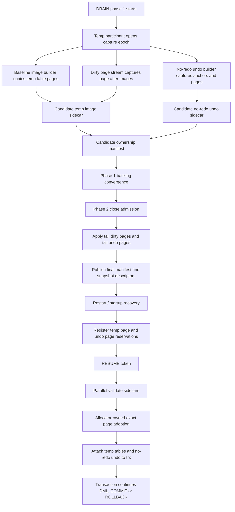
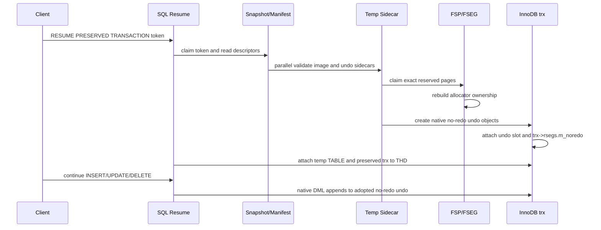

# Preserve/Resume 用户临时表 DML Phase-1 Capture 与 No-Redo Undo Ownership 设计

## 1. 背景与目标

Preserve/Resume 的目标是在受控停机或主备切换过程中，把仍未提交的事务保存为可恢复的 durable artifact，重启或切主后继续执行原事务。对于普通 InnoDB 用户表，事务数据、undo、锁和 binlog cache 都有可恢复的持久事实源或现有 warmcopy 机制；用户 InnoDB 临时表不同，它的数据页和 no-redo undo 位于临时表空间，正常 MySQL 重启不会恢复这些状态。

当前实现已经从早期 fail-closed 框架推进到 phase 1 prebuild、dirty page stream、no-redo undo capture、ownership manifest、exact-page FSEG claim 和 native-owned reconnect 主路径。本文仍保留设计约束和风险清单，因为上线质量不仅要求 happy path 可用，还要求旧 manifest 兼容、异常 cleanup、性能门禁和 `preserve_trx_enable=OFF` 隔离都有证据。

1. drain phase 1 期间目标事务继续对已存在的用户临时表执行 `INSERT`、`UPDATE`、`DELETE`，随后 preserve、restart、resume 成功。
2. resume 成功后，事务可以继续自然地对这些临时表执行新的 `INSERT`、`UPDATE`、`DELETE`，再 `COMMIT` 或 `ROLLBACK`。

第二点是设计边界的关键。如果恢复出来的 no-redo undo 只用于回滚已有操作，不能继续 append/extend/free，那么 preserve 期间支持临时表 DML 的价值会大幅降低。因此本设计要求恢复后的 no-redo undo 必须重新成为 InnoDB allocator 可识别、可追加、可释放的 native undo segment，而不是仅仅在内存里挂几个历史 `trx_undo_t` 对象。

## 2. 当前代码事实

本设计基于当前 8.0.22 preserve-port worktree 的实际代码，不把尚未实现的能力描述为当前能力。

### 2.1 用户临时表 sidecar 构建路径已前移到 phase 1 主路径

`sql/preserve_trx_temp_table.cc` 中的 sidecar 构建路径目前已拆成 phase 1 prebuild 和 phase 2 adopt/fallback。phase 1 prebuild 主路径完成如下工作：

- 注册 dirty page stream。
- flush 目标临时表脏页。
- 开始 baseline copy。
- 创建 streaming writer。
- 复制初始文件页。
- overlay buffer pool 页。
- 应用 dirty page stream。
- 持久化 dirty queue。
- 捕获 no-redo undo。
- seal no-redo undo sidecar。
- 生成 undo sidecar payload。
- close writer，计算 image size/digest，并把 prebuilt sidecar 记录到 participant。

这些操作不能回流到 drain phase 2 用户阻塞窗口内。当前 phase 2 会优先 adopt phase 1 预构建的 sidecar，只在 sidecar 缺失、stale 或 unsupported 时走 fallback。目标口径是 phase 2 约 1 秒，略超过 1 秒可以接受；超过 2 秒应判为性能门禁未达标。为保持这个口径，baseline copy、全量页扫描、大 payload 构建和 fsync 必须继续留在 phase 1，phase 2 只允许做 bounded tail seal、descriptor 校验和 token-owned install。

### 2.2 no-redo undo capture 与 native-owned reconnect 主路径

`storage/innobase/include/trx0temp_preserve.h` 已经记录 no-redo undo 相关字段，例如：

- `no_redo_undo_capture_required`
- `no_redo_undo_sidecar_sealed`
- `no_redo_undo_rseg_space_id`
- `no_redo_undo_rseg_page_no`
- `no_redo_undo_rseg_slot`
- `no_redo_insert_undo`
- `no_redo_update_undo`
- `no_redo_undo_pages`
- `no_redo_undo_pending_pages`
- `no_redo_undo_peer_known_page_nos`

其中 `no_redo_undo_rseg_slot` 是当前代码字段名，但它表达的是 no-redo rollback segment 在临时 rseg 集合中的身份位置，后文统一称为 `rseg_id` 或 rseg slot。它不能和 undo segment slot 混用。真正的 undo slot 是 insert/update undo anchor 中分别记录的 slot，后续 manifest 中用 `undo_slot` 表达。实现时必须把 `{rseg_space_id,rseg_page_no,rseg_id}` 与 `{rseg_space_id,rseg_page_no,rseg_id,undo_slot}` 分成两个层次编码，否则会把 rseg 身份和 rseg header 内的 undo segment slot 混成一个 key。

`storage/innobase/trx/trx0temp_preserve.cc` 中也有 no-redo undo capture 与 reconnect 框架：capture 从 live `trx_undo_t` 读取 anchor 和 body pages，seal 期间补齐 pending pages；native-owned reconnect 会校验 sidecar、检查并保留 undo slot、精确认领 undo pages 的 FSEG/XDES ownership、把 rseg header slot 指向 preserved undo header，并创建 `TRX_UNDO_ACTIVE` 的 reconnected undo 对象挂入 live `trx->rsegs.m_noredo`。

早期 restored-only reconnect 仍保留为 legacy/兼容路径；这种路径只能恢复既有 undo 对象，不能证明后续 DML 可安全追加。native-capable manifest 必须包含 ownership claims，并通过 exact-page adoption 后才能允许 resume 后继续 DML。恢复后如果用户继续 DML，InnoDB no-redo undo 需要能够调用原生分配、追加和释放逻辑；否则会遇到页所有权不清、rseg size 不一致、slot 与 segment header 不一致、后续 cleanup 无法由原生路径处理等问题。

### 2.3 原生 no-redo undo 扩展依赖 fseg ownership

`storage/innobase/trx/trx0undo.cc` 的原生 undo 扩展路径通过 `trx_undo_add_page()` 调用 `fseg_alloc_free_page_general()` 分配新 undo page，并更新 undo page list、`undo->size` 和 `rseg->curr_size`。释放路径通过 `trx_undo_free_page()` 调用 `fseg_free_page()`。

这说明 resume 后继续 DML 的必要条件不是“内存中有 `trx_undo_t`”这么简单，而是：

- undo segment header、body pages、page list、top/free offsets 必须可被原生 undo 代码继续使用。
- FSP/XDES/FSEG inode 元数据必须承认这些 pages 属于对应 segment。
- undo slot、rseg list、`rseg->curr_size`、`trx->rsegs.m_noredo` 必须一致。
- 事务级 no-redo undo 状态必须一致，包括 `trx->undo_no`、`trx->undo_rseg_space`、statement 起点和 rollback/savepoint 边界。仅恢复 page list 与 slot 不足以支持后续 `ROLLBACK TO SAVEPOINT`、statement rollback 或继续 append。
- 后续新增 undo pages 必须能按 native path 分配；commit/rollback cleanup 必须能按 native path 释放。

### 2.4 fsp/fseg 层已有 preserve 专用 exact-page adoption API

`fsp/fseg` 原生接口支持创建 segment、分配新 page、释放 page，但没有通用公开 API 可以把一个由 preserve sidecar 指定的历史 page number 精确认领进一个目标 segment。当前分支为 preserve/resume 增加了专用接口，例如 `fseg_create_at_reserved_page_for_temp_preserve()` 和 `fseg_alloc_reserved_page_for_temp_preserve()`，用于在系统临时表空间内把 sidecar 命名的 undo page 纳入目标 FSEG ownership。

这类 API 只能用于系统临时表空间和 preserve/resume 路径，不能进入普通 allocator 路径，也不能通过复制旧的全局 allocator pages 来“伪造”所有权。上线前仍需要把相关 source-shape guard、异常路径和 `preserve_trx_enable=OFF` 低侵入证据保留为门禁。

### 2.5 当前实现与目标版本边界

本文档描述的是用户临时表 DML Preserve/Resume 的目标实现和当前分支实现之间的对照。当前 HEAD 已经具备 phase 1 sidecar prebuild、ownership claim 编解码、page/slot reservation registry、exact FSEG claim、native-owned no-redo undo reconnect、post-resume temp DML 正向路径和 20 sessions x 200MiB E2E 证据；尚未完全闭环的是独立 durable activation ledger/tombstone、startup 前置 reservation 对所有 crash 窗口的覆盖，以及更细粒度的长期异常/资源趋势报告。

| 能力 | 当前实现边界 | 目标版本行为 | 发布门禁 |
|---|---|---|---|
| 已存在用户 InnoDB 临时表 DML preserve | phase 1 prebuild + phase 2 adopt 主路径已落地，unsupported/stale 时 fail closed 或 fallback | phase 1 捕获页镜像和 no-redo undo ownership，phase 2 尾部封口后可 preserve | 正向 commit/rollback MTR 与 E2E 通过 |
| resume 后继续写临时表 | native-capable manifest 允许继续 DML；legacy/restored-only 路径仍必须拒绝继续写临时表 | no-redo undo 进入 native-adopted 状态后允许继续 DML | post-resume write/rollback/commit 覆盖 |
| no-redo undo ownership | 当前已具备 no-redo undo slot reservation、page reservation、exact FSEG claim、sidecar reconnect 与 native adoption 主路径，后续仍需扩展 crash/cleanup gate | startup 预留 undo slot，resume 精确 adopt page/fseg/rseg/undo-slot | slot/page 冲突和 crash fault injection 覆盖 |
| phase 1 ownership manifest | 当前 manifest 已包含 ownership claims 并以缺失 ownership claim 区分 legacy/restored-only | page/fseg/slot/segment 的可验证 ownership manifest | manifest GUnit、旧格式兼容测试 |
| phase 2 约 1s 目标 | phase 1 prebuild 已把 image/undo 大对象工作移出 phase 2；仍需确保所有 fallback/SLO reason 语义准确 | phase 1 完成 baseline、dirty overlay、undo sidecar、checksum/fsync；phase 2 只做 tail seal；1s 左右为目标，2s 为可接受上界 | phase2 breakdown 与 20x200MiB NFR |
| 临时表 DDL/savepoint/statement rollback | 当前主要覆盖成功 DDL/部分边界，attempt 级 DDL、savepoint-before-temp-DML、pre-engine in-flight marker 仍是目标缺口 | capture epoch 内任何相关不确定语义触发 unsupported marker | source-shape lint 与负向 MTR |
| activation ledger / consumed token | 当前 carrier 能列出 snapshot、blob、temp sidecar 和 taint，但没有“已激活但 cleanup 未完成”的 durable token 状态 | resume claim、activation、cleanup、taint 都由 carrier-backed ledger/tombstone 表达 | activation 前后 crash FI 与二次 resume 拒绝 |
| release gate 证据 | 已有 adoption-enabled post-resume DML、preserve_trx 全量 MTR、GUnit、20x200MiB strict 2s E2E 证据；仍需长期 crash/soak 与 activation ledger 后的最终门禁 | adoption-enabled post-resume DML 成功、temp tail-only 指标、真实 20x200MiB 报告同时满足 | release gate 不允许用保护测试替代正向能力测试 |

因此，`preserve_trx_temp_table_enable=ON` 当前已经可以覆盖 native-capable 用户临时表 DML 主路径，但生产级发布口径仍必须受 activation/crash/cleanup、长期稳定性和 `preserve_trx_enable=OFF` 隔离门禁约束。

## 3. 支持范围与明确不支持范围

### 3.1 本设计目标版本支持

目标版本支持以下场景：

- 目标事务已经创建并打开了用户 InnoDB 事务临时表。
- drain phase 1 开始前或 phase 1 期间，目标事务对这些已存在临时表执行 `INSERT`、`UPDATE`、`DELETE`。
- preserve 成功写出 snapshot、temp image sidecar、no-redo undo sidecar、ownership manifest。
- 重启后 startup/recovery 先注册 preserved 临时表页和 no-redo undo 页的 reservation。
- 用户执行 `RESUME PRESERVED TRANSACTION` 后，恢复临时表、恢复 no-redo undo allocator ownership、恢复事务对象。
- resume 后同一事务继续对恢复的临时表执行新的 `INSERT`、`UPDATE`、`DELETE`，再 `COMMIT` 或 `ROLLBACK`。

这点必须明确：**resume 后继续 DML 是目标能力，不是限制项**。如果 resume 后只能提交或回滚，保存一个正在修改临时表的事务价值非常有限。Native adoption 路径落地后，post-resume DML 必须以正向 COMMIT/ROLLBACK 用例作为 release gate；legacy/restored-only manifest 的拒绝边界应保留在 manifest/GUnit 或显式 legacy-token 用例中，不能再用 native-capable 正常 token 期待写入失败。

### 3.2 目标版本仍不支持

以下场景必须 fail closed，不能隐式降级成不完整 preserve：

- 目标事务或 phase 1 capture epoch 内发生用户临时表 DDL：
  - `CREATE TEMPORARY TABLE`
  - `DROP TEMPORARY TABLE`
  - `TRUNCATE TABLE` 作用于临时表
  - `ALTER TABLE` 作用于临时表，包括重建、重命名或元数据变化
  - `ALTER TABLE ... RENAME`、内部临时表 rename helper 或其它等价路径作用于临时表
- 临时表 DML 与 savepoint create/release/rollback-to-savepoint 或 statement rollback 交叠，且当前实现不能精确证明 undo/page ownership 与逻辑回滚边界一致。
- 无法完整捕获 temp image sidecar、no-redo undo sidecar 或 ownership manifest。
- page size、space identity、rseg identity、undo anchor、digest、page reservation 任一校验不通过。
- 同一临时表空间 page 被两个 token、两个 undo segment 或普通 allocator 同时声明所有权。
- DROP/TRUNCATE/ALTER/rename helper 等 DDL 改变了表身份或空间生命周期。
- 非 InnoDB、非事务性、内部临时表、无法绑定 SQL 层 `TABLE` 与 InnoDB dictionary/table identity 的对象。
- 当前实现未覆盖的特殊 DD shape、隐藏列/虚拟列形态、加密或页大小约束不匹配的对象。

临时表 DDL 的 fail-closed 口径按 statement attempt 处理：capture epoch 内只要目标连接尝试执行可能改变临时表生命周期或对象身份的 DDL，就设置 unsupported marker。即使某些 `IF EXISTS`/`IF NOT EXISTS` 分支最终没有改变对象，也只有在 parser、handler 和 dictionary 路径都能明确证明未触碰目标临时表身份时才允许白名单；目标初版不做此类白名单。

当前代码和部分 lint 仍以“原生路径成功后标记”为主，因此 attempt 级 DDL marker 是明确的目标缺口。实现时不能把当前成功后标记误读为已经满足本节约束。

### 3.3 不采用 SQL row replay

本设计不使用 SQL row journal 或 row replay 作为恢复事实源。临时表 DML 的恢复事实源是：

- 用户临时表物理页 image。
- phase 1 dirty page after-image stream。
- no-redo undo semantic sidecar。
- no-redo undo ownership manifest。

row/handler 热路径只允许记录 O(1) marker，例如 `temp_dml_seen`、table identity generation、capture epoch、unsupported flag。禁止在 row hook 中复制 row buffer、构造大 `std::string`、累积 SQL row payload 或执行文件 I/O。

## 4. 总体架构

核心架构是“Phase-1 持续构建 authoritative artifact，Phase-2 只封尾，Startup 先登记 reservation，Resume 做 allocator-owned adoption”。



设计上的关键分界：

- phase 1 可以做 O(total_temp_pages + total_undo_pages) 工作，因为业务仍在运行。
- phase 2 只能做 O(tail_dirty_pages + tail_undo_pages + descriptor_size + target_count) 工作。
- startup/recovery 只读取 manifest descriptor 建 reservation，不能扫描整个临时表空间。
- resume 可以按 token、表、undo segment 做并行读取和校验，但 allocator adoption 必须遵守 InnoDB 元数据锁顺序。

## 5. Phase 1 Capture 与 Candidate Artifact

### 5.1 temp drain participant 生命周期

新增或完善 `Preserve_trx_drain_orchestrator` 下的 temp-table participant：

1. `open_epoch(target_thd, drain_epoch)`
   - 捕获目标 THD 当前已存在用户临时表清单。
   - 记录 table identity、space id、page size、dict version、fil identity。
   - 注册 dirty page capture epoch。
   - 记录 no-redo undo anchor 采样起点。
2. `build_candidate()`
   - 后台复制 baseline image。
   - 持续消费 dirty page stream。
   - 捕获 no-redo undo pages。
   - 增量生成 candidate ownership manifest。
3. `track_mutation()`
   - 页写入 hook 只记录完整 page after-image 或 page id + durable copy 任务。
   - row/handler hook 只记录 O(1) marker。
   - DDL/savepoint/rollback marker 一旦出现，设置 unsupported reason。
   - SQL 层在进入 engine row mutation 前先设置 in-flight marker，避免语句回滚发生在 engine/binlog 之间时遗漏 temp DML 事实。
   - capture epoch 内若观察到 savepoint create/release/rollback-to-savepoint，先记录 savepoint barrier；后续同一事务发生 temp DML 时 fail closed。另一种等价实现是首次 temp DML 时检查 epoch 内已有 savepoint barrier 并拒绝 preserve。
4. `preseal_converge()`
   - 在进入 phase 2 前尽量等待 backlog 收敛。
   - 如果 backlog 超过阈值，功能仍可继续，但 status 标记 `SLO_NOT_GUARANTEED`。
5. `seal_tail()`
   - phase 2 关闭 admission 后消费最终 tail。
   - 发布 final sidecar descriptor 和 final ownership manifest。
6. `abort()`
   - 清理本 epoch 临时 candidate artifact。
   - 保留已经被 durable snapshot 引用的 final artifact。

当前代码中的 temp-table phase 1 participant 主要完成 capture epoch open 和 ready 标记；`build_candidate()`、`preseal_converge()`、`seal_tail()` 是目标接口。只要 baseline copy、dirty overlay、no-redo undo capture、sidecar checksum/fsync 或 manifest encode 仍由 snapshot write 路径触发，该 target 必须标记 `SLO_NOT_GUARANTEED`，不能用于 phase 2 约 1 秒性能声明。

### 5.2 baseline 与 dirty page overlay

baseline image 是临时表在 capture epoch 内的全文件或全空间物理页副本。phase 1 期间发生的修改通过 dirty page after-image stream 覆盖到 shadow image。

overlay 规则：

- key 为 `{source_space_id, page_no}`。
- value 为完整 page bytes、page_lsn/epoch、capture sequence、page digest。
- 多次修改同一 page 时 latest-wins。
- final sidecar 按 page id 有序输出，附带整体 image digest 和 per-page digest。
- page size 必须与 descriptor 一致；不一致 fail closed。

这个模型支持数据页、索引页、FSP/XDES/INODE/B-tree 页、新分配页。对于 allocator-bearing pages，sidecar 中的 bytes 只作为源事实和校验证据；resume 时不能无条件把源全局 allocator page 覆盖到目标临时表空间。

### 5.3 no-redo undo capture

no-redo undo capture 分为 semantic content 和 ownership proof 两部分。

semantic content 包括：

- insert undo 和 update undo 的 anchor：
  - rseg space id
  - rseg page no
  - rseg id，即当前代码 `no_redo_undo_rseg_slot` 表达的 rseg 身份
  - undo slot
  - undo header page no
  - undo header offset
  - last page no
  - top page no
  - top offset
  - top undo no
- undo segment body pages：
  - page no
  - page bytes
  - page role
  - page digest
  - page list predecessor/successor proof
- undo log records 所需的完整 page image。
- 事务级 undo 连续性状态：
  - `trx->undo_no` 的恢复值，至少应为 insert/update undo 中最大 `top_undo_no` 的后继值，避免 resume 后继续 DML 复用旧 undo number。
  - `trx->undo_rseg_space` 与 `trx->rsegs.m_noredo.rseg` 的一致性。
  - statement 起点、`last_sql_stat_start`、`roll_limit` 或等价字段的恢复/拒绝策略。
  - 若当前实现不能保真这些字段，savepoint、statement rollback、partial rollback 相关场景必须继续 fail closed。

ownership proof 包括：

- undo segment header 和 page list 顺序。
- 该 segment 所需的 exact page claim set。
- source no-redo rseg 所在 space 与用户临时表数据 space 的域区分。
- 预期 `undo->size` 与 `rseg->curr_size` 增量。
- 预期 `trx->undo_no` 与 `trx->undo_rseg_space`。
- 该 token 对这些 pages 的 reservation generation。
- candidate manifest digest。

phase 1 builder 必须尽早建立并持久化 candidate ownership manifest。phase 2 不应重新扫描整个 temp tablespace 或整个 undo page set，而只补齐 tail pending pages 并做最终校验。

no-redo undo page number 在目标初版采用 exact-page adoption：preserve 保存的 undo page 在目标临时表空间中仍以同一 page number 恢复并被同一 token 占有。只有实现了完整 page remap，并能重写所有 undo page list、undo log record 引用以及临时表记录中的 roll pointer 时，才允许采用 fresh-page allocation 模式。目标初版不做 remap。

exact-page adoption 同样适用于 no-redo rseg header page。重启后系统临时表空间会重新创建 temp rseg；不能假设旧 `rseg_page_no` 会自然复用。目标初版必须在 temp rseg 可分配普通 no-redo undo 之前，按 manifest 精确认领或重建对应 rseg header page。若无法在同一 page number 建立 rseg header，就不能继续 native adoption；除非实现了完整 rseg-page remap，并同步重写 undo slot key、undo anchors、undo header 中的 rseg 指针和 manifest digest。目标初版不做 rseg remap，遇到这种情况 fail closed。

### 5.4 phase 1 candidate artifact 生命周期

phase 1 builder 写出的 baseline、dirty overlay、undo candidate 和 ownership candidate 只是 drain 内临时事实，不是可 resume 的 durable snapshot。它们必须有独立的 owner marker 和 generation：

- 文件名或目录包含 server UUID、datadir identity、drain epoch、target token 和 builder generation。
- candidate segment 使用 temp name 写入，完成 checksum/fsync 后才进入 carrier 可列举的 candidate 状态；具体状态名必须复用或扩展 carrier 现有 artifact lifecycle，不能在文件系统旁路发明一个 recovery 不认识的私有格式。
- phase 2 seal 成功并被 snapshot 引用前，startup/recovery 不能把 candidate artifact 当作 reservation 输入。
- drain abort、target reject 或 server crash 后，startup 只能清理属于本实例、未被 snapshot 引用、且 owner marker 可验证的 candidate artifact。
- 如果 candidate cleanup 无法证明安全，保留 orphan 并报告，不得删除可能已被 snapshot 引用的 final artifact。

这一区分可以避免“phase 1 写了一半的物理页 sidecar 在重启后被当成完整 token 恢复事实源”的错误。

candidate/final 分类必须通过 carrier 可见的 metadata 表达，而不是只靠文件名后缀猜测。目标实现需要让 carrier listing 至少能区分：

- `TEMP_CANDIDATE`: phase 1 生成、尚未被 snapshot 引用，只允许 owner epoch cleanup。
- `TEMP_FINAL_REFERENCED`: 已被 durable snapshot 引用，可作为 startup reservation 输入。
- `TEMP_CONSUMED_CLEANUP_PENDING`: token 已进入 activation 或 cleanup，不能再作为可 resume token。
- `TEMP_ORPHAN_UNVERIFIED`: owner marker、checksum 或 snapshot 引用关系无法证明，禁止自动删除。

这些状态可以由独立 candidate manifest artifact、final descriptor 或 activation ledger 组合表达，但必须被 startup/recovery 统一识别。不能新增一个 recovery 不扫描的私有目录或私有格式。

## 6. Ownership Manifest

ownership manifest 是 resume 快速、正确恢复 no-redo undo 的关键事实源。它不是辅助审计信息，而是 startup reservation 和 resume adoption 的权威输入。

建议 manifest 结构如下：

```text
Preserved_temp_no_redo_ownership_manifest
  format_version
  token
  source_server_uuid
  source_temp_space_id
  page_size
  drain_epoch
  final_seal_epoch
  temp_tables[]
    logical_table_id
    source_space_id
    target_space_id
    root_page_no
    table_flags
    dict_identity_digest
    image_sidecar_descriptor
  trx_undo_state
    expected_trx_undo_no
    undo_rseg_space_id
    last_sql_stat_start_policy
    roll_limit_policy
    statement_rollback_supported: false | true
    savepoint_restore_supported: false | true
  noredo_rseg_headers[]
    rseg_space_id
    rseg_page_no
    rseg_id
    rseg_max_size
    rseg_slot_count
    slot_array_digest
    rseg_fseg_header_offset
    rseg_fseg_inode_page_no
    rseg_fseg_inode_offset
    proposed_or_source_segment_id
    adopted_segment_id
    expected_xdes_state
    target_fsp_seg_id_high_water_after_adoption
    rseg_header_digest
  undo_segments[]
    kind: insert | update
    rseg_space_id
    rseg_page_no
    rseg_id
    undo_slot
    slot_reservation_key
    undo_header_page_no
    undo_header_offset
    last_page_no
    top_page_no
    top_offset
    top_undo_no
    expected_undo_size_pages
    expected_rseg_curr_size_delta
    source_rseg_header_page_no
    target_rseg_header_page_no
    rseg_header_rebuild_mode: exact_page | remap_unsupported
    target_fseg_inode_page_no
    target_fseg_inode_offset
    proposed_or_source_segment_id
    adopted_segment_id
    target_fsp_seg_id_high_water_after_adoption
    adoption_mode: exact_page
    owned_pages[]
      page_domain: temp_image | system_temp_no_redo_undo
      space_id
      page_no
      page_role
      page_order
      page_digest
      semantic_digest
      exact_claim_required
      fseg_membership: fragment | extent
      expected_xdes_state
      expected_fseg_header_pointer
  reservation_digest
  manifest_digest
```

`noredo_rseg_headers[]` 是顶层事实，不能被隐含在 `undo_segments[]` 里。temp rseg header 自身由 `fseg_create(... TRX_RSEG_FSEG_HEADER ...)` 产生，也拥有 FSEG inode、segment id、XDES membership 和 `FSP_SEG_ID` high-water 影响。目标实现必须先 adopt 或重建 rseg header，再 adopt 该 rseg 下的 insert/update undo segments。若 rseg header 不能成为 allocator-owned 对象，后续 undo segment 即使 page bytes 完整，也不能进入 `native-adopted`。

`expected_trx_undo_no` 是事务全局值，不能在每个 segment 中各自维护一个 after 值。每个 undo segment 只记录自己的 `top_undo_no`；解析时计算所有 insert/update undo 的 `max(top_undo_no) + 1`，并与全局 `expected_trx_undo_no` 比对。若二者不一致，说明 manifest 与事务级 undo 序列不一致，必须 fail closed。

`proposed_or_source_segment_id` 与 `adopted_segment_id` 必须区分。phase 1 在源端构建 manifest 时只能记录源端或候选 segment id；真正的 `adopted_segment_id` 只有在目标端 adoption mtr 中成功分配或认领后才成立，并应写入 activation ledger。实现可以选择复用源端 segment id，但必须经过目标端 `FSP_SEG_ID` high-water 与 XDES/FSEG 冲突检测，不能把 source id 直接当成已采用的 target id。

### 6.1 manifest 的作用

manifest 同时服务四个阶段：

- phase 1：作为 candidate builder 的增量产物，持续证明已经捕获了哪些 pages。
- phase 2：作为 final tail seal 的比较对象，证明没有未闭合 pending page。
- startup：注册 page reservation，避免普通 temp allocator 重用 preserved pages。
- resume：驱动 exact page claim、structured materialization 和 native undo attach。

### 6.2 manifest 不能依赖全表空间扫描

startup 和 resume 不能通过扫描整个 `srv_tmp_space` 来推断 ownership。原因是：

- 临时表空间可能很大，扫描会破坏 resume 延迟目标。
- preserved page 与普通临时对象 page 的关系必须来自 durable snapshot，而不是重启后再猜测。
- 一旦普通 allocator 在 reservation 建立前重用了 preserved page，后续无法无损恢复。

因此 startup/recovery 必须在允许普通连接创建或修改临时表之前，先扫描 preserved snapshot descriptors，并拿到足以建立 reservation map 的完整 page/slot claim 列表。descriptor 只能定位 manifest body、校验长度和 digest；它本身不能替代 ownership manifest。目标实现必须二选一：

- 把有界、可认证的 page/slot claim 列表编码进 snapshot TLV，startup 直接解析该 TLV 建 reservation。
- snapshot 只保存 manifest descriptor 时，startup 必须在开启普通 temp allocator 前读取、校验并解析 manifest body，再建立 reservation。

无论选择哪种方式，startup 都不能通过扫描整个 `srv_tmp_space` 推断 ownership，也不能在 reservation 建立之前允许普通连接创建临时表或分配 no-redo undo page。

### 6.3 与现有 manifest 的关系

当前 `Preserved_temp_table_manifest` 主要表达 SQL 层临时表、sidecar descriptor 和 undo image descriptor；它不足以表达 allocator ownership。目标实现可以新增版本化扩展，也可以在 bundle 中增加独立 TLV/descriptor，但必须保留旧 snapshot 的兼容读取：

| 事实 | 当前 manifest | 目标 ownership manifest |
|---|---|---|
| 用户临时表列表 | 已有 | 继续作为 table identity 输入 |
| image sidecar descriptor | 已有 | 继续引用并加入 page digest domain |
| no-redo undo image | 有 descriptor | 增加 rseg header、rseg id、undo slot、fseg inode、segment id、exact page claim |
| page reservation | 不完整 | `{space_id,page_no}` 权威登记 |
| slot reservation | reconnect 时检查为主 | startup 阶段登记 `{rseg_space_id,rseg_page_no,rseg_id,undo_slot}` |
| allocator adoption | 未完整表达 | manifest 驱动 native-owned adoption |

旧 manifest 缺少 ownership 扩展时不能进入 `native-adopted` 路径。兼容策略只能是继续采用当前保护语义：memory-only reconnect 后允许 `COMMIT`/`ROLLBACK`，但 post-resume temp DML 仍被拒绝；如果缺失字段导致当前保护路径也无法证明完整性，则 fail closed。

实现上需要一个硬 gate，而不是靠调用方约定：

- 新 snapshot 必须通过独立 ownership TLV、版本化 manifest body 或等价 descriptor 表达 `native_adoption_capable=true`。
- 旧格式或缺少 ownership 扩展的 snapshot 必须得到 `native_adoption_capable=false`。
- `native_adoption_capable=false` 时，SQL 层不得清除 restored no-redo undo 的 post-resume write reject。
- legacy fixture 必须覆盖“旧 manifest 可按旧语义读取，但不能进入 native-adopted”。

### 6.4 page identity 域

用户临时表数据页与 no-redo undo 页不能混用同一个隐含 space 域：

- temp image page key 使用 `{source_temp_space_id,page_no}`。
- no-redo undo page key 使用 `{rseg_space_id,page_no}`。
- undo slot key 使用 `{rseg_space_id,rseg_page_no,rseg_id,undo_slot}`。
- manifest digest 必须把 page domain 纳入编码，避免数据页和 undo 页 page number 相同但语义不同。

还需要区分两个不同的物理 ownership 域：

- 用户临时表 image 域。恢复时通常会 materialize 成 token 私有或会话私有的 adopted temp fil space。这个域关注表空间文件、dict/table identity、root page 和 table pages；它不应被误写成共享 `srv_tmp_space` no-redo undo page reservation。
- 系统临时表空间 no-redo undo 域。no-redo undo pages 位于共享系统临时表空间和 no-redo rseg 下，必须在 startup 阶段建立 page/slot reservation，避免普通事务的 no-redo undo allocator 复用这些 pages。

如果实现保留 source temp space id 作为用户临时表 image 的目标 space id，也必须在 manifest 中明确它属于 table image domain；不能把 table image page 与 no-redo undo page 放进同一个 `{space_id,page_no}` namespace 后依赖 page number 区分。

no-redo stream、reservation stream 和 manifest lookup 的代码也必须遵守这个域边界。任何查询 no-redo undo stream 或 reservation 的路径都必须使用 `rseg_space_id`，不能用用户临时表的 `source_space_id` 代替。建议增加 source-shape lint：凡是访问 no-redo undo stream map、page reservation map 或 undo slot reservation map 的调用点，必须能在同一作用域中看到 rseg identity，不能只传 table image space id。

## 7. Startup Reservation

### 7.1 reservation registry

启动阶段新增或完善内存 reservation registry：

```text
Preserved_temp_page_reservation
  key: {page_domain, space_id, page_no}
  value:
    token
    token_generation
    source_temp_space_id
    logical_table_id or undo_segment_id
    page_role
    rseg_space_id
    rseg_page_no
    rseg_id
    undo_slot
    generation
    state: Reserved | Claimed | Released | Tainted
```

另有 undo slot reservation：

```text
Preserved_temp_undo_slot_reservation
  key: {rseg_space_id, rseg_page_no, rseg_id, undo_slot}
  value:
    token
    token_generation
    undo_kind
    undo_header_page_no
    generation
    state: Reserved | Claimed | Released | Tainted
```

registry 按 `{space_id, page_no}` 与 `{rseg_space_id,rseg_page_no,rseg_id,undo_slot}` 分片，支持并发 lookup。普通临时表 allocator 在 active registry 存在时只需要做轻量 check：如果将要分配的 page 或 undo slot 已被 preserved token reserved，则跳过或 fail closed。`preserve_trx_enable=OFF` 且没有 active reservation 时，这条路径必须由全局 active-count 快速返回，不能进入 mutex map lookup。

active-count 必须按 page reservation 与 undo-slot reservation 分开维护。普通 page allocator 只需要读取 page-reservation active count；no-redo undo slot create/reuse 只需要读取 slot-reservation active count。两个 active count 都为 0 时，即使 `preserve_trx_temp_table_enable` 编译存在，普通 MySQL 临时表路径也不能进入 reservation mutex/map。这是 `preserve_trx_enable=OFF` 和无 preserved token 场景下的低侵入边界。

当前实现更接近“按 preserved temp space / reconnect-time undo slot 做保护”，还不是完整 page-level registry。目标实现必须在 startup 阶段从 durable manifest 建立 page 与 undo slot 两个维度的 reservation；只在 resume/reconnect 时临时检查 slot 不足以防止普通 allocator 在 resume 前复用 preserved pages。

startup reservation 的顺序是硬约束：

1. 打开系统临时表空间和必要的 snapshot/carrier 读接口。
2. 解析 durable snapshot 引用的 final ownership manifest，必要时读取有界 manifest body。
3. 建立 no-redo undo page reservation 与 undo slot reservation。
4. 完成 duplicate/conflict 检测。
5. 之后才允许初始化或放行可能分配 no-redo undo page 的 temp rseg/undo allocator，以及普通连接的用户临时表创建/写入。

如果某个启动路径需要先初始化 temp rseg 对象才能读 manifest，也必须保证这段初始化不会分配或复用任何可能被 preserved token 声明的 undo page。否则 startup reservation 必须前移。

### 7.2 temp rseg header 重建顺序

no-redo undo slot key 依赖 `{rseg_space_id,rseg_page_no,rseg_id,undo_slot}`，其中 `rseg_page_no` 是 rseg header page。系统临时表空间重启时会重新建立 temp rseg；如果原生初始化先随意分配新的 rseg header page，再由 preserve 尝试认领旧 page，manifest 中的 slot key 就已经失效。

目标初版采用 exact-page 策略：

1. startup 读取 ownership manifest 中的 `source_rseg_header_page_no` / `target_rseg_header_page_no`。
2. 在普通 no-redo undo allocator 可创建或复用 undo slot 之前，先为 preserved token 登记 rseg header page reservation。
3. temp rseg 初始化必须优先尝试在 manifest 指定的 page no 上创建或认领 rseg header。
4. rseg header 的 `rseg_id`、space id、page no、slot array 必须与 manifest 中的 undo segment anchors 一致。
5. manifest 中的 `rseg_id` 必须小于当前启动配置可创建、可激活的 temp rseg 范围。若 `srv_rollback_segments` 等配置变化导致该 rseg 不再存在，目标初版 fail closed；除非后续明确实现 preserved-only hidden rseg，并证明它不会参与普通事务选择。
6. 如果指定 page no 已被其它 live object 占用、无法作为 rseg header 表达，或原生代码无法在该 page no 上创建 temp rseg，则该 token fail closed。

目标初版不允许“启动时先把 rseg header 分配到新 page，然后只把 body undo pages remap 过去”。这种 remap 需要同时改写 undo slot key、undo anchors、undo header page list、所有相关 digest 和临时表记录中的 roll pointer，复杂度超过第一版范围。

### 7.3 duplicate reservation

如果启动时发现两个 token 声明同一 no-redo undo `{space_id,page_no}` 或同一 `{rseg_space_id,rseg_page_no,rseg_id,undo_slot}`，不能选择其中一个继续。即使两个 token 来自同一个 source temp space，也必须按 token 维度判定冲突，不能退化成当前以 source space id 为 owner 的幂等规则。必须：

- 标记相关 token 为 `TEMP_PAGE_OR_SLOT_RESERVATION_CONFLICT` 或更通用的 `RESERVATION_CONFLICT`。
- 禁止这些 token resume。
- 保留 snapshot/sidecar 供人工诊断或后续 cleanup。
- 不允许普通 allocator 使用这些 pages 或 undo slots，除非管理员显式清理相关 preserved records。

`RESERVATION_CONFLICT` 与 `CLEANUP_TAINTED` 不是同一种状态。前者表示 startup 阶段无法建立唯一 ownership，事务从未被安全激活；后者表示事务可能已经被激活或 cleanup 过程中出现残留，需要按 activation ledger 的 cleanup/audit 规则处理。

### 7.4 reservation 与 durable snapshot 的关系

只有被 durable snapshot 引用的 final manifest 才能登记 reservation。phase 1 candidate manifest 没有被 snapshot 引用，不能在重启后成为恢复事实源。

如果 snapshot publish 状态不确定，遵守现有 preserve fail-closed 语义：保留可观测记录，禁止静默删除可能已被 token 引用的 sidecar。

## 8. Allocator-Owned Adoption

### 8.1 为什么不能只恢复 bytes

no-redo undo page bytes 恢复到目标临时表空间后，如果 allocator 元数据不承认这些 pages 属于相应 undo segment，后续继续 DML 会出现多类问题：

- `trx_undo_add_page()` 追加新 page 时不知道旧 segment 的真实 page list 和 size。
- `trx_undo_free_page()` cleanup 时可能释放一个 allocator 未登记的 page。
- undo slot 看起来空闲，可能被其他事务复用。
- FSP/XDES free bit 仍认为 page 空闲，普通 temp object 可能分配到同一 page。
- `rseg->curr_size` 与实际 segment pages 不一致，影响 undo segment 管理。

因此 resume 必须把 restored no-redo undo 恢复成 allocator-owned native segment。

### 8.2 新增 preserve 专用 fsp/fseg API

建议新增内部 API，命名可按 InnoDB 风格最终确定：

```c++
dberr_t fseg_preserve_claim_exact_page(
    fil_space_t *space,
    page_no_t page_no,
    fseg_header_t *target_fseg,
    preserve_page_role role,
    preserve_fseg_membership membership,
    preserve_token_id token,
    mtr_t *mtr);

dberr_t fseg_preserve_adopt_undo_segment(
    trx_rseg_t *rseg,
    ulint slot,
    const preserve_temp_undo_manifest &manifest,
    mtr_t *mtr);
```

这些 API 只允许在 preserve/resume adoption 路径调用，且只针对系统临时表空间。职责包括：

- 检查 page 已经由 reservation registry 绑定到当前 token。
- 检查 page 当前没有被其他 live segment 占用。
- 为目标 undo segment 创建或认领原生可遍历的 fseg bootstrap 状态，包括 segment header、inode slot、`FSP_SEG_ID`、`adopted_segment_id`、fragment array 和 extent list 的初始关系。
- 在同一个 mtr 内把 tablespace header 中的 `FSP_SEG_ID` 推进到大于所有 `adopted_segment_id` 的值，避免后续原生 `fseg_create_general()` 复用 segment id。
- 在 XDES bitmap 中把 page 从 free 状态切换为 used。
- 把 page 挂入目标 FSEG fragment array 或 extent ownership。
- 更新 FSEG inode、page list、segment size。
- 重写 undo header page 内嵌的 `TRX_UNDO_FSEG_HEADER`，使其中的 `FSEG_HDR_SPACE`、`FSEG_HDR_PAGE_NO`、`FSEG_HDR_OFFSET` 指向目标 inode/fseg header，而不是源端 sidecar 中的旧地址。
- 写入 undo slot 与 undo segment header 的一致状态。
- 更新 `rseg->curr_size`。
- 检查并维护 `rseg->max_size` 约束，避免恢复后 native undo append 立即越界。
- 使用 `MTR_LOG_NO_REDO`，遵守临时表空间 no-redo 语义。
- 任一步无法证明安全时返回错误并 fail closed。

不能通过复制源端 FSP/XDES/INODE page bytes 来恢复 allocator 状态。源端的全局 allocator 页面在目标进程中可能已经变化，直接覆盖会破坏其他临时对象。

### 8.3 exact-page adoption 的原生结构约束

InnoDB 的 fseg 释放路径并不是“看到 page bytes 就能释放”。对 fragment page，释放时会在 `FSEG_FRAG_ARR` 中查找 page；对 extent-owned page，XDES 的 segment id、extent state、free bitmap 和 FSEG extent list 必须一致。因此 exact-page adoption 必须把每个 preserved page 映射到原生 fseg 可表示的成员关系，至少区分以下三类：

1. **独立 fragment page adoption**
   - 目标 page 以 segment fragment page 形式登记。
   - page no 写入目标 segment 的 `FSEG_FRAG_ARR`。
   - page 所在 extent 处于 tablespace fragment 池可表达的状态，且对应 page free bit 为 used。
   - 释放时 native `fseg_free_page()` 能在 fragment array 找到该 page。
2. **`XDES_FSEG_FRAG` segment-fragment extent adoption**
   - page 所在 extent 已归属目标 segment，但该 extent 仍按 fragment extent 管理。
   - XDES state、XDES segment id、extent descriptor 与目标 `adopted_segment_id` 一致。
   - `XDES_FRAG_N_USED`、XDES free bitmap、目标 inode 中的 fragment/extent 计数必须同时更新。
   - 如果 extent 处于 not-full 语义，`FSEG_NOT_FULL_N_USED` 与该 extent 的 actual used pages 保持一致。
   - 如果 extent 仍属于 tablespace fragment 池，必须同时维护 `FSP_FRAG_N_USED`、`FSP_FREE_FRAG`、`FSP_FULL_FRAG` 的迁移关系，避免 tablespace fragment allocator 把同一 page 再次作为 free fragment 分配出去。
3. **完整 segment extent adoption**
   - page 所在 extent 归属于目标 segment。
   - XDES state 为 segment-owned 状态，XDES segment id 等于目标 `adopted_segment_id`。
   - extent 挂入目标 segment 的 `FSEG_FREE`、`FSEG_NOT_FULL` 或 `FSEG_FULL` 链表。
   - XDES free bit、`FSEG_NOT_FULL_N_USED` 与 actual used pages 一致。

segment header 和 inode 的 bootstrap 是 adoption 的前置条件，而不是 page claim 之后的审计信息。目标实现必须先证明目标 fseg header/inode 可以安全创建或复用，再认领 body pages；如果 source sidecar 中只有 undo body page bytes，缺少 header/inode/segment-id proof，就不能进入 native-adopted。

`FSP_SEG_ID` high-water 是 bootstrap 的一部分。manifest 中可以记录源端或候选 segment id，但实际 adoption 必须在目标端确定 `adopted_segment_id`，并检查、更新 tablespace header 的 first-unused segment id。若 `FSP_SEG_ID` 小于等于任一 adopted segment id，后续普通 segment 创建可能拿到相同 id，使 XDES ownership 与 FSEG inode 混淆。此类检查失败必须 fail closed，不能只作为诊断 warning。

如果 manifest 中的 sparse page set 无法用上述原生结构无损表示，就不能强行认领。可选方案只有两个：

- fail closed，保留 token 与 sidecar 供诊断或重试；
- 分配新 page 并完整 remap undo page list、undo log 内部引用和临时表记录中的 roll pointer。

目标初版选择 exact-page adoption；不实现 fresh-page remap。任何需要 remap 才能安全恢复的 token 都必须 fail closed。

### 8.4 allocator reservation 覆盖点

startup reservation 只有在 allocator 的所有候选分配路径都能观察到时才有意义。否则 preserved page 虽然登记在 registry 里，普通临时对象仍可能从另一个 allocator 分支拿到同一 page。目标实现必须覆盖以下候选路径：

- hinted page 或 near page 分配。
- 当前 segment 同 extent 中继续分配。
- segment free/not-full/full list 迁移后的分配。
- tablespace free-frag extent 中分配 fragment page。
- 新 extent 分配和 extent split。
- page-free bitmap 扫描得出的候选 page。
- `fseg_fill_free_list()` 或等价批量填充 free/not-full list 的候选 page。
- cached undo segment 复用路径。即使没有新建 undo segment，缓存中的 undo header、slot 和 page list 被复用前也必须检查 reservation。
- `xdes_is_leasable()` 或等价 extent 可租用判断之后的实际 page 选择点。

每个候选点的规则一致：若 active reservation count 为 0，立即走原生路径；若候选 page 被其它 token reserved，普通 allocator 必须跳过并寻找下一个候选；若 preserved adoption 正在 claim 本 token page，则必须验证 token、space、page role 和 generation。没有安全替代候选时，普通分配返回原生可重试错误或扩展 tablespace；preserve/resume adoption 则 fail closed，不能偷用未声明 page。

这些检查必须放在原生 latch/mtr 能保证候选 page 状态稳定的位置，不能在锁外先查 registry、再到锁内假设候选仍有效。

实现评审时需要按真实分支建立覆盖矩阵，而不是只在最终 mark-used 处做一次检查：

| 分配/复用分支 | reservation 检查点 | preserved page 命中时的行为 |
|---|---|---|
| hinted/near page | 候选 page 在 mtr 内确认 still free 之后、mark used 之前 | 普通 allocator 跳过或重新选点；adoption 校验 token/generation |
| same extent 继续分配 | extent descriptor 与 free bitmap 已 latch 后 | 跳过 reserved bit；无替代 bit 时换 extent |
| segment `FSEG_FREE` list | 从 list 取 extent 后、迁移到 not-full/full 前 | 跳过含 reserved page 的候选或只选未 reserved page |
| segment `FSEG_NOT_FULL` list | 计算 extent used/free 计数时 | reserved page 不得计入普通 free 候选 |
| tablespace free-frag extent | `xdes_is_leasable()` 之后、fragment page 落定前 | reserved page 不得租给普通 fragment allocator |
| 新 extent 分配 | extent 进入 segment ownership 前 | 若 extent 内含其它 token reserved page，不能整体归属当前 segment |
| `fseg_fill_free_list()` 批量填充 | 每个候选 extent/page 入 list 前 | 不得把含 reserved page 的 extent 放入错误 list |
| cached temp undo segment reuse | reuse undo header、slot、page list 前 | slot/page 任一被其它 token reserved 时跳过缓存或 fail closed |

GUnit 需要覆盖每个分支的“无 reservation 原生路径不变”“命中其它 token reservation 会避开”“本 token adoption 可 claim”三种结果。仅用 source-shape lint 不能替代这些行为测试。

### 8.5 structured materialization

resume materialization 分两层：

1. semantic page materialization
   - 恢复 undo log record bytes。
   - 恢复 undo page header 中与遍历、top/free offset、page list 有关的字段。
   - 恢复临时表数据页、索引页和必要的表内结构页。
2. allocator ownership materialization
   - 由 preserve 专用 fsp/fseg API 创建或认领 segment。
   - 更新 XDES/FSEG/rseg 元数据。
   - 重写 undo header 的 embedded FSEG header 指针。
   - 推进 `FSP_SEG_ID` high-water。
   - 将 semantic pages 纳入 native ownership。

这避免了“为了恢复一个 preserved undo segment，把源端整个临时表空间 allocator 状态覆盖到目标端”的错误模型。

semantic materialization 可以先把 sidecar 中的 undo bytes 读入 staged page；allocator ownership materialization 不能只 memcpy 源端 allocator header。所有会被原生 append/free 路径读取的元数据，尤其是 undo header 的 FSEG header、FSEG inode、XDES segment id/free bitmap、rseg header slot、`undo->size`、`rseg->curr_size`，都必须以目标端当前 latch/mtr 保护下的状态重建。任一字段只能从 source bytes 推导但无法安全映射到目标端时，保持 fail closed。

## 9. Phase 2 Tail-Only Seal

### 9.1 phase 2 的准入条件

进入 phase 2 前，temp participant 必须给 orchestrator 提供以下状态：

- baseline image copy 已完成。
- dirty page stream backlog 已低于阈值，或标记 `SLO_NOT_GUARANTEED`。
- no-redo undo candidate manifest 已持久化。
- pending undo pages 已低于阈值，或标记 `SLO_NOT_GUARANTEED`。
- 未观察到 temp DDL、unsupported savepoint、statement rollback、sidecar error、reservation conflict。

若 strict NFR 要求 phase 2 约 1 秒，而 backlog 明显过大，系统可以继续功能正确的 preserve，但必须在 status/report 中标记 SLO miss，不能宣称满足性能目标。略超过 1 秒可以接受；超过 2 秒应明确报告为性能门禁失败。

### 9.2 phase 2 只做尾部封口

phase 2 的 temp-table 工作限定为：

1. 关闭目标事务 lock-capable 和 temp-DML-capable admission。
2. 等待 inflight temp page hooks 归零。
3. 捕获最终 dirty page tail。
4. 捕获最终 no-redo undo tail pages。
5. 重读 undo anchors，确认与 candidate manifest 的演进一致。
6. 更新 final ownership manifest digest。
7. fsync final descriptor 与 snapshot 引用。

phase 2 禁止做：

- baseline 全文件 copy。
- 全临时表空间扫描。
- 全 no-redo undo page set 重新扫描。
- 大 payload 字符串 materialization。
- 把 temp image 或 undo sidecar 全量读回内存再写 snapshot。

### 9.3 当前重工作迁移表

当前代码中若干工作已经有函数锚点，但执行阶段和输出形态需要调整。目标不是删除现有能力，而是把重工作前移到 phase 1 builder，把 phase 2 收敛成 tail-only。

| 当前路径/职责 | 目标 owner 与阶段 | phase 2 允许残留 |
|---|---|---|
| `preserve_trx_temp_table_begin_capture_epoch()` | 保留为 phase 1 epoch open，负责建立 target/table/undo 采样边界 | 不重新打开新目标，只关闭 admission |
| baseline image copy | phase 1 background builder 复制与校验 | 只校验 final descriptor |
| dirty page stream overlay | phase 1 持续消费、压缩 latest-wins page after-image | 只消费 close admission 后的 tail dirty pages |
| no-redo undo capture | phase 1 捕获 anchors、body pages、pending pages 和 ownership manifest | 只补 final pending pages 并重读 anchors |
| no-redo undo sidecar payload | phase 1 写 external sidecar segment 与 manifest | 不生成大字符串 payload |
| temp image/undo checksum/fsync | phase 1 对 candidate segment 执行 checksum/fsync/rename | final descriptor fsync 和 manifest digest |
| ownership reservation manifest | phase 1 增量持久化，phase 2 finalize digest | 不扫描 entire temp space |

若某条路径仍只能在 phase 2 构建全量 payload，该 target 必须标记 `SLO_NOT_GUARANTEED`；功能可以继续，但不能用于 phase 2 约 1 秒性能声明。

### 9.4 phase 2 时间模型

目标时间模型：

```text
phase2_temp_ms =
  close_admission_ms
  + wait_inflight_hooks_ms
  + tail_dirty_page_count * page_tail_apply_cost
  + tail_undo_page_count * undo_tail_apply_cost
  + final_manifest_fsync_ms
  + descriptor_publish_ms
  + per_target_temp_descriptor_adopt_ms
```

它不应包含：

```text
total_temp_table_pages * page_copy_cost
total_undo_pages * undo_scan_cost
large_payload_bytes * serialization_cost
```

因此，phase 1 backlog convergence 是性能目标能否成立的前置条件。若业务在 phase 1 持续高速写临时表，tail 始终无法收敛，系统仍应保持功能正确，但报告 `TEMP_TAIL_NOT_CONVERGED` 或类似 SLO miss reason。

### 9.5 temp-table 观测项

报告和 status 至少需要能解释 phase 2 是否真的 tail-only：

- `temp_phase1_baseline_pages`
- `temp_phase1_dirty_pages_captured`
- `temp_phase1_dirty_backlog_pages`
- `temp_phase2_tail_dirty_pages`
- `temp_phase1_undo_pages_captured`
- `temp_phase2_tail_undo_pages`
- `temp_phase2_materialized_payload_bytes`
- `temp_ownership_manifest_bytes`
- `temp_resume_adoption_ms`
- `temp_slo_miss_reason`

其中 `temp_phase2_materialized_payload_bytes` 在约 1 秒 gate 中应接近 descriptor 级别；如果出现大 sidecar body materialization，说明重工作仍留在阻塞窗口内。

## 10. Resume 流程与继续 DML

### 10.1 resume 顺序

resume 必须按以下顺序执行：



关键点：

- token 不能在 adoption 完成前被消费删除。
- sidecar validation 可以并行。
- allocator metadata adoption 必须按 space/rseg latch 顺序串行化。
- 事务激活后，新 DML 必须走原生 InnoDB no-redo undo 路径，而不是 preserve 专用 replay 路径。

### 10.2 post-resume DML 的必要状态

resume 激活前必须满足：

- `trx_t` 已恢复并绑定到 THD。
- 用户临时表 TABLE/dict/fil space 已打开并绑定。
- insert/update no-redo undo 对象已挂到 `trx->rsegs.m_noredo`。
- undo slot 指向 adopted undo segment。
- FSP/XDES/FSEG 元数据承认所有 restored undo pages。
- 事务已经离开 preserve/reconnect 的 prepared-only 保护语义，处于 SQL 层可继续执行的 active transaction 状态。
- 每个 no-redo `trx_undo_t::state` 与对应页内 `TRX_UNDO_STATE` 已转换为原生可继续 append 的 active 状态，而不是当前 memory-only reconnect 使用的 `TRX_UNDO_PREPARED` / restored-only 语义。
- `trx->undo_no` 已设置到不会与 restored undo log records 冲突的后继值。
- `trx->undo_rseg_space`、`trx->rsegs.m_noredo.rseg` 与 manifest 中的 rseg space/rseg id 一致。
- statement rollback/savepoint 相关字段要么已保真恢复，要么该 token 因相关场景 fail closed，不能用空字段继续执行。
- reservation registry 中相关 pages 状态从 `Reserved` 切换为 `Claimed`。
- 后续 `trx_undo_add_page()` 可以在同 segment 下追加新 page。
- 后续 commit/rollback cleanup 可以由 native path 释放 restored pages 和新追加 pages。

如果任一条件不满足，不能把事务暴露给用户执行新语句。

恢复出的 no-redo undo 需要从 `restored-for-retry` 状态转换为 `native-adopted` 状态后才能暴露给 SQL 层。`native-adopted` 的含义是：undo slot、undo header、page list、FSEG ownership、XDES bitmap、`undo->size`、`rseg->curr_size`、`trx->undo_no`、`trx->undo_rseg_space`、内存 `trx_undo_t::state`、页内 `TRX_UNDO_STATE` 已被原生 undo/allocator 路径承认，并且这些 undo 对象处于可继续 DML append 的 active 状态。进入该状态后，不得再依赖 preserve 专用的“跳过 cleanup”保护；commit/rollback 必须能使用 native cleanup 处理恢复页和 resume 后新追加页。

当前代码中存在用于保护 memory-only reconnect 的 skip-cleanup 语义，例如 restored no-redo undo 对象带有 preserve/restored 标记，cleanup 路径会绕开原生 history/cache/file-segment free。目标实现进入 `native-adopted` 时必须显式退出这条保护路径，二选一：

- 重建一个原生 `trx_undo_t`，只把语义 anchor/top/free/page-list 状态填入原生对象，不继承 restored-only skip-cleanup 标记。
- 或者在 allocator adoption 完成后清除 restored-only skip-cleanup 标记，并用断言证明后续 `trx_undo_free_page()`、undo slot release、rseg list cleanup 会走原生路径。

只要 skip-cleanup 标记仍会让 commit/rollback 跳过 FSEG/native free，就不能允许 post-resume temp DML，也不能把该 token 计入目标能力 release gate。

如果无法安全地把 prepared/restored undo 状态转换为 active undo 状态，必须保持 restored-only post-resume write reject。不能只清除 SQL 层 reject flag，也不能只把 `trx_undo_t` 挂入 rseg list 后允许 row operation；否则原生 row undo append 会把新 undo record 写入一个状态机并不接受追加的 undo segment。

### 10.3 resume 并行化

为了避免 resume 本身变慢，采用分层并行：

- token 级并行：多个 token 可以在不同 worker 上进行 descriptor read 和 sidecar digest check。
- table 级并行：同一 token 下多个临时表 image 可以并行读取、校验、预 materialize。
- undo sidecar 级并行：insert undo 和 update undo 的 bytes 校验可以并行。
- allocator adoption 串行边界：同一 temp space、同一 rseg、同一 FSP/XDES/FSEG 元数据更新必须按 InnoDB latch 顺序串行。

并行化不能改变 durable claim 语义。任一 worker 失败，token 进入 retryable failed state，未激活事务不得被部分暴露。

### 10.4 跨模块锁顺序

temp adoption 需要同时触碰 snapshot/carrier 记录、sidecar descriptor、fil/fsp/fseg 元数据、trx/rseg 对象和 SQL 层 TABLE 绑定。实现时必须固定锁顺序，避免 worker 并行化后出现反向等待。这里不能采用“先持 fil/fsp latch，再进入 rseg/trx mutex”的顺序，因为原生 undo append/create 路径会在持有 trx/rseg 相关锁之后进入 fsp/fseg 分配。目标顺序应贴近原生 undo 路径：

```text
preserved record / token claim
  -> sidecar descriptor pin
  -> trx mutex
  -> trx undo/rseg mutex and undo slot claim
  -> mtr latches for rseg header, fseg inode, XDES/FSP pages
  -> SQL TABLE / THD attach
  -> snapshot cleanup / ledger update
```

fil space reference pin 可以在进入 engine 临界区前完成，但不能持有会与 rseg/trx 路径反向等待的 page/space latch。任何需要调用外部文件 I/O、checksum 或并行 worker join 的步骤，都应在不持有 InnoDB page/space latch、rseg mutex 或 trx mutex 的区域完成。phase 2 和 resume worker 只能在锁外完成 sidecar body read/digest，再进入短临界区做 adoption。

## 11. Cleanup 与错误处理

### 11.1 adoption 前失败

如果在 token claim 后、事务激活前失败：

- 释放已经 staged 但未激活的 exact page claim。
- 关闭 staged TABLE。
- unregister dict/fil 临时对象。
- 断开已创建但未激活的 no-redo undo 对象。
- 保留 snapshot 和 sidecar，除非可以证明 snapshot 从未 publish。
- preserved record 标记为 retryable failure，便于后续重试或人工清理。

staged adoption 的回滚顺序必须与写入顺序相反，不能只清理内存对象。建议顺序：

1. 从 `trx->rsegs.m_noredo` 断开尚未激活的 `trx_undo_t`。
2. 清理或恢复 undo header 中指向目标 segment 的 staged 字段。
3. 从 FSEG inode 中移除 staged fragment/extent membership，并恢复 `FSEG_NOT_FULL_N_USED` 等计数。
4. 恢复 XDES state、segment id、free bitmap 和 fragment used count。
5. 释放 no-redo undo slot reservation。
6. 释放 page reservation，状态从 `Claimed` 回到 `Reserved` 或按错误转为 `Tainted`。

任何一步无法确认已完全回滚，都不能删除 snapshot/sidecar；必须把 token 置为 retryable failed 或 tainted，等待后续 recovery/audit。

### 11.2 activation 后失败

一旦事务已经对用户可见：

- commit/rollback 走 native cleanup，但不能假设所有 adopted pages 都在 commit/rollback 返回前立即由 `trx_undo_free_page()` 释放。
- insert undo 通常可以在 commit/rollback 后进入释放路径；update undo 可能先进入 history/purge 生命周期，后续由原生 truncate/purge/free 过程释放。
- adopted undo pages 和 resume 后追加的 undo pages 必须先从 `ClaimedNativeOwned` 进入原生所有权；之后再随原生生命周期进入 `HistoryPending`、`PurgePending` 或 `Released`。
- reservation 状态随 native ownership 和 native cleanup 事件推进，而不是简单地在 SQL `COMMIT` 成功时全部切换为 `Released`。
- 如果 cleanup 失败且 snapshot 可能仍存在，保留 in-memory/observable record，不丢失 token 与事务所有权关系。
- token 必须进入 consumed-or-activated 语义：startup/recovery 不能再把同一个 token 当作未激活事务重复恢复。
- 若 snapshot/sidecar 删除失败，保留可观测 taint 记录和已激活事务关联；后续只能做 cleanup/audit，不能再次 claim 该 token。

这里的 consumed-or-activated 不能只依赖内存状态。目标实现必须有 durable activation ledger 或等价 tombstone，至少表达如下状态：

```text
Temp_preserve_activation_ledger
  token
  manifest_digest
  activation_epoch
  state:
    CLAIMED_STAGING
    ACTIVATING
    ACTIVATED
    CLAIMED_NATIVE_OWNED
    HISTORY_PENDING
    PURGE_PENDING
    CLEANUP_DONE
    CLEANUP_TAINTED
  activated_trx_id
  adopted_page_count
  adopted_undo_slot_count
  cleanup_error
```

推荐 ordering：

1. claim token 后写 `CLAIMED_STAGING`，表示已有 resume 过程持有该 token，但事务尚未对用户可见。
2. allocator adoption 全部完成、准备把事务挂到 THD 前写 `ACTIVATING`。
3. SQL 层完成 THD/trx/table 绑定并允许用户继续执行前写 `ACTIVATED`。
4. 在删除或 unlink snapshot/token 文件前，先写 cleanup tombstone 或更新 ledger 到可恢复状态，使 startup 能知道该 token 已进入 consumed-or-activated 语义。
5. native adoption 完成后写 `CLAIMED_NATIVE_OWNED` 或在 `ACTIVATED` 中记录等价子状态，表示 page 已归原生 allocator 管理，但不代表已释放。
6. update undo 进入 history/purge 生命周期时记录 `HISTORY_PENDING` 或 `PURGE_PENDING`，直到原生 free/truncate 事件释放对应 page/slot。
7. token snapshot 和 sidecar cleanup 成功，且所有必须释放的 reservation 已达到 `Released` 或已被 ledger 证明由 native purge 后续负责时，写 `CLEANUP_DONE`。
8. cleanup 失败、reservation release 不完整或 native lifecycle 状态无法证明时写 `CLEANUP_TAINTED`，保留 token、manifest digest、adopted page/slot 数量和错误码。

ledger 本身必须是 carrier-backed durable artifact，写入规则与 snapshot publish 同级别保守：

- temp file 写入完整 record。
- fsync file。
- atomic rename 到 ledger final path。
- fsync parent directory。
- startup 只承认 checksum、length、manifest digest、token 都匹配的 ledger record。
- ledger 与 snapshot 同时存在且状态冲突时，按 fail-closed 处理，不得选择性相信较新的 mtime。

carrier contract 必须显式扩展，而不是只在 resume 代码旁路读写 ledger 文件：

- `list_tokens()` 或等价 listing 需要返回 snapshot、temp final sidecar、candidate artifact、activation ledger、cleanup tombstone 的分类。
- token state 需要能表达 `RESUMABLE`、`CLAIMED_STAGING`、`ACTIVATING`、`ACTIVATED_CLEANUP_PENDING`、`CLAIMED_NATIVE_OWNED`、`HISTORY_PENDING`、`PURGE_PENDING`、`CLEANUP_DONE`、`CLEANUP_TAINTED`、`RESERVATION_CONFLICT`。
- startup orphan cleanup 必须先读取 ledger 和 snapshot 引用关系，再决定 candidate/final sidecar 是否可删。
- resume claim 必须在写入 `CLAIMED_STAGING` 并 fsync 后才进入 allocator adoption，避免两个 session 同时 claim 同一 token。
- activation 后 snapshot delete 失败不能只打印 warning；必须留下 carrier 可观测的 cleanup pending/tainted 状态。

startup/recovery 规则：

- startup 应先加载 activation ledger/tombstone，再恢复可 resume snapshot 列表，然后做 orphan sidecar cleanup。否则可能先把已激活但 cleanup 未完成的 token 当作可 resume token，或者把仍需审计的 sidecar 当 orphan 删除。
- 看到 `ACTIVATED`、`CLAIMED_NATIVE_OWNED`、`HISTORY_PENDING`、`PURGE_PENDING`、`CLEANUP_DONE` 或 `CLEANUP_TAINTED` 时，不能把同一 token 当作可 resume token 再次 claim。`CLEANUP_TAINTED` 只允许 cleanup/audit。
- 看到 `CLAIMED_STAGING` 或 `ACTIVATING` 且没有 live owner 进程时，按 adoption 前或 activation 中失败处理：释放 staged reservation，保留 snapshot/sidecar，并把 preserved record 置为 retryable failure。
- 看到 snapshot 存在但没有 ledger 时，按未 claim token 处理。

snapshot 与 sidecar cleanup 必须是最后阶段，或者在删除 snapshot 前先写可独立恢复的 cleanup tombstone。不能先删除 snapshot，再依赖内存 record 解释 adopted page 与 token 的关系。

### 11.3 crash 窗口

必须覆盖以下 crash 窗口：

- image sidecar 已写，undo sidecar 未写。
- undo sidecar 已写，manifest 未 publish。
- manifest 已 publish，snapshot 未引用。
- snapshot 已引用，startup reservation 未完成。
- resume 已 claim token，allocator adoption 部分完成，事务未激活。
- 事务已激活，token cleanup 未完成。

每个窗口的原则是：不能双分配 page，不能丢 token，不能把部分恢复事务暴露给用户。

## 12. 参数与隔离

### 12.1 开关隔离

- `preserve_trx_enable=OFF`
  - 整个特性 inert。
  - 临时表页写 hook、row marker、allocator reservation lookup 只允许保留轻量分支。
  - reservation lookup 必须有 active reservation count 或等价全局快速门，关闭且无 reservation 时不能进入 mutex/map。
  - 不生成 sidecar，不注册 reservation，不改变普通临时表行为。
- `preserve_trx_temp_table_enable=OFF`
  - 不生成用户临时表 artifact。
  - 目标事务触及用户临时表变更时 fail closed。
  - 带 temp manifest 的 token resume 返回明确错误，不进入半恢复。
- phase1 temp capture policy disabled
  - 可以保留旧的 quiesced-only 功能路径，但不能声明 phase 2 约 1 秒性能目标。

### 12.2 资源预算

需要明确区分三类预算：

- temp image sidecar bytes：临时表物理页 sidecar 容量。
- no-redo undo sidecar bytes：undo semantic page 容量。
- phase 2 tail bytes/pages：进入阻塞窗口后允许补齐的最大 tail。

超过 image/undo 总预算时 fail closed 或 fallback 到 unsupported；超过 phase 2 tail 预算时功能可继续，但 strict NFR 标记 SLO miss，具体行为由参数决定。

## 13. 与普通用户表 undo 的差异

普通用户表 undo 与用户临时表 no-redo undo 的差异是本设计成立的核心原因：

- 普通用户表 undo 位于持久 undo tablespace 或系统表空间，受 redo 与 crash recovery 保护。
- MySQL/InnoDB 重启后，普通用户表 undo 的 allocator ownership、undo slot、page list、undo log records 都由原生恢复路径接管。
- preserve/resume 只需要保证事务对象、read view、锁、savepoint 等语义状态与持久 undo 能重新关联。
- 用户临时表 no-redo undo 不写 redo，重启后原生恢复不会恢复这些 page 和 ownership。
- 因此 preserve 必须把 no-redo undo 的 semantic content 和 ownership proof 都保存下来，并在 resume 前重新纳入 allocator。

这也是为什么“普通用户表没有这个问题”不能推导出“用户临时表也不需要 ownership manifest”。

## 14. 侵入面控制

本设计要求新增能力尽量集中在 preserve/temp 专用模块，避免污染 MySQL 8.0.22 原生路径。

允许的薄 hook：

- 临时表页写入时的 O(1) dirty marker 或 page copy enqueue。
- row/handler 临时表 DML 的 O(1) marker。
- SQL 层进入 engine 前的 temp DML in-flight marker。
- temp allocator 分配 page 时的 reservation lookup。
- no-redo undo page append/free 时的 preserve epoch marker。

禁止在热路径中出现：

- sidecar 编码。
- manifest 编码。
- checksum 大循环。
- 文件 I/O。
- 大 `std::string` 构造。
- SQL row payload 复制。
- 全表或全空间扫描。

allocator adoption API 虽然位于 fsp/fseg 层，但只能由 preserve/resume 路径调用，并通过内部 policy 与 `preserve_trx_enable` 隔离。普通 allocator 的默认路径不能理解 preserve 状态机，只能检查 active reservation 是否存在。

source-shape guard 需要覆盖以下边界：

- row/handler/allocator 热路径中不得出现 sidecar writer、manifest writer、checksum 大循环、文件 I/O 或 SQL row payload 构造。
- `trx0undo.cc`、`fsp0fsp.cc`、`fseg` adoption 新接口只能由 preserve/resume 专用模块调用；普通 undo append/free、普通 fseg allocate/free 不能直接调用 preserve adoption API。
- reservation lookup 在 active count 为 0 时必须快速返回。
- 临时表 DDL/savepoint/statement rollback marker 不能只依赖 row hook 副作用。

source-shape lint 需要显式检查：

- `fseg_preserve_claim_exact_page()`、`fseg_preserve_adopt_undo_segment()` 或最终命名的等价 API 不出现在非 preserve 专用调用链中。
- allocator reservation lookup 前存在 active reservation count 快速门。
- row/handler hooks 不包含 `std::string` payload、sidecar writer、checksum、`os_file`/`my_*file` 写入。
- row/handler hooks 的接口即使保留了 payload 参数，也不得有任何调用点传入 row buffer 或构造 row image；如需记录 DML，只能传 table identity、epoch、statement marker、错误 marker 等 O(1) 信息。
- DDL/savepoint marker 的入口位于 SQL/handler attempt 边界，而不是只在 engine 成功后触发。

## 15. 状态与观测

需要新增或扩展以下观测项：

- phase 1 temp capture targets。
- temp image candidate bytes。
- dirty page stream backlog pages。
- no-redo pending pages。
- ownership manifest pages。
- startup reservation count。
- reservation conflict count。
- phase 2 temp tail pages。
- phase 2 temp tail time。
- resume sidecar validate time。
- resume allocator adoption time。
- post-resume DML enabled count。
- temp preserve SLO miss reason。
- temp preserve fail-closed reason。
- temp resume native-adopted undo count。
- temp resume activation ledger state。
- temp cleanup tainted token count。
- temp reservation active count。
- temp page reservation conflict count。
- temp slot reservation conflict count。

这些指标必须区分功能失败与性能未达标。phase 2 略超过 1 秒是可接受抖动；超过 2 秒是 SLO miss，不应自动变成运行时错误；只有完整性无法证明时才 fail closed。

P_S/SHOW 层的状态也要区分当前保护路径与目标 adoption 路径。建议状态至少能表达：

- `TEMP_READY_LEGACY_RESTORED_ONLY`: 旧 manifest 或 memory-only reconnect，只允许 read/commit/rollback，不允许 post-resume temp DML。
- `TEMP_READY_NATIVE_ADOPTABLE`: manifest 和 reservation 足以进入 native adoption。
- `TEMP_NATIVE_ADOPTED`: 已恢复成 allocator-owned undo，允许 post-resume temp DML。
- `TEMP_RESERVATION_CONFLICT`: startup 无法建立唯一 ownership。
- `TEMP_CLEANUP_TAINTED`: activation 或 cleanup 后仍有需审计残留。

当前 P_S 只有 READY/INCOMPLETE/CORRUPT 一类粗粒度状态时，不能用它证明 native adoption 已完成。

用户可见文案也必须同步这个边界。`preserve_trx_temp_table_enable=ON` 在 native adoption 完成前只能表示启用临时表 participant、sidecar 捕获和 fail-closed 保护，不能描述成“临时表 DML 已完整支持 preserve/resume 后继续写”。用户手册、sysvar help、SHOW/P_S 说明都应显式区分 `legacy restored-only` 与 `native-adopted` 两种状态。

## 16. 测试计划

### 16.1 GUnit

- ownership manifest codec、digest、非法 payload 拒绝。
- 旧 `Preserved_temp_table_manifest` 缺失 ownership 扩展时按兼容策略 fail closed 或只允许旧能力。
- reservation registry duplicate conflict。
- undo slot reservation duplicate conflict。
- reservation lifecycle：Reserved、Claimed、Released、Tainted。
- no-redo rseg header ownership：顶层 `noredo_rseg_headers[]` 可编码、可校验；缺失时不能进入 native-adopted。
- temp rseg header exact-page rebuild：manifest 指定的 rseg header page 可被 startup 精确认领；指定 page 已占用时 fail closed；未实现 rseg remap 时不能进入 native-adopted。
- exact page claim fake fseg state：成功、page already used、wrong token、wrong space、wrong page size。
- fragment adoption：`FSEG_FRAG_ARR`、XDES free bit、native free 可识别。
- `XDES_FSEG_FRAG` adoption：XDES segment id、`XDES_FRAG_N_USED`、fragment bitmap、inode counters 一致。
- extent adoption：XDES segment id、extent list、`FSEG_NOT_FULL_N_USED` 一致。
- `FSP_SEG_ID` high-water：`adopted_segment_id` 大于等于当前 first-unused id 时必须推进；后续原生 segment 创建不能复用 adopted id。
- undo header embedded FSEG pointer rewrite：`TRX_UNDO_FSEG_HEADER` 指向 target inode/fseg header；保留 source 指针时拒绝 native-adopted。
- undo slot/rseg ownership：rseg id、undo slot、`rseg->curr_size`、`rseg->max_size`、`undo->size` 边界。
- transaction-global undo state：`trx->undo_no`、`trx->undo_rseg_space`、`trx->rsegs.m_noredo.rseg` 与 manifest 一致；非法或缺失时拒绝 native-adopted。
- native active-state conversion：进入 `native-adopted` 前，`trx_undo_t::state` 与页内 `TRX_UNDO_STATE` 已转换为可继续 append 的 active 语义。
- native cleanup conversion：进入 `native-adopted` 后不再触发 restored-only skip-cleanup；insert undo、update undo history/purge 和最终 free 都走原生生命周期。
- allocator reservation branch coverage：hinted page、same extent、free-frag extent、new extent、page-free bitmap、`fseg_fill_free_list()`、cached undo reuse 每条路径都跳过其它 token reserved page。
- no-redo stream domain：no-redo page/stream lookup 使用 `rseg_space_id`，table image lookup 使用 `source_temp_space_id`；混用时测试失败。
- staged adoption rollback：undo header、FSEG inode、XDES、undo slot、page reservation 的反序回滚。
- structured materialization：undo semantic bytes preserved，allocator metadata 不直接复制源全局页。
- cleanup：adoption 前失败释放 staged claim；activation 后按 `ClaimedNativeOwned`、`HistoryPending/PurgePending`、`Released` 推进。
- durable activation ledger：`CLAIMED_STAGING`、`ACTIVATING`、`ACTIVATED`、`CLAIMED_NATIVE_OWNED`、`HISTORY_PENDING`、`PURGE_PENDING`、`CLEANUP_DONE`、`CLEANUP_TAINTED` 的 startup 恢复规则。
- startup reservation：只登记 durable snapshot 引用的 final manifest，且在普通 temp allocator 可分配前解析到有界 page/slot claim 列表。
- source-shape lint：热路径无 sidecar 编码、无大字符串、无文件 I/O，reservation lookup 有 active-count 快速返回。

### 16.2 MTR 正向用例

- `temp_table_dml_phase1_resume_then_insert_update_delete_commit`
- `temp_table_dml_phase1_resume_then_insert_update_delete_rollback`
- `temp_table_dml_resume_extends_restored_no_redo_undo_segment`
- `temp_table_dml_mixed_persistent_and_temp_commit_resume`
- `batch_drain_temp_table_dml_20_sessions_commit_resume`
- `batch_drain_temp_table_dml_20_sessions_mixed_commit_rollback_resume`

正向用例必须在 resume 后继续执行新的临时表 DML，以证明 restored no-redo undo 不只是可回滚历史操作，而是可继续追加。

这些正向用例必须至少覆盖 no-bin 与 log-bin 两套。log-bin 场景不能只在 resume 后写持久表作为替代；必须在恢复出来的同一用户临时表上执行新的 `INSERT`、`UPDATE`、`DELETE`，再分别验证 `COMMIT` 与 `ROLLBACK`。如果某个路径因为 binlog、temp table 或 no-redo undo 限制无法覆盖，release report 必须明确标为未通过，而不是用 no-bin 结果外推。

### 16.3 Fail-Closed 用例

- phase 1 内 `CREATE TEMPORARY TABLE`。
- phase 1 内 `DROP TEMPORARY TABLE`。
- phase 1 内 `TRUNCATE TABLE` 作用于临时表。
- phase 1 内 `ALTER TABLE` 作用于临时表。
- phase 1 内 `ALTER TABLE ... RENAME`、内部临时表 rename helper 或等价路径作用于临时表。
- phase 1 内 SQL no-op 形式的临时表 DDL statement attempt，除非实现明确白名单。
- capture epoch 内 savepoint create/release 后再发生 temp DML。
- `START; SAVEPOINT; temp INSERT/UPDATE; PRESERVE` 这类 savepoint-before-temp-DML SQL 层场景。
- temp DML 后 `ROLLBACK TO SAVEPOINT`。
- statement rollback 与 temp DML 交叠。
- engine mutation 前后错误注入，验证 pre-engine in-flight marker 能触发 fail closed。
- sidecar 缺失、checksum 错误、page size 错误。
- duplicate reservation conflict。
- duplicate undo slot conflict。
- reservation 已被普通 allocator 占用。
- no-redo undo anchor 与 manifest 不一致。
- sparse page set 无法用 native fragment/extent ownership 表达。

早期 post-resume write reject 用例在 adoption 未实现前只能作为保护测试；Slice 7 落地后已经改为按能力拆分：

- adoption disabled 或 manifest incomplete 时继续拒绝写临时表，主要由 manifest/GUnit 和显式 legacy-token 边界覆盖。
- adoption enabled 且 native-adopted 成功时允许写临时表，并用 `temp_table_dml_post_resume_write_commit`、`temp_table_dml_post_resume_write_rollback` 证明 COMMIT/ROLLBACK 语义。

release gate 只能使用第二类 adoption-enabled 正向用例。第一类 reject 用例只能证明保护路径没有误放行，不能证明用户临时表 DML preserve/resume 能力已经完成。

### 16.4 Fault Injection

- crash after image sidecar before undo sidecar。
- crash after undo sidecar before manifest。
- crash after manifest before snapshot publish。
- crash after snapshot publish before startup reservation。
- crash during exact page adoption。
- crash after adoption before transaction activation。
- crash after activation before token cleanup。
- torn/partial activation ledger write。
- cleanup tombstone written before/after snapshot unlink 的双向故障注入。
- startup 看到 ledger 与 snapshot 冲突时 fail-closed。
- startup 看到 activation ledger 为 `ACTIVATED_CLEANUP_PENDING` 且 snapshot 仍存在时，不能二次 resume，只允许 cleanup/audit。
- candidate finalize 前后崩溃：未被 snapshot 引用的 candidate 不得登记 reservation；已被 snapshot 引用的 final sidecar 不得被 orphan cleanup 删除。

### 16.5 E2E 与 NFR

- `resumable_trx_business_e2e.py --temp-table-workload` 覆盖：
  - phase 1 期间持续 temp DML。
  - preserve/restart/resume。
  - resume 后继续 temp DML。
  - commit 与 rollback 两类结果校验。
  - 使用 `--temp-table-resume-action=continue` 或等价模式证明 resume 后新 DML 确实执行。
- log-bin 与 no-bin 两套。
- 与非 preserve baseline 做内容等价对照。
- 20 sessions x 200MiB temp table workload 作为本分支容量基线。
- 20 sessions x 200MiB workload 必须报告实际 temp sidecar bytes、undo pages、tail pages 和 resume adoption ms，不能只根据脚本配置推断容量。
- phase 2 报告必须包含：
  - temp tail page count。
  - no-redo tail page count。
  - phase2 total ms。
  - SLO miss reason。
  - resume adoption ms。
- 报告必须区分当前保护路径和 adoption-enabled 路径；若 post-resume write 仍被拒绝，即使 phase2 时间满足目标，也不能作为目标能力 release gate。
- release recipe 应显式带上性能门禁参数，例如 `--max-phase2-pause-ms 2000` 或等价配置，并同时引用 server-side `phase2_total_us`/tail counters，不能只以客户端脚本耗时推断 phase 2。
- release report 必须包含一条可复现命令、artifact 输出路径和 JSON schema。JSON 至少包含：`temp_sidecar_bytes`、`temp_undo_pages`、`temp_tail_dirty_pages`、`temp_tail_undo_pages`、`temp_resume_adoption_ms`、`phase2_total_ms`、`phase2_slo_guaranteed`、`phase2_slo_reason`、`post_resume_temp_dml_executed`。没有这些字段时，20 sessions x 200MiB 只能算容量冒烟，不能算发布门禁。
- 如果业务 E2E 或 NFR 脚本仍把 temp-table 场景标为 unsupported，或只能报告 warmcopy/lock/binlog pause 指标，则 release gate 不可执行。脚本 schema 改造、server-side temp tail/adoption counters、JSON parser 和失败条件必须先作为独立 slice 落地，再跑 20 sessions x 200MiB gate。

## 17. 实施顺序

截至当前 HEAD，Slice 1/2/3/5/6/7 的主路径已经落地并有 GUnit、MTR、E2E 证据；Slice 4 的 page/slot registry 和 resume-time reservation 主路径已落地，但 startup 阶段从 durable snapshot 预装所有 reservation 的 crash 窗口还需要继续收敛；Slice 8 中 cleanup taint 和 retry cleanup 已有现有机制覆盖，独立 activation ledger/tombstone 仍是发布前需要明确取舍或补齐的缺口。本节保留为开发路线图，阅读时应按“已落地主路径 + 剩余上线门禁”理解，而不是从零开始的计划。

### Slice 1：测试与 guard 先行

- 新增 post-resume temp DML 当前失败用例。
- 保留现有 adoption 未完成时拒绝 post-resume write 的保护语义，避免在 ownership 未闭合前误放行。
- 新增 temp DDL fail-closed 用例。
- 新增 savepoint/statement rollback 与 temp DML 交叠的 fail-closed 用例。
- 新增 source-shape guard，禁止 row hook 大 payload、sidecar 编码和文件 I/O 进入热路径，并要求 reservation lookup 有 active-count 快速门。
- 保持现有 fail-closed 行为，先证明缺口。

### Slice 2：manifest 与 codec

- 增加 ownership manifest 数据结构、编码、解析、digest。
- manifest 与现有 temp descriptor 关联。
- 明确旧 manifest 兼容策略：缺少 ownership 扩展时不能进入 native-adopted 路径。
- 增加 no-redo rseg identity、undo slot reservation key、temp image page key 的不同 domain 编码。
- 增加 `page_domain`、token generation、顶层 `noredo_rseg_headers[]`、rseg header exact-page claim、`proposed_or_source_segment_id`、`adopted_segment_id`、`FSP_SEG_ID` high-water 期望值。
- 增加 `trx->undo_no`、`trx->undo_rseg_space`、statement/rollback policy 等事务级 undo 连续性字段。
- GUnit 覆盖兼容性与非法 payload。

### Slice 3：phase 1 candidate builder

- 将 baseline copy、dirty overlay、no-redo undo capture 前移到 phase 1。
- candidate artifact 支持增量 persist。
- 建立 pre-engine temp DML in-flight marker。
- DDL/savepoint/statement rollback marker 不依赖 row hook 副作用。
- phase 1 backlog convergence 指标落地。

### Slice 4：startup reservation

- startup/recovery 读取 durable snapshot 引用的 final manifest。
- descriptor-only 只能定位 manifest body；startup 必须在 allocator 放行前解析有界 page/slot claim 列表。
- 建立 page reservation registry 和 no-redo undo slot reservation registry。
- 在普通 temp rseg/undo allocator 可复用 slot/page 前完成 no-redo rseg header exact-page reservation；若 rseg header page 不能精确重建则 fail closed。
- allocator 增加轻量 reservation lookup。
- page reservation 与 undo-slot reservation 分别实现 active-count 快速门，active count 为 0 时不进入 mutex/map。
- duplicate page 或 duplicate slot conflict fail closed。

### Slice 5：fsp/fseg exact adoption API

- 新增 preserve 专用 exact page claim 与 undo segment adoption API。
- 保证 fseg header/inode/segment id bootstrap、fragment adoption、extent adoption、XDES/FSEG/rseg 元数据一致。
- 同一 mtr 内推进 `FSP_SEG_ID` high-water，避免后续普通 segment 复用 adopted segment id。
- 重写 undo header 内嵌 `TRX_UNDO_FSEG_HEADER` 指向 target inode/fseg header。
- 按 allocator 分支矩阵覆盖 hinted page、same extent、free/not-full list、free-frag、新 extent、`fseg_fill_free_list()`、cached undo reuse。
- 检查 `undo->size`、`rseg->curr_size`、`rseg->max_size`。
- fail-closed 覆盖 page already used、wrong reservation、wrong mtr/latch context、sparse page set 无法用 native fseg 表达。

### Slice 6：structured materialization

- 分离 semantic undo page materialization 与 allocator ownership materialization。
- 不直接覆盖源端全局 allocator pages。
- 恢复 insert/update undo segment 并挂到 `trx->rsegs.m_noredo`。
- 恢复 `trx->undo_no`、`trx->undo_rseg_space` 与 `trx->rsegs.m_noredo`，否则 fail closed。
- 清除或重建 restored-only skip-cleanup 状态，确保 activation 后 commit/rollback 进入 native cleanup/history/purge 生命周期。
- 只有进入 `native-adopted` 状态后才允许 SQL 层继续 temp DML。

### Slice 7：resume 并行化与继续 DML

- sidecar read/digest/materialization 并行化。
- allocator adoption 按 rseg/space 串行边界执行。
- resume 后执行新的 temp DML，并验证 native undo append/free。
- 将 post-resume write reject 测试拆分为 manifest/GUnit 的 restored-only reject 边界，以及 MTR 的 adoption-enabled COMMIT/ROLLBACK 正向路径。

### Slice 8：cleanup、retry 与 crash recovery

- 完成 adoption 前失败、activation 后失败、token cleanup、reservation release。
- 完成 consumed-or-activated token 语义，避免 activation 后 snapshot cleanup 失败导致 token 被二次恢复。
- activation ledger 使用 carrier-backed atomic write/fsync/rename/dir-fsync；删除 snapshot 前先写 cleanup tombstone。
- 扩展 carrier listing/token state，使 startup 能识别 candidate、final sidecar、activation ledger、cleanup taint，并按 ledger 优先级做 recovery。
- fault injection 覆盖所有 durable transition。

### Slice 9：全量回归与性能门禁

- preserve_trx 全量 MTR no-bin/log-bin。
- 相关 GUnit 全量。
- temp table E2E。
- 20 sessions x 200MiB NFR。
- phase 2 约 1 秒作为性能目标；略超过 1 秒可以接受，超过 2 秒报告 SLO miss；超过目标时功能仍正确。

## 18. 关键风险与缓解

### 18.1 exact page claim 的正确性风险

这是本设计最核心、也最容易出错的部分。缓解策略：

- adoption API 只在 preserve/resume 路径可见。
- 所有 page claim 都必须有 startup reservation。
- 每个 page claim 都验证 digest、space、page no、role、generation。
- 同一 mtr 内更新 XDES/FSEG/rseg 状态。
- 单独 GUnit fake fsp 状态覆盖边界。

### 18.2 phase 1 长时间追不上业务写入

如果目标事务在 phase 1 以很高速度持续写临时表，tail 可能无法收敛。缓解策略：

- phase 1 持续观测 backlog。
- 进入 phase 2 前做 convergence check。
- backlog 过大时 status 标记 SLO miss。
- 功能路径仍可继续，只是 phase 2 可能超过 1 秒，超过 2 秒时必须报告 SLO miss。

### 18.3 resume adoption 慢

大量 undo pages 会拖慢 resume。缓解策略：

- startup 只解析 snapshot 中有界的 claim 列表，或读取 ownership manifest body 中的 page/slot claim 列表；不扫描整个 temp sidecar body，也不扫描整个临时表空间。
- resume 并行 read/digest。
- allocator adoption 只串行必要元数据区。
- manifest 中记录 exact page set，避免全空间扫描。

### 18.4 与原生临时表路径互相影响

缓解策略：

- `preserve_trx_enable=OFF` 时所有新增逻辑 inert。
- allocator lookup 只在 active reservation registry 非空时执行。
- hot hook 只做 O(1) marker。
- source-shape guard 防止大逻辑回流到热路径。

## 19. 发布判定

功能发布前必须满足：

- 用户临时表 DML during phase 1 + preserve + restart + resume + post-resume DML + commit/rollback 全链路通过。
- 用户临时表 DDL preserve fail closed。
- no-redo undo ownership 由 allocator-owned adoption 实现，不是 memory-only reconnect。
- startup reservation 阻止 preserved pages 被普通 allocator 复用。
- crash/fault injection 覆盖 durable transition。
- `preserve_trx_enable=OFF` 下普通 MySQL 临时表行为无差异。

性能宣称前必须满足：

- phase 2 不做 baseline full copy、full temp-space scan、full undo scan、大 payload materialization。
- 20 sessions x 200MiB temp workload 下 phase2 total 目标约 1 秒，略超过 1 秒可接受，超过 2 秒视为性能门禁失败。
- 报告包含 phase 1 backlog、tail pages、resume adoption time 和 SLO reason。
- 超过目标时不影响功能正确性，只影响性能门禁结论。

## 20. 总结

支持用户临时表 DML 的 preserve/resume 不是简单地把临时表文件页复制出来，也不是只把 no-redo undo pages 在 resume 时读回内存。真正可用的方案必须在 phase 1 建立并持久化 ownership manifest，在 startup 阶段提前建立 page reservation，在 resume 阶段把 no-redo undo 恢复成 allocator-owned native undo segment。只有这样，resume 后事务才能继续自然地修改用户临时表，并最终通过原生 commit/rollback 路径完成 cleanup。

本设计把重工作前移到 phase 1，把 phase 2 限定为 tail-only seal，把 resume 限定为 manifest-driven adoption，避免全空间扫描和大 payload 阻塞用户窗口。它同时保留 fail-closed 原则：只要 page ownership、undo anchor、sidecar digest、DDL/savepoint 边界或 allocator claim 无法证明安全，就拒绝 preserve/resume，而不是暴露一个部分恢复的事务。
