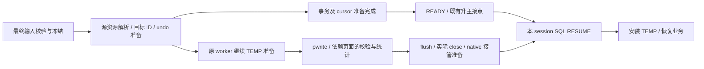

# TEMP 后台完成与 session RESUME 屏障（E128）

2026-10-09，内核及定向功能回归已完成，五轮 Release 两项关键指标均达标；基线为 E126，E127 诊断探针已移除。独立 EXACT 门槛和外部物理工程验收仍未关闭。

用户确认：READY 不等待 TEMP 的 pwrite、flush、close；SQL RESUME 等待自己 session 的这些操作成功完成。READY 到业务恢复通常至少有 2 秒，但代码不 sleep，也不据此假定 I/O 已完成。

## 边界与依赖

复用 receiver 原 worker 和 TEMP prepare_step，不新增线程池、AIO 分发或页面缓存。实际仍调用 pwrite。结果 cursor 仍完整准备后才能 READY。

不能只把 write_at 替换为“提交成功”：统计读取、文件长度验证和 fil 接管依赖实际页面。后台保留这条依赖链，因此后移的还包括相关页转换、LOB 校验、统计、DD 和 native 准备。源输入身份/摘要、最终代次及 ID 分配不能省略。SQL RESUME 只等完成，不执行批量页面准备。待完成资源只支持当前 receiver 进程在线升主，不承诺重启恢复。

## 所有权及失败

- 每 token 一个小 completion，保存不可变 token/清单摘要/ID 合同、完成状态、失败终态以及完成后的唯一 TEMP owner。worker 在完成前独占可变 owner；registry 不读取它。
- 使用原队列、inflight、并发额度和内存/文件 lease。已发布 token 的续作不重复消费 lock/binlog 准备。普通待发布任务优先，防后台尾部占满执行机会。
- 该 token 的 staging 清理延后到完成或失败，epoch READY 不等待；完成态保留到 registry 退休，不能因 RESUME 移走 owner 丢失 pending 标志。
- SQL RESUME 在安装 session/binlog/MDL/TEMP 前等待，仅复制 completion 引用后释放 registry entry 锁。沿用 deadline 和 kill；失败返回既有 RESUME 失败路径，proxy 断前后端连接。
- 取消/超时不关闭运行中 pwrite 的 FD，也不释放其页缓冲。最后执行者停止后才交原 reaper。错误为终态，不能被迟到成功覆盖。
- 后台在 native fil 打开前完成 private writer 的 flush 和真实 close，沿用 close/result 检查，不以 E126 析构关闭代替成功证明。

## 实施与验收清单

- [x] E127 原始 syscall 诊断：长尾在实际 pwrite；不能归因为 ifstream close。
- [x] 三个独立源码核查：固定升主不读 TEMP 页，RESUME 是实际安装点；识别 READY 后任务结束及 staging 生命周期约束。
- [x] `temp_receiver` 增加准备边界和 completion；保留原 prepare_step、错误和资源额度。
- [x] `receiver_prepare` 分开发布前准备与后台 TEMP 完成，cursor 保持原完整准备。
- [x] `promotion_prepared` 区分可升主资源与可安装资源，RESUME 在 entry 锁外等待。
- [x] `transfer` 保留原 job 的后台续作，清理、取消和停机计数闭合。
- [x] Debug MTR 验证 READY 后续作、本 session 等待、故障阻断安装、取消及原 TEMP/FETCH 用例；不新增 UT/DEBUG_SYNC。
- [x] Release 固定 500 连接持续资源模型连续五轮，保持预算和 workload 不变；同钟 ACK→READY 与 strict 分开验收，后台归零观察另列。
- [ ] 外部物理工程 Release 并发 SQL RESUME 等待及首条 DML/FETCH 验收；本地 Debug 小用例不能代替。

外部物理复制工程当前不可访问，本地测试不能宣称完成其集成验收。E127 r1 的 conn89 未列入 survivor/session-only 仍是独立未关闭问题，不通过修改压测断言掩盖。

## 已执行的验证

本轮增量针对 E126 冻结快照：11 个现有内核文件，新增454行、删除93行，净增361行；没有新增内核文件或线程池。相对 HEAD 的全部未提交内容包含此前工作，不能混作本轮代码量。

70 个不同相关 MTR 在适用模式覆盖通过（包含1个源码 lint，运行时69个）：最终 no-bin 18通过/52条件跳过；log-bin 53通过/1个lint失败/16条件跳过，lint按已有 `seal_temp_object=false` 参数修正后独立补跑通过。shutdown 单列通过。初轮GC脚本作用域错误、旧LOB/JSON完成边界断言及原失败日志均保留，没有把重跑覆盖成初轮零失败。

新增6项分别验证：READY后等待、本session独立等待、KILL取消、真实pwrite路径错误、flush错误、close错误。失败分支检查RESUME失败计数、目标断连与事务退出、原receiver临时表可继续回滚/DML，并确认失败任务不计成功prepared。原11项晚期LOB错误移到SQL RESUME拒绝验证；6项源undo解码错误仍必须READY前拒绝；精确错误标记、原因、资源清理和数据断言均保留。

两个Debug首触碰用例保持READY→业务至少2秒：TEMP首次UPDATE1.283ms，FETCH0.201ms；RESUME13.498/16.438ms。这些是小规模同进程测试，不是Release并发性能或真实物理升主验收。

完整日志、差分及基线位于 `build-debug/preserve-temp-async-e128/`。三条只读review覆盖completion/RESUME、worker退出与清理、测试边界；修正了取消分支inflight残留和失败计入prepared的问题。

## Release 五轮

原500连接、300秒业务、双端各1GiB Preserve及1GiB inflight、BALANCED、不限速。五轮二进制、脚本及依赖SHA相同，预算与业务参数未变。

| 轮次 | survivor / session-only | strict Phase 2 (ms) | receiver ACK→READY (ms) |
|---|---:|---:|---:|
| r1 |447 / 53|744.875|126.441|
| r2 |445 / 55|767.742|130.816|
| r3 |422 / 78|664.380|110.502|
| r4 |437 / 63|776.626|73.883|
| r5 |442 / 58|841.780|88.334|

本地功能5/5；原strict≤2000ms及ACK<500ms两项共同5/5。每轮150个资源owner完成，未发现晚期TEMP错误，worker/queue/inflight归零。原综合验收仍0/5：前四轮无合格EXACT样本，第五轮EXACT=840.008ms超过其独立500ms门槛。第五轮首次预检因旧端口不可绑定退出，未启动业务；有效r5仅换本地端口。源端关机的purge计数断言按用户约定单列，日志保留。

控制器在DRAIN返回后观察READY，再观察所有inflight/queue/worker归零，间隔分别1207.558/100.287/1216.117/1.983/1267.732ms。它们不是receiver同钟的真实READY→最后TEMP完成时间或其上界，也不是单session RESUME等待；不能据此保证2秒窗口覆盖全部尾部。后续业务仍由completion屏障保证，真实物理升主后的并发RESUME尚未在外部工程验证。

逐轮原始报告、指纹与范围说明见[五轮证据](../../../build-debug/preserve-temp-async-e128/release-results.md)。
