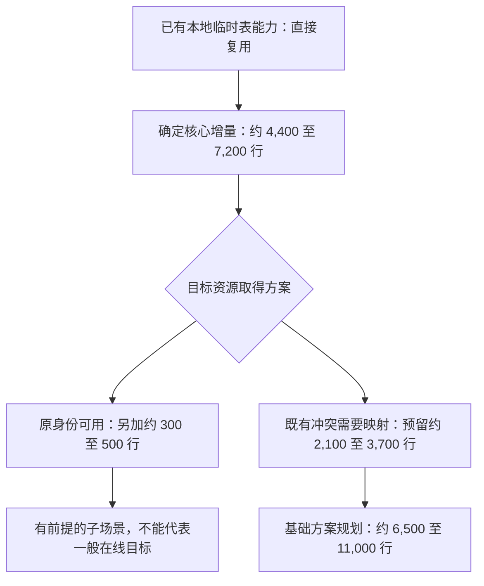

# 内核增量代码预算：按现有接口和缺失职责重新核算

> **2026-10-04 版本说明：历史静态估算。** 旧 PS 完整迁移范围及人日/代码量不再是当前预算，不能与本次净减少 9437 行机械相减。 现行职责见[详细设计](detailed-design.md)和[PS 删除与 cursor 关联](ps-transfer-removal-and-cursor-attach.md)，最新状态见[任务跟踪 E63/E64](task-tracker.md)。下文保留历史事实，不作为现行实施清单。

> **2026-09-24 范围更正：** 当前状态以[任务跟踪](task-tracker.md)及[详细设计 §4.2](detailed-design-before-ps-removal.md#42-long_data-暂不支持close-保留原范围)为准。用户明确 LONG_DATA 分片送参的迁移本阶段暂不支持，proxy 仅感知既有特殊错误码。下文旧 LONG_DATA 支持目标、前缀确认／proxy 缓冲重放要求及相应估算不再作为交付范围；真实源码和历史测试记录保留，但不代表当前支持承诺或运行期拒绝已落实。约束拒绝归 W10，CLOSE、普通参数和 FETCH 不连带排除。 **后续 CLOSE 特例：2026-09-27 用户已确认 proxy 留存 CLOSE、RESUME 后优先补发；该例外及本地证据以主设计 §4.2、W10/E26 为准，V05 外部验收仍独立。**

> 商用范围（2026-09-18 用户确认）：本特性只面向 **standby transfer → 物理备机升主 → 新主 SQL RESUME**。local startup 模式不在新增设计、实现、功能验收和预算内；文中现有本地实现仅作为代码复用依据。
>
> 工程背景（用户确认）：物理备机对接已完成；当前工程只补齐临时表、待 FETCH 结果及相关资源能力，后续再纳入包含物理备机能力的 MySQL 工程，做新增场景的集成回归。

**2026-09-20 接入约束：** 在线升主只扩展已集成的 `preserved_trx_prepare_before_trx_sys_init_for_physical_promotion()`、`trx_lists_init_at_db_start()` 中原 Preserve hook（直接调用 `trx_preserve_startup_resurrection_finish()`）和 `preserved_trx_adopt_ready_epoch_for_physical_promotion()` 的内部职责；阶段/调用方式保持不变。SQL RESUME 从 `Sql_cmd_resume_preserved_transaction::execute()` 接入。固定顺序与职责见[主设计 §1.0.1](/Users/a1234/project/mysql-server-8022-preserve-port/design/workshops/temp-table-preserve/detailed-design-before-ps-removal.md#101-固定的在线升主与-sql-resume-入口)。不扩展 RESET DRAIN；新增垃圾文件允许重启后异步删除，运行期资源收尾仍按原所有权处理（主设计 §9.3）。

2026-09-18 · 审核基线 `08edc460815` · 静态工程估算；没有实现原型、修改生产代码或运行测试。

**原基础方案的静态预算是约 6,500～11,000 行有效内核增改代码，原工作预算参考值约 8,500 行。** 这个范围包含用户临时表、待 FETCH 结果及相关 PS、standby transfer、物理升主和 SQL RESUME 的共同接入，并为已运行目标上的身份／undo 冲突处理预留了实现量。

它不是已经写出的实际行数，也不是保证不会超出的上限。源码能够核实“已有能力”和“缺失职责”；未来代码量仍取决于在线导入、结果 reader 和 PS 恢复原型。本次不再把全量重定位当作已经选定的方案，但也不把它的成本直接删除后，拿无冲突场景的小计冒充完整在线能力。

**估算边界必须一起看：用户表部分先按当前已支持的 InnoDB 表形状计算；当前拒绝的更多列类型、自增、索引、DDL/savepoint 等扩展在第 6 节另列。** 这不表示用户已同意永久排除这些场景。结果集需要保留其自身完整值／类型与协议语义，不能套用用户临时表当前的窄类型白名单来缩小结果范围。

**协议和读取范围已明确。** 依据 [需求背景与支持范围](/Users/a1234/project/mysql-server-8022-preserve-port/design/workshops/temp-table-preserve/requirements-and-scope.md)，结果／相关 PS 包只覆盖经典协议的 `COM_STMT_EXECUTE`／`COM_STMT_FETCH`。X Protocol 会话和当前仍打开 HANDLER 的会话继续按已有规则排除，不计入本次必需生产代码量；不应从以下总账再次扣除一笔从未列入的 X／HANDLER 实现费用。用户临时表承载应用查询结果并分批 SELECT，计在用户表包；普通 SELECT／CALL 响应兼容、既有限制保持纳入验证，不增加新的客户端结果协议。

**2026-09-18 增量要求补充：** 用户要求充分考虑各类增量捕获以提高传输效率，见 [增量捕获与流水线传输设计](/Users/a1234/project/mysql-server-8022-preserve-port/design/workshops/temp-table-preserve/incremental-capture-and-transfer.md)。下表复用了已有 dirty stream，但没有单独核实持续多轮 data/undo 捕获、增量包表达、接收应用、跨轮 ACK 和版本回收的实现量；因此它保留为基础方案预算，不再作为本轮全部增量要求的完整覆盖承诺。原型后按新增职责去重修订，不把已有页捕获重算，也不在本轮无依据地增加一个精确数字。

local startup 的新增准入、启动扫描/重放、启动预留和结果/PS 启动恢复均不计入本次预算。已有主体复用与 OFF/非 standby 共享入口隔离仍保留；旧总账并未单列 local startup 生产开发包，不能仅凭这次范围澄清给出未经核实的扣减数字。

## 1. 总账：只计算一次实际增量

| 工作包 | 新专用文件 | 旧文件新增／实质修改 | 合计 |
| --- | ---: | ---: | ---: |
| 用户临时表专属适配及资源 handle | 440～760 | 180～320 | 620～1,080 |
| 在线目标冲突处理：按完整映射候选预留 | 1,580～2,780 | 480～890 | 2,060～3,670 |
| 原结果、恢复游标及相关 PS | 1,670～2,650 | 375～675 | 2,045～3,325 |
| transfer／READY／promotion／联合 RESUME 接入 | 800～1,300 | 900～1,500 | 1,700～2,800 |
| **算术合计** | **4,490～7,490** | **1,935～3,385** | **6,425～10,875** |
| **规划用约数** | **约 4,500～7,500** | **约 2,000～3,400** | **约 6,500～11,000** |

分项数字保留是为了核对相加和去重，不代表能预测到个位数。约 8,500 行是该区间内的规划参考值，不是源码测量结果。约七成增改可承载在新文件；旧文件中的准入、资源状态和必要接口仍须实改。

计数口径：C++ 实现、声明、数据结构、错误处理及功能门控均计入；包含头文件，少量构建登记计入公共包。不计注释、空行、测试、`.result`、文档、生成文件、原有代码直接复用和纯搬迁。旧逻辑替换按改后的实质代码计一次，不把删除与插入重复相加。因此总数是**实现工作所涉及的有效增改行**，不是 Git 净新增行，也不是整份 diff 行数。

客户端生产代码改造为 **0**。普通 SELECT 当前响应在命令边界完成，已返回批次保留在原前端链路，不新增客户端协议。物理备机对接已完成，本预算只计算当前工程新增资源能力和必要内核接口；沿用既有物理复制／fencing 合同，不重算这些基础能力的建设成本。后续纳入物理备机工程时的增量适配与新场景集成回归单独记录。

## 2. 用户临时表：已有主体不重算，在线冲突单独算

以下已有实现的重复开发预算为 **0**：数据镜像、Buffer Pool 覆盖、dirty 页捕获、no-redo sidecar 格式与校验、DD/dict/TABLE 物化、原生 FSEG／slot 安装及 undo 接回、恢复后 COMMIT/ROLLBACK、DROP／retry 清理和 reseed。它们的实际新接口计在下表，原函数主体不再按新增量计费。[已有能力审核](/Users/a1234/project/mysql-server-8022-preserve-port/design/workshops/temp-table-preserve/existing-implementation-and-gaps.md)

| 确定要补的职责 | 有效增改行 | 现有复用点及改动边界 |
| --- | ---: | --- |
| SQL 安装适配、消费目标导入计划、延迟发布及清理报告 | 320～540 | 已有 `materialize_for_resume()` 包含校验、文件接入、DD/TABLE、undo 和失败清理；补分阶段入口，供联合 RESUME 使用，不另写物化器。[入口](/Users/a1234/project/mysql-server-8022-preserve-port/sql/preserve_trx_temp_table.cc:3559) |
| 临时资源 handle：身份／文件对应、共享空间去重、重试保留、移交和终止释放 | 300～540 | 复用既有 rollback/reseed 与 native release；这里只管理用户表专属资源，不重新管理 epoch 或联合 RESUME。[rollback](/Users/a1234/project/mysql-server-8022-preserve-port/sql/preserve_trx_temp_table.cc:3846)、[retry](/Users/a1234/project/mysql-server-8022-preserve-port/storage/innobase/trx/trx0temp_preserve.cc:6661) |
| **本包确定核心** | **620～1,080** | 不包含下一步实际取得目标资源的算法 |

目标资源取得有不同方案，下面 **A 与 B 互斥，不相加**。

| 方案／职责 | 新文件 | 旧文件增改 | 合计 |
| --- | ---: | ---: | ---: |
| A：原身份所需资源确实可取得，在分配器锁下检查并取得空闲页、slot 和身份，支持撤销 | 100～180 | 200～340 | 300～520 |
| B1：选择新目标身份、页和槽，原子取得并保护 | 100～180 | 200～340 | 300～520 |
| B2：保持数据空间内页号，转换 space/index 等身份与实际引用，更新 dict／manifest、摘要并复核 | 380～650 | 80～150 | 460～800 |
| B3：undo 页、anchor、页链和记录地址转换，修正行内及 undo 内的历史 roll_ptr | 650～1,100 | 100～200 | 750～1,300 |
| B4：table_id／旧 roll_ptr 的变长编码变化时，调整记录偏移、页布局及引用映射并校验 | 450～850 | 100～200 | 550～1,050 |
| **B 小计** | **1,580～2,780** | **480～890** | **2,060～3,670** |

总账采用 **核心＋B＝2,680～4,750 行** 作为用户表在线导入预算。B 是用于预留成本的候选实现，尚未证明其算法对所有原生单记录／页布局边界都可行；如果原型推翻它，必须改方案并重估，不能强行保证上述上限。

A 只能用于满足其前提的目标：当前 space ID 预留拒绝已经越过分配游标的未预留 ID；fil adopt 不会覆盖已有空间；登记 undo 页的 reservation 也不代表该页确实空闲。需要实际取得底层资源。[space ID](/Users/a1234/project/mysql-server-8022-preserve-port/storage/innobase/srv/srv0tmp.cc:102)、[fil adopt](/Users/a1234/project/mysql-server-8022-preserve-port/storage/innobase/fil/fil0fil.cc:3262)、[exact FSEG claim](/Users/a1234/project/mysql-server-8022-preserve-port/storage/innobase/fsp/fsp0fsp.cc:2584)

只改变 live rseg/header/slot 时，不应触发整个 B3/B4：临时 roll_ptr 的高位不是 live slot。真正改变 undo 页地址或编码内的 table_id，才引出记录引用转换。既有 FSEG 安装及 live header 保护可以继续用。[roll_ptr 编码](/Users/a1234/project/mysql-server-8022-preserve-port/storage/innobase/include/trx0undo.ic:44)、[已有 FSEG 安装](/Users/a1234/project/mysql-server-8022-preserve-port/storage/innobase/trx/trx0temp_preserve.cc:1213)、[变长 table_id](/Users/a1234/project/mysql-server-8022-preserve-port/storage/innobase/trx/trx0rec.cc:581)、[旧 roll_ptr](/Users/a1234/project/mysql-server-8022-preserve-port/storage/innobase/trx/trx0rec.cc:1298)

不能假定物理备机自动拥有不冲突的临时对象 ID；临时表的 table/index ID 分配可关闭 redo。提前建立源／目标隔离域可能减少转换，但需要双方分配策略和协调，且不能追回目标已占用的资源，因而未把它当作默认低成本方案。[ID 分配](/Users/a1234/project/mysql-server-8022-preserve-port/storage/innobase/dict/dict0boot.cc:79)

## 3. 结果、游标和 PS：约 2,000～3,300 行

本包按“源 THD 在命令边界暂停，导出有序 Field 值，目标使用文件支撑的恢复游标，安装原编号 PS 和必要参数对象”估算。复用原生字段与协议输出；不恢复三套目标内部临时表引擎，不重造一套全类型协议 writer。

| 缺失函数职责 | 新文件 | 旧文件增改 |
| --- | ---: | ---: |
| 捕获列描述、Field 布局和编码上下文，重建字段缓冲区 | 220～340 | 40～70 |
| 取得／释放独立 reader，保持原 handler、record 和 EOF 状态 | 190～320 | 70～140 |
| pack/unpack 封装、外部工件的长度／类型校验、有序文件读写和定位 | 330～520 | 0～20 |
| 文件 cursor 构造、FETCH、位置、EOF、close 和协议初始化 | 230～360 | 50～90 |
| PS 身份、SQL/db、参数类型／值／LONG_DATA 和控制状态编解码 | 260～420 | 35～65 |
| 原 ID 运行壳、Item_param、stmt_map、编号冲突、计数及 P_S | 220～350 | 80～130 |
| 延迟 prepare、参数交接、旧结果替换、失败处理和自身清理 | 220～340 | 100～160 |
| **合计** | **1,670～2,650** | **375～675** |

值编码可复用 [Field::pack/unpack](/Users/a1234/project/mysql-server-8022-preserve-port/sql/field.h:1602)、[hash join 的字段存取方式](/Users/a1234/project/mysql-server-8022-preserve-port/sql/hash_join_buffer.cc:228) 和 [make_field](/Users/a1234/project/mysql-server-8022-preserve-port/sql/field.cc:9209)；但现有 hash-join decoder 依赖相同 TABLE/read_set，不能直接作为外部持久化工件格式。

必须包含这些职责，不能只估一个 FETCH 函数：

1. 结果列元数据、值／NULL／变长内容、原顺序及结果代次；复用 Field 操作，但不能把含指针的 record 直接落盘。
2. 不改变源游标位置的独立读取及专属清理；三类源结果引擎都要有可行读取路径。
3. 文件支撑游标的初始化、读取位置、FETCH、EOF、关闭及再次 Preserve 所需状态。
4. 原 statement_id、相关 PS 元数据、真实参数对象和必要状态；编号冲突、后续分配器和参数类型复用。
5. 旧结果不依赖原 SQL 再次 PREPARE 成功，之后 COM_STMT_RESET/CLOSE/EXECUTE/LONG_DATA 的行为与释放正确；需要时延迟 prepare。

**两处新核实直接影响预算下界：**

- `Protocol_classic::parse_packet()` 在分派到 `mysql_stmt_precheck()`／`set_parameters()` 之前，就读取 stmt_map、param_count、param_array 的类型及 LONG_DATA 状态。因此 RESUME 时必须已有真实可用的参数对象，不能只在 execute_loop 开头补恢复。[解析阶段](/Users/a1234/project/mysql-server-8022-preserve-port/sql/protocol_classic.cc:2644)
- 把未来所有行直接存为二进制响应包，尚不能视为通用等价方案。TIMESTAMP 的原生输出会在 FETCH 时使用当前会话时区；预编码会冻结该语义。估算保留值／类型，并在未来 FETCH 使用原生编码。[输出](/Users/a1234/project/mysql-server-8022-preserve-port/sql/field.cc:4829)、[当前时区](/Users/a1234/project/mysql-server-8022-preserve-port/sql/field.cc:5006)

独立 reader 仍需原型验证，尤其 MEMORY 的 `single_instance` 路径，不能把再次 `open_tmp_table()` 当作已验证能读取同一份现存数据。预算已经留有 reader 的新代码和薄接口，但没有运行证据保证该方案及上界。[内部表打开合同](/Users/a1234/project/mysql-server-8022-preserve-port/sql/sql_tmp_table.cc:128)、[MEMORY 打开](/Users/a1234/project/mysql-server-8022-preserve-port/storage/heap/ha_heap.cc:98)

恰好取满最后一批时，原生游标可能仍保持 open，下一次正数 FETCH 才报告 EOF；FETCH 0 不探测 EOF。相关状态和发送失败语义已计入本包，不依赖客户端修改。[原生 FETCH](/Users/a1234/project/mysql-server-8022-preserve-port/sql/sql_cursor.cc:405)

## 4. 公共接入：原预算约 1,700～2,800 行，范围收敛后待重核

| 职责 | 新文件 | 旧文件增改 | 已有能力与增量边界 |
| --- | ---: | ---: | --- |
| 两类资源对象集合、版本和完整引用检查 | 180～300 | 140～240 | 专属模块给出对象描述；公共层合并并核对缺件／代次，复用 bundle 编解码、摘要和 artifact sink |
| receiver 资源 handle 和 READY 条件 | 150～240 | 150～240 | prepared PImpl 增加联合 handle 及 install/take/restore；沿用 registry、pin 和 lease |
| TEMP_ONLY、无事务资源会话的 cohort 和接管 | 160～250 | 330～520 | 复用 session metadata，修改实际分类／登记分支；将持久事务子集与全部资源 token 正确对应 |
| strict 联合安装和失败处理 | 190～300 | 180～320 | 新资源安装 journal 接入已有 prepare；ACTIVATING 前完整 unwind 才重试，之后沿用终止回滚／taint |
| 正常失败、断连、终止及工件归属 | 待重核 | 待重核 | 移除 RESET DRAIN 职责；原混合项为新文件 120～210、旧文件 100～180 行，包含仍需保留的正常责任，不能整项扣除。纯垃圾可重启后异步删除，不为此增加 RESET journal |
| **原合计（历史参考）** | **800～1,300** | **900～1,500** | **1,700～2,800；当前范围待重核** |

这些函数名和分组是待实现职责，不是声称新接口已经存在。已有 [external blob 编解码](/Users/a1234/project/mysql-server-8022-preserve-port/sql/preserve_trx_bundle.cc:2638)、[portable builder](/Users/a1234/project/mysql-server-8022-preserve-port/sql/preserve_trx_transfer.cc:11003)、[prepared PImpl](/Users/a1234/project/mysql-server-8022-preserve-port/sql/preserve_trx_promotion_prepared.cc:48) 和 [strict unwind](/Users/a1234/project/mysql-server-8022-preserve-port/sql/preserve_trx.cc:24934) 均可实质复用。

公共新代码先放一组 `preserve_trx_session_resources.cc/.h` 即可。不再预设另一套 `session_resources_transfer.*` 联合编码／生命周期层；需要分文件时只是组织调整，不增加功能预算。原有 promotion 按 token 索引 `verified_transactions`、无事务 cohort 的假设仍需在固定入口内部按形态修改，不能全部估成一行调用；不扩展 RESET DRAIN，不新增物理备机调用阶段。[promotion 对应关系](/Users/a1234/project/mysql-server-8022-preserve-port/sql/preserve_trx_promotion.cc:3223)

## 5. 如何防止重复计算，为什么没有把预算进一步压小

| 责任归属 | 只在该包计算 |
| --- | --- |
| 用户表专属适配／handle | 调用已有物化、专属安装进度、专属释放和 reseed |
| InnoDB 在线导入 | 实际取得页／槽／身份、数据与 undo 转换；不再次实现 commit/rollback |
| 结果／PS | 结果编码和读取、语句构造、参数状态、专属生命周期 |
| 公共接入 | 合并资源描述、分类、prepared 句柄、联合安装及已有状态机上的调用 |

三个模块各自失败时怎么释放，由专属模块提供；公共层只负责调用顺序和整体成功／失败裁决。不能在每个包各写一套 serializer、cleanup registry 或所有权状态机，再把它们相加。

确定核心的算术值为 **4,365～7,205 行**；这是明确缺失职责的估算，不含实际目标资源取得。A 场景合计 **4,665～7,725 行**，仍有“源身份所需资源可取得”的前提；不能用约 4,700 行作为完整需求的下界承诺。

此前 **8,200～13,500 行** 的估算不再作为当前预算。主要收窄来自：删去重复的公共清单／生命周期层；以有序值工件和恢复游标复用原生字段／输出；把用户表适配与条件性映射拆开核算。不能把两个区间之差解释为实际已经少写了多少代码。

按当前候选分工，先组织 6 组专用职责：用户表适配、InnoDB import、结果、恢复游标、PS、联合资源；需要变长 undo 转换时再独立成第 7 组。绝大部分新算法留在这些文件。原有 SQL/InnoDB 文件保留必要的门控、访问器及状态分支，不靠整体搬迁或复制旧代码提高新文件比例。

## 6. 当前支持矩阵的扩展，必须另列

以下为低置信度附加估算，仍需逐项确定恢复语义；不含测试。当前代码确实存在对应拒绝条件，不能把它们算作已经支持。

| 用户表扩展 | 有效内核增改行估算 |
| --- | ---: |
| 更多普通非生成列类型的绑定和精确元数据校验 | 300～620 |
| AUTO_INCREMENT 计数／预留状态保存恢复 | 220～460 |
| 无显式 PK、生成聚簇索引等绑定扩展 | 240～500 |
| **以上三项合计** | **760～1,580，约 800～1,600** |
| 临时表 savepoint／statement rollback 跟踪与恢复 | 250～500 |
| 跟踪区间内 DDL 的表代次、基线失效和工件／undo 归属 | 600～1,350 |
| **后两项合计** | **850～1,850，约 900～1,900** |

上述五项若全部纳入，在主预算上约再加 **1,600～3,400 行**。它仍不是“所有 SQL 表形状全覆盖”的封顶价：生成列、instant、加密、其他用户临时表引擎仍需独立设计。本次明确列出这些增量，供支持矩阵评审，未替用户缩减要求。

## 7. 哪些证据能继续收窄区间

先验证三个最可能推翻估算的接口组合：目标已有冲突时的身份／长 undo 导入及原生回滚回收；已打开的三类源结果引擎能否建立不扰动原游标的 reader；原表缺失时原编号 PS 能否直接 FETCH/COM_STMT_RESET/CLOSE，并正确接收下一次 EXECUTE 参数及 LONG_DATA。

这些原型完成后，按实际函数和 diff 更新预算。现有用例仅复用数据准备和共享 helper 验证方法，不建设 local startup 功能回归，也不重写一套测试框架；新增资源行为测试先在本工程完成；未修改真实客户端＋proxy 前端不断的物理切换专项回归，在后续纳入物理备机工程时执行，但**测试代码不混入上述内核行数**。本轮仅做源码核算和文档更新，没有把原型、编译或测试报告为已完成。
