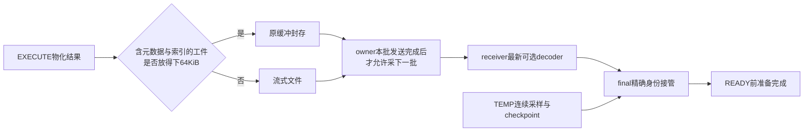

# 结果捕获与 DRAIN 积压修复及验证

> **2026-10-04 版本说明：历史版本记录。** 文内“当前/尚未完成/通过”和源码路径均属于记录时点；旧 PS 定义/参数/重建方案不再适用，原失败与测量不改写为新版本成绩。 现行职责见[详细设计](detailed-design.md)和[PS 删除与 cursor 关联](ps-transfer-removal-and-cursor-attach.md)，最新状态见[任务跟踪 E63/E64](task-tracker.md)。下文保留历史事实，不作为现行实施清单。

本次在 `ha_preserve_trx` 的已有未提交实现上修复[根因报告](cursor-root-cause-2026-09-28.md)确认的问题；未提交或推送。源文件修改集中于现有专用模块，未改变客户端协议、额度、超时、线程池或物理升主阶段。

## 1. 修复内容

| 问题 | 修复 | 正确性约束 |
| --- | --- | --- |
| 每次小结果 EXECUTE 固定创建两个临时文件 | 复用64KiB捕获缓冲封存小结果；固定4KiB索引缓冲，溢出才建文件 | 工件只读；共享句柄固定父对象寿命；大结果流式落盘，格式与摘要不变 |
| 逐字段额度/hash调用过细 | 每行一次精确额度申请；SHA按缓冲块计算 | schema摘要复制前先处理待hash字节；失败释放实际申请额度；没有放宽预算 |
| 同一owner待发历史代不停累积 | 当前批次未发送完成，不捕获下一批PS结果 | final pin不受限制；已声明对象完整SEAL，不撤销传输义务 |
| 采完新代再判断完成，空队列反复补货 | 区分首次基线完成与队列排空，首轮完成后停采、泵完在途；PS按TEMP捕获轮采样 | 首次TEMP copy之后仍产生checkpoint；持续DATA/undo及原生资源提前准备保留 |
| 首轮中的可选失败或owner退出未退役 | 原生额度拒绝记为已尝试；空任务owner在命令完成后复用原候选条件确认退出 | 不跳过忙命令、已有job或已DECLARE结果；不增加新支持范围 |
| receiver保留每个历史代decoder | 同statement只保存最新可选decoder，旧worker保留独立引用并退出 | final精确匹配完整身份；旧任务不能发布到新槽位；文件账本仍由原传输协议管理 |
| 长事务逐行空DML标记耗尽16384条/1MiB | standby中压缩为空DML摘要，每次事件仍推进逻辑history sequence | 物理页/native undo恢复；全部sidecar新鲜度改用序号，保存点和DDL仍保留原记录及预算 |

## 2. RED → GREEN 与回归

全部使用现有MTR/Python E2E；未新增UT/GUnit或DEBUG_SYNC。Debug内部restore/loopback仅用于本地资源恢复验证，不充当外部物理升主验收。

- 新增 `cursor_result_storage`：旧Debug在空结果处确定失败，实际新增1个文件而期望0。修复后检查空结果、小结果、64KiB两侧、大值、65537行导致的索引spill、重复EXECUTE/FETCH、CLOSE和额度回收。
- 新增 `cursor_result_storage_restore`：用既有内部恢复探针，读取索引spill后的尾部，证明不仅原生游标可FETCH，捕获工件解码也正确。
- 新增 `temp_history_long_dml`：150轮交替两表UPDATE及DELETE/INSERT，超过3.8万次行修改，旧逻辑DRAIN报4013；修复后transfer→READY→SQL RESUME，继续FETCH、ROLLBACK TO SAVEPOINT及完整ROLLBACK均通过。
- 第一组存储/捕获/OFF/解码/恢复8个业务用例全部通过。
- 第二组并行验证中3个大预传输用例触发receiver 10秒PREWARM_DEADLINE；`auto_prewarm_last_status=9`属于promotion的READY_CACHE_NOT_READY，不能误读成transfer的ACK_UNCERTAIN。原日志完整保留，未调大时间或减少数据。
- 审核同时识别并修正初版提前收口会跳过TEMP第二轮checkpoint的问题；随后DRAIN进一步暴露持续TEMP DML使普通阶段不断续轮；追加首次checkpoint完成判据及未开始owner优先策略，见后续复测。
- 中间版本串行8个业务用例全部通过：长事务、native early、undo delta、保存点undo复用、PS supersede/large/close/abandon。native early在最终文件生成前等待receiver原生资源READY，并检查连续代ID及增量复用。

最终普通阶段收敛之后，PS supersede/CLOSE和native多代用例原先依赖热DML让ordinary持续续轮，不能再用这个时序假设。测试改为另一真实owner在GET_LOCK命令中等待，使首轮确实尚未完成；使用既有两个worker和真实SEAL ACK观测，没有增加内核阶段。loopback receiver自身的只读TEMP由持有用户锁从源端可选捕获中排除，原表和事务仍保留并检查；因此每代READY、目标ID和写入量断言只来自主owner。

`final-mtr.log`的18个业务用例及shutdown全部通过；`v5-window.log`的3个业务用例及shutdown全部通过。`v6-mtr.log`在原生资源拒绝修补后复验4个业务用例及shutdown通过，包括现有真实预算用例。原生OOM两处精确分支目前有源码审查，不能把该quota用例写成直接故障注入覆盖。在线owner退出候选资格的修补目前有源码与独立复审依据；三次专门观测试验未触达预期容量分支，保留在retire-red*.log，但不算缺陷RED或修复GREEN。临时DBUG观测和未闭合测试逻辑已移除，`v8-mtr.log`在最终构建复验CLOSE、supersede、native early、真实quota及长事务，5个业务与shutdown全部通过。各组共22个不同业务用例通过；本轮不是全量回归。

构建及MTR原始日志：`build-debug/cursor-fix-20260928/`。捕获优化及行历史修复前的部分源文件快照在其中的 `before/`，用于辅助区分本轮修复与此前大量未提交实现。

## 3. Release原负载验收

最终复测使用 `build-release/cursor-fix-final-20260928/` 的专用实例编排；中间诊断保留在 `build-release/cursor-fix-benchmark-20260928/`，原诊断目录及其失败记录保持不变。正常业务只切换result capture，顶层Preserve/TEMP保持ON；其余工作负载、配额、5秒预热及20秒测量与原诊断一致。原RED的DRAIN使用15秒测量、固定1ms空闲复现使用10秒，按这两个时长另做精确重跑；中间20秒DRAIN出现持续TEMP换代，主动中止并保存日志；它是失败诊断，不算通过。此后增加首轮cohort收敛才重跑旧RED。另验证128MiB结果和原密集修改模型的代表点。

### 3.1 常态成本

三组按OFF/ON、ON/OFF、OFF/ON交替运行，各轮5秒预热、20秒测量；只切换结果捕获，顶层Preserve与TEMP保持ON。

| 指标 | 修复前诊断 | 最终修复后 |
| --- | --- | --- |
| ON EXECUTE p99，三轮ms | 3.849 / 5.143 / 6.617 | 1.391 / 1.473 / 1.414 |
| OFF EXECUTE p99，三轮ms | 1.351 / 1.402 / 1.357 | 1.420 / 1.401 / 1.361 |
| ON 源CPU | 有可靠窗口锚点的r3为103.05% | 28.3% / 28.8% / 29.4% |
| OFF 源CPU | r2 22.43%、r3 22.16% | 22.6% / 22.5% / 21.4% |
| ON 新建临时文件／EXECUTE | 约2 | 0 |
| ON `Handler_read_rnd_next`／EXECUTE | 约145 | 约145 |

ON三轮p99中位值由5.143ms降为1.414ms，约降低72.5%；完整扫描仍存在，CPU也仍高于OFF，不能称捕获免费。CPU按业务窗内首末`ps TIME`差计算，最终各轮实际覆盖18.28–18.29秒；100%约为一个逻辑CPU。

workload两个归档文件SHA与旧诊断一致，两端实际启动参数只变专用目录。旧实验没有冻结全部Python客户端依赖，因此字节级相同仅指这两个workload文件；当前依赖继续来自本工程scripts。Release与源码固定哈希在`source-sha256.json`，验收检查真实开关、count=256、两项1GiB预算、捕获实际执行、失败计数和观测序列，不以脚本exit=0单独认定通过。

### 3.2 DRAIN与receiver READY

最终13轮全部通过`verify.py`，其中下面7轮包含真实standby传输及receiver READY。原负载的测量时长保持15秒，固定1ms循环空闲负载保持10秒；count仍为256。两个模式各重复两次。

| 场景 | 结果份数观测峰值 | 捕获失败 | 预发送结果代数 | DRAIN秒 | DRAIN后观察到全部READY的秒数 |
| --- | ---: | ---: | ---: | ---: | ---: |
| 原负载第1轮 | 10 | 0 | 77 | 3.258 | 0.606 |
| 原负载第2轮 | 10 | 0 | 75 | 3.315 | 0.487 |
| 固定空闲第1轮 | 10 | 0 | 71 | 6.557 | 0.412 |
| 固定空闲第2轮 | 10 | 0 | 76 | 5.368 | 0.509 |
| 约128MiB结果，131072行 | 1 | 0 | 1 | 1.636 | 0.252 |
| 8会话×2表，4096行密集更新 | 8 | 0 | 8 | 3.956 | 0.229 |
| 16MiB表，16384行密集更新 | 0 | 0 | 0 | 1.932 | 0.351 |

四轮故障复测的8个事务均成功迁移并READY：结果份数观测峰值均为10，未再耗尽256名额；原先两种256档RED分别为86794、94843次捕获失败。7轮传输的DATA基线均复用，final全量fallback计数均为0。四轮故障复测源Preserve计费内存峰值约17.6–18.1MiB，receiver约48.6–51.7MiB；不是mysqld总RSS。

`live_max`是50ms采样峰值，不能当连续精确上界。business报告中的三个时间字段是时间点，表中按相减得到时长；规模报告已有时长字段直接采用。READY尾部包含查询和轮询开销，不能说是内核精确READY时刻。正常业务尾端的失败检查同时参考source_after和完整观察序列，仍不等于对所有线程退出瞬间的原子快照。

固定Release SHA256：`23e6212c81f2449db1bd18b89b72f2c879ba2376ea6631bfb1f0cc0e0d1e1753`。原始命令、两端变量、报告、时间序列和严格验收结果保存在[最终Release目录](../../../build-release/cursor-fix-final-20260928/)，构建日志为`build-debug-v8.log`与`build-release-v8.log`。13轮专用实例正常完成验证流程，结束后按既有编排清理专用数据；源端测量后SIGKILL用于销毁具有原单向purge fence的测试实例，不是恢复验收。

### 3.3 后续完整矩阵复测

本节以上13轮是E34修复验收。后续E35使用相同最终二进制完整重跑原定37轮，并追加大BLOB1轮及顶层OFF/ON30秒常态对照6轮，44/44通过；170/170业务事务READY，原规模档位和各3次重复已经补齐。详见[完整矩阵报告](release-matrix-final-2026-09-28.md)。source final基线复用与receiver native提前准备命中分开记录；候选取消/失败诊断并未全部为零。

## 4. 结论边界

仍会同步扫描和编码完整结果，未承诺捕获零开销。内存工件只优化小结果固定成本，大结果继续使用有界文件路径。

登记完整cohort后当前调度每个owner仍遍历entries，存在约O(N²)的扩展性风险；本轮小并发数据不能证明大规模session竞争已经验收。

pending门禁约束源端在途pin，receiver按PS收敛decoder；已DECLARE文件仍受原epoch字节预算管理。更长普通窗口或更大结果的历史文件成本不能因本轮少量样本被宣布为零。

本机source/receiver同机运行，Release统计用于前后对照，不是生产SLO认证。真实物理备机在线升主、proxy和后续SQL RESUME的外部验收仍以原V04–V06为准。本轮不替代后续全量回归。
