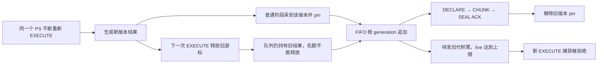

# 结果捕获常态开销与 DRAIN 捕获失败：根因定位

> **2026-10-04 版本说明：历史版本记录。** 文内“当前/尚未完成/通过”和源码路径均属于记录时点；旧 PS 定义/参数/重建方案不再适用，原失败与测量不改写为新版本成绩。 现行职责见[详细设计](detailed-design.md)和[PS 删除与 cursor 关联](ps-transfer-removal-and-cursor-attach.md)，最新状态见[任务跟踪 E63/E64](task-tracker.md)。下文保留历史事实，不作为现行实施清单。

本次针对 [Release 基线报告](release-baseline-2026-09-28.md) 中的两个问题，完成源码审查和 11 轮独立诊断。**已确认常态 EXECUTE 的额外结果捕获成本，以及预传输历史结果积累引起的捕获份数耗尽。** 没有修改内核，也没有通过调整生产额度宣称修复。

后续内核修复与最终复测已完成，见[修复报告](cursor-fix-2026-09-28.md)。本篇保留修复前诊断时点及原始失败证据。

## 1. 实验身份与证据边界

- 仍使用同一 Release mysqld，SHA256 为 `f99cbdf43d3fc886d41e7a57a977026162b74f57abdbc1cffd455b4fb1abd4b3`；当前 `ha_preserve_trx` 未提交源码，HEAD `324a8ec01101efa58977966fe4fba2aea40cca75`。
- 复用原模型：8 会话，每会话一张 InnoDB 临时表，2048 行、256 B payload；循环执行单行 UPDATE、128 行游标 EXECUTE、FETCH 16 行，再重新 EXECUTE。整个测量窗口每个 owner 保持一个事务。
- 顶层 Preserve 与 TEMP 跟踪始终 ON；常态对照**只改变结果捕获开关**，每轮 5 秒预热、20 秒测量，OFF/ON、ON/OFF、OFF/ON 各一对。没有 DRAIN。
- 另有一轮独立 `sample` 栈采样；四轮 DRAIN 诊断，其中最后两轮统一在每个完整业务循环后增加 1 ms 空闲，只用于稳定命令边界采样机会。原负载与该诊断负载分开保留。
- 每轮全新专用实例，source/receiver 同机；仍沿用原 BALANCED、1 GiB Preserve heap、1 GiB capture-byte 上限及既有 worker。无 DEBUG_SYNC、DBUG、RESET DRAIN、物理升主模拟。沿用原编排，在测量后 SIGKILL 专用源、正常关闭 receiver；11 轮专用数据目录均已回收，日志保留。该收尾不是恢复验收。
- 管理连接约每 50 ms 采样状态，每十次聚合一次业务连接的 handler 计数。该观察有开销；两组使用相同方式，不把本次延迟当作无扰动生产 SLO。
- Python 3.9.6 在本机的 monotonic 基点属于进程，不能跨进程直接对齐。前三轮仅保留命令延迟和各自进程内观测；从 `capture-off-r2` 起增加 wall-clock 锚点关联报告与观察者。单命令耗时仍用 monotonic。CPU 使用测量窗口内首末 `ps TIME` 差除以实际采样跨度，约 1 秒采样、百分秒 CPU 精度。

原始报告、命令、两端变量、日志、50 ms 时间序列和分析脚本均在 [诊断产物目录](../../../build-release/temp-cursor-diagnosis-20260928/)。

## 2. 根因一：每次 EXECUTE 同步捕获整份结果，文件固定成本很高

### 单变量对照已经确认归属

| 结果捕获开关 | 三轮 EXECUTE p99（ms） | 对齐业务窗口的源 CPU |
| --- | --- | --- |
| OFF，顶层 Preserve/TEMP 仍 ON | 1.351 / 1.402 / 1.357 | r2 22.43%，r3 22.16% |
| ON | 3.849 / 5.143 / 6.617 | r3 103.05% |

100% 表示约一个逻辑 CPU。ON r3 的 18.31 秒区间消耗 18.87 CPU 秒；OFF r3 约为一个 CPU 的 22%。这确认结果捕获路径是本模型额外 EXECUTE 延迟及 CPU 开销的主要来源；并不表示已精确分解每一项 CPU 指令成本。

运行计数也与源码相互印证：

| 每次 EXECUTE 的观测比值 | 捕获 OFF | 捕获 ON（r3） |
| --- | --- | --- |
| 新建临时文件数 | 0 | 约 2 |
| 业务连接 `Handler_read_rnd_next` | 约 16 | 约 145 |
| 自动 reprepare | 0 | 0 |

差值 129 次读取正是捕获扫描 128 行，加一次 EOF；原 FETCH 的 16 次读取仍存在。计数查询不是原子快照，比值按采样区间近似计算。

### 实际执行路径

- [sql_cursor.cc:305](../../../sql/sql_cursor.cc#L305)：原生物化后、游标响应前同步调用完整捕获。
- [preserve_trx_cursor.cc:53](../../../sql/preserve_trx_cursor.cc#L53)：捕获开关只检查 enable、result_capture、standby-save 和 Classic；**没有 DRAIN 也每次执行**。
- 同文件 `:85` 的 `append()` 对每个长度、NULL 标志和值做一次全局原子额度申请、SHA 更新和拷贝。三列非 NULL、128 行，仅行编码就至少 1280 次 append；普通字段在 `row_length()` 和 `row()` 中重复 pack，共 768 次。这些是源码推导的调用次数。
- 同文件 `:197`、`:279`、`:297`：每代创建结果文件及索引文件。128 行结果只需要一个 8 字节索引项，仍单独建文件、pwrite、pread、close。索引文件使用后立即关闭；结果文件在下一次重执行释放旧游标时关闭。捕获路径没有 fsync。

### 栈采样将优先排查点进一步缩小到文件生命周期

独立 5 秒、名义 1 ms 栈采样，汇总 8 个业务线程位于 `Prepared_statement::execute()` 下的 14267 份采样观察：

| 互斥归类 | 份数 | 占 EXECUTE 采样观察 |
| --- | ---: | ---: |
| 捕获索引文件关闭 | 4331 | 30.4% |
| 旧结果文件关闭 | 5068 | 35.5% |
| 捕获临时文件创建、unlink | 1969 | 13.8% |
| 捕获文件读写 | 2033 | 14.2% |
| 捕获路径其余工作 | 582 | 4.1% |
| 原生 EXECUTE 其余工作 | 284 | 2.0% |

关闭主要落在 `my_close()` 下的系统 `close`，不是已经证实的 `THR_LOCK_open` 竞争。**这些是包含系统调用等待的线程栈采样比例，不是 CPU cycle 比例，也不是未采样负载的 p99 分账。** 采样专轮本身 EXECUTE p99 为 15.230 ms，未混入上面的三轮基线。

因此，本机小结果高频换代的首要优化对象应是每代两个小文件的创建、写入和关闭，其次再处理重复扫描、重复 pack 及过细的原子额度/hash 更新。现有证据不支持把主因直接叫作 SHA 算法慢、原子锁争用、DD 重建或每次 fsync；macOS 文件系统的具体长尾也不能直接外推 Linux 生产环境。

## 3. 根因二：预传输保留同一语句的历史代，挤占当前结果捕获名额

### 失败阈值随份数额度移动

| 诊断样本 | count 上限 | 观测 live 峰值 | 捕获失败 | 发出结果份数 | 源 Preserve 计费内存峰值 |
| --- | ---: | ---: | ---: | ---: | ---: |
| 原模型 `drain-count256` | 256 | 256 | 86794 | 2843 | 56.74 MiB |
| 原模型 `drain-count512` | 512 | 8 | 0 | 8 | 5.03 MiB |
| 固定循环空闲 `idle-drain-count256` | 256 | 256 | 94843 | 4965 | 58.52 MiB |
| 固定循环空闲 `idle-drain-count512` | 512 | 512 | 77775 | 6933 | 91.59 MiB |

第二行没有形成普通阶段的历史积压，快速进入最终阶段并 READY，**不能作为提高额度有效的证明**。最后两行使用相同诊断负载，只改 count；失败平台从 256 移到 512，提高额度后仍失败。

原模型 256 轮在 DRAIN 开始约 0.528 秒后观测到失败。248 个失败增长区间中，219 个区间的末次 live 采样恰为 256，28 个为 252–255，最后一个已进入清理。固定空闲两轮同样长期贴住各自上限；采样间发送完成会归还名额，清理也会使 live 下降，不能要求每个观察点都恰好等于上限。

256/512 两档的捕获字节峰值仅约 9.25/18.51 MiB，远低于 1 GiB capture-byte 上限；源 Preserve 计费内存同样远低于其 1 GiB 预算。表中内存是 `Preserve_trx_memory_peak_bytes`，不是整个 mysqld 的 heap/RSS。代码、时间序列和改变阈值的实验共同确认：**本次批量捕获失败的主因是 live-result 份数耗尽，而不是 Preserve 全局计费内存或捕获字节预算耗尽。** 汇总计数没有分失败原因，不能据此保证每一笔失败都排除了偶发文件错误或分配异常。

### 为什么 8 个当前游标会占用 256/512 份额度

1. [ps_pretransfer.cc:53](../../../sql/preserve_trx_ps_pretransfer.cc#L53) 按含语句编号及 generation 的 object_id 去重；不同版本全部追加到 `pending`/`files`。没有按同一语句合并未发送旧代。
2. [temp_prebuild.cc:852](../../../sql/preserve_trx_temp_prebuild.cc#L852) 在检查 owner 已有 job/inflight 前捕获结果。已有发送任务不会阻止继续 pin 新版本；owner 数限制也不能约束单个 owner 的历史版本数。
3. [cursor.cc:373](../../../sql/preserve_trx_cursor.cc#L373) 的 sealed-file 句柄通过 aliasing shared_ptr 持有整个捕获对象。重执行虽关闭旧游标，队列仍保留文件、缓冲和 live 名额；对象最终析构才归还。
4. [ps_pretransfer.cc:139](../../../sql/preserve_trx_ps_pretransfer.cc#L139) 每次 step 只进行 DECLARE、一个 CHUNK 或 SEAL。小结果也至少三个 step；成功 SEAL 后才解除 pin。确实持续发送，并不是 sender 没工作。
5. `preserve_trx.cc:20398` 起的普通循环先消费 worker 结果，再采新代、submit，最后检查 complete。持续加入新代使队列难以清空，延长普通阶段，又增加新代进入的机会。

`create()` 在 [cursor.cc:171](../../../sql/preserve_trx_cursor.cc#L171) 首先申请 live 额度，失败就增加 capture_failures 并不创建 artifact。该失败不终止原生 EXECUTE/FETCH，所以“业务仍成功”不代表该游标已经具备可迁移结果；正式 PS snapshot 遇到当前游标没有结果 artifact 会拒绝，见 [ps_restore.cc:208](../../../sql/preserve_trx_ps_restore.cc#L208)。

### receiver 也承担了历史代成本

`receiver_candidates.cc:78` 按 generation 保留预检槽位和 decoder，不按同一语句淘汰旧代。固定空闲的 512 轮只有 8 个当前游标，却发出 6933 份结果；receiver Preserve 计费内存峰值约 656.55 MiB。原基线第三轮已发送 11786 份，receiver 的同项峰值接近 1 GiB。这是历史代积累的额外成本，不能用扩大源名额长期解决。

SEAL ACK 等待文件验证和预检入队，**不等待 decoder 预检完成**；后者由既有 receiver worker 异步执行。源名额的直接释放点是 SEAL ACK，不能将源端失败直接说成同步等 receiver 全部 READY。

传输的 DECLARE/CHUNK/SEAL 在同一个 epoch-session mutex 下同步等待 ACK，加 worker 不能让同一 epoch 的这些帧自动并行。这个串行机制已由源码确认，但本次未把锁等待或网络 RTT 定量归为主耗时。也没有证据支持“每步固定睡 1 ms”或“每个 CHUNK 都复制全部 manifest”的说法。

## 4. 与 DRAIN 最终 4013 的关系

需要区分两条失败链：本次确认的 capture_failures 是结果份数不足；三个积压轮最终 DRAIN 日志则停在 `phase1_pipeline_baseline_failed / temp-table phase1 job preparation failed`，未到 HARD/closing。业务长时间继续 UPDATE，触发既有逐行历史容量问题，仍应沿 [原基线报告](release-baseline-2026-09-28.md) 单独处理。不能把最终 4013 简化成一次结果文件 I/O 错误，也不能因消除 cursor 积压就宣布该容量问题已修复。

## 5. 后续修复的收敛方向（本次未实施）

1. **源结果捕获：**优先评估有硬额度的小结果缓冲、分块索引缓冲后按需落盘，减少每次 EXECUTE 的小文件生命周期；大结果保留有界流式路径。再收敛按字段的额度/hash 调用和重复 pack。集中在已有 cursor 专用文件中，保留 OFF 行为。
2. **源预传输：**按 statement 限制待发代数，优先跳过重复追加或替换尚未 DECLARE 的旧代；正在发送及已声明的对象仍遵守现有协议。final 必须精确选择命令边界的当前 generation，不能误用旧结果。
3. **receiver：**将可选预检 decoder 的保留量按当前候选收敛，保留已声明对象的认证账本；尚未完成的最终结果仍在 READY 前准备完。不能简单删除已声明对象，也不能把数据工作移到升主或 SQL RESUME。
4. 用原高频模型验证常态 CPU/p99、历史代峰值、失败计数、receiver 资源和最终结果正确性；追加 FETCH 位置/内容、重复 EXECUTE/CLOSE 和 final 竞态的 MTR/E2E。原密集 DML 历史容量仍独立验收。没有新增线程池、外部升主阶段或 proxy 协议的理由。

以上是已定位问题及待验证修复方向，不是功能或 V03 性能验收完成声明。

## 6. 复核入口

- [机器汇总](../../../build-release/temp-cursor-diagnosis-20260928/summary.json)、[分析脚本](../../../build-release/temp-cursor-diagnosis-20260928/analyze.py)。
- [完整采样栈](../../../build-release/temp-cursor-diagnosis-20260928/capture-on-profile/sample.txt)、[互斥归类结果](../../../build-release/temp-cursor-diagnosis-20260928/sample-summary.json)、[归类脚本](../../../build-release/temp-cursor-diagnosis-20260928/analyze_sample.py)。
- 每轮 `report.json` 保存命令原始样本、阶段时间和前后计数；`status.jsonl` 保存失败平台时间序列；`execution.json` 保存命令、binary/workload hash、进程资源、退出码和清理状态；两端完整变量及错误日志一并保留。
