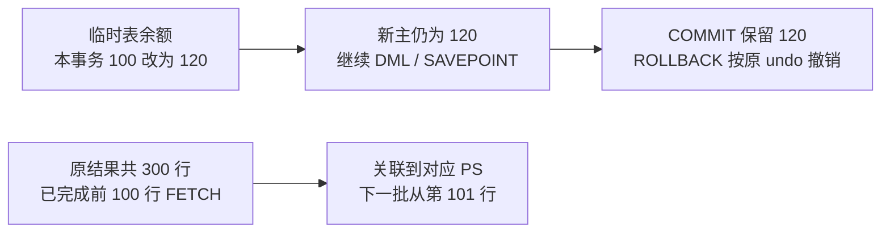
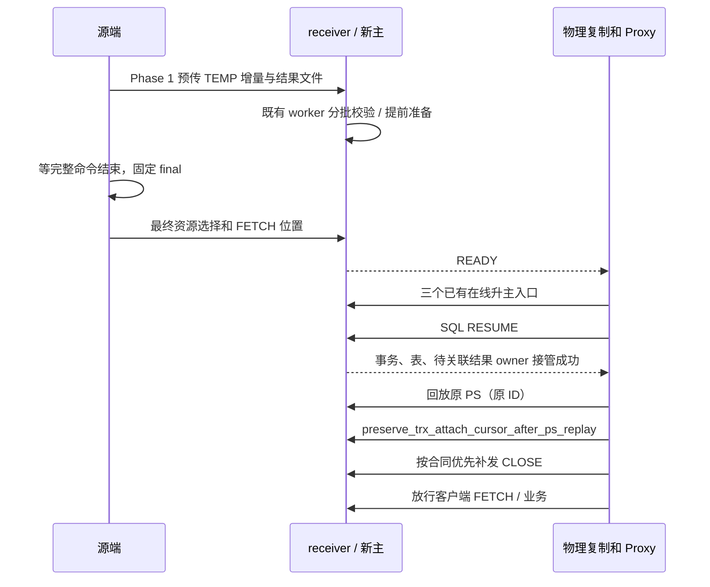

# 临时表与待 FETCH 结果跨主 Preserve/Resume 简明设计

2026-10-04，依据 `e6715a345881` 加当前未提交实现。详细合同见[详细设计](detailed-design.md)，本页给出端到端行为。

## 1. 用户看到什么

客户端到 proxy 的连接不断。只有后端连接切换；新后端先恢复事务和临时资源，再由物理复制工程回放 PS，并关联原游标，然后继续原生 FETCH。

进度指服务端正常完成的 FETCH 批次。客户端只消费到第 89 行但已经收到前 100 行时，其本地缓存继续提供第 90～100 行；服务端不重发它们。前端真的断开后不承诺透明续取，新查询属于新的执行。

## 2. 保存两类资源，不再保存 PS 本体

| 对象 | 保存内容 | 恢复用途 |
| --- | --- | --- |
| 用户 InnoDB 临时表 | 表结构、DATA、事务 undo、身份及原生恢复状态 | 继续查询、DML、提交/回滚 |
| Classic cursor 结果 | 列信息、有序值文件、源 PS ID、结果代次、大小/摘要、FETCH 位置 | 继续读取已经生成的结果 |
| PS SQL、参数及历史解析状态 | 本工程不捕获/传输/重建；由外部 PS 回放能力承接 | 保持原 ID 及 PS 后续执行能力 |

结果来自永久表、临时表或混合查询均按原封存内容恢复。原表后来变化/删除不能成为重执行 SELECT 的理由。内部结果临时表不属于 THD 的用户临时表链，使用独立结果文件路线。

仅临时表事务、只读恢复上下文、无事务但有表/结果的会话均保留对应合同；无事务会话不凭空开启事务。普通 PS 本身不再生成资源工件。

## 3. 全流程

SQL RESUME **不创建 PS**。它成功后把已准备结果留在恢复 THD；外部回放每条 PS 后，传入同一回放记录的源 ID 和真实目标对象。接口负责挂接，不验证 SQL 等价，也不重新读取全结果文件。

## 4. 快速切换来自提前完成工作

TEMP DATA/undo 继续使用 BASE＋累积 DELTA 和既有候选复用；结果内容同代不变，FETCH 只需更新最终位置。receiver 不只收文件，还在 READY 前完成转换、校验、cursor/decoder/sender 等准备。

升主和 RESUME 不承担数据规模相关的重建。新增逻辑沿已有 worker、传输、预算和清理，不建额外池。没有开放 cursor 时无需遍历普通 PS；有 cursor 时当前仍可能扫描 PS map，不能声称任意规模都常数时间。

## 5. 生命周期与失败

源最终清单决定存活结果和代次；CLOSE/RESET/再次 EXECUTE 不能被迟到任务复活。恰好取到最后一行但尚未探测 EOF 的 cursor 仍需保留，FETCH 0 保持原语义。

receiver 已有临时表不得被覆盖，导入及未来分配需保持隔离。临时 ID/undo 生命周期在外部物理重放和在线升主下仍需真实集成验证。

RESUME 失败时 proxy 关闭前后端并结束逻辑会话。回放/关联失败或 CLOSE 交付不确定时不放行业务。CLOSE 保持静默，记录必须在新业务 PREPARE/ID 复用前消费。LONG_DATA 的参数状态不再由本特性另做迁移/拒绝，原生协议保护保留。

## 6. 范围与验证

仅 standby transfer → 在线物理升主 → SQL RESUME → 回放/关联；不扩展 local startup、RESET DRAIN、X Protocol、打开中的 HANDLER。普通 SELECT 当前响应、存储程序调用栈都按完整命令边界处理。

E63 全量 MTR 含 big-test 无失败；E64 的 62 个资源配置通过原场景断言，原有 11 模型中 3 通过、8 未通过。功能证据、性能门槛、外部集成分别记录，详见[任务跟踪](task-tracker.md)和[剩余工作](remaining-work.md)。
