> **历史版本，已由 2026-10-04 的当前设计替代。** 本文保存 PS 本体迁移删除之前的设计、评审细则和实施演进；其中 PS 定义/参数/factory/rebuild、LONG_DATA 迁移拒绝和旧接口不再是现行要求。临时表部分亦须以当前源码和 [现行详细设计](detailed-design.md) 为准。原历史结论未改写。

# 用户临时表与待 FETCH 结果的跨主 Preserve/Resume 详细设计

> **2026-10-04 当前范围优先于下文历史设计：** 物理复制工程在 SQL RESUME 后负责 PS 回放及其参数/上下文；本工程删除 PS 本体状态、捕获、传输、依赖证明、factory/rebuild 和 LONG_DATA 迁移拒绝逻辑，仅保留临时表与独立 cursor 结果迁移，并提供回放后的显式关联接口。实施及验证见 [PS transfer 删除与 cursor 关联](ps-transfer-removal-and-cursor-attach.md)。下文旧 PS W07/W08、F09/F10、PS BASE/DELTA、PS 内存/吞吐报告均为旧方案历史，不再作为当前实现要求；原生命令边界和 CLOSE 静默/补发规则保留。当前改动尚未提交，外部集成与性能验收仍待完成。

> **2026-09-27 现网边界（用户确认）：** 用户表仅使用 InnoDB，不将跨用户存储引擎切换列为本特性的实现或验收任务。字符集兼容由已集成的物理复制工程负责，本工程不为本特性新增字符集、排序规则或文件系统字符集的适配。本轮为这些假设新增的解析捕获和专项用例撤回；既有会话／PS 上下文恢复保持原职责。服务端内部物化结果的不同实现及 spill 仍按实际代码覆盖，不与用户表引擎限制混为一谈。

> **2026-09-27 既有会话能力（用户确认）：物理复制工程已经实现 session 上下文转移。** 本需求直接复用新后端上已有的会话恢复流程，不新增通用 THD 会话变量的捕获、传输或恢复体系，也不增加升主／RESUME 阶段。本工程补齐临时表、保留结果、游标和 PS 资源连续性；当前会话上下文与已解析对象的历史输入按 §8.1 分工。本地可见字段或测试替身不代表外部工程能力上限，外部源码暂不可访问不表示该能力尚未实现。

> **2026-09-24 LONG_DATA 约束：** 用户明确本阶段不支持 `COM_STMT_SEND_LONG_DATA` 分片送参的迁移，包括未 EXECUTE 参数的保留／恢复及迁移期间继续追加。不连带排除普通 EXECUTE 参数、BLOB/TEXT 或已有结果 FETCH，CLOSE 仍属原范围。LONG_DATA 专用迁移编解码和错误恢复已删除；源捕获拒绝未 EXECUTE 的分片（含空分片）及其待报错误，目标运行态解码同样拒绝。保留原生协议处理及命令完整性保护，CLOSE 与外部合同验收仍由 W10／V05 跟踪。
>
> **2026-09-24 范围与状态更新：** 当前实现和验收状态统一见[任务跟踪](task-tracker.md)。用户明确 proxy 只感知既有特殊错误码；此前关于连续执行前缀 E、command_cut、通用命令留存／控制确认／尾段重放的必做要求撤回。2026-09-27 用户单独确认 CLOSE 留存及 RESUME 后优先补发，当前合同见 §4.2，真实 proxy 验收仍归 V05。

> 商用范围（2026-09-18 用户确认）：本特性只面向 **standby transfer → 物理备机升主 → 新主 SQL RESUME**。local startup 模式不在新增设计、实现、功能验收和预算内；文中现有本地实现仅作为代码复用依据。
>
> 工程背景（用户确认）：物理备机对接已完成；当前工程只补齐临时表、待 FETCH 结果及相关资源能力，后续再纳入包含物理备机能力的 MySQL 工程，做新增场景的集成回归。

2026-09-21 · 设计版本 11（准入边界、结果工件寿命与验收补齐） · 生产源码基线 `d086954338c30f773627a290d42020b0793a5db2`。

本文整合本 workshop 的需求、图示草案、已有实现审核、源码分组和增量传输讨论，作为实现的主设计。V11 定稿时仅完成设计与源码复审；2026-09-22 已开始内核实施，具体已实现内容及构建、MTR 证据见[实施记录](implementation-plan.md)，未列为完成的流程仍是设计合同。配套的[复审记录](/Users/a1234/project/mysql-server-8022-preserve-port/design/workshops/temp-table-preserve/detailed-design-review.md)记录修订及剩余验证门槛。

2026-09-27 实施补充：receiver 采用同一作业 owner 分批完成输入、目标字典、
undo、双份镜像、统计和 SQL 定义准备；普通轮在这些私有准备完成后暂停，
final 认证后才发布原生 fil/字典。SQL RESUME 绑定已准备对象。每索引最多
8 个采样叶页，不沿用可能极大的全局采样参数；根页、inode、树路径和叶页的
每次读取都消耗页预算并计入 `scanned_bytes`，不是磁盘物理 I/O 计数。
正常资源沿既有 reaper 分批退休；无法证明精确
原生所有权的异常分支杀掉 backend，将完整 owner 保留至进程退出，不能宣称
这种异常也已由 reaper 收敛。固定升主入口、无 RESET DRAIN 和无 local startup
新增职责的范围不变。实现状态和测试边界以最新实施记录为准。

## 1. 要实现的体验与设计结论

**存储程序缓存的边界（2026-09-27 澄清）：** 本需求在完整命令边界保留，
不迁移执行到一半的过程／函数调用栈、局部变量或指令位置。旧结果继续 FETCH
只读取已保存的结果行和游标位置，不重新执行存储程序。W08 涉及的是恢复后的
原 PS 再次 EXECUTE／CALL 时可能复用的已解析指令状态，例如已绑定的 VIEW、
已解析用户变量、CONNECTION_ID 或表达式固化的除法精度。定义由现有数据字典／
物理复制承载；本工程仅保存需要延续的有限事实，在后续实际执行时校验并恢复，
不复制源端指针或整个 SP cache，不在 READY、升主或 SQL RESUME 中执行程序。
当前 session 上下文由物理复制工程已有机制转移。上述有限事实只处理既有
会话恢复之后仍需延续的历史解析状态，不能把普通 THD 变量再列为新增迁移任务。
字符集和用户表引擎仍遵守本文开头的现网边界，不由此新增适配。

用户连接到 proxy 的前端连接保持不断。旧主完成正在执行的命令，保存会话中的事务、用户临时表和待 FETCH 结果；工件传到物理备机。备机完成受控升主后，proxy 建立新的后端连接并执行 SQL RESUME。恢复全部成功后，客户端继续使用原来的语句句柄和 FETCH 接口。

实现路线确定为：**复用现有临时表物理保存和原生恢复；用户表按基线加整页增量传送；已生成结果按有序值分段保存；在现有 transfer、promotion 和 strict RESUME 中联合交付。** 新增专用模块承载编码、导入和资源清理，公共路径保留分类、薄接口和已有状态裁决。

**性能目标是边传边准备、快速 READY，升主后以轻量 SQL RESUME 接续业务。** “近瞬时 RESUME”指准备充分时不再扫描、复制、哈希完整临时表/undo/结果，不承诺任意规模、冲突和冷缓存下固定毫秒数。接收完整、receiver READY、③内原生短接管完成、④ SQL RESUME 成功分别计时；不能提前标 READY，不能把全量工作藏到升主或首次 DML/FETCH。具体工作前移与验收合同见 §6.6、§9.1.3、§9.2.1、§13.2。

**2026-09-22 用户强化的验收约束：** DRAIN 结束后，新增临时资源不能给物理升主留下随表/undo/结果总字节增长的扫描、转换、复制或安装工作。正常路径须在 receiver 阶段稳定目标映射并制作目标产物，final 只收敛剩余增量；①～③保留必要的凭据复核、原生短接管与所有权移交。此前“源格式 READY，③再全量转换”的方案不满足此要求。当前 table ID 的预热期稳定来源尚未闭合，见 §5.2.1；这一点是实现和性能门槛，不能用测试 probe 或仅降低 SQL RESUME 耗时代替。

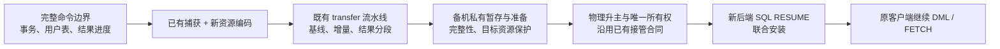

**物理备机对接已在包含物理备机能力的 MySQL 工程中完成，这是本设计的既有基础。** 当前工程负责补齐用户临时表、待 FETCH 结果及相关资源在 standby transfer 下的捕获、传输、接管与 SQL RESUME 支持；完成后再将这些增量纳入该工程。物理复制、升主及其一致性/旧主 fencing 合同沿用既有实现，本次只将新增资源接入这些合同。

### 1.0 商用链路与模式边界

本特性集成后的商用链路是：旧主命令边界保存 → 在线物理备机接收/准备 → 物理复制一致性与旧主 fencing → 备机升主接管 → proxy 新后端执行 SQL RESUME → 继续 DML/FETCH。各资源组合、P1～P5 原型和性能指标均服务于这条 standby transfer 链路。实施分两步：先在当前工程完成新增内核能力与专项测试，再纳入已完成物理备机对接的 MySQL 工程做新增场景的端到端回归。当前开发不以重新建设或重新证明已有物理备机基础能力为前置条件。

local startup（原实例关闭/重启后，启动扫描本地保存工件并恢复）不在本次范围。具体不新增它的资源准入、结果/PS 启动扫描、启动期恢复目录与重放、启动预留适配或对应功能验收；接收进程崩溃后的续接也不借此顺带实现。不能依赖重启备机或启动扫描来完成在线目标导入。

**新增范围不包括 RESET DRAIN。** 不新增其准入、回源恢复、旧连接队列对账、专用清理、验收或预算；现有实现保持原状。`COM_STMT_RESET` 的 PS 原生语义继续支持。新增废弃文件允许进程重启后异步删除，具体运行期责任与目录边界见 §9.3；这不是启动恢复或在线升主的新阶段。

“复用本地代码”是复用 capture、carrier、materialize、native undo 和 cleanup 的已有实现，不是接入 local startup 模式。新增资源准入与恢复分支以 standby transfer/接管上下文为模式边界；共同 helper 的复用不能自动放开其他模式的游标或资源限制。公共入口仍保留必要的 OFF/非 standby 路径隔离检查，不将其扩成 local startup 专项建设。

### 1.0.1 固定的在线升主与 SQL RESUME 入口

**物理备机工程已集成以下入口，升主阶段和调用顺序固定。** 本特性对在线升主流程的新增接入只限下面前三处；新主 SQL RESUME 使用第四处。保持现有对外调用方式，不要求物理备机工程新增阶段、额外资源准备/激活调用、轮询接口或清理屏障。表中源码证据是当前工程的被调用实现；外部商用调用方已集成这一事实按用户确认，不因当前工程缺少该调用方而重建升主框架。

| 固定位置 / 入口 | 当前职责与本特性内部增量 |
| --- | --- |
| ① `preserved_trx_prepare_before_trx_sys_init_for_physical_promotion()` | 在原 `trx_sys` 初始化阶段之前，核验 accepted epoch、READY 集合并持有 pin，登记已认证 Resurrection Index。新增资源完整性与按引擎形态选择候选在该入口内部处理；不在这里挂接业务 THD、安装 PS 或另开在线导入阶段。 |
| ② `trx_lists_init_at_db_start()` 中既有 Preserve 接口 | **用户确认物理备机在线升主也会调用此方法**；不能根据名称将它只归为进程启动。保留原生 rseg/undo 事务复活路径；直接调用是 `void trx_preserve_startup_resurrection_finish()`，位于复活扫描之后、`rw_trx_ids/rw_trx_list` 最终组装之前；下层已有 candidate 应用接口继续复用。新增资源不另建事务链表扫描，不把 NONE、TEMP_ONLY 或没有 redo undo 的 READ_CONTEXT 强塞进 redo resurrection；这些形态由③内部分派处理。 |
| ③ `preserved_trx_adopt_ready_epoch_for_physical_promotion()` | 消费同一 bootstrap attempt，沿原 gate/lease 核验并短接管 receiver 已准备的资源及必要引擎上下文；不重新选号或按总字节补做转换/页安装。沿原结果返回，不让调用方追加“临时表准备完成”阶段；失败沿入口内既有裁决与 attempt 收尾。 |
| ④ `Sql_cmd_resume_preserved_transaction::execute()` | proxy 在新主新后端发出 SQL RESUME 的真实 SQL 入口。沿原权限、handoff 与 record 分派进入 strict 恢复，在同一命令内联合安装事务、用户表、PS、结果和消费位置，移交活跃 owner 后才返回成功。不得只接一个内部 helper 而遗漏此入口。 |

源码依据：[prepare 入口](/Users/a1234/project/mysql-server-8022-preserve-port/sql/preserve_trx_promotion.cc:3533)；[READY 检查](/Users/a1234/project/mysql-server-8022-preserve-port/sql/preserve_trx_promotion.cc:3664)、[pin](/Users/a1234/project/mysql-server-8022-preserve-port/sql/preserve_trx_promotion.cc:3681)；[候选登记](/Users/a1234/project/mysql-server-8022-preserve-port/sql/preserve_trx_promotion.cc:3717)；[原事务列表初始化](/Users/a1234/project/mysql-server-8022-preserve-port/storage/innobase/trx/trx0trx.cc:1076)及其中的[finish 调用](/Users/a1234/project/mysql-server-8022-preserve-port/storage/innobase/trx/trx0trx.cc:1097)；[adopt 入口](/Users/a1234/project/mysql-server-8022-preserve-port/sql/preserve_trx_promotion.cc:3739)；[SQL execute](/Users/a1234/project/mysql-server-8022-preserve-port/sql/preserve_trx.cc:24769)。

②继承已集成物理备机流程的原生 rseg/链表初始化和阶段状态前置；当前函数含 release 有效的 `ut_a(srv_is_being_started)`。[断言](/Users/a1234/project/mysql-server-8022-preserve-port/storage/innobase/trx/trx0trx.cc:1077)。①/③检查的 `preserved_trx_server_startup_active()` 读取另一独立状态，不能将两者视为同一开关而推导冲突。[Preserve 状态](/Users/a1234/project/mysql-server-8022-preserve-port/sql/preserve_trx.cc:185)。本特性不自行切换全局启动状态或改变外部顺序；后续集成回归保留既有调用方满足原生前置的证据。

新增用户临时表、保留结果及 NONE/TEMP_ONLY 组合继承既有物理升主部署前提：源与目标 `log_bin=ON`、`gtid_mode=ON`。资源没有 binlog cache 不解除该配置要求；①及③沿用原配置核验，不因资源分类放宽。[配置合同](/Users/a1234/project/mysql-server-8022-preserve-port/sql/preserve_trx_promotion.cc:2976)、[①检查](/Users/a1234/project/mysql-server-8022-preserve-port/sql/preserve_trx_promotion.cc:3672)。

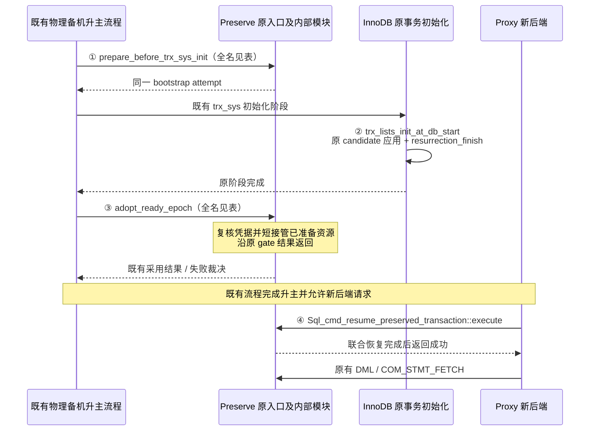

①和③当前都拒绝 `preserved_trx_server_startup_active()`；②及其 helper 名称中的 `startup` 描述复用的原生初始化代码，**不表示新增 local startup 恢复，也不能据此跳过在线升主中的②**。②的直接 finish hook 当前为 `void`，只结清候选/指标；不能假定已有错误返回通道。必要失败事实由现有 attempt/候选状态承接，在③内核验并沿原 gate 结果返回，不新增 caller 判断步骤或改变该 hook 签名。①仅为真正需要 redo resurrection 的子集登记候选，全部资源 token 仍参与同一 READY/pin/完整性合同；原来的 token 数等于 verified trx 数的假设在①③内部按形态修正，不增加第五个入口。

本文 §9 的两种证明是**现有调用内部的完成条件**：receiver/prewarm 完成具有稳定身份保护的目标产物，③短接管并移交所有权。既有升主前置条件和放行顺序保持原样；不能将“allocator-ready 接点”“target-ready”解释为要求调用方另加阶段。P1/P5 若在这些入口和原有前置条件内无法成立，应修订内部方案并报告具体缺口，不自行扩大物理备机工程改造范围。

④的实际链路为 `execute → preserved_trx_resume_record_on_current_thd → preserved_trx_resume_adopted_for_promotion_on_current_thd → prepare_resume_on_current_thd_shared → 原 begin_activation/commit_attach`。[strict 分派](/Users/a1234/project/mysql-server-8022-preserve-port/sql/preserve_trx.cc:24354)及[共同 prepare](/Users/a1234/project/mysql-server-8022-preserve-port/sql/preserve_trx.cc:24988)已有；新增 NONE/TEMP_ONLY/结果分支在这条链内完成。有效资源不能误走旧 session-only 快捷返回；现有鉴权、token 所有权、错误响应和激活前后裁决继续复用。

### 1.1 不能改变的语义

| 要素 | 必须保持的行为 |
| --- | --- |
| 命令边界 | 已获准的顶层 SQL 请求、EXECUTE、FETCH、CALL 到原生终结才可封存；多语句 COM_QUERY 按整包处理是本次新增目标，由 P4 交付并区分旧路径测试（§4.3）。未结束就等待，超时沿既有失败路径，不发布半命令快照 |
| 客户端 | 不修改客户端、FETCH API、结果绑定、预取缓存，不增加行偏移或 token 参数 |
| Proxy | 前端不断；沿既有特殊错误码机制切换，SQL RESUME 成功后先补发留存 CLOSE，再放行业务；不新增通用前缀确认或业务命令重放。CLOSE 生命周期与失败边界见 §4.2／W10 |
| 结果 | 保持已生成内容、顺序、重复行、类型、NULL、下一行和原生 EOF 行为；不重新执行 SELECT 来重建旧结果 |
| 事务 | 恢复后能原生继续 DML、COMMIT、ROLLBACK；仅证明当前行可读不够 |
| 目标实例 | 在线运行，可能已有临时表、空间和 undo；不要求重启，不覆盖整个 `ibtmp1`，不清空其他会话 |
| 唯一所有权 | 只有既有 transfer/接管裁决允许的一侧能继续业务；ACK 不确定不能由新资源模块自行解释为可恢复 |
| 隔离 | 总开关关闭、子功能关闭、非 standby transfer 及普通 MySQL 路径保持相应原行为；不向 local startup 接入本特性 |

### 1.2 哪些对象进入本次设计

| 形态 | 处理方式 |
| --- | --- |
| 用户 `CREATE TEMPORARY TABLE` | 保存结构、数据、会话归属及必要 undo；应用把结果放入这种表后分页 SELECT 也按此处理 |
| Classic 二进制 PS 服务端游标 | 保存 EXECUTE 已经物化的结果及跨命令 FETCH 状态；覆盖内部 TempTable、MEMORY、InnoDB 结果载体 |
| 同一会话中的其他二进制 PS | 一并保持已有编号和后续协议解码所需状态；否则下一次使用另一个旧句柄会破坏客户端零修改合同 |
| 普通 SELECT 的客户端读取 | `mysql_fetch_row()` 读取当前响应或本地缓存；没有独立服务端续取命令，不新增结果迁移对象 |
| CALL 多结果、SQL 文本 EXECUTE、存储程序内部 FETCH | 等整个命令结束；不迁移存储程序栈、半个响应或查询中间执行状态；命名 SQL PS 按 §8.1 的既有责任与资格规则处理，不能迁移成功后丢失名称 |
| X Protocol、当前打开 HANDLER | 继续保留现有拒绝；HANDLER 全部关闭后仅该项限制解除 |

当前源码分别在[共同准入](/Users/a1234/project/mysql-server-8022-preserve-port/sql/preserve_trx.cc:5235)、[二进制 EXECUTE](/Users/a1234/project/mysql-server-8022-preserve-port/sql/sql_prepare.cc:1894)、[SQL 文本 EXECUTE](/Users/a1234/project/mysql-server-8022-preserve-port/sql/sql_prepare.cc:1952)和[客户端游标读取](/Users/a1234/project/mysql-server-8022-preserve-port/libmysql/libmysql.cc:2232)体现这些区别。内部结果表的支持不受用户表 DD 类型白名单直接限制；两种资源采用不同表示和恢复路径。

## 2. 现有代码的复用边界

| 能力 | 当前已经存在 | 本次补充 |
| --- | --- | --- |
| 用户表捕获 | manifest、DD/dict 绑定、共享空间去重、data image、no-redo undo、dirty stream、Phase 1 sidecar | 连续切轮、跨机对象枚举、增量依赖、源/目标身份区分 |
| 可复用的既有用户表恢复实现 | 工件验证、空间 adopt、TABLE 暂存、FSEG/slot 安装、undo 接回、THD link、retry/cleanup、再次捕获 | 在线目标合法分配和必要转换；联合安装进度；strict 分支接入 |
| 传输和接管 | 顺序分块、对象 seal、manifest、预热、prepared registry、lease、物理证明和 strict attach intent | 资源描述及持有句柄；按事务形态判断完整性；资源-only 正式 token |
| 游标 | 原生物化、FETCH、EOF、关闭、活动游标计数 | 选定一条导出路线、值编码、恢复游标、原 PS 编号及参数状态恢复 |

源码入口：[临时表 manifest](/Users/a1234/project/mysql-server-8022-preserve-port/sql/preserve_trx_temp_table.cc:2956)、[现有物化](/Users/a1234/project/mysql-server-8022-preserve-port/sql/preserve_trx_temp_table.cc:3559)、[undo 接回](/Users/a1234/project/mysql-server-8022-preserve-port/storage/innobase/trx/trx0temp_preserve.cc:5837)、[prepared 资源实现](/Users/a1234/project/mysql-server-8022-preserve-port/sql/preserve_trx_promotion_prepared.cc:48)。详细证据保留在[已有实现审核](/Users/a1234/project/mysql-server-8022-preserve-port/design/workshops/temp-table-preserve/existing-implementation-and-gaps.md)。

**当前用户表支持矩阵是起点，不是用户认可的永久限制。** 现有路径要求 InnoDB，DD 绑定覆盖整数、VARCHAR/VAR_STRING、BLOB，以及 2026-09-23 新增的 CHAR/BINARY、BIT、DECIMAL/FLOAT/DOUBLE、DATE/YEAR、TIME/DATETIME/TIMESTAMP 小数精度和 ENUM/SET，索引形状仍有限制。无显式 PRIMARY 时，合法 UNIQUE 聚簇键和隐藏 ROW_ID 两条路径均已通过定向内部恢复验证。同日已补 standby AUTO_INCREMENT 原生计数、SAVEPOINT/RELEASE/ROLLBACK TO、成功的语句回滚及仍持有原生所有权的空 undo；内部 SQL RESUME 用例验证数据和后续操作。同日已补 JSON partial undo 和 STORED 生成列：后者保存原有物理值，在目标原生 TABLE open 时恢复表达式与依赖图，后续 DML 正常计算，不在升主/RESUME 重算已有行。VIRTUAL 生成列现已补齐依赖图和有界 undo 校验，原 index ID 在 namespace 契约下保持，内部 COMMIT/ROLLBACK/失败重试用例通过。其他列类型及跟踪区间内 DDL 历史仍需继续补齐。持续增量不会自动解除这些限制；具体实现与运行边界见[实施记录](implementation-plan.md)。

## 3. 统一恢复合同：会话资源与事务形态分开表达

### 3.1 一个版本化合同，SQL 状态与引擎恢复分开

建议升级已有 bundle 的语义合同，而不是各层分别创建分类规则。下列是拟定的逻辑字段，实际 C++ 命名及 TLV 编号在实现时确定。

| 字段 | 含义与约束 |
| --- | --- |
| `contract_version` | 新版语义和资源清单版本；不支持的强制资源必须拒绝，不能忽略后继续恢复 |
| `sql_trx_state` | SQL 事务是否活动、显式 BEGIN、autocommit、只读及隔离语义；在已有字段上补足缺失表达，不仅凭 undo 判断 |
| `engine_recovery` | `PERSISTENT`：恢复持久引擎上下文，并明确恢复依据；`TEMP_ONLY`：有真实临时事务需要恢复；`NONE`：没有需要导入的引擎事务，不代表 SQL 层一定没有活动事务 |
| `resources` | 用户表、二进制 PS、开放结果的资源清单；与引擎恢复形态正交 |
| `session_state` | 会话上下文复用物理复制工程已有转移；事务相关 GTID、binlog、MDL 等继续沿原描述及检查，不在本特性另建会话迁移，也不能伪造持久写入 |
| `resource_root` | 绑定最终表、空间、undo、结果代次、PS 状态及对象依赖的摘要 |

`PERSISTENT + 用户表` 对应业务所说的 MIXED。没有活动事务但仍有用户表或开放结果时使用 `sql_trx_state=inactive + engine_recovery=NONE + resources`；BEGIN 后尚未触及引擎但持有资源时则是 `active + NONE + resources`。后者恢复 SQL 事务语义，未来首次访问引擎仍按原生路径启动，不编造 redo undo、trx_id 或 synthetic 活动事务。

本次新增无事务准入由用户临时表或开放结果触发；已选中会话的其他二进制 PS 作为依赖一并保存。只有闲置 PS、没有表和开放结果的会话，不因本次结果功能自动扩大批次准入，其原有恢复合同另行审查。

现有 `engine_shape` 的 PERSISTENT_ONLY/TEMP_ONLY/MIXED 及 payload 校验不能直接表达后一种形态；新版以同一分类函数派生旧路径需要的兼容字段；新形态由新版验证器处理，不能强塞成旧版枚举，旧版仍按原验证规则读取，不维护两套可独立修改的真值。[现有语义校验](/Users/a1234/project/mysql-server-8022-preserve-port/sql/preserve_trx_bundle.cc:450)。活动但尚未产生引擎写入的事务仍须保留 BEGIN/autocommit 等原语义，不能只凭 undo 是否为空判为 `NONE`。

还要区分“尚未访问引擎”与“已经存在 ACTIVE 引擎上下文但没有待恢复 undo”。后者不能归入 NONE，包括已有 ReadView/锁，也包括 RC 命令结束后 ReadView 已释放、临时表读取又未加锁的情况。PERSISTENT 的恢复依据区分 `REDO_RESURRECTION` 与 `READ_CONTEXT`。READ_CONTEXT 保留真实事务身份、session participant、保存点拓扑、隔离状态及实际存在的 view/lock，依同一物理 fence 创建合法原生上下文；不能编造 redo resurrection entry。无 view/lock 的合同必须明确含 INNODB participant 和本次保留的临时表或 PS 资源，不能只凭 BEGIN 接纳任意无引擎会话。实现入口为 `trx_preserve_is_read_context_locked()` 与 `preserve_trx_recovery_payload_valid()`。

**硬门槛 P5：** 原型证明只读快照、无写入的锁定读取及与临时资源组合的恢复依据、原生事务身份和清理可闭合。所需窄创建/导入接口尚未证明现成可用；不能当作已经支持，也不能因为本轮发现该缺口就永久排除这类会话。分类与依据贯穿源 capture、receiver eligibility、resurrection 校验、prepared readiness、promotion 和 RESUME，由一个合同派生，不各处用“undo 为空”猜测。

V2 落在现有 mandatory semantic TLV 的版本/长度/已知位校验入口，不另建合同 registry。[现有解析](/Users/a1234/project/mysql-server-8022-preserve-port/sql/preserve_trx_bundle.cc:1226)。NONE 还须处理物化之前的会话恢复：当前 restore_preserved_dml_policy 因 trx 为空直接失败，且原 attach helper 无条件增加 BEGIN/IN_TRANS/TX_EXPLICIT。拆分 SQL 字段恢复与可选的引擎 policy 调用，按已保存 SQL 状态恢复 flags/tracker；不能只跳过最后的 trx attach。[前置 policy](/Users/a1234/project/mysql-server-8022-preserve-port/sql/preserve_trx.cc:3468)、[strict 调用](/Users/a1234/project/mysql-server-8022-preserve-port/sql/preserve_trx.cc:24047)、[活动标志](/Users/a1234/project/mysql-server-8022-preserve-port/sql/preserve_trx.cc:3492)。

### 3.2 resource-only 不复用旧 session-only 快捷分支

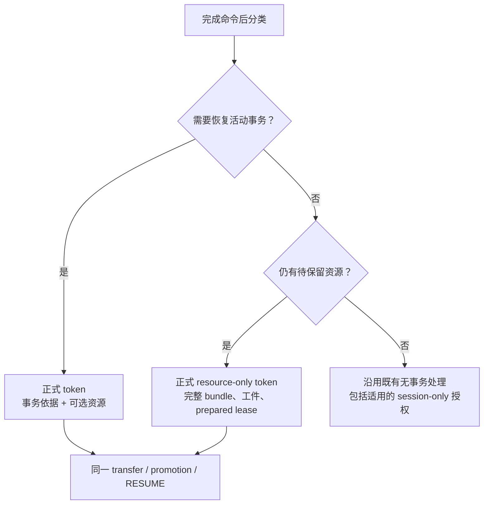

旧 `session_only` 只是一次性授权，以既有流程已恢复会话状态为前提，消费后返回 OK；它没有资源安装过程。[当前分支](/Users/a1234/project/mysql-server-8022-preserve-port/sql/preserve_trx.cc:24269)。物理复制工程已有 session 上下文转移；本特性仍须让资源-only 进入正式 token 管理，不能以会话已恢复代替资源安装或放入该授权集合。

源端 scanner、authoritative counter、THD pin、ready queue、结果表和最终覆盖检查统一按此合同调整。空闲资源会话进入保存目标，但不冒充一条 T0 在途命令；“全部会话目标”和“需要持久事务证明的子集”分别计数。[当前计数入口](/Users/a1234/project/mysql-server-8022-preserve-port/sql/preserve_trx.cc:5876)、[无事务完成分支](/Users/a1234/project/mysql-server-8022-preserve-port/sql/preserve_trx.cc:6217)。

## 4. 从命令运行到再次 FETCH 的完整流水线

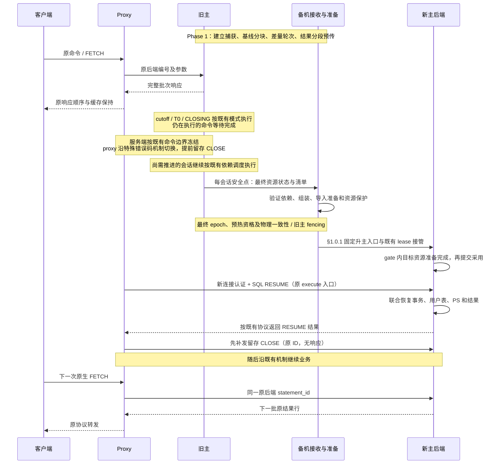

### 4.1 各阶段的工作与完成条件

| 阶段 | 允许做的工作 | 不能越过的条件 |
| --- | --- | --- |
| Phase 1 普通作业 | 建基线、冻结可发送轮次、编码稳定结果、传输和预热；不同会话流水推进 | 工件只是候选，业务所有权仍在源端；后台必须持有实际资源寿命 |
| 发布 cutoff | 停止新普通作业，结清已登记作业与许可 | 不等于所有业务 SQL 已完成；不能提前解除 dirty 捕获 |
| T0 / CLOSING / 等待安全点 | 按已有依赖模式登记在途命令、关闭普通命令准入、等待完整命令结束 | 使用现有模式的阶段顺序；不另加一个临时表 drain 屏障 |
| 受控 final 作业 | 原调度收尾并确定目标后，各目标封存最后页、undo 图、DD、PS、结果位置并发送 | 挂入既有 Phase 2 target worker 的作业计数、deadline、取消和清理；final 阶段内各目标并行推进 |
| 接收准备与最终 epoch | 已齐对象尽早组装、校验；稳定目标映射并制作目标产物，final 绑定源内容和目标凭据 | seal、epoch accepted、READY 不同；新增资源凭据齐备才能 READY |
| 物理升主及采用 | 既有 handoff 允许后，在 ADOPTING lease 内复核冻结凭据、短接管已准备资源 | 不重新分配并批量转换；资源-only 也遵守唯一所有权合同 |
| SQL RESUME | 消费已准备句柄，完成目标 THD 绑定和必要挂接，再统一对业务可用 | 不在正常快路径重建全量资源；任一资源失败不得返回部分成功 |

**普通 PS 也应尽量在 Phase 1 完成传输和准备。** 当前复用 TEMP/OBJECT worker：在完整命令边界分批复制普通 PS 独立状态，锁外编码和传输，receiver 先形成候选。2026-09-30 增加源端 final wire 复用：保留计入资源额度的 wire 和仅源端使用的 prepare-generation 证明；final 校验集合、随机种子和当前 TDC；使用仍有效的源端认证，未认证条目再逐项核对 context 强引用、描述符、resolved/actual 参数类型、空参数运行态和 arena。命中则沿用同一 wire/manifest，省去源端重复克隆与编码；未编码的完整普通快照可直接编码。只适用于原生、无游标、无 TEMP/SP、参数为 NO_VALUE 的严格子集；其余仍在最终命令边界完整捕获。receiver 仍以完整 manifest 和 canonical file 身份判断是否复用，不信任源端本地证明。CLOSE、PREPARE、参数类型或依赖变化触发回退，不能重新执行 SELECT 生成旧结果。

**Phase 1 完成要看接收处理进度。** 最后一次普通 sender flush 之后、pre-T0 purge 之前，源端固定已封存的普通 PS descriptor 清单及最后 mutation 序号。通过原私有连接发只读查询，每批最多64个 `(token,size,digest)`；receiver 先检查语义应用水位，再检查同一 canonical file 的真实 PS 准备结果。普通传输 ACK、已收到字节数、通用 object proof 均不能代替此检查。查询不消费序号，不进入 mutation admission，不另建 worker；此时原 pipeline 仍供后续 final 使用，不能提前 join。

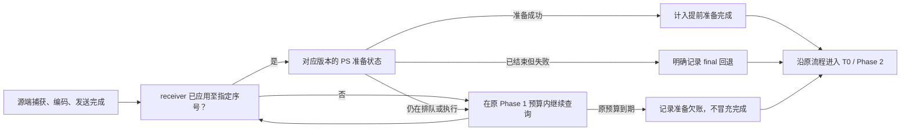

该检查约束已封存的普通 PS 样本；业务后来改变 PS、参数类型、依赖或游标，final 仍须验证并按需重新捕获。截止时间耗尽继续原 final 正确性路径，不能据此宣称充分准备或2秒性能达标。指标 `ps_receiver_selected/ready/fallback/deadlines/queries/wait_us` 区分选中样本、真实准备完成、明确回退和预算耗尽。查询丢响应可重连且不产生 mutation ACK_UNCERTAIN；已认证的语义错误直接返回失败。VIO 超时按秒向上取整，查询不提供毫秒级硬截止保证。

源端动态证明也尽量提前维护：每个样本建立计费的固定槽数组，成功捕获的 native PS 绑定对应槽。EXECUTE/FETCH/RESET/CLOSE/LONG_DATA 在预检查阶段先使槽失效，reprepare 两侧同样失效；成功 EXECUTE 完成原生收尾后，仅用原动态比较器复核当前这一条。编码发布不能重置槽状态，编码发布与后续命令之间的窗口由 Phase 1 补扫覆盖：每批最多访问32个未认证的原生 PS，并最多推进4096个紧凑槽；已认证槽不再读取原生对象。PS 析构或绑定新样本时永久退休旧槽，防止“CLOSE 后再 PREPARE、总数不变”误用旧集合；退休槽不可重新认证。

final 保留集合数量、SP/TEMP 条件、当前 TDC 和随机种子校验。有生命且已认证的槽证明原对象/ID/资格/context 未变化，可直接复用，避免再次读取大量原生 PS 对象；未认证槽仍查当前对象、执行原资格和动态比较，失败走完整捕获。dependency 指针由原 context pin 保活，当前表版本检查不能省。槽只由命令 owner 或持有同一 THD 独占边界的 final owner 访问，编码 worker 不读写槽；stop 只停止后续主动刷新，不能清空已认证状态。共享证明不持有跨线程 native 指针，也不传给 receiver。最终Debug定向39项业务及shutdown通过；Release原full OFF 1000连接同规格两轮strict为618647/415835us，均确认Phase1 receiver候选1000 Ready且final全部复用。其余模型和外部工程见任务跟踪；不能由该两轮结果推导任意负载的2秒硬保证。

同一份wire内的多个PS若依赖完全相同的BASE表预期版本，只需在final检查一次。编码时从原context固定的依赖建立 `(schema,name,view,version)` 唯一清单，按去重前容量计费；每个依赖对象，包括零表对象，先确认bound、未mapped、无routine，表项还需BASE/local_version且无watch/失效标志。最终先验证全部PS，再逐项检查当前TDC中的存在、非opening、非old以及view/version一致；不同预期版本不能合并。清单只在当前样本内复用，不能跨会话、样本或final尝试缓存检查结果，也不构成额外DDL fence。构建失败不得发布半成品source proof。

wire 在编码完成时计算一次摘要并与字节一起封存，ordinary 对象声明、partial/完整 manifest 及 final 发送共用该摘要。这样 final 不必再次遍历整份不可变 descriptor；仍核对长度、结果文件数和 manifest 摘要。receiver 对接收字节重新计算摘要，源端缓存不能替代接收侧完整性检查。

复用验证在 kernel 内部 TEMP/binlog 资源申请之前完成。普通截止保留尚未完成的快照：join 后在最终独占命令边界，沿原固定 ID 清单只补齐尾部，再完整编码并校验全部状态；不修改旧前缀或原 RAND 基线来掩盖变化。失配、缺失 ID、零进展、编码或配额失败时，先释放整份候选，再执行原完整捕获。Phase 1 join 后，已消失、仅剩会话或被排除的目标也释放可选缓存；已声明而未完成的对象仍由原队列持有，按既有 SEAL/abort 收口。原 pipeline 取消但继续 final 时保留 token 身份，真正终结的 join 清理释放剩余可选样本。这不保证所有 final 前置配额都不受可选缓存影响：尚待处理的 partial、kernel 之前的 attached-target warmcopy/lock 准备及未 SEAL 的传输对象仍占额度，低配额压力需单独验收。final 补尾条目与 partial 复用集合单独计数，不能充作 Phase 1 已完成工作。当前每 token 仅作一次普通快路径尝试，尚非逐 PS 连续增量缓存；源码、测试和原规模性能证据分开记录在[原压测回归修复](original-pressure-regression-fix-2026-09-28.md)。不新增线程池、外部升主阶段或延迟到 SQL RESUME 的批量准备。

捕获尚未完成的样本与 worker 可运行的对象必须分开：等待下一次空闲边界的样本受既有内存预算约束，不能占住发送 worker 或反复提交空工作；只有完整独立描述或已固定的结果文件进入发送队列。实际取得 THD 锁时检查命令边界，未取得边界只表示待重试；已冻结的可发送对象不因业务再次执行而退回等待。统计上分别报告源端 Phase 1 封口数量、receiver COMMIT 前候选数量和最终复用数量，后两者不能代替 Phase 1 完成率。

忙连接不能只等后台偶然采到 idle。普通 PS 捕获请求先独立登记，再争取 worker 名额；连接在现有 `preserved_trx_begin_command_read()` 正常入口、上一命令完整结束后交出一小批独立状态。可选路由读取与捕获 mutex 竞争时均跳过本次，保留请求供下一命令边界重试，不向业务返回错误；编码和发送仍由原 worker 完成。持续竞争不保证普通轮完成，最终独占边界仍负责补尾或完整捕获。收口撤销 drain attempt 内的共享路由，等待已经进入的一批复制退出，已冻结对象继续排空。既有 RAII 负责取消和寿命清理，不增加 RESET DRAIN 分支。新 owner 捕获耗时只覆盖取得捕获锁后的复制段，不代表完整命令延迟，也不包含路由和 THD 锁等待；现有busy/no-slot计数不包含路由try-lock跳过。须结合原规模业务与最终时延验收，不能由 try-lock 推导零开销。

final 的“准备→发送→receiver 准备”也应连续推进。原 early pipeline 在 discovery 结束后等待全部 target worker，再集中发送已完成 candidate，形成了全局等待点。现有 batch sender 可用时，协调线程应在等待其余 worker 期间消费已发布 candidate，解开 queue mutex 后沿原 `stage_ready_candidates()` 发送；保留发送前后的 flush、binlog 精确 presealed 检查、失败 abort→join 和末次排空。没有增加新的 worker、外部阶段或命令边界。`post_discovery_staging_waves` 记录提前开始的 wave；`post_discovery_overlap_targets` 只在该 wave 完成对象发送及原确认检查、且仍有目标 worker 未完成时记数，不能用开始计数冒充实际重叠。非 batch 路径保留既有等待方式。性能收益仍须原规格 Release 验证。

**普通 PS 复制不持有全局发送锁。** 同一 Token 每次只允许一批捕获；短锁内认领并移出独立 Snapshot，在 owner/idle THD 的既有保护下锁外复制，再短锁发布。并行复制额度取既有 worker 数与 result slots 的较小值，不新增线程池；额度满时本次命令边界跳过。关闭 capture 入口后用条件变量等待在途复制退出，等待时释放发布锁；已被放弃的样本不得重新发布。`owner_capture_us` 是各任务的累计 elapsed，包含内部等待和重新发布，不能当 CPU 时间或阶段墙钟。原规模性能仍须实测。

普通捕获只供 wire 编码使用，可借用 context 中仍有效的原生 BASE dependency，省去每条 PS 的重复 clone、ledger acquire 和退休 release。资格要求非 deferred/native-pending/compact、已 bound、未 mapped、无 routine/watch/失效标记，并通过原 TDC 版本检查；不符合时沿原 snapshot 克隆。借用是强引用，原 dependency 的 lease 随对象保活，不重复收费。普通 Snapshot 不得直接送入 Preparation 或 attach；receiver 始终从 wire 解码出独立依赖，再执行 map/bind。最终完整捕获仍克隆，source wire 复用仍校验 context 代际、当前 TDC 和动态 PS 状态，不因借用而跳过 DDL/reprepare 检查。

**2026-09-30 吞吐优化的并发边界。** 首轮确认无用户 TEMP 的事实在同一个命令边界锁下记录，供普通轮初始完成判断使用；后来创建 TEMP 仍由实际捕获和 final 处理。没有打开游标时，复用现有 `preserve_trx_open_cursor_count` 跳过逐 PS 游标遍历；普通描述符捕获、参数变化校验先于此判断，不能因此漏掉普通 PS。

普通快照每批最多32条，先在同一次 `LOCK_thd_data` 保护下确认对象、计算描述符/类型/运行态的实际预留量，再通过原 `Snapshot::Impl::memory.grow_to()` 一次申请。私有捕获接口逐项扣减本批额度，包含 NO_VALUE 可能残留的字符串字节；额度不足仍放弃可选样本。快照持有额度直到其全部子对象销毁，编码后的 wire、context/dependency/proof 仍单独计费。`encoding_only` 在 `begin_prepare()` 拒绝该快照直接进入恢复对象，防止子对象逃逸后提前释放额度；final 完整捕获和 receiver 解码仍保留原独立 lease。

| 交错位置 | 互斥和所有权约束 |
| --- | --- |
| CLOSE/PREPARE/reprepare 与捕获 | 同一 THD 锁覆盖预检和复制，原生 PS 指针只存在于本次调用栈；旧 proof 槽仍永久退役 |
| 捕获与编码 worker | `capturing` 排他认领，Snapshot 以 unique_ptr 移入当前捕获；完成后在原 mutex 下发布，worker 只取得完整快照 |
| 捕获关闭与 final | 先撤销路由，等待已进入的捕获退出，再沿原 pipeline join；等待不持有发布 mutex |
| 批量发送与重试 | 保留原 session 顺序锁、序号、认证 ACK、接收端身份和字节完全一致的重试；不并发写同一协议流 |
| ACK 后异常 | 先发布已确认的帧数，再更新可能分配内存的统计；后续批次分配失败也推进已确认前缀，避免 ABORT 重用已应用序号 |

描述符在既有 step 字节额度内批量发送 CHUNK 及末尾 SEAL，单次最多1MiB；每个 CHUNK 仍不超过64KiB和原 chunk 上限，原批帧器进一步限制网络请求大小。临时编码峰值计入同一 token，结果文件流继续沿原逐块路径。此处只保证**已收到认证 ACK 的前缀**在已审核的批次/统计分配失败下保持正确；既有传输 ACK 解码的所有 OOM 边界并未在本轮穷尽验证。

上述规则减少重复遍历、额度锁操作和往返，并未实现普通 PS 的连续增量缓存。CLOSE/新 PREPARE 使旧集合失配时，final 仍完整捕获当前集合；大量变动时必须另测其尾部，不能从静态 PS 性能推导2秒保证。测试和 Release 指标见[原压测回归修复](original-pressure-regression-fix-2026-09-28.md)。

**最终封存沿用原阶段顺序。** “各目标并行”指既有 final 阶段内的 worker 并行，不因某个包刚结束就提前冻结该会话。仍先由原调度器推进必要的 COMMIT/ROLLBACK 并完成依赖收尾，满足既有 HARD/CLOSING 条件后确定目标集合，再进入 target worker；不新增逐会话依赖关闭算法或额外 drain 屏障。[调度等待](/Users/a1234/project/mysql-server-8022-preserve-port/sql/preserve_trx.cc:20195)、[目标集合](/Users/a1234/project/mysql-server-8022-preserve-port/sql/preserve_trx.cc:20307)、[目标流水线](/Users/a1234/project/mysql-server-8022-preserve-port/sql/preserve_trx.cc:21097)。


源码顺序以[主流程阶段协调](/Users/a1234/project/mysql-server-8022-preserve-port/sql/preserve_trx.cc:20161)及[cutoff 条件](/Users/a1234/project/mysql-server-8022-preserve-port/sql/preserve_trx_phase1_pipeline.cc:528)为准。新捕获持续覆盖“普通作业停止 → 最后业务命令完成”之间的变化；此时可以继续轻量记录页，最终 I/O 由 Phase 2 目标 worker 承担。命令完成慢或 dirty 量超预算时进入明确超时/失败，不能绕开屏障偷偷启动普通 worker。

源码中的 Phase 1 final admission 当前只服务 RECORD_LOCK，并在逐目标 Phase 2 pipeline 前 close/finish_and_join；它不是通用资源最终补传接口。本文选择扩展现有 Phase 2 target worker 的资源目标、计数、deadline、取消和 join，不延长或重开 Phase 1 final admission。[Phase 1 收尾](/Users/a1234/project/mysql-server-8022-preserve-port/sql/preserve_trx.cc:20442)、[Phase 2 目标入口](/Users/a1234/project/mysql-server-8022-preserve-port/sql/preserve_trx.cc:21097)。

**捕获句柄从创建起就由既有源会话/epoch 资源持有者管理。** Phase 1 与 Phase 2 worker 只取得受保护的借用，不再安排阶段切换时的 owner 移交。普通作业 close/join 只结清本阶段作业，不销毁仍 armed、还须记录最后业务变化的捕获。现有临时表 participant 已在[整个 drain 作用域内创建](/Users/a1234/project/mysql-server-8022-preserve-port/sql/preserve_trx.cc:18790)，[close_phase1()](/Users/a1234/project/mysql-server-8022-preserve-port/sql/preserve_trx.cc:10560) 不清捕获，直到 [abort/finalize](/Users/a1234/project/mysql-server-8022-preserve-port/sql/preserve_trx.cc:10594) 才清理，可沿用这一寿命边界。

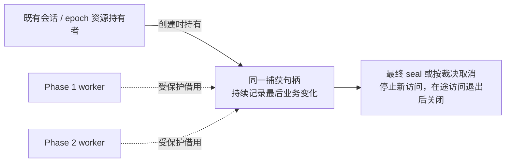

新增句柄须保护实际捕获对象、页/reader/文件等所需资源，不能把当前[仅存 thread_id 的列表](/Users/a1234/project/mysql-server-8022-preserve-port/sql/preserve_trx.cc:10618) 当作资源保活证明。访问者包括 worker、页写入/undo staging 及已排队回调。最终 seal 或正常失败按已有裁决执行 abort 时，先在原同步域关闭新增访问，锁外等待在途访问退出，再退登记、释放 capture；取消同时撤销旧代次发布资格，迟到回调不得再次发布。等待的是仍访问捕获的借用，不包含 owner 自身或已交付工件的长期引用。复用现有[关闭 stage admission](/Users/a1234/project/mysql-server-8022-preserve-port/storage/innobase/trx/trx0temp_preserve.cc:526)及[退登记顺序](/Users/a1234/project/mysql-server-8022-preserve-port/storage/innobase/trx/trx0temp_preserve.cc:1760)，不另建 capture manager。关闭 admission 不等于已经排空；现有 guard 对等待失败仅标记退化，不能直接作为新句柄释放成功的证明。新增路径须取得实际排空结果；超时仍保留必要 owner，不能因垃圾文件可延后删除而提前释放在途访问对象。[等待结果](/Users/a1234/project/mysql-server-8022-preserve-port/storage/innobase/trx/trx0temp_preserve.cc:444)、[guard 处理](/Users/a1234/project/mysql-server-8022-preserve-port/storage/innobase/trx/trx0temp_preserve.cc:548)。

实际排空谓词绑定同一 capture/代次：新独立借用已关闭，仍访问该对象的在途借用、未交付 staging 和排队/执行回调均已退出。staging 到队列/回调的交接须保持同一寿命责任，不能在交接间出现虚假的计数归零；关准入不切断已有借用的交付和归还。owner 自身及已交付且不再访问 capture 的工件引用不计入等待。生产者交付或退出时通知；等待释放谓词互斥，不持页 latch、THD 或全局管理锁，复用原操作 deadline 的剩余时间而不重新起算。超时返回可检查失败并保留原 epoch owner；迟到任务可归还借用，不得恢复发布资格。计数与通知只协调寿命，不能代替生产者执行 TLS drain；具体锁序和进展由 P2 验证。

资源强引用与 THD pin 分开。已有[participant shared_ptr](/Users/a1234/project/mysql-server-8022-preserve-port/sql/preserve_trx_temp_table.cc:1516)可作为资源保活基础；异步借用实际访问 THD 时另持外部 THD pin，不让 THD 自己持有的 capture 永久反向 pin 同一 THD。因为 [THD teardown 会等待外部 pin 归零](/Users/a1234/project/mysql-server-8022-preserve-port/sql/preserve_trx.cc:14626)，确需长期 pin 时须由独立 epoch 清理路径解除，不能等 THD 析构再解除。等待与耗时 I/O 不持有 THD/全局管理锁；§9 中目标活跃资源向 THD/PS 的必要移交保持原合同。

Phase 1 临时表任务接入、启动顺序和结果收口按 §6.6 扩展既有 pipeline；本节的 owner、cutoff、依赖调度及 Phase 2 final 顺序不变。receiver 在传输期间推进候选准备，但只在原最终事实与完整性合同满足后发布 READY（§9.1.3）。

### 4.2 LONG_DATA 暂不支持；CLOSE 保留原范围

**本阶段不支持 `COM_STMT_SEND_LONG_DATA` 的迁移。** 源捕获拒绝未 EXECUTE
的分片（含空分片）和待报错误，目标运行态解码也拒绝；普通 EXECUTE 参数、
BLOB/TEXT 数据和原结果 FETCH 继续支持。`ps_runtime` 已删除 LONG_DATA 专用
迁移分支及旧 `MPPSRT01` 解码，使用 `MPPSRT02`；原生 EXECUTE/RESET 清除不支持
状态后，不因历史使用过 LONG_DATA 而永久拒绝该 PS。冻结后新分片和迁移交错
续传仍不支持。完整命令边界与无响应命令的静默保护必须保留。

**2026-09-27 用户确认的 CLOSE 合同：** proxy 留存 CLOSE；物理备机升主且
SQL RESUME 成功后，在同一新后端先补发这些 CLOSE，再放行业务。切换仍由
既有特殊错误码驱动，客户端不修改；不恢复旧 E／command_cut、连续前缀确认、
LONG_DATA 续传或通用业务命令重放方案。不新增内核 source→receiver 关闭事件
通道、线程池或外部升主阶段，也不给 CLOSE 增加响应包。

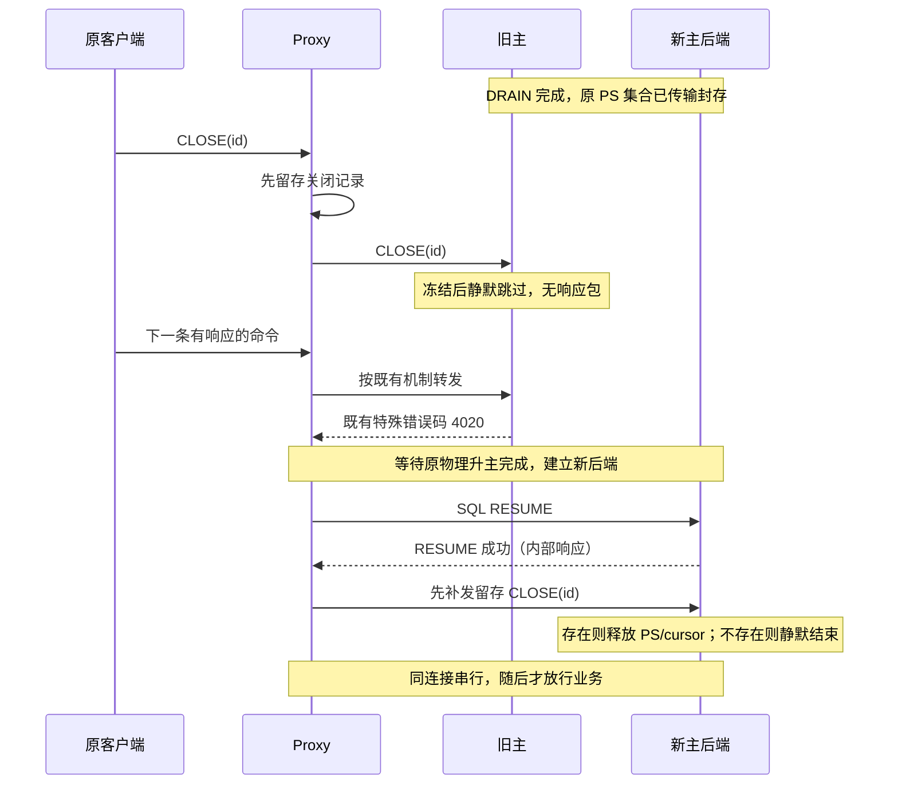

**留存与顺序。** 关闭记录必须在向旧后端发送前建立，覆盖首次 4020 之前的
窗口，不能收到 4020 才开始记录。记录限定同一逻辑会话和 PS 生命周期，不能
把跨 RESET_CONNECTION、会话更换或已重用 ID 的历史 CLOSE 无界带入新后端。
proxy 须按原映射使用后端 statement ID；新后端的 SQL RESUME 成功前不得补发，
补发批次必须排在所有新 PREPARE（含 proxy 自身的 PREPARE）和后续业务命令前。
切换时停止向旧后端分发；其间新到的 CLOSE 也须按同一会话命令顺序交付，不能
落在已取走的旧批次之外而丢失。这是 V05 的真实 proxy 接线验收项。

**幂等的边界。** [原生 CLOSE](../../../sql/sql_prepare.cc) 对未知 ID 静默返回，
存在则删除并释放资源。[恢复安装](../../../sql/preserve_trx_ps_restore.cc)保留
原 ID，但新编号只跳过当前 map 内的对象，没有永久保留历史关闭 ID。例如源端
1/2 存活、3 已关闭，目标恢复 1/2 后，新 PREPARE 可取得 3；旧 CLOSE(3) 必须在
这个 PREPARE 前补发，不能延后。成功交付的关闭记录须消费，不能误用于下一
次切换；源端已关闭与目标端重复关闭的幂等以同一 PS 生命周期为前提。

**无响应与失败。** CLOSE 不返回 OK/ERR，proxy 不等待逐条 CLOSE 响应。
正常链路利用同一 Classic 后端的命令顺序完成“先补发、后业务”；若需确认
交付，可利用后续正常响应，或由 proxy 消费内部 PING 的响应，不向客户端暴露。
本地测试使用 PING 确认批次及检查响应未受污染，这不是每条 CLOSE 必加的 RTT。
**用户确认：SQL RESUME 失败，proxy 立即关闭后端连接和客户端前端连接，结束
该逻辑会话。** 不在这个会话重试 RESUME、不补发 CLOSE、不放行业务，也不把
失败后端放回连接池。关闭记录随已结束的会话丢弃，不能带到下一会话。内核按
既有失败撤销及 THD 退出路径清理部分安装；未消费的 preserve token／候选资源
仍按既有 epoch/所有权策略处理，关闭连接不等于删除全部迁移工件。
补发期间断连或交付不确定时同样不能继续放行脏后端，沿既有连接失败处理；
本合同不承诺失败后的透明重试或一般命令重放。
真实 proxy 的留存上限、失败时前后端断连、禁止后端回池及并发接线归 V05 验收，不能由测试
夹具的内存列表通过来替代。

**代码和证据。** E25 已证明已准入的半包 CLOSE 会先完成原生删除，再捕获
最终 PS 集合；冻结后、首次 4020 前的 CLOSE 在没有补发时会丢失关闭效果。
该旧负例保留为没有补发条件下的证据，不再推导必须新增内核关闭事实通道。
E26 按新合同验证源端已关闭/冻结后关闭、重复和未知 ID、FETCH/EXECUTE 拒绝、
PS 计数释放、另一游标的完整尾段、关闭 ID 再分配，以及失败 RESUME 直接断后端后的 THD/PS 清理。
实际状态与日志见[任务跟踪 W10/E26](task-tracker.md)。本地真实 SQL RESUME 使用
既有内部 bridge；成功时前端不断链、失败时前后端同时断开及禁止回池归 V05，
真实物理在线升主归 V04。

原 `COM_STMT_RESET`、`COM_RESET_CONNECTION`、`COM_QUIT` 和控制响应语义
继续保留，不扩展 RESET DRAIN。上述 CLOSE 补发特例不改变 LONG_DATA 排除。

### 4.3 多语句 COM_QUERY：同包继续执行，整包结束后封存

依据用户“命令未执行结束则等待”的要求，本特性选择**顶层请求一旦获得执行准入，就让该包沿原生规则终结，再冻结会话**。例如一个 COM_QUERY 包含两条 UPDATE，不能因迁移开始而在两条之间主动截断；原生语法、权限、锁等待、SQL 错误及既有超时/失败规则继续有效。原生错误可以终结整个包，不要求把错误之后原本不会执行的 SQL 强行执行。

**2026-09-23 已接通本特性模式的整包边界。** standby dependency scheduler 开启且 TEMP namespace 或 result capture 开启时，`preserve_trx_command.cc` 将 COM_QUERY 保持为同一个 Command_key/EXECUTING，包内不再 retire/synthetic capture；只在 dispatch 终结时结算。首句 parser 锁存多语句事实，running compound 复用 CALL 的原生 owner 处理，跨事务后使用新的 ordinal，不继承旧 support。7 个无 DEBUG_SYNC 的真实行锁业务 MTR 已通过，包含包内 DDL、错误后仍存活的新事务和 OFF 对照。CLOSE 按 §4.2 的已确认补发合同验收；本项不能代替其余 P4 验证。

**旧模式继续保持原行为。** 多语句循环会 retire 前一子句，再为下一子句建立 synthetic scheduler command，后续子句可能被迁移准入拒绝。[retire](/Users/a1234/project/mysql-server-8022-preserve-port/sql/sql_parse.cc:1948)、[synthetic capture](/Users/a1234/project/mysql-server-8022-preserve-port/sql/sql_parse.cc:2013)、[旧事务准入](/Users/a1234/project/mysql-server-8022-preserve-port/sql/preserve_trx_standby_phase2_scheduler.cc:1881)。现有[多语句测试](/Users/a1234/project/mysql-server-8022-preserve-port/mysql-test/suite/preserve_trx/t/standby_transfer_phase2_multistatement_autocommit.test:35)明确要求第一条 UPDATE 生效、第二条被 `ER_PRESERVE_TRX_SESSION_DRAINED` 截断。该旧合同由新 OFF 对照验证；上述历史 DEBUG_SYNC 用例未计入本轮新用例证据。

现有 packet inflight guard 仍包住整个 COM_QUERY，QUIESCED 也要求 server idle，所以不能把上述行为描述为“在包内直接快照”。[packet guard](/Users/a1234/project/mysql-server-8022-preserve-port/sql/sql_parse.cc:1911)、[idle 检查](/Users/a1234/project/mysql-server-8022-preserve-port/sql/preserve_trx.cc:6217)。要补的是**已准入包的继续执行权**，不只是把快照时间推迟。

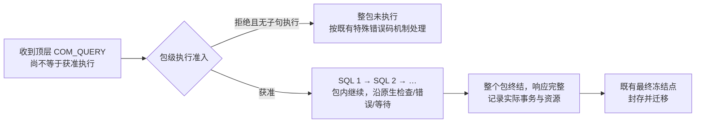

| 接点 | 必须满足的条件 |
| --- | --- |
| 包级准入 | 在原命令记录和准入同步域内确立线性化点；收包、capture sequence、T0 登记本身都不授予执行权 |
| 同包后续子句 | 继承已经取得的包级继续执行权，不再因迁移的 old cohort、DEFAULT_DENY 或 fresh-support 不足被 drain 拒绝或 HELD；不能只推迟 HARD 却让子句永远等不到许可 |
| 原 scheduler | 继续观测依赖、推进其他顶层命令并控制期限；子句 retire 不清除整个包的在途事实，HARD/最终冻结不得越过仍执行的包 |
| COMMIT → BEGIN | 包身份连续，事务身份按真实提交/新建更新；新事务的锁依赖、恢复依据及最终资源分类重新取得，不能把旧事务 support/ReadView 带入新事务 |
| 包终结 | 在完整原响应可交付后更新顶层完成事实；资源快照保存终结时实际状态，不保存 SQL 子串偏移或跨后端执行栈 |

当前事务关闭会清旧身份/support，身份变化还有既有 safety abort 检查，不能只保留一个 packet 标志就绕过这些约束。[关闭事务](/Users/a1234/project/mysql-server-8022-preserve-port/sql/preserve_trx_standby_phase2_scheduler.cc:1116)、[完成时身份检查](/Users/a1234/project/mysql-server-8022-preserve-port/sql/preserve_trx_standby_phase2_scheduler.cc:1299)。P4 先证明上述窄接入和跨事务子句，相关原有测试应区分本特性启用的合同与 OFF/非本特性路径；不能把旧测试直接改绿当作新合同已证明。这里不增加第二个 scheduler、SQL 拆包重放或子句级恢复器。

包级权威事实仍放在原命令/会话调度状态中；子句记录可复用原容器，但不能各自推导一个不一致的“整包已结束”。P4 的首个交付件明确同一包身份、准入资格、在途/终结事实和实际事务身份的权威字段、写入者及同步域，并逐项说明以下位置如何消费；不预先规定必须新建容器或把所有对象塞进一个 `commands` 表。

| 使用包事实的位置 | 必须保持的一致判断 |
| --- | --- |
| HARD/cutoff 发布 | 已准入包尚未终结时，子句切换不能被视为空闲；保留 EXECUTING 观测及 cutoff CAS。[判定](/Users/a1234/project/mysql-server-8022-preserve-port/sql/preserve_trx_standby_phase2_scheduler.cc:2304) |
| eligible-body exit coverage | 完成证明覆盖实际执行 body，不能把子句 retire 当成整包退出。[coverage 检查](/Users/a1234/project/mysql-server-8022-preserve-port/sql/preserve_trx_standby_phase2_scheduler.cc:2335) |
| callback 退休 | 尚需报告包退出的回调仍可归还；`commands.empty()` 的退休判断须与包事实一致。[退休](/Users/a1234/project/mysql-server-8022-preserve-port/sql/preserve_trx_standby_phase2_scheduler.cc:1311) |
| 事务身份与 safety-abort | COMMIT→BEGIN 更新真实身份和依赖；旧身份失效不误撤销已经取得的同包继续执行权。[身份检查](/Users/a1234/project/mysql-server-8022-preserve-port/sql/preserve_trx_standby_phase2_scheduler.cc:1299) |
| 最终 idle/QUIESCED 与完整命令效果 | 完整顶层 dispatch 退出且资源事实一致后才可冻结；不能只修改 HARD 一处。[server-idle](/Users/a1234/project/mysql-server-8022-preserve-port/sql/preserve_trx.cc:6217) |

现有多语句用例分别标记保留、扩展或改写，见 §13.1.1；无 DRAIN/legacy/OFF 的原生对照继续保留。新增目标不是要求全部同名前缀测试一律反转。

**已有部分执行后收到 drain 拒绝的请求必须防止重复。** 若旧路径、接入不完整或异常仍产生这种包，它已经终结但不是整包未执行：完整的原部分结果与最终错误按顺序交付，决不整包补送，也不隐去错误宣称透明切换成功。只有终结及实际效果已完整确认，才可封存该包留下的资源状态；若响应或效果不确定，则按既有失败规则处理，不猜测可重试范围。在本节所选模式下出现迁移引入的包中途 drain 拒绝，属于 P4 合同失败，不能以 dispatch 已退出通过验收。此保护不是另一个产品模式，也不承诺替客户端执行被截断的后续 SQL。

## 5. 用户临时表：保留现有恢复器，新增在线导入计划

### 5.1 捕获内容和资源粒度

复用已有 manifest 表定义、dict/index/root 绑定、image 和 undo 描述，但须修正 ownership claims 的粒度：

| 对象 | 唯一 owner 与寿命 |
| --- | --- |
| data image | 每个 source data space 一份；同空间多表共享，最后一张表关闭且其他使用者退出后才能释放该空间 |
| no-redo undo 图 | 每个真实事务一份；该事务涉及的全部 data space 引用它，汇总同一 table-ID/undo-address 映射 |
| 没有待恢复引擎事务 | 使用会话资源 owner；NONE 不创建 undo owner |

同一事务可能跨多个临时 data space：恢复表 A 后 COMMIT，随后在事务外新建表 B，再 BEGIN 同时更新 A/B。已导入空间不会自动成为原生会话的新表分配空间。[导入挂接](/Users/a1234/project/mysql-server-8022-preserve-port/storage/innobase/trx/trx0temp_preserve.cc:6367)、[新表空间选择](/Users/a1234/project/mysql-server-8022-preserve-port/storage/innobase/dict/dict0crea.cc:303)。现有捕获按 data space 分别抓取同一事务全部 no-redo undo，claims 又包含 data-space 身份；这可能先报重复独占 owner，即使放宽该检查，第二次接回也会因 `m_noredo` 已占用而失败。[捕获循环](/Users/a1234/project/mysql-server-8022-preserve-port/sql/preserve_trx_temp_table.cc:3065)、[owner 定义](/Users/a1234/project/mysql-server-8022-preserve-port/sql/preserve_trx_temp_table_carrier.cc:1208)、[接回检查](/Users/a1234/project/mysql-server-8022-preserve-port/storage/innobase/trx/trx0temp_preserve.cc:5755)。

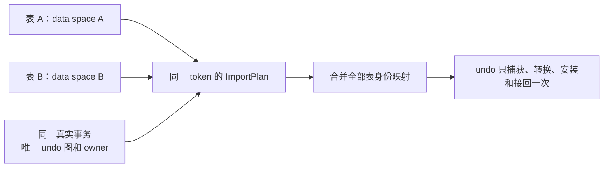

新版清单由各空间引用事务级 undo 图；capture、carrier 校验、导入、重试和再次 Preserve 使用同一粒度。关闭某空间的最后一表不等于事务 undo 可释放；事务完成后的 undo 清理由原生生命周期与实际引用共同决定。不同事务共享 system-temp 空间的捕获隔离另见 §6.2；这两种 owner 问题不能混为一谈。

2026-09-24 当前实现：ImportPlan 已接入 receiver，持有一份事务级源 undo 描述，按私有源 table-ID 字典解析两条流及当前事务的前驱记录。先判断 `old_trx_id`，再查询地址；已提交基线的旧地址即使碰巧命中当前图，也不能改成当前事务引用。目标转换、字典/页准备和引用校验在 READY 前完成。新增独立 `preserve_trx_temp_history`：只有源端 native 实际删除确认的 table/space 身份才能进入 v10 manifest 的退休白名单；旧 undo 保留校验槽位和 undo_no，目标不再为退休表重建行/LOB。未知 table ID 仍拒绝，live 前驱不能指向退休项。同名重建的表使用新身份。

所有用户临时表都已 DROP 时，manifest 可以携带零个数据 image 和一个事务 undo。
此时 rseg ID 仅用于命名载体，receiver 不恢复源空间、不创建假 TABLE，仍在 READY
前构造原生目标 undo。只剩空 undo headers 的后续迁移可以没有退休项，但真实
graph 必须无未知记录。原保存点和源 anchor 共同保持 undo 序号下限。CREATE/DROP
的原生 rollback warning flags 随 semantic v4 传输，在 autocommit 恢复后安装；失败
则恢复目标连接原值。CREATE、DROP重建、all-DROP 与相关 rollback/COMMIT/失败重试
已通过本工程内部 SQL bridge 用例。TRUNCATE/COPY ALTER/ALTER RENAME 的原生
隐式提交边界、失败 CTAS、空 CREATE、跨 autocommit 与 all-DROP 重试也已验证。
真实重复迁移和物理工程在线 replay 验证单独保留，不能由内部桥接替代。

空 undo 不是“没有 undo owner”。当前合同用规范化 `top_offset=0` 表示仍持有 slot/FSEG 的空流，要求 top/last 都在 header page、top undo number 为 0，且图解析不到记录。目标按源流的存在性创建原生空日志，挂接前同时核对 insert/update 的存在性及空状态；完全释放的日志则不伪造。语句失败即使没有成功行标记也推进捕获代次，避免继续使用失败前的页图。

保存点沿已有认证的 SQL/engine payload 恢复，不增加第二份传输字段。挂接时取现有目标序号、非空 undo 尾记录加一、认证保存点最高位置三者的最大值；混合 redo/no-redo 回滚后不能仅按存活尾记录推导。序号和 statement boundary 纳入同一挂接撤销记录，失败重试恢复原值。没有源 undo 时仍验证保存点下限不超过合法目标上下文，不能靠抬高序号掩盖缺失日志。

AUTO_INCREMENT 保存原生“下一次分配值”，不从 `MAX(id)` 重算；计数可能高于当前最大行、甚至超出列范围。最终边界重新读计数，manifest v8 绑定每表计数，非 AUTO_INCREMENT 清单继续使用旧编码。receiver 在打开 handler 前初始化目标原生计数，保留后续 INSERT 的原生增量、偏移、溢出错误和 ROLLBACK 不回退计数语义。全部准备发生在 READY 前。

恢复正确性包含数据、索引、分配元数据、表身份、临时 undo anchors 及历史引用。SQL DML journal 只提供变更及支持性证据，没有完整行值，不能拿它当跨机 SQL 重放日志。

对于 `engine_recovery=NONE` 的用户表，现有接口还不能直接复用签名：manifest 构建要求非空 trx 和非零 owner_trx_id，materialize 也要求 trx。[捕获前置条件](/Users/a1234/project/mysql-server-8022-preserve-port/sql/preserve_trx_temp_table.cc:2960)、[物化前置条件](/Users/a1234/project/mysql-server-8022-preserve-port/sql/preserve_trx_temp_table.cc:3579)。必须在同一新版合同中增加以 session/epoch/token/generation 绑定的资源 owner，以及仅在确有引擎事务时存在的真实 trx owner；相关 manifest/descriptor/claims 的验证一并版本化。复用现有无 undo 的 image/DD 路径，拆开表安装所需会话引擎上下文与要恢复的活动事务，不向旧签名传入伪 trx_id。

若打开 TABLE 需要普通 InnoDB session context，可以取得未激活的上下文，但不得因此启动一个要被提交/回滚的业务事务。该分支先证明没有待恢复的 live undo，再跳过 native undo adoption/reconnect、resurrection 和 engine attach，建立无 undo 的再次捕获基线；SQL 事务 flags 独立恢复。当前捕获已按历史标记或存活 native undo 保留事务内容，避免 reseed 后遗漏旧 undo；NONE 分支仍须证明没有存活 undo，并建立干净的再次捕获基线，不能仅凭曾经有 DML 就生成 undo。[当前分支](/Users/a1234/project/mysql-server-8022-preserve-port/sql/preserve_trx_temp_table.cc:2295)、[reconnect 前置条件](/Users/a1234/project/mysql-server-8022-preserve-port/storage/innobase/trx/trx0temp_preserve.cc:5727)；出现与 NONE 不相容的 undo、锁、ReadView 或 binlog 内容就拒绝错配，不能丢弃。P1 同时验证 COMMIT 后仍持有表、BEGIN 未触引擎和下一条 DML 的状态转换。

### 5.2 源格式工件和目标资源分层

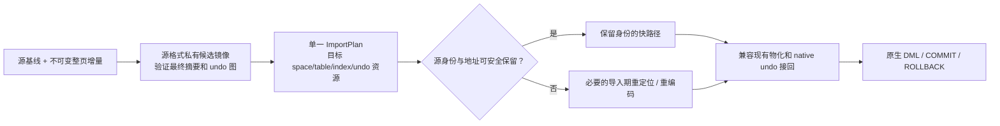

拟定 `ImportPlan` 持有源身份、目标身份、已取得的 space/页/slot/字典资源、转换完成事实及清理进度。它属于一个 prepared token 的资源句柄；不单独决定 token 生效，不提供新的全局 registry。

在线目标必须在原分配器锁与规则下取得、保护、撤销资源。当前 source space ID 预留存在分配水位限制，数据空间可能同号，system-temp undo 页/slot 也可能已被使用。因此“发现冲突直接拒绝”只能作为原型或故障保护，不能作为完整在线能力。[空间预留](/Users/a1234/project/mysql-server-8022-preserve-port/storage/innobase/srv/srv0tmp.cc:102)、[undo slot 校验](/Users/a1234/project/mysql-server-8022-preserve-port/storage/innobase/trx/trx0temp_preserve.cc:5640)。

现有 `ibt` 模块已新增 `allocate_preserved_space_id()`，为非池 adopt 取得并保护合法新 space ID：复用 pool 同步域、`m_last_used_space_id` 和 reservation，在同一临界区完成范围/耗尽检查、选号、推进原水位及保护。[实现](/Users/a1234/project/mysql-server-8022-preserve-port/storage/innobase/srv/srv0tmp.cc:131)。`next_space_id()` 无 reservation 时有快路径，不能在专属导入模块先读水位、稍后再 reserve。接口已通过局部 MTR，在线升主和并发合同仍须验证；不建立第二套分配器，也不创建空白空间只为取号。ImportPlan 记录真实目标 ID/保护，失败或最后引用退出后沿 fil/dict/buffer 撤销顺序释放 reservation，不回退水位。P1 继续覆盖并发 pool 扩展、多 token、耗尽、后续 CREATE、再次 Preserve 及 §5.2.1 跨升主的保护。


### 5.2.1 已有只读临时用户与预热期身份稳定性

receiver 上的只读业务也可能持有用户临时表及临时写入的 undo。源、目标 mysqld 的数字 ID 独立发放，源 space/table ID 可以与本地对象同号；不得覆盖或重编号目标既有对象，也不能以关闭这些会话、重启备机解决。ImportPlan 只操作本 token 的私有副本，须同时避让现有、已发出但尚未入 cache 的对象和未来本地分配。

已实现的 `ibt::allocate_preserved_space_id()` 在 pool mutex → reservation mutex 下选择新空间号并推进原水位，释放不回退；它保护本机 pool 的现有空间和后续扩容。**这不等于所有身份已经安全。** `dict_hdr_get_new_id(..., true)` 的 `true` 仅关闭 redo，仍读取并更新共享字典页中的 table/index 计数；不能假定物理回放不会覆盖该页。table ID 全实例唯一；index ID 按 `(space,id)` 标识，在新独占空间内可以研究保留源索引号。源码依据：[原生字典发号](/Users/a1234/project/mysql-server-8022-preserve-port/storage/innobase/dict/dict0boot.cc:69)、[ID 唯一性](/Users/a1234/project/mysql-server-8022-preserve-port/storage/innobase/include/dict0types.h:214)。

因此，不能把旧的共享字典 target-ID 分配直接前移并宣布 READY。源主仅为导入对象通过 redo 烧掉一段编号，仍不能保护 receiver 后续新建临时表与源主未来持久对象之间的身份；若沿此路线，还需向全部 receiver 临时分配持续授予租块。本轮选择下面的显式临时域契约以收敛实现，不增加升主回调。

用户已确认包含物理备机能力的工程目前不在本地、无法访问。外部发号和资源寿命的核对留待后续集成，不阻塞独立的源布局校验、引用解码等本地实现。当前 `prepare_source_dictionary()` 已能在不分配目标 ID、不发布全局表对象的条件下构造私有源字典；这证明源格式解析可以先行，不证明稳定目标身份或 receiver READY 已完成。

2026-09-22～23 开始落实专用 `trx0temp_preserve_id.cc/.h`：启动参数
`rds_preserve_trx_temp_id_namespace` 默认关闭、运行中只读。显式启用时，table ID
的临时域为 `[2^63, 0xFFFFFFFF00000000)`，上界避开原生 SDI，持久发号必须小于
`2^63`。这不是原生已有保留域。`dict_boot()` 读取经过本页 redo 恢复的实际字典
水位后才允许该策略；upgrade 模式在加载旧表前额外检查 256 个 ID 的偏移空间，
最终更新 upgrade 水位时再校验。计数器仅在进程创建时初始化，既有升主入口不重置。

本地非 intrinsic 临时表与 ImportPlan 共用原子单调 table 发号，不读取或修改
共享字典计数；本地临时 index 使用独立 32 位计数，以兼容原生 virtual undo。
ImportPlan 已验证同一源空间的 index ID 唯一性，目标又是新独占空间，因此保留
完整 source index ID，无需全局重分配，也不额外拒绝合法的 64 位源 index ID。
临时表 ALTER 在原生 SQL 路径强制 COPY，不向旧导入空间追加索引。CAS 在递增
前检查耗尽，不回绕、不回收已发出编号；临时 CREATE 的取号失败沿已有表/索引
清理路径返回容量错误。该策略独立于 Preserve/capture 开关，关闭捕获不能撤销
仍存活对象的编号规则。默认关闭时仍走原生分配路径。

现有本地工件路径不具备该进程内计数的恢复契约。启用 namespace 且带用户临时表
时，源端在 manifest 生成后、任何 snapshot/authority 发布前，要求 artifact 模式
为 standby transfer；否则走已有清理和原 THD 归还路径。这里不增加 local startup
恢复、扫描、计数修复或 RESET DRAIN 逻辑。组件探针可验证私有产物，但也不能绕过
该发布门槛生成本地 token。

**本地分配原语不等于完整线上契约。** 2026-09-23 已将协商接入现有
OPEN_EPOCH/ACK：仅该请求及对应 ACK 使用 v3，普通 frame、batch、manifest 和
工件保持 v2。28 字节契约包含版本、分配策略、临时 table 域上下界及持久 table
上界；策略 1 同时约定本地 32 位 index 发号和独占目标 space 内保留源 index ID。
规则集中在 `sql/preserve_trx_temp_id_contract.cc/.h`，receiver 必须根据本机
已通过 boot 检查的实际策略确认，不能回显请求充当确认。源端要求响应版本与
契约精确匹配，不自动降级。关闭 namespace 的源端仍使用原 v2；开启 namespace
的 receiver 可以接受 v2，但该 epoch 没有临时 ID 分配授权。

契约随 source session、receiver token record 和 accepted epoch 按值持有。
同 epoch 重连重试只能复用原绑定；online 缓存退休而 accepted/终态记录仍存活
时，不允许重新 OPEN 改写契约。accepted 发布的幂等早退之前校验契约一致性。
握手只有固定大小的比较和复制，不增加页扫描或升主阶段。2026-09-23 已将契约
绑定到 receiver worker 和 prepared owner：bundle 移交后独立保留，PREWARMED、
final facts、升主 gate 和 RESUME attach 校验同一值。空契约保留旧 V1 final-fact
编码，非空契约进入 V2 canonical digest；不改变普通 transfer 工件格式。
**实际目标 image/undo 准备仍须接入该 owner 并取得授权**，缺失时不能回退到
当前配置或共享字典分配器；生产临时资源的 source/adopt 准入继续关闭。
2026-09-23 已新增独立的目标产物生成组件 `Preserve_trx_temp_receiver_work`：
固定协商契约，独占 ImportPlan 和随机私有目录，每次处理一个目标字典批次、
一个 undo 批次或限定数量的数据页。每页只转换、完成页校验并计算摘要一次，
同时写入目标不可变原件与独立可写安装文件；两份拥有不同 inode，封存时不再次
全量读取或复制。双份 close/seal 及残留 warm 文件清理均成功后才推进空间状态，
整个计划完成前隐藏所有安装路径。取消不可逆；写入器、两份已封存 image、native undo 分步收尾，删除失败及目录同步
欠账由原 owner 保留并重试。这里只完成产物生成组件及其内部故障验证，
`images_complete()` 不表示 token READY；正式 worker 的跨批调度/取消退休、
prepared owner 移交、LOB 闭包及原生接管仍未完成。目标 image 已接入原资源
管理器的 FD/待写字节额度：同一文件系统按设备共账，native binlog 在全部可能
tmpdir 设备保守预留，磁盘快照与额度准入/结算使用同一把锁；每个 image 批次
成功写入后结算一次，取消完成立即退还剩余额度，不等到 owner 析构。两份输出
预留两倍 image 字节及两个 writer FD，源输入占用另计；仅第二份写入失败时记录
第一份已成功写入字节，未结算预留保持到取消，失败候选禁止继续摘要/重放写入。
第二目录删除后 fsync 失败时保留该文件的 owner/清理游标，重试同目录同步，
不因 ENOENT 提前解除责任。正式输入
文件 pin、native 页/extent 的完整预算仍待接通。不能在这些条件
缺失时开放准入，也不能把组件析构中的兜底清理作为有界 worker 收尾已实现的证据。
同日新增 `Preserve_trx_temp_transfer_input`，由调用方提供已认证的 receiver record，
组件保存本轮 manifest、epoch/token、临时 ID 契约和精确的 SEALED image/undo
句柄集合。共享同一 image 的表只需要一个传输对象；缺失、重复、额外对象、错误
大小/摘要及不匹配的非空句柄都拒绝。ImportPlan 接点只读这些固定句柄，不回退
到 staging 路径；其 parsed manifest 还须重编码后与 input 的原文相同。旧 inode
在路径替换后仍可读，只保证候选输入寿命，不能授权旧候选发布：worker 发布前
仍须在原同步边界内对当前 record 再做 `matches()`，随后才检查完整准备证明。

该输入组件已完成内部真实 stage/SEAL、registry 替换、路径删除重建及后续目标
image 生成验证，但还没有正式接入 worker。随后新增 receiver 专用 undo reader：
先读取 98 字节头部，核对页数与精确文件长度，再申请页存储和索引预算；逐页读取、
校验和计算内层摘要。用树索引替代逐页线性扫描，避免平方级加载及 hash 全量
rehash。双向链按链接逐步验证，临时索引逐项释放后才将 undo 标为 sealed。
没有整份 raw payload 缓冲；源页额度随 descriptor 在 ImportPlan 成功接收时一起
移交，失败留给原 owner，reader 本身的固定额度保留到析构。取消按页/节点推进。

随后新增 `trx0temp_preserve_graph.cc/.h`。私有 pending 图按“页索引→链与记录计数
→申请记录额度→解码记录→检查两流 undo_no→连接前驱→释放 workspace”推进。
计数后为空 vector 一次 reserve，后续不复制已建记录；地址采用树索引，避免
全量 rehash。外部引用按实际个数 reserve，并以 64 KiB 粒度扩展额度，常规路径
不逐记录访问全局预算锁；余量不足整块而足够当前记录时允许精确申请，临界额度
下的锁频率和大块 reserve 延迟仍需测量。单页/单记录为不可再分单位，可超过
调用方的字节预算；这不是严格墙钟时限。

pending 图及失败状态不能被解释成“没有 undo”：目标发号、目标 undo 准备、
页转换与封存均拒绝。全部成功后，源 descriptor、页 lease 与最终图一起移交。
图取消按记录/索引/页推进，先释放内存再退额度。pending 仍借用调用方的源页，
取消后调用方须另行分批退休这些页；已移交源页由最终图负责。新组件已通过
8 阶段取消、失败状态保持、真实 BLOB 引用增额及相关业务 MTR 的内部验证。

随后新增 `trx0temp_preserve_dict.cc/.h`，每表 owner 先申请 native/workspace
额度，再逐列/索引构造；只有整个字典完成后 getter 才可见。列名用轮换 heap，
索引开始前完成所有 system columns；不累计保留每个旧名字前缀。额度覆盖 raw
与 normalized index 共存、统计数组、search info、事件及临时字段查找空间。
按空间给 owner 指针数组单独计账，空数组一次 reserve，后续不复制完成前缀；
table-ID 树索引逐表加入。异步失败保持错误，同步失败只退未完成末表，完成的
表和 lookup 插入失败的 DONE owner 留给同 token 重试。

取消按 target undo→source graph→字典顺序推进；每步只在原生字典锁内删除
一个私有索引，空 table 在锁外释放，数组容量释放后才退其额度。此索引从未
服务 AHI/handler；仍使用原生移除 API，不绕过其锁和计账规则。构造中的原生
单索引规范化、空数组的大块 reserve 仍是不可拆单元，不承诺固定墙钟时限。

随后为 ImportPlan 增加 pending Space：页零、单表校验/两份 binding 复制、单索引
登记/根页预检、最终发布分别推进。SQL 分组只保留 manifest binding 指针，不再
先做第三份深拷贝；manifest 在 pending 完成或取消前须保持不可变且地址稳定。
Space 额度显式覆盖 binding、索引/root 树、原生校验的临时 sets 和常驻 XDES 页；
指针列表/预检页及 plan 空间数组分别计账。全 plan 的 table-ID、space-ID 树避免
每增加一个空间就重扫所有已完成表。失败保持候选和错误，DD/目标发号拒绝 pending；
全部成功后才发布 Space。取消在 undo/字典之后逐字段、列、索引及映射节点释放
metadata，最后释放空间数组容量和额度。单表复制/校验仍是不可拆单元。

新增 `preserve_trx_temp_import.cc/.h` 把上述 source 准备串成一个跨批 owner：
每次只推进当前阶段，持有 immutable Input、分组指针、plan、undo reader 和借用页。
完成后一次移交 Input 与 plan，供目标 image/undo 准备继续使用；不持有 worker THD、
共享锁或 prepare lease。取消先退 plan 的借用，再退 reader/源页、分组，最后分批
释放 Input。Input 保留首次解码结果，避免这条新路径再次 decode/reencode；按原
输入额度同时覆盖 raw、decoded、对象描述和 pin-map，native DD/undo 仍另行计账。


临时表 Input/source/image 在正式 worker 队列的跨批持有、可重试取消调度与
native prepared owner 移交尚未完成；
新的 source work 完成不是 READY，不能直接把旧同步 helper 放入正式 worker。
旧 helper/probe 的外部 decoded/重编码副本仍不由新 Input 的额度覆盖。首次完整
codec 解码及失败局部析构仍同步，不能据此承诺所有元数据动作都有批次时间上界。
2026-09-24 已把普通 worker 的事务 undo 从 DATA 工件解耦。独立 undo 以
`source_space_id == no_redo_undo_rseg_space_id` 标识 system-temp 载体，V10
携带自身 page_size；它可服务多个 DATA space，也支持最后一张表已 DROP。
最终优先采纳快照和 journal 一致的独立工件；否则保留冻结边界完整捕获。
codec、传输、receiver import 与清理接受该身份，仍限制最多一份事务 undo，
并校验 token、摘要及 ownership。旧 image 载体格式的安全回退仍保留。
不可变独立 undo 未注册脏页 stream，退休时不封闭整个 system-temp 空间。
这是所有权解耦，持续页增量尚未完成。

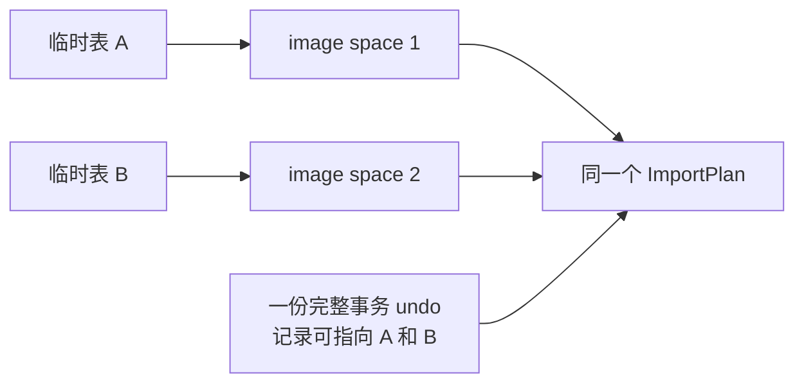

恢复后没有新增临时表 DML，仍可能保有原事务 undo。standby 捕获按当前原生 undo
指针所有权决定，包含仍持有 slot/FSEG 的空日志；不能把 reseed 后清空的历史标记
解释成没有 undo，也不能在回滚已释放日志后仅凭旧 DML 标记索取不存在的日志。
“未跟踪 DML”检测单独比较存活记录，不能把失败首行留下的空日志误判为新数据。
已封存 prebuilt 缺少所需 undo 时
回退重建；先前阶段写完 undo、尚未移交 participant 就失败时同时删除 warm image/
undo。这里是普通失败所有权处理。

既有 materialize 顺序也改为先验证全部无 undo 描述符，再接回唯一载体的 undo，
最后 attach 全部 image，保留重复接回检查。真实两空间 MTR 已验证捕获、SEALED
输入、源引用图与目标 image；另一例验证 `history=0/live_undo=1` 时仍有完整 undo。
这些内部探针不证明正式 worker/native 接管或真实再次 SQL RESUME 已完成；重连排序
和接回后的失败还需后续动态覆盖。以上数据准备继续全部在 READY 前完成，不推迟到
在线升主或 SQL RESUME，也不增加 RESET DRAIN 路径。
物理拓扑所有可能的 writer 必须持续使用相同契约；握手不能证明历史或未来旧
binary 的兼容性，必须在接入物理工程时验证部署和 replay 约束。不得依赖升主时
再发现冲突、重新选号或全量转换来补救。外部临时 pool/undo 寿命也仍需集成验证。

稳定映射取得后，receiver 才能边接收边转换/安装有界批次，final 校验同代闭包及剩余增量；③不能重新选号并重做全量。临时 pool、已准备 undo/FSEG 与 receiver 既有用户资源必须跨既定升主入口保持有效：本仓库 `trx_lists_init_at_db_start()` 不重建 temp pool，但外部工程的完整调用链仍需集成核验。若这些资源会被销毁或回放覆盖，预热安装不能算完成；不得通过新增外部阶段掩盖这个前提。

验收同时包括：receiver 已有同名/同数字候选的临时表、READ ONLY 临时写事务、预热期间继续 CREATE/DROP、失败后的原会话数据/事务不变、未来发号不撞号，以及相同最终增量但总数据规模递增时 FINAL→READY 和①～③耗时。单 mysqld 的 live-object probe 只验证局部隔离，不替代物理回放和在线升主证据。

### 5.3 一个目标分配计划，按实际编码处理转换

| 资源 | 已有能力与真实缺口 | 收敛规则 |
| --- | --- | --- |
| data space ID / 文件归属 | 已有 source ID adopt；在线目标可能占用该 ID | 每个源 data space 映射到独立合法目标 space，保持内部页号/布局，转换实际变化的身份；不改其他会话 |
| 当前行 DB_ROLL_PTR / undo 旧 roll_ptr | undo 页号或记录 offset 改变会影响指向它的行及历史字段 | 仅对属于本次导入 undo 图、实际地址改变的引用按同一映射回填；结合事务归属和记录格式，不盲改其他历史指针 |
| 页内物理身份 | space/index ID 改变涉及页头及格式内嵌身份 | 对已初始化的合法页按页类型枚举 FIL_PAGE_SPACE_ID、page 0 FSP_SPACE_ID、实际 FSEG_HDR_SPACE、PAGE_INDEX_ID 与 LOB 身份；未变化的页号/offset 保留并校验；实际变化的 space/index 身份仍按同一映射转换 |
| BLOB/LOB 外部引用 | 当前行和 undo 旧字段都可能持有 data space 地址；LOB 页面也有身份和历史 | 与对应 data space 使用同一映射，按格式转换/验证整张引用图（§5.3.1），不只改页面头 |
| table/index ID | 既有 materialize 恢复直接写入 source ID，只检查当时 cache；没有给未来分配器建立保护 | 按 §5.2.1 先证明预热期身份稳定；table ID 全实例唯一，index ID 按独占目标 space 内的唯一性处理 |
| live rseg / FSEG inode | 已有 native 安装使用目标 rseg，并建立目标 FSEG inode | 复用，不再实现第二套 inode/原生 undo 安装器 |
| undo slot / 页号 | 已有安装仍要求源 slot、指定页可用；不是任意空闲槽/页重新分配 | 冲突时取得目标槽/页，转换页链、anchors 和历史引用后进入同一安装器 |

保留身份只是同一个 ImportPlan 中已证明合法的 no-op，不另建生命周期。既有 materialize 路径使用 source table/index ID；原生分配器按共享字典页计数递增，不能以“现在 cache 查不到同号”证明未来安全。[原生水位](/Users/a1234/project/mysql-server-8022-preserve-port/storage/innobase/dict/dict0boot.cc:112)。身份来源按 §5.2.1 收敛，必须在 receiver 转换开始前稳定；只能 fence 后发号并全量转换的路径尚未通过本轮性能门槛。P1 包含恢复后其他会话持续 CREATE 的碰撞验证；不能在复制仍推进时擅自写共享 dict 页。私有源字典/记录布局准备可以先行，不等于目标身份已安全。

已有 FSEG 安装调用目标分配器创建 inode，但仍指定 source undo 页号，slot 也须可用，故在线冲突处理不能删除。[指定页安装](/Users/a1234/project/mysql-server-8022-preserve-port/storage/innobase/trx/trx0temp_preserve.cc:1232)、[slot 校验](/Users/a1234/project/mysql-server-8022-preserve-port/storage/innobase/trx/trx0temp_preserve.cc:5640)。临时 roll_ptr 的高位不是 live rseg slot，slot 变化不等于所有 roll_ptr 都要改。

**指针和页头转换必须按字段角色校验。** 临时 roll_ptr 编码包含 undo 页号和 offset；当前行指针与 undo 保存的旧指针共享同一导入映射，但已提交历史字段不因“数值像源地址”就被改写。[编码](/Users/a1234/project/mysql-server-8022-preserve-port/storage/innobase/include/trx0undo.ic:52)。原生回滚会比较行指针与实际 undo 节点，不匹配可能跳过该行，并不保证报错。[比较](/Users/a1234/project/mysql-server-8022-preserve-port/storage/innobase/row/row0undo.cc:190)。因此 P1 注入漏改引用时，应由导入完整性校验拒绝；正常导入后再用精确数据断言验证多级 UPDATE/DELETE 的原生 ROLLBACK，不能以“无错误返回”证明正确。

当前行须先用认证 manifest 的 owner_trx_id 判定归属：其他事务历史、零指针及原生 insert 终结值保持原样；本次事务的真实依赖则必须匹配源 undo 地址、insert 位、表、行键和当前删除状态。源图标记已有后继的节点，禁止当前行指向同一行较早的 active undo。行键及历史前驱边使用源聚簇索引的原生字段比较，不能 `memcmp`：不区分大小写的主键 DELETE 后重新 INSERT，可以在当前行保存 `ALPHA`、undo 保存 `alpha`。旧删除位还须符合 undo 类型并与前驱结果状态接续。每页先校验所有行和引用，再统一写结构身份、7 字节行指针及 external reference 的前 4 字节；任何错误均保持该页不变。该步骤的字段元数据可能大于物理页，按 token 预扣工作区上界并保留高水位，避免每页获取全局额度锁。

只转换已初始化的合法页，不向未初始化 free page 盲写页头。page 0 与普通页身份、FSEG inode 所属 space 分别按格式处理；`XDES_ID` 是 segment ID，不能当 space ID 盲改。[页头示例](/Users/a1234/project/mysql-server-8022-preserve-port/storage/innobase/row/row0import.cc:2011)、[FSEG 字段](/Users/a1234/project/mysql-server-8022-preserve-port/storage/innobase/include/fsp0types.h:82)、[XDES 字段](/Users/a1234/project/mysql-server-8022-preserve-port/storage/innobase/include/fsp0fsp.h:277)。global/session temporary 空间禁用普通页 checksum；转换应遵循实际临时页格式和页头规则，并更新目标安装副本的完整性摘要，而非要求所有页重算普通 checksum。[临时空间规则](/Users/a1234/project/mysql-server-8022-preserve-port/storage/innobase/fsp/fsp0fsp.cc:306)。普通 PageConverter 仅作字段处理依据，不整体借用其事务改写。保留地址与重定位两条路径分别计量扫描页、修改页/字节和校验成本；不将地址未变等同于无需验证，不将③内逐页修补算作 receiver 已完成。

undo 重编码按实际格式处理：table_id 使用变长编码；旧 roll_ptr 用 `mach_u64_write_compressed`，只有高 32 位压缩，低 32 位固定 4 字节。记录 offset 在低 16 位，**仅改变 offset 不会使该指针再次变长**；目标页号跨编码宽度边界才可能改变长度。[table_id](/Users/a1234/project/mysql-server-8022-preserve-port/storage/innobase/trx/trx0rec.cc:581)、[旧 roll_ptr 写入](/Users/a1234/project/mysql-server-8022-preserve-port/storage/innobase/trx/trx0rec.cc:1298)、[压缩实现](/Users/a1234/project/mysql-server-8022-preserve-port/storage/innobase/include/mach0data.ic:411)、[位布局](/Users/a1234/project/mysql-server-8022-preserve-port/storage/innobase/include/trx0undo.ic:52)。

下面只讨论本次 no-redo 临时 undo 图中经 `mach_u64_write_compressed()` 保存的旧 roll_ptr：空间编码 ID 为 0，高 32 位为 `(is_insert << 23) | (page_no >> 16)`。按编码计算，`is_insert=0` 时页号 `[0, 2^23)`、`[2^23, 2^30)`、`[2^30, 2^32)` 分别占 5、6、7 字节；`is_insert=1` 时均占 8 字节。页号 65535→65536 不变长；`is_insert` 是旧指针自身的类型位，不是外层 undo 记录类型。当前行 `DB_ROLL_PTR` 固定占 7 字节，持久 undo 的空间编码不套用上述临时指针结论。[压缩阈值](/Users/a1234/project/mysql-server-8022-preserve-port/storage/innobase/include/mach0data.ic:166)、[高低位写入](/Users/a1234/project/mysql-server-8022-preserve-port/storage/innobase/include/mach0data.ic:419)、[当前行写入](/Users/a1234/project/mysql-server-8022-preserve-port/storage/innobase/include/trx0undo.ic:101)。大 undo/extent 分配不等于单条记录必然超页；P1 分别验证真实宽度边界与接近单页容量的记录。

**布局收敛为按前驱顺序的一次写入。** 源图先列 INSERT 流，再列 UPDATE 流；各流按 undo_no 递增。INSERT 没有旧行前驱，UPDATE 的当前事务前驱必须是已列出的 INSERT 或更早 UPDATE，源图校验拒绝反向引用。因此编码一条记录时，它所引用的目标前驱页号/offset 已确定；记录并不把自己的目标地址编码进自身。先代入真实前驱地址计算完整 body，再按实际 PAGE_FREE 决定写当前页还是由原生分配器扩页，写完才公布该记录的目标 roll_ptr。页号宽度变化已反映在本条编码中，无需候选布局固定点迭代或反复重算整图。该顺序不改变原生回滚按 undo_no 合并两类 undo 的语义。


目标使用新 undo slot/FSEG，复用原生分配、扩页和释放原语；不复制源 rseg/FSEG 管理页覆盖备机已有资源。批次限制记录数与字节数，单条记录不可拆分；取消按原生 FSEG step 释放。单条记录增大后超过普通 undo 页的实际容量仍是真实边界，当前组件返回容量错误并保留已完成前缀供撤销，**这尚未关闭全场景容量门槛**，不能以失败拒绝替代完整交付。

READY 前验证记录结构和引用图，并按已取得、能跨回放和升主持有的真实目标身份精确验算编码宽度、页布局与资源需求，完成有界转换和可提前的原生页安装。源格式预检不必等待取号，但候选页号估算不能作为最终可安装证明。最宽编码放不下，不等于全部合法布局都放不下；容量处理须留在 receiver 准备期间，不能拖到③。③只复核同一冻结计划及安装凭据，按既有 gate 做短接管；无法证明身份稳定或必须在③遍历全部页，则本轮性能门槛未通过，不以晚失败或永久拒绝当作交付。身份来源的未完成项见 §5.2.1，不新增升主阶段。

2026-09-22 当前代码已提供上述分批 undo 写入与分步取消组件，记录位置直接保存在源图节点，避免首次批次清零另一份全量地址数组；目标 scratch 不注册为业务事务。它尚未接入正式 receiver READY 或移交至恢复事务，现有 table/index 取号原型也仍受物理栅栏限制。接线时还须落实目标页/extent 的实际占用额度、在 tmp_rsegs 销毁前排空 owner，以及在 receiver 调度中分步取消；析构兜底循环不能作为共享锁内的正常清理路径。运行证据与未完成项见[实施记录](implementation-plan.md)。

**硬门槛 P1：** 冲突导入、多级 UPDATE/DELETE 历史、当前及 undo 中 BLOB 外部引用、table_id/页号编码宽度变化、单记录容量、原生回滚/提交、后续分配不撞号、再次 Preserve 和失败撤销均闭合。普通 IMPORT PageConverter 会重置事务字段并处理删除标记，不能整体借用。[普通导入行为](/Users/a1234/project/mysql-server-8022-preserve-port/storage/innobase/row/row0import.cc:1857)。若有界转换器仍无法覆盖要求，带着失败证据重新评审导入表示；不新增运行期回滚器。

### 5.3.1 BLOB 引用必须覆盖当前值和历史值

**2026-09-23 代码核查与验证边界：** 大 BLOB/LONGTEXT 在 DYNAMIC/REDUNDANT
上的完整替换、删除、目标 SQL RESUME 后继续修改、COMMIT/ROLLBACK 和 DROP
已通过定向内部桥接用例。当前转换保持 LOB 内部页号/事务历史，修改普通 external
reference 的 space ID。同日新增 `trx0temp_preserve_lob.cc/.h`，在 receiver 页转换
时采集元数据，在 images 完成后分批核对 FIRST/INDEX/DATA、live/version/free
节点、当前及 undo 引用与精确长度；完成并释放证明元数据后，才允许 fil/dict
发布及 native handoff。旧 BLOB 按原生固定 header offset 的链格式检查，专门
使用原生旧格式写入探针的 COMMIT/ROLLBACK 用例已通过；不以 REDUNDANT 行格式
代替页格式验证。

同日已接通 JSON 物理列和非零 partial-update undo。有界 decoder 解析原生
compressed32 suffix，保持原有旧值/事务身份字节，不重建 JSON；检查长度总和、
顺序、零长度、Antelope 本地前缀及外部引用范围。LOB 图验证实际受影响的
一或两个数据块，允许 `ref.version <= suffix.version <= FIRST.version`：
保存点回滚不会降低 FIRST 版本。源 undo 图持有 diff 元数据，LOB proof 只借用，
取消时先退休后者。版本几何信息按 root/version 缓存，重复小更新无需每次重走
整条链；所有缓存计入配额，分步销毁。不同历史版本仍须分别建立证明，尚未做
release 吞吐/尾延迟验收。

JSON 的 COMMIT/ROLLBACK、100 次重复小更新、跨两个块、保存点 COW 回滚、
JSON_REMOVE 零长度 diff，以及单工作单位调度已通过内部桥接 MTR；数量、范围、
entry 数和版本损坏在 READY 前被拒绝，并验证清理与备机已有临时表可继续使用。
源整空间 overlay 同时修复了回滚后访问仍驻留缓存的 free LOB 页的断言：使用
原生 POSSIBLY_FREED 获取，分配状态仍由 XDES 判断；不改共享 buffer API。


注册条件使用原生 `DATA_BIG_LEN_MTYPE`，因此包含可能外溢的长 VARCHAR/VARBINARY。
相关 space 的所有 index LEAF/TOP 均登记，inode 地址、segment ID 和 fragment
页不得发生别名；LOB 页只能属于引用表的 clustered LEAF。该证明复用既有 root、
inode 与 XDES 读取，不增加第二遍 LOB IO，也不等同于完整 FSP extent-list 校验。
数据页不能被两个不同 live/history 节点重复占有，防止后续原生清理重复释放。
free 节点允许保留陈旧 payload；purged 的 `FIL_NULL + length=0` 保留其身份和
标志，但不加入存活图。字段宽度严格按原生 getter：index-entry 的 DATA_LEN
槽占 4 字节、有效值只有 2 字节，节点步长仍是 60 字节。

元数据和引用副本均计入现有 `TEMP_PAGE_IMPORT` 额度；取消及成功退役按批释放。
当前引用列表未去重，可能外溢但实际全为短值的表也有少量 inode 元数据开销。
升主和 SQL RESUME 不再遍历此图。运行证据、故障探针和验收边界见实施记录末节。

用户临时表现有 DD 绑定已包含 BLOB；大值可以保存在外部页。行内 external reference 持有 space ID/page number，undo 又保存旧字段及其 external 标志；原生回滚不会自动替这些字节换空间。[现有 BLOB 支持](/Users/a1234/project/mysql-server-8022-preserve-port/sql/preserve_trx_temp_table.cc:605)、[地址读取](/Users/a1234/project/mysql-server-8022-preserve-port/storage/innobase/include/lob0lob.h:408)、[undo 保存](/Users/a1234/project/mysql-server-8022-preserve-port/storage/innobase/trx/trx0rec.cc:1417)、[回滚解码](/Users/a1234/project/mysql-server-8022-preserve-port/storage/innobase/trx/trx0rec.cc:1865)。因此“迁移后当前值能读”不足以证明能 ROLLBACK。

本版保持每个 data space 内部页号及布局；遇到目标同号空间，换成独立合法目标 space，不把数据页搬进其他 live space 的空洞。只转换实际改变的身份；data 地址与 system-temp undo 页地址属于不同映射域，不能用 undo 页重定位表改写 BLOB 数据页号。

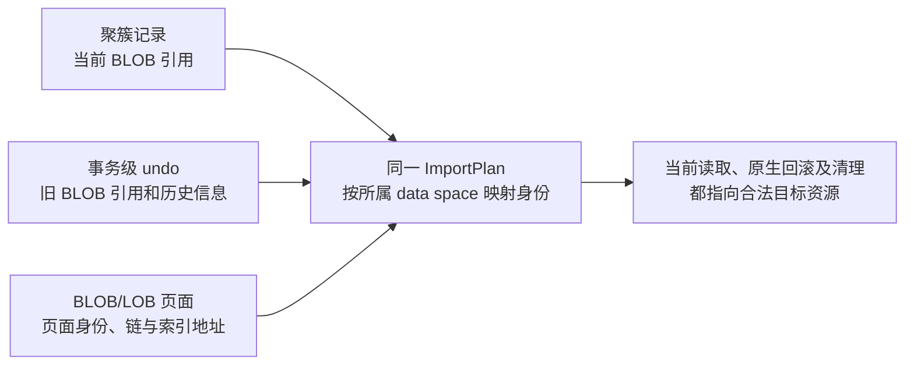

转换和验证清单必须覆盖：

| 位置 | 处理规则 |
| --- | --- |
| 当前聚簇记录中的 external reference | 按列/记录格式定位，改实际变化的 space ID；页号/布局保持时原地址偏移保持并验证，不扫描字节盲替换 |
| 可达 no-redo undo 中的旧 external 字段 | 在事务级唯一 undo 转换中，先按源 table 身份定位对应 data space 映射；所有需要恢复的旧值与当前值保持同一身份规则 |
| BLOB/LOB 页面及页内引用 | 按实际 page type 枚举身份、页链和索引地址；页号未变的链接保持并校验，页面归属、可达范围和引用对象必须一致 |
| 支持矩阵内实际出现的 partial LOB undo | 除 external reference，还校验独立保存的 lob_first_page_no/version/last_trx_id/last_undo_no；地址按所属 data space 解释，保留原历史语义 |

reference 中 offset/version、长度和非地址标志（含 ownership、inherited、being_modified）按实际格式保留；旧 BLOB 的 header offset 与新 LOB 的 version 复用同一位置，不能一律当页内偏移重写。NULL/FIL_NULL 等哨兵先按格式识别，不套普通地址映射。[格式](/Users/a1234/project/mysql-server-8022-preserve-port/storage/innobase/include/lob0lob.h:106)、[partial undo](/Users/a1234/project/mysql-server-8022-preserve-port/storage/innobase/trx/trx0rec.cc:943)。JSON 的已验证范围见上文，不据此扩大压缩表或其他未验证形状的支持范围。

普通 PageConverter 的单字段地址处理可作为窄复用依据，但它还会改写 LOB 页的事务身份，不能整体调用。[BLOB 地址处理](/Users/a1234/project/mysql-server-8022-preserve-port/storage/innobase/row/row0import.cc:1742)、[LOB 事务改写](/Users/a1234/project/mysql-server-8022-preserve-port/storage/innobase/row/row0import.cc:2056)。转换仍由现有 ImportPlan 和专属导入文件执行，事务 undo 只转换一次；不另建 BLOB registry 或原生回滚器。只写目标安装副本，保留不可变重试原件。

目标发布前按已保存的表/页格式验证全部相关引用及历史；发现按 ImportPlan 应转换却仍残留的源身份、引用与目标映射不符、缺失页面或错误归属，则不得报告安装完整；已经证明合法的身份保留不属转换遗漏。no-redo 临时表的原生 LOB 删除仍会按外部引用取页，因此 DROP/最后一表关闭及回滚清理都须覆盖。[原生删除](/Users/a1234/project/mysql-server-8022-preserve-port/storage/innobase/lob/lob0del.cc:63)。P1 必测大 BLOB 多次替换/DELETE、空间冲突、原生 ROLLBACK/COMMIT、删除及再次 Preserve；增加“当前行已修正但故意漏改 undo 旧引用”的拒绝负例，并断言其他目标会话数据未受影响。

### 5.4 复用物化生命周期，补齐有界读写与安装

复用 `materialize` 的校验、DD/dict 绑定、TABLE staged open、native undo 接回和最终 link。专属模块提供文件/页访问、ImportPlan 和进度接口，不复制 SQL 物化流程。身份保护按 §5.2.1/§9.1，不能提前把未发布 TABLE 挂入业务 THD。复用的是安装原语和一套所有权进度：随总字节增长的准备放 receiver READY 前，③短接管，④绑定目标会话；不把旧 materialize 整体提前或照搬进 strict RESUME。

当前物化把各空间完整 image 读成 `retry_image_payloads`，另整读并复制 undo；失败清理也会整读 undo。把这些调用提前到 prewarm 仍会按镜像大小消耗内存，不能算作有界恢复。[image 备份](/Users/a1234/project/mysql-server-8022-preserve-port/sql/preserve_trx_temp_table.cc:3687)、[undo 读取](/Users/a1234/project/mysql-server-8022-preserve-port/sql/preserve_trx_temp_table.cc:3720)、[undo 装载](/Users/a1234/project/mysql-server-8022-preserve-port/storage/innobase/trx/trx0temp_preserve.cc:6114)、[清理读取](/Users/a1234/project/mysql-server-8022-preserve-port/sql/preserve_trx_temp_table.cc:4038)。

ImportPlan 保留不可变重试原件及独立目标安装文件的引用；转换和安装不得改写唯一重试原件。普通硬链接不提供写隔离；无可靠写时复制能力时，用有界缓冲复制文件并计入磁盘额度。校验、转换、安装、重试和清理均走有界页访问；地址映射、页索引、descriptor、并发 worker 也纳入 memory lease。不能只限制网络缓冲，又让全量数据或未计费映射留在内存。

### 5.5 undo 分批安装与撤销的真实边界

现有 FSEG helper 在一个 mtr 内遍历 undo 页，但指定页 helper 只占用 fragment 槽，槽满即失败，并非已支持任意长 undo 链。[安装循环](/Users/a1234/project/mysql-server-8022-preserve-port/storage/innobase/trx/trx0temp_preserve.cc:1223)、[fragment 限制](/Users/a1234/project/mysql-server-8022-preserve-port/storage/innobase/fsp/fsp0fsp.cc:2611)。P1 必须同时证明 fragment/extent 容量与有界安装；不能只在旧循环插入 `mtr_commit()`。复用原生 FSEG 分配/释放原语及现有接回流程，目标页布局算法放专属导入文件。

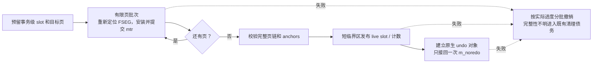

- **先预留、后安装、再发布。** 协调原生 rseg 锁与 reservation 检查，先保护唯一 owner 的 slot；live slot 此时不指向半成品。页由 reservation 或已提交的 FSEG 所有权持续保护。全部页/anchors 完整后，短临界区复核容量并发布 slot、计入 `curr_size`，最后接回 `m_noredo`。slot 发布和接回是两个进度，失败须分别撤销。[已有预留](/Users/a1234/project/mysql-server-8022-preserve-port/storage/innobase/trx/trx0temp_preserve.cc:5641)、[slot 发布](/Users/a1234/project/mysql-server-8022-preserve-port/storage/innobase/trx/trx0temp_preserve.cc:5706)、[接回](/Users/a1234/project/mysql-server-8022-preserve-port/storage/innobase/trx/trx0temp_preserve.cc:5844)。
- **每批重新取页。** 计划保存 `(space_id, header_page_no, header_offset)`、可校验的 segment 身份和进度；每个 mtr 重新定位、锁定 header/inode 并复核 owner。不得跨批保存 page、buffer frame、inode 或 `fseg_header_t*` 裸指针。页数/extent 工作有上限，批次之间检查 deadline/取消；文件 I/O 和重编码不放在 allocator/rseg 长临界区中。
- **撤销也分批。** 先撤销发布资格并等使用者退出，按进度断开 undo、撤销 live slot/计数，再复用 `fseg_free_step()` 逐步释放；每批重新读取 header，最后释放 header 后不再解引用。[原生释放合同](/Users/a1234/project/mysql-server-8022-preserve-port/storage/innobase/fsp/fsp0fsp.cc:4072)、[现有重试清理](/Users/a1234/project/mysql-server-8022-preserve-port/storage/innobase/trx/trx0temp_preserve.cc:3776)。若重试要保留同一目标地址，须在页重新可分配前恢复相应保护；若放弃计划，须先证明无迟到引用。不能先清 reservation 再释放 FSEG；claim 页可能已消费原预留。[claim](/Users/a1234/project/mysql-server-8022-preserve-port/storage/innobase/fsp/fsp0fsp.cc:2633)。

reservation mutex 不跨 I/O，也不得反向等待原生 FSP/rseg 锁。容量、锁序、分批中断后的撤销和重试仍是 P1 原型门槛；清理中止或所有权不明时保留 owner/进度并报告既有清理债务，不宣称可重试。

## 6. 持续增量：减少采集、网络与接收写入

### 6.1 资源分别选取增量单位

| 资源 | 传送单位 | 第一版明确不做的复杂化 |
| --- | --- | --- |
| data/index/分配页 | 基线 + 变化整页，附长度/有效集合变化 | 不做 SQL 重放，不为每个字段做字节差分 |
| no-redo undo | 变化整页 + 当前 anchors/角色/有效页集合或移除信息 | 不以 `undo_no` 增长当成完整追加日志 |
| DD、归属、PS、小会话状态 | 版本化小清单，最终可完整发一次 | 不为几十字节状态维护独立差分引擎 |
| 同一代结果内容 | 稳定的有序不可变分段 | FETCH 位置前移不重新编码整份剩余结果 |
| 游标位置/open/EOF | 最终边界小状态 | 不迁移客户端已消费行号 |
| LONG_DATA 分片参数 | 本阶段不支持迁移，未执行参数及迁移中追加均不纳入增量传输设计 | 约束识别／拒绝归 W10；不为此新增分段复用或 proxy 协议 |

### 6.2 基线、轮次和最终版本

拟定资源清单包含 `epoch/token/resource_id/generation/base_id/round/parent_round`、对象大小和摘要；页条目包含逻辑页地址、捕获版本和整页字节。空间长度、页集合和 undo anchors 也是版本的一部分。对象 ID 在授权范围内稳定，内容一经 sealed 不再改写。

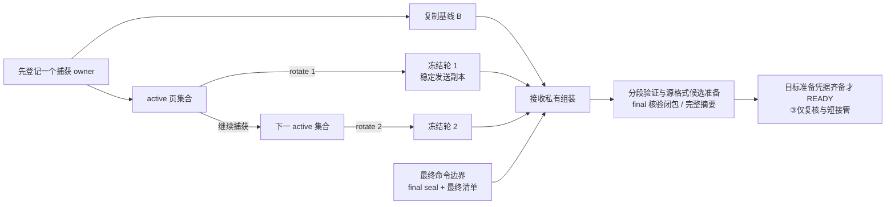

**历史切片（2026-09-24，后续已由 E20–E24 补齐）：源端连续 DATA。** 共享 worker 完成基线后执行非终结 ROUND；同一登记、跨轮页版本及 active/inflight/TLS 额度保留，普通 DML 和空间增长不再要求重建基线。结构变化、语句回滚及其他 data_generation 变化仍使候选失效；final 才排空尾部。候选取消先撤登记再关闭捕获，不能因可选副本被丢弃而使业务事务 degraded。相关实现位于 `preserve_trx_temp_prebuild` 和 `trx0temp_preserve_capture`；最终全量回退仍保留。untracked change、batch unsupported boundary、unsupported history 仍先拒绝，不能以重建绕过。undo 的连续 owner/直接路由和 wire BASE+DELTA 仍须完成，不能将源端 warm image 的连续更新算作已实现增量传输。

每个用户 data space 保持一个捕获登记 owner；同一事务跨空间的 undo 按 §5.1 去重。共享 system-temp 空间允许不同事务各有 undo stream，但当前登记与最终归属校验不等于捕获时已做到直接路由；新增非终结 `rotate` 冻结本轮，随后修改进入下一轮。交接必须包括正在 staging 的写入。现有 `freeze_dirty_stream_for_seal()` 会注销 stream，保留给最终封存，不能重复调用当 rotate。[登记约束](/Users/a1234/project/mysql-server-8022-preserve-port/storage/innobase/trx/trx0temp_preserve.cc:4628)、[终结 seal](/Users/a1234/project/mysql-server-8022-preserve-port/storage/innobase/trx/trx0temp_preserve.cc:2610)。

基线复制之前先 armed 捕获；读取页和版本必须使用一致同步规则。同页最新版本可以合并，但现有 `capture_sequence` 只是捕获新旧次序，同页替换会留下序号空隙，不能靠最大序号证明收齐。[dirty 捕获](/Users/a1234/project/mysql-server-8022-preserve-port/storage/innobase/trx/trx0temp_preserve.cc:4678)。第一版要求轮次清单及前驱连续验证；无需引入任意依赖图调度器。

2026-09-23 已补捕获流自身的代次边界：数据流成功注册、每个 no-redo undo
owner 开始捕获时，分别取得全局序号下限；TLS 迟到值若不大于该 owner 的下限
就丢弃，不分配新队列空间。共享 undo 空间逐 owner 判断，旧 owner 需要的值
不能因另一个新 owner 注册而丢失。下限必须早于首次基线/快照，刷新快照时
不能提高它。它只解决运行期重新注册的旧值隔离，不是跨轮传输完整性证明。

捕获版本在页内容仍受 latch 保护时分配，TLS staging 携带版本，data/undo 合并拒绝迟到旧页，文件基线使用版本 0。2026-09-24 的 DATA ROUND 已保持版本索引和在途额度，并验证同页迟到写、跨轮批量写和候选取消。真实 DRAIN 期间多条 DML、空间增长及后续 RESUME/FETCH/回滚已通过。这些证据不覆盖尚未实现的 wire 轮次闭包和连续 undo，后者仍须同时绑定 owner、页释放/复用及在途版本。

undo 追加会修改旧页内链接和头部，回滚可能截断、释放和复用页。每轮数据可暂不独立可恢复，最终 data、undo、DD 必须来自同一命令边界并形成完整原生恢复图。[undo 追加](/Users/a1234/project/mysql-server-8022-preserve-port/storage/innobase/trx/trx0rec.cc:202)、[截断](/Users/a1234/project/mysql-server-8022-preserve-port/storage/innobase/trx/trx0undo.cc:1143)。有效集合/移除信息不可省略；共享分配证明页只用于验证和目标分配，不直接覆盖 live allocator。


以下为 E20 前的历史瓶颈，当前 standby 路径由下文连续 owner cookie 路由替代：旧 dirty undo 登记路径仍遍历同一 system-temp space 的 descriptor 并逐个存页，TLS drain 在提交线程同步执行；最终按归属筛选不能消除广播成本。已补单 owner 超限隔离和累计字节统计。新 worker 私有初始 undo 扫描不注册这一广播，但也尚未持续跟踪后续 undo 变化；不能据此宣布直接路由已经完成。真正的事务级 owner 与共享页捕获仍遵循下一段合同。

P2 的最小合同是：已证明事务归属的页直接路由；暂不能唯一归属或属于共享分配证明的页，使用一份有界、带版本的 staging 字节及少量引用，不为所有 owner 复制整页。现有捕获登记内维护可派生的页索引，物理缓冲只计费一次，owner 引用另外计费；单个 owner 超额不使无关事务一起失效。页释放/复用、owner 变化和在途版本必须同时验证，不能用猜测的归属去重。这里只收敛已有捕获模块的数据结构，不新增全局 capture manager。

**初始 undo 已分批，最终变化仍可能触发全量回退。** `trx0temp_preserve_undo_scan` 在共享 worker 按页预算读取私有副本；THD 安全点只保存固定大小的 trx/rseg/anchor/页数快照和额度。扫描期间 owner、链、top 或页身份变化，放弃可选 undo 候选；不保存 live trx/undo 指针。`trx0temp_preserve_output` 按字节预算编码，顺序 writer 同时计算摘要。final 要求 journal 与原快照均匹配，才复用这些字节；否则仍调用冻结后的完整捕获。final 复用关闭 writer 的精确路径/大小/摘要/文件身份认证，且借用原 descriptor，避免重复整文件读和 undo 页深拷贝。独立 undo 的 claim 页摘要现由 worker 按页预算预计算，final 只重绑 token 并移动同快照的 claims；归属槽位索引仍一次遍历，fallback 仍需重新计算。禁止持全局捕获锁做整文件读取、全量哈希或等待 worker。

data 捕获已增加 page→slot 有序索引和累计字节数，消除线性查页和逐页全量重算；TLS 到 descriptor 的整页复制及共享 undo 广播仍须继续收敛。页一致性副本仍由合法页同步域取得，不能声称后台线程可直接取走其他线程的 TLS，或将全部捕获成本移出业务线程。

### 6.3 累计声明不可变对象，最终一次定稿

基线和每轮 delta 都是不可变对象，通过既有 `DECLARE_OBJECT / OBJECT_CHUNK / SEAL` 顺序发送。轮次和页版本是对象内容，不新增网络帧。源端先完成一个有界分段的本地文件、长度和摘要，再 DECLARE；之后即使游标关闭或换代，也能完成这个已声明对象的发送与封存，不需要为了取消旧任务新加撤回协议。

现有 source/receiver 已累计维护 token 的对象集合；相同 descriptor 可复用 sealed 状态。每轮只追加新段，沿用既有预热入口，不为每轮生成全量 BEGIN 或第二份轮次闭包。源端 chunk 要求连续 offset；不能以不同字节覆盖已传范围，binlog 的前缀优化不自动适用于临时页。[source 累计声明](/Users/a1234/project/mysql-server-8022-preserve-port/sql/preserve_trx_transfer.cc:11784)、[预热 manifest](/Users/a1234/project/mysql-server-8022-preserve-port/sql/preserve_trx_transfer.cc:11864)、[顺序发送](/Users/a1234/project/mysql-server-8022-preserve-port/sql/preserve_trx_transfer.cc:12038)。

必须分清两个清单的职责：

| 清单 | 包含什么 | 谁据此行动 |
| --- | --- | --- |
| 最终 transport manifest | TEMP：所选对象及精确 BASE／patch 依赖；PS：累计已声明结果，包含随后关闭／换代的旧结果段。保留项 descriptor 必须相同 | 既有 transfer 验证传输完整性和清理 |
| 最终资源清单及 resource_root | 命令边界仍有效的表、结果代次、PS、进度和完整依赖 | 新资源模块决定组装和恢复哪些对象 |

**2026-09-27 收敛后的合同：TEMP 使用 selected-only，PS 继续累计。** 生产 final 调用 `send_token_objects_batch()`，允许未选中的早期 TEMP 对象退出；必须保留所选版本的精确 BASE／patch 依赖，不把“最终只选有效版本”误作只发送 patch。相同对象继承 canonical SEAL owner；省略或替换的旧 TEMP 进入退休账，先删除路径、再等最后读取者退出才减账。没有引入每轮撤回／GC 帧。`begin_token_objects()` 的更严格旧 helper 不是本生产路径；不为统一 helper 语义扩大本期实现。取消“最终 TEMP 必须累计所有历史代次”的额外目标。PS_RESULT 仍不允许 final 省略已声明对象。

第一版不做批次内对象撤回、已声明旧段磁盘 GC、跨会话 CAS 或 Merkle 替代。未声明、无在途引用的旧段仍可删除；已声明段按累计留存额度计费。接收端在对象 sealed 后合并连续轮次、验证内容，并在稳定映射保护下制作目标候选；final 核验有效代次、闭包和完整 image/undo 摘要，再按 §9.1.3 发布。目标身份相关转换也须在 receiver 完成，不留到③。完整摘要缓存仅在对应字节和身份均未变化时复用；持续随机覆盖仍可能留下全量哈希尾部，须按 §13.2 验收，不能转移到升主阶段。

**2026-09-24 对象处理已收敛，规模验收仍开放。** receiver 的 token record 已有受预算约束的不可变索引；索引按二进制块共享，追加累计合并 O(M log M)，旧快照保留原位置。DECLARE／CHUNK／SEAL 及 OBJECT worker 使用有界对象快照，通常一个，binlog seed 最多两个。token 级资源存在与 snapshot 存在标志仍来自完整 record，不能从裁剪后的对象集合推断。BEGIN/final 完整校验一次；普通轮没有 snapshot 时不复制全清单检查 READY。

额度检查由现有 registry 锁内增量账本完成，保留“本 epoch 的 live reserved＋所有 epoch 的 cleanup debt”语义；对象／索引准备成功后发布，失败及幂等重试不重复计费。全局 debt 使用可逆 carry，不能饱和后减法。8192 历史索引和额度状态转移已有内部 MTR 探针；Release 的时间／内存曲线仍待验收。终态已改为先保留 reservation、真实清理成功后释放；失败清理原子迁移为 debt，ABORT/general-error 的生产 wire 探针通过。2026-09-27 已补 TEMP／PS 新旧并存峰值及最后 reader 额度，见 §6.7；binlog 的原有 raw-prefix 生命周期不因此扩展承诺。

结果 W05 已接入生产链：`ps_pretransfer` 持有不可变 generation，复用源 TEMP worker 发 DECLARE／CHUNK／SEAL；receiver 的 token owner 保留已验证 FD 和分批 decoder。最终 transport manifest 含累计已声明结果，PS manifest 只选活跃 generation，并附最后命令边界的 FETCH 位置／EOF。历史结果仍核对 sealed 文件身份和头尾身份。已完成 decoder 被 final 移交，预检不重扫；部分候选失败则丢弃 decoder，从原结果文件重做校验。不能据此宣布 TEMP W03/W04 已实现。

**2026-09-24：源端 undo 跨轮少读页。** `trx0temp_preserve_undo_scan` 仍按每次命令边界取得的新快照走完整 undo 链，但可移动上一退役 sidecar 中未失效的私有页副本。页身份、角色、trx／rseg、页大小必须匹配；FSP0 和 RSEG_HEADER 始终重新读取。失效页和新增页仍在 S latch 下读取，读取前登记 watch、释放 latch 前记录写入版本。

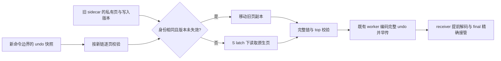

版本记录位于已有捕获模块：4096 个原子槽固定占用 32 KiB，按 space/page 哈希，写入版本只递增、永不清零。哈希碰撞只增加保守重读；计数耗尽则禁用对应复用。mtr 在释放页 latch 前、byte staging 的准入／关闭判断前更新版本，新增路径不获取全局 mutex、不分配内存、不复制页面。watch 最后释放也不清零版本，不产生删除后重建的 ABA。动态 temp 子开关更新会失效旧 generation；OFF 期间跳过的写入不能使旧缓存重新生效。缓存索引与句柄由 sidecar 的常驻配额承担，watch 数可由 `Preserve_trx_temp_undo_watched_pages` 观察。

这只证明 mtr 语义写入的失效，**不是完整页面字节未变化**：flush 可修改 LSN／checksum。页缓存不替代新链核验，也不替代 final 的 snapshot、journal、两张共享页检查；并发命令使快照失效时仍走原回退。旧字节只从已退役 sidecar 移走，失败后不能再认领该残缺候选。`Preserve_trx_temp_prebuild_undo_pages` 统计原生读取，`...undo_reused_pages` 统计复用，包括后来变 STALE 的尝试；二者不是 final 文件的来源证明，也不是耗时指标。**该页缓存切片本身仍全链遍历、解码、完整编码／hash；后续 W03 切片已补充下面的 undo patch 传输，但不据此关闭 W01 的连续 owner 或 W04 原生提前准备。** 同空间写入的原子操作、哈希碰撞率和缓存释放 CPU 成本仍需 Release 规模验证。

**2026-09-24 后续实现：连续 undo owner 和同命令边界的 DATA 批次。** `trx0temp_preserve_undo_capture.cc` 持有连续 owner，普通 sidecar 换代不销毁它。trx、undo 和 mtr 只携带永不复用的 cookie；固定注册槽按完整 cookie 校验并保活，不按 rseg space 给其他事务分发私有页。追加、扩页、部分和整页回滚在页 latch 释放前复制当前页；命令结束后的 idle 边界移交已冻结批次，后续写入进入下一批。worker 仍按新快照走完整链，优先消费冻结页，再尝试未变化缓存，最后原生读取。FSP/RSEG 始终重读，并保留最终共享页校验。

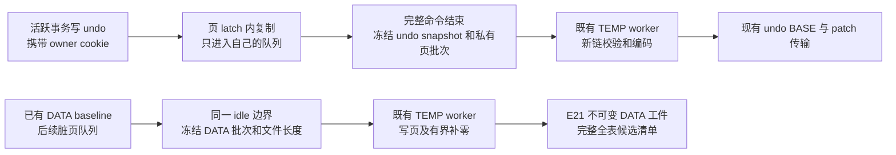

COMMIT／PREPARE 先关闭 owner，不能把其历史链更新到的旧事务 header 误归给当前事务。cookie 在 native 创建、cached reuse、恢复 undo 的 raw malloc 和每次 mtr start 都显式初始化；误混 owner 时 Release 也关闭候选。OFF/ON 失效旧 epoch，预算拒绝仅关闭优化；失效队列由现有 worker 退休，不能持有自身重试所需的额度。固定槽上限为 1024，单 owner 队列上限为 64 MiB；配额不足或槽耗尽保留原回退。shared_ptr 原子操作不保证无锁，页复制和大批退休仍需 Release 性能实测。

DATA 首次 LIVE baseline 不代表某个完整命令快照；只能在它完成后的 idle 边界取得后续一致批次。冻结时把索引与页队列一同移交，避免锁内释放所有索引节点；worker 逐页释放索引，文件尾部按不超过字节预算且至多 4 KiB 的零块补齐。E20 提供该冻结基础；全表 DD/history 闭包、DATA BASE／DELTA 和 receiver 原生候选由下面 E21 补齐。2026-09-27 已补兼容代次沿用同一目标映射与私有镜像，具体边界见 §6.7。上述实现不改变 promotion／SQL RESUME 接口，运行证据见任务跟踪 E20/E21。

**2026-09-24：独立 undo 的固定 base＋累积 patch 已接入源→传输→目标路径。** 具体算法已收敛到 DATA／undo 共用的 `preserve_trx_temp_delta.cc`。第一次发送完整 undo 并保留已封存的 base FD；后续普通轮仍生成完整逻辑 undo，再由同一 TEMP worker 按 4 KiB 块有界比较，只发送不同块。每份 patch 都直接依赖固定 base，不依赖上一份 patch。patch 不比完整文件小、可选编码失败或预算不足时，保留完整文件路径；完整对象封存成功后成为新的 base。没有新增线程池、promotion 接口或 RESET DRAIN 行为。

```mermaid
flowchart LR
    B[固定 base 已 SEAL] --> C[源 worker 分批比较新完整 undo]
    N[新命令边界完整 undo] --> C
    C --> D{patch 更小且制作成功?}
    D -->|是| P[发送不可变 patch 并 SEAL]
    D -->|否| F[发送完整文件并重置 base]
    B --> R[receiver worker 分批合并]
    P --> R
    R --> V[校验目标完整摘要并提前解码]
    V --> M{final 三方身份精确匹配?}
    M -->|匹配| U[接管已解码页 再做 GRAPH 认证]
    M -->|候选缺失或放弃| A[从认证 base 和 patch 分批重建]
    A --> U
```

manifest v11 同时写入完整逻辑 undo 的名称／大小／SHA，以及实际 base、patch 的名称／大小／SHA；两份物理引用必须成对出现。无 patch 时仍写原先适用的版本。patch 名称绑定 patch 文件摘要；其固定头绑定 token、space、base 摘要和目标摘要。记录按递增块偏移编码，长度、边界、终止标记、尾部多余字节以及最终完整摘要均校验。receiver 默认在完整摘要校验后发布只读 BASE/PATCH 组合视图：按已校验块偏移索引 PATCH，未覆盖区间始终读固定 BASE，保留两者 canonical shared_ptr 及索引内存 lease 到最后读者。该视图不是 wire SEAL。索引额度或分配不足时才回退为受 FD／磁盘／内存额度约束的匿名派生文件；创建文件和申请额度使用同一个 tmpdir，不能分别轮转。回退成功写入计入 receiver 阶段指标及共享 worker 读写节流；完整摘要扫描仍是 O(data)，不能称作全流程 O(delta)。普通 OBJECT worker 完成合并后继续原有独立 undo 解码；final 精确复用后不重新合并／解码，仍执行 owner、字典、历史和 undo graph 核验。部分提前任务放弃则按现有 reaper 清理，再在 final receiver worker 分批重做；不把该工作挪到升主或 SQL RESUME。

**final 的一个关键约束：** 本地 canonical `.undo` 是新的完整 target，wire 上同名对象却可能仍是旧 base。只有普通轮已拿到 base、patch 的精确 SEAL ACK，才能把两份引用放进最终资源清单；final 复核不通过就失败，不能按本地同名路径补传。原完整文件模式仍可沿既有 ACK offset 续传。

**这条历史 undo 切片不代表整个 W03/W04 完成。** TEMP final 延续“只保留所选对象及其依赖”的清理规则；TEMP 累计历史清单已取消为本期目标；同一原生候选的跨代复用见 §6.7。源端仍做全 undo 编码和块比较，receiver 每次仍顺序重建完整逻辑文件，不能声称 CPU 与 I/O 都已随增量缩小。后续 DATA patch 和普通轮原生准备见 E21。旧版本 receiver 无法读取 v11/v12；未增加能力协商，不承诺自动降级。验证见任务跟踪 E19/E21。

**独立 undo 的 W04 首个切片已接线。** 源 TEMP worker 提前发送封闭的独立 undo；receiver SEAL 固定其文件大小和完整摘要后，既有 OBJECT worker 分批读取页、校验内部摘要和 undo 链。对象名必须对应 header 中的 rseg space；旧版借 DATA space 承载的 undo 保留 final 解码路径。早期 header 没有事务归属、字典和 ownership claims，因此此时只保留受配额约束的解码结果，不分配目标原生资源、不发布 READY。

```mermaid
flowchart LR
    S[源普通轮封闭 undo] --> T[既有传输 DECLARE / CHUNK / SEAL]
    T --> O[OBJECT worker 分批解码和内部校验]
    O --> C[候选：token + 对象名 + 大小 + 摘要]
    F[最终认证清单] --> M{候选精确匹配?}
    C --> M
    M -->|完成| G[移交页和内存配额]
    M -->|在途| W[让出 worker 给 OBJECT 续批]
    W --> M
    M -->|缺失或失败| R[分批清理后按原路径读取]
    G --> V[最终事务归属 / 字典 / undo 图校验]
    R --> V
    V --> N[原有目标转换和 READY 流程]
```

final 除对象名／大小／摘要外，还核验 independent 身份、page size 和 rseg space／page／slot，匹配后移交页与其 memory lease，跳过 `UNDO_READ`；`GRAPH` 的 owner、表及历史表关联验证仍执行。同名换代替换槽位，旧 worker 持有旧引用并在完成时检查槽位身份；每次续批也核对 registry 当前 sealed 文件。最终清单不再选择该对象或 token 取消时，直接撤销槽位，沿现有 TEMP reaper 分批释放页。异常放弃的部分 reader 由 final 分批清理后回退，防止永久 WAIT 或同时预留两份完整解码内存。

新增 `Preserve_trx_temp_undo_early_{ready,reused,read_bytes,abandoned,superseded}` 分别记录解码完成、final 接管、提前读取字节、续批放弃及同名候选换代。E17 这一历史切片只前移独立 undo 读取和内部校验；当前连续 owner 与原生资源提前准备的进展见 E20/E21。

**2026-09-24 E21：完整普通轮 TEMP 候选已接入，final 接管同一个原生 Owner。** 上面 E17–E20 的分阶段说明保留历史算法背景；当前实现状态以下面这一段和任务跟踪表为准。新逻辑复用 `temp_prebuild`、`temp_pretransfer`、通用 `temp_delta` 和 `receiver_candidates`，不新增 worker 池或外部阶段。

```mermaid
flowchart TD
    A[完整命令后的 idle 边界] --> B[冻结 DATA／undo\n克隆全表 DD 与历史]
    B --> C[源 TEMP worker\n完成 warm image 与 undo\n制作 BASE／累积 patch]
    C --> D[所选依赖全部 SEAL]
    D --> E[发送内容寻址的候选 manifest]
    E --> F[receiver OBJECT worker\n校验候选及依赖闭包]
    F --> G[私有原生 Owner\n字典／目标 ID／native undo\n转换 DATA／LOB]
    G --> H[私有镜像统计采样\nSQL DD 解码与目标 ID 重映射\npreprepared 后暂停]
    I[最终完整命令边界\n最终认证清单与恢复合同] --> J{原始 manifest 与依赖一致?}
    H --> J
    J -->|是| K[原样接管 Owner 和 input\n保持目标 ID／undo 指针]
    J -->|候选缺失或失效| L[既有 READY 前准备回退]
    K --> M[fil／dict 发布及 open 校验\nnative handoff 准备\nREADY]
    L --> M
    M --> N[既定在线升主接点\nSQL RESUME]
```

源端候选清单按所有 TABLE 建立，不能因多个表共用一个 DATA space 而漏表；在同一个 idle 边界取得 DD clone、历史、真实事务 ID、capture/history 代次及各表 checkpoint。序列化放到 worker，不能保留业务 THD 指针异步使用。首次 LIVE baseline 不是一致候选；真实事务 ID 为 0、表集合不完整或额度不足时跳过可选准备，原 final 路径保留。

DATA 第一次复制并认证不可变 base；后续直接分批比较独占 warm writer 与该 base，制作累积 patch，无需先写出一份完整新 target。E23 利用已有累计页版本索引跳过确定不变区域的 BASE 读取；当前完整 warm image 仍逐块读取并计算 SHA。v12 同时保存完整逻辑 DATA 和物理 base／patch 描述，undo-only 继续使用 v11。没有收益或可选分配失败时回退完整文件／跳过提前候选；已 DECLARE 后的传输错误不能吞掉。final 只选择已精确 SEAL 的依赖，不能把同名的新 canonical 文件当成旧 wire base。`checkpoint_result()` 将完整摘要绑定到当前独占 writer；后续写入或改变文件长度失效，未变化的 final 不再重复整文件 hash。

receiver 验证候选时允许额外旧 wire 对象存在，但必须精确找到全部被选依赖；最终认证再检查 recovery 合同、snapshot、strict 标志及最终所选对象集。E22 将普通准备从 `images_complete` 延伸到私有统计和 SQL DD 完成，`preprepared` 才成立，仍不提前公布 fil／dict。final 对比原始清单后直接授权并移交同一个 Owner 和 input；不能重新解码并替换被 native plan 借用的 input，也不能重建 undo 后继续使用旧目标页。OBJECT 在途由既有调度续批，final 等待；缺失或放弃的候选通过既有 reaper 退休，回退仍在 READY 之前。DATA 合并生成的 sealed FD 自持文件租约；候选注册表和 input 之间用弱引用避免循环所有权。

**2026-09-27 E22：将统计和 SQL DD 准备移出 final 尾部。** `trx0temp_preserve_stats` 读取候选独占目录内已封存的 ORIGINAL 镜像，单一只读 FD 跨批保留，使用原 receiver 文件额度。打开时拒绝符号链接并检查文件类型与精确长度；每页校验 checksum、空间／页／索引身份，沿用有界 inode／树路径及原生统计估算。页缓冲按 InnoDB 页大小对齐，不伪造 buffer block，不注册 fil，也不为了采样重新全文件 hash。统计直接写入同一个私有字典，随后发布不清空它。

SQL DD 在普通 worker 中解码并填入同一目标表／索引／space ID；final 既有逐表发布循环继续调用 `prepare_target_table_open()`，检查实际 fil 绑定、字典对象和统计已初始化。native handoff 仍依赖 final 授权后的发布状态，保留原阶段和所有权。取消先释放 SQL 元数据与统计 FD，再撤销发布、删除镜像、释放字典／undo。候选没有提前完成时，final 在原 READY 前 worker 中续做或完整回退；零尾部统计／解码只适用于精确复用已完成候选，不是任意负载的时延保证。运行证据见任务跟踪 E22。

**共享 undo 页不以无关 allocator 字节是否变化判定本事务失效。** E21 的运行失败由 `Preserve_trx_temp_undo_shared_fallback=1` 定位：同一实例上 receiver 原生 undo 分配改变了 FSP0／rseg。standby 导入会重建目标 allocator，不会回放源共享 free-list。因此 final 只读检查页身份、FSP flags、rseg segment 身份及本事务 insert/update 槽仍指向原 header；私有 undo 链、snapshot、journal 和原始 claims 保持认证。其他事务的历史链、其他槽和 flush LSN/checksum 变化允许存在。此修改仅作用于现有 standby final 复用判定；旧 local-startup bootstrap 的全页比较不改。

**2026-09-27 E23：稀疏修改不再完整读取 BASE 作比较。** 原有 `dirty_page_versions` 从本次 arm 起跨轮保留。只有同一 capture floor、有效注册、已完成 round、且从未出现在累计版本索引中的页，才可证明私有 warm 字节没有被后续 round 改写。builder 每 64 页通过一次有界锁内查询取得位图，仅在独占当前 writer 的比较期间缓存；不复制新累计图，不在每个 4 KiB 块上取全局锁。注册检查失败就完整比较，不影响 wire 格式或认证。

完整 BASE 成功传输后记录 capture floor 和可用前缀；每次 resize 前将前缀收窄至历史最短长度，避免截短后补零扩回时错误复用 BASE 字节。曾被触碰的页始终比较，`a → b → a` 不能因为最终值恢复而跳过。首次 baseline 之后后台 flush 不会写私有 warm 文件；round 格式化 checksum 的页同样已有累计版本记录。捕获 owner 排除 reset／final seal 并负责借用寿命，builder 在 descriptor 释放之前销毁。

设目标为 N 字节、累计触碰及截短影响的比较范围为 D，delta 制作读取由约 `2N` 降为 `N + D`，另加 patch rehash；完整目标 SHA 仍是 N。`source_image_delta` 指标记录该编码阶段读取／写入与服务时间，包含失败尝试，不包含回退后的完整 copy，也不代表物理磁盘流量。累计触碰全部页时收益会消失，尚无 Release 墙钟或锁竞争达标结论。

当前节省体现在传输量、BASE 读取和 final 复用；源仍完整读取目标／hash，receiver 仍重建完整逻辑 image。跨代采用独立 Owner 和目标映射，旧候选退休；尚未做到在同一目标映射上原地应用后续增量。最终精确匹配可避免 DATA 再写、统计重复读取和 DD 解析，但不等于最终元数据、发布、fsync 或 RESUME 耗时为零。私有统计读取也不代表目标页已经进入 buffer pool。TEMP final 保留 selected-only 清理；累计历史 TEMP 清单仍待收敛，不能由 PS 的累计规则推断 TEMP 同样实现。Debug 证据见任务跟踪 E21–E23；外部物理 replay／升主和真实 proxy 仍须在已集成工程验证。

### 6.4 第一版保留本地分段文件，复用原有 ACK

**删除原方案的 ROUND_MARKER 专属对象、特殊 SEAL 和每轮引用保护证明。** 第一版用更多的批次内磁盘留存，换取更少的状态与协议语义；仍然持续捕获和发送变化页，不退回每轮全量复制。

| 对象/事件 | 第一版处理 |
| --- | --- |
| active/frozen 页内存 | 本轮有界分段已在本地可靠写完，且内容/版本归属明确后，可释放该轮内存；不清 N+1 的变化 |
| 发送缓冲与普通对象 ACK | 沿用既有发送器的缓冲寿命；普通 ACK/SEAL 不证明资源 READY 或业务所有权转移 |
| 本地已声明分段文件 | 留到既有 epoch/abort 裁决允许清理、发送者及资源引用归零；不因单对象 ACK 删除唯一可重发副本 |
| 接收端分段文件 | staging 沿用原清理；READY 前将有效资源置于 prepared key 独立持有的稳定私有路径（§9.1.2），最终传输清单仍保留全部已声明对象 |
| 最终资源/epoch/READY | 按 §9.1 分别证明 receiver 目标资源就绪和 gate 内原生短接管；对象 ACK 不替代任何一种证明 |

源端某些 final 帧的成功返回只是进入发送队列，不是对端 ACK；不读本地 sealed 标志来擅自删除文件。[排队分支](/Users/a1234/project/mysql-server-8022-preserve-port/sql/preserve_trx_transfer.cc:11533)、[普通发送](/Users/a1234/project/mysql-server-8022-preserve-port/sql/preserve_trx_transfer.cc:11561)。ACK_UNCERTAIN、COMMIT_UNKNOWN、目标 incarnation 改变继续走现有裁决；保留文件不代表授权目标进程重启后续传，也不改变源业务资源的所有权。

只有性能实测证明批次内磁盘留存无法满足规模要求，才另行评审提前删除文件所需的确认/引用保护；不能先把这套复杂机制列为首版必做。成功后的活跃用户表及结果工件仍按 §9 移交实际 owner，不能随传输临时文件一起删。

### 6.5 有界且可以终止

必须限制每会话、空间、批次的 active/frozen 页内存、累计工件磁盘、在途缓冲、对象数及轮次数；大对象分片让出队列。优先合并尚未冻结发送的同页版本，本地分段完成后按准确版本释放内存。

额度覆盖整个流水线，而非只有传输：

| 阶段 | 必须计费和限制的资源 |
| --- | --- |
| drain 前结果工件（仅选 A 时） | PS/结果代次持有的文件、索引及引用；按会话和实例总量计费，失败及进入 epoch 的责任见 §7.2 |
| 目标登记、捕获与发送 | 目标登记/pin/record/队列的固定开销、唯一 staging 页、版本索引、owner 引用、active/frozen 段、累计已声明文件、网络缓冲 |
| 接收与转换 | 累计对象/索引、源格式组装文件、不可变重试原件、目标安装文件同时存在时的峰值、地址映射和页缓冲 |
| 升主 gate 与 RESUME | 并发 ImportPlan/descriptor、安装缓存、PS/结果对象、单批固定页及锁持有时间；取得许可才调度 worker |
| 失败清理 | 预留清理内存/I/O 能力、有限页释放批次及持有句柄；完整撤销前不能把额度误报为已释放 |

映射/索引可随页数增长，不能声称总内存天然恒定；须按实际大小计费，超额时采用经验证的有界存取方案或明确拒绝资源申请，不能绕过预算。数据缓冲不得随完整 image 常驻；成功文件移交活跃 owner 后继续按其寿命管理。

批次目标数与每目标固定开销同样受既有全局预算约束；在为新目标取得长期登记/pin、record/队列位置及对外声明前，先取得相应额度。超额沿原批次失败/清理裁决处理，不悄悄漏掉资源会话后继续报告整批成功。扫描中发现的新目标也适用同一规则；已获准业务命令的完成权不受额度失败改变。复用原预算与额度归还路径，不另建目标配额管理器。[原资源预算](/Users/a1234/project/mysql-server-8022-preserve-port/sql/preserve_trx_resource.h:60)。

接收端当前额度按对象完整长度加开销累计，seal 不释放 reserved_bytes，不能把 `max_inflight_bytes` 理解成只计算正在传输的网络窗口。[计费](/Users/a1234/project/mysql-server-8022-preserve-port/sql/preserve_trx_transfer.cc:3209)、[seal 状态](/Users/a1234/project/mysql-server-8022-preserve-port/sql/preserve_trx_transfer.cc:9932)。在累计额度用满前停止普通轮次，预留 final 页段、最终元数据、取消和清理所需额度；最终变化超过预留时明确扩额失败或保存失败，不提前中止仍在执行的业务命令。预算按基线、全部已声明 delta/失效代次及 final 分别核算。

热路径只保留 gated 轻量标记/已有页捕获，不执行网络、压缩、整文件哈希。worker 固定实际 descriptor、reader、文件和结果代次，不只 pin THD；取消先撤销发布资格，在途引用归零后再释放，I/O 不长期占用 THD 锁。

变更速率持续超过传输速率时，限制重复预传并在既有命令边界 final 收口，不无限追赶，也不提前终止业务命令。dirty 捕获退化、版本不清或缺基线时，可明确重建全量或失败，但必须记录原因和成本；经常回退全量不能作为增量验收通过。

**硬门槛 P2：** 跨轮修改、复制期间修改、本轮落盘/发送与 N+1 修改交错、undo 页回收复用、取消、失效代次仍完成传输、累计额度与 final 预留均无遗漏；源采集/网络/目标写入三个指标均有证据，不只证明带宽少了。第一版仍按 §6.2 验证轮次完整性；把迟到页仅按版本归并、进而取消逐轮应用屏障，是后续原型候选，不与首版同时实现。

### 6.6 捕获、制作与传输的线程分工

2026-09-23 已落地的准备原语：`trx0temp_preserve_capture.cc/.h` 中独立游标
保存 COPY/OVERLAY 页进度，缓存 miss 同样消耗页预算；只保存私有页副本，不跨
批持 mtr/frame，文件写入前释放页锁。已计账的固定 FD 与页缓冲由游标管理，
终态元数据额度保留到游标析构。每批核对原流注册及序号下限，reset/rearm 后
不能继续写出旧候选。writer 的 `result_step()` 固定读取 FD，每次只读调用者
提供的缓冲大小，完整校验并关闭 FD 后才发布摘要。这里的 reset 指内部捕获流
清理，不新增 RESET DRAIN 行为。

2026-09-23 已增加 `trx0temp_preserve_source.cc/.h` 的 session-pool 空间借用，
并接入 standby 源端同步预构建。借用在原 THD 同步域内取得，之后不反向持有
THD；会话归还空间时先关闭新借用，最后一个借用在池锁外执行原生回收。池外
导入空间没有据此获得异步保活，TABLE/undo/捕获描述符也不由这个借用保护。

当前同步接口仍循环推进这些原语；TEMP worker 调度尚未接通。固定 FD 不能
替代上述空间借用，后台接线还须补齐其他原生资源的寿命。全空间 flush、
dirty 队列冻结/退休和关闭 admission 的等待尚未全部拆批，不把上述进展表述为
整条任务已满足公平调度或 READY/RESUME 性能验收。

当前不是一个后台线程完成全部捕获。业务线程在 mtr 内取得页副本，释放 latch 后仍由同一线程 drain；DRAIN 协调线程则在 `open_phase1()` 逐 target 同步预构建，完成后才启动 Phase 1 pipeline。[页捕获](/Users/a1234/project/mysql-server-8022-preserve-port/storage/innobase/mtr/mtr0mtr.cc:290)、[同步预构建](/Users/a1234/project/mysql-server-8022-preserve-port/sql/preserve_trx.cc:10666)、[启动顺序](/Users/a1234/project/mysql-server-8022-preserve-port/sql/preserve_trx.cc:19618)。现有 pipeline 默认 6 个 worker，但 family 只有 RECORD_LOCK/BINLOG_CACHE；调大参数不自动覆盖 TEMP。[配置](/Users/a1234/project/mysql-server-8022-preserve-port/sql/sys_vars.cc:1190)、[family](/Users/a1234/project/mysql-server-8022-preserve-port/sql/preserve_trx_phase1_pipeline.h:46)。

| 执行者 | 新增资源职责 | 必须保留的边界 |
| --- | --- | --- |
| 业务线程 | 在合法同步域取得一致页、owner/版本和轻量 staging；结果 A/B 路线在原命令窗口访问 handler | 页 latch 内不做网络、全文件 I/O、压缩/哈希；不为等待额度阻止必要命令完成 |
| DRAIN 协调线程 | 登记 owner、声明对象、提交任务、消费结果及阶段裁决 | 不逐个同步完成大基线；不新建第二 scheduler |
| 既有 Phase 1 worker 池 | TEMP 基线、已冻结增量的有界工件制作；遵守共同 credit、公平性和截止条件 | 实际资源保活后才能读文件/页；不并发借用业务 THD 的 TABLE/handler |
| 既有 Phase 2 target worker | 原调度收尾后 final、必要补传和结果进度封存 | 不重开 Phase 1 ordinary/final admission；同 target 内保持一致版本 |
| 既有 sender / receiver / prewarm worker | 发送、落盘、对象验证、连续轮次组装和私有准备 | 各自池和限速独立；同 token 顺序 apply 与最终 COMMIT 屏障不被优先级绕过 |

```mermaid
flowchart TD
    O["既有源会话 / epoch owner"] --> C["基线页游标、轮次、受保护文件"]
    B["业务线程：一致页 + 版本"] --> Q["有界捕获缓冲<br/>索引 / 合并 / 计费"]
    D["DRAIN 单一协调者"] --> W["既有 Phase 1 worker 池<br/>新增 TEMP family"]
    C --> W
    Q --> W
    W --> R["有界不可变分段<br/>原 transfer 发送"]
    R --> T["receiver 原池<br/>边收边做源格式准备"]
    F["原调度收尾后的 Phase 2 worker"] --> R
```

**只调整现有接池顺序。** TEMP `open_phase1()` 保留固定 owner、轻量捕获登记和待办；THD/handler 元数据仍在已证明的同步域取得，不能把当前锁内重函数原样丢到后台。沿原顺序完成全部 participant open、pipeline.start、epoch/target 声明后，由同一 pump 提交 TEMP。仅 TEMP 的批次也应能启用该受控路径。baseline 完成判定、结果分派、普通提交关闭及在途作业结清须一起纳入 TEMP，不能 record/binlog 一完成就遗漏 TEMP。普通增量按剩余时间、轮次和额度有界推进，不等待业务修改归零，不延长或重开既有 cutoff。[锁内准备](/Users/a1234/project/mysql-server-8022-preserve-port/sql/preserve_trx_temp_table.cc:2406)、[启用条件](/Users/a1234/project/mysql-server-8022-preserve-port/sql/preserve_trx.cc:18828)、[完成判定](/Users/a1234/project/mysql-server-8022-preserve-port/sql/preserve_trx.cc:19827)。

**late sweep 必须纳入同一 pump 的收尾。** 当前代码先退出共同 pump，再调用同步 TEMP late sweep；不能只将后者改成异步提交而保留原位置。最后一次能够提交普通 TEMP 任务的 reconcile，必须放在共同 pump 进入普通提交收尾之前；由该 pump 按原期限和额度完成已接纳任务的 result/publication 结算，普通任务槽全部释放后才返回并进入原 cutoff。关闭普通提交后才发现的目标，仅登记为原 Phase 2 catchup/final 待办；已经接纳的任务仍按原收尾或失败规则结清，不能丢弃或留下未消费结果。任务在 worker 中完成并不等于槽已释放。[共同 pump](/Users/a1234/project/mysql-server-8022-preserve-port/sql/preserve_trx.cc:19966)、[现有 late sweep](/Users/a1234/project/mysql-server-8022-preserve-port/sql/preserve_trx.cc:20084)、[cutoff 检查](/Users/a1234/project/mysql-server-8022-preserve-port/sql/preserve_trx_phase1_pipeline.cc:544)、[未释放槽计数](/Users/a1234/project/mysql-server-8022-preserve-port/sql/preserve_trx_phase1_pipeline.cc:2396)。

```mermaid
flowchart LR
    A["同一 pump<br/>提交与消费各类任务"] --> B["普通收尾前<br/>最后一次 TEMP reconcile"]
    B --> C["关闭普通提交<br/>结清任务、结果与 publication"]
    C --> D["原 cutoff 与后续调度"]
    E["关闭后才发现的 TEMP 目标"] --> F["原 Phase 2 待办<br/>不再提交普通任务"]
```

TEMP 直接进入共享 worker ready 队列，不进入 RECORD 专用单 sequencer；结果仍由 DRAIN 单消费者分派。首版保留现有 target/incarnation/family 的 SINGLE_FLIGHT：跨会话 owner 并行，同 owner 的 data spaces 和唯一 undo 图按批推进。一个任务处理有限页数/字节，在固定 owner 中保存游标/完成范围；每批完成后归还 worker 执行名额，DRAIN 结清该批 result/publication、释放 admission slot 后，才提交同 owner 下一批。跨批保留 owner、游标、轮次连续性和实际资源 lease；任务 credit 按既有 settlement 结清，仍存活文件/映射的额度继续计费。不能跨 mtr 保存 frame 裸指针，不能边占 worker 边等一个尚未调度的前驱。[sequencer](/Users/a1234/project/mysql-server-8022-preserve-port/sql/preserve_trx_phase1_pipeline.cc:1477)、[SINGLE_FLIGHT 检查](/Users/a1234/project/mysql-server-8022-preserve-port/sql/preserve_trx_phase1_pipeline.cc:1991)、[result 结算](/Users/a1234/project/mysql-server-8022-preserve-port/sql/preserve_trx_phase1_pipeline.cc:449)、[publication 结算](/Users/a1234/project/mysql-server-8022-preserve-port/sql/preserve_trx_phase1_pipeline.cc:479)、[credit](/Users/a1234/project/mysql-server-8022-preserve-port/sql/preserve_trx_phase1_pipeline.cc:2038)。

这先解决串行协调和大任务独占；**不宣称一个巨大空间能靠加 worker 加速**。当前 writer/descriptor/长度/摘要可变，同空间并行不是首版默认。先减少重复扫描/复制并将工作前移；若单大空间仍不达标，再在同一 owner/计划内证明不相交范围的必要并行，不同时建设另一套任务框架。既有 Phase 2 也是 target 级并行，实际并发随 target 数和路径变化，不能把配置线程数当作有效并发。[Phase 2 并发](/Users/a1234/project/mysql-server-8022-preserve-port/sql/preserve_trx.cc:9746)。

共享池的 family 校验、credit 总账、保留额度、公平选择、结果槽、取消与 join 必须完整接入；不另给 TEMP 一份未计费预算。大批次让出执行 slot，但不无故释放仍需保留的文件/映射额度。接收变慢时先停止新增普通制作任务并沿既有规则合并/封存，不能让队列无限增长；已声明对象和最终闭包必须仍有完成额度，预算不足按现有裁决失败。先观测队列、锁和 I/O，再决定是否增加线程总数，不给出脱离负载的固定 worker 推荐值。

### 6.7 当前收敛实现：跨代复用、真实额度与 final 计量

本节对应 2026-09-27 的未提交源码；运行证据统一登记在[任务跟踪 E24](task-tracker.md#e24-w01w06-跨代复用与文件生命周期)。这里的复用发生在 receiver READY 之前，三个既有升主入口和 SQL RESUME 的调用顺序不变。

```mermaid
flowchart LR
    A[新代 DATA／undo／DD 已认证] --> B{旧候选已完成且未发布?}
    B -->|否| F[既有 worker 新建候选]
    B -->|是| C[校验 lineage／表结构／两条 undo 前缀]
    C -->|不兼容或回滚截尾| F
    C -->|兼容| D[沿用目标 ID 和 native undo
仅新记录分配 native undo]
    D --> E[转换本代页
与旧 ORIGINAL 比较]
    E --> G[仅变页写两份私有镜像
重新完成 LOB／统计／SQL DD]
    G --> H[final 精确认证后封存与发布]
    F --> H
```

`register_temp()` 只向非 working、ready、未失败且未被 final claim 的旧候选取独占 owner。新 slot 和额度先准备，不能边等待旧 worker 边持锁换代。复用校验以旧 INSERT、UPDATE 两条流分别作为完整前缀；仍逐条验证并映射旧记录，目标准备遍历新完整 undo，只有尚无 target_roll_ptr 的记录才新增 native undo；新增 INSERT 会移动 UPDATE 的序号，映射必须按两条流重算，不能按旧统一 ordinal 复制。旧 undo body 被改写、流缩短、表形态／lineage 不匹配，均在 READY 前安全重建。映射移交最后才移动 native undo 所有权；每轮仍更新隐藏 row-id 下限。新 DD descriptor 和旧字典对象存在借用关系，因此重建私有字典及统计，保留目标身份和已有 undo／页文件，避免悬空 descriptor。

两份私有镜像由同一候选独占 writer，普通轮 checkpoint 摘要，final 才关闭并封存。变页先完成目标引用转换、校验，再比较 ORIGINAL；相同页跳过两份写入，但不跳过本代完整逻辑摘要与 LOB 证明。空间增长只追加实际增长额度；旧镜像、旧 input 及退休字典在各自最后 owner 退出前仍有账。该实现减少重复 DATA 写和 undo 分配，不宣称普通轮 CPU／读取已变成 O(delta)：完整源验证、目标 hash、统计和 DD 仍存在。

```mermaid
flowchart LR
    D[DECLARE／BEGIN 准入
预留 ticket 元数据] --> S[SEAL 固定唯一 FD owner]
    S --> R[替换／省略／终态
live 额度转退休账]
    R --> U[路径删除成功]
    U --> P{最后读取者已退出?}
    P -->|否| R
    P -->|是| C[既有 reaper 锁外关闭 FD]
    C --> Q[关闭返回后释放额度]
```

`preserve_trx_receiver_retired.cc` 属于既有 registry 的私有实现，未新建管理器或线程池。准入时预留 ticket、索引及内存 lease，取消无需再申请退休元数据。替换准入检查包含新 active＋旧 retired 峰值；失败保留原 descriptor、FD 和账目。重复 SEAL 共享同一个控制块，且先登记 canonical pin，再允许 optional worker 借用；OOM 重试不能产生另一套未计费引用。BEGIN 提交前完成必要分配，提交后不再回滚已发布 ticket。

ticket ID 单调且不复用，路径删除通知绑定具体 ticket；token／epoch 清理通过索引只访问自己的 ticket。退休链链接使用预留节点，不分配，live 对象不消耗有界 reaper 扫描预算。`path_deleted` 与最后 FD 引用必须同时满足；关闭文件可能回收较大 inode，放到 registry 锁外，返回后再减账。该约束覆盖 TEMP_TABLE_SIDECAR、PS_DESCRIPTOR、PS_RESULT；不能由此推断 binlog raw-prefix 读取已改变。

`SOURCE_FINAL` scope 现在记录专属 sidecar 实际返回的读写字节和逻辑页读取，包括失败前已完成的读写、校验共享 undo 页、尾页及 fallback hash。静止尾部可复用完整摘要；有尾页写入／长度变化仍会使证书失效并重算。读字节包含 buffer hit，写字节不包括原生 buffer flush；metadata、fsync、PS capture 与后续 bundle／网络不在该 scope 字节口径内，总耗时仍计入 scope 内执行时间。不能把零 sidecar 写入称为“零 I/O”或完整 HA 时延。

可选预捕获的资源拒绝与真实损坏分开处理。普通 DATA 队列额度不足时，descriptor 保存明确的 resource-exhausted 原因，注销该候选而不使事务 participant 失效；worker 在 COPY、ROUND 以及安装前重新检查，覆盖并发 DML 在初次检查之后耗尽额度的情形。旧 candidate 先按 descriptor 身份注销，锁外释放脏页额度和文件，不停止同 space 后来注册的捕获。若还有普通轮则重新捕获，否则 final 在完整命令边界安全回退；不保证资源不足后仍能达到常态切换时延。已确认的 DB_OUT_OF_MEMORY 可丢弃候选，文件 IO_ERROR、损坏或身份不匹配不能统一当作可忽略的配额问题。

验收同时检查结果和实际分支：三代兼容候选对比目标 space/table/index ID 并检查少写；undo 缩短的新代必须重建。BASE/DELTA 负例保留正确物理摘要，只破坏记录顺序、重复性或所选依赖，要求命中对应拒绝分支而非仅看到 NOT_READY。断线用例在非零 offset 丢 admission ACK，要求另一条连接重发完全相同的帧、sequence 和摘要，随后推进与 SEAL；不能将 admission ACK 当作当前块已完成落盘的证明。

## 7. 已生成结果：有序值工件与恢复游标

### 7.1 保存什么，不重新运行什么

原生 `Materialized_cursor` 在 EXECUTE 时把结果存在内部临时表中；之后 FETCH 按 handler 扫描返回。业务源表可以在这之后变化，甚至无法重新 prepare 原 SQL。因此恢复旧结果只依赖其已生成数据及列描述，不依赖原 SQL 再次执行或再次解析成功。[原生 cursor](/Users/a1234/project/mysql-server-8022-preserve-port/sql/sql_cursor.cc:74)。

采用独立的版本化**有序值格式**：记录可见列的原协议元数据、存储类型及精度/符号/字符集、NULL 描述、行长度和列值；值中不能含进程指针、BLOB 地址或本机对象布局。用原 Field 值访问及协议发送能力实现 codec，不把 `TABLE` 内存镜像或已编码网络包当便携格式。网络包还混有能力协商、序号和发送上下文，不适合作为长期恢复状态。

列的原始名称、来源、flags 等与值编码模式分别保存；不能只拿 `Send_field` 就假设能重建所有 Field。codec 明确字节序、版本、NULL/位布局、ENUM/SET 等类型必要信息。decoder 接收 begin/end，在调用 Field unpack 前验证列数、bitmap、长度前缀、列容量、行/段边界、整数溢出及总量上限，结束时要求准确耗尽；现有 hash join 解码器缺少完整输入边界，不能直接用于外部工件。BLOB 解码缓冲必须存活到该行发送完成。[现有解码器](/Users/a1234/project/mysql-server-8022-preserve-port/sql/hash_join_buffer.cc:287)、[Field 工厂](/Users/a1234/project/mysql-server-8022-preserve-port/sql/field.cc:9209)。DECIMAL、时间小数精度、无符号边界、字符集、BIT、JSON/BLOB、GEOMETRY 等按原生结果行为做往返比较，不把用户表的窄类型矩阵套在结果上。

值工件保存物化 Field 值，后续 FETCH 再走原生 Field/Item→Protocol；例如 TIMESTAMP 输出会读取当前 THD 时区，不能把捕获时预编码的响应字节当作未来所有 FETCH 的唯一结果。FETCH 消费物理复制工程已恢复的当前 session 上下文，包括 time_zone、字符集和 sql_mode；本特性验证切换前后 SET 后再次 FETCH 的行为，不另行实现这些变量的迁移。[时间输出](/Users/a1234/project/mysql-server-8022-preserve-port/sql/field.cc:4829)、[时区读取](/Users/a1234/project/mysql-server-8022-preserve-port/sql/field.cc:5006)。

TIMESTAMP 编码须保持存储值及小数精度，不以捕获时 `val_str()` 的时区化文本替代。GEOMETRY 除原值字节、NULL 和原协议描述外，保存重建实际 Field 所需的 geometry 类型及可选 SRID 描述；与值内的 SRID 信息保持一致，不臆造源 Field 没有的约束。P3 做原生输出及恢复后往返对照；这不自动扩展用户临时表的 DD 类型白名单。[GEOMETRY Field 构造](/Users/a1234/project/mysql-server-8022-preserve-port/sql/field.cc:9310)。

还要区分三种上下文：Field 的存储字符集；EXECUTE/open 时缓存到 cursor sender 的输出转换 `result_cs`（包括 NULL）；FETCH 时读取的当前 THD 状态。前两项按结果代次保存，第三项由物理复制工程既有 session 转移恢复。若 EXECUTE 后又 SET character_set_results，旧 sender 仍使用原缓存，静默初始化不能改用迁移时的当前值。[metadata 传入字符集](/Users/a1234/project/mysql-server-8022-preserve-port/sql/sql_class.cc:2496)、[sender 缓存](/Users/a1234/project/mysql-server-8022-preserve-port/sql/protocol_classic.cc:2916)、[FETCH 字符串转换](/Users/a1234/project/mysql-server-8022-preserve-port/sql/protocol_classic.cc:3260)。

每个结果代次含 `statement_id/result_generation/schema_digest`，分段含固定的绝对行起点、行数、长度和摘要。一次编码后复用同一分段，位置前移只改小状态。第一版允许传完整结果；确定尚未发送前缀已被正常消费后，可省去整个无引用前缀段，但必须保留定位下一行所需段，不能因重新切段重传后缀。


### 7.2 导出只保留一条实现，先比较统一入口

原设计把独立 reader 作为主线，但本次源码复核找到更小的统一处理窗口。P3 先比较下表，**产品第一版只保留一条导出路线**；不同时建设三个 reader 方案，也不暗中更换结果存储引擎。

| 候选 | 可省掉什么 | 必须证明的代价或风险 |
| --- | --- | --- |
| A：物化完成、首次 open 前，用最终 handler 扫描一次，生成不可变结果工件 | 独立 reader、跨内存/落盘转换的第二 TABLE、后台读引擎；后续只传工件 | 所有启用该功能的游标 EXECUTE 都多一次扫描/编码/写文件，即使未迁移；计量普通负载成本和磁盘上限 |
| B：首次迁移的完整命令边界，借用原 handler 导出，再恢复扫描位置 | 平时 EXECUTE 不额外全量扫描，也无需第二 reader | 重置/重定位可能失败并破坏原扫描；不能把导出失败简单当成“清掉工件就能继续”。重扫前缀还有额外停顿 |
| C：独立 reader，按实际存储共享数据 | 保留原业务扫描，便于分批/后台导出 | share、三种引擎、落盘转换、取消与 reader 寿命都要接入；代码与验证面最大 |

A 的统一窗口在 `mysql_execute_command()` 成功后、`Materialized_cursor::open()` 前，此时最终内部表已确定，尚无业务 FETCH 位置；扫描结束后让原 open 建立正常扫描，不再次执行 SQL。[窗口](/Users/a1234/project/mysql-server-8022-preserve-port/sql/sql_cursor.cc:233)、[原 open](/Users/a1234/project/mysql-server-8022-preserve-port/sql/sql_cursor.cc:364)。这是优先测量的收敛候选，不能在没有性能证据时直接设为默认；A/B 的原 handler 扫描仍发生在原命令窗口，接入 TEMP worker 不会自动使它们成为后台导出；复制物化时的输入行也不能未经证明就替代最终 handler 的扫描顺序。

**仅当选择 A 时，必须先闭合 drain 前的工件寿命和失败合同。** 工件从结果代次创建起由实际 PS/会话 owner 持有，目录沿 §9.3 的进程隔离规则；会话及实例额度覆盖文件、索引和引用。进入 epoch 时增加受保护引用，不能把仍由活跃 PS 使用的文件强行移走；同一实体文件字节不因多个引用重复计费，实际 owner 移交时连同计费责任移交。复制出的不同实体、索引和额外引用分别计费，关闭/EOF/重执行及断连按实际剩余引用收尾。

A 的附加工件输出/额度失败不得自动改写已成功的原业务 EXECUTE。只有 P3 证明原 handler/扫描与协议状态未损或已按原生规则恢复，才能放弃不完整工件，标记该结果代次不可迁移并继续原 open/FETCH；后续保存仍在所有权转移前明确拒绝该代次，不自动换 B/C 或重执行 SELECT 兜底。原生扫描/open 错误、kill/fatal 仍沿原错误与清理路径，不能吞掉。P3 必须注入写失败、额度不足、原扫描/open 失败，核对诊断、响应、结果与计费；若无法满足此合同，A 不通过选型门槛。

B 可以利用原生 rnd_init 重建扫描，或原型验证 position/rnd_pos 保存扫描点，但 ha_rnd_end/rnd_init 及位置恢复都有真实失败路径。[通用 handler](/Users/a1234/project/mysql-server-8022-preserve-port/sql/handler.cc:2946)。P3 若不能保证失败后仍符合源端可继续业务/既有失败合同，就不选 B；不为它新建一套游标修复器。

C 也不应先写三套完整适配器。没有通用 clone 不等于没有共享 TABLE 入口：`open_tmp_table` 明确允许 MEMORY/TempTable/InnoDB 共享 share。[共用入口](/Users/a1234/project/mysql-server-8022-preserve-port/sql/sql_tmp_table.cc:2183)。但 MEMORY single-instance 及内存转磁盘时额外 TABLE 的转换/清理仍须覆盖，不能只预留第二 TABLE 就认为完成。[MEMORY](/Users/a1234/project/mysql-server-8022-preserve-port/storage/heap/ha_heap.cc:98)、[落盘转换](/Users/a1234/project/mysql-server-8022-preserve-port/sql/sql_tmp_table.cc:2558)。只有证明实际引擎对象寿命、顺序和并发约束后，才允许后台读取。

子功能第一版仍拟启动期固定、限定 standby transfer 策略。总开关与 transfer 模式已有启动期固定检查；创建期准备不能等迁移作业开始才打开。[总开关](/Users/a1234/project/mysql-server-8022-preserve-port/sql/preserve_trx_resource.cc:517)、[模式](/Users/a1234/project/mysql-server-8022-preserve-port/sql/sys_vars.cc:1093)。这不表示 local startup 恢复模式。无论选择哪条路线，都覆盖“游标先存在、后来才迁移”；已有 owner 的 close/析构不因 gate 改变而跳过。

**硬门槛 P3：** 同一组用例比较三引擎、落盘、大 BLOB、重复行、原扫描顺序、源游标寿命与取消，再以普通 EXECUTE 成本、迁移停顿和新增接口数量选定一条。codec 的边界/损坏输入测试及 COM_STMT_RESET/CLOSE/重执行的代次语义不随 reader 简化删除。若只能安全点导出，明确记录停顿，不声称已具备并发导出。

### 7.3 目标游标及其所有者

拟新增 `Server_side_cursor` 子类，直接顺序读结果工件并通过原 Query_result/二进制行发送流程输出；不再将同一结果写回另一张内部表。恢复时不能调用会重新发送列元数据或 cursor-open 响应的普通 `open()` 流程；使用静默安装接口，RESUME 的响应只由 proxy 消费。原二进制 cursor sender 位于 sql_prepare.cc 匿名命名空间，Protocol_binary 的 NULL bitmap 又依赖 metadata 初始化；需补一个窄 sender 工厂及不发包的 metadata 初始化入口，正确设置列数、该结果代次缓存的 result_cs 和行缓冲，复用原 sender，而非新增一套 writer。NULL bitmap、类型缓存及其内存属于 cursor 生命周期，不能放在 RESUME 命令结束即清理的 arena 中。[sender](/Users/a1234/project/mysql-server-8022-preserve-port/sql/sql_prepare.cc:211)、[二进制初始化](/Users/a1234/project/mysql-server-8022-preserve-port/sql/protocol_classic.cc:3603)。

恢复游标持有值解码缓冲、schema、当前绝对行位置、原生计数及开放状态。Prepared_statement 的 cursor 指针不能成为无主裸指针：当前实际删除由 `lex->result / Query_result_materialize` 链完成，PS `close_cursor()` 主要执行 close。[原生析构链](/Users/a1234/project/mysql-server-8022-preserve-port/sql/sql_prepare.cc:2376)、[结果所有者](/Users/a1234/project/mysql-server-8022-preserve-port/sql/sql_cursor.cc:117)。新增恢复对象使用明确唯一 owner，挂入 PS 的专属恢复状态；close 与 destroy 分开，重复关闭可安全执行，原生 cursor 仍由原有链拥有，不形成双重 delete。恢复 owner 同时管理发送器及工件引用；转成普通可执行 PS 时明确移交或撤销，不能被原 `swap_prepared_statement()` 隐式交换后失去所有者。

目标 THD 的活动游标计数按实际安装逐项建立，不复制源 THD 总数，也不直接复制 counted 标志后期待 close 自动纠正。使用同一计数 helper 成对维护 cursor/open 状态、`m_preserve_cursor_counted` 与 THD 增量，每次增量只归还一次；恢复 owner 与原 swap/析构共同保证无重复减计数。原 swap 已交换 cursor 和 counted 标志，专属 owner 须跟随实际对象负责收尾，不能额外减一次。[计数 helper](/Users/a1234/project/mysql-server-8022-preserve-port/sql/sql_prepare.cc:2304)、[原 swap](/Users/a1234/project/mysql-server-8022-preserve-port/sql/sql_prepare.cc:3308)。P4 对照安装失败、swap 成功/失败、EOF、RESET、CLOSE 和析构后的计数与资源归属。

恢复后再次 Preserve 优先引用同一结果分段，捕获新的进度；关闭、EOF 释放及重执行后取消所有旧代次发布资格，迟到 worker 只能清理自己的引用。

### 7.4 FETCH 的准确语义

```mermaid
flowchart LR
    A["服务端已正常返回 1～100"] --> B["客户端缓存还有 90～100<br/>应用目前消费到 89"]
    A --> S["封存 next-row = 101"]
    B --> C["切换后应用先读缓存 90～100"]
    S --> N["新主恢复原结果与位置"]
    C --> F["缓存耗尽，发送原生 FETCH"]
    N --> F
    F --> R["从 101 返回新批次"]
```

`COM_STMT_FETCH` 只带原 statement_id 与所需行数，不带“从 90 开始”的任意偏移。若恰好 FETCH 完最后一整批但未再探测 EOF，原生游标可能仍 open；下一次正数 FETCH 才返回 LAST_ROW_SENT 并关闭。FETCH 0 不额外探测 EOF；空结果、超额 FETCH、重复 EOF 行为均以原生代码为对照。[FETCH 实现](/Users/a1234/project/mysql-server-8022-preserve-port/sql/sql_cursor.cc:405)。

捕获逻辑保存真实状态而不只推导 `next_row == total_rows`。网络发送错误时 handler 位置与计数可能不一致，该命令不能当正常完成批次用于透明续取；沿既有失败/断连策略处理。proxy 需要保留已经完整承接但尚未送达应用的响应。仅“客户端连接还在”不自动证明 proxy 已满足这个合同。

封存点在整个 `mysqld_stmt_fetch()` wrapper 收尾之后：同一命令边界捕获 `fetch_count`、`fetch_limit`、工件绝对位置、open/EOF，以及该 PS 在支持范围内的参数和活动游标计数。原生 FETCH 关闭游标后还会 `reset_stmt_params()`，随后完成 Statement_backup 恢复和游标计数更新；不能只在 reader 返回 EOF 时先封存。[完整 wrapper](/Users/a1234/project/mysql-server-8022-preserve-port/sql/sql_prepare.cc:1963)。由命令边界保证这些状态一致，不额外建立跨线程读取三元组的协议。P3/P4 对照“恰好整批、尚未探测 EOF”和“再 FETCH 后已关闭并清参数”，同时覆盖 FETCH 0。

如果客户端到 proxy 的前端断开，本设计不恢复原客户端预取状态。重新连接并重新 EXECUTE 会产生一份新结果，从头获取；所需会话状态/用户表必须先按业务需要恢复或重建，服务端不自动重执行旧查询。

## 8. PS 恢复：旧结果、内部重建与原生 reprepare 分开

### 8.1 先恢复协议运行态，旧结果不依赖重新解析

| 状态 | 保存与恢复要求 |
| --- | --- |
| 身份 | 原后端 statement_id、SQL 文本/默认库、形成当前执行树时的解析上下文、客户端可见参数和结果描述 |
| 参数 resolved 状态 | 已推导的类型、符号、精度/长度、collation、inherited/pinned 属性和原参数位置 |
| 参数 actual 状态 | 支持范围内的协议类型／符号、参数状态、待报错误、转换使用的 actual/stored collation；与 resolved 状态分别保存。LONG_DATA 为 §4.2 的排除项，不作为恢复承诺 |
| 旧结果 | 独立结果代次、游标句柄、原列描述和进度；恢复 FETCH 不要求原 SQL 现在还能 prepare |
| 后续执行和清理 | 按原生参数、权限、metadata、错误顺序执行；FETCH、COM_STMT_RESET、CLOSE、重执行及断连接入同一 owner；LONG_DATA 遵守 §4.2 的不支持约束 |

这是源码已知的**必要描述清单，不是已经证明充分的序列化方案**。[参数属性](/Users/a1234/project/mysql-server-8022-preserve-port/sql/item.h:4335)、[绑定与参数位置](/Users/a1234/project/mysql-server-8022-preserve-port/sql/sql_prepare.cc:784)、[转换字符集](/Users/a1234/project/mysql-server-8022-preserve-port/sql/sql_prepare.cc:668)。解析上下文对应最后一次成功形成当前执行树的 prepare/reprepare，不能固定为最初 PREPARE，也不能直接取迁移时的当前变量。

2026-09-22 已增加 `preserve_trx_ps_runtime.cc/.h` 的 actual 参数运行态编解码，以及 `preserve_trx_ps_restore.cc/.h` 的原编号工厂和 `preserve_trx_ps_wire.cc` 的描述编解码。描述保存 SQL/默认库、准备上下文、resolved 类型、actual 运行态和开放结果进度；结果文件单独绑定，字节描述不保存源 THD、Item、TABLE、路径或函数地址。接收准备核验 ID、SQL 摘要、参数位置，解码参数缓冲；结果的行框架、稀疏索引、NULL 和列值长度在同一遍扫描中检查，保留有额度的最大行缓冲。`Preparation::step()` 每次解码至多一个 PS，并按行数/字节数处理一个结果批次，未完成不能取出 Ready，批次间不保留 worker THD。单个 PS 参数解码及单个超大行仍不可拆分；该接口尚未接入正式 receiver 作业队列，不能据此宣称整条流水线公平性或低延迟已验收。

原 ID 安装已拆成命令内的 `Attach` journal，并进一步把 PS 工厂移到 `Preparation::step()`：使用 worker 临时构造独立 arena 中的最小 LEX、Item_param、参数运行态及结果 sender，完成 SQL 摘要核对和下一行定位后解除 worker 关联。Ready 持有这些预制对象；不在目标后端重新复制 SQL、建立参数或读取结果索引。解除和重新关联覆盖 PS、LEX、decoder 的私有 TABLE 以及 sender 中的 THD/packet 引用，不能只改 `stmt->thd`。arena、列类型缓存和文件 owner 均随候选存活，`m_active_protocol` 保持默认值，待真实 EXECUTE 进入原生协议路径。

stage 完成整批 ID 冲突检查、全局 PS 配额、目标会话关联和 map 节点预留；commit 移交预制游标、建立 P_S，finish 结束候选责任。stage 到 finish/rollback 之间不能放行业务命令。提交前撤销解绑目标并归还同一批 PS/sender，重试不重复工厂和文件定位；提交后失败删除本批导入对象、释放配额并恢复原编号分配状态，不能把已消费候选作为可重试 Ready；目标已有 PS 不被删除。LONG_DATA 的现有实现细节不作为本阶段支持或性能承诺，见 §4.2。

2026-09-22 已把 PS 候选纳入原 prepared PImpl：安装 semantic bundle 时冻结 PS 必需事实与 manifest 摘要，移出 bundle 进行升主接管后仍保留这些事实；缺失或错配的候选不能发布 prewarmed/READY。attach lease 唯一取走、归还候选；ACTIVATING 前必须取走，回到可重试态前必须归还，ACTIVE 前必须出示已经 commit 且身份匹配的 PS journal。过期/终态清理在 entry 锁内只移出 Impl，在锁外销毁 PS、参数和文件，不新增清理期分配。

同日增加 `preserve_trx_ps_transfer.cc/.h`：源端捕获共享 wire owner 随 bundle/result/batch/quarantine 持有；PS 描述和结果使用独立对象类型，经已有 declare/chunk/seal 传输，receiver 封存时必须保留校验过的文件句柄。结果按最多 64 KiB 块发送，最终 portable manifest 不携带整份结果字符串；删除 staging 后仍从同一 FD 解码。本轮 final-wire 只接受资源 manifest 精确引用的对象，累计旧代次 owner/选择、Phase 1 预传预检、正式 worker 联合 READY 仍待实现。source strict 同步拒绝含 PS 的元数据，避免 receiver 拒绝前先形成成功 handoff。具体边界与运行证据见 [PS 传输接入记录](ps-transfer-integration.md)。

真实 strict SQL RESUME 的准备、ACTIVATING 后和成功收尾位置已加入 stage/commit/finish 接点，激活前失败归还 Ready，激活后失败清理本次 PS 后才记录完整回滚。**新增含 PS 的真实 SQL 分支仍待正式传输验收：当前源端/receiver/adopt 准入保持拒绝，receiver 尚未把资源准备交给这个 PImpl；NONE 会话路径及跨进程依赖判定也未完成。内部 registry/MTR 验证不等于完整联合 READY 或物理升主验收。** ACTIVE 后若引擎 Undo 身份收尾失败，只能终止后端并清理本次 PS，不能把已 ACTIVE 的 token 恢复为可重试。行内容预检覆盖已有解码器的结构/长度规则，不代表新增了所有 JSON、空间值等类型的语义认证。接口与证据见 [prepared 接入记录](ps-prepared-integration.md)和[实施记录](implementation-plan.md)末节。

接收准备必须保留原编号、完整参数类型和运行态，不能只放编号与 SQL。2026-09-28 的容量修复增加一个窄特例：无打开游标、完整校验后所有参数均为 NO_VALUE 且无值缓冲的 PS，以原编号对象、不可变描述和已校验的短运行态保存；协议预解析直接读取历史 actual type，不提前分配 LEX。准入后的 EXECUTE 在第一次读取 LEX 前，仅为当前语句物化最小 LEX/Item_param，继续现有内部重建；RESET、CLOSE 和二次迁移不要求物化。合法的新 LONG_DATA 保持原生静默及 deferred error 语义，pending LONG_DATA 仍禁止迁移。打开游标或保留参数数据的 PS 继续在 READY 前完整预制，FETCH 不触发这一物化。此特例没有把结果复制、LOB 解码或批量 PS 构造挪到 SQL RESUME；相关实现与验收见 [原压测回归修复](original-pressure-regression-fix-2026-09-28.md)。

P4 起始阶段建立“从协议预解析到 §8.3 G 点”的 LEX 消费清单，逐项列出所需语义字段、来源、目标寿命和读取时机；同时覆盖早退及早期 reprepare 的间接消费者。至少核对 `sql_command`、UDF 判定、`lex->result` 的 cursor 资格检查，以及 `validate_metadata()` 使用的 explain/可见列描述；保留分支原顺序，不能仅给空指针绕过检查。[执行前置](/Users/a1234/project/mysql-server-8022-preserve-port/sql/sql_prepare.cc:2964)、[cursor 检查](/Users/a1234/project/mysql-server-8022-preserve-port/sql/sql_prepare.cc:3376)、[metadata 校验](/Users/a1234/project/mysql-server-8022-preserve-port/sql/sql_prepare.cc:3244)。同阶段先做 DATE/整数实际结果和早/晚失败对照，再判断有限描述与窄接口是否充分；未通过不进入依赖它的完整 PS 恢复链。

工厂逐项建立目标运行态：清除构造期 `IS_IN_USE`，保留正确 arena/owner，`m_active_protocol` 使用合法默认或真实目标执行协议，不复制源指针；也不能在文本 SQL RESUME 时机械绑定当前文本协议，因为 Classic EXECUTE 会 push 目标 binary protocol。[默认协议字段](/Users/a1234/project/mysql-server-8022-preserve-port/sql/sql_prepare.h:329)、[构造/清位](/Users/a1234/project/mysql-server-8022-preserve-port/sql/sql_prepare.cc:2288)、[原清位](/Users/a1234/project/mysql-server-8022-preserve-port/sql/sql_prepare.cc:2655)、[执行协议](/Users/a1234/project/mysql-server-8022-preserve-port/sql/sql_prepare.cc:1873)。每次 EXECUTE 的 secondary-engine 优化等瞬态沿原入口初始化/恢复，不作为源端运行中状态跨主复制。P4 以首次及后续 EXECUTE 的真实前置分支验证这些字段，不为此增加无条件 reprepare。

**会话上下文转移是已具备的工程能力，不是本需求待补功能。** 用户已确认物理复制工程负责将 session 上下文转移到新后端。本特性复用其恢复结果，新增职责限于临时表、保留结果、游标和 PS 资源；诊断信息、warnings、`ROW_COUNT()`、`FOUND_ROWS()` 等继续沿该工程的既有会话合同，不在这里另建迁移器。本地 [bundle 字段](/Users/a1234/project/mysql-server-8022-preserve-port/sql/preserve_trx_bundle.h:220)只说明当前分支实现，不能据其缺少某字段推断物理复制工程存在缺口，也不把重新实现或重新证明整套会话迁移作为本需求开工前置。

| 状态 | 责任与处理方式 |
| --- | --- |
| 迁移时当前 session 上下文，如 THD 会话变量和用户变量当前值 | 复用物理复制工程已有转移及恢复顺序，不由 TEMP／PS 模块再造一份 |
| PS／SP 指令在之前 prepare／resolve 时固化的历史输入 | 仅保存资源重建确实需要的有限事实；当前 session 已恢复不代表历史值也相同，按原生缓存语义验证 |
| 已生成结果、列描述、sender 缓存、游标下一行及 EOF | 本特性保留对应结果代次，FETCH 不重新执行 SELECT 或存储程序 |

本地 MTR／E2E 若使用不含外部会话迁移的 bridge，评估剩余 PS／表达式差异前应先对齐相关的**迁移时当前 session 值**；目标新连接的默认值不同只能说明替身前提不同，不能据此认定生产会话迁移缺失。随后再区分历史解析值、当前值与恢复后结果，避免把两类责任混成一个缺陷。后续真实物理工程集成回归沿已有阶段验证新增资源的配合，不新增会话迁移项目。

命名 SQL PS 具有 `IS_SQL_PREPARE`、名称及 name hash，不能由二进制 statement_id 恢复自动代替。[命名创建](/Users/a1234/project/mysql-server-8022-preserve-port/sql/sql_prepare.cc:1796)、[名称索引](/Users/a1234/project/mysql-server-8022-preserve-port/sql/sql_class.cc:1713)、[按名执行](/Users/a1234/project/mysql-server-8022-preserve-port/sql/sql_prepare.cc:1934)。第 0 步明确既有会话合同的责任方、支持范围及保真证据；在这项责任未闭合前，含命名 PS 的会话不具备本次透明迁移资格，须在所有权转移前明确保存/迁移失败，不能成功后丢名称。运行时在已获准的完整命令终结后按最终资源集合再核验，不能因包内出现 PREPARE 就中途截断；也不能只在最初目标扫描时检查。是否由本工程补齐命名 PS 须沿同一 PS 合同明确，不自动新增另一套恢复器。P4 按已核定支持范围验证“命名 PS＋用户临时表/二进制开放结果”：无恢复能力时明确拒绝，有既有能力时验证恢复后的按名执行及名称释放。

目标 THD 符合既有 RESUME 准入且无资源冲突。接收工厂使用已校验原 ID，候选受 Preserve 内存预算管理，尚不计入目标会话的全局 PS 数量；stage 再校验目标完整集合，并一次预留本批原生 PS 配额，超限则候选仍可重试。P_S、stmt_map 缓存、计数和失败撤销共同处理。[构造](/Users/a1234/project/mysql-server-8022-preserve-port/sql/sql_prepare.cc:2276)、[map](/Users/a1234/project/mysql-server-8022-preserve-port/sql/sql_class.cc:1713)。后续新编号跳过导入编号并处理上限/回绕；不同会话同号不冲突，proxy 保留原映射，客户端不重新绑定。

### 8.2 内部重建不是一次无条件原生 reprepare

本节的准备期上下文仅用于重建原 PS 执行树所需的历史解析／类型输入，不重复
迁移当前 session 变量。执行期使用物理复制工程恢复后的当前上下文；内部重建
若临时应用历史输入，必须在作用域退出时还原当前值，不能覆盖既有会话恢复结果。

| 目的 | 必须保持的语义 | 复用边界 |
| --- | --- | --- |
| 恢复后首次内部重建 | 重建已保存执行树的解析/类型语义；本次 actual 值不能重新决定本应保留的 resolved 类型 | 复用原 prepare/reprepare 的生命周期、静默输出、参数移交与交换；类型推导入口须有专门的窄适配 |
| 原生条件触发 reprepare | UDF、参数不兼容、实际依赖失效等按原生条件、上下文、metadata 及失败规则处理 | 继续沿用原生算法；不能把“目标没有执行树”本身当作元数据失效 |

这是会改变查询/DML 结果的边界：原生特意允许 DATE 参数接收整数而不 reprepare。`date_col = ?` 绑定整数 10101 时，保留 DATE 语义可匹配 2001-01-01；按实际整数重新推导则可能按数值比较匹配 0001-01-01。[原生例外及解释](/Users/a1234/project/mysql-server-8022-preserve-port/sql/sql_prepare.cc:2875)。现有 reprepare 将 actual 参数状态传入 prepare，`fix_fields()` 会按实际值赋型，不能无条件套用。[actual 移交](/Users/a1234/project/mysql-server-8022-preserve-port/sql/item.cc:4102)、[重新赋型](/Users/a1234/project/mysql-server-8022-preserve-port/sql/item.cc:3535)。

恢复 resolved 描述必须发生在父表达式完成相关类型推导之前；prepare 完后仅改 Item_param 字段不构成证明。优先窄适配现有核心，不复制备份/交换/参数移交/析构流程；P4 比较实际改动后只保留一条桥接实现，不能同时维护两个 reprepare。[原核心](/Users/a1234/project/mysql-server-8022-preserve-port/sql/sql_prepare.cc:3156)、[旧 LEX 读取](/Users/a1234/project/mysql-server-8022-preserve-port/sql/sql_prepare.cc:3244)。

2026-09-22 的内核实现已增加 `preserve_trx_ps.cc/.h` 的 resolved 类型桥接：在 `prepare_query()` 前恢复参数描述，`Item_param::fix_fields()` 保留该描述，延后生成的 CTE 参数克隆也继承它；值、LONG_DATA 和转换函数继续经过原生参数移交。局部重建必须暂时隔离执行 observer，否则新 TABLE_LIST 尚未初始化的本地版本会被误判为依赖失效；完成或失败均恢复 observer。运行对照已证明直接调用普通 reprepare 与保留 resolved 类型的重建会产生不同 DATE 比较结果，并验证之后真实 ALTER 仍触发原生失效检测。这里的数字日期示例以实际服务器对照结果为准，不能把源码注释中的具体命中年份当作跨运行上下文的固定断言。原编号工厂已能在源连接释放后安装 PS 并续取结果，但 **跨进程依赖校验仍未完成；调用方未证明依赖有效性时不能把类型重建用于生产透明恢复**。当前两种依赖决定仅用测试开关验证，未知依赖在原 cursor-close 边界之后明确失败，strict 资源准入继续关闭。证据见 [实施记录](implementation-plan.md)。

准备期表达式上下文捕获已接入真实 PREPARE 成功路径，专用文件为 `preserve_trx_ps_context.cc/.h`。保存的不可变上下文随 PS arena 代次 swap；成功 native reprepare 更新，失败则还原旧代次。内部重建在原数据库切换完成后、解析之前临时恢复 SQL mode、相关字符集/排序规则及时间/数值/聚合/AES 类型推导输入，作用域退出恢复调用会话，并刷新 THD 字符集缓存。执行期变量保持当前值。已经用实际协议对照验证 PIPES/反斜杠、UTF-8、WEEK、除法精度、locale、GROUP_CONCAT、带时区字面量、AES 元数据及成功/失败 reprepare。该捕获只在特性门控内启用，失败不阻断普通 PREPARE，但缺失上下文时内部恢复明确失败，不能猜测当前上下文。上下文已纳入字节描述，解码后拥有独立对象和预算；**这些字段仍不构成跨进程表/例程依赖证明**。已覆盖变量清单、运行证据及剩余边界见实施记录末节。

旧结果列描述原样保留，未来 EXECUTE 的新列数则遵守原生 `SERVER_STATUS_METADATA_CHANGED`，不新增拒绝。[metadata 实际行为](/Users/a1234/project/mysql-server-8022-preserve-port/sql/sql_prepare.cc:3252)。同样，原表版本使用进程内 `table_map_id`，不能直接当跨进程 schema 版本复制。[版本来源](/Users/a1234/project/mysql-server-8022-preserve-port/sql/table.cc:4042)、[版本比较](/Users/a1234/project/mysql-server-8022-preserve-port/sql/sql_base.cc:3630)。如何判断真正的表/例程依赖失效，以及 SET sql_mode 后表未变/已变时各用什么上下文，仍须 P4 原型；不能以无条件 reprepare 兜底。

2026-09-23 的首版路径在成功 `prepare_query()` 后记录 SELECT 的原生
`safe_to_cache_query && !is_metadata_used()` 事实。2026-09-27 W08 将其改为
`!is_metadata_used() && !has_udf()`，用户变量类型输入另行保存，见下文。
该事实允许无元数据依赖的 SELECT 按原 resolved 类型和解析上下文重建。不能在 DRAIN
时读取 cacheability（打开 cursor 已将它改为 false），也不能从目标最小 LEX
的空 TABLE_LIST 推断依赖不存在。重复迁移保留原事实；缺失事实时保持既有
未知依赖处理，不据此放开一般表、视图或例程。两次后端恢复与 strict SQL
RESUME 后再次 EXECUTE 已有定向 MTR 验证，仍不代表外部物理复制工程验收。
实现与 RED/GREEN 证据见[实施记录](implementation-plan.md)末节。

2026-09-24 又接通 TEMP-only cacheable SELECT 的生产依赖路径，逻辑集中在
`preserve_trx_ps_dependency`。source 按 occurrence 保存 native ID/空间/名称/
alias 和本端 share version，final 单独冻结并记录失效项；receiver 在 TEMP
准备完成后认证并转换 ID，SQL RESUME 挂好 TEMP 后再绑定本端新 share version。
未变依赖按原 context/type 重建，已变依赖走原生 reprepare；缺表、同名永久表
和 view 的判断走原生 open/observer，不能跳过开表而先按当前 SQL mode 解析。
旧 FETCH 独立于这些依赖。列数变化仍走原生 metadata status；安装失败重试要
重绑全部本端版本，不引用已回收 TABLE。prepare 捕获预算不足使 DRAIN 拒绝，
不让缺失证明在恢复后的首次 EXECUTE 才暴露。

专用缺表 lookup 的收尾已按原生 PREPARE 对齐：本次 timer 触发的
KILL_TIMEOUT 不能污染下一命令，MDL 死锁要求的整事务回滚和事务锁释放必须
在返回前完成。真实 LOCK TABLES 等待/死锁用例同时检查错误、后续命令、数据
回滚和再次 EXECUTE，不只检查错误码。

没有活动事务、用户 TEMP 或打开的 cursor，也可能仍有普通 PS、缓存参数类型
及待执行 LONG_DATA。当前用 `Prepared_statement_map` 的原子存在性投影选择
资源 token，禁止从扫描线程读可变 hash；native insert/erase/reset 和 RESUME
stage/rollback 同步维护。原 ID、未执行 PS、LONG_DATA 及安装失败重试已有历史内部通过记录；其中 LONG_DATA 已被用户排除，不能用该记录宣布本阶段支持。
动态关闭 TEMP 资源支持时明确拒绝此类 DRAIN，不能将已知 PS 误转为空会话。

2026-09-24 补充 BASE InnoDB 与 BASE/TEMP 混合 cacheable SELECT 的再次
EXECUTE 证明。`preserve_trx_ps_metadata` 在源端成功 PREPARE 的 MDL 保护下，
对原生 DD/SDI 形成稳定摘要，另保存 DD 对象身份；只排除表级自增计数，保留
其 DDL version、列、索引、分区、引擎私有定义和 tablespace 身份。普通 DML
不应使定义失效，DROP 后同结构重建必须失效。source final 还检测本地 TDC
版本/FLUSH 失效；本地 share version 不进 wire。分区选择名称、alias 和先前
lookup 超时信息随 descriptor v3 认证传输，继续解码 v1/v2。

```mermaid
flowchart LR
  P[源端 PREPARE\n捕获原 context/type 和 DD 证明] --> S[命令结束后 snapshot\n冻结失效状态及分区选择]
  S --> R[receiver READY\n准备结果与原 ID 的 PS]
  R --> A[固定升主入口和 SQL RESUME\n挂接已准备对象]
  A --> F[旧结果 FETCH\n从下一个未取行继续]
  A --> E[再次 EXECUTE\n原生关闭旧 cursor]
  E --> O[原生开表和 MDL\n校验 DD 证明]
  O -->|未变| C[原 context/type 重建]
  O -->|已变| N[原生 reprepare\n采用当前上下文]
```

BASE 证明不要求 receiver READY 或 SQL RESUME 打开 BASE 表/重新 PREPARE。
第一次再次 EXECUTE 才建立完整 lookup 引用，先原生预开全部 TEMP，再使用一个
`Open_table_context` 逐项打开 BASE；其 MDL、死锁受害者和重试行为由原生路径
处理。先发生的缺表、分区和 handler 错误优先于 reprepare；同名 TEMP 和重复
TEMP 引用也保持原生错误顺序。MDL 保持到重建结束，临时 LEX 引用先恢复，
避免重建销毁旧 LEX 后再访问。hash 期间的超时必须先报告，不能被依赖失效的
内部重试错误覆盖。重复迁移但尚未 EXECUTE 时保留原证明，不取 receiver 的
任意 TDC 版本充当源 PREPARE 基线。

2026-09-27，W07 将上述证明扩展到普通 cacheable DML：INSERT、UPDATE、
DELETE、REPLACE，以及 INSERT/REPLACE SELECT 和多表 UPDATE/DELETE。
仍限无额外依赖闭包的 InnoDB BASE／用户 TEMP，不无条件放开全部 SQL 形态。
源 PREPARE 对每个表引用另外保存原生 table lock、MDL 类型和 `updating`；
descriptor v4 认证这三个字段，继续读取 v1–v3 的 SELECT 证明。多表 UPDATE
可能把只读参与表的 table lock 降为 READ，却保留 write MDL，不能从其中
一个字段推算另一个。解码逐项检查命令、锁组合和布尔值。

再次 EXECUTE 的专属预检保留原命令类型，原生 query-table reset 后恢复它，
所有退出均还原 LEX/会话作用域。只对 SELECT 使用 `max_execution_time`；
DML 保留原生 global read_only 的早期检查、TEMP 遮蔽规则和 UPDATE_MULTI
延后检查，以及写 MDL 的只读事务、全局读锁和死锁处理。缺表或锁等待错误
仍先于当前 SQL mode 下的重新解析。普通权限检查继续交给实际原生
PREPARE/EXECUTE，不在 descriptor 中复制权限或新增 SELECT 权限要求。

W07 的 v4 未覆盖 triggers、入向 FK 及 prelocking/routine 闭包；
W08 的 v5 增加这些证明。不能只靠 `foreign_key_checks` 或原 SDI：
SDI 未覆盖 triggers 和入向 FK。读取旧格式证明时，目标发现额外闭包仍交回
原生 reprepare；新格式直接比较完整已声明闭包。缺失证明与捕获资源失败
仍按既有路径处理，不将有限的命令支持等同于任意 SQL 都可恢复。

这些校验只在新的 EXECUTE 命令内发生；旧结果 FETCH、READY、固定升主
入口和 SQL RESUME 不增加 BASE 开表或完整 PREPARE。运行证据和支持边界
统一见[任务跟踪](task-tracker.md) W07/W08。

摘要预检按 DD 节点、属性和字符串大小限额，获取临时内存额度后才序列化；
不 clone/修改 DD，也不扫描结果行。普通预算拒绝隔离于捕获用诊断区，不破坏
已成功的 native PREPARE；缺失证明使 snapshot 失败。原生 DD/JSON 分配器的
实际 OS OOM 行为仍是原生边界，计费值不是 RSS 保证。

前述“只有测试开关可选择依赖有效性”和 strict 资源准入关闭是早期状态；
当前实现与定向验证以本节后续说明和[任务跟踪](task-tracker.md)为准。
本工程的内部桥接通过不等于外部物理备机／proxy 验收通过。

#### 8.2.1 W08：扩展依赖及表达式的收敛实现

**分三件事保存：原结果、原表达式语义、原命名对象依赖。** 下述已落地表达式
输入机制目前作用于外层 PS；例程体内部的缓存表达式仍有本地缺口，见本节末尾。
旧结果 FETCH
只读已经准备好的结果；新 EXECUTE 才验证依赖并重建执行树。READY、固定
升主入口和 SQL RESUME 不解析全部 SQL，不打开永久表，不提前执行 SELECT。

```mermaid
flowchart LR
  P[源 PREPARE 成功] --> C[原参数类型与表达式输入]
  P --> D[命名对象闭包与定义摘要]
  C --> S[命令边界 snapshot\nv6 描述与原结果]
  D --> S
  S --> R[receiver READY\n原 ID PS 对象与结果已准备]
  R --> A[既有升主接点 → SQL RESUME\n挂接对象与 TEMP 身份]
  A --> F[FETCH\n继续原结果与位置]
  A --> E[新 EXECUTE\n先走原生前置及 cursor 关闭点]
  E --> M[同一原生开表／MDL 上下文\n验证依赖]
  M -->|未变| O[按原类型和解析输入重建]
  M -->|真实失效| N[原生 reprepare\n采用当前上下文]
  M -->|原生开表或锁错误| X[原错误返回]
```

| 对象／形态 | 保存与目标处理 |
| --- | --- |
| BASE、TEMP、派生表、CTE、递归 CTE、JSON_TABLE | 保存实际命名依赖；跳过非命名执行器节点。TEMP 身份沿既有 ImportPlan 转换／绑定，不保存中间执行表 |
| MERGE／物化／嵌套 VIEW | 保存 DD 身份、定义、列和使用对象摘要，以及 view 父子关系。预检复用原生开表、安全上下文；未变分支重建前恢复原视图的 BASE_ONLY 绑定，防止后来同名 TEMP 改变读取对象 |
| 存储函数、trigger、FK/prelocking | 保存原命名闭包、显式／隐式边界、占位项及原生版本失效事实；表摘要补 trigger 和入向 FK。FK CHECK 项只沿原生 MDL，级联子表另验定义 |
| 二进制 CALL | 保存参数表达式依赖。原生 routine 列表首项为 PROCEDURE 时刷新当前过程，不增加过程 MDL/版本证明；若参数函数先入列表，则仍沿原生版本规则。完整多结果响应属于一条命令 |
| 二进制 DO | 与 SELECT/DML 一样保存表达式、表和例程依赖，复用原生无结果响应；不能因无结果集而遗漏其原 PS 句柄 |
| UDF | 原生 execute_loop 本来就会提前 reprepare；保留此顺序。旧 cursor 可续取，但新 EXECUTE 不被强制沿用已经失效的 UDF 解析状态 |
| 非 InnoDB BASE 读取 | 定义证明不再硬编码 InnoDB。已有事务／写引擎准入限制继续生效；不由此承诺迁移非 InnoDB 用户临时表或不可回滚写入 |
| 锁定读 | 保存 lock 类型、MDL、NOWAIT/SKIP LOCKED 动作；仍由原生命令处理等待、只读及错误，不复用 SELECT timer 到 DML/CALL |

用户变量保存的是每次 `resolve_type()` 的**有序输入**：存在性、类型、
字符集、派生性和 unsigned，当前值由物理复制工程已有 session 转移处理。同名变量可能先不存在、
后被 PREPARE 中的赋值表达式创建，不能按名称合并。派生表达式克隆也进入序列；
保存准备期 optimizer_switch，防止恢复时克隆形态改变。空名称变量的合法读取
按“不存在”处理，不能被 wire 当成非法表名拒绝。

`CONNECTION_ID()` 只在当前 PS arena 的表达式解析中使用保存值，**不改写**
目标 THD 的 `pseudo_thread_id`：后者参与 TEMP 原生查找键，改回源 ID 会使
已恢复临时表无法查找。重复迁移继续保存原表达式输入；真正 native reprepare
重新捕获当前输入。THD RAND 种子属于会话运行态，职责归 §8.1 的既有 session
转移；本地当前已有保存种子、安装提交恢复及撤销还原的实现记录，不把它再列为
本需求新增会话迁移能力。纳入物理复制工程时沿其既有恢复顺序处理，避免两处
恢复相互覆盖。UUID 等原生逐次生成表达式仍执行新计算。
`ROW_COUNT()`、`FOUND_ROWS()` 等同样沿物理复制工程已有会话合同；
允许重建表达式不等于新增完整 Diagnostics Area 迁移。

实现集中于 `preserve_trx_ps_dependency`、`ps_metadata`、`ps_context`、
新增 `ps_expression`、`sp_bindings` 和既有 `ps_wire/ps_restore`。共享路径仅增加 scoped
表达式输入、view 元数据开表及 routine 证明的窄入口。OFF 无有效 scope，
普通调用者沿原生分支。wire v6 保存扩展闭包、表达式输入及有界的例程指令事实，
保留 v1–v5 读取；新旧节点没有新增版本协商，不承诺旧 receiver 自动接受 v6。

**例程内部也有缓存，不能只恢复外层 PS。** 已执行指令原来绑定 VIEW 时，
后来创建同名 TEMP 不会自动改变其读取对象；从未执行的分支则按第一次执行时的
名称环境解析。`preserve_trx_sp_bindings` 只记录确实存活的已执行指令中，含 VIEW
的依赖事实（原生身份／失效事实、DD 摘要及 TEMP 身份），不保存可执行指针。
FUNCTION/PROCEDURE 按会话 SP cache 和递归层级捕获；trigger 隶属 TABLE，
指令持有不可变事实，会话仅持弱引用，TABLE 淘汰或 LEX 重解析时事实自然过期。

```mermaid
flowchart LR
  T[源指令已执行\n原 VIEW 绑定仍存活] --> B[有界指令事实\n源命令边界深复制]
  B --> W[receiver 解码、认证\nTEMP ID 提前转换]
  W --> A[SQL RESUME\n清离目标旧 SP cache\n挂接事实]
  A --> E[以后真正执行该指令\n原生开表、MDL、权限检查]
  E --> S{原依赖是否仍有效}
  S -->|是| O[恢复原 VIEW 绑定]
  S -->|否| N[清除事实\n原生重新解析]
```

源端 trigger 观察在原生 `open_tables()` 成功完成预锁定之后；生成事实只复用
已有 MDL，额外名称锁至多非阻塞尝试，不能改变业务锁等待／回退顺序。每个存活
LEX/会话代次只登记一次，不在逐行路径重复求摘要；额度或捕获失败标记该会话，
后续 capture 明确失败，不能悄悄丢掉事实继续迁移。现有恢复事实的消费不依赖
是否还保留 PS，CLOSE 全部 PS 后普通 DML 也不会反复安装已消费的旧事实。

目标挂接任何 PS 时隔离新后端已有 FUNCTION/PROCEDURE cache，包括源没有已执行
VIEW 指令的情况；安装失败恢复旧 cache。首次原生冷加载例程时挂接待校验指令，
真正执行后释放其事实。trigger 的 TABLE 可能曾被其他会话使用，故只在当前指令
入口重建并临时安装事实，退出即剥离；从未执行的分支不继承其他会话的旧绑定。
真实表／例程失效交回原生 reprepare；再次迁移前也检查 subject TABLE 的本地
版本，不能把已经失效的未执行事实重新带走。无关全局 SP 代次变化不会直接丢弃
TABLE 所属 trigger 的有效事实。

每份描述最多 4096 个例程记录、65535 个依赖事实；定义、名称、指令序号及同键
重复事实的一致性均校验。指令内容和容器分别计费，消费后不保留整段 wire 预算。
这些都是有界元数据；READY、在线升主与 RESUME 不解析例程体或重跑 SELECT。

闭包预检在单个 `Open_table_context` 中完成；原生 MDL 回退时保留已认证的
整份 TABLE/routine 引用集合，不能裁掉隐式项再用不同上下文重建。数量、字符串
与临时内存均有限额；不在热路径逐行维护执行器树，不新增线程池或外部阶段。
原视图的直接引用按 schema/name/alias 建有界临时排序索引，在新解析树开始
预开 TEMP 前恢复绑定；view 子项及例程闭包仍由原生展开。该处理只进入
“依赖未变”的内部重建，真实 reprepare 继续按当前名称解析，不强制旧绑定。
首次 EXECUTE 的开表、摘要、解析成本与依赖规模相关，尚不能据 Debug 定向用例
宣称并发延迟或商业 SLO 达标。运行证据及未验边界统一见 W08/E28。

**2026-09-27 最后一轮复审：W08 尚未关闭。** 已运行的真实协议用例证明，
存储函数内已执行的 `RETURN CONNECTION_ID()` 在源端缓存原 ID，迁移后冷加载
函数却返回目标 ID；已有 VIEW 指令事实和外层 PS expression scope 不能覆盖它。
例程体内部用户变量类型也需要单独保存、恢复及原生失效处理，尚不能声明已支持。
后续应沿每个 `sp_lex_instr` 的 LEX 代次复用表达式输入机制，处理先普通 CALL
再 PREPARE、部分解析失败、执行期报错和未执行分支；不能简单重跑 SELECT。
metadata-free 的 RETURN/IF 等原生可能不保留重解析文本，尤其不能对共享 TABLE
中的 warm trigger 盲目强制解析或永久改写其他会话可复用的 Item。

另一个已确认的本地缺口是原生允许 PREPARE 的 SET、SHOW、DDL、COMMIT/ROLLBACK
等其他 SQLCOM：当前没有完整依赖证明，且不能假定原生一定提前 reprepare。
保存句柄后再次 EXECUTE 仍可能报 1815。它们不是用户新接受的排除项，仍归 W08
后续实现／范围核对，不能移到外部物理验收条目，也不能据当前绿色用例宣称所有
二进制 PS 都能透明续用。

指定表 `FLUSH TABLES subject` 也保留独立回归：源原生会驱逐该TABLE/trigger并
使PS按当前上下文重建，目标挂接后必须保持同样语义。已补可见subject的本地
基线，但build20对照仍失败，不能宣布此边界已修完；特别要核对bind时无SHARE
的情形，不能仅凭DD摘要未变认定原执行树仍有效。

### 8.3 首次 EXECUTE 保持原生关闭点和失败顺序

恢复态仅保留“有参数运行态、无执行树，可能有旧结果”的局部形态；成功建树后回归普通 PS。该形态不是新增 token 状态机。原协议解码、precheck、set_parameters 和 execute_loop 仍控制单次命令；专属桥接接在对应原生分支，不能让一次候选 prepare 统一决定旧结果是否保留。

```mermaid
flowchart TD
    A["原协议 / precheck / 参数绑定"] --> B["STMT_ERROR、账号等前置检查"]
    B --> C{"原生需早期 reprepare？"}
    C -->|是| D["原生 reprepare<br/>成功按 swap 处理旧 cursor"]
    C -->|否| E["普通 execute 的关闭前检查"]
    D --> K["沿原生续点检查参数兼容性<br/>必要时按原规则再 prepare"]
    K --> E
    E --> F["越过原生 close_cursor 边界"]
    F --> G["如仍缺执行树则内部重建<br/>普通执行 / 晚期 reprepare"]
    G --> H["原生执行收尾与参数 reset"]
    D -. 失败 .-> R["原生早期返回<br/>保留仍合法旧结果"]
    G -. 失败 .-> H
```

| 失败位置 | 旧 cursor | 支持范围内的参数（LONG_DATA 见 §4.2） |
| --- | --- | --- |
| 协议/precheck | 尚未关闭 | 原生分支 |
| set_parameters 绑定失败 | 尚未关闭 | 原生立即 reset |
| 待报 STMT_ERROR、账号检查 | 尚未关闭 | 原生直接返回 |
| UDF/参数不兼容触发的早期 reprepare 失败 | 保留仍合法旧结果；成功则按 swap/析构处理 | 失败直接返回，不经过执行末尾 reset |
| 普通 execute 的关闭前检查 | 本检查不新增关闭；保持进入时状态，之前成功 reprepare 已关闭的结果不得复活 | 走原生 execute_loop 收尾 |
| 已越过关闭点后的内部重建、表访问或晚期 reprepare 失败 | 必须保持关闭，不能复活旧代次 | 走普通执行失败收尾，包括参数 reset |

源码顺序：[绑定失败](/Users/a1234/project/mysql-server-8022-preserve-port/sql/sql_prepare.cc:2737)、[前置检查](/Users/a1234/project/mysql-server-8022-preserve-port/sql/sql_prepare.cc:2956)、[类型分支](/Users/a1234/project/mysql-server-8022-preserve-port/sql/sql_prepare.cc:2995)、[关闭点](/Users/a1234/project/mysql-server-8022-preserve-port/sql/sql_prepare.cc:3384)、[末尾 reset](/Users/a1234/project/mysql-server-8022-preserve-port/sql/sql_prepare.cc:3093)。参数兼容检查不是纯 bool，某些字符串会被转换为 DECIMAL，须复用实际行为。[转换](/Users/a1234/project/mysql-server-8022-preserve-port/sql/sql_prepare.cc:2828)。

例如部分 FETCH 后原表被其他会话删除：若此次 EXECUTE 没有原生早期 reprepare，且已通过关闭前检查，则先越过原生关闭边界，随后建树失败也不能保留旧结果；若原生本会提前 reprepare，则按该分支失败语义处理。内部重建错误如何对应原生执行错误还需逐项证明，不能仅凭“候选未成功”就回滚全部局部状态。

**硬门槛 P4：** 未修改客户端验证原 ID、多 PS、无新类型参数包、COM_STMT_RESET、旧表变化后继续 FETCH；LONG_DATA 只验不支持约束；同时证明 §4.3 的包级准入继续执行、跨子句事务身份和完整响应，部分执行包不得整包补送；同时关闭 §4.2／W10 的 LONG_DATA 排除约束及 CLOSE 补发边界，不新增通用前缀确认／业务命令重放，不以全局停转阻断依赖会话；验证 DATE/整数等 resolved/actual 差异、原解析上下文与真实依赖失效；逐分支对照早/晚失败后的错误、旧 cursor、参数和计数。有限描述与窄接口是否足够尚未证明；失败须先修设计，不降低客户端零修改或原生语义要求。

## 9. receiver、promotion 与联合 SQL RESUME

### 9.1 同一资源 handle，分清 receiver 目标准备与原生短接管

`session_resources` 组合清单、ImportPlan、结果/PS 对象和清理进度，持有在现有 prepared resources PImpl 内；不复制 manager、registry、scheduler 或所有权裁决。

目标映射和产物必须在 receiver 阶段安全稳定，身份来源仍须完成 §5.2.1 的证明。①内检查 READY 并 pin token；②完成后，在③原前置条件满足时进入内部 ADOPTING，只消费已准备资源；不推定商用 caller 另有待新增的 handoff 阶段。[①内 READY/pin](/Users/a1234/project/mysql-server-8022-preserve-port/sql/preserve_trx_promotion.cc:3664)。新增资源区分以下完成证明，沿用现有 prepared 状态及 lease，不增加在线升主阶段：

| 完成证明 | 真实持有与完成事实 | 允许行为 |
| --- | --- | --- |
| receiver 目标资源就绪 | 最终 resource_root 所需工件/摘要/undo 图完整；目标映射已稳定并受保护，转换、原生页准备与安装凭据齐备；预算及私有资源有实际 owner，且可跨既定升主入口存活 | 才可取得新增资源的 READY 资格并被 pin；源格式预检单独完成不够，不可提前 SQL RESUME |
| 目标原生接管完成 | ②已完成，③在 ADOPTING lease 内复核运行实例、冻结计划和资源归属，完成依赖既有物理前置的短接管，不全量读取、转换或安装页 | 与事务接管共同成功后提交 ADOPTED_LOCKED；RESUME 消费同一计划，只做必要会话绑定、事务/undo 接回与激活 |

旧 lock/binlog 的 `resources_reserved` 保持原含义，不能兼任以上两种证明。第一阶段缺件不能取得 READY 资格；第二阶段未完成则 `commit_gate_adopt()` 与 `begin_attach()` 必须拒绝。源码现有接口尚不包含这些新增检查，不把此表描述为已交付能力。

```mermaid
flowchart LR
    A["receiver 分批准备<br/>稳定映射与目标产物"] --> B["绑定 final facts<br/>源内容与目标凭据冻结"]
    B --> C["①内 READY / pin<br/>随后原②完成"]
    C --> D["③原 adopt 入口内部<br/>核验既有物理前置条件"]
    D --> E["③内 ADOPTING lease<br/>凭据复核与短接管"]
    E --> F["同一 PImpl 移交已准备资源"]
    F --> G["完整性 guard<br/>ADOPTED_LOCKED"]
    G --> H["begin_attach 再检查<br/>SQL RESUME"]
```

`publish_prewarmed() / bind_final_facts()` 绑定源 resource_root、形态、预热输入摘要和第一阶段凭据。已发布 final facts 同代改摘要会被判 CORRUPT，不能升主后重绑 source facts 以补目标 ID。[绑定](/Users/a1234/project/mysql-server-8022-preserve-port/sql/preserve_trx_promotion_prepared.cc:1523)、[冲突](/Users/a1234/project/mysql-server-8022-preserve-port/sql/preserve_trx_promotion_prepared.cc:1543)。

目标凭据经新增窄 lease 接口装入同一 PImpl，绑定稳定的 `resource_root + prepared key/generation + target incarnation + ImportPlan 输入摘要`，记录实际映射、产物摘要和持有句柄，发布后只读。合法 pin 续期会重算 canonical_digest；若另绑定该摘要，必须使用 pin 后 ADOPTING 读取的值，不能固定为预热时旧值。[续期](/Users/a1234/project/mysql-server-8022-preserve-port/sql/preserve_trx_promotion_prepared.cc:1805)、[ADOPTING lease](/Users/a1234/project/mysql-server-8022-preserve-port/sql/preserve_trx_promotion_prepared.cc:1897)、[提交与 attach](/Users/a1234/project/mysql-server-8022-preserve-port/sql/preserve_trx_promotion_prepared.cc:2049)。RESUME 不临时重新挑选目标身份或再造一份计划；完整 unwind 后重试的保护按 §5.5 维护，无法维持则按既有失败裁决处理。

既有物理 coordinator 负责旧主 fencing、redo/apply 边界与 freeze；新增临时映射、pool、undo/FSEG 跨该过程存活且不被覆盖的保证仍按 §5.2.1 核验，不能从接口名称推定。当前生产路径不消费 Preserve 测试 fence provider，不能拿测试 physical_lease 当生产分配授权。[当前边界](/Users/a1234/project/mysql-server-8022-preserve-port/sql/preserve_trx.cc:15450)。本次在 `preserved_trx_adopt_ready_epoch_for_physical_promotion()` 的既有 gate 内消费原前置、完成短接管及失败收尾；不增加调用方接点、参数握手、外部 allocator-ready 回调或 HA provider。

PERSISTENT 按 REDO_RESURRECTION/READ_CONTEXT 采用合法上下文；TEMP_ONLY 按真实临时事务依据重建；NONE 不伪造引擎事务，独立恢复 SQL 状态。三者均使用同一 accepted epoch、pin 和 lease；资源-only 不绕过 gate。原有 verified 持久事务计数/检查需按合同派生。[handoff](/Users/a1234/project/mysql-server-8022-preserve-port/sql/preserve_trx_promotion.cc:3454)。

**TEMP_ONLY 沿用源真实事务身份。** 重建时保留 `owner_trx_id`，复用既有已认证 `trx_id_store / safe_next_floor` 与物理 handoff 的事务身份保证。源端已有[持久化水位](/Users/a1234/project/mysql-server-8022-preserve-port/storage/innobase/trx/trx0preserve.cc:193)及 [COMMIT_EPOCH 携带](/Users/a1234/project/mysql-server-8022-preserve-port/sql/preserve_trx_transfer.cc:2063)；水位约束未来发号，不单独证明目标现有同号事务属于本 token。新增路径在有界转换/校验阶段，按当前 owner 与各历史字段的角色核验行、undo、LOB 的事务身份和历史语义；原目标发布同步域内只复核 ID/XID 归属、后续发号水位及与本计划绑定的校验完成凭据。不能仅给 trx 对象换 ID，或全量覆盖历史事务字段；不新增事务 ID 重写器。[行回滚](/Users/a1234/project/mysql-server-8022-preserve-port/storage/innobase/row/row0umod.cc:122)、[LOB 回滚](/Users/a1234/project/mysql-server-8022-preserve-port/storage/innobase/lob/lob0purge.cc:117)。

当前工程已有[同锁检查 ID/XID](/Users/a1234/project/mysql-server-8022-preserve-port/storage/innobase/trx/trx0preserve.cc:1686)和[提高发号水位](/Users/a1234/project/mysql-server-8022-preserve-port/storage/innobase/trx/trx0preserve.cc:1792)的 publication 代码，但调用在 [simulated_fence 分支](/Users/a1234/project/mysql-server-8022-preserve-port/sql/preserve_trx.cc:15505)，strict eligibility [尚只接受 PERSISTENT_ONLY](/Users/a1234/project/mysql-server-8022-preserve-port/sql/preserve_trx_transfer.cc:6931)。它们是接点和验证依据，不能据此宣布新增 TEMP_ONLY 已接入生产身份保证。本项是既有物理能力的接入条件，纳入 P1：验证在线目标有其他事务时仍能合法保留身份、恢复后继续发号、原生回滚和再次 Preserve；注入身份保证被违反时必须受控拒绝且不误伤其他会话。该负例不将“冲突即拒绝”变成完整在线方案，也不以重启目标处理冲突。

**冲突核验覆盖完整原生 ID 索引，不只遍历 `rw_trx_list`。** 上述 publication helper 只扫描该链表；原生 READ ONLY 事务写临时表时，拥有 trx_id 并进入 `rw_trx_ids / rw_trx_set`，却不进入该链表。[链表检查](/Users/a1234/project/mysql-server-8022-preserve-port/storage/innobase/trx/trx0preserve.cc:1692)、[只读临时写事务](/Users/a1234/project/mysql-server-8022-preserve-port/storage/innobase/trx/trx0trx.cc:1395)。直接照搬 helper 会在这种身份冲突负例中漏过 CONFLICT，随后触发[插入前断言](/Users/a1234/project/mysql-server-8022-preserve-port/storage/innobase/trx/trx0preserve.cc:1786)。新增接入须在同一 trx_sys 锁域内，先覆盖完整原生 ID 索引，再核验精确 ID/XID、计划归属及允许的幂等状态；检查与发布不得分离成可被并发分配穿越的两步。可复用[旧 TEMP_ONLY 构造器的索引判重](/Users/a1234/project/mysql-server-8022-preserve-port/storage/innobase/trx/trx0preserve.cc:887)，再接入已有归属检查；不新增独立注册表，不绕过原索引唯一性断言。P1 的冲突负例明确包含目标 READ ONLY 临时写事务，须受控拒绝且不改变其数据/事务，不以服务器断言退出通过验收。这是 I03 的复用边界，不表示当前生产接管已经发生该故障。

原生接管阶段超时、凭据复核或短接管失败不得提交 ADOPTED_LOCKED。资源子 journal 与已接管事务共同撤销，完整撤销才进入原有相应结果；不明确则报告 CLEANUP_TAINTED/清理债务，不能退回预热 READY 或自行恢复源业务。NONE 只报告实际资源撤销，不伪造 engine rollback。gate 对其他已采用 token 和 epoch 的失败收敛沿用已有实现。[撤销](/Users/a1234/project/mysql-server-8022-preserve-port/sql/preserve_trx_promotion.cc:3233)、[epoch 失败](/Users/a1234/project/mysql-server-8022-preserve-port/sql/preserve_trx_promotion.cc:3827)。接管耗时属于 promotion gate，必须单列，不计为 prewarm 已完成。

### 9.1.1 三种期限与清理责任

**保留已有 client TTL，不因新增工作或 pin 续期自动延长。** 当前 pin 续期只修改 `epoch_prepare_deadline_us`，并重算 canonical_digest；`client_resume_deadline_us` 不变。现有 adopt 使用 operation deadline，`commit_gate_adopt()` 又未检查 client TTL，RESUME 则以 client TTL 截断。因此排队或接管延迟仍可能导致过期后才提交采用。[pin](/Users/a1234/project/mysql-server-8022-preserve-port/sql/preserve_trx_promotion_prepared.cc:1805)、[adopt 期限](/Users/a1234/project/mysql-server-8022-preserve-port/sql/preserve_trx.cc:15573)、[提交](/Users/a1234/project/mysql-server-8022-preserve-port/sql/preserve_trx_promotion_prepared.cc:2049)、[RESUME](/Users/a1234/project/mysql-server-8022-preserve-port/sql/preserve_trx.cc:24845)。

| 期限 | 新增资源工作的规则 |
| --- | --- |
| epoch prepare lease | 按原规则取得/续期，控制准备资格；不等于 client TTL |
| operation / client deadline | operation 沿用本次调用的操作期限，client 从已 pin publication 读取；gate 取两者较早值，保留原准备授权检查 |
| cleanup budget | 独立、有限且预留的清理执行预算；业务到期后仍可撤销，不延长业务恢复资格 |

跨时钟输入先换算到同一单调时钟域，不能比较不同时间基准的绝对值。receiver 每批准备、进入 ADOPTING 前及 `commit_gate_adopt()` 发布前检查有效期限；提交时与状态、publication 和完整性 guard 一起同步核验。过期保持当前 lease 及实际资源 owner 进入撤销，不先发布 ADOPTED_LOCKED。gate 成功只表示提交时未过期，不保证 proxy 一定还有充分 RESUME 时间；begin_attach/RESUME 继续受 client TTL 和请求期限约束。

支持规模的验收还须关联“进入③时的剩余 client TTL、③总耗时、proxy 换后端及④所需余量”，分别测地址保留、重定位、冷缓存和最慢 token；只证明④本身短不能证明可及时恢复。该联合测量进入 P1/P2 原型，正式支持规模须在原期限内留出业务接续余量。超规模或剩余期限不足沿既有准入/期限/所有权裁决失败；估算不是延长期限或接管后自行回源的授权，不增加 TTL 再协商协议。

```mermaid
flowchart LR
    A["client 截止 100<br/>gate 在 95 开始"] --> B["operation 截止 130<br/>有效截止仍为 100"]
    B --> C{"接管与提交是否赶上 100？"}
    C -->|是| D["可提交采用<br/>RESUME 仍检查原 TTL"]
    C -->|否| E["不提交采用<br/>使用独立清理预算撤销"]
```

**失败报告必须表达真实处置。** 当前 gate 把 `rolled_back` 作为重要结果分支，不能为了 NONE 或尚未接管的失败而伪造 true。[现有分支](/Users/a1234/project/mysql-server-8022-preserve-port/sql/preserve_trx_promotion.cc:3234)。在既有 adopt result、abort outcome 和汇总中窄增“未发生接管副作用且已清理”的准确结果及相应清洁终态，区分以下事实；名称在实现时确定，不新建状态机。

| 真实处置 | 何时才能清洁结束 |
| --- | --- |
| `NO_ENGINE` | 合同确认 NONE，未创建/接回引擎事务；运行期资源 journal 及引用清理完成，纯垃圾文件按 §9.3 延后。不调用 engine rollback |
| `EXACT_RESERVATION_UNCHANGED` | 仅有 bootstrap 原 exact reservation，尚未导入语义/注册 adopted record/发布 native 资源；局部资源清理后，由③内部原 gate 批次汇总撤销采用资格，通过既有 bootstrap attempt abort 归还该 reservation；外部只消费原返回结果 |
| `ROLLED_BACK` | 已发生接管，真实完成原生事务终止及资源撤销；沿用既有回滚结果 |
| 不完整或不确定 | 真实运行期责任未闭合时保留实际 owner、journal、引用与对应额度，进入既有 taint/清理债务；不能返回 READY。纯文件残留按 §9.3 单独处理 |

归还未变更 reservation 的原语已有，但它是归还普通 recovery 的所有权，**不是执行回滚**。[原语](/Users/a1234/project/mysql-server-8022-preserve-port/storage/innobase/trx/trx0preserve.cc:1550)。③内部原 gate 批次汇总与 bootstrap attempt 收尾必须只传未变更的精确子集；混合批次中已回滚的事务指针可能已释放，不能再传原整批 vector。必要的 adopt lease 随任务结果交给该内部汇总路径，取得完整证据后才结束；外部物理备机调用者仍只消费原 gate 返回结果，不新增分项判断或清理调用，不能让局部析构提前把它判为 taint；也不能用 NOT_FOUND 掩盖真实存在的事务。

**采用后等待 RESUME 时自然过期，也要有真正的清理 owner。** 当前 prepared reaper 明确因为没有 rollback owner 而进入 CLEANUP_TAINTED。[当前分支](/Users/a1234/project/mysql-server-8022-preserve-port/sql/preserve_trx_promotion_prepared.cc:2626)。本特性复用该 reaper 和 `begin_cleanup()`，增加一个到期领取的窄入口：在原 entry 锁内复核完整 key/generation/incarnation、无 physical promotion pin、已过期且仍为 ADOPTED_LOCKED，排他取得原 cleanup lease。gate reversal 现有持 pin 清理的语义不变。

随后按完整 key 将 adopted record 与资源 journal 交给这次清理任务，在 entry/manager 锁外复用原生终止与资源撤销；NONE 只清资源。已有 [record 移交](/Users/a1234/project/mysql-server-8022-preserve-port/sql/preserve_trx.cc:1930)、[cleanup lease](/Users/a1234/project/mysql-server-8022-preserve-port/sql/preserve_trx_promotion_prepared.cc:2313) 和 [生产 adopted 撤销](/Users/a1234/project/mysql-server-8022-preserve-port/sql/preserve_trx.cc:15724)可作基础，但完整到期路径尚未接通。窄接口须直接取得有寿命保护的实际 owner，不永久另存裸 `trx_t*`；原 `commit_cleanup(bool)` 改为准确的类型结果，运行期资源撤销完成后释放对应额度；纯废弃文件仍占用的磁盘另按 §9.3 计量。失败保存仍存活的 owner 和剩余 journal，不能恢复已释放指针。

到期清理与 begin_attach 用原状态/lease 互斥：attach 已先取得所有权则由 attach runtime 清理；到期清理先取得则 attach 拒绝。begin_attach 自己发现过期时唤醒现有 reaper，不能抢先改为 CLEANUP_TAINTED 使正常清理无法领取。清理预算耗尽才按实际未闭合事实留下债务；不增加第二套 reaper/registry，不使用测试 physical fence provider 代替生产授权。P1/P5 分别证明资源和真实引擎上下文的清理闭合。

### 9.1.2 READY 前，工件必须由 prepared 资源独立持有

现有 transfer 发布 epoch READY 后，可能在同一调用链 finalize 并删除 token staging；该删除按目录 unlink，不理解新增文件引用。[READY 后 finalize](/Users/a1234/project/mysql-server-8022-preserve-port/sql/preserve_trx_transfer.cc:16165)、[清理条件](/Users/a1234/project/mysql-server-8022-preserve-port/sql/preserve_trx_transfer.cc:15736)、[目录删除](/Users/a1234/project/mysql-server-8022-preserve-port/sql/preserve_trx_transfer.cc:2915)。因此不能仅在 PImpl 保存 staging 路径，就宣称第一阶段已持有资源。

第一版选择**稳定私有路径**：最终 resource_root 引用的结果分段、组装完成的不可变 image/undo，在发布 READY 前归入同一 prepared key（epoch/token/generation/incarnation）持有的独立目录，排除在 transfer staging 的删除集合之外。组装输出可直接写到该目录；必须从 staging 搬入的内容用有界复制，核验长度/摘要后才交给 PImpl 并发布。复制期间持有原输入寿命，取消只清本次确实拥有的文件，不递归删除其他 token 或活跃会话目录。

```mermaid
flowchart LR
    S["transfer staging<br/>原传输生命周期"] -->|有界复制或直接组装| P["prepared 私有原件<br/>长度/摘要验证 + 实际 owner"]
    P --> R["发布 READY<br/>此后 staging 可清"]
    P --> I["独立可写安装文件<br/>原件供重试"]
    I --> A["ACTIVE 前<br/>移交 THD / PS"]
```

现有 materialize 按路径打开/采用文件，稳定路径也用于再次 Preserve；第一版不靠“unlink 后长期持 FD”，不为每段永久占一个 FD，也不用共享 inode 的硬链接充当可写安装副本。[路径式采用](/Users/a1234/project/mysql-server-8022-preserve-port/sql/preserve_trx_temp_table.cc:3699)。所有权列表挂入原资源 PImpl，不另建文件 registry。staging、私有原件与安装文件同时存在的峰值计入 §6.5；接收 owner 先取得额度，原文件实际删除后才释放原额度。纯废弃副本删除可按 §9.3 延后，不必因此保留完整安装 journal 或活跃 owner；尚未删除的磁盘仍计量。文件回收待办与真实资源撤销不完整分开报告，析构器不能把两者混为一个“全部清理成功”。

### 9.1.3 receiver 边收边准备，缩短 final 到 READY

**READY 必须快，也必须真实。** 普通帧 ACK、epoch accepted、prepared 目标资源 READY、③内原生接管完成是不同事实。当前普通 ACK 可先于语义 apply；COMMIT 等较早 sequence apply 完成，发布 accepted epoch 后先回复 COMMITTED_NOT_READY，再 bind/prewarm 并尝试 READY。优化不能改这条确认和唯一所有权合同。[apply 屏障](/Users/a1234/project/mysql-server-8022-preserve-port/sql/preserve_trx_transfer.cc:18700)、[COMMIT ACK](/Users/a1234/project/mysql-server-8022-preserve-port/sql/preserve_trx_transfer.cc:18094)。

现有 OBJECT 级提前准备主要覆盖 lock/binlog，token 级准备需要 snapshot 与完整 sealed 集合；final BEGIN/COMMIT 后仍会安排未完成的 token。新增 temp/result 不能仅接到后者，否则大块工作会全部压到尾部。[OBJECT 分派](/Users/a1234/project/mysql-server-8022-preserve-port/sql/preserve_trx_transfer.cc:16376)、[token 准备入口](/Users/a1234/project/mysql-server-8022-preserve-port/sql/preserve_trx_transfer.cc:17870)、[COMMIT 后补排](/Users/a1234/project/mysql-server-8022-preserve-port/sql/preserve_trx_transfer.cc:18137)。拟将新增对象处理接入原 OBJECT/prewarm 作业与原 token 资源 owner，资源算法放专属文件；不创建新的 receiver pool/registry。

| 输入和时点 | 尽早完成的工作 | 此时仍不能做什么 |
| --- | --- | --- |
| 一个不可变对象 SEAL 完成，必要描述可验证 | 复用绑定实际输入身份和文件寿命的 SEAL 长度/摘要证明，流式检查页/行结构；私有复制时在同一次复制中核验目标长度/摘要并建行块索引；解析源格式 ImportPlan 输入，避免额外整文件重读 | 不能解析未完成可变文件后发布证明；单对象不能代表最终有效资源 |
| 基线范围或连续 delta 轮次齐备 | 有界组装源格式候选、建立页/undo 引用图；稳定映射后分批转换及完成可提前的安装，在私有目录生成产物，复用已验证分段 | 不覆盖既有 live 资源，不猜测缺失轮次，不在映射未受保护时生成可安装证明 |
| 最终资源清单及完整 transport 集合齐备 | 核验有效代次、前驱闭包、最终长度/摘要/消费位置；补齐剩余增量，冻结目标候选与安装凭据，一次交付 PImpl | 已声明旧对象仍须按原 transport 合同完成；不能因不再是活跃结果而跳过其 SEAL/完整性 |
| accepted epoch 与 final facts 绑定完成 | 检查实际私有 owner、额度、期限、required 集合、§9.1 新增目标凭据及所有原 READY 条件，沿既有状态发布 token/epoch READY | 排队、已读入缓存或“绝大部分完成”都不算 READY；不额外发布一个宽松 READY |
| ③内 ADOPTING 且既有物理条件满足 | 复核同一运行实例、已冻结目标映射和安装凭据，短接管已准备资源 | 不重新选号，不按数据总量补扫描、转换、复制或页安装；缺件即说明 READY 门槛未闭合 |

```mermaid
sequenceDiagram
    participant S as 旧主传输
    participant R as receiver 原接收 / apply
    participant W as 原 prewarm 池与 token owner
    participant P as 原 prepared PImpl / READY
    S->>R: DECLARE / CHUNK / SEAL（多轮）
    R->>W: 输入完整后提交有界对象作业
    W->>W: 私有复制、验证、组装、索引<br/>仅持候选，不发布最终事实
    S->>R: 最终清单 / COMMIT
    R->>R: 原 sequence 屏障、完整性与 accepted epoch
    R-->>S: 原 COMMITTED_NOT_READY ACK
    W->>W: final 闭包核验，补齐剩余工作
    W->>P: 同一代完整句柄一次交付 / 绑定 final facts
    P->>P: 原资格与资源检查全部通过后 READY
    Note over R,P: 图示 ACK 可先返回；候选准备早已重叠执行<br/>final 绑定与发布仍由原裁决保证顺序
```

**候选不反复发布成 PREWARMED。** `publish_prewarmed()` 要求完整 semantic bundle，同代摘要改变会冲突；`bind_final_facts()` 又要求预热摘要匹配。多轮候选留在原 token/对象 owner 内，冻结完整闭包后移交一次联合资源 handle；先后到达的 final facts/候选在原调度和发布路径内会合，按下述依赖与续作约定扩展原 owner/队列，不另建状态机，也不每轮重绑摘要。`source_epoch_commit_lsn != 0` 不能作为 final 到达证明，因为预热 BEGIN 已可携带该值。[发布约束](/Users/a1234/project/mysql-server-8022-preserve-port/sql/preserve_trx_promotion_prepared.cc:1478)、[摘要匹配](/Users/a1234/project/mysql-server-8022-preserve-port/sql/preserve_trx_promotion_prepared.cc:1555)、[预热 BEGIN](/Users/a1234/project/mysql-server-8022-preserve-port/sql/preserve_trx_transfer.cc:11897)。

准备任务携带 epoch/token/资源代次、输入 descriptor/摘要和 owner 引用。只对输入已齐且前驱满足的范围调度；在短临界区核验/登记，锁外读取和编码，再校验当前代次后发布结果。大文件按批让出 worker，保留同资源有序合并；关闭/换代后迟到任务不得恢复旧资格。final 小元数据、已接纳对象收口和失败清理预留执行/额度，不能被普通制作占满；优先级不绕过同 token apply 和全局 sequence 屏障，不保证同 token 大文件天然并行。

**先让对象前驱完成，再调度 token。** 将最终清单所需、由 OBJECT 作业负责的 temp/result 源候选准备条件，接入原 `receiver_staged_token_prewarm_job_runnable()`；在原队列同步规则下只读取已发布的代次/完成事实，不在取任务时做 I/O 或重新扫描候选。依赖未齐时不占 worker、不消耗失败重试次数、不写入完成去重集合，由候选完成通知原队列重新判断；依赖失败、过期或取消则沿原终止与清理裁决退出。等待条件不包括 token 自己负责的 final 闭包核验、事实绑定或最终 READY，避免相互等待。截至 W05 接线前，runnable 只覆盖 binlog/lock，且池优先选择 STAGED_TOKEN；若新增依赖仅在任务开始后返回 `WAIT_DEPENDENCY`、未接入出队判断，可能在每 epoch 并发为 1 时反复抢先重排，使其 OBJECT 前驱无法执行。[现有 runnable](/Users/a1234/project/mysql-server-8022-preserve-port/sql/preserve_trx_transfer.cc:15581)、[取任务顺序](/Users/a1234/project/mysql-server-8022-preserve-port/sql/preserve_trx_transfer.cc:16627)、[等待与重试收尾](/Users/a1234/project/mysql-server-8022-preserve-port/sql/preserve_trx_transfer.cc:15684)。

**W05 和独立 undo 的提前解码复用既有续批公平性。** final 遇到仍在工作的精确候选时返回 `CONTINUE_PREPARATION`；原队列把下一次机会优先让给 OBJECT，继续同一候选，不增加失败重试计数。OBJECT 保留 inflight key，续批使用同一 list node。任务被取消／异常丢弃时先撤销部分候选的等待状态，final 可以重验原文件。TEMP 的完整原生候选尚未接入，仍须按其真实前驱关系审核，不能用独立 undo 解码或 W05 的通过结论代替。


**分批让出不等于对象完成。** 原对象/token owner 保存已完成范围和有界的待续作标记；同一输入的重复请求及 final 清单到达通知，按合法资源代次合并，不重复建任务，也不丢失新的依赖事实。当前批结束时，在原队列同步规则下提交进度、清除 inflight 并登记必要续排；释放本批执行名额后由原队列推进，关闭/换代则撤销续排。输入的 SEAL 长度/摘要证明与候选全部处理完成分别判断，新增资源的完成去重必须核验后者；分批未完不能靠发布完成 proof 或消耗失败重试次数来继续。已有 deferred 收尾可扩展，但当前 inflight 合并仅覆盖特定 lock/binlog 分支，不能原样承接 TEMP/结果续作。[inflight 合并与 proof 去重](/Users/a1234/project/mysql-server-8022-preserve-port/sql/preserve_trx_transfer.cc:17020)、[原 deferred 收尾](/Users/a1234/project/mysql-server-8022-preserve-port/sql/preserve_trx_transfer.cc:15722)、[final BEGIN 补排](/Users/a1234/project/mysql-server-8022-preserve-port/sql/preserve_trx_transfer.cc:17682)。

2026-09-23 实施补充：`Preserve_trx_receiver_prepare_work` 已统一所有 staged token
的 bundle 和保留内存额度，无 PS 时也在依赖等待/重试中复用首次加载的对象。
最终 snapshot 出现且全部对象 sealed 后，registry 在同一锁内核对完整语义清单
并冻结它，然后才入队；重复的相同 BEGIN/DECLARE 仍成功，后续修改 LSN、flags、
对象集合或 descriptor 被拒绝。Phase1 OBJECT 准备不冻结，继续允许原有更新。
这是已有 source“最终清单不可再改”的 receiver 对称约束，不禁止最终封存前的
持续增量，也不增加代次管理器。bundle 的 metadata、TLV、blob 和 descriptor
按保留容量计账；释放临时缓冲后缩减额度，再与语义对象一起移交 prepared PImpl。
该基础 owner 尚未接管临时表 Input/source/image 或原生 TABLE/undo，不表示这些
资源已经 READY，也不替代后续可重试取消调度。

上述通知沿完整 worker 收尾路径接入。现有对象 helper 负责清 inflight/提取 deferred，外层 worker scope guard 还会归还 epoch 并发并通知条件变量，不能只看 helper 就另造唤醒线程。[外层归还与通知](/Users/a1234/project/mysql-server-8022-preserve-port/sql/preserve_trx_transfer.cc:16667)。新增依赖的发布、续排与取消须保持同一锁序和代次检查，终止依赖不得永久停在不可运行状态。

原池最多 8 个 worker，并有每 epoch 并发限制；sender/data session、receiver batch apply 和 prewarm 还受各自限速与资源预算约束。先计量实际活跃数、队列等待/字节/最老任务和 I/O throttled 时间，再在原 policy 内调整，不能只增加源端线程。[原池与 epoch 容量](/Users/a1234/project/mysql-server-8022-preserve-port/sql/preserve_trx_transfer.cc:15284)、[policy](/Users/a1234/project/mysql-server-8022-preserve-port/sql/preserve_trx_transfer.h:99)。大 token 的总保留字节与工作缓冲分别验收：现有 `prewarm_max_bytes` 检查累计对象长度，流式处理并不会自动解除这个 token 上限；按既有 policy 核准规模、分账计费，不能删掉限额或无限扩额。[现有检查](/Users/a1234/project/mysql-server-8022-preserve-port/sql/preserve_trx_transfer.cc:15984)。

**完整摘要与复制不靠改名称消失。** 当前普通文件对象的 SEAL 通常完整读取并哈希；strict 内存 staging 和命中 binlog prefix 验证的分支另行计量。对象锁为固定 hash 分片；新增资源不应在全局 registry/THD 锁下等待这些 I/O。沿原对象寿命和互斥合同，P2 核查有界批次与短发布锁的最小改动；同对象未验证完成前仍不可冒充 sealed。[SEAL 与 prefix 分支](/Users/a1234/project/mysql-server-8022-preserve-port/sql/preserve_trx_transfer.cc:14798)、[分派](/Users/a1234/project/mysql-server-8022-preserve-port/sql/preserve_trx_transfer.cc:17839)、[分片锁](/Users/a1234/project/mysql-server-8022-preserve-port/sql/preserve_trx_transfer.cc:2081)。合并中的 image 被覆盖后不能继续复用旧完整 SHA256，也不能拼接各段 SHA256 伪造整文件摘要。无变化候选可复用绑定版本的验证结果；高变化负载仍可能在 final 留下全量哈希。该成本必须计入从真正最终资源清单到达开始的 FINAL→READY，并保留此前对象接收/验证耗时，通过规模门槛；不引入默认 Merkle 树，也不以“以后再补校验”发布 READY。

§9.1.2 的私有文件复制应尽量在有效分段到达后完成，而不是 READY 前才整体搬一次。行块索引在逐段验证时建立，末次 FETCH 位置只做定位绑定；相同结果代次再次 Preserve 复用原段。旧代次提前准备的废弃工作、staging/私有原件/安装副本重叠的磁盘峰值都如实计量，避免用无限预热换取低尾延迟。

### 9.2 安装与对业务可用的边界

本节是 §1.0.1 第④个入口的内部流程：`Sql_cmd_resume_preserved_transaction::execute()` 经原 record/handoff 分派进入 strict 恢复。新增资源接入其共同 prepare/runtime 和激活 guard，不另设 SQL 恢复入口；验收必须覆盖真实 SQL 命令路径。

```mermaid
flowchart TD
    A["既有 ADOPTED_LOCKED<br/>资源与事务依据已准备"] --> B["ATTACHING<br/>取得唯一 lease，写既有 intent"]
    B --> C["检查目标会话与全部资源冲突"]
    C --> D["恢复会话/MDL/GTID/binlog<br/>暂存 TABLE、PS、结果，记录安装 journal"]
    D --> E["按 engine_recovery 接回必要事务及 undo<br/>资源绑定到目标会话"]
    E --> F["联合校验、reseed、无半安装对象"]
    F --> G["ACTIVATING<br/>既有不可简单重试边界"]
    G --> O["活跃资源及额度移交 THD / PS<br/>检查唯一 owner"]
    O --> H["commit_attach 发布 ACTIVE<br/>RESUME OK，按既有机制接续"]
    B -. 激活前失败 .-> U["逆序撤销并报告完整性"]
    D -. 激活前失败 .-> U
    E -. 激活前失败 .-> U
    F -. 激活前失败 .-> U
    U --> R{"完整 unwind，record / 资源及 lease 已归还？"}
    R -->|是| V{"原期限仍有效？"}
    V -->|是| A
    V -->|否| J["归还 ADOPTED_LOCKED，但无恢复资格<br/>由原 reaper 取得到期 cleanup lease"]
    J --> K["按真实清理结果结束<br/>见 9.1.1"]
    R -->|否| T["沿用 TAINTED / 清理债务"]
    G -. 激活后失败 .-> X["终止并清理本次安装资源"]
    O -. 移交或提交失败 .-> X
    X --> Y{"事务终止和资源清理均完成？"}
    Y -->|是| Z["终态 ATTACH_ROLLED_BACK<br/>不可重试 token"]
    Y -->|否| T
```

图为扩展后的职责顺序；具体 THD 临时挂接及 InnoDB attach 顺序以现有合法先后为准，不能为追求全对象一次 link 改坏原生前置条件。对客户端的原子性来自同一 RESUME 命令、业务准入门及完整撤销，不假装所有内部步骤都能做成一个内存原子操作。

扩展现有 resume runtime/journal，其中嵌入资源子 journal，不再复制会话/MDL/binlog 状态机。安装进度至少记录会话字段、MDL/GTID/binlog、各 data space 与事务级唯一 undo 的预留/FSEG/slot/接回进度、TABLE link、PS 插入、游标 owner、计数和捕获 reseed 的实际进度。步骤返回“完成了什么、清理到哪里”，不能只有 bool 后由外层猜测。资源子 journal 是本次安装的进度与引用，复用现有 staged TABLE 和分项 cleanup_result，不新建持久化日志/崩溃重放协议；联合 handle 沿现有 attach lease 的 take/restore 方式移动。[现有表进度](/Users/a1234/project/mysql-server-8022-preserve-port/sql/preserve_trx_temp_table.h:455)、[lease 移交示例](/Users/a1234/project/mysql-server-8022-preserve-port/sql/preserve_trx_promotion_prepared.cc:1251)。

现有 strict prepare 拒绝非空 temp manifest，并有无条件 trx attach；strict 分支未接收完整 temp cleanup 报告。这些与 resource-only、联合安装必须一起修改。[共同 prepare](/Users/a1234/project/mysql-server-8022-preserve-port/sql/preserve_trx.cc:24002)。激活前只有完整 unwind、原期限仍有效且 lease 可恢复才回到可重试；若已过期，仍先按原顺序归还 record/PImpl/journal，再由 `abort_attach_after_full_unwind()` 将 ATTACHING 归还 ADOPTED_LOCKED，随后唤醒原 reaper 按 §9.1.1 取得 cleanup lease；不从 ATTACHING 直接领取，不再给出恢复资格；ACTIVATING 之后沿用现有终止/回滚/taint 裁决，不能因新增资源恢复失败重新宣称 token 可重试。[unwind](/Users/a1234/project/mysql-server-8022-preserve-port/sql/preserve_trx.cc:24934)、[激活边界](/Users/a1234/project/mysql-server-8022-preserve-port/sql/preserve_trx.cc:25001)。现有完整 unwind 的 [归还顺序](/Users/a1234/project/mysql-server-8022-preserve-port/sql/preserve_trx.cc:24964)及 [abort 状态回退](/Users/a1234/project/mysql-server-8022-preserve-port/sql/preserve_trx_promotion_prepared.cc:2282)继续复用。

在共同 prepare 之前，record 预检还有 `preview.trx == nullptr` 的无条件拒绝，应纳入同一按形态改造清单。[预检](/Users/a1234/project/mysql-server-8022-preserve-port/sql/preserve_trx.cc:24865)。只有已验证 `engine_recovery=NONE` 才允许无需恢复的引擎事务指针为空；需要引擎事务的形态仍须持有真实、归属一致的事务。不得仅凭指针为空推导 NONE，原 record 状态、token/key、所有权以及后续鉴权、期限和 lease 校验保持有效。第 2 步的真正空 trx 用例通过真实④入口验证，错配形态仍须拒绝。

激活后失败时，`trans_rollback()` 只处理事务，不能替代用户表/PS/结果清理。[原生 rollback](/Users/a1234/project/mysql-server-8022-preserve-port/sql/transaction.cc:402)。先按已有裁决终止本次附着事务（NONE 分支不调用不存在的 engine reattach/activation），再按资源子 journal 关闭本次安装的 PS/游标和 TABLE，释放目标资源/引用并报告完整性；目标已有对象不在清理集合中。全部成功才登记终态 ATTACH_ROLLED_BACK，任一所有权或清理不明则 ATTACH_TAINTED/清理债务；两者都不能回到可重试 token。图中的激活前回退与激活后终止不可混用。

**先完成活跃 owner 移交，再发布 ACTIVE。** 用户表文件/空间归 THD/TABLE；结果文件、sender 与解码状态归恢复 PS；对应寿命额度同步转移。安装 journal 要证明每个活跃资源只有一个合法 owner，prepared PImpl 已不再是其唯一持有者。`commit_attach()` 增加这一 guard，之后才可发布 ACTIVE/返回 OK。当前 ACTIVE 发布后 reaper 可立即 `resources.reset()`，不能把移交推迟到“成功之后”。[提交](/Users/a1234/project/mysql-server-8022-preserve-port/sql/preserve_trx_promotion_prepared.cc:2197)、[立即清理](/Users/a1234/project/mysql-server-8022-preserve-port/sql/preserve_trx_promotion_prepared.cc:2643)。

移交途中或提交失败时，journal 从实际 THD/PS/runtime owner 清理，遵守 ACTIVATING 后终止裁决，不能再恢复为可重试 token。成功后 prepared reaper 仅释放 Preserve 剩余引用；旧传输/重试副本删除不影响活跃文件，纯废弃文件可以留下重启后删除，磁盘占用如实保留。断连沿原会话清理，`COM_STMT_RESET` 关闭对应游标并清参数，最后一表关闭释放相应用户表存储，再释放对应本特性句柄；原 client resume TTL 不作为 ACTIVE 会话的存活期限。恢复后新 DML 与新 FETCH 都必须可再次 Preserve。

### 9.2.1 低延迟 RESUME：准备资源，临门只做必要绑定

**正常成功路径要求：新增表/undo/结果的总数据字节不再决定物理升主或 SQL RESUME 的全量准备工作。** receiver 在稳定身份保护下完成源内容与目标产物制作；③短接管已有资源；④消费同一 PImpl 的冻结凭据，完成必要会话安装。复用 strict binlog 的 `take / restore handle` 与原 resume runtime/journal，不复制恢复管理器。[已有句柄移交](/Users/a1234/project/mysql-server-8022-preserve-port/sql/preserve_trx.cc:24075)。

**原生临时 undo 的移交（2026-09-23 组件实现）：** ImportPlan 已创建原生
slot/FSEG 和 undo 对象，接管只移动 `m_noredo` 的三个指针并调整 undo/语句回滚
位置；不重新分配、重复登记，也不遍历 undo 记录。`attach_target_undo()` 保存
原值，失败由 `rollback_target_undo_attach()` 原样撤回；
`finish_target_undo_attach()` 后归原生事务负责，准备对象不得再释放它们。
仅允许匹配源事务 ID 的 ACTIVE，或已领取的 PRESERVED + ACTIVE_UNDO_V1；
不能将 ACTIVE undo 直接挂给普通 PREPARED。调用者须在挂接到撤回/完成期间
保持事务存活且无并发执行，undo mutex 本身不能阻止原生 commit。
此处仅落地 undo 移交原语；正式 receiver/SQL RESUME 接线、目标字典/文件/TABLE
的联合 journal 和完整目标 COMMIT/ROLLBACK 仍未完成，不能据此发布 READY。

同日已补 receiver 的目标私有字典批次：复用源字典的原生构造器，使用稳定目标
space/table/index/root 映射，逐列/索引构造，数组与原生对象分别计账。整个目标
字典完成前隐藏所有目标表，失败后分批取消；作业按目标字典→undo→镜像推进。
字典构造阶段不进入全局表 hash 或 THD。后续可撤回发布与最终 native 接管是
不同所有权阶段；最终接管须把现有对象及额度一并移交，不能重新建索引，也不能
留下会删除已接管对象的私有 owner。独立可写安装文件已在上述 receiver 组件中按页同时生成；
最终 ID/文件/TABLE 的联合移交仍须按 §9.1.2 补齐。双份文件组件测试不代表
正式 worker READY 或 SQL RESUME 已完成接线，也未覆盖第二次封存的全部 I/O 故障。

同日已补 `attach_target_fil_space / rollback_target_fil_space`，由 receiver
work 使用自己的安装路径调用。挂接复用稳定 ID，只读取原生页零并建立 fil
对象；可撤回阶段不转交 ID/文件所有权，也不发布 TABLE。新撤回原语只接受
本 descriptor 的登记，拒绝其他 descriptor、attached copy、已绑定字典及
旧 undo 连接；不调用会销毁私有准备资源的旧 `release_for_retry`。取消按空间
先撤本候选已发布的字典，再撤 fil，下一批再删除文件；失败保持当前 owner/游标，
子功能 OFF 也继续清理。

专用 fil 创建在锁内回收失败的 hash 登记，提前预留单个 file 节点容量，避免
native `push_back` 分配异常跨出手工锁；普通创建走默认关闭的专用参数。
上层登记失败回收本次 fil，只退还本次新建的 reservation；原有 reservation
保留。reservation 插入仍先提高活跃计数以关闭普通分配器的无锁快路，异常时
回退计数。此处只闭合 C++ 容器分配等明确异常，不改变底层原生致命 OOM 语义。
新 API 还验证实际 fil 挂接，不能把并发关闭开关导致旧 helper 的 no-op 当成功。
以上只是可撤回的文件接点，寿命额度和最终联合移交仍未完成。

同日新增目标字典可撤回发布：复用现有 native 对象，在同一个 dict_sys 锁内
检查 name/id 后调用 `dict_table_add_to_cache`，不重新构造索引；表 handle mutex
已在准备阶段初始化。预分配指针数组记录每空间已发布前缀，部分发布失败后按表
逆序撤回，表级 hash/non-LRU/计账一起撤销，保留私有索引及其计账和内存额度。
撤回按 dict_sys→table mutex 的原生锁序确认无引用、表锁、统计后台活动或 AHI
引用；Busy 不推进 journal。索引从构建起关闭 AHI，撤回只检查索引并清 root_guess，
不扫描 buffer pool、image 或 undo。再次发布继续使用原来的对象与目标身份。

**当前实现边界：** 该发布只是 native 缓存借用，表仍归私有 owner；undo 必须
仍归 plan，尚无 TABLE/session handler 或 native DROP。后续联合 journal 必须
先注销 handler、关闭 TABLE、撤回已挂接 undo，再撤字典/fil。worker 在 Busy
后必须保留 owner，完成有界取消；析构只作兜底，不能作为 Busy 重试容器。
最终 native 释放与寿命额度移交、正式 worker/SQL RESUME 接线仍未完成。9 个
定向 MTR 的内部探针验证了独立 name/id 冲突、真实引用 Busy、部分发布后的错误
及多表/多空间，不等于正式 READY、物理 HA 或延迟 SLO 验收。

**单表内存额度的原生寿命（2026-09-23 组件实现）：** 构造器提前分配仅持有
lease 的 holder，计入其自身/token 开销，不借用 plan、descriptor 或 THD。
`release_to_native()` 在 dict_sys 锁内核对两个 hash 的精确身份及空 credit
slot；成功只移交 table/holder 指针，donor 不再拥有删除权，失败保持 donor。
`dict_mem_table_free()` 在原生 indexes 已删除、表 heap 释放后归还该 holder；
以非空指针判断，功能开关之后变为 OFF 也要归还。普通表由 zalloc 得到空 slot，
只有一个空指针分支；UNIV_LIBRARY/HOTBACKUP 不包含字段与调用，不引入 SQL lease
头文件。额度覆盖准备对象的存量，不冒充后续业务执行所新增内存的预算。

同日新增 `release_batch_to_native()`：在一次 dict_sys 锁内核对完整 owning
batch 和预先分配的 bound 指针列表，全部通过后才移交 table/holder。逐表调用
旧接口会在后续表拒绝时留下已移交前缀，这一组合边界已有两表 MTR RED；新接口
验证失败不改变任何 donor，成功后不分配、不重建索引、不再次检查功能开关。
开销随表数和 hash 查找增长，全批持锁时间需要并发压力验收，不能宣称固定
毫秒数。8 个定向业务 MTR 通过，属于字典原语验证。

这些字典原语尚未接入 ImportPlan 的最终提交。联合 journal 仍须验证全部
空间及其他参与者，再进入不再失败的移交区；空间 ID reservation、稳定 descriptor、
安装文件和目录责任必须同时移交，不能在表已交原生后由 plan 析构释放 ID/fil。
receiver 的 file lease 预留的是 FD 与待写字节：每批 `settle_writes()` 结算，
双份完成后待写额度为零，已写文件占用由 statvfs 参与后续准入。成功接管转移
安装文件删除责任，不能再次按已写大小申请待写额度，也不能宣称 DROP 才退这些
待写字节。正式联合接管与原生 DROP/THD cleanup 的接线仍待完成。

**原生删除的完成事实（2026-09-23 修复）：** `drop_bound_table_by_space_id`
在改动 bound 登记前检查引用、记录锁、统计活动和表锁；先等 handle close 的
尾部结束，释放 table mutex 后才销毁表。通过 `table_removed` 报告字典对象
已经释放，后面的 fil/文件清理失败或 bad_alloc 不得把这一事实丢掉。
`delete_impl` 在释放前准备 handler 键，释放后按已有键与迭代器完成无分配注销，
随后仍返回实际清理错误。错误空间/registry 未找到不再被当成成功删除。

```mermaid
flowchart LR
  A[引擎入口先准备 handler 键] --> B[检查引用并删除字典表]
  B -->|Busy| C[保持内核登记并返回错误]
  B -->|table_removed=true| D[执行末表 fil 与文件收尾]
  D --> E[无分配撤销 handler 登记]
  E --> F[返回实际清理结果]
```

这里的 Busy 不承诺 SQL 临时表仍可重试：原生 SQL 层先摘除 TABLE 并关闭
handler，引擎删除失败会记录警告，TABLE/share 仍会释放。该防御保证的是内核
资源没有被错误销毁。文件已经删除后才返回错误，与文件/fil 仍待回收也是不同
状态；最终 native owner 要依据实际完成事实收尾，不能只检查返回码。

| 工作 | 最晚完成位置 | RESUME 中的边界 |
| --- | --- | --- |
| image/undo 全量读取、源格式组装、完整校验、私有重试原件 | receiver READY 前 | 只消费绑定的验证结果；不得整文件读进 string 或重新校验全部数据 |
| 稳定目标映射、身份相关页转换、安装文件及可脱离业务 THD 的原生页/FSEG/slot 准备 | receiver READY 前；必须先证明跨回放/升主的保护 | ③与④都不重新选 ID、重建 ImportPlan、复制全镜像或遍历安装全部 undo 页；必要事务接回按合法先后执行 |
| 结果 schema、格式验证、行块/分段定位索引 | receiver 准备阶段；final 冻结代次与 next-row | 构造轻量恢复 cursor/sender 并绑定位置，不重建内部结果表，不扫描已消费前缀 |
| 与 THD 无关的表/PS 描述及可安全持有的缓存 | receiver 准备阶段 | 创建/绑定 TABLE、原 statement_id、参数运行态和计数；不能把 worker arena 或 MDL_ticket 直接交给业务 THD |
| 权限、目标冲突、期限、会话字段、MDL/GTID/binlog、事务/undo 接回、激活与 owner 移交 | ④原 SQL RESUME | 保持真实校验、锁及既有 intent/持久化顺序，不删掉这些步骤制造快路径 |

当前 helper 在恢复时整镜像读入字符串，并在接回 undo 时可能执行完整 reserve/install；strict 本身还拒绝 temp manifest。新增 strict 分支必须消费准备好的资源句柄，不能原样调用旧 helper 后宣称低延迟。[整镜像读取](/Users/a1234/project/mysql-server-8022-preserve-port/sql/preserve_trx_temp_table.cc:3687)、[undo 接回](/Users/a1234/project/mysql-server-8022-preserve-port/sql/preserve_trx_temp_table.cc:3823)、[strict 拒绝](/Users/a1234/project/mysql-server-8022-preserve-port/sql/preserve_trx.cc:24018)。P1 在既有 native 安装代码中划分“可预备”与“需 THD 接回”的窄接口；如果仍必须在④遍历所有页，应报告该性能门槛未通过并修订实现，不把调用名称改成 attach 就算完成。

reseed 也只能恢复捕获登记、身份与已有基线引用，在第一次新 DML 前 armed；不在 RESUME 或第一次写入中悄悄复制全表。首次 FETCH 按准备好的索引定位对应分段/行块，只读取该定位块及请求批次；不遍历历史前缀，不为了“预热”把全部结果常驻内存。索引可采用有界块检查点，内存/文件大小按实际计费，避免每行常驻大对象或每段长期占一个 FD。冷缓存、超大单行和客户端背压仍会影响本批次耗时，必须测量。

低延迟不等于 O(1)：TABLE/PS 数量、支持范围内的参数与会话状态字节（LONG_DATA 迁移已排除）、锁等待、文件打开和原激活持久化仍可能增长。能安全提前的解码/存储准备先做，仍需原生参数物化/拷贝的成本明确保留并计入④；不为消除此项另建参数虚拟化框架。候选对象不能提前挂到尚不存在的业务 THD，也不能在普通 FETCH 中重新访问原 SELECT 的依赖表。再次 EXECUTE 的必要内部重建继续按 §8 的原生边界执行。

**③也属于切换关键路径，不能接受新增 O(总数据页数) 的准备成本。** 不能为提前转换而使用不安全的身份；正确出口是先闭合预热期身份保护，再在 receiver 制作私有副本。若只能 fence 后分配并逐页修补，P1 性能门槛仍未通过。①核验既有 READY/pin，②保留原 resurrection/链表组装；不把重 I/O 移入它们来绕开约束。验收保持相同资源数量和最终增量、递增总数据量，同时记录①～③、④、首次 DML/FETCH；必要元数据与所有权工作不宣称绝对零开销。

ACTIVATING 前的可重试失败仍按 §9.2 完整归还同一 handle/冻结计划和保护。如安装副本或原生准备已改变，须在本次 ATTACHING lease 仍持有期间，按同一冻结计划和目标地址恢复并重新验证必要准备；完整归还 handle、保护及有效凭据后，才允许回到 ADOPTED_LOCKED。重建不属于“瞬时重试”，仍受原期限/清理预算约束；无法完成则沿既有失败/清理裁决保留实际 owner 和进度，不以旧凭据恢复可重试资格。不得假设存在 ADOPTED_LOCKED 退回 NOT_READY 后重入③的路径，不新增外部准备回调。ACTIVATING 后继续原终止裁决；纯垃圾文件删除不进入正常成功的临界路径。

### 9.3 正常收尾与重启后垃圾文件清理

**不为 RESET DRAIN 增加任何逻辑。** 原 §9.3 的 RESET 回源恢复、专用 deferred 清理和旧流对账要求撤回；不以“通用清理”的名称重新引入。普通 transfer 失败仍按既有所有权裁决处理，例如 NOT_COMMITTED_CLEAN 与 commit 未发送成功时的[原回源路径](/Users/a1234/project/mysql-server-8022-preserve-port/sql/preserve_trx.cc:23422)；不能因为不支持 RESET 扩展而删去这些生产责任。命令终结事实和不重复执行约束仍适用，不能擅自重发已执行命令。`COM_STMT_RESET` 独立保持[关闭游标、清参数和保留 PS](/Users/a1234/project/mysql-server-8022-preserve-port/sql/sql_prepare.cc:2003)的原生行为。

运行期先闭合实际资源所有权：按原裁决处理事务，撤销或移交 TABLE/PS/空间/undo，停止捕获新访问，等待在途借用退出，关闭本次不再需要的句柄。仅完成这些步骤后，已不用于有效重试、传输重发或活跃业务的独立副本才是垃圾。有效 retry 原件、ACTIVE 表/结果及所有权不明的工件不能只因超时或“准备删文件”就划为垃圾。前述失败 journal、taint 与清理 lease 保护真实运行期责任，不为纯文件残留维持一套活跃对象生命周期。

新增临时表/结果原生对象及 undo owner 不引入需要进程重启后恢复的持久状态。重启后的临时空间重建、内存对象失效和私有垃圾文件删除分别遵守原生寿命与本节目录合同；活跃安装文件不要求物理上都位于 `ibtmp1`。原生字典发号等既有元数据规则保持不变，不能把“不做启动恢复”误写成“所有相关写入只能进入内存”。

**新增垃圾文件允许统一留到进程重启后异步删除。** 仅废副本未删除不阻塞已满足合同的迁移/RESUME 成功，不单凭 unlink 失败把成功 attach 判为 tainted；磁盘实际占用仍须计量并受原容量/申请失败策略约束，不能提前宣称磁盘已释放。删除进度只需轻量文件/目录信息，不保留无用 THD pin、TABLE/PS 或完整安装 journal；业务运行期撤销不完整仍按原失败裁决保留实际 owner。

```mermaid
flowchart LR
    A["正常成功 / 失败收尾"] --> B["运行期资源已正确撤销或移交<br/>在途访问结束"]
    B --> C["确认独立废弃文件<br/>与有效原件及活跃数据隔离"]
    C --> D["可留待进程重启<br/>磁盘占用仍真实计量"]
    D --> E["隔离旧进程目录<br/>后台分批删除"]
```

2026-09-24 已接入独立的 `sql/preserve_trx_temp_gc.{h,cc}`。receiver 安装目录为
`preserve/.temp_receiver/<现有 receiver boot nonce>/temp-import-<candidate>/`；
同名 sibling `.owner` 文件证明 boot 目录归属，先写标记再建目录，删完目录才删
标记，避免中断后留下无法识别的半删目录。当前 boot 及其 marker 永远排除。
旧同步 startup root 清理只在启动调用跳过整个 namespace；在线 epoch 删除不变。
startup 薄钩子仅保存 root/nonce，不遍历目录。既有 expired reaper 每步最多推进
64 个目录条目、至多 8 层，保留游标续进；未知归属留存，符号链接不跟随，FIFO
等非正规 marker 拒绝。删除失败不会阻塞同级其他目录，下轮继续重试，实际磁盘
占用仍计入文件系统余量。GC 的文件描述符和目录缓冲计费，磁盘低水位不禁止
仅删除的作业；它不取得 receiver 分配目录的锁。OFF 不执行新增扫描，LOCAL
配置仍可能接收 transfer，因此同样可回收旧 receiver 私有垃圾。

这里没有把原递归整根清理扔进后台，没有新增 GC registry、RESET 流程或在线
升主调用。§1.0.1 的固定阶段保持不变，也不增加本地恢复、结果重放或崩溃续传
承诺。MTR 已覆盖旧目录重试、标记/链接边界、OFF、当前 READY 文件保护及后续
RESUME/FETCH；实际物理工程和规模延迟验收仍另行计量。

验收覆盖纯垃圾遗留不影响成功、重启后异步删除与新进程生成文件并发、再次中断后可重复清理、删除失败保留实际占用，以及活跃文件/有效重试原件不被误删。这里验证文件回收，不验证重启后恢复临时表或继续旧 FETCH。成功 RESUME 后再 DML/FETCH、再次 Preserve，以及正常 abort/finalize 与迟到任务交错的原资源寿命验收继续保留；不增加 RESET DRAIN 专项用例。

**进程正常退出也须退净原生资源。** 现有 `clean_up()` 先停止 reaper、升主 gate
worker 和 receiver worker，再销毁 READY registry；最后这批 TEMP owner 的
deleter 只入回收队列，因此在 `ha_pre_dd_shutdown()` 前新增一个专属清理调用。
它在所有生产者/消费者退出后逐 owner 回收，先释放未交付事务的 scratch undo。
unlink、fsync 等失败时仍撤销 target 字典发布、释放 source/target 私有索引，
否则其 undo 链或 `dict_sys->size` 会使 InnoDB 退出断言。已交付事务的 undo 不
重复释放。文件债务可保留到下次启动；残留 raw owner 在引擎退出后不能再析构。
真实 TABLE 引用未退出或 attach journal 不一致是程序不变量错误，不能当作纯
文件残留忽略。这个调用只属于原进程退出流程，不进入在线升主或 RESET DRAIN。

## 10. 失败、重试与兼容性

| 故障 | 必须得到的结果 |
| --- | --- |
| 捕获发现不支持形状、缺失变更或预算溢出 | 不发布伪完整工件；明确重建或失败，原生资源仍按当前所有权处理 |
| 源端在本 token 的 final 封存或最终事实完成前崩溃 | 本 token 的预传候选不构成完整可恢复快照；不保证接续该临时资源会话，持久数据按既有 HA/原生恢复裁决，不新增崩溃续传 |
| 源命令超时/网络 FETCH 失败 | 不保存半命令状态作为成功续取点，遵守既有超时/断连策略 |
| 无响应命令与冻结交错 | LONG_DATA 按 §4.2 排除，验证识别／拒绝而非透明恢复；CLOSE 按 W10 留存并在 RESUME 后优先补发；不丢参数后成功执行，不多发 ERR，不新增通用前缀确认／业务命令重放 |
| 多语句已有部分效果，随后收到 `ER_PRESERVE_TRX_SESSION_DRAINED` | 不作为整包未执行尾段；完整交付原结果及错误，不补送整包、不隐去错误。在本特性模式中属于 §4.3 合同失败 |
| BLOB 当前值可读但旧引用/页归属校验失败 | 不报告导入完整；按同一 ImportPlan/journal 撤销，不能带错地址进入原生回滚或清理 |
| gate/client 期限已过或采用后等待过期 | 按真实 owner 领取有限清理；NONE/未变更 reservation 不伪造 rollback，完整清理才释放额度 |
| 缺基线、错前驱、错代次、摘要不符 | 拒绝该候选，不能 READY；迟到旧代次不能重新发布 |
| 重复包、重复请求 | 相同身份及内容幂等；相同身份不同内容冲突失败 |
| ACK_UNCERTAIN / COMMIT_UNKNOWN | 走既有 query-status 和所有权裁决；新模块只提供事实，不擅自恢复旧主业务 |
| 目标已有空间/undo 分配 | 按计划获取或转换合法资源；资源短缺明确失败，不覆盖既有资源 |
| 目标进程重启（含③成功后④之前） | 旧 incarnation 的准备与 ACK 失效；新增废弃文件按 §9.3 异步回收，不承诺崩溃续传或重启恢复结果 |
| 仅新增垃圾文件未删除 | 运行期所有权已闭合时不因此否定成功；磁盘如实计量，重启后只删隔离旧目录，不误删活跃/有效工件 |
| 事务 ID/XID 归属与 handoff 证明不符 | 受控拒绝且不修改冲突事务；这是既有身份保证被违反，与正常空间重定位分开，不新增 trx_id 重写器 |
| 同 token 并发 SQL RESUME | 沿原 entry/attach lease 同一时刻至多一方取得安装权；败方不释放胜方资源。不固定要求各失败都返回内部 ALREADY_CLAIMED，按实际 SQL 入口错误映射验证 |
| RESUME 前目标语句/临时表冲突 | 安装前发现并返回错误，保持可验证的原状态 |
| RESUME 部分安装失败 | 仅 ACTIVATING 前完整 unwind、期限有效且 lease 可恢复才可重试；之后完成终止清理进入终态 ATTACH_ROLLED_BACK，否则 taint/债务，均不返回 OK |
| 成功后断连或再次 Preserve | 原生 rollback/commit、表/结果关闭与资源引用协调，无双重释放或误删活跃数据 |

版本兼容采取明确协商/资格检查：旧 receiver 不理解资源合同或 delta 时在转移所有权前失败，不静默丢字段或降为旧 session-only。总开关和子功能关闭时不创建新增捕获对象；原生 handler、sql_prepare、FSP/undo 热路径只增加薄且可测试的 gate。

## 11. 文件、接口和复杂度如何收敛

### 11.1 六组新职责，复用已有机制

| 拟新增文件组 | 主要入口/产出（职责名，尚非真实 API） | 刻意留给已有代码的职责 |
| --- | --- | --- |
| `sql/preserve_trx_temp_table_transfer.cc/.h` | 枚举工件、管理 base/delta 依赖、ImportPlan 交付及清理 | 现有表定义捕获、carrier、SQL materialize |
| `sql/preserve_trx_result_set.cc/.h` | source reader 适配、schema/行 codec、分段和代次引用 | 原 SQL 执行、原 handler 数据维护 |
| `sql/preserve_trx_result_cursor.cc/.h` | 结果工件 reader、恢复 FETCH/EOF/close | 原 Classic 命令分派和行协议发送 |
| `sql/preserve_trx_statement.cc/.h` | PS 快照、指定编号工厂、resolved/actual 参数运行态、内部重建描述和恢复 owner | 原生 prepare/execute 校验及生命周期 |
| `sql/preserve_trx_session_resources.cc/.h` | 联合清单、prepared handle、安装 journal、清理报告 | drain、epoch、registry、attach intent、最终所有权裁决 |
| `storage/innobase/trx/trx0temp_preserve_import.cc` 及窄头文件 | 在线资源获取、目标身份转换、安装与撤销计划 | 原生 undo 接回、DML、commit、rollback、FSP 分配器 |

undo 重编码确实复杂时再拆 `trx0temp_preserve_undo`；持续轮次算法放在已有捕获模块或同一专属 delta 文件，不再为每种资源新建 manager/adapter 层。上述名称是建议，当前没有这些新增生产文件。

### 11.2 必须触碰的旧文件

| 位置 | 可接受的必要修改 |
| --- | --- |
| `preserve_trx.cc`、bundle、transfer、promotion/prepared（入口限定 §1.0.1） | 统一分类/合同；原 token 内索引；两阶段凭据、期限/ACTIVE guard、准确清理结果及原 reaper 到期领取；按形态 attach |
| `sql_parse`、原会话命令记录、现有 Phase 2 scheduler | 顶层命令包级准入／终结、子句继续执行与真实事务身份；按 W10 核实 LONG_DATA 排除约束及 CLOSE 边界，沿用特殊错误码，CLOSE 按 §4.2 留存/补发，不新增前缀控制证明 |
| 既有 Phase 1 pipeline/owner 与 receiver OBJECT/prewarm 分派 | TEMP family、启用/完成判定、共同 credit/公平性/取消及单消费者结果分派；新增算法仍放专属文件，不新建 pool/registry |
| `preserve_trx_temp_table.*`、`trx0temp_preserve.*` | 事务级 undo owner、非终结切轮/页路由、文件页访问、导入计划及分批安装/发布；不复制旧生命周期 |
| `sql_cursor`、`sql_prepare`、`sql_class` 中的 Prepared_statement_map、`protocol_classic`、必要内部表引擎入口 | 受控访问器、指定编号工厂、reader/owner/lifecycle、sender 无 I/O 初始化薄入口 |
| InnoDB allocator/FSP/undo/dict 的必要位置 | 获取与保护目标资源的窄接口；转换循环放专属文件 |
| `trx_lists_init_at_db_start()` 中既有 Preserve hook | 原 candidate/finish 路径按形态窄接入，保留原生复活与链表组装顺序；不新增升主扫描或阶段 |
| 既有进程启动文件清理接点 | 仅隔离新增资源旧目录并安排异步删除；详细逻辑放专属文件，非在线升主调用点 |
| SQL/InnoDB CMake 列表 | 登记新源码；测试按实际模块登记 |

不能为了“新文件行数占比”复制主流程或暴露所有私有字段。公共状态转换留在现有权威位置，比把整个 `Preserved_trx_record` 搬进新模块更容易审查。新增循环、编码、转换、I/O 和详细清理尽量在专属文件中；旧文件的必要语义分支无法承诺为零。

TEMP 接入原 Phase 1 池时，以下四组必须同步扩展；不能只新增 enum 或 worker 分支：

| 同步修改组 | 必须核对的落点 |
| --- | --- |
| family 与准入 | enum、family_index、descriptor 校验及 owner/family 一致性；未知族仍在 release 受控拒绝。[index](/Users/a1234/project/mysql-server-8022-preserve-port/sql/preserve_trx_phase1_pipeline.cc:72)、[release 校验](/Users/a1234/project/mysql-server-8022-preserve-port/sql/preserve_trx_phase1_pipeline.cc:1917) |
| 预算与观测 | credit/reserve 数组、族总账、借用归还、汇总及 snapshot；数组尺寸与族集合用编译期守卫保持一致。[原预算](/Users/a1234/project/mysql-server-8022-preserve-port/sql/preserve_trx_phase1_pipeline.cc:2025)、[原两族数组](/Users/a1234/project/mysql-server-8022-preserve-port/sql/preserve_trx_phase1_pipeline.cc:2653) |
| 执行与结果 | 入队、公平选择、worker/adapter/result 分派，含仅 TEMP 启用与共同 baseline 完成；仍按 §6.6 单消费者结算 |
| 取消与收尾 | 所有队列空判定、取消、result/publication 排空及 join；不能漏掉新族，也不能提前释放 owner。[队列检查](/Users/a1234/project/mysql-server-8022-preserve-port/sql/preserve_trx_phase1_pipeline.cc:2431) |

每个工作包在实现前列出“专属文件的主要职责、必要旧入口、复用边界与验证落点”，按实际选定接口复算增改量；不预先给每个文件分配虚假的行数配额。代码在专属文件不代表调用开销离开了原 EXECUTE/FETCH 热路径，P3/P4 必须同时检查薄入口的 diff 和正常业务成本。

### 11.3 收敛后的实现约束

```mermaid
flowchart LR
    T["用户表：既有捕获<br/>整页分段"] --> O["既有 token 对象集合<br/>累计声明，最终一次定稿"]
    C["结果：只选一条导出路线<br/>有序值分段"] --> O
    O --> H["既有 prepared PImpl<br/>一个联合资源 handle"]
    H --> I["一个 ImportPlan<br/>复用原生 TABLE / undo 安装"]
    H --> P["恢复 PS / cursor<br/>复用 PS 生命周期与协议 sender"]
    I --> R["既有 SQL RESUME<br/>一套激活 / 撤销裁决"]
    P --> R
```

六组新文件是职责边界，不是六个 manager。session_resources 只组合资源及安装进度，不重存 transfer 已有的 declared/sealed 真值；临时表模块交付 ImportPlan，InnoDB 模块执行同一个计划，不各建映射。命令边界状态沿原会话记录，期限与清理领取沿原 lease/reaper；稳定文件 owner 随 PImpl→runtime→THD/PS 移交，不添新 manager。结果 codec 同供 source 导出和目标 cursor 使用，PS 状态保存协议运行态及重建原解析/类型语义所需描述，充分性由 P4 证明。事务级 undo 图与多空间映射只保存在同一 ImportPlan；派生索引和两阶段凭据沿现有 record/PImpl，不另立权威集合。

本轮已经收敛每轮 ROUND_MARKER/特殊 ACK；ImportPlan 的目标发号、reader 路线和 reprepare 窄复用仍须原型选择。READ_CONTEXT 属于共用事务恢复依据，由原事务模块提供窄入口，资源模块只消费其结果；不能因本特性增加了资源清单，就重写完整事务恢复框架。

P1/P3/P4 各自证明后即可推进对应纵向链，P2 接入共同增量；P5 关闭其事务形态组合。不要把五个原型做成所有代码都等待的全局开发屏障；也不能在最终验收时漏掉任何已选择的形态。

### 11.4 本轮明确不引入

- 新增在线升主阶段或超出 §1.0.1 的调用方接点；第二套传输协议、epoch registry、drain scheduler 或运行期回滚器。
- RESET DRAIN 的新逻辑、专用回源协议、资源恢复/清理及专项验收。
- 通用资源插件框架、跨会话 CAS 去重、默认 Merkle 树、任意乱序依赖调度器。
- 同时维护“物理结果镜像”和“值结果包”两套完整恢复路径。
- 通过重执行 SQL 恢复旧结果、强制客户端重 prepare、改变原生 FETCH 协议。

这些选择减少实现分支，但不能用删除在线冲突、类型保真或原生回滚要求来换取短代码。

## 12. 实施顺序与退出条件

第 0～6 步在当前工程实现和验证新增资源能力；第 7 步是后续纳入物理备机工程后的集成回归。两阶段沿用同一接口合同，结果分别记录，不把已有物理备机对接重新列为开发任务。

| 顺序 | 有界交付 | 进入下一步的证据 |
| --- | --- | --- |
| 0. 固定合同与基线 | 本文、支持矩阵、源码基线；独立构建/vardir；核对 proxy 与命名 PS 的既有责任/资格合同及部署前提；固定 §13.1.1 测试落点及 §13.2.4 测量配置 | proxy 合同不通过则不得宣称对应透明迁移能力可用，按 §4.2 明确失败；冻结原型的负载维度、采集/统计方法和验收计划；OFF/非 standby 有基线，不建立 local startup 功能里程碑 |
| 1. 五个硬点原型 | P1 有界在线导入；P2 rotate/累计对象与额度；P3 三候选选一；P4 特殊错误码合同、整包准入与 PS 原生语义窄接入；P5 ReadView/锁上下文 | 每条纵向链只依赖对应门槛；各有真实数据、失败注入及对应工作量/正常业务开销证据，失败先修设计，不等第 6 步才发现机制成本；全部范围交付前关闭全部门槛 |
| 2. 用户表最小纵向链 | 当前支持矩阵下 MIXED/TEMP_ONLY/NONE，验证本工程 transfer、§1.0.1 固定接管入口和 SQL execute 的新增资源分支 | 目标已有分配；含真正 trx 为空的资源 token、BEGIN 未访问引擎；已满足对应门槛的组合先验证继续 DML、原生提交/回滚及再 Preserve。“ReadView/锁但无写入”子组合明确依赖 P5，通过后补齐，不阻塞其他纵向链 |
| 3. 结果与 PS 纵向链 | 部分 FETCH、原编号、多 PS、无活动事务资源会话 | 本工程以未修改客户端及新后端恢复入口验证结果/类型/位置/EOF，含 EXECUTE 后改变 character_set_results/time_zone；真实 proxy 切换在第 7 步回归 |
| 4. 连续增量集成 | TEMP 接现有池、base/delta、结果复用、receiver 对象级提前准备、有限队列、final 收口 | 无遗漏；大任务分批不饿死小 owner；小变化不常态全量重建；慢 receiver 可终止，final 前的准备确被最终复用 |
| 5. 联合恢复与失败测试 | 在本工程验证多类资源、接管合同、所有权和部分失败清理 | transfer/接管接口到 RESUME 的新增分支闭合；明确记录测试替身与真实执行范围 |
| 6. 扩展支持矩阵与内核性能 | 用户表剩余形状逐项扩展；验收 FINAL→READY、③、④及首次 DML/FETCH | 每项支持声明有运行证据；达到事先固定的规模/时延门槛，不以阶段搬家或多数 token 很快代替整体通过 |
| 7. 后续集成至物理备机工程 | 纳入本工程增量，复用已经完成的物理备机/升主对接 | 沿已集成的固定升主阶段及 SQL execute 入口，在真实物理升主、proxy 后端切换和 SQL RESUME 中回归新增 DML/FETCH 场景，并测量端到端时延 |

第 2、3 步可先用单次完整对象建立最小正确链，但只是中间里程碑；包含多轮增量的第 4 步完成前，不能宣称当前工程的新增内核能力全部完成。商用集成结论在第 7 步的新场景回归后单独记录。原型也应接近拟保留的窄接口，避免做一套随后丢弃的传输/恢复框架。

原有约 6,500～11,000 行有效生产增改，是此前基础范围的静态预算，尚未复核全部持续增量职责；不能作为本文全部能力的总价或上限。P1～P5 通过后仅按 standby transfer 链路的“已有复用、新专属逻辑、旧接口增量、测试”重算；不新增 local startup、RESET DRAIN 或外部升主阶段预算；旧混合清理项移除 RESET 职责后重核，不直接整项扣减。也不从旧总账无依据扣一个本地恢复数额，搬文件和已有 native undo 不重复计费。[历史预算](/Users/a1234/project/mysql-server-8022-preserve-port/design/workshops/temp-table-preserve/code-volume-assessment.md)。

## 13. 验收与观测

### 13.1 必测行为

新增 MTR 不使用 `DEBUG_SYNC`，以普通连接、SQL 和有界状态等待协调并发，便于移植至物理复制工程。正式 transfer／在线升主／RESUME 验收不依赖调试机制；本工程的 DBUG 解析对照、损坏输入和故障注入只算内部辅助验证，不替代完整链路及性能验收。

下面是新增资源能力的完整测试矩阵。格式、算法、协议与失败路径先在当前工程验证；涉及真实物理备机、升主及 proxy 切换的组合，随增量纳入物理备机工程后回归。后者验证新增场景，不重新立项建设已完成的基础链路。

| 测试组 | 关键断言 |
| --- | --- |
| 会话/事务形态 | MIXED、TEMP_ONLY、NONE × 用户表/结果/组合；每例有充分 DML 背景，检查恢复后事务属性和最终数据 |
| 用户表导入 | 同空间多表、同事务多空间、同名跨会话、目标已有空间/undo；恢复 A→COMMIT→新建 B→同时更新 A/B→再次 Preserve；原生提交/回滚及 undo 只接回一次 |
| TEMP_ONLY 事务身份 | 复用物理 handoff 的源 ID 合法保留保证；目标已有其他事务、ID/XID 归属、恢复后继续发号；行/undo/LOB 原生回滚及再次 Preserve；注入目标 READ ONLY 临时写事务持有冲突 ID，完整原生索引检查须受控拒绝，不能断言退出或改变该会话；负例不作为正常在线冲突的解决方案 |
| undo 编码容量 | 临时旧 roll_ptr 的 2^16 不变长、2^23/2^30 变长及 insert 位恒长，table_id 宽度变化、临界单记录容量；区分源格式预检、实际布局不可安装与受控撤销，不能仅以导入无报错验收 |
| 用户表大 BLOB 历史 | 行外大值连续替换/DELETE，目标空间冲突；当前值、原生 ROLLBACK/COMMIT、DROP 与再次 Preserve；故意漏改 undo 旧 external reference 必须拒绝，其他会话空间不受影响 |
| 结果保真 | 未 FETCH、部分、空、恰好批次末尾、超额、FETCH 0、多结果句柄、重复行、复杂值（含 GEOMETRY 类型/SRID、TIMESTAMP 精度和 SET 时区）、三种内部存储及落盘 |
| PS 生命周期 | 原编号、多 PS、新 PREPARE 不撞号、无新类型包、COM_STMT_RESET/CLOSE；DATE 参数绑定整数；SET 后依赖变化；删表后的早／晚失败比较 cursor、错误和参数 reset；整批与额外 EOF FETCH 后状态对照；LONG_DATA 只验排除约束 |
| 命名 SQL PS 组合 | 命名 PS 与用户表/开放二进制结果并存，及包内创建/释放名字；按 §8.1 的已证明能力决定迁移资格，完整命令终结后核验，无能力时所有权转移前明确失败，不静默丢名 |
| 结果工件提前生成（仅选 A 时） | drain 前多会话结果驻留及总额限制；工件写/额度失败与原生扫描/open 失败分别注入，核对原 EXECUTE/FETCH、代次资格、引用/副本计费和关闭清理，不自动切换导出路线 |
| 客户端/proxy | 前端不断，预取到 100 而应用消费到 89；新后端先 RESUME 并补发留存 CLOSE，原映射保留，内部恢复响应不可见，下一服务端批次从 101 |
| 多语句顶层命令 | 两条 UPDATE 跨 T0；同包 COMMIT→BEGIN→DML；正常/原生错误/超时终结；未准入整包可拒绝，已准入包无迁移中途 drain 拒绝；错误路径部分结果完整交付且不重放已执行包 |
| 包内后续子句等锁 / temp DDL | 后续子句才发生 row-lock/MDL 等待，必要解锁命令仍能推进；区分没有收到结束命令、原生死锁/超时和迁移误挡。UPDATE→CREATE/DROP TEMPORARY TABLE→DML 跨 T0，按原生规则终结，再依据最终资源及已支持历史决定保存；不通过中途截断包或放开 unsupported-history 掩盖失败 |
| 跨包释放新事务锁 | A 已准入包 COMMIT→BEGIN→UPDATE 后持锁，B 已准入包等待该锁，A 下一顶层 COMMIT 仍获准并释放 B；新事务进入原依赖管理且不复用旧 support，相关已准入包终结后才结束调度并最终封存 |
| 无响应命令交错 | LONG_DATA 验证不支持约束的识别／拒绝及原生 OFF 隔离，不验分片透明续传；CLOSE／新 PREPARE 与冻结交错仍须保证无错误代次关闭和响应串包；不新增阻断 COMMIT 的屏障 |
| 单条大命令进展 | 按原合法包长和 continuation packets 验证完整命令边界、超时及错误序列；除 §4.2 的 CLOSE 记录外，不要求 proxy 留存一般命令或新增前缀确认机制，不把半包当作已准入并完成的命令 |
| 共享额度与解锁 | A 持锁、B 已准入命令等锁；共享 worker／资源额度承压时仍允许 A 的必要 COMMIT 按原准入规则推进，使调度收尾；W10 方案不得新增阻断解锁的全局屏障，不要求 proxy 留存一般业务命令尾段，CLOSE 记录按 §4.2 单独处理 |
| 清理与控制命令 | 按 §4.2／W10 验证 CLOSE/RESET_CONNECTION 冻结交错及未知句柄；LONG_DATA 仅验证排除约束；保留 QUIT 的原生结束及解 pin、PING 与内部控制语义，不扩展 RESET DRAIN |
| 切换失败/取消 | 特殊错误码返回、RESUME 失败及后端切换失败；不以不完整参数继续 EXECUTE，不重复原有业务效果；按既有所有权与命令顺序处理，不假定 proxy 有通用重放能力，不增加 RESET DRAIN 对账 |
| 期限与清理竞争 | client 截止 100、gate 95 开始/operation 截止 130，接管或发布跨 100 不提交；NONE、未接管、部分接管分别清理；混合 reservation 子集无悬空引用；自然过期与 begin_attach 竞争 |
| 文件 owner 边界 | READY 后立即清 staging，再 RESUME/FETCH/再次 Preserve；ACTIVE 发布后立即 reaper；每一步移交失败、磁盘满/删副本失败，证明不误删活跃文件、额度不提前释放 |
| 捕获句柄寿命 | 普通作业结清/cutoff 后仍在途的已准入命令最后变化无遗漏；真正 Phase 1 pipeline join 后同一 owner/句柄供 Phase 2 final 使用。seal、正常 abort、断连与 worker/页捕获/回调交错，实际排空前不释放；注入等待超时，不将退化标记当排空成功；THD teardown 无反向 pin 环，成功 RESUME 后再次 Preserve 正确 |
| Phase 1 晚到目标 | 用确定性交错让临时表会话在首次扫描后结束命令，分别覆盖普通收尾前/后被发现；前者在同一 pump 结清 result/publication 后发布 cutoff，后者进入原 Phase 2 待办。worker 已完成但结果尚未消费时，不提前 cutoff；最终 DML/回滚数据正确，取消仍按原规则收尾 |
| receiver 前驱调度 | 每 epoch 并发为 1，final token 与未完成的 TEMP/结果 OBJECT 同时排队；前驱持续推进，token 不忙重排、不耗失败重试、不提前 done/READY。再注入前驱失败、取消与过期，能终止清理而非永久挂起 |
| receiver 分批续作 | 单个大对象跨多个任务批次；在当前批完成前后分别交错同输入重复请求、final BEGIN 和取消/换代。续作不丢、不重复并发处理，旧代不复活；输入验证完成而候选未完成时仍须继续准备，最终 READY 后恢复结果/位置正确且额度有界 |
| 增量正确性 | 基线复制时更新、同页跨轮更新、undo 旧页修改/回收、乱序到达但按前驱应用、重复/缺包/错摘要、N 轮 ACK 不清 N+1 |
| 失败和寿命 | 正常取消、超时、目标重启、ACK 不确定、部分安装、真实资源撤销失败、迟到旧任务；断连及成功后工件归属；纯垃圾未删不误报活跃所有权失败，重启后台删除与新文件创建隔离 |
| 固定升主/SQL 入口 | 沿 §1.0.1 ①②③原次序，分别验证各资源/引擎形态及失败；无额外升主回调或阶段。未修改客户端经真实④ SQL execute 进入 strict 分支并继续 DML/FETCH，不能仅调用内部 helper 验收 |
| 崩溃边界 / 同 token 竞争 | 源在本 token final 前崩溃不得从该候选伪造 READY；③后④前目标重启沿旧 incarnation 失效合同；两个真实 SQL RESUME 正常条件下恰一成功，故障时允许双方失败，同一时刻至多一安装 owner，败方不清胜方资源。当前工程与真实物理工程的证据按第 0～6/7 步分开 |
| 版本与部署资格 | 未知强制资源合同/delta、旧 receiver，在所有权转移前拒绝，无 silent downgrade/伪 READY；各新增形态继承源/目标 log_bin 与 GTID ON，配置不符沿原 gate 拒绝 |
| 准备与有界安装 | prewarm 时 apply 仍推进，稳定身份不被覆盖，既有临时用户不受影响；handoff 后核验或短接管失败不可 ADOPTED_LOCKED；pin 续期不破坏凭据；跨 fragment/extent 的大 undo 在 receiver 分批安装，每批中断及撤销、slot 发布后接回前失败 |
| 规模与隔离 | 多 owner 共享 undo 空间、单 owner 超额；对象数翻倍、chunk 数增长；大镜像并发恢复内存/磁盘受预算控制，不以移到 prewarm 代替有界实现 |
| 原有约束/OFF | X Protocol 拒绝；HANDLER 开/关边界；普通 SELECT/CALL 原响应；总开关 OFF、子功能 OFF、非 standby 共享入口隔离；不含 local startup 功能回归 |

#### 13.1.1 测试落点与复用范围

下表是实施落点，不是已有覆盖或通过记录。拟新增名称当前均不存在，实际文件随选定模块登记；每条纵向链开始前落实对应测试，不要求第 0 步全部新测试代码已实现。各组保留 §13.1 的充分 DML 背景及最终数据断言；source-shape/lint 不替代运行行为。

**测试标准（2026-09-21 用户确认）：本特性不新增 UT/GUnit，以 MTR 和 Python 等端到端测试为标准。** 格式损坏、增量轮次、幂等及资源撤销也经真实服务端入口、故障注入和业务数据断言验证；协议 E2E 使用普通客户端协议，不要求修改业务客户端。既有 UT 仅作为历史资料，不作为本特性的新增交付或验收项目。

| 分组 | 现有资产如何处理 | 拟新增落点与本工程证据 |
| --- | --- | --- |
| P1 / 用户表 | 复用 [续作回滚](/Users/a1234/project/mysql-server-8022-preserve-port/mysql-test/suite/preserve_trx/t/temp_table_dml_post_resume_write_rollback.test:29)及[百会话](/Users/a1234/project/mysql-server-8022-preserve-port/mysql-test/suite/preserve_trx/t/batch_drain_temp_table_dml_100_sessions_mixed_commit_rollback_resume.test:44)的数据构造/断言，不能复用其 local startup 恢复路线 | `standby_transfer_temp_import_matrix.test`：MIXED/TEMP_ONLY/NONE、多空间、新 ID 并发分配、BLOB/roll_ptr/页身份、继续 DML/回滚/再次 Preserve；经固定接管入口和真实 SQL RESUME，标明物理环境替身边界 |
| P2 / 增量与 receiver | 保留 [原池配置/收尾](/Users/a1234/project/mysql-server-8022-preserve-port/mysql-test/suite/preserve_trx/t/batch_drain_phase1_pipeline_mode.test:43)；借鉴 [ACK/apply/prewarm 分开观测](/Users/a1234/project/mysql-server-8022-preserve-port/mysql-test/suite/preserve_trx/t/transfer_receiver_binlog_continuous_prefix.test:55)，不把 binlog 覆盖当作 TEMP 覆盖 | `standby_transfer_temp_rounds.test`、`standby_transfer_resource_prewarm_dependencies.test`：用连续 DML 和确定性同步覆盖同页多次改写、跨轮/页复用、摘要、预算、族分派、晚到目标、result/publication 未结算、单 worker 前驱推进、分批续作/换代/取消 |
| P3 / 结果 | 保留 [EOF 后准入](/Users/a1234/project/mysql-server-8022-preserve-port/mysql-test/suite/preserve_trx/t/standby_transfer_session_only_cursor_eof.test:1)及 [RESET 后准入](/Users/a1234/project/mysql-server-8022-preserve-port/mysql-test/suite/preserve_trx/t/standby_transfer_session_only_cursor_reset.test:1)；[开放 cursor 拒绝断言](/Users/a1234/project/mysql-server-8022-preserve-port/scripts/preserve_trx_session_only_packet_e2e.py:275)按新能力启用范围拆分，不能拿旧拒绝证明开放结果可迁移 | `standby_transfer_result_fidelity.test` 与对应的协议 E2E：三引擎/spill、类型（含 GEOMETRY/TIMESTAMP）/顺序/重复行、FETCH 0/末批/额外 EOF、源位置不变、旧表变化后续取旧结果；若选 A，覆盖 drain 前工件寿命、额度及失败 |
| P4 / PS、命令与 proxy | 保留 [原 PS 基线](/Users/a1234/project/mysql-server-8022-preserve-port/mysql-test/suite/preserve_trx/t/protocol_ps_autocommit_lex_lifetime.test:16)；改写新合同范围内 [多语句截断](/Users/a1234/project/mysql-server-8022-preserve-port/mysql-test/suite/preserve_trx/t/standby_transfer_phase2_multistatement_autocommit.test:35)及[跨事务准入](/Users/a1234/project/mysql-server-8022-preserve-port/mysql-test/suite/preserve_trx/t/standby_transfer_phase2_multistatement_begin_insert_admission.test:50)，同组逐例区分保留/扩展/改写；复用现有 [LONG_DATA/CLOSE 驱动](/Users/a1234/project/mysql-server-8022-preserve-port/mysql-test/suite/preserve_trx/t/standby_transfer_phase2_scheduler_protocol.test:75) | `standby_transfer_restored_ps_lifecycle.test`、`standby_transfer_special_error_boundary.test`（规划名，尚非已实现用例）：原 ID/参数/协议、LEX 前置、计数配对、命名 PS 资格、早晚失败、完整 FETCH 收尾、整包/跨包解锁及 temp DDL、清理命令与特殊错误码边界；LONG_DATA 只验证不支持约束，CLOSE 保留原范围。本工程验证服务端协议和新后端入口；真实 proxy 前端不断与 CLOSE 留存/补发合同在第 7 步验证，不新增通用前缀／映射／确认机制 |
| P5 / 上下文与清理 | 扩展 [ReadView READY](/Users/a1234/project/mysql-server-8022-preserve-port/mysql-test/suite/preserve_trx/t/standby_transfer_read_view_ready.test:20)及[期限/迟到结果](/Users/a1234/project/mysql-server-8022-preserve-port/mysql-test/suite/preserve_trx/t/transfer_receiver_partial_ready_retention.test:47)；旧 reaper 用例仅复用注入和数据断言 | `standby_transfer_resource_context_cleanup.test` 与并发协议 E2E：READ_CONTEXT/TEMP_ONLY/NONE、跨③到期、同 token RESUME/清理竞争、READY 清 staging、ACTIVE/reaper、部分失败、崩溃边界及版本/部署拒绝、文件 owner 与额度；通过真实 SQL 及故障注入验证 gate/attach lease，不增加 local startup 恢复或 RESET DRAIN 用例 |
| OFF / 非 standby | 保留 [PS OFF](/Users/a1234/project/mysql-server-8022-preserve-port/mysql-test/suite/preserve_trx/t/protocol_ps_autocommit_lex_lifetime.test:38)、[多语句原生](/Users/a1234/project/mysql-server-8022-preserve-port/mysql-test/suite/preserve_trx/t/standby_transfer_phase2_multistatement_native.test:22)、[池关闭无 worker](/Users/a1234/project/mysql-server-8022-preserve-port/mysql-test/suite/preserve_trx/t/batch_drain_phase1_pipeline_off_no_workers.test:3)；复用 [temp 子功能 OFF 的 SQL 行为](/Users/a1234/project/mysql-server-8022-preserve-port/mysql-test/suite/preserve_trx/t/temp_table_no_redo_undo_explicit_temp_off_drop_then_preserve_inert.test:1) | `standby_transfer_temp_resource_off.test`：将实际新增入口逐项关联总开关/子功能/非 standby 门控、源形态及原生 DML/EXECUTE/FETCH 对照；一例可覆盖多个入口，不能只用 lint |

原生入口映射随同实现提交为测试说明：至少覆盖最终选定的 `sql_cursor` 导出/关闭、`sql_prepare` 工厂与执行/清理、`protocol_classic` 解析/静默初始化、`sql_class` 的 PS map，以及 `dict0crea`、ibt/FSP/undo、mtr 的实际新增接点。每项写清文件/函数、门控条件、源形态断言和行为用例；未选用的候选不虚增测试入口。旧文件中的长循环和同步 I/O 仍按正常业务开销验证，不能因入口只有一行调用便免验。

涉及真实物理升主与 proxy 切换的新增业务组合在第 7 步回归；当前工程报告分别标记真实服务端执行、环境替身和尚待集成部分。已有物理备机对接保持既有基础，不据测试规划重建它。

### 13.2 性能目标、分段指标与验收

**同时验收业务开销、快速 READY、升主尾部和低延迟 RESUME。** 固定目标资源规模、对象/页数、并发 owner、变化率、硬件与带宽后，先确定 p95/p99、最大允许尾延迟和资源峰值门槛，再运行验收。用户尚未给出数值 SLO，本文不编造“固定若干毫秒”；实现必须先通过下面的工作量约束，再用测试报告证明该规模下的时间目标。缺规模或阈值的实验只能报告测量结果，不能宣称已满足“瞬时”。

#### 13.2.1 正常快路径的工作量约束

- 源端协调线程不串行完成大基线；mtr 热路径不出现全文件 I/O/哈希或持全局捕获锁长等待。按业务 DML/EXECUTE/FETCH 的 p95/p99 同时验证收益和代价。
- receiver 在 final 前已完成对象级可提前准备；记录最终有效内容的准备复用比例及 final 到达时尚欠的字节/任务，不能用旧代次废弃工作充高进度。final 后重复复制/解析未变对象应为零，最终完整哈希的必要剩余量单列。
- M 与 2M 对象的最终比对不呈二次增长；固定对象数改变 chunk 数，不能逐 chunk 复制/验证全 manifest。固定变化页增加无关 undo owner，不按 owner 数复制整页；单 owner 超额不拖累无关 owner。
- 目标转换、页分配/安装在 receiver 分批完成，计量锁持有、积压及最终增量尾部。①～③和④正常成功路径均不扫描/复制/哈希完整 image/undo/result、不全量安装 undo 页；③凭据/所有权短接管、④元数据与 THD 必要绑定成本单列。首次 DML/FETCH 不承担延后的全量初始化。
- 镜像增大时数据缓冲保持配置上限，映射/索引及元数据增长显式计费；并发 worker 不能绕过总 lease。已声明对象、final、清理和稳定文件副本都有完成额度，慢 receiver 不形成无限队列。

#### 13.2.1a 2026-09-28 性能修复约束

结果捕获保留64KiB内置数据缓冲；中等结果按128/256/512/1024KiB几何扩容，每次先计旧块与新块同时存活的峰值再分配，封存后地址稳定。超过1MiB、额度不足或分配失败时沿用文件spill，首批成功写入后释放动态块，恢复64KiB流式缓冲。已知单次追加会超过上限时不做无用扩容。定位索引仍使用固定4KiB缓冲，溢出才落盘。结果编码、摘要、索引步长和传输认证格式不变，内存工件仍通过稳定只读句柄访问，随最后一个引用释放额度。SHA按缓冲块更新，行数据按整行精确预留额度；不得通过放大限额掩盖成本。此次调整不增加全局预算；84,571 B宽结果不再因跨越原64KiB阈值而在每个EXECUTE上创建/关闭捕获文件。大结果和预算回退仍有文件I/O成本。

源端一个owner仍有待发PS快照时，不再追加下一批历史代。PS采样与TEMP捕获轮绑定，不随每个worker step补货。队列排空与首次基线完成分开：首次TEMP复制后必须再采checkpoint；全体owner首次checkpoint尝试及首次PS批次、record/binlog基线均完成后停止补采，继续泵完已排队作业，再进入final。调度容量不足尚未开始的owner仍计入首轮并优先获得机会，持续DML不会反复移动完成条件。原生资源不足时，已尝试的可选准备记为完成并交给final检查；必须与尚未到空闲命令边界区分，避免不断重试直到ordinary长超时。已登记但尚无job/待发结果的owner，若在idle边界关闭最后资源或退出原捕获候选集合，应结束初始等待；仍复用原候选条件，已有申报任务及忙命令不能因此被丢弃。receiver同statement只保留最新可选decoder，final按完整身份精确接管；已DECLARE对象仍完成既有传输与认证，不撤销协议义务。这个门禁约束在途pin，**不等于整个epoch只有固定数量历史文件**；长普通窗口仍须观察已声明字节及READY成本。

standby中的空DML标记只保存“存在受跟踪DML”摘要，物理页和native undo承担恢复。每次DML仍递增history sequence/mutation，旧undo不得因vector长度未变而继续复用。SAVEPOINT/RELEASE不改变最近undo变更序号，ROLLBACK TO与后续DML会改变它；DDL和保存点记录继续受原预算保护。非standby行记录行为不变。

修复与最终验证见[性能修复报告](cursor-fix-2026-09-28.md)，实施步骤见[计划](cursor-fix-plan-2026-09-28.md)。本轮13个Release样本及定向MTR通过，不等于全体规模和外部升主验收。

#### 13.2.2 时钟与阶段边界

**2026-09-27 当前实现（W11）：** `preserve_trx_temp_metrics` 通过已有 GLOBAL STATUS
出口提供 `Preserve_trx_temp_stage_<阶段>_{calls,us,max_us,read_bytes,written_bytes}`。
源端阶段为 COPY、ROUND、UNDO_SCAN、UNDO_WRITE、FINAL；receiver 阶段为
SOURCE、DICTIONARY、UNDO、IMAGE、LOB、NATIVE、STATS、DD、PS；恢复阶段为
RESUME_TABLE、RESUME_UNDO、RESUME_PS、FIRST_FETCH、FIRST_DML；在线升主为
PHYSICAL_PREPARE、PHYSICAL_RESURRECTION（输出名 `physical_resurrect`）、PHYSICAL_ADOPT。通常计的是调用/批次的
服务时间，包含失败尝试，嵌套阶段不能相加作为总延迟。读字节包含 buffer 命中，
不是磁盘流量；写字节包含 receiver 原件/安装件两份成功写入。
FIRST_FETCH 只计恢复 cursor 的第一次 FETCH 尝试，含整个批次发送时间，
不是“首行延迟”，后续 FETCH 不再重复计数。

`RECEIVER_PREPARED` 是例外：每个资源候选在准备完成时记一次从首入队开始的
墙钟时间，包含期间排队。记账早于严格 READY 发布，避免立即 RESUME 导致漏计；
后续发布失败也不抹去这次已完成准备。它没有读写字节，也不是 epoch READY 时间。
现有 receiver ready-after-final 指标仍保留；不可相减不同实例的绝对时钟。

新增 `scripts/preserve_trx_temp_ready_benchmark.py` 驱动已启动的 source/receiver，
使用多 owner、多 TEMP、更新/保存点/回滚及部分 FETCH，验证 receiver 原有只读
会话 TEMP 和随后新建 TEMP 均未受影响。报告记录配置、工作量、阶段差值和实际
DRAIN/READY 观察时间，默认要求 Release，可显式允许 Debug 做功能回归。
它不执行物理升主、SQL RESUME 或 proxy 切换；这些字段在报告中明确为未测。
`--collect-after` 可在外部工程完成既有升主／RESUME／业务操作后，只读补采同一份报告。
它不执行这些阶段；`post_promotion` 的 observed 字段只说明全局计数增加，不能代替
真实 proxy 请求时延或单个会话的成功证据。采样失败明确报错并保留错误；主工作负载失败
也在连接关闭前尽力采集双端 after。UUID 不同或计数相对 READY 报告回退时拒绝比较。

**两个欠账快照，不混为一个时点。** 以下字段都在 `Preserve_trx_temp_stage_` 下：

| 字段 | 采样点与单位 |
| --- | --- |
| `final_tokens`、`final_input_objects` | 每 token 首次接受含 snapshot bundle 的资源 final BEGIN，只登记一次；后者是该 wire 清单的资源输入对象数，可能包含累计保留的旧 PS 对象 |
| `final_pending_input_objects/bytes` | 同次 BEGIN 对照已有 sealed 文件身份；未 sealed 对象数及其**完整对象大小**。不是未接收 chunk 字节，也不是剩余 native I/O；对象已收齐时可为零 |
| `final_observed_staged_tokens` | 已成功构造 final work，并到达首次正式准备观察点的资源 token 数；构造 work 前失败的 token 不计，作为观察覆盖分母 |
| `final_pending_temp_plans`、`final_ready_temp_plans` | 第一次 `begin_temp()` 返回后、首批 `step()` 前，TEMP 集合计划是否 `ready()`；WAIT／ERROR 也记录未完成。每 token 至多一个计划，既不是表数也不是文件数 |
| `final_pending_ps_plans` | 同一观察点的 PS 集合计划是否仍需 Preparation。一个 token 至多一个计划，包含工厂和最终绑定准备，不能当作结果行数 |
| `final_batches/processed_bytes/failed_batches` | final 之后结束的资源准备批次、它们处理的逻辑读写字节及返回失败的批次。跨越 BEGIN 的批次整批归入，空 `step()` 不计；不宣称精确 final 后磁盘流量。进入批次前失败和异常退出由 epoch 结局／原有失败原因解释 |
| `final_completed_candidates` | final 后完成的可选 OBJECT 候选，不等于所选最终资源数；早期复用率沿已有 reused／阶段字节指标观察 |
| `final_retries/wait_batches` | final 后本 epoch STAGED 作业实际重新排队的 RETRYABLE_NOT_READY／WAIT_DEPENDENCY 次数；正常续批不是重试，网络丢 ACK 的原帧重发仍沿原传输指标 |

这些计划状态放在既有 work 中一次记录，续批／重试不重复登记；不额外解析文件或建立
观测 registry。不能按 raw DATA 文件数推算 TEMP 计划，也不能将同一 undo 的 BASE＋DELTA
算成两个待准备计划。普通轮 `preprepared()` 尚需 final 发布，因此复用成功也可能表现为
pending TEMP；它不等价于 `ready()`。

**final→READY 使用 receiver 自身的墙钟。** 起点是本 epoch 第一份资源 final BEGIN
成功接受并完成欠账快照登记；不包含之前的对象传输和接收哈希，也不是 COMMIT ACK。
终点与原 epoch READY 状态在同一把既有锁内发布。四个互斥区间如下，相加恰好等于总墙钟：

```mermaid
flowchart LR
    B[首个资源 final BEGIN 接受] --> W[正式准备及等待]
    W --> P[准备活跃 / 绑定活跃 / 两者重叠 / 两者均无]
    P --> R[READY 发布时结束样本]
    P --> F[PARTIAL 分类或 CANCELLED 清理时结束样本]
```

日志 `PRESERVE_TEMP_FINAL_V1` 输出 epoch、起止时间、结局、欠账和四段
`prepare_only_us/bind_only_us/overlap_us/other_us`。`other` 包含排队、依赖、传输等等待，
不能全部归因于网络；prepare 活跃区间含所在作业的限速等待。并行 worker 的服务时间
仍单独累计，不能加到墙钟上。GLOBAL STATUS 的四段是**已经结束的 epoch 样本之和**，
并发 epoch 不能相加当成整场实验时长。READY／PARTIAL／CANCELLED 各自计数，活动数
`final_active_epochs` 在结束时回落；迟到 worker、重复清理不重复结束。指标分配／日志异常
只增加 `final_dropped_observations`，不影响业务，但该次性能证据不完整。

**三个既有物理入口与首次业务。** `physical_prepare` 覆盖①整次调用及返回前收尾；
`physical_resurrect` 覆盖②整个 `trx_lists_init_at_db_start()`，包括原生 rseg 扫描和原
Preserve finish hook，不能将其全归因于临时资源；`physical_adopt` 覆盖③整次调用及收尾。
②只在既有在线 bootstrap 活跃时计量，三个指标都排除 feature OFF／本地启动；没有新增阶段。
FIRST_DML 只在成功 strict resource RESUME 的 THD 上启用一次：SELECT／FETCH／EXPLAIN／CALL
不消费，INSERT／UPDATE／DELETE／REPLACE／LOAD 等**顶层写命令**实际执行时消费，失败也记一次。
PS 从 `execute_loop()` 外层计时，包含自动 reprepare／重试且按最终结果分类。例程／触发器
内语句不独立消费标志，直接写命令引起的触发器／函数耗时归入外层，避免内部重试误记。
语法／协议拒绝在执行入口前，不计入；它是内核执行耗时，
不包含客户端往返和末尾网络响应。连接初始化清除标志。FIRST_FETCH 仍按恢复 cursor 的首次批次计。
新明确分类阶段输出 `success_calls/failure_calls`；其余原有组件计时输出
`unclassified_calls`，三者之和等于 calls，不能把未分类次数默认为成功。

本地验收与证据见任务跟踪 E30。Debug bridge 不调用这三个真实物理入口，测试必须断言
其计数为零。固定 API 的内部负向探针只验证失败入口与 OFF；真实成功升主及 p95/p99、
proxy 总停顿、Release 规模目标仍由 V03–V05 在外部工程验收，不能由累计计数推算分位数。

**2026-09-22 组件阶段历史（已被后续主链接线推进）：** [PS receiver 分批接入](ps-receiver-integration.md) 已将
结果校验和工厂预制接入原 worker 池；每批复用候选与队列节点，元数据额度随
prepared 资源保留，补齐分类与晚发布的清理交错。首个跨批/取消 MTR 已通过。
source/adopt 的 PS 准入仍关闭，不能把该组件结果当作完整 SQL RESUME 或升主
性能证据。本片不增加或修改 RESET DRAIN 逻辑。

**drain、升主、RESUME 必须一起约束，不能在三个区间之间搬运未完成工作来制造低延迟。** W01–W06 已把普通轮捕获／发送、receiver 候选提前准备和 final 复用接入既有 worker；早期同步 probe 仅保留为组件历史证据。final 收敛真实增量与最终 FETCH 位置，必要哈希及失效回退仍有成本；用上述阶段服务时间、两个欠账快照和 epoch 墙钟一起评估。若实际负载直到 drain 后才开始大结果全量准备，即便升主和 RESUME 很快，整体切换也不合格。

```mermaid
flowchart LR
    A[命令执行期间<br/>捕获 / 增量传输] --> B[receiver 提前校验<br/>预制 PS / 参数 / sender]
    A --> C[drain 命令边界<br/>最终增量 / FETCH 位置]
    B --> D[复用同代次候选<br/>收敛最终差异 → READY]
    C --> D
    D --> E[既有在线升主入口<br/>核验 / 接管]
    E --> F[SQL RESUME<br/>THD 绑定 / 发布]
    F --> G[首次 FETCH / DML<br/>无延后全量初始化]
```

预制对象不能保留 worker THD/packet 引用，也不提前发布 P_S。当前 attach 的 PS/结果工厂额度申请从每批 `1 + PS数 + 游标数` 次收敛为一次 journal 申请，其余 lease 随预制对象移交；这是本组件申请次数，不是整条 RESUME 的锁次数。`LOCK_prepared_stmt_count` 仍每批短持有；目标 map 扩容/节点分配、每 PS 的 P_S 登记以及目标网络包 NULL 位图预留仍可能耗时。位图预留按列数增长，不读取结果文件。不得因此声称零分配、无共享锁或固定微秒耗时。

PS 工厂构造期间先申请有溢出检查的保守额度；构造结束、解绑 worker 前，按 `2 × MEM_ROOT::allocated_size() + 固定 owner 开销` 归还多余预留，并把旧 arena 的最大容量收紧到已分配容量。这里包含块内尚未使用的空间，两倍系数保守覆盖块头，不等于 RSS；不能只按已用字段字节计费。`query_prealloc_size` 在当前原生 `init_alloc_root` 中被忽略，不作为虚假的保留额度。每个 PS 在接收准备阶段至多增加一次差额归还，不在 attach 阶段缩减，亦不增加资源池。

原生 FETCH/RESET/参数绑定不扩展这个最小 arena；首次 EXECUTE 在独立的原生 arena 中重建，旧 arena 和工厂 lease 配对交换、释放，失败时配对恢复。绕过 parser 创建的 `Item_param` 必须登记到当前 worker 的 item 析构链，否则销毁候选会归还账面额度，却泄漏参数 String 的真实内存。取消、CLOSE、安装撤销及首次 EXECUTE 的验证见[本轮实施记录](resume-install-optimization.md)。参数运行态另有 owner/lease，本轮没有把其后续每次 RESET 的计费改为精确缩减。

性能验收同时测并发会话数、每会话 PS 数、SQL/参数/列数、结果体积和 final 增量比例；分别报告 drain 最终尾部、READY 排队/准备、三个升主入口、SQL RESUME、首个 FETCH/DML 的 P50/P95/P99、吞吐和额度拒绝。Release 实测完成前不提供毫秒承诺。

各节点用本地单调时钟记录同一次 attempt/epoch/token/generation 的事件；跨节点用这些身份关联，不能直接相减未同步的源/目标绝对时间。下列为拟增加的观测语义，不预定一批新 sysvar 或独立指标服务；复用已有 metrics 结构和日志出口。

| 区间 | 明确的起止与意义 |
| --- | --- |
| 源端命令等待 | 原 closing/cutoff 进入相应等待 → 原调度完成命令/依赖收尾；不可通过提前终止 SQL/FETCH 降低 |
| 源端资源 final | target worker 领取 → 该 target 资源封存/提交完成；同时记录批次 worker 墙钟时间与最慢 target，区别各 target 累加时间 |
| receiver FINAL→READY | 最终资源清单在 receiver 完整接收并在原最终 manifest 处理路径识别为 final → 原 epoch READY 发布；记录 token 分布，epoch 区间从本 epoch 首份最终清单到达算起；同时保留此前 final 对象接收/apply/准备耗时，不以首个 token READY 代替整批 |
| receiver COMMIT→ACCEPTED | 完整 COMMIT 帧进入 receiver 处理 → accepted epoch 发布；包含先前 sequence apply 等待、最终事实及完整性核验，不能称纯网络 ACK |
| receiver COMMIT→READY | 同一 COMMIT 起点 → 原 epoch READY 发布；此段较短不代表前面最终对象/元数据发送和准备很快，不能代替 FINAL→READY |
| 必需工件齐备→READY | 记录 final BEGIN apply、最后必需对象接收/SEAL/apply 各时点及至原 READY 的尾部；结合前述 FINAL 区间，避免把 SEAL 中全量哈希漏出统计 |
| receiver ACCEPTED→READY | accepted epoch 发布 → 原 READY 发布；拆成排队、残余校验/组装、私有文件准备、事实绑定/发布。COMMIT ACK 可先于此完成 |
| 在线升主① / ② / ③ | 分别沿固定原入口计时；③细分排队、凭据核验、短接管、发布与失败撤销。若出现目标批量分配/转换/页安装，单列为性能门槛失败，不混进 receiver 预热成绩 |
| SQL RESUME | ④ execute 进入 → 成功响应或错误；区分 record/鉴权、冲突/锁等待、会话绑定、资源安装、激活/持久化与收尾 |
| 恢复后首次业务 | 首次 DML / FETCH 请求 → 响应，另报 FETCH 首行与完整批次；proxy 从停止转发到业务接续的总停顿由 proxy 自身时钟计量 |

保留现有 `phase2_target_worker_wall_us`、`phase2_snapshot_write_temp_manifest_us`、worker count 与 transfer commit 指标；temp manifest 时间是多 target 累加，不能等同于 wall time。`phase2_final_metadata_ack_us` 计 COMMIT sink 调用，可能包含 receiver apply 等待；ACK 后的 transport release 也另记。READY/prewarm 不是自动包含在 source final ACK 内。[worker 墙钟](/Users/a1234/project/mysql-server-8022-preserve-port/sql/preserve_trx.cc:23689)、[temp manifest 累加指标](/Users/a1234/project/mysql-server-8022-preserve-port/sql/preserve_trx.cc:23734)、[COMMIT 计时](/Users/a1234/project/mysql-server-8022-preserve-port/sql/preserve_trx_transfer.cc:14035)、[transport 收尾](/Users/a1234/project/mysql-server-8022-preserve-port/sql/preserve_trx_transfer.cc:14079)。

#### 13.2.3 发现瓶颈所需的分账

| 位置 | 记录什么 |
| --- | --- |
| 源捕获 | stage/drain 时间、全局锁持有/等待、唯一变化页与实际复制字节、owner 路由次数、预算计算时间、undo 扫描文件字节/实际相关页、退化与全量回退原因 |
| 源制作 worker | 排队/执行/等待、实际并发和最老任务、单批页数/字节/耗时、baseline/overlay/rotate/final 字节、fsync/hash 字节与时间、预构建采用比例 |
| receiver 接收/apply | 连接/同 token 排队、实际 apply 并发、队列字节峰值、sequence 屏障等待、manifest CPU/分配量、registry/对象分片锁等待 |
| receiver 准备 | 对象 SEAL→作业开始/完成、有效字节复用与废弃代次工作、每种校验/哈希/复制/组装/索引的字节及时间、限速等待、final 时欠账、READY 阻塞原因 |
| 资源与升主 | staging/私有原件/安装副本分别占用及重叠峰值、mapping/索引与页缓冲、token 上限/额度拒绝、FSP/rseg 锁、批次取消延迟、READY 到进入③时的准备有效性 |
| RESUME 与业务 | 正常/失败/重试分开；表/PS 数、参数字节、MDL ticket/savepoint 数、结果列数、会话变量字节及各自恢复耗时；数据读写/全量操作次数、锁/文件打开/持久化等待、首次 FETCH 定位读取字节、冷/热缓存差异 |

proxy 沿既有特殊错误码切换；§4.2／W10 的 CLOSE 留存/补发单列，V05 记录队列峰值、补发耗时及断连处理，不将其混入内核 READY/RESUME 指标。过期撤销与未删除垃圾磁盘占用也独立报告，不藏入普通 ACK 或当成正常成功已释放。

#### 13.2.4 对照实验与退出条件

至少覆盖：很多中等 owner；一个巨大 owner 加多个小 owner；仅一个巨大空间；共享 undo owner 翻倍；大表少量修改/热点同页/持续随机覆盖；大量小对象与多轮换代；大 BLOB、不同结果引擎及 spill；慢 receiver/受限磁盘；并发新后端 RESUME；冷缓存首次 FETCH；原生锁冲突及期限届满。成功、拒绝、超时和回退数量全部报告，不能仅统计成功快样本。

固定其他条件，分别改变源 TEMP 任务并发、receiver 准备并发与下游带宽；不得同时调多个池再把收益归因于“加 worker”。同时报告吞吐、最慢 token、p95/p99、普通业务开销和峰值额度。源脏页生成率持续高于整条链路处理率时，不能承诺有限预算下无限追赶；验证受控背压、最终收口或既有失败裁决，不改变命令边界。

性能门槛失败必须指出原因：源全量回退、receiver 排队/完整哈希、③全页转换、④必要绑定或首次业务冷读。高变化下无法消除的全量校验、单巨大空间的顺序转换都计入总切换目标；不能只展示小 delta 的网络量或很短 RESUME。是否需要进一步并行或变更校验算法，依据该证据在同一原型/计划内收敛，不默认引入新框架。

**负载与报告沿现有脚本扩展。** 本特性使用 `scripts/preserve_trx_temp_ready_benchmark.py` 和 `--collect-after` 输出上述数据；原 `scripts/resumable_trx_nfr2_benchmark.py` 的报告方式仅供复用，不另开一套 temp/result runner。`phase2_slo_guaranteed/reason` 是原参与者的路径保证标记，不决定正确性，也不证明 receiver READY、③、④或首次业务达标。不沿用旧 warmcopy 的绝对阈值，不建立独立指标服务。

每次运行前保存一份实验声明：代码/构建、配置、硬件与带宽、随机种子、表/结果格式、资源字节/页/对象/owner 数、变化率、并发、地址保留/重定位、冷/热缓存、预热次数、正式重复次数和 TTL。第 0 步固定方案与脚本落点；数值门槛在对应正式验收前冻结。缺少上述声明、原始样本或必要阶段观测的结果，只作探索性测量。

每次 epoch 的阶段墙钟分别形成样本；token 级 final/RESUME 另报分布及每 epoch 最慢 token。普通业务以一条完整 DML、EXECUTE 或 FETCH 为样本，重试作为独立尝试关联原 attempt，不混成一次成功耗时。沿 §13.2.2 关联身份并使用各节点单调时钟；真实 proxy 停顿在第 7 步由 proxy 时钟计量。

统计复用 nearest-rank：样本排序后取第 `ceil((percentile / 100) × n)` 个样本，位置从 1 起计，percentile 为 50/95/99，同时报告 n、p50/p95/p99/max 及原始值。[现有实现](/Users/a1234/project/mysql-server-8022-preserve-port/scripts/resumable_trx_nfr2_benchmark.py:396)。预热按事先声明排除并报告数量；成功、拒绝、超时、回退、重试、缺失/无效观测分别计数。成功分位数注明条件范围；未完成阶段记录已知等待下界和失败原因，不能当零或无声删除。不同规模、缓存和成功/失败路径分别汇总；样本不足不作尾延迟达标结论。

| 原型 | 进入对应纵向链前须取得的工作量/开销证据 |
| --- | --- |
| P1 | 地址保留/重定位的扫描与改写量、分批转换/安装的缓冲和锁持有上界；③及接续余量与剩余 client TTL 匹配 |
| P2 | TEMP credit/分派/收尾、对象或 owner 翻倍的增长、业务捕获开销、背压/取消与 final 前有效准备复用 |
| P3 | 对照普通 EXECUTE 成本、迁移停顿、源位置语义及磁盘峰值后，只保留一条导出路线 |
| P4 | PS/命令合同通过，同时量出正常命令开销、恢复/首次 EXECUTE/FETCH 与 proxy 留存字节；真实 proxy 未测部分单列 |
| P5 | 引擎上下文组合、撤销/清理的进展、取消延迟及额度归还，不用平均成功耗时隐藏失败尾部 |

第 6 步仍负责完整支持矩阵的规模/时延验收，第 7 步负责实际物理升主及 proxy 总停顿；不以机制门槛前移取消这两项最终验证。

当前工程以 MTR 和 Python 等端到端测试验证格式、轮次、幂等、SQL、生命周期、错误及新后端续取，不新增 UT/GUnit；后续在物理备机工程通过未修改客户端、满足 §4.2 合同的 proxy 和真实升主，回归新增场景的全链路。source-shape、模拟器和静态设计 review 不替代后续集成回归，但已有物理备机对接按用户确认视为完成。local startup/重启后恢复不列为本特性的功能验收路径；§9.3 的重启异步垃圾删除仅作文件回收验证，不增加在线升主阶段。

## 14. 设计状态与关联资料

本设计已经明确主路线、职责边界和实施次序，适合据此开展五个受控原型；它不表示在线 undo 转换、独立 reader 或延迟 PS 恢复已经被证明可用。实现时按依赖关闭 P1～P5，并依据选定的实际接口收紧预算和开关；不同时实现多个候选，也不以“待实现”掩盖原型失败。2026-09-19 的前轮取舍见复审记录第 8 节；三条独立上下文深审见第 9 节；后续无响应命令、期限和文件 owner 复核见第 10 节；BLOB 引用图与多语句整包合同修订见第 11 节。V6 的整命令留存额度、TEMP_ONLY 身份接入及原调度收尾后的并行封存见第 12 节。V7 的完整 ID 索引、固定捕获 owner 及共享额度解锁验收见复审记录第 13 节。V8 将已集成的升主入口和 SQL execute 固定为接入边界，并移除 RESET DRAIN 扩展、区分运行期收尾与重启后异步垃圾删除，见第 14 节。V9 将源 TEMP 接池、捕获锁/回退、receiver 对象级提前准备、final 发布边界及低延迟 RESUME 的分工和规模验收纳入正文，见复审记录第 15 节。上述细化不新增外部升主阶段或管理器，P1～P5 仍须运行验证。

V10 根据再次核实后的 review 补齐物理地址转换清单、原生发号候选、包事实消费者、控制命令矩阵、FETCH/PS 收尾及测试/测量落点；澄清已覆盖要求和不成立的故障推断。修订决策见[复审记录第 16 节](/Users/a1234/project/mysql-server-8022-preserve-port/design/workshops/temp-table-preserve/detailed-design-review.md#16-2026-09-21-批量-review-复核与实施清单修订)。

V11 只纳入再次源码核实后成立的补充：命名 PS 资格、选 A 时的提前工件寿命/失败、PS 前置及计数配对、NONE 的旧 gate、目标数计费与明确测试依赖；补正临时旧 roll_ptr 编码边界和错误符号依据。TTL、rotate、目录隔离及异步垃圾回收沿原合同，不因重复意见新增机制。具体取舍见[复审记录第 17 节](/Users/a1234/project/mysql-server-8022-preserve-port/design/workshops/temp-table-preserve/detailed-design-review.md#17-2026-09-21-v10-review-取舍与-v11-修订)。

- [复审记录与未关闭门槛](/Users/a1234/project/mysql-server-8022-preserve-port/design/workshops/temp-table-preserve/detailed-design-review.md)
- [需求背景与支持范围](/Users/a1234/project/mysql-server-8022-preserve-port/design/workshops/temp-table-preserve/requirements-and-scope.md)
- [当前实现与缺口](/Users/a1234/project/mysql-server-8022-preserve-port/design/workshops/temp-table-preserve/existing-implementation-and-gaps.md)
- [增量捕获专题](/Users/a1234/project/mysql-server-8022-preserve-port/design/workshops/temp-table-preserve/incremental-capture-and-transfer.md)
- [独立源码分组及 proxy 合同](/Users/a1234/project/mysql-server-8022-preserve-port/design/workshops/temp-table-preserve/source-layout.md)
- [简版图示](/Users/a1234/project/mysql-server-8022-preserve-port/design/workshops/temp-table-preserve/design.md)
