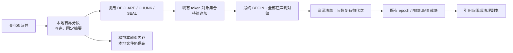
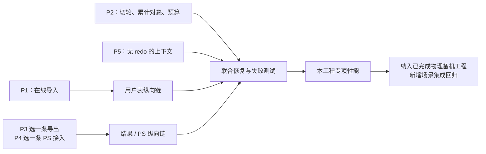

# 详细设计源码复审记录

> **2026-10-04 版本说明：历史版本记录。** 文内“当前/尚未完成/通过”和源码路径均属于记录时点；旧 PS 定义/参数/重建方案不再适用，原失败与测量不改写为新版本成绩。 现行职责见[详细设计](detailed-design.md)和[PS 删除与 cursor 关联](ps-transfer-removal-and-cursor-attach.md)，最新状态见[任务跟踪 E63/E64](task-tracker.md)。下文保留历史事实，不作为现行实施清单。

> **2026-09-24 范围更正：** 当前状态以[任务跟踪](task-tracker.md)及[详细设计 §4.2](detailed-design-before-ps-removal.md#42-long_data-暂不支持close-保留原范围)为准。用户明确 LONG_DATA 分片送参的迁移本阶段暂不支持，proxy 仅感知既有特殊错误码。下文旧 LONG_DATA 支持目标、前缀确认／proxy 缓冲重放要求及相应估算不再作为交付范围；真实源码和历史测试记录保留，但不代表当前支持承诺或运行期拒绝已落实。约束拒绝归 W10，CLOSE、普通参数和 FETCH 不连带排除。 **后续 CLOSE 特例：2026-09-27 用户已确认 proxy 留存 CLOSE、RESUME 后优先补发；该例外及本地证据以主设计 §4.2、W10/E26 为准，V05 外部验收仍独立。**

> 商用范围（2026-09-18 用户确认）：本特性只面向 **standby transfer → 物理备机升主 → 新主 SQL RESUME**。local startup 模式不在新增设计、实现、功能验收和预算内；文中现有本地实现仅作为代码复用依据。
>
> 工程背景（用户确认）：物理备机对接已完成；当前工程只补齐临时表、待 FETCH 结果及相关资源能力，后续再纳入包含物理备机能力的 MySQL 工程，做新增场景的集成回归。

初审 2026-09-18；收敛复审及独立深审 2026-09-19（第 8～14 节）· 审核对象：[主设计](/Users/a1234/project/mysql-server-8022-preserve-port/design/workshops/temp-table-preserve/detailed-design.md)。

生产源码基线：`d086954338c30f773627a290d42020b0793a5db2`；开始整合前的文档 HEAD：`21a9ceb3cafe5c626f125818d9c64922a7802de7`。工作目录为独立 `mysql-server-8022-temp-table-preserve`，分支为 `codex/preserve-trx-temp-table-standby`。

第 1～7 节记录初审，第 8 节记录前轮收敛；**当前 V11 准入与验收补齐见第 17 节及主设计，V10 实施清单见第 16 节，V9 性能修订见第 15 节；固定接入与清理边界沿用第 14 节；第 1～13 节的 RESET DRAIN 扩展要求已撤回，只保留历史背景**。历史“已修订”不等于后来深审没有进一步发现，也不等于内核实现已修复。

## 1. 复审结论与证据边界

**设计已形成可开展受控原型的主路线；尚不能据此放开生产准入或宣布功能完成。** 本轮审查关闭的是设计中的接口误用、语义遗漏和职责重复；P1～P5 的实际可行性仍需要代码与运行证据。

审核采用三条只读源码复核线：用户表/undo/增量，流水线/接管/清理，结果/PS/协议。先核对真实接口，再审查生成的完整文档；主会话修订后，各线对相关章节做了针对性复核。最后一处 PS 错误优先级修订由主会话直接核对 `set_parameters → execute_loop` 源码完成。没有让子代理编辑源码或文档。

本轮没有运行原型、编译、GUnit、MTR、proxy 联调或真实物理升主。没有将旧工作区的测试结果算成本 worktree 的证据；proxy 源码也未在本仓库验证。文档中的 API/格式名称为建议，不能当作已经存在的函数。

## 2. 成稿发现的问题及已完成修订

| 编号 | 原稿问题与源码依据 | 已写入主设计的修订 |
| --- | --- | --- |
| D01 | 三类事务形态不能同时表达 BEGIN 未访问引擎和无活动事务资源会话；现有 [bundle 校验](/Users/a1234/project/mysql-server-8022-preserve-port/sql/preserve_trx_bundle.cc:450)把 engine shape 与 payload 绑定 | §3 将 SQL 事务状态与 engine_recovery 正交；分类贯穿 capture、receiver、promotion、RESUME，兼容字段单向派生 |
| D02 | 无事务用户表仍受非空 trx、非零 owner 限制；[捕获](/Users/a1234/project/mysql-server-8022-preserve-port/sql/preserve_trx_temp_table.cc:2987)与 [temp_dml_history 分支](/Users/a1234/project/mysql-server-8022-preserve-port/sql/preserve_trx_temp_table.cc:2295)不能仅解除判空 | §5.1 新版资源 owner、真实 trx owner 可选；证明无 live undo后走无 undo image/DD 分支，跳过 reconnect 并 reseed；不得伪造业务事务 |
| D03 | 原稿将 final 补传接入 Phase 1 final admission，但它只处理 RECORD_LOCK，且[提前 join](/Users/a1234/project/mysql-server-8022-preserve-port/sql/preserve_trx.cc:20442) | §4 明确 Phase 1 只预构建/预传；捕获 owner 移交；最终资源封存进入已有 Phase 2 target worker 的计数、deadline、取消和 join |
| D04 | active 页集合切换不足以处理线程本地迟到 staging；[staged 条目](/Users/a1234/project/mysql-server-8022-preserve-port/storage/innobase/trx/trx0temp_preserve.cc:219)没有版本，[序号晚于 staging](/Users/a1234/project/mysql-server-8022-preserve-port/storage/innobase/trx/trx0temp_preserve.cc:4869) | §6.2 要求实际捕获同步域绑定版本、在途交接和旧版本拒绝；增加确定性交错测试，保留共享 system-temp 的多事务 undo owner |
| D05 | undo 映射涉及变长编码及单页容量，不能当字段原地 patch；[原生记录边界](/Users/a1234/project/mysql-server-8022-preserve-port/storage/innobase/trx/trx0rec.cc:182) | §5.3/P1 保留完整记录布局及单记录容量验证；本轮进一步查实 offset 本身不引起压缩长度增长，见第 8 节 R02；复用原生 rollback |
| D06 | “复用状态查询取得轮次证明”不成立，现有 [QUERY_EPOCH_STATUS](/Users/a1234/project/mysql-server-8022-preserve-port/sql/preserve_trx_transfer.cc:19089)只查 epoch 终态 | 初稿曾增加 ROUND_MARKER；本轮改为批次内保留本地分段文件，删除 marker 和特殊 SEAL，见第 8 节 S01；普通 SEAL ACK 仍不升级为回收证明 |
| D07 | 通用 clone/重开不能保证独立读取；[TempTable 不支持 clone](/Users/a1234/project/mysql-server-8022-preserve-port/storage/temptable/src/handler.cc:945)，[MEMORY single_instance](/Users/a1234/project/mysql-server-8022-preserve-port/storage/heap/ha_heap.cc:98)有不同 share 语义 | §7.2/P3 比较最小 reader 适配，先证明命令安全点读取；新子功能拟 startup-only，从创建游标时启用，明确旧游标晚于迁移作业的生命周期 |
| D08 | Field unpack 与 hash join decoder 不是外部工件的受检解码器；[varstring unpack](/Users/a1234/project/mysql-server-8022-preserve-port/sql/field.cc:6753)直接使用包内长度 | §7.1 明确 begin/end、列/行/段边界、溢出、容量和总量验证，准确耗尽，BLOB 寿命；P3 加损坏输入拒绝 |
| D09 | 只保存会话当前字符集会改变旧结果；[sender 缓存 result_cs](/Users/a1234/project/mysql-server-8022-preserve-port/sql/protocol_classic.cc:2916)，[时间值读取当前时区](/Users/a1234/project/mysql-server-8022-preserve-port/sql/field.cc:5006) | §7.1 分开 Field charset、每代结果的输出 result_cs、当前 THD 状态；新增打开后 SET 字符集/时区再迁移的对照 |
| D10 | 直接安装 cursor 指针缺 owner；直接 new sender 缺 metadata 初始化；[原 owner](/Users/a1234/project/mysql-server-8022-preserve-port/sql/sql_cursor.cc:117)、[二进制 bitmap](/Users/a1234/project/mysql-server-8022-preserve-port/sql/protocol_classic.cc:3603) | §7.3 明确恢复 owner/发送器/工件引用及静默初始化，缓存属于 cursor 生命周期；§11.2 列 protocol 薄接口 |
| D11 | 延迟 prepare 的“编号+SQL 壳”不能执行协议解码；[协议先读 Item_param](/Users/a1234/project/mysql-server-8022-preserve-port/sql/protocol_classic.cc:2644)，[旧 reprepare 依赖 LEX](/Users/a1234/project/mysql-server-8022-preserve-port/sql/sql_prepare.cc:3244) | §8 明确真实参数运行态、合法最小 LEX、指定编号工厂、冲突与 PS 配额、局部状态表及唯一完成 prepare 桥接 |
| D12 | 只在 execute 的 close_cursor 失效旧结果太晚；[成功 reprepare 的交换](/Users/a1234/project/mysql-server-8022-preserve-port/sql/sql_prepare.cc:3305)和旧副本析构也关闭结果 | §8 改为实际原生分支的关闭/替换点；分别验 prepare 失败和 prepare 成功后 execute 失败 |
| D13 | 激活后失败不应一律画为 TAINTED，也不能完整 unwind 后重试；[原终止分支](/Users/a1234/project/mysql-server-8022-preserve-port/sql/preserve_trx.cc:25007)与[事务 rollback](/Users/a1234/project/mysql-server-8022-preserve-port/sql/transaction.cc:402)职责不同 | §9.2/§10 区分激活前重试与激活后终止；事务终止后清理本次表/PS/结果，完全成功才终态 ATTACH_ROLLED_BACK，否则 taint；资源子 journal 嵌入现有 runtime |
| D14 | 源 RESET 延迟清理[明确假设无临时状态](/Users/a1234/project/mysql-server-8022-preserve-port/sql/preserve_trx.cc:13903)，只保留 token 不够 | §9.3 区分 RESET DRAIN、COM_STMT_RESET、断连；先恢复原 owner 再 runnable，延迟清理持有描述/引用，验源恢复 DML/FETCH 与旧工件删除并发 |
| D15 | 无写入但有 ReadView/锁不能归 NONE，也不满足现有 [redo resurrection 条件](/Users/a1234/project/mysql-server-8022-preserve-port/storage/innobase/trx/trx0preserve.cc:1164) | §3/P5 明确 READ_CONTEXT 为新增、待原型证明的恢复依据；不编造 undo，不将其预算当作已有能力 |
| D16 | 候选 prepare 在 execute_loop 前会遮盖待报 LONG_DATA 错误；[原前置检查](/Users/a1234/project/mysql-server-8022-preserve-port/sql/sql_prepare.cc:2956)先报 STMT_ERROR | §8 把桥接放在原 execute_loop 前置检查之后，保留 STMT_ERROR/账号限制优先级；P4 增加待报错误与源表删除同时出现的对照 |

上表“已修订”表示设计文字和验收条件已改变，**不表示这些内核缺口已经由生产代码修复**。二次定向复核确认用户表与接管分支的前次设计问题关闭；结果/PS 线最后提出 D16，由主会话核对源码后补入。

## 3. 仍须通过的原型门槛

| 门槛 | 必须取得的运行证据 | 失败时的处理 |
| --- | --- | --- |
| P1 在线用户表导入 | 目标已有空间/undo；变长历史引用、原生 COMMIT/ROLLBACK、NONE 用户表及再次 Preserve；每阶段失败可清理 | 修改导入表示/窄接口，不以冲突拒绝宣称完成在线需求 |
| P2 多轮增量 | 真实 staged/rotate/发送交错；shared undo；累计声明与有效代次、final 预留；有界内存/磁盘和可终止 final | 修订版本/留存合同，不把频繁全量回退当增量完成 |
| P3 结果 reader/codec | 三种内部存储、原顺序、类型和拒绝损坏输入；源游标不动，寿命安全，结果代次可复用 | 先限定为安全点导出并实测成本；不能隐含更换原生引擎或重跑 SQL |
| P4 PS/协议 | 原编号、参数/错误、无输出恢复、sender 上下文、后续 EXECUTE 与 owner 交接；未修改客户端 | 完善恢复工厂和唯一桥接，不能要求客户端重新绑定 |
| P5 无 redo undo 的引擎上下文 | 原 ReadView、锁、隔离与物理 fence 一致；原生身份、清理、组合资源 | 重新评审恢复依据；保持限制可见，不无证据放行 |

这些是开发前应先证明的难点，不是可以在主链交付时省略的尾项。prototype 通过后，在当前工程完成新增资源的联合失败测试和内核性能验证；随后纳入已完成物理备机对接的 MySQL 工程，做新增场景的真实升主及端到端性能回归。

## 4. 实现收敛审查

- 一个版本化语义合同贯穿各层；SQL 事务状态、引擎恢复与资源清单分开，但不能独立漂移。
- 复用现有本地捕获、carrier、TABLE/dict 物化和 native undo 接回；新增在线导入计划，不复制恢复器。
- 使用一条源格式基线/整页增量路线；结果只使用有序值工件路线；不同时实现多套完整表示。
- 复用既有 wire、prepared registry、Phase 2 worker、attach intent；本轮通过保留本地分段文件进一步删除 ROUND_MARKER，不新建网络/epoch 框架。
- 新资源 handle 和子 journal 有实际内容/清理职责，不重新承担全局 ownership 裁决。
- 重复循环、转换、codec 与 I/O 放专属文件；必要状态分支和薄接口留在现有权威位置，不为新文件比例搬整个主流程。
- 第 2/3 阶段的单次全量纵向链仅是中间里程碑；持续增量、全部选定结果载体及线上冲突解法均不能被隐含删除。

## 5. 范围补充审查：仅 standby transfer

用户在成稿后明确：真正商用链路是 standby transfer、物理备机升主和后续 SQL RESUME，local startup 不考虑。已将该约束置于所有 workshop 文档开头，并调整主设计 §1.0、准入、阶段、验收及预算说明。

现有本地 capture/materialize/undo/cleanup 保留为复用证据；本次不新增 local startup 的资源准入、启动扫描/重放、启动预留或功能验收。公共 helper 仍须隔离 OFF/非 standby 路径。启动期固定开关的 startup-only 与 local startup 恢复模式已明确区分。

原预算没有可直接扣除的独立 local startup 生产包；原时间评估中的共同验证项已改为 standby 商用链路和共享入口隔离，旧数值标注为待重核的历史参考。P1～P5 的在线导入、增量、结果/PS 与引擎上下文难点仍属于 standby transfer，不随范围澄清删除。

## 6. 项目背景纠正：物理备机对接已完成

用户进一步确认：物理备机对接已完成，当前工程只增加临时表、待 FETCH 结果及相关资源支持，之后纳入包含物理备机能力的 MySQL 工程。已据此删除主设计中将完整 HA 升主视为未交付的推断，并同步修订实施阶段、集成验收和预算说明。

本工程源码/脚本未包含某个物理能力或仅提供模拟入口，不能推断另一工程的完成状态。既有物理备机对接按用户确认作为项目事实；本轮没有运行新增资源场景，仍如实记录这些增量的验证进度。代码量只算资源增量，后续集成适配/专项回归单列，不重算已完成的基础设施。

## 7. 本轮文档核验

文档检查覆盖 workshop 本地链接目标及行号范围、代码围栏成对、占位符和行尾空白；Git 检查覆盖变更范围及 diff whitespace。Mermaid 做文本结构检查，没有宣称已由图形渲染器逐图渲染验证。

实际检查结果：10 篇 Markdown 的 354 个本地链接目标/行号检查通过，31 个 Mermaid 代码块的围栏配对通过（其中主设计 7 张图）；未发现占位符或行尾空白。`git diff --check` 通过，sql/storage/libmysql/sql-common 相对固定生产基线无差异。

本轮只修改 workshop 文档及导航，未修改生产内核源码。基线、原先预算与本轮新增合同分别记录；约 6,500～11,000 行旧预算不能当作含持续增量和新发现合同的完整上限。下一步应依主设计第 12 章执行受控原型，得到真实接口证据后重算生产增量及测试工作量。

## 8. 2026-09-19 再次源码审核与收敛建议

### 8.1 结论和证据范围

**主方向可以继续，但不宜照旧稿同时实现全部机制。** 这轮确认 4 项需修正的源码事实/合同，并直接收敛每轮确认与回收设计；reader、PS 核心复用和目标身份分配以较小原型选择一条路径，不同时建设多个方案。

复审起点为文档提交 `498b21a824f`，生产源码仍是 `d086954338c30f773627a290d42020b0793a5db2`。三个独立、只读审查分别核查结果/PS、增量/传输、在线导入；主会话复核以下关键源码并修改文档。物理备机对接作为已完成基础，只核查新增资源如何接入；不扩 local startup。所有“可行候选”均未运行原型，不能当作实现已完成。

### 8.2 需要修正的四项

| 编号 / 优先级 | 具体问题与影响 | 源码与本次修订 |
| --- | --- | --- |
| R01 / P1 | 只把“最终仍需的对象”列入 manifest，会在部分 FETCH 后关闭/重执行、旧代次已预传时被 source 判 CORRUPT | `begin_token_objects` 要求全部已声明对象及原 descriptor；§6.3 分开累计 transport 清单与当前有效资源清单，已声明旧段完成封存但不恢复。[检查](/Users/a1234/project/mysql-server-8022-preserve-port/sql/preserve_trx_transfer.cc:11813) |
| R02 / P2 | 旧稿将 offset 变化视为引发历史指针反复增宽，夸大 P1 所需算法；但真实的页号/table_id 增宽与单页容量仍不能忽略 | roll_ptr 低 32 位固定存储、offset 在低 16 位。§5.3 改为先约束目标地址与编码宽度、再布局回填；新增页越过宽度边界仍须有界重算。[压缩](/Users/a1234/project/mysql-server-8022-preserve-port/storage/innobase/include/mach0data.ic:411)、[布局](/Users/a1234/project/mysql-server-8022-preserve-port/storage/innobase/include/trx0undo.ic:52) |
| R03 / P1 | “目标当前未占用 source ID”不构成安全保留；未来原生发号可能追上被导入 ID，破坏在线其他会话 | 当前绑定只查 cache 并赋 source ID；分配器水位递增。§5.3 要求原生发号或完整未来分配保护，P1 加导入后持续 CREATE；不在复制仍推进时擅自写共享 dict 页。[绑定](/Users/a1234/project/mysql-server-8022-preserve-port/storage/innobase/trx/trx0temp_preserve.cc:1532)、[分配](/Users/a1234/project/mysql-server-8022-preserve-port/storage/innobase/dict/dict0boot.cc:112) |
| R04 / P2 | “校验原结果元数据”若实现为拒绝新 EXECUTE 的变化，会增加原生没有的限制 | validate_metadata 的实际代码在列数变化时置 METADATA_CHANGED，返回 false。§8 区分旧结果保真与未来执行的新元数据，保持原生处理；不能按该函数陈旧注释添加错误。[实现](/Users/a1234/project/mysql-server-8022-preserve-port/sql/sql_prepare.cc:3244) |

R03 是由当前分配器行为推出的静态冲突风险，尚未运行碰撞复现；不将其说成已观察到的生产故障。以上“修订”均为设计文字修正。

### 8.3 可以直接采用的简化

**S01：首版去掉每轮 ROUND_MARKER，保留可重发文件到批次裁决结束。**

现有传输本来就维护累计对象集合。DECLARE 追加对象；相同 descriptor 可复用；最终 BEGIN 检查全集并继承 sealed 状态。源端把本轮页写成有界文件后即可释放对应内存，文件本身暂不因 ACK 删除，因此无需创建新的“对端已保护整轮依赖”证明。

可以删除：marker 编码/枚举、特殊 SEAL 路由、每轮保护句柄、marker 重试证明和相应状态测试。仍须实现：页版本/切轮、段格式、最终依赖、资源校验、预算与取消；没有删去真正增量捕获。[source 追加](/Users/a1234/project/mysql-server-8022-preserve-port/sql/preserve_trx_transfer.cc:11784)、[相同 sealed 继承](/Users/a1234/project/mysql-server-8022-preserve-port/sql/preserve_trx_transfer.cc:8234)、[BEGIN 清理规则](/Users/a1234/project/mysql-server-8022-preserve-port/sql/preserve_trx_transfer.cc:17632)。

代价是源/目标累计磁盘与对象数量，包括失效代次。现有 receiver 按完整对象长度累计额度，seal 不释放；因此预传阈值必须给 final 留额度，不能等“在途窗口”满后才收口。[计费](/Users/a1234/project/mysql-server-8022-preserve-port/sql/preserve_trx_transfer.cc:3209)、[seal](/Users/a1234/project/mysql-server-8022-preserve-port/sql/preserve_trx_transfer.cc:9932)。没有磁盘配额和可终止策略，这项简化就不闭合。首版不加 RETIRE_OBJECT；若规模实测要求批次内 GC，再单独评审。

**S02：一个 ImportPlan、一条安装路径，已有 FSEG/native undo 不重写。**

native 安装已经新建目标 FSEG inode，但仍要求指定 undo 页和槽可用；只补真实缺口。source 身份可保留时是同一映射计划的 no-op，不能发展出另一套准备/清理路径。SQL 侧持有计划，InnoDB 侧执行计划；不分别维护两份映射真值。[FSEG 安装](/Users/a1234/project/mysql-server-8022-preserve-port/storage/innobase/trx/trx0temp_preserve.cc:1232)、[slot](/Users/a1234/project/mysql-server-8022-preserve-port/storage/innobase/trx/trx0temp_preserve.cc:5640)。

### 8.4 原型后只选一条的简化

| 候选收敛 | 为什么值得先做 | 什么证据决定保留 |
| --- | --- | --- |
| S03：统一窗口导出结果，减少三引擎 reader 适配 | mysql_execute_command 成功到 cursor open 前可用同一最终 handler 扫描，不接触已有 FETCH 位置 | 普通 EXECUTE 多一次完整扫描/编码/I/O 是否可接受；三引擎、落盘、顺序、失败及额度测试。[窗口](/Users/a1234/project/mysql-server-8022-preserve-port/sql/sql_cursor.cc:233) |
| S04：迁移边界借用原 handler | 无平时全量成本、无第二 TABLE；不重新 SELECT | 导出后恢复扫描也可能失败，须证明不破坏源继续业务；否则不用该路线，不添加游标修复器。[handler 状态](/Users/a1234/project/mysql-server-8022-preserve-port/sql/handler.cc:2946) |
| S05：恢复态窄接入已有 reprepare 核心 | 原函数已有备份交换、失败回退、静默 prepare、参数移交、warning 处理，可省第二套候选准备流程 | 最小旧描述替代 LEX 读取，owner 参与同一交换/析构；保留原错误顺序、参数解码及 metadata 行为。[核心](/Users/a1234/project/mysql-server-8022-preserve-port/sql/sql_prepare.cc:3156) |
| S06：目标 table/index 统一原生发号 | 少维护“保留 source ID”专属预留和未来发号保护 | 既有 fence/升主后合法分配，或已证明隔离的 namespace lease；table_id/undo 转换及撤销成立，转换成本可接受 |

结果 P3 的选择是 S03、S04 或原独立 reader 三选一。独立 reader 也先复用 `open_tmp_table` 的三引擎共享入口，而不是从 clone 缺失直接推导三个全新 reader；但跨 spill 转换必须连同额外 TABLE 的生命周期验证。[共享入口](/Users/a1234/project/mysql-server-8022-preserve-port/sql/sql_tmp_table.cc:2183)。不把所有候选一起列入生产预算。

S05 不是直接调用未经修改的 reprepare：它仍读取原 LEX。应比较窄适配和专属桥接的实际改动后只保留一条；原参数运行态、原 ID 工厂、静默 sender 和 owner 不能省。静态阅读尚不能证明任何候选已经优于现方案的运行成本。

另一项暂缓优化是取消逐轮应用屏障，仅按页版本归并迟到段。它有机会减少 rotate 的等待，但必须补基线、无闩锁 dirty 分支、页复用及 final 收齐证明；首版先保留线性轮次合同，不同时实现第二套增量调度。

### 8.5 仍不能删除的工作

| 必需职责 | 为什么不是过度设计 |
| --- | --- |
| 在线目标空间/undo 冲突转换及原生 COMMIT/ROLLBACK | 现有指定页/slot adopt 不能覆盖繁忙备机；不能用重启或永久碰撞拒绝替代 |
| NONE、TEMP_ONLY、PERSISTENT/READ_CONTEXT 的分类 | 空闲资源会话、临时事务、无写入 ReadView/锁有不同真实状态；不能全伪装成一条持久写事务 |
| 原 ID、参数运行态、LONG_DATA、旧结果 owner | EXECUTE 包解析早于执行树恢复；省掉这些就无法做到客户端零修改 |
| 结果值/元数据/位置与 EOF 保真 | 直接重跑 SQL、保存网络包或重建另一份当前结果都不等价 |
| 联合恢复与失败撤销 | 表/PS/结果不随 trans_rollback 自动全部清理；必须知道实际安装到哪一步 |

READ_CONTEXT 的补充应留在既有事务恢复模块，通过窄接口供资源编排使用；资源-only 也进入既有 token/lease。V2 复用 mandatory semantic TLV，NONE 的改动还包括物化前 DML policy 的非空 trx 条件和原 attach 无条件增加的 SQL 事务标志，不能只改最后 attach。[policy](/Users/a1234/project/mysql-server-8022-preserve-port/sql/preserve_trx.cc:3468)、[调用](/Users/a1234/project/mysql-server-8022-preserve-port/sql/preserve_trx.cc:24047)、[flags/tracker](/Users/a1234/project/mysql-server-8022-preserve-port/sql/preserve_trx.cc:3492)。

资源子 journal 只记录本次安装进度/引用，复用 staged TABLE 和分项清理报告；不用新增持久化子日志。联合 handle 沿已有 attach lease 移交，不重造 registry、scheduler 或事务恢复框架。[现有表清理合同](/Users/a1234/project/mysql-server-8022-preserve-port/sql/preserve_trx_temp_table.h:455)、[lease 移交](/Users/a1234/project/mysql-server-8022-preserve-port/sql/preserve_trx_promotion_prepared.cc:1251)。

### 8.6 实施与预算收敛

先把“已经可删的机制”从计划中删除，再为未决项做最小对照。用户表、结果/PS 可在各自门槛通过后走纵向链，最后汇入同一增量和联合恢复；不必等待所有原型才开始任何集成，也不允许最终漏掉 P1～P5 的组合。

目前可明确减少的是一套每轮确认/磁盘回收机制，以及原方案中误判的 offset 递归增宽问题；PS/reader/目标发号的节省取决于原型。六组新文件仍可作为职责边界，循环、codec、I/O、导入转换及清理放在专属文件，旧路径只接窄入口。

**这不足以把旧 6,500～11,000 行区间直接改成一个更小数字。** 旧账未覆盖全部增量与新增形态，本轮也没有函数级原型。后续按最终选定的一条路线统计“复用代码不计、新逻辑、旧接口改动、测试”，删除方案不计费，已有物理备机基础不计费；再报告行数与运行成本，不能用文件数量假装代码量已确定。

### 8.7 本轮核验

三条只读审查线对修订稿作了定向复核，指定范围内均未再提出必改项；主会话另核对并补入 NONE 的前置 policy/flags 和复用现有安装进度。这只表示本轮静态问题已反映到设计，P1～P5 尚未关闭。

本轮仅修改主设计、增量专题、复审记录和入口导航；没有修改生产代码。核验为源码静态交叉检查、本地链接及行号范围、代码围栏、占位符/空白与 Git diff；未运行编译、原型、GUnit、MTR 或物理备机联调，Mermaid 未进行图形渲染验证。

## 9. 2026-09-19 独立上下文深审与 V3 修订

### 9.1 审查方式与结论

按用户要求，三名只读 subagent 从独立上下文分别核查临时表/undo 正确性、结果/PS 原生语义、流水线/性能与实现收敛；主会话交叉核对关键源码，再修订设计。审查起点为文档 HEAD `c3e6b65782b1fc9c135a887a71feb476ffa0b831`，生产基线未变。

深审提出七项问题，其中两项可能改变功能结果，五项涉及生命周期或规模成本；随后补核了 READY 与物理 handoff 的先后约束。以下均为静态源码与设计推导，未运行复现或原型。V3 修正合同，并把剩余证明明确放入 P1/P2/P4；不将“文档修订”写成“内核缺陷已修复”。

### 9.2 七项发现与一项时序补充

| 编号 / 优先级 | 触发条件、影响与源码证据 | V3 的处理及待验证点 |
| --- | --- | --- |
| E01 / P1 | 恢复后绑定 actual 值再无条件 reprepare，可能改变保留的 resolved 类型。原生 DATE 参数允许整数而不重准备，10101 的 DATE 与数值比较可命中不同日期，DML 也可能改变目标行。[原生例外](/Users/a1234/project/mysql-server-8022-preserve-port/sql/sql_prepare.cc:2875)、[actual 赋型](/Users/a1234/project/mysql-server-8022-preserve-port/sql/item.cc:3535) | §8.1/8.2 分开 resolved/actual；内部重建保留当前执行树形成时的语义，真实 reprepare 另按原条件。有限描述是否充分、父表达式推导前如何注入、跨进程依赖失效判断仍须 P4 |
| E02 / P1 | RESUME A→COMMIT→事务外新建 B→同一事务更新 A/B，可出现多个 data space。现有按空间重复捕获全事务 undo，owner 含空间身份；放宽重复 claim 后，第二次接回仍被 m_noredo 占用拒绝。[捕获](/Users/a1234/project/mysql-server-8022-preserve-port/sql/preserve_trx_temp_table.cc:3065)、[claims](/Users/a1234/project/mysql-server-8022-preserve-port/sql/preserve_trx_temp_table_carrier.cc:1208)、[接回](/Users/a1234/project/mysql-server-8022-preserve-port/storage/innobase/trx/trx0temp_preserve.cc:5755) | §5.1 改为每空间 image、每真实事务唯一 undo 图；清单引用、合并映射、capture/install/reconnect/cleanup 只做一次。P1 验证多空间再次 Preserve 和单空间关闭后的寿命 |
| E03 / P2 | 部分 FETCH 后原表被删，普通 EXECUTE 先关闭旧 cursor 再访问表；原稿在候选 prepare 失败时统一保留旧结果，与原生不符。也不能一收到 EXECUTE 就统一关闭，因为早期错误仍可能保留。[前置分支](/Users/a1234/project/mysql-server-8022-preserve-port/sql/sql_prepare.cc:2956)、[普通关闭](/Users/a1234/project/mysql-server-8022-preserve-port/sql/sql_prepare.cc:3384) | §8.3 按原生分支保留关闭/替换点及参数 reset；晚失败不复活旧结果，早 reprepare 失败按原生返回。P4 对照错误、cursor、LONG_DATA 与计数，而不只查返回码 |
| E04 / P2 | 同一 system-temp space 的 dirty 页遍历并复制给全部 undo descriptor，pending 查找线性；共享额度还可能连带标记其他 owner 退化。最终筛选不消除同步捕获成本。[遍历](/Users/a1234/project/mysql-server-8022-preserve-port/storage/innobase/trx/trx0temp_preserve.cc:4695)、[存页](/Users/a1234/project/mysql-server-8022-preserve-port/storage/innobase/trx/trx0temp_preserve.cc:1932)、[额度](/Users/a1234/project/mysql-server-8022-preserve-port/storage/innobase/trx/trx0temp_preserve.cc:2735) | §6.2 直接路由已证明归属页，共享/待判定页保留单份有界带版本 staging 和引用；派生页索引、单次计费、单 owner 超额隔离。P2 证明页回收复用、owner 变化和在途版本 |
| E05 / P2 | 累计 M 个对象时，final 逐对象线性查找产生二次比较；CHUNK 又复制 record/manifest 并验证全集，增量段越多越慢。[final](/Users/a1234/project/mysql-server-8022-preserve-port/sql/preserve_trx_transfer.cc:11813)、[record](/Users/a1234/project/mysql-server-8022-preserve-port/sql/preserve_trx_transfer.cc:10769)、[stage](/Users/a1234/project/mysql-server-8022-preserve-port/sql/preserve_trx_transfer.cc:14723) | §6.3 在原 token record 内派生索引，提供有寿命保护的单对象接口；DECLARE 增量校验、BEGIN 集合校验、CHUNK/SEAL 单对象校验，final 一次索引比对。P2 做 M/2M 与 chunk 数规模对照，不新增 registry 或 ACK |
| E06 / P2 | materialize 将所有 image 读入 retry map，undo 也整读/复制，清理重复整读；大镜像并发恢复可能突破只按网络计算的预算。[image](/Users/a1234/project/mysql-server-8022-preserve-port/sql/preserve_trx_temp_table.cc:3687)、[undo](/Users/a1234/project/mysql-server-8022-preserve-port/sql/preserve_trx_temp_table.cc:3720)、[清理](/Users/a1234/project/mysql-server-8022-preserve-port/sql/preserve_trx_temp_table.cc:4038) | §5.4/6.5 采用不可变重试原件、独立安装文件、有界页接口；映射/索引/descriptor、并发 worker 与所有同时存在文件都计费。P1 验证恢复、重试、清理；提前到 prewarm 不是解决方案 |
| E07 / P2 | 现有 FSEG 安装单 mtr 遍历页、使用共享临时空间分配路径；进一步核实指定页 helper 仅用 fragment 槽，满即失败，不能描述为已经支持任意大链。[循环](/Users/a1234/project/mysql-server-8022-preserve-port/storage/innobase/trx/trx0temp_preserve.cc:1223)、[槽限制](/Users/a1234/project/mysql-server-8022-preserve-port/storage/innobase/fsp/fsp0fsp.cc:2611) | §5.5/P1 同时验证 fragment/extent 容量、分批安装/撤销、先预留再发布；跨批保存物理地址并重新取页，不持有裸 header/inode 指针。保留 slot/FSEG/接回分别撤销的进度，不只给旧循环加 commit |
| E08 / 时序补充 | 原文要求 READY 已取得目标原生 ID，但 live dict 分配只能在 handoff 允许后；现有流程却先查 READY 再 pin/handoff。final facts 同代改摘要会被判 CORRUPT，pin 续期又会合法重算 canonical。[顺序](/Users/a1234/project/mysql-server-8022-preserve-port/sql/preserve_trx_promotion.cc:3664)、[冲突](/Users/a1234/project/mysql-server-8022-preserve-port/sql/preserve_trx_promotion_prepared.cc:1543)、[续期](/Users/a1234/project/mysql-server-8022-preserve-port/sql/preserve_trx_promotion_prepared.cc:1805) | §4/9.1 区分源格式预热资格与 ADOPTING 内目标准备，持有同一 PImpl；目标凭据绑定稳定源身份及输入，commit_gate_adopt/begin_attach 强检查。消费既有物理工程的 handoff 上下文；不新建 HA provider，也不让 RESUME 临时另选身份 |

E07 修正了深审中的初步表述：已有单 mtr 循环并不证明当前能安装无上限大链；fragment 容量与长临界区是两个需要分别验证的问题。E08 是新增资源设计的先后约束，不是对已完成物理备机工程报告一个已复现的死锁。

### 9.3 收敛后的最小实现边界

| 收敛处 | 保留的唯一真值 / 机制 | 不再重复建设 |
| --- | --- | --- |
| 用户表与 undo | 同一 ImportPlan：多空间 image、一个事务 undo 图、合并目标映射 | 每空间复制全事务 undo；SQL/InnoDB 各一份映射 |
| 增量捕获与传输 | 原捕获登记与 token 对象集合内的派生索引；原分段协议/ACK | 全 owner 整页扇出、每 chunk 全清单副本、第二个 capture/transfer registry |
| PS | 一个恢复工厂与一条窄桥接；原 prepare/reprepare 生命周期负责交换、参数和析构 | 无条件重准备兜底；复制另一套 execute_loop；同时实现多个桥接 |
| 接管 | 原 PImpl/ADOPTING/attach lease；源事实与目标凭据分别表达 | 新全局状态机、重绑 final facts、RESUME 再选一份 ImportPlan |
| 安装与清理 | 原生 FSEG/undo 接回及已有分项进度；专属文件负责有界转换/I/O | 第二套运行期 undo/rollback；整镜像内存重试备份 |

这轮补的是复用代码的真实限制，并收紧重复处理。仍按主设计六组专属文件承载新逻辑；token 索引、PS 原生分支、FSP 预留等必要旧接口不能为了新文件比例而复制出去。没有运行函数级原型，因此不把旧 6,500～11,000 行预算改成更小的承诺，也不把新增发现直接逐项叠加为从零实现。

### 9.4 修订后复核与证据范围

主会话修订后，将主设计交回三条审查线作限定范围的只读复核。临时表线与流水线线在指定范围内无新增必改项；PS 线指出“早 reprepare 已关闭结果后，关闭前检查不能又写成尚未关闭”，已据此修正表格与图中原生续点。该结论只针对本轮设计一致性，不关闭 P1～P5 的运行门槛。

本轮检查通过：10 篇 Markdown 的 464 个本地链接目标及源码行号范围、38 个 Mermaid 代码块的围栏、占位符/行尾空白，以及 `git diff --check`。变更仅为 README、详细设计、复审记录和增量专题四篇文档；暂存区为空，HEAD 仍为上述审查起点，sql/storage/libmysql/sql-common 相对固定生产基线无差异。

本轮仅修订 workshop 文档，没有修改生产源码，未运行原型、编译、GUnit、MTR 或物理备机联调。Mermaid 以文本结构检查为准，未作渲染验证。所有改动保留未暂存；遵守用户指令，不主动提交、推送或撤销既有提交。

## 10. 2026-09-19 后续深审与 V4 合同补齐

### 10.1 新发现与证据边界

再次使用三条独立上下文只读审查线，分别核对结果协议、临时表原生导入、流水线及文件/lease 寿命。主会话复核后确认两项需要补充的合同，以及两项应写死的实现前置条件；用户授权后修订文档。没有读取 proxy 工程，也没有运行复现，不能把以下推导说成已完成物理备机工程的已证实故障。

| 编号 | 可触发的问题及源码依据 | V4 修订 |
| --- | --- | --- |
| E09 / P1 | LONG_DATA A 已追加，B 已写出但未进入命令体；CLOSING 静默丢 B。只靠完整响应无法确认无响应命令，新主可能只恢复 A，客户端 EXECUTE 又不重复发送 LONG_DATA。CLOSE 豁免还会使“最大已执行序号”产生空洞。[丢弃](/Users/a1234/project/mysql-server-8022-preserve-port/sql/sql_parse.cc:1688)、[命令序号](/Users/a1234/project/mysql-server-8022-preserve-port/sql/preserve_trx.cc:12213)、[客户端不重送](/Users/a1234/project/mysql-server-8022-preserve-port/libmysql/libmysql.cc:2116) | 主设计 §3.1/4.2：逐会话连续执行前缀，绑定 PS/最终摘要；旧端冻结后 CLOSE 不再改资源；proxy 保留并仅接续确定未执行的尾段。RESET 同旧连接先对账旧队列，不增加全局停转屏障 |
| E10 / P2 | pin 只续准备期限；转换可能用较晚 operation deadline 在 client TTL 后才提交。已采用条目自然过期时，现有 reaper 没有 rollback owner，只能 taint。[pin](/Users/a1234/project/mysql-server-8022-preserve-port/sql/preserve_trx_promotion_prepared.cc:1805)、[提交](/Users/a1234/project/mysql-server-8022-preserve-port/sql/preserve_trx_promotion_prepared.cc:2049)、[过期](/Users/a1234/project/mysql-server-8022-preserve-port/sql/preserve_trx_promotion_prepared.cc:2626) | §9.1.1：保留 client TTL，gate 取较早有效期限，提交前再检查；清理有独立有限预算。沿原 cleanup lease/reaper 取得真实 owner，准确区分 NONE、未变更 reservation、真实 rollback 和未闭合债务 |
| I01 / 实现前置条件 | READY 后现有 finalize 可立即按目录删除 staging；PImpl 若仅存路径将失去工件。[清理](/Users/a1234/project/mysql-server-8022-preserve-port/sql/preserve_trx_transfer.cc:15736)、[删除](/Users/a1234/project/mysql-server-8022-preserve-port/sql/preserve_trx_transfer.cc:2915) | §6.4/9.1.2：READY 前放入同一 prepared key 独立持有的稳定私有路径；有界复制/直接组装、校验和额度交接。不是仅加逻辑引用，也不新增文件 registry |
| I02 / 实现前置条件 | ACTIVE 发布后 prepared reaper 可立即 reset 资源。若 THD/PS 接手晚于发布就可能误删活跃文件。[发布](/Users/a1234/project/mysql-server-8022-preserve-port/sql/preserve_trx_promotion_prepared.cc:2208)、[reset](/Users/a1234/project/mysql-server-8022-preserve-port/sql/preserve_trx_promotion_prepared.cc:2643) | §9.2：活跃文件、状态和额度先移交真实 owner；commit_attach guard 检查，再发布 ACTIVE。失败按 actual journal 终止，不能回到可重试 token |

I01/I02 是将 V3“实际持有与转交”写成精确先后条件，不把一个尚未实现、原本可正确补入的步骤报告为已复现代码缺陷。临时表线未新增确认的问题；此前多空间 undo、FSEG 容量、页捕获等 P1/P2 门槛继续保留。原生 temp table purge 已有跳过分支，不把未成立的 purge 怀疑列入发现。

### 10.2 本轮选定的收敛办法

- 命令确认挂原会话记录和后端控制返回；只接续确定未执行的尾段，不重放已执行查询或全部 LONG_DATA。源 scheduler 原序号不可直接复用，P4 先证明与 proxy 的映射；尚需推进的其他会话不被全局 barrier 阻断。
- 沿原 gate/attach/cleanup lease、reaper 和 bootstrap abort 补窄接口；不另建到期管理器。NONE 不假报回滚；未变更 reservation 精确归还原 owner，混合批次不复用已经回滚释放的指针。[既有归还原语](/Users/a1234/project/mysql-server-8022-preserve-port/storage/innobase/trx/trx0preserve.cc:1550)。
- READY 前选择稳定私有文件；ACTIVE 前移交 THD/PS。源格式原件与可写安装副本分开，复制、额度峰值及删除失败计入真实成本；第一版不增加 FD-only/硬链接等并行路线。
- 主体仍放六组专属文件；原准入/完成记录、状态转换 guard 和实际 owner 移交保留必要薄接点。未运行原型，不以本轮新增条目直接重估行数或声称旧预算完整。

### 10.3 实现与验收状态

主设计 §13 已补充 A/B 与冻结的确定性交错、CLOSE 前缀空洞、RESET 旧 TCP 尾段、其他会话解依赖、client TTL 跨越及 cleanup/attach 竞争，以及 READY/ACTIVE 后立即清理。P1/P4/P5 分别承担资源清理、命令协议和真实引擎 owner 的证明；这些仍是待实现/待运行要求。

修订后再交回协议线与流水线/所有权线定向复核。两线要求补准以下边界：proxy 停转服从源端最终冻结许可，不能挡住该会话自身所需的 COMMIT；连续无响应命令在缓冲额度内要主动确认前缀，不能等待尚未发出的 EXECUTE；完整 unwind 后已经过期，则先沿原 abort 接口归还 ADOPTED_LOCKED，再由原 reaper 清理。主会话已将这些细化落入正文、图和验收表，并澄清命令边界字段与摘要的计算顺序。

本轮只修改 workshop 文档；没有修改生产代码，未运行原型、编译、GUnit、MTR、proxy 联调或真实物理升主。最终检查通过：10 篇 Markdown 的 500 个本地链接目标/源码行号范围、41 个 Mermaid 代码块的围栏，以及占位符、行尾空白和 `git diff --check`。Mermaid 未作图形渲染验证。变更仅为本 workshop 六篇文档；暂存区为空，HEAD 仍为 `c3e6b65782b1fc9c135a887a71feb476ffa0b831`，sql/storage/libmysql/sql-common 相对固定生产基线无差异。保持未暂存，不提交或推送。

## 11. 2026-09-19 BLOB 引用图与多语句整包合同修订

### 11.1 发现与取舍

本轮先作三条独立上下文只读审核，再由主会话交叉核实；用户授权将发现纳入主设计后，补充以下两项。结果/PS、期限清理及 READY/ACTIVE 移交未确认其他新增必改项。审查仍是静态源码与设计推导，未运行损坏复现、协议测试或物理升主。

| 编号 | 证据与影响 | V5 处理 |
| --- | --- | --- |
| E11 / 正确性合同遗漏 | 当前行与 undo 旧字段均保存 external BLOB 引用；只改页面头、字典或当前行，会让回滚重新恢复源空间地址。no-redo 临时表 LOB 删除也按引用取页。[undo 解码](/Users/a1234/project/mysql-server-8022-preserve-port/storage/innobase/trx/trx0rec.cc:1865)、[LOB 删除](/Users/a1234/project/mysql-server-8022-preserve-port/storage/innobase/lob/lob0del.cc:63) | 主设计 §5.3.1：同一 ImportPlan 覆盖当前值、旧值及实际 LOB 页面格式。每个 data space 导入独立目标 space，保留内部页号/布局；与 undo 地址映射分域。P1 补正反例和其他会话隔离断言 |
| E12 / 命令边界需要明确 | 原多语句循环逐子句重新准入；一包可先产生效果，再以 4020 终结。不能因最后错误码就把它当整包未执行。[子句 retire](/Users/a1234/project/mysql-server-8022-preserve-port/sql/sql_parse.cc:1948)、[当前测试合同](/Users/a1234/project/mysql-server-8022-preserve-port/mysql-test/suite/preserve_trx/t/standby_transfer_phase2_multistatement_autocommit.test:35) | §4.3 根据用户完整命令要求选择：顶层包获准后按原生规则终结，不能因迁移在子句间截断。既有部分结果＋4020 必须原样完整交付、禁止整包补送，不计透明成功。P4 证明同包继续执行权与事务身份更新 |

E12 不等于源码在包内直接快照：packet inflight guard 和 idle 检查仍存在。新增目标与当前 scheduler 行为之间的差异已明确，不能假设只增加 E 序号就够。也不把“部分结果＋4020 的保护处理”当作另一个可交付的透明模式。

### 11.2 实现收敛与验证门槛

BLOB 只补同一导入计划中的引用角色与格式转换；数据页布局保持，可省去通用数据页重排器。按格式保留 offset/version、长度、非地址标志与哨兵；支持矩阵内若存在 partial LOB undo，独立保存的地址/历史也要校验。普通 PageConverter 会改 LOB 事务字段，不整体复用。P1 覆盖当前值和历史回滚，不能只检查迁移后 SELECT。

命令包继续使用原 THD 命令记录与 scheduler。包级准入的线性化点、同包后续子句不再重新竞争迁移准入、COMMIT→BEGIN 真实事务身份更新、HARD/冻结等包终结必须共同证明；不新增 SQL 拆包重放、子句迁移或第二个 scheduler。OFF/非本特性路径保留原合同；旧多语句测试与新模式测试分开记录。

两条审查线在编辑前只读核验了拟定修订，主会话将其提出的 BLOB 格式/页号分域、包继续执行权/事务身份细化纳入正文。最终文稿交回两条审查线定向复核，主会话已按反馈收窄两处措辞：合法保留的源身份不算漏转换；原生 SQL 错误与迁移引入的中途 4020 分开。两条线其余指定范围无新增必改项。P1/P4 仍未运行通过，本轮不重估内核行数。

### 11.3 本轮变更范围

本轮修订主设计、复审记录、README、需求范围和 proxy 专题五篇文档；增量专题保留此前修改。检查通过：10 篇 Markdown 的 524 个本地链接目标/源码行号范围、43 个 Mermaid 代码块围栏、占位符/行尾空白及 `git diff --check`；未进行 Mermaid 图形渲染验证。暂存区为空，HEAD 仍为 `c3e6b65782b1fc9c135a887a71feb476ffa0b831`，sql/storage/libmysql/sql-common 相对固定生产基线无差异。没有修改生产代码，不暂存、提交或推送；未运行原型、编译、GUnit、MTR、proxy 联调或真实物理升主.

## 12. 2026-09-19 整命令留存额度与既有接入边界复核

三条独立上下文只读复核后，主会话对照源码逐项确认；用户授权将必要补充纳入设计。本轮只确认一项新增进展条件遗漏，另外两项是既有合同的接入澄清和实现收敛，不作为新发现的生产缺陷。

| 项目 | 核实结果 | V6 修订 |
| --- | --- | --- |
| E13 / P2 进展条件 | 一次 LONG_DATA 是完整逻辑命令；服务端先拼完所有 packet，再执行。若其长度大于可用留存额度，proxy 半包背压而旧主等剩余数据，主动前缀确认也无法推进。[发送](/Users/a1234/project/mysql-server-8022-preserve-port/libmysql/libmysql.cc:2893)、[拼包](/Users/a1234/project/mysql-server-8022-preserve-port/sql-common/net_serv.cc:2077) | §4.2/6.5：开始接收正文前，在命令边界保证完整命令及后续分片的有界留存额度，不依赖自身 E 回收；区分额度与执行准入。P4 覆盖单命令跨水位、原合法包长上限、聚合/流式转发及共享额度；不强制全包驻内存或客户端缩块，不新增逐块 ACK |
| I03 / 事务身份接入 | 已有 source store/floor 及 publication 冲突检查，但当前调用位于模拟分支，strict 仍拒绝 TEMP_ONLY；不能用模拟或启动 helper 证明新增生产接入。[调用](/Users/a1234/project/mysql-server-8022-preserve-port/sql/preserve_trx.cc:15505)、[准入](/Users/a1234/project/mysql-server-8022-preserve-port/sql/preserve_trx_transfer.cc:6931) | §9.1/P1：保留真实 owner_trx_id，复用既有物理 handoff 身份保证，在有界校验阶段核验行/undo/LOB 各历史角色，发布同步域只复核 ID/XID、水位及计划校验凭据。冲突拒绝仅作违反保证的安全负例；不另建事务 ID 重写器，不判定已有物理工程有故障 |
| S04 / 封存顺序收敛 | 原流程先完成 scheduler readiness，再确定 target 集合并进入 target worker；正文已有必要 COMMIT 不被暂停和新事务重新取得依赖的要求。[顺序](/Users/a1234/project/mysql-server-8022-preserve-port/sql/preserve_trx.cc:20195) | §4.1 增阶段图，限定 final 并行发生在原调度收尾之后；P4 将 A 包内 COMMIT→BEGIN→UPDATE、B 等锁、A 下一 COMMIT 释放 B 合为确定性交错。不再增加提前冻结算法或额外屏障 |

协议线在编辑前复核修订措辞，补准两点：额度保证覆盖 proxy 开始接收/留存，而非只覆盖向旧后端转发；额度许可不授予执行权，冻结后确定未执行命令仍按尾段合同接续。主设计与 proxy、增量专题的摘要保持一致。其余既有 BLOB、游标/PS、原生回滚和捕获边界在本轮指定审查范围内未确认新增必改项，P1～P5 仍需运行证据。

本轮只修订主设计、复审记录、入口及 proxy/增量专题五篇文档；未修改生产代码，未运行原型、编译、GUnit、MTR、proxy 联调或真实物理升主。不暂存、提交或推送，不调整代码量预算。

## 13. 2026-09-19 捕获寿命与既有验收合同细化

本轮三条独立审查及主会话源码复核未确认新增必改设计缺陷。用户授权将复用边界、减少实现分支的选择和组合验收纳入正文；以下沿用既有原型与生命周期合同，不新增问题编号或主流程。

| 细化点 | 源码依据与 V7 取舍 |
| --- | --- |
| I03/P1 完整事务 ID 冲突检查 | publication helper 仅扫 rw_trx_list，READ ONLY 临时写事务却有 ID 并位于 rw_trx_ids/rw_trx_set。§9.1 要求同一锁域覆盖完整原生索引，再核验精确归属及幂等状态；可复用旧 TEMP_ONLY 构造器的索引判重。P1 增这种目标 owner 的冲突负例，必须受控拒绝，不把模拟路径风险说成生产故障。[索引判重](/Users/a1234/project/mysql-server-8022-preserve-port/storage/innobase/trx/trx0preserve.cc:887) |
| 捕获 owner 从创建起固定 | participant 已贯穿 drain，close_phase1 不清捕获，abort/finalize 才清理。§4.1/9.3 改为原会话/epoch 从创建起持有实际句柄，Phase1/Phase2 worker 受保护借用，省去阶段间移交及失败分支；关闭访问覆盖页捕获和排队回调，锁外等待后退登记，资源引用与 THD pin 分开避免 teardown 等待环。此选择取代历史记录中的阶段间移交要求，不改变目标 PImpl→THD/PS 的移交。[现有关闭边界](/Users/a1234/project/mysql-server-8022-preserve-port/sql/preserve_trx.cc:10560) |
| P4 共享额度与 COMMIT 解锁 | readiness 未完成时，非旧事务命令已可能被拒绝，而旧事务 COMMIT 仍获准。因此增加 A 持锁、B 等锁、C 拒绝尾段占额度的交错，验证必要 COMMIT 仍可收完并解锁、C 留存和总量仍正确；不新增额度调度器。[拒绝与准入](/Users/a1234/project/mysql-server-8022-preserve-port/sql/preserve_trx_standby_phase2_scheduler.cc:1881) |

主设计增加捕获句柄关系图及对应验收，同步入口和增量专题；其余历史记录保留版本背景。本轮仅修订这四篇文档，未修改生产代码、未运行原型/编译/GUnit/MTR/proxy 联调或物理升主，不暂存、提交或推送，不据此调整代码量预算。

## 14. 2026-09-20 固定升主入口、SQL RESUME 与清理范围

用户明确物理备机工程已集成、在线升主阶段固定：① `preserved_trx_prepare_before_trx_sys_init_for_physical_promotion()`；② `trx_lists_init_at_db_start()` 内既有 Preserve hook；③ `preserved_trx_adopt_ready_epoch_for_physical_promotion()`。新主 SQL 入口是④ `Sql_cmd_resume_preserved_transaction::execute()`。主设计 §1.0.1 新增完整接口表与时序图，§9/§11/§12/验收按该边界同步；新增资源准备只能在原入口内部完成，不另要求外部准备、激活、轮询或清理阶段。

主会话核对 SQL execute、record/handoff strict 分派及共同 prepare；独立只读审查核对 prepare/pin/candidate、原生事务复活与 adopt 的实际调用顺序。②直接调用是 `trx_preserve_startup_resurrection_finish()`（trx0trx.cc:1097），不是用户表/PS 安装入口；下层已有 candidate 应用继续复用。名字中的 startup 不能据此扩大 local startup 范围。各资源/引擎形态的增量仍须原型证明；当前接口存在不等于新增资源已实现。

此前两条只读源码审查确认：RESET 专用 deferred 分支与正常 transfer 失败恢复不是同一调用方式；原启动 root 清理同步执行。依据用户已明确的范围，删除 §4.2 RESET 旧流对账、§9.3 RESET 资源恢复和专用清理、P4/验收中的对应要求；历史 D14 及 V4～V7 相关要求不再适用。保留 COM_STMT_RESET、普通失败的原所有权裁决和运行期资源收尾，不将撤回的 RESET 方案换名保留。

新的 §9.3 允许纯新增垃圾文件留至重启后异步删除：运行期 owner 已闭合、有效原件/活跃数据已隔离时，不因仅剩 unlink 待办而否定成功或保留完整安装 journal；磁盘实际占用继续计量。现有同步整根删除不能直接搬后台，须在原进程启动接点隔离新增资源旧目录，复用后台执行设施和删除原语；这是待实现的文件回收接线，不属于在线升主的新阶段或 local startup 恢复。

另将前轮两处复用表达校准：§4.1 明确 close guard 的退化标记不是排空成功，超时不能提前释放实际 owner；捕获验收拆开“普通作业 cutoff 后业务尾部仍被捕获”和“真正 Phase 1 pipeline join 后句柄供 Phase 2 使用”，不把线程 join 写成业务仍在途的暂停点。

本轮只修订文档与用户要求的记忆附注；未修改生产代码，未运行编译、GUnit、MTR、proxy 联调或真实升主。新代码预算仅撤回 RESET 职责，原混合项标注待重核，不声称已经得出新的总行数。不暂存、提交或推送。

## 15. 2026-09-20 捕获并行、receiver READY 与 RESUME 性能修订

用户授权将源端 worker/瓶颈审核完善后纳入主设计，并要求重点考虑 receiver 快速 READY 和低延迟 SQL RESUME。主会话与三条只读审查线核对源捕获/调度、receiver/prewarm、升主/RESUME；本轮是源码成本与设计修订，没有实测性能结论。

| 核实事项 | V9 的收敛选择 |
| --- | --- |
| 页变化由业务线程 stage/drain；TEMP prebuild 却由 DRAIN 协调线程串行完成，现有 Phase 1 worker 只有 lock/binlog 两类 | §6.6 将 TEMP 接入原 worker ready 队列，保留原 single-flight 与单消费者；补齐仅 TEMP 启用、baseline 完成、credit/公平性/取消/join。跨 owner 并行、同 owner 有界批次，不承诺同空间天然并行 |
| 旧 prebuild 记录代次后再修改可能失效；adopt/tail-seal 失败可尝试全量 baseline，但不支持历史等仍前置拒绝 | §6.2 明确持续 rotate 尚未实现；捕获 owner 持续到原 final 边界，不以重复重建充当增量 |
| undo 全文件采集持全局捕获锁，另有多 owner 复制和线性查找 | §6.2 纳入锁外有界发现/读取、短锁版本合并、索引和准确计费；必须先证明 undo 图、页复用和在途捕获完整性，不能直接移锁 |
| 现有提前 OBJECT 准备主要面向 lock/binlog，新增对象若只接 token 准备会积压到 final | §9.1.3 复用原 OBJECT/prewarm 池逐段准备源格式候选、稳定私有文件与结果索引；final 才冻结闭包，完整句柄一次交付 PImpl。候选不每轮 publish_prewarmed，不以非零 LSN 判断 final |
| ACK/accepted 不代表 READY；同代预热摘要不可反复修改，完整哈希也不能由分段 SHA 拼成 | 保持原 sequence/完整性/lease 裁决；明确 FINAL→ACCEPTED→READY 的观测边界、重复工作与全量哈希尾部。缺件/排队不得提前 READY |
| 目标 ID 相关准备只能在③，旧恢复 helper 又含整镜像读取与 undo 安装 | §9.2.1 以原 PImpl/handle 移交承载准备成果；receiver 和③完成大字节工作，④保留真实 THD/事务/MDL/PS 绑定与原激活。首个 DML/FETCH 不得隐含全量初始化；③全页转换也受总切换性能门槛约束 |
| 多 worker 可能只增加全局锁等待、磁盘争用或总保留字节，单大 token 仍慢 | §13.2 固定负载后分别调并发，检查队列/实际并发/锁/I/O/限速及慢 token；同时验收正常业务、READY、③、④和首次业务，不用阶段搬家代替达标 |

成稿交回三条审查线定向复核，进一步收紧：admission/result/publication 结算后才提交同 owner 下一批；前置不支持状态直接拒绝的精确范围；区分真正 FINAL 与更晚 COMMIT 的计时；复用已有 SEAL 证明而非默认重复哈希；③完成页准备与④绑定的边界；ATTACHING 内恢复有效准备凭据后才可归还可重试状态；MDL/savepoint/列数/会话变量的绑定维度。

详细源码锚点和拟实施合同保留在主设计 §6.2/6.6/9.1.3/9.2.1/13.2。实现继续沿原三处物理在线升主入口和真实 SQL execute；不增加 RESET DRAIN、local startup、外部升主阶段或新资源管理器，不在本轮重估代码量或给出未经测量的毫秒承诺。

本轮只修订主设计、复审记录和 README，保留其他既有工作区修改。校验覆盖 10 篇 Markdown 的 620 个本地链接目标/源码行号范围、49 个 Mermaid 代码块围栏、锚点及固定范围约束；没有进行 Mermaid 图形渲染验证。未修改生产源码、参数或客户端，未运行编译、原型、GUnit、MTR、性能基准或真实升主；不暂存、提交或推送。

## 16. 2026-09-21 批量 review 复核与实施清单修订

用户授权按批量 review 的复核结论合理修订。主会话与三条只读审查线先对照 V9 与源码，再将有效补充纳入 V10；没有将“修订后可开工”解释为 P1～P5 已经通过。上一轮 late sweep 收尾、receiver runnable 与分批续作细化继续保留。

| 原 review 项 | 核实后采用的处理 |
| --- | --- |
| 1 / 7 / 8 | 补包事实消费者和命令矩阵，点名 RESET_CONNECTION/QUIT；已有连续前缀失败出口在第 0 步串联。commands.empty 不是唯一冻结判定，不强制新容器，不将所有多语句测试一律反转 |
| 2 | 记录②的原生 release 前置与独立 Preserve startup 状态；不由本树缺少外部调用方推断已集成升主崩溃，不增加外部阶段 |
| 3 / 6 / 16 | 将③转换、剩余 client TTL、proxy/RESUME 余量纳入原型；完善负载、采集及统计落点。保留原期限和最终规模验收，不引入续期协议，不把旧 phase2_slo 标志当全链路达标 |
| 4 / 9 | 显式列 DB_ROLL_PTR、页头/FSEG/index/LOB 身份；只改实际变更且属本导入图的引用。临时页 checksum 与 XDES_ID 按真实格式；漏改负例由导入检查拒绝；正常导入后校验回滚数据。目标 ID 复用原 ibt 同步/水位/reservation 的窄候选 |
| 5 / 15 | 按测试组列保留/扩展/改写/新增及当前工程/后续集成范围，关联原生入口的门控、源形态和行为对照。584 是文件数而非行为通过数；不以文本计数代替覆盖，不机械为每入口建三个文件 |
| 10 | 点名族/准入、预算/观测、执行/结果、取消/收尾四组。当前已有 release 校验，风险是未来扩展遗漏，不能称现存 TEMP 静默漏计 |
| 11 / 12 / EOF 附注 | 工厂使用目标运行态，禁止源协议指针和在文本 RESUME 中误绑定协议；诊断状态沿既有会话合同明确边界。已有 cursor arena/owner 保留，补完整 FETCH wrapper 后参数/计数/位置联合封存 |
| 13 / 14 | 现有 worker 外层已有通知，原文已要求实际排空、超时保 owner。只补完整通知链与等待谓词、生产者交接责任，不增加唤醒线程或 capture manager |
| 其余附注 | 区分序号与 capture 引用，关闭点改为3384；多空间成因已有覆盖。新增对象不要求重启恢复，但不限制私有文件只能位于ibtmp；预算按职责/接口复算，不强制逐文件行数配额 |

源码补核还排除了两项错误复用：`preserve_trx_transfer.h:807` 是 receiver control-only epoch 发布，不是 proxy 连续前缀接口；新 PS 的 `m_active_protocol` 默认 nullptr，不能据此推断恢复后必然 reprepare。4020 可按 messages/comp_err 编号规则静态核实，仍不作为运行证据。具体字段和调用链锚点保留在主设计对应章节。

本轮只修订主设计、复审记录与 README；保留其他既有修改。文档校验覆盖本地链接/行号范围、章节锚点、代码围栏及固定范围约束，未作 Mermaid 图形渲染验证。新增格式、入口适配、测试和基准扩展均尚未实现；未运行编译、GUnit、MTR、性能基准、proxy 联调或真实升主。不暂存、提交或推送。

## 17. 2026-09-21 V10 review 取舍与 V11 修订

按用户授权，将三条只读审查线及主会话对当前源码核实后的有效内容纳入 V11；不是照搬外部 review 的严重性评级。生产源码与 `d086954338c` 相同，HEAD 及专题中的其他 SHA 属于文档历史时点，不据此改写历史基线。

| 核实结果 | 本轮处理 |
| --- | --- |
| drain 4017 / handoff 4020 的意见错误 | 按 comp_err 规则与脚本核实为 drain 4020 / handoff 4023；主设计优先写符号，错误本身不证明整包未执行 |
| 大 undo 跨 2^16 必然失败的推导错误 | 补临时旧 roll_ptr 的真实 5/6/7/8 字节边界；保留真实单记录容量门槛，区分 READY 前预检与③实际布局证明 |
| E 线性化、包权威及五消费者已列为 P4 | 只细化首个交付件的字段/写入者/同步域；CLOSE 仅接续已证明未执行的尾段，不新建服务端队列 |
| 命名 PS、A 路线提前工件合同有缺口 | 明确未闭合命名 PS 能力时的迁移资格；若选 A，明确 PS owner、引用/计费和附加工件失败边界，不吞原生错误、不自动换路线 |
| PS 工厂、NONE 及规模有具体清单缺项 | 补直接/间接 LEX 消费者、计数配对、preview.trx gate 和目标固定开销计费；仍由原型证明接口充分性 |
| 行为/交付矩阵需要补索引 | 增加 temp DDL/后续等锁、编码边界、命名 PS/A 工件、同 token 恢复、崩溃及兼容/部署用例；READ_CONTEXT 明确依赖 P5，GEOMETRY/TIMESTAMP 按原 Field 语义验证 |
| TTL、rotate、prepared 目录隔离已有明确合同 | 不重复扩机制；目标重启行点名③后④前，事务身份异常与空间重定位分开；不新增在线 GC、RESET DRAIN 或 local startup 恢复 |
| 配置和链接可更精确 | 显式继承源/目标 log_bin 与 GTID ON；pin、checksum 与两个指标链接指向直接调用/字段位置 |

本轮只修订详细设计、复审记录及 README，保留其他既有修改。文档中的新接口、编码、准入及测试均为待实施合同；静态源码核查和文档校验不表示 P1～P5 已通过。未改内核源码，未运行编译、原型、GUnit、MTR、性能基准或实际 proxy/物理升主；不暂存、提交或推送。
