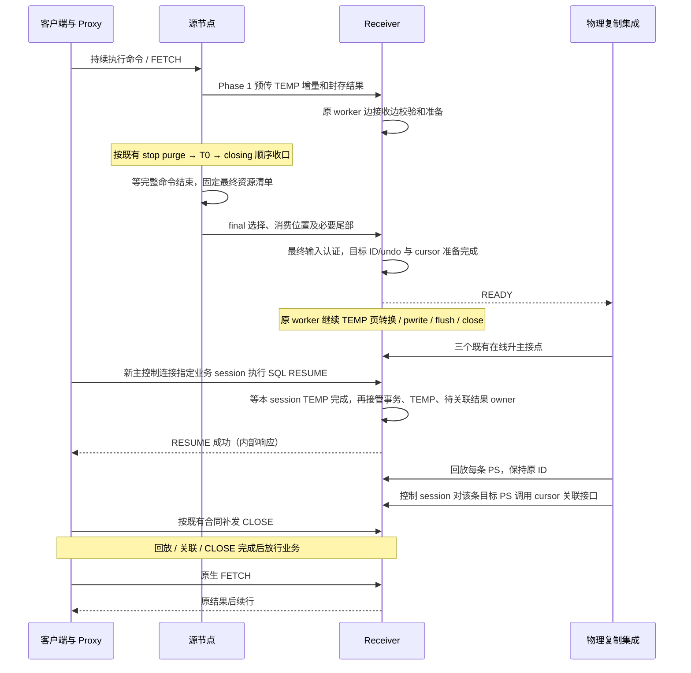
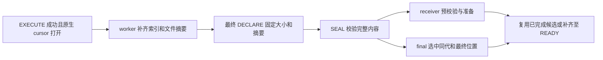
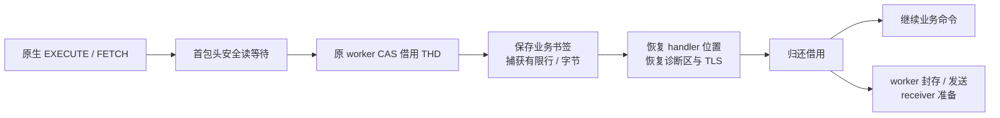

# 用户临时表与待 FETCH 结果的跨主 Preserve/Resume 详细设计

更新：2026-10-09。源码基线为 `ha_preserve_trx` 的 `f540116c322e` 加 E107 接口修正、E109 默认值调整、E111 Phase1 cursor 捕获及 E112 receiver 私有镜像 I/O 收敛改动。
E128 当前实施将 TEMP 最终 I/O 完成屏障移至每个 session 的 SQL RESUME，详见[后台完成合同](async-temp-resume-barrier.md)。本节优先于旧版“全部准备必须在 READY 前完成”的描述，验证进展见任务跟踪。
本文描述当前代码与集成合同；PS 本体迁移删除前的完整细则保存在[历史设计](detailed-design-before-ps-removal.md)，不再作为当前实施要求。

## 1. 目标、分工与边界

目标是在 standby transfer、物理备机在线升主、新后端 SQL RESUME 后，继续使用用户临时表，并从服务端最后正常完成的 FETCH 批次之后继续取既有结果。客户端到 proxy 的连接保持，客户端不改；重新建立的是 proxy 到服务端的后端连接。

**本工程保存临时表和结果资源；物理复制工程恢复 session 上下文并在 SQL RESUME 后回放 PS。** 本工程不再捕获、编码、传输或重建 PS 的 SQL、参数、历史解析输入、依赖闭包。带 cursor 的 PS 也不例外：保留的是它的结果及归属，不是 PS 本体。原生 MySQL PREPARE/EXECUTE/参数处理不删除。

| 内容 | 当前责任 |
| --- | --- |
| 事务与用户 InnoDB 临时表、DATA/undo、表元数据和目标资源 | 本工程，复用现有 Preserve/Resume 主链 |
| 已物化的 Classic cursor 结果、列元数据、顺序、代次和 FETCH 位置 | 本工程，使用独立结果文件、清单、reader/cursor |
| session 上下文、PS 回放、参数及相关状态、源 PS 到目标 PS 的权威映射 | 物理复制工程已提供的能力；外部源码当前不可访问，不能据此反推功能缺失 |
| 回放后关联源 PS 对应的保留 cursor | 本工程提供显式接口，外部工程逐条调用 |
| 前端不断、特殊错误码切换、CLOSE 留存与补发、失败断连 | 既有 proxy/物理复制集成合同 |

用户表只使用 InnoDB，字符集兼容及通用 THD session 转移由物理复制工程负责。本工程仍须保存结果文件自身的列格式和值，不把结果类型信息误删为 PS 参数。

不扩展 local startup、RESET DRAIN、X Protocol 或打开中的 HANDLER。进程启动后的异步垃圾文件清理不是 local startup 资源恢复。普通 SELECT 的客户端取行不是服务端下一条 FETCH 命令；未完成的 SELECT/CALL/存储程序按原完整命令和超时规则处理，不迁移调用栈或半包响应。

### 1.1 固定接点

在线升主仍只进入以下已有阶段，不增加外部回调、资源就绪屏障或专用线程池：

1. `preserved_trx_prepare_before_trx_sys_init_for_physical_promotion()`。
2. `trx_lists_init_at_db_start()` 中已有 Preserve hook；**在线升主也会调用该函数**。
3. `preserved_trx_adopt_ready_epoch_for_physical_promotion()`。

**strict physical promotion 的部署前提仍是源/目标两端 `log_bin=ON`、`gtid_mode=ON`**；[promotion gate](../../../sql/preserve_trx_promotion.cc) 强制核验。TEMP_ONLY/NONE 或没有 binlog cache 不豁免此条件；本地 no-bin MTR 不是线上 no-bin 升主支持证据。

SQL RESUME 的入口是 `Sql_cmd_resume_preserved_transaction::execute()`。PS 回放及 cursor 关联在其成功返回之后，由外部集成调用，不能写成新增的物理升主阶段。

### 1.2 当前部署默认值（2026-10-08）

按已执行大压力模型的配置，保留以下三项服务端默认值：

| 参数 | 默认值 | 生效与边界 |
| --- | --- | --- |
| `rds_preserve_trx_memory_budget_bytes` | `2147483648`（2 GiB） | 通用 heap lease 额度，不是启动时预分配的内存；不改变 inflight 或结果捕获文件额度。 |
| `rds_preserve_trx_transfer_runtime_profile` | `PROMOTION_PREPARE` | 复用现有 profile 的并发、分块和 binlog prefix 预准备策略；源端 DRAIN 和 receiver epoch 分别冻结本机配置。 |
| `rds_preserve_trx_temp_id_namespace` | `ON` | 启动只读；Preserve OFF 时仍生效，物理写入方须遵守同一持久 ID 上限合同。 |

结果捕获不再保留独立 enable 参数；在 Preserve ON、standby transfer、Classic 协议的支持条件下，自动于 DRAIN Phase1 启动。DRAIN 前只维护结果身份、原输出字符集、位置有效性及安全读等待状态，不创建捕获工件。旧配置中的 `rds_preserve_trx_result_capture_enable` 必须移除。

源/目标如有显式配置，以其覆盖值为准。已有压测的历史配置与结果保持原样；默认值变更不构成新的性能达标证据，不修改超时、验收阈值或升主接点。

## 2. 端到端顺序



“收到文件”“Final ACK”“READY”“物理采用”“SQL RESUME 成功”“cursor 已关联”是不同事实。Final ACK 不自动代表资源准备完毕；SQL RESUME 成功也不代表外部 PS 已回放。业务放行是外部集成责任，不能凭 pending 计数推断内核存在通用业务拦截器。

| 阶段 | 要做的工作 | 不得据此推断 |
| --- | --- | --- |
| DRAIN 前 | TEMP 沿用既有逻辑；cursor 仅维护轻量身份和位置状态 | 不为结果迁移扫描、编码、分配捕获缓冲、创建文件或发号 |
| Phase 1 | 既有 worker 在安全读等待边界分段捕获，恢复业务位置后归还；复用封存结果并推进 receiver 准备 | 已采到数据不等于已发送或已准备 |
| stop purge 后到 T0 | 在原 Phase1 截止期内，对已有目标执行最后有限结果采样轮，并推进发送／准备 | 不增加新 cohort，不重开首次门槛，不是 PS 定义增量检查 |
| Phase 2 closing / final | 完整命令边界取最终 DATA/undo/结果状态，认证同代候选并补尾 | 不能只按文件存在、最大序号或成功发包宣布完整 |
| receiver READY | 最终输入已认证，目标 ID/dictionary/私有 undo 和 cursor reader/sender 已准备；TEMP 页处理可继续 | 不承诺 TEMP 最终 I/O、原生发布或外部升主已完成 |
| SQL RESUME | 等本 session TEMP completion 成功后，按 journal 接管事务、TEMP 和待关联结果集合 | 不创建 PS，不做 SQL 解析或参数安装 |
| 外部回放 / attach | 取得真实目标 PS，绑定最终选定的 cursor | 不能通过 SQL 相似或回放顺序猜映射 |

## 3. 恢复合同与资源身份

引擎恢复依据和会话资源是两条维度。[recovery_contract](../../../sql/preserve_trx_recovery_contract.h) 区分 `REDO_RESURRECTION`、`TEMP_UNDO`、`READ_CONTEXT`、`NONE`，并认证 SQL 事务状态、owner trx 和 freeze 边界；不能因为没有永久表 redo 就遗漏临时表事务或结果会话。

- MIXED/TEMP_ONLY 保持原事务和临时 undo 的一致归属；跨多个临时空间的 undo 属于同一真实事务。
- READ_CONTEXT 保留原恢复依据，不伪造持久写事务。
- NONE 表示无需恢复引擎事务，不等于 SQL 事务状态必为空；`sql_transaction_active/explicit_begin` 独立保存。它可以带临时表/结果资源，无活动事务的会话不凭空开启业务事务。
- 仅有普通 PS、不含这些资源的会话不生成 PS 工件，沿既有 session-only/control 路线处理，不能再强求一个 PS token。

资源归属由原 epoch/token、恢复合同、最终元数据摘要及 prepared key 固定。结果独立清单保存源 `statement_id`、`generation`、文件大小/摘要、`fetch_count`、`fetch_limit`；清单按源 ID 严格递增，正常最终边界要求 `fetch_count == fetch_limit`。列定义和结果行在文件中，清单不保存 PS SQL 或参数。

开放状态由“最终清单选中的开放结果”和 cursor snapshot 校验表达；不另造一个 PS 描述符。已读完所有行但原生尚未探测 EOF 的 cursor 仍须保留。

## 4. 用户临时表：保留现有 DATA/undo 主链

删除 PS transfer 不改变用户临时表算法或支持矩阵。[temp_table](../../../sql/preserve_trx_temp_table.cc)、[temp_prebuild](../../../sql/preserve_trx_temp_prebuild.cc)、[temp_receiver](../../../sql/preserve_trx_temp_receiver.cc) 编排 SQL 层；[trx0temp_preserve_*](../../../storage/innobase/include/trx0temp_preserve_import.h) 负责 InnoDB 导入。

### 4.1 捕获与一致性

捕获保存 DD/列索引信息、空间数据、行及索引身份、AUTO_INCREMENT、事务级临时 undo 和相应恢复依据。源 DATA 按空间保活，undo 按真实事务 owner 路由，不向同一 system-temp 的全部事务广播页副本。

DATA、undo、DD、anchors 和所有权必须在同一受控命令边界固定。临时 undo 不是纯追加文件：旧页链接、偏移、anchors、截断和页复用都可能变化；新旧历史不能只按长度或 page LSN 判断相容。

首次 DATA COPY 的输出是新建的独占空文件；完成原有读页和校验后，只对实际全零的内部页省去写入，保留末页写入以建立完整长度。上界使用 scan.start 对源 FD 固定的长度，不能使用可能过期的元数据或再次查询的空间大小。ROUND、FINAL 及复用旧 writer 的路径仍覆盖所有回调页，包括把旧非零内容改成零；原同步、摘要和失败清理不变。这项优化减少实际写入，不省略扫描或完整性验证。

BLOB/JSON、生成列、无显式主键的隐藏行标识、索引与 undo 中的历史外部引用继续经过原映射和校验。正确恢复当前行不代表 ROLLBACK/SAVEPOINT 已正确；不能删掉历史值、页归属、roll pointer 或隐式索引引用验证。

### 4.2 目标身份与已有临时表隔离

receiver 可以已有只读会话和用户临时表。导入必须保留它们及后续分配，不能覆盖源 space ID，也不能通过重启备机消除冲突。

当前 [ID contract](../../../sql/preserve_trx_temp_id_contract.h) 在 OPEN/ACK 协商已启动校验的命名空间；[InnoDB ID policy](../../../storage/innobase/include/trx0temp_preserve_id.h) 为进程内临时 table ID 分配高位区间，index ID 保持原生 32 位编码约束。导入可在独占保留的新空间内保留源 index ID，不能无条件宣称所有 ID 都原值照搬或都重新编号。

一个 ImportPlan 统一管理源→目标空间、表及相关 undo/行引用转换。原生字典、目标 image、LOB、undo、FSEG 与统计/SQL 元数据分批准备，存储页和 undo 的转换不能移入升主或 RESUME。

在线升主须保留已预热资源和 allocator 状态；关闭 redo 不构成稳定 ID 证明。外部物理重放不撞号、temp pool/undo 存活仍需在物理工程验证，当前本地 OPEN/ACK 合同不能替代它。

### 4.3 跨代复用及失败

兼容候选复用目标 ID、原生 undo、私有 DATA writer；源空间/布局/undo 历史不兼容时重建。final 只有在完整身份、摘要、依赖和 owner 均一致后才消费已准备候选，不能因候选曾 READY 就忽略换代。

原生资源按已有 stage/commit/rollback 和 journal 管理。回退失败或所有权不确定时保留必要 fence/owner，不能双端同时继续。数据文件可以异步删除，活的 handler、字典、undo 或 fil owner 不能用“以后删文件”替代及时收尾。

### 4.4 私有目标文件的发布与同步

receiver 在当前 boot 的独占 `root/install` 目录内，为每个目标空间以 `O_EXCL` 创建一份 `.image` 安装文件，复用既有 image writer。在候选仍私有时，这个文件同时承担跨代比较和统计读取：每批先把尚未改写的旧页读入已有 comparison 缓冲，再覆盖发生变化的页。完整目标摘要继续在转换时计算一次；没有新增缓存或副本。

只有成功 checkpoint/preprepared 的兼容私有候选可以作为 donor。`final_authorized()` 后即禁止复用；原有 fil adoption、字典发布、native ticket、native prepared/handed-off 检查全部保留。换代中途失败不恢复旧页或重新发布 donor，而是保留失败状态并取消整个候选。LOB 验证使用源页和引用图；strict RESUME 回退撤销绑定、返还同一个 native owner，不依赖额外原始副本。非 strict 旧物化流程自己的 retry-image 机制不变。

私有 INSTALL 在普通候选完成转换、统计和 SQL 元数据准备后成为 preprepared，保留可供下一代比较和增量更新的 writer。final 授权后，完成源输入校验、目标 ID/dictionary 和私有 undo 准备即可发布 TEMP 的 promotion-safe 状态；结果 cursor 仍完整准备。剩余 DATA/LOB 转换、统计、SQL 元数据、`pwrite → flush → close → result → native fil/字典接管准备` 由同一 receiver job 在原 worker 中继续分批执行。成功后发布该 token 的 completion，失败保存终态。SQL RESUME 在安装资源前仅等待本 session 的 completion，不能把排队成功当作写入成功。

E128 删除 E126 已无调用的 `seal_private` 及退休时关闭成功 writer 的专用分支，恢复 native fil 打开前检查真实 flush/close 结果。工作 owner、页缓冲、文件额度和 staging 保留到最后使用者退出；取消只标记，不能抢先释放正在 pwrite 的 FD。等待不持有 registry entry 锁。原普通 warm/UNDO 和事务恢复凭据的同步规则不变，不新增线程池、文件副本或物理升主阶段。

历史 E124/E125/E126 的同步/延迟 close 试验及性能结果保留在 task-tracker 和各轮原始证据目录中，不代表 E128 已达标。READY→首条业务通常至少2秒是用户说明的自然升主窗口，不是内核 sleep 或 I/O 成功保证。E128 将后台尾部与固定升主阶段重叠；若尾部尚未完成，RESUME 等待并沿用原 deadline/kill，失败后 proxy 断连。必须分别验证 READY、后台完成、RESUME、首次 DML/FETCH；本地 loopback 和 macOS 压测不替代真实物理升主及 Linux 配置验证。

私有文件名不是发布凭证：prepared key 与 promotion gate 绑定 receiver boot，重启不会从这些目录恢复为 READY，旧 boot 文件由既有 GC 清理。私有文件不执行 `tmp→warm→image` link/unlink 发布，也不刷盘其发布目录项；源端普通 warm writer、持久 carrier 及其目录同步保持原合同。`pwrite` 保留，因为跨代变更页并非只在文件尾追加。

## 5. 增量与流水线收敛


TEMP 沿用不可变 BASE＋累积 DELTA、selected dependency 和页版本索引。完整镜像/历史摘要及归属校验仍保留；少传或少写不代表总扫描/校验 I/O 已是 O(delta)。源格式内容与目标地址转换分层，不能用源页直接覆盖已重定位的目标页。

TEMP 发送按既有协商量子读取，wire CHUNK 仍最多 64KiB；同一片读取所得的多个 CHUNK 复用原批协议发送，末片可附带 SEAL，减少共享 session 锁内的逐帧往返。锁与序号保护保留，只有完整批获得认证 ACK 才推进该批的序号和字节前缀；ACK 不代表 receiver 已应用或准备完成。批编码内存使用既有额度，完整批头和单帧均纳入 inflight 限制；额度不足时在发送前退回原逐帧路径。丢 ACK 重放完整相同请求，ACK_UNCERTAIN 仍禁止继续推进，不增加协议或线程池。

BASE 的传输表示增加 v13 稀疏编码：仅省略实际全零的 4KiB 块，稳定对象名为 `.image.sparse`，不按空闲页标记删内容。清单的 image.size/sha256 仍是完整逻辑镜像；base.size/digest 是实际编码文件，DELTA 头仍认证逻辑 BASE，receiver 同时核对物理 BASE 的 SEAL。源保留不可变原始 FD 供 DELTA 比较；receiver 在现有 worker 上分批验证完整逻辑摘要，再发布带零默认值的只读视图，可继续叠加 DELTA。索引内存不足时走已有带文件租约的物化回退，最终 source 输入校验在 READY 前完成，目标 TEMP 尾部沿 E128 completion 完成；不修改 FSP_SIZE、预算或升主接口。编码无收益时在声明前回退原始镜像，新旧端须同步支持 v13。此优化不消除逻辑全长散列成本，也不等于历史 RESULT 已退役；原500验收单独记录。

结果同一代内容封存后不变；FETCH 通常只改变最终消费位置。预传使用既有 TEMP 作业入口，[result_pretransfer](../../../sql/preserve_trx_result_pretransfer.cc) 只处理结果，不重新加入 PS 定义/参数批处理。

无开放 cursor 时读会话计数即可跳过 PS map。存在 cursor 时每轮首次发现和 final 核对仍遍历该 THD 的 PS map；分段续捕获直接按 statement ID 查找并核对活 artifact 身份；因此只能说“普通无游标 PS 不再全量迁移”，不能把任意结果捕获的总成本写成 O(1)。判断一个已知 PS 是否有 cursor 本身是指针/开放状态检查。

累积已声明工件和最终恢复集合不同：transport 继续负责已声明对象的封存/寿命；最终 result manifest 只选当前存活结果。关闭、重新 EXECUTE 或替换结果后，迟到 worker 不得复活旧代次。TEMP final 仍按原 selected-only 依赖处理。

现有 worker/credit、token/epoch 身份、owner pin、deadline、取消及 join 统一覆盖新结果作业。不创建第二套线程池或缓存管理器。取消和终态标记不等于最后使用者退出；内存、文件、退休副本持续计费到实际释放。

### 5.1 双端不限速与 Phase1 准备确认

源发送、receiver落盘和prewarm不再做字节速率限制或固定worker yield。双方内存/对象大小预算、并发credit、队列背压和超时保留；显式prewarm pause继续作为管理/测试控制，不能把取消限速写成取消资源保护。

TEMP正常SEAL并安装sidecar后，由既有worker以只读 `QUERY_RESOURCE_PREPARED` 确认精确epoch/token/object-id/nonce对应候选。RESULT先传完有限批次全部文件再确认，避免前一结果等待阻塞后续传输。准备中的候选按5ms not-before重调度，已准备的直接推进；等待项不占捕获容量，不停驻worker。查询只在原Phase1期限内辅助准备，不构成新的升主阶段或最终正确性条件。

查询不消费数据序号，不进入batch或普通apply；PREPARING/PREPARED/UNAVAILABLE只属于准备查询，候选PREPARED不等于epoch READY。查询通信失败、可选候选不可用、显式pause或接近原截止期时停止可选等待，由final完整处理；已经认证的epoch语义失败必须向上终止attempt，不能当成UNAVAILABLE。查询不等待连接operation mutex；Classic网络超时以秒为粒度，不宣称整个调用具有毫秒级硬截止。

首次门槛只单向完成。TEMP的首次checkpoint若发布了非空候选，保存该次是否完成首次checkpoint的事实，等待同一候选的准备查询结束；普通BASE复制完成不等于首次checkpoint完成。PREPARED结束首次准备，UNAVAILABLE只表示保留既有final回退，不能计为receiver已准备。RESULT首次完成后也不能被后续RUNNABLE覆盖。后续刷新仍允许进行，但不能重开首次门槛；closing前由既有`complete()`排空job/inflight/pending。

### 5.2 已知语义失败及时收口

admission ACK只证明接收了请求，不证明后续apply成功。receiver复用现有epoch最早apply失败记录，在后续准备查询或新数据请求中返回已存在的认证错误状态。请求摘要、epoch、nonce与主体身份校验不变；exact retry先按原摘要匹配，token ABORT保留，已知失败造成的缺序号不能一直等待。认证错误和没有ACK的通信失败分开处理。

源端TEMP DATA/undo/manifest与RESULT发送错误在THD的BUSY/STALE安装判定之前向上传播，避免业务提交或换代吞掉致命失败。COMMIT收到认证拒绝后不盲目重发原载荷，复用既有QUERY/ABANDON取得可信终态；未取得CLEAN或已提交结果仍保留原fence。未发送COMMIT的早失败与COMMIT不确定性分别判断，不增加RESET DRAIN行为。

所有预算保持：失败日志在receiver同一账目锁下记录具体对象、大小、旧/新record收费、epoch live、cleanup debt和limit。`transfer inflight`按完整工件逻辑大小收费，不能等同RAM；已有worker/file lease退出前不能减账。消除历史重复不保证当前唯一集合必然装得下。实现和验证见[持续负载修复记录](continuous-failure-fix-plan.md)。

### 5.3 final 避免重复复制和历史扫描

首次TEMP选择仍完整lookup、认证资源清单/合同并校验候选。成功后pin已有不可变object_index；后续每批及发布前在registry短锁内核验同token处于RECEIVING、manifest已冻结、同index、同contract且未retired，避免每批复制整个record及扫描历史对象。冻结后禁止改变对象集合；shared_ptr保活防止地址复用误判。epoch过期、拒绝、撤销及最后发布校验仍保留，可变的提前准备候选不套用此捷径。

实现与定向性能证据见[本轮记录](receiver-ready-optimization-2026-10-06.md)。本轮六个配置通过不替代全部压力矩阵或外部物理升主验收。

## 6. 结果文件、FETCH 与生命周期

[sql_cursor](../../../sql/sql_cursor.cc) 在物化结果时记录源 PS ID。DRAIN 前不生成迁移结果工件；Phase1 开启后，新 EXECUTE 通过 [cursor_stream](../../../sql/preserve_trx_cursor_stream.cc) 边成功写入原生结果表、边向有界内存发布行字节，既有 worker 同时发送。存量结果或可选流捕获回退则由 [cursor_capture](../../../sql/preserve_trx_cursor_capture.cc) 在安全借用中分段扫描。两条路径复用 [cursor](../../../sql/preserve_trx_cursor.cc) 的值格式、索引和封存逻辑。迁移不重执行 SELECT，也不通过重新查询原表恢复内容；源表修改/删除后旧结果仍以封存内容为准。

- 保持列元数据、NULL、二进制值、顺序与重复行，不能按目标当前表重新解释结果。
- 捕获不推进业务 cursor。最终 snapshot 失败或位置不一致必须失败，不能冒充 NO_CURSOR。
- 服务端已完成前 100 行 FETCH，则下一批从第 101 行开始；客户端只用到第 89 行时，第 90～100 行属于原客户端/proxy 已有缓存，不要求服务端重发。
- FETCH 0 不探测 EOF；取尽最后一行但未返回最终 EOF 时不提前关闭。发送失败的未确认边界不能据此保证重发/去重。
- COMMIT/ROLLBACK、RESET、再次 EXECUTE、CLOSE 按原生生命周期处理，不用“事务结束就一律销毁结果”的假设改写行为。
- EOF 关闭结果文件/decoder 后，`m_preserved_cursor` 和 sender 等小对象可能仍由 PS 持有，直到 RESET/EXECUTE/CLOSE/析构；不能承诺 EOF 当场释放全部额度。

前端真实断连结束该逻辑会话；新连接重做查询产生新结果，不承诺从旧位置恢复。参数、普通 BLOB/TEXT 执行值不是本工程新增迁移内容，但结果中的 BLOB/TEXT 值仍属结果保存责任。

### 6.1 Phase1 新结果边生成边迁移




producer 只在首行前、Phase1 admission 仍开放且当前会话符合既有捕获条件时加入。每个流使用固定 1 MiB 单生产者／单消费者环及已计费的编码缓冲；行回调不取互斥锁、不写文件、不访问网络、不等待 receiver。原生插入失败或去重未新增行时不发布。完整行写完后以 release 发布，worker 以 acquire 消费；worker 不接触 producer 的 TABLE、Item 或 THD。

环满、超大单行、元数据超过纯内存额度或可选分配失败时，放弃这一可选流并继续原生查询。原生结果仍在，随后复用原安全扫描路径；没有伪造已捕获或丢行。扫描可能留到 final；final 仍遇资源不足或校验失败时，本次 Preserve 失败。查询错误、KILL、CLOSE 和重执行取消对应旧代。取消只撤销发布资格，已有 worker step 可能继续到退出；实际 join 和最后强引用控制释放，不能把取消当作内存已经无人使用。

OPEN 仅允许 CURSOR_RESULT，初始长度为零、摘要未固定，复用已有 DECLARE/CHUNK/SEAL 帧。receiver 在 pwrite 前按新增字节扩展同一对象、token、epoch 及退役票据的额度，重传不重复计费；重叠数据仍逐字节比较。最终 DECLARE 原地固定描述符，保留已有前缀。OPEN 不能 SEAL、不能进入最终带 snapshot 的清单、更不能 READY。未选中的半对象沿现有 final 清单清退；完整旧代仍遵守原 transport 累计完整性规则。

结果接收不做 fsync；SEAL 仍核对完整范围、精确长度与全文件 SHA256，提前准备仍校验值格式。这里保证本次在线迁移的完整性，不新增 receiver 崩溃后本地启动恢复承诺。已收到前缀也不等于已经准备好完整结果。

producer 注册与 worker 发送复用原 token 宣告、队列、credit 和截止期。新出现的 cursor owner 必须先 DECLARE_TOKEN 才可发送对象；stop purge 后、T0 前关闭新 producer admission，再补一次已注册 owner 的宣告并完成原有限采样。跨截止期未完成的流沿原取消／join／final 补齐，不终止尚未结束的命令来凑性能数字。

### 6.2 存量与回退结果的业务位置保护



新增逻辑集中在 `preserve_trx_cursor_capture.*`；网络、THD 和原生 cursor 仅接薄钩子。借用复用 THD pin、pipeline operation permit、deadline 和取消机制。pin 只负责存活，原子读入阶段才决定独占资格：`AVAILABLE → BORROWED` 与首字节／错误撤销资格互斥。网络先撤销资格时转为 `UNAVAILABLE`，worker 不得借用；已经被借用后网络就绪则转为 `NETWORK_WAITING`，实际借用者归还前不能继续解析，也不能再次被借用。压缩缓存整包绕过安全首包头入口时不开放借用。等待对象仅在迁移期创建，DRAIN 前没有新增互斥锁或通知对象分配。

行数／字节是分段软额度：至少处理一行，大 BLOB 可超过字节额度；PS 发现、原生定位和封存 I/O 也不具有毫秒硬上限，final 同步补全的实际成本必须实测。

每段重新核对 THD incarnation、statement ID、开放状态和同一 artifact；不跨命令保存裸 cursor、TABLE 或 PS map iterator。使用原生 `position/rnd_pos/rnd_init` 保存和恢复业务位置，区分尚未 FETCH、FETCH 0、已取部分以及取尽但未探测 EOF。捕获只复制已物化的原结果，不重执行 SELECT。原生 handler 错误、位置恢复失败或会话已不可继续时，关闭受影响 cursor 并中止捕获；可选资源不足不伪装成已准备，保留 final 受控处理。

驻留 builder、书签、文件和通知记录随真实引用计入对应的原 heap lease；结果工件另受结果数量／字节额度约束。Token 的租约保留 attempt 内的高水位，已有额度够用时直接复用；通知记录也可在相邻步骤间复用。它们不在两次执行之间永久占住 worker slot。现有 slot／credit 限制同时运行的工作，驻留资源由上述预算限制。这个区分避免一个长期繁忙会话阻塞其他空闲会话；未归还的原生借用仍必须等实际使用者退出。短时借不到会话采用有界重调度，发送和准备查询与捕获轮转，不能被持续捕获饿死。

有限采样轮的 `COMPLETE` 只表示该轮不再有待执行动作，不等于 receiver `PREPARED`。首轮门槛完成后不因后续新结果重开；stop purge 后、T0 前仅对原目标再采样一轮，沿用原截止期。final 在普通事务 freeze/detach 及仅资源分支之前补齐未封存的活结果，随后仅选择当前活代和最终 FETCH 位置。历史已声明工件按原 transport 生命周期保活，不能进入最终恢复集合。

支持模式下 DRAIN 前，Materialized_cursor 增加两个空 shared_ptr 和少量标量（常见 64 位 Release 字段布局估计约 48 B，未做布局实测）；没有环、迁移列元数据、文件或逐行编码。metadata 入口读一次 Phase1 active 原子值；行钩子保存原行数、判断是否成功新增行，空 stream 时跳过编码。FETCH 沿既有计数和位置维护。THD 的原子读入阶段和空等待记录、Query_result_materialize 的源 ID 字段另计；Debug 另有验证用引用。此为附加状态范围，不是完整 MySQL 零开销承诺。Debug 捕获／验证探针仅供测试，不是第二种生产捕获模式。新行为的性能须用本轮 Release 证据验收，不沿用旧成绩。

## 7. receiver READY 与 SQL RESUME

### 7.1 READY 前完成什么

[result_transfer](../../../sql/preserve_trx_result_transfer.cc) 校验最终清单与对象的 ID/代次/大小/摘要；[result_restore::Preparation](../../../sql/preserve_trx_result_restore.cc) 通过原 receiver 候选和 worker 分批 preflight 值，准备 cursor、decoder、sender 和最终位置，并解绑 worker THD。

结果准备成功后由 prepared 资源独立持有文件引用及额度，不依赖 worker 的 packet/THD。结果缺件、摘要错误或准备失败不能宣告 READY。TEMP 则在最终输入认证、目标 ID/dictionary 和私有 undo 准备完成后，将不可变身份和 completion 交给 prepared registry；可变 TEMP owner 仍由原 job 独占，staging 保留到该 job 完成或失败。后台的页转换、LOB/SQL 元数据校验或 I/O 失败只阻止该 session 的 RESUME，不改写已发布的 epoch 选择。

结果 wire 保留 `CURSOR_RESULT = 6` 和 `ps_result_<id>_<generation>` 文件名；名字表达结果归属，不表示仍迁移 PS。旧 PS 描述符 kind 5 和 PS 准备进度协议已删除，不提供静默降级为空结果的兼容路径。

### 7.2 RESUME 等本 session 完成后移交 owner

`wait_temp_ready()` 在 entry 锁外等待本 token 的 completion，沿用原 deadline 和 kill。完成后才取走唯一 TEMP owner；其它 session 的未完成 TEMP 不构成该 session 的屏障。超时、取消或晚期准备失败不能返回 RESUME 成功。已有失败回退负责 journal 收尾，proxy 随后断开前后端；正在执行的后台写入仍持有缓冲区和 FD，最后执行者退出后交原 reaper。


[主流程](../../../sql/preserve_trx.cc) 与 [promotion_prepared](../../../sql/preserve_trx_promotion_prepared.cc) 在资源安装/最终发布前认证 prepared key、token 和清单摘要。`Preserve_trx_result_restore::stage()` 创建小型 journal；既有 activation 不可回退边界前可归还相同 Ready owner；`registry.begin_activation()` 成功进入 ACTIVATING 后，即使结果 journal 尚未 commit，也不能归还 lease 重试，按原整体失败裁决处理。

`Attach::finish()` 把 owner 和待关联计数交给 THD，不在 PS map 插入对象、不修改 PS quota/编号、不安装参数，也不等待外部 PS 回放。无结果的成功恢复可以安装空 owner，用于后续合法的 NO_CURSOR 判断；未成功 RESUME、没有 owner 的调用应失败。

结果全部关联后 pending 计数为零，但 owner 中 attached 描述记录仍保留，`Ready::empty()` 不因此变 true。reset/cleanup 清除 owner；不能承诺再次 RESUME 可在同一非空 owner 上覆盖。未关联结果仍存在时，当前源捕获/Preserve 准入拒绝再次迁移，不能丢掉 pending 资源。

## 8. 外部 PS 回放后的显式 cursor 关联

### 8.1 接口与职责

接口位于 [preserve_trx_result_restore.h](../../../sql/preserve_trx_result_restore.h)：

```cpp
Preserve_cursor_attach_status preserve_trx_attach_cursor_after_ps_replay(
    THD *target_thd,
    uint32_t source_statement_id,
    Prepared_statement *target_ps);
```

调用方从同一源 PS 回放记录取得 ID 和刚恢复的真实目标对象。调用发生在成功 SQL RESUME 后、该条 PS 回放后、业务放行前。proxy 的独立控制连接也在新主上：`current_thd` 保持控制 session，`target_thd` 是业务 session；接口不切换到目标 TLS。调用方通过已有 session 接管机制保证目标 THD、PS、协议对象在整个调用期间存活且独占，不能并发执行 FETCH/CLOSE/RESET、修改 PS map 或清理连接。目标 PS 须已进入业务 THD 的 PS map 并保持原 ID；不能向接口传悬空指针。不能通过 SQL 文本、参数值、相同 ID 的另一生命周期或创建顺序猜对应关系。资源绑定和所有权属于目标业务 session，错误诊断及返回状态由控制请求处理；不新增线程池、调度层或升主阶段。

外部回放负责源表已 DROP/元数据变化等历史 PS 场景。不能为保存旧结果而要求本工程重新 PREPARE，更不能执行 SELECT 重建结果；本地 Debug 回放夹具不是外部真实能力的证明。

### 8.2 已成立的恢复不变量与接口直接检查

准备/RESUME 已认证 token、manifest digest、文件和值以及最终消费位置。首次 attach 不重新读文件/算摘要，不重做全部结果准备。

接口当场检查调用 THD 存在、调用方及目标的 killed 状态、非零源 ID、`ps->thd == target_thd`、`ps->id`、目标 PS map 中的真实对象、owner 存在且 token 非空；不要求当前 THD 等于目标 THD，然后按源 ID 二分查找：

| 返回值 | 精确含义与调用方动作 |
| --- | --- |
| `ATTACHED` | 找到最终结果，目标没有任何已有 imported cursor（包括已关闭者）或其他开放 cursor，bind 成功后移交单个 cursor 的所有权并减少 pending 计数 |
| `NO_CURSOR` | 有效恢复 owner 的最终清单无该 ID；不会修改目标 PS，也不意味着外部映射已被本接口证明 |
| `ALREADY_ATTACHED` | 同 ID 已附着，且目标仍持有开放的 imported cursor，其 ID/代次/大小/摘要一致；不再次移交或减少计数 |
| `ERROR` | 前置条件、目标冲突、绑定或重复调用状态不合法；不得按“没有结果”放行业务 |

NO_CURSOR 在“找不到最终 ID”时返回，不会额外检查该目标 PS 的 cursor 冲突；该检查只适用于确有待挂接结果的分支。重复调用也不是永久幂等：游标关闭、对象替换或同 ID 重建后应报错，不能复活旧结果。

三参接口不含源 SQL/PS 生命周期证明，不能发现“同 ID 回放了错误 SQL”。跨 session/恢复轮次及 PS 生命周期的权威对应关系必须由外部回放记录保证。接口核验不替代这一前提。

## 9. 协议边界、失败和清理

LONG_DATA 参数状态及其回放属于外部 PS 能力，本工程已经删除该特性专属的捕获/解码拒绝、参数缓存和迁移代码；不恢复旧 W10 的 LONG_DATA 拒绝要求。原生无响应命令处理和完整命令边界仍有效。

CLOSE 保持静默及原生未知 ID 行为。proxy 在转发旧后端前留存请求，包括首次特殊错误码之前；成功 RESUME 后先完成相关 PS 回放/关联，再补发 CLOSE，并在新的业务 PREPARE/命令前消费关闭记录。记录按逻辑 session 和 PS 生命周期归属，不能在 ID 复用后再次关闭新对象。重复 CLOSE 不产生响应包。

SQL RESUME 失败时 proxy 关闭前后端，丢弃该逻辑会话及 CLOSE 记录，不重试或归还连接池。回放/关联或 CLOSE 交付不确定时不得放行业务；不新增通用命令前缀确认、业务重放或内核跨端 close-event 通道。

完整顶层命令与多语句包沿既有调度/超时规则处理；删除 PS transfer 不允许截断执行中的命令或重放已经部分执行的请求。

源可能继续时保留其实际 cursor/表资源；目标接管和失败恢复继续服从 epoch/lease/attach-intent 的唯一归属裁决。THD reset/cleanup 清除待关联 owner；附着后的 cursor 按目标 PS 生命周期释放。file pin、内存 lease 和已退休副本必须覆盖最后一个使用者。

允许无用新增工件在进程重启时异步清理，但磁盘仍按实际占用计量，不能保留多余 THD/表/PS owner 只为删除文件。RESET DRAIN 不新增行为。

## 10. 实现分工和收敛规则

当前文件映射见[源码分工](source-layout.md)。保留两条专用资源线：TEMP 与结果；共同消费已有 bundle、transfer、receiver prepared、promotion 和 RESUME journal。原 `preserve_trx_ps_*`、PS 依赖 metadata watch、SP 历史绑定迁移文件及只服务它们的指标/测试已删除。

- 原生共享路径只留当前确有消费者的薄且有 gate 的接点；结果 ID/计数、cursor 所有权和生命周期不能随 PS 本体一起删掉。
- 普通 PS 数量不再决定本工程 PS 工件体积或 receiver PS 内存；源端原生 PS 内存仍存在，不属于 Preserve 预算优化收益。
- 复用已有索引、worker、credit、owner 和清理；不为本轮文档同步发明新的管理器或状态协议。
- 文件名残留 `ps_result_*`、结果与 PS 的直接关联、原生 PS 协议测试不是死代码。旧 factory/rebuild/参数副本则不能以兼容名义保留。

## 11. 当前验证与后续退出条件

| 项目 | 当前证据 | 尚待完成 |
| --- | --- | --- |
| 删除与显式接口 | E62；Debug/Release 构建、定向运行 | 外部真实回放调用方接入与验收 |
| 全量 MTR 含 big-test | E95：no-bin 603/295/0，log-bin 606/292/0（通过/跳过/失败）；shutdown 两轮另列通过；898 个不同用例在适用模式通过，18 个不同 big test 全部通过 | 不等同于外部物理复制验收；lint 不算运行时行为 |
| 临时资源 M1–M12 | E94：62 个配置各一次，独立场景验收全部通过；56 个 READY 场景的 strict 与 ACK→READY 均达标，ACK→READY 最大 66.352 ms | EXACT 只有 3 个有效样本；内部准备失败批次和历史偶发长尾仍需定位，单轮不代表稳定性关闭 |
| 原有压力模型（含 TPC-C 两档，共 12 项） | E94：完整原验收 4 通过、8 未通过；1000 读写 strict 494.651 ms、EXACT 204.432 ms、ACK→READY 0.852 ms | 其余业务/尾部指标、TPC-C1000 的 1205 增量 5、部分测量有效性仍未闭合 |
| 持续混合 500 连接 | E94：442 READY＋58 session-only，功能通过；strict 1642.997 ms、ACK→READY 148.325 ms 同轮达标 | 无合格 EXACT 起点，原脚本完整性能验收仍失败；E93 五轮双指标仅 2/5 通过，历史长尾保留 |
| 升主、RESUME、FETCH 与 receiver 共存 | 本地接口及 bridge 有证据 | 外部 redo/allocator 保活、三固定接点、真实 proxy 回放/关联/CLOSE、连续迁移 |

上表为 E94/E95 历史快照，本轮 E111 已修改生产代码，不能沿用旧 Release 指纹或性能结论。E95 当轮修正 Debug 探针和 lint，以零重试完成双模式全量 MTR；当时生产实现保持 E93 核验的 R44 版本。E111 的构建、回归和性能另行记录，不用 MTR 全绿关闭压力性能或外部集成。见[任务跟踪](task-tracker.md)、[E95 修复验证](../../../build-debug/preserve-fix-e95/README.md)与[E94 完整复测](../../../build-release/preserve-complete-e94/README.md)。未经用户指令不提交或 push。

后续测试使用 MTR 和 Python E2E，不新增 UT/GUnit 或 DEBUG_SYNC。验证需覆盖：源有/无结果、多 PS 同 SQL、换代/EOF/RESET/CLOSE、错误 session/对象/ID、重复 attach、RESUME 失败清理、receiver 原临时表隔离、OFF/非 standby 和真实外部 PS 回放。

## 12. 性能指标不能混用

数据量相关工作尽量推进到 Phase 1；最终 TEMP 尾部由原 worker 与 READY 后的升主过程重叠。升主、RESUME、attach 不执行全结果扫描和数据页转换；RESUME 可能等待本 session 尚未完成的后台 TEMP。但 bind、元数据/指针安装、锁及额度申请仍有成本，不能声称零分配或固定微秒时延。

分别记录源业务响应、捕获/编码、真实线上字节、receiver 排队/准备、final 新增工作、strict Phase 2、EXACT 最后命令体退出→Final ACK、receiver 同钟 ACK→READY、三个升主入口、SQL RESUME、外部回放/attach、首次 FETCH/DML。

控制器“DRAIN 返回→观察到 READY”包含轮询延迟，不等于 receiver 同钟时延。没有 eligible body 或未校准的跨进程时间必须写 N/A/INVALID，不能当零。并行累计服务时间不能相加成墙钟；closing→ACK 也不能全部称为网络等待。

原 strict Phase 2 目标为 ≤2000 ms；用户仅对持续 500 连接复测接受 ≤2200 ms 的容忍上限，receiver 同钟 ACK→READY 仍须 <500 ms。两项须同轮满足，原 2 秒判定与独立 EXACT 结果继续保留，不修改其他模型门槛。一次运行通过不替代重复轮次统计或商用验收。最新完整压力数据见 [E94 报告](../../../build-release/preserve-complete-e94/README.md)，重复轮次及尚未闭合项见[任务跟踪 E93–E95](task-tracker.md)。

本轮完整 COM_QUERY 边界不再由临时 ID namespace 或已删除的结果开关选择。已进入 BODY 的包按原生语义执行完毕（包括 COMMIT/BEGIN/DDL 之后的 SQL）；原生语句错误仍可中止余段，下一命令重新 admission。验证分别记录 DRAIN 前无捕获、同步核心三引擎书签、Phase1 真实 FETCH、receiver 准备和 loopback attach；本地证据不替代物理备机在线升主。
