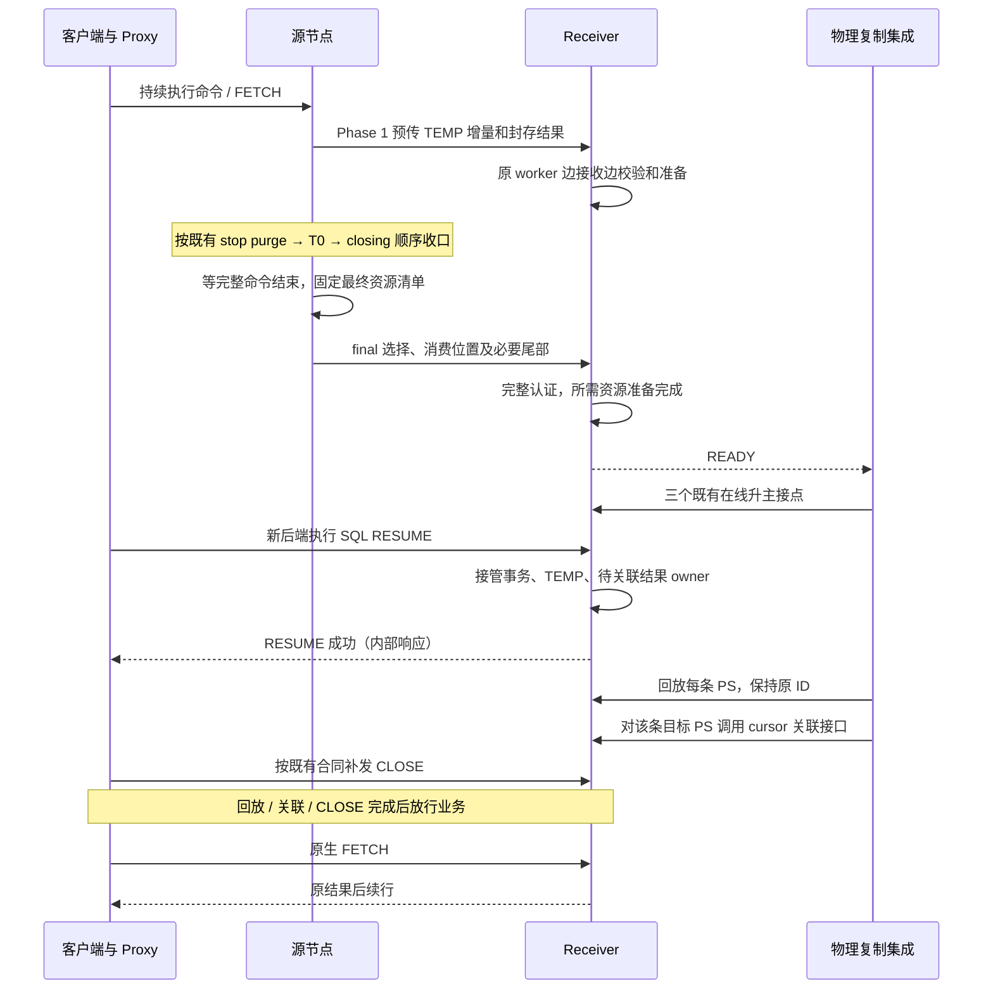

# 用户临时表与待 FETCH 结果的跨主 Preserve/Resume 详细设计

更新：2026-10-04。源码基线为 `ha_preserve_trx` 的 `e6715a345881` 加当前未提交改动。
本文描述当前代码与集成合同；PS 本体迁移删除前的完整细则保存在[历史设计](detailed-design-before-ps-removal.md)，不再作为当前实施要求。

## 1. 目标、分工与边界

目标是在 standby transfer、物理备机在线升主、新后端 SQL RESUME 后，继续使用用户临时表，并从服务端最后正常完成的 FETCH 批次之后继续取既有结果。客户端到 proxy 的连接保持，客户端不改；重新建立的是 proxy 到服务端的后端连接。

**本工程保存临时表和结果资源；物理复制工程恢复 session 上下文并在 SQL RESUME 后回放 PS。** 本工程不再捕获、编码、传输或重建 PS 的 SQL、参数、历史解析输入、依赖闭包。带 cursor 的 PS 也不例外：保留的是它的结果及归属，不是 PS 本体。原生 MySQL PREPARE/EXECUTE/参数处理不删除。

| 内容 | 当前责任 |
| --- | --- |
| 事务与用户 InnoDB 临时表、DATA/undo、表元数据和目标资源 | 本工程，复用现有 Preserve/Resume 主链 |
| 已物化的 Classic cursor 结果、列元数据、顺序、代次和 FETCH 位置 | 本工程，使用独立结果文件、清单、reader/cursor |
| session 上下文、PS 回放、参数及相关状态、源 PS 到目标 PS 的权威映射 | 物理复制工程已提供的能力；外部源码当前不可访问，不能据此反推功能缺失 |
| 回放后关联源 PS 对应的保留 cursor | 本工程提供显式接口，外部工程逐条调用 |
| 前端不断、特殊错误码切换、CLOSE 留存与补发、失败断连 | 既有 proxy/物理复制集成合同 |

用户表只使用 InnoDB，字符集兼容及通用 THD session 转移由物理复制工程负责。本工程仍须保存结果文件自身的列格式和值，不把结果类型信息误删为 PS 参数。

不扩展 local startup、RESET DRAIN、X Protocol 或打开中的 HANDLER。进程启动后的异步垃圾文件清理不是 local startup 资源恢复。普通 SELECT 的客户端取行不是服务端下一条 FETCH 命令；未完成的 SELECT/CALL/存储程序按原完整命令和超时规则处理，不迁移调用栈或半包响应。

### 1.1 固定接点

在线升主仍只进入以下已有阶段，不增加外部回调、资源就绪屏障或专用线程池：

1. `preserved_trx_prepare_before_trx_sys_init_for_physical_promotion()`。
2. `trx_lists_init_at_db_start()` 中已有 Preserve hook；**在线升主也会调用该函数**。
3. `preserved_trx_adopt_ready_epoch_for_physical_promotion()`。

**strict physical promotion 的部署前提仍是源/目标两端 `log_bin=ON`、`gtid_mode=ON`**；[promotion gate](../../../sql/preserve_trx_promotion.cc) 强制核验。TEMP_ONLY/NONE 或没有 binlog cache 不豁免此条件；本地 no-bin MTR 不是线上 no-bin 升主支持证据。

SQL RESUME 的入口是 `Sql_cmd_resume_preserved_transaction::execute()`。PS 回放及 cursor 关联在其成功返回之后，由外部集成调用，不能写成新增的物理升主阶段。

## 2. 端到端顺序



“收到文件”“Final ACK”“READY”“物理采用”“SQL RESUME 成功”“cursor 已关联”是不同事实。Final ACK 不自动代表资源准备完毕；SQL RESUME 成功也不代表外部 PS 已回放。业务放行是外部集成责任，不能凭 pending 计数推断内核存在通用业务拦截器。

| 阶段 | 要做的工作 | 不得据此推断 |
| --- | --- | --- |
| 正常业务 / Phase 1 | 连续维护 TEMP 捕获，复用封存结果，原 worker 传输并在 receiver 提前准备 | 已采到数据不等于已发送或已准备 |
| stop purge 后到 T0 | 沿既有调度顺序与期限推进；没有新增 PS 增量检查阶段 | 旧 PS BASE/DELTA 优化方案不再适用 |
| Phase 2 closing / final | 完整命令边界取最终 DATA/undo/结果状态，认证同代候选并补尾 | 不能只按文件存在、最大序号或成功发包宣布完整 |
| receiver READY | 需要的数据转换、值校验、原生 TEMP 资源和结果 reader/sender 准备完成 | 不承诺外部升主已经完成 |
| SQL RESUME | 按 journal 接管事务、TEMP 和待关联结果集合 | 不创建 PS，不做 SQL 解析或参数安装 |
| 外部回放 / attach | 取得真实目标 PS，绑定最终选定的 cursor | 不能通过 SQL 相似或回放顺序猜映射 |

## 3. 恢复合同与资源身份

引擎恢复依据和会话资源是两条维度。[recovery_contract](../../../sql/preserve_trx_recovery_contract.h) 区分 `REDO_RESURRECTION`、`TEMP_UNDO`、`READ_CONTEXT`、`NONE`，并认证 SQL 事务状态、owner trx 和 freeze 边界；不能因为没有永久表 redo 就遗漏临时表事务或结果会话。

- MIXED/TEMP_ONLY 保持原事务和临时 undo 的一致归属；跨多个临时空间的 undo 属于同一真实事务。
- READ_CONTEXT 保留原恢复依据，不伪造持久写事务。
- NONE 表示无需恢复引擎事务，不等于 SQL 事务状态必为空；`sql_transaction_active/explicit_begin` 独立保存。它可以带临时表/结果资源，无活动事务的会话不凭空开启业务事务。
- 仅有普通 PS、不含这些资源的会话不生成 PS 工件，沿既有 session-only/control 路线处理，不能再强求一个 PS token。

资源归属由原 epoch/token、恢复合同、最终元数据摘要及 prepared key 固定。结果独立清单保存源 `statement_id`、`generation`、文件大小/摘要、`fetch_count`、`fetch_limit`；清单按源 ID 严格递增，正常最终边界要求 `fetch_count == fetch_limit`。列定义和结果行在文件中，清单不保存 PS SQL 或参数。

开放状态由“最终清单选中的开放结果”和 cursor snapshot 校验表达；不另造一个 PS 描述符。已读完所有行但原生尚未探测 EOF 的 cursor 仍须保留。

## 4. 用户临时表：保留现有 DATA/undo 主链

删除 PS transfer 不改变用户临时表算法或支持矩阵。[temp_table](../../../sql/preserve_trx_temp_table.cc)、[temp_prebuild](../../../sql/preserve_trx_temp_prebuild.cc)、[temp_receiver](../../../sql/preserve_trx_temp_receiver.cc) 编排 SQL 层；[trx0temp_preserve_*](../../../storage/innobase/include/trx0temp_preserve_import.h) 负责 InnoDB 导入。

### 4.1 捕获与一致性

捕获保存 DD/列索引信息、空间数据、行及索引身份、AUTO_INCREMENT、事务级临时 undo 和相应恢复依据。源 DATA 按空间保活，undo 按真实事务 owner 路由，不向同一 system-temp 的全部事务广播页副本。

DATA、undo、DD、anchors 和所有权必须在同一受控命令边界固定。临时 undo 不是纯追加文件：旧页链接、偏移、anchors、截断和页复用都可能变化；新旧历史不能只按长度或 page LSN 判断相容。

BLOB/JSON、生成列、无显式主键的隐藏行标识、索引与 undo 中的历史外部引用继续经过原映射和校验。正确恢复当前行不代表 ROLLBACK/SAVEPOINT 已正确；不能删掉历史值、页归属、roll pointer 或隐式索引引用验证。

### 4.2 目标身份与已有临时表隔离

receiver 可以已有只读会话和用户临时表。导入必须保留它们及后续分配，不能覆盖源 space ID，也不能通过重启备机消除冲突。

当前 [ID contract](../../../sql/preserve_trx_temp_id_contract.h) 在 OPEN/ACK 协商已启动校验的命名空间；[InnoDB ID policy](../../../storage/innobase/include/trx0temp_preserve_id.h) 为进程内临时 table ID 分配高位区间，index ID 保持原生 32 位编码约束。导入可在独占保留的新空间内保留源 index ID，不能无条件宣称所有 ID 都原值照搬或都重新编号。

一个 ImportPlan 统一管理源→目标空间、表及相关 undo/行引用转换。原生字典、目标 image、LOB、undo、FSEG 与统计/SQL 元数据分批准备，存储页和 undo 的转换不能移入升主或 RESUME。

在线升主须保留已预热资源和 allocator 状态；关闭 redo 不构成稳定 ID 证明。外部物理重放不撞号、temp pool/undo 存活仍需在物理工程验证，当前本地 OPEN/ACK 合同不能替代它。

### 4.3 跨代复用及失败

兼容候选复用目标 ID、原生 undo、私有 DATA writer；源空间/布局/undo 历史不兼容时重建。final 只有在完整身份、摘要、依赖和 owner 均一致后才消费已准备候选，不能因候选曾 READY 就忽略换代。

原生资源按已有 stage/commit/rollback 和 journal 管理。回退失败或所有权不确定时保留必要 fence/owner，不能双端同时继续。数据文件可以异步删除，活的 handler、字典、undo 或 fil owner 不能用“以后删文件”替代及时收尾。

## 5. 增量与流水线收敛


TEMP 沿用不可变 BASE＋累积 DELTA、selected dependency 和页版本索引。完整镜像/历史摘要及归属校验仍保留；少传或少写不代表总扫描/校验 I/O 已是 O(delta)。源格式内容与目标地址转换分层，不能用源页直接覆盖已重定位的目标页。

结果同一代内容封存后不变；FETCH 通常只改变最终消费位置。预传使用既有 TEMP 作业入口，[result_pretransfer](../../../sql/preserve_trx_result_pretransfer.cc) 只处理结果，不重新加入 PS 定义/参数批处理。

无开放 cursor 时读会话计数即可跳过 PS map。存在 cursor 时当前预传/final 捕获仍遍历该 THD 的 PS map，取开放 cursor snapshot；因此只能说“普通无游标 PS 不再全量迁移”，不能把任意结果捕获的总成本写成 O(1)。判断一个已知 PS 是否有 cursor 本身是指针/开放状态检查。

累积已声明工件和最终恢复集合不同：transport 继续负责已声明对象的封存/寿命；最终 result manifest 只选当前存活结果。关闭、重新 EXECUTE 或替换结果后，迟到 worker 不得复活旧代次。TEMP final 仍按原 selected-only 依赖处理。

现有 worker/credit、token/epoch 身份、owner pin、deadline、取消及 join 统一覆盖新结果作业。不创建第二套线程池或缓存管理器。取消和终态标记不等于最后使用者退出；内存、文件、退休副本持续计费到实际释放。

## 6. 结果文件、FETCH 与生命周期

[sql_cursor](../../../sql/sql_cursor.cc) 在物化结果时记录源 PS ID；[cursor](../../../sql/preserve_trx_cursor.cc) 生成结果代次和独立值文件。迁移不重执行 SELECT，也不通过重新查询原表恢复内容；源表修改/删除后旧结果仍以封存内容为准。

- 保持列元数据、NULL、二进制值、顺序与重复行，不能按目标当前表重新解释结果。
- 捕获不推进业务 cursor。最终 snapshot 失败或位置不一致必须失败，不能冒充 NO_CURSOR。
- 服务端已完成前 100 行 FETCH，则下一批从第 101 行开始；客户端只用到第 89 行时，第 90～100 行属于原客户端/proxy 已有缓存，不要求服务端重发。
- FETCH 0 不探测 EOF；取尽最后一行但未返回最终 EOF 时不提前关闭。发送失败的未确认边界不能据此保证重发/去重。
- COMMIT/ROLLBACK、RESET、再次 EXECUTE、CLOSE 按原生生命周期处理，不用“事务结束就一律销毁结果”的假设改写行为。
- EOF 关闭结果文件/decoder 后，`m_preserved_cursor` 和 sender 等小对象可能仍由 PS 持有，直到 RESET/EXECUTE/CLOSE/析构；不能承诺 EOF 当场释放全部额度。

前端真实断连结束该逻辑会话；新连接重做查询产生新结果，不承诺从旧位置恢复。参数、普通 BLOB/TEXT 执行值不是本工程新增迁移内容，但结果中的 BLOB/TEXT 值仍属结果保存责任。

## 7. receiver READY 与 SQL RESUME

### 7.1 READY 前完成什么

[result_transfer](../../../sql/preserve_trx_result_transfer.cc) 校验最终清单与对象的 ID/代次/大小/摘要；[result_restore::Preparation](../../../sql/preserve_trx_result_restore.cc) 通过原 receiver 候选和 worker 分批 preflight 值，准备 cursor、decoder、sender 和最终位置，并解绑 worker THD。

准备成功后由 prepared 资源独立持有文件引用及额度，不依赖即将删除的 staging 路径或 worker 的 packet/THD。存在缺件、错误摘要、失败候选或未完成准备不能宣告 READY。

结果 wire 保留 `CURSOR_RESULT = 6` 和 `ps_result_<id>_<generation>` 文件名；名字表达结果归属，不表示仍迁移 PS。旧 PS 描述符 kind 5 和 PS 准备进度协议已删除，不提供静默降级为空结果的兼容路径。

### 7.2 RESUME 只移交资源 owner


[主流程](../../../sql/preserve_trx.cc) 与 [promotion_prepared](../../../sql/preserve_trx_promotion_prepared.cc) 在资源安装/最终发布前认证 prepared key、token 和清单摘要。`Preserve_trx_result_restore::stage()` 创建小型 journal；既有 activation 不可回退边界前可归还相同 Ready owner；`registry.begin_activation()` 成功进入 ACTIVATING 后，即使结果 journal 尚未 commit，也不能归还 lease 重试，按原整体失败裁决处理。

`Attach::finish()` 把 owner 和待关联计数交给 THD，不在 PS map 插入对象、不修改 PS quota/编号、不安装参数，也不等待外部 PS 回放。无结果的成功恢复可以安装空 owner，用于后续合法的 NO_CURSOR 判断；未成功 RESUME、没有 owner 的调用应失败。

结果全部关联后 pending 计数为零，但 owner 中 attached 描述记录仍保留，`Ready::empty()` 不因此变 true。reset/cleanup 清除 owner；不能承诺再次 RESUME 可在同一非空 owner 上覆盖。未关联结果仍存在时，当前源捕获/Preserve 准入拒绝再次迁移，不能丢掉 pending 资源。

## 8. 外部 PS 回放后的显式 cursor 关联

### 8.1 接口与职责

接口位于 [preserve_trx_result_restore.h](../../../sql/preserve_trx_result_restore.h)：

```cpp
Preserve_cursor_attach_status preserve_trx_attach_cursor_after_ps_replay(
    THD *target_thd,
    uint32_t source_statement_id,
    Prepared_statement *target_ps);
```

调用方从同一源 PS 回放记录取得 ID 和刚恢复的真实目标对象。调用发生在成功 SQL RESUME 后、该条 PS 回放后、业务放行前，由目标 THD 的 owner 线程独占执行。调用方须保证目标对象仍存活且已进入该 THD 的 PS map，保持原 ID；不能向接口传悬空指针。不能通过 SQL 文本、参数值、相同 ID 的另一生命周期或创建顺序猜对应关系。

外部回放负责源表已 DROP/元数据变化等历史 PS 场景。不能为保存旧结果而要求本工程重新 PREPARE，更不能执行 SELECT 重建结果；本地 Debug 回放夹具不是外部真实能力的证明。

### 8.2 已成立的恢复不变量与接口直接检查

准备/RESUME 已认证 token、manifest digest、文件和值以及最终消费位置。首次 attach 不重新读文件/算摘要，不重做全部结果准备。

接口当场检查当前 THD、killed 状态、非零源 ID、`ps->thd`、`ps->id`、PS map 中的真实对象、owner 存在且 token 非空，然后按源 ID 二分查找：

| 返回值 | 精确含义与调用方动作 |
| --- | --- |
| `ATTACHED` | 找到最终结果，目标没有任何已有 imported cursor（包括已关闭者）或其他开放 cursor，bind 成功后移交单个 cursor 的所有权并减少 pending 计数 |
| `NO_CURSOR` | 有效恢复 owner 的最终清单无该 ID；不会修改目标 PS，也不意味着外部映射已被本接口证明 |
| `ALREADY_ATTACHED` | 同 ID 已附着，且目标仍持有开放的 imported cursor，其 ID/代次/大小/摘要一致；不再次移交或减少计数 |
| `ERROR` | 前置条件、目标冲突、绑定或重复调用状态不合法；不得按“没有结果”放行业务 |

NO_CURSOR 在“找不到最终 ID”时返回，不会额外检查该目标 PS 的 cursor 冲突；该检查只适用于确有待挂接结果的分支。重复调用也不是永久幂等：游标关闭、对象替换或同 ID 重建后应报错，不能复活旧结果。

三参接口不含源 SQL/PS 生命周期证明，不能发现“同 ID 回放了错误 SQL”。跨 session/恢复轮次及 PS 生命周期的权威对应关系必须由外部回放记录保证。接口核验不替代这一前提。

## 9. 协议边界、失败和清理

LONG_DATA 参数状态及其回放属于外部 PS 能力，本工程已经删除该特性专属的捕获/解码拒绝、参数缓存和迁移代码；不恢复旧 W10 的 LONG_DATA 拒绝要求。原生无响应命令处理和完整命令边界仍有效。

CLOSE 保持静默及原生未知 ID 行为。proxy 在转发旧后端前留存请求，包括首次特殊错误码之前；成功 RESUME 后先完成相关 PS 回放/关联，再补发 CLOSE，并在新的业务 PREPARE/命令前消费关闭记录。记录按逻辑 session 和 PS 生命周期归属，不能在 ID 复用后再次关闭新对象。重复 CLOSE 不产生响应包。

SQL RESUME 失败时 proxy 关闭前后端，丢弃该逻辑会话及 CLOSE 记录，不重试或归还连接池。回放/关联或 CLOSE 交付不确定时不得放行业务；不新增通用命令前缀确认、业务重放或内核跨端 close-event 通道。

完整顶层命令与多语句包沿既有调度/超时规则处理；删除 PS transfer 不允许截断执行中的命令或重放已经部分执行的请求。

源可能继续时保留其实际 cursor/表资源；目标接管和失败恢复继续服从 epoch/lease/attach-intent 的唯一归属裁决。THD reset/cleanup 清除待关联 owner；附着后的 cursor 按目标 PS 生命周期释放。file pin、内存 lease 和已退休副本必须覆盖最后一个使用者。

允许无用新增工件在进程重启时异步清理，但磁盘仍按实际占用计量，不能保留多余 THD/表/PS owner 只为删除文件。RESET DRAIN 不新增行为。

## 10. 实现分工和收敛规则

当前文件映射见[源码分工](source-layout.md)。保留两条专用资源线：TEMP 与结果；共同消费已有 bundle、transfer、receiver prepared、promotion 和 RESUME journal。原 `preserve_trx_ps_*`、PS 依赖 metadata watch、SP 历史绑定迁移文件及只服务它们的指标/测试已删除。

- 原生共享路径只留当前确有消费者的薄且有 gate 的接点；结果 ID/计数、cursor 所有权和生命周期不能随 PS 本体一起删掉。
- 普通 PS 数量不再决定本工程 PS 工件体积或 receiver PS 内存；源端原生 PS 内存仍存在，不属于 Preserve 预算优化收益。
- 复用已有索引、worker、credit、owner 和清理；不为本轮文档同步发明新的管理器或状态协议。
- 文件名残留 `ps_result_*`、结果与 PS 的直接关联、原生 PS 协议测试不是死代码。旧 factory/rebuild/参数副本则不能以兼容名义保留。

## 11. 当前验证与后续退出条件

| 项目 | 当前证据 | 尚待完成 |
| --- | --- | --- |
| 删除与显式接口 | E62；Debug/Release 构建、定向运行 | 外部真实回放调用方接入与验收 |
| 全量 MTR 含 big-test | E63：no-bin 598/285/0，log-bin 596/287/0（通过/跳过/失败）；shutdown 各另 1；覆盖并集 883，18 个不同 big test 实际通过 | 不等同于外部物理复制验收；lint 不算运行时行为 |
| 临时资源 M1–M12 | E64：62 个配置各一次，全部通过原场景断言；56 READY、3 预期负例、3 无 DRAIN | 两档 M11 限速 strict 超过 2 s；部分 READY 观测和内部重试仍需分析 |
| 原有 11 个压力模型 | E64：3 通过、8 未通过；1000 读写 strict 526.657 ms、精确尾 330.834 ms | 其他尾部/命令时延、TPC-C 1205、连续 TPS 时钟映射无效等未闭合 |
| 升主、RESUME、FETCH 与 receiver 共存 | 本地接口及 bridge 有证据 | 外部 redo/allocator 保活、三固定接点、真实 proxy 回放/关联/CLOSE、连续迁移 |

E63 对当时快照完成全量验证；之后五个 Python 驱动适配，内核源码、MTR 用例文件和关联 helper 未变，但其中部分驱动也是 MTR 依赖。适配后未重跑整套 MTR，不能把 E63 当成适配后所有输入的全量证据。具体证据及边界见[任务跟踪 E63/E64](task-tracker.md)。未经用户指令不提交或 push。

后续测试使用 MTR 和 Python E2E，不新增 UT/GUnit 或 DEBUG_SYNC。验证需覆盖：源有/无结果、多 PS 同 SQL、换代/EOF/RESET/CLOSE、错误 session/对象/ID、重复 attach、RESUME 失败清理、receiver 原临时表隔离、OFF/非 standby 和真实外部 PS 回放。

## 12. 性能指标不能混用

数据量相关工作须在 READY 前完成并尽量推进到 Phase 1；升主、RESUME、attach 不承担全结果扫描和数据页转换。但 bind、元数据/指针安装、锁及额度申请仍有成本，不能声称零分配或固定微秒时延。

分别记录源业务响应、捕获/编码、真实线上字节、receiver 排队/准备、final 新增工作、strict Phase 2、EXACT 最后命令体退出→Final ACK、receiver 同钟 ACK→READY、三个升主入口、SQL RESUME、外部回放/attach、首次 FETCH/DML。

控制器“DRAIN 返回→观察到 READY”包含轮询延迟，不等于 receiver 同钟时延。没有 eligible body 或未校准的跨进程时间必须写 N/A/INVALID，不能当零。并行累计服务时间不能相加成墙钟；closing→ACK 也不能全部称为网络等待。

当前目标和原各模型门槛保持，失败记录保留。一次运行通过不替代重复轮次统计或商用验收。最新完整数据见 [E64 压力报告](../../../build-release/original-pressure-ps-removed-20261004/RESULTS.md)和[资源 62 项明细](../../../build-release/all-pressure-20261004/RESULTS.md)。
