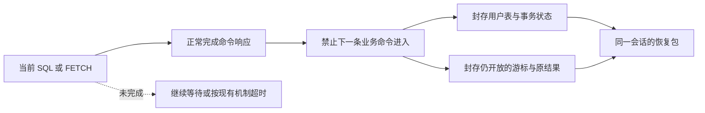
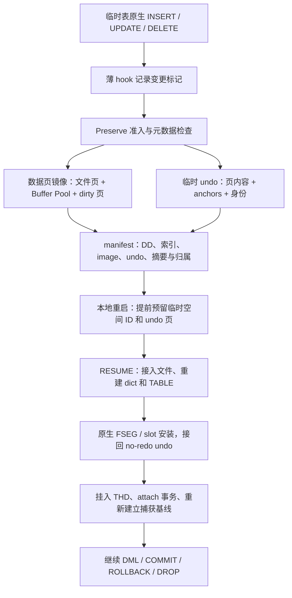
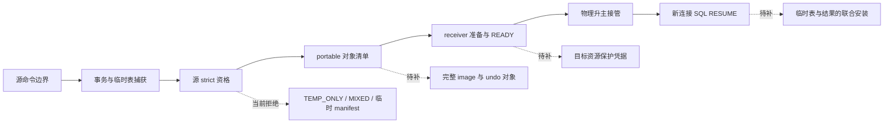
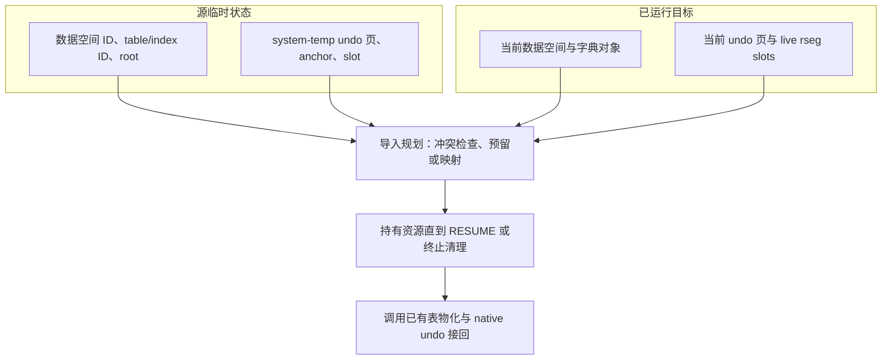
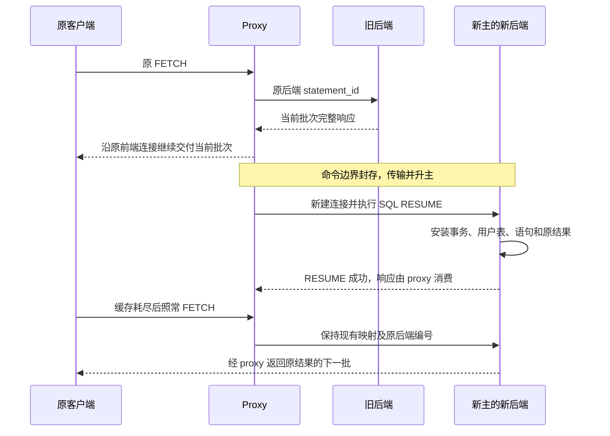

# 临时表与待 FETCH 结果：已有实现和实际缺口

> **2026-10-04 版本说明：历史版本记录。** 文内“当前/尚未完成/通过”和源码路径均属于记录时点；旧 PS 定义/参数/重建方案不再适用，原失败与测量不改写为新版本成绩。 现行职责见[详细设计](detailed-design.md)和[PS 删除与 cursor 关联](ps-transfer-removal-and-cursor-attach.md)，最新状态见[任务跟踪 E63/E64](task-tracker.md)。下文保留历史事实，不作为现行实施清单。

> **2026-09-24 范围更正：** 当前状态以[任务跟踪](task-tracker.md)及[详细设计 §4.2](detailed-design-before-ps-removal.md#42-long_data-暂不支持close-保留原范围)为准。用户明确 LONG_DATA 分片送参的迁移本阶段暂不支持，proxy 仅感知既有特殊错误码。下文旧 LONG_DATA 支持目标、前缀确认／proxy 缓冲重放要求及相应估算不再作为交付范围；真实源码和历史测试记录保留，但不代表当前支持承诺或运行期拒绝已落实。约束拒绝归 W10，CLOSE、普通参数和 FETCH 不连带排除。 **后续 CLOSE 特例：2026-09-27 用户已确认 proxy 留存 CLOSE、RESUME 后优先补发；该例外及本地证据以主设计 §4.2、W10/E26 为准，V05 外部验收仍独立。**

> 商用范围（2026-09-18 用户确认）：本特性只面向 **standby transfer → 物理备机升主 → 新主 SQL RESUME**。local startup 模式不在新增设计、实现、功能验收和预算内；文中现有本地实现仅作为代码复用依据。
>
> 工程背景（用户确认）：物理备机对接已完成；当前工程只补齐临时表、待 FETCH 结果及相关资源能力，后续再纳入包含物理备机能力的 MySQL 工程，做新增场景的集成回归。

2026-09-18 · 源码审核基线：`bf57277b0e2`，生产代码基线：`d086954338c`。

**当前已经有一套实质性的用户临时表本地 Preserve/Resume 实现。** 它覆盖物理数据捕获、no-redo undo 保存、本地重启预留、表与事务接回，以及恢复后的写入、提交、回滚和清理。后续设计应从这套实现向 standby transfer 扩展，不能把这些能力重新列为从零开发。

真正的增量主要是：**将现有临时表工件接入跨实例接管；解决已运行目标的资源冲突；补充待 FETCH 结果和预处理语句恢复；把这些资源纳入同一次 RESUME 的成功或失败处理。** 此外，当前用户临时表支持矩阵仍有限制，不能把“有物理镜像”解释为“所有临时表都支持”。

本文基于实际函数、调用方和测试脚本审核。核查的核心临时表／transfer／promotion 文件与原工作区 `ha_preserve_trx` 的已提交基线一致；不对原工作区其他未提交修改作结论。本轮没有修改生产代码，没有运行编译、GUnit 或 MTR。文中“已实现”表示源码中存在可追踪的实现链；测试存在与本轮运行通过分别表述。

## 1. 先区分三种对象

| 对象 | 当前在哪里 | 本需求要求 |
| --- | --- | --- |
| 用户 `CREATE TEMPORARY TABLE` 创建的表 | `THD::temporary_tables`，现有临时表 manifest 遍历此链 | 恢复表结构、数据和会话归属；未提交修改仍能继续写入、提交或回滚 |
| 已完成执行、等待下次 `COM_STMT_FETCH` 的结果 | `Prepared_statement` 持有游标；物化游标持有内部结果表 | 保留原结果、列信息、顺序、重复行、下一行位置、EOF 和原后端 statement_id |
| 普通 SELECT 执行过程中的内部临时表 | 优化／执行阶段的工作对象 | 当前命令必须先结束；只需跨命令保留的结果对象才进入恢复集合 |

用户表的 [manifest 遍历入口](/Users/a1234/project/mysql-server-8022-preserve-port/sql/preserve_trx_temp_table.cc:3019) 和 [Materialized_cursor](/Users/a1234/project/mysql-server-8022-preserve-port/sql/sql_cursor.cc:74) 是两条不同的对象链。给用户临时表增加传输，并不会自动保存游标的结果表。

已有 [idle boundary 状态转换](/Users/a1234/project/mysql-server-8022-preserve-port/sql/preserve_trx.cc:6217) 允许正在执行的命令先结束。未来仍沿用这个边界，不保存半条 SQL、半次 FETCH、半个网络响应或存储过程执行栈。普通客户端 `mysql_fetch_row()` 读取响应／缓存，不是一次新的服务端 FETCH；已经返回的批次由原客户端及 proxy 链路保留。

### 1.1 哪些限制保留，哪些是本次扩展点

背景、读取形态及选择理由统一见 [需求背景与支持范围](/Users/a1234/project/mysql-server-8022-preserve-port/design/workshops/temp-table-preserve/requirements-and-scope.md)。下表是现有检查与本次目标的对应关系，不能把所有拒绝项都归为本次缺口。

| 当前检查 | 源码位置 | 本次处理 |
| --- | --- | --- |
| 非经典协议 `!is_classic_protocol()` | [preserve_trx.cc:5242](/Users/a1234/project/mysql-server-8022-preserve-port/sql/preserve_trx.cc:5242) | 保留；X Protocol 不在本次范围，虽有显式 Cursor.Fetch，也不新增插件层状态恢复 |
| 存在打开的 `handler_tables_hash` | [preserve_trx.cc:5279](/Users/a1234/project/mysql-server-8022-preserve-port/sql/preserve_trx.cc:5279) | 保留；全部 HANDLER 关闭后该项不再拒绝，其他检查仍生效 |
| 非零 `preserve_trx_open_cursor_count` | [preserve_trx.cc:5292](/Users/a1234/project/mysql-server-8022-preserve-port/sql/preserve_trx.cc:5292) | 经典协议结果保存、语句恢复、联合安装与清理齐备后有条件扩展 |

用户结果临时表加后续分页 SELECT，按用户表支持矩阵承载；其上另开 PS 游标时还要分别保存游标结果。普通 SELECT／SQL EXECUTE、CALL 多结果是原命令响应，存储程序内部 FETCH 属于当前调用；都不因此新增一个跨命令 FETCH 恢复对象。

## 2. 用户临时表已经实现了什么

现有本地链路如下；图中步骤都有源码实现，但仍受下一节的支持矩阵约束。

| 环节 | 当前真实实现 | 后续应如何利用 |
| --- | --- | --- |
| 变更跟踪 | 原生行操作及 binlog hook 成功后记录 DML 标记；热点路径不复制行内容。另有 DDL、savepoint、statement rollback 的边界记录 | 继续使用；不新增一套 SQL 行回放日志。[handler hook](/Users/a1234/project/mysql-server-8022-preserve-port/sql/handler.cc:7851) |
| 物理捕获 | `build_baseline_image()` 复制初始文件页、覆盖 Buffer Pool 页、应用 dirty stream、封存；已有流式 writer 和内存 lease | 捕获主体复用，跨机补工件交付与目标导入计划。[捕获](/Users/a1234/project/mysql-server-8022-preserve-port/sql/preserve_trx_temp_table.cc:2157) |
| Phase 1 预构建 | 可以采用已有 sidecar，但会检查 mutation generation 等条件；不能采用时在最终捕获阶段重新构建 | 保留已有优化及回退，不承诺任何变化都只需极少尾页。[采用检查](/Users/a1234/project/mysql-server-8022-preserve-port/sql/preserve_trx_temp_table.cc:2741)、[最终回退](/Users/a1234/project/mysql-server-8022-preserve-port/sql/preserve_trx_temp_table.cc:3076) |
| 临时 undo 保存 | 捕获 live insert/update undo anchors 及链页；编码版本、rseg 身份、页角色、页号、字节和摘要 | 现成格式和校验可用；目标身份若改变，再补对应转换。[捕获](/Users/a1234/project/mysql-server-8022-preserve-port/storage/innobase/trx/trx0temp_preserve.cc:5134)、[编码](/Users/a1234/project/mysql-server-8022-preserve-port/storage/innobase/trx/trx0temp_preserve.cc:5343) |
| 表定义和工件清单 | DD 序列化、InnoDB table/index/root 绑定、image/undo 描述及 ownership claims；同一空间多张表共享一份数据镜像 | 跨机清单由现有 manifest 派生，避免另造一套表描述。[manifest](/Users/a1234/project/mysql-server-8022-preserve-port/sql/preserve_trx_temp_table.cc:2956) |
| 启动预留 | 打开 system temp tablespace 后、建立 session temp pool 前，扫描并预留临时空间 ID、undo 页和相关逻辑 rseg 要求 | 这是现有 local startup 的源码事实，仅作对照；本特性不适配启动流程，在线 receiver 必须独立取得/保护合法资源。[启动顺序](/Users/a1234/project/mysql-server-8022-preserve-port/storage/innobase/srv/srv0start.cc:2708)、[预留入口](/Users/a1234/project/mysql-server-8022-preserve-port/sql/preserve_trx.cc:16007) |
| SQL 表物化 | 校验 sidecar，adopt image，加载 undo，反序列化 DD，绑定 dict，暂存打开 TABLE，最后 link 到 THD | 复用已有 staged open/link 和失败清理；不再实现第二套本地物化。[materialize](/Users/a1234/project/mysql-server-8022-preserve-port/sql/preserve_trx_temp_table.cc:3559) |
| 原生事务接回 | 安装 exact FSEG 页和 live rseg slot，重建 `trx_undo_t`，接入 `trx->rsegs.m_noredo`，推进 `undo_no`；不会整页覆盖目标 live rseg header | 已有原生接回能力；跨机新增合法目标资源来源及保护。[安装](/Users/a1234/project/mysql-server-8022-preserve-port/storage/innobase/trx/trx0temp_preserve.cc:5550)、[发布 undo](/Users/a1234/project/mysql-server-8022-preserve-port/storage/innobase/trx/trx0temp_preserve.cc:5837) |
| 继续使用与再次捕获 | 本地 RESUME attach 事务、恢复 savepoints，并 reseed 临时表捕获基线；原生 rollback、commit 回收已对 imported undo 做处理 | 应扩展 strict 路径的调用和验证，不能把整套 COMMIT/ROLLBACK 当作全新工作。[SQL 接续](/Users/a1234/project/mysql-server-8022-preserve-port/sql/preserve_trx.cc:24135)、[rollback](/Users/a1234/project/mysql-server-8022-preserve-port/storage/innobase/trx/trx0roll.cc:955)、[undo 回收](/Users/a1234/project/mysql-server-8022-preserve-port/storage/innobase/trx/trx0undo.cc:1990) |
| 生命周期与重试 | 物化失败有清理完成度报告；retry 释放 native attachment 并保留可重试工件；同一 image 最后一张表关闭才释放空间；断连先回滚再关闭表 | 将新目标资源接入这些清理点，区分活跃表存储与可删除传输副本。[retry](/Users/a1234/project/mysql-server-8022-preserve-port/storage/innobase/trx/trx0temp_preserve.cc:6661)、[最后一表释放](/Users/a1234/project/mysql-server-8022-preserve-port/storage/innobase/trx/trx0temp_preserve.cc:6563)、[断连](/Users/a1234/project/mysql-server-8022-preserve-port/sql/sql_class.cc:947) |

这里恢复的是“当前物理数据 + 能撤销未提交修改的临时 undo”。SQL journal 是跟踪完整性的依据，**恢复不会重放 INSERT/UPDATE/DELETE SQL**。[preflight 的实际规则](/Users/a1234/project/mysql-server-8022-preserve-port/sql/preserve_trx_temp_table.cc:1557)

本地还已有满足条件的 `TEMP_ONLY` synthetic claim：有临时 manifest、没有持久引擎状态和已记录的持久写入时，可以重建承载临时状态的事务对象。不能据此推断 strict promotion 已支持同一形态。[本地判定](/Users/a1234/project/mysql-server-8022-preserve-port/sql/preserve_trx.cc:14715)

### 2.1 本地变化页捕获不等于跨机多轮增量

现有 dirty stream 会合并同页最新镜像，最终 seal 取走页集合并注销捕获；undo sidecar 编码完整的已分类恢复页和 anchors。Phase 1 sidecar 采用仍要求 mutation generation 匹配，否则最终回退重建。源端 write_object_chunk 要求顺序 offset，接收侧也不允许以不同字节覆盖已传范围，不能拿本地 writer 的随机写接口推断远端可以修改 sealed 对象。新增要求需要补齐连续切轮、不可变增量包、基线／前驱校验、ACK 后按版本回收和最终完整性，详见 [增量捕获与流水线传输设计](/Users/a1234/project/mysql-server-8022-preserve-port/design/workshops/temp-table-preserve/incremental-capture-and-transfer.md)。这些属于在已有基础上的实质增量，尚未实现。

## 3. 已有实现的支持范围，还不能省略

“本地已有实现”和“任意用户临时表均支持”不是同一个结论。下面是源码中的实际准入限制，应作为独立扩展清单；这些限制并非用户已同意永久排除。

| 当前边界 | 源码事实 | 若要扩大覆盖，实际补什么 |
| --- | --- | --- |
| 引擎 | SQL 要求 transactional temp table；底层导出明确要求 InnoDB | 其他用户临时表引擎需要相应保存／恢复方案，不能仅放开准入。[SQL candidate](/Users/a1234/project/mysql-server-8022-preserve-port/sql/preserve_trx_temp_table.cc:92)、[引擎检查](/Users/a1234/project/mysql-server-8022-preserve-port/storage/innobase/trx/trx0temp_preserve.cc:3952) |
| 列类型 | DD→dict 绑定只列出整数族、`VARCHAR/VAR_STRING`、四类 DD BLOB 类型，字符集也参与绑定校验；其他类型返回 false，DECIMAL、日期时间等不能因已有镜像而视为支持 | 扩充类型绑定和精确元数据校验，验证恢复后读写及回滚。[类型白名单](/Users/a1234/project/mysql-server-8022-preserve-port/sql/preserve_trx_temp_table.cc:555) |
| 索引 | DD 类型限 PRIMARY/UNIQUE/MULTIPLE，还要匹配数量、名称、聚簇／唯一属性、字段顺序、前缀和升降序；当前仅把 DD PRIMARY 视为 clustered | 无显式 PK、由 UNIQUE 充当聚簇索引，以及生成聚簇索引都有相应拒绝条件，不能泛称所有普通索引表已支持；须补字典表示与恢复校验。[类型门槛](/Users/a1234/project/mysql-server-8022-preserve-port/sql/preserve_trx_temp_table.cc:699)、[聚簇匹配](/Users/a1234/project/mysql-server-8022-preserve-port/sql/preserve_trx_temp_table.cc:803)、[导出条件](/Users/a1234/project/mysql-server-8022-preserve-port/storage/innobase/trx/trx0temp_preserve.cc:4044) |
| AUTO_INCREMENT、生成列等 | AUTO_INCREMENT 因缺少 SQL 层计数／预留状态而拒绝；生成列、部分隐藏列、instant 列、加密空间等有明确拒绝；索引也须通过 DD/dict 匹配 | 分别补状态与恢复语义；不能用“页已复制”替代 SQL 层状态。[列形状](/Users/a1234/project/mysql-server-8022-preserve-port/sql/preserve_trx_temp_table.cc:874)、[引擎形状](/Users/a1234/project/mysql-server-8022-preserve-port/storage/innobase/trx/trx0temp_preserve.cc:3975) |
| DDL／savepoint 历史 | 当前跟踪区间内出现 CREATE/DROP/TRUNCATE/ALTER/RENAME 或 savepoint 类标记会拒绝；临时表受影响的 statement rollback 也会降级 | 明确跨这些边界的表代次、undo 和 SQL 状态，再扩大准入。[历史判定](/Users/a1234/project/mysql-server-8022-preserve-port/sql/preserve_trx_temp_table.cc:1329)、[statement rollback](/Users/a1234/project/mysql-server-8022-preserve-port/sql/preserve_trx_temp_table.cc:2103) |
| 未跟踪变化与容量 | undo 有变化却无对应 DML 标记会拒绝；镜像有大小预算 | 保持完整性检查；扩展容量时另验流式读取、内存和停顿开销。[准入](/Users/a1234/project/mysql-server-8022-preserve-port/sql/preserve_trx_temp_table.cc:1557)、[预算](/Users/a1234/project/mysql-server-8022-preserve-port/sql/preserve_trx_temp_table.cc:927) |

DDL 历史限制不等于“会话曾经执行过 CREATE TEMPORARY TABLE 就永远不能 Preserve”；要看捕获基线和当前跟踪区间。本地用例包含先建表、准备初始数据，再在事务内修改并恢复的场景。通用 savepoint 恢复代码存在，也不代表临时表涉及 savepoint 的所有场景已开放。

## 4. 跨备机链路具体卡在哪里

当前持久事务的 transfer、receiver、promotion、strict RESUME 框架可以复用。但临时资源在多处有独立缺口，不能只删除一个 `UNSUPPORTED`。

| 关口 | 当前代码 | 最小职责增量 |
| --- | --- | --- |
| 源恢复依据 | standby save 要求成功导出 resurrection facts；底层要求 redo rseg，且至少存在一个 redo insert/update undo 对象并处于 ACTIVE 状态，TEMP_ONLY 会在此提前失败 | 区分 MIXED 的持久恢复依据、TEMP_ONLY 的临时事务创建依据，不能编造 redo facts。[源调用](/Users/a1234/project/mysql-server-8022-preserve-port/sql/preserve_trx.cc:17724)、[底层条件](/Users/a1234/project/mysql-server-8022-preserve-port/storage/innobase/trx/trx0preserve.cc:1159) |
| 源最终 strict 资格 | 最终判断只接受 PERSISTENT_ONLY、无 temp state、空 temp manifest；已有临时表即使没在本事务修改，也可能进入 MIXED 判定 | 改为按实际资源形态验证完整恢复依据。[strict predicate](/Users/a1234/project/mysql-server-8022-preserve-port/sql/preserve_trx.cc:2424)、[最终 engine facts](/Users/a1234/project/mysql-server-8022-preserve-port/sql/preserve_trx.cc:18162)、[最终拒绝](/Users/a1234/project/mysql-server-8022-preserve-port/sql/preserve_trx.cc:18264) |
| portable 构建 | 非空临时 manifest 直接拒绝；当前对象枚举没有组成该 manifest 的完整 image/undo 集合 | 从已有 manifest 枚举工件，绑定 token/epoch/版本、大小、摘要和对象引用，拒绝缺件／错配。[builder](/Users/a1234/project/mysql-server-8022-preserve-port/sql/preserve_trx_transfer.cc:11016) |
| receiver／READY | strict eligibility 拒绝临时状态；prepared resources 未持有本特性所需的临时／结果资源保护凭据 | 校验工件并取得目标资源保护；将这些事实作为 READY 条件。通用 `resources_reserved` 字段不能代替具体证明。[eligibility](/Users/a1234/project/mysql-server-8022-preserve-port/sql/preserve_trx_transfer.cc:6912)、[receiver prepare](/Users/a1234/project/mysql-server-8022-preserve-port/sql/preserve_trx_transfer.cc:4981) |
| 升主接管 | 现有 READY token 与 resurrection entry、verified 持久事务绑定 | 按持久事务、纯临时事务、无事务资源会话分别接管；沿用物理复制边界与旧主 fencing 合同。[promotion](/Users/a1234/project/mysql-server-8022-preserve-port/sql/preserve_trx_promotion.cc:2945) |
| strict SQL RESUME | 输入检查拒绝非空临时 manifest；后面的 materialize 调用因此尚不能处理真实临时资源；strict 分支没有接收完整 temp cleanup 报告，也没有执行本地 reseed 分支 | 复用 materialize，补目标导入计划、清理进度、reseed 和资源激活条件；全部安装成功后才返回成功。[共同 prepare](/Users/a1234/project/mysql-server-8022-preserve-port/sql/preserve_trx.cc:24018)、[已有调用](/Users/a1234/project/mysql-server-8022-preserve-port/sql/preserve_trx.cc:24135) |
| 无活动事务但有表／结果 | session-only 资格要求没有临时表，common context 拒绝开放游标；idle boundary 无事务则进入 DRAINED_NO_TRANSACTION | 增加“有会话资源、无业务事务”分支，从 cohort、快照、READY 到 RESUME 都覆盖；不伪装成持久事务。[session-only](/Users/a1234/project/mysql-server-8022-preserve-port/sql/preserve_trx.cc:5303)、[cursor 拒绝](/Users/a1234/project/mysql-server-8022-preserve-port/sql/preserve_trx.cc:5292) |

上述都是临时资源接入现有链路的增量。用户已确认物理备机对接完成；本工程先实现这些新增资源分支，再纳入包含物理备机能力的 MySQL 工程，回归新增资源与既有物理复制、旧主 fencing 和接管合同的协同。

## 5. 在线目标：缺的是安全导入合同，不是整套 undo 实现

现有本地恢复的关键优势是**启动时先预留，再允许普通分配**。一个已经运行的 standby 可能已经使用了源端镜像中的身份或位置，不能假设它仍有同样的空位。

源码边界具体如下：

- **数据空间 ID**：当前以 source ID adopt；预留函数拒绝已经越过分配游标的未预留 ID，不能覆盖已有 live fil space。[分配器](/Users/a1234/project/mysql-server-8022-preserve-port/storage/innobase/srv/srv0tmp.cc:102)
- **table/index 身份**：导出的 `image_table_id/image_index_id` 实际来自源对象；重建 dict 时保留身份和 root，明确检查生成表名和 table_id 的缓存冲突，随后设置源 index_id。这不等于已有完整 index ID 冲突规划；名字叫 image 也不代表已经完成映射。[导出](/Users/a1234/project/mysql-server-8022-preserve-port/storage/innobase/trx/trx0temp_preserve.cc:3998)、[dict 重建](/Users/a1234/project/mysql-server-8022-preserve-port/storage/innobase/trx/trx0temp_preserve.cc:1533)
- **undo 页和槽位**：已有 exact FSEG claim 和 slot 占用检查；登记预留不代表底层页必然空闲。bootstrap 的页／ID 保护也不等同于完整的在线 slot 租约。[页认领](/Users/a1234/project/mysql-server-8022-preserve-port/storage/innobase/fsp/fsp0fsp.cc:2584)、[slot 安装](/Users/a1234/project/mysql-server-8022-preserve-port/storage/innobase/trx/trx0temp_preserve.cc:5550)
- **已有适配并非零**：代码允许同一逻辑 rseg 对应不同 live header page；已有测试让别的会话在 bootstrap 后先分配 undo 再 RESUME。它证明的是“预留后可以有其他分配”的设计覆盖，不能扩大为“任意在线冲突均可导入”。[已有 rseg 适配](/Users/a1234/project/mysql-server-8022-preserve-port/storage/innobase/trx/trx0temp_preserve.cc:3550)、[用例](/Users/a1234/project/mysql-server-8022-preserve-port/mysql-test/suite/preserve_trx/t/temp_table_dml_other_allocator_before_resume.test:34)

**必须补充的能力**是：在目标已有分配的情况下，取得足够且不冲突的资源，并让其归属贯穿 READY、升主、RESUME、重试与终止。单纯碰到冲突就拒绝能保证安全，但不足以声称完成所要求的在线恢复能力。

**实现选择尚未定案**：可以评估源身份隔离／提前预留、部分映射，或完整重定位。只有决定改变数据、索引或 undo 地址时，才需要对应引用转换；不能预先把“全量 undo 记录转换与重新分页”当作已确定的新模块。也不能清空目标其他会话状态、整体覆盖 `ibtmp1`，或把重启目标当作默认前提。

## 6. 游标结果：哪些已有，哪些确实要新做

已有原生游标已经完成 SELECT 的结果物化，持有内部结果表，并在 FETCH 中推进扫描位置；现有 Preserve 也有打开游标计数和生命周期跟踪。**但当前 Preserve 对开放游标的处理是拒绝，而不是保存。**

| 能力 | 已有基础 | 本特性仍缺 |
| --- | --- | --- |
| 结果内容 | `Materialized_cursor` 持有结果表；底层可为 TempTable、MEMORY 或 InnoDB | 无损导出原结果和列描述；不通过重新执行 SELECT 恢复。结果可保存为有序行工件，不必默认物理迁移每种内部引擎。[游标](/Users/a1234/project/mysql-server-8022-preserve-port/sql/sql_cursor.cc:74)、[内部引擎选择](/Users/a1234/project/mysql-server-8022-preserve-port/sql/sql_tmp_table.cc:2061) |
| 导出时源状态 | 已有结果扫描和再次打开临时表的底层接口 | 证明导出不改变源游标位置／EOF；可研究独立 reader，不能把普通 open 接口当作已验证的游标 clone。[临时表接口](/Users/a1234/project/mysql-server-8022-preserve-port/sql/sql_tmp_table.cc:128) |
| FETCH 续接 | 原生记录 `fetch_limit/fetch_count`、handler 扫描状态，输出二进制结果和状态位 | 将逻辑位置、结果代次与 EOF 持久化并重建；源端 handler 指针不能跨实例复制。[fetch](/Users/a1234/project/mysql-server-8022-preserve-port/sql/sql_cursor.cc:405) |
| 语句身份 | FETCH 从目标 THD 的 stmt_map 按 statement_id 查找语句 | 导入原后端编号、必要 PS 元数据和运行壳，处理编号冲突及后续 PREPARE；只创建结果表不足以接住 FETCH。[查找](/Users/a1234/project/mysql-server-8022-preserve-port/sql/sql_prepare.cc:1601)、[FETCH 执行](/Users/a1234/project/mysql-server-8022-preserve-port/sql/sql_prepare.cc:1963) |
| 后续生命周期 | 原生 COM_STMT_RESET/CLOSE/重新 EXECUTE 会清理或替换结果 | 为导入对象接通同样的释放与替换；若采用延迟恢复 PS，参数设置和 LONG_DATA 入口也必须可用，不能只在 execute_loop 中补钩子。[参数入口](/Users/a1234/project/mysql-server-8022-preserve-port/sql/sql_prepare.cc:1894)、[LONG_DATA](/Users/a1234/project/mysql-server-8022-preserve-port/sql/sql_prepare.cc:2092) |

EOF 有实际边界：恰好取满最后一批时，原实现可能仍报告 `CURSOR_EXISTS`，下一次正数 FETCH 才探测 EOF 并关闭；`FETCH 0` 不进行该探测。恢复应维持原协议语义，不能简单以“累计行数等于总数”擅自提前关闭。发送失败也可能先推进 handler，故失败批次不能当作正常完成的封存边界。[原生实现](/Users/a1234/project/mysql-server-8022-preserve-port/sql/sql_cursor.cc:405)

旧结果及 FETCH/COM_STMT_RESET/CLOSE 的恢复还不能依赖原 SQL 重新 PREPARE 成功：原表可能已删除或变化。需要保持旧结果可取，必要的 prepare 可以延至下一次 EXECUTE；具体 PS 恢复结构须同时满足参数、LONG_DATA 和控制命令入口。

因此客户端零修改在这个拓扑下有明确实现方向：保留客户端对象和缓存，在新后端恢复原语句及游标。但目前代码尚未完成这些导入能力，不能说“服务端保留游标后现在就自然能续取”。proxy 还须保证恢复期间的命令排队、完整响应和后端协议兼容。普通 SELECT 已进入前端链路的响应不应由新主重发。[客户端取缓存再 FETCH](/Users/a1234/project/mysql-server-8022-preserve-port/libmysql/libmysql.cc:2232)

## 7. 异常和清理：复用已有框架，补资源归属

| 场景 | 已有机制 | 必须补的资源动作 |
| --- | --- | --- |
| transfer 尚未完成，源可以恢复 | 现有 ownership 状态机决定是否允许源恢复 | 保留原表／游标与可恢复工件；资源恢复完整后才放行业务 |
| ACK 不确定或已经交接 | `HANDOFF_PENDING/COMMIT_UNKNOWN/COMMITTED_HANDOFF` 不允许源自行恢复 | 用户表、结果及副本跟随同一裁决，不能源目标同时取得可用状态。[裁决](/Users/a1234/project/mysql-server-8022-preserve-port/sql/preserve_trx.cc:413) |
| RESET DRAIN（不扩展） | 原 deferred 分支显式排除临时 manifest，作为既有源码事实保留 | 用户确认现网不用，不新增资源恢复、对账或清理职责，也不列新增验收；不修改该分支。[既有分支](/Users/a1234/project/mysql-server-8022-preserve-port/sql/preserve_trx.cc:13903) |
| RESUME 部分安装失败 | 本地临时表有 staged cleanup 和完成度；strict 有安装／激活阶段处理 | 记录各资源进度；ACTIVATING 前完整撤销后才可重试；之后按终止回滚／taint 处理，不能因清理完成就再次 RESUME。不暴露半恢复会话。[激活边界](/Users/a1234/project/mysql-server-8022-preserve-port/sql/preserve_trx.cc:25001) |
| 过期、放弃或终止 | 已有 snapshot/sidecar 删除、reservations 释放、receiver cleanup debt | 接入新目标预留、结果、PS 的释放；终止不必为删除一个私有副本强行完成全部表物化。[现有清理](/Users/a1234/project/mysql-server-8022-preserve-port/sql/preserve_trx.cc:12993) |
| RESUME 已成功，随后 DROP／断连 | 已有原生表／事务清理 | 传输副本可以删除，但作为活跃表存储的 image 必须到最后使用者退出才删除 |

应扩展现有状态机的资源动作和进度记录，不再造一套所有权仲裁。receiver 接收成功也不自动表示其重启后可以继续恢复；本轮没有把 receiver 重启续接列为已实现或新增默认要求。

## 8. 现有测试能说明什么

以下是已阅读的测试行为／预期，不是本轮运行通过记录。

| 已有测试 | 已包含的断言／操作 | 不能据此推断 |
| --- | --- | --- |
| [临时 DML 恢复与回滚](/Users/a1234/project/mysql-server-8022-preserve-port/mysql-test/suite/preserve_trx/t/temp_table_dml_insert_update_rollback_resume.test:1) | 本地重启、RESUME 后查看修改，再 ROLLBACK 检查初始数据 | 跨机 strict 已支持 |
| [Phase 1 期间继续 DML](/Users/a1234/project/mysql-server-8022-preserve-port/mysql-test/suite/preserve_trx/t/batch_drain_temp_table_dml_during_phase1_commit_resume.test:22)、[log-bin 混合事务](/Users/a1234/project/mysql-server-8022-preserve-port/mysql-test/suite/preserve_trx/t/temp_table_warmcopy_temp_dml_commit_resume.test:47) | Phase 1 继续 UPDATE/DELETE/INSERT 后本地恢复，核对最终数据；混合事务检查 sidecar 状态及 COMMIT 后两类表数据 | 最终阶段尾页量／停顿性能已达标，或混合事务物理切换已验收 |
| [恢复后继续写与回滚](/Users/a1234/project/mysql-server-8022-preserve-port/mysql-test/suite/preserve_trx/t/temp_table_dml_post_resume_write_rollback.test:28)、[undo 扩页负载](/Users/a1234/project/mysql-server-8022-preserve-port/mysql-test/suite/preserve_trx/t/temp_table_dml_post_resume_undo_page_extend.test:40) | RESUME 后再 DML；以大量 BLOB 更新构造 undo 扩页负载，COMMIT 后断言数据 | 已直接测量 undo 页数增加，或任意在线身份冲突均解决 |
| [其他分配器先运行](/Users/a1234/project/mysql-server-8022-preserve-port/mysql-test/suite/preserve_trx/t/temp_table_dml_other_allocator_before_resume.test:34) | bootstrap 后，其他会话先分配，再 RESUME | 预留前已经被占用的页／slot 可自动迁移 |
| [TABLE link 失败](/Users/a1234/project/mysql-server-8022-preserve-port/mysql-test/suite/preserve_trx/t/temp_table_resume_staged_link_failure_cleanup.test:57)、[attach 失败](/Users/a1234/project/mysql-server-8022-preserve-port/mysql-test/suite/preserve_trx/t/temp_table_resume_materialized_attach_failure_cleanup.test:51) | 部分安装失败、可见性清理、再次 RESUME | 新增结果和临时表联合安装已原子化 |
| [重复恢复周期](/Users/a1234/project/mysql-server-8022-preserve-port/mysql-test/suite/preserve_trx/t/temp_table_resume_dml_repeated_cycles.test:23) | 多轮恢复后 DML/COMMIT，最终 DROP 清理 live sidecar | 多轮未提交 temp undo 跨机转移已验证 |
| [session-only cursor 用例](/Users/a1234/project/mysql-server-8022-preserve-port/scripts/preserve_trx_session_only_packet_e2e.py:1) | 真实双 mysqld/raw protocol；先耗尽、RESET 或 CLOSE 游标，再迁移 session-only；开放游标拒绝 | 带未取完结果的迁移已支持，或真实客户端＋proxy 验收完成 |

GUnit 中的资源所有权测试和源码形状测试也应分别标记。业务脚本的 `SIMULATOR/frozen_datadir_copy` 仅说明该测试入口的范围，不能据此否定另一个 MySQL 工程已完成的物理备机对接；新增场景的真实切换回归放在后续集成阶段。[模拟器自述](/Users/a1234/project/mysql-server-8022-preserve-port/scripts/resumable_trx_business_e2e.py:8083)

增量验收应在充分业务 DML 背景下覆盖：MIXED／TEMP_ONLY／无事务资源、目标已有分配冲突、多表共空间、结果未取／部分取／恰好取完、FETCH 0、多游标及多类型、源导出不移动游标、联合安装故障与重试、ACK 不确定及 COM_STMT_RESET/CLOSE、恢复后继续 DML／COMMIT／ROLLBACK／再次 Preserve；上述新增资源行为先在本工程验证，随后纳入物理备机工程，使用未修改客户端＋proxy 前端不断回归真实物理切换。共享代码只核验 OFF/非 standby 路径的既有行为隔离；不新增 local startup 功能回归，原本地用例仅提供可借用的数据准备和断言。

## 9. 对源码分组和工作量判断的修正

| 工作分类 | 正确处理方式 |
| --- | --- |
| 已有且应复用 | 数据页捕获、dirty tail、no-redo sidecar、DD/dict/TABLE 物化、native undo 接回、提交回滚、DROP/retry、捕获 reseed |
| 已有基础上接通 | 临时工件 transfer、receiver 资源保护、promotion 分类、strict RESUME 清理与 reseed、正常失败和终止的运行期资源收尾；纯新增垃圾按主设计 §9.3 可重启后异步删除，不扩展 RESET DRAIN |
| 确实新增 | 在线目标安全导入合同；无事务资源会话；结果快照与位置／EOF；原 PS 身份和运行状态导入；多类资源联合安装 |
| 扩大当前支持范围 | 列类型、AUTO_INCREMENT、DDL/savepoint 等；逐项补状态与测试，不含糊地声称现有已覆盖 |
| 尚待选择，不能预先计为必做 | 完整 ID/undo 重定位、结果物理镜像或有序行包、独立 reader 的具体实现 |

继续遵守“新增逻辑集中于专用文件”的要求：用户表 transfer/import 编排、结果、游标和语句保存、联合资源准备可独立成组；InnoDB 的新导入／映射逻辑在选定方案后独立承载。已有 `preserve_trx_temp_table*` 和 `trx0temp_preserve*` 保留作为底座，不复制或整体搬迁。原生热点仅加必要的薄接口和功能门控，共同 preserve/transfer/promotion 文件仍需修改真实准入及状态分支。

原先文件分组中的“独立 undo 转换模块”不能视为确认要重做现有 undo 能力。后续已依据本篇审核形成 [内核增量代码预算](/Users/a1234/project/mysql-server-8022-preserve-port/design/workshops/temp-table-preserve/code-volume-assessment.md)，区分确定缺失职责、在线导入候选成本和支持矩阵扩展；它仍是待原型验证的工程估算。当前 [文件分组](/Users/a1234/project/mysql-server-8022-preserve-port/design/workshops/temp-table-preserve/source-layout.md) 已相应收敛共同协调层。

下一步设计应先确定在线目标资源取得方式和结果导出方式，再以现有 API 为单位列增量接口与端到端验收。用户临时表部分的主线是**复用既有能力，为临时资源补齐接管支持，随后纳入物理备机工程已有的跨节点链路**；待 FETCH 结果和 PS 的可迁移状态才是目前明确欠缺的一组主体实现。
