# V11 实施记录：临时资源内核导入

> **2026-10-04 版本说明：历史实施日志。** 逐次源码、失败、修复和验证保持原样；旧 W07/W08、PS 参数/依赖、LONG_DATA 拒绝不再是当前待办。 现行职责见[详细设计](detailed-design.md)和[PS 删除与 cursor 关联](ps-transfer-removal-and-cursor-attach.md)，最新状态见[任务跟踪 E63/E64](task-tracker.md)。下文保留历史事实，不作为现行实施清单。

> **当前状态入口（2026-09-24）：** 已完成／未完成条目统一维护于[任务跟踪](task-tracker.md)。本文件保留逐次运行历史，旧状态和旧计划不覆盖新台账。用户已明确 proxy 只感知特殊错误码；下文曾提出的连续 E、command_cut、通用命令缓冲／尾段重放要求现已撤回，用户进一步排除 LONG_DATA 迁移，本阶段不再交付其分片参数保存／恢复／追加。历史运行结果保留但不作支持承诺；专用迁移代码现已删除，源捕获／目标解码拒绝边界已落地，见末节。2026-09-27 用户确认 CLOSE 留存及 RESUME 后优先补发，见末节与详细设计 §4.2；W10 本地与 V05 外部验收分开。历史探针、内部 bridge 和旧 UT 记录均不等于当前外部验收通过。

日期：2026-09-21。依据：[详细设计 V11](detailed-design-before-ps-removal.md)。

## W11 实施与验收（2026-09-27，本地闭环）

目标：在既有指标、worker 和固定接点内闭合临时资源观测，不新增升主阶段。
采用 C++ 内核、现有 MTR／Python E2E；主会话实施，sub agent 只读复核。

- [x] 扩展 `temp_stage_metrics` 真实传输／RESUME 用例；保存缺少 FIRST_DML 和 PS 自动重试成功误记失败两份 RED。
- [x] 在 `preserve_trx_temp_metrics.*` 复用计时/状态输出，增加明确的尝试结果。只在恢复成功的 THD 上启用首次写 DML 观测，一次性消费，清连接清标志，OFF 不计数。
- [x] 在两个固定 physical API 及整个 `trx_lists_init_at_db_start()` 内薄计时，包含原生恢复及原 Preserve hook；只统计在线物理流程，不把本地启动或 bridge 当作物理升主。
- [x] 沿 transfer 原 epoch/token 生命周期记录 final BEGIN 输入快照、首次正式准备计划快照和 READY 尾段；区分单位、并行服务时间与互斥墙钟区间，重试不重复登记。
- [x] 扩展 `preserve_trx_temp_ready_benchmark.py` 的既有报告，失败也尽力保存 after 状态，真实权限和查询额度错误验证；`--collect-after` 只读补采外部已完成流程。
- [x] `build7.log` 构建成功；`accept.log` 在同一构建下18业务＋shutdown全部通过，无失败／跳过；不新增UT/GUnit或DEBUG_SYNC。空间不足时清理已结束测试的data/std_data副本，保留日志。外部升主时延和Release SLO仍归V03–V05。

证据统一见[任务跟踪 E30](task-tracker.md#e30--w11-计量闭环2026-09-27本地验收完成)
及 `build-debug/temp-preserve-implementation/2026-09-27/w11/`。FIRST_DML只计首次顶层写，
PS自动重试归入外层；CALL内部写不消费，已运行验证。未提交／推送。


**会话职责更新（2026-09-27，用户确认）：** 物理复制工程已提供 session 上下文转移，本特性直接复用，不新增通用会话变量迁移。下文的本地字段清单和 bridge 测试仅为实施历史，不能据此推断外部工程能力缺口。当前会话值与 PS／Item 历史解析输入分开，职责及本地精度测试的证据边界见[详细设计 §8.1](detailed-design-before-ps-removal.md#81-先恢复协议运行态旧结果不依赖重新解析)和[任务跟踪 E29](task-tracker.md#e29--w08-范围收敛2026-09-27验证中)。

**工作目录变更（2026-09-22，用户指令）：** 本特性的所有源码、MTR 和文档已迁回 `/Users/a1234/project/mysql-server-8022-preserve-port`，后续直接在 `ha_preserve_trx` 上实施，不提交。迁入 HEAD 为 `324a8ec01101efa58977966fe4fba2aea40cca75`。下文的旧分支、目录和测试日志描述保留为历史证据；不再要求使用旧 worktree。文档链接已指向当前目录。迁移清单和历史证据副本见 `build-debug/temp-table-preserve-migration/2026-09-22/`。

**测试策略更新：用户已明确本特性不实施 UT。后续新增测试仅采用 MTR 和 Python 等 E2E。本文件下方保留前一轮的实际执行记录，但其中新增 GUnit 改动及本轮独立 UT target 均已撤回；历史 UT 结果不作为后续交付标准。**

**MTR 可移植性约束（2026-09-22）：新增用例不使用 `DEBUG_SYNC`。并发协调使用普通连接、SQL 和有界的可观察状态等待；正式 standby transfer／升主／RESUME 验收不依赖调试机制。已有 `DBUG` 解析对照、损坏输入和故障注入用例只计为本工程内部辅助验证，不能替代可移植的端到端验收。**

**完整实施目标：**standby transfer → 固定在线升主入口 → SQL RESUME → 临时表 DML／原编号 FETCH，覆盖 V11 的完整支持矩阵。以下按实现切片记录证据，单片通过不等于 P1 或整个特性完成。

**Architecture：**新增 `trx0temp_preserve_import.cc/.h` 持有同一个 ImportPlan，提供不可变 undo 页图校验、源镜像持有、私有字典和目标身份转换基础；新增 `trx0temp_preserve_record.cc/.h` 负责有界记录布局解码。既有 loader、FSEG installer、ownership claim 和 reconnect 复用窄接口，不建 manager。当前生产 standby 准入仍未打开；完整目标引用转换与在线安装须继续补齐。

**Tech Stack：**MySQL 8.0.22、InnoDB C++、现有 PTRUNDO1 sidecar、MTR／Python E2E、Unix Makefiles Debug。

## 初始切片的历史工作边界（当前目录以文首为准）

- 分支 `codex/preserve-trx-temp-table-standby`；HEAD `c3e6b65782b1fc9c135a887a71feb476ffa0b831`；生产源码基线 `d086954338c30f773627a290d42020b0793a5db2`。
- 所有修改及构建在 `/Users/a1234/project/mysql-server-8022-temp-table-preserve`；不提交。
- 固定在线接点：`preserved_trx_prepare_before_trx_sys_init_for_physical_promotion()`、`trx_lists_init_at_db_start()` 内已有 Preserve hook、`preserved_trx_adopt_ready_epoch_for_physical_promotion()`；恢复仍由 `Sql_cmd_resume_preserved_transaction::execute()` 进入。
- 本片不改变这些接点，不开启 standby 资源准入，不建设 local startup 或 RESET DRAIN 功能。复用旧 loader 不等于新增本地恢复能力。

## 执行步骤

- [x] 核对旧实现：trace 只检查 NEXT；`trx0undo.cc` 原生回滚跨页走 PREV。原始文档哈希及测试文件存入 `/private/tmp/temp-preserve-p1-evidence`。
- [x] RED：在 `unittest/gunit/preserve_trx_temp_table-t.cc` 修正有效 fixture 的 PREV，增加三个通过真实 loader 的损坏用例。先成功加载乱序三页输入，再分别修改中间 PREV、首 PREV、PREV offset，重算 SHA；旧实现应错误返回 DB_SUCCESS，测试失败。
- [x] GREEN：新增 `storage/innobase/include/trx0temp_preserve_import.h` 和 `storage/innobase/trx/trx0temp_preserve_import.cc`，把已捕获图的 trace/collect 收敛成一次有序输出。核验双向链接、首尾、长度、top 和环；输入错误不更新输出。源码捕获仍使用原有小地址读取函数。
- [x] 在 `storage/innobase/trx/trx0temp_preserve.cc` 接回旧消费者，在 `storage/innobase/CMakeLists.txt` 登记新文件；避免在其他共享热路径加逻辑。
- [x] 验证：先复跑三个 RED 用例，再运行全部 `preserve_trx_temp_table-t` 与 `preserve_trx-t`。新增有序输出、边界/环与失败不变测试；记录运行测试与源码合同测试的区别。
- [x] 审查：独立只读 review 新模块、实际调用链及原生 FLST 语义；检查 diff、既有文档哈希与暂存区。

## 验证命令及证据

独立 `build-debug` 保留 SAFE_MUTEX/DEBUG_SYNC/DBUG，调试符号用 `-g1` 控制首次构建磁盘占用；不是 release 性能证据。

```bash
cmake --build build-debug --target preserve_trx_temp_table-t preserve_trx-t -j8
TMPDIR="$PWD/build-debug/gunit-tmp" build-debug/runtime_output_directory/preserve_trx_temp_table-t --gtest_filter='TempNoRedoUndoSidecarLoadTest.RejectsWrongUndoPreviousPage:TempNoRedoUndoSidecarLoadTest.RejectsNonNullFirstUndoPreviousPage:TempNoRedoUndoSidecarLoadTest.RejectsWrongUndoPreviousOffset'
TMPDIR="$PWD/build-debug/gunit-tmp" build-debug/runtime_output_directory/preserve_trx_temp_table-t
TMPDIR="$PWD/build-debug/gunit-tmp" build-debug/runtime_output_directory/preserve_trx-t
git diff --check
```

命令在本 worktree 根目录运行。完整日志保留于 `/private/tmp/temp-preserve-p1-evidence/`。

| 验证 | 实际结果 | 证据 |
| --- | --- | --- |
| 旧生产实现 + 三个反向链用例 | 3/3 失败，旧 loader 返回 DB_SUCCESS 并覆盖已加载页；构造的 NEXT 与重算 SHA 均合法 | `red.log`，退出 1 |
| OOM 调用方缺口复现 | loader 将 OOM 报为损坏；ownership 错误返回成功且跳过认领。两条失败独立成立 | `errors-red.log`，退出 1；该轮另外暴露了测试中数组地址比较问题，已改为按字节比较 |
| 最终独立 Debug 构建 | 两个 GUnit target 均成功 | `build-verified.log`，退出 0 |
| 临时表完整 GUnit | 340/340 通过 | `temp-table-verified.log`，退出 0 |
| Preserve 完整 GUnit | 804/804 通过 | `preserve-verified.log`，退出 0 |
| 源码/文档隔离 | 既有九篇 workshop 文档哈希不变，暂存区为空；升主入口、SQL execute 所在文件与原生回滚器未修改 | 本轮 hash 与 `git diff --check` 检查 |

两个 GUnit 二进制同时包含运行用例和源码合同测试。本轮没有运行 MTR、真实 native rollback 的新导入场景、物理备机升主或 proxy 切换，也没有获得 READY/RESUME 的性能验收数据。

## 第一片实际实现

新增 [InnoDB 导入校验模块](../../../storage/innobase/trx/trx0temp_preserve_import.cc) 和 [接口](../../../storage/innobase/include/trx0temp_preserve_import.h)。页图输入保持不可变，返回借用输入的有序页引用，成功后才替换输出；新增内存不足处理，不访问 live allocator 或 buffer pool。

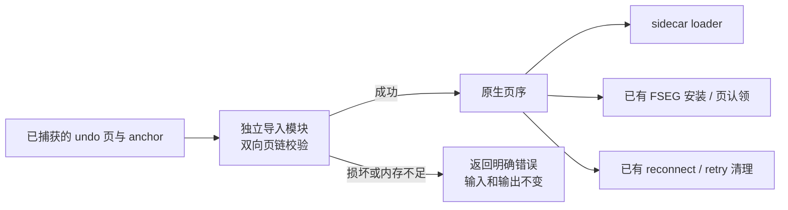

旧 `trx0temp_preserve.cc` 去掉重复 trace/collect，仅保留必要调用和错误传播。两条 anchor 均验证成功后，retry/adopt/reconnect 才继续；页认领区分“验证失败”与“不属于这条链”。源捕获地址读取 helper 留在原处。没有新增 manager、传输协议、原生回滚器或在线升主阶段。

每次收集只建立一次页索引，再遍历选定链，平均复杂度 O(N+L)、辅助空间 O(N+L)，N 是已捕获页数，L 是当前链长度；避免旧路径每走一页都重新扫描完整页数组。这个结论是代码复杂度分析。现有 ownership 调用方仍会对多页重复调用收集，整批成本并未由本片证明为线性，后续统一 ImportPlan 时再收敛复用，不能据此宣称 receiver 已达到性能目标。

11 个新增 GUnit 覆盖损坏 PREV、乱序输入、有序输出、单页、top 早于 last、双 anchor、环/缺页/错误长度/非法 FIL_NULL 节点、输出不变及 OOM。原有两个源码合同检查也作了必要修正：完整签名之后再提取函数体，避免把默认参数 `{}` 当函数体；直接提取失败清理 lambda，避免依赖局部错误变量声明位置。原行为断言保留。


## 后续实现：原生发号与 MTR 暴露的源端缺口

2026-09-21 按用户指令撤回本特性未提交的全部 GUnit 变更和新增 UT target。没有新增 Python 实现脚本；下列功能改动均为 C++，运行验证使用 MTR。

1. `ibt::allocate_preserved_space_id()` 在原池 mutex → reservation mutex 的锁序下分配并预留新目标空间 ID，沿用原 watermark 和保留集合。OOM/耗尽不更新输出或 watermark；释放不倒退发号。普通池发号耗尽由 `SPACE_UNKNOWN` 经 `Tablespace::create()` 返回 `DB_NO_SESSION_TEMP`，不再因 ID 范围耗尽触发断言。该接口目前仍无在线导入调用者，不能据此宣布目标安装已完成。
2. MTR 发现并修正临时表 DD 的 VARCHAR 类型映射缺口。原转换固定使用 DATA_VARMYSQL，导致 latin1_swedish_ci 被误拒绝。现按原生精确 collation 规则选择 DATA_VARCHAR / DATA_BINARY / DATA_VARMYSQL，并保留 binary flag、长度位及严格元数据比较；没有修改公共 InnoDB 类型映射。新用例同时包含 latin1、VARBINARY(512)、latin1_bin、utf8mb4_bin。
3. 多页用例进一步复现源端失败清理顺序错误：store 写失败和重新附回原会话后的通用删除均会先删 undo sidecar；后续临时表清理读取 reservation 证据失败，DRAIN 返回 BATCH_CLEANUP_FAILED。两个删除点现复用已有 remove options 保留当前 manifest 声明的文件，待原 metadata-aware 清理读取、释放、删除。临时 sidecar 清理资格也独立于 snapshot 是否已经存在，防止较早失败时遗漏资源。本片不新增 manager、清理阶段或 RESET DRAIN 逻辑。


新增 `temp_table_capture_multi_page_undo_failure.test` 与 `temp_table_capture_undo_allocation_failure.test` 共用一个 MTR include。128 行已有 inline 值更新后，再 DELETE/INSERT，并混合持久表 DML；第一例要求真实 collector 多页成功 trace **及** snapshot fsync 故障 trace，第二例要求真实 OOM 注入 trace。故障后继续改数、ROLLBACK 恢复全部旧值，再开启新事务 COMMIT，并检查零 artifact/XID 残留。没有放宽错误断言来接纳清理失败。

这两个新用例验证的是复用的源捕获与原会话失败恢复，使用现有 carrier，不执行目标重启恢复或 RESUME，**不能算作 standby 临时表导入验收**。DBUG trace 仅提供运行分支到达证据；SQL 数据断言负责验证结果。服务器重启仅由 MTR 进行用例隔离。

运行日志目录：`/private/tmp/temp-preserve-native-implementation/`。以下均在本 worktree 独立 Debug 构建执行，`--parallel=1 --retry=0`；`shutdown_report` 单独通过，不计入业务用例数。

| 验证 | 实际结果 | 日志 |
| --- | --- | --- |
| latin1 修正前，相同多页 MTR | 失败；服务器明确记录 DD mtype=12、源 mtype=1，未到 collector | `mtr-latin1-red.log`、`mtr-latin1-red-mysqld.err` |
| 修正类型后、清理修正前 | trace 已到 10 页链及 fsync 故障，但 DRAIN 错误为 BATCH_CLEANUP_FAILED；OOM 用例通过 | `mtr-snapshot-cleanup-red.log`、`mtr-snapshot-cleanup-red-mysqld.err`、`mtr-multi-page-red.trace` |
| 修正清理顺序后的两个新用例 + 原有两个失败清理用例 | 4/4 通过 | `mtr-capture-cleanup-green.log` |
| 加入 collation/binary 对照及完整旧值断言后的两个新用例 | 2/2 通过 | `mtr-capture-collations.log` |
| 原生临时表 DML / pool / undo，Preserve OFF、ROW log-bin | 3/3 通过 | `mtr-native.log` |
| 当前二进制下的 temp 动态 OFF 边界及 ReadView standby READY | 2/2 通过 | `mtr-off-ready.log` |
| 原有 GTID ON、真实 TCP standby 至两个 READY | 1/1 通过 | `mtr-ready-gtid.log` |

原生用例是 `innodb.dml_operations_temp_table`、`innodb.session_temp_tablespaces`、`innodb.undo_log_temp_table`；原有失败清理用例是 `preserve_trx.fault_injection_cleanup`、`preserve_trx.temp_table_sidecar_snapshot_write_failure_cleanup`。这些原生回归尚未命中新分配 API 的 OOM/耗尽分支。没有运行 Python E2E、全量 Preserve/Resume 回归、真实物理升主或新后端继续 FETCH；不作 READY/RESUME 性能达标声明。

后续必须把新发号 API 接入已有 prepared owner 下的目标 ImportPlan，再实现镜像/表/索引/undo 地址转换及原生安装；当前仍不能打开 standby 临时资源准入。升主及 SQL RESUME 固定入口保持原合同。

## ImportPlan：源文件持有、原生目标身份和页结构转换

2026-09-21 继续在 `trx0temp_preserve_import.cc/.h` 实现 C++，没有新增 Python 编辑脚本或 UT。

- 新增单一 `trx_preserve_temp_import_plan`，按空间持有源只读 fd、纯物理描述和完整 DD bindings。失败时局部 RAII 关闭 fd，成功后才加入计划；源与目标描述分开，目标 descriptor 保持 `sealed=false`。当前还没有接入 prepared PImpl，不把这个类型的存在算作 receiver READY 或原生安装已经完成。
- receiver 的最终调用合同是使用 SEAL 时验证并固定的同一个 FD，不能验证路径后再重新打开。本模块检查 page 0、FSP_SIZE/FREE_LIMIT 和各索引 root 身份；不在 READY／RESUME 重读整份镜像 hash。2026-09-22 已增加共享文件 owner 和 FD 入口，见本文末尾实施记录；path 入口仍自行校验完整 digest。FD、文件字节和元数据的实际预算尚待接入。
- `allocate_target_ids()` 复用 `ibt::allocate_preserved_space_id()` 和 `dict_hdr_get_new_id()`，分配新的 space/table/index 身份。部分成功后保留已取得的 ID，重试复用；退出释放 reservation，不回退原生水位。此版原型的共享字典发号只能在物理 fence 后安全使用，当前唯一运行调用者是 DBUG 限定的 MTR probe；**2026-09-22 已确认这不能作为正式性能方案：③发号后全量转换不合格，不能将该调用直接前移到仍在回放的 receiver。** 稳定预热身份须按详细设计 §5.2.1 继续实现，未新增外部升主阶段。
- `rewrite_page_identity()` 在调用方的单页 buffer 上转换结构身份：FIL_PAGE_SPACE_ID、page 0 的 FSP_SPACE_ID、有效 index 页的 PAGE_INDEX_ID、绑定根页两段 FSEG_HDR_SPACE。它保留页号、inode/segment ID、原事务/undo/LOB 历史。源 XDES 缓存每空间一页，失败先撤销缓存标记；普通 free 页不解释残留 index ID。绑定根页及有效 FSP 保留页必须 allocated。
- 真实 MTR 暴露并修正了原生 bitmap 特例：`fsp_init_xdes_free_frag()` 将 descriptor+1 槽标为 used，但临时空间跳过 bitmap 页初始化，因此该槽可合法全零。只允许这个有原生页号依据的特例，其他已占用零页仍拒绝。
- 复用原有 DD binding validator，新增一个不访问 live fil/dict cache 的薄入口。SQL 旧文件只增加 DBUG probe 入口；新增功能逻辑继续位于独立 InnoDB 文件。


上图记录这版结构转换原型的顺序，不能作为 2026-09-22 之后的正式升主时序。正式合同要求稳定目标映射及数据规模相关的转换/安装在 receiver READY 前完成，③只复核并短接管。

**当前边界：**该方法只改调用方 buffer 的结构字段，尚不写目标镜像文件，也不 seal/adopt。当前行 DB_ROLL_PTR、BLOB external references、undo 重编码/原生页与 slot 分配及事务级一次接回仍待实现；不能将这些页直接交给 RESUME。新旧 LOB 页类型已在结构身份层识别，整张 LOB 引用图仍待后续校验/转换。原生 parser 的非受控指针读取不能直接用于未预检数据；后续记录解析先做整数 offset 边界检查。

新增 `temp_table_import_target_identity` 与 `temp_table_import_target_allocation_failure` 两个 MTR，复用前述 128 行、多页 undo、持久表混合操作背景。DBUG probe 读取真实 DRAIN sidecar，调用新原生发号器和转换器；成功例检查新 ID 重试稳定、reservation 最终释放、FIL/FSP/index/FSEG 身份正确以及重读源页字节不变；失败例命中原生发号 OOM。随后均继续源端 DML、完整 ROLLBACK 和新事务 COMMIT。测试没有伪造成功的物理升主或目标 SQL RESUME。

独立只读 review 另发现新 DBUG 入口组织 bindings/groups/path 的 `bad_alloc` 不在内核 probe 的异常保护内，会绕过 sealed sidecar 清理。新增局部 catch，并用第三个 MTR `temp_table_import_probe_allocation_failure` 在真实 sidecar 封存后触发该异常，验证清理、原会话继续操作及回滚。此测试入口不会进入 Release 的 DBUG_OFF 路径；不增加任何生产升主阶段。

| 本轮验证 | 实际结果 | `/private/tmp/temp-preserve-native-implementation/` 下日志 |
| --- | --- | --- |
| 初版转换 MTR | 失败：page 1、type 0、DB_CORRUPTION；原生 bitmap 占用但全零 | `mtr-import-identity-diag.log`；对应 vardir 的 `temp_import_target_identity.trace` |
| 修正后 Debug mysqld | 构建成功，退出 0 | `build-import-verified.log` |
| 目标身份转换 / 发号 OOM | 2/2 业务用例通过，退出 0；成功 trace 为 11 个占用页 | `mtr-import-target.log` |
| 原两项 capture 故障 + temp 动态 OFF 边界 | 3/3 业务用例通过，退出 0 | `mtr-import-regression.log` |
| review 后最终 Debug 构建 | 构建成功，退出 0 | `build-import-probe-cleanup.log` |
| 最终三个 import MTR | 3/3 业务用例通过，退出 0；含新增 probe 分配异常清理 | `mtr-import-reviewed.log` |

各轮 `shutdown_report` 单独通过，不计业务用例。本轮共 6 个不同业务 MTR 通过，其中最终二进制复核了全部 3 个 import 用例。所有 MTR 使用本 worktree Debug、独立 vardir/tmpdir、`--parallel=1 --retry=0 --mysqld=--skip-log-bin`。尚未跑本轮 Python E2E、完整回归、真实备机在线升主或性能验收。暂存区和 GUnit 修改为空，没有提交。


## 2026-09-22：私有源字典和有界记录布局

在当前主目录直接实现 C++；本轮新增内容仍主要位于两组 InnoDB 专用文件，旧文件只提取字典构造 helper 并保留发布、错误传播和 DBUG 入口。没有新增 UT、Python 内核或编辑生成脚本，没有提交。

### 私有字典及原生所有权

`trx_preserve_temp_import_create_dictionary()` 从已验证的 DD bindings 构造临时表私有字典，复用原生 `dict_index_add_to_cache()` 规范化聚簇/二级索引字段。该原生接口会计入 index 内存，但私有 table 不进入全局 hash/LRU，不注册 fil、不挂业务 THD，也不调用目标发号器。不能把 index 的 `cached` 布局标记误当作 table 已全局发布。

专用 owner 按相反顺序调用原生 index remove 和 table free，归还 index 内存及锁对象。未被原生接口消费的 raw index 也由局部 owner 保护；异常后两类对象各有一个清理者。MTR 在两个索引规范化后注入分配异常，要求 trace 同时包含故障点及 `released indexes=2`，并验证源事务仍能继续、回滚和提交。这里覆盖可返回/抛出的错误，不声称把原生 allocator 的所有致命 OOM 改为可恢复错误。

`ImportPlan::prepare_source_dictionary()` 在 target-ID 分配前执行，冻结源空间集合；部分成功对象可供重试，全部完成前 getter 不暴露字典。现有恢复 helper 复用该 factory，在同一 `dict_sys` 临界区判重和发布；提前 reserve owner 向量，避免发布后再分配 vector 失败留下孤立 cache 对象。冲突返回先解锁再销毁私有 owner。

### 有界记录解码

新增 `trx0temp_preserve_record.cc/.h` 使用整数 offset 解析单个未压缩索引页，不要求传入 buffer 页对齐。输入必须来自现有白名单绑定和原生规范化字典。它检查页头/源身份、有效记录链、目录归属、heap 号及记录物理跨度，支持 COMPACT/DYNAMIC 和 REDUNDANT 的叶/非叶记录、删除标记、NULL、变长长度和 external 标志。当前只返回字段位置，不改写页或源文件；完整成功后才替换输出。

独立 review 和真实页副本 MTR 已复现四项布局漏检：旧格式 sentinel 字段数、非 NULL fixed 字段宽度、NULL 的物理占用、变长列上限。补齐使用原生类型规则：旧 NULL 按 `get_null_size(0)`，非 external 值按原列最大长度及索引 prefix 上界，BLOB 的最大值不能取 pack length。external 仅允许聚簇叶中合法可外置字段，并保留尾部引用最小跨度。该校验不替代 B-tree 排序、free-list 历史内容、undo 图或 BLOB/LOB 引用图的后续完整校验。


当前 MTR probe 才把源页解码与结构身份转换串起来，不能据此称 receiver 生产接线已完成。probe 在完整有界校验之后才调用原生 `rec_get_offsets()` 作逐字段对照；不把未经预检的网络数据交给原生裸指针 parser。记录解析按页有界，但仍有每页和每记录的临时分配；尚无吞吐或 NFR 数据，不作快速 READY 的性能达标声明。

### 真实数据与验证范围

新增私有字典和分配失败 MTR；另有记录基础、COMPACT、REDUNDANT 三个用例。格式矩阵包含 1024 行、复合主键、nullable 唯一二级索引和 prefix 索引；覆盖 NULL、空值、127/128/255/256/512 字节、二进制和实际 utf8mb4 中文/emoji。事务内 UPDATE/DELETE/INSERT 混合持久表修改，捕获后继续写入、完整 ROLLBACK 检查旧值，再开新事务 COMMIT。损坏测试只改已捕获真实页的内存副本，要求 `DB_CORRUPTION` 且调用方输出不变。

并发 reader 用例保持另一连接的同名临时表及只读事务，核对数据未变，退出只读模式后继续 CREATE 和写新临时表。它证明本切片不发布/覆盖那个 live 对象，不等于真实 receiver 数字 ID 冲突、物理回放或在线升主已验收。

证据统一保存在 `build-debug/temp-preserve-implementation/2026-09-22/`。较早已结束的 MTR vardir 已释放，其完整 log 目录归档为 `completed-mtr-logs.tar.gz`，文件列表为 `completed-mtr-logs.list`；每轮顶层 MTR 日志仍保留。

| 验证 | 已取得的证据 | 日志 |
| --- | --- | --- |
| 私有字典修正前 | 两项 RED：故障点未到、成功探针未到 | `mtr-dict-red.log` |
| 私有字典及全部当时 import 用例 | 5 个业务用例通过；shutdown 单列 | `mtr-dict-verified.log` |
| 既有共享恢复路径回归 | 3 个业务用例通过：临时表 DML/rollback/resume、materialize 失败无部分挂接、动态开关 fail-closed | `mtr-dict-existing.log` |
| 记录基础入口修正前/后 | RED 后，6 个当时 import 业务用例通过 | `mtr-record-red.log`、`mtr-record-green.log` |
| 旧格式 sentinel/fixed 漏检 | 两项均错误接受，trace 为 `sentinel=0 fixed=0`，MTR 失败 | `mtr-record-negative.log`，trace 在归档中 |
| 修正上述两项后的 NULL/max 漏检 | sentinel/fixed 已拒绝，NULL/max 仍错误接受，MTR 失败 | `mtr-record-spans-red.log` |
| 最终 Debug 构建 | mysqld 构建成功，退出 0 | `build-record-verified.log` |
| 最终全部 import MTR | 8/8 业务用例通过，shutdown_report 单独通过，退出 0；包含实际 UTF-8 内容与四项旧格式损坏拒绝 | `mtr-import-final.log` |

这些都是 Debug MTR 功能证据，参数为独立 vardir/tmpdir、`--parallel=1 --retry=0 --force --mysqld=--skip-log-bin`。旧恢复用例仅回归本次共享 helper 的行为，不增加 local startup 商用范围。没有新增 UT，没有运行本轮 Python E2E、全量 Preserve/Resume 回归、真实物理升主或最终后端 FETCH。

### 性能约束及外部集成

receiver 既有只读临时用户的隔离和后续发号安全均是正式合同。用户确认物理备机工程不在本地、当前无法访问；稳定目标 table-ID 来源、temp pool/undo/FSEG 跨固定升主过程的寿命仍需集成核验。不能从 `dict_hdr_get_new_id(..., true)` 的不写 redo 推导共享计数页不被物理回放覆盖，也不能假定①～③之外已有新的资源就绪调用。

后续本地先打通不依赖目标 ID 的源页预检和引用提取，再完成目标身份保护、undo/LOB 重编码及 receiver prepared owner 接线。正常完整方案必须在 receiver READY 前完成随总数据量增长的准备；①～③只做原有流程内的复核和短接管，④ SQL RESUME 不补扫描。外部工程不可访问不阻塞这些独立切片，也不构成放宽 READY 或提前开放 standby 临时资源准入的依据。

空间清理保留了旧 worktree 源码与当前构建，归档旧构建的 9 个 MTR log 目录和 CMakeCache 后删除旧 `build-debug`；另归档并删除本轮 8 个已结束的 MTR vardir。旧归档和清理记录在 `build-debug/temp-table-preserve-migration/2026-09-22/`。保留主目录的可复用压测数据，未使用 `git clean`。

## 2026-09-22 后续：源页预检与原始引用提取

完整目标继续保持用户临时表、待 FETCH 结果及其承载资源的 standby transfer → 固定在线升主 → 新后端 SQL RESUME。上一片是已验证的实现进展，不是完整交付；本片继续移除 receiver 提前准备的依赖，并补齐实际转换需要的源引用输入。

`ImportPlan::inspect_source_page()` 现在可在目标发号之前调用。它使用同一计划的源 fd、XDES 和私有源字典，返回页是否占用、借用该计划寿命的索引以及有界记录信息。原 `rewrite_page_identity()` 的结构校验抽成内部 `Space::inspect_page()`，两处共用原有根页、FSEG、free 页和全零 bitmap 规则；没有复制第二套页分类。错误不覆盖调用方输出；成功处理非 index/free 页时输出不残留旧记录。未增加 native fil/dict/undo 发布或新的升主阶段。

记录解码器只对聚簇叶提取系统字段，按 `get_sys_col_pos()` 每页定位，保存 `DB_TRX_ID`、`DB_ROLL_PTR` 的原始值及页内位置；external 字段保存字段编号、引用位置和完整 20 字节。只做有界读取，**不把引用值直接认定为仍然存活的依赖**：

- 已提交 baseline 行保留旧事务号和可能已回收的 insert-undo 地址；不能要求全部指向本次当前 undo 图。
- `roll_ptr=0` 和仅 insert bit 的标记原样保留，不解析为目标实例的临时 undo 空间。
- external 的 offset/LOB version 共用一段编码，flags 包含所有权、继承和 being-modified；不按统一页内 offset 或完整 64-bit 长度解释，不丢弃 delete-marked/nonowner 记录。

原生依据为 `trx0undo.ic` 的 roll pointer 编码、`row0row.ic` 的系统字段定位，以及 `lob0lob.h` 的 20 字节引用规则。后续 undo/LOB 图校验和转换仍须结合事务、记录类型及历史关系完成。


运行 probe 已先遍历和核对全部源页，再进入目标发号；检查原页重读不变、受损源身份返回错误且输出不变。原生 offsets、事务号及 roll pointer 与新解码结果逐一比较。probe 的额外重读和对照仅用于 MTR，生产 receiver 不能照搬多次整文件遍历；本片没有把源预检成功升级为 target READY。

另修正 `add_source_space()` 的索引号判重范围：table ID 继续全实例唯一，index ID 只在单个 source space 内判重，后续查找仍用原 `Space::indexes`。`dict0types.h` 的 `space_index_t/index_id_t` 与原字典 `(space,id)` 查找是依据。新 `index_scope` MTR 在真实 capture 后验证元数据准入：不同 space/table、相同 index ID 必须到达故意缺失第二文件的 `DB_IO_ERROR`；重复 table ID 仍在打开文件前返回 `DB_CORRUPTION`，既有计划保持不变。该用例没有安装第二份镜像，不宣称完成双空间导入或再次 Preserve 验收。

新增 DYNAMIC / REDUNDANT 大 BLOB MTR：32 行初始值，各个非空值 28 KiB；事务内替换、DELETE 和新增，同时操作持久表。运行中实际提取 34 个聚簇记录、27 个 external 引用及两个不同事务号，包含当前与历史行。原始引用的零值、insert marker、owner/inherited/being-modified 位、FIL_NULL/零长和超过页大小的 version 字节均在真实页副本上确认原样保留。之后源会话继续改 BLOB、完整 ROLLBACK 验证全部旧大值，再次 COMMIT 验证新值。

| 本片验证 | 实际证据 | 日志（同前述证据目录） |
| --- | --- | --- |
| 源预检未接入时 | 新 MTR 缺少目标发号前预检分支，RED | `mtr-source-preflight-red.log` |
| 拆出源预检后 | source_preflight 通过；两个 BLOB 引用入口及 index_scope 尚未实现，三项 RED | `mtr-source-refs-red.log` |
| 加入原始引用提取 | DYNAMIC、REDUNDANT BLOB 与 source_preflight 三项通过；index_scope 精确返回旧 `DB_CORRUPTION=39`，失败 | `mtr-source-refs-check.log` |
| 最终 Debug 构建与全部 import MTR | mysqld 构建退出 0；12/12 业务用例通过，shutdown_report 单独通过，MTR 退出 0 | `build-source-refs-final.log`、`mtr-import-source-final.log` |

这批测试仍是本工程源工件/导入 helper 的运行证据，未打开正式 standby 临时资源准入。没有新增 UT 或 Python 内核逻辑，也没有提交。

本片之前已结束的五个测试数据目录也已清理，其完整日志归档为同证据目录下的 `completed-source-reference-mtr-logs.tar.gz`，并保留 tar 文件列表。最终 `var-temp-import-source-final` 仍在，避免后续构建空间被重复初始化的测试数据持续占用。

游标侧独立源码审核继续确认 A 是最小的生产候选：在 `mysql_open_cursor()` 完成物化后、原 `Materialized_cursor::open()` 前扫描最终 handler；schema/result charset 在原 metadata 回调保留。尚未选择为默认行为，须先按 P3 验证 MEMORY、TempTable、InnoDB、spill、失败语义和普通 EXECUTE 成本。不能改用响应包快照，也不能丢失 FETCH 时使用当前时区、sender 沿用 EXECUTE 时字符集的差异。

## 后续纵向链

### 2026-09-22：有界 undo 帧及公共头解析

新增 `trx0temp_preserve_undo.h/.cc`，解析单个已捕获页的物理记录帧、通用头及 UPDATE/DELETE 的旧系统字段。沿用已存在的页链 collector；新解析器检查 rseg space/page/type、选定 anchor 的日志起止、记录 next/footer 以及记录类型，不访问 live 字典或目标分配器。成功后一次性替换输出，失败不改输入或原输出。

输出保留 undo_no、table_id、old_trx_id、old_roll_ptr 的原始数值和压缩编码跨度，以及 row reference 的起点。table ID 和旧回滚指针的编码长度可能变化，不能按行记录中的固定宽度原位覆盖。压缩读取同时支持原生 F8/FC/FE 高值编码和合法的旧 F0 长编码，且所有读取都以当前记录 body 末尾为界。

此接口**只验证帧和公共头**，不验证主键引用、update vector、ordering tail 和其中的历史 external 引用，也不从物理记录自动推定有效 rollback 前缀。未知 table ID 原样保留，因为整条事务 undo 可以涉及其他临时表或已经 DROP 的表；下一步必须结合完整源绑定集合处理。输出不能作为 target READY 证明。目前运行接入只在 Debug capture probe；正式 receiver prepared-owner 接线仍待后续完成。

两名独立 reviewer 对照原生读取器审核后，发现初版日志起点下界只越过 OLD_HDR_SIZE，会把 XID 预留区误当记录。已先在真实页副本构造合法 framing 的伪记录，MTR 复现错误返回 DB_SUCCESS，再按本树 `trx_undo_header_add_space_for_xid()` 的 create/reuse 规则收紧到 XA_HDR_SIZE。该空间在未设置 XID flag 时也会预留。

新增 `temp_table_import_undo_headers.test`，并扩展已有 DYNAMIC/REDUNDANT 大 BLOB case。普通多页事务实际对照 11 页、146 条头部；BLOB 用例实际对照 2 页、16 条。只在有界检查成功后调用原生 `get_pars/get_sys_cols`，并验证 8 种损坏副本被拒绝、输出保持不变。所有用例继续验证捕获失败后的 DML、完整 ROLLBACK、再次 COMMIT 和无残留。

| 验证 | 结果 | 证据文件，同本轮证据目录 |
| --- | --- | --- |
| 旧二进制、新入口 case | 缺少解析分支，RED | `mtr-undo-headers-red.log` |
| 初版解析，多页和两种 BLOB | 3/3 业务通过，shutdown_report 单列通过 | `mtr-undo-headers-check.log` |
| XID 预留区伪记录 | 解析器错误接受，故障 7 返回 DB_SUCCESS，RED | `mtr-undo-reserved-red.log` 与归档 trace |
| 修正下界后的构建及 import 集合 | mysqld 构建退出 0；13/13 业务通过，shutdown_report 单列通过；MTR 退出 0 | `build-undo-headers-final.log`、`mtr-undo-headers-final.log` |

本片用例及依赖 include 无 `DEBUG_SYNC`。上述 DBUG 对照仍仅是内部辅助验证，未运行真实 standby promotion、proxy 新后端继续 FETCH 或性能验收。三个已结束的中间 MTR 数据目录在完整日志归档验证后删除，归档为 `completed-undo-header-mtr-logs.tar.gz`，保留 336 项 tar 列表。最终 vardir 已移至同证据目录下的 `var-temp-undo-headers-final/`，保留当前构建；后续 MTR 使用 build-debug 下的绝对 vardir，避免相对路径在 source mysql-test 下生成测试数据。

下一步另需验证空 undo 对象语义：原生 `undo->empty` 与指针是否存在不同，当前 anchor 不表达 empty，reconnect 将其设为 false。显式 SAVEPOINT/DROP 被当前准入阻挡；首行唯一键 UPDATE 失败后的内部回滚是否绕过 history 标记，尚只有源码推导，须运行普通 SQL 轨迹确认，不能宣称已复现恢复故障。不得靠忽略空对象的 slot/FSEG 所有权规避此问题。

本片通过不能勾选 P1 完成。P1 仍须目标原生空间／表／索引／undo 分配、记录及历史 BLOB 引用的地址转换、原生 FSEG 安装、目标在线冲突、继续 DML／COMMIT／ROLLBACK／再次 Preserve 的运行证据。之后按 V11 §12 推进用户表资源 token、P2 连续增量、P3 结果路线、P4 PS/命令语义、P5 ReadView 及联合 receiver READY/RESUME。每片各自记录可验证出口，最终仍覆盖全部已选支持矩阵。

### 2026-09-22：undo 字段、历史 BLOB 引用与多表覆盖

在同一 `trx0temp_preserve_undo` 模块新增字段级解码，输入已验证的单条 header 和匹配的 source clustered index，输出主键 row reference、updated vector、ordering tail 三组字段。每项保留字段号、编码／payload／LOB 后缀跨度、NULL、external、原始 local 长度及 raw20 引用。不访问目标发号或 live 字典；MTR 专用 probe 才在短期字典保护下借用源 live index，与原生 `trx_undo_rec_get_col_val()` 逐项比较。

落实了原生格式中的差异：REDUNDANT 的 undo NULL 不占 payload；updated external 后可有合法 `flags=0,N=0` 后缀；ordering external 接受普通 SPATIAL_NONE；扩展前缀的 raw20 位于实际 payload 末尾，不位于 orig_len 末尾。当前白名单外的 virtual、spatial external、JSON partial diff 不被当作普通字段继续读取。头部和字段解码仍不等于 undo／LOB 图完整性校验，也没有执行目标重编码或 native 安装。

两名独立 reviewer 同时指出 ordering tail 缺项可能隐藏旧索引/BLOB 引用。已用真实记录的空 tail 副本复现 DB_SUCCESS，再按原生 writer 的 `table col → get_col_pos()` 集合检查全部必需项；尾部长度合法但集合缺失同样拒绝。失败不覆盖三组输出。probe 对空串主键的注入空间判断也已修正，随后用真实 VARBINARY 空主键验证。

| 工作负载 | 实际字段解码证据 |
| --- | --- |
| 原多页 inline 事务 | 146 条 undo，562 个字段 |
| COMPACT／REDUNDANT 复合主键、NULL、变长与 utf8mb4 | 每种 334 条 undo、1846 个字段、272 个 NULL；204 次 UPDATE＋128 次 DELETE＋2 次 INSERT，已提交的 1024 行基线不计入当前 undo |
| DYNAMIC 大 BLOB 前缀索引，事务内重复替换旧值 | 17 条 undo、73 个字段、19 个 external，其中 19 个扩展前缀、10 个 ordering external |
| REDUNDANT 同一 BLOB 工作负载 | 17 条 undo、73 个字段、19 个 external，0 个扩展前缀；按该格式已有的 local prefix 处理 |
| 同事务两张临时表、空二进制主键、DELETE 后同键 INSERT | 69 条 undo、138 个字段、两个 table ID；实际覆盖 INSERT／UPD_EXIST／UPD_DEL／DEL_MARK 四种记录；捕获失败后继续 DML、ROLLBACK 恢复全部旧值，再次 COMMIT 验证成功 |

新增 `temp_table_import_undo_fields`、`temp_table_import_undo_multitable` 两例，并扩展现有 layout/BLOB 用例。没有 `DEBUG_SYNC`，没有新增 UT。用例仍为本工程内部 DBUG 对照与故障捕获验证，不是物理备机或 proxy 后端重建验收。

证据在 `build-debug/temp-preserve-implementation/2026-09-22/`：

- `mtr-undo-fields-red.log`：旧二进制缺少字段入口，RED。
- `mtr-undo-fields-check.log`：初版字段解析的 3 项业务通过，shutdown_report 单列通过。
- `mtr-undo-ordering-red.log`：缺失 ordering 集合错误接受，trace 返回 DB_SUCCESS，RED。
- `build-undo-fields-final.log`：最终内核构建退出 0。
- `mtr-undo-fields-final.log`：15 项业务中的 12 项通过；两项 layout 因测试误把 baseline 数量作为 undo 下界而失败，多表例因 result 漏写预期 DRAIN 错误行而失败。实际 native 对照及多表数据断言均已成功；未放宽内核校验。
- `mtr-undo-fields-verified.log`：按 SQL 工作量修正为精确 334 条，并补齐预期错误输出后，只复验上述 3 项，全部通过，shutdown_report 单列通过，退出 0。因此当前 15 项均有最终通过证据，不能把此前失败日志描述为单轮全绿。

四个已结束的数据目录（含上一轮 headers 最终目录）已验证归档后删除，日志归档 `completed-undo-field-mtr-logs.tar.gz` 含 353 项；当前两份 fields 最终／复验目录保留。没有提交或暂存。

### 下一段生产接线的源码核查

目前 `preserve_trx_transfer.cc` 的 portable object builder 和 strict eligibility 都明确拒绝 temp manifest，staging loader 尚未按 manifest 关联 temp sidecar；虽然已有 TEMP_TABLE_SIDECAR wire kind，不能只给 ready-cache 增加 ImportPlan 就称实际接通。最窄 receiver 工作点是 `run_receiver_staged_token_prewarm_job()` 载入 staged bundle 后、任何 ready-cache 预热之前，资源仍归现有 prepared-token resources；源预检成功不能借用会被当作 READY 的 PREWARMED_PENDING_FINAL_FACT 状态。

当时确认的接线缺口是对象封存按路径验证 digest、后续读取重新打开路径。2026-09-22 的下一片已增加 SEAL 返回同一已验证 inode 的持有权，详见末尾记录；不能假定路径存在就等价于 object lease。后续解析／私有准备仍须在对象锁外执行，按现有 generation/object-set digest 发布；不靠全局 registry 锁包住 I/O，不增加第二个资源管理器。undo 图由 token 持有一份，不能复制进各个 data Space。

游标独立核查确认创建期捕获窗口仍是原 `mysql_execute_command()` 成功后、`Materialized_cursor::open()` 前，metadata 在原 callback 深拷贝，工件跟随原 cursor owner 的 close/reset/EOF 生命周期。现有 warm carrier 白名单及资源计费尚需增加结果 family，且 adopt 会移走文件，不能直接 adopt 活跃 PS 原件。下一段应从真实创建、持有和释放路径实施，不能再把仅有 codec 的验证算作结果迁移支持。

### 2026-09-22：事务级源 undo 接入 ImportPlan

新增 `prepare_source_undo()`，复用已有链、头部和字段解码器。源表字典建立成功后一次发布 table-ID 索引；每个 token 只保留一份 undo descriptor、记录地址索引及必要的历史 external 引用，不将同一图复制到每个 data Space。两条流各自按 undo_no 递增，用线性合并检查跨流重复；在完整命令边界核对 header 事务 ID 和非空 anchor top。先按旧事务 ID 区分当前事务与已提交基线，再解析当前事务内的前驱地址，检查类型、表身份和更小 undo_no。没有目标 live rseg 查找或目标 ID 分配。

SQL 专属模块新增 `preserve_trx_temp_table_prepare_source_import()`：接收 codec 已验证的 manifest，按空间持有源 FD 和私有字典，读取并验证一份 undo sidecar，然后移交给同一个 plan。所有权只在全部成功后移动；错误/OOM 不覆盖调用方输出。undo payload 在加载后释放，字段临时向量逐记录释放，未保留全量 decoded fields。复审修正了一个过严判断：只有存在 undo sidecar 时才要求 native adoption proof，无 temp undo 的合法清单返回零 undo records。


新调用点位于源 capture 的 manifest encode/decode 之后，由 DBUG 控制；没有接入 receiver/prewarm，没有放宽 strict eligibility。路径入口要求调用方禁止源文件写入；后续新增的 FD 入口才用于接收端持有同一验证文件。V1 owned-but-empty、DROP 表绑定、next_undo_no 上界、叶记录到 undo／LOB 的闭合、跨空间新版清单和目标重编码／安装仍未完成。

本轮新增 `temp_table_import_source_without_undo` 和 `temp_table_import_source_undo_allocation_failure`，扩展原 multi-table、inline、DYNAMIC／REDUNDANT BLOB 用例。复核新旧 19 个本特性用例及递归 include，不使用 DEBUG_SYNC；内部 DBUG probe 不算可移植的完整 HA 验收。仍未新增 UT、暂存或提交。

| 验证 | 实际结果 | 本轮证据目录内日志 |
| --- | --- | --- |
| 新多表断言运行旧二进制 | 缺少事务级 source import 分支，RED | `mtr-source-undo-red.log` |
| mysqld 最终构建 | 退出 0 | `build-source-undo.log` |
| 6 个定向业务 MTR | 同一轮 6/6 通过；shutdown_report 单列通过；退出 0 | `mtr-source-undo-check.log` |

实际 trace：多表图 69 条记录、2 条当前事务前驱；inline 图 146 条记录、16 条前驱；两种 BLOB 各 17 条记录、2 条前驱、19 个 external 引用；无 temp undo 用例为 0 条记录。均未分配目标 ID。前驱 probe 验证 5 种错误引用被拒绝，以及已提交基线地址别名不会被误链接；分配失败发生在 descriptor 移交之前。各例均检查失败捕获后的业务数据、继续 DML、ROLLBACK、再次 COMMIT 和无保留残留。

### 2026-09-22：receiver 保留已验证文件，ImportPlan 共享同一 FD

新增 `sql/preserve_trx_file.cc/.h`，用一个只读 owner 保存 FD、已验证长度和 SHA256。open、fstat、流式 hash 使用同一 FD；读取限定在已验证前缀内，unlink 或路径重建不影响已持有文件。生产 `SEAL_OBJECT` 对 TEMP_TABLE_SIDECAR 返回此 owner，登记在既有 receiver record 中；BEGIN 重复同一对象清单可保留引用，替换对象、终止或退休按原 record 生命周期撤销引用。没有第二个全局资源管理器。最后一个引用可能触发 close，因此 record 输出替换和删除的旧引用在 registry 锁外释放。


重传先比较已有范围，只写超出已有文件的尾部；相同内容不再改写已验证前缀。数据与 `.ranges` 的写入仍保持既有顺序，完整重传仍记录原范围，覆盖上次数据成功、范围落盘失败的恢复情形。比较和写入使用一次打开的 FD，避免清理重建路径时读写不同 inode。

ImportPlan 的 path 与 FD 入口共用元数据、重复身份和物理页检查。path 入口在元数据通过后打开并完整验证 hash；FD 入口只核对已验证长度/digest 后读取所需页。两者均不分配目标 ID、不发布 live 表，也不代表 READY。

新增 `temp_table_import_receiver_file`，不使用 DEBUG_SYNC。内部 DBUG probe 直接调用真实 stage/seal/registry，绕过 wire sequence 去重：首次真实写必须命中写失败注入；已封存文件删除 `.ranges` 后的全量重传必须避开该写分支并重新 seal；冲突内容被拒绝；清理、同路径重建再清理、registry 终止后，从 registry 副本取得的 FD 仍可读取旧内容。随后 ImportPlan 实际读取页头和 root，完成源 undo 准备，再抵达后续 snapshot fsync 故障。MTR 继续检查业务 DML、ROLLBACK、再次 COMMIT，单独断言该 probe 的 `.transfer` 目录无残留。

**尚未完成的边界：** receiver prewarm 尚未从 record 消费这些 FD 并形成可 READY 的完整目标资源；文件/FD 额度与背压尚未接入。当前 SEAL 的完整 hash 仍在原 object stage 同步域内，未证明其长锁性能。strict 临时资源准入未放开，未改固定升主入口或 SQL RESUME，也未实现游标迁移。本片测试不能作为物理备机升主或快速 READY/RESUME 的验收证据。

本片实际验证（日志均在 `build-debug/temp-preserve-implementation/2026-09-22/`）：

| 验证 | 结果 | 日志 |
| --- | --- | --- |
| 新 receiver 文件 MTR 对旧二进制 | 缺少新 probe trace，RED，退出 1 | `mtr-receiver-file-red.log` |
| 第一轮 18 项 import MTR | 17 通过；index-scope 因 hash/open 提前于重复 ID 检查而失败；shutdown_report 通过，退出 1 | `mtr-receiver-file-check.log` |
| 修正后 mysqld 构建 | 成功，退出 0 | `build-sealed-file-verified.log` |
| 最终 18 项 import MTR | 同一轮 18/18 业务用例通过；shutdown_report 单列通过，退出 0 | `mtr-receiver-file-verified.log` |
| 既有 TCP/GTID strict-ready MTR | 1/1 业务用例通过；shutdown_report 单列通过，退出 0 | `mtr-receiver-tcp-verified.log` |

index-scope 修正保留原重复 table ID 拒绝断言，将 path/FD 两入口收敛到同一验证实现，先检查元数据，再做路径 I/O；未修改期望错误来规避失败。最后的 TCP 用例验证既有 binlog/record transfer 和 READY，未传用户临时表，也未执行物理升主。独立复审递归检查 20 个新增特性 MTR 及其 includes，共 27 个文件，DEBUG_SYNC/have_debug_sync 命中 0。仍未新增 UT、暂存或提交。

### 2026-09-22：真实游标创建时捕获与生命周期验证

新增 `sql/preserve_trx_cursor.cc/.h`，把候选 A 接入真实 Classic PS 游标：在原 metadata 回调保存列描述；查询物化完成后、原生 cursor open 之前扫描最终临时表，将值写入匿名文件。只在 Preserve 开启、STANDBY_TRANSFER_SAVE 和新增启动开关 `rds_preserve_trx_result_capture_enable=ON` 同时满足时捕获；新开关默认 OFF。普通 SELECT 不创建工件，SQL PREPARE/SP 游标不因此进入捕获范围。

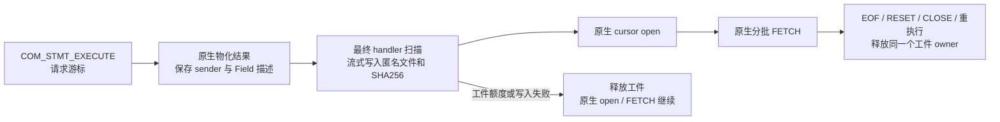

工件由 `Materialized_cursor` 独占持有，不保留源 TABLE/BLOB 指针。固定写缓冲和字段缓冲计入既有内存租约；全局工件数量、保留字节分别受新启动参数限制。大 BLOB 直接分段写入，不复制完整 BLOB。写入过程中累计摘要，完成后才允许按 FD 读取。值采用各 Field 自己的 pack 格式，BLOB 为原始字节；不能按 TABLE 字节序标记统一转换。源 BLOB `pack_length` 含指针槽，只描述源记录，不能解释为工件 payload 长度。

文件创建、额度、可选写入失败只撤销工件，不重执行查询；原生 handler 错误或 KILL 仍按原生错误处理。工件与原游标一起关闭；精确取完最后一批尚未探测 EOF 时仍保留，下一次正数 FETCH 才确认 EOF。新状态量报告 live 数量、保留字节、成功捕获数与失败数。

共享资源租约同步修复了分配异常的计费顺序：先构造 lease token 和两个 map 节点，再发布字节数；第二节点分配失败撤销新建的第一节点；释放通过借用 token 查找，不再在析构时分配字符串。此修正不代表其他 native-binlog FD/tmpdir 初始申请路径的所有 OOM 行为均已审查或修复。

本片 MTR 发现两个 OFF 模式也能复现的原生游标问题，均保留相同轨迹的失败与通过日志：

| 问题 | 触发与修复范围 |
| --- | --- |
| MEMORY 转 InnoDB 后 FETCH 崩溃 | replacement handler 原来分配在执行期 mem_root，命令结束后失效。只在最终 cursor sink 的转磁盘分支借用 cursor mem_root，普通 UNION 和表达式求值分配路径不变。原 CAST 查询与 UNION DISTINCT 最终结果表均验证实际 memory→disk，再完整分批 FETCH。 |
| 同 PS 从 cursor 切回普通 EXECUTE 断言 | 旧 materializer 继续收行，其空 send_eof 没设置诊断状态。已有 cursor 的普通执行期间临时使用 PS 已有 sender，通过 scope guard 恢复 materializer，继续允许下次 cursor 执行。另将捕获 ID 限定在本次 mysql_open_cursor 内，不遗留到其他执行。 |

四个新增 MTR 入口共享一个 Python Classic 协议测试客户端，覆盖开关组合、部分 FETCH、FETCH(0)、精确尾批与 EOF、RESET/CLOSE/重执行、两个同时打开的结果、数量和字节限额、MEMORY/TempTable/InnoDB 与 MEMORY 转磁盘。类型矩阵核对原生二进制行，包含整数、DECIMAL、时间、BIT、字符集、二进制、BLOB、JSON、空间、ENUM/SET 和 NULL。字段原名等 metadata 一并比较，仅排除原生物化结果去掉的源索引标记；CAST/UNION 表达式的原生 metadata 差异单列豁免，仍逐行比较值。optimizer_trace 检查最终无去重 cursor 表的创建与转换事件，不能把 UNION 中间去重表的 spill 当作成功。

普通三个入口没有调试协调；verify 入口使用 DBUG 对照工件中已有值与 FETCH 当前行的 Field 打包结果，并注入内存分配及写入失败（包括已写出前缀后的失败）。**没有 DEBUG_SYNC，也没有新增 UT。** 这仍是本工程内部捕获验证：DBUG 的再次打包比较不是目标解码回环；Python 只发测试协议命令，不是产品客户端改造。

证据目录：`build-debug/temp-preserve-implementation/2026-09-22/`。

| 验证 | 结果与证据 |
| --- | --- |
| MEMORY spill 原生崩溃 | ON/OFF 均在后续 FETCH SIGSEGV：`mtr-cursor-capture-spill.log`、`mtr-cursor-capture-off-check.log` |
| cursor→普通 EXECUTE 原生断言 | ON/OFF 均为 send_statement_status 的 DA_EMPTY：`mtr-cursor-flag-red.log`、`mtr-cursor-flag-off-red.log` |
| 最终内核构建 | `build-cursor-execute-switch.log`，退出 0 |
| 最终四例 MTR | `mtr-cursor-capture-final.log`，4/4 业务通过；shutdown_report 单列通过，退出 0 |
| 补充自动 reprepare 后四例 | `mtr-cursor-capture-reprepare.log`，ALTER 源表后沿用原 statement ID 普通执行，再打开并取完游标；4/4 业务通过，shutdown_report 单列通过，退出 0 |
| 共享内存计费既有回归 | `mtr-cursor-resource-regression.log`，`temp_table_image_streaming_memory_budget` 通过，shutdown_report 单列通过，退出 0；只作共享路径回归，不新增 local startup 验收范围 |
| 既有 TCP/GTID strict-ready 回归 | `mtr-cursor-transfer-regression.log`，1/1 业务通过，shutdown_report 单列通过，退出 0；没有迁移游标或执行物理升主 |

早期运行另有端口变量、spill 数据类型与 metadata 对照假设错误，分别记录于 check/behavior/lifetime/values 日志；这些失败不能描述为内核捕获正确性的 RED。旧 spill/metadata 数据目录已归档日志到 `completed-cursor-spill-red-mtr-logs.tar.gz` 后删除。后续 switch RED、单例 wide 和初版四例的日志另存 `completed-cursor-switch-mtr-logs.tar.gz`；验证归档完整后删除相应旧数据目录，保留最终 reprepare 与两项共享回归目录。

**还没有交付的部分：** 工件解码、消费位置/索引、原编号 PS 恢复、结果对象传输、receiver 预热与 READY、升主及 SQL RESUME 接线均未完成。创建期扫描也尚未通过性能验收，不能把功能用例耗时当作业务成本。现阶段没有打开 strict 临时资源准入，没有改固定升主阶段，没有把批量工作塞入升主或 RESUME；本片不能标记 P3 或完整需求完成。

### 2026-09-22：消费位置、共享工件与接收端分批结构校验

本段更新上一段的“消费位置/索引”进度，其余完整交付边界继续有效。在当前目录、`ha_preserve_trx` 上接续并验证已有的源端索引与 snapshot 改动，新增接收端结果文件模块 `sql/preserve_trx_cursor_file.cc/.h`。本轮没有提交。

**源端已具备的基础：** 工件升级为 `MPCUR002`，每行有长度边界，每 128 行记录一个磁盘偏移；索引先写匿名小文件，封存时追加到结果文件，避免保留随结果行数增长的内存数组。最终描述包含 statement ID、结果代次、行数、数据和索引偏移、全文件摘要与 schema 摘要。源端和接收端共用同一个定位算法：只读一个索引项，再跳过至多 127 个行长度头；精确尾批尚未探测 EOF 的位置直接指向数据末端，不需要读取已经消费的行值。

`Materialized_cursor` 的命令边界快照保存原 `fetch_count`、`fetch_limit`、开放状态和工件共享引用。源 cursor 关闭后，只要快照仍持有工件，文件及计费继续存活。发送失败会使该代次的位置快照不可用。当前验证入口在完整 FETCH wrapper 收尾后采样；这还没有接入正式 DRAIN 的 PS 状态封存，不是完整 PS/参数描述。共享持有替代上一段的独占工件持有方式，没有复制结果文件或重新执行 SELECT。

**本轮新增的接收端基础：** 文件模块接收既有 `Preserve_trx_sealed_file` owner，使用已验证的同一 FD，核对版本、身份、长度、首尾描述、schema 摘要和索引范围。`open()` 只建立候选，随后 `validate_next(row_budget)` 每次检查有限行数，保存续作位置。每行检查 NULL 标记、字段外层长度和行末精确耗尽，每个索引项必须指向对应行头。全部行完成前不能用于行定位；损坏候选保持失败，不能通过后续调用恢复为成功。文件打开失败不覆盖调用方已有对象。

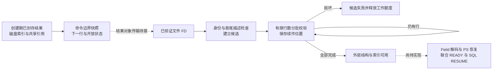

工作缓冲固定为 64 KiB，候选与工作缓冲均计入既有内存租约；工作额度跨批保留，校验完成或失败时释放。读取字段外层结构时跳过值区间，不按完整 BLOB 大小分配内存。按行预算的接口提供续作点，**并不代表已经接入 receiver worker，也不是按字节/时间预算的调度或性能验收**。header/schema 摘要仍在候选打开时处理。最终 worker 调度、元数据/文件/FD 额度和背压、批大小与宽行成本仍需接线和测量；不能据此宣称瞬时 READY。

新增 `cursor_result_capture_file` MTR，复用 Python Classic 测试客户端。接收端 helper 的内部 DBUG 验证复制真实源工件，并重新计算修改后的完整摘要；分别损坏 footer magic、索引偏移、首行长度、NULL 标记、非零列空行、schema 摘要和最后一行长度。最后一项在超过 17 行的真实结果中跨多个成功批次才失败。正常文件按每批 17 行完成，验证 0/1/127/128/129/尾行/数据末端定位；未完成或失败候选不能定位，越界调用不覆盖输出，路径删除后仍可读取已持有 FD。六个游标入口共同补充空结果、FETCH 0、下一次正数 FETCH 探测 EOF 的原生对照，并检查结束后内存计费恢复基线。

这些新增 MTR 不使用 DEBUG_SYNC，没有新增 UT。接收端 probe 仍属于本工程内部验证，不是实际跨实例传输、在线升主或原编号 FETCH 恢复验收。模块目前只验证外层行结构和索引，**尚未验证全部 Field/schema 类型语义或执行 Field unpack**；结构通过不能发布 READY，也不能把外部输入直接交给原生解码器。

日志位于 `build-debug/temp-preserve-implementation/2026-09-22/`：

| 验证 | 实际结果 | 日志 |
| --- | --- | --- |
| 接续源端 snapshot/索引后的构建及五例 | mysqld 构建退出 0；5/5 业务 MTR 通过，shutdown_report 单列通过，退出 0 | `build-cursor-snapshot-handoff.log`、`mtr-cursor-snapshot-handoff.log` |
| 新文件用例运行旧二进制 | 缺少新增状态量，退出 1；只证明新入口尚不存在，不是损坏拒绝的行为 RED | `mtr-cursor-file-red.log` |
| 新模块分批化后单例 | 构建成功；1/1 业务通过，shutdown_report 单列通过，退出 0 | `build-cursor-file-incremental.log`、`mtr-cursor-file-incremental.log` |
| 最终加入尾部损坏后的构建及全部六例 | mysqld 构建退出 0；同一轮 6/6 业务 MTR 通过，shutdown_report 单列通过，退出 0 | `build-cursor-file-reviewed.log`、`mtr-cursor-file-reviewed.log` |

编译初期的 `O_RDWR` 头文件和 `create_temp_file` 参数类型错误分别保留在 preflight/verified 构建日志；其间误用旧二进制的 check 日志不作为实现验证。最终运行参数为 `--suite=preserve_trx --do-test='^cursor_result_capture' --parallel=1 --retry=0 --force`，独立 vardir/tmpdir；没有跑完整 Preserve/Resume 回归或 Release 性能测试。

本会话四个已结束的 snapshot/file 中间测试数据目录已清理；38 项日志与配置归档为同证据目录下 `completed-cursor-file-mtr-logs.tar.gz`，归档清单已比对。最终 `var-cursor-file-reviewed` 保留，未清理其他会话的目录。

**下一段仍需落地：** 有界 schema/Field 值解码、恢复 cursor 与静默 sender、完整 PS 运行态及原编号安装、结果对象传输和 receiver prepared owner 的生产接线；同时继续用户临时表目标引用转换、在线安装与原固定入口的联合 READY/RESUME。strict 临时资源准入继续关闭，固定升主入口、SQL RESUME 与 RESET DRAIN 本轮没有增加逻辑。

### 2026-09-22：原生 Field 解码、独立文件游标和静默发送器

本段继续实现上段列出的解码和 reader，**不代表完整迁移链已交付**。新增 `sql/preserve_trx_cursor_decode.cc/.h` 与 `sql/preserve_trx_result_cursor.cc/.h`，主要逻辑在专属文件；现有 PS、协议类增加构造、安装、关闭和 swap 的窄入口。

1. 解码器根据工件 schema 建立私有 TABLE/Field/Item，不打开源业务表，不运行或解析原查询。复用 `make_field()`，保存 ENUM/SET 的 TYPELIB 和 GEOMETRY/SRID，检查列形态、字符集、容量、精度及实际构造后的类型/长度。所有列的外层长度与字符串内部前缀均检查后才调用 Field unpack；BLOB 使用原始值区间，指针由本行缓冲重新建立，存活到本次发送结束。NULL 类型不改写原生共享 dummy null 字节。
2. schema arena、固定 64 KiB 顺序读缓冲、行缓冲计入既有租约；大行直接读入已计费行缓冲，不经两份完整 BLOB 缓冲中转。行缓冲不足拒绝本次读取，不吞掉失败。此实现已经有界，但不是 Release 性能验收，也不表示全部数据类型损坏语义检查已经完备。
3. 独立 `Server_side_cursor` 子类顺序读结果文件，并复用 `Query_fetch_protocol_binary` 发送。静默初始化只建立 NULL bitmap、类型缓存和原 EXECUTE 的 result charset，不发送列描述或 cursor-open 包。TIMESTAMP 保持 FETCH 时的 THD 时区。复核修正了 VARCHAR→VAR_STRING 的原生协议兼容转换，保留了触发断言的旧运行证据。
4. PS 唯一 owner 负责文件游标；原物化 cursor 关闭后仍由原 Query_result 链拥有。关闭文件游标时恢复原有闭合的 cursor 指针，后续 EXECUTE 使用原物化入口；reprepare swap 同步交换新增 owner 和原指针。安装核对 statement ID、目标 THD 和工件代次；EOF、RESET、CLOSE、失败与析构仍使用原计数 helper。当前恢复测试复用既有 PS 对象，**尚未实现新后端的完整 PS/Item_param/LEX 重建**。
5. 源工件封存后把同一个已哈希 FD 交给文件 owner。导出的 alias shared_ptr 同时保活原工件和其计费，无重新打开路径、复制文件或重算全文件摘要；生产 receiver 文件 owner 继续走既有 SEAL 验证。

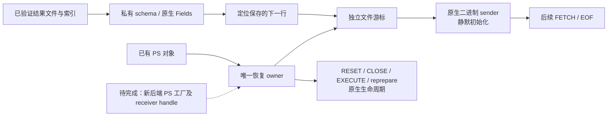

新增 `cursor_result_decode` 与 `cursor_result_restore` MTR。前者用解码后的 Field 替代原行发送，客户端逐字节对照原生二进制结果；后者关闭原物化读取路径后用独立 reader 继续 FETCH。恢复入口由 DBUG 驱动，准备仍在该命令内同步执行，只是本地恢复组件的验证入口，**不能作为 receiver READY、快速 SQL RESUME 或物理升主验收**。生产接线必须把数据规模相关的校验和准备放回 receiver worker，不能照搬这个 probe 的时序。

矩阵包含三种内部引擎及实际 MEMORY→InnoDB、长 BLOB、JSON、GEOMETRY/SRID、ENUM/SET、BIT、DECIMAL、YEAR、NULL/空串，以及部分 FETCH、129 行已消费前缀、精确尾批、FETCH 0、EOF、多个 PS、RESET/CLOSE/重执行和 ALTER 后 reprepare。每个结果核对精确的剩余解码行数，不能用累计计数大于某个常量代替消费位置验证。另覆盖 EXECUTE 后改变时区和 character_set_results、DROP 原表后才恢复 reader 并 FETCH，以及随后 EXECUTE 表不存在的原生关闭边界。

DROP 对照的初版测试误认为 EXECUTE 报表不存在后旧 cursor 仍开放；ON/OFF/非 standby 均返回 1421。源码证实 `Prepared_statement::execute()` 在打开表前已经 `close_cursor()`。已调整为先验证 DROP 后 FETCH 旧结果，再验证 EXECUTE 的 1146 和后续 FETCH 的 1421；没有修改原生行为去迎合错误预期。

内部故障用例注入私有行缓冲的非法字符串内层长度、非法 NULL 标记及行内存不足。分别要求 1815／1041，随后 cursor 关闭、再次 FETCH 返回 1421、PS 释放后内存计费回到基线。原误填的 1105 与固定“超过 1000 行”下界均在日志保留；修正后的断言依据生成错误码和每次实际未消费行数，没有放宽为接受任意错误。全部新增测试没有 DEBUG_SYNC，没有新增 UT，没有提交。

证据仍在 `build-debug/temp-preserve-implementation/2026-09-22/`：

| 验证 | 实际结果 | 日志 |
| --- | --- | --- |
| 新解码/reader 入口对旧二进制 | 缺少相应状态量，退出 1；只证明入口不存在 | `mtr-cursor-decode-red.log`、`mtr-cursor-restore-red.log` |
| 原生 Field 解码首轮 | 1/1 业务通过；shutdown_report 单列通过，退出 0 | `mtr-cursor-decode-check.log` |
| 独立 reader 首轮 | VARCHAR 协议类型缓存未做兼容转换，断言退出 | `mtr-cursor-restore-check.log` |
| 修正协议缓存及精确计数后 | 2/2 业务通过；shutdown_report 单列通过，退出 0 | `mtr-cursor-restore-counts.log` |
| 扩展 DROP 原表对照 | 初版测试错误预期使八例失败，原生 OFF 同样失败 | `mtr-cursor-reader-final.log` |
| 行故障注入尚未实现 | 预期错误未发生，退出 1 | `mtr-cursor-decode-bounds-red.log` |
| 注入实现后首次八例 | 七例通过，reader 用例因预期误填 1105 而失败，实际为 1815 | `mtr-cursor-reader-verified.log` |
| 最终 Debug 构建与全部八例 | 构建退出 0；同一轮 8/8 业务 MTR 通过，shutdown_report 单列通过，退出 0 | `build-cursor-reader-complete.log`、`mtr-cursor-reader-complete.log` |

最终 MTR 使用 `--suite=preserve_trx --do-test='^cursor_result_' --parallel=1 --retry=0 --force` 和独立 vardir/tmpdir。中间数据目录已逐批核对日志归档后清理，归档为 `completed-cursor-decode-early.tar.gz`、`completed-cursor-restore-red.tar.gz`、`completed-cursor-reader-intermediate.tar.gz`；最终目录保留。

**完整需求剩余项：** 新后端原编号 PS 的参数/解析上下文及首次执行语义；结果对象传输、receiver worker/prepared handle 和联合 READY/SQL RESUME；用户临时表稳定目标 ID、undo/LOB 地址转换和在线原生安装；连续增量与额度/取消/异常闭环及物理工程集成验收。当前未放宽 strict 临时资源准入，未增加固定在线升主入口之外的阶段，也没有增加 RESET DRAIN 行为。

### 2026-09-22：PS resolved 类型重建与原生失败边界

新增 `sql/preserve_trx_ps.cc/.h`，实现独立的参数 resolved 描述及重建桥接。描述包含位置、类型、result type、长度、精度、字符集编号及 derivation/repertoire、unsigned/nullable、inherited/pinned、JSON scalar 标记；不持有源 Item、字符集或转换函数地址。参数集合工作内存使用既有预算租约，释放顺序为描述数据先于租约。

`Prepared_statement::prepare()` 和 `reprepare()` 仅增加可选描述入口，默认空值维持原行为。在 `prepare_query()` 之前应用 resolved 描述，Item_param 的内部标志阻止 `fix_fields()` 用 actual 值覆盖它；既有及延后生成的 CTE 参数克隆同步处理。备份、arena swap、metadata 校验、actual 值及 LONG_DATA 移交、析构仍复用原 reprepare 核心。没有第二套 PS prepare 实现，也没有复制参数函数指针到可迁移描述中。

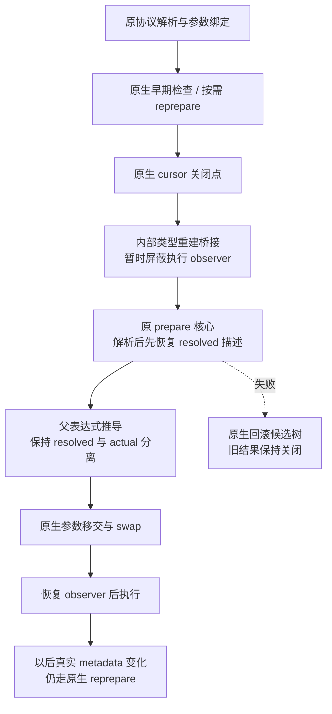

桥接初版在实际 MTR 中报 ER_NEED_REPREPARE：它位于 EXECUTE 的关闭点后，原执行 observer 仍然生效，新 TABLE_LIST 尚未设置本地版本，因此被当作依赖变化。修复在专用桥接内通过现有 observer 栈和 scope guard 隔离准备阶段，所有出口恢复；没有改原生表版本比较或普通 reprepare 分支。这个隔离**不是跨进程依赖有效性证明**。生产调用方必须先证明原解析上下文和依赖仍适合内部重建，当前不开放该生产资格。

新增 `ps_type_rebuild`、`ps_type_rebuild_off`、`ps_type_rebuild_local` MTR，以及普通 Classic 包测试客户端 `scripts/preserve_trx_ps_rebuild_e2e.py`。新测试无 DEBUG_SYNC；内部 DBUG probe 在原 cursor 关闭点触发桥接，普通 reprepare probe 只作负向对照。验证内容：

- DATE 与整数 actual 的不同语义、DECIMAL/DOUBLE/string、CAST inherited、LIMIT pinned、NULL、零参数和重复引用 CTE；逐项比较原生与桥接后的列描述和二进制行，重复 EXECUTE 不重发参数类型。
- 普通 reprepare 负向对照确实改变数字日期比较结果。本机默认测试上下文下，保留原 DATE 类型没有命中，按 actual 整数重建后命中 `0001-01-01`；不能把源码注释的 `2001-01-01` 命中当作固定测试预期。
- LIMIT 参数绑定失败、LONG_DATA 待报错误、真实早期类型失配 reprepare 失败均保持原生的旧游标行为；删除原表后仍可由独立文件 reader FETCH 旧结果。
- 越过原生关闭点后，因原表不存在而重建失败，后续 FETCH 返回 1421；不能复活旧结果。分段 LONG_DATA、无新类型包、RESET 和后续执行正确。
- 桥接完成后改变真实表结构，下一次 EXECUTE 仍由原生 metadata observer 触发一次 reprepare；数据与查询结果正确，所有测试结束后 Preserve 工作内存回到基线。
- preserve OFF 及 LOCAL_CARRIER 模式即使打开内部 probe 也不进入新增重建；这里验证隔离，不扩展 local startup 支持。

证据均位于 `build-debug/temp-preserve-implementation/2026-09-22/`：

| 验证 | 结果 | 日志 |
| --- | --- | --- |
| 原代码入口 RED | 重建计数未增加，退出 1；仅证明入口缺失 | `mtr-ps-types-entry-red.log` |
| 首版桥接运行 | 执行 observer 报 1615，退出 1 | `mtr-ps-types-check.log` |
| 修复后 Debug 构建 | 退出 0 | `build-ps-types-observer.log` |
| 类型重建及两种隔离 | 3/3 业务通过，shutdown_report 单列通过，退出 0 | `mtr-ps-types-observer.log` |
| 联合游标及既有 PS 生命周期 | 12/12 业务通过，shutdown_report 单列通过，退出 0 | `mtr-ps-types-reviewed.log` |
| 补充真实 ALTER、零参数、内存归还后 | 3/3 业务通过，shutdown_report 单列通过，退出 0 | `mtr-ps-types-schema.log` |

联合命令使用 `--suite=preserve_trx --do-test='^(cursor_result_|ps_type_rebuild|protocol_ps_autocommit_lex_lifetime)' --parallel=1 --retry=0 --force`；最后补测使用 `--do-test='^ps_type_rebuild'`。构建成功后未再改内核代码，最终补测只扩展测试内容。没有执行全量 Preserve 回归、Release/NFR 或外部物理备机验收。

磁盘降至约 275 MiB 时，核对完成状态后归档本会话四个已结束 vardir 的日志，比较 manifest 和 tar 清单一致，再清理其临时数据库数据；归档 `completed-ps-types-preflight.tar.gz` 保留。没有清理他人目录，也没有提交或推送。

**仍不能勾选 P4 或完整需求完成。** 此段复用仍存在的 PS/LEX，在同一后端验证重建语义。尚缺原解析上下文捕获、跨进程依赖判断、完整 actual/错误状态序列化、原 ID 工厂与 stmt_map/P_S/配额安装，以及真正新后端恢复；未实现资源传输和 receiver READY/SQL RESUME 生产接线，用户表稳定目标 ID、undo/LOB 转换、在线安装和增量闭环仍沿前述剩余项推进。

### 2026-09-22：生产 PREPARE 的上下文捕获

新增 `sql/preserve_trx_ps_context.cc/.h`。`Prepared_statement::prepare()` 开始时在现有 preserve＋result capture＋standby transfer＋Classic 门控内取得准备期上下文，只有准备成功才由 PS 接管；与 arena 同时 swap，native reprepare 失败则由既有回退恢复旧上下文。描述不依赖当前业务表，不序列化服务器指针；字符集、locale 用编号，时区用名称。捕获工作内存计入现有预算，同会话的上下文使用会话标识作为预算 key，PS 释放时归还；最终迁移 token 的完整预算归属仍须在后续资源集合接线时处理。

当前捕获的表达式准备输入为 SQL mode、character_set_client、collation_connection、collation_database、default_collation_for_utf8mb4、div_precision_increment、default_week_format、lc_time_names、group_concat_max_len、max_allowed_packet、max_sort_length、windowing_use_high_precision、time_zone 和 block_encryption_mode。数据库名称继续由原 PS 的 m_db 保存。该清单来自 parser/Item/窗口准备路径的源码核查；不是“任意插件、任意 DDL、所有全局配置均已跨进程保真”的声明，后续完整 PS 资格及目标兼容性校验还须覆盖其依赖。

内部重建复用原 `reprepare()` 生命周期，在原数据库切换之后调用上下文对象的 prepare 桥接。准备期间临时替换上述输入，返回前恢复原会话，并调用 `THD::update_charset()` 刷新转换缓存。没有把所有 System_variables 整体拷贝回去，也没有改变运行期 AES 算法、时区或其他命令修改的会话状态。普通 native reprepare 仍使用执行时的当前上下文，成功后形成新的保存代次。捕获分配失败不破坏普通 PREPARE；之后缺失上下文的内部重建返回明确错误。未来生产迁移资格须在转移所有权前拒绝缺失描述，不能等到已成功 RESUME 才发现缺件。

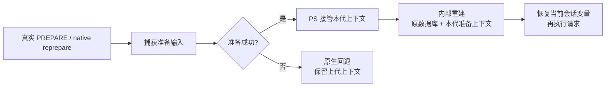

新增 `ps_parse_context`、`ps_parse_context_off`、`ps_parse_context_local` 及 Classic 测试客户端 `scripts/preserve_trx_ps_context_e2e.py`。MTR 不使用 DEBUG_SYNC；生产捕获钩子在正常 PREPARE 路径运行，重建调用仍由内部 DBUG probe 验证，尚未接入目标 SQL RESUME。测试先构造真实 DML/回滚背景，再逐项比较列描述和二进制行，并核验调用会话变量不泄漏、最终内存归还。

两项实际 RED：

1. 原上下文桥接缺失时，`SELECT 'a'||'b'` 在改为 PIPES_AS_CONCAT 后被内部重建成字符串拼接，原逻辑运算的列类型和行都改变。
2. 首版上下文遗漏 AES 模式，ECB 准备后切换 OFB，重建返回的列长度改变，虽然行内容相同。补齐准备期 my_aes_mode 后，列描述保持原值，执行仍使用当前 OFB。

其余覆盖包含 NO_BACKSLASH_ESCAPES、client/connection 字符集变化、WEEK 隐含参数、除法精度、月/星期 locale、GROUP_CONCAT 长度、带时区字面量及运行期 @@time_zone；实际 ALTER 触发 native reprepare 后更新保存上下文；ANSI_QUOTES 导致早期 native reprepare 失败后保留上一次成功上下文；缺表导致内部重建失败后仍恢复调用会话并保持旧游标关闭。OFF/LOCAL_CARRIER 模式不增加内部重建次数。

证据目录仍为 `build-debug/temp-preserve-implementation/2026-09-22/`：

| 验证 | 结果 | 日志 |
| --- | --- | --- |
| 原解析上下文错误 RED | 行和列类型改变，退出 1 | `mtr-ps-context-red.log` |
| 首版构建及上下文/参数测试 | 构建退出 0；2/2 业务通过 | `build-ps-context.log`、`mtr-ps-context-check.log` |
| AES 对照 | 最初误选不支持的 CTR，仅测试参数错误；改为原生支持的 OFB 后复现列长度错误 | `mtr-ps-context-aes-red.log`、`mtr-ps-context-aes-ofb-red.log` |
| AES 修正构建 | 退出 0 | `build-ps-context-aes.log` |
| 游标、类型、上下文及既有 PS 生命周期联合运行 | 15/15 业务通过，shutdown_report 单列通过，退出 0 | `mtr-ps-context-reviewed.log` |
| 补充失败 native reprepare 后 | 3/3 上下文业务通过，shutdown_report 单列通过，退出 0 | `mtr-ps-context-failed.log` |

联合运行使用 `--suite=preserve_trx --do-test='^(cursor_result_|ps_type_rebuild|ps_parse_context|protocol_ps_autocommit_lex_lifetime)' --parallel=1 --retry=0 --force`。最后一次内核构建之后仅扩展测试与文档，没有新的内核改动。中间已结束 vardir 日志经 manifest 对照归档后清理，归档为 `completed-ps-context-inputs.tar.gz` 和 `completed-ps-context-checks.tar.gz`，最终联合与补测目录保留。没有提交或推送。

**完整实现仍待继续：** PS 描述编解码与目标进程依赖校验、原 ID 工厂及原子安装；资源对象传输和 receiver prepared owner／READY／SQL RESUME 生产接线；临时表目标稳定 ID、undo/LOB 地址转换、在线安装与持续增量。当前没有开放 strict 临时资源资格，没有新增在线升主阶段，没有新增 RESET DRAIN 行为。本轮证据不能代替新后端恢复、物理工程集成、全量回归或性能验收。

### 2026-09-22：PS 参数运行态编解码与目标缓冲移交

新增 `sql/preserve_trx_ps_runtime.cc/.h`。它实现完整 PS 描述中的 **actual 参数运行态部分**，不是完整 PS 工厂。格式 `MPPSRT01` 保存原 statement_id、SQL 摘要、参数位置、arena 状态、待报错误码及原消息，以及每个参数的协议类型/符号、转换函数编号、值状态、NULL、decimals、actual/stored 字符集、字符串缓冲及其视图。整数和浮点按固定宽度存储；时间逐字段编码；DECIMAL 只保存有效数字组，目标端建立自身的 decimal buffer，不复制源指针、结构体 padding 或未初始化字段。普通 DATE/TIME 没有有效时区 displacement，编码时明确写零。

源码核查和运行测试确认：参数值状态不一定等于协议类型。例如整数列接收超范围字符串时，原生 `check_parameter_types()` 可将值改为 DECIMAL，再尝试 reprepare；若因缺表而失败，命令边界仍保留 DECIMAL 值，但协议类型和转换函数仍是 STRING。编码分别保存它们，不根据其中一项推导其他项。首次 EXECUTE 之前的无类型 LONG_DATA、已转换字符串、未转换分段字节、暂存错误也分别保留。追加 LONG_DATA 可能使旧转换视图指针失效；捕获不解引用这个指针，只有已证明的缓冲内视图才存偏移，其余 LONG_DATA 视图置空，沿原生下一次 `convert_str_value()` 重建。

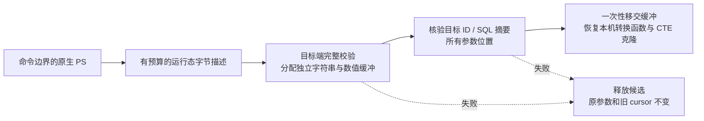

解码接口不需要源 THD、Item 或 SQL 执行树，可在 receiver READY 前准备目标缓冲。安装先完整核验，再进行不分配内存的 String swap、标量赋值和克隆同步；大 LONG_DATA 不在安装时再复制。源描述和目标候选分别取得既有内存租约。安装后的 PS 持有目标 owner/租约，旧缓冲先释放、旧租约后归还；native reprepare 最终把参数值移回同一个 PS，因此此 owner 不随临时 arena copy 交换。当前按保守额度一直保留到 PS 销毁，不宣称已经优化为每次参数 reset 后的精确额度缩减。

共享源码只增加转换函数与稳定编号的窄适配、PS owner 字段、测试入口和状态量。原生未绑定转换函数改为同一 Item_param 的静态成员，行为不变。新增测试入口受原 preserve/result capture/standby/Classic 门控限制，生产准入仍未放开。**目前该运行态模块还没有接入 source final manifest、receiver 资源清单或 SQL RESUME；同后端的 DBUG round-trip 是内部验证，不是新后端恢复证明。** 后续完整描述还须保存并校验 resolved 类型、准备上下文、SQL/默认库及依赖，并通过原编号工厂创建合法 PS。

新增 MTR `ps_runtime_state`、`ps_runtime_state_off`、`ps_runtime_state_local`，测试客户端为 `scripts/preserve_trx_ps_runtime_e2e.py`。背景有真实建表、插入、更新、删除和回滚校验；全部使用普通 Classic 命令，无 DEBUG_SYNC、无新 UT。覆盖整数各宽度及 unsigned、FLOAT/DOUBLE、DECIMAL、字符串/BLOB/NULL、DATE/DATETIME/TIME、pinned LIMIT、CTE 克隆、零参数；重复 EXECUTE 不发送类型包；输入字符集变更；未绑定及跨 UTF-8 边界的 LONG_DATA、80 KB 二进制分段；原生早期 reprepare 失败后保留值与旧 cursor；实际 ALTER 和内部类型重建；待报错误消息完全一致及 RESET。非法版本、转换编号、截断、错误 ID 和候选分配失败均验证旧资源不变、失败不增加安装计数、预算归还。最后所有 PS 关闭后全局 Preserve 工作内存回到基线。OFF/LOCAL 用例验证隔离，不增加 local startup 支持。

证据目录：`build-debug/temp-preserve-implementation/2026-09-22/`。

| 验证 | 实际结果 | 日志 |
| --- | --- | --- |
| 旧二进制入口检查 | 恢复计数不增加，退出 1；只证明入口缺失 | `mtr-ps-runtime-red.log` |
| 首轮新实现 | 标量通过；字符集用例错误地比较变更前的结果字符集元数据，退出 1 | `mtr-ps-runtime-check.log` |
| 对齐原生当前结果字符集后 | 3/3 业务通过，shutdown_report 单列通过，退出 0 | `mtr-ps-runtime-charset.log` |
| 边界审核后的内核构建 | 退出 0 | `build-ps-runtime-reviewed.log` |
| 游标、类型、准备上下文、运行态及既有 PS 生命周期 | 18/18 业务通过，shutdown_report 单列通过，退出 0 | `mtr-ps-runtime-reviewed.log` |
| 补充 owner 跨两类 reprepare 的交叉验证 | 3/3 业务通过，shutdown_report 单列通过，退出 0 | `mtr-ps-runtime-reprepare.log` |

联合命令使用 `--suite=preserve_trx --do-test='^(cursor_result_|ps_type_rebuild|ps_parse_context|ps_runtime_state|protocol_ps_autocommit_lex_lifetime)' --parallel=1 --retry=0 --force`，补测使用 `--do-test='^ps_runtime_state'`。最终内核构建后仅扩展测试与文档。之前已结束的上下文与本轮 RED vardir 日志核对归档为 `completed-ps-runtime-inputs.tar.gz` 后清理，保留 manifest。没有提交、推送、全量回归、Release/NFR 或外部物理工程运行证据。

**仍未完成完整需求。** 剩余生产链包括完整 PS 描述/依赖证明/原 ID 原子安装，TEMP/RESULT 对象传输与 receiver prepared owner/联合 READY，固定升主入口和 SQL RESUME 接线，用户临时表稳定目标 ID、undo/LOB 转换、原生在线安装与连续增量。上述运行态能力缩小了 PS 缺口，不能据此删除这些剩余项或开放 strict 临时资源准入。

### 2026-09-22：原编号 PS 工厂、跨后端安装与描述编解码

本轮继续写 C++，新增 `sql/preserve_trx_ps_restore.cc/.h`、`preserve_trx_ps_wire.cc` 和私有结构头 `preserve_trx_ps_descriptor.h`。它们将之前分散的上下文、resolved 类型、actual 参数与开放结果组合为一批可独立持有的对象，并静默安装到新 THD 的原 statement_id。没有执行旧 SELECT 来恢复结果，没有要求客户端重新 PREPARE/绑定；没有提交或推送。

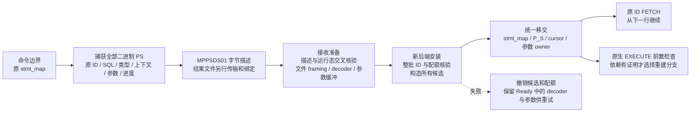

**字节描述及接收准备。** `MPPSDS01` 按固定宽度和长度前缀保存 SQL/默认库、命令/结果资格/UDF 判定、可见列数、准备上下文、resolved 参数描述、`MPPSRT01` 运行态，以及结果代次、文件摘要、行数/偏移和 FETCH 进度。没有序列化 THD、Item、TABLE、函数地址或文件路径。开放结果按原 statement_id 升序绑定独立 sealed file，核验 size/digest；最终 transfer 对象名称、资源根和闭包仍由待接入的资源清单负责，此 codec 不自行宣布 token READY。

解码检查版本、长度、尾随字节、严格递增且非零的 ID、枚举/位掩码、字符集/locale、上下文范围、参数数量/位置及文件绑定。接收准备再解码 actual 参数，并交叉核验其 ID、SQL 摘要和全部位置，之后完整检查结果 framing、构建本地 decoder。大 LONG_DATA 在此准备，安装只移交缓冲；每项准备后立即释放对应的运行态字节副本。描述、上下文、类型数组、字节缓冲分别计费，生命周期独立；源上下文改成不可变共享对象，跨传输解码后为新的独立对象。此处的静态范围和 framing 检查不替代全部类型值语义、依赖和完整资源闭包验证。

**工厂与失败收敛。** 新 PS 使用显式原 ID 构造；只建立合法最小 LEX、真实 Item_param、命令边界判定字段和保存的结果资格，不在安装时重新解析旧 SQL。工厂 arena 有预算和容量上限，租约随对应 arena 交换；参数 owner 则继续跟随最终持有缓冲的 PS。安装先核对整批规范性及完整 stmt_map（包含 find(id) 隐藏的命名 PS），一次预留全局 PS 配额，完成全部候选和 map 分配后才移交资源。运行态一致性检查已前移到任何移交之前，最终提交段不再有会消耗一半 Ready 的失败分支。sender 构造或 map 安装失败会归还 decoder、清空 THD 绑定、撤销已插入条目和配额；原目标 PS 不受影响。成功后建立 P_S、清除 map 最近命中缓存、更新计数；未来发号跳过已有编号并处理 uint32 回绕。

恢复态 PS 在尚未 EXECUTE 建树前也可再次捕获/编码/安装，复用同一 sealed 结果和新进度。首次 EXECUTE 保持原生早退、旧 cursor 关闭点和参数收尾顺序；早期类型不兼容 reprepare 失败仍能读取旧结果，越过关闭点后的失败则保持关闭。真实 ALTER 后未来 EXECUTE 可返回新列数，旧结果继续使用原内容。当前尚无生产依赖证明：测试开关分别指定 unchanged/changed 决定，未知依赖明确失败，不能把接收准备或本进程 table_map_id 当作证明。

**验证方式与覆盖。** 新增 `ps_backend_restore`、`ps_backend_restore_off`、`ps_backend_restore_local` 三个 MTR，使用 `scripts/preserve_trx_ps_restore_e2e.py` 发送普通 Classic 数据包。背景包含真实 DML、ROLLBACK 和最终数据断言；用有界 processlist 轮询确认源 THD 已销毁。无 DEBUG_SYNC、无新增 UT/GUnit。DBUG 仅用来连接尚未生产接线的捕获/编码/准备/安装接口和注入故障，属于同 mysqld 不同后端连接的内部测试，不是跨 mysqld 的 HA 验收。

覆盖原 ID、部分 FETCH、连续两次迁移、恰好到尾/EOF、删掉原表后继续读旧结果、不重发协议类型、60 KB LONG_DATA 及追加、待报错误与 RESET/CLOSE、原准备 SQL mode/默认库、早期 reprepare 失败、ALTER 后新元数据、尚未执行过的 INSERT/UPDATE/DELETE/SELECT INTO、目标命名 PS 冲突、整批配额不足、部分 map 安装/arena/sender 失败、错误候选、P_S 编号、uint32 发号回绕、未知依赖拒绝，以及多游标、DATE、DECIMAL、DOUBLE、NULL、CTE 参数克隆。非法版本、截断、尾随字节、数量、ID、resolved 类型、SQL 摘要错配、缺文件/交换文件和解码失败均核对源进度及预算不变。最后关闭全部 PS 后全局 Preserve 内存回到基线。OFF/非 standby 用例只验证隔离，不新增 local startup 功能。

证据目录：`build-debug/temp-preserve-implementation/2026-09-22/`。

| 验证 | 实际结果 | 日志 |
| --- | --- | --- |
| 原工厂缺失 | 源连接退出后 FETCH 原 ID 返回 1243，退出 1 | `mtr-ps-backend-red.log` |
| 恢复态再次捕获缺口 | 明确拒绝尚未建树的恢复态 PS，退出 1；随后补齐 | `mtr-ps-backend-recapture-red.log` |
| 扩展测试前两次失败 | 测试同时启用源/目标探针导致自导入冲突；随后混用了普通 EXECUTE/FETCH 行编码对照；修正测试后通过 | `mtr-ps-backend-budget.log`、`mtr-ps-backend-retry.log` |
| 原编号、失败重试及连续迁移 | 1/1 业务与 shutdown_report 通过 | `mtr-ps-backend-native-rows.log` |
| 批次核验改造构建 | 首次 Apple clang 异常退出；归档已结束测试目录、降低并行重建退出 0；未将其当作源码错误 | `build-ps-backend-atomic.log`、`build-ps-backend-atomic-retry.log` |
| 工厂/现有依赖联合运行 | 21/21 业务与 shutdown_report 单列通过，退出 0 | `mtr-ps-backend-atomic.log` |
| 首版字节 codec | 构建退出 0，1/1 业务与 shutdown_report 通过；这次运行使用新构建，不是旧码 RED | `build-ps-wire.log`、`mtr-ps-wire-first.log` |
| 最终 codec/工厂构建 | 退出 0 | `build-ps-wire-final.log` |
| 最终联合运行 | 21/21 业务与 shutdown_report 单列通过，退出 0 | `mtr-ps-wire-final.log` |

最终联合命令使用 `--suite=preserve_trx --do-test='^(cursor_result_|ps_type_rebuild|ps_parse_context|ps_runtime_state|ps_backend_restore|protocol_ps_autocommit_lex_lifetime)' --parallel=1 --retry=0 --force`。这不是 Preserve/Resume 全量回归，也没有 Release/NFR 或外部物理工程证据。中间已结束 vardir 的日志经文件清单和尺寸核验归档后清理；最终联合日志和 vardir 保留。

**仍未完成的生产链：** 表/例程依赖的跨进程证明；TEMP/RESULT/PS 对象的正式传输清单、receiver prepared owner/联合 READY、固定升主入口和 SQL RESUME 接线；用户临时表可在物理回放期间稳定使用的目标 ID、undo/LOB 地址转换、原生在线安装和持续增量。当前目标 table/index ID 仍由共享字典发号器分配，只能在现有物理栅栏之后使用；不能把这个原型提前执行并宣称满足 READY 前转换。外部物理工程目前不可访问，这一契约仍待核实。strict 临时资源准入继续关闭，没有添加在线升主阶段或 RESET DRAIN 行为。

### 2026-09-22：PS 移交 journal 与接收准备分批续作

本轮继续修改 C++ 内核模块，未提交、未推送，未改变升主外部调用阶段。Python 只用于普通 Classic 协议 E2E 和证据整理；没有新增 UT/GUnit 或 DEBUG_SYNC。

**移交与失败语义。** 源码追踪到正式 strict RESUME 的 preparation、持久 ACTIVATING、engine activation、持久 ACTIVE 和最终收尾后，确认原整批 `install()` 无法独立满足后续失败撤销。因此在 `preserve_trx_ps_restore.cc/.h` 增加命令内 `Attach` journal，原 `install()` 复用它：

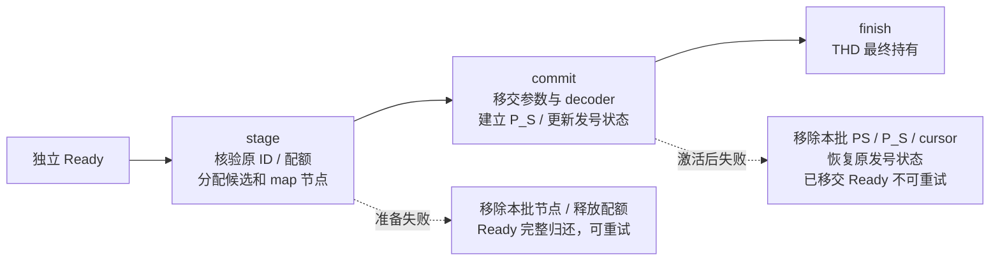

stage 到 finish/rollback 只允许同一个正在执行命令的 THD 使用，不能中途放行客户端命令。它会预留目标 map 节点，因此不是跨命令可见的半安装状态。提交前撤销将 decoder 归还 Ready 并解绑 THD；提交后析构删除已安装对象，释放 LONG_DATA/结果 owner 和全局 PS 配额。撤销只处理本批 ID，保留目标原有 binary/named PS、缓存和编号状态。安装阶段不复制大参数缓冲。

实际 MTR 在目标已有 `UINT32_MAX` 编号 PS 的情况下验证了配额拒绝、部分 map 安装失败、工厂/sender 分配失败、候选错配、完整 stage 后失败及 commit 后失败；逐次检查 Prepared_stmt_count、P_S 编号、原 PS 可继续执行和 Preserve 内存归还。提交前仍可用同一 Ready 成功重试；提交后原导入编号为未知句柄，必须重新取得独立源捕获，不能复用被消费的候选。测试中的源再次捕获只证明两个对象独立，**不是让已经完成生产 handoff 的源恢复写入或重试**。

**接收准备与扫描成本。** 原 `prepare()` 只做 framing，单元格 NULL/长度要到 FETCH 时才验证。新增 `Preparation` 作业 owner，以 `begin_prepare → step → take` 表达准备；原同步 helper 复用这组接口。每一步解码至多一个 PS，结果扫描按最多 4096 行或 8 MiB 返回；字节阈值允许完成当前一整行后返回。单个 PS 的参数解码及单个超大行仍不可拆分，不能宣称严格时间片上限。`step()` 检查真实 worker 的 killed 状态，批次间不保留 THD；未完成或失败不能取出 Ready，销毁候选即取消并释放引用/预算。正式 worker 池仍需接入原 deadline、取消及唯一作业 owner。

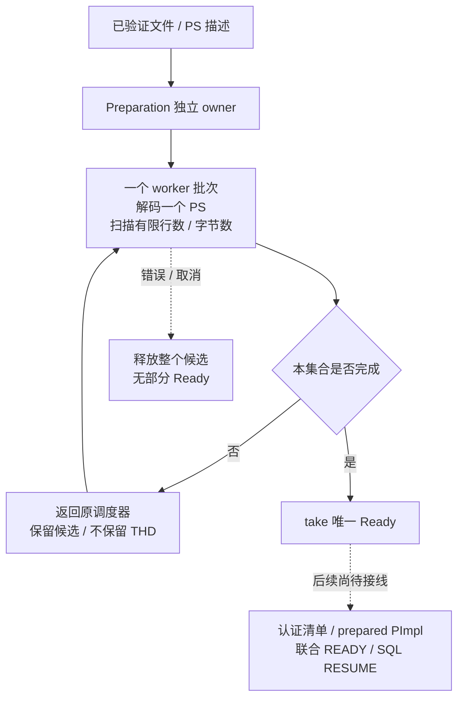

原 `cursor_file` 的独立 framing 校验继续保留；新的 PS 接收准备直接创建 decoder，在同一遍顺序扫描中核对行框架、每 128 行的稀疏索引、NULL、各列长度和末尾位置，避免先完整 framing、再完整行内容的重复扫描。只有扫描到最后一行并核对末尾位置，才同时标记 framing/values 完成。schema 构造、文件摘要认证仍是各自的必要工作；没有声称整个传输只读一次文件。最大行缓冲取得既有额度并保留到后续 FETCH，不在 attach 时再按整份数据准备。新增 `Preserve_trx_cursor_preflight_rows` 区分准备扫描与真实 `decoded_rows`；它是累计组件工作量，不是最终有效准备复用率或 READY 延迟指标。

新增运行断言覆盖 205 行、每行 80 KB 的用户临时表结果，已 FETCH 129 行的进度，4201 行结果和空结果。后段第 129 行故障在准备阶段被拒绝，源进度及预算不变；首个 8 MiB 批次取消恰好校验 105 行，全部候选释放。完整准备检查 4406 行且不增加 FETCH 解码计数；源后端销毁后只返回大结果剩余 76 行，以及另一个结果的 4201 行，空结果返回 EOF。测试还把已有实际修改并重新计算摘要的坏文件同时送入独立 framing 与合并扫描路径，验证坏索引、错误长度、NULL、末行和 footer 都被拒绝。现有检查覆盖结构和解码长度规则，**不是对所有 JSON/GEOMETRY 等值增加完整语义认证**。

证据目录仍为 `build-debug/temp-preserve-implementation/2026-09-22/`：

| 验证 | 实际结果 | 日志 |
| --- | --- | --- |
| 缺少 stage 后故障撤销入口 | 预期 1041 未发生，退出 1；仅证明该分支未实现 | `mtr-ps-attach-red.log` |
| stage journal 首次运行 | 3/3 业务通过；shutdown_report 单列通过，退出 0 | `mtr-ps-attach-green.log` |
| 缺少 commit 后撤销入口 | 预期 1041 未发生，退出 1 | `mtr-ps-attach-post-red.log` |
| 补齐 commit 后撤销 | 构建退出 0；3/3 业务及 shutdown_report 通过，退出 0 | `build-ps-attach-post.log`、`mtr-ps-attach-post-green.log` |
| 原 prepare 未检查行内容 | 故障行仍被接收准备接受，预期 1815 未发生，退出 1 | `mtr-ps-preflight-red.log` |
| 提前检查行内容与大结果位置 | 3/3 业务及 shutdown_report 通过，退出 0 | `mtr-ps-preflight-green.log` |
| 尚无批次取消出口 | 首批取消未生效，预期 1815 未发生，退出 1 | `mtr-ps-prepare-batch-red.log` |
| 分批 owner 和合并扫描 | 构建退出 0；21/21 业务及 shutdown_report 单列通过，退出 0 | `build-ps-prepare-batches.log`、`mtr-ps-prepare-batches-green.log` |
| 最终 current THD 与失败状态约束 | 构建退出 0；3/3 PS 恢复业务及 shutdown_report 通过，退出 0 | `build-ps-prepare-final.log`、`mtr-ps-prepare-final.log` |

联合命令沿用 `--suite=preserve_trx --do-test='^(cursor_result_|ps_type_rebuild|ps_parse_context|ps_runtime_state|ps_backend_restore|protocol_ps_autocommit_lex_lifetime)' --parallel=1 --retry=0 --force`，没有运行全量 Preserve/Resume、Release/NFR 或外部物理备机验收。本轮已结束的中间 vardir 经日志清单/大小核验归档为 `completed-ps-attach-inputs.tar.gz`、`completed-ps-preflight-inputs.tar.gz` 后释放数据库文件，保留证据。

**完整需求仍未完成。** 本轮闭合了组件内的移交撤销和有界结果准备接口；正式清单对 token/代次/文件摘要的绑定、prepared registry 联合 READY、SQL RESUME 调用这些 journal、跨进程依赖证明，以及用户表稳定 ID/undo/LOB 在线安装与持续增量仍须实现。当前 `Ready` 类型只是局部候选，不能等同于正式 epoch/token READY。没有为了通过组件测试而放宽 strict 资源准入，也没有用本轮运行时间宣称“瞬间 RESUME”。

## 2026-09-22：预制 PS 长期额度与参数真实释放

本轮从已经前移 PS/参数/sender 构造及游标 seek 的源码继续。上述历史 attach 图中的工厂分配已在当前 `Preparation::step()` 完成；当前 stage 仍需要目标 map 节点和网络位图等必要绑定。没有再增加批量资源池，保留安装每批一次 journal 额度申请。

新增 `Preserve_memory_lease::shrink_to()` 归还工厂构造后的差额，收紧旧 arena 最大容量，避免每个候选长期持有至少 64 KiB 的原保守额度。构造上界及缩减值均检查乘加范围；去掉原生分配器实际忽略的 `query_prealloc_size` 计费。独立 review 同时发现工厂 `Item_param(POS(), ...)` 未登记析构导致 LONG_DATA String 泄漏，已在工厂参数安装前登记到当前 worker 的 item 链，保持失败 guard、arena/lease swap 及原生析构的所有权一致。

新增两项 MTR，由 Classic 协议 Python E2E 驱动，无 DEBUG_SYNC 或新 UT：129 个 PS/8 MiB 预算、source 退出后剩余 FETCH、首次 EXECUTE、RESET/LONG_DATA/CLOSE，以及候选取消/安装撤销的实际 PFS String 释放。旧码容量拒绝及 1,048,584 字节泄漏均先取得 RED；巨大 prealloc 的虚假额度拒绝也先复现。最终 Debug 构建退出 0，组合回归 23/23 业务通过，shutdown_report 单列通过，退出 0。

完整命令、测试边界和证据索引见 [PS 安装成本收敛记录](resume-install-optimization.md)，原始日志在 `build-debug/temp-preserve-implementation/2026-09-22/ps-optimization/`。最终两位只读 reviewer 未发现阻塞问题；未提交。本轮没有补齐正式联合 READY/SQL RESUME 接线，也没有运行 Release 并发或外部物理备机验收。

## 2026-09-22：PS prepared 所有权及 strict SQL RESUME journal 接点

已在原 `Preserve_trx_prepared_token_resources::Impl` 中加入认证清单的 PS 必需事实、摘要和独立 Ready，沿原 attach lease 取走/归还，补齐 publish/READY、ACTIVATING、ACTIVE 与重试检查。清单声明 PS 而候选缺失时，旧 registry 确实接受发布；MTR 已取得该行为的 RED，再修复验证。六处过期/终态回收改为锁内移动 Impl、锁外析构，局部退休 owner 使用空 unique_ptr，不在清理路径增加分配。

`prepare_resume_on_current_thd_shared()` 和 strict resume runtime 已加入 PS stage/commit/finish 及激活前归还、激活后删除的接点。完整需求仍未完成：正式 source/receiver/adopt 准入没有打开，含 PS 的真实 SQL RESUME 分支还未由端到端运行证据覆盖；NONE 资源会话、跨进程依赖判定和用户表稳定 ID/undo/LOB 在线接管仍需继续。

新增 `ps_backend_restore_registry` 以 Classic Python 驱动真实 registry API，覆盖身份错配/缺失、错误归还、未移交不能激活、未 commit 不能 ACTIVE、目标 PS 冲突后重试、READY 到期、ACTIVE 清理后继续 FETCH，以及激活后失败不损坏目标既有 PS。它使用内部 probe，不是物理升主或完整 SQL RESUME 验收。

最终构建退出 0；27 个不同业务用例通过，另有 1 个源码合同 lint 和 shutdown_report 通过。首轮跳过的既有 no-bin 回滚用例已按所需配置补跑通过。详情及后续 source/receiver 真实接线落点见 [PS prepared 接入记录](ps-prepared-integration.md)，证据在 `build-debug/temp-preserve-implementation/2026-09-22/ps-registry/`。本轮未提交代码。

## 2026-09-22：PS final-wire 分块传输与独立 receiver 文件

新增 `preserve_trx_ps_transfer.cc/.h`，接入源捕获、deferred stage/finalize 和
receiver SEAL/对象覆盖校验。结果最多 64 KiB 一块，描述和文件分别传输；不整份
读入字符串或加入最后的元数据队列。共享 owner 沿 bundle/result/batch/quarantine
保留，COMMIT_UNKNOWN 不随 candidate 销毁而丢文件。源 strict 同步保留 PS 禁入，
防止未接通的 receiver 在源端 handoff 后才拒绝。具体源码边界见
[PS 传输接入记录](ps-transfer-integration.md)。

新增 MTR/Classic Python 验证两个部分 FETCH 游标、8192 行数据、原 ID/位置/EOF，
及 receiver 清 staging/registry 后仍能读取独立文件。取得旧协议不支持 PS 对象的
RED；独立 review 发现额外结果被错误接受，也先用运行断言复现，再改为精确集合校验。
源码 review 另确认 source strict 与 receiver 准入不对称，已在发候选前补齐拒绝。
无新增 UT/DEBUG_SYNC、无新增升主阶段、无提交。

最终 `cmake --build build-debug --target mysqld -j8` 退出 0；下列命令退出 0，
31 个业务及 shutdown_report 通过、无跳过。既有 local/OFF 用例仅用于隔离回归，
不是扩展本特性的 local startup 支持。

```sh
cd build-debug/mysql-test
perl mysql-test-run.pl --suite=preserve_trx \
  --do-test='^(cursor_result_|ps_type_rebuild|ps_parse_context|ps_runtime_state|ps_backend_restore|protocol_ps_autocommit_lex_lifetime$|resume_failure_restores_session$|resume_session_continuation_semantics$|standby_transfer_session_only_cursor_(reset|eof)$|standby_transfer_drain_no_shutdown$|transfer_receiver_binlog_prefix_seal_replace_file$)' \
  --parallel=1 --retry=0 --force \
  --vardir=/Users/a1234/project/mysql-server-8022-preserve-port/build-debug/var-ps-xfer-final \
  --tmpdir=/tmp/psxfinal
```

证据：`build-debug/temp-preserve-implementation/2026-09-22/ps-transfer/` 的
`build-final.log`、`mtr-red.log`、`mtr-validation-red.log`、`mtr-final.log`。
内部传输桥不等于真实 receiver 调度、物理 HA 或含 PS 的 SQL RESUME 验收。
下一步须接原 receiver worker 的跨批准备和联合 READY，同时补失败保留 record 的
PS owner；之后完成预传/代次选择、NONE 和依赖有效性才能打开准入。用户表在线
ID/undo/LOB/增量的完整需求保持不变。

## 2026-09-22：receiver 原 worker 池的跨批 PS 准备

新增 `preserve_trx_ps_receiver.cc/.h`，复用原 staged-token 作业池和 prepared PImpl。
每批 4096 行 / 8 MiB 行帧预算，跨批保留 bundle/Preparation，正常续批不消耗失败
重试次数；用原 list 节点 splice 保持唯一所有者，pool 级调度偏好给对象依赖留出
机会。Ready 前完成描述加载、PS/参数工厂、结果校验与 sender 准备，SQL RESUME
继续只负责既有安装职责。详细流程、计量口径和限制见
[PS receiver 接入记录](ps-receiver-integration.md)。

独立源码 review 后补齐：Work 元数据额度移入长期 resources；超时分类与晚发布
两侧清理失败 PS token；清理校验完整 key/generation，保活 entry 到锁释放之后；
入队计数在节点分配成功后更新；候选析构在 pool 锁外。receiver 检查裁决不再每批
复制整份 accepted epoch。未新增 RESET DRAIN 逻辑、UT 或 DEBUG_SYNC，未提交。

内部运行覆盖 32768 行、两个已部分 FETCH 游标、跨多个 worker 批次、首批取消、
内存回基线、源端重新导出、新后端原编号/位置/EOF 接续；registry 用例补充错误
generation 不误清、READY 回收、额度持续计量。超时分类与晚发布的完整并发交错
目前经源码双向审查；上述内部桥没有替代真实网络/物理升主/SQL RESUME 验收。

本轮证据位于 `build-debug/temp-preserve-implementation/2026-09-22/ps-receiver/`：

- `mtr-red2.log`：旧桥未使用 receiver worker，有效 RED；`mtr-red.log` 是背景
  SQL 主键冲突，不计功能 RED。
- `mtr-green.log` 和 `mtr-cancel-green.log`：跨批及取消用例通过，退出 0。
  取消首轮 RED 无错误返回；最终期望码为现有内部错误 1815。
- `mtr-final.log`：35 个业务用例及 shutdown_report 通过；3 个既有 partial
  selection 用例因要求 no-bin 跳过。
- `mtr-verified.log`：no-bin 补跑 3 个裁决用例，并复跑 receiver/registry，
  5 个业务及 shutdown_report 通过，无跳过；此处包含最后的 entry 保活修正。

该轮累计 38 个不同业务用例通过，不是 Preserve/Resume 全量回归，也不是 release
性能证据。最后两处故障处理调整的构建、5 用例复核和源码哈希分别写入
`build-complete.log`、`mtr-complete.log`、`final.sha256`：构建退出 0，5 个业务及
shutdown_report 通过、无跳过，哈希复核通过。`git diff --check` 通过，暂存区为空。

source strict/adopt 仍拒绝含 PS 的正式 token。下一片先补源失败保留 record 的
独立工件所有者，再继续跨进程依赖有效性、连续预传/代次选择和 NONE 资源会话。
用户临时表稳定目标 ID、undo/LOB、在线安装与完整物理链路仍未闭合。毫秒级 READY、
并发 RESUME p95/p99、取消延迟和普通业务影响没有验收数据，不能宣称已达标。

## 2026-09-22：源失败保留 record 持有 PS 工件

`Preserved_trx_record` 新增进程内共享 owner。正常登记与失败后无法重新附着原 THD
的保留记录均接手同一工件；完整记录 take/re-add 延续寿命。重复 token 只在事务
指针及 manifest 相同且既有 owner 为空时补入，不替换已有 owner。纯诊断记录不持有
工件。未变更 durable authority 判断、RESET DRAIN 或 source/adopt 的现有禁入。

新增 `ps_backend_restore_source_record` MTR/Classic Python，包含 8192 行背景操作、
两个部分 FETCH 游标和一个未执行 PS。内部 probe 使用实际 record API 验证原 owner
释放后工件仍存活、take/re-add、重复 token 补 owner、错误 manifest 拒绝及诊断释放；
然后按原传输桥验证新后端 FETCH/EOF 和资源回收。它不模拟真实 InnoDB 回退失败。

证据位于 `build-debug/temp-preserve-implementation/2026-09-22/ps-source-owner/`：
`build-red.log` 为 probe 符号链接失败，不计功能 RED；修正测试接线后的
`build-red2.log` 成功，`mtr-red.log` 在尚未加入 record 持有逻辑时复现错误 1815
“source PS record lost artifact ownership”。这不是未改动的旧二进制，而是已有
测试接点、尚无持有修复的构建。`mtr-green.log` 通过。

独立只读 review 后补充 probe 的唯一 token 和仅在登记成功后清理，避免误清记录。
最终 `build-final.log` 退出 0；`mtr-final.log` 退出 0，13 个业务及 shutdown_report
全部通过、无跳过：9 个 PS backend 用例及 4 个既有失败清理/诊断用例。既有无 PS
用例仅证明相关分支隔离，不代表含 PS 的真实失败流程或物理 HA 验收。
新增测试无 UT/DEBUG_SYNC；未提交。完整目标剩余项沿上一节继续，未缩减范围。

## 2026-09-22：单条 undo 重编码与历史引用保真

`trx0temp_preserve_undo.cc/.h` 新增 `trx_preserve_temp_undo_encode()`，在已有
bounded decoder 后生成不含首尾页内链接的记录 body。table ID 使用 native much
compressed 编码，旧 roll pointer 使用 native u64 compressed 编码；这两者的宽度
规则不同。先复核原 frame、重解 common header，再用源私有字典验证字段；不信任
调用方提供的补丁 offset。普通字段、undo_no、旧 trx_id、ordering 长度和 LOB
suffix 保留原字节。目标页号/offset 布局由后续页打包器负责，不能把本函数成功当作
目标页容量、LOB 图闭合或 READY 证明。

调用方按源位置提供完整的 external reference 替换集合。数量、顺序、字段、offset
必须吻合，只允许更换四字节 data-space，其他页号、版本、长度及 owner/inherited
等 flags 不变。native 全零和仅 being_modified 的 relaxed-null 必须保持整串不变；
FIL_NULL/长度零的已释放 sentinel 与有效页/长度零的部分清理状态不混淆。函数不
猜测完整 LOB 图是否可达。临时内存只覆盖一条记录，成功后才交换输出；失败保持
源及调用方输出不变。没有全局锁或磁盘 I/O，也尚未接入目标 undo 页的安装流程。

新增 `temp_table_import_undo_encode` MTR，已有多表及 DYNAMIC/REDUNDANT 外部值
用例开启相同编码校验。真实捕获的 INSERT/UPDATE/DELETE undo 经过 19 组 table-ID
和回滚指针宽度组合，使用原生 reader 校验 common header，并精确比较普通及历史
字段；包含 11 字节 table ID、5/6/7/8 字节 roll pointer、bit55 插入标志、原样往返、
缺失/额外/错位引用、标志篡改和两种 null/两种清理状态的复制页。仍然使用内部 probe，
没有把这些断言称为真实目标 ROLLBACK 或跨机验收。原应用继续 DML、ROLLBACK、COMMIT
并验证最终数据。

证据目录：`build-debug/temp-preserve-implementation/2026-09-22/temp-undo-encode/`。
`build-red.log` 成功；`mtr-red.log` 在只复制原 body、尚未执行 relocation 的测试接线
构建上，因未通过 native identity 比较而缺少预期完成标记，退出 1。它不是纯旧版本
二进制。`build-final.log` 的 native 常量命名空间编译错误已修正；最终
`build-verified.log` 退出 0。`release-syntax.log` 使用已有 Release compile command
对本编译单元执行 `-fsyntax-only`，退出 0；仅为 Release 语法检查，不是 Release
完整构建或性能验证。

首次 `mtr-green.log` 因磁盘满在启动阶段失败，0 个业务用例完成，不计功能失败或通过。
只读进程核查确认无活动测试后，清理本轮已结束用例的可重建 data/std_data/tmp，
保留日志和源码，具体目录在 `cleanup.txt`。随后 `mtr-verified.log` 退出 0，6 个
业务及 shutdown_report 通过、无跳过。新增测试没有 DEBUG_SYNC/UT，未提交。

尚需将该编码器接入稳定目标 ID 和 undo 页分配/布局、前驱地址回填及原生安装，
并闭合 LOB 图、receiver 分批任务与完整 transfer/升主/SQL RESUME。跨进程 PS
依赖、NONE 会话及连续增量也仍未完成。完整目标保持不变。

## 2026-09-22：真实目标 undo 页、前缀重试与分步撤销

`trx0temp_preserve_import.cc/.h` 新增按记录数/字节预算推进的目标 undo 组件：
先处理 INSERT 流，再处理 UPDATE 流，所有当前事务前驱均已定位；记录编码后
才按真实 PAGE_FREE 放置。目标地址保存在原源图节点，避免首批初始化另一份
全量地址数组。无当前事务前驱的旧指针保持原值；BLOB 引用仅改目标 space，
null/almost-null 和其余字节保真。该段不负责证明完整 LOB 图。

`trx0undo.cc` 只增加一个 fresh-create 薄入口，复用原生 slot/FSEG、header 与
undo owner；先分配内存 owner，再取得槽和页，避免 native 创建后的 OOM
失去所有者。专属组件复用原生扩页，写原生记录边界/页链/顶部位置；scratch
保持 id=0、NOT_STARTED，不进入业务事务链。目标不占用源 slot/页号，也不
复制源共享分配器页。取消每次执行一个原生 FSEG free step；最后一步才清
slot、减页数并移除链表节点。析构循环仅作兜底，不替代 receiver 正常分步撤销。

内部 MTR probe 对目标页调用原生首条/前条/后条及字段读取函数，并比对整个
剩余 payload。多表用例现有 71 条 undo，覆盖 INSERT 前驱和 UPDATE 前驱；
inline 用例有 146 条记录、68 个小批次；DYNAMIC/REDUNDANT BLOB 各 17 条。
新增分配失败、错误 token、部分成功后 UPDATE owner 分配失败再重试，以及
34 条部分记录/多页 UPDATE FSEG 的分步取消。取消检查两个真实槽、rseg 页数
和链表计数回归，取消后禁止继续 prepare，重复取消安全。继续沿用业务数据、
失败后 DML、源事务 ROLLBACK/再次 COMMIT 和无保留残留断言。

证据目录：`build-debug/temp-preserve-implementation/2026-09-22/temp-target-undo/`。

| 检查 | 结果 | 证据 |
| --- | --- | --- |
| 新目标布局能力未实现时 | 缺少目标完成标记，1 个业务失败；shutdown_report 通过 | `mtr-red.log` |
| 扩展原生读验证首次运行 | 探针递归取得同页 S latch，4 个业务断言失败；分配故障例通过 | `mtr-native.log` |
| 首记录与当前页检查拆开 MTR 后 | 5/5 业务通过；shutdown_report 单列通过 | `mtr-native-green.log` |
| 新增 retry/cancel 探针前 | 2 个业务因未到达目标分支而失败；shutdown_report 通过 | `mtr-retry-red.log` |
| 最终 mysqld Debug 构建 | 退出 0 | `build-retry-final.log` |
| 最终定向 MTR | 8/8 业务通过、无跳过；shutdown_report 通过；退出 0 | `mtr-final.log` |
| Release 编译参数语法检查 | import、trx0undo、SQL temp 共 3 个单元退出 0；非完整 Release 构建/NFR | `release-syntax.log` |

新增 MTR 不用 DEBUG_SYNC，无新增 UT/GUnit、RESET DRAIN 逻辑或专项测试，
未提交。这些 DBUG 检查是内部组件证据，不是跨进程 transfer/在线升主/SQL RESUME
验收，也没有把测试用时当作 READY/RESUME 延迟。完成测试后的本轮可重建 data
目录可清理以回收磁盘，日志、trace 和源码哈希保留。

**仍需闭合：** 物理回放期间稳定的目标 table/index ID；真实 receiver 的页/extent
额度、分批准备与撤销调度；数据/LOB 页完整转换、行指针回填、undo owner 移交至
恢复事务，并确保所有 owner 在 tmp_rsegs 销毁前排空。现有目标取号仍是栅栏之后的
原型，不能提前调用并声称已满足 READY 前准备。单记录变大超过普通 undo 页容量
的全场景方案也尚未关闭。source/adopt 准入继续关闭；PS 依赖、NONE 和持续增量
等整体缺口保持原记录，不能将本片完成等同于完整特性交付。

## 2026-09-22：数据页行指针与外部引用转换

`ImportPlan::rewrite_data_page()` 已把源页结构、当前行和已完成的目标 undo
映射接起来。显式传入 token 与认证 manifest 的 owner_trx_id；当前事务的
真实指针须匹配地址、insert 位、表、原生行键和操作后的删除状态，只能指向
没有 active 后继的节点。已提交历史即使地址碰撞也不变，零值/原生 insert
终结值保持原样。当前和 undo 前驱行键都使用 `cmp_data_data()`，无需分配
tuple 或再次完整解码 undo。ci 主键 DELETE `alpha` 后 INSERT `ALPHA`
的真实复用路径已运行通过，不能改为逐字节比较。

页内所有检查完成后才写结构身份、7 字节行指针及当前 external reference
的 4 字节 space ID；其它字段、LOB 页 payload 和历史事务信息不改写。
工作区按本页行数及字段数的上界预扣 `TEMP_PAGE_IMPORT`，包括各行字段与
external 元数据、向量及额外开销；即使没有临时 undo 也预扣。额度按 64 KiB
粒度保留高水位，仅增长时重取。旧页元数据已随前次调用释放，增长时仍保留
固定 owner/token 额度，取得新 lease 后才释放旧固定额度；失败保持页面不变。
当前 API 仍由 caller 逐页调用，目标文件写入和 receiver 批次接线尚未完成。

独立源码复核还发现旧 undo 删除位缺少交叉校验。新负例修改真实捕获副本的
旧删除位，修复前 decoder 返回 `DB_SUCCESS=10`；现在要求旧状态与操作类型
及当前事务前驱状态接续，保留合法 info_bits，不通过归零掩盖损坏。

证据目录：`build-debug/temp-preserve-implementation/2026-09-22/temp-target-data/`。

| 检查 | 结果 | 证据 |
| --- | --- | --- |
| 页转换实现前 | 新业务例因未到达转换完成分支失败；shutdown_report 通过 | `mtr-red.log` |
| 初版转换及多表源图 | 2/2 业务通过；shutdown_report 通过 | `mtr-green.log` |
| 扩展键形状初轮 | 5 业务通过；无显式主键 fixture 在已有捕获准入即拒绝，不能算转换覆盖 | `mtr-keys.log` |
| 旧删除位负例修复前 | fault=8 被错误接受，header 例失败；独立 ci 例检查已通过，但 result 漏预期 ERROR 行而失败 | `mtr-delete-red.log` |
| 扩容失败计费修复前 | 探针确认仍活着的 owner 计费变零，1 个业务失败；shutdown_report 通过 | `mtr-growth-red.log` |
| 最终 Debug mysqld 构建 | 退出 0 | `build-sync-path.log` |
| 最终定向 MTR | 10/10 业务通过、无跳过；shutdown_report 单列通过；退出 0 | `mtr-verified.log` |
| Release 编译参数语法检查 | import、undo、SQL temp 共 3 个单元退出 0，最后再核查 import 退出 0；非完整 Release 构建/NFR | `release-syntax.log`、`release-syntax-import-final.log` |

最终覆盖包括：当前/已提交行、大小写主键复用、多表 UPDATE/DELETE 历史、
不存在的地址、错误空间编码/insert 位、错行/错表、旧节点、错误删除标记、
错误 external space；失败副本及输出标志保持原样。DYNAMIC/REDUNDANT
各转换 576 页，核验 15 个当前行指针及 27 个当前 external 引用；没有临时
undo 的例子保留 64 个已提交行，并拒绝伪造的当前 owner 依赖。工作区初次 OOM、
扩容失败保留计费、异 token 拒绝和同 token 重试探针也在同轮通过；扩容故障用
受控页头行数触发预扣，发生在实际解码之前，不是宽表性能测试。保留已有失败后
继续 DML、源事务 ROLLBACK/再次 COMMIT
的数据断言；这仍不是目标端原生回滚或真实 transfer/在线升主/SQL RESUME 验收。

**后续不能遗漏的缺口：** 稳定目标 ID 仍是 READY 前接线的前置条件；还需
完成目标 image 写入与摘要、按根去重的只读 LOB 图验证、真实页/extent 额度、
原生表与 undo owner 的短接管，以及正式 receiver/source/adopt 准入。LOB 内部
节点链接本身无额外 space ID，但仍要证明页的 XDES 分配和所属 leaf FSEG，
覆盖当前与 undo 历史；不能将 payload 未改写当成图已验证。不得清除历史
trx_id/version，也不得把临时表中已提交、仍占 FSEG 的旧 LOB 当成必须可达的
当前对象。大 LOB 的 INDEX 链与旧 BLOB 格式需要独立用例。

无显式主键形状仍受原导出/DD 绑定限制（本轮未开放）；最终 ci 例改用显式
主键的辅助表隔离验证，**没有据此宣布隐藏 DB_ROW_ID 场景已支持**。该缺口、
PS 依赖、NONE 会话及持续增量保持整体待办。未增加 RESET DRAIN、UT/GUnit
或 DEBUG_SYNC，也未提交。磁盘清理仅删除本轮已结束 vardir 的 data/std_data，
保留失败日志、trace 与源码证据，目录记于 `cleanup.txt`。

## 2026-09-22～23：预热临时身份的本地分配原语

本轮选择显式临时 ID 域，增加 `trx0temp_preserve_id.cc/.h`，不是把现有
`dict_hdr_get_new_id(..., true)` 提前调用。启动参数
`rds_preserve_trx_temp_id_namespace` 默认 OFF、运行中只读。开启后非 intrinsic
临时表与导入对象共用进程内原子 table counter；本地临时 index 使用独立
32 位 counter。两者不读写共享字典计数。ImportPlan 已验证同空间 index 唯一性，
在新独占空间保留源 index ID；没有给合法 64 位源 index ID 另加 32 位限制。

原生共享改动只承担分流、边界和错误传播：

- `dict_boot` 校验实际恢复的字典水位，upgrade 还须提前留出 256 个编号偏移；
  `dd_upgrade_logs` 写新水位时复核；持久 table 发号禁止进入临时域。
- `dict_table_assign_new_id`、`dict_build_index_def` 返回错误；既有 caller 在
  cache/FSEG 接管前释放失败表/索引，row merge 恢复原 dict mutex。
  临时编号耗尽返回已有 `DB_OUT_OF_FILE_SPACE`，不终止 mysqld。
- CAS 先检查上界，再递增；不回绕、不回收消耗的编号。关闭 Preserve 或 temp
  capture 不关闭该分配策略。intrinsic 和默认 OFF 分支保留原生行为。
- 新编号不能发布为旧的本地恢复工件。源 kernel 在 manifest 成功后、snapshot
  和 authority 发布前要求 standby artifact 模式，否则使用已有失败清理和
  原 THD 归还路径。没有添加本地启动恢复算法或 RESET DRAIN 分支。

独立源码 review 修正了 upgrade 检查过晚和临时 index 耗尽 fatal 的问题，
并确认临时 ALTER 强制 COPY、DISCARD 在 handler 层拒绝临时表，不存在遗漏的
原生临时重编号入口。第二次取号检查覆盖全部目标 table/index ID 不变；探针
还检查共享字典 table/index 水位不变、source index 保留和空间 reservation。

证据目录：`build-debug/temp-preserve-implementation/2026-09-22/temp-id-namespace/`。

| 检查 | 结果 | 证据 |
| --- | --- | --- |
| 初始测试/构建修正 | 前两次有 include/开关前置错误；`.opt` 未被 MTR 读取，已改为 `-master.opt` 并显式断言开关；首编译遗漏循环下标已修复 | `mtr-red*.log`、`mtr-green.log`、`build.log` |
| 明确加载 ON 后暂退两处原生分流 | table 域断言失败；table 耗尽注入未生效。2 业务失败、shutdown 通过；随后恢复最终 C++ | `mtr-native-red.log` |
| standby-only 发布门槛实现前 | 私有身份验证已到达，但缺少正式拒绝 marker，业务失败；fsync fault 防止该负例发布工件 | `mtr-scope-red.log` |
| 耗尽路径初轮 | 两个 CREATE 已返回预期错误、后续 SQL 断言通过；MTR 因预期 error log 判失败，已增加精确表名过滤 | `mtr-final.log` |
| 最终 Debug 构建 | 退出 0 | `build-scope-final.log` |
| 最终定向 MTR | 7/7 业务通过、无跳过；shutdown_report 单列通过；退出 0 | `mtr-scope-final.log` |
| Release 编译参数语法检查 | 9 个原语/原生/SQL 单元及最终 preserve 入口均退出 0；不是完整 Release 构建 | `release-syntax.log`、`release-syntax-scope.log` |

7 个业务例：`temp_table_id_namespace`、`temp_table_id_namespace_off`、
`temp_table_id_namespace_failure`、`temp_table_import_namespace_data`、
`temp_table_import_namespace_identity`、`temp_table_import_target_identity`、
`temp_table_import_target_data`。原生 SQL 覆盖 Preserve OFF、capture 动态 OFF、
两个会话保持临时表、READ ONLY 内临时 DML、TRUNCATE、virtual index 的 ALTER
与原生 ROLLBACK；这不等于 Preserve 已开放 virtual 表。故障注入覆盖表/index
错误传播及清理，不宣称已运行真实 2^32 耗尽边界。RED 在 table fault 就停止，
没有将其写成独立 index-fault RED。

**本切片结束时未闭合的线上条件（协商进展见下一节）：** 当时只有本机已校验的 allocation policy；还没有
OPEN/ACK 协商、epoch/prepared owner 的不可变契约和正式 receiver 调用。不能
把 `namespace_ready()` 当作 transfer READY。后续须保持普通 v2 编码兼容，
显式验证双方已启用同一规则，且所有可能物理 writer 持续遵守持久 ID 上界；
外部物理工程的历史 replay、temp pool/undo 跨升主寿命仍未验证。正式 source/adopt
准入仍关闭，LOB 图、目标 image、页/extent 额度、native owner 移交、PS 依赖、
NONE、连续增量等待办未因本轮原语而消失。

没有新增 UT/GUnit、DEBUG_SYNC 或 RESET DRAIN 测试，未提交。只清理本轮已结束
vardir 的可重建 data/std_data，保留日志和 trace，见 `cleanup.log`。

## 2026-09-23：临时 ID 规则的 OPEN/ACK 协商

本切片接通传输开始时的分配规则确认，尚未开放临时资源的生产 READY。
新增 `sql/preserve_trx_temp_id_contract.cc/.h` 集中定义唯一受支持的分配规则和
本机启动校验入口。现有 transfer 模块只增加编码、确认和按值携带：

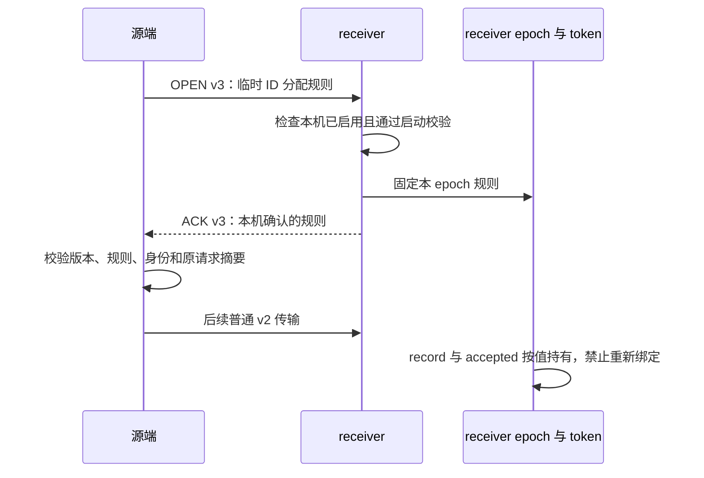

- 只有 OPEN/对应 ACK 使用 v3；普通 frame、batch、manifest、session-only 和
  bundle 维持 v2。namespace OFF 的源端保持 v2；ON receiver 允许无契约 v2，
  但该 epoch 不获得临时目标分配授权。开启但未完成 boot 检查时不自动降级。
- 契约为 28 字节：版本/策略各 u16，table 起止边界与持久 table 上界各 u64。
  字段进入控制 CRC；ACK 还绑定原始请求 SHA256、epoch、sequence、nonce。
  ACK 的契约来自 registry 本地检查输出，不能从请求直接回显为成功。
- sink/source session 保存请求或确认值，断连接不清空。receiver DECLARE 和
  BEGIN 的 record、accepted epoch 保存独立副本；COMMITTED 幂等早退前检查
  一致性。online 缓存已退休而 accepted/终态记录仍存活时，不可重新 OPEN。
- 复用现有 mutex，不增加服务端线程、数据扫描或外部升主入口。本切片没有
  新增 RESET DRAIN 逻辑或测试，也没有提交。

证据目录：`build-debug/temp-preserve-implementation/2026-09-23/temp-id-contract/`。

| 检查 | 实际结果 | 证据 |
| --- | --- | --- |
| 旧代码基线 | v2/OFF 兼容通过，新 v3 OPEN 返回 4013；1 业务失败、1 业务通过 | `mtr-red2.log` |
| Debug mysqld 构建 | 退出 0 | `build.log` |
| 最终 MTR | 7/7 业务通过、无跳过，shutdown_report 另计通过，退出 0 | `mtr-verified.log` |
| Release 参数语法检查 | transfer 与新 contract 共 2 个编译单元通过；不是 Release 全构建/NFR | `release-syntax.log` |
| 源码复审 | 两个独立只读 agent 未发现本切片确定缺陷；提出的重连/新 epoch 坏契约/伪 ACK 测试已补齐 | 本会话 review |

6 个新业务用例为 `temp_id_contract`、`temp_id_contract_off`、
`temp_id_contract_source`、`temp_id_contract_source_off`、
`temp_id_contract_ack_downgrade`、`temp_id_contract_ack_mismatch`；另回归已有的
`standby_transfer_phase2_scheduler_mode`，覆盖默认 OFF 的原 source v2 传输。

新用例使用 MTR 管理的 mysqld 与 Python Classic TCP 客户端，没有 UT/GUnit、
DEBUG_SYNC 或 DBUG。覆盖首次错误/空契约、未知外层版本、同 epoch v2↔v3
替换、换 TCP 连接重试、截断/尾随/CRC 错误、v3 非 OPEN 拒绝和后续 v2 DECLARE。
双实例用例通过真正的 DRAIN 进入 C++ source transport；异常 ACK 用本机 relay
转发真实认证及 receiver 响应，只改版本或一个契约字段并重算 CRC，保留身份
与请求摘要。断言源端拒绝、没有发送 DECLARE、原业务事务仍可继续 COMMIT。
receiver 既有 READ ONLY 会话的临时 DML/ROLLBACK 和最终行值同时核对。

初轮夹具问题均有保留日志：本工程无 SESSION_TRACK 时 OK info 仍有长度前缀；
成功 DRAIN 后普通业务 SQL 会被阻止；测试关闭源实例需使用既有特定 HA 账户。
relay 的禁用 SSL 选项必须经 `-master.opt` 排在 MTR 自动 SSL 配置之后，否则
只会测到连接超时。这些早期失败见 `mtr-red.log`、`mtr-source*.log`、
`mtr-final.log`；修正后完整通过见 `mtr-verified.log`。未把夹具失败算内核缺陷。

**后续仍需实现：** prepared owner 在实际目标准备之前安装/核验不可变契约，
worker 取号必须使用该事实；缺失时不能改读当前开关，更不能落入共享字典发号。
prepared 幂等快路径也须一致核验。当前 source/adopt 临时资源准入仍关闭。
LOB 图、目标 image、页/extent 预算、原生 ownership 移交、PS 依赖和持续增量等
任务未被本轮握手替代。测试 receiver 暂停 prewarm，不声称两个独立 datadir
完成物理复制、READY、在线升主、SQL RESUME 或性能验收；外部工程集成条件仍保留。

本轮仅清理已结束的本轮 vardir 内 data/std_data；保留日志、结果和失败证据。

## 2026-09-23：prepared owner 保留分配契约

receiver worker 从原有 record lookup 取得已协商契约，在跨批工作中固定不变；
传入 semantic bundle 安装时只绑定一次。契约保存在 prepared resources PImpl，
不放在可被 gate 取走的 bundle 内。PREWARMED snapshot 单独暴露资源契约和
对象集合摘要；已准备快路径同时检查二者，避免复用不匹配候选。

final facts 对非空契约使用 V2 canonical 域并纳入五个标量；空契约保持原 V1
字节与摘要。首次发布、存活 owner 幂等、gate adopt 和 attach 都核对资源与事实
一致；资源已退休时仍允许相同发布摘要的幂等请求，不重建 owner。固定升主 prepare
入口在注册 resurrection 前核对 accepted epoch；adopt 再核验，SQL RESUME 沿原
begin_attach 检查。未新增 mutex、页扫描或外部升主调用。

证据目录：`build-debug/temp-preserve-implementation/2026-09-23/temp-owner/`。

| 检查 | 实际结果 | 证据 |
| --- | --- | --- |
| Debug mysqld 构建 | 退出 0 | `build.log` |
| 定向 MTR | 5/5 业务通过，无跳过；shutdown_report 另计通过，退出 0 | `mtr-green2.log` |
| Release 参数语法检查 | 4 个相关编译单元通过；不是完整 Release/NFR | `release-syntax.log` |
| 独立只读复审 | owner 寿命、空契约兼容、幂等、升主与 attach 未发现本切片确定缺陷 | 本会话 review |

新增 `temp_id_contract_owner` 复用已有 Python PS registry bridge，验证契约参与
摘要、空契约错配拒绝、正确 final facts 幂等、取走 bundle 后契约仍在、后端重建后
剩余 FETCH，以及附着失败资源清理。其余四例为 `ps_backend_restore_registry`、
`ps_backend_restore_receiver`、`temp_id_contract_source`、`temp_id_contract_source_off`。

初次旧代码运行缺少预期 probe 标记，见 `mtr-red.log`，只能作为该内部检查尚未
接入的证据。修改后首次 `mtr-green.log` 仍因 trace 检查失败：SESSION debug 会
复制全局 keyword，但把输出改回 stderr；实际完成标记在该次 mysqld.1.err 内。
现已由 Python 对每条连接显式指定追加/flush trace 并检查 namespace 开关。
该失败属于测试日志配置，不是契约移交失败。

本切片仍未接入目标 image/undo 的正式 worker 准备和原生接管。内部 bridge 不等于
实际物理升主/SQL RESUME 验收；source/adopt 临时资源准入保持关闭。没有新增
UT/GUnit、DEBUG_SYNC 或 RESET DRAIN 行为/测试，未提交；已结束 vardir 的
可重建 data/std_data 清理单独记录在 `cleanup.log`，日志保留。

## 2026-09-23：image writer 文件所有权修复

为后续 receiver 目标 image 生成复用 carrier 时，源码审核确认一个已有缺陷：
`open()` 因同名 warm/tmp 返回 ALREADY_EXISTS，工厂局部 writer 析构仍执行
无条件删除，可能删除先前 owner 的文件。另有关闭失败后重复 close 返回 OK、
成功 link 后 tmp 删除失败失去重试责任的问题。

修复集中在 `sql/preserve_trx_temp_table_carrier.cc`：分别记录本次创建的 tmp 和
本次安装的 warm；abort 只删这些名称，删除成功才清所有权。close 保存最终
状态，失败或 abort 后不能通过 close/result 声称成功。成功 close 后析构保持
warm 供 phase1 后续 seal，只重试本次残留 tmp。目录同步失败独立保留 pending
状态；文件已删但目录尚未同步时，后续 abort 仍重试同步。原 install helper
增加可选的 tmp 已删除输出，其他 caller 保持原行为。

这不是新的 RESET DRAIN 处理或进程启动清理；也不宣称析构面对永久 I/O 故障
可以保证磁盘无残留。运行期只进行有界重试，后续候选 owner 仍须承担失败收尾，
纯垃圾文件按既定要求可在进程重启后异步清理。本切片未建设该异步扫描。

新增两个 MTR 从真实临时表捕获进入 debug-only carrier 检查，复用已有充分 DML
背景、失败后继续修改、ROLLBACK、再 COMMIT 和残留断言：

- `temp_image_writer_ownership`：tmp/warm 已存在时内容不变；open 后另一 owner
  发布 warm，close 失败只能清本次 tmp；失败 close/result 不伪成功；正常 close
  后析构保留 warm；显式 abort 清本次产物，后来的同名文件不受影响。
- `temp_image_writer_cleanup`：文件 sync 与删除失败、目录 sync 与删除失败、
  文件删完但目录 sync 失败的重试；link 成功但 tmp unlink 失败时析构只清 tmp。
  DBUG_PUSH 使用作用域 guard，异常退出也恢复故障开关。

证据目录：`build-debug/temp-preserve-implementation/2026-09-23/temp-writer/`。
`build-red2.log` + `mtr-red.log` 保留修复前 ownership 用例失败；不是把预期 SQL
拒绝当作复现，测试还要求 probe 全部文件检查及最终完成标记。
`build-green.log`、`mtr-green.log` 为修复后 Debug 构建和 5/5 业务通过，无跳过，
shutdown_report 单列通过：两个新例，加 `temp_table_import_receiver_file`、
`temp_table_import_target_data`、`temp_id_contract_owner`。内部探针不代表真实
物理备机 READY/升主/RESUME 验收。Release 参数下两个编译单元语法检查通过，
见 `release-syntax.log`；不是完整 Release/NFR。

复审补入故障开关的异常作用域保护后，最终构建见 `build-final.log`，两个新例
的最终复验见 `mtr-final.log`；carrier 的 Release 语法复验见
`release-syntax-final.log`。新测试无 UT/GUnit、DEBUG_SYNC 或 RESET DRAIN。
全部改动未提交，已结束测试的数据目录清理记录在 `cleanup.log`，日志保留。

## 2026-09-23：receiver 目标 image 分批生成组件

新增 `sql/preserve_trx_temp_receiver.cc/.h`，由一个 owner 独占 ImportPlan、
协商契约、随机私有目录、当前 writer/摘要和已封存 image。begin 在本机已通过
boot 检查的策略与协商值一致时才接收未分配目标 ID 的计划；失败不消耗调用者
的计划。私有目录以独占 mkdir 创建，不能复用或递归清除旧候选目录。

每次 step 先处理一个有界 undo 批次；undo 完成后，按页预算读取已固定的源文件，
转换身份、当前行/undo 引用，重算目标页校验，顺序写出并计算 SHA-256。
只有成功写入才推进页号；失败状态固定，不能重新调用 step 接着计算错误摘要。
文件结束时同步、封存并登记目标摘要，生产生成路径不再全量重读目标文件。
页校验逻辑留在 InnoDB ImportPlan，SQL 模块只调用薄接口。

取消后不再允许取号、准备 undo、改页或封存；包括尚无 target undo 的计划。
cancel_step 每次处理当前 writer、一个已封存 image 或一个 native undo 清理批次。
文件失败保留所有权，目录 sync 失败保留重试责任。封存成功后发生 OOM，已发布
image 仍由同一 owner 清理。清理 helper 先分配 tmp 路径再执行 unlink，避免
删除一半后因字符串分配失败而丢失同步责任；目录 sync 不再分配路径字符串。
上述行为属于候选资源生命周期，不增加 RESET DRAIN 或启动扫描。

本切片已对 descriptors、路径及固定页/摘要工作区取得 memory lease；这不等于
FD 或磁盘额度。组件析构仍有兜底清理，正式 worker 必须先分批完成取消再释放
owner，尚不能以析构证明调度/超时收尾有界。images_complete 只表示目标 image
生成结束，不是 LOB 闭包、原生接管或 token READY。

证据目录：`build-debug/temp-preserve-implementation/2026-09-23/temp-target-image/`。

| 检查 | 实际结果 | 证据 |
| --- | --- | --- |
| 最终 Debug mysqld 构建 | 退出 0 | `build-verified.log` |
| 定向 MTR | 10/10 业务通过，无跳过；shutdown_report 另计通过，退出 0 | `mtr-green2.log` |
| 最后清理/OOM 修订复验 | 3/3 业务通过；shutdown_report 另计通过，退出 0 | `mtr-verified.log`、`mtr-sync-path.log` |
| Release 参数语法检查 | 4 个相关编译单元通过，后续修改文件再复验；不是完整 Release/NFR | `release-syntax.log`、`release-syntax-final.log`、`release-syntax-sync-path.log` |

新增七个 MTR：`temp_receiver_image`、`_cancel`、`_fault`、`_pinned`、
`_seal_oom`、`_cleanup`、`_no_undo`。覆盖分批输出/目标摘要、源内容不变、源路径
替换后仍读固定 fd、中途取消、写入错误后不推进、封存后 OOM 的文件所有权、
清理分配失败/目录同步失败重试，以及已提交临时表内容没有本事务 undo 的情况。
封存 OOM 用例要求确实到达指定故障点，且先释放 writer 再清理仍存在的 sealed
image，不能仅靠一个预期错误码通过。其余三例为已有
`temp_table_import_target_undo_cancel`、`temp_table_import_target_undo_retry`、
`temp_image_writer_cleanup`。最终复验为新 cleanup、seal_oom 和 writer_cleanup。
最后复审还将同步故障移到 carrier 实际目录同步点，去掉人为设置重试状态的
探针逻辑：第一次删除后同步失败，第二次文件已不存在但同步重试仍失败，关闭
故障后才能完成。MTR 同时要求两个不同故障标记，覆盖实际错误返回和后续重试。

所有新例包含真实临时表与持久表 DML、失败后继续操作以及 ROLLBACK/COMMIT
后的数据断言；通过 DBUG 内部入口检查组件。namespace 的非 standby 发布门槛
保持拒绝，未生成本地恢复 token，不能将该路径计为 local startup 验收。
普通两个用户临时表在同一 session 中共用 user temp space；本轮不声称已验证
“前一 space 已封存、后一 space 写入中失败”。该多 space 场景需在正式接管完成
后，以恢复表加新建表、再次迁移的真实流程补验，不用伪造计划代替。

早期失败完整保留：`mtr-red.log` 是旧二进制没有新 probe 标记的可达性基线；
`build.log` 暴露 SQL 模块不应包含深层 InnoDB 页刷写头文件，已把校验实现移回
native 模块；`mtr-green.log` 中四例发现取消后取号入口漏查 cancelling，补齐
后见 `mtr-green2.log`。这些记录不包装为性能证据。

后续必须完成正式 receiver worker 的 authenticated SEALED 输入、FD/磁盘和
页/extent 预算、过期候选的分批清理、prepared owner 移交及原生接管；完整 LOB
图、无主键隐藏行号、undo 扩张边界、持续增量和实际物理升主/SQL RESUME 仍须
闭合。生产 source/adopt 准入保持关闭，不能发布正式 READY。小数据内部用例
不代表 FINAL→READY、升主或并发 RESUME 的性能验收。
正式接线还须明确私有目录的父目录及寿命，保证 READY 后 transfer staging
finalize 不会删除已经准备的产物；随机子目录本身不证明这一点。

没有新增 UT/GUnit、DEBUG_SYNC、RESET DRAIN 逻辑或测试，未提交。已结束的
本轮 vardir 仅清理可重建 data/std_data，日志保留，记录见 `cleanup.log`。

## 2026-09-23：目标 image 文件额度与 native binlog 共账

在原 `Preserve_resource_manager` 中增加文件 lease，没有新建第二个资源管理器。
目标 image 在创建独占目录后、接走 ImportPlan 前，预留全部目标字节和一个 FD。
当前 writer 与目录同步 FD 不同时打开，因此一个 FD 覆盖本组件的峰值。多批
共享同一 owner；每批顺序写入完成后按累计成功字节结算一次，避免逐页争用
manager mutex。部分写失败保留未结算额度，取消完成、所有文件句柄关闭后才
归还额度；对象继续存活也不继续占用这些已退还的额度。

FD 与 native binlog 共用准入总数，沿用既有 headroom；待写字节按目录的设备
标识累计，同盘不同路径不能各自获得一份空闲容量。磁盘快照、准入和结算使用
同一个 mutex，防止旧空闲快照与已降低的 pending 组合导致过量准入。已成功
写出的内容由文件系统实际占用体现，不继续重复扣作待写字节。额度只是 Preserve
内部并发准备的保护，真正 open/write 仍须处理操作系统错误。

源码复核确认 `mysql_tmpdir` 宏会轮转，而 statement/trx cache 可各自选择目录。
native 准备现在枚举配置目录且不推进轮转，对去重后的每个可能设备都检查
native 待写总量加该设备 image 待写量。每个设备使用自己的空闲容量，不能把
小盘的最小空闲容量错误施加到大盘自己的 image 上；既有最小值继续用于 native
汇总检查和 trace。native lease 公开 API 保持不变，纯 memory grow 不受磁盘
headroom 阻止。该保守策略可能少接收候选，但不会猜测尚未创建 cache 的落盘位置。

同时修正 native 首次取额度的异常窗口：先构造未 acquired lease、分配所有 map
节点，再发布计数。失败时只撤销本次插入的空节点，不能在 OOM 后留下 memory/FD
额度。settle/release 不构造分配型键，也不重新选择目录。

新增 `temp_receiver_image_budget`、`_budget_cancel`、`_budget_fault`，复用
真实捕获与 DML 背景，在内部验证同设备别名、两类 lease 相互挤占、move/rebind、
累计结算、FD/disk 拒绝、OOM 不改账及 begin 失败不接走原计划。真实 image 完成、
半途取消和写入错误后的取消结束时，在 work 仍存活的情况下再次取得满测试额度，
确保归还不是等到析构才发生。它们未使用 DEBUG_SYNC 或 RESET DRAIN。

证据目录：`build-debug/temp-preserve-implementation/2026-09-23/temp-file-budget/`。

| 检查 | 实际结果 | 证据 |
| --- | --- | --- |
| Debug mysqld 构建 | 退出 0 | `build-final.log` |
| 新增预算 MTR 最终复验 | 3/3 业务通过，无跳过；shutdown_report 单列通过 | `mtr-final.log` |
| image 相关初轮回归 | 4 个业务通过；3 个 binlog 用例因 no-bin 配置跳过，另行补跑 | `mtr-green.log` |
| 既有 binlog 预算回归 | append、limit、memory 三例通过，无跳过；shutdown_report 单列通过 | `mtr-binlog.log` |
| Release 参数语法检查 | resource、temp receiver 两个编译单元通过；不是完整 Release/NFR | `release-syntax.log` |

`mtr-red.log` 保留旧二进制没有预算 probe 标记的基线，不把它当作计账算法缺陷
复现。首次 `build.log` 使用了 C++17 的 map API，与当前 C++14 不兼容，已改用
find/emplace，构建成功见 `build2.log`。独立只读复审还补齐按设备计算和拒绝
请求仍输出原 trace 的兼容性。既有 binlog 回归夹具原本使用 DEBUG_SYNC，本轮
仅原样运行，没有把它引入新临时表用例。

本切片只覆盖目标 image 的新增文件与预算；输入 pin、native undo 页/extent、
正式 worker 分批取消和 prepared owner 移交尚未闭合。当前用例是内部预算与
真实捕获验证，不证明两块真实设备的运行表现、并发性能 SLO 或物理升主/RESUME。
后续接线须从 receiver record 的 authenticated SEALED object/固定文件读取
image 和 undo，精确关联 manifest 的身份/大小/摘要；DD 已内嵌 manifest，不能
用 staging 路径冒充本地 sidecar 目录。完整 source/adopt 准入继续保持关闭。

无新 UT/GUnit、无 RESET DRAIN 行为，未提交。只清理本轮已结束 vardir 的
data/std_data，原始日志保留，记录见 `cleanup.log`。

## 2026-09-23：临时表 receiver SEALED 输入所有权

新增 `sql/preserve_trx_temp_transfer.cc/.h`，集中构造 image/undo 的传输描述和
`Preserve_trx_temp_transfer_input`。沿用 `<token>.tempts.<space>.image/.undo`
命名及既有对象种类，不新增协议版本。manifest 内共享 image 的多表绑定只形成
一个物理对象；DD 继续来自 manifest。Input 固定原 manifest、epoch、数字 token、
协议和协商契约，持有经 SEAL 验证的文件句柄；它本身不认证连接、不发布 READY。

Input 要求 temp 对象、sealed 集合和非空文件 pin 精确对应。缺失、重复、额外
temp 对象、借用临时表名字的错误 kind、非零 flags/lock 契约、错误大小/摘要及
错误 pin 均拒绝。record 的其它资源族可同时存在。`matches()` 不分配动态内存，
但必须由正式 worker 在原并发控制边界下与当前 record 重验；保留旧 inode 不能
代替该代次检查。相同内容与摘要的幂等重封存不要求同一 inode。

`preserve_trx_temp_table_prepare_source_import()` 接受可选 Input，并将传入的
parsed manifest 重编码后与 Input 原文绑定。image 直接交给已有固定文件接口；
undo 从 pin 读入临时缓冲后交给原 decoder。没有 pin 就失败，不尝试同名路径。
该同步 helper 仍只用于组件阶段；source 字典/undo 图未完成预算与分批，不把
它直接放入 worker。当前 raw undo 缓冲已取 memory lease，解码后的页仍需要
独立、跨批持有的额度，不能在原缓冲释放时一并退还。

Input metadata 在解码前取保守额度，解码后缩减为按 payload 计的保留量。审查
发现旧 codec 可用很短的 v7 前缀声明 65,536 个 ownership claim，在读取内容前
直接 reserve 数组；已按每项至少 61 字节 wire 下界先验证剩余长度，再 reserve。
合法编码不变，损坏短包不会绕过最低解码预算触发大数组。分配失败输出不变，
临时 metadata 与 pins 析构后退还额度。

新增三个 MTR：`temp_transfer_input`、`temp_transfer_input_no_undo`、
`temp_transfer_input_multitable`。包含持久表和用户临时表真实 DML，以及失败后
继续 DML、ROLLBACK、COMMIT 的数据断言。内部探针用真实 transfer registry、
stage、SEAL 生成输入，覆盖 16 个损坏输入拒绝、OOM 额度恢复、实际 DECLARE
替换/重封存后的旧 Input 拒绝、正确描述加错误 pin，以及删除并重建 staging 后
仍通过旧 pin 完成 source import 和目标 image 生成。多表用例验证的是同一个
data space 的两张表共用一个 image 和一个 undo，不是多 data space 已支持。

证据目录：`build-debug/temp-preserve-implementation/2026-09-23/temp-transfer-input/`。

| 检查 | 实际结果 | 证据 |
| --- | --- | --- |
| Debug mysqld 构建 | 退出 0 | `build4.log` |
| 三个新增业务 MTR | 3/3 通过，无跳过 | `mtr-green.log` |
| 相关回归 | `temp_receiver_image_budget`、`temp_table_import_receiver_file` 2/2 通过 | `mtr-green.log` |
| 测试收尾 | shutdown_report 单列通过，整次退出 0 | `mtr-green.log` |
| Release 参数语法检查 | temp transfer、temp table、carrier、transfer 四个编译单元通过；不是完整 Release/NFR | `release-syntax.log` |

`mtr-red.log` 是旧二进制缺少 Input probe 标记的可达性基线，不是代次算法缺陷
复现。`build.log` 暴露 debug probe 缺少 carrier 类型头文件，已加 debug-only
include，后续构建通过。验证采用内部入口，并未让源端准入成功；原 namespace
非 standby 门槛仍拒绝，不能算真实跨 mysqld、物理升主或 SQL RESUME 验收。

下一步是 source 字典/undo 的持有预算、有界加载/建图及输入 pin FD 额度，再接
正式 worker 的跨批调度和取消退休。当前 decoder 逐页线性查找可能造成平方级
开销；现有 codec 的单 undo space 等于全部 data spaces 条件还阻止多空间再次
迁移，都需闭合。prepared owner 移交、完整 LOB、原生接管和外部 replay 验证
仍待完成。source/adopt 准入继续关闭，不把数据量相关准备推迟到升主或 RESUME。

无新 UT/GUnit、DEBUG_SYNC、RESET DRAIN 逻辑或测试，未提交。
只清理本轮已结束 vardir 的 data/std_data，保留 MTR 和 probe 日志；清理记录与
最终源码/测试/文档哈希见证据目录中的 `cleanup.log`、`final.sha256`。

## 2026-09-23：receiver undo 分批读取与页额度移交

新增 `storage/innobase/trx/trx0temp_preserve_input.cc` 及对应头文件。旧本地
decoder 保持原行为；receiver 接点改为驱动新 reader。共享 native 文件只增加
两个纯校验入口，复用原生 image/anchor/page 身份规则，不调用带 capture 注销
副作用的旧 validator，也不访问活跃 rseg、buffer pool 或字典。

reader 先读 PTRUNDO1 的 98 字节头部，验证版本、page size、manifest rseg
三元组、两组 anchor，以及 `file_size = 130 + page_count × (9 + page_size)`。
确认后先预留页数组、页字节、索引节点和 workspace 额度，再接走源 descriptor；
失败不消费输入。页数组一次 reserve，树索引逐项加入，不采用会整表 rehash 的
增量 hash，也不复用旧 decoder 每页扫描既有 vector 的写入 helper。

每步只读预算内的页，对 9 字节 frame 和页内容计算流式 SHA，最后核对独立的
内层 digest；外层 transfer SEAL 不能替代此格式校验。页 0 的 space ID 0 特例
与旧 decoder 一致，不为未刷盘的 buffer 页新增磁盘 checksum 要求。重复
`(kind,page_no)` 明确拒绝，避免不同读取器对重复内容取第一份或最后一份。

读完后先要求 RSEG_HEADER 和至少一个 allocator 页，再按预算验证两条 anchor
链的 PREV/NEXT、首尾、top、页角色及无环条件。允许未达历史页和另一 anchor
共存。两链完成后逐项释放临时索引，最后才置 sealed；每步包括链检查与索引
释放，不把一次全量 collect 藏在 finish 中。失败状态固定，只能取消；取消按
页和节点分批释放，析构循环仅为兜底，正式 worker 必须自行驱动取消。

额度分为 reader 固定 owner 和已解码 source 页两组。取消完成只退还页额度，
reader 本身存活时仍收费；take 只移交 descriptor/page lease。ImportPlan 的
`prepare_source_undo()` 在所有校验成功后一起接走页和额度，失败不消费；其
Undo_graph 先销毁记录和页，再归还额度。SQL 失败栈亦保证页先于 lease 析构。
同时补齐 source undo 入口的 `m_cancelling` 检查，已取消的 plan 不能重新装图。

新增 `temp_undo_input` MTR 使用真实持久/临时表 DML，并调用内部探针验证：
四种损坏输入（count、page kind、内层 digest、链地址）、粘性失败、读取/链检查/
索引释放三个阶段取消、reader 存活时固定额度不提前退还、成功 take 的页内容与
anchor/rseg 同旧 decoder 一致，以及图构造 OOM 和取消后的所有权保持。最终
捕获失败后仍验证原会话继续 DML、ROLLBACK 和 COMMIT 的数据结果。

证据目录：`build-debug/temp-preserve-implementation/2026-09-23/temp-undo-input/`。

| 检查 | 实际结果 | 证据 |
| --- | --- | --- |
| 新 reader 首轮 MTR | 新例、多表输入、无 undo 输入 3/3 业务通过 | `mtr-green.log` |
| Debug mysqld 最终构建 | 退出 0 | `build-final.log` |
| 所有权/取消修订复验 | 新例、输入、两表、无 undo、namespace OFF 共 5/5 业务通过，无跳过；shutdown_report 单列通过 | `mtr-final.log` |
| take 后消费者先释放的最终复验 | 新例通过，shutdown_report 单列通过；退出 0 | `mtr-verified.log` |
| Release 参数语法检查 | input、原 native helper、ImportPlan、SQL temp table 四个编译单元通过；非完整 Release/NFR | `release-syntax.log` |
| 最后修改的 input 单元语法复验 | 退出 0 | `release-syntax-final.log` |

真实样本有 13 个 undo 页，单步预算下推进 37 次（包括链与索引退休）；这说明
批次边界可达，不是吞吐、FINAL→READY 或升主耗时验收。`mtr-red.log` 保留
旧二进制缺少新探针标记的基线，不冒称性能缺陷或取消漏守卫的旧版运行复现。

仍须完成 source 私有字典、records/address map/external refs 及 workspace 的
预算与分批；当前 SQL helper 仍同步循环 reader，之后调用同步 source graph
构建。不能因此宣布整个 receiver 准备已成有界 worker。后续将图构建放入独立
pending 状态，禁止 target undo 把“图未建完”当作“没有 undo”，完成后一次
安装最终图；取消也必须分批处理。输入 FD、native 页/extent、prepared owner
正式移交和端到端接管仍待完成，source/adopt 准入不开放。

没有新增 UT/GUnit、DEBUG_SYNC、RESET DRAIN 或在线升主阶段，未提交。
本轮已结束 vardir 仅清理 data/std_data；日志、探针 trace 与最终文件哈希保留
在证据目录（`cleanup.log`、`final.sha256`）。

## 2026-09-23：source undo 引用图的预算与分批构造

将原同步算法移入 `trx0temp_preserve_graph.cc/.h`，ImportPlan 保留薄的批次入口
和同步兼容入口，不保留第二套构图算法。pending 图私有持有页索引、记录和前驱
关系，仍借用调用方的不可变源页；成功才一起接走 descriptor 和页 lease。
失败保持原始错误，后续批次不能伪装成功。同步入口在失败后清掉候选图，维持
原来的输入不消费和可重试约定。

构图按 INDEX、COUNT、RESERVE、BUILD、MERGE、LINK、RETIRE 推进：先建立页
树索引，按链计数并核对 owner/top/undo_no；计数完成后申请记录与地址索引额度，
为空 vector 一次 reserve；逐记录解码，再逐项核对两流 undo_no 不重复、前驱
归属/顺序/行键及单一后继；最后逐节点释放临时页索引后交付。无全量 sort、hash
rehash 或已有记录前缀复制。单页/单记录是最小单位，可越过字节预算；大块内存
申请也不能承诺固定墙钟耗时。已有 debug link probe 最坏仍会遍历记录，只在
显式开启该内部探针时执行，不作为生产批次时延证据。

固定 owner、源页、持久图和 workspace 分开计账。COUNT 后按记录总数预扣
记录数组/地址树额度；外部引用按实际个数 reserve，并调用原 manager 的
`Preserve_memory_lease::grow_to()` 扩展额度。常规以 64 KiB 粒度增额，避免每条
记录取全局额度锁；整块申请失败允许精确申请。后者在接近额度上限时可能每条
带外部引用的记录两次取锁，争用与时延未测，不宣称临界额度吞吐已验收。
workspace 覆盖页索引、header 解码和字段解析峰值，真正释放后才退还额度。

新增 incomplete 守卫阻止目标发号、目标 undo 的“无源图即完成”捷径、页转换
及封存。图校验全部成功前，公开记录数为零也不能进入目标阶段。取消先按原生
步骤释放目标 undo，再分批释放候选/最终图的记录、索引和已接管源页；固定
owner 额度直到图析构才归还。未成功移交的源页仍归调用方，必须由正式 job
另行分批退休，接口注释已明确这一责任。receiver image work 已在 plan.reset
前驱动图取消，但最后私有字典/Space/bindings 析构仍待分批，不能把整个 job
收尾称作已完全有界。

新增 `temp_undo_graph_batch` 和 `temp_undo_graph_external` 两个业务 MTR。
内部探针在七个 pending 阶段取消，并在最终提交边界注入 OOM，检查粘性失败、
源所有权、目标拒绝和额度恢复；另检查 lease 增额失败保持原值。真实 LONGBLOB
DML 验证实际外部引用触发增额，保留既有原生编码/目标页和原会话 rollback/
commit 数据断言。尚未分别命中“整块拒绝而精确增额成功”与 BUILD 真实额度
耗尽分支；这些是具体覆盖缺口，不由普通成功路径代替。

证据目录：`build-debug/temp-preserve-implementation/2026-09-23/temp-undo-graph/`。

| 检查 | 实际结果 | 证据 |
| --- | --- | --- |
| Debug mysqld 最终构建 | 退出 0 | `build3.log` |
| 首轮回归 | 5 个业务通过，shutdown_report 单列通过 | `mtr-green.log` |
| 扩展最终复验 | 两个新增、undo 输入、两表输入、image 取消、namespace OFF，共 6/6 业务通过，无跳过；shutdown_report 单列通过，退出 0 | `mtr-verified.log` |
| Release 参数语法检查 | graph、ImportPlan、resource、temp receiver、temp table 五个单元退出 0；不是完整 Release/NFR | `release-syntax.log` |
| 静态复核 | 两名只读 reviewer 未发现确定的图正确性/额度所有权缺陷；性能与整体 job 边界如上 | 本节及接口注释 |

单步预算下，146 条记录推进 493 次，真实外部字段样本 17 条记录推进 70 次。
这是状态可达性验证，不是构图耗时或 FINAL→READY 指标。`mtr-red.log` 是旧
二进制缺少新探针的基线。`mtr-final.log` 中四例在 image 阶段未达成功标记，
当时磁盘剩余不足资源管理器的 1 GiB 保留量；仅清理本轮结束 vardir 的 data/
std_data 与失败归档数据后，同一二进制六例全部通过，没有放松磁盘门槛。
所有日志保留，清理范围见 `cleanup.log`。

剩余 source 私有字典预算/分批、输入 FD/native extent 预算、正式 receiver
worker 跨批持有/取消/发布、prepared owner 移交、完整 LOB/多空间协议及原生
接管仍须完成。现有 helper 仍同步循环 reader/graph，source/adopt 准入不开放；
本轮不是物理升主或 SQL RESUME 验收。没有新增 UT/GUnit、DEBUG_SYNC、RESET
DRAIN 逻辑/测试或外部升主阶段，未提交。

## 2026-09-23：私有原生字典的预算、分批构造与取消

新增 `trx0temp_preserve_dict.cc/.h`，把原 ImportPlan 中的字典算法移入每表 owner，
旧 materialize helper 仍驱动同一个 builder，不复制第二套算法，也不扩展其产品
恢复范围。receiver 使用有 token 的预算入口，native table/index、构造 workspace
与 owner 容器分别计账；每步创建一列或规范化一个索引。table-ID 使用树索引，
完成表逐项加入；整个字典完成前，两种 getter 都不可见，目标发号和页解释拒绝。

轮换列名 heap 是本轮的实际内存收敛：原生 add_col 会复制已有全部名字，若一直
使用一个工作 heap，旧前缀会累计。本实现每列用新 heap，复制成功后释放旧 heap；
索引尚未建立，列结构不持名字地址。最终 system columns 仍走原生 helper，
最后一列把全名串复制到 table heap；预算覆盖旧前缀、新 heap 两个系统列前缀
及 native table 最终副本的同时存活。CPU 仍执行原生名字复制，不宣称列数上的
线性构造时间。

native 额度按 heap 请求量、块头/对齐/尾部余量计算；index 覆盖 raw/normalized
对象同时存活、补入的聚簇/系统字段、三个统计数组、search info、事件对象和
字段匹配工作向量。SHARED_SPACE 输入明确拒绝，避免私有构造读取 receiver
本地 fil 名字。空间内 owner 数组先有独立 lease，再为空 vector 一次 reserve；
以后追加不复制完成前缀。固定 token 数组不引入动态字符串寿命。大块 reserve
和原生单索引规范化仍是不可拆单元，不保证单次墙钟延迟上界。

异步入口失败保持错误；同步入口只销毁当前失败的未完成表，保留之前完成表
及其额度。lookup map 插入失败时，已完成的原生表也保留，重试只补插入；错误
token 不能清错或接管。取消先退 target undo/source graph，再逐索引退私有字典。
每步锁内移除一个索引，空 table 在锁外释放，最后释放数组容量再退容器额度。
原生删除仍可能取得 AHI 分区锁/rw-lock 管理锁，未宣称它完全无锁。未发布索引
不被 handler/AHI 使用，正常 ref_count 为零，不应进入原生等待循环。

代码复核还发现并修正两个继承的异常窗口：`dict/mem.cc` 先完成可能分配字符串
的 system-table 分类，再分配 native table；`dict0dict.cc` 用局部 RAII 持有
normalized index，直到挂入 table 链表后才交出。strict 错误路径与异常路径各
释放一次自己的对象，正常分类、规范化、锁范围不变。这些是原生所有权小修正；
大部分新增逻辑仍在专属文件，没有新增在线升主阶段。

新增 `temp_dictionary_batch`、`temp_dictionary_multitable`、`temp_dictionary_off`：
前两例复用真实临时/持久 DML，验证七个取消切点、额度拒绝保持错误、同 token
重试、错误 token 拒绝、normalized 构造异常、DONE owner 的 lookup 插入失败，
以及第二张表失败时第一张表指针/额度不变。既有“索引二创建后失败”用例继续
检查释放两个索引；存活 reader 的同名临时表用例继续验证数据/后续发号隔离。
OFF 用例通过启动选项关闭 Preserve，验证正常持久/临时 DML 回滚，以及 40 个
固定宽度列在 native strict 分支被拒绝且没有留下表；只登记该测试表预期的
超大行错误日志。没有 DEBUG_SYNC 或新 UT/GUnit。

证据目录：`build-debug/temp-preserve-implementation/2026-09-23/temp-dictionary/`。

| 检查 | 实际结果 | 证据 |
| --- | --- | --- |
| Debug mysqld 最终构建 | 退出 0 | `build3.log` |
| 初轮回归 | 6 个业务通过，shutdown_report 单列通过 | `mtr-green.log` |
| 最终代码的组件/相关回归 | 8 个业务通过，无跳过；新增 OFF 用例当时因错误使用动态开关失败，整次退出 1 | `mtr-verified.log` |
| 修正后的 OFF 用例 | 业务及 shutdown_report 通过，退出 0 | `mtr-off-verified.log` |
| Release 参数语法检查 | dict owner、ImportPlan、native mem/dict、temp receiver/table、resource 共 7 个单元通过；不是完整 Release/NFR | `release-syntax.log` |
| 只读复核 | 两名 reviewer 核对 native 预算、锁、失败重试及所有权；修订上述异常窗口和容器额度寿命 | 本节及源码注释 |

最终二进制覆盖的不同业务用例合计 9 个通过；不把含测试夹具失败的一轮写成
全轮成功。单步预算下，一表样本推进 13 次，两表样本推进 18 次；这不是性能
验收。`mtr-red.log` 保留旧二进制缺少新分批探针的基线；`mtr-final.log` 三例
在 image 阶段遇到磁盘保留量拒绝，后续清理已结束 MTR 数据后同代码相关例通过。
OFF 夹具先修正 startup-only 开关，再改用固定宽度列触发 native strict 拒绝，
最后登记这张表的预期错误日志，过程日志均保留。

额度 baseline 证明 lease 收尾，不能单独当成 native heap 泄漏检测；normalized
异常窗口的关闭由 RAII 源码复核及故障返回/重试共同支撑。该轮没有全量 HA 或
并发 NFR 证据。Space/binding 其余元数据准备/预算/释放、输入 FD/native extent
预算、正式 worker 的跨批接线、prepared owner 移交、完整 LOB/多空间协议及
原生接管仍待完成。SQL helper 仍同步循环各组件，source/adopt 准入继续关闭。
没有新增 RESET DRAIN、本地启动恢复或外部升主阶段，没有提交。


## 2026-09-23：Space/binding 元数据预算与分批准备

本轮继续使用专属 ImportPlan 文件，补齐进入字典之前的元数据准备；没有另建
全局资源表。新 `begin_source_space()` 接收 SEALED 文件和 immutable binding
指针列表，复制轻量列表后分批推进：页零预检、一张表的原生校验和两份定义复制、
一个索引的身份登记与根页检查、最后发布 Space。pending 候选不可见，字典构造
和目标发号拒绝；错误保持到取消。manifest 的 binding 在完成或取消前必须地址
稳定。当前 SQL helper 在原调用内同步驱动，所以借用期闭合；正式跨批 job 仍须
显式持有 manifest/input，不能直接保存调用栈中的引用。

SQL 分组由 binding 深拷贝改为指针，省去先前第三份完整定义；其小容器单独计账。
Space 额度覆盖 source/target 两份 binding、索引/root 树、常驻 XDES 页，以及原生
校验时的列名/index/root 临时 sets；每张表先 grow 再复制。预检页和指针列表使用
短期额度，plan 空间数组独立申请到 codec 上限并只 reserve 一次，避免已完成空间
前缀反复复制。全 plan 的 table-ID/space-ID 树避免每增加一个空间就重扫历史表。
各空间的索引 ID 仍独立，表 ID 跨空间唯一。此处不声称 Input、外部 decoded
manifest 与重新编码的总峰值已一起纳入预算。

取消先退 undo、私有字典，再逐树节点、字段、列、索引和表释放 metadata；ID 节点
校验 owner 指针后才删除，失败候选不能抹掉别的空间的登记。Space 内存先于其
lease 释放，空间数组容量最后释放，再退 plan 容器额度。receiver image owner
已使用这个完整取消入口。旧同步 add_source_space 仍驱动同一算法，保留原有
路径读取和失败原子性；该旧入口不据此承诺新的 receiver 额度合同。

两路独立只读审查发现并关闭了一个 OOM 窗口：第一次容器额度申请后 reserve
抛异常，会留下 20,480 字节额度，下一次 begin 先重复申请才释放旧额度。新增
reserve 故障验证在修复前真实失败，trace 为 `container oom retained=20480`。
修复改为局部 lease，reserve 成功后才移交成员；同一 plan 可重试。审查还指出
原重复 root 负例先因重复 index ID 返回；新负例使用唯一 index ID 和重复 root，
并断言 index 节点已插入、root 节点数不变，独立证明 root 拒绝分支。

新增 `temp_metadata_batch`、`temp_metadata_multitable` 使用真实临时/持久表 DML：
128 行单表及两表共享一份 image/undo，检查六个取消切点、真实预算拒绝、发布
OOM、容器 OOM 后同 plan 重试、重复 table/index/root、外部 owner ID 保护、
源事务继续 DML/rollback/commit。组件故障点是内部验证，不能替代真实 transfer/
在线升主/SQL RESUME；没有 DEBUG_SYNC 或新 UT/GUnit。

证据目录：`build-debug/temp-preserve-implementation/2026-09-23/temp-metadata/`。

| 检查 | 实际结果 | 证据 |
| --- | --- | --- |
| Debug mysqld 最终构建 | 退出 0 | `build-final.log` |
| 新分批路径基线 | 旧二进制缺少新检查点；不称生产故障 RED | `mtr-red.log` |
| 容器 OOM 复现 | 业务失败，trace 残留 20,480 字节；shutdown_report 单列通过 | `mtr-oom-red.log` 与保留 trace |
| 最终回归 | 8/8 业务通过，无跳过；shutdown_report 单列通过，退出 0 | `mtr-final.log` |
| Release 参数语法检查 | import、SQL temp table、receiver、resource 四单元退出 0；最终 OOM 修复重验 import 退出 0 | `release-syntax.log` |
| 只读复核 | 两名 reviewer 复核额度/借用/发布/取消，修复与新增 root 负例再次静态通过 | 本节及源码注释 |

单步预算下一表样本准备 5 批、两表样本准备 6 批；这是状态可达性，不能当作
FINAL→READY 延迟证据。最终两例均记录 `container oom retained=0`，六个取消
切点和七类失败检查完成。日志 `mtr-green.log`、`mtr-verified.log` 保留此前
5 个和 8 个业务通过；不以旧结果代替最终代码复验。仅清理本会话已结束测试
数据目录，保留日志，具体路径见 `cleanup.log`。没有全量 HA 或 NFR 验收。

仍须串联正式 receiver 作业，且必须一起收敛这些合同：

- 一个 Staged_token_work 持有唯一 bundle/codec quota/PS/temp owner，避免 temp-only
  每批重新读取或重复计入 IO；沿原队列继续准备，不消耗普通错误重试次数。
- 每批及发布前核对完整 manifest、commit LSN、boot scope 与 temp ID contract，
  不能把仅含 root/epoch/token 的排队键当作完整代次证明。
- 在数据准备完成后才取得短期 prepare lease。取消继续持有可重试 owner，并明确
  与 registry 裸指针的解耦；锁外析构不等于有界、可保留 IO 错误的异步退休。
- 完整原生 fil/dict/TABLE/undo 接管、LOB 闭包、多 data space 协议、输入 FD/native
  extent 预算和正式 prepared-owner 移交仍待完成；image complete 不能发布 READY。

单表定义校验/复制和空数组 reserve 是不可拆单元，不保证固定墙钟上界。新增
工作仍全部在 READY 前；source/adopt 准入保持关闭，不将批量准备移到升主或
SQL RESUME，不新增 RESET DRAIN、local startup 或外部升主阶段；没有提交。


## 2026-09-23：receiver source 准备作业与输入寿命

新增 `preserve_trx_temp_import.cc/.h`，复用现有原生组件组成一份跨批作业，阶段为
GROUPS → SPACE_BEGIN/SPACE → DICTIONARY → UNDO_BEGIN/UNDO_READ → GRAPH →
RETIRE_GROUPS → DONE。无 undo 只跳过 reader/graph，必须先完成元数据与字典；
有 undo 则必须先完成 reader.take 和整个引用图。每步只运行当前阶段，不在一个
worker 调用内同步循环到最终结果。作业持有唯一 Input 和所有借用者，不保存
THD、共享锁、prepare lease，也没有另建全局资源注册表。

`begin()` 先申请作业/分组容量和分配对象，成功后才接管 Input。准备失败保留
错误和候选；完成前或输出非空时 `take()` 拒绝且不移动资源，成功时同时移交
Input 与 plan。后续 image work 可复用该 plan，但它的完成仍非原生接管/READY。
取消顺序是 plan（pending graph、DD、metadata）→ reader → 尚未交付的源页和
lease → 分组 → Input。取消期间不可重新 step/take；正常 worker 必须逐批驱动，
析构循环只作最后兜底。各 shell 的额度一直保留到其析构。

Input 直接 move 保留首次成功解码的 manifest，新的 source work 不再解码或重编码。
输入额度保持 `R=64KiB+4T+32P`，解码前申请 `max(R,4MiB)`，完成后缩到 R；
raw、decoded、objects 和 pin-map 一起保留，外部传入 payload 仍归原 owner。
新增编译期 sizeof 断言约束当前 codec 的未填充 reserve 总量加固定余量不超过
2MiB：tables/undo 各 1024，image indexes/columns/dict indexes/当前 fields 各
4096。此前已填充的 prefix 有 wire 支撑；claims 已有 remaining/61 校验。更改
codec count 限制时必须同步复核此额度公式。Input 的字段、列、索引、表、claim、
对象和文件 pin 分批退休；退完嵌套容器及其容量后销毁 owner 才归还额度。
取消后 manifest getter 与 matches 均拒绝。首次 codec 解析/失败局部析构仍同步，
不宣称这部分已完全分批，也不把旧 helper/probe 的外部额外副本算进新 Input。

IO 按成功组件记录的实际读取计数：ImportPlan 元数据页累积值、reader 的 header/
frame/page/digest 累积值，每批只报增量；校验/构图批次为零。内部验证独立由
manifest 推导 `Σ每空间一页头 + Σ每索引一页根 + undo文件size`，对比作业总读量，
避免用同一计数器同时当实现和期望。失败 setup/部分读取仍可能有额外未记 IO，
接口已注明；正式调度限速接线须使用这个口径，不重复收取一次全文件读取费用。
work_budget 用于分组、Space、DD、graph；byte_budget 额外限制 graph；page_budget
限制 undo reader。单表校验/复制、原生索引构造和大字符串 free 仍是不可拆动作。

新增 `temp_import_work`、`temp_import_work_multitable`、`temp_import_work_no_undo`
使用真实临时/持久 DML，验证有 undo 的九个阶段取消、无 undo 的七阶段取消、
metadata 额度拒绝、undo digest 损坏、graph 完成交付前 OOM、两类作业准入失败
保留 Input 并重试、输入分批释放期间额度不早退、take 拒绝不改输出及最终移交。
成功后的原会话继续 DML/rollback/commit 和现有 image 生成检查保留。探针中的
unique_ptr 移动仍在同一调用线程，不能称为真实 worker/THD 切换验证；正式队列
接线和对应并发验收仍须完成。无 DEBUG_SYNC 或新 UT/GUnit。

证据目录：`build-debug/temp-preserve-implementation/2026-09-23/temp-import-work/`。

| 检查 | 实际结果 | 证据 |
| --- | --- | --- |
| Debug mysqld 最终构建 | 退出 0 | `build2.log` |
| 首轮回归 | 7/7 业务通过，shutdown_report 单列通过，退出 0 | `mtr-green.log` |
| 最终复验 | 加入准入失败/输入取消和独立读量断言后，7/7 业务通过，无跳过；shutdown_report 单列通过，退出 0 | `mtr-final.log` |
| Release 参数语法检查 | 新 source work、Input transfer、SQL temp table、ImportPlan、undo reader 五单元退出 0 | `release-syntax.log` |
| 只读复核 | 两名 reviewer 核对状态机、借用、取消、额度、计数；未发现确定缺陷，验证口径按意见收紧 | 本节及接口注释 |

单步预算下，一表/两表/无 undo 样本分别推进 552/269/19 批，读取
262391/114854/49152 字节。批次数是状态可达性，不能当作实际 worker 并发或
FINAL→READY 延迟。`mtr-red.log` 是旧二进制缺少新入口检查点的基线，不称生产
缺陷 RED。首次 Input codec parse 仍同步；本片没有全量 HA、物理 replay 或 NFR
证据。已结束的本会话数据目录按 `cleanup.log` 清理，保留全部测试日志。

并行源码审核还确认再次迁移的多空间缺口，留给下一片同时关闭：已导入表与以后
新建表可能处于不同 image space，但一笔事务只有一个 m_noredo rseg/insert/update
元组。应保留“多个 image + 一个完整 undo”，其 source_space_id 只是载体，不是
undo 页的物理 rseg space。不能仅把 codec 的集合相等检查改为子集；capture 当前
逐空间重复发布 undo/claims，旧接管又对每个 descriptor reconnect。必须一起处理
唯一载体选择、未选 warm undo 的清理责任，以及只对该载体 adopt/reconnect。
现有两表测试只有一个 image space，不是这项需求的验证。

本片没有开放 source/adopt gate，也没有改变升主入口。后续工作仍包括正式
Staged_token_work/取消调度、目标与原生资源接管、LOB 闭包、多空间协议、FD/native
extent 预算、prepared owner 与 SQL RESUME 全链路。保持 standby-transfer 范围，
不增加 RESET DRAIN 或 local startup 逻辑，不把批量准备移到升主/RESUME；未提交。


## 2026-09-23：多个 image space 与一份事务 undo

本片关闭此前记录的捕获/codec 多空间缺口，并修正相邻的继承 undo 漏捕获问题。
没有新增 manager、全局映射或外部升主阶段。Phase1 与最终命令边界各自按当前
存活表选第一个 image space 作为 undo 载体，在跳过已预制 image 之前完成选择。
只有该载体捕获完整事务 undo；其他空间继续各自生成 image。载体编号只用于
sidecar/ownership 归属，实际 undo 页使用原 rseg space 身份。

baseline/tail API 增加显式 capture_transaction_undo 参数，默认值保留原单空间
调用语义。是否需要 undo 采用 history || live_native_undo，保留原历史标记的
完整性约束，同时覆盖 reseed 后没有新 DML 的事务。已 sealed prebuilt 若缺少
当前必需 undo，丢弃并回退；fallback 清空之前借出的 adopted_undo 描述。
未选择的旧 warm undo 在删除成功前仍保留清理记录。Phase1 写完 warm undo、
尚未移交 participant 便失败时，清理 image 和 undo；Phase2 在写 undo 前登记
清理责任，覆盖文件安装后同步失败的情况。这些属于正常迁移的失败收尾。

codec 允许多个 image 配一个事务 undo；仍拒绝第二份 undo、非 live-image 载体、
错误 token/identity 和冲突 ownership。既有 materialize 先用原生接口检查所有
无 undo 描述符，再对 manifest 指定的唯一载体执行 adoption/reconnect，最后
attach 全部 image。缺失/未 sealed/额外载体受控拒绝，原生重复接回保护不变。
没有把数据转换新增到 promotion 或 SQL RESUME，也没有开放 source/adopt gate。

新增四个 MTR（无 DEBUG_SYNC、新 UT/GUnit 或 RESET DRAIN）：

| 用例 | 实际验证范围 |
| --- | --- |
| temp_import_work_multispace | 普通用户表使用同一 session 原生池的两个真实空间，SQL 确认 distinct SPACE=2；跨表 DML，2 image/1 undo，71 条 undo、源准备、目标 image、原会话 rollback/commit、断开后池归还 |
| temp_import_work_inherited_undo | 内部探针调用已有 reseed，之后不再做 temp DML；history=0/live_undo=1 时仍捕获一份 undo 和 71 条记录，原事务数据保留 |
| temp_multispace_phase1_failure | 在真实 warm undo 写入成功后、participant 接手前注入失败；无侧车残留，原会话继续 DML/rollback/commit，两个原生空间归还 |
| temp_multispace_fixture_off | 启动时关闭 Preserve 和临时表子功能，同一个 DBUG 夹具仍只分配原生单用户空间；rollback、池归还及无残留 |

双空间夹具只在第二个 CREATE 期间启用 debug 标记，借用现有 session intrinsic
pool 空间，表仍为普通非 intrinsic 用户表，DML/undo 语义不变；两个空间均由原生
session 析构归还。它不是“真实已导入表+新建表”的完整迁移验收。源/目标页头与
索引根的真实 space 校验仍由现有 ImportPlan/receiver 执行。

证据目录：`build-debug/temp-preserve-implementation/2026-09-23/temp-multispace/`。

| 检查 | 实际结果 | 证据 |
| --- | --- | --- |
| 双空间修复前 | SQL 证明两空间，捕获却生成 undo=2，断言失败 | mtr-red2.log 及 var-temp-multispace-red2 的保留 trace |
| 继承 undo 修复前 | reseed 后捕获 undo=0，断言失败 | mtr-red3.log 及对应保留 trace |
| Debug 最终构建 | 退出 0 | build-final.log |
| 最终定向回归 | 8/8 业务通过，无跳过；shutdown_report 单列通过，退出 0 | mtr-final.log |
| Release 参数语法检查 | temp_table、carrier、dict0crea 三个单元退出 0；不是完整 release 构建/NFR | release-syntax.log |
| 两人独立只读复核 | 核对载体、继承 undo、失败清理和 native 重连顺序，未发现新增阻断问题 | 本节与实际源码 |

mtr-red.log 首轮尚未输出候选数量；red2 的继承用例还含一条错误的跨线程日志
位置断言，red3 已仅按真实漏捕获失败。mtr-green.log 的四例通过源准备后在目标
image 阶段失败，当时磁盘仅余约 589MiB，低于已有 1GiB 预留；未降低保护，清理
本会话已结束数据后相同二进制的四例通过（mtr-green2.log）。该轮新 OFF 夹具
误用 SET GLOBAL 修改 startup-only 开关，随后改为 -master.opt 启动配置；最终
八例全部通过。历史失败日志均保留，数据清理路径记录于 cleanup.log。

当前双空间源准备读取 131238 字节，保留两个 image 和一个完整 undo，目标 image
共 196608 字节；批次数仅是内部状态可达性，不是 worker 公平性或尾延迟验收。
正式 receiver 队列/取消退休、native prepared owner、完整 LOB、NONE、预算及真实
RESUME 后再次迁移仍待完成。现有 materialize 的重连排序/接回后失败只经静态
核查，后续须动态覆盖。保持固定升主入口和 standby-transfer 范围，不扩展
RESET DRAIN 或 local startup；没有提交或推送。

## 2026-09-23：统一 receiver bundle 所有权与最终清单冻结

将已有 PS 专属 `preserve_trx_ps_receiver.cc/.h` 更名并收敛为
`preserve_trx_receiver_prepare.cc/.h`，不增加第二份队列或资源 registry。
所有 staged token 都持有首次加载的 bundle；没有 PS 时也复用该对象，依赖等待
和受限重试不再重读、重新解码或重复收取这部分 I/O 预算。PS 的 snapshot、分批
Preparation 和 Ready 仍可选。所有可重试退出都在 bundle/额度移交之前；只在
取得原 prepare lease 后，将语义对象和额度一起交给 prepared PImpl。

保留内存按当前 bundle 的 capacity 计量：对象本体、metadata 字符串/向量、TLV、
blob descriptors、外部 blob 与其嵌套字符串。采用溢出检查，拒绝 source-only
wire owner。此前 codec estimator 为每个空 metadata 也预留至少 384 KiB，且不
覆盖外部 blob 本体；不能将该瞬时峰值长期保留在每个普通 token 上。现在释放
binlog payload/外部 blob 后重新计量并 shrink_to，再移交原 lease。PS、reader、
结果文件等已有独立额度不变。这没有补齐最初 portable decode 的瞬时预算，不能
宣称整个解码路径的所有分配都已受新 owner 保护。

跨批复用要求最终资源身份稳定。源码确认正常 source 在 final streaming manifest
发布后拒绝 declare/send/prewarm-manifest 更新；receiver 据此增加对称约束：
`freeze_staged_manifest()` 在 registry 锁内一起核验 RECEIVING、完整语义 manifest、
唯一 snapshot 与全部对象 sealed，然后才允许 staged 入队。相同 BEGIN/DECLARE
幂等成功，保持 record、reservation 和 sealed FD 引用；不同 LSN、flags、对象
集合/顺序或 descriptor 拒绝。frame_sequence 是传输重放字段，不充当资源代次。
Phase1 OBJECT 作业继续允许更新；abort/corrupt/cleanup 保持原路径。最终 identity
固定后保留原 root/epoch/token 去重 key，不新增代次管理器。空 manifest 的 PS
内部桥仅在 Debug 明确豁免；正常 receiver 入口不豁免。

新增 MTR `transfer_receiver_bundle_retained`：64 行持久数据与事务内 32 行更新，
一次确定的 receiver 重试，日志断言首次 load 一次、随后 reuse；修改最终两个
LSN/flags/对象顺序、新增/替换 descriptor 均被拒绝，相同 BEGIN 后保护仍有效。
两个 1 MiB 缓冲检查额度覆盖，释放后检查缩减，小 bundle 额度低于 64 KiB；不以
可能被其他线程改变的全局计数差作为断言。原有 PS receiver 用例仍验证真实 worker
跨批、取消、源后端退出后的原 ID FETCH。新用例没有 DEBUG_SYNC 或新 UT/GUnit。
非 PS 样本的 sealed_files 可为空，不能将 map 相等扩称为临时表 FD 生命周期验收。
重启仅用于已有单实例 transfer 测试的退出与数据断言，不是新 local startup 能力。

证据目录：`build-debug/temp-preserve-implementation/2026-09-23/receiver-bundle/`。

| 检查 | 实际结果 | 证据 |
| --- | --- | --- |
| 原 bundle 重读 | 非 PS 重试读了两次，断言失败 | mtr-red.log |
| 清单冻结修复前 | bundle 已复用，但 final manifest 可改，断言失败 | mtr-freeze-red.log |
| retained memory 修复前 | 大缓冲未充分计账/小对象仍持 codec 峰值，断言失败 | mtr-memory-red.log |
| Debug 最终构建 | 退出 0 | build-accepted.log |
| 无 binlog 定向回归 | 4/4 业务通过，无跳过；shutdown_report 单列通过，退出 0 | mtr-final.log |
| binlog 定向回归 | 清理空间后相同二进制，2/2 业务通过，无跳过；shutdown_report 单列通过，退出 0 | mtr-logbin-clean.log |
| Release 参数语法检查 | receiver_prepare、transfer、ps_restore 三单元退出 0；非完整 release/NFR | release-syntax.log |
| 两人只读复核 | identity 冻结入口、Phase1 兼容、对象/额度生命周期；修正全局计数探针的不稳定断言 | 本节及源码 |

最终六个业务用例为：transfer_receiver_bundle_retained、transfer_receiver_retryable_not_ready、
ps_backend_restore_receiver、standby_transfer_read_view_ready、
batch_drain_dependency_lock_store_reseal、transfer_receiver_binlog_prefix_prewarm。
后两项是已有回归，其中原有 DEBUG_SYNC 没有修改或复制进新增用例。
首轮 binlog 回归的 prefix 用例在 final 之前即未建 native cache，当时磁盘仅余约
726 MiB，低于已有 1 GiB 预留。保留失败日志，清理本会话已结束测试数据后余量
约 2.3 GiB，同一 binary 的两项全部通过；没有降低资源保护或更改期望结果。
清理清单见 cleanup.log，日志与源码备份保留。仓库 clang-format 文件含重复键，
新专用文件使用 Google 基础风格与现有右侧指针对齐格式化，未修改共享配置。

本片未将临时表 Input/source/image 或目标 native TABLE/undo 放入正式 worker；
也未完成可重试取消调度及原生资源接管。下一步仍须先补齐目标 undo/file/ID 的
可逆移交、目标字典/TABLE 构造及 THD 重绑定，再接 prepared owner 和 SQL RESUME。
source/adopt 准入保持关闭，不把批量准备移到升主或 RESUME。固定既有升主入口，
不考虑 RESET DRAIN；没有提交或推送。

### 2026-09-23：目标原生 undo 的可逆接管

本片只修改 `trx0temp_preserve_import.cc/.h` 的专属组件，新增
`attach_target_undo / rollback_target_undo_attach / finish_target_undo_attach`。
沿用 ImportPlan 内的 Target_undo，没有新 registry 或线上升主阶段。

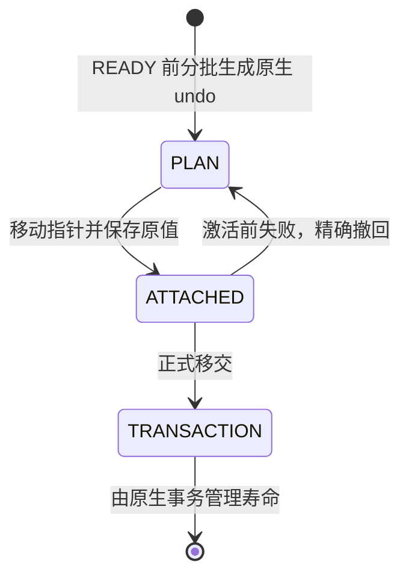

两个原生 undo 对象已经持有 slot、FSEG 和 list 登记。挂接只核验两个对象，
移动 `m_noredo` 三指针；不重复分配/登记，不扫描记录，不取得字典全局锁。
事务 ID 必须等于源 owner，目标 no-redo 为空；允许 ACTIVE，或已领取且无 THD
的 PRESERVED + ACTIVE_UNDO_V1。普通 PREPARED、错误 owner、不完整前缀及已有
undo 均拒绝。此项仅从代码证明工作量不随记录数增长，未给出延迟/NFR 验收结论。

journal 同时保存原 no-redo 三指针、undo_no、undo_rseg_space 和语句回滚位置。
目标 undo 序号较大时成对更新序号/space；已有序号较大则保留原对应 space。
挂接建立完整命令边界，撤回精确恢复原值；允许上层合法的 PRESERVED→ACTIVE
转换，不回写事务状态。调用者须保证事务在挂接到撤回/完成之间存活、独占且
没有 native DML/commit；undo mutex 不能替代这个合同。取消先内部撤回，再按
既有 FSEG 步长释放。生命周期/独占合同违例断言退出，不能循环假装等待清理。

正式移交清除所有 native journal 指针，准备对象析构不再碰原生 undo。重复
rollback/finish 先检查准备对象状态和 owner，再访问事务 mutex，避免在移交后
接触可能已释放的事务。挂接中及移交后禁止继续 append、改写/封存目标页或取得
用于转换的 roll pointer。无源 undo 只有在 plan 已准备、source/target undo 均空
时才 no-op，外围联合资源 owner 仍须检查事务身份。cleanup 不依赖当前特性开关。

新增两个 MTR：`temp_table_import_target_undo_attach`、
`temp_table_import_target_undo_attach_cancel`。真实源背景为 128 行临时数据、
多页 UPDATE/DELETE undo、两个新 INSERT，以及持久表事务修改；内部探针检查
错误 owner/状态/前缀、序号溢出、原始 rseg 为空与 rseg-only、较新序号保留、
错误 journal、往返及挂接中取消。finish 后先按原生 INSERT 路径释放，再销毁
准备对象，确认 UPDATE 的 slot 仍存活。holder 不登记 trx_sys，不对源 ID 调用
完整 native commit；剩余 UPDATE 由独立测试 holder 的既有 FSEG 清理收尾。
随后验证真正源会话可继续 DML、ROLLBACK 和 COMMIT。无 DEBUG_SYNC 或新 UT。

证据目录：`build-debug/temp-preserve-implementation/2026-09-23/target-undo-attach/`。

| 验证 | 结果 | 证据 |
| --- | --- | --- |
| 实现前两个新增用例 | 均因缺失对应内核分支失败；这是新增能力的基线，非既有线上缺陷复现 | mtr-red.log、mtr-cancel-red.log |
| Debug 构建 | 最终退出 0 | build-accepted.log |
| 生命周期修订后六个定向业务用例 | 6/6 通过，无跳过；shutdown_report 单列通过，退出 0 | mtr-final.log |
| 补充原始空 rseg 边界 | 两个新增用例复验通过，无跳过；shutdown_report 单列通过，退出 0 | mtr-accepted.log |
| Release 参数语法检查 | import 单元退出 0，非完整 Release/NFR 构建 | release-syntax.log |
| 两个独立只读 review | 修正移交后重复调用先取 mutex 的风险，并补空 rseg 恢复断言；未见剩余阻断问题 | 源码与本节 |

六个业务用例另含 `temp_table_import_target_undo_retry`、
`temp_table_import_target_data`、`temp_receiver_image_no_undo`、
`temp_table_id_namespace_off`。测试数据目录在进程结束后清理，保留 RED/GREEN
日志、源码备份及哈希；没有降低磁盘预留。

**仍未完成：** 正式 receiver/SQL RESUME 尚未调用此接管原语；目标字典、文件、
空间 ID/TABLE 的联合所有权，以及目标事务完整 COMMIT/ROLLBACK 仍须补齐。
当前测试不代表完整 HA 升主/RESUME、完整 LOB 或吞吐/延迟验收。source/adopt
准入保持关闭。继续仅使用既有线上升主接口，不增加 RESET DRAIN 或 local
startup 功能，不提交、不推送。

### 2026-09-23：receiver 目标私有字典分批预建

本片复用 `trx_preserve_temp_dictionary` 构造器，以 ImportPlan 的稳定目标
descriptor/bindings 预建原生 table/index。源字典继续用于解码；目标字典使用
独立 owner 数组与额度，每表继续持有 native/work memory lease。没有第二套
registry、映射或字典构造算法。生产改动位于 `trx0temp_preserve_import.cc/.h`
和 `preserve_trx_temp_receiver.cc/.h`；`preserve_trx_temp_table.cc` 仅修正既有
DBUG 测试桥传参，没有新增共享热路径 hook。

新增 `prepare_target_dictionary_batch / target_dictionary /
discard_target_dictionary_step`。准备必须使用源计划的同一 token、完整源字典
及已分配的目标 ID；每个预算单位构造一列/索引或推进一个边界。整个计划完成前
隐藏所有目标表，重复完成调用保留同一对象；错误 sticky，取消先释放目标字典，
下一批再处理源 undo/字典与 bindings，防止析构访问已释放元数据。

receiver 的 `step` 增加独立 metadata_work_budget，顺序为目标字典→undo→镜像。
`images_complete` 也要求目标字典完成；目标候选仍未发布到全局表 hash、fil 或
THD，不能把这个完成标志等同于整个 token READY。挂接到原生 cache 的发布、
撤回与最终 take 尚未完成，不能在 cache 发布后仍让私有 deleter 持有同一表。

两个新 MTR `temp_receiver_target_dictionary`、
`temp_receiver_target_dictionary_failure` 使用真实临时/持久表 DML 背景，验证
目标身份、索引根页、source 不变、跨批隐藏、完成后对象复用、错误 token、零
预算、索引构造中 OOM 的 sticky failure 和完整取消。正常路径探针也复用于
已有多表、多空间与无 undo 测试。原生结构检查位于 InnoDB 专属文件，SQL 调用
窄 Debug 方法；不加入新 UT/GUnit 或 DEBUG_SYNC。

证据：`build-debug/temp-preserve-implementation/2026-09-23/target-dictionary/`。

| 验证 | 实际结果 | 证据 |
| --- | --- | --- |
| 新能力基线 | 两个新用例因缺失目标字典分支失败 | mtr-red.log |
| 初次构建 | SQL 探针直接包含 InnoDB 内部头导致编译失败；已将探针移回 InnoDB | build.log |
| 首轮运行 | 6/8 业务通过，两个 transfer 组合用例拒绝错配 token | mtr-green.log |
| 修正后的 Debug 构建 | 退出 0 | build-token.log |
| 最终定向回归 | 8/8 业务通过、无跳过；shutdown_report 单列通过，退出 0 | mtr-final.log |
| Release 参数语法检查 | import、receiver、temp_table 三单元退出 0；不是完整 Release/NFR | release-syntax.log |
| 独立只读复核 | 字典身份/预算/取消及测试桥 token 合同无剩余阻断问题；另核查后续文件/ID 接管 | 本节与源码 |

八个业务用例为上面两个新增用例，以及 `temp_dictionary_multitable`、
`temp_import_work_multispace`、`temp_receiver_image_no_undo`、
`temp_receiver_image_cleanup`、`temp_receiver_image_cancel`、`temp_dictionary_off`。
trace 确认一空间两表的目标字典跨 18 批、两空间两表跨 19 批完成；这些只是
预算调度证据，不是性能 SLO。现有同进程探针要求目标数字 ID 与源不同；以后
跨实例验收不能照搬此数值断言，独立实例可以有相同数字 ID。

两例失败的根因是测试桥：transfer probe 将输入 token 改为 `1`，源计划已使用
received->token()，旧 receiver 调用却仍传源 token。修正该 DBUG 调用以传入
实际 received token，无 received 时保留源 token；目标校验没有放宽。
历史测试数据按终态日志及无运行进程证据清理，保留所有日志、源码备份和哈希；
清单见 cleanup.log，没有降低 1 GiB 保护线。

**下一步 native 文件/ID 接管的已核实合同：**

- 复用已有 adopted/attached descriptor 和原生最后表 DROP 链，不另建 manager。
  ImportPlan 必须显式转交目标 ID 的释放责任，不能在 attach 成功时解除 reservation；
  reservation 还被 ha_innodb::open 用于识别 generated temporary table。
- READY 前须有不可变目标原件和独立可写安装文件，不能硬链接同一 inode。
  在 receiver 按页同时生成或有界复制安装副本，并计入实际 FD/磁盘额度；
  不能把旧 materialize 的整文件 retry_image_payload/restore 搬到 RESUME。
- 现有 `adopt_preserved_fil_space()` 可复用已预留 ID，但 fil 建立后路径赋值/
  map emplace 的分配失败尚需异常原子性；只能回收本次新创建的 reservation。
- 现有 `attach_to_thd()` 复制 descriptor 并重定向 adopted-map，需要窄撤回操作
  校验本次 copy、把 map 指回 plan 的稳定 descriptor，保持 prepared 资源可重试。
- 旧 `release_preserved_fil_space_for_retry()` 会删 cached dict 并走旧 undo slot
  断开逻辑，不能直接用于新 Target_undo。新撤回先解除 handler/TABLE、undo、dict/
  fil 引用，再释放文件；`fil_preserve_temp_space_forget()` 不刷脏页，只能用于
  尚无业务写入的阶段。最终成功时原生 owner 接手对象、文件、ID 和寿命额度。

正式 receiver/SQL RESUME 联合接线、完整目标 COMMIT/ROLLBACK、LOB 完整性及
HA/NFR 验收仍未完成，source/adopt 准入继续关闭。保持固定的线上升主接口，
不涉及 RESET DRAIN 或 local startup；没有提交或推送。

### 2026-09-23：receiver 独立可写安装文件

本片在 `preserve_trx_temp_receiver.cc/.h` 内完成双份目标文件准备，不新增
registry、共享热路径或外部升主阶段。每页读取/转换/校验一次、摘要更新一次，
写入原件与 `install/` 下的独立文件；两份分别 O_EXCL 创建，不用硬链接作为
可写副本。双份 close、seal 及 writer 残留清理完成后才标记该空间封存，全部
空间完成后才公开稳定 installation_path；此时所有权仍归 receiver work。

同一资源 lease 预留两个 writer FD、两倍 image 待写字节及两份路径内存，
先检查加法/乘法溢出。`written_bytes()` 现在统计两份成功写入的总字节，
并非持久化凭据；第二份失败时第一份成功字节仍计入，页号/摘要不推进，错误
保持到取消。成功批次才统一结算，失败部分保留未结算额度，不造成超卖。

每份 image 独立持有删除责任。取消一次只处理一个 writer、一份 image 或
既有 native 清理批次；文件删除后目录 fsync 失败，不推进当前 copy 游标，
下一次即使看到 ENOENT 也补做该目录同步。最后先删安装目录、再删候选目录，
释放剩余额度。正式 native attach 之后的可写文件、空间 ID、字典与 TABLE
联合所有权仍未移交，后续须先撤回 native 引用才能取消这些文件。

新增三个 MTR `temp_receiver_installation_file`、
`temp_receiver_installation_write_failure`、
`temp_receiver_installation_seal_failure`，均使用临时表 128 行、真实多页 undo
与持久表事务 DML 背景。内部探针验证两份内容/摘要、不同 inode、安装文件修改
不影响原件、第二份写失败计数与隐藏状态，以及第二份封存成功后 OOM 的所有权。
正常用例另验证第二目录的删除 OOM、unlink 后 fsync 失败、ENOENT 后显式同步
再次失败及最终重试完成。最后确认源会话继续 DML、ROLLBACK、COMMIT 的内容。
没有 DEBUG_SYNC、UT/GUnit；这些内部探针不等于跨实例 HA 验收，封存后 OOM
也不代表第二次 close/link/fsync 的全部 I/O 错误已覆盖。

证据：`build-debug/temp-preserve-implementation/2026-09-23/installation-file/`。

| 验证 | 实际结果 | 证据 |
| --- | --- | --- |
| 三个新用例实现前基线 | 均因缺失预期内核分支失败；shutdown_report 单列通过，退出 1 | mtr-red.log |
| Debug 构建 | 退出 0 | build.log |
| 定向 MTR | 9/9 业务通过，无跳过；shutdown_report 单列通过，退出 0 | mtr-green.log |
| Release 参数语法检查 | receiver 单元退出 0；不是完整 Release/NFR | release-syntax.log |
| 独立只读 review | 生产所有权/额度/失败处理及 probes 未发现阻断问题；指出上述封存故障覆盖边界 | 本节与源码 |

其他六个业务用例为 `temp_receiver_image_seal_oom`、
`temp_receiver_image_cleanup`、`temp_receiver_image_budget`、
`temp_receiver_image_no_undo`、`temp_import_work_multispace`、
`temp_table_id_namespace_off`。所有业务查询执行时间合计 1.775 秒，仅是本地
Debug MTR 时间，不是 READY、升主或 SQL RESUME 的性能证明。保留源码备份、
日志与哈希，测试进程结束后清理本次生成的数据目录，未降低 1 GiB 磁盘保护线。

**仍需实施：** 目标字典发布/撤回及寿命额度、文件和空间 ID 的原生移交、
TABLE/THD 绑定、正式 worker/native/SQL RESUME 接线及完整 HA/NFR 验证。
此次提前准备安装文件仅解除其中一项整文件复制依赖，不能据此打开 source/adopt
准入。不涉及 RESET DRAIN 或 local startup，不提交、不推送。

### 2026-09-23：原生 fil 的可撤回挂接

本片为已完成的 receiver 安装文件增加 `attach_file / rollback_file_attach`，
通过 ImportPlan 的 `attach_target_fil_space / rollback_target_fil_space`
使用同一个目标 descriptor、预留 ID 和文件路径。只读取原生页零、建立 fil
对象与登记，不重选 ID、不重读源 image、不复制数据，也不重新准备字典/undo。
此时仍是可撤回的候选挂接；ID/文件尚未移交原生最后表 DROP 生命周期。

新增 `forget_unbound_fil_space` 复用既有 adopted/attached 登记，精确检查
本 descriptor、无 attached copy、无 bound table、无旧 undo 指针/slot 接管。
只撤 fil 与该登记，保留安装文件、ID reservation 和私有准备资源。不能使用
旧 release_preserved_fil_space_for_retry，因为它会销毁 cached dict 并释放旧
undo slot。receiver 取消先按空间撤 fil，下一批才删文件；错误保持登记、
descriptor、文件与清理游标，子功能 OFF 不能跳过清理。Space 析构只作兜底；
若真实 native owner 无法撤回则显式断言，不能静默销毁 descriptor 留下悬挂登记。
正式 worker 必须完成有界取消后才销毁候选，纯垃圾文件失败不适用该 native 情形。

上层 adopt 预先准备路径，fil 成功后才登记并无异常地更新 descriptor。登记
分配失败撤本次 fil，只退本次新建 reservation；已有 reservation 不释放。
内部 review 进一步指出两个持锁分配边界，已在专用 fil 调用中处理：

- `Fil_shard::space_create` 增加内部默认 false 的专用参数；普通调用保持原
  space_add 路径。专用调用在全 shard 锁仍持有时撤回部分 name/id hash 插入，
  直接释放完整初始化的空 space，再由正确层级释放锁。
- 专用调用提前在目标 shard 锁内预留一个 file 节点容量，确认 fil_node_t
  复制不抛异常；随后原 create_node 的 push_back 不再分配，避免异常跨出其
  手工锁。无需改普通 create_node，未增加新 manager 或外部升主阶段。

reservation 计数不能在 set 插入之后才增加，否则普通 allocator 可能继续走
“没有 reservation”的无锁快路。本轮保留原先先增加计数的顺序，在 insert
抛 bad_alloc 时回退计数再上抛。新 plan API 也验证 legacy adopt 的真实结果，
避免动态关闭子功能后 legacy no-op 返回成功却没有 fil。
这里不改变 ut_malloc/mem_strdup/rw_lock 事件等原生致命 OOM 语义，不能据此
声称所有内存耗尽均可恢复。fil/登记元数据的原生寿命额度仍须与下一片字典/文件
最终移交一起闭合；本片不单独宣称完整 READY 资源预算。

新增两个 MTR `temp_receiver_fil_attach`、`temp_receiver_fil_attach_failure`，
复用真实临时表 128 行、多页 undo 及持久表事务背景。内部原生探针检查：
失败时 ID/文件/字典/undo 保留、无 fil/hash 残留；space/name hash 部分插入、
file 容量预留、node 创建及上层登记故障；错误 descriptor/已绑定对象被拒绝；
OFF 下仍可撤回。Work 取消还检查 forget 前/后错误均保留两份文件，重试成功
后才允许删除。已有多空间和无 undo 用例增加该 probe 并要求真实分支 trace。
没有新 UT/GUnit、DEBUG_SYNC；内部 DBUG 探针不是正式物理 HA 验收。

证据：`build-debug/temp-preserve-implementation/2026-09-23/native-fil-attach/`。

| 验证 | 实际结果 | 证据 |
| --- | --- | --- |
| 两个新 MTR 的实现前基线 | 因缺失预期内核分支失败；shutdown_report 单列通过，退出 1 | mtr-red.log |
| 首次构建 | Debug probe 使用未在头文件声明的测试上界方法，编译失败；改为现有原生常量 | build.log |
| 修正后及最终 Debug 构建 | 均退出 0；最终包含计数与实际挂接后置条件修订 | build-fixed.log、build-counter.log、build-final.log |
| 定向业务 MTR | 8/8 通过，无跳过；shutdown_report 单列通过，退出 0 | mtr-green.log |
| Release 参数语法检查 | receiver、import、native preserve、fil、srv 五单元退出 0 | release-syntax.log |
| 独立只读 review | 已修正原生持锁分配、计数发布顺序、多空间 probe 与动态 OFF 后置条件 | 本节与源码 |

另外六个用例为 `temp_import_work_multispace`、`temp_receiver_image_no_undo`、
`temp_receiver_installation_file`、`temp_receiver_image_cancel`、
`temp_table_id_namespace_off`、`temp_dictionary_off`。Release 只是语法检查，
不是完整 Release/NFR；8 例业务执行总计 1.429 秒不是 READY/升主/RESUME SLO。
日志、源码备份、哈希保留，测试进程终止后清理本轮生成的数据，保持磁盘保护线。

**下一步已核查的字典接管要求：** 复用 `dict_table_add_to_cache` 发布现有表，
不能重建索引；普通 remove_from_cache 会 free，不能作重试撤回。专用撤回需
核对本 table 指针、无 handler/ref/lock，撤 name/id hash、non-LRU 与表级计账，
保留索引和私有额度。先注销 session handler，再按 dict_sys mutex→table lock
等待 close 尾部结束。最终 native free 时再释放寿命额度，不能仅把预算挂在
会被复制的 descriptor 裸指针列表上。上述字典发布/撤回、寿命额度以及
TABLE/THD、receiver/SQL RESUME 联合接线仍未完成。完整事务 COMMIT/ROLLBACK、
结果 FETCH、HA/NFR 仍需验证。source/adopt 准入保持关闭。

不涉及 RESET DRAIN 或 local startup，没有提交或推送。

### 2026-09-23：目标字典的可撤回发布

本片在独立字典/import/receiver 文件中补齐候选缓存发布和撤回，没有新增共享
热路径、管理器或外部升主阶段。准备阶段初始化表 handle mutex 并预留 bound
指针数组；发布在 dict_sys 锁内同时校验 name/id 后复用
`dict_table_add_to_cache`。继续使用已构造表和索引，不重新归一化索引，不读取
image 或遍历 undo。现有表未受影响，重复发布只接受同一对象身份。

每个空间记录已发布前缀；即使发布后返回故障，也已记录实际责任。取消一次撤
一张表，最后才撤 fil、删除双份文件。撤回使用原生 dict_sys→table mutex→
表锁检查的锁序；Busy 保留对象、前缀、fil、文件和游标。先核对全部条件，再
移除 table name/id hash、non-LRU 和表 heap/name 计账；索引继续保留原 cached
状态、heap 计账和私有 lease。AHI 从构建起关闭，撤回检查零引用并清 root_guess，
没有全 buffer pool 扫描。真实 native acquire/close 也验证了 Busy 后重试。

**所有权边界：** 当前 undo 仍归 plan，尚未绑定 TABLE/session handler，发布
只是缓存借用，不是最终 native 接管。后续 journal 必须先撤 handler/TABLE/undo，
再撤字典。worker 必须持有 work 直到取消完成，不能在 Busy 后 reset：析构的
断言只防止静默悬挂引用，不是可持续重试机制。最终表/空间 ID/文件/额度归原生
寿命及正式 receiver/SQL RESUME 接线仍未完成，source/adopt 准入继续关闭。

新增两个 MTR `temp_receiver_dictionary_publish` 和
`temp_receiver_dictionary_publish_failure`，复用临时表 128 行、多页 undo 与
持久表事务 DML 背景。覆盖独立 name/id 冲突、错误序号/乱序发布、幂等发布、
部分发布后 OOM、真实引用 Busy、原对象及 undo/read 计数保持、逆序撤回和原
事务继续 DML/ROLLBACK/COMMIT。多表、多空间和无 undo 的既有用例增加该探针。
独立 review 发现 name-only 冲突 probe 最初同时改变了 id 和名字，已改为构造
完成后只改私有测试表的 id，并明确检查两个冲突分支各自的身份条件。

证据：`build-debug/temp-preserve-implementation/2026-09-23/dictionary-publish/`。

| 验证 | 实际结果 | 证据 |
| --- | --- | --- |
| 两个新增 MTR 实现前基线 | 均因缺失预期内核分支失败；shutdown_report 单列通过，退出 1 | mtr-red.log |
| Debug 构建及 probe 修正后构建 | 均退出 0 | build.log、build-collision.log |
| 定向 MTR | 9/9 业务通过，无跳过；shutdown_report 单列通过，退出 0 | mtr-green.log |
| Release 参数语法检查 | 字典、import、receiver 三单元退出 0；不是完整 Release/NFR | release-syntax.log |
| 独立只读 review | 在上述私有候选边界内未发现新阻断；强调 Busy 后保留 owner 及后续联合撤回顺序 | 本节与源码 |

另外七个用例为 `temp_dictionary_multitable`、`temp_import_work_multispace`、
`temp_receiver_image_no_undo`、`temp_receiver_image_cancel`、
`temp_receiver_target_dictionary_failure`、`temp_dictionary_off`、
`temp_table_id_namespace_off`。业务执行合计 1.597 秒，仅是本地 Debug MTR 时间，
不是 READY、升主或 SQL RESUME 的性能证明。没有新增 UT/GUnit 或 DEBUG_SYNC；
内部 DBUG 探针不代表跨实例物理 HA 验收。

本片的取消只处理作业自身实际持有的资源，不新增 RESET DRAIN 逻辑、测试或
清理路径，也不扩展 local startup。没有提交或推送。

### 2026-09-23：字典存量内存额度随原生表存活

本片新增单表 `release_to_native()`，算法继续位于
`trx0temp_preserve_dict.cc/.h`。builder 在准备阶段预分配自包含 holder，保存
native memory lease，并把 holder 和 token 的常驻开销一同计账。发布后在同一
dict_sys 锁内核对 name/id 均指向本表、native credit slot 为空；失败不改变
donor，成功只移交两个指针并关闭 donor 的继续准备/再次移交资格。无需重新
构造索引，不发生新分配、源文件读取或 undo 扫描。

原生 `dict_table_t` 只增加 server-only opaque 原始指针，沿原 zalloc 初始化
为空；没有给未调用构造函数的结构嵌入 C++ RAII 对象。实际 table free 位于
`storage/innobase/dict/mem.cc`，先保存该指针、释放 table heap，再调用 dedicated
release hook。正常 cache 删除已先释放所有索引，额度不会提前归还。按非空
slot 清理，不依赖当前功能开关；普通表只有空指针分支。声明、字段和 hook
一致排除 UNIV_LIBRARY/HOTBACKUP，外部解压库不引入 SQL resource 依赖。

新增 `temp_dictionary_native_handoff` 与 `temp_dictionary_native_owner_oom`
两个 MTR，使用真实临时表 128 行、多页 undo 和持久表 DML 背景。探针以目标
binding 构造独立候选，验证未发布/错误输出/重复移交拒绝、提交前故障保持原
对象与额度、撤回再发布、donor 销毁后 native 表/索引原指针仍缓存、OFF 下真实
`dict_table_remove_from_cache` 后额度回到基线。holder 分配故障发生在额度已
申请之后，检验异常收尾。已有多表、多空间、无 undo 用例也要求相应真实 trace。

**验证边界：** 这是单表原语的内部测试，探针的独立候选不是对真实 ImportPlan
进行最终移交；没有替代正式多表 journal、TABLE/THD、空间 ID/文件移交和原生
业务 DROP 的端到端验收。探针临时改全局开关并比较全局额度，仅适合独占 DBUG
测试环境，不作为并发入口。没有新增 UT/GUnit 或 DEBUG_SYNC。

证据：`build-debug/temp-preserve-implementation/2026-09-23/dictionary-native-owner/`。

| 验证 | 实际结果 | 证据 |
| --- | --- | --- |
| 两个新 MTR 的实现前基线 | 均因缺失预期内核分支失败；shutdown_report 单列通过，退出 1 | mtr-red.log |
| Debug mysqld 构建 | 退出 0 | build.log |
| Debug innodb_zipdecompress 构建 | UNIV_LIBRARY 目标退出 0；HOTBACKUP 仅 guard 静态审核 | build-library.log |
| 定向 MTR | 9/9 业务通过，无跳过；shutdown_report 单列通过，退出 0 | mtr-green.log |
| Release 参数语法检查 | native mem、字典、import、receiver 四单元退出 0 | release-syntax.log |
| 独立只读 review | 单表原语未发现阻断；确认 library guard、异常、native free、donor 和探针清理边界 | 本节与源码 |

其余七个业务用例为 `temp_dictionary_multitable`、`temp_import_work_multispace`、
`temp_receiver_image_no_undo`、`temp_receiver_dictionary_publish_failure`、
`temp_receiver_target_dictionary_failure`、`temp_dictionary_off`、
`temp_table_id_namespace_off`。执行合计 1.711 秒，仅为 Debug MTR 时间；Release
语法检查不是完整 Release 构建或性能验收。日志、源码备份和哈希保留。本轮
编译后空间不足，核对本会话旧测试终态后仅清理三个已结束 PS 测试的数据目录，
保留全部日志，把剩余空间从约 600 MiB 恢复到约 2 GiB 后才运行 MTR。
验证结束后再清理本轮数据及另两个已核实终态的旧 PS 测试数据目录，保留证据，
本轮收尾时余量约 1.6 GiB；具体目录和终态日志列于 `cleanup.log`。

**下一步实际接管的约束：** 复用现有 attached-space registry，提前准备稳定
descriptor 和分配；最终提交不能沿用会覆盖 registry 的旧 attach_to_thd。
plan 必须显式放弃已移交 ID/fil/字典责任，receiver 只交出安装文件及其目录，
原始副本仍按原裁决处理。file lease 是 FD/待写额度，已写占用由 statvfs 体现，
不应重复申请同等已写字节。本阶段审核发现 `drop_bound_table_by_space_id` 在检查 refcount
前删除 bound 登记，且释放 table 后的文件错误会让 handler 撤登记被跳过；
后续 native-table-drop 切片已复现并修复这些问题，详见下一节。纯文件垃圾失败
不能留下悬挂 handler。

当前 source/adopt 准入继续关闭。完整多表/空间/文件/TABLE/undo 联合接管、
receiver/SQL RESUME 调度以及 HA/NFR 仍未完成。不新增 RESET DRAIN 逻辑、测试
或清理路径，不扩展 local startup，没有提交或推送。

### 2026-09-23：原生临时表删除的完成状态和 handler 收尾

先用独立目标字典对象调用真实 `drop_bound_table_by_space_id` 与
`innobase_basic_ddl::delete_impl`，在修复前分别复现：引用非零仍丢失 bound/fil、
文件删除后报错留下已释放表的 handler、末表清理 bad_alloc 逸出留下 handler。
三例 RED 均到达对应内核失败 trace；探针按保存的 ID 查缓存清理自己的独立
对象，不解引用已经释放的裸指针，不触碰源事务或 plan 私有字典。

生产修复在既有 dedicated native drop 中完成：dict_sys 锁内、修改登记前
检查 cached/空间/临时表身份，按 dict_sys→table mutex 等 handle close 尾部，
检查 refcount、n_rec_locks、后台统计与表锁。解 table mutex 后调用原生删除，
更新 bound 并设置 `table_removed=true`，之后才执行最后 fil/文件收尾；
bad_alloc 转 DB_OUT_OF_MEMORY。Busy 不改登记/对象/文件，非最后一表不提前删 fil。
共享 `delete_impl` 只按已删除事实撤 handler，再返回实际清理错误；registry
缺失不再被无条件解释为成功。

独立 review 进一步发现原 `unregister_table_handler(const char*)` 的 find
和 erase 都可能临时构造 string。新增第四个 RED，在该分配点注入 bad_alloc，
确认首轮修复仍残留 handler。最终版本在删除表前准备稳定 key，并使用新增
`const std::string& noexcept` 入口：find 已有 key、delete wrapper、erase iterator。
释放表后的注销没有第二次字符串构造；原 const char* 路径仅增加定向 DBUG
验证点。准备 key 的分配失败发生在表完整时，不能误报表已释放。

新增五个 MTR：`temp_native_table_drop_busy`、
`temp_native_table_drop_file_failure`、`temp_native_table_drop_oom`、
`temp_native_table_drop_unregister_oom`、`temp_native_table_drop_multitable`。
前四个沿真实 128 行临时表、多页 undo、持久表事务背景验证删除边界并确认源
会话后续 DML/ROLLBACK/COMMIT；多表用例使用共享空间两表及持久表 64 行背景，
验证第一表删除后 fil 保持、最后一表清理 OOM 后两个 handler 均已移除。

证据：`build-debug/temp-preserve-implementation/2026-09-23/native-table-drop/`。

| 验证 | 实际结果 | 证据 |
| --- | --- | --- |
| 三个删除故障的旧逻辑 RED | 3/3 达到预期失败；shutdown_report 单列通过，退出 1 | mtr-red.log 与原 trace |
| handler 注销分配 RED | 达到 fault=3/threw=1；shutdown_report 单列通过，退出 1 | mtr-key-red.log 与原 trace |
| Debug 构建 | 探针、首轮修复、key 探针及最终修复均退出 0 | build-probe.log、build-fix.log、build-key-probe.log、build-final.log |
| 首轮定向 MTR | 9/9 业务通过；后续 review 发现并补充上面的注销 OOM | mtr-green.log |
| 最终定向 MTR | 10/10 业务通过，无跳过；shutdown_report 单列通过，退出 0 | mtr-final.log |
| 最终 Release 参数语法检查 | native preserve、handler、import、receiver 四单元退出 0 | release-final-syntax.log |
| 独立只读 review | RED 清理与生产修复已核查；注销尾部 OOM 风险已修正 | 本节与源码 |

其他五个回归为 `temp_dictionary_native_handoff`、
`temp_receiver_dictionary_publish_failure`、`temp_receiver_fil_attach_failure`、
`temp_dictionary_off`、`temp_table_id_namespace_off`。验证为独占 Debug MTR 的
内核探针，未新增 UT/GUnit、DEBUG_SYNC；Release 语法检查不是完整 Release
或性能验收。table-drop 探针会消耗安装 fil/file，不能与要求这些资源仍存活的
fil/publication 探针直接叠加。

**边界与下一步：** SQL 临时表层在引擎删除失败后仍释放 TABLE/share，因此
Busy 只保证内核资源不被错误销毁，不表示 SQL 原表继续存在。错误后的实际
fil/文件状态也必须分别读取；返回错误不必然代表文件仍存在。正式 native
registry 载荷、稳定 descriptor/ID/文件及共享目录责任、其元数据额度，仍需
联合移交。共享目录只能在重试原件清完且最后安装文件退出后回收，不能在任意
单个空间先 DROP 时删除；最后引用的目录 I/O 也不能在 adopted 全局锁内执行。
这部分尚未实施，source/adopt 准入继续关闭。

本片不新增 RESET DRAIN 逻辑、测试或清理路径，不扩展 local startup，不提交
或推送。仅清理本轮已结束数据与已核实终态的旧 PS 测试数据，保留日志、备份、
trace 和哈希，清理目录与终态依据记录于 `cleanup.log`。

### 2026-09-23：字典整批检查与无失败移交

为后续空间/文件/会话共同提交补齐一个必要原语。既有单表
`release_to_native()` 本身失败不改变 donor，但依次调用它不能提供批次原子性：
第一表已移交、第二表仍为私有状态而拒绝移交时，第一表无法由准备 owner 撤回。
正式联合接管尚未启用，故这是已证明的组合风险，不宣称线上 RESUME 已触发该错误。

新增 `release_batch_to_native(owners, expected)`，接受拥有唯一所有权的非空
对象数组与预先分配的 bound 指针列表；在一次 dict_sys mutex 内验证完整批次的
对象状态、name/id hash 身份和 native credit slot，再统一转交 table/holder。
私有检查与 noexcept commit helper 同时供单表接口复用。提交段不分配、不重建
索引、无文件/页操作，不在移交前缀之后再检查功能开关。锁持有时间随表数及
hash 查找增长，尚无并发 SLO 证据。

新增 `temp_dictionary_native_batch` MTR，使用已有共享空间两表与持久表事务
背景，核对后续 DML、ROLLBACK 和 COMMIT。Debug 探针使用独立字典对象；首先以
旧单表接口组合取得 RED，trace 明确为 `partially transferred ... table=0`。
最终探针使用新批次接口，验证末表未发布、错误 bound 列表、缺失 donor、最终
检查处故障及 OFF 均不移交前缀；成功后重复提交被拒绝，销毁所有准备 owner 后
native table/index 指针仍保持、额度继续存活，原生删除后额度回到基线。

证据目录：`build-debug/temp-preserve-implementation/2026-09-23/dictionary-batch-handoff/`。

| 验证 | 结果 | 证据 |
| --- | --- | --- |
| 旧单表接口组合 RED | 1 个业务例按预期失败，shutdown_report 通过，退出 1 | mtr-red.log / 原 trace |
| Debug mysqld 构建 | 探针及最终实现均退出 0 | build-probe.log / build-final.log |
| 定向 MTR | 8/8 业务通过，无跳过；shutdown_report 单列通过，退出 0 | mtr-final.log |
| Release 参数语法检查 | dictionary/import 两编译单元退出 0 | release-syntax.log |
| 独立只读 review | 原子边界、RED 清理、额度寿命与复杂度未发现阻断问题 | 本节与当前源码 |

七个相邻回归为 `temp_dictionary_native_handoff`、
`temp_dictionary_native_owner_oom`、`temp_native_table_drop_multitable`、
`temp_receiver_dictionary_publish_failure`、`temp_receiver_fil_attach_failure`、
`temp_dictionary_off`、`temp_table_id_namespace_off`。MTR 业务执行合计 1.298 秒，
只是这组 Debug 测试的耗时，不是生产 READY/RESUME 延迟。

**尚未完成：** 这只是字典批次的所有权原语，尚未成为跨空间 plan、fil/ID、undo
和 TABLE/THD 的共同提交；稳定 native descriptor/registry/目录 carrier 及其额度
仍需在不可逆移交前预分配。准备态 registry 不能遮蔽 plan 当前 descriptor，
不能覆盖既有 attached 项；原有 attach_to_thd 的失败重试语义需保留。后续让
Work 与 native carrier 共同持有目录，原件和最后安装文件都退出后才清理空目录，
末次目录引用释放应位于 adopted 全局锁之外。正式 source/adopt 准入保持关闭。

未新增 UT/GUnit 或 DEBUG_SYNC；未扩展 RESET DRAIN、local startup；未提交或推送。
只清理本轮终态已确认的测试数据，保留日志、trace、修改前副本、diff 和哈希。

### 2026-09-23：正式传输、receiver READY 与 strict SQL RESUME 接线

本节更新前述历史切片的状态。源码已经接通 receiver 的独占目标文件、fil/
字典批次移交、native carrier、undo、统计与 SQL 定义准备，SQL RESUME 通过
同一 journal 绑定 TABLE/handler、临时 undo 和 PS/result。最终 image/undo
通过固定 FD、至多 64 KiB 缓冲分块发送，使用原对象声明/SEAL/摘要合同；这仍
是最终冻结文件的流式传送，**不是持续页增量**。目标字典统计按批采样，不把
全量数据扫描推迟到升主或 RESUME。根页及路径读取的预算/指标尚需补齐。

普通 MIXED 传输沿真实 redo resurrection；receiver 预解码 DD、准备双份
不可变原件和安装镜像，再发布原 READY。新后端 SQL RESUME 走现有正式命令，
联合移交成功后才激活业务。原编号 FETCH 不重放 SELECT。失败回滚还修正了
InnoDB/BINLOG 的语句级参与者登记，避免恢复失败污染下一个普通事务。

内部 SQL 集成桥只在 Debug 和 HA 控制权限下启用。它要求真实 DRAIN 已
COMMITTED_HANDOFF、真实 receiver READY、精确 token/epoch/元数据及资源 owner。
MIXED 复用已冻结的源 redo owner，所以不重复持久锁、ReadView 与 MDL 导入。
此桥验证正式 SQL RESUME 的资源绑定/激活，**不代表运行了物理 redo replay**。
所有新 MTR 均不用 DEBUG_SYNC；测试驱动是 Classic 协议 Python E2E。

证据统一位于 `build-debug/temp-preserve-implementation/2026-09-23/source-temp-stream/`。

| 验证 | 实际结果 | 日志 |
| --- | --- | --- |
| 真实源端临时 undo、无 undo、cursor 传输及传输预算 | 4 个业务 + shutdown 通过，退出 0 | mtr-transfer-final.log |
| MIXED cursor、无 undo 的 receiver READY | 两个业务通过；同次 undo 例超时，整次退出 1 | mtr-strict-ready-green.log |
| MIXED undo 的独立 receiver READY 复验 | 1 个业务 + shutdown 通过，退出 0 | mtr-ready-undo.log |
| MIXED cursor 的真实 SQL RESUME/FETCH/DML/ROLLBACK | 1 个业务 + shutdown 通过，退出 0 | mtr-sql-boundary.log |
| SQL RESUME 的 binlog 登记、激活失败 | 2 个业务 + shutdown 通过，退出 0 | mtr-sql-fault-count.log |
| READY 前拒绝、READY 后重试 RESUME | 此业务通过；同次另两个故障例旧计数断言失败 | mtr-sql-faults.log |
| TEMP_ONLY receiver READY + MIXED SQL 回归 | 2 个业务 + shutdown 通过，退出 0 | mtr-temp-only-contract.log |
| READ ONLY temp 旧 ReadView creator 反例 | 源 bundle 校验拒绝；预期 RED，退出 1 | mtr-readonly-red.log |
| 修复后 TEMP_ONLY、READ ONLY READY + MIXED SQL | 3 个业务 + shutdown 通过，退出 0 | mtr-readonly-green.log |

测试总耗时不能当作生产 READY/RESUME 延迟。之前曾因磁盘不足导致编译/链接
失败；构建失败不算验证通过。只删除已结束测试的生成数据，保留日志；另将四个
旧 wait-observation.jsonl 无损压缩为 .gz，解压 SHA256 与原件相等，记录于
`cleanup.log`。不删除物理复制背景工程或原有 TPCC 数据。

### 2026-09-23：TEMP_ONLY 的认证恢复依据与接管边界

新增 `preserve_trx_recovery_contract.*`，为语义 TLV v3 编码恢复依据、真实源
trx ID、freeze LSN、SQL 事务是否活动和是否显式 BEGIN。旧 v1/v2 保持 LEGACY。
TEMP_UNDO 必须有冻结后的无 redo 事实、同 owner 的实际临时 undo，以及与
epoch 一致的 freeze 坐标；不得伪造 redo resurrection index。READ_CONTEXT
和 NONE 的编码枚举已定义，**生产准入和完整生命周期尚未实现**。

①只把 redo 子集登记给原 resurrection hook；③在真实准备资源和安全发号
水位约束下，沿专用 `preserve_trx_no_redo_context.*` 创建无 redo 的原生 owner。
创建前核对活跃 ID/XID 冲突；在一个 trx_sys mutex 内发布 set、vector 和 list，
失败撤回已插入前缀。不会覆盖 receiver 原有临时会话。共同接管的异常 guard
先回收 detached MDL，再回滚私有 native owner；成功注册后只由正式 record
持有。无法证明回滚的 owner 保留到进程退出，不能称为已完全自动回收。

同轮审核还修正候选 verified 指针与实际 claimed 指针混用、handoff 准备分配
失败遗漏 reservation、v3 REDO 事实与 index 不一致的拒绝。已有源 ReadView 在
TEMP_ONLY 冻结后重新导出，creator=0 时同时规范真实 view 和序列化身份，保留
原可见范围及活跃 ID 集合；已有非零 creator 必须匹配。

在固定③内部，正在验证 STOP 状态的 ReadView 导入：持 purge latch S 至 MVCC
入链，要求最后一批 purge 已结束、停止引用存在，且 purge view 完整保护源
snapshot 的历史范围/活动 ID。不得仅放开 STOP 枚举，不改 purge 水位，不新增
外部升主阶段，不由此处启动/停止 purge。

**TEMP_ONLY 联合用例复验：** `temp_strict_sql_resume_temp_only` 的先前失败
已定位为第 12 批目标文件资源 lease 被拒；资源管理器要求至少保留 1 GiB，
当时磁盘可用量不足。空间恢复后不改内核重跑，`mtr-temp-only-sql-space.log`
业务与 shutdown 均通过、退出 0。不能把这次资源拒绝归因于目标 undo 重建或 PS。

新增 RR/READ ONLY 场景验证 READY 后新 native owner、SQL RESUME、继续 FETCH、
新旧临时 undo 一起 ROLLBACK，以及只读事务拒绝持久表 DML。
`mtr-temp-sql-mvcc.log` 的两个业务与 shutdown 均通过、退出 0；其中另一会话在
READY 后提交更新，恢复事务仍读到原快照。STOP 状态的受保护 ReadView 导入
因此已有内部行为证据。桥接先退休源事务，再调用正式 no-redo import；源退休
只属于测试 setup，绝不加入生产升主路径，也不等同于物理 replay 集成验收。

新增 `temp_receiver_read_context_ready` 复现“活跃 ReadView、已提交临时表、
未 FETCH 完的 cursor、无任何 undo”被当作 NO_PRESERVABLE_TOKENS；
`mtr-read-context-red.log` 退出 1。正补充 READ_CONTEXT 的真实源 owner 登记、
严格 no-redo 证明与认证传输；沿用 ACTIVE_UNDO_V1 的所有权生命周期，避免
另造一套 claim/rollback/attach 状态机。后续构建通过，
`mtr-read-context-green.log` 两个业务与 shutdown 通过、退出 0。

READ_CONTEXT 的源端保留原 native trx；必要时使用原生发号器分配真实 ID，完整
登记 rw set/vector/list 后冻结。事务 guard 覆盖登记到 freeze，防止异步回滚
并发清理；锁列表判定持 trx mutex。已有 redo resurrection 的验证保持独立。
receiver 对 TEMP_UNDO 要求实际 undo，对 READ_CONTEXT 要求无 undo，二者均
验证 owner/freeze/ReadView；升主只在固定入口创建 no-redo owner。
v3 按原 autocommit/BEGIN/IN_TRANS 恢复隐式与显式事务，拒绝不可能的
“autocommit=1、无 BEGIN、仍声明活跃事务”组合。

`mtr-read-context-implicit.log` 发现已有 SQL 保存点被统一判为未知临时历史；
同轮 TEMP_ONLY 和 READ ONLY 两个业务通过，但整轮退出 1。现仅在 participant
创建时已证明没有 undo 的 standby READ_CONTEXT 中允许既存保存点；其原生
边界由既有 savepoint 通道恢复，其他未知/DDL 历史门禁保留。
`mtr-read-context-savepoint.log` 验证隐式事务、原保存点恢复与 ROLLBACK TO，
以及没有 ReadView、仅持共享读锁的恢复：两个业务与 shutdown 通过、退出 0。
以上 SQL 用例均保留内部桥接限制，不替代物理备机工程验收。

**完整目标仍待完成：** TEMP_ONLY/READ_CONTEXT 接管/RESUME 的更完整矩阵；无活动
事务的临时表/结果资源 token（NONE）；真实持续基线/整页增量；统计实际页访问
计量、READY/升主/RESUME 的并发性能验收；纳入已集成物理备机工程的场景回归。
不新增 UT/GUnit、RESET DRAIN 或 local startup，不提交或推送。

### 2026-09-23：NONE 资源会话、恢复重试与捕获版本

本节更新上文仍将 NONE 标记为待实现的历史状态。新增专属
`sql/preserve_trx_resource_session.cc/.h`，将没有活动原生事务但保留用户临时表、
Classic cursor 的会话按认证的 NONE 合同传输；源 owner/freeze 为零，不伪造
trx ID，不进入 redo resurrection。目标完成临时文件/字典/SQL/PS 预制后，
SQL RESUME 按原会话事务标志、保存点及编号恢复资源，继续通过共同 journal
做失败回退。空 BEGIN 的 SQL 活动状态不等于存在 InnoDB ACTIVE trx。

修复的两个确定问题：① idle native trx 上使用 `trx_state_eq(ACTIVE)` 触发原生
断言，改为 trx mutex 内的真实状态判定；② Phase1 外部线程预建时，既存 SQL
保存点被误判为未知 temp 历史，增加仅在 THD 已 pin、idle 且持 LOCK_thd_data
时使用的非创建式无引擎证明。Phase2 的 current-THD 所有权证明没有放宽。

PS 部分安装失败后，目标临时表/语句不残留；原 token 和 prepared owner 可重试。
第二次使用普通 SQL RESUME，FETCH 从第 11 行继续，随后验证 DML 和 ROLLBACK。
这使用既有内部升主桥接，不能等同于运行了物理 redo replay。

| 证据（均在 source-temp-stream 目录） | 结果与限制 |
| --- | --- |
| mtr-resource-begin.log | 空 BEGIN native 状态断言，RED |
| mtr-resources-idle-proof.log | BEGIN、READ_CONTEXT implicit、TEMP_ONLY 通过；同轮旧故障选择错误使整体退出 1 |
| mtr-resource-retry-fixed.log | NONE、READ_CONTEXT 的 PS 安装失败重试：2 个业务 + shutdown 通过，退出 0 |
| mtr-page-order-transfer-fixed.log | TEMP_ONLY、RR、NONE 空 BEGIN、NONE/READ_CONTEXT 重试：5 个业务 + shutdown 通过，退出 0 |

脏页合并新增有序 page→slot 索引，避免每次写页线性查找整份队列。版本在页仍
受 latch 保护时分配，随 TLS 快照交付；按同一全局版本域比较数据页、共享 undo
pending、已分类 undo 和缓冲池快照。文件基线为版本 0，版本只服务当前进程的
捕获，不写入最终 sidecar，也不作为跨主对象身份。旧页不覆盖新页，过期 pending
在依赖 anchor 的分类前跳过。内存不足使相关候选失效；清理仍走原所有权路径。

新增 `temp_capture_page_order` 不使用 DEBUG_SYNC，以实际临时 DML 为背景执行
内部合并探针，并验证后续 SQL attach、DML/ROLLBACK。`mtr-page-order-red-nobin.log`
确认文件旧页覆盖缓冲快照；`mtr-page-order-green.log` 中新用例及 stats 回归均
通过。扩展数据页乱序探针后，`mtr-stats-page-red.log` 中该用例也通过；同轮新增
统计预算用例按预期失败，因此整体退出 1。不能将该日志整体称为 GREEN。

**仍未闭合的实现：** 非终结式捕获轮次及持续基线/整页增量、receiver 对这些轮次
的应用与稳定目标资源复用、生产 PS 后续 EXECUTE 的跨进程依赖证明、receiver
实际页预算修正的验证，以及并发 READY/升主/RESUME 性能验收。当前最终文件的
64 KiB 分块发送不是持续页增量；版本修正也不等于完成分轮协议。物理项目不可
本地访问，保留其集成回归作为明确外部验证项。没有新增 RESET DRAIN、UT/GUnit
或 local startup 功能，没有提交或推送。

### 2026-09-23：receiver 统计页预算与源端 undo 图采集收敛

`trx0temp_preserve_stats.cc/.h` 现在分根页、top/leaf inode、随机下降和叶页采样
推进，每次受控页获取消耗一个预算 credit。跨批只保留页号、预期层级和统计
累计，不保留 frame/mtr/latch；预算为 1 也能继续。每个索引最多 8 个叶样本，
沿用 native transient 的前缀差异计数、NULL 策略、外部字段长度校正与 add-on。
FSEG 仍区分 reserved 总页与 used 叶页。新增检查包括 inode 槽、空间上界、
fragment 地址、index ID、compact 布尔语义和 child 地址。最后一次 mtr 先释放，
再发布索引统计；整表完成才设置 stat_initialized。

扫描字节经 ImportPlan→receiver→原 worker 限速路径回传，包含根、inode、
内部节点、叶页及最后一批。它表示逻辑访问字节，不是实测物理 I/O 字节或
延迟承诺。该实现集中在专用 stats 文件，撤回了此前给通用 `btr0cur` 采样接口
添加的参数，共享 B-tree 采样恢复原实现。

`temp_receiver_stats_page_budget{,2,3}` 使用实际临时 DML、REDUNDANT/compact、
复合 secondary index 和 SQL attach/rollback，检查每批扫描字节非零且不超过
1/2/3 页预算；分别覆盖三种 NULL 策略。`mtr-stats-page-red.log` 复现旧统计阶段
扫描量为 0；新状态机首轮因 compact 位掩码和布尔值误比较而失败，证据保留在
`mtr-stats-page-green.log`。修正后 `mtr-stats-compact-green.log` 中 5 个业务及
shutdown 全部通过、退出 0。不得将命名含 green 的失败日志当作 GREEN。

源端另消除 standby 的每 token 全共享 undo 文件扫描。SQL baseline、Phase1
prebuild、尾部重采集这三个入口传入 startup-only artifact mode 的选择；原生
接口默认保持非 standby 行为。standby 用正常 buffer fetch，缺页也装入后持
S latch 捕获版本；保留 FSP0、rseg header 和 insert/update undo page-list 的
全部页。目标 undo 已用原生重新分配，既有输入校验只要求 FSP 证明和完整事务
图，不需要传输整个共享 inode/XDES 集合。其他模式仍保留原全扫描范围。
因此 standby 不再在全局捕获 mutex 内逐页读取共享 undo 文件，也不会因最终
页已被驱逐而退回无法与旧快照比较版本的 raw-file 图页。

新增 `temp_strict_sql_resume_undo_graph_only` 用内部故障开关禁止全扫描；旧代码
在真实 DRAIN 报 4013（`mtr-undo-graph-red.log`）。新实现传输 64 行完整 inline
payload 修改产生的多页 undo，SQL RESUME 后继续 FETCH/DML，ROLLBACK 验证
64 行原 payload 全部恢复。`mtr-undo-graph-green.log` 中该用例及 RR、READ ONLY、
NONE 空 BEGIN、READ_CONTEXT 失败重试，共 5 个业务 + shutdown 通过，退出 0。
其 SQL 升主部分仍使用内部桥接，不宣称完成物理 replay 验收。

**接续开发边界：** 上述已关闭真实页预算/计量及共享 undo 全扫描缺口；持续分轮
增量、生产 PS 再次 EXECUTE 的依赖有效性证明和并发性能验收仍待实现/验证。
仅 FETCH 成功不能据此宣称后续任意 EXECUTE 已完整支持。源码审核确认现有
`dictionary_generation_digest` 只覆盖锁对象 ID，不能充当 SQL schema 版本；
普通命令 gate 也不能代替完整依赖 MDL/fence 证明。该项必须继续明确源依赖代次、
认证冻结点及目标本地版本的衔接，不能无条件 reprepare。

最终回归：`mtr-temp-final-nobin.log` 的 7 个业务用例及 shutdown 通过、退出 0，
包含两个 Preserve OFF 原生隔离用例。与 `mtr-undo-graph-green.log` 合计为最后
两组 12 个业务 MTR 通过，shutdown 单独计数；不是全套 Preserve/Resume 回归。
三个统计预算探针均累计扫描 507904 字节，最大单批分别为 16384、32768、49152
字节，对应 1/2/3 个 16 KiB 页。这是内部计量/分批证明，不作为商用延迟指标。
测试数据目录已按已结束任务清理，日志与 Preserve 诊断产物保留，详见 cleanup.log。

### 2026-09-23：AUTO_INCREMENT、保存点和回滚边界

AUTO_INCREMENT 的旧候选判断使用语句临时字段 `next_number_field`，命令结束后
可能为空，不能认为旧代码一直可靠拒绝此类型。真实 RED 证明目标 native counter
缺失时会扫描 MAX(id)，丢失已分配但删除的较大值。本轮改用稳定的
`found_next_number_field` 判断，源捕获原生下一分配值，最终命令边界重新读取，
manifest v8 逐表保存；不需要计数的清单继续使用 v6/v7。receiver 在 handler open
前初始化 native counter，`autoinc_persisted` 保留零，避免 open 再加一次。
包含空表、BIGINT UNSIGNED 高值、TINYINT 超范围 CREATE AUTO_INCREMENT、
increment/offset、ROLLBACK 不退计数和 PS 安装失败重试。

standby 的 SAVEPOINT/RELEASE/ROLLBACK TO 不再因历史标记一律拒绝；SQL/native
保存点仍走原有认证 payload。成功语句回滚总会推进捕获代次，包括首条 INSERT
因 secondary unique 失败、尚无成功 row hook 的情况。baseline 的“新增未跟踪
记录”检测忽略空日志，实际捕获则保留仍存在的 native insert/update owner。
回滚到 InnoDB 尚未加入前的保存点可能完全释放日志，不能按旧 DML 标记索取它。

原生仍持有 slot/FSEG 的空 undo 使用规范化零 offset 表示；源页链和所有权仍
校验，目标按存在性创建空 insert/update 日志。挂接还比较源/目标两流的存在性
和 emptiness，零条记录不能掩盖尚未完成第二个 header 批次。无新 wire 字段。

混合 redo/no-redo 回滚后，存活记录最大序号加一未必覆盖已保存的保存点位置。
本轮从已有认证 engine savepoints payload 取最高位置作为 attach 下限，计数及
statement boundary 一起记入原撤销记录；失败返回原值。内部原语用例先 RED
证明旧 attach 忽略下限，再 GREEN 验证安装及撤销；真实 MIXED 用例验证 DRAIN
和 READY。**MIXED + temp undo 的物理升主后 SQL RESUME 尚未由该桥接覆盖。**

最后补齐 ACTIVE 但无 undo/view/locks 的读取上下文：RC 临时表读取后可能处于
此状态，不能归入 NONE，也不能因 ReadView 已关闭拒绝。复用 READ_CONTEXT 的
freeze/detach/native owner，保留 INNODB participant 与 SQL 保存点拓扑；无
view/lock 时必须有明确 INNODB participant 和实际保留资源。源入口继续只在
retained standby resources 范围选择该路径。

| 运行证据目录 / 日志 | 实际结果 |
| --- | --- |
| temp-autoincrement/mtr-red.log | 源成功保留后目标分配 ID 错误，RED |
| temp-autoincrement/mtr-final.log | 3 个 AUTO_INCREMENT 业务用例及多页 undo 回归通过，另有 shutdown |
| temp-savepoints/mtr-red.log | 保存点/语句回滚被源拒绝，RED |
| temp-savepoints/mtr-empty-red.log | 空 undo 在 receiver 被拒绝，RED |
| temp-savepoints/mtr-floor-red.log | 原生 attach 忽略保存点下限，RED |
| temp-savepoints/mtr-edges-red.log | pre-engine 保存点与首条失败 INSERT 被源拒绝；MIXED READY 通过 |
| temp-savepoints/mtr-edges-green.log | 10 个业务通过，pre-engine 因空 ACTIVE 分类仍失败，整体退出 1 |
| temp-savepoints/mtr-floor-green.log | 6 个业务通过，含 native attach/cancel、两个 OFF 隔离及旧模式 AUTO_INCREMENT 拒绝，另有 shutdown，退出 0 |
| temp-savepoints/mtr-history-final.log | 10 个业务通过，含空 ACTIVE、pre-engine 保存点及失败重试，另有 shutdown，退出 0 |

上述目录位于 `build-debug/temp-preserve-implementation/2026-09-23/`。
`build-read-empty.log` 编译 mysqld 成功。SQL RESUME 使用既有内部升主桥接，真实
DRAIN/传输/READY 不使用 DEBUG_SYNC；这些不是物理 redo replay 或 release 性能
验收。本轮未新增 UT、RESET DRAIN 或 local startup 能力，未提交或推送。

### 2026-09-23：原生列类型与 REDUNDANT CHAR 前缀

用户表 DD 绑定增加 CHAR/BINARY、DECIMAL/FLOAT/DOUBLE、DATE/YEAR、
TIME/DATETIME/TIMESTAMP(0..6) 和 ENUM/SET。继续匹配原生 Field 对应的
mtype/prtype/pack_length；DECIMAL 和时间二进制列使用 Field 的 numeric
charset，不能套用仅为外键临时元数据服务的 DD helper 的 binary charset。
同时修正 VAR_STRING 不能按 DD 枚举减一转换为 MYSQL_TYPE 的问题。
数据页与 undo 仍走原生表示和既有转换器，不引入逐值 SQL 重放。

真实 RED 暴露另一个布局问题：REDUNDANT 的多字节 CHAR 前缀记录实际按字符
截断，32 个中文字符保存 96 字节，原 decoder 却按最大宽度要求 128 字节。
已将例外严格限定到 REDUNDANT、变宽字符集、DATA_MYSQL 的索引前缀，长度
范围为字符数乘 mbmin/mbmax；其他定长字段、NULL、节点指针和 COMPACT 检查
保持原约束。原生 CHAR 填充、前缀提取及非叶键复制路径已独立只读复核。

六个 MTR 通过现有 Python E2E helper 在 DYNAMIC/REDUNDANT 表上执行真实
DRAIN/transfer/READY、内部 SQL RESUME、继续 DML、COMMIT 或 ROLLBACK。
覆盖非整数主键修改、前缀及联合索引、NULL、高精度 decimal、float/double
二进制行值、时区恢复、TIMESTAMP 自动更新及 ENUM/SET 存储宽度边界。

| temp-types 下运行日志 | 结果 |
| --- | --- |
| mtr-red.log | 三组类型在源端被拒绝，RED |
| mtr-green.log | numeric、temporal-enum 通过；strings 因上述 CHAR 布局在 READY 前失败 |
| mtr-char-trace.log | 重新编译诊断版后确认 extra_idx 实际 96 字节、原 fixed/prefix=128 |
| build-char-prefix.log | 去掉临时诊断代码，最终 mysqld 构建成功 |
| mtr-final.log | 六个类型业务用例及 shutdown 全部通过，退出 0 |
| mtr-regression.log | COMPACT/REDUNDANT 损坏记录拒绝、保存点下限及两个 OFF 用例，共五个业务及 shutdown 通过，退出 0 |

证据位于 `build-debug/temp-preserve-implementation/2026-09-23/temp-types/`。
`mtr-char-diagnostic.log` 使用了构建失败前的旧二进制，不作为诊断或修复证据。
本节仍是内部 SQL 升主桥接验证，不等同于物理 replay 或 release NFR 验收；
未新增 UT 或 DEBUG_SYNC，未提交或推送。


### 2026-09-23：BIT、两种无显式主键表与大字段目标验证

BIT 使用原生 Field_bit_as_char 的固定二进制布局，验证 DD 的
`treat_bit_as_char` 和 1..64 位宽；强制 unsigned/binary flags。新列类型和
无显式主键准入限制在 standby 路径，旧 local supported-shape 合同保持。

UNIQUE 聚簇键选择复用 DD `is_candidate_key()`：显式 PRIMARY 优先，否则
选择首个完整、非 NULL、非 virtual 的候选。carrier 也删除了“聚簇索引必须
叫 PRIMARY”的假设，改为匹配经过 DD/native binding 校验的 clustered root。
nullable UNIQUE、prefix UNIQUE 和第二个候选仍作为二级索引。

隐藏 ROW_ID 的零字段例外只接受 native `GEN_CLUST_INDEX + clustered +
!unique`；DD 对应 hidden PRIMARY(DB_ROW_ID)，不能将它加入用户列数组。
字典归一化仍由原生函数补系统列和二级索引的隐藏键。

READY 前沿现有数据页扫描及活动 undo 解码累计每表隐藏行号上界；涵盖
删除标记行和可回滚的旧 row reference。计数器保存在已有 native dictionary
owner，publish 前初始化、最终随表移交，不操作持久 dictionary header 或
备机全局 row_id。row0ins 仅在 imported owner 存在时调用专属发号函数；
其他表继续原生分配。每表键域独立，无新全局锁；关闭功能、语句失败及
ROLLBACK 都不回退发号。2^48 作为内部耗尽值，不截断成六字节再次分配。
升主及 SQL RESUME 不重新扫描页、选号或计算此下限。

DYNAMIC/REDUNDANT 的有二级索引/无索引四种表形状覆盖继续 INSERT、重复用户
值、全事务回滚、COMMIT、PS 安装失败重试及首条失败语句。独立 DBUG 边界
探针将真实私有计数器放到最后一个六字节值，验证最后一次 INSERT 成功、
ROLLBACK 后仍耗尽，关闭 temp 功能时也不转用全局分配器。该探针属于内部
边界验证，不作为物理升主验收。普通表/临时表的原生无主键 OFF 用例使用
启动参数关闭总开关，并验证后续多行 INSERT、ROLLBACK、COMMIT。

另外补齐此前只有转换探针的大 LONGBLOB/LONGTEXT 目标 SQL 用例：超过一页的
二进制及多字节字符值，重复替换、修改主键、DELETE、目标继续更新、全量摘要
和长度比较、COMMIT/ROLLBACK、DROP 都通过。该测试不等于损坏 LOB 图拒绝：
FIRST/index/version/data 的完整结构及 segment 归属校验仍未实现，JSON
非零 partial diff 仍未放开。也不能由 REDUNDANT 行格式推出旧 BLOB 页格式。

| temp-types 下日志 | 实际结果 |
| --- | --- |
| mtr-bits-red.log | BIT 在真实 DRAIN 被拒绝，4013 |
| mtr-unique-red.log | 测试数据自身重复键，不作内核 RED |
| mtr-unique-red2.log | 修正数据后真实 DRAIN 拒绝 UNIQUE 聚簇表，4013 |
| mtr-bit-unique-green.log | BIT 两个及旧类型三个业务通过；UNIQUE 两个仍被 carrier 名称检查拒绝，整体退出 1 |
| build-unique-carrier.log / mtr-unique-lob.log | 构建成功；两个 UNIQUE 与两个大字段业务及 shutdown 全通过，退出 0 |
| mtr-rowid-red.log | 隐藏 ROW_ID 表在 DRAIN 被拒绝，4013 |
| build-rowid.log / mtr-rowid-green.log | 构建成功；两个 generated-cluster 业务及 shutdown 全通过，退出 0 |
| build-rowid-limit.log / mtr-rowid-final.log | 构建成功；基本 COMMIT/ROLLBACK 及失败重试通过。其他三例为测试配置/预期日志问题，整体退出 1 |
| mtr-rowid-edges.log | first-error 和耗尽/OFF 探针通过；原生 OFF 仍因误用动态总开关失败，整体退出 1 |
| mtr-rowid-off.log | 改为启动参数；原生 OFF、两例旧 OFF、两例记录解码和保存点下限共六个业务及 shutdown 全通过，退出 0 |

证据位于 `build-debug/temp-preserve-implementation/2026-09-23/temp-types/`。
SQL RESUME 仍使用内部 bridge，物理工程在线 replay/promotion 集成及 release
延迟/吞吐验收未运行；持续增量、生产 PS 再 EXECUTE 依赖证明仍为整体缺口。
没有提交或推送，没有新增 UT、DEBUG_SYNC、RESET DRAIN 或 local startup。

### 2026-09-23：receiver LOB 图校验与可取消准备

新增 `trx0temp_preserve_lob.{h,cc}`，由 ImportPlan 独占；沿已有源 root/page
读取收集元数据，不复制 LOB payload、不访问源 THD、不增加完整数据扫描。
映像封口后，分批纳入活动 undo 引用，检查 FIRST/INDEX/DATA、live/history/free
链表、精确长度及 clustered LEAF segment 归属。相关空间内全部 LEAF/TOP
都登记，以排除另一表或二级索引的分配；large VARCHAR/VARBINARY 同样纳入。
校验和元数据退休完成后才允许 fil/dictionary/native 发布及 READY。
资源计入现有 TEMP_PAGE_IMPORT 配额，取消先释放 LOB 借用，再退休 undo 图；
升主与 RESUME 不承担这些工作。当前引用没有去重，也未实现完整 FSP extent
链表的独立证明。潜在大字段列即使本次只有内联值也有少量登记开销。

原生细节已核对：LOB index entry 的 DATA_LEN 预留四字节、实际读写两字节；
free slot 可以保留旧 payload；purged ref 可以保留 space/flags 而 page=FIL_NULL、
length=0；历史版本允许相等。旧式 BLOB 链和新式 LOB 分开验证。

证据目录：`build-debug/temp-preserve-implementation/2026-09-23/temp-lob-graph/`。

| 日志 | 实际结果 |
| --- | --- |
| mtr-fault-red.log | range/type/cross 三种损坏确实注入，旧实现均错误达到 READY，三个 RED |
| mtr-graph-green.log | 磁盘不足导致初始化失败，无功能结论 |
| mtr-graph-green2.log / mtr-valid-trace.log | 三种损坏拒绝通过；合法 LOB 被 DATA_LEN 宽度误读拒绝，之后按原生两字节读取修正 |
| mtr-shapes.log | 合法 LOB 的 COMMIT/ROLLBACK 及真实 INDEX 链通过；其余为 trace 路径、排序内存和运行中改测试 include 引入的 fixture 失败，之后修正 |
| mtr-final.log | 13 个业务及 shutdown 全通过，退出 0；含八类 LOB 失败、宽 VARCHAR、混合布局、单单位预算和清理后配额归零/备机已有临时表继续使用 |
| mtr-components.log / mtr-recheck.log | 五个组件业务已通过，三个旧 probe 仍失败；未作为通过证据 |
| mtr-diag.log / mtr-components-final.log | 确认旧 probe 在 steps=240、max=239、lob=0 提前退出。改为有界时间 watchdog 后三个组件及 shutdown 全通过；生产 READY 门禁保持 |
| mtr-old.log / mtr-old2.log / mtr-old3.log | 前两次沙箱 socket 启动失败；第三次因测试用户缺 debug SESSION 权限失败，均不作内核结论 |
| mtr-json-red-old.log | 修正测试权限后，旧格式 LOB COMMIT/ROLLBACK 两个业务通过。该批 JSON 在 source 排序时报 1038，整体退出 1；不是 JSON 缺口 RED |

旧式 BLOB fixture 使用原生 `lob_insert_noindex` 强制页格式，仅属内部格式
覆盖。所有 SQL RESUME 用例仍依赖内部 bridge，不代表外部物理复制工程验收。

### 2026-09-23：JSON partial undo 与源已释放页捕获

JSON 的 DD binding 与 Field_json 原生 DATA_BLOB、binary flag、utf8mb4_bin
和 pack length 一致；只扩展 standby supported-shape gate。receiver 有界解析
原生小更新 suffix，不重新序列化 JSON 或旧字节；检查数量、compressed32
边界、100 字节总量、严格递增区间、768 字节本地前缀、零长度与一/两个 entry。
原始 undo encoder 继续原样复制 suffix，只重定位普通外部引用的 space ID。

receiver LOB 图按实际历史版本核对受影响的 chunk。suffix 保存 FIRST 版本，
因此允许 ref/version/FIRST 不相等；不能把 SAVEPOINT 回滚后的合法旧引用拒绝。
相同 root/version 的长度和 chunk 边界建立一次有界缓存，之后每个 diff 只做
有序查找和最多相邻两个 chunk 检查。缓存、decoder 峰值和借用元数据均计入
原配额，取消先退休 LOB owner，再退休源 undo 图。live/history entry 必须为
正长度（原生零长度 entry 只属于 free list）；这不影响合法的零长度 JSON diff
或没有 entry 引用的 FIRST 空数据区。

首次真实 JSON RED 同时暴露源 overlay bug：COW 后 ROLLBACK TO 释放的 LOB 页
仍驻留缓存，而全空间捕获以 IF_IN_POOL 获取触发原生 freed-page 断言。两个
专属 overlay 改为 presence hint 加 POSSIBLY_FREED，并保留 mtr/buffer fix；
仍由 XDES 判断有效分配，不检查 debug-only freed 标记，不改共享 buffer API。
存在性检查避免为所有冷页补 I/O；检查后刚好淘汰只可能多读一个页。

| temp-lob-graph 下日志 | 实际结果 |
| --- | --- |
| mtr-json-red2.log | 真实 DRAIN 在上述 source overlay 崩溃；不是普通“类型不支持”错误 |
| build-json.log / mtr-json-green.log | 构建成功；JSON COMMIT/ROLLBACK 两业务及 shutdown 全通过，退出 0 |
| build-json-cache.log / mtr-json-final.log | 构建成功；七业务及 shutdown 全通过，退出 0。含单工作单位预算，四种数量/范围/entry/版本损坏拒绝，并检查内存退休和 receiver 已有临时表继续使用 |

正常 JSON 场景覆盖 DYNAMIC/REDUNDANT、SQL NULL/JSON null、内联/外部值、100 次
小修改、COW 保存点回滚后版本差异、跨两个 chunk、JSON_REMOVE 的零长度 diff、
长度/摘要/JSON_STORAGE_SIZE/FREE、目标继续 DML、COMMIT/完整 ROLLBACK。
trace 明确证明这些分支被执行，且重复小修改复用了版本缓存。上述为功能及
结构性复杂度验证，不是 release 性能数字或物理 replay/promotion 验收。

### 2026-09-23：STORED 生成列准入与恢复后的表达式行为

核对原生实现后，这一形状不需要新的物理格式或生成表达式执行器。STORED
字段已经作为普通物理列导出/导入，完整 DD 保留两个表达式字符串；strict
RESUME 已在恢复会话状态之后调用目标原生 TABLE open，重建表达式 Items 和
base_columns_map。只在专属 DD supported-shape gate 中允许 standby STORED，
检查两份表达式存在性一致，保留 VIRTUAL、隐藏列和旧路径限制。
不新增 s_cols 中间表示，不在升主或 RESUME 重算已有行。

运行用例包含 DYNAMIC/REDUNDANT、64 行背景数据、NULL、多级生成依赖、三个
生成列二级索引、保存点前后修改、目标 INSERT/UPDATE 与直接写生成列拒绝。
目标 ROLLBACK TO 校验源保存点，最终分别 COMMIT/完整 ROLLBACK；PS 安装中途
失败后重试同时覆盖已打开临时 TABLE 的表达式清理和重建。

| temp-lob-graph 下日志 | 实际结果 |
| --- | --- |
| mtr-stored-red.log | 最初测试文件名错误导致未运行，不作为 RED |
| mtr-stored-red2.log | 正确用例在真实 DRAIN 被 4013 拒绝 |
| build-stored.log / mtr-stored-green.log | 构建成功；三个 STORED、JSON 单单位、LOB 正常及 JSON entry 损坏共六个业务及 shutdown 全通过，退出 0 |

同一构建纳入独立 review 的零长度 live/history LOB entry 拒绝修正；合法的
JSON 零长度 diff 继续通过。VIRTUAL 的物理字典及 virtual undo 表示并未实现，
不以 STORED 验证扩展它；完整 feature 仍包含持续增量和生产 PS 依赖证明等缺口。

### 2026-09-23：捕获流换代隔离与源端有界 I/O 原语

修复同一 space 重新注册时的旧暂存页污染。数据流注册及各 undo owner 的 begin
分别取得序号下限，拒绝不大于该下限的迟到 TLS 值；共享 undo 空间逐 owner
判断。下限早于首次基线/快照，不在 snapshot refresh 时提高。序号耗尽仍失败，
重复注册不改原 owner；map/vector 分配成功后才发布身份和活跃计数，OOM 不留下
半注册身份或 bucket。这里未发现生产者 UAF，修复的是旧值进入新流的风险。
MTR 先复现空的新数据队列接收旧值，修复后再检查边界相等、post-floor 写入、
undo peer 的独立边界，以及 post-snapshot 最新值。peer/post-snapshot 是保留
行为验证，不声称它们各自有独立 RED 或真实并发重注册 actor 覆盖。

新增 `storage/innobase/trx/trx0temp_preserve_capture.cc` 和对应 include header。
COPY 固定首次打开的 FD 与长度，OVERLAY 固定页数；每次 step 最多访问预算页数，
缓存 miss 也计入。页副本复用同一缓冲，保持全零页、页零、已释放但仍缓存 LOB 页
等原合同；先复制并释放 mtr/S latch，再计算 checksum 和调用文件 writer。
每批在 registry mutex 内检查原 descriptor/registration/floor，清理或换代后
旧游标不能继续。失败/取消关闭 FD 并释放页缓冲；固定 owner 额度到析构才释放。
初始预算申请失败则直接销毁尚未计账的 Impl。此 owner 独立于可复制 descriptor。

writer 新增 `result_step()`：借用调用者本批 scratch，固定只读 FD/EVP 上下文，
按实际缓冲大小推进。首次读取与完成时核对原发布文件的身份、长度及路径，完整
摘要和关闭结果确认后才发布；失败不改调用者结果，错误保持到 owner 结束。
原 `result()` 用 64 KiB 已计账缓冲循环同一接口；成功重复调用复用结果。
路径检查不是任意同大小原位修改的检测器，warm 文件仍遵守成功 close 后不可变
的 owner 合同。取消/析构清理 digest 状态独立于成功 close 的文件所有权。

移除 SQL 层旧的大块 stream buffer lease。它不对应新扫描器之外的真实缓冲，
低预算下会与新 owner 重复预留。普通 dirty apply 固定末尾与 floor，每次在短锁
内取一个稳定槽，锁外处理一页；不再深拷贝整队列，也不删除活跃槽。后来写入和
新增尾部由 final freeze 收齐。final 对已移交、仍计账的私有页原地格式化，避免
额外两页副本；保留 callback bad_alloc 到 DB_OUT_OF_MEMORY 的转换与原收尾。
COPY/OVERLAY、ordinary apply 和 digest 由真实缓冲所有者分别计账。

证据均位于 `build-debug/temp-preserve-implementation/2026-09-23/temp-lob-graph/`：

| 日志 | 实际结果 |
| --- | --- |
| mtr-shape-off.log | 三业务及 shutdown 通过，含 ID/字典 OFF 和 VIRTUAL 现有拒绝行为；不是新增 VIRTUAL 支持 |
| mtr-epoch-red.log | 旧流值确实进入新空队列，目标 marker 未满足，RED |
| mtr-epoch-green.log / green2.log | 前者 fixture 误清 resource token；后者缺少原用例的 temp ID namespace 启动项，未作全通过证据。三个 binlog 场景在前者因 skip-log-bin 被跳过 |
| mtr-digest-red.log | epoch 用例通过；旧摘要整文件实现 steps=1，违反小批预算，RED |
| mtr-digest-green.log / green2.log | 前者 mysqld 仍含旧函数而对象文件已更新；强制重新链接、核对符号后后者四业务及 shutdown 全通过 |
| mtr-digest-final.log / final2.log | 前者磁盘不足，MTR 尚未启动；清理本次已结束测试的副本后，后者四业务及 shutdown 全通过 |
| mtr-scan-red.log / green.log | 旧 COPY 单次超过一页预算，RED；改为扫描游标后四业务及 shutdown 全通过 |
| mtr-capture-final.log | 七业务及 shutdown 全通过，含复制/覆盖/取消、epoch、摘要与 OFF |
| mtr-capture-resume.log | 六业务及 shutdown 全通过：JSON 单单位/COMMIT、LOB/旧式 LOB、STORED COMMIT/安装失败重试 |
| mtr-scan-budget-red.log / mtr-budget-final.log | 单变量 512 KiB 预算复现重复预留的拒绝；收敛后八业务及 shutdown 全通过 |

摘要内部 probe 覆盖部分扫描后 abort/析构、追加/截断/路径替换、读失败和 FD
预算拒绝，检查完整输出 sentinel 不变、sticky failure 与 memory/FD 额度回收。
两 FD 再申请证明额度登记释放；实际 FD 关闭由专属 cleanup 路径保证，未把该
预算探针称为 OS FD 数量测量。扫描 probe 检查零预算不推进、逐页进度、read/
callback 失败、重复取消及页/owner 额度寿命。无新 UT 或 DEBUG_SYNC。

**仍未完成的边界：** 同步包装仍循环推进上述 step，尚未接 TEMP worker；源
临时空间跨任务的实际保活、全空间 flush、冻结/退休的完整分批、连续轮次与
base/delta/final 传输仍待实现。VIRTUAL、跟踪区间 DDL 历史和一般 PS 再次
EXECUTE 的跨进程依赖证明也仍待完成。内部 SQL bridge 不代表物理 replay/
在线升主项目验收，未运行 release NFR。未新增 RESET DRAIN 或外部升主阶段。

### 2026-09-23：无元数据依赖 PS 的生产重建与表达式 BLOB 结果

本片直接修改 C++，不新增 UT/GUnit、DEBUG_SYNC 或升主阶段。生产路径现在可以
重建一类已证明不依赖表/例程的 SELECT；仍未完成一般表、视图、例程的跨进程
版本证明，不能把本片记作整个 PS 再次 EXECUTE 功能完成。

- 成功 `prepare_query()` 后，由 `preserve_trx_ps_context` 记录
  `SQLCOM_SELECT && safe_to_cache_query && !is_metadata_used()`，与当前成功
  prepare/reprepare 的不可变上下文一起保存。不能在 DRAIN 时读 cacheability：
  原生打开 cursor 已把该值置 false。用户/系统变量和副作用表达式也不能仅因
  没有 TABLE_LIST 就放行；其原生 uncacheable 标记使本片保持拒绝。
- PS wire 使用已有 flags 的 bit 4 携带该事实，并纳入原 descriptor 摘要。
  没有此位的描述仍按未知依赖处理；旧解码器会拒绝新位，不会误读为已验证。
  新解码器拒绝与非 SELECT/UDF 冲突的组合和未知标志位。再次迁移直接携带旧
  上下文，不能从目标最小 LEX 的空 TABLE_LIST 重新推断依赖不存在。
- `Preserve_trx_ps_restore::rebuild()` 在既定 cursor-close 点使用原 resolved
  类型和原解析上下文建树；旧结果恢复/FETCH 不重新执行 SQL。未证明的依赖
  继续沿既有失败路径，原生早期 reprepare 的条件和顺序保持。
- 新测试发现 `SELECT @字符串变量` 的结果准备被错误拒绝。原生表达式临时
  Field_blob 可以使用非标准声明长度；旧 decoder 只接受 255/65535 等类型
  上限。现按 `pack_length - portable_sizeof_char_ptr` 验证 1～4 个长度字节，
  检查声明长度不超过该容量，并保留原声明长度。沿用原生 Field 和现有行值
  校验；不按声明长度分配大内存，不新增数据复制或扫描。

共享内核只在已门控的 prepare-context 存在时调用一个接点；主要逻辑仍在
PS context/wire/restore 与 cursor decoder 专属文件。依赖判定为常数工作，
没有增加全局锁；字段准备仍在 receiver READY 之前完成。这里没有 release
延迟或吞吐验收数字。

证据目录：`build-debug/temp-preserve-implementation/2026-09-23/ps-dependency-free/`。

| 日志 | 实际结果 |
| --- | --- |
| mtr-red.log | 新用例跨两次后端恢复后，首次再次 EXECUTE 返回 1815：依赖未验证；旧实现 RED |
| mtr-green.log | 五个既有 PS 业务通过；新用例暴露 cursor 改写 cacheability，初次实现未通过 |
| mtr-context.log / mtr-fixture.log | 正向重建已通过；逐项定位 `SELECT @ps_dependency` 的 BLOB 字段准备失败 |
| build-blob.log | 最终 C++ 构建成功 |
| mtr-final.log | 磁盘不足，测试未启动，不作功能结论 |
| mtr-final2.log | 测试客户端混用了普通结果与 cursor 结果，且只支持 4 字节整数；修正原生 cursor 对照和 UNION 的 8 字节整数解码 |
| mtr-final3.log | 两个新增业务及 shutdown 全通过，退出 0 |
| mtr-regression.log | 最终构建上的 14 个相邻业务及 shutdown 全通过，退出 0；含 OFF/既有 local 隔离、解析上下文、类型重建、decoder、PS transfer/receiver/registry/source owner 和原 cursor-only strict RESUME |

新用例覆盖原 statement ID、连续两次后端更换、剩余行与 EOF、原 SQL mode、
DATE/DECIMAL 参数、无新类型标记、LONG_DATA、非标准长度 BLOB/大内容/NULL，
以及表、视图、存储函数、子查询、临时表、用户/系统变量和 RAND 的拒绝分类。
`ps_dependency_free_strict_resume` 还走真实 DRAIN/传输/receiver READY，再经
既有 strict SQL RESUME loopback bridge 续 FETCH、再次 EXECUTE 并 FETCH 新结果。
**该 bridge 不是外部物理复制/在线升主验收**；不能以它补齐当前不可访问的
物理工程证据，也没有新增客户端恢复动作。

### 2026-09-23：VIRTUAL 生成列实施与验证

前一片最终构建 `build-source-final.log`、`mtr-source-final.log` 八业务与
`mtr-source-resume.log` 六业务及各自 shutdown 均退出 0。

本片先建立未索引和二级索引 VIRTUAL 的 RED，再补 SQL 顺序的列绑定、原生
virtual/base 依赖、独立名字 heap、receiver 字典及有界 virtual undo 验证；
严格 namespace 保留源 index ID，沿用原始虚拟 undo 尾段，不增加数据重算。
随后验证 DYNAMIC/REDUNDANT、保存点、索引精确命中、COMMIT/ROLLBACK 和安装
失败重试。仍只扩 standby namespace 契约；local 旧拒绝保持。模板分配与取消
回收随原生字典 owner 计账，不重建结果、不在 RESUME 重算数据页。

最终构建 `build-virtual-final.log` 成功。证据在同日 `temp-lob-graph/`：
`mtr-virtual-red2.log` 为旧二进制 DRAIN 4013 的实际 RED；
`mtr-virtual-final.log` 为 13 个业务及 shutdown 通过，两例因 binlog 跳过；
`mtr-virtual-off.log` 随后关闭 binlog，补跑 4 个业务及 shutdown 全通过。
包含 DYNAMIC/REDUNDANT、SQL 列顺序、传递/零依赖、UNIQUE/前缀/降序索引、
NULL/DOUBLE、旧/新 virtual undo 值、保存点、COMMIT/ROLLBACK、恢复失败重试；
四类损坏 virtual undo 在 READY 前拒绝。前两次全组失败中的 UNIQUE 冲突
来自源夹具和回滚后插入值重号，已按原生约束修正，不作为内核 RED。
这里的 SQL RESUME 仍为内部 bridge，未宣称外部物理工程已验收。

### 2026-09-23：源捕获的 session-pool 空间保活

`trx0temp_preserve_source.cc/.h` 新增可移动的空间借用。MTR 先验证原生 fil
引用不足以保护池所有权：最小尺寸的空间归还时无需 truncate，另一会话立即
取得相同空间，日志 `isolated=0`。这证明后台读者不能只持文件 FD/fil 引用；
它不是已在现有同步路径复现的生产数据损坏。

实现复用 `Tablespace_pool` 的互斥锁，在每个空间上保存借用计数和延后归还
状态；无借用时 `free_tmp()` 仅增加一次原子零值检查。原会话归还后禁止新增
借用，最后借用在池锁外调用原生归还/截断，不保留 THD、不新增 registry。
清理不受功能开关后来关闭影响。源端只在 standby namespace 的预构建同步域
取得已有 session 的池空间，借用覆盖 COPY/OVERLAY、封存和失败清理；不为
捕获创建新 InnoDB session 或新源空间。

**本片当时的范围限制：** 这是 TEMP worker 的一个前置条件。`acquire_if_pooled()`
成功不意味着池外空间已取得借用；后面的 imported source lease 一片补充了
该空间的独立借用。借用也不冻结页内容、不保护 TABLE/undo/描述符及迟到
回调，不替代代次验证、捕获 admission 排空、worker credit、取消和结果收口。
尚未把同步预构建移入 worker，也未完成连续增量。

证据目录：`build-debug/temp-preserve-implementation/2026-09-23/source-pool-lifetime/`。

| 日志 | 实际结果 |
| --- | --- |
| build-red.log / mtr-red5.log | 构建成功；保活测试记录 `isolated=0` 并失败。此前启动路径/socket 尝试及 log-bin 跳过均不作为 RED |
| build-green2.log / mtr-green.log | 构建成功；保活及三个相邻捕获业务、shutdown 通过 |
| build-verified.log | 最终本片 C++ 构建成功；较早一次构建被同期 VIRTUAL 调用接口错误阻塞，该调用在共享工作区修正后重新构建 |
| mtr-verified-nobin.log | 6 个业务及 shutdown 全通过：最小/扩容空间、两个借用者、移动/重复释放、64 次归还与释放交错、页扫描、流代次、多空间失败及 OFF 行为 |
| mtr-verified-transfer.log | 3 个业务及 shutdown 全通过：新保活接线、仅临时表资源和 strict SQL RESUME 相邻回归 |

新增 `temp_capture_pool_transfer` 走真实 DRAIN/传输/receiver READY，并检查源
预构建实际取得和释放空间借用；SQL RESUME 仍用现有 loopback bridge，不能
作为外部物理 replay/在线升主或 Release 性能验收。组件并发探针属于内部
验证。没有新增 DEBUG_SYNC、UT/GUnit、RESET DRAIN 或 local-startup 功能，
没有提交或推送。

### 2026-09-23：按生产链核对剩余工作，修复完整 COM_QUERY 边界

主会话与两个只读 reviewer 分别核对源流水线、PS、receiver/升主/SQL RESUME。
以实际调用链归并为 [剩余工作清单](remaining-work.md)（补查 §9.3 后为 8 个本工程包及 1 个外部验收包），
不把已有组件或物理工程既有接口接入重新计算成缺口。

新增 `preserve_trx_command.cc/.h` 将资源迁移模式下的 COM_QUERY 作为完整包保留。
第一子句进入 BODY 后，同包后续子句继续执行原生检查；包内不退回 IDLE，
也不生成新的 synthetic command。dispatch 最后才提交执行终结事实。
首句 parser 在 BODY 前锁存多语句事实；scheduler 复用 running CALL 的
精确原生 owner 处理，进入 compound 时撤销旧 transaction/support，最终根据
实际事务状态分配新的 ordinal。迟到 probe 通过同一 revision 失效，T0 后才
获准的包也可作为执行中的 blocker，不伪造其 T0 membership。

新增公开只读状态 `Preserve_trx_phase2_command_boundary_wait_active`，表示当前
attempt 已完成 T0 登记且仍在收敛。它复用现有 route/attempt，不加后台线程，
也不以累计计数代替当前状态。MTR 以普通业务行锁和该状态协调，不用 DEBUG_SYNC。
OFF 或非本特性路径保持原来的逐子句调度。

证据目录：`build-debug/temp-preserve-implementation/2026-09-23/command-boundary/`。

| 日志 | 实际结果 |
| --- | --- |
| build-observation.log | 只增加公开观测后的基线构建通过，尚未修改包行为 |
| mtr-red.log | autocommit、跨事务及原生重复键场景被旧代码中途 4020 截断；晚到用例最初被 mysqltest 拆包，不作该例 RED |
| mtr-red2.log | 修正为一个 COM_QUERY 后，晚到 COMMIT/BEGIN/UPDATE 仍被 4020 截断，形成其 RED |
| build-packet.log / build-packet2.log | 首次缺少 result-capture 声明头；补正确 include 后最终 C++ 构建通过 |
| mtr-green.log | 4 个业务及 shutdown 通过 |
| mtr-extended.log | 7 个业务及 shutdown 通过：autocommit、跨事务、原生错误、晚到包、错误后的活动新事务、包内持久 DDL、OFF；退出 0 |

测试核对完整响应是否报错、最终提交数据、活动事务对应的传输 token 数及业务
连接仍存在。receiver 在两数据目录夹具中暂停预热，所以只验证 final epoch
被接受；不把它算成 READY、物理升主或 proxy 验收。无响应命令的连续前缀 E
仍待实现，R6 尚未整体关闭。

### 2026-09-23：补 imported source lease 与终结脏页续批

`trx0temp_preserve_source` 在原 pool lease 之外增加 native lease。prebuild 在
原安全点先借 pool；非 pool 空间必须借到已提交的 native owner。两个 owner 都
先于 descriptor/writer 声明，最后释放。lastDROP 在 registry 锁内完成 binding
移除及判零；有捕获者时逻辑 DROP 返回成功，文件、ID 和 holder 保留，最后一个
release 在锁外唤醒现有 reaper。PREPARED/LEGACY/退休中对象拒绝借用，不新增
线程、manager 或升主阶段。by-ID 删除同时改为锁内查找并 claim，避免解锁后
把可退休的 raw descriptor 继续交给删除函数。

内部 `temp_native_capture_lifetime` 验证两个 borrower、移动/重复 release、
逻辑 DROP、最后 release 后真实 reaper 清理。旧代码的有效 RED 见
`mtr-native-red2.log`（retained=0）；第一次缺少 master.opt 的失败不算 RED。
`mtr-native-green.log` 的 11 个业务及 shutdown 通过。只读 reviewer 发现目录
回收晚于 registry 擦除，已将 probe 的目录等待纳入 capture_borrow；最终构建
见 `build-native-final.log`，后续定向测试也包含该修正。

`trx0temp_preserve_capture` 新增 terminal tail owner。freeze 沿用原 staging
fence，在注册锁内一同转交 dirty pages 和既有 reservation；owner 先释放页，再按
原 token 退账。每次 step 最多调用指定次数的页 writer，不跨步保留页 latch。
首次回调错误保持 sticky，cancel/reset 不能继续；新增 runtime
`dirty_page_tail_complete`，只有全部页成功后才能 mark streamed seal。
空队列也经过一次完成转换。原同步 finish 包装复用该接口；legacy seal 不变。

这只是页处理续批，尚非完整异步 worker：start 仍等 staging 并销毁索引，最后
一步/失败/取消仍释放 vector；原同步 prebuild、全空间 flush 和 live undo 捕获
仍待 R1。它也不是 R2 的 nonterminal rotate。

`temp_capture_tail` 通过内部 probe 检查多页 step(1)、第 2 页回调失败、取消、
reset 持页时计费、空队列及禁止提前 seal，并检查真实业务数据和后续回滚。
这是新 API 的定向验证，没有宣称对旧代码做了对应功能 RED。`build-tail.log`
编译通过；首次 `mtr-tail.log` 遭遇真实 ENOSPC，不能用于代码回归判断。清理
本会话已结束测试的数据目录并保留日志后，`mtr-tail2.log` 的 7 个业务及 shutdown
全部通过：tail、COPY/OVERLAY、512KiB 预算、native lease、多表/多空间与 OFF。

日志均位于本节上一片相同的 `command-boundary/` 证据目录。没有提交或推送。

最终 `mtr-tail-resume.log`（log-bin）13 个业务及 shutdown 全部通过、退出 0，
覆盖真实 DRAIN 的 pool lease、7 个整包命令边界、strict SQL RESUME 的仅临时表、
仅游标、混合临时表/游标、LOB、VIRTUAL 索引。它们使用既有内部 bridge，仍不算
物理 replay、在线升主、真实 proxy 或 Release 性能验收。

### 2026-09-23：TEMP 接入已有共享捕获 worker

新增 `sql/preserve_trx_temp_prebuild.{h,cc}`，把 TEMP 作为原 Phase1 pipeline
第三个 family。TEMP-only 同样启动原 pool，初始/晚到空闲目标共用 pump；短
THD 安全点只生成值化捕获输入，worker 不持 THD/TABLE/trx 裸指针。job 保留
participant、pool/native backing、descriptor 与预算。COPY/OVERLAY/TAIL/digest
分步续投；全空间 flush、undo 编码/摘要/写入也在 worker 上执行。

TEMP admission 同时保护 slot 和 bytes；出队最多经过三个非 TEMP 作业后让出
一次 TEMP 机会，保留原 RECORD:BINLOG 子序列。结果先 DROP 结算，再续投。
候选安装同时检查 idle、connection cookie、participant、native trx incarnation
及 mutation generation。空间不足以容纳一个 TEMP step 时明确回退，不等待永远
不能获得的 credit。abort/超时/启动失败统一先 join，再清 job 和捕获 epochs，
清理早于 drain manager 回到 IDLE；登记 epoch 的分配失败不会遗留 THD 锁。

live undo baseline 在读取前按 native segment page 数取得内存预算，seal 后按
实际占用调整，lease 随 sidecar 存活。pending/captured 合并用一次 page 索引
避免二次遍历，并保持较新 capture_sequence 胜出。链首必须为 native header。
这仍不是 R2 连续 rotate；安全点的完整 undo 采集、单步 flush/undo 编码和 fsync
不保证时间有界，不能把这些剩余工作宣称完成。

证据目录：`build-debug/temp-preserve-implementation/2026-09-23/shared-worker/`。
`build-epoch-cleanup.log` 构建通过。`mtr-final.log` 的 6 个业务及 shutdown 通过，
1 个 no-bin 用例跳过；新增 `temp_capture_worker` 使用 1 worker/4096 配置和公开
计数器证明多步执行、安装及 active 归零，再真实传输、内部 bridge RESUME/FETCH。
`mtr-undo-off2.log` 补跑 no-bin 的 5 个业务及 shutdown 全部通过；第一次
`mtr-undo-off.log` 缺少 skip-log-bin 导致跳过，不作通过证据。其他失败记录是
新测试缺 cnf/试图在线设置只读 worker 参数，已修正测试配置并保留日志。

### 2026-09-24：启动回收、无响应尾段与共享 undo 预算隔离

新增 `preserve_trx_temp_gc`，receiver 安装目录按本进程 boot nonce 放入
`.temp_receiver/<boot>/`。原同步启动清理跳过此 namespace，已有 reaper 每步
最多推进 64 个目录项，只清理带合法归属 marker 的旧 boot。marker 在目录外，
目录删除完成后才移除；清理中断不会丢失剩余文件的归属。目录打开不跟随
symlink，marker 校验先检查普通文件且以 nonblocking 打开，避免 FIFO 阻塞。
OFF 不扫描；清理失败保留 marker、重试且不阻塞其他旧目录。该路径不做恢复、
不碰 RESET DRAIN，也不新增升主阶段。

`mtr-gc.log` 的 startup/旧清理边界/OFF/capture worker 通过；新增 READY 用例
仅输出顺序不匹配，修正期望后的 `mtr-gc-ready.log` 业务及 shutdown 通过。
READY 用例持有 receiver 原只读临时表，校验当前 boot 文件不变并继续 SQL
RESUME/FETCH。加强的 `mtr-reviewed.log` 两个业务及 shutdown 通过，另外证明
1024 文件清理推进后中途重启、下一进程继续回收。均为本工程验证，非物理升主。

R6 已将 `COM_STMT_CLOSE/SEND_LONG_DATA` 纳入 packet readiness；目标模式的
closing 不再允许 CLOSE 越过冻结。仅对已解析命令且由 Preserve 4020 拒绝的
no-response 命令清除/禁用 DA 响应；原生 malformed/网络错误不受此规则影响。
`mtr-noresponse-red2.log` 证明旧实现向无响应尾段写了额外 ERR；第一次 RED
脚本误用了会发送 DO 0 的辅助函数，不计有效 RED。`mtr-noresponse-green.log`
三个业务及 shutdown 通过：尾段 CLOSE/LONG_DATA 后 PING 仅一条 ERR，迁移后
原 LONG_DATA 内容未变化、原 cursor ID 从下一行继续。连续 E/command_cut 尚未完成。

undo 共享空间 admission 在原注册锁内分别裁决每个 owner；超限只注销该
owner，健康 owner 继续接收。buffered 字节用已验证的固定页宽乘以队列大小，
避免每个脏页遍历全部历史页。加强的 probe 覆盖首尾两个超限 owner、中间健康
owner、真实 pending 投递、无限预算和加法溢出；不把这一片算作共享物理页或
连续 rotate。`mtr-peer-green.log` 七个业务及 shutdown 通过，含原 undo/epoch
用例和两项 OFF PS 回归；加强后再通过 `mtr-reviewed.log`。

以上日志与构建记录位于 `build-debug/temp-preserve-implementation/2026-09-23/shared-worker/`。

### 2026-09-24：临时 DDL 历史及事务级 undo-only

新增 `preserve_trx_temp_history.cc/.h`。SQL DROP 先登记原生 table/space ID，
InnoDB 实际移除表后再确认；仅返回成功但尚未移除的情况不能形成退休证明。
普通 TEMP 不在 session intrinsic handler map 中，确认身份必须由
`row_drop_table_for_mysql()` 实际删除分支返回，不能依赖 handler map 查询。
SQL hook 只读取标量身份，不为 DROP 导出完整字典和文件元数据。

manifest v10 保存 live generation、确认的退休身份、最终历史序号，以及 undo
页尺寸。接收端仍验证所有流、地址、事务 ID 和 undo_no，只对退休白名单中的
表跳过旧记录的字段/LOB 重建；live 记录引用退休前驱继续拒绝。目标保留需要的
空原生 undo header，并以源 anchor 与保存点保持下一 undo_no 的下限。
同名新表使用独立原生 ID，旧表不能因回滚复活。

all-DROP 使用 0 个数据 image、1 个事务 undo sidecar；rseg space 仅作 carrier
命名身份，不恢复源空间。独立 capture 有预算和注销 guard；ImportPlan 必须显式
标记 undo-only，并完成真实 undo graph，零空间计划才可继续。receiver 在 READY
前准备目标 undo，SQL RESUME 复用原联合 attach/rollback，不创建假表或新升主阶段。
已恢复的空 undo 允许下一次 manifest 没有退休项，但 graph 中任何未知非空记录
仍拒绝。真实二次在线迁移尚无本地物理工程证据。

SESSION 的临时 CREATE/DROP unsafe flags 使用 semantic contract v4 保存，
恢复在 autocommit setter 后执行；失败 guard 同时还原原 SESSION/STMT flags。
源端退休 vector、codec 和验证索引有额外预算；sidecar 清理区分本次 warm/sealed
安装与已有文件，ALREADY_EXISTS 不取得删除权限。

证据：`mtr-ddl-red.log` 记录旧 DROP 拒绝；`mtr-drop-green.log` CREATE、DROP/同名
重建和 mixed 保存点 3 个业务及 shutdown 通过。`mtr-drop-all-red.log` 是旧 all-DROP
的 4013；`mtr-drop-all-green.log` 新路径及 CREATE/DROP重建 3 个业务及 shutdown 通过。
`mtr-ddl-flags.log` 5 个业务及 shutdown 通过：双向 autocommit、失败重试、COMMIT、
all-DROP 后新建表及保存点/最终回滚。先前 cross-autocommit 设置误放在 not-ready
分支，不能据早期用例声称已覆盖；以这次实际执行的测试为准。

另完成 R3 的一项对象数量开销修复：OBJECT_CHUNK 仅复制目标 descriptor 和必需
token 头；原始集合大小、状态检查、unknown-object corrupt/清理语义保持。
源发送匹配使用索引并保留重复 payload 的首项语义。`mtr-file-final.log` 显式 no-bin
下 receiver file/dispatch 用例及 shutdown 通过，验证两对象派发、仅一项快照、未知
对象清理及已持有 inode 可读。`mtr-chunk-dispatch.log` 因默认 binlog 跳过，不作证据。
这不等于连续增量传输或提前 TEMP READY 已完成。


### 2026-09-24：R4 原生 DDL 边界与补充验收

`preserve_trx_temp_history_committing_ddl()` 只对 TRUNCATE/ALTER 且原生
BEGIN/END 都隐式提交的路径放行。旧事务/undo/participant 由原生提交清理，
不全局清除 batch unsupported 标志，不将任意 DDL journal 变成可迁移。
真实整包用例在行锁/T0 协调下先提交旧事务，再执行 TEMP TRUNCATE、COPY
ALTER/重命名和新事务 DML；修复前 DRAIN 返回 4013，修复后通过。
失败 CTAS 的临时 CREATE/DROP 使用同一退休认证，不增加专用回滚机制。

最新构建 `shared-worker/build-ddl-boundary.log` 成功。
`mtr-ddl-final.log` 的七个业务场景通过，包括空 CREATE、CREATE COMMIT、
双向 autocommit、RESUME 失败后重试、all-DROP 重试、同名重建和失败 CTAS。
DDL copy 最初是测试账号缺少 CREATE 权限，补足后与无 cursor 的 all-DROP
在 `mtr-ddl-copy.log` 两个业务场景加 shutdown 通过。
整包边界的 `mtr-ddl-packet-green.log` 三个业务场景通过；该轮另一个 CTAS
因磁盘不足失败，清理后已由上述 final 日志重新验证。
这些仍是本工程内部 bridge / 源端命令边界证据，不冒充真实物理升主。


### 2026-09-24：R2 持续 data 候选接入共享 worker

新增 `trx_preserve_temp_capture_round`：普通轮仅移交当前脏页，不撤注册；独立
页版本表跨轮保留，拒绝晚到旧页。active、inflight、TLS 都占额度；payload
实际释放后才归还其额度，版本索引额度直到 final/reset 才归还。单个 descriptor
同时仅一轮在途；terminal tail 拒绝未完成 round。失败/取消使候选不可封存，
正常截止丢弃整个候选不污染源 participant，允许最终重建。

`preserve_trx_temp_prebuild` 复用现有共享 worker，不加线程池：普通轮结束保留
打开的 writer 和 source pool/native lease，完成后可在空闲边界取回再排下一轮。
BUSY 候选保留重试；真实 cutoff 仍取消普通任务。纯 DML 不再因全 journal 代次
改变而重拷基线；DDL/语句回滚使用独立 data_generation 失效。最终只排剩余
页并按当前原生空间长度补零；undo 内容变化则取消旧 undo snapshot 后重新采集，
旧 undo 不能冒充最终状态。最终 DD/index/AUTO_INCREMENT 仍走现有导出。

副作用边界已审查：source lease 随侧车转移；取回前先分配 vector 槽位，避免
失败在 THD 锁内重清理；每轮 job 元数据均计费；长期打开的 writer 纳入共享 FD
lease。析构使候选降级先撤注册，诊断字符串 OOM 不再中断清理。

公开计数增加 `Preserve_trx_temp_prebuild_{baselines,rounds,round_pages,
final_reused,final_fallback}`；为进程累计工作量，final 两项统计每空间的选择，
不是单次请求耗时，也不是成功 receiver READY 数。

`build-continuous-reviewed.log` 构建成功。`mtr-continuous-green.log` 的新增
MTR 业务用例与 shutdown 通过：在 source writer 开始真实复制后发送完整多语句
包，重复修改同页、插入 4096 行并确认文件增长；迁移后 8192 行及内容/FETCH
正确，完整 ROLLBACK 回到原 4096 行。final_reused 增 1、fallback 不增。
诊断轮实测两个不同 USER 空间各一份 baseline（loopback 另有 receiver 只读
session），rounds=3、round_pages=1852；先前测试把进程总数误作单 owner 数，
已修正，不算内核失败。正式用例无需 DEBUG_SYNC 或故障 hook；内部 SQL bridge
仍不代替真实物理升主验收。

本片不是完整 R2/R3：最终 undo 仍全量采集/编码，data 仍整文件摘要/发送；
receiver 尚未接普通轮 BASE/DELTA 拼接复用。同步兼容路径仍保留原终结语义。

另 `mtr-round-reviewed.log` 的 8 个内部业务场景及 shutdown 全部通过，覆盖
round/tail、scan/额度、stream epoch、peer budget 和 writer 归属/清理/digest。

### 2026-09-24：R5 TEMP-only PS 的真实依赖证明

新增 `preserve_trx_ps_dependency.{h,cc}`。成功 PREPARE 的上下文捕获全部
支持的 TEMP occurrence（名称、alias、native table/space ID、本端 share version）；
不保留 TABLE 指针。source snapshot 单独复制，并逐项记录已失效状态；短暂
内存不足使后续 DRAIN 拒绝，不能悄悄丢失证明并延迟到恢复后报错。

PS descriptor wire v2 认证依赖值，保留 v1 解码；数量、名字、hint 值均有界且
计费。receiver 先完成 TEMP，再经既有 import plan 的 source ID/space 索引映射
target ID，最后准备 PS。没有加升主阶段或全局 registry。SQL RESUME 的 TEMP
stage 完成后，PS stage 无分配地绑定新 TABLE_SHARE version；重试每次重新绑定。
尚未首次 EXECUTE 的 PS 再次 snapshot 从本端 deferred 依赖取值。

首次 EXECUTE 仍在原生 cursor-close 边界重建。依赖未变使用原 prepare context
和解析参数类型；按原依赖次序首个变化触发原生 reprepare。缺 TEMP 时借用
statement LEX，走原生 open_tables_for_query/observer，保留缺表、MDL 和引擎
错误先后；同名永久表/view 的版本变化由外层原生 execute_loop 处理。还保存
alias、MAX_EXECUTION_TIME 及影响该次 lookup 的 SET_VAR 超时值，scope 结束
还原。旧结果 FETCH 不进入这条重建链。

`mtr-ps-temp-dep-red2.log` 在旧二进制复现迁移后 EXECUTE 报 1815；最早 red
日志只是测试把 BIGINT 当 INT 解码的错误。`build-ps-temp-dep-reviewed.log`
构建成功；`mtr-ps-temp-dep-space.log` 的新业务用例及 shutdown 通过。
`mtr-ps-temp-dep-all.log` 六个业务及 shutdown 通过：原生会话对照、TEMP-only
迁移后原结果、未变 context、source/target DROP重建、缺表抢语法错误、同名
永久表、列数变化、PS 安装失败重试，以及既有 wire/receiver/OFF 回归。
`mtr-ps-temp-dep-reviewed.log` 因可用磁盘低于文件额度保留线导致 receiver error=14，
保留日志、清理本任务已结束测试数据后才由上述 space/all 重跑通过。

本片只证明受支持 TEMP-only SELECT，不代表一般 PS 的跨进程依赖已完成；
两次真实物理迁移仍不在本地 bridge 的验收范围。真实 MDL 阻塞/SET_VAR 超时
又发现专用 lookup 提前返回绕过原生 killed 收尾，下一命令错误继承 3024；
修复仅清理本次计时器的 KILL_TIMEOUT，不清 KILL_CONNECTION。
`mtr-ps-temp-dep-hints.log` 复现，`mtr-ps-temp-dep-timeout-green.log` 严格恢复和
安装重试两个业务用例及 shutdown 通过。

进一步用真实 MDL cycle 复现 1213 后事务锁未释放：目标先修改 guard 表，
另连接按名字顺序 LOCK TABLES，公开 metadata_locks 证明一张已授予、另一张
等待，再首次 EXECUTE 形成死锁；原生连接作对照。专用 lookup 现在按原生
PREPARE 顺序，先关闭本次 TABLE/撤本次 MDL，再兑现 transaction_rollback_request
并释放事务锁。`mtr-ps-deadlock-red2.log` 有真实未释放证据（清理又遇源端 drain
拒绝，测试随后改用有界 SQL lock_wait_timeout 清理）；首份 red 只有 observer
选错连接的测试错误。`mtr-undo-scan-green.log` 的两条 PS 用例同时验证 1213、
DML 整事务回滚、锁释放、下一命令和 EXECUTE 重试。

### 2026-09-24：R1 初始 undo 扫描离开 THD 锁

新增 `trx0temp_preserve_undo_scan`。安全点只取固定大小 trx/rseg/anchor/size
值和内存预留；共享 worker 每步最多读指定页数，不留 live trx/undo/rseg 指针。
仅扫描不会随事务销毁的 system temporary space；S-latch 下复制可能已释放页，
私有副本校验 owner、自己的 rseg 槽、双向链、记录边界/顺序和 top。共享证明页
不覆盖 receiver 分配器，不注册旧 undo 广播、不调用含 peer 通知的 seal。
并发改变或可选扫描分配失败只放弃 undo 候选，DATA baseline 可继续用。

final 复用要求 journal 未变且当前 undo 值快照完全一致，rollback 仍通过
data_generation 失效。大数据最终全捕回退保留，不声称 R2 连续 undo 已完成。
新增公开 worker undo_pages/scans/stale 为累计实际工作计数。部分 round 写页
之后失败时也按 before/after 计入，避免漏计已经发生的 I/O。

`build-undo-scan-reviewed.log` 构建成功；`mtr-undo-scan-green.log` 四个业务用例
及 shutdown 全部通过：多页 undo、持续 DML/空间增长、PS 严格恢复及重试。
新 undo 用例实际验证 worker 完成多页扫描、transfer、RESUME/FETCH 和完整回滚。
此时编码仍全量；hash/flush/fsync 与取消析构的单步成本仍需继续收敛。

随后新增 `trx0temp_preserve_output`，ordinary worker 按 byte budget 编码并写出
已有 PTRUNDO1 格式；同步 final/fallback 使用同一编码器，不维护两份 wire 算法。
顺序 undo writer 拒绝随机写/truncate，逐字节累计外层摘要，close 核对精确大小、
原文件归属并完成 fsync；不为 worker 输出重新整文件读摘要。完整磁盘额度预留
随已写字节 settle，FD/摘要状态计费，失败仅清理自己的 tmp/warm 名字。
`undo_write_steps/bytes` 记录真实累计工作。final 的 warm undo seal 仍保留现有
整文件校验，不以本片宣称 final 已经不读大文件。

`build-undo-output-accounting.log` 构建成功。`mtr-undo-output-green.log` 的持续
DML、空 undo、all-DROP 重试通过，新批次断言失败是 fixture 仅约98 KiB，而
TEMP 最小工作预算64 KiB，实际只需两批；没有调大内核预算。增加十轮真实 UPDATE
后，`mtr-undo-output-large.log` 多页扫描、分批编码、transfer/RESUME/FETCH/完整
回滚通过。`mtr-undo-output-final.log` 四个 no-bin 业务及 shutdown 通过，覆盖
writer归属/清理、undo落盘后失败释放、OFF；该轮需要binlog的新用例跳过，已由
前述large单独运行，不能把skip当通过。

### 2026-09-24：LIVE 基线、取消收尾和最终 undo 成本收敛

异步 DATA 基线使用 LIVE_BASELINE：先查 buffer，MISS 才读文件并再次查询
buffer；页 latch 只覆盖复制，不跨 I/O/callback。原生 dirty eviction 保证
pre-arm 修改不会在未写回时被丢弃；post-arm 修改由连续 dirty stream 覆盖。
候选页格式/代次变化只使可选副本 STALE。取消先撤登记再关闭 staging，避免
COPY→STALE 析构窗口中的 DML 错误降级 participant；正式 seal 检查不变。
`mtr-live-base-green.log` 四个业务及 shutdown 通过，`mtr-live-cancel.log`
内部取消路径 probe 通过。`buffer_pages/file_pages` 记录实际读取次数，同页
MISS 后命中可能各加一次，不把它们当不同页数或零阻塞保证。

最终 undo 优化：worker 保留已经关闭的顺序 writer，final 必须匹配精确路径、
大小、SHA 和原文件身份才安装；同步/外部/fallback 继续全文件 digest 检查。
重捕先清掉旧 writer，不能用一个布尔标记绕过校验。ownership slots 每条
native undo 链只 collect 一次，临时索引先取得 512×页数的内存租约，保持
共享 FSP/rseg、不可达页和双链冲突的原语义。生产 final 借用已封存 descriptor，
不再复制 undo 页向量，失败路径不移走原 owner。

`mtr-undo-seal-red.log` 的新路径断言在旧构建上失败；这只是路径契约 RED，
不是毫秒级性能测量。`build-undo-seal-reviewed.log` 构建成功；
`mtr-ps-gate-green.log` 五个业务及 shutdown 通过，含多页 undo、单次索引、
worker 认证 seal、连续 DML/空间增长和真实 rollback。`mtr-undo-certificate.log`
五个 no-bin 业务及 shutdown 通过：wrong path/size/SHA、相同字节但不同 inode、
writer 归属/清理、多空间写入后失败、OFF。新增 probe 是内部证据，不代替
物理升主或性能验收。逐页 claim SHA、变化后的同步全 undo 回退、DATA 摘要及
大对象释放仍须继续收敛；R2/R3 未因此关闭。

### 2026-09-24：没有打开游标的普通 PS 也属于迁移资源

源码发现 retained predicate 只看 TEMP/open cursor，无事务的普通 PS 和待执行
LONG_DATA 会落入 session-only。新 `ps_only_strict_resume` 在旧构建上真实返回
NO_PRESERVABLE_TOKENS（`mtr-ps-only-red.log`）。修正采用 map 的原子存在性
投影，扫描线程不直接读 owner 正在修改的 hash；native insert/erase/reset 和
PS stage/rollback 的直接 map 修改全部发布。原子投影仅在 startup-only 的
namespace/result 子功能开启时更新，旧 OFF 配置不执行该 store。

E2E 使用原 statement ID、缓存类型、两个未 EXECUTE 的 LONG_DATA 块和从未
EXECUTE 的另一 PS，验证直接恢复及首项安装失败后重试。另复现关闭动态 TEMP
支持后 DRAIN 悄然成功的问题（`mtr-ps-off-red.log`）；内容存在性与支持性分离，
现在明确失败，原连接继续执行原 PS 得到完整值。上述三条用例在
`mtr-ps-gate-green.log` 全部通过。此处不放开独立 PS/TEMP 配置，也不声称
一般永久表/混合依赖/视图/例程的再次 EXECUTE 证明已经完成。

R6 独立审核还确认：readiness/scheduler 序号均不能代替连续 E；完整 malformed
包、Preserve 拒绝后的执行空洞、RESET_CONNECTION、真正空资源的 session-only
都必须进入同一个认证合同。command_cut 要随 snapshot 或 session-only COMMIT
payload 绑定，复用已有对象/终结摘要；不能只做资源型半条链或伪造 TEMP payload。
源码尚未实现该合同，不将本片普通 PS 分流修复计作 R6 完成。

### 2026-09-24：receiver 索引、分段观测与 READY 停机闭环

新增 `preserve_trx_transfer_index`，receiver record 持有计费的不可变 slot 索引。
CHUNK 只二分查找并复制单 descriptor；BEGIN 重排/删项、DECLARE 追加先构建新
索引再发布，OOM 不修改旧 record，旧快照继续使用旧索引。终态释放当前索引，
不破坏仍在用的快照。frozen final 的幂等 BEGIN/DECLARE 不重新申请索引。
这只关闭逐 CHUNK 的线性查找；逐 DECLARE 的总成本及完整 wire 增量仍属 R3。
`mtr-object-index-red.log` 保留旧构建缺少行为分支的 RED；最终 no-bin
`mtr-temp-index-sealed.log` 中 `temp_table_import_receiver_file` 和 shutdown 通过。
中间新增 freeze 探针曾遗漏 TEMP seal 必需的 verified file，已修正测试探针，
没有放宽生产 seal 检查。

新增 `preserve_trx_temp_metrics`，源/receiver/RESUME/首次 FETCH 的阶段服务时间、
逻辑读量与成功写量在独立文件累计。结果 decoder 失败也保留已处理字节，
最后一行损坏探针核对已扫描前缀。另记候选入队至资源准备完成的
墙钟时间，必须早于严格 READY 发布：原先在 worker 收尾记账的尝试会被立即
RESUME/删除 token 的竞争漏计，`temp_stage_metrics` 直接检出，现已修正。
各指标含义与局限见详细设计 §13.2.2，不能把各阶段相加视为切换总时延。

新增 `preserve_trx_temp_ready_benchmark.py` 和 portable `temp_ready_workload`。
默认要求预启动的两个 Release 实例；MTR 显式允许 Debug，用 3 个 owner、每人
2 张 TEMP、更新/保存点/回滚和部分 FETCH，经真实传输到 receiver READY，并
验证 receiver 原有只读事务的 TEMP 及未来分配隔离。JSON 明确没有测量物理
升主、RESUME 或 proxy；此处不是外部商业性能证据。

该用例发现 READY owner 的真实停机漏洞：worker/reaper 停止后 registry 才释放
最后一批 TEMP owner，延迟队列无人处理，留下 scratch undo。旧构建日志
`mtr-temp-ready-workload.log` 在 `trx0rseg.cc` 断言 update_undo_list 非空。
新增 `shutdown_retired()`，由既有 clean_up 在 InnoDB 退出前调用，逐 owner
释放未交付 undo 后收尾，重试文件错误不阻塞其他 owner。

进一步内部故障用例 `temp_ready_shutdown_debt` 在删除阶段持续注入 OOM。
撤掉 native fallback 时，`mtr-shutdown-debt-red.log` 精确复现
`dict0dict.cc: dict_sys->size == 0`：private source/target indexes 有计费但不在
table_hash，原生 shutdown 无法代清。新增 ImportPlan 的 process-shutdown
fallback 撤销发布、释放私有索引，同时保留 Space/文件债务。普通运行期分批
cancel 次序不变；所有逻辑仍在专属 TEMP 文件，未新增 RESET/升主阶段。

验证使用 `build-shutdown-debt-green.log` 构建：

- `mtr-temp-final-verify.log`：5 个业务用例与 shutdown 全部通过，分别是 OFF
  command path、cursor decode、READY 正常退出、READY 清理故障、stage metrics。
  同轮有 1 个 no-bin 用例跳过，已在上述独立 no-bin 运行补验。
- 较早 `mtr-temp-shutdown-green.log` 中 PS-only 安装重试、continuous capture、
  READY workload 三项业务及 shutdown 通过；该轮 stage 指标失败按上述根因修复，
  不把整轮记作通过。
- 最终探针补正构建为 `build-index-seal-probe.log`，仅修改 debug 探针传入 seal
  文件，随后 no-bin 用例及 shutdown 通过。未运行新 UT/GUnit 或 DEBUG_SYNC。

日志均在 `build-debug/temp-preserve-implementation/2026-09-23/shared-worker/`。
本片没有完成 R2/R3 增量、R5 一般依赖、R6 连续前缀或 R9 外部集成；剩余工作表
仍保留这些关闭条件，不以定向测试通过代替整体完成。没有提交或推送。

### 2026-09-24：R5 BASE InnoDB 与 TEMP 混合 SELECT 依赖证明

本片补齐此前“旧结果 FETCH 成功，但再次 EXECUTE 报依赖未验证”的具体缺口。
新增 `preserve_trx_ps_metadata.{h,cc}`；主体逻辑留在专用 PS 文件，新增 CMake
编译项，没有改变固定升主入口、RESET DRAIN 或 local-startup 产品范围。

- 源端成功 PREPARE 时，在已有 MDL 下保存 BASE 的 DD 身份和定义摘要；TEMP
  继续保存 native ID/空间。摘要复用原生 SDI，不 clone 或修改 DD，另认证 SDI
  省略的 DD/tablespace ID。只剔除表级 autoinc 计数；`version` 是使旧动态缓冲
  失效的 DDL generation，普通 DML 使用它而不递增，必须保留。
- 先按节点、属性对、字符串预检并计费，再序列化；使用原字节 SAX/insitu 摘要。
  不能对原生 SDI 的二进制表达式字段额外强制 UTF-8。ENUM/SET 的 elements
  getter 有原生类型断言，只在这两种类型访问。
- snapshot 独立冻结 source TDC 失效事实。本地 share version 不上 wire；
  descriptor v3 增加 BASE 标志、摘要和分区选择名称，保留 v1/v2 解码。后者
  兼容性经过源码审核；本轮未生成完整的历史 v1/v2 字节工件作兼容性运行验收。
- receiver 只解码/准备 PS 与旧结果，BASE 不参加 TEMP remap/bind，不在 READY、
  三个升主入口或 SQL RESUME 打开 BASE 表。绑定后的首次再次 EXECUTE 才做
  DD 校验。未变使用原 prepare context/resolved types，变化由原生 observer
  触发当前 context 的 reprepare；旧结果不重跑 SELECT。
- 专用 lookup 构造完整引用列表，先预开全部 TEMP，再以一个原生
  `Open_table_context` 打开 BASE。保留缺表、分区、同名 TEMP、重复 TEMP 和
  engine-open 错误顺序；完整重试继续复用原生 MDL deadlock/backoff。其 MDL
  保留到重建完成，LEX/query-list/timer 先恢复，避免旧 LEX 销毁后访问。
- timer 到期不能被 `ER_NEED_REPREPARE` 掩盖。hash 前后检查 killed；timer
  排空后的收尾把已到期的内部 invalidation 改报 timeout，调用方也检查 DA。
  仅清本次 timer 的 KILL_TIMEOUT，KILL_CONNECTION 不被清除。

日志目录：`build-debug/temp-preserve-implementation/2026-09-24/base-dependency/`。
`mtr-base-red.log` 在旧二进制复现首次再次 EXECUTE 的 1815。
`mtr-base-green.log` 发现 DD columns getter 的 ENUM/SET 断言，修复后
`mtr-base-green2.log` 的 BASE 基本用例、TEMP-only 及 shutdown 通过。
`mtr-base-edges.log` 验证 native 对照与 strict SQL RESUME/安装失败重试。
`mtr-base-final.log` 的唯一失败是旧测试仍期待 BASE 无证明；将该拒绝检查改为
真实未支持的派生表，并移除二次 BASE 后端迁移用例里的 unchanged 强制探针。
`mtr-base-reviewed.log` 11 个业务及 shutdown 通过。

`mtr-base-timer-red.log` 进一步用内部定点故障复现 timer/invalidation 收尾竞态：
期望 3024，旧代码却自动 reprepare 成功。它是内部错误路径证据，不是外部
物理 HA 验收。最终构建/回归记录在本节后续验收条目中。

新 MTR/Python E2E 包含：BASE-only 与 BASE/TEMP 混合，FETCH 尾部、原 statement
ID、cached types、原解析上下文；source 同结构 DROP/重建及 FLUSH；receiver
ALTER、AUTO_INCREMENT DML/DDL（固定时间戳）、分区移除/改名、同名 TEMP、
先缺表后重复 TEMP 的原生错误顺序；真实 LOCK TABLES 超时和 MDL cycle、完整
事务回滚/锁释放及重试；Latin1 原始表达式字节、ENUM/SET；真实全局预算拒绝
后 native PREPARE 仍可 EXECUTE；PS 安装失败重试。新增用例没有 DEBUG_SYNC，
没有新增 UT/GUnit。

本片不关闭整个 R5：视图、派生表、例程及 uncacheable SELECT 仍需证明；内部
二次后端移交不能代替两次物理升主。也没有完成 R2/R3 持续增量、R6 连续命令
前缀、R7 Release 规模验收或 R9 外部物理/proxy 集成。剩余工作表已同步。

最终验收：`build-base-verified.log` 构建成功；同一二进制的
`mtr-base-verified.log` **11 个业务 MTR + shutdown_report 全部通过**，包括
超时竞态的 GREEN、真实预算拒绝/Latin1/固定时间戳 AUTO_INCREMENT 边界、
BASE 和 TEMP-only 的 strict RESUME/安装重试，以及既有 wire/receiver/transfer/
容量、OFF 和原有 local 隔离回归。这里的 local 仅验证原生隔离，没有增加本地
恢复功能或验收范围。没有运行全量 Preserve/Resume，也没有 Release NFR 或
外部物理/proxy 验收。普通 `git diff --check` 通过；没有提交或推送。

### 2026-09-24：删除 LONG_DATA 专用迁移实现，保留普通参数和原生协议

按用户明确的范围收敛代码，而非增加一个开关保留废弃实现：

- `preserve_trx_ps_runtime.cc` 删除 LONG_DATA 缓冲区旧 view 容忍分支、
  `STMT_ERROR` 编解码、错误码／错误文本字段和安装回写。源捕获拒绝
  `LONG_DATA_VALUE`（包括零字节分片）及待报 LONG_DATA 错误；目标解码显式
  拒绝对应状态，保留普通 STRING/BLOB、DECIMAL 和参数类型／字符集恢复。
- 运行态格式由 `MPPSRT01` 改为 `MPPSRT02`，header 从 57 字节加错误文本
  收敛为固定 49 字节，不保留旧格式兼容代码。旧工件会被拒绝，源和目标需
  使用匹配版本。此变更只涉及本轮尚未提交的 PS 运行态格式。
- 原生 MySQL LONG_DATA 处理保持原样。原生 EXECUTE／RESET 清除 pending
  状态后仍可保存普通 PS，不因历史上使用过 LONG_DATA 而永久拒绝。
- 保留整包完成及无响应静默保护，并将 helper 改名为
  `preserve_trx_tracks_no_response_packet()`：已准入命令必须先完成，捕获才
  能识别不支持状态；被拒绝的无响应命令不能多发 ERR。冻结后新分片及迁移
  交错续传仍不支持，CLOSE 的完整边界审核和真实 proxy 验收未据此关闭。
- 旧成功迁移用例改用普通 EXECUTE 参数。取消、CLOSE 和安装回滚的内存测试
  用原生早期 reprepare 失败保留 1 MiB 普通 String，同连接 `DO 0` 完成命令
  收尾后检查真实内存；另验证单独 CLOSE 大参数后释放，不只核对账面额度。

全部证据位于 `build-debug/temp-preserve-implementation/2026-09-24/long-data-removal/`：

| 证据 | 实际结果 |
| --- | --- |
| `mtr-reject-red.log` | 旧二进制的 pending／empty／error 三例均因错误放行 DRAIN 而失败，属于有效 RED |
| `build.log` | `cmake --build build-debug --target mysqld -j8` 完成 |
| `mtr-green.log` | 新二进制 19 个业务项中 18 过；唯一失败为旧 `ps_dependency_free` 仍期望已支持的 BASE 查询返回 1815。shutdown 通过，此日志不是全绿 |
| `mtr-reviewed.log` | 加强后的 String 清理通过；依赖用例暴露将物化 cursor 行当作普通 EXECUTE 基准的问题 |
| `mtr-final.log` | 改用原生 EXECUTE 对照后 BASE／子查询通过；旧 PS-only fixture 未导入 TEMP，却期望能再次导出未绑定依赖，继续失败 |
| `mtr-checked.log` | 按现有依赖契约验证缺失 TEMP 时拒绝二次导出，保留旧结果 FETCH 及拒绝再次 EXECUTE；4 个业务项及 shutdown 全通过 |

首轮 19 项为 `ps_long_data_reject_pending/empty/error`、`ps_backend_restore`、
`ps_backend_restore_capacity/cleanup`、`ps_dependency_free`、
`ps_runtime_state` 及 `_off/_local`、`ps_type_rebuild` 及 `_off/_local`、
`ps_only_strict_resume/retry`、`ps_only_capture_disabled`、`temp_no_response_tail`、
`ps_base_dependency_strict_resume` 和 `ps_temp_dependency_strict_resume`。
后续只补跑改变过的用例；合并记录为这 19 个业务项均有最终通过证据。

MTR 使用 `--suite=preserve_trx --parallel=1 --force --retry=0`，每轮分别使用
`var-ps-long-data-{red,green,reviewed,final,check}`，以及
`/private/tmp/ps-ld-{red,green,review,final,check}`。本机沙箱不允许测试监听，
经工具审批在沙箱外运行；此前 socket 初始化失败不计业务 RED。

三例拒绝测试通过普通 SQL DRAIN 和 Classic 包验证源连接仍能原生执行／RESET。
其余 codec、工厂及 strict RESUME 用例含内部探针，不替代物理工程和真实 proxy
集成。未新增 DEBUG_SYNC、UT/GUnit、local-startup 或 RESET DRAIN 行为。
三路只读 review 已核对 runtime 格式／参数语义、命令 hook 及测试边界。
未运行全量回归或性能验收，未提交或推送。磁盘清理仅删除确认无进程使用的
旧 MTR 数据／临时目录，保留日志和修改前源码快照。

### 2026-09-24：W01–W06 连续流水线实施计划（进行中）

按既有详细设计 §6 和任务跟踪 W01–W06 执行。编辑、构建、测试均在当前
`ha_preserve_trx`；不提交。修改前源码存于
`build-debug/temp-preserve-implementation/2026-09-24/continuous-pipeline/before/`。
源端、TEMP receiver、结果代次三个方向由只读 agent 独立核查，主会话实施。

- [ ] W06：`preserve_trx_transfer_index.*` 使用共享不可变有序块增量合并，
  替代逐次复制整个 positions；`preserve_trx_transfer.cc` DECLARE／BEGIN
  复用索引查找。保护旧快照和预算失败原子性；扩展既有 receiver-file MTR
  的保留快照／预算探针并记录增长成本，不重复实现已完成的 CHUNK 优化。
- [ ] W01：在现有 participant／prebuild job 中独立持有事务级 undo，普通轮
  刷新安全点和变化页；捕获模块按已证实 owner 直接路由，共享证明页只持有
  一份字节。包含最初无 undo、首次 DML、all-DROP、回滚与页复用；保留 final
  身份不匹配时的安全回退。
- [ ] W03：源现有 worker 输出不可变 base／delta 对象和连续前驱，现有 sender
  DECLARE／CHUNK／SEAL 发送。final transport manifest 保留累计声明集合，
  资源 manifest 只选择有效依赖；覆盖重传、失效、额度和最终预留。
- [ ] W04：现有 OBJECT prewarm worker 在普通轮组装和转换，稳定目标映射与
  原生资源由现有 prepared owner 持有。final 核验闭包后复用，不能提前冻结
  STAGED_TOKEN manifest，也不能发布未完成的 READY。
- [ ] W05：在既有 PS／结果工件所有权内提前发送不可变 generation，receiver
  早解码缓存；final 只选择存活代次并绑定最终 FETCH 位置、EOF 和 PS 运行态。
  旧代次留存计费并按既有终态清理，不增加逐代磁盘 GC 或结果页 delta。
- [ ] W02：接入上述可复用成果，提前／续批摘要及关闭准备，final 只处理实际
  尾部变化和必要原生 I/O；不能删除身份验证和正确性回退来缩短时间。
- [ ] 源→传输→目标联合验收：扩展既有 continuous-capture 和 READY 工作负载，
  用真实 DML、保存点／回滚、cursor 换代／关闭／部分 FETCH、receiver 原有
  TEMP 及失败重试验证。记录源读写／发送／receiver 转换、final 欠账和预算；
  无 DEBUG_SYNC、新 UT、新线程池或升主阶段。内部 strict RESUME 与外部物理
  验收分开，未达到完成条件的 W 条目保持开放。

#### 当前已落代码的纵切：W05 与 W06（验证尚在收尾）

W05 的源端入口在打开 transfer epoch 后绑定现有 TEMP owner。普通命令间隙
只 pin 已封存结果，不重新执行 SELECT；同一个 TEMP 工作名额交替推进 DATA
和一个结果发送帧。发送队列隶属原 epoch session，final 沿已 ACK 的 offset
接着发送；已 SEAL 的 generation 不重复发送。源对象持有到 SEAL 后释放 FD，
完成描述仍用于去重；已声明旧代次纳入最终 transport manifest 并计费。
最终 PS manifest 只选择仍存活的 generation／statement／FETCH 位置。

receiver 在原 token record 下持有 `Preserve_trx_receiver_candidates`，既有
OBJECT worker 以 4096 行／8 MiB 上限逐批预检，同一 inflight key 和 list node
贯穿续批。final 只取得身份完全匹配的完整 decoder；等待时走原
CONTINUE_PREPARATION 公平性，让 OBJECT 有运行机会。被丢弃的部分候选标记
failed，final 从原 sealed file 的第 0 行重新认证。普通批、失败退出和 final
均没有新增线程池／外部阶段，promotion/RESUME 不承担结果量级重建。

审查修正了 epoch 尚未创建就绑定 sender、当前 PS pending 错占自身 TEMP
名额、registry 退休时仍重排、部分 decoder 遗留 WAIT，以及续批 key 分配失败
早于清理 guard 的窗口。key 改为入队前构造；删除无调用的 move 赋值操作。
原生 OFF 路径未增加逐行工作；LONG_DATA 迁移仍拒绝。

W06 用不可变二进制有序块替换完整 positions 复制；保留每份旧索引的大小与
引用，块与索引均计入原内存预算。追加累计合并 O(M log M)，查找 O(log² M)。
receiver 的逐对象快照最多两个 descriptor（binlog seed＋payload）；BEGIN
和 final 仍完整认证。token 级资源／snapshot 标志保留取消和 final-ready
判断，不能从裁剪后的单对象推断。额度账本保留本 epoch live 加全局 debt
的语义，并用 carry 保存跨 epoch 总量溢出，删除 debt 后可恢复正确额度。
旧的无调用全量 debt 扫描 helper 已删除。

已有 ABORT／general-error 的“先清零 reservation，随后清理失败才登记 debt”
会登记 0，这不是新增账本引入，但尚需处理；W06 保持开放。旧索引 RED 是
第 8166 项 RESOURCE_EXHAUSTED，新索引保留 8192 历史快照全部通过。

证据目录：`build-debug/temp-preserve-implementation/2026-09-24/continuous-pipeline/`。

| 记录 | 实际结果和界限 |
| --- | --- |
| `build-index-red.log`／`mtr-index-red.log` | 旧完整索引复制在 8166 项耗尽预算；有效内存 RED |
| `mtr-index-green.log` | 8192 历史快照通过；不是 Release 时间曲线 |
| `mtr-ps-slice.log` | 6 个业务＋shutdown 通过：PS transfer/receiver、supersede/close、TEMP worker、receiver 只读 TEMP 共存 |
| `mtr-ps-large.log` | large/abandon 在后续发令时收到 4020；用例把早准备完成误当成源仍接收新命令，非有效 kernel RED |
| `mtr-ps-large2.log` | 修正大结果测试发令顺序后，large/abandon 两业务＋shutdown 通过，逐批取完 4096 行 × 4096B 的旧内容和 EOF |
| `mtr-ledger-slice.log` | 8 个业务＋shutdown 通过；large 再现 4020 时序问题，receiver-file 因 binlog 跳过。通过项含 binlog prefix、严格 READY、partial-ready、TEMP worker 和只读 TEMP 共存 |
| `mtr-ledger-no-bin.log` | receiver-file＋shutdown 通过；覆盖 BEGIN/DECLARE 失败原子性、历史索引、同 epoch live 与跨 epoch debt、幂等、清理重试及溢出恢复 |
| `mtr-reviewed.log` | 三条结果用例 READY 未完成；其余通过。失败 selection 发布已证实，原日志不能区分 PREWARM_DEADLINE 与准备失败。不能写成已确认性能截止 |
| `mtr-serial.log` | abandon 通过，另外三项源 Phase1 返回 4013，与上一行不同；仍需准确定位 |
| `mtr-diagnostic.log` | 加入窄失败诊断后，单独 close 通过，包含 final 不重复 preflight 的计数断言；不能反向抹去失败记录 |

W01–W04 未因上述结果自动完成。后续最小 TEMP 纵切必须包含：独立常驻 undo
owner、安全命令边界冻结 anchors＋变化队列、从 immutable graph＋本轮页验证
BASE/DELTA、现有 sender 发送、receiver 同一个 native owner 更新后被 final
接管。目标 undo 是按记录重编码的，不能把源 undo 页覆盖目标 undo 页；需要
保持未变 record→target roll_ptr 映射，并扩大受新映射影响的 DATA 重写集合。
广播捕获可以作为首个端到端切片的过渡，但共享/独占页准确路由仍属 W01，
不能将全图重复复制或每轮重新 begin_import 标为已完成的增量方案。

不新增 RESET DRAIN、local-startup、UT/GUnit、DEBUG_SYNC 或提交。清理仅触及
本轮已结束 MTR 的 data 和复制的 std_data 目录，保留日志、失败证据和改前源码。

#### 2026-09-24 续：独立 undo、普通轮 claims 与终态额度

- 新 `preserve_trx_temp_undo_prebuild.*` 在现有命令边界取得事务 undo 快照，交
  原 TEMP worker 分批扫描和输出。工件以 system-temp 身份独立于 DATA，最后
  一张表 DROP 后仍捕获；V10 codec、传输、receiver loader、native import
  和清理均接通该身份。没有增加线程池或外部升主接点。
- ownership 构造提取为共用分批 builder。worker 计算页摘要并保留 lease，
  final 验证快照和 journal 后移动 proofs；fallback 沿同一校验逻辑计算。
  槽位索引仍一次遍历，普通轮变化仍重扫，不宣称 W01/W02 全部完成。
- 修正 seal EEXIST 误删、seal 后登记分配失败缺少回收，以及 seal 消费后候选
  仍可被误认为可重用。不可变 undo 的退休不再关闭整个共享空间的页捕获。
- W06 终态保留 live reservation 直到实际清理完成，清理失败转 debt，重复
  标记不重复计费；替换失败保留旧 reservation 下限。ABANDON 在 epoch 全部
  清理完成后清账。替换发布与旧文件删除之间的峰值窗口仍未解决，不将下限
  补偿称作 old＋new 的实时磁盘计费。

| 追加记录 | 实际结果 |
| --- | --- |
| `mtr-final.log` | 四条 PS early generation 用例及 shutdown 全过；早期并行 READY／串行 4013 失败保留，根因未据此关闭 |
| `mtr-debt-red.log`／`mtr-debt-green.log` | 新 terminal reservation 断言在旧代码 RED，修正后 no-bin receiver-file 通过 |
| `mtr-debt-wire.log` | 实际 wire 探针失败；CHUNK 改 ABORT 时未清 object_id/payload，违反帧格式，不能当内核 RED |
| `mtr-debt-checked.log` | 修正帧后 no-bin receiver-file 及 shutdown 通过，验证 ABORT/general-error 清理失败与重试释放 |
| `mtr-undo-red.log` | 旧代码因 undo 仍命名于 DATA space 而失败 |
| `mtr-undo-green.log` | 磁盘空间不足中断；writer open 失败、MTR 目录创建失败及 mysqld 文件注册断言，不算 GREEN |
| `mtr-undo-clean.log` | 清理已结束测试生成数据后，continuous、independent undo、undo scan、drop-all 四业务及 shutdown 通过 |
| `mtr-undo-claims.log` | 增加 worker hash 计数与 final claims 复用断言后，同四项及 shutdown 通过 |
| `mtr-undo-owned.log` | 新 all-DROP worker 业务及 shutdown 通过；receiver-file 因 binlog 跳过，补跑见 no-bin 记录 |

连续 undo 的下一实现已核对原生调用点，但尚未落代码：可在既有 mtr X/SX 页
hook 内按精确页路由同步保存不可变镜像，避免 TLS 延迟投递的新状态机。共享
rseg/FSP 页复制一次并共享引用；首次 seed 仍由现有 scanner 提供，不能假定
cached undo reuse 会重新修改所有依赖页。route/owner 持锁段不能取 page/rseg/
trx/THD 锁、做 I/O 或等待 worker，额度绑定镜像实际寿命。BUF_FIX 无锁入口
不能自动进入该分支；alloc/free/retire 的薄 hook 必须处理页复用与取消。
这项收敛不新增线程池、外部阶段，也不扩大到 local-startup 跨 token 合并。

后续 TEMP generation 仍须覆盖源不可变工件、累计 wire 闭包、OBJECT 提前准备
及 final 精确接管。静态 generation 预备成功不等于 BASE/DELTA，也不等于同一
native owner 可在变化后增量更新；W03/W04 保持开放，F03/F05/F06 保持原门槛。

最后收尾：`build-claims-seal.log` 构建通过；`mtr-protected.log` 的 14 个业务
及 shutdown 全过。seal 候选消费和所有权守卫修订后，`mtr-claims-last.log`
两条独立 undo 用例通过，multispace failure 因 binlog 跳过；随后
`mtr-failure-last.log` 在 no-bin 下四条失败清理／文件所有权用例及 shutdown
全过。`git diff --check` 和新增文件空白检查通过。没有执行完整回归、Release
性能或外部物理／proxy 验收，没有提交或推送。

### 2026-09-27 · receiver final 尾部与源 DATA 读取收敛（E22/E23）

在当前 `ha_preserve_trx` 的未提交实现上继续推进，详见
[任务跟踪 E22/E23](task-tracker.md)。没有新线程池、promotion 阶段或客户端协议。

1. 普通 receiver Owner 在封存镜像后分批完成私有统计与 SQL DD，再报告
   `preprepared`。统计通过单一只读 FD 读取对齐页并检查 checksum／身份，
   不注册 fil、不重复整文件 hash；final 既有逐表发布继续验证 open 条件。
   原同代 Owner／ID／undo／SQL 定义全部保留。修改前 MTR 精确失败，修改后
   25 项定向业务有通过证据，覆盖页预算、NULL、LOB/JSON、虚拟索引、失败
   清理、OFF、跨实例 READY 与真实 SQL RESUME／FETCH。
2. DATA delta 制作复用既有累计版本索引，一次查询最多 64 页；BASE floor 和
   最短有效前缀限制证明范围，失败回到普通逐块比较。完整目标读取和 SHA 不变。
   新阶段计数先测出一轮 36 MiB image 的约 72 MiB 读取，再用三代 `a→b→a`
   检查两轮 patch、完整摘要与重组字节。9 项优化定向业务通过，两轮读取约
   72.05 MiB；不称为完整 checkpoint 总 I/O 或 Release 延迟达标。

源码复审补齐了路径构造 OOM 的局部返回、capture reset／seal 的排除契约和
builder 先于 descriptor 的析构。精确截短补零／rearm 快速判定尚无直接运行
用例；receiver 跨代仍独立重建。测试命令、最终日志与外部验收边界统一在任务
跟踪中维护，不以本记录关闭整个 W01–W06。未经用户指令，不提交或推送。

### 2026-09-27 · W09 / W10 命令边界实施

本切片沿用详细设计 §4.2 和任务跟踪 W09/W10；主会话编辑及测试，代理只读审核。

- [x] W09：扩展 `temp_command_packet.inc`，分别在真实行锁阻塞、T0 后执行
  CREATE INDEX 和 DROP INDEX，保存旧代码的两条 RED；另验重复唯一键和
  不存在索引的失败路径，保留原生隐式提交、packet 尾停止及 TEMP 资源 token。
- [x] W09：只在 `preserve_trx_temp_history_committing_ddl()` 补两个 INDEX
  SQLCOM，保留原生 BEGIN/END 提交判断；重建 Debug mysqld，复验上述用例、
  既有临时 DDL/整包/OFF；补恢复后索引、数据及回滚断言。
- [x] W10：区分已准入 CLOSE、冻结后首次 4020 前 CLOSE、4020 后旧后端尾包、
  RESUME 后 CLOSE；用原生协议与可观察状态验证，禁止 DEBUG_SYNC。
- [ ] W10：先核实现有 proxy 是否已交付无响应 CLOSE。不能以旧 THD native
  close 或协议静默代替 target PS 的删除，也不能向 CLOSE 额外发送 ERR。
  若现有特殊错误码机制无法传递关闭事实，记录准确复现及必要设计前提，
  不擅自引入跨端会话尾事件协议，不把限制标成实现完成。
- [x] 更新任务跟踪与详细设计中的代码、实测结论和外部验收边界；不提交。

结果与边界见任务跟踪 E25：最终 14 个相关业务用例＋shutdown 全通过。
该轮结束时，冻结后新 CLOSE 的丢失仍有独立 RED，W10 未关闭；后续用户确认补发合同的结果见下一节 E26。

### 2026-09-27 · W10 按已确认的 proxy CLOSE 补发合同收口

用户已确认：proxy 留存 CLOSE，在升主及 SQL RESUME 成功后，同一新后端先补发
CLOSE，再放行业务。留存覆盖首次 4020 前的窗口，限定逻辑会话和 PS 生命周期；
LONG_DATA 仍排除，不引入通用命令重放、内核关闭事件通道或新升主阶段。用户随后确认 RESUME
失败直接断前后端、结束会话；本轮新增重试用例改为断连清理，不改变其他历史
用例所验证的内核撤销能力。

- [x] 在独立 `scripts/preserve_trx_close_replay_e2e.py` 中补充 MTR 夹具，复用
  当前真实 DRAIN/传输/READY/SQL RESUME 链；同时覆盖源端已关闭和冻结后关闭、
  重复补发、存活 cursor 的位置、旧 ID 再分配和失败 RESUME 后断连清理。
- [x] 先运行缺少补发的负对照，再加入实际 Classic CLOSE 补发，确认定向用例
  通过；复验已有半包、无响应尾包、早期 CLOSE 和 LONG_DATA 拒绝。
- [x] 同步详细设计 §4.2、支持范围和 W10/V05，记录本地内部桥接与真实 proxy
  验收边界；只读独立复审，不提交或推送。


结果见任务跟踪 E26。最终 `mtr-contract-final.log` 的 8 个业务＋shutdown 全部
通过，无跳过；正常补发准确释放资源，失败 RESUME 断后端后无残留 THD/安装 PS。
早期新增的 retry 用例已按用户最新约定撤下，正式用例改为 disconnect；内核既有
失败撤销能力不变。中间磁盘压力回归完整保留且不算通过，清理本轮生成数据后
重新验证。没有真实 proxy 前端或物理升主验收，没有提交/推送。

### 2026-09-27 · W07 普通 DML PS 的真实依赖证明

- [x] 独立夹具准备 BASE/TEMP 的 INSERT、UPDATE、DELETE、REPLACE 及
  SELECT/JOIN 变体；原生对照与 DRAIN/READY/SQL RESUME 使用相同断言。
  先保存旧代码首次 cached-type EXECUTE 的独立 RED，不强制依赖未变。
- [x] 专属依赖文件保存每表 lock/MDL/updating，wire 升版本并校验，修正
  预检 command 保存与恢复、SELECT timer 隔离；保留原生只读/MDL错误。
- [x] 触发器/FK/prelocking 闭包继续归 W08；目标新出现此类依赖交回原生
  reprepare，不能误用原 prepare 上下文。
- [x] Debug 构建及 MTR 核对 cached types、上下文、数据、回滚/提交、错误
  后继续 EXECUTE 和既有 SELECT/FETCH/OFF；证据回填跟踪，不提交。

结果见任务跟踪 E27。修复集中于三个 PS 专属 C++ 文件，Debug构建成功。
旧码三条1815 RED，最终18业务＋shutdown全部通过，无跳过；过程中的夹具
错误、磁盘失败及清理记录均保留。普通八类DML切片完成，额外依赖闭包W08、
指标W11及完整/Release/外部验收未关闭。未提交或推送。

### 2026-09-27 · W08 扩展依赖闭包

沿用已批准的详细设计 §8 与任务 W08；主会话实现，三个代理只读审核。
不新增客户端协议、线程池、升主阶段、RESET DRAIN 或 local-startup 行为。

- [x] 先增加独立扩展依赖 E2E，复用真实 DRAIN/READY/SQL RESUME；逐类原生
  对照、旧代码 RED，覆盖派生表/CTE/JSON_TABLE、视图、非InnoDB只读依赖、
  trigger/FK/routine、uncacheable表达式/锁定读及原生UDF早重建。
- [x] 在 PS 专属 dependency/metadata 中保存有界命名对象闭包：
  view父子关系、prelocking占位、开表策略、锁动作、routine身份与原生失效事实。
  wire随版本认证；不把派生表或JSON_TABLE中间结果当用户临时资源迁移。
- [x] 保存必要的 PREPARE 表达式类型/缓存及 LEX broken事实，未变依赖沿用
  原上下文和类型；真失效交回原生重建；捕获失败不能悄悄丢失证明。
- [ ] Debug构建、定向MTR、OFF及既有W07/FETCH/CLOSE保护回归；独立复审后
  更新详细设计及唯一任务跟踪，保留未跑的全量/Release/外部验收边界，不提交。

build19的32业务保护集全部通过，build20增加DO分类和trigger subject基线。
最终独立复审及新原生对照暴露了例程体CONNECTION_ID、指定表FLUSH及其他SQLCOM
的本地缺口，E28按“部分实现，未闭环”维护，最后一项不勾选。已保留失败用例，
不能把外层expression Scope当成例程内部表达式已经支持。磁盘清理保留源代码、
全部测试日志及保护seed，仅移除已结束MTR生成数据、验证一致的fixture副本和uv缓存。
