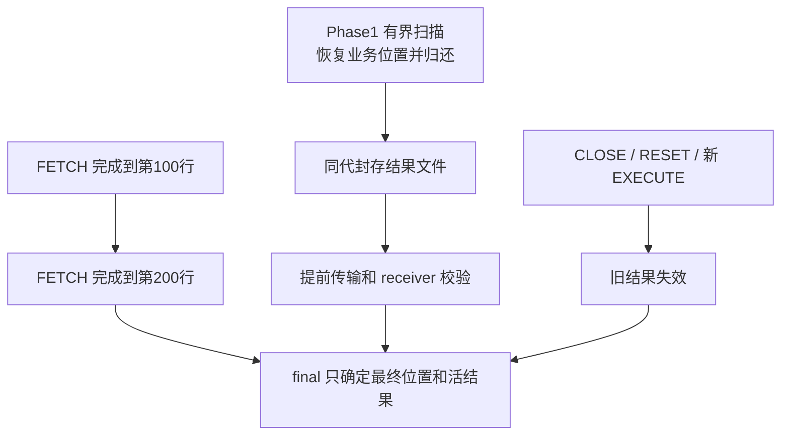

# 当前增量捕获、传输与 receiver 复用

2026-10-04。本文只描述 TEMP DATA/undo 和保留 cursor 结果；PS 定义/参数 BASE/DELTA 已删除。完整边界见[详细设计](detailed-design.md)。

## 1. 分清不变内容与变化状态

| 资源 | 不变内容 / 可复用部分 | 变化和最终校验 |
| --- | --- | --- |
| TEMP DATA | 同布局空间的不可变 BASE，已认证页版本和目标 writer | 脏页、扩展/回收、DD/布局变化、最终逻辑摘要和身份 |
| 临时 undo | 同事务 owner、兼容历史前缀、已分配原生资源 | 旧页修改、链/anchor 变化、截断、页复用；不能只发追加字节 |
| 同代 cursor 结果 | 已封存列元数据、有序行文件和摘要 | FETCH 位置、开放结果选择；RESET/CLOSE/重执行淘汰旧代次 |
| PS SQL/参数 | 不属于本工程迁移 | 由外部 PS 回放承担，不建立本地增量检查或重建缓存 |

减少线上字节不代表避免全量校验；既有完整镜像/undo 图、摘要和源→目标引用转换仍是正确性条件。指标须分别计扫描、复制、编码、传输、目标写入及转换。

## 2. 一条流水线和原有 worker

TEMP 的连续捕获由现有 [temp_prebuild](../../../sql/preserve_trx_temp_prebuild.cc) 和 [InnoDB capture](../../../storage/innobase/trx/trx0temp_preserve_capture.cc) 推进；undo 按真实事务 owner 路由，跨空间只维护一份相应 undo 图。

DRAIN 前结果仅保存轻量身份和空引用。Phase1 新结果通过 `preserve_trx_cursor_stream.*` 在原生成功插入后把完整行发布到有界环，既有 worker 同时封装并发送；业务回调没有迁移文件／网络 I/O。receiver 以普通 write/pwrite 接收 OPEN 前缀，不 fsync；保留文件开关、范围记录及重传内容比较。完整结果经最终 DECLARE、SEAL 和值校验后才可标记准备完成。环满或单行过大放弃可选流，保持原生查询正确性；后续捕获若到 final 仍失败，本次 Preserve 也失败。

存量结果和上述回退通过 `preserve_trx_cursor_capture.*` 借用安全命令边界、分段扫描原生物化表，每段恢复 handler 书签、诊断区和 TLS 后归还；封存不占住业务 session。两条路径复用值格式、索引、预算、原 worker 和 final 选择；已传前缀不代表 READY，跨命令也不保留裸 TABLE/PS 引用。细则见详细设计 §6。

结果预传由 [result_pretransfer](../../../sql/preserve_trx_result_pretransfer.cc) 接入原 TEMP worker。无开放 cursor 时跳过 PS map；有 cursor 时仍可能遍历 map 获取稳定 snapshot，不能把整个流程说成 O(1)。已知 PS 的 pointer/is_open 判断本身很小，不等于扫描任意多 PS 没有成本。

## 3. BASE、DELTA 与最终集合

TEMP 延续不可变 BASE＋累积 DELTA 和 selected dependency。版本索引可跳过确定未变的 BASE 页读取；最终仍认证完整逻辑内容，不把临时 no-redo page LSN 当作唯一变更版本。旧补丁不能覆盖新页。

捕获切轮固定当前版本，同时覆盖后续业务修改；发送端持有稳定文件和 owner。结构、undo 历史或来源失配时按已有条件 fresh/rebuild 或失败，不以频繁全量回退冒充增量验收。

最终文件的 delta 比较仍须读取逻辑内容。E111 的采样发现协调线程逐 4 KiB 读取 BASE 是一个串行热点，因此在原 builder 已计费的固定缓冲中合并相邻文件读取，仍逐 4 KiB 比较和编码。读取量服从原 step 软额度，不跨 step 留缓存，不改变摘要、协议或 image 路径的脏页判定；减少系统调用不代表免除了完整扫描。效果以本轮复测为准。

源格式先与工件合同一致，再产生目标身份转换结果；重定位后页不能被源格式增量直接覆盖。兼容代次复用目标 ID、原生 undo 和私有 DATA writer。跨代复用是否发生、重写字节和失败原因均需观测。

已声明 transport 对象累计留存与 final 最终选择分开：旧结果文件可仍负有封存/清理责任，但不得因此进入最终开放 cursor 集合。最终 [result_manifest](../../../sql/preserve_trx_result_manifest.h) 只含源 ID、generation、大小/摘要、消费位置；TEMP 继续按所选依赖准备。

不得每次 FETCH 重编码后缀，也不得用重新查询重建内容。丢弃已发送前缀的磁盘/网络优化不是当前默认承诺；绝对行位置、文件身份和原始 EOF 语义不能改变。

## 4. final、READY、接管各自完成什么

源端按完整命令边界固定 DATA/undo/DD/结果。原 stop purge、T0、closing 顺序不变；stop purge 后、T0 前在原截止期内对已有目标执行最后有限结果采样。final 在 freeze/detach 前复用同一核心补齐未封存的活结果；没有新的 PS 参数增量阶段。

最终 TEMP 文件由现有 final target worker 在独占 candidate 时完成增量比较和传输，再经队列交给 coordinator。复用同一个 TEMP stream；coordinator 按既有 presealed 状态跳过已完成对象，不重复比较文件。文件扫描不持传输序号锁，各帧仍按原 session 锁维护线序。任一 worker 失败即沿原 abort／join／源事务恢复路径退出；binlog HWM、FINAL 发布和升主接点不前移。并发暂存按原预算分别计费，不新增线程池或跨线程文件生命周期。

receiver 在 READY 前完成原生 TEMP 资源、SQL 元数据、结果文件/value preflight、decoder、sender 及位置。仅 seal 成功或传输 ACK 不代表准备完成。已有候选必须与 final 身份/摘要吻合才能接管。

资源 owner 沿 receiver prepared → RESUME journal → THD 待关联集合 → 回放后的真实 PS 转移。SQL RESUME 不构造 PS；attach 不再扫描全结果文件。业务放行仍须等外部回放/关联及 CLOSE 处理完成。

## 5. 有界性和并发正确性

- 捕获、编码、队列、候选、被替换/退休资源、映射及文件并存计入原预算；不增加线程池。
- owner pin、generation 和原任务身份覆盖最后使用者。取消只撤销发布资格，不能立即释放尚在 worker 中使用的资源。
- 第 N 轮 ACK 不清除 N+1 的脏状态，也不许可删除唯一重传文件。普通 ACK 不是新增跨轮磁盘回收证明。
- 源结果关闭后，迟到 worker 不得重新入队发布旧结果；沿现有 terminal/token/registry 同步。
- 传输追不上业务时记录缺口并沿原期限收口/失败，不能扩大预算或终止执行中 SQL 来取得成绩。
- 新增垃圾文件可重启后异步清理；运行期活资源/归属和实际磁盘占用不得因此忽略，不加 RESET DRAIN 逻辑。

## 6. 验证与性能边界

M3/M4 覆盖规模和更新稀疏度；M5/M6 覆盖公平性/对象数；M7/M8 覆盖 DATA/undo；M9/M10 覆盖结果消费/换代；M11/M12 覆盖受限资源和 receiver 共存。最新 62 配置及原模型分别见 [E64 资源报告](../../../build-release/all-pressure-20261004/RESULTS.md)、[完整压力报告](../../../build-release/original-pressure-ps-removed-20261004/RESULTS.md)。

62 配置通过原场景断言并不等于 strict 全部≤2秒；M11 两档限速仍超限。READY 轮询观测与 receiver 同钟指标分开，内部重试/回退不因最终通过而归零。外部物理升主/回放/关联与重复轮次统计继续独立验收。
