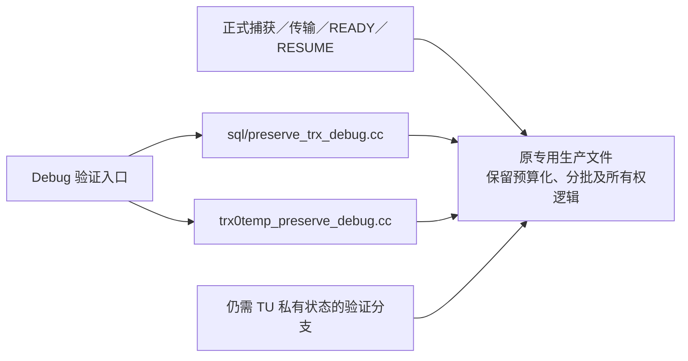

# 内核死代码与验证代码收敛记录

> **2026-10-04 版本说明：历史版本记录。** 文内“当前/尚未完成/通过”和源码路径均属于记录时点；旧 PS 定义/参数/重建方案不再适用，原失败与测量不改写为新版本成绩。 现行职责见[详细设计](detailed-design.md)和[PS 删除与 cursor 关联](ps-transfer-removal-and-cursor-attach.md)，最新状态见[任务跟踪 E63/E64](task-tracker.md)。下文保留历史事实，不作为现行实施清单。

本轮按用户批准的审核结果处理未提交代码，工作目录为
`/Users/a1234/project/mysql-server-8022-preserve-port`，分支为 `ha_preserve_trx`。
比较基线是本轮开始前的完整工作树快照，而非 HEAD；因此以下数量不会混入此前的特性实现。
本轮未提交、未推送。

## 实际处理结果

| 内容 | 本轮处理 | 数量口径 |
|---|---|---|
| 确认没有消费者的接口、参数、冗余赋值 | 删除定义、声明及调用侧冗余参数 | 实际净删 89 行；原 87 行模型少计两处签名／调用折行压缩 |
| 历史内部无消费者接口 | 删除 21 项及专属类型、无读者观察计数 | 接口及声明 311 行＋专属类型 16 行＋观察计数 4 行 |
| `no_redo_undo_page_count` 包装 | 删除；24 个原测试直接读取公开 vector 的 `.size()` | 净删 6 行，与下面 40 项互不重复 |
| 仍被测试使用的同步／观察辅助接口 | 定义、声明及附属状态协调隔离到 Debug | 40 项；旧范围 822 行＝主体 686＋声明 83＋注释 53；新增 68 对 guard |
| HEAD 已有的 encoded payload 测试 facade | 保留 Debug 消费链，正式流量继续走 decoded handler | 旧主体 26＋声明 5 行，新增 2 对 guard |
| 验证状态与胶水 | Debug 化观察字段、旧校验状态和两项测试指标 | 原 59 行范围调整为 112 行；48 行文本退出 Release 路径，净增 53 行 |
| receiver 退休对象观察计数 | 仅 Debug 更新，正式退休队列／计费／回收保留 | 5 条旧声明或写入；新增 5 对 guard，源码净增 10 行 |
| 可独立组织的 Debug 验证块 | 搬到 SQL、InnoDB 两个专用文件 | 15 块、1,987 行内容；原 guard 模型 2,016 行，实际原文件移出 2,015 行 |

**直接删除共 426 行＝89＋311＋16＋4＋6。** 门控和搬迁不是删除：原有测试消费者及其断言继续保留。
两份新 Debug 文件合计 2,104 行，包含原内容及必要的版权、include、guard 和小型 TU 局部工具。
没有复制生产算法、公开私有 `Impl` 或增加生产 adapter。

内核和构建文件共 55 个路径变化，逐行 diff 为 **新增 2,333／删除 2,465，净减 132 行**。
分类账闭合为：`-89 -337 +89（搬迁净量）+2（CMake）+136（40 项门控）+4（旧 facade 门控）+53（状态）+10（退休观察）=-132`。
测试和本记录的行数另列，不能混成内核净删量。

## 新的代码组织

- `sql/preserve_trx_debug.cc` 集中 PS restore、cursor、runtime、receiver 和 resource 验证块。
- `storage/innobase/trx/trx0temp_preserve_debug.cc` 集中 graph、capture、import、undo 和 source 验证块。
- 两个文件随原 source list 构建，内容受 `NDEBUG` 控制，不依赖 `WITH_UNIT_TESTS`。普通 Release 下没有外部函数定义。
- 原审计中另外 4,274 行 Debug 范围依赖 TU 私有类型、嵌入 worker 或资源寿命，继续留在原位置。机械搬迁需要暴露内部类型或添加转接层，故未实施。
- 搬出的内容在本轮前就不进入普通 Release；不能把这次文件组织调整报告成业务性能收益。

## 保留的正式语义

本轮没有改变完整命令边界、source 增量认证、传输序号／ACK、receiver 私有资源准备及 final 复用。
正式文件 framing、decoder reservation、arena 恢复、失败回滚、最后 reader 的退休计费、reaper 和 shutdown 保留。
删除确认无消费者的包装，并将仍有消费者的同步包装隔离到 Debug；
底层页转换、undo、dictionary、handoff 和清理算法保留。

固定在线升主接入保持原样：

1. `preserved_trx_prepare_before_trx_sys_init_for_physical_promotion()`。
2. `trx_lists_init_at_db_start()` 中已有 Preserve hook；在线升主也调用此方法。
3. `preserved_trx_adopt_ready_epoch_for_physical_promotion()`。
4. SQL RESUME 仍从 `Sql_cmd_resume_preserved_transaction::execute()` 进入。

`preserved_trx_resurrection_entry_to_engine_facts()` 保留。它在本地没有消费者，但属于跨层公开 facade；
外部物理复制工程不可访问，没有证据允许删除其集成契约。其他正式 native 实现也保留。
未增加线程池、升主阶段、RESET DRAIN 行为、通用 session 转移或客户端要求。

## 既有测试维护

旧 GUnit 的消费者与 Debug helper 使用相同的 `NDEBUG` 门控，避免 Release 编译看到无定义接口，或出现 `EXTRA_CODE_FOR_UNIT_TESTING` 造成的 ABI 差异。
52＋15 个既有测试／共享 sink 单元保留原主体和断言；本轮没有新增 UT、没有执行 GUnit。
三处既有 page-image fixture 补上当前结构已有的 `capture_sequence=0`；其初始化缺口在本轮前已经存在。

源码形状 MTR 改为约束真正的 decoded receiver handler、生产 ACK helper、身份校验、解码 lease 和 COMMIT segment barrier。
原约束意图及断言保留，不再把只供 Debug 的 facade 当成生产派发入口。

`transfer_receiver_bundle_retained` 的首次并行失败随后串行通过。两段完整生产 job 函数与 before 字节一致。
原用例读取整份追加 err，MTR 自动重跑会混入上一轮 load；此外原用例在 worker 完成前关闭 trace。
现用例记录本轮日志起点，并在观察到 worker 空闲后关闭 trace；断言和 receiver 语义保持，两次并行重复通过。

log-bin 广泛验证还发现两个可串行复现的 fixture 问题：`ps_only_strict_retry` 故意暂停 receiver，
`temp_close_partial` 故意保留 CLOSE 包体。前者尚未结束 PS preparation，后者尚未完成命令边界，
因此 Phase1 不能提前收敛。原默认 Phase1 上限为 600,000 ms，但 Python 分别在 60 秒 socket 接收、
20 秒 CLOSE 观察后退出；日志证明都尚未进入所需后续阶段。相关生产等待逻辑与 before 一致。
PS 的具体 PENDING 状态是由源码及 fixture 条件支持的判断，日志没有该查询回复载荷。
现仅在这两个专属 `.cnf` 将 Phase1 观察上限设为 1,000 ms，触发原有 final fallback；
不增加 Python 期限、不放宽业务性能门槛、不改 common fixture 或内核默认值。
两项修改前均有串行 RED，修改后各两次串行 GREEN，原恢复／重试／CLOSE 数据断言保留。

binlog prefix 截断用例在串行复现中也失败。旧预期把“COMMIT 曾尝试发送”直接视为永久
`COMMIT_UNKNOWN`；实际协议 SEAL 已拒绝损坏对象，COMMIT admission 尚未成立，认证清理返回
`NOT_COMMITTED_CLEAN`，source 按既有逻辑恢复原事务。相关 ACK、QUERY／ABANDON、
COMMIT admission 和 DRAIN 裁决区间与 before 一致。现用例要求 CORRUPT SEAL 证据、
明确 `SOURCE_RESTORED`／clean stage、无 COMMIT_UNKNOWN、原未提交内容保持和后续 UPDATE 成功。
不确定提交的正式 fencing 逻辑没有修改。截断、文件替换、确定清理回源各两次并行复测通过。

额外 no-bin transfer 验证中，`transfer_receiver_partial_selection` 曾有一次 worker／queue
归零等待超时；三个 token 的分类等待和 DRAIN 均已成功，故不能误记成分类失败。
故障注入在关闭开关前已真实触发，不能归因于过早关闭 fault。两次自动重跑、两次独立串行复测通过。
最初失败日志未分别保存 active、queued 数值；随后补了失败状态输出，保持原 30 秒期限和断言。
2026-10-02 的专门复现已定位同形失败的生产竞态；随后按用户指令完成最小修复和定向复验，详见下节。

### partial-selection 队列残留：已修复并复验

用例是 `mysql-test/suite/preserve_trx/t/transfer_receiver_partial_selection.test`：
三个普通 InnoDB 事务分别更新三行，执行 loopback standby-transfer DRAIN；既有 DBUG
让一个 token 的最终准备失败，预期仍保留另外两个 READY token。该用例没有 PS／临时表。
失败发生在分类成功后的后台归零等待，不是 DRAIN 或分类计数失败。

在未增加内核诊断的原 Debug 二进制上，`--parallel=8 --repeat=32 --retry=0`
复现 **2/32 次**归零失败；两次均为 `active=0、queued_bytes=1220、total=3、ready=2、failed=1`。
随后只加临时 DBUG 日志、保持队列算法和等待期限，又跑 32 次，捕获 **2 次相同归零失败**。
另有 1 次分类结果预期不符，单独保留日志，不混作队列竞态证据。

其中 worker 2 的一次完整证据（server 日志为 UTC，2026-10-01 23:32:16）：

| 时刻 | 实际事件 |
|---|---|
| `.760328` | token 11 的锁计划已从待准备缓存取走，交给正式准备结果 |
| `.760550` | partial selection 发布，token 10 被排除 |
| `.760569` | token 11 的 snapshot 对象 worker 尝试提交 staged 任务 |
| `.760618` | epoch 队列已 purge，`queued=0`，同时清除了去重用的 inflight／done 项 |
| `.760656` | token 11 的 resurrection_index 对象 worker 也尝试提交 staged 任务 |
| `.760709` | token 11 再次真正入队，`bytes=1220、result_known=1、plan=0` |
| 约 30 秒后 | MTR 输出 `worker_active=0、queued_bytes=1220` 并失败 |

日志没有给两个对象 worker 标识不同的线程 ID，不能进一步断言是 snapshot 或
resurrection_index 中哪一个赢得了实际入队；但已证明入队来自对象 worker，且发生在 purge 后。
worker 6 的第二次失败也捕获了已分类 token 12 的相同重复入队。

修复前的源码原因是 **partial selection 清理队列与最终任务入队之间缺少共同的终态检查**：

1. `publish_receiver_epoch_selection_if_possible()` 发布选择后，
   `purge_receiver_epoch_prewarm_queues()` 删除队列和 inflight／done 去重项。
2. partial 路径未设置整 epoch 的 `bound`，`finalize_receiver_ready_token_staging()`
   不把这些记录改成 SAVED_ONLINE；记录仍为 RECEIVING，sealed final manifest 仍存在。
3. 已运行对象 worker 的 `enqueue_staged_if_complete()` 可以迟到。
   `enqueue_receiver_prewarm_job()` 的过期检查和 `freeze_staged_manifest()` 都不能挡住本例；
   STAGED_TOKEN 分支仅看已被清除的 done／inflight，没有检查已经发布的选择或 token 结果。
4. 重复任务所需锁计划已被 `take_receiver_record_lock_prepared()` 消费；
   `receiver_staged_token_prewarm_job_runnable()` 因此始终不选它。
   队列确有一项任务残留，并非仅计数漏减，也不是 worker 一直运行。它可能保持到 epoch 过期清理。

最终修复仅在 `sql/preserve_trx_transfer.cc` 增加 12 行：在原 pool 锁内、
`ensure_receiver_prewarm_workers_locked()` 返回及既有 done／inflight 去重判断之后、
STAGED_TOKEN 真正入队之前，以已有 ready-epoch state 检查
`selection_published || token_results.count(token)`，将终态重复提交视为幂等完成。
只在锁外检查仍存在检查后清理的竞态；只看 token result 则漏掉 deadline selection
中未完成、没有 token result 的任务。没有重建锁计划、放宽超时或增加线程池。
普通 done／inflight 命中沿用原路径，不增加 ready mutex 获取；只有准备真正入队的新候选才检查。

两个只读 reviewer 分别审核了锁顺序与测试改动。新检查采用 pool → ready 锁顺序，
现有 ready 持锁区域没有反向取得 pool 锁的路径。入队先发生则后续 purge 会清掉任务；
purge 先发生则持锁检查阻止重新插入同一终态 key，也避免旧 worker 把这个重建的 key 当作自己。
WAIT／RETRY／CONTINUE 不产生 token result，已有任务的续批路径保持；PS／临时表换代在
final staged manifest 冻结之前进行，OBJECT 路径未受门控。

同时修正了独立的用例故障窗口：诊断轮 worker 7 的 general log 显示 `.389565` 发起关闭 fault，
三次 take_plan 在 `.389704/.389991/.390265`，`.390444` 已发布三个 token 全 READY。
fault 检查在 take_plan 之后，DRAIN 的 ACK 不保证它已经执行。现只把关闭 fault 的一行移到
三个 token 分类完成之后，保留原 2 READY／1 failed、epoch 保留、worker／queue 归零断言和
30 秒等待期限。该测试问题与原内核队列残留分别有 RED 证据。

相关生产路径与本轮死代码收敛前保存的源码一致。收敛对此文件仅门控四个验证包装并删除一个
无调用成员，未修改上述入队、purge、分类或 runnable 路径；这里不追溯首次引入该竞态的提交。
临时诊断先全部撤下并逐字节核对回到调查前源码，再应用上述 12 行生产修复和用例时序调整。
Debug／Release mysqld 均构建通过；没有新 DEBUG_SYNC、UT、诊断接口或提交。

完整证据：`/private/tmp/preserve-partial-selection-root-cause-20261002/`，其中
`mtr-repeat.log` 是原二进制复现，`mtr-trace.log` 是诊断复现，
`mtr-trace/2/log/mysqld.1.err:704–721` 保留上述顺序，`diagnostic-only.patch`
保留已撤下的四处日志探针，`baseline.sha256` 和 `restored-source.sha256` 用于源码核对。

修复验收证据：`/private/tmp/preserve-partial-selection-fix-20261002/`。
四批 MTR 顺序运行，均 `--parallel=8 --retry=0`，无失败或跳过：

| 验证 | 业务执行次数 | 结果 |
|---|---:|---|
| 仅修内核，保持原用例 | 32 | 32 通过 |
| 最终内核＋故障窗口修订后的用例 | 32 | 32 通过 |
| no-bin 相邻 7 项，每项两次 | 14 | deadline、全局失败、恰好一次 retry、停池重启、bundle 保留、TEMP 分批准备及取消均通过 |
| log-bin 相邻 10 项，每项两次 | 20 | PS 待处理复用／替换、churn、receiver 等待、批 ACK 重试、TEMP／cursor／undo 的恢复和后续使用、binlog 在途及提前准备均通过 |

合计 18 个不同业务用例、98 次执行通过，另有 4 次 shutdown_report 通过。
这是本次修复的定向回归，不替代全量 Preserve/Resume、性能或外部物理备机验收。
`kernel.patch`／`test.patch` 保存相对本次修复开始状态的精确改动，构建及各 MTR 日志完整保留。

## 验证证据

本轮共 **577 个不同用例有通过结果：565 个行为用例＋12 个源码约束**，
`shutdown_report` 另列。no-bin／log-bin 的条件跳过互相补齐；这里是本需求的广泛定向回归，
不称为整个 `preserve_trx` suite 的全量回归。MTR 包括现有 Python E2E，验证真实 PREPARE／
EXECUTE、结果位置和 FETCH／EOF、TEMP／undo、传输、receiver 准备、SQL RESUME、CLOSE 和 OFF。

| 运行 | 行为／源码用例数（不含 shutdown） | 实际结果与修复复验 |
|---|---:|---|
| 首轮 Debug no-bin：cursor／PS／TEMP | 220 | 219 首轮通过；retained 日志用例失败，修订后两次通过 |
| Debug log-bin：cursor／PS／TEMP，含所选 big-test | 335 | 333 首轮通过；两个 Phase1 fixture 串行 RED 后各两次 GREEN；随后在 8 worker transfer 集合中再次通过 |
| Debug no-bin：transfer／promotion／OFF，含所选 big-test | 77 | 76 首轮通过；partial-selection 首次归零等待失败，两次自动重跑及两次独立串行通过 |
| Debug log-bin：transfer／promotion／OFF＋两项修正 fixture | 90 | 89 首轮通过；binlog 截断旧断言失败，修订后与两个相邻用例各两次并行通过 |
| **最终 Debug no-bin：上述全部定向集合，含所选 big-test** | **296** | **296／296 通过，无失败；280 项因需 log-bin 跳过**；partial-selection 的失败诊断分支保留 |
| **Release 原生行为与 OFF** | **8** | **8／8 通过，无跳过**；正式结果存储／FETCH、原生 PS／TEMP、日志脱敏、指标注册和 OFF |

上述运行有重叠，不累加各行作为不同用例总数。初始失败、串行 RED、重复 GREEN 和偶发问题
全部保留日志，不用“当前有通过结果”抹去初次失败。partial-selection 的后续独立复现、修复及定向验收见上节。
本轮没有重跑 sysbench／容量压测，不能据此报告延迟、吞吐或内存性能收益。

已确认：

- Debug、Release `mysqld` 完整构建通过。
- 两版既有 `preserve_trx-t`、`preserve_trx_temp_table-t` 编译链接通过；未运行 UT。
- 新构建目标文件符号核验：上述 Debug 包装／观察接口未进入 Release；正式预算化 capture 和按 table ID 查 dictionary 的重载仍保留。
- 三个独立只读审查核对新增门控、RAII、固定接入和搬迁完整性，未发现本轮引入的阻断问题。
- 15 块搬迁逐行匹配，仅两处局部 `Status` 别名和一处常量限定名调整。`DBUG_ASSERT` 42、`DBUG_EXECUTE_IF` 71、`DBUG_PRINT` 30，以及 69 个标签的 101 次使用全部保留。

原始 before 快照、分类清单、构建日志、MTR 日志、目标文件符号和逐路径 diff 位于
`/private/tmp/preserve-kernel-convergence-20261002/`；前一轮只读审计位于
`/private/tmp/preserve-kernel-audit-20261001/`。
分类闭合见 `final-convergence-volume.json`，用例去重与初始失败见 `runtime-verification.json`，
符号核验见 `helper-symbol-verification.json`。只清理本轮已结束的 MTR 数据，保留快照、日志及分类证据。
本地验证不替代外部物理复制／proxy 验收，也不关闭任务跟踪中的 V03 性能指标。
