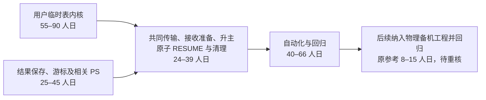
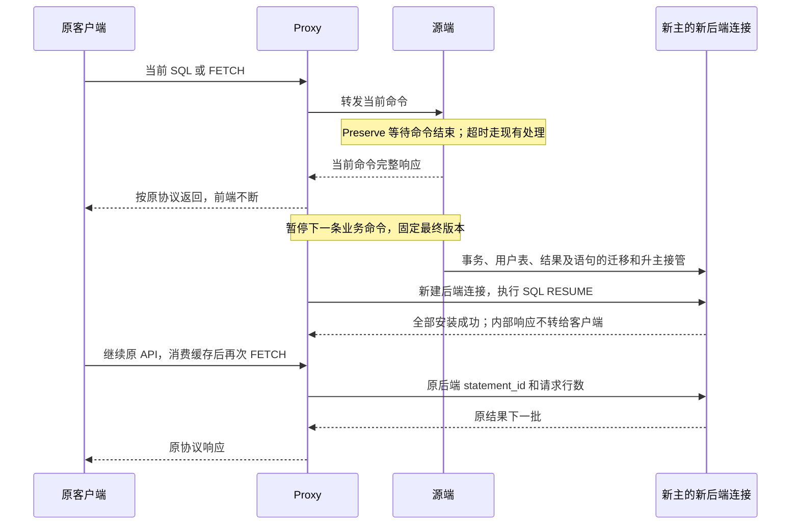
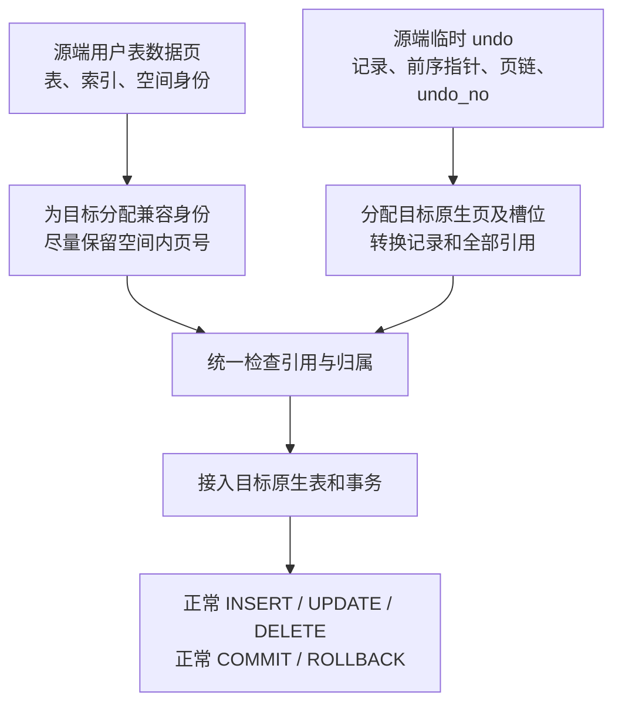
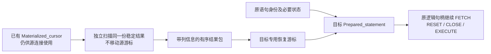
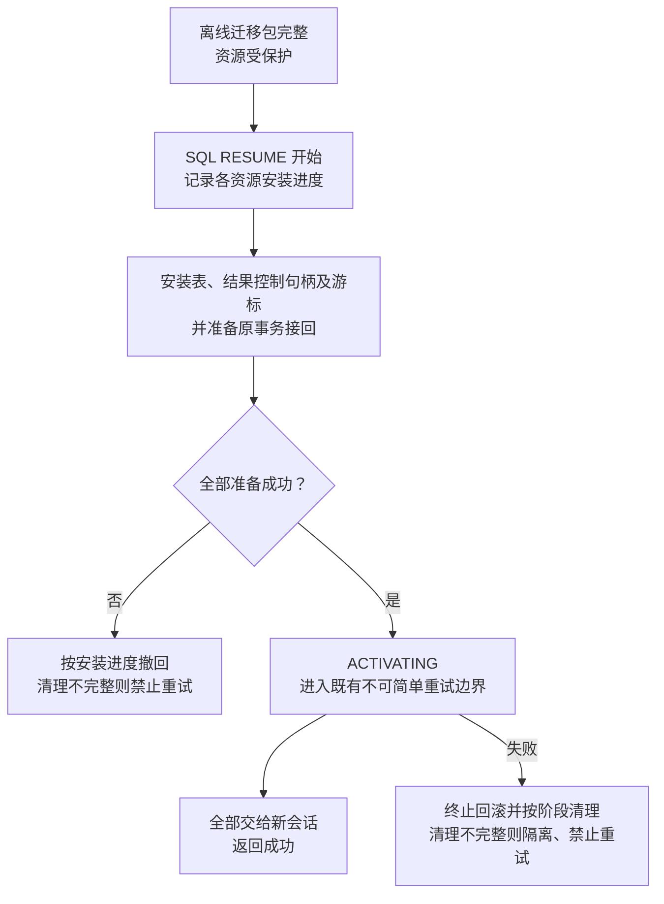
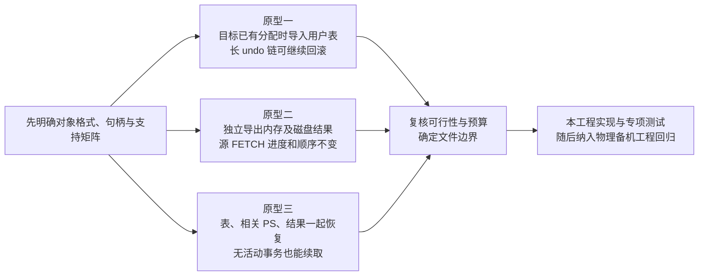

# 临时表与待 FETCH 结果：时间与验证工作量评估

> **2026-10-04 版本说明：历史静态估算。** 旧 PS 完整迁移范围及人日/代码量不再是当前预算，不能与本次净减少 9437 行机械相减。 现行职责见[详细设计](detailed-design.md)和[PS 删除与 cursor 关联](ps-transfer-removal-and-cursor-attach.md)，最新状态见[任务跟踪 E63/E64](task-tracker.md)。下文保留历史事实，不作为现行实施清单。

> 商用范围（2026-09-18 用户确认）：本特性只面向 **standby transfer → 物理备机升主 → 新主 SQL RESUME**。local startup 模式不在新增设计、实现、功能验收和预算内；文中现有本地实现仅作为代码复用依据。
>
> 工程背景（用户确认）：物理备机对接已完成；当前工程只补齐临时表、待 FETCH 结果及相关资源能力，后续再纳入包含物理备机能力的 MySQL 工程，做新增场景的集成回归。

2026-09-17 · 核查基线 `e99f927bfbd` · 独立工作区 `mysql-server-8022-temp-table-preserve`。

本次按用户确认修订：客户端到 proxy 的连接不断，仅新建 proxy 到新主的后端连接；客户端零修改。临时表及结果恢复集中在独立源码文件组。

本文件保留时间与验证的风险预算；代码量现以 [按新增/既有文件拆分的复估](/Users/a1234/project/mysql-server-8022-preserve-port/design/workshops/temp-table-preserve/code-volume-assessment.md) 为准，旧的大工作包行数估计已撤下。当前约 6,500～11,000 行有效生产增改的规划区间不用于同比缩短人日，工期仍待关键原型验证。

本文依据当前源码做预算评估，**没有开始功能实现，也没有运行编译、GUnit、MTR 或物理升主验证**。生产源码与 workshop 初始基线 `d086954338c3` 一致。人日按熟悉 MySQL 8.0.22 和本库 Preserve/Resume 的工程师估算；现有文件长度、纯搬迁和新增有效代码都不能直接换算工期。

**范围澄清：** 以 [需求背景与支持范围](/Users/a1234/project/mysql-server-8022-preserve-port/design/workshops/temp-table-preserve/requirements-and-scope.md) 为准，以下“原生服务端游标／PS/FETCH”限定为经典协议。X Protocol 及当前打开的 HANDLER 保持既有排除，不属于这些开发包；用户表承载结果后的分页 SELECT 仍按用户表支持矩阵验收。普通 SELECT／CALL 多结果沿用原响应，不新增客户端分批接口。本轮统一范围表述，没有依据此澄清另加或重复扣减人日。

2026-09-18 补充：[增量捕获与流水线传输设计](/Users/a1234/project/mysql-server-8022-preserve-port/design/workshops/temp-table-preserve/incremental-capture-and-transfer.md) 将持续多轮捕获与传输效率作为需要落实的设计要求。下列原基础方案人日及引用代码量尚未重新核算其新增职责，不能视为全部增量能力已经覆盖；待切轮、undo 差量和目标应用原型后再修订，不机械按行数换算工期。

**1．原基础方案判断：开发约 104–174 人日，完成基础范围的验证约再需 48–81 人日。**

这里的原基础估算混合记录了用户临时表、待 FETCH 结果及相关资源的内核增量和后续集成验证。当前工程先完成资源能力；物理备机对接已在另一 MySQL 工程完成，随后将这些增量纳入并回归 transfer → 物理升主 → SQL RESUME 的新增场景。用户表以当前已支持的 InnoDB 表结构和操作范围为预算起点，采用能处理在线目标身份冲突的方案；结果按有序结果包恢复。

| 交付范围 | 开发及局部调试 | 自动化、回归及物理联调 | 合计 |
| --- | ---: | ---: | ---: |
| 基础：用户临时表＋原生 PS/FETCH 结果 | 104–174 人日 | 48–81 人日 | **152–255 人日** |

这些区间是**可解释的工程估算，不是排期承诺**。编码包已包含设计细化、下述原型、局部调试与预计修复；验证包只计算测试建设、执行和问题定位，不再重复计算修复代码。若原型推翻方案或支持矩阵扩大，应重估相应增量；已有物理备机对接不重复列入开发预算。

用户已确认物理备机对接完成。后续物理联调只包含把本工程增量纳入该 MySQL 工程及新增场景回归，单独于当前内核实现记录，不是补建 HA 系统。接收端崩溃重启后继续恢复，也未计入当前范围。用户已确认 proxy 保持前端连接，原客户端语句对象、绑定和预取缓存继续有效。本次撤回先前列出的客户端适配及新增客户端 FETCH 入口选项；客户端开发量为零，相关协议兼容验证仍属于服务端/端到端验证。proxy 在新后端先执行 SQL RESUME，再沿用原编号映射转发业务命令，其具体实现需联调核查。

图表示依赖关系，不要求测试全部等到编码结束才开始。基础总量约为 7–12 个工程师月（按 22 工作日粗算）；安排 2 名内核工程师和 1 名测试工程师稳定投入，在原型顺利、外部接口就绪时，可先按约 4–6 个月规划。复杂度落在上沿或关键依赖延迟时，可能达到 6–8 个月以上。不能直接把总人日除以 3 当作交付周期。

**2．命令边界让问题可控，但不会自动保存命令之间的会话资源。**

无需保存执行到一半的 SQL、执行器迭代器或存储过程调用栈，也不增加逐行客户端确认协议。位置是服务端已正常完成的 FETCH 批次；客户端已经预取但尚未交给应用的行，仍由客户端持有。FETCH 出错时不能把可能不一致的扫描位置当作正常边界保存。

这仍然要求处理：用户临时表的原生回滚链、内部结果表的存储和顺序、语句编号、无活动事务的资源会话，以及部分恢复后的撤销。普通 SELECT 的 `mysql_fetch_row()` 当前只是读响应或缓存；它没有独立的服务端分批请求。本次不增加客户端接口；当前响应按命令边界等待完成，已发送数据由持续存在的前端链路保持，待后续 FETCH 的服务端结果由本功能恢复。

**3．哪些已有能力可以继续使用。**

| 已有代码 | 可复用部分 | 本需求仍需补齐 |
| --- | --- | --- |
| 用户临时表 Preserve | image/undo sidecar、DD 信息、表绑定、原生 undo 接回、本地清理骨架 | 在线目标的身份冲突、转换和所有权；不能依赖重启时抢先预留 |
| bundle/carrier/transfer | 分块、摘要、文件封存、对象描述及 epoch 所有权 | 纳入完整临时表与结果对象；验证最终版本、引用和缺件 |
| receiver/promotion | 接收准备、READY、接管和已有持久事务恢复 | 临时资源准备、TEMP_ONLY、没有活动事务的资源会话 |
| SQL RESUME | ATTACHING → ACTIVATING → ACTIVE，已有失败收敛 | 多种资源原子安装、完整撤销及生命周期转交 |
| 服务端游标与 PS | FETCH 命令分派、列发送逻辑、RESET/CLOSE 基本行为 | 可导出的结果格式、新恢复游标、跨会话语句身份及状态 |

源码中已经存在 `TEMP_TABLE_SIDECAR` 枚举，但 portable builder 仍拒绝带 temp manifest 的输入；这不等于已经支持传临时表。[拒绝入口](/Users/a1234/project/mysql-server-8022-preserve-port/sql/preserve_trx_transfer.cc:11016)

carrier 已有流式文件写入、封存和放弃接口，结果块可以复用它，不必重新建设文件传输系统。[external blob writer](/Users/a1234/project/mysql-server-8022-preserve-port/sql/preserve_trx_carrier.h:364)

**4．用户临时表：55–90 人日。**

这部分最大的不确定性是：怎样把源端表和 undo 安全放进已经运行过、可能占用了同类资源的目标实例，同时保留原生 COMMIT/ROLLBACK。

| 工作包 | 具体源码工作 | 开发人日 |
| --- | --- | ---: |
| U1：导入合同及原型 | 列出源/目标身份和全部引用；验证 undo 重编码；明确 MIXED/TEMP_ONLY 的事务身份与 undo_no | 6–10 |
| U2：data space 转换 | 分配目标身份；转换空间头、字典与索引身份、页内 index ID、FSEG 引用及相关校验；检查当前支持类型涉及的外置值引用 | 14–22 |
| U3：no-redo undo 转换 | 目标页/FSEG/rseg 分配；重建记录和引用图；校验后接入原生 undo；部分失败撤回、提交回滚回收 | 24–40 |
| U4：表安装与资源归属 | 接回 DD/TABLE/THD，目标身份下再次捕获；离线文件转为活跃表存储；重试、DROP、断连和到期释放 | 11–18 |

U4 负责“表资源自身怎样安装和撤销”，后面的共享 S4 负责“事务、表、结果是否一起成功”。两者按这个边界计算，避免重复估算。

为何不能只复制文件、修改 manifest：

- 当前临时空间预留会拒绝已越过分配游标的源 ID；undo 的原位置也必须真实可用。依赖“目标恰好没有冲突”只能构成受限方案。[srv0tmp.cc:102](/Users/a1234/project/mysql-server-8022-preserve-port/storage/innobase/srv/srv0tmp.cc:102)、[FSEG 页认领](/Users/a1234/project/mysql-server-8022-preserve-port/storage/innobase/fsp/fsp0fsp.cc:2584)
- undo 内的 table ID、历史 roll_ptr 使用变长编码。换成目标值后，记录长度可能变化，继而改变偏移甚至分页；需要转换完整引用图，不能只覆盖几个整数。[table ID 解码](/Users/a1234/project/mysql-server-8022-preserve-port/storage/innobase/trx/trx0rec.cc:581)、[历史 roll_ptr 编码](/Users/a1234/project/mysql-server-8022-preserve-port/storage/innobase/trx/trx0rec.cc:1292)
- 8.0.22 的临时 roll_ptr 最终定位当前 system-temp 空间，高位不是 live rseg 槽号。可以优先验证“在目标 system-temp 内另分配页、导入时一次性转换”；不预设需要在每次原生回滚时增加映射查询。[指针构造](/Users/a1234/project/mysql-server-8022-preserve-port/storage/innobase/include/trx0undo.ic:44)、[空间解析](/Users/a1234/project/mysql-server-8022-preserve-port/storage/innobase/include/trx0rseg.ic:137)

已有 `materialize` 以及 native undo 接入骨架可复用，但现有成功路径不能直接证明一般在线重定位正确。[SQL 安装](/Users/a1234/project/mysql-server-8022-preserve-port/sql/preserve_trx_temp_table.cc:3559)、[undo 安装](/Users/a1234/project/mysql-server-8022-preserve-port/storage/innobase/trx/trx0temp_preserve.cc:5550)

主体放入新增用户表 SQL 适配、InnoDB import/undo 文件；既有 `preserve_trx_temp_table.*`、`trx0temp_preserve.*`、`srv0tmp.*`、`trx0undo.*` 只补必要接口。`fsp0fsp.*`、`fil0fil.*` 优先使用已有 API，原型证明不足再改；不预设修改逐行回滚路径。

仅采用“保留源身份，冲突就拒绝”的表内核方案，约可收窄到 20–35 人日；**这只替换 U 包的预算，不是整项功能预算，也不能满足一般在线目标的要求**。本评估没有用这个受限数字作为主报价。

**5．结果、内部临时表和语句：25–45 人日。**

| 工作包 | 具体源码工作 | 开发人日 |
| --- | --- | ---: |
| R1：有序结果导出与格式 | 不影响源游标的独立扫描；TempTable/MEMORY/InnoDB 适配；列描述、类型和值编码；有界分块读写与校验；结果代次及生命周期保护 | 12–22 |
| R2：恢复游标 | 从结果包读取；下一行、FETCH 0、EOF 未探测状态；正常及错误关闭；结果存储所有权 | 5–9 |
| R3：关联 PS 恢复 | SQL、默认库和必要参数状态；恢复原后端语句编号并保持 proxy 映射；结果控制句柄与再次执行时的 prepare 分开；RESET/CLOSE/EXECUTE 与旧结果失效 | 8–14 |

这里的 PS 指持有待 FETCH 结果的相关 prepared statement。预算包含它恢复后的正常后续操作，未默认扩大为保存整个会话所有无关 PS，或恢复多结果存储过程的执行上下文。**旧结果恢复不能依赖重新 prepare 成功，更不能重新 execute 来生成旧结果**；结果列信息必须来自原结果。需要实现可独立 FETCH/RESET/CLOSE 的控制状态，必要时到再次 EXECUTE 才解析、校验原 SQL，并保持正常错误及旧结果失效语义。

这不是现有代码中的直接 copy/clone：`TempTable::Handler::clone()` 未实现；CTE 的 `clone_tmp_table()` 要求表尚未实例化，不能直接用来复制正在持有结果的游标。TempTable 打开表还使用当前 THD 的表集合，后台线程导出需要明确访问和生命周期合同。[handler clone](/Users/a1234/project/mysql-server-8022-preserve-port/storage/temptable/src/handler.cc:945)、[THD 查表](/Users/a1234/project/mysql-server-8022-preserve-port/storage/temptable/src/handler.cc:184)、[CTE 前置条件](/Users/a1234/project/mysql-server-8022-preserve-port/sql/sql_derived.cc:169)

建议先验证新增 `Server_side_cursor` 子类直接读取结果包，复用现有 FETCH 分派，避免目标再次填充整张内部表。若必须恢复成 `Materialized_cursor`，预计另需约 3–6 人日，并增加导入 I/O；这是替代方案的差额。[游标接口](/Users/a1234/project/mysql-server-8022-preserve-port/sql/sql_cursor.h:50)、[FETCH 分派](/Users/a1234/project/mysql-server-8022-preserve-port/sql/sql_prepare.cc:1963)

原生 PS 的 `id` 是 const，创建时由 THD 自增编号；语句 map 也不是可直接导入任意编号的恢复接口。已确定恢复源后端原编号、保持 proxy 现有映射，仍需处理目标 THD 内的编号冲突、计数器及插入失败。仅挂一个 FETCH 壳会便宜一些，但不能等同于相关 PS 已经完整恢复。[id 定义](/Users/a1234/project/mysql-server-8022-preserve-port/sql/sql_prepare.h:338)、[构造器](/Users/a1234/project/mysql-server-8022-preserve-port/sql/sql_prepare.cc:2283)、[map 插入](/Users/a1234/project/mysql-server-8022-preserve-port/sql/sql_class.cc:1713)

特别要验证：游标生成后原查询表已关闭，原用户表可能被 DROP、永久表结构也可能改变，但旧物化结果仍应可读。不能让原 SQL 的表依赖阻止旧结果恢复；需要使用已恢复用户表进行后续 prepare 时，再按正确顺序安装和访问。FETCH 恰好取完最后一行可能尚未关闭游标；下一次请求正数行的 FETCH 才探测并报告结束，FETCH 0 不探测 EOF。重执行一旦关闭旧游标，即使新执行失败，旧结果也不能再被捕获。[原表关闭](/Users/a1234/project/mysql-server-8022-preserve-port/sql/sql_cursor.cc:269)、[列描述](/Users/a1234/project/mysql-server-8022-preserve-port/sql/sql_cursor.cc:306)、[FETCH](/Users/a1234/project/mysql-server-8022-preserve-port/sql/sql_cursor.cc:405)、[重执行](/Users/a1234/project/mysql-server-8022-preserve-port/sql/sql_prepare.cc:3384)

下界允许源 THD 在安全边界暂停会话，完成独立扫描再封存，不承诺后台导出时该会话还能并发 FETCH/RESET/CLOSE。若要求后者，需处理跨线程 THD 身份、对象固定和关闭竞态，初估另加开发 5–10 人日、验证 3–5 人日。源游标不被导出推进，是两种模式共同的要求。

预计主要涉及 `sql_cursor.*`、`sql_prepare.*`、`sql_class.*`、`sql_tmp_table.cc` 和需要的结果引擎只读打开能力。结果格式及恢复游标放在专用实现中；不在每行普通 SELECT 路径加入大型迁移逻辑。

**6．共同的端到端接入：24–39 人日。**

| 工作包 | 具体源码工作 | 开发人日 |
| --- | --- | ---: |
| S1：入批次和命令冻结 | 将持有表/结果但无活动事务的会话纳入；统一最终版本、计数和完成状态；不把它误判成无需迁移 | 4–6 |
| S2：完整对象传输 | 扩展 manifest、sidecar/结果块枚举、路径重绑定、最终代次一致性、摘要与缺件检查、所有权清理 | 6–10 |
| S3：READY 与升主接管 | 准备并保护离线资源、容量及必要身份；支持 MIXED/TEMP_ONLY/无事务资源会话；移交和释放资源保护句柄 | 7–12 |
| S4：原子 RESUME 与异常 | 统一安装进度、错误返回和清理结果；源 RESET/断连；重复请求、到期、ACK 不确定及 ACTIVATING 前后的不同处理 | 7–11 |

现有 session-only 路径明确排除用户临时表，且主要消费授权 token 后返回，不能直接代替资源恢复。会话没有活动事务时，不能为通过已有检查而伪造一笔业务事务；TEMP_ONLY 则仍须恢复其真实的临时表事务状态。[分类](/Users/a1234/project/mysql-server-8022-preserve-port/sql/preserve_trx.cc:5303)、[命令边界](/Users/a1234/project/mysql-server-8022-preserve-port/sql/preserve_trx.cc:6217)、[session-only RESUME](/Users/a1234/project/mysql-server-8022-preserve-port/sql/preserve_trx.cc:24269)

strict transfer 现要求 persistent-only，升主接管要求每 token 有持久事务恢复依据；TEMP_ONLY 和无事务资源会话需要实质性分支。本地 TEMP_ONLY synthetic claim 有参考价值，但 strict 路径仍要求 `exact_trx`。[strict 输入](/Users/a1234/project/mysql-server-8022-preserve-port/sql/preserve_trx_transfer.cc:6931)、[升主入口](/Users/a1234/project/mysql-server-8022-preserve-port/sql/preserve_trx_promotion.cc:3690)、[本地 claim](/Users/a1234/project/mysql-server-8022-preserve-port/sql/preserve_trx.cc:14715)

当前 strict RESUME 拒绝 temp，现有安装调用也没有把临时表部分清理结果完整交回 strict 失败处理。必须先补安装进度与撤销合同，再放开准入。[入口限制](/Users/a1234/project/mysql-server-8022-preserve-port/sql/preserve_trx.cc:24018)、[安装调用](/Users/a1234/project/mysql-server-8022-preserve-port/sql/preserve_trx.cc:24136)、[ACTIVATING 前失败](/Users/a1234/project/mysql-server-8022-preserve-port/sql/preserve_trx.cc:24934)、[边界后失败](/Users/a1234/project/mysql-server-8022-preserve-port/sql/preserve_trx.cc:25007)

ACK 或资源归属未决时保留必要资源等待裁决；成功移交后，凭证清理不能删除新会话仍持有的表和结果存储。

共同资源的准备、传输对象接入与联合安装放入同一组新增 `preserve_trx_session_resources.*`；既有 `preserve_trx.cc`、bundle/transfer/promotion/prepared/resource 只做必要语义接入，carrier 复用实现并补资源族准入。结果包中的块编码计入 R1，传输引用与完整性计入 S2，不重复计算。

**7．客户端零修改：后端恢复沿用原 FETCH 协议。**

客户端到 proxy 的连接保持；只有 proxy 到新主的后端连接重新建立。proxy 先完成新后端认证和 SQL RESUME，再继续转发原客户端的命令，内部恢复响应由 proxy 消费。新主恢复原后端 statement_id、相关 PS、结果及游标位置，proxy 保持现有编号映射；客户端不用重新 prepare、绑定或添加恢复参数。

原生 FETCH 只传 statement_id 和请求行数，客户端先消费已有缓存；位置由服务端游标保持。[客户端 FETCH](/Users/a1234/project/mysql-server-8022-preserve-port/libmysql/libmysql.cc:2232)、[新 THD 查找语句](/Users/a1234/project/mysql-server-8022-preserve-port/sql/sql_prepare.cc:1601)

普通 SELECT 的 mysql_fetch_row() 读取原响应或缓存，不是新服务端批次请求。其执行中响应仍按命令边界等待完成，proxy 保留已收到的数据；不把普通响应读取改成新的客户端保留结果/FETCH 接口。[客户端读取](/Users/a1234/project/mysql-server-8022-preserve-port/sql-common/client.cc:7461)

此前列出的新增 SELECT 接口 14–25 人日及 C API 改造 10–17 人日不再属于当前范围；不应据此安排客户端开发。服务端原编号恢复、结果存储、EOF 与原子 RESUME 工作仍然存在，因此基础开发 104–174 人日暂不因前端连接保持而削减。proxy 合同与文件分组见 [专门说明](/Users/a1234/project/mysql-server-8022-preserve-port/design/workshops/temp-table-preserve/source-layout.md)；现有 proxy 源码尚未核查，不能宣称其续接逻辑已验证通过。

**8．测试建设与功能验收：原基础估算为 48–81 人日，待按当前范围重核。**

本次只按 standby transfer 商用链路安排新增验证。下面保留旧分项数值作历史参考；共同验证包不再要求 local startup 功能回归，实际去重和人日调整须按用例职责核算，不能将旧区间视为本次更新后的精确预算。

| 验证包 | 重点 | 人日 |
| --- | --- | ---: |
| 用户表专项 | 冲突分配、长 undo 链、页边界与变长编码、索引和多表；继续 DML/COMMIT/ROLLBACK；多轮迁移、失败回收 | 12–20 |
| 结果与 PS 专项 | 三类结果引擎、类型/NULL/重复行/顺序；未取/部分取/恰好取完/FETCH 0；源游标不受影响；原表缺失或变化；相关 PS 参数与生命周期；行发送/存储读取失败后的真实位置及关闭状态 | 8–14 |
| 共同链路、兼容及回归 | 各种资源组合；最终代次、缺件/损坏、容量与 lease；部分恢复、源回退、重复请求和到期；OFF、transfer 关闭及共享入口隔离；不含 local startup 专项 | 20–32 |
| 后续集成回归（独立阶段） | 将新增资源能力纳入已经完成物理备机对接的 MySQL 工程；回归新场景、客户端前端不断、新后端 RESUME/FETCH | 原参考 8–15，待重核 |

共享验证包预计需要约 30–45 个运行场景、15–25 个 GUnit，并改造约 8–12 个原有拒绝或兼容性用例；这是测试设计规模，**不是已经完成的用例数，也不是整个特性的测试总数**。用户表和结果专项另有测试。参数化组合的数量应由风险与覆盖矩阵决定，不靠堆测试文件证明完成。

每个运行场景都应包含足够的数据操作和最终断言。例如源端临时表先有已提交数据，再在同一事务里多次更新同一行、增删索引记录，同时打开部分 FETCH 的结果；目标继续修改后分别提交和回滚，核对用户表数据及结果后续每一行。

现有本地用例的数据准备和断言可复用到 standby transfer 用例，游标拒绝需按模式核验；不把 local startup 建成另一条功能验收链，也不能把本地用例当成物理升主证据。**本基线没有 `preserve_trx_transfer_stby` 独立 suite**；现有压力脚本将自身的冻结 datadir 复制路径标为 `SIMULATOR`。这只能说明该脚本的验证边界，不能据此推断另一个 MySQL 工程尚未完成物理备机对接。当前工程先用合适的测试入口验证新增资源；实际物理升主专项回归放在后续纳入阶段。[脚本证据](/Users/a1234/project/mysql-server-8022-preserve-port/scripts/resumable_trx_business_e2e.py:8083)

本 worktree 尚无独立 build-debug。估算包含正常构建环境配置、针对性 GUnit/MTR、standby transfer/接管接口/SQL RESUME 的新增分支验证及共享入口隔离；实际物理升主专项回归归入后续集成阶段；不包含 local startup 专项设计、实现或验收；不含解决未知平台构建故障；已完成的物理备机基础能力不重复计入。不能借用另一工作区的通过结果。

基本大数据量和资源预算验证已计入各包；硬性停顿/升主/RESUME SLO、持续高负载调优需要先给定规模和指标再估算。当前 Phase 1 后继续修改用户表可能触发全量重建，单纯“预传完成”不保证最终封存很快。[代次与复用检查](/Users/a1234/project/mysql-server-8022-preserve-port/sql/preserve_trx_temp_table.cc:2762)

**9．需要先冻结的假设，以及可能增加的工作。**

| 条件或变更 | 当前预算的处理 |
| --- | --- |
| 在线目标已有临时空间、undo 页和其他会话 | 基础必须处理身份冲突；容量不足可明确拒绝，不能覆盖或清空别人的资源 |
| 同版本及兼容页格式 | 当前预算假设成立；跨版本物理格式转换另评估 |
| 用户表 AUTO_INCREMENT | 当前有限支持范围之外，初估开发另加 4–8 人日，测试随确定语义补估 |
| 更多列类型、生成列 | 初估开发另加 8–18 人日；需逐类核对 DD、索引和外置值支持，验证另算 |
| DDL、SAVEPOINT 和扩大可保留的错误历史 | 初估开发另加 15–30 人日；只针对扩大当前支持矩阵，具体准入/回滚合同未冻结，验证另算 |
| 用户 MEMORY/MyISAM 临时表 | 结果内部表的多引擎支持，不代表可写用户 MEMORY/MyISAM 临时表已获支持；其生命周期和事务语义另评估 |
| 接收端崩溃重启续接 | 需要持久目录、重放和恢复协议，当前未计入 |
| 已完成的物理备机对接与后续集成 | 作为项目既有基础；当前只开发临时资源增量，后续纳入对应 MySQL 工程并回归新增场景，不另列 HA/provider 建设任务 |
| X Protocol、打开 HANDLER、迁移执行中的多结果／存储程序上下文 | 本次不扩展；普通 CALL 多结果的既有响应兼容仍属于基础验证，不将它误列为新的游标恢复能力 |

扩展项之间可能重叠，不能机械相加。已支持 DML 的普通错误处理、statement rollback 数据正确性及安全准入属于基础实现和验证；不能把基础安全语义列为额外费用。当前代码拒绝某些表、操作或历史，只说明已有能力有限，**并不代表用户已经同意永远排除它们**；正式排期需要列出接受的支持矩阵。

新增实现必须集中到独立文件组，详见 [源码分组](/Users/a1234/project/mysql-server-8022-preserve-port/design/workshops/temp-table-preserve/source-layout.md)。此前 25–40 个现有文件是可能触及的接口影响面，不表示把主要逻辑散布进去，也不是必须修改的文件数；最终根据专用模块接口收敛。公共路径仅放必要的轻量入口、分配保护和生命周期钩子，分别受总开关、子功能开关或恢复状态限制。扫描、转换、文件 I/O 和复杂状态管理留在专用模块，避免每行执行路径承担迁移成本。

**10．先做三个小原型，再锁定排期。**

原型一优先验证变长 undo 转换、页/记录引用、原生回滚及释放；原型二验证各结果引擎可独立读取、源失败回退不丢进度；原型三验证语句编号、表依赖、EOF 和原子安装。它们已计入 U1、R1/R3 及 S 包，不是额外再加一轮开发费用。

当前内核排期主要取决于 undo 转换、结果独立读取及 PS 恢复合同；后续纳入物理备机工程的适配与新场景回归单独排期，不将已完成的物理备机对接列作待建设风险。源码核查能确认这些工作确实存在，但在原型之前，不能把上面的区间收窄成一个可信的精确日期。

相关总览：[图示设计草案](/Users/a1234/project/mysql-server-8022-preserve-port/design/workshops/temp-table-preserve/design.md) · [Workshop 入口](/Users/a1234/project/mysql-server-8022-preserve-port/design/workshops/temp-table-preserve/README.md)。
