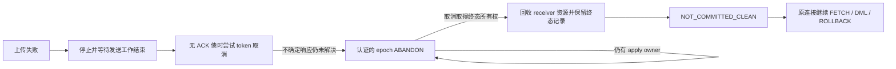

# M11 额度不足时的收尾修复

> **2026-10-04 版本说明：历史版本记录。** 文内“当前/尚未完成/通过”和源码路径均属于记录时点；旧 PS 定义/参数/重建方案不再适用，原失败与测量不改写为新版本成绩。 现行职责见[详细设计](detailed-design.md)和[PS 删除与 cursor 关联](ps-transfer-removal-and-cursor-attach.md)，最新状态见[任务跟踪 E63/E64](task-tracker.md)。下文保留历史事实，不作为现行实施清单。

本轮针对 E39／E52 的六个失败样本：memory 与 inflight 两种配置各三轮。
修复范围是上传失败后资源清理和原连接恢复，不调整额度、负载、性能门槛或 RESET DRAIN。

## 根因与处理

| 触发 | 原行为 | 本轮处理 |
| --- | --- | --- |
| receiver 内存不足，CHUNK 返回原生错误 | source 将响应视作不确定；不同字节的 token ABORT 被同槽精确重试保护挡住，OPEN owner 留存 | sender 全部退出后，复用已有 epoch ABANDON 终态操作；保留原 ACK 债务，只有认证的 NOT_COMMITTED_CLEAN 才释放 |
| receiver inflight 不足，前序数据应用失败 | COMMIT 先登记 COMMIT_ADMITTED，之后等待前序 apply 失败；取消无法取得清理权，source 保持 COMMIT_UNKNOWN | 在现有 epoch admission gate 内先确认前序 apply 成功，再登记 COMMIT；失败不抢占终态 |
| 上一缺口修正后，source 恢复原临时事务 | 通用 snapshot 删除先移除 undo sidecar，后续按 metadata 清理仍需读取它，恢复报错并触发保护退出 | 沿用相邻恢复路径的 sidecar 保留集合，保持“验证 undo、释放独立 reservation、删除文件”的顺序 |
| CHUNK 的成功 ACK 丢失后再丢首次 CLEAN ACK | 不确定上传之后仍逐 token 发 ABORT，与 receiver 已接受的同序号数据冲突；原生错误消耗既有三次重连预算，CLEAN 丢失后无法重试 | 有 ACK 债时不再发送新的 token ABORT；只由 sender 已 join 的 epoch 收尾发送既有 ABANDON。ABORT 自身响应不确定也置位同一保护 |

取消只在未提交的在线 epoch 中发起。尚未生成 COMMIT 时使用 epoch、receiver nonce 和专用 domain
生成稳定取消身份；不会拿它替换已冻结的 COMMIT 事实。终态请求不消费普通数据帧序号，
普通数据／token ABORT 仍须遵守不确定帧的同字节重试要求。

receiver 保留 COMMIT／ABANDON 单赢家裁决。仍有 admission／apply owner 时只返回 NOT_COMMITTED，
不能提前清理。取消中的旧序号重试以及取消后的迟到帧均在应用前拒绝；已认证的空 OPEN epoch
也能封存取消事实，未知 epoch 不会被当作已清理。取消请求仍受已有网络操作与 epoch 期限约束，
忙状态重试另有循环截止；这不是严格的30秒端到端清理上限。
既有 prewarm 资源仍按取消与引用退役收尾；CLEAN ACK 本身不等于所有 prewarm worker 已退出。
本轮另以运行后的 worker、queue、inflight 和内存回到基线验证回收。

源端恢复仅修正通用删除的输入选项，保留原 THD 的活跃 undo、所有权校验和恢复 barrier。
不修改 RESET 的保护断言，不把缺失 undo 当作成功。

## 验证记录

证据目录：`build-release/m11-cleanup-fix-20261001/`。

- `red-m11-memory`／`red-m11-inflight`：当前旧 Release 两项真实复现；低内存残留84827 B inflight，
  低 inflight 原连接收到4020。
- `inflight-only-green`：只改 COMMIT 顺序后，receiver 已返回认证 CLEAN，但源端 sidecar 删除顺序错误
  导致保护退出。该轮为失败证据，不计通过。
- `green1` 与 `final-r1/r2/r3`：修正源端后，原业务／资源断言通过；memory 外层验收仍因缺少
  解码额度拒绝的原因日志失败。已补该诊断，保留原 RESOURCE_EXHAUSTED 日志断言。
- 新 MTR `transfer_epoch_abandon_cleanup` 使用普通协议与并发连接，覆盖空／非空 OPEN 取消、
  重复取消、错误 nonce、迟到 DECLARE、并发旧帧及 receiver 原只读临时表隔离；没有 DEBUG_SYNC。
- 原容量 E2E 增加原连接 ID、原 statement ID 的剩余 FETCH、新 DML 后 ROLLBACK、inflight token
  归零和 source 无 COMMIT_UNKNOWN／HANDOFF_PENDING 的断言；不放宽原断言。
- `verified-r1/r2/r3`：原六轮已全部通过，之后真实丢 ACK 扩展又发现重连预算被无效 token ABORT
  耗尽。`ack-loss-chunk-red` 使用修正后的观察器，`transport.errors=[]`，四次被拒 ABORT 收到
  原生4019，首次 CLEAN 被丢后没有第二次取消请求。这是有效内核 RED。
- 观察器只对被接受的同序号不同字节报错；被 receiver 拒绝的冲突帧作为证据保留。
  故障用例还要求丢失 CLEAN 后再次转发同字节 CLEAN，不能用“曾看到 CLEAN”替代源端拿到响应。

### 最终验收

最终 Debug／Release 构建成功；Release SHA256 为
`f4b7082a4ae6a7ea08cce8033624d32b1361a12f14706e65f3acbb87d97b7d43`。
源码、测试、驱动和二进制的14项冻结输入在运行结束后逐项一致。

| 原失败配置 | 重复1 DRAIN耗时 | 重复2 | 重复3 | 原验收结果 |
| --- | ---: | ---: | ---: | --- |
| receiver内存64 KiB，4会话，每会话4096行 | 109.798 ms | 107.703 ms | 106.912 ms | 3/3通过 |
| receiver inflight 4 MiB，同一业务配置 | 482.299 ms | 498.580 ms | 488.329 ms | 3/3通过 |

六轮都保留原额度和 RESOURCE_EXHAUSTED 原生日志断言。额度不足时 DRAIN 返回预期4013，
随后原连接、原PS编号继续 FETCH，验证剩余121行的内容和顺序；新DML之后ROLLBACK恢复原始值。
上述时间是失败DRAIN命令的端到端耗时，不能当作成功迁移的严格Phase 2性能结果。

另两轮真实网络故障使用正常额度：

| 场景 | 实际故障 | 结果 |
| --- | --- | --- |
| 4会话，CHUNK已接收但ACK丢失 | 同一64 KiB CHUNK两次真实成功ACK均丢弃；首次CLEAN ACK也丢弃 | 111.314 ms完成失败DRAIN；同字节CLEAN重试被真实转发，原业务恢复 |
| 1会话，首DECLARE ACK丢失 | sequence=1的两次真实成功ACK均丢弃，source未确认任何token；首次CLEAN ACK也丢弃 | 105.457 ms完成失败DRAIN；token=0的epoch取消及同字节CLEAN重试通过 |

两轮选中epoch均未发COMMIT；没有放大既有三次重连上限。八轮共29个原会话均完成上述
FETCH／DML／ROLLBACK断言；清理观察5秒后，receiver的active epoch、inflight token／bytes、
queued bytes、active worker、计费内存均回到运行前的0，source的COMMIT_UNKNOWN和
HANDOFF_PENDING也为0。终态凭据仍按原保留协议管理，资源归零不代表删除终态凭据。

Debug定向回归共 **11个不同业务MTR通过**，无遗留失败或跳过；两次shutdown_report另列通过。
包括新取消协议用例、PS合批与ACK重试、undo delta重试／owner取消／额度、
NOT_COMMITTED_CLEAN原连接恢复、resume-required生命周期，以及三个OFF隔离用例。
先前一轮因binlog配置跳过的temp_id_contract_off，已在最终构建上以`--skip-log-bin`通过。
新用例不使用DEBUG_SYNC，也未新增UT/GUnit。

证据入口：

- [最终八轮汇总](../../../build-release/m11-cleanup-fix-20261001/accepted-summary.json)
- [冻结输入](../../../build-release/m11-cleanup-fix-20261001/accepted-inputs.json)
- [十项业务MTR](../../../build-release/m11-cleanup-fix-20261001/mtr-abort-final.log)
- [补充OFF MTR](../../../build-release/m11-cleanup-fix-20261001/mtr-off-final.log)
- [准确丢ACK RED](../../../build-release/m11-cleanup-fix-20261001/ack-loss-chunk-red/report.json)

本轮关闭E39／E52中两项容量收尾功能缺口，没有重跑全部158轮，也没有据此关闭V03。
限速下资源补传、1000连接规模及10秒Phase 1性能目标仍由原条目跟踪。
真实物理在线升主、SQL RESUME和proxy外部联调不在本轮异常收尾验证中。未新增线程池、
升主阶段或RESET DRAIN逻辑；未提交或推送。
