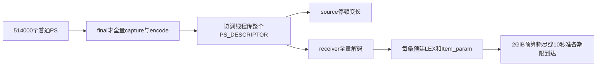
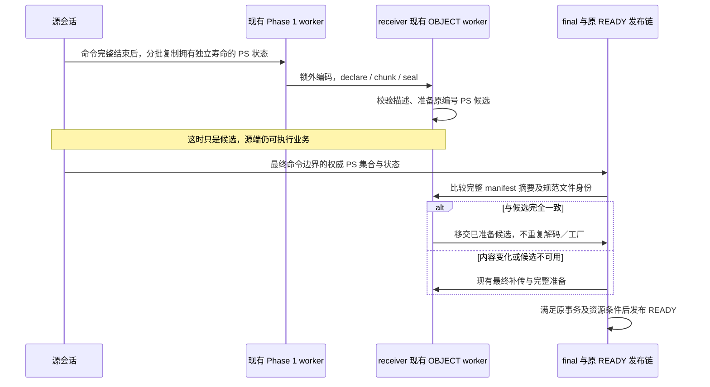
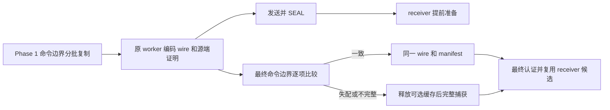
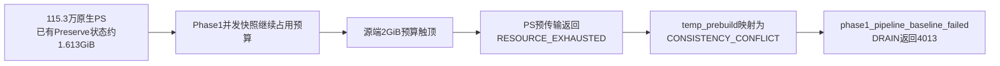
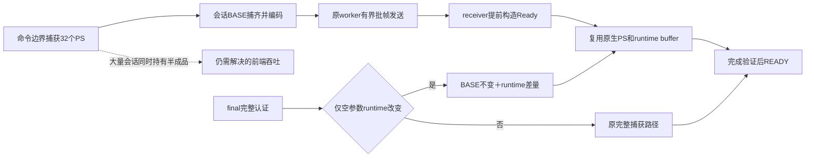
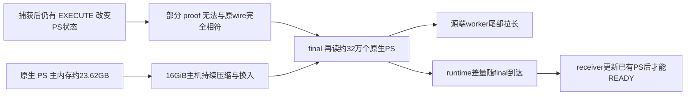

# 原有压力模型回归：定位与修复切片

> **2026-10-04 版本说明：历史版本记录。** 文内“当前/尚未完成/通过”和源码路径均属于记录时点；旧 PS 定义/参数/重建方案不再适用，原失败与测量不改写为新版本成绩。 现行职责见[详细设计](detailed-design.md)和[PS 删除与 cursor 关联](ps-transfer-removal-and-cursor-attach.md)，最新状态见[任务跟踪 E63/E64](task-tracker.md)。下文保留历史事实，不作为现行实施清单。

**新增读写模型结果（2026-09-30）：** 同一 Release `68a70817`、1000连接、128表、300秒稳态，实际1153000个PS。保持原2GiB Preserve预算时，源端Phase1触顶并以 `RESOURCE_EXHAUSTED` 中止，DRAIN返回4013，未进入Phase2。此前纯写模型通过不能外推到此规模的读写模型。完整指标及失败边界见文末“读写模型”。

**本轮吞吐优化进展（2026-09-30）：** Release `68a70817` 的原full r2已确认Phase1=81.553s、strict Phase2=562009us，29个不同Debug业务及9轮PS变动压力通过；10秒Phase1及全部READY SLO仍未达标。详见文末“Phase1 吞吐优化与 PS 撤销重建”。以下历史失败与基线保留，不代表当前未修复状态。

状态（2026-09-30）：普通PS Phase1端到端提前准备、receiver真实完成检查、源端实时证明、不可变wire复用及同样本依赖去重已实现。最终Debug 39项业务与shutdown全通过；最终Release `0994f545` 原full `skip_trx=off` 1000连接负载连续两轮通过2秒strict、500ms末命令至ACK、500ms ACK至READY全部原门槛。每轮1000候选在Phase1确认Ready，final全部复用，最终1000 READY。详细指标见文末“最终冻结版本重复验收”。这只关闭本负载的回归切片，不能替代其余原模型、全部规模、真实物理升主及商用SLO验收；历史失败按时序保留。

## 可重现事实

原始失败轮 Release SHA 为 `c4896fe57f05a76351bb2eb6dffee50562e12d56ad9c5ec4f210265fdd5a74ba`。与HEAD `324a8ec0110`相比，PS descriptor/wire/restore/pretransfer模块是未提交新增实现。原业务维持1000连接、128表、每表20000行、300秒；每连接128×4+2=514条预编译语句，共514000条；两端Preserve预算2GiB。新增TEMP、ID namespace、result capture开关开启。

显式事务格：source COMMITTED_HANDOFF，严格Phase2 15.318176秒，CLOSING→ACK 14.753099秒；receiver最终0 READY/1000 NOT_READY，内存峰值2147483600B，仅距预算48B。确认receiver选择已发布且不可变后中断剩余无效1800秒轮询，保留完整日志、状态和中止说明；不是完整超时验收。

自动提交格：source生成1000个资源SURVIVOR，原测试却要求NO_PRESERVABLE_TOKENS，因此旧断言失败。新功能启用时PS本身也需迁移，此处需要适配测试合同，不能据旧断言直接判定source事务迁移损坏；READY性能仍需独立检查。

## 根因与已排除项

- ordinary pretransfer目前只预传打开游标的结果文件。write-only无游标，PS预传字节为0；完整描述和运行态在final组装发送。
- final target worker wall为13.800秒，包含捕获与external-object发送。最后COMMIT_EPOCH约153毫秒、其中final metadata ACK约94毫秒，不能把14.75秒全叫网络ACK等待。
- snapshot_write 120.856秒是多目标累加；early路径AUTO在此规模用16 worker，日志另一个worker_count=10不是这一阶段的实际并行度。
- receiver `max_prepared_stmt_count`只在SQL RESUME attach检查，此前prepared_stmt_count=0；它不是本轮READY失败直接原因。
- factory初始root_limit=65536是临时上限，末尾已经shrink到allocated_size×2+owner，不能按150KiB/PS算常驻。默认arena至少8KiB；仅514000个arena的payload就约3.92GiB，仍超过2GiB预算，且还没有计算描述和参数。删除预留常数或仅去掉计费乘数不能修复容量结构。

## 切片一：普通空参数PS使用紧凑候选

只对“没有打开游标、经过完整runtime校验且所有参数均为NO_VALUE、没有字符串/值内容”的PS采用紧凑壳。保留原ID的Prepared_statement、immutable descriptor及已验证的短runtime字节；READY不为它构造LEX/Item_param。带结果或保留参数数据的PS沿当前完整准备路径。

- 包解析只读已验证runtime中的actual type；不在admission前分配/prepare。
- 完成命令准入后、任何LEX/param_array访问前，只为当前EXECUTE构造本地最小arena，继续现有deferred rebuild。此处没有结果行扫描、LOB复制或历史参数数据解码；不是SQL RESUME工作。
- RESET只把紧凑runtime设为PREPARED、清native reset规定的状态，保留历史actual type/unsigned/conversion/collation；CLOSE直接销毁壳，保持silent。
- RESUME后的新LONG_DATA仍走原生无响应语义；需要在临时诊断区内物化该一条PS，失败保存为原有deferred error。pending LONG_DATA仍不允许再次迁移。
- attach/rollback容许紧凑壳无LEX，但必须有匹配的已验证runtime且没有cursor。map、quota、原statement ID与PSI handle不能改变。
- 二次迁移从紧凑descriptor和当前runtime直接编码，不能为了capture物化整个session。
- 每个分配仍计费，不能排除native候选内存来绕过预算。继续验证整体描述/候选之和能否在原2GiB下成立。

## 切片二：在DRAIN Phase 1尽量完成PS迁移

用户进一步确认：PS也应尽可能在DRAIN Phase 1转移好。此项属于本次修复的核心验收，不以单纯减少receiver内存替代。

稳定的PREPARE描述与变化的运行态/消费位置需要分开；Phase 1同时推进捕获、传输与receiver提前准备。复用现有phase1 owner/pretransfer worker，不增加线程池或外部阶段；按PS生命周期与prepare代次保存已sealed描述，final仅选择相应描述和补齐变化。整个session包缓存会被普通EXECUTE持续作废，因此不能作为完整修复。

### 第一实施步：沿用完整 wire，先前移工作

经代码复核，先复用现有完整 wire 和最终权威捕获，实施精确摘要相同的候选接管；暂不为这一步引入新的 BASE/DELTA 线协议。这能前移传输和 receiver 准备，但**不能等同于消除了源端全量 final 捕获成本**。后续依据原规模实测决定内部逐 PS 版本缓存／增量编码的必要范围，不把扩大 Phase 1 等待时间作为性能通过的办法。

具体接线和边界：

- 源端已有 `Temp_table_phase1_targets`、`Preserve_trx_temp_prebuild_owner` 和 TEMP family，PS-only session 也可被发现。扩展 `Preserve_trx_ps_pretransfer::capture/step` 即可复用线程池；`initial_ps_done` 必须包含普通 PS 捕获和发送，不只检查 cursor 文件队列。
- 每次重新确认被 pin 的源 THD 处于命令边界，再复制有条数、字节预算的 PS entry。跨批次只保留 ID 和独立数据，不保留 `stmt_map` iterator、Item 或业务 THD 指针。单条大 SQL／参数仍需单独限制，不能把“每批 32 条”说成恒定耗时。
- 不能直接把现有 `Preserve_trx_ps_restore::capture()` 整体搬进持 `LOCK_thd_data` 的捕获线程：其 SP bindings 捕获会使用源 THD 的 MDL/DD。第一步普通快路径仅处理无 SP cache/bindings、无打开游标的会话，其余保留已有路径；不是取消这些会话的最终迁移支持。
- receiver 的 `mark_object_sealed()` 与 OBJECT worker 目前仅对 PS_RESULT 做提前候选工作。必须增加 PS_DESCRIPTOR 候选并复用 `Preparation::step()`；仅提前发送文件不算完成。无结果文件的普通 PS 可由 descriptor size/digest 构造当前格式的 manifest；带 cursor 的 wire 不能拿累计历史结果文件凑成数组。
- 候选以 epoch/token、完整 size/digest 与 canonical sealed file 身份隔离；旧 worker 发布前必须确认仍是当前候选。同名 replacement 的底层支持不等于已证明语义安全。final 比较完整 manifest，匹配才接管；失败／不匹配保留现有准备路径。可选候选不提前发布 token READY。
- 第一版 final 保留完整权威 capture/encode，所以跨批次观察不一致最多导致候选不命中。若后续免重捕获，必须增加逐 PS 生命周期／修改证明；不能直接使用 `preserve_trx_command_sequence`，它未覆盖 RESET 等全部资源变更，也不能证明外部 FLUSH/DDL 未发生。
- 最终集合决定已 CLOSE 的 PS 是否存在；继续原 proxy CLOSE 补发合同，不新增跨端 CLOSE 事件。随机状态、routine bindings、resolved 参数类型、broken/cacheable 等可变化事实也不能冻结在旧候选中。

先核对当前对象身份、代次、CLOSE和二次迁移规则，再实施有界捕获、传输、receiver提前准备及final复用；所有变更需要源→传输→目标的完整切片验证。不得在业务线程同步重编码整个PS集合。

## 验证与交付

1. 保留full原始RED；同二进制/预算/负载仅关闭result capture做对照，区分新路径与原事务核。
2. 新增MTR调用Python E2E的有界PS容量用例，先确认旧代码失败，再验证紧凑壳下READY、FETCH、无类型EXECUTE、RESET、CLOSE、二次迁移和新LONG_DATA原生处理。内部bridge用例不冒充真实HA验收；不用DEBUG_SYNC或UT。
3. 定向既有PS/FETCH/参数/依赖/失败回滚用例通过后，重新编译Release并冻结新SHA。重跑1000连接显式事务以及适配合法资源survivor断言后的自动提交格；保持原预算和性能门槛。
4. 恢复剩余原模型矩阵，交付每格详细指标。真实外部物理复制/升主仍是接入证据边界，不新增promotion阶段。

本轮证据根：`build-release/original-pressure-regression-20260928/`。任何修复未取得对应GREEN前，不更新为完成，不提交或推送。

Phase 1专项指标：提前捕获/发送/准备PS数及字节、final复用比例、最终补发字节、每次持有业务THD的时间及业务命令延迟。新建/关闭/重新准备、参数类型变化、FETCH、重复DRAIN均必须验证末态一致性。

## 紧凑 PS 修复的已执行验证

旧 Debug 的 `ps_backend_restore_compact` 在 8 MiB 预算、512 条 UPDATE PS 加普通字符串 PS 和打开游标下，source preparation 两次失败；原始 RED 日志保留。修复后同预算通过，不缩小原生 `query_alloc_block_size=8192`。短运行态经过完整校验才采用紧凑表示；第一次物化后立即释放空 decoded vector 的 capacity/lease，非空运行态仍保留原所有权。

最终构建命令为 `cmake --build build-debug --target mysqld -j8`。定向 MTR 用 `--parallel=8 --force --retry=0`，选择 PS backend/runtime/context/type/dependency/LONG_DATA 及 `protocol_ps_autocommit_lex_lifetime`：30 项业务通过，shutdown_report 单列通过。新增用例覆盖二次迁移前 RESET、连续 FETCH、无新类型 EXECUTE、CLOSE 幂等、未执行壳释放、物化 OOM 重试、LONG_DATA 物化 OOM 的静默与 deferred error、非法参数号和 RESET 恢复；旧 dependency、wrong-ID、配额与 attach 回滚用例保留。

大参数路径继续在解码后立即释放 wire image，避免它随游标扫描滞留；这处最后修正重新构建后，compact/capacity/backend/receiver/transfer/runtime 六项业务及 shutdown_report 再次通过。

日志：`compact-red.console.log`、`compact-build-debug-verified.log`、`compact-targeted.console.log`、`compact-build-debug-final-owner.log`、`compact-final-owner.console.log`，均位于上述证据根。MTR 是内部桥接/协议验证，不代替外部物理复制升主，也不证明 514000 条 PS 的 Release 全程内存与性能已达标。本轮没有提交或推送。

## 单变量对照结果

同一Release二进制，仅关闭`rds_preserve_trx_result_capture_enable`（TEMP和namespace仍ON）：原runner成功，严格Phase2=361729us；118 survivor全部READY，NOT_READY=0，receiver ACK→READY=1592us，DRAIN wall=2864919us。开启时1000个PS资源owner也必须保存，因此不能把两轮token数量当等量工作；该对照隔离了新增路径开销，不是新编译HEAD对照。原业务稳态TPS分别受主机状态影响，此单次对照不用于宣称吞吐改善。

## 紧凑候选的原规模复验：容量改善，整体仍未通过

`compact-sysbench-off-20260928-r1` 使用 Release `c332dad4bccec5f2fcdfa62fc77288e1b0fa5c55cfb8d67883c06560c2d3d7f5`，保留原 1000 连接、514000 PS、300 秒业务、2 GiB 预算。receiver 仍为 0 READY / 1000 NOT_READY，但 1000 项均是 PREWARM_DEADLINE，没有 preparation batch failure、retry 或资源限额分类。账面峰值 1,748,915,762 B；实际仅完成 342,876 次单 PS 恢复，因此不能据峰值证明完整集合一定放得下。

receiver final wall 10.491756 秒、prepare-only 9.273882 秒、342874 batches；此处截止窗口约 10 秒，1800 秒 token retention 不能延长它。源端严格 Phase2 22.874113 秒，其中 T0→HARD 0.526482、HARD→CLOSING 0.003270、CLOSING→ACK 22.331740、ACK→结束 0.012621 秒。worker wall 18.927829 秒，随后 survivor prune 2.705821 秒；COMMIT_EPOCH 0.354718 秒，其中 metadata ACK 0.092424 秒。snapshot_write 106.324170 秒仍是并行累计值。

ACK 后原 harness 停止 sysbench，1000 个旧连接集中退出，与同机 receiver 的准备窗口重叠：约六秒源端消耗 31.02 CPU 秒，RSS 上升；其中约四秒 receiver PS 恢复仅从 428 增至 703。确认存在重叠与停滞，但没有足够证据把唯一原因定为 CPU 争用、内存回收或换页；单轮 22.87 对 15.32 秒也不能全部归因于紧凑表示修改。终态已不可变后只中断剩余等待，原 owner 完成归档和自有实例清理；见 `compact-stop-explanation.json`，不是完整等待超时验收。

## Phase 1 第一切片：已落地的边界与验证

- `capture_ordinary()` 在被 pin 的 idle THD 数据锁内复制独立状态，每批最多 32 个普通 PS；首次仍需采集和排序全部 ID，256 KiB 的 SQL/参数估值不包含全部依赖副本，不宣称整个锁段具有严格字节上界。只对无 SP cache/bindings、无 TEMP、无打开 cursor、空参数且单条估值未超过限额的会话作此可选尝试；其他情况继续原有最终迁移能力。
- 编码和发送在已有 TEMP worker 内推进，原完整 wire 不变。每 token 本轮只尝试一次普通候选，尚未实现逐 PS 连续版本缓存。未完成样本在 owner 退出支持集合或 final 接管时丢弃；不发送半份样本。
- receiver SEAL 只登记 canonical file；原 OBJECT worker 每批最多准备 32 条无结果 PS。最终完整 manifest 与文件身份精确一致才接管，否则先退出旧批次、释放旧候选，再走最终加载，避免双份候选挤占预算。全部 CLOSE 后最终集合不再选择旧 PS，释放其候选。
- final 仍全量捕获和编码，因而这一步只前移传输和 receiver 准备，没有消除源端最终快照开销。snapshot_write 是并行累计 elapsed，含等待，不能当成 CPU 秒。复用命中不再重复扣 PS 文件读取限速预算；等待早期候选仍计入最终未完成 PS 准备量。未增加线程池、promotion 阶段或 RESET DRAIN 行为。
- 新双端 `ps_phase1_reuse/change` 在旧 Debug 都明确 RED：Phase 1 窗口存在但 descriptor 没有到达 receiver。第一版测试的 final 文件检查发生在正常 READY 清理之后，曾报路径缺失；修正观察时机后通过，不能把这次测试时序错误列为内核故障。
- 最终 Debug 构建后 14 项业务通过：3 个 `ps_phase1_*`（含全部 CLOSE 后保留新 TEMP）、2 个 `ps_only_strict_*`、6 个 backend/capacity/compact/OFF/transfer/receiver、cursor OFF、native cross 和 undo early transfer；shutdown_report 另列通过。真实双端新用例证明提前准备及最终 READY；既有 loopback SQL RESUME 用例不能冒充外部物理升主。
- 原自动提交压测的合同按实际启用的 PS 资源功能区分：开启时要求每业务连接对应资源 survivor，并验收 receiver READY；关闭或旧服务端无该变量时，保持原零 token 控制移交要求。原事务、完整业务窗口和性能门槛未放宽；正式 autocommit 复验尚未完成。

日志为 `ps-phase1-red.console.log`、`ps-phase1-build-4.log`、`ps-phase1-targeted.console.log`。未提交或推送。V03 与其余原模型矩阵仍开放。

## 原规模 Phase 1 首轮复验：READY 恢复，源端与普通捕获仍未达标

`phase1-sysbench-off-20260928-r2` 使用 Release `c5c2a9769644e21e3825c9be873d0b858c272129ffe5beb174974cb1e8dbaf2f`，268 个冻结输入事后校验全部一致。1000 连接、128×20000 表数据、30 个完整十秒业务报告、2 GiB Preserve 预算和 2 秒严格 Phase 2 门槛均保留。稳态 TPS 5421.291、QPS 32540.921；原日志的 95% 延迟为 0，不提供虚假的延迟分位数。

| 指标 | 实测 |
|---|---:|
| source survivor / receiver READY / NOT_READY | 1000 / 1000 / 0 |
| receiver 实际 PS 恢复次数 | 513000 |
| receiver 最终 ACK 后 READY | 12061 us |
| receiver Preserve memory 峰值 | 1870481536 B |
| 严格 Phase 2 | 27256283 us，未通过 2000000 us 门槛 |
| T0→HARD / HARD→CLOSING | 155700 / 10595 us |
| CLOSING→ACK / ACK→结束 | 27061119 / 28869 us |
| Phase 1 开始→purge request / 等待 purge stop | 61361455 / 6386773 us |
| DRAIN 总耗时 | 97127531 us |
| 源端提前 PS 捕获批次 / 条目 / 完整 descriptor | 73 / 2243 / 3 |
| 源端提前 descriptor 字节 | 783615 B |
| 原 pipeline TEMP worker 步数 | 138341 |

receiver 的 early_ready/reused 都为 1000，包含**最终 SEAL 到 COMMIT 之间**的准备，不代表 1000 份都在 Phase 1 完成。源端普通阶段只完整转移 3 份；按实测每份 513 PS，另有 22 个 32 条批次没有形成完整样本。原 workload 初始化的计划 PS 数与最终实际恢复次数分开记录，不用 514000 代替这轮观测的 513000。

功能检查已经到达完整 READY、双方存活、队列清空和 1000 个原连接保持；runner 自然以严格时延超限失败并清理自有实例。没有手工中断这轮，也没有放宽门槛。详见 `phase1-r2-summary.json`、`phase1-r2-input-verification.json` 和原 run 的 report/log。前一次 r1 因 harness 新增变量的赋值顺序错误，在业务窗口前退出；修正后才运行 r2，见 `phase1-harness-startup-fix.json`，不列为内核性能轮次。

对应源码确定了三个调度问题：半份 Snapshot 被误当作可运行工作，占住 worker/candidate 名额并反复空转；实际 idle miss 被误当作初次尝试完成；先扫描全部 idle THD、随后再逐个检查 idle，要求两次采样同时命中。138341 次 TEMP step 与仅 3 份真实传输符合空转机制，但未分摊三者的独立耗时比例。

新增 `ps_phase1_disconnect` 已在最后一版首切片 Debug 通过，与 reuse/change/close 共 4 项业务及 shutdown_report 通过。之后增加的 `ps_phase1_fairness` 用普通连接和用户锁，让两个大 PS owner 在部分捕获后继续执行未结束命令，旧 Debug 已复现后续 owner 无法取得捕获机会。调度修正将 WAITING、RUNNABLE、COMPLETE 分开；部分样本继续受既有内存 lease 预算约束，但不消耗 worker 并发名额；可运行对象不受源端再次忙碌影响。该修正正在独立验证，不能用前面的 READY 结果冒充修正后的性能结果。

## 调度修正复验与忙连接边界捕获

调度修正后的最终 Debug 定向运行 `ps-phase1-scheduling-final.console.log` 为 12 项业务通过，shutdown_report 另列通过。包含五项 Phase 1 用例、compact/OFF、严格 RESUME/retry 以及 native TEMP/undo 提前传输保护用例。

随后 `ps-scheduling-sysbench-off-20260928-r1` 使用 Release `47bb4ce1ddbae90a5daaae210d79ee844cf86327de06f95269b52f7ac4393502`；272 个冻结输入事后均未变化。原 1000 连接、300 秒窗口、数据量、预算和门槛不变，稳态 TPS 5136.850、QPS 30820.712；延迟分位仍不可得。

| 指标 | 实测 |
|---|---:|
| survivor / READY / NOT_READY | 1000 / 1000 / 0 |
| receiver PS 恢复数 / Preserve 内存峰值 | 513000 / 1875242003 B |
| 最终 ACK→READY | 7709061 us |
| 严格 Phase 2 | 10811062 us，仍超过 2000000 us |
| T0→HARD / HARD→CLOSING / CLOSING→ACK / ACK→结束 | 241160 / 229 / 10567549 / 2124 us |
| DRAIN 总耗时 | 72390930 us |
| 源端普通捕获批次 / PS 数 / 完整 descriptor / 提前字节 | 604 / 19328 / 0 / 0 |
| TEMP worker step | 0 |

半份 Snapshot 不再空转，但普通捕获散布在忙连接上，仍没有完成任一完整集合。`TEMP step=0` 不等于没有复制工作；receiver 的候选准备又落回 final SEAL 后，最终 ACK 后还需 7.71 秒。这轮自然以严格 SLO 失败结束并清场，不能称性能问题已解决。证据见 `ps-scheduling-r1-summary.json` 和原 run 报告。

下一修正用现有 `preserved_trx_begin_command_read()` 的正常分支：上一命令已完整退出、下一包尚未读取；业务 owner 每次交出至多 32 条普通 PS 独立状态。首批 ID 枚举和排序仍随集合大小增长，依赖复制也不包含在 SQL 长度估值中，因此不承诺恒定耗时。共享 capture 锁采用 try-lock，竞争时跳过，后续命令继续；业务线程不编码、不发送、不调用 TEMP job。原 coordinator 保留闲连接捕获，原 worker 发现完整 Snapshot 后发送。

路由依附现有 drain attempt，在 source epoch 和 token 声明完成后发布。正常收口、超时、取消及 RAII 退出撤销同一入口，并与已进入的一批复制同步；已经冻结的对象继续按原队列排空。没有新增 RESET DRAIN 行为、线程池或升主阶段。最终权威捕获仍保留。

新增 `ps_phase1_busy` 使用一个已有 worker 和真实传输 ACK 窗口：helper 占住发送，主连接持有 513 条 PS，完成 24 次 UPDATE 后再次进入 GET_LOCK；释放 helper ACK 后主连接仍未结束命令，要求实际 descriptor 到达、receiver 候选准备、final 精确复用及 READY，并校验 UPDATE/ROLLBACK 数据。旧 Debug SHA `331b8efff8a7eb14f4f7d0423b4a4b82e705cba8a3b98882c1d24b24602807f6` 已明确 RED：`Phase 1 ordinary PS descriptor never reached receiver`，见 `ps-phase1-busy-red.console.log`。该新增修正正在构建验证，尚无修正后的 Release 结论。

### Owner 边界首轮 full：捕获机会恢复，跨连接复制仍串行

新增 owner 边界后，Debug 13 项定向业务及 shutdown_report 通过；最后一处放弃样本请求位清理后，busy/CLOSE/disconnect 三项再次通过。Release `7ae44533727b8251963faf41d50cc6450126d5182402a30a541e3202870fa11d` 运行 `ps-owner-sysbench-off-20260928-r1`，276 项输入事后验证一致。30 个完整业务报告平均 TPS 5722.370、QPS 34336.993，业务错误和重连未见；该跨轮差异不作为独立性能收益结论。

| 指标 | 实测 |
|---|---:|
| survivor / READY / NOT_READY / PS 恢复 | 1000 / 1000 / 0 / 513000 |
| 严格 Phase 2 / ACK→READY / DRAIN 总耗时 | 9080868 / 6552848 / 77909130 us |
| 源端捕获 PS / 非空批次 / owner 非空批次 | 350939 / 11055 / 11004 |
| owner 捕获锁跳过 / 锁内复制累计 / 最大 | 1652393 / 57431734 us / 151809 us |
| 普通发送队列最终累计 descriptor / 字节 | 91 / 23769655 B |
| source / receiver Preserve 内存峰值 | 1409042432 / 1870711399 B |

91 是普通发送队列在整个运行结束的累计值，可能包含 final 的队列续传。按 FINAL 日志 UTC 与单调时间差估算 pre-T0 截止，并留一秒裕量的源/目标采样均为 32 份；这是带日志发出时延误差的阶段观察，不能当精确追踪。receiver 最终 early_ready/reused=1000 仍包含 final SEAL 后准备。采样及计算方法在 `ps-owner-r1-summary.json`。

源码与计数共同确认：owner 获得边界后，仍在全局 pretransfer mutex 内复制 32 PS；不同连接相互串行，累计复制约占去整个普通捕获窗口。try-lock 只把其他连接变成跳过，不提高复制吞吐；不能继续扩大超时掩盖这一点。下一单变量修正是在短锁下认领 Token 并移出其部分 Snapshot，锁外复制独立状态，再短锁发布；同时复制数沿用现有 pipeline 的 worker/result-slot 配额，未增加线程池或用户参数。关闭入口用既有生命周期等待在途复制完成；放弃标记单调，已被放弃的栈上样本不得复活。该修正正在定向及独立 full 验证。

### 有界并行捕获复验与共享账本瓶颈（2026-09-29 续）

独立状态复制移到发送锁外后，Debug 13 项业务及 shutdown_report 通过。Release `4e664bd5249850759a8c4e122d8621d640813bbd9adcaa870c0f26041c380337` 的 `ps-parallel-sysbench-off-20260928-r1` 保持原合同，277 个冻结输入事后验证一致。没有新的线程池、deadline 或预算调整。

| 指标 | 实测 |
|---|---:|
| survivor / READY / NOT_READY / PS 恢复 | 1000 / 1000 / 0 / 513000 |
| 严格 Phase 2 / ACK→READY / DRAIN 总耗时 | 17569987 / 46237 / 80569484 us |
| 源端普通捕获 PS / 非空批次 / 最大并行复制 | 424711 / 13651 / 6 |
| owner 发布锁跳过 / 无复制额度跳过 | 159533 / 1251485 |
| owner 捕获累计 elapsed / 单批最大 | 307587974 / 344269 us |
| 普通队列最终累计 descriptor / 字节 | 391 / 102131155 B |
| final 之前采样已封 descriptor / receiver 已备候选 | 218 / 218 |
| source / receiver Preserve 内存峰值 | 1329001257 / 1855404775 B |

最终累计 391 包含收口后的续传；218 的口径取服务端 `BASELINE_COMPLETE` 日志提交时间之前，整次 SQL 状态查询已结束的最后采样。这是 final 之前的完成下界，非精确 capture-close 时点。同样方法核算 owner 串行版为 32 / 32，替代前面由 FINAL 时间差反推的较弱边界。最终 receiver 的 1000 次 early reuse 仍不能全部归入 Phase 1。

严格 Phase 2 没有通过 2 秒门槛。稳态 30 个完整报告平均 TPS 5516.174、QPS 33102.165，错误为零、1000 原连接保持；主机状态跨轮不同，不能把单次 TPS 差异归因于这一修改。snapshot_write 102158901 us 是并行累计 elapsed，并非 CPU 时间。该轮自然以 SLO 超限退出并由原 owner 清场。

随后用完全相同二进制运行 `ps-parallel-stack-diagnostic-20260929-r1`，分别采集 ordinary 与普通基线完成后的 source 栈；这是有侵入的定位轮次，不作性能验收。两次 `/usr/bin/sample` 均成功，277 个输入未变化。ordinary 按树深度计算独占样本、避免父子重复：owner 子树 1283 个 thread-samples，账本 lease acquire 路径 725，其中明确资源 mutex kernel wait 612、锁内 97、unlock 13。锁内 60 点落在字符串比较，未采到该锁内 malloc，也未观察到 native binlog 的文件系统检查栈；不能把等待者直接当成持锁者。

源码确认每个 PS 的 descriptor、types、runtime，以及存在时的 dependency，都分别申请 lease；每次先 find 两张 map，再无条件 emplace 两张 map。libc++ 对已有 key 不会重新分配节点，但会重复查找。最小修正复用首次查找的 iterator，仅缺失节点才插入，查找使用已有非拥有 key view；全部预算检查、逐笔记账和 OOM 回滚保持。该修正待独立 full 复验，不能预先称为性能闭环。源进程采样 physical footprint 为 16.3G，同机内存压力须单列；采样点不能直接换算 CPU 时间，也不能由这个窗口解释全部长尾。

同一诊断轮的 final source 栈补充：16 个 final worker 的 4426 个 thread-samples 中，4409 处于 `ps_transfer_capture`；其互斥分布为完整 capture 3475、临时 Snapshot 析构 847、wire encode 79、manifest/digest 8。账本路径共 3025/4409，其中 mutex 获取2592，明确 kernel wait2579。capture 的账本申请等待和 Snapshot lease 释放等待均存在；这里的析构发生在最终捕获函数内，不是 handoff 后旧连接销毁。1000 个业务 THD 的424000个样本均为等待 cutoff 响应的正常停泊，不能混入工作线程分母，也不是receiver网络等待。协调线程另有90个目标socket响应等待，不能凭source栈认定为纯网络耗时。两窗口方法和锚点保留在原sample；采样分布不外推为整轮耗时分摊。

记账快路径 Debug 定向 `ps-ledger-mtr.console.log` 为17项业务及shutdown_report全通过，包含预算收缩/恢复、故障清理、Phase1忙连接/公平性/CLOSE/断连、compact/OFF、RESUME/retry和TEMP/undo保护。Release `3f7d0885d7fea7cb18f908bfd6bff11561df47fecdf13af7560d9c465ecd9fe7` 已冻结278项输入，正进行原full独立复验；这段运行结果尚未产生。

主机影响的已知边界：诊断 ordinary probe 内两次VM采样相隔16.110144秒，pageouts增加9178页、swapins50818页、swapouts56884页，每页16KiB；这是全机计数和页等量，不是源进程物理I/O归属。probe内26次PID62566观测累计CPU增加82.30秒/25.238487秒，RSS1.637–2.215GiB。完整包围Phase1的78.809304秒VM窗记录swapins4939.063MiB、swapouts5874.000MiB页等量；源进程Phase1内累计CPU223.97秒/62.645759秒。换页与CPU工作确实并存，但没有源线程独立fault等待耗时，不能把全部锁等待归为环境原因，也不能把16.3G footprint等同RSS。证据在对应`observation/.../host.jsonl`393–409行及362–440行，正式复测不执行sample。

## 资源账本修正的正式复验与源端 final 复用（2026-09-30）

账本修正 `ps-ledger-sysbench-off-20260929-r1` 自然完成，278 个冻结输入事后核对一致。1000 survivor / 1000 READY / 0 NOT_READY，实际恢复 513000 PS；严格 Phase 2 为 8052597 us，仍未通过原 2000000 us 门槛。receiver ACK→READY 为 17316 us；DRAIN 总耗时 69177162 us。源端普通捕获覆盖全部 513000 PS、17000 批，最终队列 1000 份 descriptor / 261205000 B；final 开始前的采样下界为 source 已 SEAL 331 份、receiver 已准备 330 份，不能把队列最终值写成 Phase 1 全完成。源/目标账本峰值分别 1421694820 / 1859665482 B；稳态 TPS 5186.138、QPS 31104.429，30 个完整业务窗口，fatal error 为 0（存在原生重试计数）。详见 `ps-ledger-r1-summary.json`。

同二进制采栈已证明 final 的 PS 全量复制与析构重复争用资源账本，而 receiver 尾部已短。因此新增源端 wire 复用，保持普通命令边界、现有传输认证和最终内容校验：

证明通过强引用固定 prepare context 寿命，排除 deferred/native-pending/compact、游标、TEMP/SP 与非空参数状态；比较 statement ID 集合、SQL/DB、动态描述、resolved types、actual types/unsigned/charset/arena、随机种子及原 TDC 版本。proof 不写入 wire，不改变接收端解码。比较、编码及析构均在 pretransfer 锁外；complete Snapshot 未编码时只编码，不再克隆。

补充审查发现并修正了旧缓存退休时序：在 kernel 内部 TEMP/binlog 申请之前选择候选；失配和 partial Snapshot 先释放；Phase 1 join 后释放已消失或仅剩会话的目标，并覆盖动态 session-only、空 engine state 和超时排除。pending 传输仍持有必需对象直至 SEAL/epoch 收口。该保证不扩展到更早的 attached-target warmcopy/lock 准备，也不把功能用例当作低配额性能证明。

验证记录：旧 Debug 的 source-reuse 断言失败已保存，它证明缺少新优化分支，**不是业务错误 RED**。首轮 24 项相关业务通过，涵盖原内容命中、actual type/unsigned、RESET、同数量替换、DDL/reprepare 失配，以及 cursor/TEMP/undo/恢复/OFF 保护。随后增加 pure all-CLOSE/session-only 和晚建 TEMP 两条；最终补丁回归与新 Release 实测另行记录，不能用账本版本 8.05 秒结果代表 source wire 复用版本。

最终补丁 Debug 运行记录 `ps-source-reuse-verified.console.log`：28 项业务通过，shutdown_report 通过；`batch_drain_closing_timeout_all_excluded` 因要求 no-bin 而跳过，未计入通过。包含实际源端wire命中、7类失配/生命周期场景及原cursor/TEMP/undo/恢复/OFF、两条已有超时排除保护。纯CLOSE用例证明control-only提交、无PS复用和receiver已有TEMP完整；晚建TEMP证明功能回退，两者不证明低配额极限下的时延或缓存释放时间。

Release `fa623fe90ca03be449b31a65874e7457afbf79af40e80065d85b5e7aaf4d50b8` 已构建，307项输入冻结到 `ps-source-reuse-frozen-inputs.json`。`ps-source-reuse-sysbench-off-20260930-r1` 已启动原full模型，暂未形成性能结论。测量期间不构建、不改冻结源码或脚本，不并行其他负载。

本轮度量口径：`ps_source_wire_reused` 按最终候选集合计数，并非单条PS；完整普通快照在final才编码也可命中，因此命中1000不等于Phase1已传完1000。`ps_pretransfer_descriptors` 与receiver `early_ready` 最终累计均可包含final补发/准备，仍以baseline前完成采样给出下界。`snapshot_write_us` 为并行目标累计耗时；此次验证前移到VALIDATION后，该项下降还含计时归属变化，不能直接声称等量停顿消失。性能收益必须以同规格严格Phase2和CLOSING→ACK墙钟核实；`ps_runtime_restores`不是SQL RESUME成功次数。

### Source wire 首轮 full 结果与下一处重复工作

`ps-source-reuse-sysbench-off-20260930-r1` 自然结束，307项冻结输入无变化：1000 survivor / 1000 READY / 0 NOT_READY，receiver ACK→READY16177us，严格Phase2 **9585671us**，仍未达标；DRAIN75127175us，30个完整业务报告，稳态TPS4811.026/QPS28856.088，fatal0。source final wire命中420个集合、回退580；普通阶段430277条/13854批，descriptor最终SEAL382份、99780310B，baseline前发送/候选采样下界295/295。receiver runtime安装513513次，包含多准备的旧候选，不是513513个最终PS。source/receiver账本峰值1374787490/1861627848B。不能以snapshot累计耗时下降（82729750→50773350us）宣称墙钟改善；本轮严格Phase2实际未改善。

源代码另确认普通截止的 `finish_submissions()` 无条件调用 `abandon_capture()`，将尚未完整的PS样本销毁；final只能全量重捕。已捕获数量高不代表每个owner都完整，因此保留完整wire仍不足以消除大量回退。下一单变量切片拟保留partial，在join后、final独占THD下沿原固定ID列表补齐，完整编码并执行全部proof检查后才能采用；旧前缀及原RAND基线不改写来掩盖失配。补齐失败/零进展/编码或proof失败均先销毁再走原捕获，取消后的既有join清理显式释放可选快照。该方案会提高final入口驻留内存，必须记录峰值与回退，尚不能承诺2秒性能达标。

Partial 切片已实现，旧Debug准确RED在 `ps-partial-red2.console.log`：source普通捕获64条、实际receiver READY后，reuse仍0/fallback1，正例失败；两个失配负例通过。新Debug `ps-partial-green.console.log` 的31项业务及shutdown_report全部通过；加强数量断言的 `ps-partial-verified.console.log` 三项业务及shutdown再次通过。正例要求普通捕获数＋final补尾数恰为4097、partial复用1；prefix变化要求final完整补尾后回退，尾项关闭要求final在缺失ID前捕获的数量精确吻合。独立审查未发现补尾/终结清理阻断缺陷。没有新增UT、DEBUG_SYNC、线程池或外部阶段；尚未验证低配额极限，Release原full复测待下条记录。

### Partial 正式复验：复用命中提高，严格 Phase 2 仍未达标

`ps-partial-sysbench-off-20260930-r1` 使用 Release `06461ca0e525546b86a33ba9a37a4730e2f377d5a707e8fb2cc961be596e3a53`，317项冻结输入事后核对无变化。OFF 指 sysbench `skip_trx=off`，资源功能在两端均开启。完整保留1000连接、128×20000行、30个业务报告及原2秒门槛；业务窗口299997864us，TPS4407.618、QPS26441.145，fatal0、无重连，存在原生事务重试。

| 指标 | 本轮值 |
|---|---:|
| survivor / READY / NOT_READY | 1000 / 1000 / 0 |
| 严格 Phase2 / 最后命令结束→FINAL_ACK | 9003002 / 8910144 us |
| receiver FINAL_ACK→READY | 265597 us |
| DRAIN 墙钟 | 70644056 us |
| final wire 命中 / 回退 | 995 / 5 个集合 |
| 其中 partial 补尾后命中 | 477 个集合 |
| ordinary 捕获 / final 补尾 | 454601 / 58399 条 PS |
| ordinary 队列最终 SEAL / 字节 | 459 / 119893095 B |
| baseline 前 SEAL / receiver 候选采样下界 | 249 / 249 |
| source / receiver Preserve 账本峰值 | 1388610775 / 1854718215 B |

严格 Phase2 仍失败，不能把995次命中写成性能闭环。ordinary计数与final补尾之和为513000；少数proof失配仍会进入独立完整捕获，其工作不在补尾计数中。receiver runtime安装514539条，包含3个被后续最终对象替换的旧候选；不是最终多出1539个PS。`snapshot_write_us=394960`仍是并行累计，且候选编码/校验在VALIDATION；不能据此认定source只耗费0.395秒。`phase2_transfer_tail_us=8823012`是合并区间，不能直接等同网络等待。

本轮自然以原SLO失败退出，`result.json`确认无剩余进程、生成datadir已清理；source测量后按既有单向purge fence由owner强制退休，receiver正常终止，不构成崩溃恢复测试。证据在`build-release/original-pressure-regression-20260928/ps-partial-r1-summary.json`及对应`runs/`、`observation/`；判断整格需并读`report.json`、`result.json`、`checklist.json`，辅助summary不能替代验收。

进一步静态审查发现，PS全集捕获完成后才可编码，每次worker只发送一个DECLARE/≤64KiB chunk/SEAL；重新提交之前协调线程会扫描cohort，逐目标又扫描owner entries，存在O(N²)检查。现有计数未区分完整集合等待编码、epoch锁等待、同步发送和cohort扫描耗时，尚不能证明哪项主导。已启动同二进制`ps-partial-stack-diagnostic-20260930-r1`，在ordinary及baseline后采集source/receiver栈，明确排除性能验收用途；不据静态成本直接改调度或新增线程池。

原矩阵的另一个独立问题是autocommit ON测试判据：内层已按实际资源功能区分零token/control-commit和PS survivor/READY，外层`validate_e2e_report()`仍一律要求零token。后续须同步外层及checklist合同，保持原业务负载、1000连接对应关系和所有SLO，不能把过时oracle失败归因于内核；尚未修订或在本版本执行ON格。

### 诊断确认 final 等待屏障，进行单变量修正

同二进制诊断轮317项输入无变化、1000 READY；15.076052秒为侵入采样结果，不作性能比较。正式轮23:59:40.4—44.4 UTC，source复用16→970、补尾1127→57044条，而receiver候选保持258、source普通PS字节不变；45.4—49.4秒才集中发送并准备剩余候选。诊断source协调线程419/419样本在 `execute+27196 → 1ms wait_for`；离线控制流核实这里是discovery后比较completed_workers与目标总数的等待，退出后才调用staging。不是等待网络ACK。

诊断窗口16个final worker共6704个互斥线程样本（排除1000业务停泊线程）：matches3980、补尾capture1949、encode397、Snapshot析构222、digest13、其他143。matches内部num_visible_fields1329、内联字段/Reader/类型检查本体2394；TDC完整子树191，其中LOCK_open内核等待136，仅占全部worker样本2.03%，不支持把它当作主因。样本比例不是CPU比例或墙钟拆分，不能外推正式轮。两份receiver栈均早于末段忙准备，不能据其idle worker栈归因receiver内部开销；probe返回时间包含符号化，两侧附带status均为source状态，receiver事实以自己的observation为准。

最小修正限于既有 `final_hwm_async_capable` 路径：discovery结束后，等待循环继续消费staging_queue，释放queue mutex再发送，失败设置原abort/status并notify，保留最终stage和所有binlog认证/flush。前置flush仍等待全局sender队列，不承诺所有波次都可充分重叠。新MTR以64个idle PS会话和已提交DML背景验证全部READY及实际完成重叠，没有DEBUG_SYNC。最初两次RED因日志路径/级别或缺少观测字段，不作为内核行为RED；加入相同观测、显式开启日志级别后，旧等待逻辑的 `ps-overlap-observed-red.console.log` 在64READY后明确记录 `post_discovery_overlap_targets=0` 并失败。新等待逻辑的同一场景已经通过，实际完成重叠27个目标、提前启动6个wave；完整定向集合及Release结果另行记录。

没有据热点直接删除proof校验。context代际不覆盖全部可变状态：cursor EXECUTE可改变cacheability/result，temporal参数可在同代改变decimals，因此这些仍须现场检查。当前context没有可直接代替全部descriptor的缓存；顶层native SELECT可见列数可继续做独立评估，但本轮未改matcher，也不把17GB footprint当作已证明的缺页根因。

### Final 重叠已发生，正式性能仍未通过

最终 Debug 定向回归 `ps-overlap-verified.console.log` 为34/34通过：32项业务、1项已有HWM源码契约、shutdown_report。Release `c637d20a315d6e0394dc8e9fdd44464388fcd6bdd0627b44b160bb1de024d0e1` 的 `ps-overlap-sysbench-off-20260930-r1` 自然结束，321项冻结输入核验无变化，observer无故障、线程均退出，运行器确认无残留进程和生成datadir。原严格SLO失败，不能用功能通过替代性能验收。

| 指标 | Partial 上轮 | 本轮 final 重叠 |
|---|---:|---:|
| survivor / READY / NOT_READY | 1000 / 1000 / 0 | 1000 / 1000 / 0 |
| 严格 Phase2 | 9003002 us | 18138728 us |
| 最后命令结束→FINAL_ACK | 8910144 us | 18029383 us |
| FINAL_ACK→READY | 265597 us | 45222 us |
| DRAIN 墙钟 | 70644056 us | 79372491 us |
| ordinary 捕获 / final 补尾 | 454601 / 58399 | 398579 / 114421 |
| final wire 复用 / 回退 / partial 命中 | 995 / 5 / 477 | 994 / 6 / 690 |
| ordinary 最终 SEAL / 字节 | 459 / 119893095 B | 302 / 78883910 B |
| source / receiver 账本峰值 | 1388610775 / 1854718215 B | 1365348597 / 1857368230 B |
| 稳态 TPS / QPS | 4407.618 / 26441.145 | 4343.769 / 26064.251 |

本轮30个完整报告、1000连接保持、fatal0。HWM日志记录39个discovery后启动的staging波次、636个在其他目标未完成时已完成staging的candidate；这不是636次新发包或receiver READY事件，已presealed对象可复用。独立时间序列也确认sender/receiver在source补尾未完成时推进：Phase1开始约63.5秒时，source final只补了33612/114421条，receiver已安装230850条；约71.5秒时分别为108238和383724。上轮source补尾期间receiver安装量维持132354，随后才增长。

重叠行为得到验证，但严格Phase2变慢。本轮进入final以前ordinary已少捕获56022条，不能把两轮差值全部归因于新等待循环；同机资源竞争与捕获进度仍需区分。`phase2_target_worker_wall_us=14890596`包含协调staging，不是纯worker CPU。receiver累计安装514539条包含3个旧候选，最终复用1000集合。

baseline之前完整样本下界实际为上轮249份SEAL/127737次安装，本轮288份SEAL/147744次安装：本轮捕获总PS更少，不代表完整集合更少。表内ordinary队列的最终SEAL累计会在final继续增长，不可混作Phase1截止精确值。两个近似ordinary主机采样窗（上轮STARTED+1.176至64.104秒、本轮+2.328至63.899秒）全机swap-in约4.039/6.008GiB、swap-out约5.311/7.093GiB；这些来自16KiB页的全机累计计数差，约15–16秒一次采样，不能归因具体进程或精确划分Phase2。`free_bytes`是磁盘剩余空间，不是可用内存。

### Phase 1 新证据与待验证边界

前述同二进制诊断ordinary窗口，协调线程207/207样本在Phase1循环，其中136在initial-baseline检查（134为目标THD锁等待）、49在late idle sweep、20在transfer-target sweep。`ordinary_baselines_complete()`每轮可调用两次；对尚未完成、没有job/inflight的PS owner逐项`find_thd`，随后两种cohort扫描又逐会话加锁。保留owner ID或partial snapshot并不会免去这些查询。

同一窗口6个pipeline worker均在条件等待，但不是整个捕获系统空闲：已进入owner复制的样本约占6个复制槽容量的98.3%。08:08:12.278至15.299，owner batch增加506、累计capture耗时增加15467526us、no-slot增加56628；PS数量仍为批数乘32，尚无完整513条集合可交给传输。该窗口说明命令边界复制供给受槽占用及锁成本限制，不能据worker空闲就扩线程池，也不能把侵入采样比例外推成正式60秒吞吐。

`initial_baselines_complete()`同时负责退出owner的partial释放及公平性状态结算，不能从首个waiting直接返回而永久跳过后续owner。若减少扫描，必须保留轮转清理与完整一圈才能返回true的条件，不能缓存无保护THD指针。当前未实施该调度修改，也未更改复制槽数、32条批大小或proof校验。

autocommit ON外层oracle已按内层实际`ps_resources_enabled`布尔值分支：关闭时仍要求零token/control-commit；开启时要求全部原业务ID对应SURVIVOR、全部READY、epoch推进、无NOT_READY。保存原七列DRAIN结果并对照原连接集合，checklist同步列出两种合同。原始业务和所有SLO不变；接下来以真实双mysqld smoke及原full ON验证，不能以oracle自检当作迁移通过。

首个ON smoke实际8READY，但旧`if not skip_trx`未收集source结束时间，而既有readiness只从已记录warmcopy指标读取该时间，形成无效等待。保留日志后中断的是此测试等待，不是内核；该轮不计通过。读取条件改为`not session_only_control_handoff`，验证结束时间存在；ON总时长仍只由验证后的FINAL提供，严格失败时不以legacy值填充。重跑`ps-on-oracle-smoke-20260930-r2`自然通过：8个原ID全部SURVIVOR/READY、strict2087us、命令结束→ACK1804us、ACK→READY52us。资源关闭的`ps-off-oracle-smoke-20260930-r1`同样自然通过：0token、control-commit推进、READY不适用。之后重新冻结321输入运行原full ON，未改300秒/1000连接或正式SLO。

另一个已定位的可选采样阻塞点是`preserve_trx_capture_ps_at_owner_boundary()`读取路由时的global mutex。重算ordinary诊断为5153个kernel等待样本及2个锁函数本体样本，涉及935线程；不能从中指认锁持有者、客户端是否已有命令等待，或换算全部业务延迟。拟只将这次可选读取改为try-lock，失败不改capture_requested和样本，下一边界重试，最终partial补尾/完整捕获保底；强引用取得、close_capture及配额均保持。它不能解决ledger或复制槽成本，且ordinary可能更少，需要独立性能对照。当前仍未实施。

### 原 full ON 结果及路由锁单变量切片

`ps-overlap-sysbench-on-20260930-r1`自然结束，321输入不变、observer正常、无剩余进程或生成datadir。保持1000连接、128×20000行、300个1秒报告，实际业务窗口300005547us，稳态TPS2712.926/QPS10918.107；1000原业务ID与SURVIVOR集合精确相等、1000READY/0NOT_READY、epoch推进1、无FATAL和重连。模型允许的1062重试业务窗口6236次、DRAIN到HOLD865次，不能称为零业务错误。

严格Phase2 **27067383us**、末命令→ACK26298130us，原SLO失败；ACK→READY13653us、DRAIN88189652us。source ordinary248800条/7775批、final补尾262176条、wire复用921/回退79（906次partial命中）；ordinary最终19份SEAL/4959171B、baseline前候选下界19。ON没有BEGIN PS，每会话512条；receiver安装514048条=1004候选×512，最终1000集合复用。ordinary加补尾不是全部final捕获量，不能用其相加替代总PS数，独立完整回退另行执行。source/receiver账本峰值1291689940/1847051002B。HWM记录4个staging波次、122个确认完成的重叠目标；性能未闭环。

formal结束后仅将上述owner路由读取改为`try_to_lock`：拿不到立即返回，成功时仍锁内取得强引用、锁外捕获。没有改变capture配额、批大小、ledger、扫描逻辑、关闭屏障或final证明。保留旧c637二进制用于对照；当前开始Debug构建及原定向MTR，后续需新Release复测才能判断业务开销和提前捕获量的取舍。

路由锁切片的Debug构建及`ps-route-verified.console.log`均成功，34/34（32业务、1源码契约、shutdown）通过。独立复审确认native OFF提前返回，成功拿路由后的生命周期和捕获关闭顺序不变。Release `71a15a6b3062603672494229b94f7273117039c2e03622e290a3320961c22b1d`已构建，322输入冻结，`ps-route-sysbench-off-20260930-r1`按原full规格执行中。此时不能以取消该锁排队的结构性变化代替实测SLO结论。

### 路由锁切片 full 结果：捕获齐全，提前发送仍不足

上述正式轮已自然结束，322项输入不变，observer正常，运行器确认无残留进程和生成datadir。1000原业务会话全部SURVIVOR/READY、0NOT_READY；原30个10秒报告完整，业务窗口300011297us，TPS5437.878/QPS32626.361，无FATAL，1000连接保持。严格Phase2为7745687us，末命令→FINAL_ACK为7668183us，ACK→READY为16851us，DRAIN墙钟69052469us；前两项仍超过原2秒/500ms门槛。

ordinary完成17000批、513000条PS，final补尾0、完整回退0，1000份source wire复用；receiver安装513000条、1000份候选最终复用。本轮已经排除“普通阶段未捕齐而final重新捕获”这一原因，但baseline之前最后完整采样只有326份SEAL和326份receiver候选。ordinary队列最终累计648份SEAL/169260840B会包含final期间继续发送的工作，不能写成Phase1已传648份。source/receiver账本峰值1384445050/1858634828B；HWM记录8个波次、359个实际完成的重叠目标。worker墙钟7383258us、commit89123us、metadata ACK53565us，继续指向source final处理及staging区间，不能将7.7秒统称网络等待。

证据为`ps-route-r1-summary.json`和同名`runs/`、`observation/`原始结果。相较c637轮，捕获完成度和严格Phase2均改善，但DRAIN前业务吞吐也明显不同，而新路由hook当时尚未启用；不能将两轮全部变化归因try-lock。当前启动相同71a15二进制、相同完整负载的`ps-route-stack-diagnostic-20260930-r1`，在已有大量完整PS集合、尚未进入final时以及baseline后采集双端线程栈。这是侵入诊断，不作性能验收。候选调度修改必须先确认已就绪工作确实被协调线程扫描阻挡，不能再以早期没有完整集合时的worker空闲作为证据。

诊断r1实际未命中预期ordinary窗口：BASELINE_COMPLETE为01:19:09.592589Z，第一组sample header为10.481Z，pipeline在10.358705Z已STOPPED。触发条件仅检查完整候选数及final reuse尚为0，不能排除baseline已结束；文件名不代表真实阶段。该组source协调线程379/379样本已经在final staging，其中352个互斥叶样本为TLS ACK读取等待，包含对端处理和往返，不能换算成纯网络时间。结束时530个普通完整候选、287份SEAL说明仍有未发送对象，但这份栈不能说明此前为何积压。第二组采样跨越FINAL完成及连接拆除，THD清理、worker等候和日志guard之后的warmcopy析构不能计入strict关键路径。r1自然结束、322输入不变、1000READY；侵入轮12.701093秒不用于性能比较。

随后r2启动时误用了runner默认多轮目录，已通过运行器SIGINT中断，归档明确为setup中止，无残留进程及datadir，不列验收。r3显式设置单轮，保留原1000连接/300秒/60秒Phase1；采样改为至少100个完整集合且至少40个未SEAL，并在启动前检查BASELINE_COMPLETE尚不存在。上述诊断期间内核和业务脚本保持冻结，尚未实施cohort调度候选。

### 普通捕获与发送退休争用同一资源账本

r3未达到该采样条件，未产生栈；等待probe已停止，不能当作采样成功。322输入不变、服务器参数/profile/验收合同与正式轮相同，1000READY，但ordinary仅203630条、final补尾302188条、976复用/24完整回退，strict13586947us失败。Phase1起点与第一批捕获相隔约1秒，没有捕获晚启动证据；不能将该轮直接用于证明发送调度阻塞。

保持同一71a15二进制的r4改在Phase1第25/45秒采样。实际headers均在60秒baseline之前：receiver分别为START+25.908/45.450秒。322输入仍一致、1000READY；侵入轮strict14286601us不是性能验收。ordinary412793条、final100207条、1000复用/0回退，655次partial命中。

第25秒六个pipeline worker的1512个线程样本中1509在条件等待，当时完整集合很少，不能将空闲都归因提交顺序。第45秒1752个互斥线程样本中，idle434、Snapshot析构577、result_progress266、send_chunk182、encode173，其余120；不是六worker都空闲。coordinator292/292样本处于三种cohort/baseline扫描，存在可收敛成本，但不是已证明的唯一瓶颈。该窗口完整集合估算102→128，SEAL保持84，后续到88；这是积压与推进并存。

两窗owner capture样本分别1335/1744，其中ledger acquire下kernel mutexwait为605/698；dependency snapshot自身lease acquire占179/170，其中kernel wait152/146。其TDC等待18/127仍须保留。指定worker的dependency clone退休24个样本中23在取同一个ledger mutex；clone在捕获时新收费，编码后又逐个释放，延长了owner的THD持锁时间和worker周转。这里是线程样本，不是CPU百分比，不能直接推导端到端加速幅度。

receiver同期prewarm样本4040/4112，其中4040/4105条件等待，全进程mutex wait均0；已SEAL descriptor与early_ready逐采样基本同步，未见大量已seal PS在恢复端长期排队。不能仅凭queued_bytes=0断言整个receiver没有任何内部待处理对象。

据此先实施一处重复分配修正，暂不叠加cohort调度调整：只有`capture_ordinary()`显式允许借用通过`ordinary_unchanged()`的原生BASE dependency；最终普通capture、deferred/native-pending/compact及资格失败路径仍克隆。strong reference维持原lease，wire不序列化本地version/bound字段，receiver独立decode/map/bind，final proof完整保留。修改限于`preserve_trx_ps_restore.cc/.h`及`preserve_trx_ps_dependency.h`，无新线程、阶段或原生共享热路径hook。两个独立源码复核未发现阻断问题；Debug已构建，定向MTR与原规模Release复测仍须完成后记录结论。

### Dependency 借用正式复验：功能通过，性能仍失败

最终两个独立实改review均无阻断发现。Debug/Release构建成功；`ps-borrow-verified.console.log`为38/38通过（36业务、1已有源码契约、shutdown），覆盖DDL/reprepare、实际参数类型、partial复用/失配/退出、公平性、大cursor余量及EOF、CLOSE、目标临时表隔离与OFF路径。没有新增UT或DEBUG_SYNC。

Release `8c85c16819f63cbb2667e1db032dcc2e33585dd1d0fbff798f1520a50682dd20` 的 `ps-borrow-sysbench-off-20260930-r1`使用原full单轮规格自然结束。323输入全部不变，observer无故障并已退出，运行器确认无残留进程和生成datadir；未采线程栈或并行构建。正式SLO失败，不能宣布端到端优化完成。

| 指标 | 本轮 |
|---|---:|
| 原业务SURVIVOR / READY / NOT_READY | 1000 / 1000 / 0 |
| 严格Phase2 | 28242195 us |
| 最后命令结束→FINAL_ACK | 27725982 us |
| FINAL_ACK→READY | 5996 us |
| DRAIN墙钟 | 89489849 us |
| ordinary捕获 / final补尾 | 264914 / 246034 条 |
| source wire复用 / 完整回退 / partial命中 | 988 / 12 / 939 |
| baseline前SEAL / receiver候选采样下界 | 46 / 46 |
| ordinary队列最终SEAL / 字节 | 50 / 13060250 B |
| source / receiver账本峰值 | 1057881478 / 1855832376 B |
| 稳态TPS / QPS | 3674.438 / 22051.411 |

30个完整报告、业务窗口300023468us、1000原连接保持、FATAL0/重连0。receiver累计安装513513条=1001候选×513，最终1000集合复用；多出的一个旧候选不是多恢复一个业务会话。补尾计数不包含全部独立完整回退工作，不能用ordinary＋补尾简单推导总PS数。HWM记录4个波次、71个实际完成重叠目标；worker墙钟26425400us、commit310436us，source处理及staging仍占主要区间，ACK后READY很短。

本轮严格Phase2比上一正式71a15轮的7745687us更差；且普通捕获从513000降至264914，baseline前候选从326降至46。DRAIN前吞吐也从5437.878降至3674.438，而此次改动只在捕获时生效。因此既不能把整轮退化都归因借用，也不能用删除重复分配或账本峰值下降宣称性能收益已经证实；峰值还受实际提前捕获/发送量影响。当前只确认功能正确及重复clone路径被消除，净性能收益和2秒/500ms门槛均未验收。后续须区分普通捕获供给、cohort/重提交等待和既有epoch发送串行化，避免一次叠加多个调度改动。V03及其余原始模型矩阵保持开放。

### Phase1 600秒单变量对照：源端与receiver都提前完成，strict仍失败

用户强调Phase1须包括捕获、传输及receiver处理充分，并要求strict Phase2不超过2秒。内核默认Phase1为600000ms，原sysbench profile显式覆盖60000ms。runner现在允许sysbench显式覆盖该预算，实际sysvar仍严格与profile比较；默认60秒、strict2秒、末命令→ACK500ms与ACK→READY500ms均未变。覆盖参数沿用单轮诊断语义，不能据此宣称原默认五轮/60秒验收通过。CLI原拒绝证据为`ps-phase1-600-cli-red.log`；首次check-only受沙箱本地端口检查限制，非端口占用故障，获准的`ps-phase1-600-check2`通过。

同一8c85 Release的`ps-phase1-600-off-20260930-r1`自然结束，323项冻结输入一致。1000原连接保持、1000SURVIVOR/READY、0NOT_READY；30个10秒业务窗口完整，TPS4234.701/QPS25405.942，无FATAL。实际Phase1约159秒即自然完成，未等满600秒。baseline日志前最后完整双端采样证实：源端513000条ordinary捕获、17000批、1000份SEAL/261205000B；receiver已准备1000份候选并安装513000条PS。**本轮排除了“source没传齐或receiver既有PS候选没准备好”作为final尾部的原因。**

strict=7598148us，末命令→FINAL_ACK=7495651us，ACK→READY=130320us，DRAIN=168114577us。final source wire复用991/完整回退9/partial补尾0；receiver最终安装517617条（9份换代重建），最终复用1000。worker墙钟6443775us、snapshot累计627809us、commit223504us。功能通过，strict及末命令尾部门槛失败；不能把提高Phase1预算称为已解决2秒目标。source/receiver账本峰值1117993457/1859833972B；清理完成，无剩余进程/生成datadir。汇总为`ps-phase1-600-r1-summary.json`。

下一轮`ps-phase1-600-final-diagnostic-20260930-r1`沿用同二进制、配置与业务规格，仅加入closing状态触发的短时双端栈采样，明确不作性能验收。源final仍保留逐PS/参数的动态证明，当前计时器不计入VALIDATION阶段，须结合采样核对而不能由snapshot累计时间推断worker耗时。receiver提前完成判据的协议边界亦已独立审核：普通ACK早于semantic apply，不能在SEAL处理内部等待来假定源可见；未来若需要显式收尾，必须核对apply watermark及精确候选身份，区分prepared与optional fallback，受同一Phase1截止约束，不等待最终epoch READY。

### 2026-09-30：source live proof 与 receiver 完成边界（实施中）

600秒预算诊断r1/r2的strict分别9505884/7175537us，均有1000最终READY、0NOT_READY。r1采样错误地等待结束后发布的closing指标，未抓到窗口。r2改为实时source_wire_reused触发，但sample实际栈以teardown为主，无法与final的单调时钟窗口对齐，因此**两轮采样都不能作为本次final matcher归因证据**。保留原始文件，不将客户端PS析构归入strict。既有较早的真实matcher采样、当前worker墙钟与源代码只支持优化方向；新实现须以独立proof指标和同规格Release复验确认效果。

新增`preserve_trx_ps_source_proof.{h,cc}`承载源端证明生命周期和观测。每个ordinary owner共享一个小proof对象，native PS保存代际内修订号和已验证修订号；捕获成功后才绑定。修改PS的二进制命令在预检查阶段先失效，包含非法LONG_DATA参数号的deferred error；reprepare两侧也失效，proof字段不参与swap。成功EXECUTE完成原生收尾后，使用同一动态比较器检查这一条PS，确认与已传样本一致才更新证明。feature中途OFF也不能跳过已绑定对象的失效。

编码后到发布前发生的命令由现有Phase1 owner通路补扫，每批最多32条、每条只向前检查一次；不匹配仍推进，留给final完整比较/回退。未完成补扫的owner保持WAITING，普通发送队列仍按既有RUNNABLE/step.complete语义收敛。没有增加线程池、外部升主阶段或RESET DRAIN逻辑。final仍检查完整PS集合/编号、native形态、context identity、RAND及当前TDC，仅当proof identity/index/revision全部匹配才省去重复的PS/Item动态遍历。

新增观测：`ps_proof_refreshes/matches/refresh_us`仅统计成功EXECUTE后的验证尝试；`ps_proof_scan_statements/scan_us`统计Phase1有界补扫；`ps_proof_final_fast/full/final_us/final_max_us`统计final实际访问的证明及累计/最大耗时。某个owner中途拒绝时，fast/full不包含未访问的剩余PS。累计时间不能直接当作并行墙钟。

首批Debug MTR：`ps_phase1_source_reuse`（增强为验证刷新与全97条fast）、`actual_type`、`actual_unsigned`、`reset`、`reprepare`，5业务用例加shutdown_report全通过。随后矩阵中30项有效业务用例及shutdown通过，含捕获后空LONG_DATA、非法参数deferred error和6项原生OFF启动测试。尝试动态切换启动只读变量的OFF fixture无效，已删除，不能算新覆盖。Release性能验收尚未完成，V03保持未闭环。

用户强调的Phase1终点是“源已捕获、发送已完成、receiver已接收并处理到可复用状态”。普通ACK只代表传输入口接纳，不能单独保证语义应用和资源准备完成。后续实现及验证见下节。

### 2026-09-30：源端实时证明复验及 receiver 完成检查

`ps-proof-600-off-20260930-r1b` 使用 Release `db6fc8fd`，332项冻结输入无变化。1000个SURVIVOR全部READY，无NOT_READY；ordinary捕获513000条PS、封存1000份descriptor，final复用999份、回退1份。严格Phase2为2,991,014us，较相同600秒预算的先前7,598,148us缩短约60.6%，但仍超过2秒。末命令至FINAL_ACK为2,846,246us，ACK后46,155us READY，V03继续开放。

fast证明512425条、完整比较125条；累计final证明32,388,998us，单owner最大98,553us。累计值包含并发，不是墙钟，也不能据此认定LOCK_open竞争。新增分项度量分别测当前依赖检查、剩余完整比较及PS stream/hash/finish；尚不据假设修改TDC同步。Phase1实际约236.7秒（到请求stop purge），先前对照约159秒；本轮执行后证明刷新3,508,626次，累计232,884,290us，补扫513000条累计58,341,696us。需要同时报告Phase2收益与Phase1业务代价，不能把成本前移等同于总开销降低。

receiver完成检查接入最后一次Phase1 sender flush之后、pre-T0 purge之前，保留原pipeline供final使用。主要逻辑位于`preserve_trx_ps_progress.{h,cc}`。只读query13每次最多64个精确(token,size,digest)普通PS descriptor，固定查询既有最后mutation序号；先确认semantic apply watermark，再确认同一canonical file的真实PS Ready。存在queued/running/continuation工作时返回Pending；无在途准备且未Ready为显式Fallback，不伪报Ready。此屏障只针对已封存普通PS baseline，不替代final新状态校验或epoch READY。

查询复用已有连接、receiver pool和Phase1绝对截止时间；不消费序号，不写mutation ACK_UNCERTAIN，丢响应可重连。已认证的语义错误直接返回失败。原生VIO超时以秒向上取整，不宣称毫秒级硬截止。空PS不分配查询账本。`ps_receiver_selected/ready/fallback/deadlines/queries/wait_us`区分准备完成和预算耗尽；到期退出继续原final正确性路径，不能标作充分准备完成。

新增MTR `ps_phase1_receiver_wait` 已保留旧Release真实RED：receiver暂停且候选未准备，DRAIN仍成功交接；新Debug等待至解除暂停后完成，GREEN。`receiver_deadline` 覆盖查询ACK主动丢失、重连、有界退出及最终READY；首轮因预期断连日志失败，已按既有网络fault用例方式加入仅该错误的suppression。最终`ps-receiver-final.console.log`中6项业务加shutdown全部通过，包括上述两项、source复用、actual type变化、空LONG_DATA失效和OFF路径。初版fixture自身挡住helper TEMP checkpoint并耗尽Phase1预算，已修正；该诊断失败不当作内核回归证据。Debug和Release构建成功，Release `f78ebba0`、341项冻结输入下原规模复验进行中。没有新增DEBUG_SYNC、UT、线程池或RESET DRAIN逻辑，未提交。

`ps-progress-600-off-20260930-r1` 已结束，341项输入无变化。1000个SURVIVOR/READY；source gate选中1000个普通PS descriptor，72次查询、930234us等待，1000 Ready、0 Fallback、0 Deadline。严格Phase2为2,081,012us，仍超2秒；不能以旧指标`source_phase2_total_us=1,927,656`宣布达标。末命令至ACK为1,919,961us，ACK后96750us READY。Phase1到请求stop purge约150.65秒；业务前300秒平均TPS5018.885、QPS30119.541，30完整窗口，无FATAL，1000连接保留。

分段明确：final证明累计22,433,737us，其中当前依赖检查4,760,034us（约21.2%）、完整动态比较6191us。其余包含map、资格、证书和循环，不能全部称为冷对象或锁竞争。最终stream累计667003us，其中不可变wire重复SHA为590484us，处理261205000字节；998份descriptor已presealed。worker窗口1571973us与stream重叠，不能相加。

下一项只修复已测出的重复SHA：在wire编码完成、发布之前计算一次摘要，后续ordinary声明、partial manifest、完整manifest和final stream复用；仍比较size/file count/manifest摘要，receiver对收到的字节重新计算摘要。只读复核确认wire唯一构造入口为encode、发布后无字节修改；已有sizeof(Wire)额度覆盖新增32字节。最终SHA计数改为`stream_digest_us/stream_descriptor_bytes`以反映摘要核对及描述符字节量，不保留已失去含义的重复hash指标。此修正性能验证尚待完成，没有同步修改TDC锁或扩大worker数。

### 不可变摘要复用：重复计算消除，严格2秒尚未通过

Debug/Release构建完成，`ps-wire-digest.console.log`的10项业务测试及shutdown全部通过，覆盖源复用、partial变化、receiver等待/期限、大结果集以及SQL RESUME后继续FETCH。独立源码复核未发现摘要一致性或OFF路径阻断问题。

Release `696f1c6e` 的 `ps-digest-600-off-20260930-r1` 自然结束，342项冻结输入一致，observer正常退出；1000个SURVIVOR/READY、0 NOT_READY。Phase1到请求stop purge约202.58秒，已捕获513000条PS、发送1000份descriptor；receiver完成检查选中1000、确认Ready1000、Fallback0、Deadline0，16次查询共3811405us。查询时间包含收发与目标检查，不能全部称为网络等待。

严格Phase2为**3863789us**，末命令至ACK为3478057us，ACK后29472us READY；仍超过2秒和500ms的原门槛。worker墙钟2785528us，final证明累计20570007us，其中依赖4071105us、完整动态比较27814us；999份wire复用、1份回退。stream累计58981us，摘要比较27us，描述符字节量仍为261205000B。重复SHA确实已消除，但不能从单个分项下降推导完整停顿达标；总区间较上一轮反而增加。

业务300秒的30个报告完整，TPS5618.097/QPS33707.430、FATAL0、1000连接保留。主机观测存在大量内存压缩及swap，但全机累计量不能直接归因某个final函数。下一诊断轮保持相同二进制、业务与参数，仅在真实pipeline STOPPED日志边界对源进程采样1秒；必须核对采样header和final日志时间，命中窗口后才能归因。该侵入轮不作性能验收；V03仍未闭环。

诊断r1因运行器预检重启mysqld，探针缓存的旧PID与触发时PID不一致，安全校验拒绝执行sample；没有得到线程栈。该轮343项输入不变、1000 READY，strict4890026us，proof累计34628184us、dependency4114139us；不将无栈结果当作热点归因证据。r2只修正探针为触发时重新读取并核验本轮datadir/PID，内核和负载不变。

r2探针确实执行，但最终报告没有`matches_ordinary`栈，主体仍为THD/PS释放。sample header时间早于FINAL并不足以证明实际数据覆盖final；该采样仍不用于归因。343冻结输入一致，strict2602786us，1000 READY。后续停止使用此短窗口系统采样方式，改在原final比较器内部补`final_native_us/native_reads`与`final_certificate_us`，分别包住map/资格/context访问和认证检查。原dependency/full计时及校验顺序保持，累计值仍不能当作并行墙钟；新增两对每PS时钟读取的观测成本需报告。Release `86daa92e`仅含这一观测变化，`ps-native-timing-off-20260930-r1`用于定位，dense候选尚未实施。

### 原生PS重复访问的分段证据与集中认证槽

`ps-native-timing-off-20260930-r1`已完成，343冻结输入一致。1000 SURVIVOR/READY，Phase1约88.76秒；完成查询Ready1000/Fallback0/Deadline0，18次查询共234563us。strict1728077us本轮低于2秒，但末命令至ACK1615946us超过原500ms门槛，外层运行器仍失败；不能据单轮关闭稳定性验收。ACK后22649us READY。

final访问507000条native PS，累计native查找/资格/context读取11720419us，占proof总18532731us约63.2%；dependency6687541us，certificate22617us，完整比较6630us。这里确认的是具体代码包络的成本，包含调度等待，不能称为纯CPU或已证明的swap耗时。已认证506870条仍支付native读取，因此优化该重复读取有直接依据。

集中槽实现复用原source-proof对象和命令失效/成功后复核钩子，将被替代的native revision/validated字段删除。固定槽数组计费；析构和重绑永久retire，失效即使发生在stop后也会先写槽，再清理native引用。final仍保留集合/SP/TEMP/RAND/TDC校验，只有已认证槽省去native map/LEX/context访问；dependency借现有context pin保活。未新增线程池、外部阶段或RESET逻辑。

强化的`ps_phase1_source_reuse`要求全部97条PS已有证明时，final native读取计数不增加。旧Release `86daa92e`在该断言真实RED（`ps-dense-red.console.log`），之前的复用/fast/full断言均通过。新Debug构建成功；失效、partial、receiver边界、OFF、FETCH定向矩阵与Release性能复验仍在进行，尚不宣称集中槽达标。

集中槽最终Debug矩阵`ps-dense-green.console.log`为29项业务加shutdown全通过，含上述读取计数GREEN、同数量替换、DDL/reprepare、LONG_DATA拒绝、partial捕获/关闭/变化、receiver等待/期限、BUSY/公平性、backend OFF、大结果及SQL RESUME继续FETCH。两个独立源码审核未发现阻断问题；两端仍使用原线程池和阶段。额外OFF矩阵进行中。Release `76e04a80`已构建，344项输入准备冻结进行同规模性能复验；当前不能由MTR功能通过宣布2秒稳定性验收完成。

集中槽 Release `76e04a80` 的 `ps-dense-600-off-20260930-r1` 已自然结束，344项冻结输入一致。严格 Phase2 **893994us**，末命令至ACK **579948us**，ACK后25209us READY。1000 SURVIVOR/READY、0 NOT_READY；Phase1约212.64秒，receiver查询Ready1000/Fallback0/Deadline0，22次查询共630701us。所有1000份wire复用。final native读取降到166次、累计191us；proof总3335738us，其中dependency3293739us约98.7%，certificate11179us，完整比较2563us。业务30个窗口共300000067us，TPS5931.3357/QPS35588.1547，FATAL0，1000连接保留。该轮满足2秒，但原500ms门槛仍超79948us；外层验收失败，V03保持开放。独立OFF矩阵另有7项业务及shutdown通过。

下一窄切片只合并同一份wire中完全相同的BASE依赖检查。Phase1编码以原context pin下的 `(schema,name,view,version)` 建立去重表，按去重前容量计费；零表对象也须满足bound、未mapped、无routine。final完成全部PS认证/比较后，逐个不同预期版本读取当前TDC，保留存在、非opening、非old、view/version相同的全部谓词和LOCK_open。不跨owner/epoch缓存，不把DDL/FLUSH检查移出final，不改变receiver或外部阶段。新增dependency_checks仅统计实际尝试的当前表检查；重复依赖、DDL、FLUSH通过无DEBUG_SYNC的MTR验证。当前处于构建验证，尚未产生本切片GREEN或性能结论。

依赖去重切片的Debug/Release构建完成。`build-debug/ps-dependency-green.console.log` 为39项业务加shutdown全通过；新增重复依赖用例精确验证97条PS全部fast、零full/native读取、仅一次当前TDC检查，DDL和FLUSH均拒绝旧source wire。保留receiver暂停/期限/丢查询响应、partial、LONG_DATA拒绝、CLOSE、reprepare、OFF、大结果与SQL RESUME后FETCH覆盖。独立代码与测试审核发现并修正新测试的两处fixture问题（partial变量误引用、FLUSH复用DRAIN连接），实际用例运行前已修正，最终全通过。没有将新增计数器在旧版不存在当作RED；性能旧证据为dense首轮579948us超过原500ms。Release `0994f545`、354项输入已冻结，开始同规格复验。

`ps-dependency-600-off-20260930-r1` 自然结束、运行器退出0，354项冻结输入一致，observer无失败且全部退出。完整strict **618647us**、末命令至ACK **387362us**、ACK后READY **26757us**，原2秒/500ms/500ms门槛全部通过。1000 SURVIVOR/READY、0 NOT_READY、末尾queued/backlog/active均为0；Phase1 receiver确认1000 Ready、Fallback0、Deadline0，19次查询共405332us；1000份source wire全部复用。每会话128张不同表，final当前依赖检查恰为128000次；dependency累计1077610us，proof累计1109130us，native读取75次/260us。相对前一集中槽轮，重复检查成本下降，但累计计时仍含调度等待，不称纯CPU或锁等待。

Phase1从pipeline STARTED至Stopping purge约205.756秒；整个DRAIN墙钟207.477秒。稳定业务30窗口共299997292us，TPS6095.8637/QPS36576.6053；DRAIN期间业务平均4315.118TPS/25886.525QPS，较稳定窗口下降29.21%，业务代价须与短停顿一起报告。FATAL0、1000原连接保留。sysbench原配置允许1213/1020/1205/4020并汇总err/s；少量可忽略错误不能称为零业务错误，现有日志没有逐条码，不能归因某种具体错误。本轮未修改业务、允许错误列表或门槛。

同一Release和354项冻结输入已开始第二轮 `ps-dependency-600-off-20260930-r2`；在其自然结束和校验前，不关闭重复验收。

## 最终冻结版本重复验收（2026-09-30）

源码、二进制和测试脚本连续冻结，无并发构建/MTR/清理；两次运行器均退出0，354项输入逐一复核无变化，observer正常退出。Release SHA：`0994f5457eacbe15f1cca8a6141daf0763bdf58ac252b6302825a8de0c90100a`。负载为原full `dependency-sysbench/skip_trx=off`，1000连接、128表×20000行、300秒稳定业务、513000 PS；Phase1预算600秒，业务在Phase1继续。

| 指标 | r1 | r2 | 原门槛/含义 |
| --- | ---: | ---: | --- |
| 完整Phase2 `strict_interval_us` | 618647 us | 415835 us | ≤2000000 us，两轮通过 |
| 最后命令结束至final ACK | 387362 us | 331576 us | ≤500000 us，两轮通过 |
| final ACK后receiver READY | 26757 us | 15416 us | ≤500000 us，两轮通过 |
| Phase1开始至Stopping purge | 205.756 s | 223.459 s | 业务继续，不是停顿区间 |
| Phase1 receiver确认Ready / fallback / deadline | 1000 / 0 / 0 | 1000 / 0 / 0 | 已验证目标真实候选，非单纯收件ACK |
| Phase1完成查询次数 / 累计等待 | 19 / 405332 us | 16 / 544341 us | 包含收发与目标检查 |
| final source wire复用 / fallback | 1000 / 0 | 1000 / 0 | 不重新克隆和编码旧集合 |
| 当前TDC检查次数 | 128000 | 128000 | 每份wire合并相同版本，不跨owner缓存 |
| proof累计 / dependency累计 | 1109130 / 1077610 us | 1033121 / 1006553 us | 并行任务累计elapsed，非墙钟/纯CPU |
| native读取次数 | 75 | 55 | 仅未认证的原生PS仍需完整验证 |
| 最终SURVIVOR / READY / NOT_READY | 1000 / 1000 / 0 | 1000 / 1000 / 0 | 最终queued/backlog/worker active均0 |
| 稳定TPS / QPS | 6095.864 / 36576.605 | 6137.643 / 36826.259 | 各30个完整采样窗口 |
| DRAIN期间TPS / 相对稳定窗口下降 | 4315.118 / 29.21% | 4433.799 / 27.76% | 前移准备有业务成本，不称零开销 |
| FATAL / 保留原连接 | 0 / 1000 | 0 / 1000 | 原允许错误列表未改 |

证据位于 `build-release/original-pressure-regression-20260928/`：`ps-dependency-r1-summary.json`、`ps-dependency-r2-summary.json`、对应`*-frozen-inputs.json`，以及`runs/ps-dependency-600-off-20260930-r{1,2}/`内的原始report/result/log和`observation/`双端采样。定向功能证据为 `build-debug/ps-dependency-green.console.log`（39业务＋shutdown）。

本结论是该原规模模型在最终版本两次重复达到门槛，并非任意负载的硬时延保证。Phase1未准备完、后续PS改变、超大剩余资源或最后命令本身未结束时，仍须保持原正确性和命令边界；当前内核原SLO标签也保留live table/MDL export等不保证原因。不得缩短命令、省校验或把尚未Ready写成Ready来满足2秒。其余原模型和V03/V04/V05保持各自验收边界。

## Phase1 吞吐优化与 PS 撤销重建（2026-09-30）

本节继续原1000连接、128表×20000行、300秒稳态、513000个PS的 full OFF 负载。保持6个原有worker、同样的流水线配置和600秒Phase1预算；不使用采样器或调试暂停作正式性能验收。10秒Phase1和2秒strict Phase2分别判断，不通过放宽截止值宣布收敛。

第一版仅消除无游标全量扫描、传播命令边界的首轮无TEMP事实、跳过有效proof的native读取、合并有界描述符CHUNK/SEAL。Release `a69ebfe14e4b40a649b95606203fbf0ba39968f9f986d16baac96ff8e2e15533`，364项输入运行前后不变：

| 指标 | 原两轮 `0994f545` | 第一版 r1 |
| --- | --- | --- |
| Phase1 START→purge请求 | 205.756 / 223.459 s | 89.547 s |
| 捕齐513000 PS | 44.405 / 41.029 s | 42.156 s |
| 完成初始proof扫描 | 87.937 / 85.444 s | 83.375 s |
| receiver1000候选已准备 | 95.104 / 93.624 s | 89.398 s |
| 候选已准备后→purge请求 | 110.652 / 129.834 s | 约0.149 s |
| TEMP/PS worker steps | 6000 / 6000 | 2000 |
| strict Phase2 | 618647 / 415835 us | 616621 us |
| 末命令→final ACK | 387362 / 331576 us | 257080 us |
| final source wire / receiver复用 | 1000 / 1000 | 1000 / 1000 |

采样完成时刻来自同机观察器，受采样间隔影响；Phase1和strict来自服务端单调时钟。第一版明显消除了完成后的空耗尾部，但捕获/校验尚未加速，不能宣称10秒已达标。其低配额临时scratch错误归到epoch的问题已在随后审核修正为owner token；r1不是最终版本验收。

随后增加普通快照32条一批的统一预留与最多4096槽/32原生访问的补扫，修复批帧后续分配失败和ACK后统计分配的进度发布。生命周期经独立只读审核：快照对象不逃逸，THD锁覆盖预检与复制，发布/join沿原有路径；不新增锁顺序、worker池或升主阶段。全量恢复/receiver仍独立持有lease。

最终Debug已通过29个不同业务用例（green5的21个加green7的8个），另有green6对最终ACK修正的3项复跑；各轮shutdown单列且通过。覆盖批帧真实请求数量、丢ACK原字节重试、256次CLOSE/PREPARE、partial捕获期间变化/关闭、断连、公平性、自动reprepare、final交错、参数类型/unsigned变化、receiver等待/超时、恢复容量及OFF隔离。新批帧包数用例在旧码已有真实RED：3次请求超过2次上限。无新增UT或DEBUG_SYNC。OOM边界的修正含静态审查证据，不能把丢ACK用例充作全部内存异常或竞态证明。

第二版Release `68a70817ad304c34714bbdbbcda0ccd0a28daea98b15f4becc95d44976dbe0d5` 原规格 r2 已完成，364项输入一致：捕齐513000条27.732秒（第一版42.156秒），proof扫描75.276秒，receiver1000候选81.058秒，Phase1 81.553秒，strict Phase2 562009us，ACK→READY18888us。1000 wire/receiver全复用，零回退/截止耗尽。捕获累计 elapsed 从220.026秒降到136.329秒，不等同于CPU；Phase1期间TPS为4236.83，较自身稳态下降30.21%，未证明单位时间业务开销改善。10秒Phase1目标仍未达标；不要把总阶段缩短替代吞吐/业务开销验收。当前数据只能把剩余长段定位到捕获后的校验、编码发送及准备过程，不能未采栈就再归因于某一把锁。

同一二进制的 PS 变动压力完成9个成功场景，均为真实源→传输→receiver READY，无网络ACK人工暂停：

| 场景 | CLOSE/新PREPARE对数 | strict Phase2 (us) | 源DRAIN响应→观察READY (us) | EXECUTE p99 / max (us) |
| --- | --- | --- | --- | --- |
| 16会话×512普通PS，候选准备后变动，r2 | 23797 | 36812 | 2253 | 2405 / 8304 |
| 同规格 r3 | 23710 | 38810 | 2251 | 2402 / 9027 |
| 32会话×512普通PS | 23442 | 72166 | 2151 | 5019 / 7386 |
| 16×512，初始捕获中变动，r1 | 23553 | 38290 | 2171 | 2479 / 9264 |
| 同交错 r2 | 23744 | 37437 | 2193 | 2401 / 9476 |
| 4会话×16游标结果，3轮 | 1782 / 1798 / 1789 | 653022 / 531360 / 559804 | 422444 / 345647 / 341818 | 1342–1385 / 3771–5942 |
| 8会话×32游标结果 | 1197 | 1432531 | 738617 | 3456 / 9519 |

普通PS每轮背景DML及结果值均检查；5轮共7436次失败PREPARE也按1054验证。两个“捕获中变动”用例均在只捕到1536/8192条时开始CLOSE，而非等旧候选已经准备完成。final均真实回退到当前集合，全部目标READY。普通32×512明确把原生 `max_prepared_stmt_count` 设为32768；256个游标结果场景把代次捕获数限额显式设为1024，防止把容纳不了旧新代重叠误作处理吞吐。这些是单列的扩容场景，不替换4×16原负载。

所有结果场景核对每次FETCH前缀、已关闭/当前PS、最终ready数、零新增捕获失败及receiver原住临时表读写。正常4×16的9秒、8×32的15秒换代窗口，以及普通PS的5秒窗口由原生helper命令保持Phase1开放，因此这里的Phase1时长不是自然排空速度；strict读取 `PRESERVE_PHASE2_FINAL_V1`，READY尾部来自客户端单调时钟观察，不能混叫COMMIT ACK时间。CLOSE计时沿既有客户端helper包含随后DO 0，保证无响应命令已处理，不是裸发包延迟。

大结果集合的READY尾部738617us仍大于500ms；2秒strict通过不等于全部切换/READY SLO通过。压力只覆盖已列规模和变动率，并不证明513000个PS同时重建也满足2秒。完整物理升主、SQL RESUME、proxy端到端仍需外部工程验收。

两次测试设施失败保留：ordinary-16x512-r1由非owner账户KILL helper报1095，改由同应用账户退出；ordinary-32x512-r1在初始化触及原生默认16382个PS上限，改用明确32768配置后重跑。均不能计为内核通过，也未据此修改内核。证据汇总 `build-release/ps-phase1-throughput-20260930/summary.json`，输入校验 `ordinary-r2-r3-input-verification.json`、`matrix2-input-verification.json`、`during-capture-input-verification.json` 均无差异。

原规模 r3 复核已完成，365项输入一致：Phase1=76.409337秒、捕齐24.378秒、strict=423469us、末命令→ACK=312716us、ACK→READY=28449us，最终1000 READY。源端明确确认1000个普通候选已准备；final 999份wire命中、1份按原规则回退后重新准备，receiver共计1001次early-ready、最终复用1000。回退的具体失配字段未另行记录，不能猜测原因或把它抹成全命中。observer首次采到1000候选发生在purge请求之后，不能用二者相减构造负的准备尾部；准备就绪的阶段依据来自认证gate计数。其稳态前段有一次离线报告解析负载，结束远早于Phase1；该轮不作为独立的正常业务开销对照，正式业务开销以上述 r2 为准。

两轮均未改变测试门槛，strict均低于2秒；Phase1的10秒目标和扩大结果集合的READY尾部继续开放。没有增加线程池、RESET DRAIN分支或外部升主阶段，没有提交代码。

证据：`build-debug/ps-phase1-throughput-20260930/`；`build-release/original-pressure-regression-20260928/ps-throughput-r1-{summary,timeline,frozen-inputs}.json` 和对应 runs/observation 目录。新压力证据放在 `build-release/ps-phase1-throughput-20260930/`。

## 读写模型：115.3万PS下源端预算耗尽（2026-09-30）

本轮按用户要求只把业务换成真实 sysbench `oltp_read_write`。Lua直接调用安装版本的原始 `oltp_read_write`，沿用原5秒分散建连、4020保持原连接的规则。每个事务默认10次点查、4次范围类查询、2次UPDATE、1次DELETE、1次INSERT及BEGIN/COMMIT；范围长度100。新增的5类SELECT都为每张表准备PS。此负载没有主动打开待FETCH的服务端游标，不替代已有游标结果换代验收。

规格为1000连接、128表×20000行、300秒稳态、显式事务、源/目标各2GiB Preserve预算、各2GiB buffer pool、6个既有pipeline worker。Phase1预算仍为600秒，用于观察自然完成或真实失败，不是10秒目标。原生 `max_prepared_stmt_count` 从700000调整为1155000以容纳此模型；Preserve预算、内核、2秒strict及500ms/500ms门槛均未改。Release SHA为 `68a70817ad304c34714bbdbbcda0ccd0a28daea98b15f4becc95d44976dbe0d5`，370项冻结输入（包括sysbench二进制和stock Lua）前后一致。

| 指标 | 本轮实测 | 口径 |
| --- | ---: | --- |
| DRAIN前PS数量 | 1,153,000 | 原生 `Prepared_stmt_count`；纯写513000的2.248倍 |
| 稳态平均TPS | 773.216 | 30个连续10秒窗口；最低622.92，最高857.28 |
| 稳态平均QPS | 15,491.260 | 读10848.479、写3096.345、事务控制等1546.436 |
| 稳态业务错误／重连 | 0 / 0 | sysbench各窗口；DRAIN失败另外记录 |
| Phase1前源端已计费内存 | 1,731,887,000 B | 约1.613GiB，不是整个mysqld RSS |
| 源端已计费内存峰值 | 2,147,483,589 B | 距2GiB上限只差59B |
| PS累计捕获计数／批数 | 498,531 / 15,582 | 累计计数，不代表全部唯一PS已形成完整候选 |
| 捕获最大并行数 | 6 | 沿既有worker上限 |
| owner捕获累计elapsed／单次最大 | 930.870s / 1.095s | 多线程累计elapsed，不是CPU时间或用户EXECUTE延迟 |
| PS预传成功字节／完成描述符 | 0 / 0 | 控制帧仍有传输，不能写成网络完全未工作 |
| receiver PS提前准备完成数 | 0 | 无完整PS候选 |
| receiver已计费内存峰值 | 804,470 B | 没有逼近其2GiB预算 |
| Phase1开始至资源错误日志 | 164.146s | 源日志时间差，失败前时长，不是成功Phase1耗时 |
| 整轮attempt至terminal | 277.981s | 源单调时钟 |
| 资源错误至terminal日志 | 113.738s | 包含失败收尾，内部耗时未进一步采栈定位 |
| DRAIN SQL结果 | 4013 | `RESOURCE_EXHAUSTED=5`之后整轮失败 |
| strict Phase2／末命令→ACK／ACK→READY | 不适用 | 没有进入Phase2及READY，不能把原始0当成通过 |

失败使原E2E在组装成功报告前抛出异常。上述稳态统计从原始日志中、DRAIN前PS计数标记之前的30个完整窗口重建，未混入失败收尾阶段。sysbench输出的延迟百分位一直显示0.00，因此不将其作为可信延迟证据。读写事务内容不同，不直接用TPS与纯写模型计算性能退化比例。

失败链路与源码相符：

- `sql/preserve_trx_ps_restore.cc` 的普通快照分批预留，以及 `sql/preserve_trx_ps_wire.cc` 的编码/proof都使用同一计费体系；已计费常驻状态、尚未编码的快照和发送scratch会重叠。成功编码前后没有证据说明这些占用能在本预算下容纳全部PS。
- `sql/preserve_trx_ps_pretransfer.cc:step()` 发送前申请chunk内存；`sql/preserve_trx_transfer.cc:write_ps_descriptor_batch()` 另外预留frame和batch scratch，失败均可能返回5。当前日志未区分具体哪一次lease申请失败，不能断言已定位到其中唯一一行，也不能据此计算放大预算后的最低需求。
- `sql/preserve_trx_temp_prebuild.cc:step()` 将非OK预传状态标记 `ps_failed`，返回 `CONSISTENCY_CONFLICT`。源日志先出现 `result pretransfer failed status=5`，随后 `sql/preserve_trx.cc` 的baseline失败分支abort整轮。这个返回路径已核对；尚未修改为重试、降批量或背压策略。
- 最终记录的purge/closing/final ACK时间为0，`last_body_exit_state=NOT_TRACKED`，失败阶段为 `phase1_pipeline_baseline_failed`。因此没有Phase2或receiver READY性能样本。

本轮首先暴露源端容量与预算耗尽处理问题，不能归因于receiver准备worker不足或网络慢。全机swap最高7275MiB、源RSS采样峰值约7.52GiB，存在主机内存压力；但OS内存压力不等同于上述显式Preserve配额失败，也不足以解释全部164秒或114秒收尾。最少剩余磁盘约16.95GiB，没有触发磁盘guard。无内核修复、无并发安全改善声明、无真实物理升主/SQL RESUME验收。

证据根目录 `build-release/original-pressure-regression-20260928/`：`ps-read-write-r1-metrics.json` 包含所有数值和最终服务端记录；`ps-read-write-r1-summary.json`、`ps-read-write-r1-frozen-inputs.json`、`ps-read-write-r1.console.log`，以及 `runs/ps-read-write-600-off-20260930-r1/`、同名 `observation/` 保存原始证据。两端实例均已按既有owned teardown退出，无遗留进程，临时数据目录已清理，日志保留。读写模型本轮判定失败，V03继续开放；未提交或推送。

## 读写 PS 容量修复与复验（2026-09-30，E43）

E42 后进一步用当前 Release 编译参数测量布局，精确解释源端 PREPARE 后的计费：1153000 个 context 各 431 字节，加上 1152000 个单表 dependency 各 1072 字节，合计 1731887000 字节。dependency 给 schema/name/alias 保留最大长度，短名也付同样额度。捕获又为每个连接一次预留全量 Snapshot Entry：每项 200 字节；6 个执行槽限制同时复制的批次，不限制所有 owner 已经持有的半成品。完整 wire 编码完成后，旧快照原来还活到发送步骤返回，与传输缓冲重叠。

已落实的 C++ 修复：

- `preserve_trx_ps_dependency.{h,cc}` 及 `preserve_trx_ps_wire.cc`：构造期间仍先取得保守额度，完成后按实际 vector/string capacity 收回未使用部分；保留终止符、分配余量、共享控制块和 lease token 余量。capture、独立 snapshot 和 receiver decode 使用同一结算函数；没有删除预算检查。
- `preserve_trx_ps_restore.cc`：ID 集仍一次固定，Entry 数组随捕获进度扩容，扩容期间旧、新数组同时计费；旧数组释放和完整 ID 数组退休后归还额度。这样保留忙碌 owner 的前缀及原公平性，不通过限制半成品 owner 数阻塞其他空闲连接。
- `preserve_trx_ps_pretransfer.cc`：wire 发布后立即在共享锁外销毁源快照，再获取发送额度。wire、代次证明及 ACK 后重试位置继续保留；没有重用仍被其他对象引用的存储。
- `preserve_trx_ps_wire.cc`：file pin 数组仅按实际打开的结果数量预留；普通 PS 不再预留空的文件引用项。

这里的“复用”首先是阶段结束及时归还额度，使后续批次能使用预算；本轮没有增加共享对象池/线程池，也不声称已实现跨 PS 的 arena 复用。receiver 的 Ready/native PS 是待恢复的活对象，不能为了省空间在 ACK 后销毁、重跑 SELECT，或推迟到 RESUME/FETCH 才准备。

两项独立 RED→GREEN：`ps_dependency_memory` 的旧码对 128 个短名和长名 PS 均计费 192384 字节；修复后短名/长名容量差异、CLOSE 全额释放、启动 OFF 路径通过。`ps_phase1_partial_memory` 的旧码仅捕获 64 项却增加 1712490 字节；按进度扩容后低于用例上界，同时保留 final 前缀复用和 receiver READY。均使用真实 Classic 命令，无新 UT 或 DEBUG_SYNC。

并发回归还发现原有表锁导出入口对已经结束的事务调用 `trx_reference()`，在 `trx0trx.ic:67` 断言。`lock0preserve.cc` 已改为在同一 trx mutex 内检查 ACTIVE/PREPARED/PRESERVED 状态并增加引用；未改通用 trx_reference 或业务锁路径。不能把重试通过当成修复证据：最终 Debug 公平性、断连、半成品各重复 4 次全过（12 次业务），另外 8 项业务加 1 项源码约束全过。修复前一轮 26 项中 25 项通过、公平性出现一次真实崩溃，原始日志保留。

最终 Release SHA256：`85c6e4d510fc742a559f0ef4963490118797ad3cb12a25a785fd534e8b3dfd8b`。原 2 GiB r2 的 372 个冻结输入均未变；r1 只因磁盘预检不足未开始负载。相同 1000 连接、128 表、1153000 PS 下，PREPARE 后源计费 1147823000 字节，较 E42 减少 584064000 字节（33.724%），不等同于 RSS 同比减少。r2 的负载生命周期问题及后续容量复验见下节，V03 不关闭。

独立只读审查核对了本轮 6 个内核文件的精确补丁及调用链，未发现新增阻断问题：wire 已持有 context/dependency、runtime/type 编码和实际 cursor 文件，提前销毁 snapshot 不撤销已发布的 proof；Entry 扩容先计入旧、新数组；表锁采样的状态检查与引用增加处于同一 mutex 临界区。该结论是静态审查，不替代容量或时延验收。

证据：`build-debug/ps-memory-fix-20260930/` 保存本轮前版本文件、局部补丁、构建和 RED/GREEN 日志；`build-release/original-pressure-regression-20260928/ps-memory-fix-r1-frozen-inputs.json`、`ps-memory-fix-r2.console.log`、`runs/ps-memory-fix-600-off-20260930-r2/` 及同名 `observation/` 保存 Release 证据。没有提交或推送。

### E43 原 2 GiB 复验结果与压测生命周期修正

r2 已结束，372 个冻结输入均未变。源峰值 1885877060 字节，低于 2 GiB；捕获 816133 项，发送 69 份完整描述、40477125 字节，receiver 提前准备 69 个候选，未再出现 E42 的源端 status=5 耗尽错误。但 sysbench 的 `--time=600` 先于 DRAIN 完成自然结束、撤销了全部连接/PS，DRAIN 结果为 0 个 survivor，E2E 正确判失败。日志中的 strict=350928us、eligible_body_count=0 是空负载，**不构成 Phase2 验收**。源普通捕获累计墙钟约 1990 秒、单批最大约 27.5 秒，不能将这些累加墙钟当作 CPU 时间。宿主机物理内存 16 GiB、观察到约 6 GiB swap 使用，吞吐/调度受限的归因还不能仅由上述累计值给出。

按用户明确要求，`preserve_trx_phase2_scheduler_e2e.py` 改为 `--time=0 --events=0`：sysbench 一直运行，只有 DRAIN 返回、原连接和全体 4020 HOLD 核对通过后才调用原 SIGTERM 受控清理；异常路径仍在 finally 清理。不能让自带计时器提前降低连接数。`ps-memory-lifecycle-smoke-20260930-r2` 的真实读写 E2E 已通过：8/8 原连接保留、8 survivor、8 READY、controlled_stop_after_hold_verification=true。

receiver 容量是独立约束。仅从上一节静态下界扣除已经落实的 dependency 节省，1153000 个原生目标 PS 的最低计费仍为 2697455000 字节，高于 2 GiB，且仍未包含全部 SQL 字符串、参数数组、runtime、Ready 数组等。r2 的 69 个候选 receiver 峰值约 247.6 MB 与这个方向一致，但不把该峰值直接当作严格线性外推。下一轮容量实验明确设两端 Preserve 预算为 4 GiB；这项容量调整仅在实验包装器/报告中体现，**不修改内核默认值，也不冒充原 2 GiB 场景通过**。相同 1000 连接/128 表/1153000 PS/300 秒业务、600 秒 Phase1 预算及原时延门槛保留；实际物理升主和 proxy 集成仍未在本地证明。

### E43 持续负载下的完整容量实验

`ps-memory-4g-600-off-20260930-r1` 已结束，373 个冻结输入全部一致。sysbench 使用 `--time=0 --events=0`，持续跨过 600 秒和 DRAIN 全过程；DRAIN 返回后验证 1000 个原连接 ID、1000 个 4020 HOLD，再以 SIGTERM 关闭，`controlled_stop_after_hold_verification=true`，fatal=0、无重连。最终 1000 survivor、1000 READY、0 NOT_READY。这里只是功能与生命周期通过，**性能判定失败**。

| 指标 | 实测 | 判定 |
| --- | ---: | --- |
| Phase1 开始至请求停止 purge | 604.317254 秒 | 未达到 10 秒目标 |
| purge 停止耗时 | 0.899534 秒 | 独立列出，不计作传输 ACK |
| 严格 Phase2 | 58.997530 秒 | 超过 2 秒 |
| 最后命令结束至 final ACK | 58.755350 秒 | 超过 500 毫秒 |
| final ACK 至 receiver READY | 22.091 毫秒 | 本项低于 500 毫秒 |
| 源端 Preserve 计费峰值 | 1942564067 字节 | 本轮低于原 2 GiB；不是 RSS |
| receiver Preserve 计费峰值 | 3592866936 字节 | 4 GiB 内；原 2 GiB 不足 |
| 稳态业务 TPS / QPS | 801.325 / 16012.198 | 完整 300 秒报告窗口 |
| DRAIN 期间 TPS / QPS | 404.059 / 8063.779 | 含 Phase2 HOLD 的完整 DRAIN 窗口，TPS 低 49.576% |

截至 baseline 之前最后一个完整采样，已捕获 1152869/1153000 条 PS，源端发送 969 份描述，receiver 准备 969 个候选。这个采样是下界，不是精确截止时刻。最终 ordinary 发送 992 份；final 补捕 131 条，但 `ps_source_wire_reused=0`、`ps_source_wire_fallback=1000`，进入描述重新生成路径，stream descriptor 共 586625000 字节。receiver 的 early_ready=1984 是累计代次计数，不能误报为 1984 个会话；最终选用 1000 份描述、1000 READY。

已核对 `Preserve_trx_ps_pretransfer::take_ordinary()`：只有整份 wire 的集合、代次、RAND、动态描述、参数类型/runtime 和依赖均匹配才直接复用，失配进入现有 final 路径。此次 final 共检查 1078 项完整 native 状态，未进入后续 dependency 检查，说明不是 TDC 检查循环耗尽尾部。**尚未取得各会话具体失配字段**；首次 EXECUTE、参数历史状态、描述字段变更等只能作为后续排查方向，不能直接宣布根因。源 `phase2_snapshot_write_us=565281774` 是并行目标累计墙钟，也不能当作 565 秒实际 Phase2。内存修复已改善源端容量，但不能据此宣布读写性能闭环。

同一生命周期规则也已补到 `preserve_trx_tpcc_workload.py` 的 run 命令，prepare loader 保持原设置；已核对命令及 Python 语法，未将此项写成 TPC-C 新一轮运行验收。

证据：`ps-memory-4g-r1-{summary,metrics}.json`、`ps-memory-4g-frozen-inputs.json`、`ps-memory-4g-r1.console.log`，以及对应 `runs/`、`observation/`。本轮专用 sysbench 和双端 mysqld 均退出，临时数据/套接字目录已清理，磁盘剩余约 22 GiB。原 2 GiB 配置、Phase1/Phase2 性能与 V03 保持开放；未提交。

## E44：读写流水线、runtime 差量和实际主机边界

本节补充 E43 尚未定位的整集合回退，不能用早先纯写模型的通过结果代替读写验收。

### 已证实并修正的代码路径

1. **final 仍逐个 64 KiB 对象帧往返。** 大描述真实双实例用例在旧码观察到 5 次对象请求；改为沿已有 session 顺序锁、批帧协议和认证 ACK 前缀发送后通过。普通和 final 描述现在直接借用有 `shared_ptr` 所有权的不可变 wire 区间，单批不超过 1 MiB，不再先复制到另一个同样大小的 caller buffer。协议内部 frames/scratch 仍计费；结果文件读取维持原有有界 buffer。这里不是整个网络栈零拷贝。
2. **可选 BASE 捕获逐 PS 查询 TDC。** 百万 PS 诊断中，1098 个捕获栈采样权重有 317 落在 TDC 等待、107 落在查找。普通阶段改为仅核验可借用的不可变 BASE 结构；final 当前 TDC、DDL/FLUSH 和整集合认证仍保留。这些采样权重不是 CPU 百分比。
3. **首次 EXECUTE 使整份旧 wire 永久失配。** 同构 64 会话诊断的 7 个 owner，各有 212–294 个 PS 只改变 executed、actual type/conversion 和参数字符集历史；SQL、解析描述、resolved types、依赖和 RAND 一致。旧 BASE 不变，单纯延长 Phase1 不能让这些字段重新一致。
4. **整批会话扫描延迟 worker 结果交接。** 在同一个协调线程中，每检查 16 个 owner 消费一次已完成批次，归还原额度并继续原 TEMP/RECORD/BINLOG 调度。没有完成结果时不额外重扫提交集合，外层原提交仍负责新完成的源捕获。未新增池、协议通道或外部阶段。

第三项通过专属 `preserve_trx_ps_runtime_delta.{h,cc}` 实现：MPPSMF02 manifest 引用原 BASE，携带按原 statement ID 排序的完整空参数 runtime 替换值。源端仍认证生命周期、集合、静态描述、依赖和 RAND；游标、TEMP/SP、LONG_DATA、集合变化及超出原 metadata 额度均走原完整路径。没有放宽 snapshot 限额。

receiver 已有候选时独占移交其 Ready，在既有 worker 内每步最多更新 32 项，直接覆盖原 runtime buffer 并复用原生 PS；所有更新结束后才认证最终 manifest。没有早期候选则解码 BASE 后应用相同替换；被替换的原 BASE runtime 也必须先通过验证，不能用新值遮盖损坏数据。接收更新失败时销毁私有未认证候选，不能对外 READY。

交接点仍持有 cohort 的生命周期 pin；它不持 THD/owner 锁，但 BINLOG completion 的既有 enqueue 可能等待网络或容量，因此不能称为无等待 callback。当前审查未发现锁环，慢 ACK 下断连延迟仍需专门验证。没有实施跨命令持有捕获槽或简单限制 partial owner 数；这会影响已有公平性。

### 当前证据和仍缺覆盖

- `build-debug/ps-pipeline-fix-20260930/` 保存逐项备份、RED/GREEN 和构建日志。runtime delta/首次 EXECUTE 有旧码 BASE digest 改变的 RED；新码验证同一 BASE、精确增量安装计数与 receiver READY。cold 路径独立通过；64 owner 的 interleave/final_overlap 均通过。发送缓冲收敛后 13 条业务 MTR 和 shutdown_report 全部通过，日志为 `zero-copy-mtr.log`。
- 新差量用例目前止于真实双端 READY。差量后物理提升、SQL RESUME、省略参数类型的 EXECUTE、再次迁移，以及损坏 BASE/差量限额/更新失败重试的直接组合用例尚未闭合。静态调用链已审查，但不以通用旧用例替代这些组合证据。
- 原规模 `ps-runtime-delta-600-off-20260930-r1` 在源捕获 926669 项、receiver 提前准备 153 个候选时源进程退出；没有有效 Phase2。原错误 2013 不能说明退出原因。
- 新增测试进程退出观测后，`ps-interleave-600-off-20260930-r1` 再次在 Phase1 退出：清理前 source `poll()=-9`，明确为 SIGKILL；observer 的磁盘/时限保护未触发，390 个冻结输入一致。源捕获 300864 项、描述发送 0、receiver 候选 0；不是 READY 或时延通过样本。系统日志没有对应发送者记录，不能写成已经确认 OOM。

### 主机容量与 Preserve 预算必须分开

后一轮尚未开始 Phase1 时，实测 source 原生 `Prepared_statement::main_mem_root` 为 **23619592000 字节**；P_S PS 实例约 **1744830464 字节**，InnoDB buffer pool **2197815296 字节**。source `proc_pid_rusage` footprint 约 **35372329720 字节**，当时 Preserve 常驻计费 **1147823000 字节**、普通捕获数量为 0。主机物理内存仅 16 GiB，说明大部分内存占用在迁移批次开始前就存在，不能全算到 Preserve 半成品。

本轮 source Preserve 峰值 **1433524336 字节**，未触及 4 GiB 实验额度；内核预算耗尽和进程收到 SIGKILL 是不同结论。退出前 source 进程累计磁盘读取约 64 GB，系统有明显压缩/换页压力；进程磁盘读取不全部等于 swap I/O，不能据此独占解释每一段 capture 延迟。

后续同构较小规模诊断用于区分流水线开销与本机容量压力，不能替代原 1000 连接、1153000 PS、10 秒 Phase1／2 秒 strict／500 ms tail 的验收。原 2 GiB receiver 容量、全规模性能、V03 和外部集成仍开放。没有提交或推送。

### 同构 128 owner 诊断：捕获已经领先，发送仍串行

同一读写 Lua、128 张各 20000 行的表、每连接 1153 个 PS，改为 128 个连接、60 秒稳态。两轮均在 DRAIN 返回和原连接 HOLD 验证后才停止 sysbench；原 2 秒 strict、500 毫秒 tail 阈值未放宽。规模调整使它们只用于定位，不能替代 1000 连接验收。

|版本/样本|Phase1 到 purge|strict Phase2|tail|ACK 到 READY|source 采样峰值|receiver 采样峰值|
|---|---:|---:|---:|---:|---:|---:|
|`0e3c`，before-r2|7.583466 s|54.859 ms|41.484 ms|1.090 ms|272124841 B|446026974 B|
|`e06c`，after-r2|8.417156 s|45.957 ms|37.428 ms|1.345 ms|260346797 B|459299665 B|

两轮均有 128 SURVIVOR、128 READY、128 原连接 HOLD，冻结输入无变化。这里只能说新版本功能通过，不能宣布单轮吞吐提升。after 在第一个有效采样时已捕齐 147584 个 PS，而描述从 1 份增加到 128 份仍花约 8 秒；receiver 提前准备基本紧随到达数。结束前最后一条秒级采样可能早于 final，不能用其中 reuse=0 判定最终未复用。

独立的 `ps-bounded-diagnostic-128-20260930-r1` 做了两秒栈采样，不作为延迟验收：6 个原 pipeline worker 的发送路径，大量权重落在 epoch mutex 等待；持锁 worker 在 `write_ps_descriptor_batch → send_phase1_control_batches_locked → default_transfer_client_send` 等待响应。receiver 既有 PS 提前准备 worker 多数空闲。PS 路径的 batch linger 计数为 0，限速累计仅 8 ms，排除“每个描述人为等待 50 ms”与限速主导这一轮的解释。

**已确认的结构瓶颈是全局序号锁覆盖每个 PS 批次的同步请求响应。** 当前证据尚未把响应等待细分成接收、调度、网络和 ACK 在途时延；两份聚合 sample 中都出现 read，不代表同一请求两端互等。ACK 路径会执行 `net_flush`，没有发现 MySQL NET 缓冲滞留到下一命令的源码证据。

不直接在发送处解锁：receiver 需要连续序号 admission，同一连接高序号先抢占可能挡住它等待的低序号；失败留下的序号缺口也会破坏 ABORT。先验证首次 DECLARE＋DATA＋SEAL 同批，消除一次往返和一次 worker 回收重提；随后评估原 worker 的有界机会合批，在原锁与 ACK 前缀规则内扩大 receiver 按 token 并行处理的输入。不得新增线程池或通过不计费队列积攒大批次。

原始数据：`build-release/original-pressure-regression-20260928/` 下的 `ps-bounded-{before,after}-r2-summary.json`、对应 `runs/` 与 `observation/`；栈和触发时间在 `bounded-transport-diagnosis/`。

### 2026-10-01：有界合批与 receiver 重复处理

后续诊断将“有 worker”和“流水线有吞吐”分开验证。原发送路径即使有六个 worker，也在同一 epoch 序号锁中逐个等待认证 ACK；receiver 的按 token 并行入口经常只有一个 token。不能直接释放这把锁，否则高序号可能先占连接，破坏连续 admission、失败重试和 ABORT 的顺序。

已在 `preserve_trx_ps_batch.cc` 中加入既有 worker 的机会合批：最多八个请求指针排队，一批有效数据不超过既有 batch 配置与 8 MiB 上限中的较小者；单请求仍不超过 1 MiB，不主动等待凑批，不新建线程。队列锁不等待 epoch 锁；每批结束释放 epoch 锁、交还下一位 leader。源 wire 在调用期间由原所有者固定，队列不复制 payload。各请求按认证 ACK 前缀分别更新已发送 offset，不能把整个 group 的 ACK 错算到每个 token 上。取消等待同步调用完成，不能提前释放被借用的内存。

实际新 MTR 用网络 relay 持住首批 ACK，观察至少四个 worker 排队，再证明后续真实报文包含多个 token；丢 ACK 后要求另一连接逐字节重发，取消后要求队列和原 pipeline 清零，原业务及 receiver 已有 TEMP 仍可使用。冻结的旧 `513d` 二进制在相同合批 fixture 上得到 max_tokens=1 的 RED。早期 fixture 的 observer admission、SYSTEM_USER 连接初始化和预期通信告警问题已分别定位，不作为内核缺陷计数。

单纯合批并未改善吞吐：128 owner 同构实验的网络发送计数从 133 降为 47，但 Phase1 从 6.685 秒升为 10.450 秒。因此没有把“往返减少”写成整体优化成功。

随后对双端做独立的两秒栈采样，保留在 `combine-transport-diagnosis/`。source 六个 worker 已进入 combiner；leader 240 个采样权重中，ACK read 181、socket write 37、ACK 验证 12，限速仅 1。receiver dispatch 的 236 个权重中 SHA leaf 为 156，identity 路径 76、ACK 构造 48；这些分类有包含关系且包含等待，不能相加或当作 CPU 百分比。apply 的 join 等待存在，主要落在对象及 range 文件 I/O，没有证据证明创建线程本身是主因。

源码确认一个在线 batch 在 admission ACK 前经过四次 batch decode、八轮完整 frame decode：identity 内先校验 epoch/序号再重解以检查 nonce；payload admission 再解；构造 ACK 又重解身份。已将 epoch、连续 sequence、nonce 合入同一循环，ACK 复用本 dispatch 已验证的 epoch/sequence。完整 encoded payload 摘要、frame/batch CRC 和摘要、principal/epoch 授权均保留；sequence 0 的 OPEN 仍走原路径。正常 batch 的 ACK 前重复处理降为两次 batch decode、四轮 frame decode，剩余重复解码和 staging 文件 I/O 仍是后续候选，不能宣布全部串行成本已消除。

|同构128连接样本|Phase1到purge请求|strict Phase2|tail|Phase1网络发送|源计费峰值|receiver计费峰值|
|---|---:|---:|---:|---:|---:|---:|
|codec `513d` r1|6.684803 s|428.790 ms|397.393 ms|133|275907461 B|466890087 B|
|合批 `9668` r1|10.449657 s|53.540 ms|48.383 ms|47|286541536 B|460277151 B|
|身份复用 `9bbf` r1|6.773940 s|49.951 ms|43.955 ms|46|283038017 B|459616405 B|
|帧借用 `0dd2` r1|6.224820 s|62.273 ms|57.457 ms|47|282393756 B|461951473 B|
|帧借用 `0dd2` r2|7.356845 s|33.953 ms|30.381 ms|43|280268988 B|468101690 B|

上述样本均保持 128×1153 PS、128 表×20000 行、60 秒稳态、六个原 worker；源预传描述数据均为 75088000 B，均有 128 SURVIVOR/READY/原连接 HOLD、源 wire 复用128与fallback0、receiver早期PS复用128。`9bbf` ACK到READY为1.141 ms，405个冻结输入一致。sysbench使用无限运行参数，在 DRAIN 完成和原连接 HOLD 验证后才停止。Phase1 timeout 仍为诊断用600秒；这些是单轮定位结果，绝不等价于原1000连接、10秒Phase1的验收。

另外去掉 receiver 同批 admission 回滚记录、COMMIT 分段和按 token 分组中的三处整帧复制，改用 iterator/const Frame 指针；原始 frames 在所有 worker join 前保持不变。同 token 顺序、逆序 admission rollback、先 join 前段再 COMMIT、线程创建失败收尾均保持。原保守内存计费不降低，不新增跨请求缓存。三处复制并非同时存活，不能宣称峰值必然下降三倍 payload，实际性能另行记录。

协议负例扩展在 `temp_id_contract`：混合 epoch、混合/短/非法 nonce、断序、OPEN 混批、frame CRC/digest、batch CRC/digest。坏请求后用另一对 token 重发合法 sequence 1/2，再验证完整 ACK 和精确重放，防止“重复相同首帧掩盖部分 admission”的假阳性。测试有持续业务 DML 和 receiver 已有 TEMP 背景，不使用 DEBUG_SYNC。

扩大回归发现 `partial_change` 仍要求参数实际类型改变后整份回退；冻结的上一版 `9bbf` 同样失败，证明不是此次帧借用引入。经核对这是 runtime 差量支持后的旧预期。更新后的用例检查真实协议内容：部分 BASE 中原类型253仍在，final MPPSMF02仅携带原 statement ID 的95字节 runtime，将类型改为8，并验证 BASE SHA、源 partial复用/补尾数量和 receiver runtime安装次数与READY。早期BASE可能在SEAL与最终metadata之间准备完成，因此复用时额外安装一次差量；计数明确区分该路径，不能固定假设总是cold。

`0dd2` 两次重复的406个冻结输入均一致，128个会话全部SURVIVOR/READY/HOLD，源与receiver均复用128份PS，source fallback=0。ACK到READY分别1.015、2.567 ms。Phase1仍有6.225–7.357秒波动，不能把单次6.225秒作为稳定上限；计费峰值没有出现明确的降低，借用删除复制不等价于已证明RSS降低。相关数据为 `ps-bounded-receiver-borrow-r{1,2}-summary.json` 及同名runs/observation。

Debug/Release构建均通过。最新内核的定向MTR包括身份/ACK四项、合批/重试/取消、普通及final批次、churn/replace/DDL、runtime及partial场景。第一次扩大回归只有上述旧 `partial_change` 预期失败；修正后的partial四项全部通过，合计19项不同业务用例已取得通过结果；这不是一次全量Preserve/Resume回归。日志在 `receiver-borrow-{identity-,}mtr.log`、`partial-change-ingress-baseline.log` 和 `partial-runtime-proof-mtr.log`。已结束MTR目录先归档日志再清理，避免压测与历史datadir争用磁盘。

用户确认只能使用本机，随后要求改跑500并发。新档位仅将连接数改为500，保留128表×20000行、每连接1153PS（共576500）、60秒稳态、六个worker、原读写Lua，且业务运行到DRAIN完成后才停；仍采用4GiB容量实验配置及600秒诊断Phase1超时。原2GiB、1000连接及10秒Phase1验收不能由此替代。500连接的结果见下节。

### E46：500连接读写模型与源端ACK自解码（2026-10-01）

500连接实际运行保持128表×20000行、每连接1153PS，共576500个PS；60秒稳态后DRAIN，sysbench继续运行直到DRAIN完成并确认500个原连接HOLD。沿用4GiB容量实验和600秒Phase1诊断上限，strict 2秒与tail 500毫秒门槛没有放宽。本机16GiB；这是用户要求的500档位，不替代原1000连接验收。

|0dd2修复前样本|Phase1到purge请求|strict Phase2|tail|最终ACK到READY|稳态TPS / QPS|
|---|---:|---:|---:|---:|---:|
|500-r1，无栈采样|110.109587 s|1.344565 s|1.200929 s|360.840 ms|1499.515 / 29909.191|
|500-diagnostic-r1，Phase1采样|106.287390 s|1.323873 s|1.197564 s|343.813 ms|1579.834 / 31547.754|

两轮均500 SURVIVOR、500 READY、500原连接HOLD，源wire与receiver提前准备均复用500，源fallback=0，业务错误/重连=0；发送描述数据293312500 B。407/408项冻结输入分别一致。strict通过但tail失败，因此runner退出1，不能用report中的功能success覆盖NFR失败。第二轮含2秒/5ms栈采样，只作定位支持，不作独立延迟验收。

第一轮最后一个完整描述到达的秒级观测约109.71秒，全量捕获首次观测约33.26秒；receiver提前准备紧随已发送描述数。观测有查询时延，不能当作精确事件时刻。第一次人工采样发生在DRAIN完成后，证据保留但排除出流水线分析；第二轮在50至400份描述发送期间自动触发采样。

第二轮source六worker共1464个线程采样点：1194在combiner等待，234在收到ACK后的本地校验，网络调用仅7。ACK校验的叶子包括SHA102、复制48、资源记账mutex63、allocator等待10。这些包含等待，不能作为CPU百分比或归因全部106秒。receiver对应窗口的transfer线程4/344进入dispatch，余下等待命令；8个提前准备worker有2657/2752点处于条件变量等待。当前窗口直接支持优先消除source串行服务中的重复工作。

具体调用为 `default_transfer_client_send → preserve_trx_transfer_verify_frame_ack → transfer_payload_identity → decode_frame_batch`。源端为了验证已发出批次的epoch/sequence，重复复制、解码、计费并哈希整个batch；batch decoder先解每帧，identity又解每帧。此时原epoch序号锁仍被持有，其余worker不能发送。

本次窄化修复仅在PS group中复用编码时的identity。group在epoch锁内完成连续序号分配；每个网络子批次使用固定起点加全局`last - 1`，传给同步client及同字节重连重放。ACK仍验证完整encoded-payload SHA、CRC、epoch、sequence、协议和扩展字段，receiver nonce由原sink检查。公开通用verifier、OPEN、QUERY、ABANDON和自定义client ops保持原路径。没有跨请求identity缓存、TLS状态、新线程池或释放序号锁；源partial ACK前缀记账保持不变。32位token超出size_t时保留旧路由fallback。

新增MTR用真实relay分别篡改epoch、sequence、digest（均重算CRC），CRC另用独立用例。每次要求先在新连接重发相同PS请求字节，才可继续后续PS请求并最终READY。初版把四次错误放入同一epoch，第四次触发现有最大三次重连限制；记录前三次成功重放后拆分fixture，没有放宽内核重试限制。该测试问题不能当作内核回归。

第一轮额外内存观测发生在Phase1期间：原生PS main_mem_root为11809796000 B，source进程footprint约19.02–19.24 GB，均不是Preserve记账值；不能由footprint推断OOM或把所有占用归因本特性。计费峰值与新版本实测单独比较。final proof的累积14.845秒、native5.113秒、match5.520秒不能相加作为墙钟；第一轮target_worker_wall约950.942 ms提示tail仍有独立工作需要评估。

证据位于 `build-release/original-pressure-regression-20260928/ps-owners500-{r1,diagnostic-r1}-summary.json`、对应`runs/`和`observation/`，有效栈在`owners500-live-diagnosis/`。修复后同档位结果如下。

修复版Release `e5465abe` 的 `ps-owners500-source-ack-20261001-r1` 完成相同模型；415项冻结输入无变化，500 SURVIVOR/READY/原连接HOLD，源wire与receiver提前准备各复用500，fallback0、业务错误/重连0。业务持续到DRAIN完成才停止，运行期间没有采样栈、MTR或构建。结果仍因tail门槛退出1：

|修复后500-r1|实测|
|---|---:|
|Phase1到purge请求|101.277888 s|
|strict Phase2|1.349510 s（2秒门槛通过）|
|最后命令结束到Final ACK|1.204425 s（500毫秒门槛失败）|
|Final ACK到READY|331.274 ms|
|稳态TPS / QPS|1618.1875 / 32363.3685|
|源Preserve记账峰值|1062652588 B|
|receiver Preserve记账峰值|1836420974 B|

对比第一轮无栈采样的0dd2，Phase1本次少8.832秒，约8.0%；这是一轮前后观测，不能据此保证稳定收益。strict和tail没有改善，记账峰值也没有明显下降。修复移除了源码与采样已确认的重复解码，但尚未解决整体吞吐、10秒Phase1或500毫秒tail；不能把短采样窗口的热点等同全部101秒的根因。修复后的剩余耗时仍需新的分段/采样证据，不把旧栈中的自解码继续归因到新版本。

最终Debug/Release均构建通过；`source-ack-green-mtr.log` 的17项业务MTR加shutdown全部通过，`source-ack-identity-mtr.log` 的4项业务加shutdown全部通过，合计21项不同业务用例。回归覆盖真实合批、身份/CRC坏ACK、丢ACK重放、取消、partial与runtime复用、OPEN兼容及OFF。未跑全量回归，也未在本轮证明外部物理升主/SQL RESUME。新增relay fixture的最初失败及根因保留在`source-ack-initial-fixture-logs.tar.gz`，未隐藏失败历史。无提交。

修复版数据：`ps-owners500-source-ack-r1-summary.json`、对应`runs/ps-owners500-source-ack-20261001-r1/`与`observation/`。500档位功能与性能结论严格分开；V03保持开放。

### E47：1000连接同构读写复测（2026-10-01）

按用户要求将E46的500连接扩大到1000，其余保持相同：Release `e5465abe`、128表×20000行、每连接1153PS（总1153000）、60秒稳态、6个原worker、两端各4GiB Preserve预算、600秒Phase1诊断上限。sysbench使用`--time=0 --events=0`，DRAIN完成并验证原连接HOLD后才停止；运行期间没有构建、MTR或调用栈采样，仅原秒级状态观测与5秒一次只读proc rusage。原300秒稳态/2GiB full profile仍不能由本次容量实验替代。

`ps-owners1000-source-ack-20261001-r1` 已完成，416项冻结输入均一致。本轮未改内核代码。

|指标|500连接E46修复版|1000连接E47|
|---|---:|---:|
|PS数量|576500|1153000|
|稳态TPS|1618.1875|826.3470|
|稳态QPS|32363.3685|16580.1305|
|Phase1到purge请求|101.277888 s|435.344905 s|
|strict Phase2|1.349510 s|26.939942 s|
|最后命令结束至Final ACK|1.204425 s|26.555616 s|
|Final ACK至READY|331.274 ms|2718.869 ms|
|DRAIN SQL墙钟|—|465.927280 s|
|源Preserve记账峰值|1062652588 B|1989384463 B|
|receiver Preserve记账峰值|1836420974 B|3754681304 B|

**功能结果与性能失败分开：** DRAIN成功，1000 SURVIVOR、1000 READY、NOT_READY=0、1000原连接HOLD；源wire及receiver提前准备各复用1000，fallback=0，描述预传586625000 B。两端在DRAIN后均存活。strict超过2秒，tail超过500毫秒，runner因此退出1，report.success=false；这是完整运行后未通过性能门槛，不是没有运行到Phase2。单轮结果不代表稳定上限。

稳态业务错误与重连为0，整轮重连为0、fatal_line_count=0。sysbench第523秒出现唯一非零错误率1000.03/s，对应日志中1000个不同线程的预期`PRESERVE_4020_HOLD`；不能把整轮原始err/s写成0，也不能把这次切换通知当作额外业务SQL故障。`controlled_stop_after_hold_verification=true`且`original_connection_ids_retained=true`。

**已得到的耗时分布：**

- 秒级观测首次看到半数PS捕获约99.9秒、全部捕获约282.3秒；首份完整描述约70.4秒、全部发送约405.4秒、receiver全部提前准备约405.5秒，均相对pipeline STARTED日志。两个端点异步采样，有查询时延，只能作为粗粒度到达上界。receiver准备在这些采样点基本跟随到达数；全部PS已提前准备到Phase1结束仍有约30秒差距，不能把整段435秒都叫PS网络传输。
- 源端`phase2_target_worker_wall_us=23310758`，`phase2_transfer_commit_epoch_us=2830897`，`phase2_transfer_tail_us=26447809`。源码中前者覆盖target worker窗口及join，后者覆盖commit_epoch调用；保留这些原始口径，不称26.56秒都是ACK在网络上的等待，也不把worker窗口当作纯CPU时间。
- final proof有828399次fast、324601次full/native读取。proof累计195.181秒，其中native累计92.665秒、match累计89.803秒、依赖累计10.693秒，最大单owner约1.442秒。并行累积时间不可直接相加或替代strict墙钟，全部wire复用也不等于没有final校验/差量工作。

**主机资源事实：** 本机物理内存16GiB，source footprint采样峰值36769623640 B（约36.77GB），RSS采样峰值6991429632 B；receiver footprint峰值4031500152 B。footprint、RSS及Preserve记账是不同口径，不能相加。约554.5秒主机采样窗口的swap计数增量为换入82.67GiB、换出87.05GiB，swap已用从3224.12MiB增至7086.00MiB。换页压力有直接证据，但这些是主机级流量，不能全部归因mysqld，也不能据此宣布代码没有性能问题。要区分剩余内核成本与换页放大，需要另行对照/采样；本轮没有凭推测继续改代码。

运行中磁盘最少约14.03GiB，observer.failure为空，没有触发磁盘/时间guard。测试结束后的source SIGKILL由脚本为已完成测量的one-way purge fence实例执行，清理原因、PID和时点在result.json中；不是运行中被杀或OOM证据。两端和sysbench已退出，测试datadir已清理，日志与指标保留。无提交。

复现驱动为 `build-release/original-pressure-regression-20260928/run_observed_ps_owners1000.py`，参数与500档一致，仅sessions=1000；本轮CLI使用`--variant=source-ack --profile=full --evidence=dependency-sysbench --sysbench-workload=oltp_read_write --sysbench-skip-trx=off --sysbench-rounds=1 --drain-phase1-timeout-ms=600000 --skip-build`。端口39301/39302，run-id如上。

详细原始数据在同目录 `runs/ps-owners1000-source-ack-20261001-r1/` 与 `observation/`；汇总为 `ps-owners1000-source-ack-r1-summary.json`，分段、资源及4020解释在 `ps-owners1000-source-ack-r1-metrics.json`。V03保持开放：本机可以跑完1000连接功能链路，但当前性能明确未达标。

### E48：区分内核工作与分页放大（2026-10-01）

结论：**源端 final PS 校验触碰大量冷的原生对象，是这次 Phase2 的主要代码路径；严重内存超额将这些访问放大为解压和换入等待。两者叠加，不能只归因于机器，也不能把累计校验时间当成纯 CPU 运算。** Phase1 还有协调线程逐会话扫描的串行等待；receiver 的尾部则仍要应用 runtime 差量。增加线程数或延长 Phase1 不能直接消除这些工作。

本轮没有修改内核、工作负载或已有压测驱动。补跑 `ps-owners1000-attribution-20261001-r1`，沿用 E47 的 Release `e5465abe`、1000连接×1153PS、128表×20000行、60秒稳态、4GiB预算和600秒诊断上限。416项冻结输入全部一致。增加每秒 rusage、每两秒 task VM 计数，以及几个有限调用栈采样窗口。**调用栈采样有扰动，本轮用于路径归因，不是性能验收或修复后 GREEN。**

#### 1. 实际工作量与每次访问的放大要分开

|同一二进制的无栈采样结果|500连接 E46|1000连接 E47|
|---|---:|---:|
|PS总数|576500|1153000|
|final 原生读取次数|79470|324601|
|每次原生读取平均墙钟|58.45 µs|285.47 µs|
|每次 full 比对平均墙钟|63.43 µs|276.66 µs|
|每次依赖检查平均墙钟|13.58 µs|83.54 µs|
|业务命令后 proof 刷新平均墙钟|46.75 µs|915.19 µs|
|刷新与原 wire 完全相符的比例|81.45%|50.43%|

PS 数量增至2倍，final 原生读取次数增至4.08倍，同时单次读取又慢4.88倍。表内平均值由对应累计计数相除，包含调度、缺页等等待，**不是每次操作的 CPU 成本**；刷新失败数也不能直接等同于最终 dirty PS 数。

源码链路是 `mysqld_stmt_execute()` 成功后调用 `refresh_preserve_source_proof()`；它通过 `matches_ordinary_statement()` 比较原 wire，runtime 的比较还包括 arena 是否已经 EXECUTED、协议参数转换及字符集等实际状态。捕获后第一次 EXECUTE 等合法变化可以使原基线不再完全相符，slot 保持 DIRTY。`matches_ordinary()` 在 final 中对 DIRTY slot 查 `stmt_map`、读原生 PS/LEX/参数；如果只有 runtime 不同，再生成 runtime delta。因此 **wire复用1000、fallback=0，并不意味着只校验1000个会话头，也不意味着没有几十万条差量收尾**。现有计数没有逐原因分桶，不能声称324601条全部由某一种 runtime 字段变化造成。

对应代码：`sql/sql_prepare.cc:1964`、`sql/preserve_trx_ps_source_proof.cc:87`、`sql/preserve_trx_ps_wire.cc:346,365,454`、`sql/preserve_trx_ps_runtime.cc:325`、`sql/preserve_trx_ps_runtime_delta.cc:90`。这里分析的是 PS 历史及运行状态，不是要求另做通用 session 上下文迁移。

#### 2. 源 mysqld 自身的分页证据已补齐

诊断轮 Phase1 实测原生 `Prepared_statement::main_mem_root` 为 **23619592000 B**，PFS prepared-statements instances 为1744830464 B，buffer pool 记账为2197815296 B。前者单独就超过本机16GiB；这是 Phase1 中的一次采样，不冒充 DRAIN 前基线。两端 Preserve 记账峰值分别2019182908 B、3737843033 B，均未达到各自4GiB预算；提高该预算不会增加物理内存。

计数按 FINAL 日志的 UTC 与 `attempt_terminal_us` 对齐，只取完全落在窗口内的观测点，不插值、不把首尾缺测时间算进去：

|窗口及测量口径|源端|receiver|
|---|---:|---:|
|E47 worker窗口内20.04秒：用户态 / 系统态 CPU|0.91 / 8.00 CPU秒|0.12 / 0.26 CPU秒|
|E47 同窗口：进程磁盘读取增量|3.22 GiB|5.17 MiB|
|诊断轮 worker窗口内9.23秒：用户态 / 系统态 CPU|1.04 / 11.05 CPU秒|0.10 / 0.24 CPU秒|
|诊断轮 worker窗口内6.89秒：进程页面解压次数|794183|1801|
|同6.89秒：进程换入记账|7.36 GiB|0.91 MiB|

相邻 SQL 观测窗口中 `Com_stmt_execute` 不再增长，源 InnoDB 数据读取仅约144KiB（E47约304KiB），远小于进程I/O。这既排除了“主要在继续执行业务 SQL”，也排除了“主要在读 InnoDB 业务数据页”。诊断轮 strict 内10.99秒，源端解压1337362页、换入记账11.66GiB；Phase1 内379.05秒，源端解压34289452页、换入记账108.29GiB，receiver同期换入记账仅0.17GiB。

口径限制：本机 rusage CPU 原始值是 Mach ticks，`mach_timebase_info=125/3` ns/tick，已用本进程 CPU 忙循环与 `process_time()` 校准，不能直接除以1e9。`TASK_VM_INFO.decompressions` 是次数，`ledger_swapins` 是恢复页面的逻辑字节记账，**不等于压缩后的磁盘I/O，也不能与 host Swapins 相加**。Apple公开实现说明这些口径：[task.c](https://github.com/apple-oss-distributions/xnu/blob/main/osfmk/kern/task.c)、[vm_compressor.c](https://github.com/apple-oss-distributions/xnu/blob/main/osfmk/vm/vm_compressor.c)；本机结构布局另按已安装 SDK 校验。系统态 CPU 也不能全部命名为换页 CPU。

#### 3. 多线程已经运行；三个实际瓶颈位置

- **Phase1 捕获/编码与协调扫描。** 中段采样看到6个既有worker参与 PS wire 编码/发送，编码路径占该类1123个采样权重中的大部分；receiver同期只有零散接收和准备工作，不能继续沿用 E46 修复前“源ACK自解码独占”的结论。诊断轮首次观测全部1000份描述已发送在18:18:49.622，purge请求在18:19:21.030，相隔约31.4秒。尾段采样中7条pipeline线程（6 worker+sequencer）在等待，协调线程16个样本中14个处于 `begin_capture_for_targets()` 调用的 THD 锁等待。源码 `mark_capture_epoch_target()` 在逐目标循环中仍阻塞获取 `LOCK_thd_data`，另有目标扫描器获取同一把每会话锁；已经完成PS预传也不能绕过整次扫描。这个窗口证实存在串行会话等待，不能由一次短样本推断31.4秒全部属于同一把锁。
- **Phase2 final proof。** 实际采到16个target worker同时进入 `try_reuse → reuse_ordinary → matches_ordinary`，其中4030个proof采样权重只有3个落在本工具归类的显式等待/系统调用叶子，其余主要在 `ordinary_statement_eligible()`、原生状态比对和依赖访问。结合低用户态CPU、进程级大量解压/换入，说明这些原生内存访问被分页放大；用户栈停在普通加载指令并不意味着线程持续用CPU计算。采样不是完整缺页等待追踪，不能给出“精确多少百分比墙钟属于换页”。
- **receiver final runtime更新。** final附近4秒采样中8个prewarm worker进入 `step_runtime_updates()`，runtime路径4299个权重中4261个是非显式等待叶子；主要涉及已有PS/runtime缓冲区访问、descriptor比对和复制。该函数已经复用原固定大小runtime缓冲区，但仍逐条decode/校验（含SQL摘要和临时runtime对象）。因此“目标对象已经提前建好”仍不等于“final无工作”，不能简单再增线程或把所有尾部叫网络ACK。

**指标缺陷单列：** `phase2_preserve_worker_count=10` 在 `sql/preserve_trx.cc:23873,24547` 使用后面另一条路径的变量；真正 early pipeline 在`:21961`通过 `preserve_trx_effective_early_pipeline_threads()`自动选择16（`:9952`），调用栈也实证16。现有数值不应当作 early worker 数，更不能用10去除并行proof累计时间。本轮只记录此缺陷，未改内核计数。

#### 4. 诊断轮结果及 receiver 超时不能省略

诊断轮 Phase1=404.889420秒，strict=12.026563秒，其中target worker=10.345682秒、commit调用=0.618632秒。final原生读取315986次，wire复用1000/fallback0，两端Phase1描述各完成1000；1000个不同sysbench线程收到HOLD。相比E47原生读取只少2.65%，strict却有大幅变化，说明不能把某一轮墙钟当成固定算法耗时；本次有采样扰动，**不称其为性能提升**。

这轮 receiver **只得到1 READY、999 NOT_READY**。日志明确999个token因ready选择期限到达被排除，随后资源准备任务退出。源码 `preserve_trx_transfer_receiver_prewarm_timeout_ms=10000`，COMMIT后的10秒准备窗口到期；它不是30分钟token保留期。不能以“延长压测READY等待”恢复被排除的任务，也不能把本轮归为全功能成功。

另一个同机实验干扰已确认：现有E2E在DRAIN完成并验证HOLD后先停止sysbench，再等待receiver READY（`scripts/preserve_trx_phase2_scheduler_e2e.py:1694,1780`）。诊断轮源端首个业务断连日志为18:19:37.558；receiver到18:19:44.659仍未准备完。此间源端footprint由约33.94GiB下降，进程换入/解压及系统CPU显著增长；后ACK观测的6.74秒内源换入记账13.26GiB、receiver0.65GiB，说明源端连接收尾与目标准备在同一主机上争资源。该时序与源码一致，但没有源端收尾栈，不能将该窗口每个缺页都精确归给析构函数。后续对照应保留已HOLD连接直到READY终态后再停sysbench，仍满足“DRAIN结束前不停止”的要求；正常业务必须一直跑到DRAIN完成。

本轮在DRAIN已完成、999个token已终态排除后保存两端状态并SIGINT中断E2E的剩余READY等待；`report.json`因此记录KeyboardInterrupt，`result.json`记录退出-2。这是**有证据的诊断失败及人工结束等待**，不是普通runner完成，也不是运行中mysqld崩溃。原驱动随后停止本次两端实例并清理datadir，进程残留为空，保留日志。E47无栈采样轮1000 READY的事实不变；本轮暴露的压力/期限风险需要无栈采样对照，不能直接宣称现网必然失败。

#### 5. 后续实现应收敛到哪里

1. final阶段优先减少**需要读取原生对象的数量**：在完整命令边界维护紧凑的运行态证据/差量，让不可变描述证明与合法runtime变化分开；BASE不可原地修改，final仍验证原ID、代次、依赖、错误/EOF等状态，CLOSE/RESET/reprepare及失败EXECUTE必须使相应证明失效。先补精确原因计数和端到端反例，再决定最小实现，不取消安全校验。
2. Phase1优先处理**协调扫描对单个THD的阻塞和已完成owner的重复扫描**，复用现有pipeline/pump；短时繁忙owner允许以后重试，但不得漏掉新临时表、撤销重建、final权威集合及生命周期锁。不能简单删除锁。
3. receiver继续复用已经准备的PS和固定runtime缓冲区；优先减少到final才到达的runtime差量以及重复临时decode/摘要工作，保留数据验证与独占所有权。准备期限不是性能优化按钮，不通过放宽10秒/2秒门槛假装收敛。
4. 先修正测试收尾时序并补同构无栈采样对照，再评估上述窄改动；本轮未提交代码，也未声称已经修复。V03及原始1000连接/2GiB/300秒模型验收继续开放。

证据目录均在 `build-release/original-pressure-regression-20260928/`：`owners1000-attribution/analysis.json`包含500/E47/本轮分段、计数及采样边界，`frozen-verification.json`校验416输入；`native-memory.json`、`task-vm.jsonl`、`proc-usage.jsonl`、各`*.sample.txt`及`*.summary.json`保留原始证据；`diagnostic-stop.json`记录中断原因和两端终态；完整服务日志在 `runs/ps-owners1000-attribution-20261001-r1/`。诊断脚本也保存在同目录便于复现。
