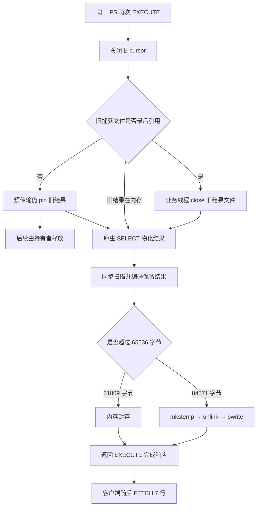

# M10 PS 换代长尾：根因与对照证据

> **2026-10-04 版本说明：历史版本记录。** 文内“当前/尚未完成/通过”和源码路径均属于记录时点；旧 PS 定义/参数/重建方案不再适用，原失败与测量不改写为新版本成绩。 现行职责见[详细设计](detailed-design.md)和[PS 删除与 cursor 关联](ps-transfer-removal-and-cursor-attach.md)，最新状态见[任务跟踪 E63/E64](task-tracker.md)。下文保留历史事实，不作为现行实施清单。

本轮已把 [E36](release-pipeline-models-2026-09-28.md) 的慢 EXECUTE 定位到具体调用链，并通过同一 Release 的单变量对照验证：**84,571 字节的保留结果超过 64 KiB 内存缓冲，每次换代都可能在业务线程创建、写入和关闭结果文件。文件系统调用的长尾直接进入 EXECUTE 响应时间。连续 TEMP 捕获及 receiver 反复完整展开 DELTA，进一步放大同机 I/O 开销。**

秒级尖峰不依赖 receiver：把完全相同的业务循环放到 DRAIN 之前，仍出现 2.205 秒的最大延迟。不能把所有长尾解释为 receiver 锁、网络 ACK 等待或候选取消。这里确认的是本机文件系统调用中的阻塞；没有采集操作系统内核/设备队列，不能指定 APFS 内部某把锁、脏页机制或硬件故障，更不能把本机毫秒数直接外推到 Linux 生产环境。

**本轮是定位，没有修改内核、重编译、提交或宣称问题已修复。**

## 1. 固定的负载和实验边界

- 同 E34–E36 Release，SHA256 `23e6212c81f2449db1bd18b89b72f2c879ba2376ea6631bfb1f0cc0e0d1e1753`；`ha_preserve_trx`，HEAD `324a8ec01101efa58977966fe4fba2aea40cca75`。82 项原二进制/源码/脚本输入在诊断前及验收后比对一致。诊断副本另行冻结，未改正式 benchmark/observer。
- 四个业务 session，每个 16 个 PS；每表 4096 行，pad 512 字节，主键和一个二级索引。查询固定返回 128 行、11 列、8 个整数参数；FETCH 7 行。每个完整循环重执行所有 PS，关闭/重建其中一个 PS，然后 UPDATE id=1。
- 三段名义 3 秒的闭环窗口，完成当前循环后才停，实际命令数随速度变化。每种对照各三轮，**不视为固定到达率压测，也不把三次 p99 平均成新 p99**。
- source、receiver、客户端及 relay 同机、同 APFS Data 卷，CPU/磁盘并非整机独占。预算、worker、超时与 E36 相同；没有新线程池、DEBUG_SYNC、DBUG、RESET DRAIN 或升主阶段。
- 原业务直接连接 source，relay 仅观察 source→receiver。所有统计业务命令与人工 ACK hold 的交集为 0；seed 的协调暂停保留，不能把本轮 DRAIN 总时长作为自然业务 SLO。
- 15 轮无栈/系统调用探针的对照，加 1 轮 native sample＋诊断 DYLD interposer，共 **16/16 有效运行、64/64 业务事务 READY、capture failures=0**。每轮检查 FETCH 值/顺序、参数表达式、源 COUNT/SUM，以及 receiver 原有 TEMP 数据/回滚与后续分配。
- 另保留一轮 Python watchdog 栈采集退出异常：业务报告成功，但客户端在报告写出后未退出（未取得足够栈证明其内部停点），主控终止该独占客户端，生命周期失败。该轮不计入 16 轮或性能表；没有据此归因内核。后续撤去 watchdog。
- 17 次尝试的独占实例均已退出，数据/socket 目录已回收，证据保留；最低采样可用空间约 8.23 GiB。沿用一次性 DRAIN 源实例的销毁方式，不是重启恢复测试。

[原始产物](../../../build-release/temp-churn-root-cause-20260928/)、[可重算分析脚本](../../../build-release/temp-churn-root-cause-20260928/analyze.py)、[完整逐轮表](../../../build-release/temp-churn-root-cause-20260928/RAW-SUMMARY.md)、[机器汇总](../../../build-release/temp-churn-root-cause-20260928/summary.json)。全部服务端错误日志检查未发现 ERROR、断言或崩溃；控制/helper 的正常退出与业务 survivor 分开。

## 2. 为什么这次又落到了文件路径

E34 的优化让 **不超过 64 KiB** 的结果留在内存，修复了旧模型的微小文件成本及历史代名额积压；并未消除所有大小结果的文件 I/O。旧模型是三列、256 字节 payload，本次是十一列、512 字节 payload，不能拿旧模型通过结论覆盖当前负载。

源码依据：

- [cursor.cc:53](../../../sql/preserve_trx_cursor.cc:53)：捕获准入检查功能开关、standby-save 模式及 Classic 协议，不要求 DRAIN 已开始。因此迁移前业务也会承担这条捕获路径。

- [sql_prepare.cc:3528](../../../sql/sql_prepare.cc:3528)：重新执行前同步 `close_cursor()`。
- [sql_cursor.cc:305](../../../sql/sql_cursor.cc:305)：原生物化后，在 cursor open/响应之前同步捕获。
- [cursor.h:123](../../../sql/preserve_trx_cursor.h:123)、[cursor.cc:110](../../../sql/preserve_trx_cursor.cc:110)：固定 64 KiB 缓冲，填满且还有数据时 flush。
- [cursor.cc:80](../../../sql/preserve_trx_cursor.cc:80)：flush 创建匿名临时文件并 pwrite；没有显式 fsync。
- [cursor.cc:387](../../../sql/preserve_trx_cursor.cc:387)：已有文件则写尾块，否则仅 hash 内存数据；[file.cc:25](../../../sql/preserve_trx_file.cc:25) 在最后一个 owner 析构时 close。
- [ps_pretransfer.cc:96](../../../sql/preserve_trx_ps_pretransfer.cc:96)：已有待发 batch 时不再采新代。该名额收敛仍有效，本轮捕获失败为 0；不能把当前长尾归回已修复的历史代无界积累。

宽结果的已发送工件全部为 **84,571 B**。只把投影改为 `LEFT(pad,256)` 后工件全部为 **51,809 B**，表中的 pad 仍为 512 B，行数、TEMP image 的 10 MiB 大小、参数个数和 FETCH 行数不变。观察窗口的 source 全局新建文件/EXECUTE 近似比值由 **1.030–1.032** 降到 **0.018–0.024**；后者包含后台 TEMP 等文件，不能称为所有服务端文件数为零。迁移前宽结果对照为约 **1.000 文件/EXECUTE**。

## 3. 三轮对照：主因与放大因素分开

| 诊断条件 | EXECUTE p99，三轮 ms | 单次最大，三轮 ms | 能说明什么 |
| --- | --- | --- | --- |
| 原宽结果＋DML＋完整迁移 | 17.260 / 25.037 / 35.852 | 1428.680 / 1454.814 / 1186.541 | 同一二进制重现长尾；不是修复后测量 |
| 只缩窄结果投影，TEMP 内容不变 | 1.654 / 1.511 / 1.706 | 273.971 / 8.869 / 256.871 | 跨过内存/文件边界后 p99 大幅下降；仍有少数长尾，不能宣称完全消除 |
| 宽结果，只去掉循环末 UPDATE | 4.169 / 4.081 / 7.885 | 868.357 / 242.247 / 1468.330 | TEMP 不再换代；前台文件换代仍有长尾 |
| 宽结果＋DML，业务期间暂停 receiver 原生准备 | 7.653 / 7.413 / 12.497 | 199.722 / 191.784 / 328.490 | receiver 准备是放大因素；传输 apply 和源端捕获继续运行 |
| 相同宽结果＋DML循环放在 DRAIN 之前 | 4.318 / 4.939 / 6.060 | 664.551 / 2204.596 / 1475.110 | 没有传输/receiver 候选工作时也可有秒级长尾 |

暂停对照是在 seed 已准备好之后设置既有 `prewarm_paused`，暂停通用 receiver prewarm worker 取新任务（含 TEMP 与 PS 预检），业务结束后恢复，并继续验证最终 READY；不暂停业务 ACK。设置为 ON 不会中断正在执行的单个 step，回收也不完全受该开关约束，所以不能表述为整个窗口绝对零 receiver I/O，更不是建议生产停用提前准备。

无 DML 三轮 image DELTA 完整装配均为 0，native_failed 均为 0，四个 owner 的 TEMP final 均接管，DRAIN 返回到 READY 观测尾为 **50.649–59.333 ms**。原宽结果＋DML 三轮 image 装配 **51/51/56 次**，native_failed **48/30/43 次**，final 仅接管 **1/1/0 个**，对应 READY 观测尾 **285.340/459.701/1466.849 ms**。这是聚合对照，不代表逐个失败都已证明是取消。

缩窄投影也减少了编码和 PS 传输字节，闭环中执行次数增加；因此不把 p99 差值全分摊给某一个 syscall。文件数、源码、栈和下一节逐次系统调用时长共同定位了文件路径。

## 4. 秒级尖峰的直接证据

有效探针轮 `io-wide-ps16-r1` 使用相同宽结果负载；只有独占 mysqld 加载诊断库，产品二进制未改。探针记录耗时超过 5 ms 的 close、mkstemp、unlink、pwrite、write、fsync，以及 OS thread id 和文件路径。单次耗时使用原生 monotonic，包含调用期间的等待或调度延迟；跨进程对齐使用 wall-clock 锚点，未直接相减两个 Python 进程的 monotonic 基点。探针和 sample 本身有开销，该轮不混入无探针 p99 对照。

- 四条并发 EXECUTE 在相对报告时间原点约 **8.244–9.692 秒**区间耗时 **1444.242–1448.223 ms**。
- 同时四个业务 OS 线程的结果文件操作：一次 mkstemp **1441.481 ms**，三次 close **1440.801 / 1441.797 / 1441.372 ms**。四个文件调用与四个慢命令的时间窗几乎重合；按该波次四线程累计时长，文件调用占四命令累计时长的 99.60%。
- receiver 同期私有 TEMP 文件 close **1452.811 ms**、pwrite **1430.758 ms**；两端 InnoDB ibtmp1 写入也在该窗口内延迟。
- 另一个约 **5.259–6.281 秒**的 EXECUTE 慢窗口，同期 cursor close/mkstemp 为 **1020.253–1020.619 ms**。

日志没有记录 session id→OS thread id 的一一映射，故上述证据按**四个同时执行的业务线程和共同时间窗**呈现，不编造逐 owner 的单调用耗时占比。约 1.44 秒在调用时间上已被文件操作解释，不能再将该尖峰主要归到 Python 忙循环、代理网络或 PREPARE 元数据锁。

有效轮 native sample 的四个业务线程共 **2604** 个样本，其中 close **802**、mkstemp **459**、pwrite **25**、unlink **29**，互斥合计 **1315/2604=50.5%**。mkstemp 内的 openat/fstatat 不重复相加；未混入六个 pipeline worker。仅以 EXECUTE 栈的 1466 个样本为分母，其中 1300 个（88.68%）位于上述文件操作；另外 15 个 close 属于显式 CLOSE。这是包括等待的线程驻留采样比例，不是 CPU 百分比，也不是所有命令或历史 E36 的 p99 分账。

[源端慢调用](../../../build-release/temp-churn-root-cause-20260928/io-wide-ps16-r1/source-slow-io.tsv)、[receiver 慢调用](../../../build-release/temp-churn-root-cause-20260928/io-wide-ps16-r1/receiver-slow-io.tsv)、[源端栈](../../../build-release/temp-churn-root-cause-20260928/io-wide-ps16-r1/source-sample.txt)、[业务时间线](../../../build-release/temp-churn-root-cause-20260928/io-wide-ps16-r1/report.json)、[五个慢波次对齐结果](../../../build-release/temp-churn-root-cause-20260928/io-waves.json)、[诊断探针源码](../../../build-release/temp-churn-root-cause-20260928/slow_io.c)。

## 5. 小 DELTA 为什么仍让 receiver 很忙

1. [temp_import.cc:129](../../../sql/preserve_trx_temp_import.cc:129) 对新候选创建新的 delta reader；[temp_delta.cc:390](../../../sql/preserve_trx_temp_delta.cc:390) 从 BASE/PATCH 逐块读、写满整个 `target_size`，再核对完整 hash。网络增量没有变成 receiver 本地同等比例的增量工作。
2. `previous` 原生资源复用在 source import 完成后才判断，[temp_receiver.cc:341](../../../sql/preserve_trx_temp_receiver.cc:341)。因此目标 ID/资源跨代复用并不能跳过上面的完整展开；后续还扫描/转换 DATA 页，识别相同页后才省掉部分目标写。
3. [receiver_candidates.cc:272](../../../sql/preserve_trx_receiver_candidates.cc:272) 只有旧候选已经 ready、未工作且可复用时才保留 previous。新代不断到来时可使未完成工作失效；清理走已有回收机制，释放文件仍有真实 I/O 成本，不能理解为异步就免费。
4. 栈中确实出现 `receiver_prewarm_worker_main → step_temp → prepare_step → delta_reader → write`，以及取消路径的 close。没有证据支持“receiver 全局 mutex 长时间包住整段转换”这一归因。
5. **节流/阶段指标还漏计了一类真实写入。** delta reader 只上报 read/scanned，`Output::write()` 写满派生文件，但 `source_import` 分支未把它加入 `temp_receiver_work::written_bytes`。最终 [step_temp:338](../../../sql/preserve_trx_receiver_candidates.cc:338) 和 [OBJECT prewarm:18821](../../../sql/preserve_trx_transfer.cc:18821) 的节流只看到这部分读取，未看到同规模派生写。磁盘 lease 的 `settle_writes()` 存在，**这是 IO 节流/观测口径缺口，不是磁盘额度漏记**。尚未用修改节流的实验单独量化其性能份额。

E36 六轮无业务 ACK 暂停的业务时窗，共收到 702 个 TEMP manifest、708 个 image DELTA、715 个 undo DELTA；TEMP chunk payload 合计 **43.913 MiB**。若每份 DELTA 完整展开一次，其 `target_size` 合计 **7.119 GiB**。这只是潜在展开规模，不能写成实际磁盘写量或全部工作的严格上界：候选可能未执行/中途取消，undo 也可能在不同消费者中再次展开。

更直接的已完成工作证据：E36 六轮 `seed → change_window_3` receiver image assembled 增量为 **46/47/45/33/13/30**，共 **214 次 × 10 MiB = 2.09 GiB** 的完整派生 image 输出逻辑字节，尚未包含未完成展开、undo、目标页写或文件系统的额外成本。这里不是设备实写量，计数窗口与逐包业务窗口边缘也略有不同。

纯 PS generation 不直接推进用户 TEMP mutation/history。内部结果表被排除在用户 TEMP journal 之外；无 DML 对照确实停止了 TEMP image DELTA 装配。不能为了修复该问题错误地让 PREPARE/FETCH/CLOSE 去修改用户 TEMP generation。

## 6. 与 final/READY 的关系，以及排除项

source `final_reused` 只证明 DATA sidecar 接管，**不证明 undo 接管、wire DELTA 精确复用或 receiver 原生候选命中**。final 尾页更新后旧 checkpoint 的名字/大小/SHA 不再全匹配，会选择 full；独立 undo 也有自己的历史/anchor 检查。receiver `take_temp()` 比较完整 manifest payload，匹配才接管；不匹配要重建。参见 [source final](../../../sql/preserve_trx_temp_table.cc:3672)、[checkpoint select](../../../sql/preserve_trx_temp_pretransfer.cc:153)、[receiver final](../../../sql/preserve_trx_receiver_candidates.cc:360)。

E36 的最后 PS 结果均已复用，而每轮 TEMP final 仅接管 0–1/4；其最终处理量主要来自 TEMP。无 DML 对照 4/4 接管与 READY 尾下降支持“持续 TEMP 变化难以收敛”的判断。没有保存旧 E36 每份 manifest 原文及源安装时刻，不能逐 token 断言哪个最后 UPDATE 导致哪一个 SHA/undo 检查失败。这个逐候选原因细分不影响已经直接定位的业务 EXECUTE 文件长尾，但不能被聚合计数替代。

本轮不支持以下主因说法：

- 人工 ACK 暂停：有效业务命令与 hold 零重叠；迁移前也可出现长尾。
- capture 份数/字节额度耗尽：16 轮捕获失败为 0；未提高结果份数或内存预算。
- 每次 EXECUTE 都重新 PREPARE、MDL/DD 竞争：本轮窗口内自动 reprepare 为 0，调用栈及秒级计时定位到文件操作。不能泛化成所有负载都无锁竞争。
- SHA 算法独占 CPU、客户端 Python 忙循环：直接 syscall 时长和跨进程同步停顿解释了主要尖峰。正常扫描、编码及调度成本仍存在。
- cursor 每代 fsync：cursor 捕获路径没有显式 fsync；其他后台路径存在 fsync，应分别看调用链。
- statvfs/global resource mutex 是此次主因：存在相关源码风险，但有效采样未支持它主导本轮长尾。不可凭全局锁的存在就改锁结构。

## 7. 根据根因收敛修复方向

下一步修复应先切断业务响应对高频小文件生命周期的依赖，再处理后台放大；不是增加 worker 或无限提高容量。

1. **优先：有额度约束的中小结果内存承载。** 当前 64 个活结果的 84,571 B 逻辑内容合计约 5.16 MiB。应评估按需增长且完整计费的内存表示，使稍超 64 KiB 的结果不立即每代落盘；不能只为本用例硬调一个更大的固定缓冲，把总体内存峰值隐藏掉。大结果继续有界 spill，文件/字节/份数限制保持。
2. **文件路径的生命周期要可控。** 对必须落盘的结果，评估文件复用或利用已有回收执行机制移走最后 close；保护正在预传输/恢复的不可变代和最后引用，不引入额外线程池、无界 FD 队列或提前释放。仅优化 pwrite 次数不能解决已观察到的 close/mkstemp 秒级停顿。
3. **receiver 让增量收益落到本地工作。** 优先减少每个候选的完整 BASE＋DELTA 派生文件和重复扫描；完整摘要/依赖认证不能省。累积 patch 相对固定 BASE，不能直接把新 patch 覆盖在旧 patch 结果上而忽略“旧代改过、新代已回到 BASE”的页。继续使用现有 worker，并合并待处理旧代、复用已完成基线，避免不停取消后重做。
4. **补齐同一执行路径的读/写计量与有界 step 节流。** 派生文件写入必须可见；分别记录替换取消、输入不匹配、真实 step 错误，避免把 native_failed 当作根因标签。
5. 修复验收保持本轮原宽结果＋DML、原预算和业务时序，必须同时覆盖内存边界两侧、更大结果、连续换代、final READY，以及既有 F03/F05/F06；不能以缩窄 SELECT、停 DML、暂停 receiver 或仅通过功能测试宣布修复。真实物理升主/RESUME/proxy 性能仍在外部工程验收，不新增外部阶段。

## 后续状态

本报告保留E37定位时点的原证据和未修复状态。随后按该根因完成的C++改动与新旧对照见[E38修复报告](ps-churn-fix-2026-09-28.md)；不要将此处旧指标当作修复后数据。
