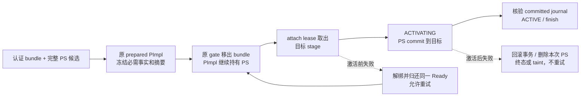

# PS 资源接入正式 prepared 所有权

> **2026-10-04 版本说明：已撤下的 PS 接线方案。** 旧 PS 描述符、factory、参数及重建接口已删除；当前只继承结果文件、既有 worker、认证和所有权原则，实际接口为 result_*。 现行职责见[详细设计](detailed-design.md)和[PS 删除与 cursor 关联](ps-transfer-removal-and-cursor-attach.md)，最新状态见[任务跟踪 E63/E64](task-tracker.md)。下文保留历史事实，不作为现行实施清单。

2026-09-22。继续既有详细设计，不改变完整特性范围，不提交。

现有 `Preparation/Ready/Attach` 已实现独立候选，但正式 prepared registry
只验证 lock/binlog。必须先建立以下不变量，再打开源端准入：

1. semantic bundle 冻结 PS 是否必需及认证 manifest 摘要；目标候选必须匹配
   token/摘要，且通过完整解码验证。registry key 继续绑定 epoch/代次/启动身份。
2. 发布 prewarmed/READY 必须完整持有 PS 候选。升主移出 semantic bundle 时，
   PS 必需事实仍留在同一个 PImpl 中。
3. attach lease 唯一取走/归还候选。ACTIVATING 前必须已取走；退回可重试态前
   必须完整归还；ACTIVE 前必须已 commit 到目标 THD。不能凭候选指针为空判断成功。
4. 锁内仅转移所有权、检查身份；候选 PS/参数/文件的析构在 entry 锁外完成。
5. SQL RESUME 将 PS stage/commit/finish 接入既有 journal；激活前失败归还，
   激活后失败删除本次导入的 PS，目标既有 PS 不受影响。

执行顺序：

- [x] MTR/Classic E2E 先证明旧 registry 可错误发布缺少 PS 的资源。
- [x] PImpl、attach lease、状态 guard 及锁外资源收尾；验证缺失/错配、重试与取消。
- [ ] SQL RESUME 原有准备/激活/失败路径接 PS journal：源码接点已加入，含 PS
  的真实 SQL 分支运行验证待正式 source/receiver 接通，不能以内部 probe 代替。
- [ ] 正式 source/receiver 对象传输与独立 sealed owner、联合 READY；之后打开支持范围。

2026-09-22 后续进展：source 捕获/共享 owner、deferred 对象 stage/finalize 和
receiver sealed-file 校验/解码部件已加入，见 [PS 传输接入记录](ps-transfer-integration.md)。
正式 receiver worker、联合 READY 及准入仍未完成，因此上项保持未勾选。

PS 大结果复用 sealed_file 的有界 `read_at`，不得走现有将整 blob 读入 string
的 warm blob 分支。最终 transport 集合含全部已声明对象，PS manifest 只列有效
代次；二者不可混为一份。源 owner 必须随 COMMIT_UNKNOWN 的原 quarantine 寿命
保留，不能仅挂在较早销毁的 deferred candidate 上。

测试采用 MTR/Python，不新增 UT/DEBUG_SYNC。内部 registry probe 仅证明真实
状态机和所有权，不替代正式 transfer、物理升主或 SQL RESUME 验收。

MTR `ps_backend_restore_registry` 通过 Classic Python 驱动内部桥，实际运行
prepared registry 公共接口，覆盖缺 PS 拒绝、错误清单/额外候选拒绝、移出 bundle
后必需事实保留、错误 bundle 归还拒绝、未取走就激活拒绝、未归还就重试拒绝、
错误 Ready 归还拒绝、目标 ID 冲突后重试、未 commit PS 就 ACTIVE 拒绝、ACTIVE
后立即清 registry 仍可继续 FETCH，以及 PS commit 后失败清理、原编号变为未知。
另验证 READY 到期时释放仍持有候选的 PImpl、同一源游标随后可再次捕获，以及
激活后失败保留目标既有 `SELECT 88` PS 的编号和执行结果。到期 probe 只有核验
NOT_READY 和资源已移出后才返回专属 1317；其他 probe 失败为 1815，不混作成功。
背景含持久表 INSERT/UPDATE/DELETE/ROLLBACK 和最终数据断言。

源码接点在 `preserve_trx.cc` 的 shared prepare 和 strict resume runtime；不新增
外部升主调用。真正的 `engine_recovery=NONE` 资源会话、原生引擎激活/Undo 收尾
失败下的含 PS SQL RESUME 尚未被此 probe 执行，不能据此关闭完整验收条目。

证据目录：`build-debug/temp-preserve-implementation/2026-09-22/ps-registry/`。

| 验证 | 结果 / 证据 |
| --- | --- |
| 原 registry 缺候选仍发布 | `mtr-red.log`，1815 `registry accepted incomplete PS resources`，退出 1 |
| 最终内核及补充 probe 构建 | `build-final.log`、`build-coverage.log`，均退出 0 |
| cursor/PS 与共享 RESUME 回归 | `mtr-final.log`，26 个业务 + 1 个源码合同 lint + shutdown_report 通过，1 个既有 no-bin 用例因配置跳过，退出 0 |
| 到期/目标既有 PS 加强验证、补跑 no-bin | `mtr-coverage.log`，2 个业务 + shutdown_report 通过，无跳过，退出 0 |

合计 27 个不同业务用例通过，源码合同 lint 单列，不计为运行行为证据。组合命令
以日志首行的完整命令为准；补跑使用 `--mysqld=--skip-log-bin`。no-bin 回滚用例
仅回归共享恢复路径的既有行为，不增加本特性的 local-startup 支持或验收范围。
没有运行完整 Preserve/Resume、Release 并发或外部物理备机验收。

后续真实接线落点（须继续按当前源码核实）：

- source：`preserve_trx_kernel_preserve_attached_transaction()` 的 metadata/bundle
  构造，以及 deferred candidate external-object stage/finalize。捕获 owner 必须
  随原 batch item 进入 COMMIT_UNKNOWN quarantine；计入真实保留字节。
- transport：复用 declare/write/seal 和有界 sealed_file 读取；专属资源对象与
  binlog external blob 分开，避免整结果读入 string。旧代次仍完成原 transport
  义务，最终 PS 清单只引用有效代次。
- receiver：在原对象/任务池中分批完成 Preparation，安装 semantic bundle 后
  调 `install_ps_ready()`，再发布 prewarmed；不能新增一套 registry。
- adopt：仅原 strict physical gate lease 验证 PS 所有权后允许带 PS 的记录；
  不放宽本地恢复，也不让只传 thread IDs 的旧 session-only 路径丢掉资源。
