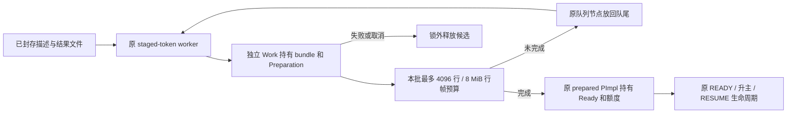
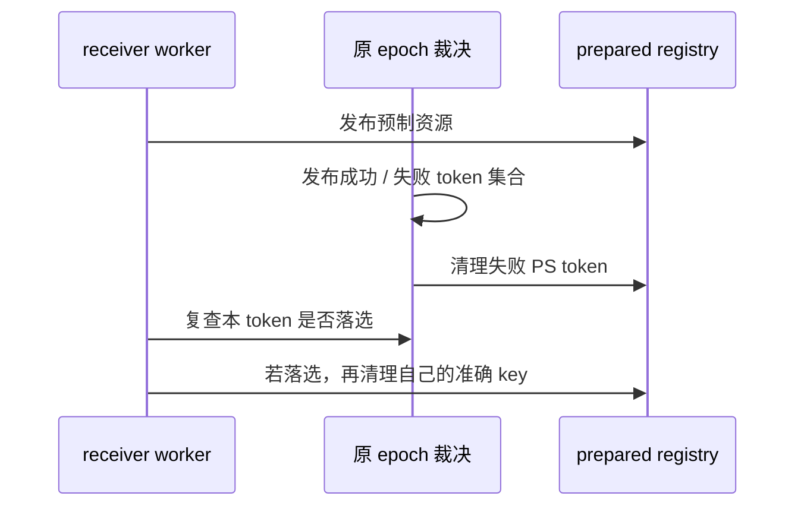

# PS receiver 分批预备接入记录

> **2026-10-04 版本说明：已撤下的 PS 接线方案。** 旧 PS 描述符、factory、参数及重建接口已删除；当前只继承结果文件、既有 worker、认证和所有权原则，实际接口为 result_*。 现行职责见[详细设计](detailed-design.md)和[PS 删除与 cursor 关联](ps-transfer-removal-and-cursor-attach.md)，最新状态见[任务跟踪 E63/E64](task-tracker.md)。下文保留历史事实，不作为现行实施清单。

日期：2026-09-22。本片把已有 PS/结果预制接进 receiver 原预热 worker 池，把结果
校验、PS 对象和游标 sender 构造留在 READY 前。没有新增升主阶段，没有新增或修改
RESET DRAIN 逻辑。尚不等于完整物理升主、SQL RESUME 或性能验收。

核心实现现集中在 `sql/preserve_trx_receiver_prepare.cc/.h`（2026-09-23 从
`preserve_trx_ps_receiver` 更名并统一普通 token 的 bundle 所有权）。队列唯一拥有 Work，跨批复用
bundle、decoder 和准备状态；不重复加载描述或构造已完成的 PS，不保留 worker THD。
执行批次前清理内部 worker 的旧错误。预算不是毫秒级硬期限：单行解码、单个 PS
的元数据构造仍有自身成本，极宽行及很多参数必须另做性能验证。

沿用原池的 worker 数、epoch 并发与 I/O 限速。正常 PS 续批不消耗“未就绪重试”
次数；使用 list splice 复用节点并保留 inflight。一次 PS 续批后，整个池的下一次
可用调度优先给可运行对象任务机会，避免线程局部偏好在跨线程抢占时失效。
这不是完整公平性或 p99 的测量结论。

结果行帧扫描量按批节流，staged 元数据只在首次读取时计量。该字节数不是物理
磁盘读量：文件头、稀疏索引、seek 和页缓存另有成本。全局 staged active/max-active
及时间描述实际工作，不表示唯一 token 数。

bundle 按实际保留容量计账，包含 metadata、TLV、descriptor 和外部 blob；不长期
持有 codec 的六份瞬时副本峰值。移交前释放 blob/binlog 缓冲后缩减额度，再从
Work 移入原 resources PImpl；PS、decoder、文件的已有独立
lease 继续移交。取消队列、registry 退场和进程收尾把候选移到 pool 锁外析构。
active 计数在 worker 查询、finish/requeue 和让出执行期间保护 registry；移交后
不再读取旧 job。

两侧清理覆盖超时分类与晚发布的不同先后顺序，复用 `purge_token()`，核验完整
身份和 generation，保留成功子集。selection 先可见，再回收失败资源，不等待
worker 完成全量预备。清理不扫描结果行，但随 PS、field、FD 和同 token 其他资源
数量增长，不能称严格常量耗时。单 token 删除保活 entry，避免 map 删除唯一引用
时销毁仍被锁住的 mutex；资源在锁外释放。与 RESET DRAIN 无新增接线。

source strict 和 adopt 仍拒绝含 PS 的正式 token；receiver PS 检查改为受
result-capture 开关控制，且仍须通过原 strict 事务/物理证据检查。source handoff
没有提前打开。源失败保留 record 的文件 owner 已补入，见 [传输记录](ps-transfer-integration.md)。尚需跨进程依赖有效性、连续预传
和代次选择、NONE 资源会话及真实 SQL RESUME 联合验证。用户临时表的稳定目标
ID、undo/LOB、在线导入也仍是剩余工作。

内部 `ps_backend_restore_receiver` MTR 用 Classic Python 驱动真实原 worker 池：
32768 行背景表、两个部分 FETCH 游标和一个未执行 PS，跨超过三次重试上限的正常
批次完成准备；源后端退出后按原编号接续，核对位置、顺序、EOF。另覆盖首批后取消、
内存回基线及再次导出。新增用例没有 DEBUG_SYNC 或 UT。桥接测试不代表真实网络
调度、物理 promotion、SQL RESUME 或时延验收。

证据目录：`build-debug/temp-preserve-implementation/2026-09-22/ps-receiver/`。
`mtr-red2.log` 有效复现旧桥没有 receiver 调度；`mtr-green.log`、
`mtr-cancel-green.log` 退出 0。`mtr-red.log` 是主键冲突，不计功能 RED。
取消首轮 RED 确认旧桥未取消；期望错误码随后纠正为已有内部错误 1815。
最终构建和定向回归结果见实施记录；未运行物理备机工程验收，未提交。
