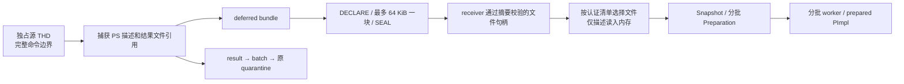

# PS 结果传输与文件所有权接入记录

> **2026-10-04 版本说明：已撤下的 PS 接线方案。** 旧 PS 描述符、factory、参数及重建接口已删除；当前只继承结果文件、既有 worker、认证和所有权原则，实际接口为 result_*。 现行职责见[详细设计](detailed-design.md)和[PS 删除与 cursor 关联](ps-transfer-removal-and-cursor-attach.md)，最新状态见[任务跟踪 E63/E64](task-tracker.md)。下文保留历史事实，不作为现行实施清单。

2026-09-22，当前工作树，未提交。本文记录实现进展，不替代详细设计的完整交付范围。

## 已实现的传输部件

新增 `sql/preserve_trx_ps_transfer.cc/.h`，集中处理源捕获、对象清单、流式发送和
receiver 文件解码。通用 transfer 文件只增加类型、编排和封存接点。

- 增加 `PS_DESCRIPTOR=5`、`PS_RESULT=6`，保持现有帧布局。旧 receiver 对新类型
  仍会拒绝，不存在忽略结果后成功接管的兼容回退。
- 结果使用原 source session 的 declare/write/seal。额外读取缓冲最多 64 KiB，
  取得内存 lease；不把整份结果转换为字符串或加入 final metadata 帧队列。
  描述最后发送；本轮还没有 Phase 1 多代结果预传。
- deferred stage 先封存 PS 对象，finalize 核实同名、同大小和摘要的 presealed
  状态。最终 portable manifest 只追加描述符，保持 snapshot 为首对象，
  resurrection index 继续绑定正确 snapshot 摘要。
- receiver 的描述和结果都必须在 SEAL 留下校验过的文件句柄。load 校验对象种类、
  派生名称、大小、摘要、已封存状态，再按 manifest 的原 ID 顺序构造 decoder 输入。
  结果不重新按路径打开；staging unlink 后引用仍有效。
- 当前 final-wire 校验要求 PS 对象集合与资源 manifest **完全一致**：缺失、重复、
  额外对象及空 manifest 搭配结果均拒绝。详细设计中的多代累计对象集合仍待实现，
  必须先有历史 owner 和显式最终选择契约，不能把任意未引用结果默认当作旧代次。
- 完整封存后的重复 stage 跳过发送。部分 chunk 成功后失败仍交给现有 execution
  失败处理，不宣称支持从 offset 0 重放或新实现了断点续传；ACK_UNCERTAIN 原样上返。

## 源端寿命和现有准入

`source_ps_wire` 是进程内共享 owner，不写入 snapshot。bundle 与 preserve result
持有同一对象；正常 collect 和 token-local 失败分支都移交给 batch item，再沿原有
COMMIT_UNKNOWN/quarantine 容器移动。它不借用 `source_rollback_image`，避免改变
该字段代表的 binlog 回退条件。quarantine 统计累加描述和文件留存字节，并饱和处理
溢出；文件大小不再次算作 RAM，原 wire/capture lease 随最后一个引用释放。

后续已让 `Preserved_trx_record` 持有同一个 owner：正常登记、取出后重新登记，以及
失败后无法重新附着原 THD 而保留事务的分支均延续文件寿命。同 token 的补登记只在
原记录尚无 owner、事务指针和 PS manifest 完全相同时补入；不会覆盖已有 owner。
降为纯诊断记录时清除引用，避免已无事务所有者的诊断条目长期占用结果文件。
这不增加磁盘恢复承诺或 RESET DRAIN 行为。

源 kernel 已有受 result-capture/standby 配置保护的捕获接点，无 PS 和 OFF 分支不
捕获。**source strict 和 adopt 对含 PS 的正式 token 仍保持拒绝。** receiver 的后续
接入见 [PS receiver 记录](ps-receiver-integration.md)；其 PS 检查改为开关控制，
仍校验原 strict 证据。
review 发现，仅保留后两处拒绝不足以保护未完成链路：普通已 PREPARE、未开游标的
会话也能产生 PS manifest，而 COMMITTED_NOT_READY 可以先于 receiver 准备失败。
所以本轮同步补齐 source strict 检查，在发送候选前按既有失败路径恢复。

## 验证范围

`ps_backend_restore_transfer` 通过 Classic Python 驱动内部桥。桥实际调用 source
session 的帧编解码、receiver registry 和 staging 文件接口；它不调用完整网络
receiver 调度，也不运行真实 DRAIN/升主/SQL RESUME，不能作为物理 HA 验收。

背景数据包含 8192 行的 INSERT、UPDATE/DELETE/ROLLBACK；同时保存两个已部分 FETCH
的游标和一个未执行的 PS。断言包括：块上限、重复范围比较、完整封存后不重发、
清单重复时保留同一 FD、缺 FD/错摘要/额外结果拒绝；删除 staging 并清空 registry
owner 后从剩余接收引用构造候选；源后端退出后目标按原 ID 返回剩余 8092 行和
190 行，EOF 正确，关闭后 Preserve 内存回到基线，背景数据不变。

证据目录：`build-debug/temp-preserve-implementation/2026-09-22/ps-transfer/`。

- `mtr-red.log`：旧协议拒绝新 PS 类型，预期失败，退出 1。
- `mtr-green.log`：初次传输/文件寿命桥通过，1 个业务及 shutdown_report，退出 0。
- `mtr-validation-red.log`：review 新增断言复现未引用结果被接受，退出 1。
- `build-final.log`：mysqld 编译退出 0。
- `mtr-final.log`：31 个业务用例及 shutdown_report 通过，退出 0，无跳过。
  覆盖 PS/结果恢复、OFF/local 隔离以及 4 个既有 transfer 行为用例；不是全量回归。

## 接下来必须闭合

1. 后续切片已接入正式 receiver worker 的跨批次 `Preparation` 和原 prepared PImpl；
   见 [接入记录](ps-receiver-integration.md)，真实全链路及并发性能仍待验收。
   cancellation、expiry、FD/磁盘寿命额度随候选一起移交，不能仅依赖已清空的 receiver
   record 计量。正式 worker 必须先通过既有 strict token 校验，再传同一认证 bundle
   的 token 给 loader；当前 standby 明确要求它等于数字 transfer token 的十进制串。
   内部 probe 的组件身份不代表可以放宽正式链路关系。
2. Phase 1 的结果 generation 预传和预检、源累计 owner/最终选择、位置最后绑定；
   final-only 分块传输不代表 drain 尾部性能已经达标。
3. 源保留 record 已接手 PS owner，覆盖不进入正常 COMPLETE batch 的保留分支；
   内部 record API 测试验证寿命、重新登记、错误 manifest 拒绝和诊断释放。
   含 PS 的真实 InnoDB 回退失败链仍须在正式准入打通后验证。
4. 跨进程依赖有效性、NONE 资源会话、真实 SQL RESUME 含 PS 的成功和失败分支。
   用户表在线导入、稳定目标 ID、undo/LOB 和持续增量仍属于完整目标，未因本记录缩减。
