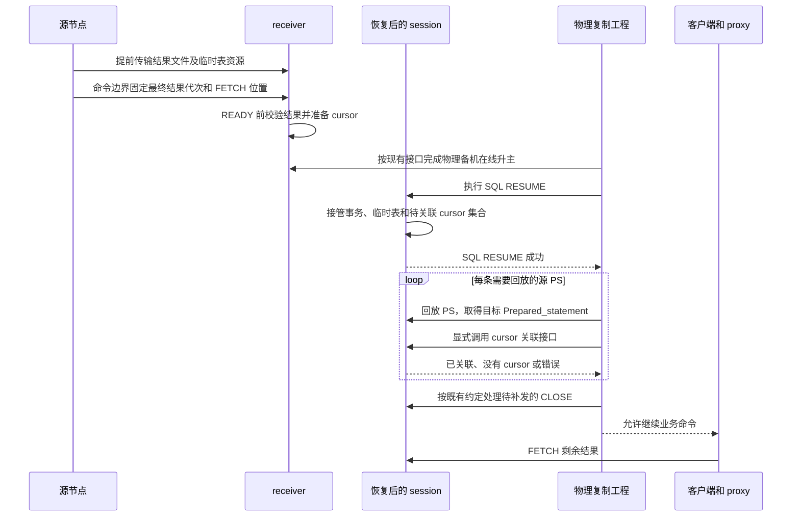
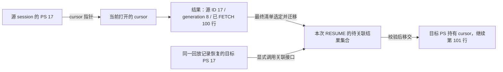
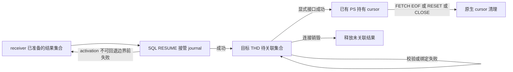

# PS transfer 删除与回放后 cursor 关联设计

日期：2026-10-04。源码核查基线：`ha_preserve_trx`，`e6715a345881`。

本文明确两项工作：**删除本特性对 PS 本体新增的状态维护、迁移和重建逻辑；提供一个显式接口，由物理复制工程在 PS 回放完成后，将源端对应的 cursor 关联到已有目标 PS。** PS 侧只保留 cursor 关联及生命周期所需的薄接点，MySQL 原生 PS 功能保持。本文同时记录实施约束和当前实现。上述删除与显式接口已在工作区实施，本轮发现的回归失败均已修复并复测；尚未提交，不代表外部物理复制集成和性能验收完成。

## 1 已确认的分工

物理复制工程已有 session 上下文转移和 PS 回放能力。用户明确的顺序是：**SQL RESUME 成功后立即回放 PS，再调用 cursor 关联接口。** 本工程不要求 PS 在 SQL RESUME 前存在，也不把 PS 回放改成临时表恢复的前置步骤。

| 内容 | 责任方 |
| --- | --- |
| PS 定义回放、目标 PS 对象建立、源 PS 与目标 PS 的对应关系 | 物理复制工程 |
| 原 statement ID、PS 参数及相关运行状态、会话上下文的恢复 | 物理复制工程负责衔接；本工程不重复建立迁移链路或另列参数迁移限制 |
| 用户临时表的数据、undo、目标资源提前准备及 RESUME 接管 | 本工程既有临时表 Preserve/Resume 能力 |
| 已产生且仍保留在服务端、等待后续 FETCH 的结果 | 本工程独立的 cursor 结果迁移能力 |
| 将这些结果关联到回放完成的目标 PS | 本工程提供接口，物理复制工程逐条显式调用 |

“已有 PS 回放能力”是用户确认的工程前提；其外部源码当前不可访问，本文不宣称已经逐字段核验其实现。集成验证应使用真实回放流程，不在本工程重建另一套 PS 回放系统。

适用范围仍是 standby transfer、物理备机在线升主和 SQL RESUME。客户端与 proxy 的前端连接保持，客户端无需重新 PREPARE 或重新执行 SELECT。local startup、新 RESET DRAIN 行为、X Protocol 和打开中的 HANDLER 不纳入本次工作。

## 2 端到端顺序



源端仍在完整命令边界 Preserve，未完成命令按既有等待及超时规则处理。源端最终清单决定哪些 cursor 存活、属于哪一代，以及下一行在哪里；提前传输的旧结果不能自行进入最终恢复集合。

receiver READY 前完成结果文件校验、解码器、sender 和最终位置准备。SQL RESUME 只把待关联集合的所有权交给目标 session，不创建 PS，也不等待 PS 回放。关联接口随后接管已准备的单个 cursor，不重新查询数据或执行原 SELECT。

内部恢复用的 PS 回放与新的业务 PREPARE 分开对待。既有 CLOSE 补发必须在相关 PS 回放、关联后，并在新的业务命令放行前完成；关闭记录仍按源逻辑会话及 PS 生命周期消费。

## 3 删除范围及必须保留的内容

### 3.1 删除本特性对 PS 本体新增的全部处理

删除范围覆盖源端状态维护、传输、目标准备和恢复后重建，不止关闭 transfer 入口。无论 PS 是否带 cursor，其定义、参数和重建材料都由外部回放能力负责；本工程仅保留该 cursor 自身的资源和归属信息。

| 删除项 | 收敛后的行为 |
| --- | --- |
| PS 定义、类型、参数运行态、历史解析上下文的捕获和恢复 | 不再生成任何 PS 本体迁移材料，包括带 cursor 的 PS |
| 普通 PS Phase1 捕获请求、源对象证明、跨批扫描及源 wire 复用 | 不再扫描或跟踪全部普通 PS 来完成预传输 |
| PS 定义与运行态的编码、BASE/DELTA、描述符批量发送和准备进度协议 | 传输仅保留结果资源所需内容；不保留失去消费者的协议分支 |
| receiver PS factory、参数安装、compact/deferred PS 及后续重建 | 不在 receiver 创建另一套目标 PS 对象 |
| 为 PS 恢复增加的依赖证明、元数据监听及 SP 历史输入迁移 | 连同只为这些能力服务的辅助链路递归删除 |
| SQL RESUME 中插入 PS map、增加 PS quota、更新 PS 编号和替换 PS 缓存 | RESUME 只接管待关联结果，目标 PS 由回放流程建立 |
| 仅服务上述逻辑的原生路径钩子、字段、开关、指标、Debug helper 和测试 | 无调用者的代码直接删除，不保留永远关闭的兼容空壳 |

同步清理 CMake 引用和头文件依赖。原生 MySQL 的 PREPARE、EXECUTE、FETCH、RESET、CLOSE、参数解析及生命周期保持；删除的是 Preserve 专属的重复迁移处理。

完整命令边界、无响应命令保护和既有 CLOSE 补发规则继续有效。这些通用 drain 和协议约束与 PS 参数迁移分开处理。

### 3.2 保留独立 cursor 结果迁移

每个最终存活结果至少保留：

- 源 statement ID、结果 generation，以及所属本次恢复资源集合的身份。
- 结果文件、文件大小和摘要、列元数据及结果顺序。
- `fetch_count`、`fetch_limit`、open 状态和原生 EOF 语义。
- receiver 已准备的 decoder、sender、读取位置及资源额度。

`fetch_count == rows` 不代表可以直接丢弃 cursor：如果原生游标尚未返回最终 EOF，后续 FETCH 仍须返回相同的终态。

源 ID、结果代次和 FETCH 位置是**结果归属与消费状态**，不能因为删除 PS transfer 而删除。最终结果清单应独立编码这些内容，并继续由 bundle/最终元数据认证；不再依赖完整 PS 描述符。旧 PS wire 不能被新解码器默默解释为空结果；格式不兼容时应明确拒绝，避免假成功。

结果文件提前发送、分批校验、既有 receiver worker、结果候选复用和取消清理继续使用。临时表 DATA/undo 的 BASE/DELTA 不属于 PS BASE/DELTA，不能连带删除。

保留在 PS 原生路径上的接点限定为三类：

1. 从源 PS 取得其 cursor 的身份、存活状态和最终消费位置，维护结果生命周期所需的计数。
2. 外部回放 PS 后，通过显式接口把对应的保留 cursor 交给该 PS。
3. FETCH、EOF、RESET、再次 EXECUTE、CLOSE 和析构时正确使用或释放 cursor。

这些接点不维护 PS 定义副本、参数副本或源对象证明。独立结果的捕获、传输、READY 准备和失败清理仍需完整保留，不能缩成一个只挂指针的接口。

### 3.2.1 cursor 与 PS 的对应关系如何确定

**源端由 PS 直接持有 cursor 指针，迁移时把这份归属记为源 statement ID；目标端由同一条 PS 回放记录提供对应的目标对象。** 不通过 SQL 文本、参数值或回放顺序推断关联。

当前源码已存在以下链路：

1. [Prepared_statement](../../../sql/sql_prepare.h) 中有 `Server_side_cursor *cursor`。已知两个存活对象时，`ps->cursor == cursor` 判断当前关联；确认结果仍打开还须检查 `cursor != nullptr && cursor->is_open()`。读取发生在 owner 线程或既有保护下的稳定命令边界，不能拿裸指针与并发 CLOSE/RESET 竞争。
2. [Prepared_statement::execute()](../../../sql/sql_prepare.cc) 在启用结果捕获的 Classic PS 路径中，把自身 `id` 随 `mysql_open_cursor(..., &cursor, id)` 传给结果物化过程。[sql_cursor.cc](../../../sql/sql_cursor.cc) 再将该 ID 交给 `Preserve_trx_cursor_result::create()`。
3. [Preserve_trx_cursor_result](../../../sql/preserve_trx_cursor.cc) 在结果创建时保存 `m_statement_id` 和 `m_generation`，并通过结果描述符输出。源关联身份已经在结果产生时记录，不需要迁移时扫描 SQL 或读取结果行来辨认。

`cursor != nullptr && cursor->is_open()` 只证明原生游标仍打开，不代表结果已可迁移。当前 `Materialized_cursor::preserve_snapshot()` 还检查消费位置有效、保留结果存在及其描述符已封存；这些检查与最终结果完整性校验继续保留，失败不能被解释为该 PS 原本没有 cursor。



图中的目标关联已由显式接口实现。statement ID 只在所属 session 中标识 PS；源端指针不能跨进程使用。目标必须结合本次恢复资源身份查找源 ID，并使用最终清单选定的 generation 和消费位置。同一 SQL 创建的多个 PS 不能混用结果；同一 PS 再次执行产生的旧结果也不能替代最终结果。

generation 仅标识结果代次，不证明 PS 生命周期，也不能代替物理复制工程对回放记录归属的保证。接口可检查的身份和调用方必须保证的映射边界见 §4.1。删除 PS transfer 时保留上述结果身份及源端薄接点，无需保留 PS 定义、参数或解析树副本。

### 3.3 当前代码的拆分结果

| 实现位置 | 当前职责 |
| --- | --- |
| [result_manifest](../../../sql/preserve_trx_result_manifest.h) | 独立最终结果清单：源 statement ID、generation、大小、摘要、FETCH 位置。只读 view 校验输入，不复制整个解码集合。 |
| [result_transfer](../../../sql/preserve_trx_result_transfer.cc) | 在稳定命令边界捕获活 cursor，生成清单、固定文件引用、发送最终选择及验证 receiver 输入。没有结果时不扫描 PS map。 |
| [result_pretransfer](../../../sql/preserve_trx_result_pretransfer.cc) | 复用现有 TEMP worker 提前发送已封存结果，保留取消、换代和最终补齐，不发送 PS 本体。 |
| [result_restore](../../../sql/preserve_trx_result_restore.cc) | READY 前分批准备结果；RESUME journal 移交结果 owner；提供回放后的显式关联接口。 |
| [receiver_candidates](../../../sql/preserve_trx_receiver_candidates.cc) | 保留结果 decoder 和 TEMP/undo 候选准备及复用；删除 PS 描述符候选。 |
| [result_cursor](../../../sql/preserve_trx_result_cursor.cc) | 文件校验、定位、sender 创建和 FETCH；不执行 SELECT。 |
| [sql_prepare](../../../sql/sql_prepare.cc)、[sql_class](../../../sql/sql_class.h) | 仅保留结果计数、cursor 所有权、FETCH/RESET/CLOSE/再次 EXECUTE 生命周期，以及 THD 中待关联 owner。 |
| [主流程](../../../sql/preserve_trx.cc) | 普通 PS 不再作为资源参与者；事务/session-only 分流保持，SQL RESUME 接管结果而不创建 PS。 |

原 `preserve_trx_ps_*` 文件以及 `preserve_trx_sp_bindings`、`preserve_trx_sp_expression`、`preserve_trx_metadata_watch` 已删除。后者只服务原 PS 迁移依赖链，相应 SQL/SP/Item/parser 原生路径钩子和构建项一并删除。PS 描述符 wire kind 5、准备进度请求以及专用批次发送/查询接口不再接受或保留；独立 cursor 文件仍使用 kind 6 和 `ps_result_<id>_<generation>` 文件名，这个名字表示结果归属，不是 PS 本体工件。

通用 SHA256 已移到 [resource](../../../sql/preserve_trx_resource.cc) 的 `preserve_trx_digest()`，继续服务 TEMP 等独立消费者。Classic 测试客户端抽到 [preserve_trx_classic_client.py](../../../scripts/preserve_trx_classic_client.py)。旧 PS 专属测试删除，TEMP/cursor/CLOSE 测试改为显式回放和关联；不保留失效开关或返回恒定值的兼容接口。

普通 PS 不产生资源工件，也不依赖结果捕获开关；其会话仍可按既有规则完成 session-only 身份转移和 SQL RESUME。空结果 owner 仅证明本次成功恢复确认无 cursor，不为各条普通 PS 分配记录。

## 4 显式关联接口

公开接口位于 [preserve_trx_result_restore.h](../../../sql/preserve_trx_result_restore.h)：

```cpp
enum class Preserve_cursor_attach_status {
  ATTACHED,
  NO_CURSOR,
  ALREADY_ATTACHED,
  ERROR
};

Preserve_cursor_attach_status
preserve_trx_attach_cursor_after_ps_replay(
    THD *target_thd,
    uint32_t source_statement_id,
    Prepared_statement *target_ps);
```

物理复制工程从**同一条 PS 回放记录**取出 `source_statement_id`，把该条记录刚恢复的 `target_ps` 传给接口。调用方须保证该记录属于本次成功 RESUME 的同一逻辑会话及资源身份，不能跨会话或跨恢复轮次复用回放记录。接口只关联结果，不负责执行回放，不修改 PS 的 SQL、参数状态、ID 或 PS 数量。

### 4.1 调用前提与身份校验

调用位于成功 SQL RESUME 之后、该条 PS 回放完成之后、客户端业务放行之前，由目标 THD 的执行线程独占调用。目标 PS 已完成构造并进入该 THD 的 PS map。回放保持原 statement ID，不能依靠目标端新分配顺序推断源 ID。

token、最终清单摘要、文件和值的一致性在 receiver 准备与 RESUME stage/commit 时已经认证；首次 attach 不重新读文件或计算摘要。接口当场按以下顺序核对：

1. 目标 THD 是当前执行线程且未被 killed，存在结果 owner 且其 token 非空；不在该调用中重新证明外部回放记录的 token 或 SQL。
2. `target_ps` 属于该 THD，且是 PS map 中对应 ID 的真实存活对象；源 ID 与已恢复的原 ID 一致。
3. 用源 ID 查找**已认证最终清单**。有结果时，仅使用该条目选定的 generation、文件摘要和消费位置，不挑选其他历史候选。
4. 最终清单无该 ID 时直接返回 NO_CURSOR，不检查目标 cursor 冲突；有条目时，首次挂接要求目标无冲突活 cursor/imported cursor，结果仍由待关联 owner 持有。重复挂接按 §4.2 单独检查。
5. 连接绑定成功后才移交 cursor，并更新条目状态。

结果身份由“本次恢复资源身份、源 statement ID、最终结果 generation”共同限定。其中 generation 是结果代次，**不是 PS 生命周期编号**。

源 PS 与目标 PS 的权威对应关系由物理复制工程的回放记录提供。准备/RESUME 认证与接口检查共同核验结果身份；接口检测有效目标对象与 THD/PS map、源目标 ID 不匹配。调用方须保证传入对象仍存活，接口会解引用对象，不能安全接受悬空指针。但仅凭 ID 无法识别同 ID 下回放了错误 SQL；三参接口也未接收调用方期望的 token/generation，无法识别旧回放记录被错误用于新恢复集合且 ID 已复用的情况。这两项对应关系由调用方保证；本方案不按 SQL 文本相似度猜测映射，也不另外建立 PS 定义传输或全局对应表。

### 4.2 返回值和重复调用

| 返回值 | 含义 |
| --- | --- |
| `ATTACHED` | 对应 cursor 已成功移交给目标 PS，后续 FETCH 从保留位置继续。 |
| `NO_CURSOR` | 本次有效恢复的最终结果清单确实不包含该源 PS，属于正常情况。 |
| `ALREADY_ATTACHED` | 相同结果仍由同一存活目标 PS 持有；重复调用不改变读取位置。 |
| `ERROR` | 调用状态无效、对象/身份冲突、预期结果缺失或绑定失败；调用方不得放行业务。 |

全部移交后 pending 计数为零，但 entries 描述记录仍在，Ready::empty() 不因此变 true；非空 owner 仍阻止另一轮 RESUME，直到 THD reset/cleanup。仅原最终清单没有结果的空 owner 可替换。

成功移交后不能立即抹掉所有最终条目信息：保留已有条目中的小型移交状态，区分“原本没有结果”和“已经移交”。重复调用须检查目标 PS 当前实际持有的结果身份，不能只比较可能被分配器复用的裸指针地址。

结果已经关闭、目标 PS 已经销毁或同 ID 被重用后，旧条目不能再次附着。最终清单声明有结果但 owner/资源丢失，必须返回错误，不能降为 `NO_CURSOR`。空结果集合也应能区分“本次恢复确认无结果”和“尚未恢复/恢复上下文丢失”，复用 session 的恢复身份，不为每个普通 PS 分配条目。

## 5 所有权与失败处理



RESUME 的准备阶段仍由 journal 管理结果集合；既有 activation 不可回退边界前按现有规则归还；进入 ACTIVATING 后即使结果 journal 尚未 commit，也不能归还 lease 重试。成功后将集合移入目标 THD，调用接口时只移交一个 cursor。接管已经不可回滚的失败，继续遵循既有失败断连和资源清理规则，不将事务重新变成可重试状态。

目标 PS 由外部回放建立并由原生 PS map 拥有，本接口不获取其删除权。接口先完成校验和可能失败的小型协议缓冲准备，再移动 cursor 的所有权。失败时保持待关联结果和目标 PS，不覆盖或关闭目标原有活 cursor。

现有 [Protocol_binary::bind_preserved()](../../../sql/protocol_classic.cc) 先申请目标 packet bitmap，再修改连接指针，可作为失败原子性的基础。实现中 `bind()` 成功后才移动 cursor；失败保持双方原有所有权。

EOF 关闭 decoder/file，不保证立即销毁 PS 持有的 imported cursor/sender 小对象；它们可延续到 RESET、EXECUTE、CLOSE 或析构，额度跟随真实最后使用者。

接口在同一 THD 的独占命令边界执行。外部不得把业务命令、PS CLOSE/RESET 或另一轮关联并发放进该 session。不新增线程池、后台自动关联、FETCH 时自动补挂，或新的升主阶段。

全部回放与必要关联成功后才能继续业务；某个必要 cursor 尚未关联不能视为恢复完整。SQL RESUME 失败仍由 proxy 关闭前后端连接。回放或关联失败也必须停止业务放行并清理该恢复 session，避免使用部分恢复的会话。

## 6 性能与实现收敛要求

- 单个 PS 的 cursor 存在性或已知对象间的关联判断为 O(1)。原生 `Materialized_cursor::is_open()` 最终检查 `TABLE::file`，恢复后的 cursor 读取 open 状态；判断本身不解析 SQL、不遍历参数、不读取结果数据。复杂度不等于已测得具体耗时。
- 区分判断与枚举：当前 `preserve_trx_open_cursor_count` 是包含正在打开 cursor 的保守计数。启用特性并按生命周期维护时，在稳定命令边界可用零计数跳过枚举；非零计数不能直接提供 cursor 列表，也不保护 PS/cursor 对象的生命周期。预传和 final 在非零计数下仍需遍历 `stmt_map`，该枚举为 O(N)，N 是全部 PS 数量。没有结果时已删除普通 PS 捕获并直接退出；有结果时按现有采样/批次推进，不能把完整捕获称为 O(1)，也不能据此宣称已有大规模性能验收。
- 普通 PS 不参与本工程的 PS 捕获、编码、传输或 receiver 对象构造。没有保留结果时，使用已有 cursor 计数快速退出，不再为了普通 PS 遍历冷对象。
- 普通 PS 没有保留 cursor 时，不再因本特性产生 PS 副本、证明状态或迁移作业；不保留无人消费的后台监听、采集钩子和参数重建状态。
- 待关联集合仅记录有最终保留 cursor 的源 ID，规模随 cursor 数增长，不随全部 PS 数增长。查找复用结果集合及其现有有序/索引结构，不新建全局 PS 注册表。
- 大小随结果数据增长的校验、读取、定位和 sender 准备均在 READY 前完成。关联时不重读整份结果，不扫描全部 PS，不做 DD/MDL 依赖重建，不增加 PS 全局数量锁操作。
- 绑定允许现有协议缓冲所需的小型分配，必须保留失败路径；不宣称接口完全零分配。额度随真实最后使用者释放，不能在移交时提前退还仍存活结果的费用。
- 保留现有结果预传及分批 receiver worker。删除普通 PS 的准备等待，不能同时删掉结果 READY 条件，也不能把结果准备推迟到首次 FETCH。
- 原内存预算和性能门槛保持不变。预计可消除普通 PS 迁移成本，但代码行数减少不代表已有性能验收；外部 PS 回放耗时和 cursor 关联耗时需分别计量。

在线升主仍只通过 `preserved_trx_prepare_before_trx_sys_init_for_physical_promotion()`、`trx_lists_init_at_db_start()` 中已有 Preserve hook、`preserved_trx_adopt_ready_epoch_for_physical_promotion()`。SQL RESUME 仍从 `Sql_cmd_resume_preserved_transaction::execute()` 进入。新接口发生在成功 RESUME 之后，不改变以上升主阶段。

## 7 实施顺序与验收

实施按完整结果链进行，避免先删除 PS 编码造成 cursor 位置丢失：

1. 从旧 PS 编码抽出结果最终清单，保留身份、generation、位置和 EOF；接通现有结果发送及 receiver 准备。
2. 将 receiver Ready/RESUME 接管改为仅持有结果；成功 RESUME 后转交目标 THD。
3. 实现显式关联接口，复用现有 cursor sender/绑定能力，补齐身份、冲突、移交及重复调用检查。
4. 删除 PS 本体的状态维护、捕获、协议、factory、runtime 重建及原生钩子，并按 §3.3 递归清理辅助链路；同步清理构建、指标、配置、专属测试和文档中的旧职责。
5. 运行 MTR 和协议 E2E，核验功能、OFF 隔离、内存释放和剩余代码调用关系，再做原预算性能验收。

| 验证场景 | 必须观察到的结果 |
| --- | --- |
| 大量普通 PS，没有保留 cursor | 不产生本特性的 PS 副本、证明状态或迁移作业，不创建 receiver PS；临时表/事务原路径正常 |
| 辅助模块与原生钩子清理审核 | 删除后的生产调用链只剩结果关联及生命周期接点；不存在相互引用却没有独立用途的 PS/SP 迁移残留 |
| 多个 PS，部分有 cursor，回放顺序与源 ID 顺序不同 | 按源 ID 逐一关联正确结果，不因 SQL 相同或顺序不同串游标 |
| 多个 session 使用相同 statement ID；同一 session 的多个 PS 使用相同 SQL | 以本次恢复归属和源 ID 区分，只关联最终选定的结果，不跨 session 或按 SQL 文本配对 |
| 源端已 FETCH 前 100 行 | RESUME、PS 回放和关联后从下一行继续；源表变化不改变保留结果 |
| 空结果、正好取完最后一批但尚未收到 EOF | 后续 FETCH 保持原生终态行为 |
| Phase1 多次产生结果，源端随后 FETCH/RESET/CLOSE | 只恢复最终清单选中的存活代次，历史结果不能重新出现 |
| 目标对象所属 THD 不匹配、源目标 ID 不一致、最终清单有对应结果且目标已有活 cursor | 拒绝关联，已有 PS/cursor 和待关联资源不被破坏 |
| 结果文件/候选的代次与最终清单不一致 | 拒绝旧结果替代最终选择；不把此检查表述为识别调用方未传入的旧 token/generation |
| 同一有效关联重复调用；关闭后再次用旧记录调用 | 前者不重置位置；后者不能复活已消费/关闭的结果 |
| 一部分已关联，后续绑定失败或连接断开 | 已关联和未关联资源分别清理，额度/文件无遗留；不误删外部 PS |
| 临时表结果、内存结果、spill、大字段结果 | 沿用结果类型与内容覆盖，接口不重新执行 SELECT |
| 关联后 FETCH、RESET、再次 EXECUTE、CLOSE 及既有 CLOSE 补发 | 原生生命周期正常，未消费结果不串代、不重复附着 |
| 普通 PS 所在 session-only 会话，无事务也无 cursor | session 身份迁移及 SQL RESUME 正常，随后由外部回放 PS，接口返回 `NO_CURSOR` |
| 顶层或结果捕获功能关闭 | 原生 PS/FETCH 行为不受 Preserve 删除与接口改造影响 |

新测试不使用 DEBUG_SYNC，不新增 UT/GUnit。协议 E2E 可用本地回放模拟验证接口，但必须明确这不是外部物理复制回放验收。旧 PS factory/helper 的测试结果不能证明新接口正确；外部集成需要实际验证原 ID/PS 状态、逐条回放调用、结果对应关系和业务放行顺序。

## 8 实施后的所有权细则与验收记录

- 源端最终捕获拒绝仍有待关联 cursor 的恢复 session，避免第二次迁移漏掉尚未进入 PS map 的结果。使用 THD 原子 pending 计数判断，不由其他线程读取 owner 容器。
- 空 owner 可在符合原有目标准入条件的下一次成功 RESUME 时替换；失败保留原身份。非空 owner 不允许被另一轮 RESUME 覆盖。连接清理同时销毁已挂接 PS 的结果和未挂接集合。
- 重复挂接只有在目标仍持有同一打开的 imported cursor 时返回 `ALREADY_ATTACHED`。EOF 已关闭、RESET/CLOSE 或重新执行后再次调用旧记录返回错误，不复活旧结果。
- 新清单使用 `MPCRMF01`：12 字节头、每结果 68 字节，不含 SQL、参数、DD/SP 证明。结果排序、非零身份、唯一 ID、位置和文件身份全部校验；旧完整 PS 编码明确拒绝。
- 本地 [回放测试 helper](../../../scripts/preserve_trx_cursor_replay_test.py) 只用于 MTR，记录测试自身 PREPARE 的文本，在 RESUME 后以原 ID 顺序创建对象，再显式调用接口。生产中没有 PREPARE/FETCH 自动挂接入口。

本轮源码审查另补齐了结果描述符 scratch lease、final 首见 token 的容器计费，以及准备/journal 对象各自的额度生命周期。待发送队列使用按节点分配的 list，避免 libc++ deque 为每个小 token 保留 4 KiB 块。旧 PS probe 删除后，receiver `begin()` 的 snapshot/candidates 参数已无消费者，一并删除；`begin_results()` 不再保留恒为零的读取字节输出及不可达的 WAIT 分支。结果 decoder 候选等待和 TEMP 准备等待继续保留。结果选择仍读取已 sealed 文件的头尾验证身份，不扫描结果行；这些少量元数据读取原先也未计入上述恒零输出，不能宣称选择阶段零 IO。没有放宽额度或引入线程池。

相对本轮基线，内核目录 tracked diff 为新增 653 行、删除 11184 行，另有 8 个新结果模块文件共 1094 行，净减少 9437 行。行数只描述收敛规模，不代表功能或性能验收比例。源码、构建项及 Release 符号检查均未发现旧 `preserve_trx_ps_*` 链路残留；旧设计/性能报告保留为历史。

当前验证记录（2026-10-04，尚未提交）：

| 检查 | 已取得的证据 |
| --- | --- |
| 原版本 RED | 新游标回放场景在改造前版本最终 FETCH 返回 1421；`/private/tmp/ps-removal-red.log`。 |
| 定向 MTR | 93 个业务用例加 shutdown 全通过，包含 TEMP/JSON/LOB/生成列、EOF/RESET、CLOSE 补发、session-only、准备失败重试；`/private/tmp/ps-removal-green4.log`。 |
| 全量常规 no-bin | 581 个业务用例加 shutdown 通过，302 项按条件跳过；`/private/tmp/ps-removal-full-nobin.log`。 |
| 最终 Debug / Release 构建 | 均成功；`/private/tmp/ps-removal-debug-cleanup-build.log`、`/private/tmp/ps-removal-release-cleanup-build.log`。Release 符号包含公开关联接口，不含 Debug 的 SQL 测试入口。 |
| 全量常规 log-bin | 589 个业务用例加 shutdown 通过，289 项按条件跳过，5 条失败；`/private/tmp/ps-removal-full-bin.log`。不能将这次全量记录改写为零失败。 |
| 五条失败的 RED → GREEN | 五条均在 `--parallel=1 --retry=0` 下复现，修复后五条及无 cursor 的 DROP 对照全部通过（6 个业务用例加 shutdown）；`/private/tmp/ps-removal-failures-red.log`、`/private/tmp/ps-removal-failures-green.log`。 |
| 修复后的受影响流程回归 | log-bin、parallel=4、retry=0，99 个业务用例加 shutdown 全部通过，包含 cursor/TEMP/CLOSE/session-only 及原五条失败；`/private/tmp/ps-removal-final-related.log`。此构建早于最后一组 receiver 死参数/不可达分支清理。 |
| 最终清理构建复核 | 18 条 log-bin 业务用例通过；另 3 条要求关闭 binlog 的用例在显式 `--mysqld=--skip-log-bin` 下通过，两轮 shutdown 均通过。覆盖结果预传输、换代/取消、receiver READY、bundle 额度、回放关联和原五条失败；`/private/tmp/ps-removal-cleanup-final.log`、`/private/tmp/ps-removal-cleanup-nobin-off.log`。首次未显式关闭 binlog 的补跑只得到 skip，不计为通过。 |
| 只读独立审查 | 原生 PS/OFF 路径、接口身份/所有权、公共流水线与预算分别审查。查出的 native 名称误替换、空 owner 过度拒绝及预算问题已修正。 |

五条失败对应三处已核实原因和修复：

1. `temp_no_response_tail` 在旧 THD 退出后才查询本地回放清单，清单变空。清单改在 DRAIN SUCCESS 后、CLOSE 尾段和断连前固定；原 CLOSE 静默、4020 和 EOF 断言保留。
2. `temp_transfer_drop_all` 及其 retry 用例的最终状态已无源临时表，简单 PREPARE 原 SQL 返回 1146。本地夹具以同结构空表模拟外部历史回放：原 SQL/原 ID PREPARE 后立即 DROP，再调用真实关联 API。不得执行查询重建结果。夹具 DDL 前先用 `ROLLBACK TO SAVEPOINT before_drop` 独立验证恢复的源 DROP 标志（1752），并断言两张旧表均不存在，避免夹具自己的 DDL 掩盖恢复缺陷。后续保留旧行集合、下一行、EOF、savepoint 及最终表不存在的断言；无 cursor 对照也通过。
3. 两条 `transfer_receiver_binlog_prefix_io_budget*` 用例依赖的通用 Debug 读取预算日志被误删。恢复通用 bytes/epoch/token 日志，未恢复 PS descriptor 字段或任何 PS 迁移机制；既有 binlog 预算与 fallback 行为断言通过。

上述较早的常规 no-bin 在最后一次小型 journal 额度补齐前的构建执行；常规 log-bin 在补齐后的构建执行。这两轮当时均未带 `--big-test`，后续完整复验见下节；当前 checkout 的 standby-transfer 用例位于 `preserve_trx` 套件，不存在独立的 `preserve_trx_transfer_stby` 目录。已结束的测试数据目录按空间需求清理，日志保留。

### 8.1 最终工作区完整复验（E63，包含 big-test）

2026-10-04 在上述最终实现上重新确认 Debug 构建，顺序运行全部 no-bin、log-bin MTR，启用 `--big-test --parallel=4 --retry=0 --force`，结果均为退出码 0：

| 模式 | 套件项通过 | 条件跳过 | 失败 | shutdown | 墙钟 |
| --- | ---: | ---: | ---: | --- | --- |
| no-bin | 598 | 285（需要 binlog） | 0 | 另 1 条通过 | 1282 秒 |
| log-bin | 596 | 287（要求关闭 binlog） | 0 | 另 1 条通过 | 1390 秒 |

每轮覆盖当前全部 883 项，逐名无遗漏/重复；两轮通过并集为全部 883 项。每轮通过数中包含 36 条 `_lint` 源码形态检查。18 个不同 big test 全部实际通过（no-bin 17、log-bin 2，其中一条两轮均执行）；旧五条失败在这次完整 log-bin 中全部通过。没有修改源码、调整验收参数或自动重试。源码/测试等输入指纹及 Debug 二进制前后一致，主线程与只读 sub agent 对账一致。

完整命令、逐项状态、耗时和输入指纹保存在 [E63 报告](../../../build-debug/preserve-mtr-big-20261004-152746/report.txt)及同目录日志、`summary.json`。本轮没有提交或推送。

旧 PS transfer 性能报告和旧 helper 通过记录不能证明新接口或外部 PS 回放已验收。真实物理复制工程接入仍未验收；本轮原预算性能复测已完成，结果及未达标项见下节。

### 8.2 当前压力复测与文档同步（E64）

原有11模型和M1–M12的62配置已各跑一次，原预算/规模/SLO保持，驱动适配后冻结输入，运行期间不变。原模型3通过、8未通过；资源62配置通过各自场景断言（56 READY、3预期负例、3无DRAIN）。1000读写strict526.657ms、精确尾330.834ms通过；tiered原legacy通过但精确尾627.883ms失败，M11两档限速strict6.462/31.074s。不能把功能READY或单轮通过当作全性能验收。

E63验证当时完整快照；E64适配五个压力驱动，内核源码、MTR用例文件及关联helper未变，但部分脚本属于MTR依赖，适配后未重跑整套MTR。旧PS性能报告保持历史身份；本轮明细见[完整报告](../../../build-release/original-pressure-ps-removed-20261004/RESULTS.md)、[资源报告](../../../build-release/all-pressure-20261004/RESULTS.md)和[任务跟踪 E64](task-tracker.md)。外部PS回放、真实升主/关联及proxy链路仍待集成验收。本轮文档同步未修改内核、测试或历史运行结果，未提交。
