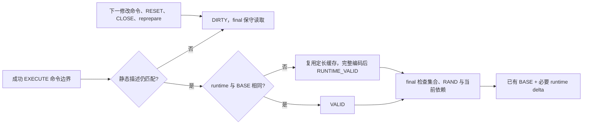

# PS 重复工作裁剪实施计划

> **2026-10-04 版本说明：历史版本记录。** 文内“当前/尚未完成/通过”和源码路径均属于记录时点；旧 PS 定义/参数/重建方案不再适用，原失败与测量不改写为新版本成绩。 现行职责见[详细设计](detailed-design.md)和[PS 删除与 cursor 关联](ps-transfer-removal-and-cursor-attach.md)，最新状态见[任务跟踪 E63/E64](task-tracker.md)。下文保留历史事实，不作为现行实施清单。

用户已于 2026-10-01 授权按源码审核结果实施。沿用现有目录与分支，不提交。
主 agent 编辑和验证；subagent 仅独立审查。验证使用 MTR/Python E2E，不新增 UT/DEBUG_SYNC。

## 范围与不变量

先落实既有协议内的三个切片：成功命令边界保存最新紧凑 runtime 证明；
final 跳过已被权威描述替代的未完成旧 PS_DESCRIPTOR；减少相同比对和参数提取。
BASE 字节、ID/代次、当前依赖与错误状态校验继续保留。缓存受原内存额度限制，
预算或校验失败使证明失效并走现有保守路径。全部修改留在 PS 专用模块及薄接线。
不引入字典协议、按 PS 增删协议、线程池或外部升主阶段。

## A. 最新 runtime 证明

文件：`sql/preserve_trx_ps_source_proof.{h,cc}`、`preserve_trx_ps_runtime.{h,cc}`、
`preserve_trx_ps_wire.cc`、`preserve_trx_ps_restore.h`。

- [x] 在 `scripts/preserve_trx_ps_phase1_e2e.py` 的首次 EXECUTE/实际类型/unsigned/runtime_delta
  场景断言 final 原生读取不增加；先在原 Debug 二进制跑出断言 RED。
- [x] 保留原成功 EXECUTE 钩子与静态校验；比较一次区分 BASE 相同、runtime 改变、静态失效。
- [x] 为改变的 runtime 保留定长无值镜像，复用已认证 SQL 摘要和已有缓冲区；索引与实际分配计费。
  完整编码成功后才发布有效状态。invalidate 先使缓存不可读；失败命令与 RESET 不新增刷新。
- [x] final 使用有效缓存，继续检查集合、RAND、TEMP/SP 准入和 TDC；失效条目保留原生检查。
- [x] 验证首次执行、反复类型改变、失败 EXECUTE、RESET、CLOSE/重建、DDL/FLUSH、LONG_DATA 拒绝。

## B. 裁掉已被 final 替代的待发送旧 descriptor

文件：`sql/preserve_trx_ps_pretransfer.{h,cc}`、`preserve_trx_ps_transfer.cc`。

- [x] 用现有 TCP relay 和 SQL 命令边界构造 descriptor 只传一部分、PS 集合变化的场景；
  保存旧逻辑先补完旧对象再发新对象的 RED，断言针对具体旧对象 payload/SEAL。
- [x] final 传入选定 descriptor 身份，在 ordinary 已关闭、active capture=0、worker 已退出后，
  只移除身份不同的 pending PS_DESCRIPTOR；锁外释放。相同身份续传和 PS_RESULT 保留。
- [x] 继续走现有 DECLARE 替换与 receiver staging 退休；ACK_UNCERTAIN、在途借用不绕过。
  没有 final descriptor 的空集合路径不扩展删除协议。
- [x] 覆盖身份相同续传、不同身份替换、ACK 重试、撤销重建、结果 FETCH 与 receiver READY。

## C. Phase1 重复扫描与额度归还

用户后续明确要求消除重复动作和流水线阻塞。当前源码证实：已声明 token 的去重发生在
THD 加锁扫描之后；已完成 PS 的 compact 状态可能要到末尾 submit 才同步至 TEMP owner；
公平性规则已决定暂缓的 completed owner，仍先经过 selector/epoch/request 的重复加锁。

- [x] 将声明去重移到加锁之前；首次登记与最终权威扫描保持完整。
- [x] consume 后先刷新 compact 状态和投递，及时使用归还额度，再决定是否重扫。
- [x] 在 late sweep 前生成一次含 id+incarnation 的公平性提示，前移既有暂缓规则；
  epoch 已由当前 attempt 登记时不重复取锁写相同位。预算/分配失败走现有退出。
- [x] 内部 MTR 以真实 LOCK_thd_data 持锁探针验证其他 owner 的推进；不使用 DEBUG_SYNC，
  不将普通 GET_LOCK 等待当成 THD 锁证据，也不冒充外部物理升主验收。

本片不能宣称全局无阻塞：首次登记、未完成 owner 和 TEMP install 仍保留既有同步。

## D. 验证与记录

- [x] 增量构建 Debug：`cmake --build build-debug --target mysqld -j8`。
- [x] 定向 MTR：从 `build-debug/mysql-test` 使用独立 `/private/tmp/mtr-ps-prune-*` vardir，
  `perl mysql-test-run.pl --suite=preserve_trx --parallel=2 --force --mysqld=--log-bin`，
  覆盖 runtime/source reuse、生命周期、partial/fallback、传输重试和 OFF 路径。
- [x] 独立源码审查所有权、缓存失效、预算、旧对象退休；修正后重跑受影响用例。
- [x] Release 构建与相同负载对照，分别报告原生读取、实际发送、业务吞吐、内存和全部 READY。
  当前 sysbench 驱动不采集有效延迟直方图，p99 保持未测，不使用日志中的 0 ms。
  更大规模运行不以采样诊断替代验收；严守 DRAIN 完成前业务持续运行。
- [x] 将本轮证据与剩余验收更新至 task-tracker/E49，明确已测与未测范围。

修改前文件备份与运行证据保存在 `build-debug/ps-pruning-20261001/`。

## 实施与当前证据

2026-10-01，C++ 已落盘，未提交。首次完整定向覆盖 54 个业务用例：48 个 PS Phase1、
5 个 OFF、1 个既有 SQL RESUME。48 个 Phase1 与 OFF 均通过；既有 `ps_only_strict_resume`
发现 fixture 等待闭环：receiver 从 DRAIN 前暂停到 DRAIN 返回后，源端已有
`wait_ps_prepared()` 却等待它准备完毕。仅该用例设 1 秒 Phase1 截止，验证冷准备回退，
生产参数未改；随后与五个加强断言的用例各复验两轮，均通过。性能结果见文末。

### 已改变的执行路径

- 缓存按需分配并计入原额度，复用同一容量；复制已有认证 SQL 摘要，不重算 SQL SHA、不做通用两遍 runtime 编码。
  预算或编码失败留下 DIRTY。wire 最后一个持有者析构时归还缓存；native PS 可继续保留小型失效证明，
  不会把新增参数缓存拖到会话退出。`ps_proof_matches` 保持原先 BASE 完全相同的口径。
- final 对 RUNTIME_VALID 追加缓存 delta，保留原 ID/代次、集合大小、cursor marker、RAND、TDC、TEMP/SP 准入校验。
  RESET/失败 EXECUTE 不自动发布成功证明。最终源码没有新增客户端操作、SELECT 重执行、线程池、协议代次或升主阶段。
- ordinary worker 已退出且捕获已关闭后，final 只移除与权威描述身份不同的旧 pending PS_DESCRIPTOR；
  保留匹配偏移和全部 PS_RESULT。已有 DECLARE 实现替换，ACK_UNCERTAIN 不绕过，锁外析构旧对象。
- 协调线程先消费完成结果并更新 compact 状态、投递，再决定是否重扫；已声明 token 在取 THD 锁前去重。
  对已有公平性规则本就暂缓的完成者，在 selector 前按 id+incarnation 跳过；重复 epoch 发布也免于取锁。
  这解决已完成者造成的无效等待，不等于未完成 owner / TEMP install 的所有同步已消失。

### 有效 RED → GREEN 证据

证据根目录：`build-debug/ps-pruning-20261001/`。初始实验中的环境或 fixture 失败不算 RED。

|裁剪点|有效旧行为证据|新行为断言|
|---|---|---|
|首次 EXECUTE、runtime 类型与 unsigned 变化|`red-runtime.log`：三例 final native reads 0→1|同三例不再增加 native reads，BASE 复用且无 fallback|
|未完成旧描述被 final 替换|`red-pending2.log`：旧描述发送 4,219,553 字节并 SEAL，再发新描述|旧描述仅保留首个 ACK 前缀、不再 SEAL；新版本及全部 survivor READY；相同版本续传仍通过|
|已完成会话锁阻塞其他捕获|`red-pump4.log`：真实 THD mutex 持有期间另一个 owner 无法传输|相同内部持锁 probe 下另一 owner 新传输非空数据，随后全部 survivor READY|

`green-more.log` 包含 12 个业务用例（另有 shutdown_report），覆盖上述传输行为及
实际 SQL RESUME 原 ID / new_types=False：unsigned 超过 INT64_MAX、cache→RESET、cache→1062失败。
RESET 还检查最终 MF02 的 arena=PREPARED 与参数类型。新测试均无 DEBUG_SYNC、无 UT。
这些本地 SQL RESUME 使用已有 Debug bridge，不替代外部物理备机升主验收。

### 性能验收边界

Release 使用同一读写模型、128 表、每连接 1153 PS 做 64 连接配对诊断，正式 500/1000 连接指标仍独立。
两版使用相同修正后的驱动：业务运行到 DRAIN 完成，原连接保持 HOLD 至 receiver READY，
停 sysbench 前再次核对全部原连接 ID。输出新字段表明此时序，session-only 无 READY 对象时标 null。
不把逻辑 descriptor_bytes 当成两次发送，也不把累计 worker 时间当成墙钟。

最终 Debug 与 Release 构建均通过。`final-mtr.log` 的 54 个业务用例中 53 个直接通过，
唯一冷 receiver fixture 修正后，`confirm-mtr.log` 对它及五个加强 oracle 的用例各复验两轮，
12 个业务执行均通过（另有 shutdown_report）。因此 54 个不同业务用例均已有通过结果，
并非宣称第一轮无失败或整个 Preserve/Resume 全量回归已重跑。
独立 review 的缓存寿命、计数口径、OOM 出口、全部 survivor READY、RESET arena、
持锁前禁止提前捕获和 READY 前连接 ID 再验证意见均已纳入。

### Release 对照结果

证据：`build-release/ps-pruning-20261001/comparison.json`、`runs/` 和 `observation/`。
旧二进制 SHA256 前缀 `e5465abe`，修改后 `e3352ace`；41 项冻结源码、脚本与新二进制哈希复核一致。
两版均为 64 连接、73792 PS、128 表×20000 行、60 秒稳态、6 个 Phase1 worker、
2 GiB Preserve 预算和 10 秒 Phase1 截止；保留 strict 2 秒、tail/READY 各 500 毫秒门槛。
压测期间不并行构建或 MTR。以下为单机单轮观测，不是稳定加速结论。

|指标|旧版 before-r3|新版 after-r1（覆盖不足）|新版 after-r2|
|---|---:|---:|---:|
|Phase1：开始→pre-closing policy|1.514610 s|1.652501 s|1.956345 s|
|严格 Phase2|53.033 ms|23.678 ms|35.444 ms|
|最后合格 BODY 结束→ACK|27.785 ms|不适用|35.163 ms|
|ACK→全部 READY|0.735 ms|0.652 ms|0.431 ms|
|稳态 TPS|3312.065|3574.441|3501.289|
|源端 Preserve 账本峰值|139.183 MiB|139.499 MiB|141.321 MiB|
|目标端 Preserve 账本峰值|219.270 MiB|219.135 MiB|223.180 MiB|
|final 原生读取数|0|64|39|
|final fast 数|73792|73728|73753|
|PS pretransfer payload|37544000 B|37544000 B|37544000 B|
|source / receiver 描述复用数|64 / 64|64 / 64|64 / 64|
|source wire fallback|0|0|0|
|SURVIVOR / READY / 原连接保留|64 / 64 / 64|64 / 64 / 64|64 / 64 / 64|
|完整验收器结果|通过|失败：无 eligible BODY|通过|

`after-r1` 源日志为 `t0_executing_max=0`、`eligible_body_count=0`、
`NO_ELIGIBLE_BODY`、`coverage_complete=1`，没有 scheduler fatal/invariant。
它与漏 exit 的 `COVERAGE_INCOMPLETE` 不同；现有 `require_exact_body` 正确拒绝本轮，
tail=0 是不可用哨兵。保留失败原件，未放宽校验，原参数重跑得到 `after-r2`。
两轮均在 READY 后、stop 前再次确认全部原连接 ID；运行后专有进程与数据目录已清理。

本负载旧版本来没有冷 PS 读取，新版也保留必要的 DIRTY 条目原生核查。
例如 EXECUTE precheck 先失效证明，随后 4020 gate 阻止执行，就不会得到成功刷新；
仅凭汇总计数不能把 64/39 次读取逐个归因给某条 PS。
不能用本组对照声称“所有 final 原生读取消失”或“大规模吞吐已经提升”。
Phase1 与 tail 没有同步改善；内存峰值也未下降。首执行/type/unsigned 差量的重复读取裁剪、
旧版本剩余发送裁剪、真实 THD mutex 阻塞裁剪，由前述定向 RED→GREEN 直接证明。

内存表中为服务端 Preserve 账本峰值，不是全进程 footprint/RSS；stop 后采集的 current 值
不作 READY 瞬间存量。`ps_pretransfer_bytes` 是该层 payload 计数，不与
`proof_stream_descriptor_bytes` 相加，也不当成网卡字节。此稳定 PS 集合没有旧版本替换，
所以 payload 相同是预期，不能据此推导替换场景没有节省。
当前驱动没有有效 p99，亦无足够采样分辨几十毫秒 Phase2 CPU，不编造这两项。

本轮已完成三个裁剪切片与本地验证；500/1000 连接的性能复验、剩余必要同步是否成为新瓶颈、
外部物理升主及 proxy 集成验收仍保持原任务边界。未提交。
