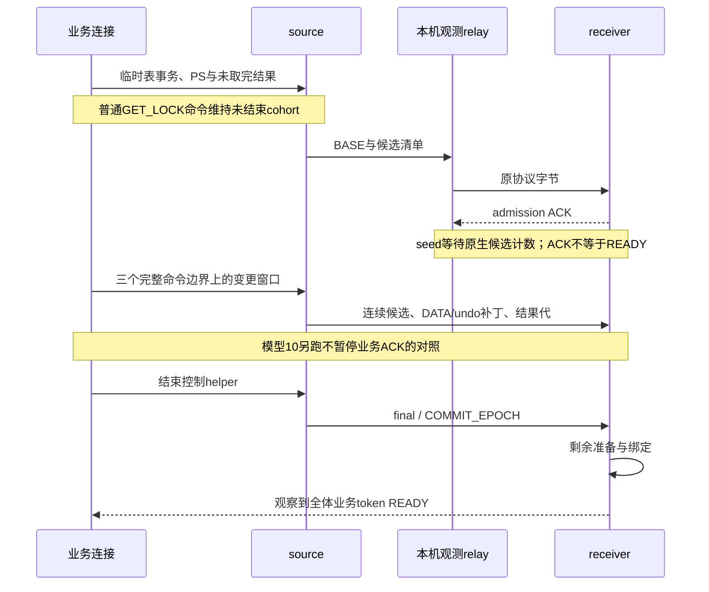

# Release 流水线模型 7、8、5、6、10（2026-09-28）

> **2026-10-04 版本说明：历史版本记录。** 文内“当前/尚未完成/通过”和源码路径均属于记录时点；旧 PS 定义/参数/重建方案不再适用，原失败与测量不改写为新版本成绩。 现行职责见[详细设计](detailed-design.md)和[PS 删除与 cursor 关联](ps-transfer-removal-and-cursor-attach.md)，最新状态见[任务跟踪 E63/E64](task-tracker.md)。下文保留历史事实，不作为现行实施清单。

原定 **54 轮全部完成**，另补 **6 轮业务期间不暂停 ACK 的 PS 换代对照**。60/60 运行有效且通过源端语义、真实传输及 receiver READY 检查：432 个业务事务 READY，结果捕获失败为 0，source final 累计432次 DATA space复用、全量回退为 0。

**这不是性能全部达标的结论。** 高频 PS 换代仍有明显命令长尾、候选失效及 final 准备成本；去掉业务窗口的 ACK 暂停后，这些问题没有消失。当前没有定义商用 SLO，也没有运行外部物理备机升主、SQL RESUME 或 proxy 切换。本轮不修改内核，不提交代码。

后续已完成 [M10 长尾根因定位](ps-churn-root-cause-2026-09-28.md)：84,571 B 结果跨过 64 KiB 缓冲后，在业务线程同步进行文件换代；秒级慢调用与 EXECUTE 时间吻合，receiver 完整展开小 DELTA 是额外放大因素。15 轮对照＋1 轮有效探针验证；未改内核，性能修复仍未完成。本文保留 E36 原始运行时点的结论。

## 1. 运行了什么

使用 E34/E35 的同一 Release mysqld，SHA256 `23e6212c81f2449db1bd18b89b72f2c879ba2376ea6631bfb1f0cc0e0d1e1753`。两端同机独立实例；Preserve 与 inflight 预算各 1 GiB、buffer pool 各 512 MiB、Phase1 worker=6、BALANCED、结果额度256，保持原设置。新压测沿用既有 Classic 客户端与实例管理，仅补充业务模型和传输观测，无 DEBUG_SYNC、DBUG 或新服务器线程池。

| 模型 | 实际负载 | 重复与检查 |
| --- | --- | --- |
| 7 连续增量 | 单owner，32768行×512 B；静止、16行稀疏、同16行连续32次更新、固定随机256行、全表更新。保留一个128行结果，已FETCH7行 | 每档3轮；seed后3个观察/变更窗口，核对源数据计数与SUM、BASE/DELTA及READY |
| 8 undo/回滚 | 1/8/32 owner，每owner4096行×512 B；另单owner32768行。初始全表UPDATE，之后UPDATE/DELETE/保存点部分回滚，最后回滚到初始保存点再UPDATE | 每档3轮；同轮多语句是一条完整Classic命令，验证每轮COUNT/SUM；读实际undo header确认空间/RSEG身份 |
| 5 大小混合 | 7或31个小owner，各128行×512 B；有/无额外单个128 MiB payload大owner；每owner保留cursor | 4档各3轮；不设ACK暂停，分别量小户批量资源、全部对象的末次SEAL admission ACK及epoch READY |
| 6 多小对象 | 固定8 MiB逻辑表payload及约8 MiB结果payload，拆为1/16/64表，同数PS与保留结果；每表主键＋一个二级索引 | 每档3轮；固定逻辑量，不把实际空间分配大小当作相同 |
| 10 高频换代 | 4 owner，每owner4或16 PS，每PS8个整数参数、11列；反复EXECUTE、FETCH7/128行、CLOSE、重PREPARE，夹杂UPDATE | 两档各3轮受控窗口＋各3轮无业务ACK暂停对照；校验FETCH值/顺序、参数表达式、源数据；记录源端最终live/closed ID清单 |

所有模型均验证 receiver 已有只读事务中的用户TEMP数据、回滚，以及READY后新建TEMP。没有使用重启或内部恢复桥接来代替物理升主。所有实例测量结束后退出，专用数据/socket目录已清理；保留日志与报告。源实例沿用原一次性DRAIN后的销毁方式，不构成崩溃恢复测试。

## 2. 怎样观察连续捕获

模型7/8和首组模型10用helper事务的普通命令维持捕获窗口；在特定SEAL admission ACK处暂停源发送，结合receiver全局native-ready计数确认流水线确实前进。源与receiver使用真实传输，未注入内核同步点。**这些受控窗口的DRAIN总时长不能当作自然业务SLO。** 静止组是三个观察窗，不是三次实际换代；多owner/高频换代的窗口也不保证只有唯一一代。

relay校验frame/batch/ACK的身份、摘要、CRC及版本，按sequence与对象descriptor代键去重。逐owner字节排除helper；source/receiver全局计数仍包含控制连接和helper的工作。SEAL时间只表示命令受理ACK，不表示对象apply完成或单token READY。生产指标没有逐token READY时间。

为解析字节，本机两端关闭TLS；其余预算不变。Classic字节含双向包头、握手、认证、ACK与应用重试，不含TCP/IP。正文的patch节省率只比较对应代的补丁payload和完整文件大小，不能当作整个网络的节省率。sender和receiver与Python客户端/relay同机，另有工具及报告分析活动，未独占CPU；不能外推网络或硬件容量。

## 3. 连续增量：静止不重传，密集变化收益下降

三个静止窗口的业务DATA/undo新增payload均为0。变化组每轮实际发送三个DATA patch；下面按 `1−Σpatch字节/Σ该patch完整目标文件大小` 计算，每格为三轮范围。目标会增长，未用种子大小替代；每份patch都相对固定BASE，统计的是实际发送的各份累积patch之和。

| 修改模式 | DATA patch节省 | undo patch节省 | 整轮Classic MiB（含BASE等） |
| --- | --- | --- | --- |
| 稀疏16行 | 99.91–99.91% | 99.10–99.49% | 32.689–32.714 |
| 热点反复更新 | 99.78–99.78% | 96.57–96.57% | 32.994–32.996 |
| 随机256行 | 84.78–84.79% | 98.10–98.10% | 46.982–46.994 |
| 全表更新 | 22.54–22.56% | 34.23–34.23% | 121.825–121.837 |

静止整轮仍发送约32.51 MiB，主要是初始资源。稀疏/热点的patch很小，密集更新的DATA节省仅约22.5%，不可假设任何负载都有接近零的增量传输。上述组均无source final全量回退，不能据此声称已覆盖delta无收益时的同名full fallback/重声明。

## 4. undo owner与回滚

所有业务owner在同一个实际undo space中，但各owner的RSEG不同；本矩阵不证明同一RSEG共享场景。以下为每档三轮的实例累计计数，包含固定helper。路由次数包含同页反复更新；新取页指从buffer pool取页，包含缓存命中，不是磁盘读；复用页仍需遍历undo链。

| 规模 | 路由回调次数 | 冻结owner batch取页次数 | 新取页次数 | batch/旧代缓存复用页次数 | receiver FINAL→READY ms |
| --- | --- | --- | --- | --- | --- |
| 1×4096行 | 3247 | 8 | 27 | 51 | 2.733–2.885 |
| 8×4096行 | 25969 | 64 | 354 | 249 | 13.225–41.990 |
| 32×4096行 | 103873 | 256 | 2127 | 276 | 108.919–681.761 |
| 1×32768行 | 25913 | 20 | 140 | 408 | 7.119–33.661 |

同规模三轮上述四项计数一致。32 owner下的新取页次数及final尾段均增加，仍需进一步分解扫描和候选收敛成本，不能单凭计数判定路由失效或锁竞争。每轮源端部分回滚及最终SUM校验正确，结束后的undo owner/watch均为0；目标端恢复后执行ROLLBACK的语义仍需真实升主/RESUME环境验证。

## 5. 大小混合：批量数据先行，最终元数据仍一起收口

下列时长从DRAIN发出开始，取每轮小owner中的最大值，再列三轮范围。bulk仅含DATA、undo和PS结果；全部对象还包含snapshot、PS描述等。

| 负载 | 小户bulk末ACK ms | 小户全部对象末ACK ms | epoch receiver FINAL→READY ms |
| --- | --- | --- | --- |
| 7小 | 146.289–158.235 | 156.495–170.228 | 7.006–8.461 |
| 7小＋128 MiB大 | 148.527–154.351 | 2856.969–5126.856 | 1375.224–2606.011 |
| 31小 | 259.564–265.420 | 301.511–307.885 | 33.420–43.061 |
| 31小＋128 MiB大 | 276.980–359.522 | 4069.078–5014.607 | 1962.884–2246.104 |

混合组每次7/7、31/31小owner的bulk均先于大owner。说明小资源没有等待大资源整个发送过程；但最终snapshot仍等待epoch统一收口，不能得出小事务READY不受大事务影响，更不能据此排除所有worker/额度/锁竞争。

## 6. 固定数据量，多对象

| 表/PS/结果数量 | 实际DATA full MiB | DRAIN ms | receiver FINAL→READY ms |
| --- | --- | --- | --- |
| 1 | 19.000–19.000 | 548.180–774.274 | 129.327–231.818 |
| 16 | 36.000–36.000 | 756.355–882.546 | 241.480–501.222 |
| 64 | 20.000–20.000 | 558.532–587.630 | 199.988–210.966 |

逻辑表数据和结果总量固定，实际临时空间分配受对象布局影响，并不单调。16表组的实际DATA文件比1/64表组更大，不能把耗时差全部归到元数据处理，更不能以三档结果推导对象数量增加没有成本。没有发现本组功能失败或source final全量回退。

## 7. PS换代：功能通过，性能仍有明显缺口

首组6轮的大部分EXECUTE与人工ACK hold重叠，原始分位数保留，但不当作自然捕获性能。因此另跑6轮，只在seed阶段保留协调，业务窗口不再暂停ACK，也不强制每窗某个中间候选先完成；最终READY条件不变。独立核对所有业务命令与ACK hold的交集为0。

每档仍是4 owner、三段名义3秒的闭环业务窗。周期必须执行完整后才结束，所以慢命令会越过窗末；操作总数不固定。每格为三轮范围，不是把三轮p99平均。

| 每owner PS | 窗口 | EXECUTE p99 ms | EXECUTE max ms | final逻辑处理 MiB | receiver FINAL→READY ms |
| --- | --- | --- | --- | --- | --- |
| 4 | 受控ACK窗口 | 7.769–11.367 | 1336.290–1515.975 | 92.907–123.939 | 219.498–1103.623 |
| 4 | 业务ACK不暂停 | 29.826–152.047 | 1483.783–2336.545 | 92.813–123.751 | 316.561–2517.053 |
| 16 | 受控ACK窗口 | 8.613–15.929 | 719.627–1397.210 | 92.813–92.813 | 218.150–233.270 |
| 16 | 业务ACK不暂停 | 119.711–247.875 | 1292.429–1575.547 | 92.813–123.751 | 508.474–2399.545 |

无业务ACK暂停时长尾仍在，而且各轮p99为29.826–247.875 ms，单次最大1.292–2.337秒。由此可以排除“只要去掉人工ACK暂停，问题就消失”的假设；**仍不能定位为某个内核锁、磁盘或网络问题**。客户端计时包含Python调度、协议编解码及收包，与模型1常态OFF/ON不是同一负载，不能直接计算回归倍数。

无业务ACK暂停的6轮，receiver ordinary native-ready每轮5–8次，final接管每轮仅0–1个（业务owner有4个）；native_failed每轮9–63次，final_failed_batches每轮3–4次，最终4/4 READY。所有12轮模型10合计native_failed=237、final_failed_batches=40，照实保留。

源码上 `native_failed` 同时统计step失败、取消、被新代替代失效，聚合没有足够的原因细分，不能逐笔说只是正常换代，也不能直接当作最终事务失败。`native_early_reused` 表示final接管匹配work，允许work尚未准备完，不能把它当成完整提前准备命中率。source final复用按DATA space计数，与receiver接管是两回事。参见[候选收尾](../../../sql/preserve_trx_receiver_candidates.cc:298)、[final接管计数](../../../sql/preserve_trx_receiver_candidates.cc:364)、[source final按space记数](../../../sql/preserve_trx_temp_table.cc:3759)。

无业务ACK暂停组的FETCH p99为0.919–1.045 ms；CLOSE+顺序确认的p99为24.781–375.697 ms、最大255.755–1293.492 ms，也存在长尾。测试客户端的`close_statement()`在静默COM_STMT_CLOSE之后发`DO 0`确认顺序，因此该计时包含两条命令及往返，不能称为纯CLOSE服务耗时。见[客户端实现](../../../scripts/preserve_trx_session_only_packet_e2e.py:186)。源端PS ID清单仅被记录，未通过目标descriptor或RESUME后执行核验原ID。

final processed是框架记录的逻辑处理字节，包含扫描/读写等工作，不能称为额外网络流量或实际磁盘写入。receiver FINAL→READY起点为首次final manifest登记，不是final ACK之后；它与DRAIN、返回后READY尾段有重叠，不能将三者相加。后续应优先定位高频换代下候选取消/重复准备、source命令延迟及final剩余工作；本轮没有未经定位就修改内核或增加预算。

## 8. 证据、复核与保留边界

- 原54轮冻结80项输入，逐轮前后校验无漂移；通过独立验收后，原负载逐字节归档为`workload-barrier-v1.py`，随后只增加`--capture-windows=unheld`测量选项。6轮对照另冻结82项输入；二进制与预算未变。`archived-inputs.json`说明历史脚本映射，没有用新脚本冒充旧运行。
- `analyze.py`核对实际参数/开关/预算、业务survivor身份、READY数、捕获失败、undo路由退休、进程退出和数据清理。60轮均通过；这只是功能与证据有效性，不含未定义的性能阈值。新脚本见[负载](../../../scripts/preserve_trx_temp_pipeline_benchmark.py)、[传输观测](../../../scripts/preserve_trx_pipeline_observer.py)。
- 两个只读review分别核查协议/字节及业务/指标。独立从events重建的对象范围、delta字节、SEAL时间与报告一致；M7 delta总量与source对应计数一致。正式日志扫描未发现ERROR、断言或崩溃。控制/helper被移出cohort产生的ABORT与业务survivor分开，不能把receiver_failed_tokens聚合当成业务失败。
- 预检保留两次脚本失败：只读目标端口变量不能动态设置；TLS字节不能按明文Classic包解析。已在正式运行前改为启动时设置端口和本机禁用TLS。它们没有混入60轮，更没有作为内核故障。预检同时修正了COMMIT合法非零ACK、多语句开关、代次匹配和SEAL时间口径。
- CPU/RSS/数据目录按约1秒采样，可能漏峰值；CPU由同runner首末累计CPU时间差/monotonic间隔计算，包含准备阶段，不能称为纯DML CPU。跨进程不直接相减Python monotonic时间。服务器stage聚合和传输字节分别报告，未把聚合服务时间当作墙钟。
- 60轮测量时磁盘最少可用10.13 GiB，未触发4 GiB保护。原54轮源/receiver采样RSS峰值分别656.38/445.61 MiB，Preserve计费峰值115.82/244.71 MiB；两类口径不同。资源原值均留存。
- 本轮是TEMP-only、固定参数类型和有限规模/时长；没有覆盖所有普通表混合、同RSEG、TLS、高延迟网络、长稳或再次迁移场景。物理升主、SQL RESUME、恢复后FETCH/EOF/回滚、proxy补发CLOSE继续由外部V04–V06验收。

[60轮完整结果表](../../../build-release/temp-pipeline-models-20260928/RAW-SUMMARY.md)、[机器汇总](../../../build-release/temp-pipeline-models-20260928/summary.json)、[验收日志](../../../build-release/temp-pipeline-models-20260928/acceptance.log)、[原54轮清单](../../../build-release/temp-pipeline-models-20260928/matrix.json)、[6轮对照清单](../../../build-release/temp-pipeline-models-20260928/supplemental-matrix.json)、[对照假设](../../../build-release/temp-pipeline-models-20260928/supplement-plan.md)及每轮原始report/execution/status/服务端日志均保留。

本次完成V03中模型7/8/5/6/10的这批本地运行，不关闭商用性能SLO。模型10的长尾与提前准备收益是明确的后续定位项；模型2/11/12及外部13–15不由本轮替代。没有提交或推送。
