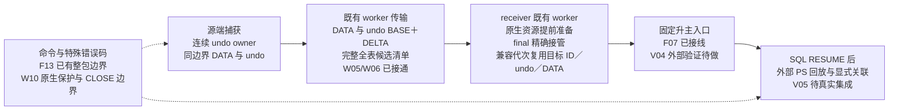
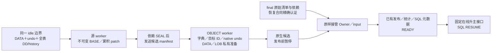

# 临时表与待 FETCH 结果 Preserve/Resume 任务跟踪

**当前 E141（2026-10-10，原有五模型当前Release复测）：** 5/5各一轮完整执行，三项sysbench通过原验收；mixed-transfer与continuous-no-commit本地功能成功、性能及部分覆盖未通过。strict分别为274.449／713.687／193.030／38062.816／1304.387ms，EXACT分别179.481／224.912／176.011／1897.200／1286.199ms；适用的receiver ACK→READY均低于500ms。mixed 914/914、no-commit 1071/1071 SUCCESS/READY；自动提交0 survivor为正常session-only，1000连接HOLD。保持原规模、各2GiB预算及判据，2,648项输入无漂移，无内核修改或提交/push。详见本页E141及[完整报告](../../../build-release/original-pressure-e141/README.md)。

**当前 E139–E140（2026-10-10，TPC-C128及全量MTR含big test）：** 当前Release原300仓库／128连接／300秒持续业务模型，独立18项验收全部通过：strict **352.572ms**、有效EXACT **75.744ms**、receiver同钟ACK→READY **0.462ms**，79/79 survivor READY、128原连接/HOLD，无FATAL、重连或DRAIN新增1205。随后当前Debug完整no-bin/log-bin MTR分别 **605通过／316条件跳过／0失败**、**631通过／290条件跳过／0失败**，shutdown分别通过，两轮退出0；921个不同用例及18个big test全部在适用模式通过。没有修改内核、共享驱动、测试或golden，未提交/push。详见本页E139–E140及[TPC-C独立验收](../../../build-release/tpcc-128-e139/c128/independent-validation.json)、[MTR逐项结果](../../../build-debug/preserve-full-big-e140/results.tsv)。

**当前 E138（2026-10-10，500连接持续业务两轮复测）：** 按要求重新构建Release后，沿用TEMP50／FETCH50／BOTH50／RW350和300秒业务窗口，业务在DRAIN期间继续到命令边界4020；原1GiB预算、BALANCED及6个既有worker不变。两轮本地功能通过，严格Phase2为 **689.872／737.450ms**，receiver同钟ACK→READY为 **120.499／31.154ms**，两项关键指标均达标。原综合验收仍未通过：第一轮EXACT尾部689.406ms超过500ms，第二轮NO_ELIGIBLE_BODY且coverage完整，无有效EXACT起点，不计0或通过。详见本页E138明细及[核验汇总](../../../build-release/continuous-resource/e138-matrix-fix-review/summary.json)。

**当前 E137（2026-10-10，M矩阵失败修复）：** 按E136确认的根因收敛结果代生命周期和Phase1调度，10个内核文件+241/-154（净增87行），无新增内核文件、线程池、协议种类或升主阶段。保持原预算、协议上限、命令边界、final精确身份校验。最终Release完整M1–M12 **62/62通过原模型验收**，包含56个成功迁移配置、3个无DRAIN对照和3个预期拒绝配置；334个token READY，捕获失败总数0，4个NOT_READY仅来自预期deadline负例。56个成功迁移配置的strict和receiver同钟ACK→READY均有样本，最大分别为 **1350.485ms／14.529ms**，通过原2s／500ms门槛。独立EXACT仅1个有效样本63.734ms，其余55项为NO_ELIGIBLE_BODY且coverage完整，不计通过。

29个不同定向MTR业务用例在适用配置通过，覆盖换代/CLOSE退役、流式结果、恢复后FETCH内容与位置、receiver清理、undo换代、ACK丢失和OFF路径。不是本轮全量MTR，也不把单轮矩阵外推为长期稳定性或真实物理升主验收。三方独立只读审查未发现本次差分的新阻断问题，未提交/push。详见本页E137明细、[62项结果](../../../build-release/temp-fetch-pressure-e137/RESULTS.md)、[完整指标](../../../build-release/temp-fetch-pressure-e137/metrics.json)。

**当前 E134（2026-10-10，TPC-C-like 64 并发）：** 沿用E133同一Release和原300仓库／9表／RR模型，包装仅将业务并发128改为64；双端Preserve各2GiB、buffer pool各2GiB、PROMOTION_PREPARE及原验收门槛不变。连接就绪后业务实际运行300.021229秒再DRAIN，并持续至HOLD/READY。独立18项校验全部通过：strict **377.124ms**、有效EXACT **58.655ms**、receiver同钟ACK→READY **0.225ms**；39/39 survivor SUCCESS/READY、64原连接/HOLD、NOT_READY=0，DRAIN新增1205=0，无FATAL/重连/未决ownership。

59个完整5秒窗口平均 **791.233 TPS／22464.841 QPS**，原p95=0.00无效。60个资源样本全部在DRAIN前，不能称DRAIN峰值；与E133为单轮对照，不据此声称稳定扩展性收益。2,563项冻结输入保持不变；未改内核、共享测试驱动或预算，自有克隆已回收并校验归档种子。范围仍为本地DRAIN→transfer→READY，未执行物理升主/RESUME，未提交/push。[完整报告](../../../build-release/tpcc-64-e134/README.md)。

**当前 E133（2026-10-10，TPC-C-like 128 并发）：** 当前 Release 原 300 仓库／9 表／128 并发／RR 模型单轮完成，实际业务运行300.021464秒后DRAIN，持续至HOLD/READY；双端Preserve各2GiB、buffer pool各2GiB、PROMOTION_PREPARE与原门槛不变。仅在本轮启动包装删除废弃result-capture-enable参数，未改内核、共享驱动或测试。原18项独立校验全部通过：strict **693.563ms**、有效EXACT **203.845ms**、receiver同钟ACK→READY **0.477ms**；82/82 survivor SUCCESS/READY、128原连接/HOLD、NOT_READY=0，DRAIN新增1205=0、无FATAL/重连/未决ownership。

59个完整5秒窗口平均 **750.346 TPS／21346.142 QPS**；原驱动p95=0.00无效。60次资源样本全部在DRAIN前，不能当作DRAIN峰值或精确阶段吞吐。2,563项冻结输入无漂移，Release重建哈希不变，独立只读复核原日志与报告一致；源端按原驱动取证后退休，receiver正常退出，自有克隆回收并校验归档种子。压测前对10份历史归档的33,180份重复std_data素材去重，净减15.265GiB，保留内容逐文件哈希复核；未删除失败证据或编译产物。结论限本地DRAIN→transfer→READY，不替代真实升主/RESUME；未提交/push。[完整报告与清理记录](../../../build-release/tpcc-128-e133/README.md)。

**当前 E132（2026-10-10，全量 MTR 含 big test）：** 当前 Debug 重新构建后顺序执行 no-bin/log-bin 全套，`parallel=4、big-test、retry=0、force、max-test-fail=0`，保留原 check-testcases。**no-bin 605通过／316条件跳过／0失败；log-bin 631通过／290条件跳过／0失败**，shutdown 两轮单列通过，退出码均0。921个不同用例全部在适用模式通过（885运行时＋36源码lint），18个big test全覆盖；条件跳过仅为对应binlog模式不适用。当前不存在独立 transfer_stby 套件。25,702项输入及两份二进制指纹无漂移，独立只读复核原日志、库存和结束标记一致；未改内核／测试／golden，未提交或push。两轮日志与自有测试目录完整归档；不由此宣称 Release 性能或真实物理升主集成完成。[完整报告与逐项证据](../../../build-debug/preserve-full-big-e132/README.md)。

**E131（2026-10-10，sysbench读写1000并发）：** 当前Release原`oltp_read_write / skip-trx=off`单轮完成，128表×20000行、1153000条PS、两端Preserve各2GiB，profile与E103逐字段一致。仅在新证据目录的启动包装过滤已删除的result-capture-enable参数；未改内核、预算、驱动门槛。原验收通过：strict **938.344ms**、有效EXACT **381.123ms**、receiver同钟ACK→READY **0.571ms**；90/90 survivor READY、NOT_READY=0，1000原连接/HOLD核验通过。

全部连接就绪后实际运行309.618832秒才DRAIN，业务保持至READY；30个完整10秒报告平均 **896.114 TPS／17926.579 QPS**，稳态err/reconn均0，后段吞吐下降仍记录。业务session实测1000个均RR；历史E103文档RC表述不照搬。报告到达跨度299.977069秒不代表业务不足300秒。38项冻结输入未变、原runner退出0、自有实例/目录清理完成；资源采样缺项单列，不称采样零错误。不替代实际升主、SQL RESUME或PS回放，未提交/push。[完整报告与证据](../../../build-release/sysbench-rw-e131/README.md)。

**E130（2026-10-10，清理后两轮Release压测）：** 使用E129清理后同一Release二进制，串行运行原500连接/300秒模型（TEMP50/FETCH50/BOTH50/RW350，双端1GiB预算、BALANCED、不限速）。两轮本地功能及两项关键指标均通过：strict Phase2 **831.075/837.178ms**，receiver同钟ACK→READY **165.041/182.622ms**。原综合验收仍0/2，唯一失败项均为有效EXACT尾部 **828.572/836.064ms** 超过独立500ms门槛，未改判据。

两轮451+49、448+52覆盖全部500连接，无未分类或worker错误；关闭前receiver后台任务归零、无晚期TEMP完成错误，原有TEMP隔离与已提交RW核账通过。prepared阶段计量各150次（通用分类success=0/unclassified=150，不称150条显式SUCCESS）。控制端READY观察→后台归零观察间隔617.221/2541.291ms，不是实际I/O尾部或RESUME等待，不能据此证明自然2秒窗口足够。binary/driver/10项依赖两轮一致；source清理关机仍为用户已排除的purge stop计数断言。未改内核或驱动、未提交/push，不替代物理升主/SQL RESUME/proxy集成或全量MTR。[两轮报告与原始证据](../../../build-release/continuous-resource/e130-cleanup-review/README.md)。

**E129（2026-10-09，三方独立复核后的清理）：** 三个独立上下文的只读 sub agent 各自核对完整九项清单，主会话复核后实施，并复审实际差分。8个内核文件+36/-61，净减25行：删除 strict 内部未使用的同步 TEMP 回退、合并封存 writer 回收与重复 seal OOM 探针、归并重复扫描/判断、简化结果预传输私有状态与包装函数，并更正指标注释。保留正式同步安装 probe 入口、故障注入、身份/预算/生命周期保护；E128 异步完成与 session RESUME 等待合同不变。删除重复用例三文件80行，共享 E2E 脚本+22/-12。

最终121项定向 MTR 在适用 no-bin/log-bin 模式全部通过（120运行时＋1源码lint）：no-bin42通过/79跳过，log-bin86通过/35跳过，零失败，shutdown另计均通过。首轮log-bin的两个失败原样保留：旧脚本在READY后立即断言后台归零，以及正常receiver路径残留“不得再次flush”的故障注入；核实后改为有界等待并校验成功准备次数，保留专门的后台I/O失败验证。两个原失败项及等待/flush失败用例各重复两次，8次通过。Debug和Release构建均通过；不是全量MTR或新的性能验收，未提交/push。[清理差分与完整记录](../../../build-debug/preserve-cleanup-e129/README.md)。

**E128（2026-10-09，定向回归与五轮关键指标通过）：** 按用户确认将 TEMP 最终 pwrite/flush/close 与依赖它们的准备链放到原 receiver worker 后台续作，READY 不等待；SQL RESUME 仅等待本 session 完成。最终输入、目标 ID/undo 在 READY 前准备，结果 cursor 保持原完整准备。删除 E126 seal_private，保留真实 flush/close 的失败检查，不新增线程池或升主阶段。70个不同相关 MTR 已在适用 no-bin/log-bin 模式通过（69运行时＋1源码lint，非全量）；新增6项覆盖等待、独立session、KILL及write/flush/close失败。

原500连接/300秒/1GiB预算的Release五轮本地功能及两项关键指标均5/5通过，strict664.380–841.780ms，receiver同钟ACK→READY73.883–130.816ms；每轮150个资源owner完成、无晚期完成错误。二进制/脚本/依赖SHA一致；r5首次端口预检退出后仅更换本地端口。原综合验收仍0/5：r1–r4缺EXACT样本，r5EXACT840.008ms超过独立500ms门槛。不把controller归零观察间隔当作真实READY→TEMP完成时间或RESUME等待。E127独立分类遗漏及外部物理集成仍未关闭。未提交/push。[合同与实施](async-temp-resume-barrier.md)、[验证记录](../../../build-debug/preserve-temp-async-e128/README.md)、[五轮证据](../../../build-debug/preserve-temp-async-e128/release-results.md)。

**E127定位补充（2026-10-09）：** 两轮原500连接/300秒Release诊断的strict为794.735/986.890ms，ACK→READY为1167.847/911.698ms。r1 token23的my_pwrite878.839ms覆盖ACK窗75.25%，其返回后2.323ms即READY；r2进一步确认token14实际pwrite系统调用701.486ms，另25.114ms，两者覆盖ACK窗约79.70%。两轮ifstream close最大8/12us，不构成本轮长尾。原E126 r2缺少逐调用时刻，不能将本次分解倒填过去，也未唯一确定OS内部等待原因。r1还发现conn89在FETCH EOF后COMMIT被4020拒绝，未进入450survivors＋49session-only，功能判失败；有吻合的只读事务无更新undo筛选路径，具体分支仍待服务端事实确认。r2功能通过不关闭该遗漏。用户确认保留实际pwrite写法，未改READY合同；9文件临时诊断已撤除并强制重建，未增加生产修复或提交。[E127完整记录](../../../build-debug/preserve-receiver-adopt-e127/README.md)。

**E126最新复验补充（2026-10-09）：** Release原500连接模型前两轮功能均通过、worker_errors为零；strict为785.756/1966.749ms，ACK→READY为352.361/1193.991ms，尚未稳定达标。第三轮端口占用导致业务前预检退出，无有效样本；尚未完成五轮。新增两个首次业务触碰MTR（Debug、log-bin、同进程）通过：READY观察后至少2秒才下发首条业务，TEMP UPDATE为1.986ms、FETCH为0.872ms，原数据/回滚/游标断言保留。该小规模结果支持继续评估业务影响，不能替代Release并发恢复或真实物理升主验收。[最新证据](../../../build-debug/preserve-receiver-private-seal-e126/README.md)。

**历史优化（E124–E126，2026-10-09）：** E124只取消private DATA fsync、仍同步close的试验已回撤；正式两轮ACK→READY 2770.548/3235.993ms均失败。E125r2确认close系统调用覆盖ACK窗95.36%；恢复fsync后r4 strict710.169ms、ACK1789.575ms，三条final增量SYNC同时占槽884.925ms。11个文件的诊断已全部移除。E126仅为receiver私有DATA新增seal_private：写入/转换/摘要及身份校验完成后可接管，fd和额度仍由原owner持有，退休时由既有reaper关闭；不新增线程/队列，不改变warm/UNDO/epoch同步。35个不同定向MTR在适用双模式全通过（nobin14通过/21跳过，logbin22/13，零失败；shutdown另计），Release原模型复测进行中，性能尚未宣布闭环。用户确认READY→首条业务下发自然间隔至少2秒，并非要求额外sleep；Linux O_DIRECT首次访问仍需真实物理工程核验。[E124证据](../../../build-debug/preserve-receiver-writeonly-e124/README.md)、[E125定位](../../../build-debug/preserve-receiver-native-e125/README.md)、[E126实施](../../../build-debug/preserve-receiver-private-seal-e126/README.md)。

**最新优化（E122–E123，2026-10-09）：** E123首次COPY跳过新文件内部全零页，writer实写由约1000MiB降至264–267MiB，3个内核文件+17/-3，无新线程/预算。29项定向MTR适用双模式通过。冻结Release五轮功能全部通过，strict 639–877ms（原2秒线5/5）；ACK→READY 415–1902ms（500ms线仅2/5），目标尚未闭环，原综合性能0/5。第4轮中断后主机重启，后两轮环境差异单列，不能把跨重启变化全归因于优化；不替代全量回归及外部物理集成。未提交/push。[E123证据](../../../build-debug/preserve-source-sparse-e123/README.md)。

**最新定位（E115，2026-10-09，无生产修复）：** E114五轮正式binary/参数相同。追加四轮相同500连接/300秒/1GiB/BALANCED的Release诊断，功能均通过；strict为952.176/1845.931/2898.961/826.739ms，ACK为545.730/915.758/859.375/618.039ms，原性能验收均未通过。已复现source超限：纯TEMP token24的stream占strict92.23%，但原ACK3754.712ms未重现。窄诊断直接证明100个TEMP/BOTH stream累计71.56%的时间在获取共享session锁，锁跨同步帧发送/ACK持有；这是并发累计量，不能当strict占比或套回R3。另有source pwrite322ms/sync357ms、receiver sync1016ms及三个准备槽同时阻塞。候选复用不代表最终版本在ACK前已准备完成。临时诊断代码全部撤除并重建原Release，未改预算、线程池或TEMP持久化语义，未提交/push。[完整定位与证据边界](../../../build-debug/preserve-r3-diagnosis-e115/README.md)。

**当前实施（E114，2026-10-09，全量回归通过、五轮Release性能未通过）：** Phase1新cursor结果已接入有界producer流，既有worker在EXECUTE未结束时传输完整行前缀，receiver结果接收不fsync；没有新增线程池或升主阶段。最终Debug全量含big-test：no-bin606通过／306跳过，log-bin621通过／291跳过，零失败，shutdown分别通过；912不同用例及18个big-test全部在适用模式通过。连续5轮 Release 本地 transfer→READY 功能均通过，worker_errors 为0；strict≤2.2s为4/5，原strict≤2s为3/5，ACK<500ms为0/5。最大strict=2850.872ms、ACK→READY=3754.712ms，未稳定达到用户所举的前R2水平，性能仍未关闭。 DRAIN前小规模OFF/ON配对捕获及预传输计数始终为零，未观察到持续EXECUTE p99劣化。未提交／push。

**历史定位（E113，2026-10-09，尚未形成新修复）：** 固定500连接/300秒/1GiB/BALANCED，两轮诊断功能通过；strict分别3201.950/864.264ms，ACK→READY分别1540.495/845.245ms，均未完成整体性能验收。R1源端最终image link单次2044.040ms，receiver长fsync和R2的pwrite已分离出实际调用区间且thread CPU很低；3个准备槽被长I/O同时占用。普通SEAL等的是admission ACK，不能把2.047秒等待当作SEAL文件校验；R2进一步看到普通chunk/ranges的OS close堆积，但逐请求因果仍待核定。E112 R1/R2仍是同源码/二进制/参数，不能归因为两轮之间改了代码。12个临时诊断源码已撤回，Release SHA恢复原值；未改预算、语义或新增生产机制，未提交/push。[E113完整定位](../../../build-debug/preserve-io-diagnosis-e113/README.md)。

**此前实施（E112，2026-10-09，定向功能通过，性能未通过）：** receiver 私有双镜像改为 O_EXCL 直接创建 `.image`，删除 `tmp→warm→image` 发布和 private writer 目录同步；保留 DATA flush/close 错误、双副本、摘要、sealed/READY 及同 boot 门禁。38个定向业务用例全部在适用 binlog 模式通过；未重跑本轮全量。原500连接/300秒/1GiB/BALANCED两轮功能均通过，R1 strict=1674.221ms、ACK→READY=1325.679ms；R2 strict=4247.612ms、ACK→READY=2559.615ms，**两轮之间无代码/参数修改，二进制与脚本及依赖SHA均相同**。R3诊断仍看到DATA sync437.096ms和my_close包装层486.046ms，文件调用窗口并集占ACK尾部75.26%；不将诊断样本当正式验收或倒推R2的精确归因。诊断代码已撤回，重建Release SHA恢复为 `af51a7f5e5203f4c3ffc82255ecda4fe9c6819b1fe27736150d1e8f1b23ba9b9`，与R1/R2一致。I/O收敛改动暂保留，尚无稳定整体收益结论；未提交/push。[E112记录](../../../build-debug/preserve-receiver-io-e112/README.md)。

**此前实施（E111，内核与 MTR 已完成，性能验收继续）：** 结果捕获已延后至 DRAIN Phase1，删除独立 capture_enable 参数；DRAIN 前仅维护轻量身份和安全读等待事实。新增专属借用模块，复用既有 worker、编码、传输和 receiver 准备，final 在 freeze/detach 前补齐尾部。Debug/Release 构建成功；最终 MTR no-bin 606通过/300跳过、log-bin 615通过/291跳过，均零失败，18个big-test全部覆盖。独立审查发现的 pin 分配异常和多 cursor 换代租约高水位问题已修复，后者保留明确 RED。最新原配置无采样R12：500连接全部完成场景检查，strict Phase2=1626.577ms，但 ACK→READY=2534.139ms 仍未达标。未证实收益的receiver缓冲实验已撤回，不能用 MTR 或旧性能成绩替代性能验收。

**此前全量回归（E110，2026-10-08，含 big test）：** 当前 E107／E109 版本 Debug 构建成功，顺序完成 no-bin／log-bin 全量，4 workers、零重试。no-bin **604 通过／295 条件跳过／0 失败**；log-bin **608 通过／291 条件跳过／0 失败**，shutdown 两轮单列通过。899 个业务用例全部至少通过一种适用模式，18 个不同 big test 全部通过。首轮 19 个失败全部串行复现，原因分别为 12 项旧模式配置前提和 7 项 profile 清理硬编码；只适配 26 个测试文件，内核和二进制未改。后 7 项仅修改 binlog 守卫之后的代码，最终树另验 no-bin 7 项跳过，未再重跑 no-bin 全量。未提交／push，不新增性能或外部集成结论。[完整报告](../../../build-debug/preserve-full-big-e110/README.md)、[逐项矩阵](../../../build-debug/preserve-full-big-e110/matrix.tsv)。

**此前普通全量回归（E108，2026-10-08）：** 基于 `f540116c322ec6477279288204094c762bd3f30e` 加 E107 未提交改动，Debug构建通过；按本轮约定不含big test，顺序完成preserve_trx no-bin/log-bin全量，均8 workers、零重试。no-bin **587通过／312跳过／0失败**；log-bin **606通过／293跳过／0失败**，shutdown两轮单列通过。899个不同业务用例各有两模式结果，**881个普通用例全部在至少一种适用模式通过**，仅18个big test两模式均跳过。新控制session关联用例两模式通过；39278项输入、二进制、Git HEAD及运行前后工作树差异一致。本轮未改内核/测试、未提交/push，不新增压力或外部集成结论。[完整报告](../../../build-debug/preserve-full-e108/README.md)、[逐项矩阵](../../../build-debug/preserve-full-e108/matrix.tsv)。

**最新接口修正（E107，2026-10-07）：** 按用户明确的控制连接合同，`preserve_trx_attach_cursor_after_ps_replay(target_thd, source_id, target_ps)` 已支持 `current_thd` 为新主控制 session、`target_thd` 为业务 session，不切换 TLS；目标存活与独占沿用外部已有接管机制。生产路径仅修正 THD 检查和已关闭原生 cursor 的重复 close。两项根因先复现再修复；Debug/Release 构建通过，16 项定向 MTR：no-bin **6 通过／10 条件跳过／0 失败**，log-bin **16 通过／0 跳过／0 失败**，shutdown 均通过。新增跨 session 用例覆盖归属、状态、OOM、重复关联和原 FETCH 位置；独立 review 发现的负例假绿也已修正并实跑验证。本轮未全量 MTR、未重跑压力、未提交／push，不关闭外部 V04–V06。见 [E107 证据](../../../build-debug/preserve-control-attach-e107/README.md)。

**最新清理后压测（E102–E106，2026-10-07）：** 使用同一 E101 清理后 Release 二进制，按各模型原规模、预算及门槛分别运行一次；下面的功能结论限定为本地 DRAIN→standby transfer→receiver READY。未执行外部物理备机在线升主、SQL RESUME、PS 回放或迁移后 FETCH，不关闭 V04–V06，也不以单轮结果宣布性能稳定改善。

| 记录与模型 | 功能／场景断言 | 严格 Phase2 ms | EXACT 末命令→FINAL ACK ms | receiver ACK→READY ms | 原综合验收 |
| --- | --- | ---: | ---: | ---: | --- |
| E102 TPC-C-like 128 并发 | 93/93 survivor READY | 483.618 | 162.641 | 1.132 | 通过 |
| E103 sysbench 读写 1000 并发 | 131/131 survivor READY；1000 原连接 HOLD | 469.983 | 256.298 | 1.042 | 通过 |
| E104 M1–M12，62 配置 | 原场景断言 62/62；56 个成功 READY 配置 | 最大 1436.208 | 仅 2 个有效样本：39.674／82.785 | 最大 66.391 | 原场景断言通过；54 个 READY 配置无 EXACT 样本 |
| E104 持续混合 500 连接 | 437 READY＋63 session-only 完整覆盖 | 1750.630 | N/A：NO_ELIGIBLE_BODY | 124.664 | 未通过：缺少 EXACT 证据，不是该尾部超时 |
| E105 continuous-no-commit，1000＋100 连接 | 1072/1072 READY；1000 大事务 COMMIT=0 | 1112.186 | 1097.932 | 18.434 | 未通过：尾部／响应超限、覆盖不足及吞吐证据无效 |
| E106 mixed-transfer，1000 连接 | 938/938 survivor READY | 18650.718 | 1634.143 | 10.746 | 未通过：原旧尾部 1131.837ms 超限；独立 EXACT 复核亦超限 |

表内 strict 一律为 T0→Phase2 end，不用旧 warmcopy／收尾计时替代；ACK→READY 使用 receiver 同 epoch、本端单调时钟。E106 原 profile 没有 strict 2 秒硬门槛，其实测同时超过另行报告的 2 秒目标和 2.2 秒容忍线；其余列出的成功 READY 配置这两项 strict 目标及 ACK→READY<500ms 均满足。E104 另有 2 个 ACK 丢失取消恢复用例通过，负例不混入成功 READY 性能样本。E105 的锁／BODY 最低数量是压测覆盖门槛，不是 DRAIN 成功条件。每轮失败、N/A 与统计边界见文末 E102–E106；当前仅补齐记录，未提交／push。

**最新清理与回归（E101，2026-10-07）：** 已实施清单 A01–A21、B01–B06、C01/C03–C05，保留 C02 与 D 组，内核净减 423 行。三组只读 review 无剩余确认缺陷；Debug/Release 构建通过。全量 big-test 双模式：no-bin 603 通过／295 跳过／0 失败，log-bin 607 通过／291 跳过／0 失败，898 项并集和 18 个 big test 全覆盖，shutdown 均通过。全量后收尾删除两行无消费者计量，最终版本另通过 14 项双模式定向复测；版本边界见 [E101 报告](../../../build-debug/preserve-cleanup-e101/README.md)。未提交／push，不宣称压力性能变化。

**此前 parser 清理（E96，2026-10-07）：** 在已提交的 `290e94a156c1` 上，删除旧 PS/SP 重建遗留的九处 parser 文本保留条件及多余头文件；`sql_yacc.yy` 与该特性加入前逐字节一致。Debug 构建通过；定向 MTR no-bin 8 通过／6 条件跳过／0 失败，log-bin 14 通过／0 跳过／0 失败，两轮 shutdown 分列通过。包含源码约束 RED→GREEN、SP 的 ON/OFF 行为及既有 cursor 捕获、传输、关联和 RESUME。该轮为定向验证，不代替 E95 全量或 E94 压测；本轮清理未提交／push。[详细证据](../../../build-debug/preserve-parser-cleanup-e96/README.md)。

**最新 MTR 修复闭环（E95，2026-10-07）：** E94 的 42 个不同失败用例已修复并经完整双模式复验。先保持旧判断串行复现：39 个临时资源用例准确退出于完整镜像写量等式，2 个退出于 seal-OOM 写量等式；根因是零页跳写后 Debug 探针仍要求两份完整逻辑镜像的物理写量。现按两份“非零页＋必写末页”精确核算，保留 SHA、双份逐页内容、故障和清理检查。另修复同一 lint 的两处过期形状约束（摘要 timer、预算拒绝诊断日志）。最终全量含 big-test、零重试：**no-bin 603 通过／295 条件跳过／0 失败；log-bin 606 通过／292 条件跳过／0 失败**，shutdown 两轮通过；898 个不同用例均在适用模式通过，18 个不同 big test 全部通过。修改仅 Debug 探针和 lint，生产路径未改、Release 指纹保持 E94；原压力未通过项不由本轮关闭。未提交／push。[修复与完整证据](../../../build-debug/preserve-fix-e95/README.md)。

**修复前完整复测（E94，2026-10-06—07，MTR 后续修复见 E95）：** 保持当前R44对应内核／Release指纹，完成no-bin与log-bin全量MTR（含big-test），以及原压力12项、临时资源62配置、持续混合500连接各一次，共75个压力配置。MTR：no-bin561通过／295条件跳过／42失败，log-bin605通过／292条件跳过／1失败；18个不同big-test在适用模式全部通过，失败项串行复现。41项共享Debug探针与零页跳写后的物理写量断言有静态冲突，逐项准确退出点未全部动态确认；另1项lint已核实是旧正则不接受计时语句。原压力完整验收4/12通过，TPC-C1000在DRAIN前后sysbench用户1205增加5次；其它业务延迟／尾部及测量有效性失败保留。临时矩阵独立验收62/62，56个READY场景的strict与ACK→READY均达标，分别最大1606.950／66.352ms；EXACT仅3个有效样本，不能把其它N/A计为通过。持续500功能通过442 READY＋58 session-only，strict **1642.997ms**、ACK→READY **148.325ms**，两项关键目标通过；但无合格EXACT起点，原脚本完整性能验收仍失败。本轮未改内核／正式驱动、预算或门槛；运行后输入hash一致，未提交／push，不能凭这一轮关闭历史长尾。[完整报告与逐项指标](../../../build-release/preserve-complete-e94/README.md)。

**最新五轮与R44回撤核验（E93）：** 原500连接/300秒/双端1GiB预算/不限速完成R50–R54，功能5/5；strict分别2589.884/4255.485/1874.739/4186.949/1769.103ms，ACK→READY分别178.003/234.984/203.941/517.753/253.080ms。原2000ms及用户2200ms的strict+ACK共同门槛均2/5通过，ACK单项4/5；五轮EXACT有效且均超500ms，原脚本整体0/5。直接核查R44原始binary/脚本指纹一致；用R44批次输入patch和同HEAD重建62个文件，46个内核文件逐字节一致，唯一tracked差异为本任务文档。独立审核确认E91探针及E92试验已撤回，历史未跟踪代码/测试亦一致。**截至E93，内核与驱动已恢复R44对应版本，但同版本性能仍不稳定；不能把文档/报告变化称为代码回撤失败。** 后续E95仅修正Debug探针和lint，生产路径与Release指纹仍保持。 五轮期间未修改代码或配置，未提交/push。[五轮及逐文件证据](../../../build-release/continuous-resource/r29-restored-r50-r54/README.md)。

**历史回撤记录（E92已撤回，恢复R29）：** 对TEMP/RESULT实施过对象内data/ranges FD复用，保留pwrite、原重传/覆盖/SHA校验，使用既有FD额度与退休ticket，不新增线程池。原500连接/300秒/预算/不限速R48功能262 READY＋238 session-only通过，strict **3358.394ms** 未通过2.2秒，ACK→READY **496.767ms** 刚在500ms内，EXACT **3171.358ms** 未通过；source worker墙钟2941.140ms。未证明整体收益，不能仅凭open/close减少宣称优化，也不能用一轮数据证明全部退化由该改动引起。用户要求回退后已精确撤回本轮5个内核文件的增量及4个试验专用测试文件；R49在业务约85秒时中断、未进入DRAIN，不计验收。Release重建SHA恢复为`61b78ba69ad2ceea19c60fdaf2665da634901ede52fb643b80f922c6bbd3ec41`，与R29完全相同，benchmark及10个依赖SHA也相同。Debug/Release重建和回退后的cursor_final_transfer_chunks通过。R29五轮R40–R44仍是3/5双指标通过，回退不等于长尾已解决。未提交或push。[试验与回退证据](../../../build-release/continuous-resource/file-reuse-e92/README.md)。

**最新长尾诊断（E91）：** 对E90的source worker/staging窗口增加临时分段计时，按原500连接/300秒/预算/不限速完成R45–R47诊断，三轮功能通过。R45 worker3798.581ms中，协调器串行TEMP/RESULT/OTHER合计3747.862ms（98.665%），两处wave flush仅4.603ms；最慢source SEAL等447.659ms，对应同receiver后端前一CHUNK的ACK后apply447.635ms，而当前SEAL自身仅8.601ms。R46将长调用缩小到文件write/close；R47证明长close主要耗在OS调用，最慢848.919ms、MySQL登记处理仅3us。**R45已测worker窗口主要被最终当前代TEMP/RESULT的串行staging占据，并确认receiver文件处理反压下一请求；R47已测长close的文件登记开销不能解释其持续时间。** 不把不同轮次的细分耗时直接倒填给R41/R43。 OS内部具体I/O/调度原因尚未唯一归因；未实施修复。R45 final补传73份新结果代/164.2MB，不支持同代进度丢失后重复全传；仍需取证新代从产生到首次发送的时间线。三轮strict4013.580/2055.912/2033.606ms、ACK162.225/158.419/150.914ms；均带探针，R47另有低频栈采样，不并入八轮正式通过率。已撤回全部临时探针，强制重建Release与原R29 SHA完全相同；原EXACT失败及外部集成边界保留，未提交/push。[完整源码与逐帧证据](../../../build-release/continuous-resource/worker-window-e91/README.md)。

**前次五轮复测（E90）：** 同R29版本/500连接/300秒/原预算/不限速新增R40–R44五轮全部完成，功能5/5通过；strict≤2200ms与ACK→READY<500ms双指标**3/5通过**，原strict≤2000ms双指标同为3/5。R41/R43 strict **2963.767/2957.639ms** 超限，source target-worker墙钟 **2789.278/2778.728ms**；ACK五轮 **151.931–362.277ms** 全通过。加上E89共八轮双指标6/8通过，**R29基线仍未稳定达标，不能靠回退或前三轮绿色关闭长尾**。具体源端窗口内部原因尚未拆清，不归咎receiver READY、TEMP累计或fsync；本轮无内核/驱动修改。原EXACT超限/NA与脚本FAIL保留，R41首次端口预检失败另列并已补足五轮正式运行。[完整五轮及八轮报告](../../../build-release/continuous-resource/r29-repeat-r40-r44/README.md)。

**前次三轮复测（E89）：** 用户确认本轮 strict Phase2 **≤2200ms** 可接受，receiver 同钟 ACK→READY 仍须 **<500ms**；原≤2000ms与独立EXACT门槛保留。当前Release与R29逐字节相同，无需再回退。原500连接/300秒业务/预算/不限速连续三轮R37–R39：strict **1833.818 / 1694.442 / 1935.036ms**，ACK→READY **162.896 / 195.604 / 243.462ms**，两个关键指标按原2秒及本轮2.2秒均3/3通过；功能校验均通过。原脚本仍因R37/R38的EXACT超限、R39无合格EXACT证据而失败。保留R29基线、E85/E87继续撤回；历史同版本R30/R33长尾未据此关闭，三轮不代表长期稳定性或整体商用验收。[完整复测与指标](../../../build-release/continuous-resource/r29-repeat-r37-r39/README.md)。

**此前核定（E88）：** R35正式strict4169.042ms仍失败，ACK→READY77.144ms通过，E87已撤回。R36的500/120秒诊断为1920.659ms/149.974ms；最终39份待发送RESULT全为当前选中代、87.7MB，没有旧代补传。已删除临时日志，维持E84；不以诊断通过替代300秒验收，不修改退休协议、摘要或持久化边界。源端fallback与长调用仍需逐token取证。

**历史诊断与窄修改（E86/E87，未完成性能验收）：** R34的500/120秒分段诊断为strict2252.242ms、ACK→READY285.510ms；主要staging工作为RESULT1304.226ms、TEMP635.100ms，flush仅3.138ms。临时计时已删除。E87仅复用两处本次单帧decode，保留全部认证、路由和batch规则；Debug/Release构建及14个不同定向业务MTR通过，原500/300秒R35功能444 READY+56 session-only通过，但strict4169.042ms失败、ACK→READY77.144ms通过；E87未证明整体收益，已精确撤回并归档patch。E85仍撤回，不将局部复制减少称为整体收益。详见[实施记录](continuous-failure-fix-plan.md)。

**历史实施记录 E82–E84（当轮性能复验）：** 修复首次 DATA baseline 跨 COMMIT 后被误认为完成 receiver checkpoint 的状态区分。R25 运行日志直接命中 4 个 token；新 MTR 在旧内核确定复现，8 个业务 MTR 通过，临时诊断日志已删除。原 500/300 秒 R26 完成 453 READY+47 session-only，strict **1611.498ms** 通过、ACK→READY **1532.279ms** 仍失败。随后复用已有 candidate 通道，在最终 DATA/UNDO 之后提前发送精确清单，保护忙旧 slot；13 个不同定向业务 MTR 通过，原配置 R27 完成 436 READY+64 session-only，ACK→READY **293.310ms** 通过，但 strict **3267.422ms** 失败；target worker 墙钟从 R26 的1453.053ms增至3044.310ms。两项没有同时通过，不称为优化成功；R28 120秒采样诊断确认串行 RESULT 小块发送是当前主要热点；E84仅让final利用协商分块、Phase1仍64KiB、额度不足退回原量子。有效RED为65个CHUNK，修复为5个；非零offset精确ACK重放、SQL RESUME/FETCH/回滚及相邻行为合计10个不同业务MTR通过，原配置R29功能434 READY+66 session-only通过，strict **1760.052ms**、ACK→READY **198.960ms** 同轮通过；独立EXACT尾部1756.549ms仍失败，R30同配置449 READY+51 session-only，strict **2270.173ms** 失败、ACK→READY **138.601ms** 通过，独立EXACT2269.235ms仍失败；整体性能仍未关闭。R30源端FINAL的CLOSE/SEAL累计耗时增大，R31采样未复现CLOSE/SEAL波动，不能归为durability根因；E85单帧直接执行试验11个定向业务MTR通过，但R32 strict4880.141ms失败、ACK28.911ms通过，未证明整体收益，已精确撤回该3行改动并恢复E84R33与R29/R30二进制SHA相同，仍为strict4077.194ms失败、ACK18.347ms通过，故不能将R32全部归因于E85；继续保持撤回，R34仅补临时分段计时诊断。R24 另有 binlog provider 失败待唯一分支定位，不能以重跑成功关闭。详见 [实施记录](continuous-failure-fix-plan.md)。

**验收口径：原目标 strict Phase2 ≤2000ms；用户明确同意本轮复测容忍上限为≤2200ms。receiver 同钟 ACK→READY 仍严格 <500ms，两项必须同轮满足。** 原2秒结果独立保留，不覆盖历史判定或放宽其它模型；原驱动门槛未改。 保持原分组、业务时长、预算与不限速，同时记录 Phase1、业务吞吐/延迟及资源占用。局部计数减少、失败路径短耗时、NA 或只把工作移到另一阶段均不算达标；EXACT 末命令指标独立记录。

更新日期：2026-10-08；最新含 big-test 全量回归为 E110；E109 是默认值调整后的定向回归，E108 是此前普通全量，接口合同与定向复现为 E107；E101 保留为此前含 big-test 全量记录；最新清理后压力结果为 E102–E106，覆盖范围见首页表，不称原压力全库存已重新运行。此前原压力 12 项、临时资源全矩阵及 mixed500 的完整批次为 E94。当前代码为已提交 `f540116c322ec6477279288204094c762bd3f30e` 加 E107 未提交接口修正与 E109 默认值调整，Release 指纹为 `9845dbf8e7a140c348f2e6abe07727877fe378fe398ce587326985a0d644b818`；E102–E106 的 `80337639e2753f21e12538eea32ebd332e5b60c57429ef88d234444b8e4258e7` 保留为当轮压力版本，不把旧性能结果推广为 E107 性能验收。历史实现 E62、双端不限速与READY定向优化 E74、持续负载同步与零页收敛 E81、持续负载扫描优化 E80、持续负载收口 E79、定位与窄修复 E78、容量与最终复用 E77、早失败修复 E76、历史压力矩阵 E69–E72、LOCKSET复测 E73、两批函数归位 E65/E67、历史全量MTR E68均保留原轮证据。目录 `/Users/a1234/project/mysql-server-8022-preserve-port`，分支 `ha_preserve_trx`；E94使用 `c9bc199a64d9` 加冻结的未提交改动。E68–E73的 `9a439e9ac544` 加E65/E67是当轮amend前验证基线，保留为历史证据。

**当前职责：TEMP 与独立 cursor 结果由本工程保存；PS 本体、参数、历史依赖由外部回放承接。** SQL RESUME 只接管事务/临时表/结果 owner，随后外部 PS 回放→显式 cursor attach→CLOSE 补发→业务。旧 PS W07/W08、F09/F10 已删除，不计当前未完成代码；原生协议和命令边界保留。见[详细设计](detailed-design.md)及[接口文档](ps-transfer-removal-and-cursor-attach.md)。

**历史验证（E81，整体性能未通过）：** 最新原500/300秒R19功能通过439 READY+61 session-only，strict1959.247ms通过2s，但ACK→READY2970.222ms失败、EXACT无合格样本。随后R20诊断确认源端FINAL首次DATA fsync集中到16个worker，CLOSE累计15.696秒/100owner。现已在原prebuild worker轮次完成时前移flush，保留dirty尾部和目录持久化；另用immutable sparse零区间证明省掉receiver重复比较读，定向37,748,736B降至11,534,336B。两组各8个业务MTR通过，原配置R21已完成440 READY+60 session-only，strict1825.504ms通过，但ACK→READY2076.796ms仍失败；同二进制R22诊断完成，strict2698.015ms/ACK1955.400ms仍失败，不据局部RED/GREEN宣布性能闭环。E81当轮改动尚未全量MTR、未提交或push，详见[实施记录](continuous-failure-fix-plan.md)和[R20诊断](../../../build-release/continuous-resource/mixed500-profile-r20/README.md)。

**历史持续负载修复（E77）：** 稀疏BASE同时覆盖提前与最终传输，省略真实全零块并保留完整逻辑SHA；final清单变化也可将已准备的TEMP资源交给既有严格换代路径。原500/300秒`mixed500-r7`完成COMMITTED_HANDOFF、413/413 READY，无容量拒绝；strict **6360.715ms**、receiver ACK→READY **3411.420ms**仍超标，29个空BEGIN连接尚未分类，EXACT末命令证据不适用。定向一行final更新从75,497,472B整镜像重写降至32,768B；不等于500整体达标。继续核查COMMIT丢弃有效DATA及receiver全零页写入，相关新修复尚待原模型复测。详见[实施记录](continuous-failure-fix-plan.md)、[r7报告](../../../build-release/continuous-resource/mixed500-r7/README.md)。未提交或push。

**历史持续负载修复（E76，当轮500成功迁移未通过）：** 复用既有认证ACK传回receiver已知apply失败；TEMP/RESULT在Phase1及时终止，首次准备门槛单向完成，保留既有worker/预算与final收尾。13个不同定向MTR实际通过。原500/300秒模型`mixed500-r4`在**17.332秒**于Phase1返回4013，无closing/COMMIT/READY；精确拒绝账目为live **1,070,831,687B** 加新增10MiB镜像后超过 **1GiB inflight**，cleanup debt=0。只有1次语义失败，末尾在途字节/队列/活跃worker均0，500份账本完整、业务异常0；不能把快速拒绝或strict原始值0当作性能通过。仍须解决当前工件容量与安全历史退役，未加预算。见[实施记录](continuous-failure-fix-plan.md)、[完整复测](../../../build-release/continuous-resource/mixed500-r4/README.md)。未提交或push。

**历史定向优化（E74）：** 已删除发送/receiver限速及固定yield；在原Phase1期限内确认精确候选准备，final后续批次改为冻结身份校验，保留原预算/worker/并发与生命周期保护。Debug/Release构建、12个不同定向MTR通过；六个Release配置各一次，strict Phase2 **3.336–58.181ms**、receiver同钟ACK→READY **0.082–30.734ms**，均通过原2s/500ms门槛；双方节流时间增量全0。完整MTR、完整压力矩阵和外部集成未在本轮重验，E74不关闭E69–E73其他未通过项。详见[实施记录](receiver-ready-optimization-2026-10-06.md)。未提交或push。

**自然持续业务模型早期验证（E75，当轮未通过）：** 500连接=50 TEMP、50 FETCH、50 BOTH、350普通短事务RW；业务300秒后自然DRAIN，不设ACK/helper屏障，FETCH逐批到EOF。首轮180秒客户端超时；修正终态收集期限、独立relay进程与分段诊断后，保持原预算/二进制复测`mixed500-r2`，**613.323秒收到服务端4013**，最终500个4020、worker异常0。Phase1到pre-closing为599.401秒，终态COMMIT_UNKNOWN，无FINAL ACK/READY；失败路径strict区间12.911秒不能当成功切换时延。已确认receiver先ACK后语义失败、准备查询失败未及时向源收口，以及重复捕获/历史对象累积；1GiB inflight接近耗尽，仍须区分当前集合容量与历史占用，未修改预算。详见[模型与源码定位](continuous-mixed-500-model.md)及[复测报告](../../../build-release/continuous-resource/mixed500-r2/README.md)。本轮仅改测试/文档；后续诊断收尾补强实跑20连接验证，原空BEGIN集合失败保留，不冒称500连接通过，未改内核或提交。

**历史本地实施与验证（E62–E73）：** E62 已接通并纳入 `9a439e9ac544`；E65/E67 两批函数归位累计 49 个函数、931 行主体，定向构建与 MTR 通过。E68 已在第二批迁移后完成完整 no-bin/log-bin MTR，包含 big-test：598/596 项通过、285/287 项条件跳过、零失败；883 项通过并集完整，18 个不同 big-test 实际通过，shutdown 两轮均通过并单列。E63/E66 保留为历史全量证据。E69–E72 已补齐当前版本全部约定压力模型，E73 再复测 LOCKSET：原 11 模型按各自最新轮次 **3 通过/8 未通过**，资源 **62 通过各自断言**，另补 TPC-C 128 并发通过；E64 保留为迁移前比较。未通过项包含时延、receiver 业务保护、锁规模/证据有效性；LOCKSET 最新一轮功能交接通过但 strict Phase2 超限，上一轮零 survivor 的脚本断言不等同内核 DRAIN 失败，详见 E73。不能笼统归为一个性能根因。代码归位、MTR 和场景断言通过均不替代统一性能或外部集成验收。外部升主、真实回放/关联、proxy 及连续迁移仍归 V04–V06。两批迁移的代码范围与验证分别见 E65/E67 和 E68。

**历史 sysbench 读写 1000 并发（E69）：** 首次连接初始化失败，未进入 DRAIN；保持原配置重跑完成，115.3 万条 PS、1000 个原连接保留、23/23 survivor READY。strict Phase2 **687.044ms**、EXACT 尾部 **475.757ms**、receiver ACK→READY **0.500ms**，三项原门槛通过；尾部仅余 **24.243ms**。稳态平均 **551.504 TPS / 11033.168 QPS**，后半段吞吐下降且存在换页，具体根因未证实；首次 sysbench TLS/线程退出故障也未由一次重跑通过关闭。不覆盖 E64 其他模型或外部集成。

**历史 sysbench 只写 1000 并发（E70）：** 显式事务原模型一次完成，51.3 万条 PS、1000 个原连接保持至 READY，126/126 survivor READY；strict Phase2 **234.795ms**、EXACT 尾部 **149.403ms**、receiver ACK→READY **0.888ms**，完整原验收通过。稳态平均 **8028.948 TPS / 48178.079 QPS**，无重连/FATAL，区间报告估算约 3 次可重试错误。预算和门槛未改；本轮不等同历史长尾稳定消除或全部压力矩阵关闭。

**历史 TPC-C 300 仓库 128/1000 并发（E71）：** 按顺序各运行一次、业务各 300 秒。128 并发通过原验收：strict **860.400ms**，80/80 READY。1000 并发未通过：strict **4162.976ms**、DRAIN 新增 4 次 1205；205/205 READY，EXACT 尾部 **290.846ms**、receiver ACK→READY **1.521ms** 均通过。strict 的 **93.01%** 位于 T0→HARD 的命令收敛段，具体阻塞根因尚未证实。仅参数化脚本并发数，预算/门槛/内核未改；详细结果见 E71。

**历史剩余模型完整复测（E72）：** 8 个原有模型＋62 个资源配置各一次，70/70 已实际运行。autocommit 通过；其余 7 项原验收未通过，详见 E72。资源仍为56 READY、3预期负例、3无DRAIN，cursor捕获失败增量全0；M11两档限速strict为8.589/31.276秒，不能写统一2秒全部达标。保持原预算/门槛，未改内核；数据副本清理后约50.5GiB空闲。

**历史 LOCKSET 1000 并发（E73）：** 同配置再跑一次，DRAIN 返回 `SUCCESS`，1/1 survivor READY、NOT_READY=0，1000 原连接/HOLD 身份核验通过，业务错误与重连为 0。strict Phase2 **10011.701ms** 超过 2 秒，其中 T0→最后命令体退出 **9870.147ms（98.586%）**；EXACT 尾部 **141.034ms**、receiver 同钟 ACK→READY **0.016ms**。这是当前工程 transfer/READY 功能通过，整体性能仍未达标，未验证实际升主、SQL RESUME 或恢复后数据核账。另核实：全部事务自然提交且无最终排除/失败项时，0 survivor 的内核结果 `NO_PRESERVABLE_TOKENS / SUMMARY / NONE` 是正常 SQL 结果，E72 的失败来自 Python 至少一个 survivor 断言；该用例适配仍待实施，本次未修改原门槛。

**历史持续500连接（E78）：** R10在原300秒业务、1GiB双端预算和不限速下377/377 survivor READY、业务错误0，DATA99复用/1回退；strict4049.492ms和receiver ACK→READY7783.881ms仍失败，47个空BEGIN连接保留未分类失败。R11调用栈确认final DATA fsync延后、最终wire DELTA缺口，不能据此认定外部session迁移缺失。已将必要同步移入receiver提前准备，12个定向行为用例通过；E78记录时原500模型R12正在复测，当轮版本尚未全量MTR；后续结果以E94/E95为准。

## 上一实现版本的历史摘要（E61）

**当前结论：本地实现、回归修复与性能验收分别记录，尚不能宣布整体商用验收完成。**
下面摘要同步至 E61；实现与验证基于上述基线之上的完整特性改动，仅凭该基线不能复现。文末各 E 项保留当轮结果，
旧版本的失败、通过或“待修复”结论不覆盖后续证据，也不自动推广为当前全部场景通过。

| 最新事项 | 已确认结果 | 仍需区分的边界 |
| --- | --- | --- |
| 内核收敛与并发修复（E56–E57） | 确认无用代码删除，现有验证代码集中并隔离到 Debug；修复 partial-selection 后迟到任务重复入队。Debug／Release 构建及 18 个不同业务用例、98 次定向执行通过 | 保留原 worker／队列等待期限；不以重跑偶然通过代替根因和修复证据 |
| 全量 MTR，含 big-test（E58–E59） | no-bin／log-bin 均运行当前 1002 项库存；合并 1001 项至少通过一次，18 个 big-test 全部在适用模式通过。唯一失败是过时的 ABORT 收尾断言，修订后原用例与相邻用例共 28 次通过 | E58 原全量运行仍记为有失败；E59 后未再次重跑整套 1002 项，不能写成最终版本全量零失败 |
| sysbench 只写 500 并发（E60） | 两轮原验收均通过，每轮 500／500 READY；strict Phase2 为 369.084／296.009ms，EXACT 尾部为 309.357／245.239ms | 少量可重试错误与预期 4020 分开；单模型通过不关闭全部 V03 |
| sysbench 读写 500 并发（E61） | 一轮交接成功，576500 个 PS、500／500 READY；**strict Phase2 为 1913.689ms，小于 2000ms，通过**；receiver 同钟 ACK→READY 为 36.234ms，通过 | **EXACT 末命令退出→FINAL ACK 为 1813.664ms，超过其独立的 500ms 门槛**，故整体原性能验收失败。DRAIN 总耗时 63.374 秒，不等于 Phase2 |

两类最新 sysbench 均在连接就绪后至少运行 300 秒，持续业务直到 DRAIN 完成，
保持原连接到 receiver 全部 READY 后才停止。E61 的最大可见慢阶段是源端 worker/staging
墙钟 1584.545ms，具体阻塞机制尚未确认；不能把它直接称为锁等待、换页或网络 ACK。
完整数据和计量边界见文末 E60／E61。

**已关闭与仍开放的问题：** E39／E52 的两项容量失败收尾缺口已在 E53 修复，原六轮及
两轮丢 ACK 扩展通过；不得继续列为未修复。E54 原有 11 模型、32 轮仅 8 轮通过原验收，
其读写 1000 并发／2GiB receiver 准入失败、其他模型长尾及并存压力仍未由本次 500 并发复测关闭。
W08 的剩余边界核实、V01 最终全量复验、V02 完整矩阵及 V03 容量／时延目标继续跟踪；
V04–V06 的真实物理升主、SQL RESUME、proxy 和再次迁移验收仍待外部环境。
外部工程已有 session 转移和固定升主接口，不据此新增通用上下文迁移或外部阶段。

**这是本需求当前状态的唯一维护入口。** F 表描述已实现组件，W 表记录实现与边界核实，
V 表记录验收；不按文件数、代码行数或任务数计算完成百分比。
[详细设计](detailed-design.md)说明方案，[实施记录](implementation-plan.md)保留逐次变更，
[剩余工作](remaining-work.md)汇总当前待办，旧 R 编号仅供追溯。旧首页 E41–E44 的压力结果仍保留在文末对应
证据及其链接报告中，不再作为“最新修复”摘要。各轮的提交状态是当时记录，当前状态以 Git 为准。

## 1. 固定需求与范围

| 约束 | 本次交付合同 |
| --- | --- |
| 业务主链 | standby transfer → 物理在线升主 → SQL RESUME → 外部 PS 回放 → 显式 cursor 关联 → CLOSE 处理 → DML/FETCH |
| 命令边界 | 等待已准入的完整顶层命令终结；多语句 COM_QUERY 按整包处理。未结束则等待，超时沿原失败路径，不保存半条命令 |
| 客户端与 proxy | 客户端零修改，前端连接不断。沿既有特殊错误码切换；CLOSE 发送前留存，RESUME 成功后先补发再放行业务。RESUME 失败即断前后端、不重试、不回池。无通用前缀确认或业务命令重放 |
| 既有 session 能力 | 物理复制工程已提供 session 上下文和 PS 回放。本工程不另建 THD/参数/历史解析迁移；外部源码不可访问不表示能力缺失 |
| 结果语义 | 保留已经生成的内容、顺序、代次、原 statement ID、下一行与 EOF；不重新执行 SELECT 重建旧结果。已经交付的行不倒退重取 |
| receiver 共存 | 保留接收端原有只读会话的临时表；导入空间、表、索引、undo 与后续分配保持隔离 |
| 性能 | 尽量在 Phase1 完成；E128 允许最终 TEMP I/O/依赖准备在 READY 后由原 worker 继续。固定升主阶段不等待；SQL RESUME 仅等待本 session 完成，不自行做批量页准备；首次业务不得读未完成资源 |
| 固定接点 | 仅在 `preserved_trx_prepare_before_trx_sys_init_for_physical_promotion()`、`trx_lists_init_at_db_start()` 内原 Preserve hook、`preserved_trx_adopt_ready_epoch_for_physical_promotion()` 内扩展；SQL 入口为 `Sql_cmd_resume_preserved_transaction::execute()` |
| 范围外 | PS 本体、参数和 LONG_DATA 状态由物理复制工程既有回放能力处理，本特性不再另设迁移/拒绝逻辑。原生无响应命令保护仍保留。不新增 local-startup 恢复、RESET DRAIN 行为或外部升主阶段；X Protocol、当前打开的 HANDLER 保留原有限制 |
| 工程纪律 | 核心实现用 C++，新逻辑尽量放专属文件，共享路径保持薄且有开关隔离；新增测试用 MTR／Python E2E，不新增 UT/GUnit、不使用 DEBUG_SYNC；未经指令不提交或推送 |

**旧 PS transfer 方案的范围记录（2026-10-04 起由文首范围取代）：** 旧设计的连续执行前缀 `E`、`command_cut`、通用命令缓冲及尾段重放是未经确认的扩展方案，现撤回其必做实现和验收地位。用户随后明确 **LONG_DATA 暂不支持，作为本阶段约束**，不再将其连续迁移能力列为待实现功能。普通 EXECUTE 参数、BLOB/TEXT 数据及既有结果 FETCH 不因这一协议限制一并排除。W10 已完成源捕获／目标运行态解码的 LONG_DATA 状态拒绝，专用迁移代码已删除。**2026-09-27 用户单独确认 CLOSE 留存/优先补发、RESUME 失败断前后端结束会话；** W10 本地证据见 E26，真实 proxy 仍归 V05。

## 2. 状态与证据如何阅读

| 标记 | 含义 |
| --- | --- |
| 已实现 | 表中限定的能力已有代码和调用接线；不等于全功能、当前最终版本全回归或外部物理工程已验收 |
| 部分实现 | 基础能力存在，仍有明确的源码工作 |
| 未实现 | 当前生产路径缺少所列能力；相似 helper、调试探针或同步回退不能替代它 |
| 待复现／方案待收敛 | 有具体源码依据，但尚无运行复现或符合当前约束的确定方案；不冒充已证实运行缺陷或已批准设计 |
| 待验证／待外部环境 | 交付证据未闭合；不据此反推内核能力一定缺失 |

证据分为源码、历史定向运行、当前版本完整回归、Release 性能、真实物理／proxy 集成五层。内部 bridge、DBUG 故障用例可证明局部行为，不能替代真实在线升主；跳过不是通过。只有满足对应完成条件并登记证据，才能关闭未完成任务。

## 3. 当前组件状态（保留 F 编号便于追溯）

下列 F 编号表示已接通的具体组件，不计入待开发量；相关扩展和验收使用独立 W／V 编号，避免反复把同一组件列为未实现。

| 编号 | 已实现的具体范围 | 主要源码入口 | 已有证据与尚存边界 |
| --- | --- | --- | --- |
| F01 | MIXED、TEMP_ONLY、READ_CONTEXT、NONE 及 TEMP/cursor 资源分类；普通 PS 不再产生工件 | [recovery_contract](../../../sql/preserve_trx_recovery_contract.cc)、[resource_session](../../../sql/preserve_trx_resource_session.cc) | E62/E63；仅普通 PS 沿既有 session-only/control 分流，外部真实采用归 V04 |
| F02 | TEMP 镜像、事务级无 redo undo、归属图与目标引用转换；原生 DML、保存点、回滚所需资源恢复 | [InnoDB import](../../../storage/innobase/trx/trx0temp_preserve_import.cc)、[undo](../../../storage/innobase/trx/trx0temp_preserve_undo.cc)、[record](../../../storage/innobase/trx/trx0temp_preserve_record.cc)、[LOB](../../../storage/innobase/trx/trx0temp_preserve_lob.cc) | H1 记录多种列／索引、BLOB/JSON、STORED/VIRTUAL 的定向结果；事务 undo 后续证据 E02，导入／LOB／VIRTUAL 见 E10。整个支持矩阵复验归 V02，不由单例推广 |
| F03 | TEMP_TABLE 接入现有共享 worker；owner 保活、预算续批、join、取消收尾及 LIVE_BASELINE；连续 undo owner 路由、命令边界冻结与新链校验 | [temp_prebuild](../../../sql/preserve_trx_temp_prebuild.cc)、[undo_capture](../../../storage/innobase/trx/trx0temp_preserve_undo_capture.cc)、[undo_scan](../../../storage/innobase/trx/trx0temp_preserve_undo_scan.cc) | E01/E02/E20；无需再建 TEMP 专用线程池。多 owner 规模、回退与 final 耗时仍归 W01/W02 |
| F04 | 源端连续 DATA ROUND；跨轮页版本与额度保留，普通 DML／空间增长复用 warm image；与 undo 同边界冻结，封闭后制作不可变 BASE／累积 DELTA | [capture](../../../storage/innobase/trx/trx0temp_preserve_capture.cc)、[源集成](../../../sql/preserve_trx_temp_table.cc)、[delta](../../../sql/preserve_trx_temp_delta.cc) | E20/E21/E23；结构变化／语句回滚仍可使候选失效。E23 复用累计版本索引跳过确定未变页的 BASE 读取；完整目标读取／SHA 仍保留，不是 O(delta) 总 I/O |
| F05 | 目标临时 ID 契约、receiver 原有资源隔离、source pool／imported native space lease 及原生资源所有权 | [temp_id_contract](../../../sql/preserve_trx_temp_id_contract.cc)、[InnoDB id](../../../storage/innobase/trx/trx0temp_preserve_id.cc)、[native owner](../../../storage/innobase/include/trx0temp_preserve_native.h) | H1；E07 中 READY workload 检查目标原有 TEMP 与未来分配。物理 redo 下的稳定 ID 仍归 V04 |
| F06 | READY 前分批准备字典、undo、目标页／LOB、原生发布、统计、SQL 元数据及 cursor 结果；普通轮完成 TEMP 私有原生 Owner、镜像统计与 SQL DD，final 精确认证后原样接管 | [receiver_prepare](../../../sql/preserve_trx_receiver_prepare.cc)、[temp_receiver](../../../sql/preserve_trx_temp_receiver.cc)、[receiver_candidates](../../../sql/preserve_trx_receiver_candidates.cc) | E07/E08/E21/E22；普通轮停在原生发布之前；已完成同代候选的 final 不重分配目标 ID／undo，不重写 DATA、重复统计采样或 DD 解码。跨代兼容候选的 ID／native undo／私有 DATA writer 复用已由 E24/W04 补齐；结构或 undo 前缀不兼容才 fresh |
| F07 | 三固定在线升主接点与 SQL RESUME 联合接管 TABLE/handler/undo/结果 owner | [promotion](../../../sql/preserve_trx_promotion.cc)、[SQL RESUME](../../../sql/preserve_trx.cc)、[result_restore](../../../sql/preserve_trx_result_restore.cc) | E62/E63；不创建 PS，回放后 attach 另行调用；外部 V04/V05 |
| F08 | 已物化 Classic cursor 结果保存、读取和恢复；保留内容顺序、statement ID、消费位置／EOF，不重跑 SELECT | [cursor](../../../sql/preserve_trx_cursor.cc)、[result_cursor](../../../sql/preserve_trx_result_cursor.cc)、[sql_cursor](../../../sql/sql_cursor.cc) | H1、E07/E08；结果按 generation 早传／早解码归 W05；普通 SELECT 已写出的流式响应不因此变成可 FETCH 的 cursor |
| F09 已撤下 | 原 PS 壳、参数、类型和历史上下文迁移已删除 | [删除范围及当前接口](ps-transfer-removal-and-cursor-attach.md) | E62；原证据仅历史，外部 PS 回放承接 |
| F10 已撤下 | 原 PS 依赖证明、metadata watch、SP 历史绑定及 factory/rebuild 已删除 | [当前分工](source-layout.md) | E62；不重新列作本地再次 EXECUTE 的待开发量 |
| F11 | CREATE、native 确认的 DROP、同名重建、all-DROP undo-only；TRUNCATE、COPY ALTER／RENAME、CREATE/DROP INDEX 的原生事务边界 | [temp_history](../../../sql/preserve_trx_temp_history.cc)、[TEMP hooks](../../../sql/preserve_trx_temp_table.cc) | E03/E25；W09 的 INDEX 分类已有两条 RED→GREEN、错误／OFF 和恢复后索引验证；更多故障和组合覆盖归 V02 |
| F12 | 新增安装文件按 boot 隔离、进程重启后异步 GC；运行期退休与 READY owner 正常退出／清理失败时的 native 收尾 | [temp_gc](../../../sql/preserve_trx_temp_gc.cc)、[temp_import](../../../sql/preserve_trx_temp_import.cc)、[InnoDB import](../../../storage/innobase/trx/trx0temp_preserve_import.cc) | E04/E07；不是新增 local-startup 恢复，也不新增 RESET DRAIN 或升主清理阶段 |
| F13 | 完整命令边界、无响应命令保护、CLOSE 静默及回放后的生命周期 | [command](../../../sql/preserve_trx_command.cc)、[sql_parse](../../../sql/sql_parse.cc)、[命令 gate](../../../sql/preserve_trx.cc) | E62/E63 保留原生行为；本特性 LONG_DATA 拒绝随 PS 状态迁移删除；真实 proxy 归 V05 |
| F14 | 源／receiver／RESUME／首次 FETCH、DML 及三个固定升主入口指标；final 输入与正式准备计划两个欠账快照、epoch 墙钟分账和 READY/PARTIAL/CANCELLED 收尾；双实例 READY 负载、失败报告和外部流程后的只读补采 | [temp_metrics](../../../sql/preserve_trx_temp_metrics.h)、[receiver_prepare](../../../sql/preserve_trx_receiver_prepare.cc)、[READY benchmark](../../../scripts/preserve_trx_temp_ready_benchmark.py) | E07/E30；累计服务时间、阶段墙钟与业务往返分开，未分类样本显式输出。Release／真实升主／proxy 的性能验收仍归 V03–V05 |
| F15 | TEMP 与 cursor 结果工件；DATA/undo BASE＋累积 DELTA；已封存结果复用和对象索引 | [temp_transfer](../../../sql/preserve_trx_temp_transfer.cc)、[result_transfer](../../../sql/preserve_trx_result_transfer.cc)、[transfer_index](../../../sql/preserve_trx_transfer_index.cc) | E62/E64；TEMP selected-only 与结果 transport 累计/最终选择分开，不再发送 PS 描述符 |

## 4. 当前任务状态（旧 PS 项撤下，不计待开发）

每一行都列明完成条件。W01–W06 是同一条流水线上的不同交付点，不应再额外统计一份“增量总包”；F 条目的已接线部分不重复计量。

| 编号／状态 | 当前源码事实与剩余边界 | 完成条件／验收 | 依赖／原编号 |
| --- | --- | --- | --- |
| W01 本地实现与多 owner 切片已完成 | 连续 undo cookie 路由、页 latch 下捕获、idle 冻结和新链校验沿 E20/E21。E24 补四个事务共享 undo space、逐 owner 路由、取消及真实额度拒绝；普通 DATA 队列资源失效仅退休可选候选，不污染事务 participant，最终安全回退。注销后仍释放私有脏页额度，不关闭同 space 的新 admission | shared/cancel/quota 均已有真实 SQL DML→传输→READY→内部 SQL RESUME→继续 DML→完整 ROLLBACK 证据；规模与竞争时延归 V03，不由四会话测试推断 | R1/R2；E20/E21/E24 |
| W02 复用与 final 计量已实现 | final 复用已认证 DATA checkpoint、undo claims／快照与 receiver 候选。新增 SOURCE_FINAL 作用域实际 carrier 字节、原生页读取、脏页尾段计量；无变化尾段实测仍读共享 undo 两页，不能写成零 I/O。失效时 final 允许安全重捕，finish/close/fsync、元数据遍历及最终欠账有成本 | E24 的指标 RED→GREEN；E128 将最终 TEMP 安装 I/O 及依赖准备改为后台续作，SQL RESUME 等待本 session 完成。更大负载和回退时延归 V03/W11；本计数不覆盖原生 buffer-pool 刷盘或全部物理磁盘 I/O | R1/R2；E24 |
| W03 本地实现与增量验收已完成 | TEMP 固定 BASE＋累积 patch、版本索引及完整逻辑认证；结果工件累计责任与 final 选择分开，不含 PS 本体 | 原 E24 证据保留，E63/E64 补本轮回归；receiver 合并/全量 SHA 成本不冒充 O(delta) | F04/F15；不新增 wire 协议 |
| W04 本地跨代复用与切片验收已完成 | 普通 worker 比较完整 INSERT／UPDATE undo 前缀及表结构，兼容时沿用目标 space/table/index ID、native undo 和私有 DATA writer，只写转换后变化页；新 INSERT 导致 UPDATE ordinal 移动也正确映射。回滚缩短 undo、结构不兼容则 READY 前 fresh。字典／统计／SQL DD 仍重新验证并提前准备；final 精确接管同一 owner | E24 三代少写、LOB、rowid、undo ordinal 移动及四代回滚回退；新增实际目标 ID 对比。全部校验仍有 O(data) 成本，不能把“少写”写成整个普通轮 O(delta)。外部 replay 下 ID 稳定仍归 V04 | R3；E21/E22/E24，保护 F05/F06 |
| W05 本地实现与结果切片验收已完成 | 既有 TEMP/OBJECT worker 预传与分批校验结果；final 选定代次/位置，RESUME owner 等待外部回放后 attach | E62/E63 覆盖新 cursor_pretransfer_* 和回放关联；E64 M9/M10 覆盖当前压力 | F08/F15；无新线程池或升主阶段 |
| W06 本地索引／计费实现与定向验收已完成 | 索引增量维护沿 E12/E13。E24 新增专属 receiver_retired：admission 预留退休 ticket；replacement/BEGIN 按 old＋new 峰值计费；同一 SEAL 使用 canonical shared pin；unlink 后最后一个 pin 真正关闭才释放欠账。退休链只遍历已退休节点，IO/close 在 registry 锁外，沿既有 reaper 分批执行 | 真实峰值 RED→GREEN；最终 probe 再验 replacement、低内存取消、幂等 SEAL、BEGIN 重排和持有 pin。非资源 binlog 前缀不套用此机制；Release 对象规模和公平性归 V03 | R3；E24；DBUG 探针为内部验证 |
| W07 旧方案已撤下 | 普通 DML PS 的本地依赖证明及重建代码已删除 | E27 为旧实现历史，当前由外部回放承接；本地仅验证结果关联 | F09/F10；外部 V05 |
| W08 旧方案已撤下 | VIEW/例程/触发器/历史表达式等 PS 迁移闭包已删除 | E29 为旧实现历史，不将其中未核实边界继续算本工程缺口 | F09/F10；外部回放能力按既有合同验证 |
| W09 本地修复及定向验收完成 | `preserve_trx_temp_history_committing_ddl()` 补 CREATE_INDEX／DROP_INDEX，仍检查原生 BEGIN/END 隐式提交标志；不再污染同包后续事务的 batch supported 状态 | E25：两条成功 INDEX 旧码均 4013 RED→GREEN；失败唯一索引／缺失索引保持原生前缀提交和尾段停止；OFF、receiver token、恢复后索引访问与 rollback 通过 | R4；源码：[temp_history](../../../sql/preserve_trx_temp_history.cc)；F11 |
| W10 CLOSE/协议本地验证已更新；外部归 V05 | 原生无响应和 CLOSE 静默保留；顺序为 RESUME→PS 回放/关联→CLOSE→业务，失败 RESUME 断前后端。PS 专属 LONG_DATA 状态拒绝不再存在 | E26 是旧本地证据；E62/E63 使用当前回放/关联夹具验证。不新增内核 close-event 或通用重放 | F13；V05 未关闭 |
| W11 本地实现与定向验收闭环 | final BEGIN 输入快照与首次 STAGED 计划快照分开，BASE/DELTA不重复算计划；墙钟四段互斥、结束与发布/清理同锁；三个固定入口及首次顶层DML/FETCH结果分类，PS自动重试在外层计时；原READY报告支持失败采样及只读补采 | E30：最终build7成功，accept.log中18业务＋shutdown全部通过，无跳过；旧码首次DML缺失与PS成功误计失败都有RED，CALL内部写不消费顶层指标有运行验证。外部物理成功路径与商用时延仍归V03–V05 | R7/F14；[详细口径](detailed-design.md#12-性能指标不能混用) |

**两项容易误报的事实：**最终 undo 不是每次全量重捕；receiver 普通轮原生准备现已实现。跨代复用也已实现；剩余规模、常态开销和外部工程验收分别登记，不重新计算已有准备链。

**当前回放测试边界：**[本地回放夹具](../../../scripts/preserve_trx_cursor_replay_test.py)与[显式关联 E2E](../../../scripts/preserve_trx_cursor_attach_e2e.py)验证结果及接口，不替代外部 PS 回放/关联集成。旧 PS 依赖探针、W07/W08/F09/F10 的原证据仅作历史。新的 EXECUTE 仍按原生关闭点处理旧 cursor。

## 5. 验收状态与尚未闭合事项

| 编号／状态 | 验收范围 | 完成条件 |
| --- | --- | --- |
| V01 E68核心快照全量通过；E71脚本专项通过 | 完整 preserve_trx no-bin/log-bin，含 big-test | E68 在驱动适配及两批函数迁移后运行：598通过/285跳过/0失败；596/287/0；shutdown 各另1。每轮883项恰好各一次、通过并集883，18个不同big-test实际通过；每轮通过数含36 lint。当前无独立 transfer_stby suite；45,667个tracked输入与三个Debug二进制在运行期间不变。E71之后仅TPC-C驱动新增并发参数并完成专项验证，未再次整套重跑 |
| V02 本地当前回归与资源矩阵已跑 | TEMP/结果/关联/预算及失败所有权；不含已删除 PS 本体 | E68全量+E72资源62配置各一次；56READY、3预期负例、3无DRAIN。原158轮包含重复轮次，不要求把已删除PS能力算当前缺口；不能将场景通过等同外部或全部性能通过 |
| V03 原完整矩阵验收未全通过，E74定向优化通过 | Release 规模、业务开销、strict/精确尾/READY | E69–E73覆盖原11模型，当轮3通过/8未通过；E72补8模型1通过/7未通过、资源62配置各一次。TPC-C1000新增4次1205；RANGE/不提交尾部及部分锁规模不合格，Phase1 TPS INVALID；tiered receiver QPS/P99退化超限；LOCKSET E73功能1/1 READY、strict10.012秒失败，E72零survivor正常完成分支的压力用例断言仍待适配。M11限速8.589/31.276s。E74取消双端限速后六个资源配置通过原场景断言与strict/ACK→READY门槛，不覆盖人工链路限速或其他原失败；完整矩阵未在E74上重跑，一次运行不替代多轮统计 |
| V04 待外部环境 | 真实物理 replay → 在线升主 → SQL RESUME | 外部工程目前不可访问。仅使用三个已集成固定入口；验证 redo 下目标 ID 稳定、原有只读 TEMP 和未来分配隔离、TEMP_ONLY/MIXED/NONE 等实际语义，以及升主入口没有数据量级准备 |
| V05 待外部环境 | 真实 proxy、session/PS 回放、显式 attach 和客户端不变 | 原ID和回放记录归属，成功RESUME→回放/关联→CLOSE→业务；CLOSE转发前留存并按生命周期消费；失败RESUME断前后端不重试/回池；关联或补发不确定不放行。LONG_DATA不另设本地参数限制；helper不代表生产集成 |
| V06 待外部环境 | 导入资源再次迁移 | 在第一次真实升主后的新主继续 DML／FETCH，再次 Preserve、升主和 RESUME；不能使用 RESET DRAIN 或本地重启替代；检查原生资源寿命、ID 和多代结果 |

本工程可以继续完成 W 项和可运行的 V01–V03。缺少外部工程只阻挡相关验收，不能成为停做本地实现的理由；也不能将内部 bridge 的成功改写为 V04–V06 已通过。

## 6. 已有运行证据索引

H1：[实施记录](implementation-plan.md)中的历史切片。它可定位测试与源码背景，但其中较早的“未实现”判断、旧 UT 或旧代理方案不作为当前完成标准。

E12 是本轮连续流水线运行；H1/E01–E11 为此前保留证据，未在本轮整体重跑。`2026-09-23/shared-worker` 是保留目录名，其中也包含 2026-09-24 的实施记录；不要据目录名推断每条用例的运行日期。

| 证据 | 已有日志 | 能证明什么／不能证明什么 |
| --- | --- | --- |
| E01 | [mtr-continuous-green.log](../../../build-debug/temp-preserve-implementation/2026-09-23/shared-worker/mtr-continuous-green.log)、[mtr-round-reviewed.log](../../../build-debug/temp-preserve-implementation/2026-09-23/shared-worker/mtr-round-reviewed.log) | 源连续 DATA、非终结 ROUND 的定向结果；不证明 wire BASE/DELTA 或普通轮 receiver 复用 |
| E02 | [mtr-ps-gate-green.log](../../../build-debug/temp-preserve-implementation/2026-09-23/shared-worker/mtr-ps-gate-green.log)、[mtr-undo-certificate.log](../../../build-debug/temp-preserve-implementation/2026-09-23/shared-worker/mtr-undo-certificate.log) | 两轮各 5 个业务＋shutdown 通过；覆盖分批 undo、最终复用认证、连续 DML／空间增长及相关内部恢复；不证明持续 undo 已完成。另 `mtr-undo-output-final.log` 的 undo_scan 因需要 binlog 跳过，不能据该轮算通过 |
| E03 | [mtr-ddl-final.log](../../../build-debug/temp-preserve-implementation/2026-09-23/shared-worker/mtr-ddl-final.log)、[mtr-ddl-copy.log](../../../build-debug/temp-preserve-implementation/2026-09-23/shared-worker/mtr-ddl-copy.log) | 前轮 7 个业务通过，ddl_copy 因测试账号缺 CREATE 权限失败及 retry-fail；补跑 ddl_copy、drop_all_no_cursor 两业务＋shutdown 通过。表历史、CTAS、DROP／重建及 COPY ALTER／TRUNCATE 的列明用例不能替代 W09 的 CREATE/DROP INDEX 验证 |
| E04 | [mtr-gc-ready.log](../../../build-debug/temp-preserve-implementation/2026-09-23/shared-worker/mtr-gc-ready.log)、[mtr-reviewed.log](../../../build-debug/temp-preserve-implementation/2026-09-23/shared-worker/mtr-reviewed.log) | READY 资源与异步 GC、清理中重启及 undo owner 预算隔离的定向结果 |
| E05 | [mtr-ddl-packet-green.log](../../../build-debug/temp-preserve-implementation/2026-09-23/shared-worker/mtr-ddl-packet-green.log) | 命令包内 DDL 的通过项；该轮另有失败项，不能把整份日志标为全绿，需结合 E03 后续 CTAS 修复记录 |
| E06 | [mtr-noresponse-green.log](../../../build-debug/temp-preserve-implementation/2026-09-23/shared-worker/mtr-noresponse-green.log) | 历史用例证明拒绝无响应命令时不额外写 ERR；其中 LONG_DATA 不再作为本阶段支持证据，也未证明新的不支持约束已经落地；CLOSE 正确性仍需独立核查 |
| E07 | [mtr-temp-final-verify.log](../../../build-debug/temp-preserve-implementation/2026-09-23/shared-worker/mtr-temp-final-verify.log) | 5 个业务用例及 shutdown 通过，另有 1 项因 no-bin 条件跳过；覆盖 OFF、结果解码、READY／退出、清理故障、指标。Debug READY 不证明外部升主／RESUME／proxy 性能 |
| E08 | [mtr-base-verified.log](../../../build-debug/temp-preserve-implementation/2026-09-24/base-dependency/mtr-base-verified.log) | 11 个业务 MTR＋shutdown_report 全通过；含 BASE/TEMP 真实依赖、内部 strict RESUME 和安装重试，也包含内部探针用例。不是普通 DML PS 生产证明或全量回归 |
| E09 | [mtr-temp-index-sealed.log](../../../build-debug/temp-preserve-implementation/2026-09-23/shared-worker/mtr-temp-index-sealed.log) | no-bin 下 `temp_table_import_receiver_file` 及 shutdown 通过；不证明大量 DECLARE 的规模成本已收敛 |
| E10 | [09-22 mtr-import-source-final.log](../../../build-debug/temp-preserve-implementation/2026-09-22/mtr-import-source-final.log)、[shared-worker/mtr-final.log](../../../build-debug/temp-preserve-implementation/2026-09-23/shared-worker/mtr-final.log) | 前者 12 个业务＋shutdown 通过，为历史内部 ID／字典／record 基础验证；后者 6 个业务＋shutdown 通过，含 LOB／VIRTUAL／TEMP_ONLY 内部 strict RESUME，page_order 因要求 no-bin 跳过。不证明物理 replay 下稳定 ID |
| E11 | [LONG_DATA RED](../../../build-debug/temp-preserve-implementation/2026-09-24/long-data-removal/mtr-reject-red.log)、[定向首轮](../../../build-debug/temp-preserve-implementation/2026-09-24/long-data-removal/mtr-green.log)、[清理加强复验](../../../build-debug/temp-preserve-implementation/2026-09-24/long-data-removal/mtr-reviewed.log)、[最终补跑](../../../build-debug/temp-preserve-implementation/2026-09-24/long-data-removal/mtr-checked.log) | 3 个新增 DRAIN 拒绝用例在旧二进制全 RED、新二进制全 GREEN。首轮 19 个业务项中 18 过、1 个旧依赖断言失败；修正过时 BASE／TEMP 桥接断言后，最终补跑 4 个业务项及 shutdown 全过；加强的大 String 释放用例另已通过。合并证据覆盖 19 个业务项，不把首轮失败日志写成全绿。无 DEBUG_SYNC、新 UT；内部 codec／桥接／strict RESUME 探针不替代真实物理／proxy 验收 |
| E12 | [切片首轮](../../../build-debug/temp-preserve-implementation/2026-09-24/continuous-pipeline/mtr-ps-slice.log)、[大结果续批](../../../build-debug/temp-preserve-implementation/2026-09-24/continuous-pipeline/mtr-ps-large2.log)、[额度／索引 no-bin](../../../build-debug/temp-preserve-implementation/2026-09-24/continuous-pipeline/mtr-ledger-no-bin.log)、[混合回归](../../../build-debug/temp-preserve-implementation/2026-09-24/continuous-pipeline/mtr-ledger-slice.log)、[加强验证](../../../build-debug/temp-preserve-implementation/2026-09-24/continuous-pipeline/mtr-reviewed.log) | 首轮 6 个业务通过；大结果与放弃候选两业务通过；额度／索引在 no-bin 下通过。混合轮 8 个业务通过、1 项因 binlog 跳过、large 在后续 DML 收到 4020；修正测试发令时序。加强的四路并行轮出现 READY 超时，串行轮又出现源 Phase1 的 4013，仍在定位；不能将二者统一归因于负载。各轮 shutdown 单列；不能把失败／跳过算通过。保护 F03/F05/F06 的 worker／receiver 只读 TEMP／严格 READY／binlog prefix／partial-ready 均有本轮通过记录。详见实施记录；不是 TEMP BASE/DELTA 或外部物理验收 |
| E13 | [独立 undo RED](../../../build-debug/temp-preserve-implementation/2026-09-24/continuous-pipeline/mtr-undo-red.log)、[独立 undo 复验](../../../build-debug/temp-preserve-implementation/2026-09-24/continuous-pipeline/mtr-undo-clean.log)、[claims 复用](../../../build-debug/temp-preserve-implementation/2026-09-24/continuous-pipeline/mtr-undo-claims.log)、[all-DROP worker](../../../build-debug/temp-preserve-implementation/2026-09-24/continuous-pipeline/mtr-undo-owned.log)、[终态 wire 欠账](../../../build-debug/temp-preserve-implementation/2026-09-24/continuous-pipeline/mtr-debt-checked.log)、[PS 四项复验](../../../build-debug/temp-preserve-implementation/2026-09-24/continuous-pipeline/mtr-final.log) | 独立 undo 在旧实现因依赖 DATA 载体 RED；新实现四业务及 shutdown 通过，claims 断言加强后同四项通过。all-DROP worker 单业务通过，同轮 receiver-file 因 binlog 跳过，随后单独 no-bin 通过。真实 CHUNK→ABORT/错误→清理失败→重试释放已有断言。PS 四项串行复验通过；早期 READY／4013 失败根因未据此关闭。`mtr-undo-green.log` 曾被空间不足中断，不能算通过。这些记录不关闭连续 undo 页路由、TEMP BASE/DELTA 或 TEMP 早准备 |
| E14 | [保护性复验](../../../build-debug/temp-preserve-implementation/2026-09-24/continuous-pipeline/mtr-protected.log)、[最终独立 undo](../../../build-debug/temp-preserve-implementation/2026-09-24/continuous-pipeline/mtr-claims-last.log)、[最终 no-bin 清理](../../../build-debug/temp-preserve-implementation/2026-09-24/continuous-pipeline/mtr-failure-last.log)、[最终构建](../../../build-debug/temp-preserve-implementation/2026-09-24/continuous-pipeline/build-claims-seal.log) | 14 个业务及 shutdown 通过，含独立 undo／all-DROP、receiver 原有 TEMP、严格 READY、binlog prefix、partial-ready、四条结果提前准备、三条 OFF。最后 seal 守卫修订重新构建通过，两条独立 undo 用例通过；同轮 multispace failure 因 binlog 跳过，后续 no-bin 下四条失败清理／所有权用例及 shutdown 全过。未运行当前版本全量回归或 Release 性能 |
| E15 | 2026-09-24 `cmake --build build-debug --target mysqld -j8`；`perl mysql-test-run.pl --suite=preserve_trx --parallel=1 --force --retry=0 --tmpdir=/private/tmp/ct-temp-sp-reg --vardir=var-temp-sp-reg temp_capture_undo_savepoint_reuse temp_capture_undo_independent temp_capture_continuous temp_strict_sql_resume_savepoints` | 构建通过；四个业务用例及 shutdown_report 通过。新用例使用真实 SQL SAVEPOINT／RELEASE、源 DRAIN、receiver READY、严格 SQL RESUME 和 FETCH；旧逻辑下 marker 后 undo 扫描计数从 1 增至 3，测试失败；新逻辑允许已在途的一次扫描并验证 final 复用 claims，不能证明完全没有重扫。没有 DEBUG_SYNC 或新 UT。仅证明 savepoint-only 尾段少扫，不关闭 W01 的 DML 页增量、W03/W04 或 V01–V06 |
| E16 | [五项定向业务](../../../build-debug/temp-preserve-implementation/2026-09-24/continuous-pipeline/temp-reg-mtr.log)、[两页校验后复验](../../../build-debug/temp-preserve-implementation/2026-09-24/continuous-pipeline/temp-guard-mtr.log)、[一次 writer-open 失败](../../../build-debug/temp-preserve-implementation/2026-09-24/continuous-pipeline/mtr-temp-early-intermittent-fail.log)、[原命令补跑](../../../build-debug/temp-preserve-implementation/2026-09-24/continuous-pipeline/mtr-temp-final-build-rerun.log)、[连续三次补跑](../../../build-debug/temp-preserve-implementation/2026-09-24/continuous-pipeline/temp-stability-3.log)、[F03/F05/F06 保护](../../../build-debug/temp-preserve-implementation/2026-09-24/continuous-pipeline/mtr-temp-protected-final.log)、[最终 BEGIN 索引复验](../../../build-debug/temp-preserve-implementation/2026-09-24/continuous-pipeline/mtr-temp-index-final.log)、[TEMP 输入 no-bin](../../../build-debug/temp-preserve-implementation/2026-09-24/continuous-pipeline/mtr-temp-input-final.log)、[早传 undo 换代](../../../build-debug/temp-preserve-implementation/2026-09-24/continuous-pipeline/mtr-temp-undo-early-supersede.log)、[同案复跑](../../../build-debug/temp-preserve-implementation/2026-09-24/continuous-pipeline/mtr-temp-undo-early-supersede-repeat.log) | 前两轮分别 5 个及 3 个业务用例通过；四项保护用例通过，均含 shutdown_report。最终 BEGIN 索引改动后再跑 PS 换代／放弃、receiver 原有 TEMP、undo 早传四项业务及 shutdown，TEMP 输入 no-bin 单项及 shutdown 均通过。新增的早传换代用例以真实 SAVEPOINT／UPDATE／ROLLBACK TO 改变 undo；先以大小和 SHA256 确认旧代完整字节已到 receiver（未直接观察 SEAL ACK），再验证 final 文件摘要变化、READY／RESUME／FETCH，连续两轮单项业务及 shutdown 通过。真实 SQL／Python E2E 还检查 final 封存前源端早传字节和 receiver 暂存 undo。新增状态计数器后的首轮在预构建 undo writer 打开阶段报 4013，原命令补跑及其后连续三次业务／shutdown 均通过；失败返回状态未记录、根因未定，不能把补跑当作已消除失败。已补 writer-open 状态码诊断。生产旧 TEMP **省略**及 ACK 非零 offset 分支尚无确定性业务覆盖。这些结果不关闭 W01、BASE＋DELTA W03、W04 或 V01–V06 |

| E17 | [新增断言 RED](../../../build-debug/temp-preserve-implementation/2026-09-24/continuous-pipeline/mtr-temp-undo-receiver-red.log)、[首轮三业务](../../../build-debug/temp-preserve-implementation/2026-09-24/continuous-pipeline/mtr-temp-undo-receiver-green.log)、[最终构建](../../../build-debug/temp-preserve-implementation/2026-09-24/continuous-pipeline/build-temp-undo-receiver-final.log)、[低磁盘余量失败轮](../../../build-debug/temp-preserve-implementation/2026-09-24/continuous-pipeline/mtr-temp-undo-receiver-low-disk.log)、[对应 server 日志](../../../build-debug/temp-preserve-implementation/2026-09-24/continuous-pipeline/temp-undo-receiver-low-disk.err)、[最终四业务](../../../build-debug/temp-preserve-implementation/2026-09-24/continuous-pipeline/mtr-temp-undo-receiver-final.log) | 旧二进制缺少 receiver 提前解码指标，新增断言 RED。C++ 构建通过；首轮早传／换代／all-DROP 三业务＋shutdown 通过。加入候选选择清理和加强断言后，四业务在源端 writer-open status=4 失败，当时磁盘仅剩约 492 MiB，低于文件预算的至少 1 GiB 余量门槛；保留日志并清理已结束测试数据至约 2.4 GiB 后，同构建四业务＋shutdown 全过。四项为提前解码复用、保留真实新 UPDATE 的换代、无 PS 的纯 TEMP、异常续批放弃后 final 回退；均验证 READY 和 strict SQL RESUME 后 DML／ROLLBACK，带游标项还验证完整 FETCH。早准备必须先于源 final 文件、暂停后等待 worker_active=0、final 精确接管或安全回退。放弃用例使用内部 DBUG 单页故障探针，其余为普通 SQL／可观察指标；无 DEBUG_SYNC 或新 UT。这是 loopback strict RESUME 内部集成，非外部物理升主／proxy 验收；不关闭 BASE＋DELTA、TEMP 原生提前准备或历史偶发失败的根因调查。 |

E17 保护回归另见：[首轮](../../../build-debug/temp-preserve-implementation/2026-09-24/continuous-pipeline/mtr-temp-undo-receiver-protect.log)、[恢复磁盘余量后补跑](../../../build-debug/temp-preserve-implementation/2026-09-24/continuous-pipeline/mtr-temp-undo-receiver-protected-rerun.log)。首轮 PS 大结果／放弃、TEMP 共享 worker、独立 undo、SAVEPOINT 复用五业务通过；receiver 原有只读 TEMP 与 strict SQL RESUME 两项在源 writer-open status=4 失败，磁盘约 781 MiB。归档并清理无存活 pid 的已结束 MTR 数据至约 4.9 GiB 后，两项及 shutdown 通过。`temp_undo_input` 首轮因 binlog 跳过，不计通过；须看单独 no-bin 记录。原失败日志和 server 诊断均保留，不能把首轮写成全绿。

E17 [no-bin 补验](../../../build-debug/temp-preserve-implementation/2026-09-24/continuous-pipeline/mtr-temp-undo-receiver-no-bin.log)使用 `--mysqld=--skip-log-bin`：`temp_undo_input`、`temp_dictionary_off`、`temp_command_packet_off` 三业务及 shutdown 全部通过。当前构建合并最终四业务、七项保护回归和三项 no-bin／OFF，14 项不同业务用例均有通过记录；这不等于全量 Preserve/Resume 或 Release 性能验收。

**E18：源端 undo 跨轮页复用（2026-09-24）。** [源码](../../../storage/innobase/trx/trx0temp_preserve_undo_scan.cc)消费旧退役 sidecar 的私有页，按新的快照校验完整链；[原子写入版本](../../../storage/innobase/trx/trx0temp_preserve.cc)固定 4096 槽／32 KiB，永不清零，碰撞只会保守重读。动态子开关更新失效旧 generation；mtr 通知早于 byte staging 的 admission/close 返回。没有新增线程池、manager、外部阶段或共享 hook 中的全局 mutex。常驻配额包括缓存索引和句柄；`undo_reused_pages` 与原生 `undo_pages` 分开计数，`undo_watched_pages` 检查生命周期。

- [RED](../../../build-debug/temp-preserve-implementation/2026-09-24/continuous-pipeline/mtr-temp-undo-cache-red.log)：旧二进制没有源端页复用能力／指标，新断言失败。
- [最终构建](../../../build-debug/temp-preserve-implementation/2026-09-24/continuous-pipeline/build-temp-undo-cache-verified.log)及[最终定向回归](../../../build-debug/temp-preserve-implementation/2026-09-24/continuous-pipeline/mtr-temp-undo-cache-final.log)：Debug `mysqld` 构建通过；11 个业务及 shutdown 全通过，覆盖新页缓存、OFF→ON 失效、独立 undo、提前解码／放弃、纯 TEMP、源 pool worker、receiver 原有只读 TEMP、strict SQL RESUME、PS 大结果和异常回退。新增两个 MTR 复用普通 SQL/Python E2E，无 DEBUG_SYNC、新 UT；既有内部严格恢复桥接不等于外部物理升主验收。
- [复用计数](../../../build-debug/temp-preserve-implementation/2026-09-24/continuous-pipeline/undo-cache-reused.txt)：本用例一轮小 DML 后原生读取 7 页、复用 24 页；[开关失效](../../../build-debug/temp-preserve-implementation/2026-09-24/continuous-pipeline/undo-cache-invalidated.txt)：读取 31 页、复用 0 页。两者 DRAIN 后 watch 均为 0。这些是 Debug 用例工作计数，不是延迟收益、所有负载的命中率或最终文件来源证明。
- 过程失败保留：[首轮](../../../build-debug/temp-preserve-implementation/2026-09-24/continuous-pipeline/mtr-temp-undo-cache-green.log)误把 job 生命周期 `active=0` 当成发下一条 DML 的前置条件，等到 drain 关闭后收到 4020，已删除该等待；[第二轮](../../../build-debug/temp-preserve-implementation/2026-09-24/continuous-pipeline/mtr-temp-undo-cache-fixed.log)的 128 页断言超过实际 31 页 undo，虽然已有 25 页复用／6 页读取仍失败，已改为多页复用且读取少于复用的业务断言。两个用例在原子收敛前亦有[通过记录](../../../build-debug/temp-preserve-implementation/2026-09-24/continuous-pipeline/mtr-temp-undo-cache-cases.log)，最终版本以上一项 11 用例为准。

E18 不关闭 W01–W04：仍全链遍历、解码、完整编码/hash、整文件换代发送；精确 owner 路由、BASE＋DELTA 依赖闭包及 receiver 原生候选提前准备仍需实现。watch 的原子写入、碰撞重读和缓存析构成本仍需 Release 规模测量。初版动态 watch map 已在本轮删除，避免把其全局 mutex 和逐页注销锁留入最终实现。

E18 [no-bin／OFF 补验](../../../build-debug/temp-preserve-implementation/2026-09-24/continuous-pipeline/mtr-temp-undo-cache-off.log)：使用 `--mysqld=--skip-log-bin`，`temp_dictionary_off`、`temp_undo_input`、`temp_command_packet_off` 三业务及 shutdown 全过。最终同一构建合计 14 个不同业务用例通过，不等于全量 Preserve/Resume 回归或 Release 性能验收。本轮已结束的四个中间 vardir 在确认无存活 pid 后清理，文本诊断保留于 [归档](../../../build-debug/temp-preserve-implementation/2026-09-24/continuous-pipeline/undo-cache-completed-text-logs.tar.gz)，源码、未提交修改及最终回归证据未删除。

**E19：独立 undo 固定 base＋累积 patch（2026-09-24，本轮）。** 新增 [delta 编码与合并](../../../sql/preserve_trx_temp_delta.cc)，通过现有 TEMP／OBJECT worker 接线。v11 同时认证完整目标与 base／patch；final 只复用 exact-SEAL 依赖，防止同名本地新完整文件冒充 wire 旧 base。候选缺失／放弃有界重新合并，派生 FD 不登记 wire SEAL。可选制作失败先丢弃匿名 patch，完整文件路径保持可用；无收益时重置 base。原生资源准备与升主接口没有新增阶段。

测试不使用 DEBUG_SYNC 或 UT。新增 `temp_capture_undo_delta` 及 `encode`、`abandon`、`digest` 三个故障分支；后三者为内部 DBUG 故障验证，不能当作外部物理升主验收。首轮正常、编码失败回退、错误摘要拒绝通过；abandon 停在旧测试的全局 baseline 精确计数。源码确认普通轮只捕获当时空闲且有 worker 配额的会话，loopback 只读会话并非必然多贡献一次 baseline。测试已改成源 warm／final 的同一 inode 证明，加复用计数和数据断言。首轮日志保留，不用重跑掩盖该失败。

E19 验证记录：

- [缺失能力 RED](../../../build-debug/temp-preserve-implementation/2026-09-24/continuous-pipeline/mtr-temp-undo-delta-red.log)：旧二进制缺少 delta 状态，新增用例明确失败。
- [最终 C++ 构建](../../../build-debug/temp-preserve-implementation/2026-09-24/continuous-pipeline/build-temp-undo-delta-final.log)：`cmake --build build-debug --target mysqld -j8` 通过。
- [首轮](../../../build-debug/temp-preserve-implementation/2026-09-24/continuous-pipeline/mtr-temp-undo-delta-green.log)保留 abandon 的全局计数断言失败；此后按源码修正测试，无延长生产超时或放宽认证。
- [最终定向回归](../../../build-debug/temp-preserve-implementation/2026-09-24/continuous-pipeline/mtr-temp-undo-delta-final.log)：13 个业务＋shutdown 全过。包括四个新 delta 用例，PS large／abandon，capture_pool_transfer，undo_page_cache／cache_invalidate，early_transfer／early_no_cursor，receiver_temp_readonly_ready，strict_sql_resume_success。正常路径验证 final 不重做提前合并／解码；abandon 验证从两份 sealed 文件重建后 RESUME/FETCH/回滚；digest 验证 READY 被拒绝且 receiver 既有临时表仍可用。
- [实际字节证据](../../../mysql-test/var-temp-undo-delta-final/log/undo-delta-bytes.txt)：base 459,134 字节，patch 12,834 字节，该轮传输 patch 12,834 字节，较重发完整 undo 少约 97.2%。这是单个功能 fixture，不是 Release 性能指标。测试另在 Python 中独立应用 wire patch，与源端完整文件逐字节比对。
- [no-bin／OFF 回归](../../../build-debug/temp-preserve-implementation/2026-09-24/continuous-pipeline/mtr-temp-undo-delta-off.log)：同一构建下 `temp_dictionary_off`、`temp_undo_input`、`temp_command_packet_off` 三业务＋shutdown 全过。本轮最终构建累计 16 个不同业务用例通过；不等于完整 Preserve/Resume 回归或外部物理升主验收。
- 本轮 RED／首轮 GREEN vardir 已确认进程结束后清理，诊断保留于 [文本日志归档](../../../build-debug/temp-preserve-implementation/2026-09-24/continuous-pipeline/undo-delta-intermediate-text-logs.tar.gz)；最终 vardir 保留。无提交、无新 UT、无 DEBUG_SYNC。

E19 这一历史切片不关闭 W01–W04：当时仍缺 DATA patch、持续 owner 和原生候选普通轮准备，后续状态见 E20/E21。TEMP final 保留 selected-only 规则；v11 尚无 delta 能力协商，旧 receiver 不承诺自动回退。不能由这组 Debug 测试推导 drain／READY／RESUME 延迟指标。

**E20：连续 undo owner 路由、DATA 边界冻结（2026-09-24）。** 新增 [undo_capture](../../../storage/innobase/trx/trx0temp_preserve_undo_capture.cc)。1024 个固定注册槽用完整 cookie 防复用误路由；只有 idle 注册／注销取注册锁，页写入只固定索引 pin 当前 owner，不遍历同空间其他事务。`atomic_load(shared_ptr)` 不保证无锁。每个新页复制先申请配额，超过 64 MiB owner 队列或额度拒绝只关闭优化候选。失效 owner 先由既有 worker 退休，再重试 baseline，防止其持有的内存阻止自身回退。final 已冻结且 worker 已 join 时释放未消费尾批；大批析构尚非严格有界，仍需性能验证。

本轮补齐 mtr 每次 start 清零、native undo 创建／cached reuse、恢复 undo 的另一 raw malloc 路径初始化，以及活跃事务的追加／扩页／整页和部分页回滚钩子。mtr 若意外混用 owner，Release 也关闭两候选并放弃本次采集。共享 FSP/RSEG 不作为当前 owner 私有页；COMMIT/PREPARE 不采历史链。原 fresh-chain、snapshot、journal 和 final shared-page guard 均保留。

DATA 的后续 dirty round 和文件长度与 undo snapshot 在同一 idle 边界冻结。锁内仅移交页队列、索引和预算；索引由 worker 逐页释放，文件尾部补零按 `min(byte_budget,4096)` 续批。首次 LIVE baseline 仍不能直接声明为完整普通候选。E20 仅提供冻结基础；后续 DATA BASE＋DELTA 和 W04 原生候选提前准备见 E21。不能通过替换 input 并重建 undo 来假装保留旧 target roll pointer。

验证记录：

- [新增 owner 行为 RED](../../../build-debug/temp-preserve-implementation/2026-09-24/continuous-pipeline/mtr-undo-owner-red.log)：旧内核缺少 owner 路由计数，明确失败。
- [首次回归](../../../build-debug/temp-preserve-implementation/2026-09-24/continuous-pipeline/mtr-undo-owner-green.log)：6 个业务通过，delta 普通轮观测失败；[原断言独立复现](../../../build-debug/temp-preserve-implementation/2026-09-24/continuous-pipeline/mtr-undo-owner-repeat.log)通过。日志证明 Python 最后一次轮询已越过 source pipeline STOPPED，不能用 canonical 文件存在推断没有提前解码。
- 测试新增真实 SEAL ACK 屏障，暂扣 receiver 已成功处理的一个 delta SEAL 响应；source worker 尚未完成，receiver 可提前准备。替换 undo 的 SQL 在一个完整多语句命令内执行，屏障有界等待，取消时释放；仅该 loopback fixture 禁 TLS。生产协议与客户端无需修改，没有 DEBUG_SYNC。[四个 delta／故障用例](../../../build-debug/temp-preserve-implementation/2026-09-24/continuous-pipeline/mtr-undo-owner-barrier.log)通过；后续完整命令屏障及 DATA 冻结修正以最终回归为准。
- [最终 C++ 构建](../../../build-debug/temp-preserve-implementation/2026-09-24/continuous-pipeline/build-undo-owner-final-verified.log)通过；[最终定向回归](../../../build-debug/temp-preserve-implementation/2026-09-24/continuous-pipeline/mtr-undo-owner-final.log)14 个业务及 shutdown 通过；[no-bin／OFF](../../../build-debug/temp-preserve-implementation/2026-09-24/continuous-pipeline/mtr-undo-owner-off.log)三个业务及 shutdown 通过。共 17 个不同业务；E21 之后的当前构建另行登记。
- 已结束的本轮 RED／首轮／独立复现 vardir 仅删除数据与 std_data 副本，保留日志。没有提交、UT 或新增线程池／外部升主阶段。

E20 这一历史切片不关闭 W01–W04，也不推导 READY／RESUME 延迟指标。当时尚缺的 DATA 线上 patch 和普通轮原生准备由 E21 补齐；稳定映射的跨代原地更新仍开放。

**E21：DATA 增量与 receiver 原生候选（2026-09-24–25）。** [source prebuild](../../../sql/preserve_trx_temp_prebuild.cc)、[pretransfer](../../../sql/preserve_trx_temp_pretransfer.cc)、[通用 delta](../../../sql/preserve_trx_temp_delta.cc)、[receiver candidates](../../../sql/preserve_trx_receiver_candidates.cc) 组成生产闭环，复用原有 TEMP／OBJECT worker。

- 源端保留首次不可变 DATA base；后续 worker 直接分块读取独占 warm writer 和 base，制作累积 patch。无收益或可选编码资源不足时保留整文件回退。v12 认证逻辑名称／大小／摘要与 base／patch；final 不允许按新 canonical 路径补发旧 base。原 undo v11 仍可解码，专用旧文件名已收敛为通用 `temp_delta`，没有保留废弃别名。
- 全表列表与物理 space 去重分开；idle 克隆 DD 和历史，worker 分批序列化，使用真实事务 ID、捕获代次及各表 checkpoint。首次 LIVE baseline 或缺少一致表集合时仅跳过可选候选。依赖封存后才发布候选 manifest，未借用业务 THD 到异步 worker。
- receiver 普通轮验证候选及全部所选依赖，执行原生准备至 `images_complete`，不提前 fil attach／dict publish。final 比较同一原始 manifest，再校验恢复合同和最终对象集，原样移交 Owner／input；在途工作等待现有 worker，缺失／失效候选走既有 READY 前回退。派生镜像 FD 持有独立资源 lease，不依赖已销毁 reader；候选指向 registry 使用弱引用，避免所有权环。
- 原生准备的新代次当前采用独立 Owner／映射，旧代退休；**并未实现向旧目标页原地应用新 delta**。不能重建 native undo 后继续使用旧目标 roll pointer。源端真实事务 ID 为 0 的可选候选仍跳过；final 路径保留。
- 共享 undo 页的真实失败先由 `Preserve_trx_temp_undo_shared_fallback=1` 定位。standby 导入会重建目标 allocator，源 FSP／rseg 的无关 free-list、历史链和其他槽变动不应拒绝本事务。现检查页身份、FSP flags、rseg segment 身份及本事务 insert/update slot；原 snapshot、journal、私有链和 claims 保持。旧 local-startup bootstrap 的全页比较不变。
- unchanged DATA 的摘要证书来自持有独占 writer 的 worker；写入和改变文件长度立即失效。final 同代可复用完整摘要。patch 文件归还未使用写入额度，保留 FD／磁盘租约和实际写入计数。
- 独立源码复审发现并修正 DATA delta 转完整副本时的额度拒绝：未 DECLARE 的可选分配失败返回 `SKIPPED`，释放候选并保留 warm sidecar；已持有副本后的实际读取／写入／认证错误仍失败。初始创建候选失败保持原有可选跳过规则。该拒绝竞态目前为源码证明，不能把普通／编码失败用例冒充精确额度竞态复现。

验证记录：

- [生产路径修正后的 Debug 构建](../../../build-debug/temp-preserve-implementation/2026-09-24/continuous-pipeline/build-continuous-verified.log)通过；此后只修正两条旧 Debug 探针设置并增加失败诊断，[最终构建](../../../build-debug/temp-preserve-implementation/2026-09-24/continuous-pipeline/build-continuous-complete.log)亦通过。构建完成后顺序运行 MTR，未在测试期间替换二进制。
- [最终保护回归](../../../build-debug/temp-preserve-implementation/2026-09-24/continuous-pipeline/mtr-continuous-protect.log)：18 个业务及 shutdown 全通过，无失败／跳过。包含新双实例 READY 和 loopback strict SQL RESUME、四项 PS 结果早传、pool worker、undo 缓存／失效／扩页、delta 正常／三种故障、提前 undo／纯 TEMP、receiver 原有只读 TEMP 和 strict RESUME。故障注入及 loopback 恢复桥接是内部验证，不等同于真实物理升主。
- [双实例计数](../../../mysql-test/var-continuous-protect/log/native-early-cross.txt)和[loopback 计数](../../../mysql-test/var-continuous-protect/log/native-early-loopback.txt)均为：源 DATA 37,748,736 字节（36 MiB）、该轮 patch 12,440 字节、提前准备两代、final 接管一代、final DATA 新增写入 0。测试还独立重组 wire patch 并比对完整文件；loopback 继续 FETCH、DML、回滚验证内容。**这是功能 fixture 的字节／工作计数，不是 Release 延迟指标或所有 workload 的零尾部保证。**
- 过程失败保留：[新增能力 RED](../../../build-debug/temp-preserve-implementation/2026-09-24/continuous-pipeline/mtr-native-early-red.log)；[共享页回退计数定位](../../../build-debug/temp-preserve-implementation/2026-09-24/continuous-pipeline/mtr-native-proof.log)；[中间测试轮](../../../build-debug/temp-preserve-implementation/2026-09-24/continuous-pipeline/mtr-continuous-final.log)包含测试初始化重启打开 query log 的结果差异，以及在测试读取期间编辑共享 include 导致的 mysqltest 偏移错误。修正 fixture 并停止运行中编辑后，[四项复验](../../../build-debug/temp-preserve-implementation/2026-09-24/continuous-pipeline/mtr-continuous-verified.log)全过；最后预算修正后的证据以上述 18 项为准。未通过放宽数据／身份断言处理失败。
- 双实例 packet relay 仅用于有界 SEAL ACK 屏障；`--skip-ssl` 在 fixture 建立 epoch 前初始化生效。它不是要求重启运行中的备机，也不是生产 proxy／客户端协议改动。无 DEBUG_SYNC、新 UT。
- 本轮已结束的测试数据副本在确认无存活进程后清理，释放约 5 GiB；诊断保存在[文本归档](../../../build-debug/temp-preserve-implementation/2026-09-24/continuous-pipeline/native-completed-text-logs.tar.gz)，最终保护回归 vardir 保留。
- [no-bin／OFF 首轮](../../../build-debug/temp-preserve-implementation/2026-09-24/continuous-pipeline/mtr-continuous-off.log)5 个业务通过、2 个旧探针失败。字典探针只改 SQL 名，实际私有名由 space/table ID 生成，未构造出预期的 id-only 冲突；修正为独立 ID 构造后仍保留完整身份及冲突断言。[预算定位](../../../build-debug/temp-preserve-implementation/2026-09-24/continuous-pipeline/mtr-continuous-budget-proof.log)证明 no-FD 先在 boot 私有目录初始化返回 `DB_IO_ERROR=100`，plan 完整保留；探针先建立该目录，再验证候选文件预算。生产命名、发布、额度和错误处理未因此改变。
- [no-bin／OFF 最终复验](../../../build-debug/temp-preserve-implementation/2026-09-24/continuous-pipeline/mtr-continuous-off-final.log)7 个业务及 shutdown 全通过：dictionary_off、undo_input、command_packet_off、pipeline_cancel、image_budget_cancel、installation_write_failure、dictionary_publish_failure。与 18 项保护回归合计 **25 个不同业务有通过证据**；不是当前全量 Preserve/Resume 回归。旧失败文本保存在[探针归档](../../../build-debug/temp-preserve-implementation/2026-09-24/continuous-pipeline/continuous-probe-failures-text.tar.gz)。
- [最终二进制完整切片复验](../../../build-debug/temp-preserve-implementation/2026-09-24/continuous-pipeline/mtr-continuous-accept.log)：新增双实例 READY、loopback strict SQL RESUME 两业务及 shutdown 全通过。[双实例最终计数](../../../mysql-test/var-continuous-accept/log/native-early-cross.txt)与[loopback 最终计数](../../../mysql-test/var-continuous-accept/log/native-early-loopback.txt)再次确认 36 MiB／12,440 字节／两代提前准备／一次接管／final DATA 写入 0。Python 语法、`git diff --check` 和任务跟踪本地链接核验通过。

剩余边界：源仍全量比较／hash，receiver 跨代仍重建完整逻辑 image 和私有原生资源；最终证书失效可回退；TEMP 历史清单语义和规模验收仍开放。没有新增线程池、外部升主阶段、RESET DRAIN、UT 或 DEBUG_SYNC，没有提交。外部物理工程与真实 proxy 未在本地运行。

### E22 · 2026-09-27 · 私有统计与 SQL DD 在普通轮完成

根因：E21 的 `images_complete` 即可报告 early-ready；统计采样和 DD 解码仍在 final 授权后执行。现在 `preprepared()` 同时要求这两项完成；final 原样接管后，仅继续 fil／dict 发布、原有逐表 open 校验和 native handoff 准备。新增处理仍集中于 temp_receiver、temp_restore、InnoDB temp stats/import 专属文件。

统计直接读取 Owner 已封存的 ORIGINAL image：只读 FD、精确长度、页对齐缓冲、逐页 checksum／身份检查；root、inode、树路径和叶页均消耗页预算。原 receiver 文件额度覆盖这个 FD，取消先关闭它再删除镜像。不重新全文件 hash、不提前注册 fil／字典。SQL DD 的解析和目标 ID 填写提前，原 `prepare_target_table_open()` 检查移入 final 现有发布循环，未删除检查。只读复审发现的路径构造 `bad_alloc` 已收敛为局部 `DB_OUT_OF_MEMORY`，未扩大 epoch 失败范围。

- [修改前 RED](../../../build-debug/temp-preserve-implementation/2026-09-27/receiver-convergence/mtr-private-stats-red.log)：真实普通候选 early-ready 后断言 `ordinary candidate did not prepare statistics` 失败。
- [最终 Debug 构建](../../../build-debug/temp-preserve-implementation/2026-09-27/receiver-convergence/build-private-stats-final.log)通过。
- [首轮 binlog 定向](../../../build-debug/temp-preserve-implementation/2026-09-27/receiver-convergence/mtr-private-stats-green.log)：6 个业务及 shutdown 通过，8 个要求 no-bin 的用例跳过；跳过不计通过。
- [最终 no-bin](../../../build-debug/temp-preserve-implementation/2026-09-27/receiver-convergence/mtr-private-stats-final.log)：12 个业务及 shutdown 通过，包括 1/2/3 页预算、三种 NULL 策略、SQL attach 失败重试、取消、文件预算、fil／字典发布失败和 OFF。两条需要 binlog 的端到端用例跳过，随后在下一轮补验。DBUG 探针仍仅是内部证据。
- [最终 binlog 验收](../../../build-debug/temp-preserve-implementation/2026-09-27/receiver-convergence/mtr-private-stats-accept.log)：13 个业务及 shutdown 全通过，包括双实例 READY、loopback 真实 SQL RESUME／FETCH／回滚、receiver 原 TEMP、LOB／JSON／虚拟索引、结果换代／CLOSE／放弃和连续 undo。与 no-bin 合计 **25 个不同业务**；不是全量回归。
- 两个 native-early 用例均记录：36 MiB image，12,440 字节 DATA patch，两代候选，一次原样接管；普通轮累计统计读取 1,376,256 字节、4 次 DD 批次；final 新增 DATA 写入、统计读取和 DD 批次均为 **0**。这是固定负载的工作量证据，不是 Release 时延承诺。

以上是 E22 当时的状态；跨代稳定映射／私有文件复用已由 E24 补齐。没有新线程池、外部阶段、RESET DRAIN、UT、DEBUG_SYNC 或提交。外部物理在线升主及真实 proxy 验收仍待对应工程。

### E23 · 2026-09-27 · DATA patch 减少未变 BASE 读取

新增 `capture_dirty_mask()` 只在 worker 查询既有累计页版本，每组最多 64 页、一次锁内查询，不在业务页写入路径增加动作。当前 writer 独占且 round 已完成时，注册/floor 一致、未退化、未被累计版本记录触碰的页可免读 BASE；当前目标的完整读取和 SHA 保留。两个 sidecar 标量绑定 BASE capture floor 与历史最短长度，截短后补零区域回到普通比较。借用在 job 释放 descriptor 前结束；任何证明缺失仅取消读优化。

- [优化前 RED](../../../build-debug/temp-preserve-implementation/2026-09-27/receiver-convergence/mtr-base-read-red.log)：只加读取计数、未加跳过逻辑时，一轮 37,748,736 字节 image 制作 delta 读取 75,509,912 字节，`DATA delta reread unchanged BASE pages` 断言失败。
- [最终 Debug 构建](../../../build-debug/temp-preserve-implementation/2026-09-27/receiver-convergence/build-final.log)通过。复审补充了 arm/reset/seal 排除契约，以及 builder 先于捕获对象析构的顺序。
- [GREEN 与保护回归](../../../build-debug/temp-preserve-implementation/2026-09-27/receiver-convergence/mtr-base-read-green.log)：9 个业务及 shutdown 全通过。native 用例扩为三代 `a → b → a`，验证两轮累计 patch、最终选中 patch 与源文件逐字节相等、完整 digest、READY／SQL RESUME／FETCH／回滚；另覆盖空间增长、undo 缓存失效、放弃／owner 增长、结果换代、receiver 原 TEMP 和 JSON。
- 双实例和 loopback 均记录：三代候选、一次 final 接管；两轮 DATA patch 合计 20,772 字节，delta 制作读取 75,551,012 字节，接近两轮完整目标读取 `2 × 37,748,736`，其余仅必要 BASE 和 patch rehash。final DATA 写入、统计读取和 DD 解析均为 0。不能将该计数称为整个 checkpoint 的总 I/O，也不包含 fallback copy。
- [最终二进制端到端复验](../../../build-debug/temp-preserve-implementation/2026-09-27/receiver-convergence/mtr-convergence-final.log)5 个业务及 shutdown 全过；[最终 OFF／清理／页预算](../../../build-debug/temp-preserve-implementation/2026-09-27/receiver-convergence/mtr-convergence-off.log)7 个业务及 shutdown 全过，无跳过。最终[loopback 计数](../../../mysql-test/var-convergence-final/1/log/native-early-loopback.txt)和[双实例计数](../../../mysql-test/var-convergence-final/2/log/native-early-cross.txt)保持上项数值。Python 语法、tracked diff 及本轮专属源文件空白检查通过。
- 确认已结束测试没有存活进程后，只清理本轮旧 vardir 的 `data/std_data` 数据副本，日志、RED 失败和计数保留；最终 vardir 保留。清理后可用空间约 9 GiB。

精确“截短后补零扩回”、注册失效／rearm 的新快速判定目前有源码不变量核对，未新增直接运行用例；现有 cache invalidate 覆盖的是业务失效回退，不能替代上述字节边界。Release 稀疏/全页触碰与锁竞争验证仍归 V03。receiver 跨代独立重建、完整目标 hash、TEMP 历史清单合同及 W01–W06 剩余验收继续开放。

### E24 W01–W06 跨代复用与文件生命周期

2026-09-27，本地未提交实现；没有新增线程池、外部升主阶段、RESET DRAIN、UT 或 DEBUG_SYNC。核心接线见 [详细设计 §6.7](detailed-design-before-ps-removal.md#67-当前收敛实现跨代复用真实额度与-final-计量)。

- **W04**：`reuse_private_batch()` 先证明 lineage／结构／完整 undo 前缀，再分批搬移 ID、旧 roll_ptr 与 native undo 所有权。DATA writer 保留，转换和 checksum 后同 ORIGINAL 对比；相同页不写 ORIGINAL 或 RETRY。旧 input/plan/dictionary 仍持有借用对象直到异步退休。新增 INSERT 导致 UPDATE ordinal 偏移、LOB 多代实际更新、隐藏 rowid 和保存点缩短 undo 均纳入测试；缩短时 fresh，不拼接不兼容 undo。
- **W06**：专属 `preserve_trx_receiver_retired.cc` 在 admission 先分配 ticket 和元数据额度，拒绝新代不改变旧代；资源退休转账不再分配 ticket 或申请 lease，原终态诊断／cleanup-debt 登记仍可能分配内存。old＋new 文件同时存在就同时计费。重复 SEAL 共享 canonical FD 控制块；删除路径不等于 FD 已关闭，最后 pin 在锁外 close 完成后才放回额度。全局退休链不扫描 live 对象，token 索引限制清理范围。
- **W01**：四会话共享同一 undo space；逐会话真实写入验证路由，关闭其中一后其余仍可迁移。降低真实全局 memory cap 触发 DATA/undo 可选队列资源拒绝；只对明确 quota/OOM 丢候选，真实 IO／损坏仍报错。已失效 descriptor 先按指针注销，再释放其私有账，不暂停后来同 space 的捕获。
- **W02**：原 source_final 字节为零的断言 RED，补作用域计量后 quiet final 实测 read=32768、write=0、5683 µs。read 包括逻辑页读取，write 是专属 carrier 写入，不代表总物理磁盘 I/O；fsync／元数据／调度时间仍包含在耗时里。普通转换减少写入，不免除完整输入认证、LOB／undo 校验、统计／DD 准备。
- **W03**：TEMP 只保留最终选择所需的 BASE／patch 和认证清单；PS 累计历史语义保留。选择依赖缺一即拒绝 READY，不从失配旧候选恢复。负例构造保持文件物理摘要与逻辑目标正确，只破坏记录顺序或重复性；真实 TCP 用例在 BASE offset=65536 丢已认证 admission ACK，要求新连接完整同帧重试，后续 offset 推进、SEAL、READY 和 RESUME／rollback。

证据目录：[receiver-convergence](../../../build-debug/temp-preserve-implementation/2026-09-27/receiver-convergence/)。

| 记录 | 结果和边界 |
| --- | --- |
| `mtr-w04-lob-fix.log` | native cross／rollback／LOB 与两项 OFF，5 个业务通过；统计预算三项要求 no-bin，不能计通过 |
| `mtr-quota-red.log` | 实际 LOB 两代更新通过；quota 失败精确定位到 16696 字节 DATA queue reservation 被拒后 worker 误报 fatal |
| `mtr-quota-green.log` | 同一 quota 用例修复后通过；四个 owner RESUME／完整 rollback，receiver 本地 TEMP 未受损 |
| `mtr-w01-serial.log` | shared／cancel 两个业务通过；不是规模性能证明 |
| `mtr-w02-red2.log` / `mtr-w01-w02.log` | SOURCE_FINAL 字节断言 RED→native early GREEN；后份日志中的早版 owner fixture 有失败，不能整份标绿 |
| `mtr-retired-red-nobin.log` / `mtr-retired-first.log` | old＋new 峰值旧逻辑 RED，初次修复三个内部业务通过；随后退休链/OOM 收口仍需最终复验 |
| `mtr-final-quota-serial.log` | 同一四 owner quota 用例串行再通过；final 读128 KiB／写0／fallback=0，四目标累计18,635 µs，phase2墙钟23,047 µs。与并行MTR样例分别保留，不能拿任一Debug值替代Release SLO |
| `build-converged.log` / `mtr-final-capture.log` | 最后错误分类与无调用 helper 清理后的构建通过；再次运行 native early、shared、cancel、quota 四业务＋shutdown 全通过；新增 final 实际字节／耗时报告 |
| `mtr-w01-w06-final.log` | 14 个业务＋shutdown 全通过：PS 换代／CLOSE／大结果／放弃，F03/F05/F06 保护，native cross／LOB／rowid，四 owner shared／cancel／quota |
| `mtr-w06-final.log` | 14 个业务＋shutdown 全通过：文件退休／峰值计费、pipeline／image budget 取消、原生空间 owner、多种统计页预算、扫描及 OFF 隔离 |
| `mtr-w03-negatives.log` | order／duplicate 通过；BASE 已被服务端拒绝但脚本错误读取 stderr 路径；retry 完整断线恢复完成，但预期网络 ERROR 未屏蔽，整轮不能标绿 |

`mtr-w03-proof.log`：串行 6 个业务＋shutdown 全通过，含三代实际目标 ID 稳定、四代回滚 fresh、缺失 BASE、合法摘要下乱序／重复记录、真实丢 ACK 后原帧重试。负例均断言实际拒绝 marker，不能以超时／额度等通用 NOT_READY 代替。以上三轮合计 34 个不同业务用例，最后收口的 source capture 另复验四项且全通过；这不是全量回归。最新 quiet 36 MiB DATA 样例三代累计目标写入 `[75497472, 75530240, 75595776]` 字节；兼容后两代仅增 32 KiB／64 KiB，final 新增 DATA 写入／统计读取／DD 批次为零。四 owner quota 用例在四路并行 MTR 下 final 读 128 KiB、写 0、fallback=0；四目标累计计时 1,034,678 µs，实际 phase2 墙钟 343,950 µs，二者不可混用。该结果不证明商用延迟已经达标。完整全量回归／Release 规模／真实物理工程分别仍按 V01／V03／V04–V06 管理；内部 strict SQL bridge 不等于真实物理在线升主验收。

### E25 W09 INDEX 命令分类与 W10 CLOSE 边界

2026-09-27；用户指定先完成 W09/W10。本轮内核修改仅为专属
`preserve_trx_temp_history.cc` 补两个 SQLCOM；共享 DDL 提交逻辑、promotion
接口、RESET DRAIN 和 proxy 协议不变。未新增 UT 或 DEBUG_SYNC，未提交。

证据目录：[w09-w10](../../../build-debug/temp-preserve-implementation/2026-09-27/w09-w10/)。

- `mtr-w09-red.log`：成功 CREATE／DROP INDEX 两条独立 case 的 DRAIN 均报
  4013；重复唯一键和缺失索引两条保护 case 通过。64 行 TEMP 与持久表 DML
  作为背景，真实行锁＋T0 状态协调完整包，不以 timeout 代替根因。
- `build.log`：Debug mysqld 构建通过。`mtr-w09-green.log`：8 个业务及
  shutdown 全通过。除上述四条，还含既有 temp DDL、packet OFF、总开关 OFF
  原生成功／错误提交语义，以及扩展 `temp_transfer_ddl_copy` 的索引集合、
  FORCE INDEX 查询、迁移后 DML 与 ROLLBACK。
- `mtr-w10-partial.log`：正式新用例 `temp_close_partial` 及 shutdown 通过。
  先发 CLOSE header 和 command byte，等待 P_S `starting`；再启动 DRAIN，
  通过 HA 命令经过 closing gate 才增长的计数确认窗口，并确认 DRAIN 未返回，
  然后补齐 statement ID。RESUME 后旧 ID 返回 1243，另一游标从第 3 行继续；
  重复／未知 CLOSE 后唯一 PING 响应正常，Prepared_stmt_count 精确减少 1，
  新 PREPARE/EXECUTE/FETCH 正常。早期测试选错观测计数的两次等待超时是
  fixture 问题，不是内核 RED；未以此修改生产超时或命令 gate。
- `mtr-w10-proof.log` 的 frozen case 是**无 proxy 补发条件下的真实 RED**：DRAIN 已完成、
  业务后端尚未返回任何 4020 时发原始 CLOSE，下一 PING 返回唯一 4020；
  receiver READY、内部 SQL RESUME 后，原 PS 仍能 FETCH，违反期望的 1243。
  完整诊断复制品及复现方法保留在 `frozen-close-repro/`，临时注册的测试文件
  已从正式 suite 移除；该诊断没有补发 CLOSE。后续用户确认的补发合同和验证见 E26，旧负例仍保留。
- 已有 `ps_pretransfer_close`、`temp_no_response_tail`、三条 LONG_DATA 拒绝
  本轮均有通过记录；前者只证明早期完成 CLOSE，后者只证明 4020 后旧后端
  尾包静默。它们都不能代替 frozen case 的关闭语义。
- `mtr-final.log`：最终代码和测试脚本的 14 个相关业务用例＋shutdown 全通过，
  无跳过；不是完整回归。Python 语法、tracked diff 和本轮专属文件空白检查通过。
  两路独立只读复审未发现 W09 修复及正式 CLOSE 半包用例的阻断问题。

本地 loopback 使用既有 strict SQL bridge；不宣称真实物理在线升主或 proxy
前端不断链已经验收。该轮结束时 W09 本地关闭、W10 开放；后续 W10 收口见 E26。

### E26 W10 CLOSE 补发合同与 RESUME 失败断连

2026-09-27；用户先确认 proxy 留存并在 RESUME 成功后优先补发 CLOSE，随后明确
RESUME 失败即断前后端、结束逻辑会话，不重试、不补发、不回池。本轮不改 C++，
只补专属 Python E2E 夹具、MTR、现行合同及仓库说明，未提交。源命令边界和
receiver/升主三个固定接点不变，没有新增线程池、内核跨端关闭事件或 UT。

正式用例：

- [temp_close_replay](../../../mysql-test/suite/preserve_trx/t/temp_close_replay.test)：
  64 行 TEMP DML 后创建三个 cursor。第 3 个在源端原生 CLOSE 并以 1243 确认；
  第 1 个已 FETCH 10 行，在 DRAIN 完成、首次 4020 前发送两次 CLOSE。驱动在
  向源发送前留存；真实传输/READY/SQL RESUME 成功后，目标首批命令补发这些
  CLOSE，PING 确认无多余响应；1/3 的 FETCH 和 EXECUTE 均为 1243，全局 PS
  计数只减少 1。第 2 个从第 3 行续取完整原结果至 EOF；新 PREPARE 精确复用
  旧 ID 3，空队列再次 flush 不误关新对象。原 TEMP 数据与 rollback 断言保留。
- [temp_close_replay_disconnect](../../../mysql-test/suite/preserve_trx/t/temp_close_replay_disconnect.test)：
  使用已有 `preserve_ps_install_after_first` 注入安装失败。失败后不再给目标
  发送业务或重试，直接断开；有界等待目标 THD 消失，检查该连接无 InnoDB
  事务、PS 计数回到安装前、补发次数为 0；独立 receiver 原 TEMP 和持久表
  数据保持正确。关闭会话不等于删除 epoch/token/candidate，后者按原所有权处理。

证据目录：[w10-close-replay](../../../build-debug/temp-preserve-implementation/2026-09-27/w10-close-replay/)。

| 日志 | 实际结果及边界 |
| --- | --- |
| `mtr-negative.log` / `negative-control.py` | 初版正常及重试用例都在略去补发时因 FETCH 没有返回 1243 而失败，准确检出原 PS 仍可使用；不是等待超时或输出差异。负对照为当时的夹具快照 |
| `mtr-replay.log` | 初版两条补发用例通过；用户随后明确失败断连，新增重试用例已删除并替换，不能以此要求生产 proxy 重试 |
| `mtr-final.log` / `space-failure/` | 中间相关回归 5 业务失败；TEMP undo writer open 失败，测试结束时仅183MiB可用，低于源码至少1GiB的余量准入。日志未记录每次statvfs，不能排他断言全是磁盘分支；其余3条LONG_DATA的4013可能被该资源失败抢先满足，整轮不作功能通过证据。保存日志并清理本轮完成的vardir后重验 |
| `mtr-contract-final.log` | 最新合同下 **8 个业务＋shutdown 全通过，无跳过**：正常补发、失败断连、半包 CLOSE、4020 后无响应尾包、早期 CLOSE、pending/empty/error 三种 LONG_DATA 拒绝；本轮错误日志没有 undo writer open / baseline failed 的资源故障 |

新夹具独立放在 [close_replay_e2e](../../../scripts/preserve_trx_close_replay_e2e.py)，
主驱动只接入源端、冻结后及 RESUME 成败四处；新 MTR 无 DEBUG_SYNC。
沿用本地 strict SQL bridge 和既有 PS 安装故障探针，属于本工程内部集成验证。
**W10 本地闭环，V04/V05 不关闭：** 真实物理在线升主、真实 proxy CLOSE 留存
实现、前端成功不断链/失败断连、补发交付不确定和后端禁止回池仍待外部验收。
本次没有新内核改动，不重复构建，也没有运行全量/Release 验收。

### E27 · W07 普通 DML 的真实依赖证明（2026-09-27）

内核改动仅在 `preserve_trx_ps_dependency.h/.cc`、`preserve_trx_ps_wire.cc`。
成功 PREPARE 捕获每表 lock/MDL/updating；descriptor v4 编码并严格校验，
旧 v1–v3 SELECT 的读取分支保留（本轮未新增旧格式兼容用例）。首次 EXECUTE 恢复原 SQLCOM，保留写锁、原生
只读/缺表/超时/死锁路径，SELECT timer 不作用于 DML。SDI 未包含的
trigger/入向 FK 等额外闭包源端不予证明，目标新增闭包走真正 reprepare。
不新增共享 hook、线程池、READY/升主阶段或 SQL RESUME 内的 PREPARE。

新增 8 条 MTR 复用独立 `scripts/preserve_trx_ps_dml_dependency_e2e.py`，
每条迁移夹具先跑同样的原生对照。BASE/TEMP 各八类 DML 保留原 ID 和缓存类型，
源／目标参数值刻意不同，含 BLOB 的 NUL、非空→NULL→非空切换，按实际行内容
验证 SAVEPOINT 回滚和提交后另一连接可见性，并检查解析上下文不泄漏。
resources、read-context、temp-only＋undo、mixed＋无TEMP undo 均实际通过。

边界用例首次恢复 EXECUTE 前执行 ALTER＋LOCK TABLES READ，验证先1205、
不能抢先在当前 sql_mode 下报1064，也不能被 SELECT max_execution_time 终止。
另验证只读事务1792及错误后继续执行、global read_only 在竞争写MDL前1290、
缺表1146、BASE被TEMP遮蔽、目标新增trigger/入向FK后按当前上下文重建。
MDL死锁通过可观察锁状态组成真实两表环，核对1213、阻塞者最终获锁、整事务
DML回滚及同ID再次执行。OFF复用同组原生断言。未使用强制依赖判定探针或
DEBUG_SYNC；strict loopback SQL RESUME 桥仍是内部集成，MIXED复用源redo owner，
不能据此证明跨进程DD/replay或真实物理升主，V04/V05不关闭。

证据目录：`build-debug/temp-preserve-implementation/2026-09-27/w07-dml/`。

| 文件 | 结果／解释 |
| --- | --- |
| `mtr-red.log` | 初版夹具的原生 JOIN 删除预期错误，不算内核RED；已修正为不被前序删除的关联行 |
| `mtr-red-checked.log` | 旧内核三条独立首发INSERT/DELETE/UPDATE在成功RESUME后准确1815；原生对照通过 |
| `build.log`／`build-checked.log` | 首次编译发现const接口使用错误并修正；第二次链接errno28，非构建通过 |
| `build-space-retry.log` | 清理已结束测试数据后Debug mysqld构建成功 |
| `mtr-green.log` | 磁盘再次不足，mysqld初始化写失败；不计通过，错误日志保存于space-failure |
| `mtr-clean.log` | 7业务＋shutdown通过；edges因测试账号创建trigger缺少binlog前提1419失败，非内核失败 |
| `mtr-protected.log` | 修正夹具后18业务＋shutdown全部通过，无跳过；包含8条DML及原SELECT/FETCH、OFF、CLOSE、LONG_DATA拒绝回归 |

构建命令：`cmake --build build-debug --target mysqld -j4`；最终MTR命令及18条
名称完整保留在 `mtr-protected.log` 首行，使用 `--parallel=2 --force --retry=0
--mysqld=--log-bin`。未运行完整回归、Release规模测试、真实proxy/物理备机测试。
清理仅涉及结束的MTR生成数据及旧归档中重复的`std_data`成员，保留其他归档
成员、源码和报告；清单见`archive-std-data-pruning.json`。本轮未提交/推送。

### E28 · W08 扩展依赖、SP 缓存及剩余缺口（2026-09-27，未闭环）

已实现：外层PS有限命名闭包、VIEW定义和父子关系、派生表/CTE/JSON_TABLE、
非InnoDB BASE读取、routine/trigger/FK/prelocking、CALL和DO；原 lock/MDL及
开表错误顺序保留。用户变量有序解析输入、optimizer_switch、外层CONNECTION_ID
和THD RAND状态进入描述。原有引擎／LONG_DATA／命令边界限制保持。

新增专属 `preserve_trx_sp_bindings` 保存已执行VIEW指令事实，FUNCTION/PROCEDURE
按会话缓存捕获，trigger按TABLE/LEX寿命保活；目标TEMP身份在READY前转换。
RESUME隔离目标旧SP cache，之后真正执行时才原生加载、校验和解析。无新增
线程池、升主阶段、RESET DRAIN、local-startup行为、客户端协议或UT。
新增MTR使用真实协议及原生对照，无DEBUG_SYNC；strict loopback桥仍只证明
本工程内部集成，不能代表外部物理replay/在线升主或真实proxy。

独立复审修正了同名TEMP遮蔽VIEW、SP TEMP映射完成分支、最短wire长度、
目标warm cache污染、消费后预算滞留、trigger弱引用寿命、预锁定前额外等待、
CLOSE全部PS后恢复事实未消费、重复迁移subject失效、矛盾facts拒绝和OOM收尾。
wire v6读v1–v5；不承诺旧receiver接受新版本。

证据目录：`build-debug/temp-preserve-implementation/2026-09-27/w08-extended/`。

| 文件 | 结果及边界 |
| --- | --- |
| `mtr-red2.log` | 初始W08旧代码按类别1815拒绝；后续逐项实现 |
| `mtr-view-shadow-red.log`、`mtr-view-shadow-green3.log`、`mtr-sp-edges1.log` | 直接VIEW、函数内部VIEW、trigger内部VIEW的同名TEMP遮蔽分别复现；不能用外层VIEW通过替代内部绑定验证 |
| `mtr-cold-red.log` | 冷源函数／热目标缓存造成NULL；带IF的trigger错误强制重解析造成1064，原生对照通过。两处已修复 |
| `build19.log`、`mtr-complete.log` | Debug构建成功；32业务＋shutdown全部通过，无跳过。包含13条扩展用例，以及W07/FETCH/OFF/CLOSE/LONG_DATA保护。测试命令和完整名称在日志首行 |
| `mtr-last-red.log` | DO旧码1815；例程内部CONNECTION_ID从源11变为目标16，旧结果FETCH通过但再次EXECUTE不一致。trigger-flush首先是原生预期错误，不算内核RED |
| `mtr-flush-red.log` | 修正FLUSH原生sql_mode预期后，DRAIN在undo writer open失败；当时磁盘接近满盘，此次不能证明trigger失效语义 |
| `build20.log` | DO分类、TYPE2 subject在bind阶段建立本地基线后Debug构建成功；对应最新行为结果另列，不能把build19绿色当作这些修复证据 |
| `mtr-last-green.log` | build20上7业务＋shutdown通过，包括DO及原CALL/routine/VIEW/OFF；trigger-flush原生对照通过，迁移后再次EXECUTE未得到原生预期，仍是待修RED |
| `mtr-old-ps.log` | build20无binlog的15条既有PS编解码、类型／上下文、安装撤销与OFF业务＋shutdown全部通过，无跳过 |
| `mtr-flush-evidence.log` | 最新具体差异：迁移后BASE值11，原生预期1011；trigger写入的aux为NULL，已采用重新解析后的TEMP。剩余问题指向外层PS的FLUSH失效／旧sql_mode证明，不能笼统称trigger内容仍错误 |

**仍需实现的本地内容：**

1. 无VIEW的例程体内部缓存表达式，尤其CONNECTION_ID、用户变量原解析类型。
   已保留`ps_extended_routines_expressions`失败用例；不能仅以外层表达式scope
   或全局替换pseudo_thread_id修复。还需处理部分解析错误、未执行分支、先warm
   后PREPARE，以及共享trigger的无重解析文本指令。
2. 原生允许PREPARE的其他SQLCOM（SET、SHOW、DDL、COMMIT/ROLLBACK等）没有
   类别级强制reprepare兜底，缺证明时仍可能1815。核对真实合同并补齐，不能
   悄悄新增排除项或把它们移到外部V条目。
3. `ps_extended_triggers_flush`：指定subject FLUSH后，trigger已按当前TEMP解析，
   但外层PS仍采用旧sql_mode（实际11，原生1011）。继续核对包括bind时SHARE
   不存在的PS失效事实，不能只校验DD定义是否变化；不把它重复登记为已修的
   trigger原VIEW绑定问题。

历史的31/46业务通过只对应当时快照；W08不以通过数关闭。未提交／推送。
清理仅删除已结束MTR生成数据、18份逐文件验证一致的历史std_data副本及可重新
下载的uv缓存，测试日志、源fixture和保护seed保留。副本清单见同目录
`removed-identical-fixtures.txt`；uv工具报告删除359284文件／7.1GiB，实际磁盘
回收受硬链接和并发系统占用影响，以当前df为准。

### E29 · W08 范围收敛（2026-09-27，验证中）

用户明确现网用户表仅使用 InnoDB，字符集兼容由物理复制工程负责。
据此撤回本轮新加的 ENGINE DEFAULT／fallback、SET NAMES DEFAULT／SET CHARACTER
SET DEFAULT、filesystem charset 和 SP default_collation 的专项捕获及测试。
保留此前已有的会话和 PS 上下文恢复；不以这些额外场景阻塞 W08。
解析选择模块收敛到 SHOW 的 PROCESSLIST 实现和 BASE／TEMP 选择。

**同日用户补充确认：物理复制工程已有 session 上下文转移。** W08 只处理在
既有会话恢复之后仍需保留的 PS／已解析指令历史事实，不新增通用会话变量
捕获、传输或恢复。外部工程目前不可访问属于集成验证边界，不是该能力未实现。
本地 bridge 对照应先对齐迁移时相关 session 值；已有缺省值差异不计作生产缺陷。

此前 W08 的两处运行失败已有修复与定向通过证据：例程指令缓存表达式、
FLUSH 指定表／全部表失效。其余可 PREPARE 命令已补 SET、SHOW、DDL、VIEW、
COMMIT／ROLLBACK、SET PASSWORD 的原生执行顺序与错误后续用。
完整 SP 冷编译流、trigger parser 接入及 LEX/sp_head 新字段已撤掉；需要保留的
SHOW 选择直接从源指令 AST 捕获，再次执行该指令时才恢复。新加两个 procedure
用例覆盖 PROCESSLIST、BASE／TEMP 遮蔽、未执行分支和真实 ALTER 后重新解析。

证据均在 `build-debug/temp-preserve-implementation/2026-09-27/w08-finish/`：
`build20.log` 构建成功，`converged20.log` 41业务＋shutdown全部通过；进一步
收敛后 `build21.log` 成功，`show-precision21.log` 3业务＋shutdown通过。
其中精度初测使用默认4，不能排除新后端默认值碰巧相同；`precision-native21.log`
确认原生调用改会话值后仍保留缓存精度。改用源暖值7、当前值8的
`precision-seven21.log` 真正复现：旧结果 FETCH 通过，迁移后再次 EXECUTE
从字符串 `1.0000000` 变成 `1.0000`。这属于已解析指令的有限事实，不是中途
调用栈迁移。已沿现有 SP expression 有序记录补除法精度，wire 严格校验0..30，
不修改整次执行的会话变量；`build22.log` 成功，`converged22.log` 最终44业务
及shutdown全部通过，无跳过，包含该精度RED对应的GREEN及会话变量不泄漏断言。
**精度证据的边界：** 上述本地 RED 的目标当前精度为默认4，未模拟外部工程
将源端当前值8恢复到目标。它证明本地替身的缓存行为差异及修复效果，不能单凭
此例认定真实物理工程缺少 session 转移；迁移当前值已对齐后的历史精度连续性
仍应单独对照，不以这份日志宣称已完成该生产场景验收。
`codec22.log` 另以无binlog运行既有恢复／描述／类型／运行态及OFF共15业务，
连同shutdown全部通过、无跳过。此次未新增UT/GUnit或DEBUG_SYNC。
这仍是定向业务回归，不能替代 V01 全量或 V03 Release 性能。
W11 及 V01–V06 仍按原条目管理；未提交／推送。

### E30 · W11 计量闭环（2026-09-27，本地验收完成）

实现沿 `preserve_trx_temp_metrics.*`、原 receiver epoch/work、已有两个 physical API、
`trx_lists_init_at_db_start()` 和成功 strict RESUME 的 THD 接入。没有新增线程池、
外部升主步骤、RESET DRAIN 行为或 session 上下文迁移。

主要收敛点：

- final BEGIN 只观察传输输入；TEMP／PS 集合计划在首次正式准备观察。删除按文件推算
  candidate 欠账的临时实现，避免 TEMP 清单不在 final wire、undo BASE＋DELTA 重计和 PS 旧代干扰。
- 四段互斥墙钟在 READY／PARTIAL 状态转换或 CANCELLED 清理时一次结束；日志在锁外格式化。
  服务时间、逻辑字节、已结束 epoch 墙钟和活动 gauge 分开；观察丢失单列。
- 首次顶层 DML 在成功 RESUME 后启用，失败也只消费一次；PS 外层覆盖自动 reprepare／重试。
  CALL／SELECT 内部语句不消费标志，避免 SP 自身重解析循环与顶层命令混用口径；
  直接 DML 引起的触发器／函数工作仍包含在其外层执行时间中。
  `physical_resurrect` 覆盖整个固定 `trx_lists_init_at_db_start()`，明确包含原生工作。
- READY 工作负载保持原来的边界，`--collect-after` 只读取外部工程已执行阶段的计数。
  业务异常尽力留下双端 after，补采错误明确非零退出，不把采集失败写成“未发生”。

证据目录：`build-debug/temp-preserve-implementation/2026-09-27/w11/`。
`red.log` 是缺少 FIRST_DML 的旧码失败；`ps-red.log` 通过真实 FLUSH 触发
`Com_stmt_reprepare +1`，最终 UPDATE 成功但旧计时分类失败。外层计时后相同数据、
回滚和分类断言转绿。`build6.log` 构建 mysqld 成功；最终顶层 DML 门控经
`build7.log` 再构建成功，新增真实 CALL 写入后仍不消费指标的断言。

`final2.log`：9 条业务及 shutdown_report 全部通过，无跳过：
`temp_stage_metrics`、`temp_stage_metrics_first_error`、`temp_stage_metrics_ps`、
`temp_stage_metrics_off`、`temp_stage_physical_metrics`、`temp_stage_metrics_cancel`、
`temp_capture_undo_delta_order`、`temp_capture_undo_delta_base_missing`、`temp_ready_workload`。
数据覆盖 TEMP＋undo＋原游标 FETCH，首次DML成功／1062失败／PS自动重试、后续DML不重复计数；
失败增量记PARTIAL且active归零；未READY的真实传输在关闭进程时记CANCELLED，重启只用于测试清场。
成功／取消日志均核对四段之和等于总墙钟。多会话READY验证目标已有／未来TEMP不受影响。
报告测试使用真实1044权限错误验证失败补采，专属账号每小时一条查询额度触发1226，
验证补采失败不会正常退出或伪造observed结论。

中间失败均保留：构建缺失头已修；测试配置（启动专用开关／no-bin）已修；`--record`
复制结果文件的元数据报errno1后，检查内容并改用正常结果比较通过。顺序运行曾暴露旧用例
日志串入，现按当前epoch／CURRENT_TEST筛选。`protect.log` 因空间耗尽导致整批不完整，
不能作为通过证据；已核实无旧MTR进程后仅删除完成测试的data/std_data副本，日志保留。
`protect2.log` 清理后单worker重跑9业务及shutdown全部通过，无跳过：跨代复用、回滚回退、
LOB、rowid、真实丢ACK重试及结果换代／CLOSE／跨批／异常回退。最终顶层指标收敛后，
`accept.log` 使用最终build7统一重跑上述9条定向和9条保护用例，**18条业务及
shutdown_report全部通过，0失败、0跳过**；真实CALL写入后的标志保留、后续顶层DML
只计一次及最终ROLLBACK均通过。本地W11至此关闭，V01–V06状态不变。

`nested-red.log` 首次添加 CALL 对照时被原 SQL SECURITY DEFINER 的 root 权限上下文
触发旧源 drain gate 4020；这是测试夹具错误，不是指标 RED。已明确 SQL SECURITY INVOKER，
沿恢复后 HA 测试会话权限执行，不修改生产 gate，也不以这次错误宣称指标缺陷复现。

两次独立只读复核已修正BASE/DELTA假欠账、READY终点竞态、PS重试计量和空批次计数，
最终未发现阻塞性新增问题。新计量只在资源批次持有既有epoch短锁，普通OFF路径不取时钟。
固定API负向探针不模拟真实物理成功升主；所有bridge用例明确其三个physical计数为零。
本项没有Release SLO、真实物理/proxy时延或全量V01证据，不关闭这些V条目。未提交／推送。

### E31 · 完整回归修复与 V01 本地验收（2026-09-28）

证据入口：[修复及验收报告](../../../build-debug/preserve-full-mtr/2026-09-28-fixes/REPORT.md)、
[本轮独立差异](../../../build-debug/preserve-full-mtr/2026-09-28-fixes/fixes.patch)、
[最终清单与源码／二进制摘要核对](../../../build-debug/preserve-full-mtr/2026-09-28-fixes/final-verification.json)。
编辑前快照与历史失败均保留；不能把此前已存在的未提交实现全部算作本次修复。

- 生产修正：strict STAGED 只检查 TEMP sidecar 描述符时，不预收整份文件的读取预算；
  PS_DESCRIPTOR 的真实读取和后续 TEMP 实际读写仍计费，资源准入、默认期限及 worker 数不变。
  新预算断言在旧二进制得到 `73576846 != 498` 的 RED；现有诊断同时记录独立描述符大小，
  避免 READY 清理 staging 文件与测试读取期望值竞争。
- 四条内部 C++ 探针按当前逐副本清理、INSERT／UPDATE undo header 预创建和记录前缀重试更新；
  保留 OOM、错误 token、取消、幂等清理及源事务后续 DML／回滚／提交检查。
  连续捕获正确合并 DATA／UNDO 的 BASE＋DELTA，并保留摘要、边界和专项负向故障验证。
  六条参数／源码合同同步实际调用链，并补齐原负向保护。
- PS 换代用例在首次修复后的全量仍发生 PREWARM_DEADLINE。四并发诊断为 3 通过／1 失败，
  IMAGE 总服务时间约 5.60–6.02 秒；只改 MTR 并发为 1，四次全通过，降为 0.94–1.31 秒。
  失败尚未进入 NATIVE 安装，不能归因于 DD／NATIVE 尾部同步；普通阶段完成量也影响 FINAL 欠账。
  因此只给该功能用例增加既有 `not_parallel.inc`，保留大表、两代结果、预算、复用、FETCH／EOF、
  数据／回滚断言和默认 10 秒期限。该用例不再与其他 MTR 用例并行，竞争／规模验收仍归 V03。

最终采用同一 Debug 内核，独立 vardir，`--suite=preserve_trx --big-test --parallel=4 --retry=0`：

| 模式 | 业务通过 | 业务失败 | 条件跳过 | shutdown_report |
| --- | ---: | ---: | ---: | --- |
| no-bin | 616 | 0 | 326（需要 binlog） | 通过 |
| 最终 log-bin | 653 | 0 | 289（要求关闭 binlog） | 通过 |

两个模式合计覆盖全部 942 条业务用例；18 个显式 big-test 均在适用模式通过。
最终 PS 用例也通过，FINAL READY 实测约 6.36 秒；这是 Debug 单次观测，不是产品时延保证。
no-bin 完整运行在调度标记增加前完成；内核未再改动，且该标记不改变其原有 binlog 条件跳过。
当前不存在独立 `preserve_trx_transfer_stby`，`preserve_trx_standby_transfer` 也不含用例，
所以以实际 `preserve_trx` 全量清单为准，不虚报另一个 suite 已运行。

本项关闭 V01；V02 矩阵核对、V03 Release／规模性能和 V04–V06 外部验收继续独立跟踪。
没有新增 UT/GUnit、DEBUG_SYNC、线程池、升主阶段、RESET DRAIN 或通用 session 迁移逻辑。
完成测试的重复数据目录在保留日志后清理。未提交／推送。

### E32 · Release 模型 1/3/4/9 基线与规模阻断（2026-09-28）

按用户指令重新构建当前 Release，运行正常业务开销、多会话、大临时空间、待FETCH结果规模模型。完整报告见 [release-baseline-2026-09-28.md](release-baseline-2026-09-28.md)，原始报告与复现实验位于 `build-release/temp-baseline-20260928/`。

- 原37轮：16通过、21失败。模型3/4密集更新18轮，以及模型1 ON后续DRAIN 3轮失败；正常业务命令的稳态样本仍单列有效，不能称ON端到端通过。
- 源端每participant默认16,384条journal／1MiB tail，逐行UPDATE/DELETE累积使原负载必然超限；日志停在`phase1_pipeline_baseline_failed`，不是receiver READY慢。当前日志没有最早具体degraded_reason，条数与tail先后触发未直接观测。
- 19轮单列对照全部通过：模型3减少一次UPDATE；模型4保持16/64/128MiB表体积、只修改1024行；另补大BLOB。不得替代原失败负载。
- 再补6轮独立OFF/ON正常业务对照，全部通过。ON的EXECUTE p99为3.033–5.651ms，OFF为1.317–1.446ms；源mysqld采样CPU中位值ON为94.2–97.8%、OFF为19.6–19.8%（100%约一个CPU）。混合吞吐不等于内核净开销。
- 原4/32/128MiB结果及FETCH位置、内部磁盘路径13轮全部READY；每档仅3个epoch样本，且记录到环境变化与源端服务时间波动，不宣称p99/SLO通过。
- 模型1 DRAIN期间另有大量可选结果捕获失败；原生命令继续成功，具体额度/文件/分配原因尚未区分，不当作正常cutoff或已定位的第二个bug。
- 仅扩展既有Python压测脚本和文档，内核diff前后相同。保持10秒prewarm期限，无新线程池、DEBUG_SYNC、DBUG、RESET DRAIN；未测物理升主/RESUME/proxy，V04–V06不变。数据目录仅在本轮专用进程结束后回收，保留全部日志、原始命令样本、hash及失败证据；未提交。

### E33：常态结果捕获成本与 DRAIN 历史代积压定位（2026-09-28）

详见[根因报告](cursor-root-cause-2026-09-28.md)，原始证据在 `build-release/temp-cursor-diagnosis-20260928/`。

- 同一Release二进制完成11轮诊断，未修改内核。顶层Preserve/TEMP保持ON，仅关闭结果捕获，三轮EXECUTE p99回到1.351–1.402ms；打开后3.849–6.617ms。按业务窗口对齐的r3源CPU由约22%变为103%。独立栈采样显示小结果的文件创建、读写和关闭是本机主要额外等待路径；不是已确认的锁竞争或fsync。
- 原模型复现live=256及86794次捕获失败。补充相同循环空闲负载、只改count，分别在256/512平台出现94843/77775次失败；源Preserve计费内存/捕获字节预算未耗尽。源按generation追加旧代并pin到SEAL，receiver继续预检/保留旧decoder，是需收敛的历史代工作量。原模型首次512轮未形成积压且通过，单列保留，不能称提高额度已修复。
- 最终4013仍记录为TEMP phase1 job准备失败，与cursor捕获份数失败分开。修复方向及验证边界见报告；E32密集修改容量、当前捕获/历史代问题继续归V03，未宣布W项或外部V04–V06新增交付。11轮专用进程已结束、数据目录已清理；未提交。

### E34：结果捕获与DRAIN积压修复（2026-09-28）

详见[修复及验证报告](cursor-fix-2026-09-28.md)。修改保留未提交。

- 专属cursor/file模块复用64KiB缓冲，4KiB索引缓冲溢出才落盘；SHA按块、额度按行精确申请。PS按TEMP捕获轮及待发批次限流，receiver只保留最新可选decoder。首轮checkpoint/PS/record/binlog完成后停采并泵完在途；已声明义务、命令边界和final精确校验保留。
- standby空DML压缩为摘要，每次变化仍递增history sequence并使旧undo失效。补原生资源拒绝和在线owner退出候选资格的初始等待收尾；未新增线程池、外部阶段、RESET DRAIN、会话变量迁移或生产额度。
- 小结果无文件与3.8万行修改均有旧码RED及新码GREEN。22项不同MTR业务用例通过；最终v8构建再验5项重点业务＋shutdown，全过。两条静态边界补修的精确故障覆盖仍归V02，未把未触达分支的观测试验当RED/GREEN；临时探针已撤下。当前修复后未重新全量跑V01。
- 固定最终Release完成13轮严格验收：ON EXECUTE p99从诊断阶段3.849–6.617ms降到1.391–1.473ms；OFF为1.361–1.420ms。ON每次EXECUTE新建文件由约2降到0，源CPU为28.3–29.4%（OFF21.4–22.6%）。完整结果扫描仍在，不声称零成本。
- count=256及原预算不变，原15秒DRAIN与10秒固定空闲各两轮，均8/8 READY、捕获失败0、观测live峰值10；8份DATA基线均复用，无final全量回退。另3个约128MiB结果、8会话密集更新、16MiB密集更新代表点全部通过。DRAIN/观测READY原始时长及测量边界在报告中，不据此关闭全体V03或外部V04–V06。
- 证据：`build-debug/cursor-fix-20260928/`、`build-release/cursor-fix-final-20260928/`；旧RED及中间失败原样保留，不混入最终通过统计。两轮独立只读复审；无提交或推送。

### E35：最终Release完整规模矩阵复测（2026-09-28）

详见[完整矩阵报告](release-matrix-final-2026-09-28.md)。本轮未改内核、预算、超时、线程池或外部阶段，未提交。

- 使用E34同一Release SHA `23e621…1753`，61项冻结输入逐轮前后校验不变；保持原密集UPDATE/DELETE/回滚，未用稀疏对照替代。原定37轮全部重跑，加大BLOB1轮和顶层OFF/ON各3轮30秒常态对照，共44/44严格验收通过。capture-only诊断不混入这44轮。
- 模型3的1/8/32会话、模型4的16/64/128MiB、模型9的4/32/128MiB结果均各3轮通过；未FETCH、半数FETCH及BLOB/MEMORY落盘各1轮通过。35轮传输共170/170业务事务READY，源结果捕获失败0，source final基线复用170、全量回退0。receiver既有TEMP数据/回滚及后续分配隔离仍通过。
- 128MiB密集更新DRAIN为3.340–6.756秒，返回后READY观测尾为1.117–1.347秒；32会话为6.127–9.522秒＋0.143–0.442秒。保留较慢首轮，三次不能证明p99或生产SLO。
- 30秒常态对照ON EXECUTE p99为1.363–1.382ms、OFF为1.314–1.426ms；源CPU为27.4–27.9%及20.1–22.6%，不是零开销。小结果每EXECUTE新增临时文件0。
- 候选诊断单列：观察管理员token8按source_phase1_target_removed被ABORT，不属于业务survivor；M1 ON的native_early_failed合计44、final_failed_batches合计24，源码含取消/换代及不同step失败写点，聚合未分原因，不能说所有失败指标归零或逐笔归因为换代。三轮receiver native_early_reused均0，source复用不代表receiver提前准备全命中；其成本仍归V03进一步观察。
- 原始日志、变量、命令、时间序列、严格验收与完整表：`build-release/temp-matrix-final-20260928/`。专用实例和数据已清理，证据保留；V01的E34后全量、V02精确边界及V04–V06外部验收不受本轮状态影响。

### E36：Release连续增量、undo、大小公平性、多对象与PS换代（2026-09-28）

详见[流水线模型报告](release-pipeline-models-2026-09-28.md)。未改内核或预算，未提交。

- 与E34/E35同一Release：模型7五种变化密度、模型8四档owner/undo规模、模型5四档大小混合、模型6三档对象数、模型10两档PS，各3次，共54轮；另补模型10各3次无业务ACK暂停对照。60/60运行有效且通过源端语义/真实传输/READY检查，432业务事务READY、结果捕获失败0、source final按DATA space复用432/回退0。
- 80项原始输入逐轮冻结；对照在原54轮结束、验收并归档原脚本后，仅加无业务ACK暂停选项，独立冻结82项输入。实际配置、业务身份、状态、退出及数据清理均另行核对；没有使用DEBUG_SYNC/DBUG或外部新阶段。
- 静止三窗DATA/undo新增payload为0；DATA补丁相对该代完整文件节省约99.91%（稀疏）、99.78%（热点）、84.78–84.79%（随机）、22.54–22.56%（密集）。不包含BASE/控制字节，不能当作整个网络节省率。
- 混合大户时，小户bulk资源均先于大户传完，但最后snapshot仍随epoch收口；逐对象SEAL只是admission ACK，不能写小户独立READY。模型8验证共享undo space，各owner RSEG不同；源保存点回滚正确，目标恢复后ROLLBACK仍归外部验收。
- 模型10无业务ACK暂停的6轮，所有业务命令与人工hold零重叠，仍有EXECUTE p99 29.826–247.875ms、最大1.292–2.337秒；receiver native-ready每轮5–8次、final接管0–1个/4 owner、native_failed9–63、final_failed_batches3–4，final逻辑处理92.8–123.8MiB。12轮模型10合计native_failed237/final_failed_batches40，原因聚合包括取消/换代/step失败，不得逐笔归因。E36 当时根因未定位；后续源码、单变量和慢系统调用定位见 E37，未按推测改内核。
- 原始证据：`build-release/temp-pipeline-models-20260928/`。两位只读review核对协议/字节和业务/时序；正式日志未发现ERROR/断言/崩溃，控制/helper ABORT单列。专用实例/数据已清理。只完成V03该批本地运行，不关闭性能SLO，也不替代模型2/11/12或外部V04–V06。

### E37：PS 高频换代长尾定位（2026-09-28）

详见[根因与对照报告](ps-churn-root-cause-2026-09-28.md)。固定 E34–E36 Release，82 项原输入诊断前后不变；无内核改动、重编译、提交或新外部阶段。

- 15 轮无探针对照＋1轮有效系统调用/栈探针，16/16有效、64/64事务READY、capture失败0，业务命令与人工ACK暂停零重叠。另1轮Python watchdog退出失败单列保留；17轮独占实例及数据均清理。
- 直接根因：84,571 B结果超过64 KiB缓冲，每代同步创建/写入文件，最后引用释放时在业务线程close。有效探针中四条1.444–1.448秒EXECUTE，同期四业务线程cursor close/mkstemp为1.441秒，累计占该波次命令时长99.60%；EXECUTE栈样本88.68%在文件操作内。不是已经证明的Preserve锁或ACK等待；不能指定APFS内部/设备原因。
- 同TEMP4096×512 B、只缩窄结果投影为51,809 B，三轮p99由17.260–35.852ms降至1.511–1.706ms。移除循环DML后为4.081–7.885ms；暂停receiver prewarm取新任务时为7.413–12.497ms。迁移前相同宽结果业务仍有2.205秒最大值，因此receiver不是所有秒级停顿的必要条件。
- receiver每个新DELTA仍可能完整展开10MiB image，原生跨代复用在其后才生效；连续替换/取消浪费已做工作。派生文件写未进入prewarm读写节流/阶段写字节，但磁盘lease有计账；尚未单独量化补齐节流后的收益。
- 新一轮原宽结果＋DML三次image assembled为51/51/56，TEMP final接管1/1/0；无DML为0次装配、4/4接管。native_failed聚合仍不能逐笔当作取消。source DATA final复用不等于wire/undo/receiver命中。
- 定位闭环不等于修复完成：优先有界且计费的中小结果内存承载/文件生命周期，再减少receiver重复完整展开、补齐读写节流；不能靠增worker、缩窄业务或停receiver验收。产物 `build-release/temp-churn-root-cause-20260928/`，V03性能修复/SLO仍开放。

### E38：PS 换代成本修复与验证（2026-09-28）

详见[修复报告](ps-churn-fix-2026-09-28.md)及[实施计划](ps-churn-fix-plan-2026-09-28.md)。按E37直接证据实施，不增加线程池、外部升主阶段或RESET DRAIN逻辑，不提交/推送。

- cursor保留64KiB inline并有界扩容至1MiB；先计旧＋新内存峰值，额度/OOM/大结果沿用spill。receiver完整认证后发布BASE/PATCH只读视图，索引额度不足回退派生文件，并补齐阶段/节流写入计量。
- 旧Debug的cursor文件数和真实跨实例DELTA文件数断言RED；修复后38项不同Debug定向业务最终有GREEN，Release storage/OFF/local3业务通过。保留初始预算探针失败及一项PS放弃用例PREWARM_DEADLINE；隔离probe预算、收窄既有PS-only注入后复验，PS放弃在原10秒窗口串行3次通过。3项no-bin跳过已显式关闭binlog补测。不是全量回归。
- 15次Release启动尝试中12轮有效（新9、旧3）、48/48READY、capture失败0；3次旧binary动态库加载失败未进入业务，保留并补跑。新旧按相同宽结果＋DML完成3组配对，新版另有ps4/ps16各3轮。新9轮EXECUTE p99 1.482–1.681ms、最大22.706ms；旧本轮仍复现886.994ms。新派生写指标为0，98项冻结输入一致。
- **不宣布READY尾改善**：三组配对新尾均更长；前两组新final复用0、旧1，final逻辑处理约129.83/97.37MB。新版观测尾280.872–467.352ms，不是物理升主或SQL RESUME时长；完整校验仍O(data)。内存峰值代价和闭环吞吐差异详见报告。两条成本路径修复闭环，V03其余SLO/READY精确命中及V04–V06仍开放。

### E39：模型2／11／12与容量失败定位（2026-09-28）

详见[混合业务及receiver压力报告](/Users/a1234/project/mysql-server-8022-preserve-port/design/workshops/temp-table-preserve/release-mixed-pressure-models-2026-09-28.md)。沿用E38 Release，67项内核／二进制指纹一致；新增Python E2E及传输观测限速，不改内核、不提交。

- 18格各3次，修正后同一负载版本54轮有效：模型2为12/12、93READY；模型11为24/30、84READY及12预期NOT_READY；模型12为12/12、72READY。合计48通过、249READY、12NOT_READY、capture失败0。48包含3轮期限负例验收通过；模型2另15个普通小事务在截断前已提交且无引擎事务，不属于survivor。
- 低内存格3/3：原生CHUNK错误被源端保留为uncertain，同连接的ABORT因帧不同在发包前被挡，receiver留下1个OPEN owner、84,827B inflight和1,227B计费内存。现有accepted-epoch回收不能覆盖它；不能用重启清垃圾或任意清空uncertainty替代安全取消。
- 低inflight格3/3：异步DECLARE先失败，最终COMMIT登记COMMIT_ADMITTED后等待此前应用失败而提前返回；ABANDON受单赢家状态阻挡，reaper跳过该阶段。receiver数据资源已归零，source仍隔离4owner等待NOT_COMMITTED_CLEAN。4020是正确fencing；负例原先借用早期拒绝后的SQL回滚断言并不适用，不能以改断言掩盖终态收尾缺口。
- 模型12同时验证原只读TEMP、独立连接CREATE/USE/DROP、ROLLBACK和后续分配。BUSINESS_FIRST格READY尾3.931–4.274秒；策略同时改变多个预算／并发参数，不把差异归于单个锁。本地没有真实redo追平、在线升主、SQL RESUME或proxy时延证据。
- 另6轮独立诊断通过：一次382.950ms COMMIT中，同线程原生binlog fsync占303.305ms（79.2%）。探针可见扰动，诊断耗时不并入性能矩阵；校准1.709秒尾点未复现，根因未闭合。保留8次旧输入／归档IO干扰的排除记录；专属进程结束后清理datadir，原日志保留。
- V02/V03继续跟踪两个容量收尾修复及长尾，W11计量闭环状态不变。本轮没有内核修复，不把“跑完”写成“全部通过”。

### E40：原有压力回归的普通 PS 容量修复与 Phase 1 首个切片（2026-09-28）

详见[根因与修复切片](original-pressure-regression-fix-2026-09-28.md)。原 sysbench full 1000 连接，后续实测每连接513 PS（早期估算514）：source 严格 Phase2 15.318176 秒，receiver 0 READY/1000 NOT_READY，2 GiB Preserve 预算耗尽。同一 Release、相同预算负载仅关闭 result capture 的对照通过；不能当作重编译 HEAD 对照。

- 普通 PS 的第一条 Phase 1 路径已沿既有 TEMP/OBJECT worker 完成有界捕获、完整 descriptor 提前发送、候选准备及 final 精确复用；每 token 只作一次可选样本，最终仍完整重新捕获。逐 PS 连续版本缓存及原规模性能验收仍未完成，不能把此前 PS_RESULT 切片或此次 MTR 当作全量性能交付。
- receiver 对无游标、全 NO_VALUE 且无值缓冲的 PS 使用计费紧凑候选；原编号／完整历史类型保留，EXECUTE 准入后才物化当前语句最小 arena，RESET/CLOSE/二次捕获不物化。保留参数数据或打开游标仍在 READY 前完整准备。SQL RESUME 不做批量工厂或数据复制。
- 容量用例旧 Debug 两次 RED；最终 Debug 构建及 30 项定向业务 GREEN，shutdown_report 另列通过。覆盖既有 OFF/local 隔离、依赖、参数及新的物化失败边界；没有新增 local-startup 功能、UT 或 DEBUG_SYNC。
- 仅紧凑修复的 full 复验仍 0/1000 READY：全部 PREWARM_DEADLINE，峰值 1,748,915,762 B，未完成全部 PS，不能宣布容量/性能已通过。随后 Phase 1 新用例旧代码 RED；最终 Debug 14 项相关业务及 shutdown_report GREEN。自动提交 survivor 合同已适配，尚待正式运行。原规模 Release GREEN 和其余模型未完成，V03 不关闭，E39 独立缺口仍开放；未提交。
- 首切片 full r2 已达到 1000 READY/0 NOT_READY、ACK 后 12061 us READY，实际恢复 513000 PS、receiver 峰值 1870481536 B；严格 Phase 2 仍 27256283 us，runner 因 2 秒门槛失败。Phase 1 只封了 3 份 descriptor，receiver 的 1000 次早期复用包含最终 SEAL 后准备，不能混淆阶段。已定位 partial 空转、busy 误记完成及双重 idle 采样，正在做调度 RED→GREEN；V03 仍开放。
- 调度修正最终 12 项 Debug 业务通过；独立 full `ps-scheduling-sysbench-off-20260928-r1` 的 TEMP 空转归零，但 604 批/19328 PS 未形成完整 descriptor；严格 Phase 2 10811062 us、ACK→READY 7709061 us，仍未达标。已补原命令结束边界的 owner 小批捕获、原 worker 发送发现及统一收口；新增忙连接实际描述缺失的旧码 RED 已保留，修正正在定向验证。V03 和其余原模型矩阵继续开放。
- owner 边界及锁外有界复制各完成 13 项 Debug 业务与 shutdown_report；full owner/parallel 均1000 READY，严格Phase2分别9080868/17569987us，仍失败。parallel 的 final 前采样下界为218份候选，ACK→READY46237us，不能以最终1000 early reuse冒充Phase1完成。相同二进制栈诊断确认PS复制争用资源账本锁，正在验证已有key免重复查找的最小修正；原模型完整矩阵和V03仍开放。

## 7. 后续实施顺序与更新规则

1. 以 E64 的真实失败定位性能，区分最后命令退出前和退出后的耗时、receiver 同钟 READY 与控制器观察、无效 TPS 与实际下降；不修改预算或降低负载。
2. 保护已有 TEMP/结果捕获、owner/ID 隔离、receiver 提前准备和 final 复用；W07/W08 已撤下，不再补旧 PS 本体代码。不新增池或外部阶段。
3. 外部环境可用后按 V04–V06 验证三个固定升主接点及 RESUME→回放→attach→CLOSE→业务；session/PS 能力已存在，缺的是本次跨项目验证。

每次变更登记日期、源码/输入范围、构建与实际运行、失败/跳过和外部边界。F/W 的实现状态与 V 的验收分开，不用文件数/代码量给完成百分比。历史 H/E 条目保留原当轮事实，不覆盖旧失败。

## 8. 本次变更记录

| 日期 | 变更 |
| --- | --- |
| 2026-10-04 | 对照当前未提交源码同步上次提交涉及的 36 篇设计资料：更新当前需求、端到端设计、文件分工及 F/W/V 状态，完整保留删除前详细设计和历史失败记录；三个只读独立 review 核对 API、恢复/所有权语义及证据边界。明确 activation 后不能归还 lease、目标 PS 存活/生命周期由调用方保证，以及 E63 后压力驱动适配尚未全量复验。本次仅修改文档，未改内核或测试，未提交／推送 |
| 2026-09-24 | 建立统一跟踪，按源码审核拆分已实现 F、未完成 W、验收 V；更正 final undo 的条件回退、事务级 undo 描述及 PS DML 依赖遗漏；撤回 proxy 前缀／缓冲重放必做要求，保留无响应命令的实际问题 W10。此次仅编辑文档，未改内核、未运行业务测试、未提交 |
| 2026-09-24 | 用户明确 LONG_DATA 暂不支持：撤下其迁移支持目标，更新 F09/F13、W10、V05 及证据边界；保留普通参数、原结果 FETCH 和 CLOSE 的原范围。仅修改文档，内核约束拒绝尚未据此宣称完成 |
| 2026-09-24 | 删除 LONG_DATA 专用迁移分支、延后错误字段及恢复逻辑、过期 RT01 解码，源捕获／目标解码明确拒绝；保留原生协议与整包／静默保护。成功迁移用例改用普通参数，大 String 取消／关闭／回滚清理仍有实际内存断言；编译和 19 项定向业务验证见 E11。CLOSE 与外部 V05 未关闭；未提交 |
| 2026-09-24 | 在独立 undo 预构建／final 复用判定中，允许仅含 SAVEPOINT_MARK／RELEASE_SAVEPOINT 的新增 journal；以 O(1) 最近一次 undo 失效位置、data generation 和原生 undo 快照共同把关。新增不使用 DEBUG_SYNC 的 MTR/Python E2E，旧逻辑 RED，当前构建及四项定向业务回归见 E15；W01/W02 仍部分实现，W03/W04 未实现；未提交 |
| 2026-09-24 | 利用既有 TEMP worker 早传一份独立 undo，并在最终完整文件发送中按 ACK offset 续传；候选身份失效走 final 重捕，预算不足仅跳过可选早传；final 只读比较两张共享页并提供独立回退计数。复核后撤销针对无生产调用的 `begin_token_objects()` 的改动与探针，生产 final 原有 batch 路径可处理过期 TEMP。源码及定向证据见 E16，W03 仅部分实现、W04 仍未实现；未提交 |
| 2026-09-24 | receiver 最终 BEGIN 复用已有对象索引收集废弃对象；新增无 DEBUG_SYNC 的早传 undo 换代业务用例，确认旧代完整字节提前到达、final 替换、READY／RESUME／FETCH，两轮通过。独立复审收紧了 SEAL 证据表述。W01 连续 undo owner、W03 BASE＋DELTA 语义清单、W04 原生候选仍缺，详见 E16；未提交 |
| 2026-09-24 | receiver 独立 undo 提前解码／final 精确接管落地；同名换代、最终未选中及终态取消走既有异步回收。复审发现并修正候选内存滞留；四项业务切片通过，新增纯 TEMP 与异常续批回退，详见 E17。W04 改为部分实现，原生目标提前准备与 delta 仍开放；未提交 |
| 2026-09-24 | 源端 undo 按新快照跨轮复用未失效私有页，固定原子版本表代替初版动态 watch map；保留 FSP/rseg 重读、全链和 final 认证。新 MTR 验证少读、开关失效、DRAIN 清理及完整传输／READY／RESUME／FETCH／回滚，保护回归见 E18。未关闭 W01–W04，未提交 |
| 2026-09-24 | 固定 base＋累积 undo patch 接入既有源／目标 worker；v11 认证逻辑目标及物理依赖，提前合并解码与 final 精确复用、异常回退见 E19。新逻辑集中在 delta 文件；无新增线程池、升主阶段、RESET DRAIN 或提交；连续 owner、DATA patch 与原生候选提前准备仍开放 |
| 2026-09-25 | E20/E21 已补连续 undo owner、同边界 DATA／undo、DATA BASE＋DELTA、全表候选清单与 receiver 普通轮原生准备／final 接管。修正共享 allocator 无关变化导致的回退和可选副本额度拒绝；25 个定向业务有通过记录，旧探针失败按根因修正。跨代原地更新、全量比较成本、历史清单语义及 W／V 剩余验收继续明确跟踪；未提交 |
| 2026-09-27 | E22 将统计采样和 SQL DD 移到普通轮私有准备，final 原发布及 open 校验保留；E23 用已有累计版本按 64 页查询免读确定未变 BASE，仍完整 hash。两项均有修改前 RED 和定向 GREEN；具体构建、计数、保护回归和未测边界见 E22/E23。跨代原地更新及整体 W／V 未关闭；未提交 |

| 2026-09-27 | E25：W09 两条旧码 RED 后仅补 INDEX SQLCOM 分类，错误/OFF/恢复索引验证完成；W10 新增无 DEBUG_SYNC 的 CLOSE 半包及恢复后生命周期验证，同时实测冻结后首次 4020 前 CLOSE 丢失。最终14业务通过，独立缺口RED仍开放；未提交 |
| 2026-09-27 | E26：按用户确认的 CLOSE 补发及 RESUME 失败断前后端合同完成 W10 本地验证，新增两条无 DEBUG_SYNC 的 MTR；负对照检出缺补发，空间不足期间的回归不计通过，清理后8业务＋shutdown全过。仅改测试和文档；V04/V05仍开放；未提交 |
| 2026-09-27 | E27：W07普通DML真实依赖证明落地于3个专属C++文件；8条新增MTR，三条旧1815 RED，最终18业务＋shutdown全过；W08额外闭包、W11与V项继续开放；未提交 |
| 2026-09-27 | 按用户确认记录物理复制工程已有 session 上下文转移，明确当前会话状态与历史 PS／Item 输入的职责；限定本地精度对照的证据范围。仅修正文档，不新增会话迁移任务或宣称外部验收通过；未提交 |
| 2026-09-27 | E30：W11本地闭环；新增final两时点欠账、互斥epoch墙钟、三个固定升主入口和首次顶层DML计量，扩展原报告失败采集／外部只读补采。build7及18业务＋shutdown全通过，无跳过；V03–V05独立保留，未提交 |
| 2026-09-28 | E31：修复本轮 12 条回归失败；收敛 TEMP 初始重复计费，更新增量校验、探针和源码合同；PS 功能用例经串并对照后隔离 MTR 调度。最终 no-bin 616／0、log-bin 653／0，18 个显式 big-test 全通过，关闭本地 V01。V02–V06 仍独立跟踪；未提交 |
| 2026-09-28 | E32：完成模型1/3/4/9的62轮Release测量，41通过、21失败；确认密集修改触发源端行历史容量，低更新量规模对照单列。正常业务CPU/尾延迟、结果规模及环境波动见独立报告；V03未关闭，未改内核或提交 |
| 2026-09-28 | E33：以11轮源码对照诊断确认结果捕获常态成本及预传输历史代挤占live名额；独立保留未积压512轮，报告区分栈等待、CPU及TEMP最终拒绝。未改内核，V03仍开放；未提交 |
| 2026-09-28 | E34：完成小结果文件／SHA／额度、源PS批次与首轮cohort收敛、receiver decoder退休及空DML摘要修复；22项不同定向业务通过，最终构建复验5项，13轮Release严格验收通过。V01新修复后全量、V02精确边界及其余V03规模/商用SLO继续跟踪；未提交 |
| 2026-09-28 | E35：最终Release重跑完整37轮＋大BLOB1轮＋顶层OFF/ON常态6轮，44/44通过；170业务事务READY，捕获失败0，原规模/重复缺口已补齐。候选失败诊断及receiver提前准备收益单列，商用SLO和外部验收继续独立跟踪；未改内核或提交 |
| 2026-09-28 | E36：完成模型7/8/5/6/10的54轮及M10无业务ACK暂停6轮；60/60功能与证据验收通过、432事务READY、capture失败0。无ACK暂停仍有PS长尾与final准备成本，性能定位/SLO保留；未改内核或提交 |
| 2026-09-28 | E37：同Release完成15轮PS换代对照和1轮有效IO/栈探针，定位前台结果文件换代及后台完整DELTA展开成本；保留1轮采集器退出失败。未改内核或提交，性能修复仍待实施 |
| 2026-09-28 | E38：有界结果缓冲、DELTA认证组合视图及fallback计量；38项Debug定向业务、3项Release业务及12轮有效Release对照；保留失败记录，未提交；READY/SLO边界单列 |
| 2026-09-28 | E39：模型2/11/12完成54有效轮，48通过、249READY、12预期NOT_READY；两条容量收尾缺口各3/3复现。6轮独立诊断定位一个COMMIT的原生日志fsync等待，原1.709秒尾点未闭合；未改内核或提交 |
- 2026-09-30 补录账本修正正式 full：1000/1000 READY、513000 PS、严格 Phase2 8052597us、ACK→READY17316us，278项冻结输入一致；仍未通过2秒门槛。全部普通PS已复制，final前实际SEAL/候选采样下界331/330。已据同二进制栈证据继续实现源端最终wire复用：严格比较命中后省去重复capture/encode，失配保留原完整路径；不新增池或升主阶段。旧版优化分支RED及首轮24业务GREEN已保存；新增全部CLOSE/session-only与晚建TEMP用例已通过，最终补丁回归和Release正式收益仍待记录。低配额前置准备与未SEAL必需对象不属于无条件可忽略缓存，V03及其余原模型矩阵仍开放。
- source-wire首轮full最终420命中/580回退，1000READY、ACK→READY16177us，但strict9585671us仍失败（307输入不变）。已证实ordinary截止丢partial会使final重捕。随后完成partial固定ID续补＋完整proof校验；准确旧码RED为已捕获64条且READY后reuse0/fallback1。新内核31业务＋shutdown通过，加强数量断言的3条partial业务再次通过。候选失配、零进展、配额/编码失败先释放后回退；原join终结清理释放partial，保留pending传输所有权。内存峰值及新Release性能仍需正式复验，低配额极限未验收，V03未关闭。
- partial正式full（06461ca0，317输入一致）已完成：1000READY，995集合复用/5回退，其中477个partial，ordinary454601条＋final补尾58399条；strict9003002us仍失败，ACK→READY265597us。final前发送/候选采样下界249/249，源/目标账本峰值1388610775/1854718215B；没有资源耗尽证据，但不代表低配额极限验收。继续同二进制双端采栈定位残余收口长尾；其余原模型、ON外层过时oracle和V03仍开放，未提交。
- 同二进制栈和正式曲线确认discovery后协调线程等待全部final worker，已完成对象没有连续发送。修正仅延伸现有batch sender消费过程，保留flush/presealed/abort/join；不新增池、阶段或RESET逻辑。带相同targets观测的旧逻辑在64READY后计数0，准确RED；新逻辑27个目标在其他目标未完成时完成staging，GREEN。该计数不等于新发包数，presealed对象可复用。最终Debug 34/34：32业务＋1源码合同＋shutdown，全部通过。Release c637d20a、321输入核验未变，原full OFF为1000READY、strict18138728us、636个完成重叠目标；ordinary398579/final114421条PS、994次wire复用。重叠行为已证实，性能仍失败。上轮ordinary454601/final58399，同机换页量也不同，不能把9.14秒增长直接归因新等待逻辑。V03继续开放。
- ON压测外层旧zero-token判据已按实际PS资源开关分支，并核实全部原业务ID；同时修复资源开启ON跳过源端结束时间收集导致readiness永久等待。真实smoke：资源开8SURVIVOR/8READY、strict2087us；资源关0token/control-commit通过。首次smoke在8READY后因脚本无效等待被中断，保留失败记录、不列性能结果。脚本重新冻结321项，原full ON执行中；所有原SLO保持，未提交。
- 原full ON已自然结束，321输入未变、1000原ID全部SURVIVOR/READY，但strict27067383us仍失败。ordinary248800条、final补尾262176条、921wire复用/79回退；ON每会话512 PS，不能套用OFF的513。已完成开/关事务模式的最新本地功能观测，但两者原SLO均未通过，其余原模型仍待跑。之后只改owner可选路由读取为try-lock避免此处命令读取排队，Debug/MTR验证中，不宣称全部性能问题已修复。
- 路由锁切片Debug/MTR最终34/34通过；Release71a15原full OFF自然结束，322输入不变、1000READY。ordinary捕齐513000条PS，final补尾0/回退0、wire复用1000；strict7745687us、末命令→ACK7668183us仍失败，ACK→READY16851us。baseline前采样326份SEAL/receiver候选，仍需定位捕获后编码发送的滞留。正在同二进制晚期Phase1双端采栈；侵入诊断不作性能验收，V03及其余原模型仍开放。
- 同版r4在Phase1第25/45秒采到有效双端栈：receiver已SEAL与early_ready基本同步，源端捕获/快照退休争用memory ledger；45秒worker并非全idle，不能只归因cohort扫描。先实施普通native、有效BASE dependency借用，省去重复clone/acquire/release；deferred/pending/compact、最终完整capture和receiver独立解码仍走原路径，final proof保留。只改3个PS专用文件，Debug与38项定向MTR（36业务＋1源码契约＋shutdown）全部通过，含大cursor FETCH。Release构建/原规格复验继续进行，V03及其他模型未关闭，未提交。
- dependency借用的Release8c85c168正式full已结束、323输入不变：1000READY/0NOT_READY，strict28242195us、命令尾到ACK27725982us仍失败，ACK后5996us READY。ordinary264914条、baseline前46候选，988wire复用/12回退；source峰值1057881478B，但因提前工作量不同，不能将峰值下降直接当净收益。相比71a15正式轮，DRAIN前吞吐也有变化，尚未证明借用改善端到端性能。重复clone删除及功能验证已完成；性能验收未通过，V03与其余模型继续开放。

- 2026-09-30: source live-proof Release db6fc8fd, 332 frozen inputs unchanged, 1000 SURVIVOR/READY; strict Phase2 2,991,014us (previous same-budget 7,598,148us), still above 2s. Receiver ordinary-PS completion fence now confirms semantic watermark and exact Ready candidate, with deadline/fallback distinguished and read-only reconnect. Real old-code RED and final 6 business tests plus shutdown pass. Release f78ebba0 confirms 1000 candidates ready during Phase1, but strict remains 2,081,012us. Immutable digest reuse then passes 10 business tests plus shutdown; Release 696f1c6e confirms all 1000 candidates prepared and 342 frozen inputs unchanged, but strict is 3,863,789us. Repeated hashing is eliminated; total latency is not accepted. Same-binary final-window sampling is in progress. V03 and remaining original models stay open; no commit. Detailed evidence: original-pressure-regression-fix-2026-09-28.md.
- 2026-09-30: external samples did not yield usable final matcher evidence. Internal timing instead confirms native PS lookup/eligibility/context access costs 11.720s of 18.533s cumulative proof time over 507000 reads; this run's strict1.728s passes 2s, but command-to-ACK1.616s fails 500ms and earlier runs remain above2s. Dense source-only certificates now remove those reads for unchanged objects, retain current TDC and collection/SP/TEMP/RAND checks, and permanently retire deleted/rebound PS slots. Old Release fails the new native-read assertion; Debug29 business tests plus shutdown and7 OFF/disabled tests plus shutdown pass. Two independent source reviews found no blocker. Release76e04a80,344 frozen inputs, original1000-session workload performance rerun in progress. V03 is not closed; no commit.

- 2026-09-30 dense-proof Release `76e04a80`: 344 frozen inputs unchanged, 1000 ordinary receiver candidates ready in Phase1 and 1000 final READY. Strict Phase2 893994us passes 2s, but last-command-to-ACK 579948us fails the original 500ms gate. V03 remains open. Native proof reads are 166; dependency checks account for 98.7% of cumulative proof time. The next narrow slice deduplicates identical expected BASE versions within one immutable wire, retaining current TDC validation on every final attempt. No extra worker pool or promotion stage.

- Dependency dedup validation: `ps-dependency-green.console.log` passes 39 business cases plus shutdown; exact duplicate-table count, DDL/FLUSH invalidation, receiver wait/deadline/reconnect, partial/fallback, OFF and SQL RESUME/FETCH are covered. Release `0994f545` and 354 inputs frozen for original 1000-connection performance repeat; V03 remains open pending results.

- 2026-09-30 final repeat: Release `0994f545`, both original full OFF runs passed all original 2s/500ms/500ms gates, each 354 frozen inputs unchanged. Strict 618647/415835us; 1000 ordinary receiver candidates Ready in Phase1, 1000 final wire reuse and READY, zero fallback/deadline. This specific regression is closed; broader V03 and external validation remain open.

### E41：Phase1 吞吐优化及 PS 变动并发验证（2026-09-30）

- 专属模块内消除无游标PS遍历、复用首轮无TEMP事实、已有认证槽快进；普通快照按32条合并内存预留，`encoding_only`阻止生命周期逃逸；原session锁内有界批帧发送，保留ACK/序号/重试合同。源native热路径没有新增钩子、池或无锁共享状态。
- 审核修复scratch额度的owner归属、分批ACK后的异常进度和ACK后统计分配顺序。捕获→发布→关闭→join/final的并发边界及份额生命周期已独立审阅；丢ACK重试有MTR，OOM部分有静态审查，未声称全部故障排列已验。
- Debug业务29项不重复通过；Release9轮变动压力累计124812对CLOSE/新PREPARE，覆盖在1536/8192条初始PS捕获时立即变动、重建失败、背景DML和带FETCH结果换代；源与receiver均完整终结。日志与原生上限导致的两次设施失败单列并重跑，未删除证据。
- 原full r2 Phase1=81.553s、strict=562009us、ACK→READY=18888us，364冻结输入一致，捕获累计elapsed下降。Phase1业务TPS仍下降30.21%，10秒和更大变动率未验收；256结果READY尾部738617us不满足500ms期望。无真实物理工程/SQL RESUME/proxy商用验收，不关闭V03–V06。源代码/设计/测试均未提交。

- 同一Release原full r3复核：Phase1=76.409s、strict=423469us、ACK→READY=28449us，365输入一致，1000候选阶段确认及最终READY。源wire999复用/1完整回退，目标1001次early-ready/1000最终复用，保留真实fallback；r3稳态前段有离线报告解析负载，不用于独立业务开销对照。10秒Phase1和扩容READY门槛仍开放。

### E42：原规模sysbench读写模型失败证据（2026-09-30）

- 原stock读写Lua、1000连接、128表×20000行、300秒稳态；原生PS上限调整为1155000，内核及两端2GiB Preserve预算不变。实测PS1153000，是纯写513000的2.248倍。Release `68a70817`、370项冻结输入无差异。
- 稳态773.216TPS、15491.260QPS，业务错误与重连均为0。源Phase1前已计费1731887000B，峰值2147483589B仅余59B；累计捕获498531次，PS预传成功字节/完成描述符和receiver early-ready均为0。
- Phase1开始164.146s后预传输返回 `RESOURCE_EXHAUSTED=5`，映射为 `CONSISTENCY_CONFLICT` 后整轮DRAIN失败4013。attempt总计277.981s，其中资源错误后至terminal日志113.738s。具体失败lease及收尾耗时分布未完成细分；不归因于未知锁或receiver并行度。
- Phase2没有开始，原始strict=0伴随NOT_TRACKED，不能计入2秒通过样本。待解决源端并存状态/快照/发送scratch的容量和耗尽策略，随后才有该模型的Phase2与READY验收。未据此修改内核、放宽门槛或关闭V03。
- 详细记录见 `original-pressure-regression-fix-2026-09-28.md` 文末“读写模型”；数值见 `build-release/original-pressure-regression-20260928/ps-read-write-r1-metrics.json`，原始日志及清理证明保留。实例退出、临时datadir已清理，无提交。

### E44：读写流水线及 runtime 差量（2026-09-30）

- 已落实 final 有界批帧、普通BASE结构性借用、MPPSMF02空参数runtime替换、receiver原生PS/runtime buffer复用及协调线程交错消费完成批次。无完成结果时跳过额外全体submit扫描，发送直接借用不可变wire。无新线程池/升主阶段/RESET行为；未提交。
- 旧 final 每对象5次请求、首次EXECUTE导致BASE整集合回退均有真实RED。最新Debug13业务＋shutdown通过；64 owner交接/并发final、ACK重试、断连/公平性和cold/runtime差量READY已覆盖。差量后的升主→SQL RESUME→省略类型→再次迁移及损坏/失败重试组合尚待直接验证。
- full读写连续两轮未到验收：后一次source清理前退出码-9，明确SIGKILL，未确认发送者；390冻结输入一致、observer guard未触发。Phase1前source原生PS main_mem_root23.62GB、footprint35.37GB，主机16GiB；不能全归因Preserve半成品。新128会话同构对照单独记录，绝不替代原1000会话/SLO。V03及外部边界保持开放，详见 `original-pressure-regression-fix-2026-09-28.md` E44。

### E45：PS有界合批与receiver重复处理（2026-10-01）

- 新 `preserve_trx_ps_batch` 复用原worker，最多8请求指针、按原额度机会合批，原epoch序号锁与ACK前缀记账保留；队列无payload副本、无额外池/外部阶段。真实多token报文、lost-ACK逐字节重放、取消清零已有MTR。
- 确认receiver在ACK前重复解码身份；合并epoch/sequence/nonce检查并复用本次认证身份构造ACK，保留完整SHA、CRC、授权和OPEN路径。receiver三处同批Frame副本改为同步借用；所有worker join后才释放。
- 最新0dd2 Release两轮128×1153PS读写：Phase1 6.225/7.357秒；strict 62.273/33.953ms；tail 57.457/30.381ms；128 SURVIVOR/READY/HOLD，PS源与目标均复用128。原合批版本单轮10.450秒，不能仅因请求数133→约43–47就判吞吐解决。19项不同业务MTR取得通过结果；partial_change旧回退断言在前版也失败，已通过真实BASE+runtime差量载荷校验修正。无提交。
- 用户仅有本机，并要求500并发；已使用同一128表/每连接1153PS档位复测，结果见E46。原1000连接/2GiB/10秒Phase1/V03保持开放；两次batch decode/四次frame decode和staging文件I/O仍有待进一步定位的串行成本。详见 `original-pressure-regression-fix-2026-09-28.md` E44末节。

### E46：500连接与源ACK验证瓶颈（2026-10-01）

- 0dd2两轮500×1153PS读写均500 SURVIVOR/READY/原连接HOLD，PS源和目标复用500、fallback0，业务错误/重连0。Phase1 110.110/106.287秒，strict 1.345/1.324秒，tail 1.201/1.198秒，ACK到READY 360.840/343.813毫秒。strict通过、tail失败，10秒Phase1仍未达到；第二轮有栈采样，只作定位。
- 自动采样确认source ACK到达后的自解码、SHA/复制/记账锁处于序号锁串行段；receiver该窗口多处于等待输入。仅PS可信编码路径复用epoch/末序号，仍完整校验ACK摘要和身份，保留通用/OPEN/query路径、原字节重试与ACK前缀。未新增并发模型或降低校验要求。
- 新真实relay负例涵盖epoch/sequence/digest/CRC；CRC独立epoch避免超过既有三次重连额度。代码及用例的最终验证、修复后500指标见 `original-pressure-regression-fix-2026-09-28.md` E46。V03及原1000连接验收仍开放，未提交。

- 最终e5465abe修复版500-r1：Phase1=101.278秒，strict=1.350秒（通过），tail=1.204秒（失败），ACK→READY=331.274毫秒；500 SURVIVOR/READY/HOLD、PS全复用、fallback0，415输入一致。21项定向业务MTR及shutdown通过。源重复解码已移除，但整体性能未闭环、10秒Phase1与500毫秒tail仍开放；仅单轮差异，不宣称稳定加速。详见E46对应结果。

### E47：1000连接同构复测（2026-10-01）

- 同E46 Release `e5465abe`与128表×20000行、60秒稳态、6worker、4GiB Preserve预算，仅扩为1000连接/1153000PS；416冻结输入一致，业务持续到DRAIN完成并确认原连接HOLD。
- DRAIN成功，1000 SURVIVOR/READY/HOLD，PS源与receiver均复用1000、fallback0。Phase1=435.345秒、strict=26.940秒、tail=26.556秒、ACK→READY=2.719秒；稳态826.347TPS/16580.131QPS。性能验收失败，V03及原2GiB/300秒稳态full profile仍开放。
- source worker窗口23.311秒、commit_epoch 2.831秒；PS final full/native读取324601次。source footprint峰值36.77GB，主机约554.5秒内换入82.67GiB/换出87.05GiB。内核工作与主机换页放大仍需分辨，不把26秒归为纯网络，也不把累积proof时间当墙钟。
- 最终唯一非零sysbench错误率对应1000个预期4020 HOLD；稳态业务错误/重连0，整轮重连0。测试后两端存活，脚本随后执行有记录的清理，非运行中异常SIGKILL。实例及datadir已清理；本轮未改内核、未提交。详见 `original-pressure-regression-fix-2026-09-28.md` E47与同名原始报告。

### E48：1000连接内核工作与分页归因（2026-10-01）

- 同一二进制和工作负载的诊断轮完成采样，416输入一致，无内核修改。E47 final原生读取比500档增加4.08倍，单次读取墙钟增加4.88倍；原因链路为原wire的runtime证明失配后，final仍需读取大量原生PS，再受本机内存超额放大。实测原生PS main_mem_root=23.62GB，单独超过16GiB物理内存。
- 进程级TASK_VM_INFO已补齐：诊断轮worker窗口内6.89秒，源解压794183页、换入记账7.36GiB，receiver仅0.91MiB；相邻9.23秒源用户CPU1.04秒、系统CPU11.05秒。实际16个early worker均进入final PS proof；日志worker_count=10来自另一条路径，是待修正的指标，不能拿它证明并行不足。
- Phase1描述全部发完至purge仍约31.4秒，尾段采样捕获协调线程逐会话获取THD锁、pipeline worker等待。receiver final附近8个worker在逐条应用runtime差量，固定缓冲区已有复用，decode/校验与原生内存访问仍存在。精确缺页等待占比尚无证据，不把采样权重当CPU百分比。
- 诊断轮Phase1=404.889秒、strict=12.027秒，不是GREEN：receiver准备10秒窗口后1 READY/999 NOT_READY，999 token终态排除。保存证据后中断无效READY等待，报告记录KeyboardInterrupt/-2，再由原驱动清理，进程/数据目录无残留。采样扰动及同机源端断连收尾与receiver准备重叠，须与E47无栈采样1000 READY区分。
- 后续顺序：先把压测的HOLD连接保留至receiver终态后再停止，补无栈采样对照；再收敛final冷PS读取、Phase1阻塞扫描及receiver runtime收尾。保持完整命令边界、原ID/代次/依赖校验、现有线程池和性能门槛，不通过增大预算/延时替代优化。详见 `original-pressure-regression-fix-2026-09-28.md` E48，原始证据 `build-release/original-pressure-regression-20260928/owners1000-attribution/`。V03继续开放，未提交。

### E49：PS 重复动作与已完成 owner 阻塞裁剪（2026-10-01）

- 已实现成功命令边界的定长 runtime 缓存：按需计费、容量复用、先失效后发布，final 使用缓存 delta，保留当前集合/RAND/依赖等校验；wire 退休即释放新增缓存。静态比对只做一次，empty runtime 不再重算 SQL SHA 或运行通用两遍编码。
- 已实现 final 淘汰未完成旧 PS_DESCRIPTOR 的剩余发送：匹配版本与全部 PS_RESULT 保留，沿现有 DECLARE 替换与 ACK 不确定性规则执行。RED 显示旧对象仍发完 4,219,553 字节并 SEAL；GREEN 仅保留其已发前缀，最终版本与全部 survivor READY。
- Phase1 已声明 token 在加 THD 锁前去重，consume 后及时刷新 compact 完成状态/投递；既有公平性规则下暂缓的已完成 owner 在 late selector 前跳过，epoch 位不重复发布。真实 THD mutex 的同探针 RED→GREEN 证明另一个 owner 可以继续捕获/发送。尚未完成 owner、首次登记及 TEMP install 的原有同步仍在，不宣称全局无阻塞。
- Debug/Release 构建通过。48 个 PS Phase1 与 5 个 OFF 用例通过；既有 SQL RESUME 冷 receiver fixture 的暂停/等待闭环以仅该用例 1 秒 Phase1 截止修正，随后与五个加强断言的用例各两轮通过，合计 54 个不同业务用例已有通过结果。RESET 验证最终 PREPARED arena；unsigned、RESET、失败 EXECUTE 通过实际 SQL RESUME 原 ID/new_types=False。无新 UT/DEBUG_SYNC；外部物理升主仍按原证据边界。
- 压测驱动改为 DRAIN 后 HOLD 至 receiver READY，关闭 sysbench 前再次核对原连接 IDs；正常业务仍运行至 DRAIN 完成。64×1153 PS Release 旧版/新版有效轮均64 SURVIVOR/READY/HOLD、源与目标复用64、fallback0。Phase1 1.515→1.956秒，strict 53.033→35.444ms，tail 27.785→35.163ms，ACK→READY 0.735→0.431ms；源账本峰值139.183→141.321MiB，目标219.270→223.180MiB。小规模对照未证明整体提速或内存下降，旧版native reads本就为0；裁剪正确性由定向RED→GREEN证明。新版首轮因NO_ELIGIBLE_BODY被既有严格oracle拒绝，保留失败并原参数复跑通过，未把tail=0作达标。原500/1000性能与V03保持开放。未提交。
- 本轮实现、测试/审查与性能记录见 [PS 工作裁剪记录](ps-work-pruning-2026-10-01.md)；有效源码备份、RED/GREEN在 `build-debug/ps-pruning-20261001/`，Release诊断在 `build-release/ps-pruning-20261001/`。

### E50：receiver解码、owner轮转及compact runtime收敛（2026-10-01）

- receiver在线dispatch复用一次完整解码后的frames，batch从2次降为1次、frame从4N降为N；
  原顺序身份校验、canonical摘要、准入、ACK和重试不变。外层payload改用原报文视图，
  decoded容器与计费lease持有至全部apply worker join；通用encoded API不积攒新整批副本。
- source capture按Entry差量维护统计，consume/清理后失效重建；submit先完成状态刷新再按token
  轮转投递，满槽保留当前token，避免大descriptor持续挤占小owner。未增加池或外部阶段。
- compact receiver准备及冷热runtime delta直接严格校验空image，省去临时Impl/Value数组，
  复用原image/lease并恢复arena。开放cursor、非空值保留full decode，LONG_DATA约束不变。
- 三个真实旧逻辑RED→GREEN完成；Debug/Release最终构建成功，合计61个不同业务MTR通过，
  含14种compact损坏输入、合法外层坏内层batch、ACK重放、换代、FETCH、SQL RESUME和OFF。
  独立source/receiver审查提出的C++14兼容、副本和内存计费问题均已修正。无UT/DEBUG_SYNC。
- 64×1153 PS按旧→新→新→旧完成4轮Release，同预算/worker/10秒Phase1，42冻结输入不变，
  全部64 SURVIVOR/READY/HOLD、源/目标复用64、fallback0。旧Phase1 1.623–2.001秒，
  新0.750–0.919秒；旧strict30.860–45.889ms，新22.133–28.274ms。READY尾部及总内存峰值
  无稳定改善，不能替代500/1000档与V03验收。一次端口启动前预检失败保留、不计性能结果。
- 记录见 [流水线收敛实施与验证](pipeline-convergence-2026-10-01.md)。已清理本轮结束的MTR
  数据与样例副本并保留日志，当前约16GiB可用。完整回归矩阵和外部集成边界未改变，未提交。

### E51：优化后 500／1000 连接规模复测（2026-10-01）

- 最终 Release `424e09ba` 顺序运行 500／1000×1153 PS 读写；沿用 E46/E47 的128表×20000行、
  60秒稳态、双端4GiB、6worker、600秒Phase1配置，原门槛不变。业务持续至DRAIN完成，
  原连接HOLD至receiver READY后核对ID再停止。219冻结输入和14项补充工作负载输入复核一致。
- 500：500 SURVIVOR/READY/HOLD，strict357.357ms、tail304.068ms、ACK→READY472.315ms，
  三项通过；Phase1至purge90.785秒，10秒目标未达。final native读取110，wire/receiver复用500、fallback0。
- 1000：1000 SURVIVOR/READY/HOLD，但性能失败。Phase1至purge610.648秒，strict98.786秒、
  tail98.086秒、ACK→READY1.404秒。Phase1只捕获862820条、提前准备98份；final补捕290180条，
  partial复用900份，native读取311687次。wire复用1000/fallback0不等于所有工作已提前完成。
  target-worker窗口94.296秒，是本轮主要长段；换页与内核工作各自占比仍不能由累计计数直接推算。
- 1000源footprint采样峰值36.684GB，本机16GiB；约812.7秒主机窗口换入139.61GiB、换出144.35GiB。
  稳态业务错误/整轮重连均0，但Phase1第110秒有一份1.00/s非4020错误报告，具体SQL错误码未记录；
  不宣称整轮业务错误0。此轮比历史1000更慢，未以硬件压力或500通过来宣布整体优化闭环。
- 详细配置、指标、失败口径和历史比较见 [规模复测记录](ps-scale-retest-2026-10-01.md)。
  当前驱动保留连接至READY，与历史驱动不同，单轮跨运行对照不等同某项优化的因果证明。
  两轮独占实例及数据目录已清理，日志保留，磁盘约14GiB可用。未改内核、未提交；V03继续开放。

### E52：完整临时资源矩阵与原压力模型调度（2026-10-01）

- 最终 Release `424e09ba` 下实际执行160轮：临时资源矩阵158轮，按原合同152通过、6失败；
  另两轮500连接容量重复均通过。矩阵用例集合、配置、观测、清理与235项冻结输入已核验，
  原压力驱动／Lua／sysbench的21项输入未变。没有排除失败或缺报样本，未改内核、未提交。
- M1/M3/M4/M9为44/44，M7/M8/M5/M6/M10为60/60，M2/M11/M12为48/54；
  矩阵共851 READY、12预期NOT_READY、cursor capture failure增量0。
  六个失败复现E39两项额度收尾缺口：memory三轮留2个OPEN inflight owner；inflight三轮
  receiver资源归零但source为COMMIT_UNKNOWN、后续命令正确返回4020。不能只改断言称通过。
- 功能通过不等于性能通过：限速8/2 MiB/s的六轮strict Phase 2为8.554–31.010秒。
  两轮r1逐帧核对发现closing内仍补传41.7657 MiB资源、四个owner顺序发送；
  worker窗口占strict超过99.7%，COMMIT调用21–34ms、ACK→READY283–314ms。
  现有bulk计数漏掉stage后已seal对象；提前发送／final复用、顺序发送和计量缺口均需继续处理。
- 500连接容量两轮均500 SURVIVOR/READY/HOLD、576500 PS，strict301.722/258.492ms、
  tail257.403/193.230ms、ACK→READY245.788/210.928ms；三项通过。
  仍沿用历史4GiB/60秒容量配置，Phase1为77.693/64.640秒，不能替代原full或10秒Phase1验收。
- 原full的10模型（计划38轮）均实际尝试预检，但当前约16GiB低于20/25GiB门槛，未启动负载；
  TPC-C 300仓原种子恢复需至少约43.323GiB可用空间及额外运行余量，仍未运行。
  已在负载间隙无损压缩178个已结束实验文件，校验后释放约2.95GiB，保留日志和恢复索引。
- 完整指标、失败分析和计量边界见 [本轮压测报告](pressure-matrix-retest-2026-10-01.md)。
  V03与外部物理升主／SQL RESUME／proxy验收继续开放；本轮实例与临时数据目录已清理。

### E53：M11六轮容量失败的根因修复与验收（2026-10-01）

- 原memory／inflight失败各重复三轮，分别是上传不确定状态阻挡token取消、前序apply失败前
  已登记COMMIT_ADMITTED。修复为先完成前序apply再准入COMMIT，以及发送任务join后复用
  已有认证epoch ABANDON；保留已冻结COMMIT、认证身份和迟到帧终态保护。
- 修正收尾后暴露的source undo sidecar删除顺序：通用删除先保留metadata清理仍需读取的文件，
  再按原所有权规则验证、释放reservation和删除。没有削弱缺失undo或RESET保护。
- 真实丢CHUNK ACK＋丢CLEAN ACK的准确RED进一步定位到无效token ABORT消耗重连预算；
  有ACK债时禁止发新token ABORT，ABORT自身响应不确定也置位同一保护。重连上限保持原值。
- 最终Debug／Release构建成功，14项冻结输入一致；原六轮 **6/6通过**，同样的64 KiB内存／
  4 MiB inflight额度、同样4会话×4096行，保留原RESOURCE_EXHAUSTED断言。
  两轮真实丢ACK扩展 **2/2通过**，包括首DECLARE未确认任何token和CLEAN重试真实写出。
  八轮29个原会话均通过原ID下剩余FETCH、新DML和ROLLBACK；receiver资源及source未决所有权归零。
- 最终11个不同业务MTR通过，无遗留跳过；shutdown_report另列两次。覆盖普通成功／重试、
  原连接恢复、取消、receiver原只读TEMP并存及OFF；新用例无DEBUG_SYNC、无UT/GUnit。
  只读独立审查核对COMMIT／取消单赢家、原ACK债和迟到帧，未发现新增阻断项。
- 关闭E39／E52两个容量收尾功能缺口。未重跑全部158轮，不关闭V03、限速性能和规模目标，
  也不替代外部物理／proxy验收。详见[根因与最终证据](m11-capacity-cleanup-fix-2026-10-01.md)。
  未新增线程池、外部升主阶段或RESET逻辑；未提交。

### E54：原有压力模型完整运行及两轮调整（2026-10-01）

- 最终Release `f4b7082a` 实跑11模型、32轮：TPC-C 300仓／1000连接1轮，write-trx／
  autocommit／read-write各5轮，mixed 1轮，range-10000 5轮；按用户执行中指令，
  range-1000／100000／no-commit／LOCKSET／tiered各2轮。range-1000多出的r03在准备阶段取消，
  日志保留，未计入32轮。只改后续重复数，原规模、时长、预算和门槛保持。
- 原验收8通过、24未通过：写事务与自动提交各4/5；其余均未通过。27轮完成交接和应有
  survivor全部READY，read-write 5轮在共享2GiB预算接近用满时被receiver解码准入拒绝。
  常驻PS与瞬时缓冲的分项占用、拒绝分支和清理归零尚缺证据，不宣称已找到或修复具体泄漏。
- 源端失败阶段不同：TPC-C／LOCKSET主要在T0→命令退出；LOCKSET strict9.517／9.603秒，
  最后body后尾仅125.721／137.465ms，且每轮只有1个未提交survivor。range等主要有final
  barrier／worker staging长尾；多个continuous轮次TPS因时钟映射过宽而INVALID，锁覆盖不足
  另列，不能解释为实测吞吐零进展或简单判为receiver瓶颈。
- tiered两轮均1000 READY／100M记录锁；原Phase2 477.046／479.861ms，READY7.680／8.392ms。
  但receiver p99增17.602%／18.212%，第二轮QPS降6.417%，违反原并存业务保护门槛。
  原tiered未校验FINAL尾；其精确尾656.641／601.893ms另列，不与legacy计时混用。
- 已验证301项原输入及3项后续入口输入未变；31份native结果及TPC独立验收逐项核对。
  专用进程及临时数据库目录均清理，可用约52GiB。此前空间阻断的运行缺口已补齐，
  但V03性能、上述功能容量和计量缺口继续开放，外部物理升主／SQL RESUME／proxy边界不变。
  本轮未改内核、未提交。详细逐轮指标及边界见
  [原有压力模型完整记录](original-pressure-complete-2026-10-01.md)，原始证据位于
  `build-release/original-pressure-complete-20261001/`。

### E55：sysbench读写500并发两轮（2026-10-01）

- 按用户要求，将原full读写模型仅改为500并发、2轮；保留128表×20000行、300秒业务、
  双侧各2GiB Preserve及buffer pool、60秒source Phase1、原Lua／RR和全部性能门槛。
  两轮均实测576500 PS，500原连接保持到receiver READY后才停止sysbench。
- 两轮均COMMITTED_HANDOFF，500 survivor token全部READY，NOT_READY／backlog／queued／active均0，
  稳态与DRAIN活动报告错误率／重连率0。严格Phase2为1147.757／1280.624ms，通过2秒；
  receiver同钟ACK→READY为13.834／8.262ms，通过500ms；EXACT末命令→ACK为
  1074.638／1143.495ms，两轮均失败于原500ms尾部门槛。
- 稳态TPS1629.706／1619.026、QPS32596.912／32369.866；DRAIN活动窗口TPS降
  27.274%／28.011%，保留为原REPORT_ONLY。receiver记账峰1797667221／1800822292B，
  未出现原1000并发的2GiB预算拒绝；本结果不关闭原1000连接容量验收。
- source target-worker墙钟921.177／894.179ms是两轮最大的可见阶段，含worker、staging和join；
  PS proof累计时间不等于串行墙钟，commit内层metadata ACK不能重复加。
  提前sealed399／398和final wire复用500是不同计数，不推断尾部新捕获量；慢worker机制待定位。
- 302项冻结输入前后匹配；两轮清理与observer完成，实时进程无残留，临时数据库根目录为空，
  可用空间约51.59GiB。本轮未改内核、未提交，V03保持开放。
  [详细指标及计量边界](sysbench-rw-500-2026-10-01.md)，原始证据位于
  `build-release/sysbench-rw-500-20261001/`。

### E56：内核死代码与验证代码收敛（2026-10-02）

- 按用户批准的静态审核清理确认无消费者的接口、参数和计数，两类实际净删426行；
  40项仍有测试消费者的helper协调隔离到Debug，旧范围822行；另31行HEAD测试facade
  同步门控。附属观察状态、声明和已有测试消费者一起处理，不破坏原断言。
- 15块／1987行独立验证内容搬到SQL、InnoDB两个专用Debug文件，原故障入口完整保留；
  私有／嵌入验证继续同TU。内核和构建55文件最终新增2333／删除2465，净减132行，
  不把搬迁或门控算成净删或性能收益。跨层facts facade及固定升主／SQL RESUME接口保留。
- Debug／Release mysqld构建、既有测试消费者编译链接均通过；没有新增或运行UT。
  新构建符号确认测试包装退出普通Release，正式预算化／分批算法仍保留。
- MTR共577个不同用例有通过结果（565行为＋12源码约束），shutdown另列。
  最终广泛定向no-bin296／296通过；log-bin补齐条件跳过与所选big-test；Release原生／OFF
  8／8通过。现有Python E2E包含真实传输、READY、SQL RESUME及FETCH；不是完整suite或外部物理验收。
- 回归发现并修正既有测试的追加日志／trace时序、两项故意未就绪fixture的Phase1配置和
  binlog截断的旧COMMIT_UNKNOWN预期；生产默认值、确认clean回源及不确定提交fencing未改。
  各修正保留RED／重复GREEN。partial-selection曾有一次并行worker／queue归零等待失败，
  自动重跑、独立串行及最终8 worker集合曾通过；后续原Debug二进制32轮复现2次active=0／queued=1220，
  临时诊断又捕获2次同形失败，证实partial selection清掉去重项后，对象worker迟到并重新提交
  已分类token，锁计划已被消费，重复staged任务无法运行。诊断代码全部撤下，随后按用户指令
  修复并完成定向验收，见E57；期限未扩大。具体时序见收敛记录的partial-selection小节。
- 无新线程池、外部阶段、RESET逻辑、session迁移或客户端要求。未重跑性能压测，V03及
  外部V04–V06边界保持；本轮未提交、未推送。分类与完整日志见
  [收敛记录](kernel-convergence-2026-10-02.md)，原始证据 `/private/tmp/preserve-kernel-convergence-20261002/`。

### E57：partial-selection 后迟到任务重复入队修复（2026-10-02）

- 原内核32次并行复现2次active=0／queued=1220；临时日志确认purge归零之后，已分类token
  又真实入队且锁计划已经消费。两个只读review分别核对并发边界和测试，不以重跑通过替代根因证据。
- 内核仅新增12行：在原pool锁内、ensure与done／inflight去重之后，STAGED_TOKEN真正入队前
  检查现有selection_published或token_result；终态重复提交返回OK，不新建任务或增加队列计费。
  包括deadline分类后没有token_result的情况；正常WAIT／RETRY／续批、OBJECT换代保持。
- 另将原用例关闭单token故障的动作移到分类完成后，修正DRAIN返回早于receiver处理的测试窗口；
  原结果断言、30秒等待和超时诊断保持。无新DEBUG_SYNC、UT、线程池、状态集合或辅助接口。
- Debug／Release mysqld构建通过。原用例32次、最终用例32次、no-bin相邻7项各2次、
  log-bin相邻10项各2次全部通过，共18个不同业务用例、98次执行，shutdown另4次通过；无跳过。
  后者包含PS换代／复用／重试、receiver等待、TEMP／cursor／undo恢复后使用及binlog预热。
- 定向修复验收完成；未重跑全量suite、NFR或外部物理备机。未提交、未推送。
  完整记录见[收敛记录](kernel-convergence-2026-10-02.md)，证据
  `/private/tmp/preserve-partial-selection-fix-20261002/`；内核诊断探针无残留。

### E58：全量MTR含big-test复核（2026-10-02）

- 在 `ha_preserve_trx` 当前未提交工作树上完成Debug增量构建后，以 `--big-test --parallel=4
  --force --retry=0 --max-test-fail=0` 顺序运行no-bin和log-bin两轮，使用独立vardir。
  当前有效suite为 `preserve_trx`，库存1002项（含36项源码约束lint、18项big-test）；
  历史 `preserve_trx_transfer_stby` 在当前checkout不存在，不能混入本轮覆盖范围。
- no-bin：620通过、1失败、381条件跳过，耗时1227秒；log-bin：712通过、1失败、
  289条件跳过，耗时1667秒。以上数字含lint，不含各轮单独通过的 `shutdown_report`。
  两轮均逐项核对1002条库存，无遗漏、重复或额外条目。跳过原因分别全部为需要开启／关闭binlog；
  合并为1001个不同用例至少通过一次、1个不同用例失败，无两轮都跳过的用例。
- 18个不同big-test全部在适用模式通过：no-bin为17通过／1跳过，log-bin为2通过／16跳过。
  `multi_session_100_resume` 两轮通过，但其 `-master.opt` 强制关闭binlog，不算实际log_bin=ON覆盖。
  E57修复的 `transfer_receiver_partial_selection` 在no-bin通过，log-bin按原约束跳过。
- 唯一失败为 `batch_drain_closing_timeout_abort_failure`，两轮均只有
  `uncommitted_receiver_state_only` 的结果由预期1变为实际0。随后保持内核、用例和golden不变，
  no-bin／log-bin各独立串行复跑2次，4次全部复现相同差异，shutdown另2次通过；
  因而不能归为仅由全量并行造成的偶发失败，也不能把本轮登记为全量通过。
- 源码初步解释：故障注入只使单token ABORT失败；`abort_epoch_locked()` 仍可走
  `ABANDON_EPOCH_IF_NOT_COMMITTED`，receiver完成epoch清理后inflight token会归零，
  与原断言要求保留至少1个未提交token不一致。已有断言中的源端survivor值21、最终回滚值10／20、
  无active epoch、无saved token等均通过，但本用例没有直接验证terminal clean ACK及全部资源归零，
  尚不能仅凭inflight=0宣布故障清理闭环；该断言与清理语义的进一步核验／修订保留为待处理项。
  后续定位与修订已完成，见E59；以上保留原全量运行结果。
- 本轮未改内核、测试或golden，未新增UT或DEBUG_SYNC，未提交／推送。关键修复文件、原用例及
  mysqld／mysqltest的前后SHA-256一致。本轮仅覆盖当前工程MTR，不替代性能或外部物理备机验收。
  完整日志、逐项结果及聚合记录在 `/private/tmp/preserve-full-big-20261002/`，
  汇总为该目录的 `summary.json`；串行复跑日志为 `serial-no-bin.log`、`serial-log-bin.log`。

### E59：closing-timeout ABORT失败用例契约修正（2026-10-02）

- E58唯一失败的根因是旧MTR断言：HEAD的 `abort_epoch_locked()` 在单token ABORT失败后
  直接返回错误；当前实现已增加pre-COMMIT epoch ABANDON回退。原故障仅阻断token ABORT，
  没有阻断epoch清理，因此故障后的 `inflight_tokens>=1` 不再符合当前语义。
  未发现需要为该失败修改内核的缺陷，两个独立只读review与主会话核查结论一致。
- 保留原失败断言和golden进行诊断，仅追加既有SQL指标观察：实测terminal CAS wins=1、
  tombstone=1、conflicts=0、commit-admitted=0，三类token、inflight bytes（含cleanup debt）、
  queued bytes、worker／staged active、source handoff／unknown／quarantine均0。
  外部连接读10／20、原survivor读21，证明receiver真正清理且源事务保持未提交。
  这些指标不是本次DRAIN的wire ACK抓包，不能把CAS/tombstone单独等同于CLEAN确认。
- 永久仅改 `batch_drain_closing_timeout_abort_failure.test/.result`：保留故障前已有receiver
  token的检查，故障后改为联合验证terminal决策、未提交、三类token清零及异步资源释放；
  字节／队列／worker仅使用现有有界等待，不改变DRAIN的2000ms预算。保留超时检测和
  未确认token ABORT不得直接exclusion的检查；补外部读、原连接继续UPDATE到22、ROLLBACK
  后回到10／20。指标集合同时检查COUNT，防止缺少指标时误通过。
- 原全量两次及原用例串行四次RED均保留。修订后no-bin／log-bin各2次通过；相邻6项
  （closing-timeout exclusion／pipeline-off／phase1-removed、NOT_COMMITTED_CLEAN恢复、
  未发送事务恢复、真实协议epoch abandon）在两模式各重复2次，24次全部通过。
  合计7个不同用例、28次执行通过，无失败／跳过；shutdown另4次通过。
  真实协议用例同时验证重复CLEAN／QUERY、迟到DECLARE拒绝和resident临时表不受影响，
  不把这些自建epoch的证据冒充本次DRAIN的直接ACK观测或COMMIT_UNKNOWN运行时验收。
- 该全量失败项已闭环；本轮没有再次重跑1002项全量，也不改写E58的历史失败结果。
  内核／mysqld／mysqltest哈希不变，无新增UT、DEBUG_SYNC、探针或外部阶段，未提交／推送。
  原用例备份、诊断、四批GREEN日志和 `summary.json` 位于
  `/private/tmp/preserve-abort-clean-fix-20261002/`。

### E60：sysbench只写500并发两轮（2026-10-02）

- Release原生 `oltp_write_only`，500并发、显式事务（`skip_trx=off`），128表×20000行，
  每轮连接就绪后至少300秒、30份完整10秒稳态报告。沿用原full压力模型，仅将并发1000改为500、
  轮次5改为2；事务包含indexed／non-indexed UPDATE及DELETE＋INSERT。
  RR、ROW binlog、GTID开启，两端buffer pool及Preserve预算各2GiB，传输在途预算1GiB；
  临时表、临时ID namespace、结果捕获均开启，Phase1上限60000ms，原生pipeline worker为6。
- 两轮原验收均通过（2/2，runner退出0）：strict Phase2≤2000ms、精确最后命令退出至
  FINAL ACK≤500ms、receiver自身同钟FINAL spool ACK至READY≤500ms，未放宽阈值。

  | 指标 | 第1轮 | 第2轮 |
  |---|---:|---:|
  | 稳态平均TPS | 9326.84 | 9421.85 |
  | 稳态平均QPS | 55957.62 | 56531.54 |
  | DRAIN前PS数量 | 256500 | 256500 |
  | Phase1开始至请求purge-stop（ms） | 9600.332 | 9358.131 |
  | strict Phase2（ms） | 369.084 | 296.009 |
  | 最后命令退出至FINAL ACK，EXACT（ms） | 309.357 | 245.239 |
  | receiver同钟ACK至READY（ms） | 4.536 | 3.921 |
  | DRAIN墙钟耗时（ms） | 10563.069 | 10086.528 |
  | READY／预期token | 500／500 | 500／500 |
  | DRAIN报告窗口平均TPS | 5908.92 | 6093.64 |
  | DRAIN报告窗口TPS下降，report-only | 36.65% | 35.32% |
  | source Preserve峰值（bytes） | 471489002 | 468219816 |
  | receiver Preserve峰值（bytes） | 824559482 | 817025541 |
  | source采样RSS峰值（KiB） | 4898304 | 4786768 |
  | receiver采样RSS峰值（KiB） | 547104 | 564224 |

- sysbench使用 `time=0/events=0` 持续运行至DRAIN完成；500线程收到4020后保持原连接，
  receiver全部READY后才受控SIGTERM。DRAIN前、HOLD后、停止前的原连接ID逐一相同，
  HOLD线程恰为0至499；两轮均COMMITTED_HANDOFF，无NOT_READY、backlog、queue或active worker残留。
  FINAL时戳均EXACT，coverage=1、missing=0、fallback=0；主会话和只读subagent独立重算一致。
- 不宣称业务零错误：第1轮稳态40／220／260秒报告、第2轮210秒报告各有 `err/s=0.10`，
  原模型允许1213／1020／1205重试；没有errno分项，不能进一步断言是死锁或锁等待超时。
  未出现FATAL或重连。第2轮320秒报告 `err/s=50.00` 与500条4020 HOLD集中出现，
  不计作稳态业务错误。DRAIN吞吐取10秒报告窗口，可能跨阶段边界，仅供观察；
  不把其降幅当作原验收失败，也不将sysbench输出的p95=0解释为真实零延迟。
- 运行前完成Release构建；mysqld SHA-256为
  `5bae6a656236fa279fbe4d5e974061a9585418d29043933190cf95ce23980ae6`。
  310项冻结输入前后哈希一致。两轮observer和自有数据库清理正常，临时根目录为空、
  主会话实时进程检查无残留，完成后约32GiB可用。此前仅清理已结束MTR的复制fixture，保留日志。
- 本轮只增加压测入口及证据、更新本记录，未修改内核、未提交／推送；覆盖本工程source至receiver
  READY，不替代外部物理升主、SQL RESUME或proxy验收，V03不因这个单模型整体关闭。
  原始配置、命令、日志、资源采样、逐轮报告和独立核对汇总位于
  `build-release/sysbench-write-only-500-20261002/`；
  [完成核对](../../../build-release/sysbench-write-only-500-20261002/completion-audit.json)、
  [详细逐轮指标](../../../build-release/sysbench-write-only-500-20261002/round-summary.json)。

### E61：sysbench读写500并发单轮复测（2026-10-02）

- 按用户要求只运行1轮。Release原生 `oltp_read_write`，500并发、显式事务，128表×20000行；
  与E55实际读写profile逐字段比较，仅轮数2改为1。两端Preserve预算和buffer pool各2GiB，
  source Phase1上限60000ms、6个原生pipeline worker及全部原验收阈值保持。
  Release构建通过，mysqld SHA-256与E60相同；本轮未修改内核。
- 功能交接成功，500／500 token全部READY；**整体原性能验收失败**，runner退出1。
  唯一报告失败项是EXACT末命令至FINAL ACK超过500ms，不将功能report的success误报为性能通过。

  | 指标 | 本轮实测 | 口径／验收 |
  |---|---:|---|
  | 稳态平均TPS | 1412.938 | 30个完整10秒报告 |
  | 稳态平均QPS | 28254.815 | 同上 |
  | DRAIN前PS数量 | 576500 | 服务端实测 |
  | Phase1开始至请求purge-stop | 61227.527ms | 明确端点，不计作strict Phase2 |
  | strict Phase2 | 1913.689ms | ≤2000ms，通过 |
  | EXACT末命令退出至FINAL ACK | 1813.664ms | >500ms，失败 |
  | receiver同钟ACK至READY | 36.234ms | ≤500ms，通过 |
  | DRAIN墙钟耗时 | 63374.091ms | 含Phase1及收尾 |
  | READY／预期token | 500／500 | 全部就绪 |
  | DRAIN活动报告平均TPS | 1015.137 | 10秒报告窗口，非精确阶段吞吐 |
  | DRAIN活动报告TPS下降 | 28.154% | 原合同report-only |
  | source Preserve记账峰值 | 1045871079 bytes | 预算2147483648 bytes |
  | receiver Preserve记账峰值 | 1794503660 bytes | 同上 |
  | source采样RSS峰值 | 5328368 KiB | 与Preserve记账分别解释 |
  | receiver采样RSS峰值 | 563280 KiB | 同上 |

- 业务就绪后运行309.921秒再开始DRAIN，完整稳态报告窗口300.010秒。sysbench使用
  `time=0/events=0`，继续运行至DRAIN完成；500线程收到4020后保留原连接，全部READY后才SIGTERM。
  DRAIN前、HOLD后及停止前的500个连接ID完全一致，HOLD线程恰为0至499；无重连／FATAL，
  稳态和DRAIN活动报告的err/s均0。p95=0输出不作为真实零延迟证据。
- source终态COMMITTED_HANDOFF；FINAL为EXACT、coverage=1、missing／fallback=0。
  receiver NOT_READY、prewarm backlog、queued bytes、active worker均0；所有权pending、
  quarantine及tainted均0。source与receiver时钟分别核算，未混减两端时间戳。
- 当前最大的可见慢阶段为source target-worker墙钟1584.545ms；COMMIT epoch为71.319ms，
  其中final metadata ACK为13.018ms。PS final proof为10个并行worker累计9418.009ms，
  不能直接当作墙钟或与上述阶段相加。现有证据定位了阶段，尚未证明具体锁竞争、换页或慢worker根因。
  Phase1提前sealed descriptor为340、receiver查询候选340、查询次数0／截止1；
  final source wire复用500，重新捕获／fallback为0。不同计数不可相减推断尾部完整重做量。
- 312项冻结输入前后哈希一致；observer正常停止，自有实例、work／socket目录完成清理，
  主会话实时检查无残留进程。仅新增本轮运行入口与证据、更新记录，未提交／推送。
  本轮本地transfer／READY不替代外部物理升主或SQL RESUME验收；V03继续保持开放。
  证据位于 `build-release/sysbench-rw-500-20261002/`，单轮结果直接保存在
  `runs/sysbench-read-write-500/`，没有多轮suite index；
  [完成核对](../../../build-release/sysbench-rw-500-20261002/completion-audit.json)、
  [详细逐轮指标](../../../build-release/sysbench-rw-500-20261002/round-summary.json)。

## E62 — 2026-10-04：删除 PS transfer，保留显式 cursor 关联

当前以[独立设计与实施记录](ps-transfer-removal-and-cursor-attach.md)为准。删除旧 PS 编码/factory/runtime/dependency/SP 迁移链及其专属测试，保留 TEMP DATA/undo 和独立结果流水线；新接口在 SQL RESUME 成功、外部 PS 回放后调用。普通 PS 不再生成本工程工件；最终结果以源 ID、generation、文件摘要和 FETCH 位置关联。验证结果见该记录 §8；旧压力成绩不作为新版本性能验收。

内核相对基线净减少 9437 行，删除旧 PS probe 留下的死参数与不可达等待，未新增线程池或外部升主阶段。全量 log-bin 的五条失败分别来自测试回放清单采集过晚、DROP 后的本地历史回放夹具缺失及误删通用 Debug IO 日志；均保留原行为断言修复并取得 RED → GREEN。最终 Debug/Release 构建与 21 条针对清理接点的业务复核通过。真实外部回放接入、物理升主及性能复测仍是待完成的集成验收；当前未提交、未推送。

## E63 — 2026-10-04：最终工作区全量 MTR，包含 big-test

- 在 E62 最终工作区重新确认 Debug 构建成功，顺序运行 `preserve_trx` 全套 no-bin 与 log-bin；均使用 `--big-test --parallel=4 --retry=0 --force`，独立 vardir，两次进程退出码均为 0。本轮没有修改内核或测试源码，也未提交或推送。
- no-bin：598 条套件项通过、285 条因需要 binlog 跳过、0 失败，shutdown 另通过 1 条，墙钟 1282 秒。
- log-bin：596 条套件项通过、287 条因要求关闭 binlog 跳过、0 失败，shutdown 另通过 1 条，墙钟 1390 秒。
- 每轮均逐名覆盖 883 个当前 `.test` 文件，无遗漏、重复或额外项；通过并集为全部 883 项。每轮通过数包含 36 条 `_lint` 源码形态检查，不将它们等同于运行时行为验证。
- 18 个不同 big test 全部至少实际通过一次：no-bin 17 条，log-bin 2 条，其中 `multi_session_100_resume` 因自身配置在两轮均执行。没有因未启用 big-test 而跳过，也没有 MTR 自动重试。E62 的旧五条失败在本次完整 log-bin 均通过。
- 主线程与只读 sub agent 独立对账一致；20889 项源码/测试等输入路径记录及 Debug mysqld SHA256 前后不变。结束后确认无残留测试进程，清理本轮 datadir，保留日志和指纹。
- [完整报告及 big 逐项状态](../../../build-debug/preserve-mtr-big-20261004-152746/report.txt)、[机器可读结果](../../../build-debug/preserve-mtr-big-20261004-152746/summary.json)、[no-bin 日志](../../../build-debug/preserve-mtr-big-20261004-152746/no-bin.log)、[log-bin 日志](../../../build-debug/preserve-mtr-big-20261004-152746/log-bin.log)。本轮验证不替代外部物理复制集成或性能验收。

## E64 — 2026-10-04：PS 删除后的原预算压力全覆盖，每配置一次

- 适配五个压力驱动，取消普通 PS 必须产生 survivor 的旧契约、保留实际 survivor/原连接/HOLD 校验；修正观察器 ACK 长度与废弃 PS 进度解码；一轮 full profile 仍执行正式门槛。保存原始进度并收紧 DRAIN 时间戳，没有放宽时钟误差界限。未改内核/规模/预算/SLO。
- 原有11模型：3通过（只写autocommit、读写、tiered），8未通过。1000读写300秒以上，1153000原生PS，189实际survivor全部READY、1000原连接HOLD；strict526.657ms、精确尾330.834ms、receiver同钟ACK→READY3.153ms。不是189个业务连接，也不要求无活动事务会话生成PS token。
- tiered原legacy Phase2=494.517ms通过，strict693.777ms；EXACT尾627.883ms超过独立500ms目标。原负载为1000背景LOCKSET事务加30持续扫描worker，不冒称1000事务持续提交。
- 其余失败分别涉及：只写事务精确尾580.496ms；混合事务精确尾1235.704ms；RANGE/不提交的命令响应和尾部、部分锁规模；LOCKSET strict9136.300ms；TPC-C strict2174.316ms且DRAIN新增2次1205。连续5模型的Phase1 TPS因跨钟区间过宽为INVALID，不作为吞吐下降证据。不得把这些失败归成同一个未经定位的根因。
- M1–M12：去除旧重复轮次并保留原补充档位，共62配置各一次，全部满足原场景断言；56 READY、3预期拒绝/截止期、3无DRAIN对照。57个strict测量中55个≤2s；M11 8/2MiB/s限速为6462.233/31074.158ms，原场景断言未强制2s。M10内部准备重试、M2 final fallback仍有非零计数，不能写内部零失败。
- 资源结果表READY列是“DRAIN返回→控制器观察到READY”，不是receiver同钟ACK→READY。部分观察超过500ms，最大4004.896ms，需分账分析。EXACT尾只有M2-12-off/on具备测量，其他N/A不填零。
- 三组冻结输入（185/192/191路径）在运行后复核未变化，Release二进制一致；全量结果集合/连接身份独立复核。压测串行、受控结束和清理，日志/报告保留；本轮未提交。
- E63全量MTR运行期间输入不变；E64适配五个Python压力驱动，内核源码、MTR用例文件和关联helper未变，但temp_ready_benchmark被MTR调用，其他驱动也被lint读取。适配后未重跑整套MTR，不能将E63描述成所有当前输入的全量证据。

证据：[完整原模型报告](../../../build-release/original-pressure-ps-removed-20261004/RESULTS.md)、[11项数据](../../../build-release/original-pressure-ps-removed-20261004/round-summary.json)、[62配置明细](../../../build-release/all-pressure-20261004/RESULTS.md)、[独立验证](../../../build-release/all-pressure-20261004/independent-verification.log)、[集合及连接身份](../../../build-release/original-pressure-ps-removed-20261004/final-completeness-and-identity.json)。本轮完成复测，不代表性能问题已修复或V04–V06已验收。

## E65 — 2026-10-04：首批函数定义移入现有专用文件

- 范围：37 个函数、15 个连续块、746 行主体，从 5 个原文件移入 8 个已存在的专用文件；没有新增内核文件、接口或构建项。具体分工见 [source-layout 第 7 节](source-layout.md#7-首批函数定义归位)。这是代码归位，包含沿用逻辑，不是净删减 746 行。
- 逐块 SHA/原文比对通过；原文件除删除这些定义外完全不变。锁、gate、宏条件、异常与析构顺序、原生生命周期和调用位置未改。三路只读复核未发现迁移引入的问题。undo watch 热路径、Phase1 大块编排和依赖私有 helper 的 Debug 探针未纳入。
- 同步两个既有源码定位检查：MTR lint 从 receiver_retired 读取 reservation 定义，原 admission 调用检查仍读 transfer；旧 GUnit 的 metadata 定义检查改读 source 文件。没有新增 UT 或 DEBUG_SYNC；本轮未运行 GUnit。
- 迁移前基线：9 个行为用例和 1 个 lint 通过；no-bin 的 2 个 binlog-only 用例随后在 log-bin 实际通过；两次 shutdown_report 单列通过。
- 迁移后 Debug、Release 的 `mysqld` 构建均通过。MTR 使用 `--parallel=4 --retry=0 --force`，no-bin 13 项、log-bin 14 项全部通过，无失败/跳过；其中 26 个行为用例、1 个 lint。两次 shutdown_report 另计，均通过。
- 验证覆盖 cursor metadata/packet/attach/FETCH、OFF 路径、TEMP history/sidecar、DROP/重建、continuous capture/tail、virtual/autoincrement、SQL RESUME 安装回退、receiver 账本与退出释放。这是本地定向回归，不是外部物理升主验收，也没有重跑全量 MTR 或性能矩阵。

证据：[本轮验证报告](../../../build-debug/preserve-layout-20261004/README.md)，包含测试选择、函数搬迁原文和源文件指纹；各轮构建/MTR 日志保存在同目录。本轮未提交或 push。

## E66 — 2026-10-04：函数归位后的完整 MTR，包含 big-test

- Debug `mysqld` 构建确认通过；顺序运行完整 `preserve_trx` no-bin、log-bin，均使用 `--big-test --parallel=4 --retry=0 --force` 和独立 vardir，没有筛选用例、更新 golden 或自动失败重试。
- no-bin：598 通过、285 条件跳过、0 失败，墙钟 1357 秒；log-bin：596 通过、287 条件跳过、0 失败，墙钟 1539 秒。每轮通过数包含 36 个源码 lint，实际行为通过分别为 562、560；两个 shutdown_report 单列，均通过。
- 每轮 883 项名称恰好出现一次，无缺失、额外项或重复；通过并集为全部 883 项。18 个 big-test 全部实际通过，其中 no-bin 17 项、log-bin 2 项，`multi_session_100_resume` 两轮均通过。不存在因未开启 big-test 而跳过的项目。
- no-bin 跳过均为 `Test needs binlog`；log-bin 跳过均为 `Test requires binlogging to be off.`。当前源码与 HEAD 均不存在独立 `preserve_trx_transfer_stby` suite，本次验收范围是实际存在的完整 `preserve_trx`，不声称执行了不存在的第三套件。
- 45,667 个受跟踪文件、`mysqld/mysqltest/mysql` 三个 Debug 二进制，以及原工作区 patch 在运行期间均保持一致；独立只读复核确认上述集合与计数。验证完成后只补报告与本条记录，没有修改内核或测试代码。
- 已保留完整日志、worker 诊断、逐项结果和指纹；确认进程退出后清理本次测试数据目录，保留日志和 tmp 工件。未提交或 push。

证据：[全量报告](../../../build-debug/preserve-mtr-big-20261004-224015/README.md)、[逐项结果](../../../build-debug/preserve-mtr-big-20261004-224015/test-results.tsv)、[输入一致性](../../../build-debug/preserve-mtr-big-20261004-224015/input-verification.json)。

## E67 — 2026-10-05：第二批函数归位与定向验证

- 按用户确认的 62＋123 行范围，迁移 12 个函数、185 行完整主体；7 个内核文件本轮增量为 +202/-199，净 +3 行是 include/作用域/空行的结果，不是新增功能。两批累计 49 个函数、931 行主体。具体分工见 [source-layout 第 8 节](source-layout.md#8-第二批函数定义归位)。
- ownership claims 转换归 undo_prebuild，sidecar 保存/查找归 prebuild，Debug cursor 安装归 debug，TABLE open/stage/link/close 归 restore，undo manifest 身份应用归 import。私有 helper 同迁并继续保持匿名；原声明、调用点、宏条件、锁、预算 lease、DD/TABLE 所有权和失败回退顺序不变。没有新增接口、头文件、构建项、线程或原生热路径逻辑。
- 12 个函数与迁移前原文/SHA 完全一致；三处既有 GUnit 源码读取位置同步，行为断言不变。没有新增 UT、MTR、DEBUG_SYNC 或修改 golden；本轮未运行 GUnit。两路只读检查分别确认函数边界与测试覆盖，最终复核没有发现本轮问题。
- Debug 与 Release 的 `mysqld` 构建均通过。MTR 顺序运行 no-bin 12 项（9 行为＋3 lint）、log-bin 5 项（5 行为），全部通过，无失败/跳过；两次 shutdown_report 单列通过。使用 `--parallel=4 --retry=0 --force` 和独立 vardir，墙钟分别 24/30 秒。
- 覆盖既有 materializer 的 staged open/部分 link 失败清理与重试、cursor Debug 安装/OFF/显式 attach、receiver TABLE 安装、连续 DATA/undo 捕获、savepoint 复用与 DROP-all。既有 materializer 用例含本地重启，TEMP contract 用例是 loopback READY/SQL RESUME bridge；仅用于本次函数迁移回归，不扩展本需求的 local-startup 范围，不作为外部物理升主证据。
- 本轮编译与测试期间内核/测试指纹不变。保留日志与逐项结果，确认测试进程结束后清理 9 个本轮数据目录。第二批后没有重跑全量 MTR/big-test 或压力矩阵；E66 是首批后的完整回归证据。未提交或 push。

证据：[第二批验证报告](../../../build-debug/preserve-layout-20261005/README.md)、[函数原文及 SHA](../../../build-debug/preserve-layout-20261005/moves.json)、[MTR 结果](../../../build-debug/preserve-layout-20261005/mtr-results.json)、[输入与构建核对](../../../build-debug/preserve-layout-20261005/verification.json)。

## E68 — 2026-10-05：第二批归位后的全量 MTR，包含 big-test

- Debug `mysqld` 构建确认通过后，顺序运行完整 `preserve_trx` no-bin/log-bin；每轮 883 项，使用 `--big-test --parallel=4 --retry=0 --force`、独立 vardir 和原生 auto 端口，无筛选、自动重试、golden 更新或关闭 testcase 检查。
- no-bin：598 通过（562 行为＋36 lint）、285 条件跳过、0 失败，1391 秒；log-bin：596 通过（560 行为＋36 lint）、287 条件跳过、0 失败，1464 秒。两个 shutdown_report 单列，均通过；框架的 599/597 successful 含 shutdown，不另计为业务用例。
- 每轮 883 项各出现一次，无遗漏、重复或额外项；两轮通过并集为 883/883，18 个不同 big-test 全部实际通过。no-bin 跳过全部为需要 binlog，log-bin 跳过全部为要求关闭 binlog；没有异常 big-test 跳过。`multi_session_100_resume` 自带 `--skip-log-bin`，在两轮均通过，不能按轮次标签推断它开启了 binlog。
- 两轮总墙钟 2855 秒（47 分 35 秒），不含预检、构建及归档。独立只读审查确认逐项集合、分类计数和跳过门控一致，无失败、超时或重试记录。当前仍无独立 `preserve_trx_transfer_stby` suite；现有 standby transfer 用例包含在完整套件中。
- 报告更新前，45,667 个受跟踪文件与工作区 patch 全部保持原样，Debug `mysqld/mysqltest/mysql` 三个二进制 SHA 不变。本轮未改内核或测试代码；仅同步本任务跟踪首页、V01 和 E68。没有提交或 push。
- 日志、worker 诊断、逐项结果和输入指纹已保留；确认进程结束后清理 8 个本轮可再生成的数据目录，保留 tmp 工件。本轮是 MTR 功能回归，不替代 E64 压力问题或 V04–V06 外部集成验收。

证据：[全量报告](../../../build-debug/preserve-mtr-big-20261005-121015/README.md)、[逐项结果](../../../build-debug/preserve-mtr-big-20261005-121015/test-results.tsv)、[分类统计](../../../build-debug/preserve-mtr-big-20261005-121015/results.json)、[输入一致性](../../../build-debug/preserve-mtr-big-20261005-121015/input-verification.json)。

## E69：两批函数归位后 sysbench 读写 1000 并发复测（2026-10-05）

- 当前 Release 重新增量构建成功，运行基于 `9a439e9ac544` 加 E65/E67 未提交迁移。原 full 读写模型：1000 连接、128 表×20000 行、显式事务、稳态 300 秒；两端 Preserve 预算各 2 GiB，原 Phase1/流水线参数和三项 SLO 均未改变。与 E64 的 profile / acceptance 逐项一致。
- 首次 `rw1000` 在连接初始化阶段出现 9 次服务端 Bad handshake、客户端 TLS `wrong version number` 和 sysbench `_pthread_exit` SIGSEGV；未进入稳态业务或 DRAIN。握手超时仅为待证假设，不能宣布根因已确定。失败日志与系统崩溃报告保留。
- 不改参数重跑 `rw1000-retry` 完成：1000/1000 连接就绪，1153000 条 PS；30 个连续 10 秒稳态样本、post-ready 309.573475 秒后才 DRAIN。业务持续到 DRAIN 完成，全部原连接 HOLD，23/23 剩余事务 READY 后才 SIGTERM；无重连，完成轮 FATAL 0。
- strict Phase2 **687.044ms ≤2000ms**；EXACT 末命令结束→FINAL ACK **475.757ms ≤500ms**；receiver 同钟 FINAL spool ACK→READY **0.500ms ≤500ms**。三项通过，但精确尾部余量仅 **24.243ms**。DRAIN SQL 墙钟 **2866.681ms**，与 strict Phase2 分开，不能按 2 秒门槛判它失败。
- 平均 **551.504 TPS / 11033.168 QPS**，10 秒区间 TPS **114.55–1093.27**，前/中/后 100 秒均值为 **776.868/543.915/333.728**。源原生 PS main MEM_ROOT 分配峰值 **22.00 GiB**，全机 swap used 采样峰值 **11.16 GiB**；Preserve 自身源/收 peak 仅 **2.844/2.697 MiB**。不同内存口径不相加；吞吐下降的具体因果尚未用单变量实验确认，不能归因于机械迁移或直接写成已解决。
- 本轮普通 sysbench 不产生 retained cursor 或用户临时表；PS 本体由外部回放，本工程不转移。survivor 数取真实存活事务，不要求等于 1000。日志 p95 为 0.00，未作为可信业务延迟证据；DRAIN 不足一个采样周期，吞吐值 null 不写为零。
- 报告更新前 45667 个受跟踪文件、dirty patch 和 Release SHA 均保持原样。自有测试进程及重型临时数据已清理，原始报告/配置/观测/失败证据保留。没有改内核或压测源码，没有提交或 push。一次重跑通过不关闭初始化稳定性、全部压力矩阵或 V04–V06 外部集成。

证据：[详细报告](../../../build-release/sysbench-rw1000-20261005-134017/README.md)、[原验收结果](../../../build-release/sysbench-rw1000-20261005-134017/runs/rw1000-retry/result.json)、[逐区间指标](../../../build-release/sysbench-rw1000-20261005-134017/steady-intervals.tsv)、[首次失败](../../../build-release/sysbench-rw1000-20261005-134017/runs/rw1000/result.json)、[输入一致性](../../../build-release/sysbench-rw1000-20261005-134017/input-verification.json)。

## E70：sysbench 只写 1000 并发原模型复测（2026-10-05）

- 当前 Release 重新构建通过，基于 `9a439e9ac544` 加 E65/E67 未提交迁移。运行原 `full / dependency-sysbench / oltp_write_only / skip-trx=off` 单轮，1000 连接、128 表×20000 行、显式事务；profile / acceptance 与 E64 历史 `sysbench-write-trx` 完全一致，两端 Preserve 预算各 2 GiB，全部原门槛保留。
- 本轮一次完成，实际持有 513000 条 PS。30 个连续完整 10 秒报告，实测窗口 299.993746 秒（采样差），post-ready 309.932348 秒后发起 DRAIN；满足原至少 300 秒持续业务条件。1000 个原连接、worker 身份和 READY 前连接集合完全一致，无重连，全部 HOLD 后等 receiver READY 才受控 SIGTERM。
- 126/126 survivor READY，NOT_READY 0，epoch +1。strict Phase2 **234.795ms ≤2000ms**；EXACT 末命令结束→FINAL ACK **149.403ms ≤500ms**；receiver 同钟 FINAL spool ACK→READY **0.888ms ≤500ms**。完整 runner 原验收通过，精确尾部余量 **350.597ms**。DRAIN SQL 墙钟 **3320.334ms** 是独立指标，不能用 strict 的 2 秒门槛判断。
- 稳态平均 **8028.948 TPS / 48178.079 QPS**；区间 TPS **7754.34–8280.64**，前/中/后 100 秒均值 **8084.337/8055.700/7946.806**。20/140/260 秒区间 err/s 各 0.10，估算约 3 次可重试错误，未记录具体 errno；其余为零，sysbench FATAL 0。末尾汇总 0 来自受控停止，稳态估算实际完成 **2408684** 笔事务、**14453424** 条查询。
- 原生 PS main MEM_ROOT 分配峰值约 **9.781 GiB**，Preserve 自身源/收 peak 约 **1.131/10.234 MiB**；全机 swap used 采样峰值约 **1.807 GiB**。不同口径不相加。p95 日志 0.00 不作为有效业务延迟证据，DRAIN 吞吐 null 不填零。
- 该模型不产生 retained cursor / 用户临时表，PS 本体不迁移；本轮覆盖 DML/命令边界/事务转移到 READY。历史只写 624 survivor、精确尾部 580.496ms 与本轮工作集不同，不能由单轮数值差归因于机械迁移，也不能宣布历史长尾稳定消除。
- 报告更新前 45667 个受跟踪文件、dirty patch、Release SHA 一致。独立只读复核通过；自有进程和重型临时数据已清理，原始报告/日志/观测保留。没有改内核或测试源码，没有提交或 push；不代替 E64 整体矩阵和 V04–V06 外部验收。

证据：[详细报告](../../../build-release/sysbench-write1000-20261005-135844/README.md)、[完整验收结果](../../../build-release/sysbench-write1000-20261005-135844/runs/write1000/result.json)、[原始报告](../../../build-release/sysbench-write1000-20261005-135844/runs/write1000/report.json)、[逐区间指标](../../../build-release/sysbench-write1000-20261005-135844/steady-intervals.tsv)、[输入一致性](../../../build-release/sysbench-write1000-20261005-135844/input-verification.json)。

## E71：TPC-C 300 仓库 128/1000 并发复测（2026-10-05）

- 按用户指定顺序，两档各运行一次，Release 构建成功；基于 `9a439e9ac544` 加 E65/E67 未提交迁移。300 仓库、1 套 9 张 InnoDB 表、RR、300 秒真实业务，分别从同一校验 seed 创建独立 APFS 数据副本。两端 Preserve 各 2 GiB、buffer pool 各 2 GiB、inflight 1 GiB、Phase1 6 workers/60 秒及原流水线参数均不变。
- 原复用脚本硬编码 1000，现仅新增正整数 `--connections`（默认 1000），同步身份记录、Harness sessions、sysbench threads、就绪数、RR 数、HOLD 数共六个位置。既有 CLI/自有进程保护 E2E 完整通过；两档运行验证参数。未改内核、工作负载、门槛或新增 UT/GUnit/DEBUG_SYNC。
- 128 并发：完整原验收通过。strict **860.400ms ≤2000ms**，EXACT 尾部 **265.483ms ≤500ms**，receiver 本地 ACK→READY **0.527ms ≤500ms**；80/80 survivor READY，128 原连接/HOLD/RR 一致，无重连/FATAL，业务及 DRAIN 的 1205 均为 0。平均 **733.550 TPS / 20830.956 QPS**。
- 1000 并发：原验收失败。strict **4162.976ms >2000ms**；DRAIN 新增 **4 次 1205**，业务阶段此前已有 140 次。205/205 survivor READY，1000 原连接/HOLD/RR 一致，无重连/FATAL；EXACT 尾部 **290.846ms**、receiver ACK→READY **1.521ms** 均通过。平均 **668.646 TPS / 18967.252 QPS**。不能由 READY 全部完成改判通过。
- 两轮业务分别 300.020226/300.047581 秒，均采集 59 个完整 5 秒稳态区间。sysbench err/s 含预期新订单回滚，1205 单独按 PFS 累计量差值统计；p95=0.00 不作为可信延迟。TPS 为完成事件数，不冒称认证 tpmC。原生 TPC-C 使用文本查询，不是百万 PS 模型。
- 1000 的 T0→HARD 为 **3872.081ms（strict 的 93.01%）**，HARD→phase2_end 为 **290.895ms**。已定位慢段在命令收敛，未证实具体阻塞链根因：观测查询达到 LIMIT 64，DRAIN 中仅一个样本；业务已存在锁等待超时，不能断言 DRAIN 制造了这些等待。purge 停止等待 51.145ms 在 T0 前，不计入 strict。未作内核修复或单变量因果实验。
- 原 runner 在 1000 的 1205 检查失败后未生成 `durations_us/performance_pass`；独立验证沿用原全部门槛，从原始 FINAL/receiver 同钟证据计算，没有将缺失值填零。两端 pending/unknown/quarantine 均为零；本轮止于本地 DRAIN→transfer→READY，不替代外部物理升主、SQL RESUME/PS 回放/cursor attach 验收。
- 报告更新前 45667 个受跟踪文件、dirty patch 和 Release SHA 均不变；只读复核确认模型、连接身份和指标一致。自有进程退出后清理两轮数据副本，完整保留成功/失败证据；seed 经压缩解码 SHA 校验重新归档，磁盘恢复约 51.6 GiB 空闲。未提交或 push。

证据：[详细报告](../../../build-release/tpcc-128-1000-20261005-145134/README.md)、[两档指标](../../../build-release/tpcc-128-1000-20261005-145134/summary.json)、[128 独立验收](../../../build-release/tpcc-128-1000-20261005-145134/c128/independent-validation.json)、[1000 独立验收](../../../build-release/tpcc-128-1000-20261005-145134/c1000/independent-validation.json)、[输入一致性](../../../build-release/tpcc-128-1000-20261005-145134/input-verification.json)。

## E72：剩余8个原有模型与62个临时资源配置完整复测（2026-10-05）

- 按用户要求各一次，先8原模型、再62资源配置，70/70实际运行，无遗漏/重复/自动重试。原有8项1通过、7未通过；资源62项满足各自原场景断言。与E69/E70/E71合并，当前两批函数迁移后的约定本地矩阵已全部覆盖，外部验收仍开放。
- Release重新构建成功，SHA `7e42f37b2ccc9ef112443992f4447f1470706ac071b1b3abe487f3e01019f125`。新包装仅更新输出/work路径、二进制SHA和本轮队列，负载/预算/门槛与E64一致；原有profile逐字段对比一致，资源manifest/workload/独立验收器未改。未修改内核或受跟踪测试脚本。

| 模型 | 原验收 | strict ms | EXACT尾部 ms | receiver同钟ACK→READY ms | 主要问题 |
|---|---|---:|---:|---:|---|
| sysbench只写autocommit | 通过 | 131.674 | 94.743 | N/A | 0 survivor控制交接；1000原连接身份核验通过 |
| mixed-transfer | 未通过 | 12682.985 | 1700.435 | 11.776 | 原legacy尾部1291.760ms超过500ms；928/928 READY |
| RANGE 1000 | 未通过 | 3452.574 | 3440.265 | 13.514 | strict/尾部/命令响应超限；1055/1055 READY |
| RANGE 10000 | 未通过 | 923.675 | 914.138 | 9.208 | 尾部/命令响应超限，锁规模不足；1061/1061 READY |
| RANGE 100000 | 未通过 | 2560.870 | 2553.077 | 8.112 | strict/尾部/命令响应超限，锁规模不足；1060/1060 READY |
| 连续大事务不提交 | 未通过 | 1285.793 | 1273.018 | 8.152 | 尾部/命令响应超限，锁规模不足；1060/1060 READY |
| 连续LOCKSET | 未通过 | 2298.340 | 121.016 | 未采集 | DRAIN返回NO_PRESERVABLE_TOKENS，原断言要求至少一个活动事务 |
| tiered | 未通过 | 635.697 | 590.978 | 11.069 | receiver QPS下降5.529896%、P99上升18.311195%，超过5%/10%；1000/1000 READY |

- mixed原strict 2秒gate关闭，原失败来自legacy尾部；tiered的legacy total/tail为495.801/334.203ms，原失败来自receiver业务保护，另有EXACT尾部超500ms。不得把不同口径混成同一个脚本失败原因。8项各一条FINAL，均EXACT、coverage=1、missing/fallback=0。
- autocommit平均6329.903 event/s、25466.205 QPS；四个RANGE/不提交模型保留1000大事务＋100短事务，完整300秒业务和1100连接HOLD。四项Phase1 TPS时钟映射区间3.360/6.817/4.750/5.734秒超过原1秒限制，降幅null不填0、不据此证明吞吐下降超过20%。普通业务窗口进展另行报告。
- LOCKSET的1000个worker计数显示收到4020并保留连接，但零survivor断言使服务器侧original-ID集合、READY及部分后续核验未执行；不能算这些门槛通过，也不能由零survivor直接断言事务丢失。源FINAL独立时序仍有效，strict另有超限。后续需单独核对零survivor测试合同，本轮不豁免/修改原断言。
- 资源62项：56READY、3预期拒绝/截止期负例、3无DRAIN。57个成功交接strict样本中55≤2秒；M11人为限速8/2MiB/s为8588.700/31276.365ms，原限速场景未强制2秒。READY观察9项>500ms、最大4012.407ms，口径是DRAIN返回→控制器观察，不能当receiver同钟ACK→READY。本轮资源EXACT仅M2-6-off/on有证据235.712/237.078ms，其他N/A。
- 全部资源cursor捕获失败增量0。M2 final fallback为2/2/4/4；M10 early_failed为1/0/50/13，final_failed_batches为4/4/3/4，最终各4READY，不能宣称内部零失败/零回退。两个独立验收器及集合/参数/冻结输入检查全部通过。
- 报告更新前45667个tracked、dirty patch、Release SHA均不变，两路只读复核一致。所有自有进程已结束，work/socket数据清理，失败日志和原始指标保留，最终约50.5GiB空闲；源端测量后SIGKILL是既有单向purge fence退役，不算正常源端shutdown验证。未提交或push，不替代真实物理升主/SQL RESUME/外部回放/attach/proxy/再次迁移验收。

证据：[完整报告](../../../build-release/remaining-pressure-20261005-152245/README.md)、[8模型与62配置汇总](../../../build-release/remaining-pressure-20261005-152245/summary.json)、[62项逐配置结果](../../../build-release/all-pressure-retest-20261005-152245/RESULTS.md)、[输入一致性](../../../build-release/remaining-pressure-20261005-152245/input-verification.json)、[完成核对](../../../build-release/remaining-pressure-20261005-152245/completion-audit.json)。

## E73：LOCKSET 再复测及零 survivor 返回语义核对（2026-10-05）

- 以 E72 相同 Release 二进制和完整 profile 再运行一次：1000 连接、100 张 InnoDB 表、1 亿行、RR；每个事务扫描锁定本 SID 的 10 万行，仅修改一个点并 COMMIT。双端 Preserve 各 256 MiB、buffer pool 各 2 GiB，6 个既有 pipeline worker。没有修改内核、正式用例、规模、预算或性能门槛。
- 所有 worker 完成首次 DML 后计满业务窗口，实测 300.048356 秒；业务持续到 DRAIN 后 4020/HOLD。DRAIN 返回 `SUCCESS`，唯一 survivor 的源连接 ID 为 1006；receiver READY=1、NOT_READY=0，prepared registered/ready 各 1、pending/tainted 为 0。源端 `COMMITTED_HANDOFF`、`first_failure_stage=NONE`。
- 原功能验收器 `validate_e2e_report(..., evidence='transfer-phase2')` 独立复核通过。1000 个原连接全部收到 4020 并保持，P_S 连接 ID 集合精确匹配；非 4020 业务错误、连接错误、重连和锁等待超时均为 0。BEGIN/UPDATE 各 76118、COMMIT 76117，与剩余 1 个 survivor 相符，但计数不替代最终数据一致性验证。handoff_pending、commit_unknown、quarantine epochs/tokens/bytes 均为 0。

| 指标 | 本轮实测 | 结论 |
|---|---:|---|
| Phase1 开始→T0 | 15242.376ms | 与 strict Phase2 分开 |
| strict Phase2 | 10011.701ms | 超过2000ms，原 runner 退出1 |
| T0→最后命令体退出 | 9870.147ms | 占strict的98.586%，具体阻塞根因未证实 |
| 最后命令体退出→FINAL ACK | 141.034ms | EXACT，低于500ms |
| FINAL ACK→Phase2结束 | 0.520ms | 源端同钟 |
| receiver最终spool ACK→READY | 0.016ms | receiver同钟，本轮仅1 survivor |

- 原 runner 首个失败为 strict Phase2 超限。窄口径 `phase2_total_us=141304` 不包含整个 strict 前段，不能替代 10011701us。业务响应统计另有 86213/229353 次超过 1 秒，最大 238.860 秒来自首笔大范围 UPDATE，统计包含正式窗口前就绪阶段；Phase1 TPS 因跨钟映射区间1819277us超过1000000us而为INVALID。不能表述为“其他性能全部通过”。
- receiver `failed_tokens=999`，最近原因为 `source_phase1_target_removed`；该字段把 ABORTED、CORRUPT、CLEANUP_TAINTED 合并计数，最近原因不是逐 token 原因历史，不能将 999 解释为业务事务失败数。post-FINAL 观测 inflight tokens/queued bytes/worker active 均为 0、saved_online 为 1，磁盘仅余空 `.transfer` 根目录；READY 保存在当前进程的 prepared registry。前两个采样再次看见1000原连接，后续连接下降和拒连属于测试清理阶段。源端 `innodb_trx` 的 thread_id=0/RUNNING 与 detached survivor 相容，不宣称没有任何活动事务。
- **零 survivor 语义已结合代码和 E72 实测核实：** 所有事务自然提交、无最终超时排除/保留失败且控制交接正常时，内核完成空集合交接并返回 `NO_PRESERVABLE_TOKENS / SUMMARY / NONE`，它是正常 SQL 结果集，不是 SQL 错误码。E72 源端终态已经是 `COMMITTED_HANDOFF`、`first_failure_stage=NONE`，失败来自 `validate_standby_transfer_drain_result()` 要求至少一个 survivor 的 Python 断言。`NO_PRESERVABLE_TOKENS` 单独不能排除“全部 token 被排除”的情况，仍须检查完整结果中的 EXCLUDED/reason 与 epoch 终态。Phase1 已声明但不在最终集合的候选由 `abort_phase1_transfer_targets_not_quiesced()` 主动撤销；这不是对源端业务执行 ROLLBACK。
- **仍待适配的测试项：** 提交型连续 LOCKSET 应分别验证“全部自然提交”和“存在 survivor 且成功保留”两条合法路径，同时保持连接身份、无业务错误、所有权、receiver 收尾和全部性能门槛；不能仅删除至少一个 survivor 的断言或把 READY=0 当成恢复验证通过。本次仅记录核实结论，未修改正式测试断言。
- 本次独立包装为零 survivor 增加退出前诊断，但本轮存在 survivor，该分支未触发：没有执行额外全表 fingerprint 或1000修改点核账，也未执行真实物理升主、SQL RESUME、恢复后业务。原脚本/内核与Release二进制在运行前后哈希一致；本条文档更新不混入被验证的输入快照。
- 自有进程与重型数据目录已清理，保留完整成功/失败证据，空闲约56GiB。源端测量后按既有单向purge fence退役，非正常关机验收。E73不覆盖E72其他模型的失败，不关闭V03或V04–V06。

证据：[本轮报告](../../../build-release/lockset-functional-retest-20261005-172549/README.md)、[原功能报告](../../../build-release/lockset-functional-retest-20261005-172549/runs/continuous-lockset/report.json)、[原runner结果](../../../build-release/lockset-functional-retest-20261005-172549/runs/continuous-lockset/result.json)、[独立功能校验](../../../build-release/lockset-functional-retest-20261005-172549/original-functional-validation.json)、[源端日志](../../../build-release/lockset-functional-retest-20261005-172549/runs/continuous-lockset/source-mysqld.err)、[指标分解](../../../build-release/lockset-functional-retest-20261005-172549/summary.json)、[post-FINAL观测](../../../build-release/lockset-functional-retest-20261005-172549/post-final-observations.jsonl)、[输入一致性](../../../build-release/lockset-functional-retest-20261005-172549/input-verification.json)。

## E74：双端不限速与 receiver READY 定向优化（2026-10-06）

- 基线为 `c9bc199a64d9` 加既有未提交收敛修改；本轮未提交或push。删除SOURCE_IO、receiver saved/prewarm速率限制及固定yield，保留原worker数、双方预算、队列/对象上限、credit和timeout。
- TEMP/RESULT通过现有连接和worker查询精确候选准备状态，Phase1有界等待；查询不消费数据序号，不进入batch，不制造数据ACK不确定债。通信失败、pause或接近截止期走原final处理。final首次完整校验后pin已有不可变index，后续批次及发布前核验冻结身份，消除整record复制与历史遍历；未改物理升主接点。
- Debug/Release mysqld构建通过，12个不同MTR实际通过，含协议身份/序号、缺BASE、delta重试、候选换代、取消/GC、OFF及新query丢ACK后DRAIN/READY/SQL RESUME。shutdown_report单列；不等同全量MTR。
- 旧Release在修正后的双端节流/early-ready断言上RED；最终六个Release配置各一次，参数、双端1GiB Preserve预算、profile及worker数不变：

| 配置 | strict Phase2 ms | receiver同钟ACK→READY旧/新 ms |
| --- | ---: | ---: |
| M4 sparse 128MiB | 3.336 | 927.101 / 4.901 |
| M4 dense 128MiB | 14.128 | 1137.579 / 7.237 |
| M5 31小owner+1大owner | 24.227 | 1336.313 / 19.060 |
| M10 unheld，4 owner×16 cursor PS | 58.181 | 714.886 / 0.082 |
| M11 BUSINESS_FIRST | 11.754 | 3974.033 / 11.623 |
| M3 32会话 | 28.182 | 972.291 / 30.734 |

- 6/6原场景断言通过，strict和ACK→READY分别低于原2s/500ms门槛。双端节流时间、cursor捕获失败增量均0；final processed_bytes均0，仍保留最终验证/绑定。M5 early-ready/final-reuse为32/32，M3为32/32。source/receiver账本峰值分别不超过292512680/435373297B，未加预算；DRAIN→观察到READY总耗时在六组样本也均缩短。
- 旧样本来自前轮矩阵，不是同时随机交错统计A/B。M3历史native尖峰的具体存储/调度原因未证明消失，不删fsync。首轮观察relay不识别query新ACK产生的失败留痕并已修正，不计为有效性能样本；丢ACK与pause回退均有运行看护。
- 未重跑完整矩阵、长期重复统计或外部物理升主/proxy，不关闭V03–V06其他缺口。人工8/2MiB/s链路限制仍是独立测试模型；不限速成绩不代表这些链路通过2s。源端按既有单向purge fence在测量后退役，不是正常关机验收。

证据：[实施记录](receiver-ready-optimization-2026-10-06.md)、[完整报告](../../../build-release/receiver-ready-optimization-20261006/README.md)、[最终指标](../../../build-release/receiver-ready-optimization-20261006/metrics-v2.json)、[运行结果](../../../build-release/receiver-ready-optimization-20261006/validation-v2.json)、[输入指纹](../../../build-release/receiver-ready-optimization-20261006/identity-after.json)。

## E76：持续TEMP/FETCH早失败修复、门槛收敛与容量实证（2026-10-06）

- receiver继续异步admission，但复用既有epoch apply失败记录在后续认证ACK中反馈，保留exact retry、ABORT、nonce/摘要身份校验和缺序号失败退出。源TEMP/RESULT错误不再被可选UNAVAILABLE或BUSY/STALE吞掉；COMMIT仍须原QUERY/ABANDON可信终态，不改RESET DRAIN或升主接点。
- RESULT初次完成单向；TEMP用一个bool记录首次checkpoint对应pending，查询结束才完成首次尝试，后续刷新不会重开门槛，已有complete()排空在途任务。没有新增线程池或扩大预算。
- Debug/Release构建通过。13个不同定向MTR业务用例通过，含认证失败、retry/gap/ABORT、原身份校验、真实source TEMP/RESULT DRAIN负例、持续捕获/换代/CLOSE/ACK丢失、binlog SEAL损坏恢复。旧source仅检查15秒内4013会误通过，增加closing阶段与本轮特定receiver首错断言后取得有效RED；新实现GREEN。最终账目格式也有额外RED/GREEN。MTR与shutdown分开，未运行本轮全量。
- 500连接原配置再次运行两轮：r3为14.422秒Phase1拒绝，但日志格式和已关闭诊断socket打断报告；保留不完整证据。修复诊断后，r4业务300.016秒、DRAIN17.332秒返回4013，first_failure_stage=phase1_pipeline_baseline_failed，未进入purge-stop/T0/closing/COMMIT，READY为空。原生RUNNING字符串是早失败路径未改写的字段，不能当作DRAIN仍运行；strict=0不计达标。
- r4首错在receiver同锁账目明确为quota：live=1,070,831,687，old_record=49,565，new_charge=10,535,581（新增镜像10,485,760+256），debt=0；预计1,081,317,703，比1GiB超7,575,879B。receiver内存峰值198,982,721B，不能解释为RAM不足。语义错误只有1次RESOURCE_EXHAUSTED；末尾inflight/queued/worker active=0，source commit_unknown=0。active_epochs只覆盖accepted epochs，未宣称全部OPEN/sequence元数据清零。
- r4保存500份owner账本，停止时100个cursor开放，业务异常0、4020=0；TEMP baseline启动119/安装172，累计复制1,247,805,440B，TEMP/RESULT预传850,217,471/202,899,892B。early-ready78/90为累计事件，非独立owner数。由于早失败，不能把较低累计量归为成功迁移性能提升，原500初次准备正常收口仍未验收。
- 诊断改用独立连接并先保存业务账本；20连接故意使两端诊断超时后，原连接、RW数据、receiver TEMP和指标保存通过，原空BEGIN分类缺项仍失败。r4一个receiver诊断样本超时留痕，末尾指标完整、relay错误空/退出0，seed/source/receiver退出均0。
- 当前唯一集合按100TEMP×10MiB+100结果约2.145MiB估算约1.186GiB，未计UNDO；不是首错时精确活集合。现有DELTA依赖完整BASE，FSP_SIZE要求完整空间范围，不能简单截断尾页或对仍被使用的工件减账。后续必须分别核算当前集合与旧代并缩减实际表示/安全退役，不能仅调预算或延长Phase1。本轮未实现该容量修复，未覆盖成功切换和外部物理升主/SQL RESUME。

证据：[原模型与定位](continuous-mixed-500-model.md)、[修复与RED/GREEN记录](continuous-failure-fix-plan.md)、[r4报告](../../../build-release/continuous-resource/mixed500-r4/README.md)、[精确指标](../../../build-release/continuous-resource/mixed500-r4/analysis-summary.json)、[MTR归档](../../../build-debug/semantic-fix/reports/)。未提交或push。

## E77：持续负载稀疏BASE、最终准备复用与剩余尾部（2026-10-06）

- PTRISPR1复用既有DELTA记录/4KiB块，manifest v13显式标识；只省略真实零字节，保留逻辑长度与SHA。提前和final回退均覆盖，final对象全部SEAL后原子更新metadata与权威TEMP TLV。原逻辑源文件、取消/期限、双端1GiB预算不变。
- final清单不同时，独占提取ready且preprepared的TEMP donor，经过既有lineage/事务/undo/结构/未发布校验；没有把旧候选直接授权为final。新final-tail定向MTR旧代码重写75,497,472B，新代码32,768B；ID、数据、FETCH、回滚通过。精确候选、跨代、取消、digest等定向回归通过，不等于当前全量MTR。
- 原500配置r6/r7均无容量拒绝且完成COMMITTED_HANDOFF。r7为413 survivor、58 session-only、29未分类空BEGIN；500原连接、业务错误0、已提交RW核账与receiver背景TEMP保护通过。strict 6,360,715us、ACK→READY 3,411,420us仍失败，末命令EXACT为NO_ELIGIBLE_BODY而不是零。
- r7 final准备窗口3,453,985us，prepare-only3,395,729us；源DATA53复用/47回退，最终读取2,174,614,397B、写638,892,925B。普通COMMIT清理有效DATA是可达源码事实，尚不能把47次全部归因于此。后续R9诊断调用栈支持源端fsync/pwrite和receiver双份pwrite热点；采样次数不是CPU占比或墙钟。
- 当前继续实施跨显式成功COMMIT的纯DATA保留和新目标真实零页跳写；旧undo/候选必须失效，完整回滚/DDL/旧串行模式不放宽。新代码性能与并发验证另记，不混入r7基线。未新增线程池、预算、RESET DRAIN或升主接点。

证据：[r6](../../../build-release/continuous-resource/mixed500-r6/README.md)、[r7](../../../build-release/continuous-resource/mixed500-r7/README.md)、[实施记录](continuous-failure-fix-plan.md)、[定向日志](../../../build-debug/sparse-fix/reports/)。未提交或push。

## E78：持续业务的COMMIT保留、零页跳写与receiver同步定位（2026-10-06）

- COMMIT只保留同DATA注册的连续镜像，事务undo/history及时释放；generation约束阻止旧job回存旧事务状态。四owner跨COMMIT MTR旧RED→新GREEN；完整ROLLBACK、DDL、取消、OFF仍走原失效保护。专门resource-only ABA运行覆盖尚未补齐，不宣称已测。
- receiver新私有文件只跳过实际全零非末页，末页保持EOF，摘要/校验/双份预算不降。独立源页oracle旧RED→新GREEN；三个W11用例更新为严格的实际非零页+末页写入字节，保留首次脚本放置错误的记录。
- 原R10：500原连接、377READY/76session-only/47空BEGIN未分类；strict4049.492ms、EXACT4048.488ms（1合格命令）、ACK→READY7783.881ms，均未过原门槛。source FINAL读取1,001,961,423B/写22,050,767B；receiver NATIVE累计12.451秒，不能直接当墙钟。
- R11仅诊断：500/120秒、DATA100复用/0回退；receiver prepare的1798叶子样本中DATA fsync1319，定位到final seal/close。未采到该分支fil/dict锁等待；清理样本缺少逐条时间戳，不归并为ACK→READY。R10/R11未单独冻结完整dirty kernel patch；R12已保存输入快照，不夸大历史可重建性。
- receiver DATA flush移入preprepared；实际写/改长置dirty，成功sync清dirty，final未变化可跳过重复DATA sync。目录持久化、授权和完整摘要不变。有效RED后9 log-bin+3 no-bin定向业务用例通过，shutdown单列；独立只读review未发现确定缺陷，部分写故障和第二份单独同步失败仍是静态覆盖边界。
- 最终DATA仍可能因为checkpoint SHA改变而重传完整sparse BASE。固定BASE owner传入bundle、最终复用现有DELTA编码/SEAL的窄修复已完成设计核查，待RED→实现→GREEN。它减少写和传输，不承诺免除全量读取。不增预算、线程池、RESET DRAIN或外部阶段。

证据：[R10](../../../build-release/continuous-resource/mixed500-r10/README.md)、[R11](../../../build-release/continuous-resource/mixed500-profile-r11/README.md)、[实施记录](continuous-failure-fix-plan.md)、[定向日志](../../../build-debug/sparse-fix/reports/)。未提交或push。

## E79：最终DATA增量、跨事务私有DATA复用与空BEGIN（2026-10-06）

- 最终bundle预算内持有immutable BASE owner，复用已有DELTA编码，全部SEAL后原子更新清单/TLV；active和resource-only均接线。旧RED为final无新增DELTA；新final-tail及跨COMMIT、双实例、回滚、LOB、sparse fallback等11个业务用例通过。保留完整摘要和全量比较，不声称只做脏页工作。
- R12（只有提前同步）strict8857.465ms、ACK→READY3905.222ms；R13加最终DELTA后strict2598.142ms、EXACT2593.758ms、ACK→READY2819.190ms。不同命令切点和survivor，不能把变化当严格配对因果。均未通过完整验收。
- 跨COMMIT DATA-only保留目标文件和IDs，新undo完整重建，旧undo留原owner退役，每页仍按新映射重新转换后比较。旧无undo→新active及最终resource-only均有真实DML/回滚覆盖。
- 运行trace确认3个候选final take时work=0、previous=1却丢弃donor。修复register连续替换及take对尚未开始的previous交接，返回ABSENT继续独立认证final；不抽取已启动work内部资源、不扩张历史链。旧RED 3个DATA ID改变，新GREEN四owner全部保持ID且数据/回滚通过。临时诊断输出已删除。
- 空显式BEGIN复用既有NONE合同，门控在standby/native namespace，附着时再次证明NO_ENGINE；健康ACTIVE只读旧分类和普通session-only不变。新用例旧NO_PRESERVABLE_TOKENS→新READY/RESUME/首DML未提交/ROLLBACK通过，旧端首UPDATE严格4020。
- `mtr-data-owner-empty-green3` 17业务通过；no-bin旧namespace-OFF分类另1业务通过，shutdown单列。Debug/Release构建通过。新分支partial MOVE中途取消和连续多次pending替换尚无专门运行证据；全量MTR和外部物理升主仍未重验。
- R14原500/300秒输入完整diff、未跟踪文件及binary SHA已冻结，运行期间无构建/MTR/采样。结果见本节末尾。

证据：[实施记录](continuous-failure-fix-plan.md)、[R12](../../../build-release/continuous-resource/mixed500-r12/README.md)、[R13](../../../build-release/continuous-resource/mixed500-r13/README.md)、[MTR日志](../../../build-debug/sparse-fix/reports/)。未提交或push。

R14原500/300秒复测：443READY+57session-only，未分类/业务错误均0，本地功能首次完整通过。strict889.592ms通过2s；ACK→READY1277.689ms仍超500ms，EXACT无合格样本而非通过。输入已冻结，无并行重任务。继续用同二进制R15短稳态诊断定位receiver尾部；不将其视作正式性能验收。详见[完整R14报告](../../../build-release/continuous-resource/mixed500-r14/README.md)。

## E80：receiver重复扫描与比较读（2026-10-06）

- R15调用栈定位SHA与旧目标pread；8线程已有但BALANCED每epoch active上限3。未切换同时改变其它限额的PROMOTION_PREPARE；预算、批次和线程池保持。
- 比较读按批最多64KiB合并，保留逐页语义与旧页回退；旧2304次16KiB RED→8业务GREEN。R16原500功能通过442READY+58session-only，strict4133.502ms/ACK→READY1876.840ms仍失败；不可宣称局部优化等于整体性能成功。
- 同一不可变sparse BASE的已验证view从exclusive donor按批借用、shared_ptr自持；当前header/manifest仍验证，新DELTA/UNDO/graph/目标转换不跳过。物理owner不同、非overlay、错space均完整重扫，不增缓存或历史链。
- 旧SOURCE扫描84,084,704B→新46,319,120B，逻辑扫描减少44.9%。首次2倍总长阈值旧代码也通过，不计有效RED；修订阈值与四owner sparse条件后有有效数量RED，9个业务MTR GREEN，shutdown单列。Debug/Release通过，独立只读review无阻断；完整MTR未重跑。
- R17原500/300秒复测已启动；不混跑其它重任务，不改任何原验收门槛。外部物理升主仍不在本地证据范围。

证据：[实施记录](continuous-failure-fix-plan.md)、[R16](../../../build-release/continuous-resource/mixed500-r16/README.md)、[MTR日志](../../../build-debug/sparse-fix/reports/)。未提交或push。

R17原500/300秒结果：453READY+47session-only，业务/未分类错误0，功能通过；strict7558.368ms、ACK→READY4388.992ms仍失败，EXACT无合格样本。SOURCE累计扫描已降至2.218GB/1.061秒，但NATIVE累计18.953秒、IMAGE15.685秒；不同命令切点不可当等工作量对照。已暂停叠加并发修改，清理结束MTR的可再生std_data副本（保留证据）后可用空间恢复41GiB，以同二进制R18诊断定位等待。并未确认磁盘空间是因果，也不把局部扫描下降当整体闭环。详见[R17报告](../../../build-release/continuous-resource/mixed500-r17/README.md)。

### R19及诊断隔离核实（功能通过，性能仍开放）

原500/300秒R19完成439 READY+61 session-only，业务/未分类错误0。strict1959.247ms通过2s，仅40.753ms余量；ACK→READY2970.222ms未达500ms，EXACT无合格命令，整体仍失败。不能把无样本作为零延迟，也不以单轮strict通过关闭性能项。

诊断status原每端525行触发1074次socket recv，与500业务线程同进程形成可确认的调用放大；仅专用诊断wrapper加64KiB缓冲后，20连接实验降为2次、R19为1次，SQL/采样频率/绝对deadline不变。极短deadline独立实跑中两端在首个recv之前诊断失败，但19 READY+1 session-only、业务错误0，最终报告完整；此项不覆盖收到部分响应后超时；不归为内核功能失败。未证明该诊断放大就是ACK→READY根因。

R19最终prepare-only2966.036ms；整轮NATIVE13.105秒中11.457秒早在Phase1诊断已发生，不能归入最终窗口。后期IMAGE单批最大1981.933ms，正式staged job最大1981.938ms；源端/目标端时间必须用同阶段计量。SOURCE_FINAL现沿原RAII/TLS补TAIL、CLOSE、DIGEST、SEAL及其子项VALIDATE，非final不取时钟/更新计数；VALIDATE不能与SEAL重复相加。早期池实际16个worker，旧日志按普通路径误报10，现取成功join后的实际vector size，只修正报告，不修改建池行为。

这些新增计时经过6个业务MTR（含跨COMMIT四owner、final-tail、OFF、取消、physical metrics）验证；SOURCE_FINAL子计数不得在Phase1提前增加，每个owner final各计一次，已验证BASE复用时不再重新验全镜像摘要。Debug/Release构建成功。R20按500/120秒诊断（非300秒验收）进一步定位，不提高预算或盲目增加epoch并发。详见[R19报告](../../../build-release/continuous-resource/mixed500-r19/README.md)。

### E81：R20确诊首次同步后移及零页比较冗余

R20保持原500分组/预算/不限速，120秒为诊断而非正式验收；319 READY+181 session-only，strict3799.350ms、EXACT3692.706ms、ACK→READY1813.542ms。SOURCE_FINAL累计20.027932秒，CLOSE15.695548秒；16个worker采样同时等待DATA/UNDO文件fsync。连续DATA prebuild之前从未调用flush，checkpoint_result只缓存摘要，final close承担首次同步，根因已由源码与栈共同确认。SOURCE_FINAL剩余3.583626秒含UNDO同步，不称为metadata。

仅在既有ROUND无checkpoint完成和CHECKPOINT_EXTEND完成处调用writer.flush；后续write/实际resize自动置dirty，final仍同步最后变化，目录安装同步不删。沿原fail/retire处理同步错误。有效RED为mtr-source-flush-red：稳定checkpoint后注入writer sync failure，旧source返回4013；修复后同用例及cross-spill/final-tail/COMMIT/rollback/worker/sparse/OFF共8业务MTR通过。全部是本地行为验证，不宣称外部物理集成。

receiver只增加sealed_file::known_zero_range（无IO/无分配），用已验证sparse索引证明旧区间全零，任何patch重叠/普通FD都返回未知；当前页正常转换后也全零才省比较读。保留UNDO/分配/LOB验证、全SHA与原写/同步过程。Image保活本次donor source至checkpoint/取消；只一个旧代，不加cache/bitmap/worker，sizeof(Image)走原预算。有效RED为READY之后37,748,736B完整旧DATA比较，GREEN11,534,336B，减少69.4%。首次断言放在receiver仍paused时得到0，已纠正，不计RED。8个业务MTR覆盖跨COMMIT、final小尾部、spill、rollback、undo取消、sparse/OFF；shutdown单列。独立只读review未发现零页误跳写或owner泄漏。

新增SOURCE_FINAL的verify字段采用短名，避免MySQL 64字节变量名称缓冲截断最长unclassified_calls；语义是SEAL的全文件摘要验证子项。R21采用原500/300秒、相同1GiB预算、BALANCED，输入patch/未跟踪文件/SHA已冻结，运行期间不构建/MTR/采样。两项局部收益尚不能代替原性能验收。详见[R20](../../../build-release/continuous-resource/mixed500-profile-r20/README.md)。

R21原500/300秒完成：440 READY+60 session-only、业务/未分类错误0，strict1825.504ms通过≤2s，但ACK→READY2076.796ms仍未通过严格<500ms，EXACT无合格样本。SOURCE_FINAL_CLOSE累计46.420ms、FINAL总656.398ms、ROUND2297.452ms；源端首次同步后移已缓解，receiver整体尾部尚未闭环。用户明确禁止以局部收益代替整体指标、不得越优化越劣化；保持规模/预算/业务不停/功能断言，无效或退化改动需复核撤回。当前暂停叠加内核修改，以同二进制R22（120秒诊断）继续定位receiver FINAL。详见[R21](../../../build-release/continuous-resource/mixed500-r21/README.md)。

## E95：Debug 探针与 lint 失败修复、全量双模式 MTR（2026-10-07）

- **动态根因：** 42 个原失败用例串行复现；41 项临时资源 trace 均命中旧写量等式（39 complete／2 seal）。三组实际／旧预期写量为 163840／229376、262144／393216、360448／393216 字节。不是 41 个独立生产内核故障。
- **精确修复：** `sql/preserve_trx_debug.cc` 在 native-owner 提前返回前只读源页，以两份非零页及每空间末页计算实际写量；seal-OOM 仅检查首空间。原 SHA、逐页比较、inode 隔离、故障粘滞和清理顺序不变。额外扫描仅属 Debug 内部验证，不进入 Release。
- **lint：** 摘要契约容许 gate 内 timer，仍检查准确 descriptor、失败返回、唯一校验且先于安装。第一处修复后又动态暴露预算拒绝分支诊断日志引起的第二处形状失配；已限制在相同大括号分支内匹配首个 `RESOURCE_EXHAUSTED` 返回，不改变预算或错误处理语义。
- **验证：** 首轮定向 41 个临时资源用例通过，保留该轮 lint 后续失败证据；修完第二条契约后完整 lint 通过。随后两轮完整 `--suite=preserve_trx --big-test --parallel=4 --retry=0 --force --max-test-fail=0` 顺序执行：no-bin 603／295／0，log-bin 606／292／0（通过／条件跳过／失败）；shutdown 两轮通过。898 项适用模式通过并集完整，18 个不同 big test 全部通过。无新增 UT/GUnit 或 DEBUG_SYNC。
- **边界：** 相比 E94，1888 个已跟踪内核文件中只有 Debug 文件变化；Release SHA256 仍为 `61b78ba69ad2ceea19c60fdaf2665da634901ede52fb643b80f922c6bbd3ec41`。不修改 R44 生产路径，不借此宣布压力性能或外部物理升主验收完成；E94 压力失败项保留。未提交或 push。
- **证据：** [E95 报告](../../../build-debug/preserve-fix-e95/README.md)、[逐项结果](../../../build-debug/preserve-fix-e95/mtr-results.tsv)、[全量汇总](../../../build-debug/preserve-fix-e95/final-summary.json)、[RED 准确分支](../../../build-debug/preserve-fix-e95/red-branch-evidence.json)、[本轮修复差异](../../../build-debug/preserve-fix-e95/fix-only.diff)。E94 原始日志与归档不覆盖。

## E96：清除旧 PS/SP 重建的 parser 残留（2026-10-07）

- **根因与范围：** 旧 `m_preserve_rebuild`／SP bindings/expression 已随 PS transfer 删除，但 `sql_yacc.yy` 九处条件仍在结果捕获开启时保存无元数据依赖的表达式文本。当前 cursor 结果恢复没有该消费者。本轮去掉额外条件及 `preserve_trx_cursor.h` include，恢复原生 `is_metadata_used()`；文件与 `c9bc199a64d9^` 逐字节一致。独立只读复核未发现直接配套的 SP/LEX/Item 或 CMake 残留；DRAIN 用户变量语法、Classic cursor 捕获和关联接点保留。
- **看护：** 既有 lint 增加禁止旧 parser 依赖的约束，旧代码准确报错，修复后通过。新增 `cursor_native_sp_parser` 以启动 ON/OFF 两种模式覆盖 DECLARE 默认值、无表内部 cursor、RETURN、IF、两类 CASE/WHEN、WHILE、REPEAT，重复 CALL 后 ALTER 临时表再调用；审计结果 48／50／52，表内容最终 14／24。旧二进制和新二进制结果相同，不据此声称逐指令观测了重解析次数。
- **验证：** Debug mysqld 重建成功，Bison 重新生成解析器。顺序运行 14 项定向 MTR：no-bin 8 通过／6 因需要 binlog 跳过／0 失败，log-bin 14 通过／0 失败；shutdown 两轮通过。覆盖已有捕获 OFF/模式隔离、结果解码恢复、PS 回放后 attach、session-only、TEMP＋cursor strict RESUME、换代和最终分块传输。没有新 UT/GUnit 或 DEBUG_SYNC。
- **边界：** 当前仅修改一个内核源码文件；测试、删除设计和本记录同步更新。未重跑全量 MTR、Release 压测或外部物理复制集成，不宣称性能变化。本轮未提交／push。
- **证据：** [E96 报告](../../../build-debug/preserve-parser-cleanup-e96/README.md)、[RED](../../../build-debug/preserve-parser-cleanup-e96/red-lint.log)、[构建](../../../build-debug/preserve-parser-cleanup-e96/build.log)、[no-bin](../../../build-debug/preserve-parser-cleanup-e96/green-nobin.log)、[log-bin](../../../build-debug/preserve-parser-cleanup-e96/green-logbin.log)。

## E101：临时资源冗余与调优观测清理（2026-10-07）

- **范围：** 按 [已审核清单](code-cleanup-review-2026-10-07.md) 完成 A01–A21、B01–B06、C01/C03–C05。C02 的顺序 marker 与 D01–D06 原逻辑保留。31 个内核文件增加 115 行、删除 538 行，净减 423 行，原有 E96 parser 变更另计且保留。
- **关键边界：** owner、borrower、旧文件锁外释放顺序不变；普通 TEMP_STEP 慢 I/O 仍不触发取消。B03 将必要的默认 epoch 初始化明确放在首次 accepted publication 的既有锁内；ACK 只 find，诊断异常不跳过 terminal retention。保留 binding、selection、purge、shutdown swap、真实配额及实际准备。
- **观测收敛：** FINAL 的 23 项状态、日志及专用消费者退役；两端 final_wall_us 不再输出假零。SOURCE_FINAL 子阶段和 cursor/undo 验证统计共 44 项转为统一 NDEBUG 条件，仅 Debug 保留。SOURCE_FINAL 总量、首次 DML/FETCH、物理阶段与严格 Phase2/ACK→READY 端点保留。
- **复核：** 三个只读审查者完整核对实际补丁，未发现剩余确认缺陷。主审收尾补删失去消费者的 getter 及两行 TEMP 计量，保留成员和 RESULT 内部统计。未添加新机制、线程池或公开升主阶段。
- **全量验证：** Debug no-bin 603 通过／295 条件跳过／0 失败，log-bin 607 通过／291 条件跳过／0 失败；shutdown 两轮通过。898 项在适用模式通过并集完整，18 个 big test 全部通过。两模式顺序执行、parallel=4、big-test、retry=0，没有自动重试掩盖失败。
- **最终收尾验证：** 上述全量之后仅补删两行无副作用且无读者的 TEMP 计量。最终版本重新通过 Debug/Release 构建链接，14 项相关 MTR 双模式复测：no-bin 6 通过／8 跳过，log-bin 9 通过／5 跳过，零失败、shutdown 均通过，14 项并集完整。没有把此次定向复测记成第二次全量。
- **边界与证据：** 未新增 UT/GUnit、DEBUG_SYNC；没有提交/push。E101 当轮尚未重跑压力性能或外部物理复制集成，不改变原预算和阈值；后续同一清理版本的压力结果见 E102–E106。见 [E101 报告](../../../build-debug/preserve-cleanup-e101/README.md)、[完整矩阵](../../../build-debug/preserve-cleanup-e101/mtr-results.tsv)、[最终定向结果](../../../build-debug/preserve-cleanup-e101/post-review-summary.json)、[review 记录](../../../build-debug/preserve-cleanup-e101/review.md)。

## E102：清理后 TPC-C-like 128 并发单轮压测（2026-10-07）

- **版本与配置：** `ha_preserve_trx`，HEAD `290e94a156c1511ea46a5dc57d70550ffec45b5b` 加 E96／E101 未提交清理。E102–E106 共用 Release mysqld SHA256 `80337639e2753f21e12538eea32ebd332e5b60c57429ef88d234444b8e4258e7`。300 仓、1 组 9 张 InnoDB 表、149814944 行种子，128 并发、RR、文本 SQL；两端 Preserve／buffer pool 各 2GiB，inflight 1GiB，Phase1 6 workers／60 秒。实际业务 300.026 秒后发起 DRAIN，保持到原连接 HOLD 和 receiver READY 后收尾。
- **功能：** 独立验收 18/18；128 个原连接身份与 HOLD 一致、无重连或 FATAL；93 个 survivor 全部 SUCCESS／READY，NOT_READY=0。业务错误统计在 DRAIN 后仅增加 128 次预期 4020，1205 增量为 0；handoff_pending、commit_unknown、quarantine、restore guard reject 为 0，receiver queue／worker 归零。
- **性能：** strict **483.618ms**、EXACT 尾部 **162.641ms**、receiver ACK→READY **1.132ms**，均通过原门槛；Phase1→T0 326.159ms、stop purge 0.084ms、客户端 DRAIN 869.581ms。367 个 eligible BODY，EXACT 完整、无 missing／fallback。59 个完整 5 秒窗口平均 **749.706 TPS／21325.992 QPS**；TPS 是 sysbench event，不是认证 tpmC。p95=0.00 不作有效延迟，DRAIN 不足一个采样窗口，不推算精确 TPS 降幅。
- **证据边界与收尾：** 2549 项冻结输入、原 dirty diff 前后一致；本轮未改内核或已跟踪脚本。源按既有 purge fence 约定在测量后 SIGKILL，receiver 正常退出，不称正常源端 shutdown 验证；自有实例及数据已清理，种子逐文件校验并重新压缩。运行前为满足原空间门槛清理的历史数据／Debug 对象均有清单，未删源码或可执行文件。只验证本地 transfer→READY，未验证物理升主／SQL RESUME。
- **证据：** [E102 报告](../../../build-release/tpcc-128-e102/README.md)、[原始报告](../../../build-release/tpcc-128-e102/c128/r01/report.json)、[独立验收](../../../build-release/tpcc-128-e102/c128/independent-validation.json)。

## E103：清理后 sysbench 读写 1000 并发单轮压测（2026-10-07）

- **配置与身份：** 沿用原 `oltp_read_write / skip-trx=off`，1000 并发、128 表×20000 行、READ-COMMITTED，原生 PS 路径，DRAIN 前 1153000 条 PS；300.069646 秒稳态窗口。两端 Preserve／buffer pool 各 2GiB、inflight 各 1GiB，Phase1 6 workers／60 秒；没有使用旧 4GiB 实验类。TEMP、ID namespace、result capture 开启；业务一直运行到 DRAIN、原连接 HOLD 和 READY 验证完成。
- **功能与性能：** 1000 个原连接／HOLD 前后身份一致；131 个 survivor 全部 SUCCESS／READY，NOT_READY=0，receiver queue／worker／prewarm backlog 归零。strict **469.983ms**、EXACT **256.298ms**、ACK→READY **1.042ms**，原验收全部通过。Phase1→T0 3682.697ms，stop purge 416.586ms，DRAIN 客户端往返 5030.079ms；不能用旧 `source_phase2_total_us=256515` 代替 strict。502 个 eligible BODY，EXACT 完整、无 missing／fallback，scheduler fatal／invariant 为 0。
- **吞吐及观测：** 30 个完整 10 秒稳态窗口平均 **845.265 TPS／16898.534 QPS**，err/s 与 reconnect/s 均 0、无 FATAL；没有单独的错误编号快照，不额外宣称 DRAIN 1205 增量已独立核零。测量后停止 sysbench 未输出最终总汇，`transactions/queries=0` 不代表业务量为零；稳态估算为 253579 个 event／5069560 条查询。p95=0.00 不作证据。PS main MEM_ROOT 逻辑分配采样约 22GiB，不是 Preserve 预算或进程 RSS，也不据本轮通过宣称原生 PS 内存问题已解决。
- **边界与收尾：** 2554 项冻结输入、Git diff／状态一致。source／receiver SQL 观测分别有 25／9 次错误，host 有 8 次 ps 超时；核心端点不依赖这些缺样。receiver `failed_tokens=869` 为合并状态计数，不能当成 869 个业务失败或以最近原因代表每项原因。原 runner 退出 0、自有进程和数据均清理；source 测量后按既有约定 SIGKILL。不证明物理升主、SQL RESUME 或外部 PS 回放。
- **证据：** [E103 报告](../../../build-release/sysbench-rw-e103/README.md)、[原始报告](../../../build-release/sysbench-rw-e103/runs/sysbench-read-write/report.json)、[独立核验](../../../build-release/sysbench-rw-e103/independent-validation.json)。

## E104：清理后临时表与 FETCH 全模型各一轮（2026-10-07）

- **执行覆盖：** 63 个压力配置各执行一次：M1–M12 共 62 项、持续混合 mixed500 一项，另补跑 2 个 ACK 丢失恢复场景，无失败重跑。2571 项输入与 Git diff／状态前后一致；只在忽略的 build 目录适配旧汇总脚本对退役字段的读取，未改内核或已跟踪测试源码，也没有用缺失指标填零。
- **M1–M12：** 原场景断言 **62/62 通过**，涵盖稳态开销、TEMP 规模与增量、undo、多 owner、公平性、结果大小／FETCH 位置、PS 换代、receiver 资源压力和既有／未来 TEMP ID 隔离。56 个成功 READY 配置共 333 个 READY token，strict 最大 **1436.208ms**、ACK→READY 最大 **66.391ms**，均达原门槛；另有 3 个无 DRAIN 基线、2 个额度拒绝负例、1 个期限负例。期限负例的 4 个预期 NOT_READY 不计成功迁移样本。EXACT 仅 M2 两个有效样本 **39.674／82.785ms**；其余 54 个 READY 配置为 NO_ELIGIBLE_BODY，不能记为尾部零耗时或通过。
- **限速与故障：** M11 的 8／2MiB/s 人工中继限速正例确实生效，strict **377.869／1436.208ms**，ACK→READY **6.169／2.488ms**；其余正向配置不设置链路限速。两个补充 CHUNK／DECLARE ACK 丢失场景各丢弃 2 次数据 ACK 及首次 CANCEL ACK，验证同一取消请求摘要重试、该 epoch 无 COMMIT、4/4 与 1/1 原 owner 后续 FETCH／DML／ROLLBACK 成功，receiver 六项在线资源账本归零；它们是取消恢复验收，不是成功迁移性能样本。
- **mixed500：** 50 TEMP＋50 FETCH＋50 BOTH＋350 RW，4096 行、512B payload、FETCH 批次 64；两端 Preserve 各 1GiB、buffer pool 各 512MiB。持续业务 300.008161 秒，DRAIN 阶段仍完成 99842 条成功命令，500 个原连接均继续进展后收到 4020。**437 survivor READY＋63 session-only** 精确覆盖全体，无遗漏或交叉；已提交 RW 核账、业务期间 TEMP／FETCH 内容顺序、receiver 背景 TEMP 隔离通过。strict **1750.630ms**、ACK→READY **124.664ms**，满足 2 秒／2.2 秒及 500ms 目标；eligible=0、NO_ELIGIBLE_BODY，原综合性能验收唯一失败为 `missing_exact_last_command_evidence`，不是已测得尾部超限。DRAIN 墙钟 16024.927ms 不等于 strict。
- **边界与收尾：** READY 时 receiver 仍保留待接管 epoch 和资源，queue／worker 归零不表示全部内存已释放。mixed500 测量完成后源 shutdown 触发既知 `purge_sys->n_stop == 0` 断言，按用户明确排除项保留日志，不计本轮功能失败、不称正常退出；自有进程及数据已清理。全部本地功能边界止于 READY 或取消后原连接恢复，未执行物理在线升主、SQL RESUME 或迁移后 FETCH。
- **证据：** [E104 报告](../../../build-release/temp-fetch-pressure-e104/README.md)、[完整配置与结果](../../../build-release/temp-fetch-pressure-e104/RESULTS.md)、[逐项性能](../../../build-release/temp-fetch-pressure-e104/PERFORMANCE.md)、[最终审计](../../../build-release/temp-fetch-pressure-e104/final-audit.json)、[mixed500 原始报告](../../../build-release/continuous-resource/mixed500-e104/report.json)、[ACK 丢失结果](../../../build-release/temp-fault-e104/results.json)。

## E105：continuous-no-commit 单轮与统计口径复核（2026-10-07）

- **配置与不提交证据：** 1000 个不提交大事务＋100 个正常提交短事务连接，RR、300 秒业务，128 张主表、每个大事务 owner 100000 私有行；短事务 50 表×20000 行。大事务交替执行点 UPDATE 与最多 10 行范围 UPDATE，不是每条 SQL 扫 10 万行。两端 Preserve／buffer pool 各 2GiB、inflight 1GiB、Phase1 6 workers／60 秒；仅原轮数 5→1，规模和门槛与 E94 同模型一致。逐个确认大事务 BEGIN=1、COMMIT=0、完成事务数=0；全程累计 279180 次 UPDATE。
- **功能及核心指标：** **1072/1072 READY**、NOT_READY=0，1100 个原连接收到 4020 后保持；业务错误、重连、连接错误和锁等待超时均 0。strict **1112.186ms**、ACK→READY **18.434ms** 达标，但 EXACT 尾部 **1097.932ms** 超过 500ms；Phase1 7192.905ms，客户端 DRAIN 13490.325ms。`report.success=true` 表示功能流程成功，`result.success=false` 表示原完整验收失败，不能混为一个结论。
- **命令响应未达标及归因限制：** 7292555 次客户端端到端响应中 **1202 次超过 1 秒**，最大 **2390.572ms**；其中 1198 次成功命令、4 次预期 4020，不是 1202 次 SQL 超时错误。统计从 worker 启动累计到收尾，包含预热，没有正常业务／Phase1／Phase2 分桶或逐条起止时间；正式窗口开始前大事务已完成 203367 次 UPDATE。100 个短事务连接两两竞争各表同一 gate 行，但该类别仅有 78 次超限，且类别名称不证明实际等锁；不能把全部长尾归为业务固有特点，也没有证据全部归因于 DRAIN。
- **覆盖不足与证据无效：** 最终记录锁 payload 的锁位数 **838299<5000000**；eligible BODY **19<900**，后者因前置验收已抛错未执行到原 runner 的检查，由本轮独立复核补列。这两个继承自原 RANGE 配置的值是压力覆盖门槛，不是 DRAIN 准入／成功条件，不代表丢锁或仅迁移 19 个事务。Phase1 吞吐影响为 **INVALID**：时钟映射区间 **4229534µs>1000000µs**，不能解释为已经测得下降超 20%，也不能填零算通过。常规快照窗口的大事务 244.914 UPDATE/s、短事务 3171.744 TPS 与该失效指标分开记录。
- **边界与证据：** 2575 项冻结输入及 Git diff／状态前后一致，未改内核或原验收；尾部与命令长尾的具体根因仍未关闭。自有进程、数据及 socket 已清理；source 测量后按既有约定 SIGKILL，非正常 shutdown 验证。只完成本地 transfer→READY。见 [E105 报告](../../../build-release/continuous-no-commit-e105/README.md)、[独立核验](../../../build-release/continuous-no-commit-e105/independent-validation.json)、[原始报告](../../../build-release/continuous-no-commit-e105/runs/continuous-no-commit/report.json)、[原验收结果](../../../build-release/continuous-no-commit-e105/runs/continuous-no-commit/result.json)。

## E106：mixed-transfer 1000 连接单轮压测（2026-10-07）

- **配置：** 历史 `mixed-transfer` 实际使用 `--evidence=dependency-mixed-transfer --profile=full`，与 E94 生效配置逐字段一致。1000 连接、100 表×300000 行；10000／1000／100／10 条 SQL 的事务分别分配 100／200／300／400 个连接，至少 60 秒业务后独立控制连接触发 DRAIN。指定长 CALL 含 500000 次过程 UPDATE，本轮实测 106.780 秒，原模型要求长档≥10 秒，不适用 E105 的每命令 1 秒门槛。两端 Preserve／buffer pool 各 2GiB，inflight 各 1GiB，6 workers，业务未提前停下。
- **功能：** DRAIN 前 1000 个连接启动、108066 条业务 SQL、15 类操作齐全；全程完成 142461 条 SQL。返回的 **938 个 survivor 全部 SUCCESS／READY**，NOT_READY=0，receiver seal／auto-prewarm 为 938/938，queue／worker／backlog 为 0；999 个 4020，unsupported handoff=0，receiver 背景读错误=0。EXACT coverage=1、eligible=20、missing／fallback=0，scheduler fatal／invariant=0。剩余 62 个连接没有逐连接终态核账，不直接断言全部已经提交。
- **性能未通过：** 严格 Phase2 **18650.718ms**，超过额外报告的 2000／2200ms 目标。原 profile 的 strict limit=0，没有原生 2 秒断言；原 runner 唯一实际抛错是旧 `source_phase2_post_command_tail_us=1131.837ms` 超过 500ms。原 runner 尚未执行到后续 dependency 检查；独立运行原校验器，确认 EXACT 尾部 **1634.143ms** 也超 500ms。receiver 同 epoch ACK→READY **10.746ms** 达标。旧 `source_phase2_total_us=1636.145ms` 仅为窄区间，不能代替 strict 或宣称严格 Phase2 达标。
- **分段事实与未解问题：** Phase1→T0 **43108.761ms**，其中 stop purge **31197.805ms**，不计入 strict；T0→HARD 命令退出收敛 **17014.332ms**，CLOSING→Phase2 end **1636.317ms**。源 target-worker wall **725.631ms**、COMMIT_EPOCH **166.122ms**、final metadata ACK **35.919ms** 属不同覆盖范围，不能无证明相加或把整段 EXACT 称为网络耗时。收尾开销的具体根因未定位关闭，未进行修复。receiver 基线／迁移 QPS **2030.360／3395.502**、p99 **22.361／10.341ms**，满足原下降／增长限制，但不同窗口的对比不证明迁移提升业务性能。
- **核验、收尾与证据：** 2579 项冻结输入及原 Git 状态／diff 一致，主会话与独立 reviewer 复算端点和验收一致。SQL/PFS 观测错误均在初始化／冷复制重启期，业务开始至 READY 两端 status 各 121 条、PFS 各 8 条均成功，两端日志无 ERROR／assertion；不把全程采集说成零错误。source 测量后 SIGKILL、receiver SIGTERM，自有进程／work／socket 均清理，不称正常源 shutdown 验证。见 [E106 报告](../../../build-release/mixed-transfer-e106/README.md)、[独立复核](../../../build-release/mixed-transfer-e106/independent-validation.json)、[原始报告](../../../build-release/mixed-transfer-e106/runs/mixed-transfer/report.json)、[原验收结果](../../../build-release/mixed-transfer-e106/runs/mixed-transfer/result.json)。

E102–E106 均为原预算下的单轮证据，不能替代多轮稳定性、未重跑的其它压力模型或 V04–V06 外部集成。压测原始产物保留在 Git 忽略的 build 目录；上述配置、数值、未通过项和证据边界保存在本受跟踪文档，随代码提交时不强行纳入二进制、数据库和日志。

## E107：控制 session 关联目标业务 session 的 cursor（2026-10-07）

- **合同与版本：** 基线 `f540116c322ec6477279288204094c762bd3f30e`，初始工作树干净。proxy 在新主使用独立控制连接，指定业务 session 完成 RESUME/PS 回放后立即调用三参关联接口。`current_thd` 保持控制 session，目标 PS、结果 owner、decoder 和后续 FETCH 协议绑定业务 THD；错误诊断归控制请求。调用方沿用已有机制保证目标 THD/PS/protocol 存活且独占，不增加锁体系、线程池或升主阶段。
- **根因与窄修改：** 旧 `thd != current_thd` 检查直接拒绝合法控制调用；先跑旧实现，普通 PS 预期 NO_CURSOR 时实际 ERROR，取得 RED。仅修正该检查后，RESET 关闭的原生 cursor 被重复 close，目标阶段上下文发生变化，取得第二个 RED。现分别校验调用/目标 THD，且只关闭仍开放的原生 cursor；保留 m_original_cursor 的原生后续生命周期。生产 `.cc` 仅两处判断变化，头文件补合同。
- **可验证测试：** 新 `cursor_replay_control_attach` 复用既有 Python E2E 和 Debug 命令桥，用两条真实连接、有界 park 及单 mutex 模拟外部目标接管。没有 DEBUG_SYNC 或新 UT。覆盖 owner 缺失、NO_CURSOR、同 ID 错 session、开放 cursor 冲突、绑定 OOM、RESET 后关联、重复 ALREADY_ATTACHED、不同旧消费位置、EOF/RESET/再次 EXECUTE 后不得复活，随后两连接独立查询/FETCH。桥接只在 Debug 编译，Release 测试字符串不存在。
- **审核修正：** 独立 reviewer 指出桥接断言1815与预期API拒绝相同，且已有OOM5会吞掉后续断言，负例可能假绿。已把断言改为先清诊断再返回独立1105，OOM注入限定在API调用内；新增两条故意错误预期的反断言，证明普通状态不符及已有OOM均准确报1105，然后再核验正常拒绝1815和真实OOM5。最终复核无剩余确认阻断项。
- **最终验证：** Debug/Release `mysqld` 构建通过。16项同集合、双模式定向MTR，均使用 `--big-test --parallel=2 --retry=0 --force --max-test-fail=0`；no-bin 6通过/10条件跳过/0失败，log-bin 16通过/0跳过/0失败，shutdown两轮通过并分列，16个不同业务用例均在适用模式通过。新控制关联及旧同session调用均通过；相邻strict RESUME桥、CLOSE补发和OFF隔离通过。Python AST及diff检查通过。本轮不是全量MTR，也不是全部big-test库存复验。
- **证据与边界：** [E107报告](../../../build-debug/preserve-control-attach-e107/README.md)、[两模式逐项结果](../../../build-debug/preserve-control-attach-e107/mtr-results.tsv)、[审核处理](../../../build-debug/preserve-control-attach-e107/review.md)、[构建指纹](../../../build-debug/preserve-control-attach-e107/final-build-evidence.json)。旧实现RED、中间RED与最终GREEN分开保留；最初缺测试配置的export失败不计根因复现。外部实际session接管、控制连接SQL RESUME/PS回放和物理升主尚未在本轮运行，V04–V06不关闭；没有性能新结论，没有提交或push。

## E108：E107修改后的普通全量 MTR（2026-10-08）

- **范围与版本：** 本轮用户指定preserve_trx no-bin/log-bin普通全量，不含big test。HEAD `f540116c322ec6477279288204094c762bd3f30e` 加 E107 未提交修改，Debug mysqld增量构建成功；SHA256 `f6b796db4da0734775409ed727c90d16ed8c5dade5b5d583377e8a2878d90dce` 与 E107 一致。没有运行UT/GUnit或额外压力模型，MTR内的Python E2E正常执行。
- **执行与结果：** 两模式顺序运行，独立vardir、MTR自动分配端口，均 `--parallel=8 --retry=0 --force --max-test-fail=0`。no-bin 587通过/312跳过/0失败；log-bin 606通过/293跳过/0失败；shutdown两轮通过，两个进程均exit0。MTR墙钟分别637/731秒，不作为性能压测指标。无失败，未启动串行复跑。
- **覆盖与跳过：** 每模式899个唯一业务结果，无重复、遗漏或未知状态，另有shutdown。no-bin跳过294个需binlog及18个big；log-bin跳过275个需关闭binlog及18个big。两个模式的通过并集为881个普通用例，双skip集合恰好18个big，新control attach两模式均通过；E107原16项也全部纳入本轮。官方588/607成功数包含shutdown，不能当作业务数。
- **版本保护与收尾：** 39278项内核/头文件/构建/MTR/脚本输入、mysqld二进制指纹、HEAD及完整运行前后的工作树差异/状态均一致。未改内核、测试、门槛或配置来取得通过；结束后只补E108记录。没有遗留测试进程，磁盘约48GiB空闲；没有提交/push。
- **边界与证据：** [E108报告](../../../build-debug/preserve-full-e108/README.md)、[原始no-bin](../../../build-debug/preserve-full-e108/nobin.log)、[原始log-bin](../../../build-debug/preserve-full-e108/logbin.log)、[双模式矩阵](../../../build-debug/preserve-full-e108/matrix.tsv)、[汇总](../../../build-debug/preserve-full-e108/summary.json)、[输入复核](../../../build-debug/preserve-full-e108/inputs-after-validation.json)。最近包含big test的全量仍为E101；本轮不覆盖历史压力未通过项，不证明外部物理复制工程的控制session接管/实际PS回放/在线升主，不关闭V04–V06。

## E109：采用压测配置的四项服务端默认值（2026-10-08）

- **用户确认与修改：** `rds_preserve_trx_memory_budget_bytes` 256MiB→2GiB，`rds_preserve_trx_transfer_runtime_profile` BUSINESS_FIRST→PROMOTION_PREPARE，`rds_preserve_trx_temp_id_namespace`、`rds_preserve_trx_result_capture_enable` OFF→ON。五个内核文件共八处注册/全局初始化同步；不改既有 profile 策略、预算管理、只读属性、关闭条件、协议或升主接点。2GiB 是额度而非启动预分配；显式配置仍优先。
- **RED 与测试适配：** 旧 Debug 上默认参数合同、默认 Classic cursor 捕获、默认 namespace 三项全部准确 RED。新默认首次 no-bin 暴露旧本地 TEMP 预算用例失败，串行复现的原因是 `temp_namespace_requires_standby_transfer`，并非预算不足。扩大核查留下 57 项旧本地场景失败证据。逐项源码复核后，74 个旧 LOCAL_CARRIER 保存/恢复或后置故障注入用例在各自 `-master.opt` 显式保留 namespace=OFF（69 新配置、5 追加），不修改业务断言或故障点，不在 suite 全局关 namespace，不扩展 local startup 支持。standby、默认 ON、Preserve OFF 和显式 OFF 覆盖均保留。
- **最终验证：** Debug/Release mysqld 构建均 exit0。相同 150 项定向 MTR 顺序执行 no-bin/log-bin，均 `--big-test --parallel=4 --retry=0 --force --max-test-fail=0`。no-bin 125通过/25条件跳过/0失败，log-bin 65通过/85条件跳过/0失败；shutdown各另计通过。通过并集150，74个兼容配置用例全覆盖，3个big test实际通过；不是全量Preserve MTR。默认合同真实重启后查询四项默认并验证SET profile=DEFAULT，原生FETCH Python E2E、ID隔离、receiver binlog提前/连续准备均在集合内。86个相关源码/配置/二进制最终哈希复核一致，独立review和diff检查通过。
- **文档与边界：** 同步当前HTML指南、详细设计、README和用户手册。未运行UT/GUnit、未新增DEBUG_SYNC；未重新压测或执行物理复制全链路，不把默认值变更当性能达标证据。原有未提交改动保留，本轮未提交/push。
- **证据：** [E109报告](../../../build-debug/preserve-defaults-e109/README.md)、[双模式矩阵](../../../build-debug/preserve-defaults-e109/matrix.tsv)、[汇总](../../../build-debug/preserve-defaults-e109/summary.json)、[源码/配置/二进制指纹](../../../build-debug/preserve-defaults-e109/inputs.json)。Debug SHA256 `87706d338ca38012b924995856b3edafd10377a58dfde1576e840c31c92caf14`；Release SHA256 `9845dbf8e7a140c348f2e6abe07727877fe378fe398ce587326985a0d644b818`。

## E110：新默认值下全量 MTR 与旧测试前提适配（2026-10-08）

- **完整覆盖：** 当前 899 个 .test 与 golden 一一对应，唯一 suite 为 preserve_trx。两模式依次完整调度，均含 big-test、parallel=4、retry=0、force/max-test-fail=0，保留 check-testcase。最终 no-bin 604／295／0，log-bin 608／291／0（通过／条件跳过／失败）；shutdown 单列通过。通过并集 899，无双模式均跳过，18 个不同 big 全部通过。121 个名称含 transfer 的用例均在该并集。
- **先复现再适配：** 首轮 no-bin 12 项失败原配置串行 12/12 RED。空 BEGIN 的既有 NONE 支持依赖 namespace ON；旧分类明确 OFF。9 个逐 SQL 边界旧例明确源端双 OFF，2 个旧 cursor 拒绝/CLOSE cleanup 例仅 capture OFF。分别受控对照 1／9／2 项通过，随后 no-bin 全量通过。保留新默认、完整命令包与新 cursor 测试；CLOSE 原 SIGABRT 是旧测试 debug_sync_abort_on_timeout 主动触发，原始栈保留。
- **log-bin 清理：** 首轮 7 项状态检查失败均串行 RED，唯一变化是 profile PROMOTION_PREPARE→BUSINESS_FIRST。7 例改为保存并恢复原值，golden 仅删清理输出；默认及自定义 BUSINESS_FIRST 各 7/7 通过，再跑 log-bin 全量通过。7 例均要求 binlog 且修改位于第 2 行守卫之后，最终树定向证实 no-bin 仍 7 skip；不将此定向验证称为再次 no-bin 全量。
- **收敛与版本：** 仅适配 19 个既有用例、26 个测试文件；本轮内核零修改，Debug SHA256 `87706d338ca38012b924995856b3edafd10377a58dfde1576e840c31c92caf14` 不变。45792 个输入按修正阶段冻结并核验，最终无未解释变化；独立只读 review 核对补丁和结果。未新增 UT/GUnit、DEBUG_SYNC、线程池、机制或门槛调整；未提交/push。不扩大本地 MTR 为 Release 性能或完整物理复制工程验收。
- **证据：** [E110 报告](../../../build-debug/preserve-full-big-e110/README.md)、[双模式矩阵](../../../build-debug/preserve-full-big-e110/matrix.tsv)、[原始失败与修正](../../../build-debug/preserve-full-big-e110/failure-triage.md)。首轮、串行 RED、对照、最终全量日志和服务端错误日志分别保留。

## E111：结果捕获延后至 DRAIN Phase1（2026-10-09，功能回归完成，性能尚未闭环）

- 正常 EXECUTE 不再创建迁移结果副本、编码缓冲、摘要或文件；共享原生路径保持薄钩子。专属 `preserve_trx_cursor_capture.*` 负责安全读等待 CAS、THD pin、借用与诊断区隔离，分段核心复用现有结果编码／封存。
- 每段恢复原生 handler 书签再归还业务；FETCH 0、前缀未取／部分／取尽未 EOF、TempTable／MEMORY／落盘结果表均有定向检查。同步书签探针与真实 Phase1 FETCH 分开记录，后者不凭 receiver 尚未准备好就声称源端一定正在扫描。
- 末次有限采样放在 stop purge 后、T0 前，沿用原截止期和已有目标；final 补齐在事务 freeze/detach 前，包括仅资源会话。没有新线程池、PS 本体迁移、外部升主阶段、RESET DRAIN 或 local startup 扩展。
- 旧多语句用例改为完整 COM_QUERY 合同；已开始的包完整执行，下一命令再 admission。已有 DEBUG_SYNC 用例只适配旧接点，新用例不使用 DEBUG_SYNC，未新增 UT/GUnit。
- 独立审查修复：worker 取 THD pin 的分配异常先解锁再受控退出；尚未计数的空 pin 不得减去他人引用。多 builder 首轮的租约高水位不再被后续较小 grow 请求误判为不足；新增 `cursor_phase1_multi_generation` 先得到“replacement cursor not prepared in Phase1”的 RED，再修复验证。
- 首次完整矩阵 no-bin 605通过/296跳过/1失败，log-bin 606通过/291跳过/5失败。CLOSE完整命令测试编排及额外全局ROW启动参数冲突均串行RED后修正；原失败保留。另有主动中止轮次，不计作完整通过。最终906项双模式均完整完成：no-bin 606通过/300跳过、log-bin 615通过/291跳过，零失败；两次shutdown通过；906项均至少在适用模式通过，18项big-test全部通过，源码与二进制验收前后SHA一致。
- Release 无DRAIN的两组OFF/ON短时配对：四轮捕获/预传输均为零，ON吞吐与p99未见劣化；不外推为所有负载绝对零开销。
- 500连接持续300秒模型按原1GiB/BALANCED运行。查明final TEMP delta在coordinator串行pread后，复用现有final worker处理；固定缓冲合读仍按原预算计费。R8功能通过、strict Phase2=995.265ms，ACK→READY=945.820ms未达500ms；末命令独立指标缺样本。R7曾出现7个receiver准备失败，清理空间后同binary未复现，根因证据仍有边界，保留原失败记录。
- 全部本轮证据见 build-debug/preserve-cursor-phase1-e111/README.md；未提交或 push。
- R9独立采样确认receiver尚在转换最终TEMP页面并读取donor比较；精确候选接管保留原进度，未发现FINAL重置或隐性串行化。仅扩大既有比较缓冲的R10实验未获整体收益，已撤回内核和测试改动；源码/测试/构建输入恢复到全量通过时的内容，Release SHA完全一致，重建后的7项定向业务用例又在适用双模式通过。R10和带采样的R9/R11均保留，不用它们宣布当前性能达标。最大native单步在Phase1已出现，不能用全程累计值推断ACK尾部根因。
- R12无采样：460个survivor READY＋40个session-only，业务错误0；strict=1626.577ms、ACK→READY=2534.139ms，后者未通过；独立末命令指标缺样本。R13的post-ACK采样已错过STAGED准备，只看到等待和READY后清理，因此未据此实施新的页写合并。当前性能验收保持未关闭，不扩大原1GiB/BALANCED预算或配置，不将诊断轮作为正式性能成绩。
- R14–R17定位（2026-10-09）：相同业务/原预算下，R15/R16最终100份TEMP截至ACK仅17/13份preprepared，ACK后仍遍历720/838MiB逻辑页；跨代复用减写但仍全页转换、比较和摘要。R17 ACK→READY=1666.220ms，文件发布link调用区间并集1007.622ms，三个tmp→warm调用曾同时占满3个既有槽400.894ms；不能将其归为close或全部归为fsync。全局READY绑定约0.8ms。报告位于build-debug/preserve-cursor-phase1-e111/ack-ready-root-cause.md，保留观测干扰和未分类范围，不伪造R12逐毫秒拆解。临时观测已全部撤回，Release重建SHA与原版一致，源码/测试/构建输入保持不变；本轮没有实施性能修复，性能验收继续未关闭。

## E112：receiver 私有镜像 I/O 收敛（2026-10-09，性能未关闭）

- **范围：** 仅 receiver 私有双副本改为固定 `.image` 路径，复用已有 writer；取消两阶段 link/unlink 与 private writer 目录 fsync。通用 source warm/undo writer不改，DATA flush、close错误、摘要/身份、sealed及原生安装次序均保留。无新增线程池、异步关闭队列、预算或升主接点。详细设计§4.4同步更新。
- **准确同步合同：** 同进程正常读取不依赖fsync；保留DATA同步是为了READY前完成写回/错误检查，并维持两份独立文件的跨代比较可信性。当前boot之外不恢复这些native资源，故private目录发布无需持久化；已移交image owner的清理及失败重试仍可同步目录。不声称排除所有后续设备错误。
- **回归：** 旧binary对新增稳定私有路径断言准确RED；新Debug/Release构建通过。no-bin 27通过/11跳过，log-bin 11通过/27跳过；38不同业务均至少通过一种适用模式，两轮shutdown单列通过。覆盖双副本、已有文件保护、abort/OOM/写失败/删除重试、early/final/cross/rollback/LOB/rowid及receiver已有TEMP隔离。没有新增UT或DEBUG_SYNC，本轮没有重跑全量；E111全量是前一版本证据。
- **正式压测：** 原500持续300秒且DRAIN不停业务、1GiB/BALANCED、不限速；R1为438 READY+62 session-only，strict1674.221ms/ACK1325.679ms/EXACT1667.358ms；R2为449 READY+51 session-only，strict4247.612ms/ACK2559.615ms、EXACT缺样本。功能通过、完整性能均失败。R1/R2内核SHA、脚本及全部依赖SHA一致，配置仅run_id和实例路径/身份不同；不能把第二轮变慢说成轮间新代码造成，也不能未经证据简单归为环境。
- **补充诊断：** R3为453 READY+47 session-only，strict897.009ms/ACK1351.226ms，非正式性能样本。10239条内存记录完整输出、无溢出；最终100份TEMP截至ACK仅51份preprepared。TEMP窗口并集1253.442ms（92.76%），其中IMAGE、flush和seal互相重叠；慢文件调用并集1016.972ms（75.26%）。最长DATA sync437.096ms、my_close包装层486.046ms、pwrite184.435ms；最终全局bind1.077ms。多个槽仍被同步调用占用；R3计时包含MySQL包装层，不能把my_close直接解释为OS close，注册表等待/系统调用/调度原因未唯一分离，不能把当前尾部全部称为fsync或安装锁竞争。
- **收尾：** 临时诊断4个源码文件已逐字节恢复并强制重建，Release SHA与R1/R2完全相同。当前I/O收敛代码暂保留，整体收益及目标尚未闭环，未扩大预算/弱化验收/提交/push。原始报告、诊断补丁、分析结果、恢复指纹见[E112报告](../../../build-debug/preserve-receiver-io-e112/README.md)。

## E113：同步 I/O 与准备流水线长尾定位（2026-10-09）

- 固定原continuous500；E112原正式R1/R2二进制与脚本均一致。R2相比R1 strict增量99.59%落在source worker窗口；TEMP目标不变、最终I/O计数及传输总量减少，不能解释为规模等比例增长。
- 诊断R1功能446 READY+54 session-only；strict3201.950ms，ACK1540.495ms，无eligible body。源token118 manifest2054.822ms中link2044.040ms/CPU0.452ms；token46 SEAL等待admission ACK2047.195ms，期间源session mutex持有。receiver同窗有约1.84–1.95秒sync，ACK后有3项约257–302ms的sync同时占槽。长sync正常一次返回，前后回调微秒级。
- 诊断R2功能444 READY+56 session-only；strict864.264ms，ACK845.245ms，EXACT863.149ms。尾部两次sync与一次pwrite各持续约131–145ms，三者共同重叠130.886ms。Phase1有726ms SEAL等待，但SEAL apply分支仅约1.8ms，符合admission ACK先于apply的源码顺序；不能把两者混为同一耗时。
- E112 R3原100个TEMP token都曾提前准备；最终换代只有51个ACK前完成。49个尾部工作自身步骤累计中位35.649ms、完成墙钟中位1429.615ms，多个慢文件操作占用既有3槽而放大等待。首轮gate完成不代表最终代已经完成。
- 确认普通transfer的chunk/ranges路径每批写入存在同步close；OS采样命中该close syscall。精确请求关联、ACK前等待点及宿主FS内部原因尚未闭环，不宣称已找到并修复所有根因；R1错误VM采集不用于排除换页，R2系统观测也不能把主机内存活动直接归责于某个mysqld。
- 临时12个源码文件逐字节恢复，Release重新构建并匹配原SHA。更正E112文档中“实际close”的过强说法为my_close包装层。本轮只更新定位记录；未重跑MTR、未更改生产算法、未提交/push。[报告/原始证据/恢复指纹](../../../build-debug/preserve-io-diagnosis-e113/README.md)。

## E114：Phase1 新结果边生成边发送（2026-10-09，功能全量通过、五轮性能未通过）

- **源码切片：** 新增 `preserve_trx_cursor_stream.*`；原生成功插入之后只向有界环发布完整行，原 TEMP worker 消费并复用原结果文件格式。DRAIN 前没有工件、环或迁移 I/O。源注册、cohort 补扫及发送前 token 宣告覆盖首次 cursor；stop purge 后、T0 前封住 producer admission，再完成原有限采样。
- **协议和资源：** CURSOR_RESULT OPEN 复用 DECLARE/CHUNK/SEAL，无新帧种类。按接收字节增长同一额度和退役票据；final 描述原地固定，SEAL 检验完整范围／长度／摘要，OPEN 不可 READY。未选中半对象由原 final 清退。receiver 结果接收不 fsync；文件开关、ranges 和重传比较仍在，不扩大为所有 TEMP I/O 均已免同步。
- **生命周期：** 原生错误／KILL／CLOSE／重执行取消相应代，超大行／环满回退至原扫描。原生成功 open 后才能发布 DONE；worker acquire DONE 后才释放环。取消不代替 join 和最后使用者退出。锁内强引用先于 guard 析构的局部重入风险以调整声明顺序消除；未声称生产已复现该死锁。
- **先 RED 再 GREEN：** 旧 binary 的生产协议用例在 EXECUTE 等待命名锁时，准确得到 `acked_row_chunks=0`；仍完成其余恢复对照。新实现要求同 epoch/nonce/token/PS/generation 的行数据已收到认证 ACK，且与 receiver 文件逐字节相等；正例还要求同代最终 SEAL，避免回退扫描掩盖流失败。
- **新增运行覆盖：** 普通流、真实双实例接收、超大单行回退、KILL QUERY 后半对象清退与重执行、MEMORY→磁盘结果表、Phase1 新会话首次 cursor 及 NULL／空 BLOB／零字节。loopback 用例继续执行严格 SQL RESUME／回放后 attach／余下 FETCH／EOF，改变原 TEMP 值后仍核对旧结果，防止偷偷重执行 SELECT。双实例只验证 transfer→READY，不冒充物理升主验收。
- **测试修正及证据边界：** cross 的 INSERT…SELECT 曾携带未在本地物理复制的普通表共享记录锁，改成等值 INSERT…VALUES 保持 TEMP 规模。KILL QUERY 的 ERR 1317 会出现在 metadata 后，Classic 测试 client 需识别；语句 rollback 按原 TEMP 规则使旧 warm baseline 失效，因此错误场景检查重建而非强求同 inode。落盘探针改由控制连接读 status_by_thread，不在业务事务执行 SHOW。
- **另案既存问题：** 原生允许普通用户 SHOW SESSION STATUS；在显式事务中留下 PFS 表 MDL 后，既有 Preserve 权限复查未考虑 PFS internal world ACL，可能误拒绝仅有 test.* 权限的用户。该函数与 E114 前基线相同；本轮未修改它，也不把避免测试探针干扰说成修复此缺口。
- **当前结果：** Debug／Release 构建及六项定向检查通过；最终全量含big-test：no-bin606通过／306跳过，log-bin621通过／291跳过，均零失败，shutdown分别通过；各自36项lint计入通过数，两模式各完整调度912业务且无重复，912不同用例及18个big-test全部在适用模式通过。六项新增用例no-bin因需binlog跳过、log-bin全部通过。2710项输入指纹无漂移。Release 500连接两轮本地transfer→READY与模型资源检查通过，未测物理升主、SQL RESUME或真实proxy；不与定向loopback恢复证据混读，数据见首页。R1/R2的binary不同，唯一差异是unpublish最后强引用先解锁后析构的声明顺序修正；没有性能算法或参数修改。R2 strict-start→receiver READY为2266.098ms，比R1的2668.375ms缩短402.277ms，因此不能仅凭ACK→READY增长认定总处理退化。原脚本strict 2s／EXACT 500ms断言保留；另列用户允许的strict 2.2s判定。
- **DRAIN前开销：** 最终Release OFF→ON、ON→OFF各20秒测量（另5秒预热），8连接／2048行／256字节／原1GiB BALANCED；EXECUTE p99依次1551、1446、1366、1318µs，吞吐7141.80、7090.55、7300.75、7263.35命令/秒。全部采样的捕获字节／完成／失败及预传输字节／结果为零。此为当前小规模配对证据，不宣称所有业务绝对零开销。
- **尾部证据边界：** R2最后SEAL在ACK前4.205ms；普通object最后结束在ACK后520.569ms，该计时不覆盖cursor/TEMP resource任务，不能当成游标准备耗时。prepared累计39.116秒跨150个job并含排队，native/image/result的max也不能确定落在ACK窗口。尚缺ACK时未ready集合、各job起止／依赖等待以及最后token-ready→epoch-bind→READY归属；不在根因未明时添加性能机制。
- **证据保存：** `build-debug/preserve-cursor-stream-e114/`保存旧binary准确RED、定向日志与完整失败数据压缩归档、源码切片与回归指纹、两轮性能及无DRAIN汇总。已清理完成测试的可再生vardir，未清理当前运行实例。

- **用户追加稳定性要求：** 最终全量MTR完成后，同最终binary、原500连接/300秒/1GiB/BALANCED/无限速连续5轮；按用户认可的R2 strict1679.734ms/ACK587.126ms比较，保留每轮值、最大值和原门槛结果。没有自行改成新的精确ACK阈值。

### E114 追加五轮 Release 稳定性结果

连续5轮 Release 本地 transfer→READY 功能均通过，worker_errors 为0；strict≤2.2s为4/5，原strict≤2s为3/5，ACK<500ms为0/5。最大strict=2850.872ms、ACK→READY=3754.712ms，未稳定达到用户所举的前R2水平，性能仍未关闭。

| 轮次 | survivor／session-only | strict Phase2，ms | ACK→READY，ms | EXACT尾部，ms | strict≤2.2s |
|---|---:|---:|---:|---:|---|
| R1 | 150／350 | 948.161 | 885.590 | 870.044 | 通过 |
| R2 | 150／350 | 1779.312 | 759.529 | 1748.817 | 通过 |
| R3 | 436／64 | 2850.872 | 3754.712 | 2850.079 | 未通过 |
| R4 | 439／61 | 2132.780 | 933.156 | N/A | 通过 |
| R5 | 415／85 | 1112.703 | 991.121 | N/A | 通过 |

- 五轮均使用相同最终Release SHA `e87c9921dc9de3fd47c12c20438c3ea450d23b06c390e8bc4fa62a8c5c502e8b`；脚本与全部依赖指纹、业务参数、非实例身份变量一致。原500连接／300秒／1GiB／BALANCED／无限速，业务不中止至DRAIN边界；没有改内核或挑选快轮。前R2比较基线并非新的精确ACK门槛。
- R4/R5 EXACT为NO_ELIGIBLE_BODY且coverage完整，单列N/A，strict与ACK证据仍有效；其余3轮EXACT全部超过原500ms。原完整验收0/5，全部workload返回1；wrapper返回0只表示收集完成。
- R3源final worker2475.085ms，占strict约86.8%，HARD等待仅2.622ms。R3相对R4虽然survivor更少（436／439），结果预传输代数更多（207／164）、TEMP final回退更多（4／2）、final写入更多（112,720,765／63,912,986字节）。不能把token数或回退计数单独当作完整根因。
- receiver最终100个结果及100个TEMP均复用早准备候选，但尚未定位ACK附近最后完成的token/资源任务；累计prepared和整个epoch的stage max不能解释ACK墙钟。本次未据不完整归因增加新机制。
- R2额外启动预检失败发生在实例/业务启动之前，单独保留；驱动补充启动前有界端口可用等待，R5等20.020秒，不计入业务或DRAIN。5个有效轮次全部保留。
- 功能仅本地transfer→READY及模型资源检查，不扩展为物理升主/SQL RESUME/真实proxy验收。完整数据见[五轮Release报告](../../../build-release/cursor-stream-e114/stability-five.md)及[独立核验汇总](../../../build-debug/preserve-cursor-stream-e114/stability-five-verified.json)。

## E116–E121：批送、单份安装文件与同步策略复核（2026-10-09）

- **保留 E116：** 同一读取片的 TEMP 64KiB CHUNK 复用已有 batch，末批可带 SEAL；整批认证 ACK 后才提交前缀，预算不足/单帧上限退回原路径，ACK_UNCERTAIN 和序号门禁保留。旧二进制在真实双端用例准确 RED 于缺少多 CHUNK batch；新矩阵覆盖批送及整批丢 ACK 重传。E116 两轮功能通过但 ACK 为1047.517/4310.077ms，不能单独宣布性能闭环。
- **E118 已确认：** ACK 窗 ORIGINAL 重复副本 pwrite/close 区间并集510.601ms，最后两个token也等ORIGINAL close；这是观测量，不是预期收益。源码独立审核确认候选仍私有时可用 INSTALL 比较/统计，native接管后ORIGINAL无生产读取者。
- **保留 E119：** receiver收敛为一个writer/owned文件，保留owner、root/install目录、DATA同步、摘要、final/native donor fences与失败取消；原生接管后不得删活文件。单份计费，完整转换/比较/摘要仍存在。E117曾增加的ORIGINAL专属check_writeback开关随冗余文件一并删除。89项业务MTR：no-bin42通过/47条件跳过，log-bin48通过/41跳过，零失败，shutdown分别通过。正式首轮440 READY+60 session-only，strict2314.537ms/ACK155.133ms；EXACT缺eligible body，不能计通过。
- **撤回 E120：** 仅源在线prebuild DATA试验取消flush/close内部fsync，默认warm/UNDO/INSTALL不变；21项定向MTR通过。但正式首轮459 READY+41 session-only、strict5444.461ms/ACK2371.847ms。试验没有证明总体收益，后续全部撤回参数、字段、分支及probe，避免遗留无效策略。
- **E121 因果核定范围：** 同配置诊断R1 strict4739.136ms/ACK1190.461ms，source75次my_close>1ms并集3798.772ms，最长3141.233ms；FILE记录包含MySQL包装层，尚未唯一分离OS close与filename registry。receiver ACK文件操作并集984.362ms，最后token55等INSTALL sync112.322ms，epoch绑定296µs。只恢复源同步的R2 strict684.819ms/ACK670.855ms，source窗口无DATA close>1ms。支持回撤，不代表单对轮次已证明稳定性能。
- **指标边界：** native_early_reused不是ACK前preprepared数量；STAGED累计含排队，重复picked-enqueued是任务年龄。REAP仅覆盖prewarm worker调用，STAGE cpu_us=0表示未采集。E120系统swapout约18.7MiB发生在strict，不在ACK窗，不能据此解释全部退化。
- **恢复验证：** 所有临时诊断撤除，E120三个文件与E119逐字节一致，仅修正receiver的一行文件lease注释；正式Release SHA恢复为97f794a3bbaaad70ee5b2c5d4b014543bbc9c4aef2f7a5bde03e6535115a43ac。上述MTR为定向，不替代新全量；未提交/push，所有失败轮次保留。

## E122–E123：固定五轮复核及源 DATA 首次复制跳零（2026-10-09）

E122未修改任何运行输入，五轮均功能通过、worker_errors=0；strict/ACK分别为865.993/526.639、4899.222/107.412、696.435/671.375、1506.857/1766.275、2419.519/167.329 ms。strict原2秒和用户2.2秒线均3/5通过，ACK500ms为2/5；没有达到连续稳定目标。EXACT第一、二轮865.244/4898.435ms，其余NO_ELIGIBLE_BODY且coverage完整，不能冒充零耗时或通过。r3首次端口占用在业务启动前失败，日志独立保留后才重跑。

E123确认首次COPY始终是新O_EXCL writer：LIVE_BASELINE固定fstat长度后读取校验全部页，允许实际全零内部页形成文件空洞，末页仍write建立完整长度。已有writer从NEXT进入ROUND；fresh_copy_bytes只在本次COPY栈对象设定，ROUND默认0，FINAL未改，防止旧非零页清零时误跳。新增逻辑仅位于temp_prebuild与capture scan getter，无新缓存、线程、策略开关或DEBUG_SYNC。

复用temp_capture_sparse_base真实旧码RED：主37748736B、内部零页11403264B、helper上界98304B，旧实写37847040B > 26443776B上界；新同用例实写26411008B且完整SQL恢复/回滚通过。29项定向矩阵no-bin 10通过/19条件跳过、log-bin 21通过/8跳过，零失败，两次shutdown_report单列通过；不等同新全量回归。Debug/Release均构建通过。

尚需核定的独立成本：final_reused只是资源复用，脏tail可使checkpoint SHA失效并触发完整DATA摘要；之后DELTA还可能再比较target/base。现有零tail摘要快路径与seal预验证已在，不能直接删除校验。SOURCE_FINAL计逻辑读，也包含内存页，不是纯磁盘读；后续raw-fd final DELTA比较不在此计数中。可研究复用已有delta builder合并target扫描，但未实施，不新增另一套生命周期。E123正式Release五轮已完成。strict/ACK分别为753.554/695.057、639.244/1044.610、877.411/414.911、748.752/497.783、778.434/1902.418ms，功能均通过，strict5/5、ACK2/5通过；EXACT两轮NO_ELIGIBLE_BODY，三轮629.065/744.751/771.036ms，原综合0/5。第4轮首次在DRAIN前中断，保留残留日志；主机重启后完成第4、5轮，环境差异与可选采样缺失单列，五轮不能当作完全同环境稳定性证明。

## E137：M矩阵根因修复与完整复验（2026-10-10）

### 根因与修复范围

E135的原六项失败及E136定位证据保留。M1历史结果代累计耗尽receiver暂存额度；M2持续RESULT工作抢占首次TEMP捕获和准备确认，并使首轮门槛随持续业务增长，四配置均曾180秒超时。清空业务增量的诊断轮还暴露历史manifest超过1MiB的后续门槛。M11 2MiB/s场景的旧stream被队列强持有，耗尽256份结果数量额度；该轮最终虽4/4 READY，仍因捕获失败数非零而未通过。详见[E136根因与原始失败](../../../build-release/preserve-root-cause-e136/README.md)。

本轮修复只延伸既有生命周期和调度：

1. 原生cursor拥有可选stream/工件，排队描述符使用弱引用，worker只强持有当前使用步骤；final image仍强持有精确选中的结果代。CLOSE、EOF或重新EXECUTE后失效代经现有BEGIN清单替换退役，认证ACK后才裁剪源端描述符。final不再补回历史结果。未提高数量、字节预算或协议上限。
2. receiver在封存注册表锁内注册结果候选，BEGIN同时移除不再选择的候选。worker不再创建缺失槽，每个continuation复核当前sealed file，完成时仍按槽身份验证，防止迟到worker重建已退役代。复用retirement ticket/reaper；最后读者退出前不归还清理额度。结果不再保存重复的通用prewarm proof，精确结果候选和最终校验保留。
3. 首次安全点冻结有限结果集合；新结果仍可边生成边发送，不扩大首轮完成门槛。cohort捕获先于重投worker，优先给尚未首次捕获的TEMP机会，发送与receiver准备查询交替推进。首轮仅收口已提交单步，stop purge之后、T0之前仍在原last_result_round位置关闭producer并排空尾轮。
4. 最后stream引用在队列锁外释放；旧decoder也在registry锁外析构。取消不代表无人使用，不以最大generation替代final的精确选择。没有新增线程池、PS本体transfer、RESET DRAIN处理或外部升主阶段。

相对于本轮开始保存的源码，10个内核文件+241/-154，净增87行；共享contract E2E脚本+12/-2。删除了历史结果补回分支、失去用途的result_sending状态及has_pending_transfer/settled接口。本轮未增加临时内核日志或验证探针。完整差分与逐文件计数：[源码切片](../../../build-release/preserve-matrix-fix-e137/final-slice.patch)、[计数](../../../build-release/preserve-matrix-fix-e137/slice-stat.json)。原有未提交修改保持保留。

### 定向回归

- 原六项失败先定向重跑6/6通过，再在最终完整矩阵全部通过；没有用定向结果替代完整矩阵。
- Debug与Release构建成功。21项主要定向MTR全部通过，shutdown_report单列通过；另8项receiver/undo/OFF边界用例按各自原配置全部通过（其中5项cnf显式开启binlog），shutdown通过；显式skip-log-bin再跑8项，3通过/5条件跳过/0失败，shutdown通过。合计29个不同业务用例均在适用配置通过；这不是全量Preserve MTR。
- 两项旧MTR在并行、串行均准确失败于“必须保留两代文件”。改为先确认旧代1份，重新EXECUTE后只剩不同身份的新代1份，CLOSE后0份；原deadline、worker存活、FETCH内容/位置/EOF、预传字节、恢复后内容和CLOSE错误码断言保留。该修改是退役合同适配，不通过放宽断言消除功能失败。
- 三个独立只读review分别复核source生命周期、receiver并发和调度/测试。已收紧最后引用锁外释放、prepared-only CLOSE退役、sealed结果候选缺失的有限回退及首次TEMP公平性；最终未发现新增阻断问题。静态审查和有限测试不等于证明不存在所有竞态。

证据：[MTR逐项汇总](../../../build-release/preserve-matrix-fix-e137/mtr-final-summary.json)、[主定向日志](../../../build-release/preserve-matrix-fix-e137/mtr-green.log)、[边界日志](../../../build-release/preserve-matrix-fix-e137/mtr-boundary-nobin.log)、[显式no-bin日志](../../../build-release/preserve-matrix-fix-e137/mtr-boundary-nobin-explicit.log)、[独立复核记录](../../../build-release/preserve-matrix-fix-e137/review.json)。边界日志中的nobin是启动时目录标签，该轮未传skip-log-bin；实际模式按用例cnf，不能用标签冒充全no-bin证据。

### 完整Release M1–M12矩阵

原62条配置的顺序、业务参数、预算、限速和验收条件与E135逐项一致，仅输出路径不同。最终Release SHA256为`320ec156949d9a16a8131ea7879ed14beaa0b3b637e6852b15ed5cf16b96d61a`；2,637项冻结输入在执行前、各用例之间、执行后均核对无漂移。全部串行完成，run_queue、独立验收和指标提取各自退出0，无缺报、跳过或替换失败轮。

| 模型 | 配置数 | 原模型验收通过 |
| --- | ---: | ---: |
| M1 | 4 | 4 |
| M2 | 4 | 4 |
| M3 | 6 | 6 |
| M4 | 6 | 6 |
| M5 | 4 | 4 |
| M6 | 3 | 3 |
| M7 | 5 | 5 |
| M8 | 4 | 4 |
| M9 | 8 | 8 |
| M10 | 4 | 4 |
| M11 | 10 | 10 |
| M12 | 4 | 4 |
| 合计 | 62 | 62 |

原六项失败的最终复验：

| 配置 | DRAIN，ms | strict Phase2，ms | ACK→READY，ms | READY token | 捕获失败 |
| --- | ---: | ---: | ---: | ---: | ---: |
| M1持续业务ON | 674.369 | 43.214 | 8.372 | 8 | 0 |
| M2 6会话 no-bin | 635.544 | 29.575 | 12.828 | 6 | 0 |
| M2 6会话 log-bin | 855.136 | 35.170 | 12.771 | 6 | 0 |
| M2 12会话 no-bin | 1646.317 | 51.669 | 14.205 | 12 | 0 |
| M2 12会话 log-bin | 1896.291 | 64.119 | 8.200 | 10 | 0 |
| M11 2MiB/s | 13940.855 | 1350.485 | 0.050 | 4 | 0 |

DRAIN包含Phase1，不能与strict Phase2混读。持续业务M2允许事务在切换前提交；该轮12会话log-bin为10个事务survivor，不声称12个事务全部保留。

完整矩阵中56项预期迁移全部成功，共334个READY token；3项M1无DRAIN对照和3项M11预期拒绝按原要求通过。4个NOT_READY仅来自M11 deadline负例；内存/暂存额度拒绝还验证了原连接的TEMP/FETCH/rollback继续正确。全部capture failure为0，所有自有实例数据已回收，receiver后置等待未发现晚期TEMP完成错误。M10验证的是结果换代，M12验证receiver自有及后续TEMP隔离。

性能独立核算：56个成功迁移配置各有完整strict和receiver同钟ACK→READY样本，全部通过原2s和500ms门槛；最大strict1350.485ms（M11 net2），最大ACK→READY14.529ms（M11 profile）。独立EXACT尾部只有M2 12会话log-bin一个有效样本63.734ms；其余55项均为NO_ELIGIBLE_BODY且coverage完整，不是采集丢失，不算0或通过。总JSON的57个strict样本还包括1个预期deadline负例，不能作为成功迁移分母。

这是一次完整本地transfer→READY矩阵及相邻MTR恢复验证，不代替物理复制、在线升主、生产PS回放/真实proxy集成，也不据此关闭历史500/1000并发模型或长期稳定性验收。旧harness复制的plan/adaptations文案仅保留原测试适配背景；本轮确有上述内核修复，未额外重跑四个原有压力模型，实际性能门槛结果以独立metrics为准。没有提交或push。

完整证据：[62项逐项结果](../../../build-release/temp-fetch-pressure-e137/RESULTS.md)、[独立验收](../../../build-release/temp-fetch-pressure-e137/summary.json)、[完整性能及原始日志字段](../../../build-release/temp-fetch-pressure-e137/metrics.json)、[冻结输入](../../../build-release/temp-fetch-pressure-e137/frozen-inputs.json)、[执行总日志](../../../build-release/preserve-matrix-fix-e137/matrix-full.log)。

## E138：500连接持续TEMP／FETCH业务两轮Release复测（2026-10-10）

按用户要求先重新构建`build-release`的mysqld目标，确认Release、WITH_DEBUG=OFF、`-O3 -DNDEBUG`，再串行执行两轮。二进制SHA256仍为E137的`320ec156949d9a16a8131ea7879ed14beaa0b3b637e6852b15ed5cf16b96d61a`。2,638项冻结输入执行前、两轮之间和执行后均一致；两轮的二进制、驱动、依赖及非身份业务配置一致。没有修改内核、共享测试驱动或预算，没有提交/push。

沿用原500连接模型：TEMP50、FETCH50、BOTH50、RW350；每份结果4096行、payload512字节、FETCH每批64行。所有连接进入持续业务后运行300秒，再由控制器发起DRAIN；业务不预先停止，持续至各连接收到4020。双端Preserve预算各1GiB、transfer inflight上限1GiB、buffer pool各512MiB，BALANCED及6个既有Phase1 worker不变；传输不限速。仅run-id及端口为每轮独立分配。工作负载驱动与E130相同；共享contract依赖已包含E137适配，不声称全部源码与E130相同。

| 指标 | 第一轮 | 第二轮 |
| --- | ---: | ---: |
| DRAIN前持续业务，s | 300.012384 | 300.004009 |
| DRAIN整体墙钟，ms | 12970.551 | 12069.228 |
| 严格Phase2，ms | 689.872 | 737.450 |
| receiver ACK→READY，ms | 120.499 | 31.154 |
| EXACT最后合格命令→FINAL_ACK，ms | 689.406，超500ms | N/A，NO_ELIGIBLE_BODY |
| survivor／session-only | 444／56 | 439／61 |
| 原连接完整收口 | 500 | 500 |
| worker／结果捕获错误 | 0／0 | 0／0 |
| 本地功能验收 | 通过 | 通过 |
| 严格Phase2≤2s、ACK→READY<500ms | 均通过 | 均通过 |
| 原综合性能验收 | 未通过 | 未通过 |

严格Phase2由源端`phase2_end_monotonic_us - pre_closing_policy_started_us`重算；ACK→READY只使用receiver自身的`ready_us - final_ack_us`，不跨进程相减。两轮源端与receiver epoch一致，原始终态日志与report逐项相符。第二轮EXACT记录为eligible_body_count=0、coverage=1、missing=1、tail_fallback=0；这是没有合格起点，不是采样丢失，原始尾部字段0不能当0ms测量。两轮驱动退出码均为1，原因分别为`last_command_to_final_ack`及`missing_exact_last_command_evidence`；没有因两项关键指标达标而覆盖原综合失败。

功能核验包括500个原连接均收到4020、survivor与session-only完整且不交的分类、receiver自有TEMP隔离，以及receiver后台任务完成。关机前inflight_tokens、queued_bytes和worker_active均为0，完整receiver日志无ERROR或晚期TEMP完成失败。两轮seed/source/receiver退出码均为0/2/0；source唯一ERROR是SHUTDOWN后已由用户排除的purge停止计数断言，保留真实退出码，不称正常退出。观察进程退出0、无强制清理；自有数据/socket/pid目录已回收，实时PID检查确认自有实例与观察进程均退出，日志保留，磁盘剩余约28GiB。

本轮仅验证本地transfer→READY、后台完成及模型内资源检查；未执行真实物理备机升主、SQL RESUME或proxy集成，不能外推为该链路的验收，也不能以两轮结果代替长期稳定性证明。

证据：[Release构建日志](../../../build-release/continuous-resource/e138-matrix-fix-review/build-release.log)、[冻结输入](../../../build-release/continuous-resource/e138-matrix-fix-review/frozen-inputs.json)、[完整命令](../../../build-release/continuous-resource/e138-matrix-fix-review/commands.json)、[执行退出结果](../../../build-release/continuous-resource/e138-matrix-fix-review/runner-results.json)、[独立重算汇总](../../../build-release/continuous-resource/e138-matrix-fix-review/summary.json)、[第一轮完整报告](../../../build-release/continuous-resource/e138-matrix-fix-r1/report.json)、[第二轮完整报告](../../../build-release/continuous-resource/e138-matrix-fix-r2/report.json)、[分业务命令延迟](../../../build-release/continuous-resource/e138-matrix-fix-review/command-latencies.tsv)。延迟p50/p95/p99是原直方图区间上界，不是精确分位值。

## E139–E140：TPC-C128及全量MTR含big test（2026-10-10）

### E139：当前Release TPC-C-like 128连接

按要求先构建Release mysqld，再执行原300仓库、9表、RR、128连接的单轮模型。二进制SHA256为`320ec156949d9a16a8131ea7879ed14beaa0b3b637e6852b15ed5cf16b96d61a`。双端Preserve各2GiB、buffer pool各2GiB、transfer inflight各1GiB、PROMOTION_PREPARE及6个既有Phase1 worker保持原值，真实standby transfer开启，rate=0。离线种子经SHA256/大小/mtime核验后建立两个独立APFS克隆，运行前仍满足原28GiB空间门槛；没有缩小业务或放宽预算、性能门槛。

连接全部就绪后，业务实际持续300.025480秒再发起DRAIN，并继续至全部HOLD和receiver READY。独立18项检查全部通过，原始FINAL/SCHED日志由另一只读审查独立重算并与报告逐字段核对。

| 指标 | 当前结果 |
| --- | ---: |
| strict Phase2 | 352.572ms，≤2s通过 |
| EXACT最后合格BODY退出→FINAL_ACK | 75.744ms，<500ms通过 |
| receiver同钟ACK→READY | 0.462ms，≤500ms通过 |
| Phase1 | 271.204ms |
| DRAIN客户端往返 | 682.828ms |
| survivor SUCCESS／READY | 79／79，NOT_READY=0 |
| 原连接／HOLD／RR | 128／128／128 |
| 59个完整5秒窗口平均TPS／QPS | 738.778／20937.109 |

581个eligible BODY，coverage=1、missing=0、fallback=0；源端HARD_QUIESCENT/COMMITTED_HANDOFF，无未决ownership，receiver queue/worker为0。DRAIN前PFS错误为空，之后仅128次4020；新增1205=0，无两端ERROR、FATAL或重连。sysbench err/s包含原模型预期的新订单回滚，不能写成全部业务错误数为0。60个资源样本均在DRAIN前，最低空闲15.432GiB；不能据此报告DRAIN峰值或精确DRAIN TPS。原驱动p95=0.00不是有效延迟证据；TPS为sysbench事件吞吐，不是认证tpmC。

2,644项冻结输入无漂移，runner退出0；源端取证后按原模型SIGKILL退休（-9），receiver SIGTERM正常退出0。驱动没有保存sysbench自身退出码，不能声称全部进程exit0。自有克隆已清理；种子五个大表重新压缩并逐个核验解压SHA后回收原件。范围仍为本地DRAIN→transfer→READY，不含真实物理升主、SQL RESUME或proxy回放。

证据：[完整报告](../../../build-release/tpcc-128-e139/c128/r01/report.json)、[18项独立验收](../../../build-release/tpcc-128-e139/c128/independent-validation.json)、[实际启动命令](../../../build-release/tpcc-128-e139/c128-commands.json)、[构建日志](../../../build-release/tpcc-128-e139/build-release.log)、[输入与清理核验](../../../build-release/tpcc-128-e139/completion.json)、[资源采样边界](../../../build-release/tpcc-128-e139/resource-summary.json)。

### E140：完整Debug MTR，no-bin后log-bin

Debug mysqld/mysqltest构建通过；mysqld SHA256为`c86c1d0ae16540a6243503c61d3b0f501d4268f5d65dd16d017e1273ee1684e3`。TPC-C结束后顺序执行两模式，每轮完整`--suite=preserve_trx --big-test --parallel=4 --retry=0 --force --max-test-fail=0`，独立vardir/tmpdir及原生auto端口，保留testcase检查。当前无独立`preserve_trx_transfer_stby`目录，standby transfer用例位于本套件中。

| 模式 | 业务总数 | 通过 | 条件跳过 | 失败 | shutdown_report |
| --- | ---: | ---: | ---: | ---: | --- |
| no-bin | 921 | 605 | 316 | 0 | 单列通过 |
| log-bin | 921 | 631 | 290 | 0 | 单列通过 |

两轮退出码均0，完整结束标记分别为All606/All632（包含shutdown）。共1,842条业务结果，921个不同用例均至少在一种适用模式通过，无遗漏、额外或重复；18个不同big test全部通过（no-bin17项、log-bin2项，multi_session_100_resume两轮均通过）。36项源码lint在两模式均通过，运行时用例通过数分别为569/595；lint不代替运行时验收。no-bin316项跳过全部为需要binlog，log-bin290项全部为要求关闭binlog，无异常big-test跳过、告警失败或testcase检查失败。没有失败重试或更新golden。

两种模式墙钟分别1272.399秒、1321.323秒，合计约43分14秒；不作为Release性能数据。25,713项输入及两份Debug二进制执行前后指纹相同；独立只读审核直接解析原始日志，核对退出码、库存、big清单、逐行TSV及结束标记，结论一致。归档逐文件校验后回收本次vardir/tmpdir；与仓库字节相同的std_data素材用路径/SHA清单引用，其他日志、配置和数据库文件均保留在归档中。

空间准备还对历史E135/E136及其他已结束压力报告作无损压缩、归档E137自有MTR目录，并删除4,393个已匹配CMake清理规则的可重建`.o/.a`中间产物。运行二进制、插件、构建配置、源码、种子及失败证据保留；后续构建会重新生成中间产物。当前剩余约53GiB。历史压缩文件的恢复路径、SHA及归档清单见[E139空间记录](../../../build-release/tpcc-128-e139/evidence-compaction.json)、[其他报告压缩](../../../build-release/tpcc-128-e139/additional-evidence-compaction.json)、[重复素材归并](../../../build-release/tpcc-128-e139/fixture-compaction.json)、[可重建产物清理](../../../build-release/tpcc-128-e139/rebuildable-cleanup.json)。

本轮运行期间内核、共享驱动、测试与golden均未改变；最终仅补本任务记录，没有提交/push。不用本轮TPC-C或MTR通过覆盖历史其他压力模型未通过项，也不将本地测试等同真实物理复制集成验收。

证据：[逐项TSV](../../../build-debug/preserve-full-big-e140/results.tsv)、[汇总](../../../build-debug/preserve-full-big-e140/summary.json)、[no-bin完整日志](../../../build-debug/preserve-full-big-e140/nobin.log)、[log-bin完整日志](../../../build-debug/preserve-full-big-e140/logbin.log)、[退出码及完整命令](../../../build-debug/preserve-full-big-e140/exit-codes.json)、[构建日志](../../../build-debug/preserve-full-big-e140/build-debug.log)、[最终核验](../../../build-debug/preserve-full-big-e140/final-verification.json)、[归档清理](../../../build-debug/preserve-full-big-e140/archive-cleanup.json)。

## E141：原有五模型当前Release各一轮（2026-10-10）

用户指定sysbench读写、只写事务、只写自动提交、mixed-transfer、continuous-no-commit各一轮，全部串行执行完，队列5模型/5轮、原验收3通过2失败。使用E137–E139同一Release（SHA256 `320ec156949d9a16a8131ea7879ed14beaa0b3b637e6852b15ed5cf16b96d61a`），没有重新编译或修改内核。2,648项源码/驱动/二进制冻结输入在执行前、各模型之间、执行后均一致，补文档前git status/diff逐字节一致。新证据目录仅复用原wrapper、更新二进制身份和输出目录，没有实例化历史4GiB实验类；五个profile与E131/E135原值逐字段相同。

双端Preserve各2GiB、buffer pool各2GiB、inflight各1GiB、PROMOTION_PREPARE、6既有worker、传输不限速。sysbench三项1000并发/128表×20000行、正式窗口300秒，业务运行到DRAIN、原连接HOLD和receiver核验完成才停压。mixed1000连接、100表×300000行、四档事务与长CALL、60秒后直接DRAIN；no-commit1000大事务+100短事务、300秒正式窗口。

| 模型 | 本地功能 | survivor READY | strict Phase2 ms | EXACT ms | receiver同钟ACK→READY ms | 原验收 |
| --- | --- | ---: | ---: | ---: | ---: | --- |
| sysbench读写 | 本地通过 | 98 | 274.449 | 179.481 | 0.672 | 通过 |
| sysbench只写事务 | 本地通过 | 328 | 713.687 | 224.912 | 2.737 | 通过 |
| sysbench只写自动提交 | 本地通过 | 0 | 193.030 | 176.011 | N/A | 通过 |
| mixed-transfer | 本地通过 | 914 | 38,062.816 | 1,897.200 | 19.707 | 失败 |
| continuous-no-commit | 本地通过 | 1071 | 1,304.387 | 1,286.199 | 15.226 | 失败 |

自动提交为正常NO_PRESERVABLE_TOKENS、receiver控制epoch完成、1000原连接HOLD，ACK→READY不适用。其他四项全部survivor SUCCESS/READY、NOT_READY=0。五项source final/scheduler身份、终态完整性独立校验通过。EXACT各有有效BODY起点、无fallback；没有用旧尾部替代EXACT。

三项sysbench业务运行309.756385／309.931653／300.584316秒，稳态吞吐860.205TPS／7470.886TPS／6339.029events/s，QPS17199.347／44824.112／25500.690。原PS分别1153000／513000／512000，全部1000原连接ID保留，无FATAL/重连。只写事务5窗口err/s0.1，具体码未单列；自动提交正式业务1062为14460，DRAIN到HOLD新增7。p95=0.00无效。

mixed原失败为旧尾部1461948us>500000us；独立EXACT1897200us也失败，strict38062816us超过2s及2.2s容忍。Phase1 148529548us，stop purge109754508us；strict中T0→HARD36154348us、CLOSING→end1908412us。ACK19707us通过。已定位时间区间，具体命令/purge/尾部操作阻塞因果未完全确定，不能单轮断言E137导致回退。

no-commit1071/1071 READY、strict1304387us和ACK15226us通过；EXACT1286199us失败。逐个核对1000大事务BEGIN各1/COMMIT各0/完成事务各0，399325次UPDATE、各owner163–746次；1100连接保持原连接且等待4020。原业务响应>1s有1103条（BEGIN1、large DML507、故意锁等待58、COMMIT55、4020响应482），最长2162716us；统计为全worker生命周期，不据此把初始化/业务长响应都归到DRAIN。锁样本1199438<5000000，eligible BODY22<900；属于未达到原压力覆盖，不能写成数据丢失。TPS时钟映射宽7094829us，原要求≤1000000us，证据INVALID；不声称TPS降幅。全部失败原记录保留，没有改原判据。

五项原清理成功，自有source/receiver/work/socket和observer线程均结束，ps未发现残留进程；最低采样磁盘空闲约17.44GiB，完成后约51GiB。没有额外清理源码或失败证据。源端在取证后按原单向purge合同SIGKILL退休，不计业务崩溃或正常关机通过。观察中仍有准备/退出SQL/PFS采样缺项，明细保留；不能写成无采样错误。

本轮为本地transfer→READY回归，不覆盖真实物理升主、SQL RESUME及PS回放。没有修改共享测试或golden、没有提交/push。

证据：[完整报告](../../../build-release/original-pressure-e141/README.md)、[独立指标](../../../build-release/original-pressure-e141/metrics.json)、[逐模型原结果](../../../build-release/original-pressure-e141/results.json)、[no-commit逐owner核对](../../../build-release/original-pressure-e141/no-commit-verification.json)、[输入/差分核验](../../../build-release/original-pressure-e141/verification-before-doc.json)、[执行总日志](../../../build-release/original-pressure-e141/controller.log)。
